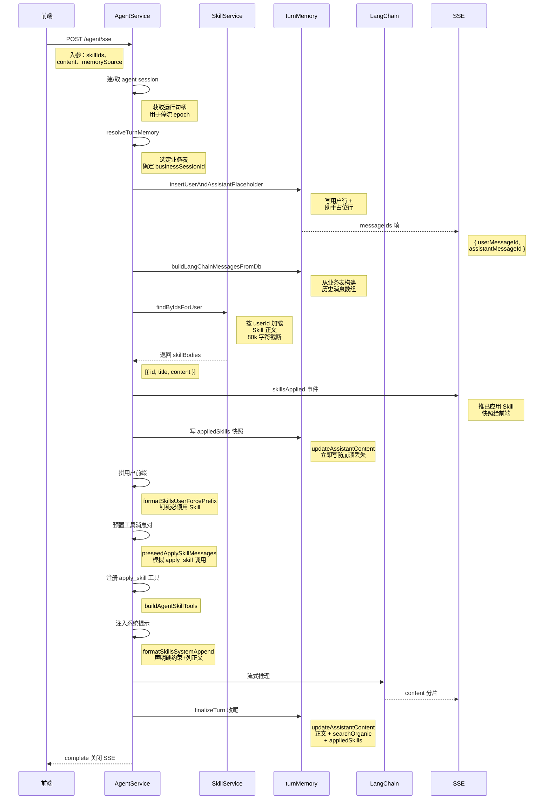
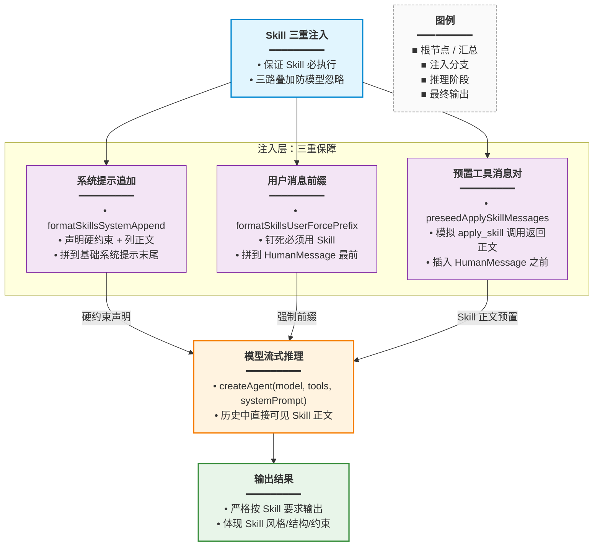

# Agent Skill 强制加载与 SSE

## 一、功能概述

用户在知识库助手或 Skill 试跑时可指定一组 Skill（Prompt 指令包），Agent 会把这些 Skill 正文作为**硬约束**注入本轮模型输入，确保模型严格按 Skill 要求回答。同时通过 SSE `skillsApplied` 事件把已加载的 Skill 推给前端展示。

## 二、实现方案

Skill 强制加载通过三重注入保证「必执行」：

1. **系统提示追加**（`formatSkillsSystemAppend`）：把 Skill 标题 + 正文拼到系统提示末尾，声明为硬约束。
2. **用户消息前缀**（`formatSkillsUserForcePrefix`）：在本轮 HumanMessage 前再加一段「强制按 Skill 执行」的钉死语。
3. **预置 apply_skill 工具消息**（`preseedApplySkillMessages`）：在 LangChain 历史中插入 `AIMessage(tool_calls)` + `ToolMessage`，模拟模型已主动调用 `apply_skill` 工具并拿到 Skill 正文，使模型在推理时能直接看到 Skill 内容。

此外新增 `apply_skill` 动态工具（`buildAgentSkillTools`），允许模型在推理过程中重读已加载的 Skill。

## 三、改动点明细

### 1. `apps/backend/src/services/agent/agent-skill-tools.ts`（新增）

#### 改动原因
集中管理 Skill 相关的工具构建、消息预置、提示拼接逻辑，与 AgentService 主体解耦。

#### 改动前
无此文件。

#### 改动后
```ts
// 从 langchain 核心消息模块导入 AIMessage 和 ToolMessage 类型，
// AIMessage 用于构造带 tool_calls 的「模型消息」，ToolMessage 用于构造「工具返回消息」，
// 二者配合预置 apply_skill 工具调用对，让模型在历史中直接看到 Skill 正文。
import { AIMessage, ToolMessage } from '@langchain/core/messages';
// 从 langchain 核心工具模块导入 DynamicTool，用于在运行时动态构建 apply_skill 工具实例，
// 使工具列表随本轮加载的 Skill 动态变化。
import { DynamicTool } from '@langchain/core/tools';
// 从 Node 内置 crypto 模块导入 randomUUID，用于生成全局唯一的 tool_call_id，
// 保证每条预置工具调用消息都有独立标识，避免 LangChain 消息校验失败。
import { randomUUID } from 'node:crypto';
// 以类型方式导入 SkillBody（Skill 正文结构：id + title + content），
// 仅用于类型标注，编译后不会产生运行时依赖。
import type { SkillBody } from '../skill/skill.service';

/**
 * 将单个 Skill 格式化为 Markdown 文本，
 * 同时用于工具返回值（apply_skill 调用结果）和系统提示中的 Skill 正文拼接。
 * skill: 要格式化的 Skill 对象，包含 id、title、content。
 * 返回：形如 "### Skill: {标题}\n{正文}" 的 Markdown 字符串。
 */
export function formatSkillToolResult(skill: SkillBody): string {
	// 用三级标题标明 Skill 名称，换行后拼接 Skill 正文内容，
	// 采用 Markdown 格式方便模型识别 Skill 边界。
	return `### Skill: ${skill.title}\n${skill.content}`;
}

/**
 * 构建本轮可用的 apply_skill 动态工具列表，
 * 仅允许对本轮已加载的 Skill ID 调用，返回对应 Skill 正文。
 * skills: 本轮已加载的 Skill 数组；
 * 返回 DynamicTool 数组，无 Skill 时返回空数组。
 */
export function buildAgentSkillTools(skills: SkillBody[]): DynamicTool[] {
	// 若本轮没有加载任何 Skill，则不注册 apply_skill 工具，
	// 避免模型调用不存在的工具导致异常。
	if (!skills.length) return [];
	// 用 skill.id 做键、Skill 对象做值构造 Map，
	// 工具被调用时可通过 id 快速 O(1) 查找对应的 Skill 正文。
	const byId = new Map(skills.map((s) => [s.id, s]));
	// 把所有 Skill 拼成 "- {id}: {title}" 的目录列表，
	// 写入工具描述，让模型知道本轮有哪些 Skill 可调用。
	const catalog = skills.map((s) => `- ${s.id}: ${s.title}`).join('\n');
	// 返回只含一个 apply_skill 工具的数组。
	return [
		// 用 DynamicTool 实例化 apply_skill 工具。
		new DynamicTool({
			// 工具名称，模型通过该名称发起工具调用，必须与预置消息中的 name 一致。
			name: 'apply_skill',
			// 工具描述：说明用途，并列出本轮可用 Skill 目录，
			// 同时告知模型系统已预置加载，通常无需再调用，仅在需要重读时调用。
			description:
				// 描述第一段：说明工具用途是应用本轮已启用的 Skill 指令正文。
				'应用本轮已启用的 Skill 指令正文。' +
				// 描述第二段：列出本轮可用 Skill 目录（id: title 列表）。
				`本轮可用 Skill：\n${catalog}\n` +
				// 描述第三段：说明入参格式，并告知系统已预置加载通常无需再调。
				'入参为 skill id（UUID）。系统已预置加载时通常无需再调；若需重读可再调。',
			// 工具执行函数，入参 input 为模型传入的 skill id（可能是纯 id 或 JSON 包裹）。
			func: async (input: string) => {
				// 将入参转为字符串并去除首尾空格，得到候选 skill id。
				let id = String(input ?? '').trim();
				// 进入 try 块，尝试将 id 作为 JSON 解析。
				try {
					// 尝试把 id 当 JSON 解析，兼容模型传入 {input: "..."} 或 {id: "..."} 的情况。
					const parsed = JSON.parse(id) as { input?: string; id?: string };
					// 从解析结果中提取真正的 skill id，优先取 input 字段，其次 id 字段，
					// 都没有则回退到原字符串。
					id = String(parsed.input ?? parsed.id ?? id).trim();
				// JSON 解析失败时进入 catch 块，说明 id 是纯字符串。
				} catch {
					// JSON 解析失败说明是纯 id 字符串，无需额外处理。
					/* plain id */
				}
				// 从 byId Map 中查找对应 Skill，只允许调用本轮已加载的 Skill。
				const skill = byId.get(id);
				// 若未找到对应 Skill，返回错误提示，告知模型该 id 不在本轮启用集合中。
				if (!skill) {
					// 返回错误信息，说明该 skill id 不在本轮已启用集合中。
					return `错误：skill id 不在本轮已启用集合中：${id}`;
				}
				// 找到 Skill 后，格式化为 Markdown 文本返回给模型。
				return formatSkillToolResult(skill);
			// 闭合 func 箭头函数。
			},
		// 闭合 DynamicTool 构造函数调用。
		}),
	// 闭合 return 数组。
	];
}

/**
 * 为每个已加载 Skill 预置一对「AI 工具调用消息 + 工具返回消息」，
 * 模拟模型已主动调用 apply_skill 并拿到 Skill 正文，
 * 从而保证指定 Skill 必被模型看到。
 * skills: 本轮已加载的 Skill 数组；
 * 返回 AIMessage 与 ToolMessage 交替组成的消息数组。
 */
export function preseedApplySkillMessages(
	// skills 参数：本轮已加载的 Skill 数组。
	skills: SkillBody[],
// 参数列表结束，返回 AIMessage 与 ToolMessage 的联合数组。
): Array<AIMessage | ToolMessage> {
	// 初始化结果数组，用于存放预置的消息对。
	const out: Array<AIMessage | ToolMessage> = [];
	// 遍历每个已加载 Skill，为其构造一对工具调用 + 工具返回消息。
	for (const skill of skills) {
		// 用 randomUUID 生成唯一 tool_call_id，前缀 skill_preseed_ 便于调试区分，
		// 该 id 用于关联 AIMessage 的 tool_calls 与 ToolMessage 的 tool_call_id。
		const toolCallId = `skill_preseed_${randomUUID()}`;
		// 构造 AIMessage，模拟模型主动发起 apply_skill 工具调用。
		out.push(
			// content 置空，因为该消息仅表达工具调用意图，无文本输出。
			new AIMessage({
				// content 置空：该消息仅表达工具调用意图，无文本输出。
				content: '',
				// tool_calls 数组中声明本次工具调用：id、工具名、入参。
				tool_calls: [
					{
						// 工具调用 id，与后续 ToolMessage 的 tool_call_id 对应。
						id: toolCallId,
						// 调用的工具名称，必须为 apply_skill。
						name: 'apply_skill',
						// 工具入参，传入当前 Skill 的 id。
						args: { input: skill.id },
					// 闭合 tool_calls 数组中的单个调用对象。
					},
				// 闭合 tool_calls 数组。
				],
			// 闭合 AIMessage 构造函数调用。
			}),
		// 闭合 out.push 调用。
		);
		// 构造 ToolMessage，模拟 apply_skill 工具返回 Skill 正文。
		out.push(
			// tool_call_id 与上面 AIMessage 的工具调用 id 对应，
			// LangChain 据此将工具返回与工具调用配对。
			new ToolMessage({
				// tool_call_id 与上面 AIMessage 的工具调用 id 对应，LangChain 据此配对。
				tool_call_id: toolCallId,
				// 工具返回内容为 Skill 的 Markdown 格式化正文。
				content: formatSkillToolResult(skill),
				// 工具名称，与调用时一致。
				name: 'apply_skill',
			// 闭合 ToolMessage 构造函数调用。
			}),
		// 闭合 out.push 调用。
		);
	}
	// 返回所有预置的消息对数组。
	return out;
}

/**
 * 生成系统提示追加文本，声明 Skill 为硬约束并列出所有 Skill 正文，
 * 拼到基础系统提示末尾，强制模型遵守 Skill。
 * skills: 本轮已加载的 Skill 数组；
 * 返回追加到系统提示的字符串，无 Skill 时返回空串。
 */
export function formatSkillsSystemAppend(skills: SkillBody[]): string {
	// 没有 Skill 时直接返回空串，不追加任何内容。
	if (!skills.length) return '';
	// 把所有 Skill 标题用「、」拼接成一行，方便在硬约束声明中展示已启用列表。
	const titles = skills.map((s) => s.title).join('、');
	// 把所有 Skill 正文格式化为 Markdown 片段，并用空行分隔，
	// 形成完整的 Skill 正文合集。
	const bodies = skills
		// map 每个 Skill 为 "### Skill: {标题}\n{正文}" 的 Markdown 片段。
		.map((s) => `### Skill: ${s.title}\n${s.content}`)
		// 用双换行 join 所有片段，形成完整的 Skill 正文合集。
		.join('\n\n');
	// 返回完整的系统提示追加段：声明硬约束 + 冲突处理规则 + 所有 Skill 正文。
	return (
		// 开头换行，与原系统提示分隔；列出已启用 Skill 标题。
		`\n\n【本轮强制 Skills — 必须执行】已启用：${titles}\n` +
		// 声明 Skill 正文为硬约束，用户的润色/总结/扩写/闲聊等表述若与 Skill 冲突，
		// 一律以 Skill 为准。
		'下列 Skill 正文为硬约束：润色、总结、扩写、闲聊等用户表述若与 Skill 冲突，一律以 Skill 为准；' +
		// 禁止模型忽略 Skill 改用普通文风或通用模板。
		'禁止忽略 Skill 改用普通文风或通用模板。\n\n' +
		// 最后追加所有 Skill 的正文合集。
		`${bodies}\n`
	// 闭合 return 的括号表达式。
	);
}

/**
 * 生成用户消息强制前缀文本，再次钉死「必须用 Skill」，
 * 拼接到本轮 HumanMessage 内容最前面。
 * skills: 本轮已加载的 Skill 数组；
 * 返回前缀字符串，无 Skill 时返回空串。
 */
export function formatSkillsUserForcePrefix(skills: SkillBody[]): string {
	// 没有 Skill 时直接返回空串，不加前缀。
	if (!skills.length) return '';
	// 把每个 Skill 标题用「」包裹，再用「、」拼接，
	// 让模型明确知道本轮必须执行哪些 Skill。
	const titles = skills.map((s) => `「${s.title}」`).join('、');
	// 返回强制前缀文本，要求模型严格执行已启用 Skill，
	// 并在输出中体现 Skill 要求的风格、结构与约束。
	return (
		// 第一行：声明本轮必须严格执行已启用 Skill，并列出 Skill 标题。
		`【强制】本轮必须严格执行已启用 Skill：${titles}。` +
		// 第二行：要求输出体现 Skill 的风格、结构与约束，禁止输出无关改写。
		'完成用户任务时须体现 Skill 要求的风格、结构与约束；不得输出与 Skill 无关的普通改写。\n\n'
	// 闭合 return 的括号表达式。
	);
}
```

#### 改动说明
四个函数分工明确：
- `buildAgentSkillTools`：注册 `apply_skill` 工具，供模型重读 Skill。
- `preseedApplySkillMessages`：预置工具调用对，让模型在历史中直接看到 Skill 正文。
- `formatSkillsSystemAppend`：系统提示硬约束声明。
- `formatSkillsUserForcePrefix`：用户消息前缀钉死。

三重注入确保模型不会忽略 Skill。

---

### 2. `apps/backend/src/services/agent/agent.service.ts` — Skill 加载逻辑（修改）

#### 改动原因
在 `runChatStream` 中加入 Skill 加载、SSE 推送、预置消息、系统提示注入的完整流程。

#### 改动前
无 Skill 相关逻辑，工具集只有 `buildAgentLangChainTools`。

#### 改动后
```ts
// （4）构建 langchain message 历史之后

// 按本轮请求传入的 skillIds 从数据库加载当前用户的 Skill 正文，
// findByIdsForUser 内部会对 Skill 正文做 80k 字符截断，避免超长内容撑爆模型上下文。
const skillBodies = await this.skillService.findByIdsForUser(
	// 本轮请求中指定的 Skill id 列表。
	dto.skillIds,
	// 当前用户 id，仅加载属于该用户的 Skill，防止越权。
	userId,
// 闭合 findByIdsForUser 调用。
);
// 若本轮加载到了 Skill，则执行强制加载流程。
if (skillBodies.length) {
	// 把 Skill 正文精简为 { id, title } 快照，保存到 turnAppliedSkills，
	// 用于后续 SSE 推送和数据库 applied_skills 列写入。
	turnAppliedSkills = skillBodies.map((s) => ({
		// 保留 Skill id，前端可据此回查或高亮。
		id: s.id,
		// 保留 Skill 标题，前端用于展示已应用 Skill 名称。
		title: s.title,
	// 闭合 map 回调返回的对象字面量。
	}));
	// 通过 SSE 向订阅者推送 skillsApplied 事件，
	// 让前端实时展示「已应用 Skill」列表。
	subscriber.next({
		// 事件类型标识为 skillsApplied，前端据此路由处理。
		type: 'skillsApplied',
		// 事件数据体，包含本轮应用的 Skill 快照数组。
		data: {
			// skills 字段：本轮已应用的 Skill 快照数组。
			skills: turnAppliedSkills,
		// 闭合 data 对象。
		},
	// 闭合 subscriber.next 调用。
	});

	// 立刻把 Skill 快照写入助手占位行的 applied_skills 列，
	// 不等流结束就持久化，避免流中崩溃导致 Skill 快照丢失。
	// 第三个参数传空串 ''：保持正文为空，只更新元数据字段。
	await turnMemory.updateAssistantContent(
		// 业务会话 id，定位要更新的会话记录。
		businessSessionId,
		// 助手消息 id，定位占位行。
		assistantMessageId,
		// 正文传空串，不改变占位行正文。
		'',
		// 元数据中写入 appliedSkills 快照。
		{ appliedSkills: turnAppliedSkills },
	// 闭合 updateAssistantContent 调用。
	);

	// 生成「强制按 Skill 执行」的前缀文本，准备拼到本轮用户消息最前面。
	const force = formatSkillsUserForcePrefix(skillBodies);
	// 若前缀非空，则在最后一条 HumanMessage 前加上该前缀。
	if (force) {
		// 从消息数组末尾向前遍历，找到最后一条 HumanMessage。
		for (let i = lcMessages.length - 1; i >= 0; i -= 1) {
			// 取出当前位置的消息对象。
			const msg = lcMessages[i];
			// 若不是 HumanMessage 则跳过，继续向前找。
			if (!(msg instanceof HumanMessage)) continue;
			// 取出 HumanMessage 的 content 字段。
			const c = msg.content;
			// 兼容 LangChain content 的三种形态：string、分段数组、对象，
			// 统一抽取为纯文本字符串。
			const plain =
				// 若 content 是字符串，直接使用。
				typeof c === 'string'
					? c
					// 若 content 是数组（多模态分段），逐个取 text 字段拼接。
					: Array.isArray(c)
						? (c as { text?: string }[])
								// map 遍历每个分段，提取 text 字段（非字符串则取空串）。
								.map((p) => (typeof p?.text === 'string' ? p.text : ''))
								// 用空串 join 所有分段文本，还原为完整纯文本。
								.join('')
						// 否则强制转字符串兜底。
						: String(c ?? '');
			// 用「强制前缀 + 原文本」构造新的 HumanMessage，替换原数组位置。
			lcMessages[i] = new HumanMessage(`${force}${plain}`);
			// 只处理最后一条 HumanMessage，找到后立即跳出循环。
			break;
		}
	}

	// 为每个已加载 Skill 预置 apply_skill 工具调用消息对。
	const preseed = preseedApplySkillMessages(skillBodies);
	// 默认插入位置为数组末尾，若找不到 HumanMessage 则插到末尾。
	let insertAt = lcMessages.length;
	// 从末尾向前遍历，定位最后一条 HumanMessage 的下标。
	for (let i = lcMessages.length - 1; i >= 0; i -= 1) {
		// 找到 HumanMessage 时记录其下标并跳出。
		if (lcMessages[i] instanceof HumanMessage) {
			// 记录最后一条 HumanMessage 的下标作为插入位置。
			insertAt = i;
			// 已找到目标，立即跳出循环。
			break;
		}
	}
	// 在最后一条 HumanMessage 之前插入所有预置消息对，
	// 保证模型先看到 Skill 正文再处理用户问题。
	lcMessages.splice(insertAt, 0, ...preseed);
}

// （7）拼装工具集：原有业务工具 + apply_skill 动态工具
const tools = [
	// 展开原有 LangChain 工具数组（注释中省略具体参数）。
	...buildAgentLangChainTools(/* ... */),
	// 追加本轮 apply_skill 工具，让模型可在推理中重读 Skill。
	...buildAgentSkillTools(skillBodies),
// 闭合 tools 数组。
];

// （8）创建 Agent 实例，系统提示追加 Skill 硬约束
const agent = createAgent({
	// 使用主 LLM 模型作为推理引擎。
	model: mainLlm,
	// 传入拼装好的工具集。
	tools,
	// 解析最终系统提示，把 Skill 硬约束追加到基础系统提示末尾。
	systemPrompt: resolveAgentSystemPrompt(
		// 本轮请求 DTO，用于判断 assistMode 等。
		dto,
		// 生成 Skill 硬约束追加文本并传入。
		formatSkillsSystemAppend(skillBodies),
	// 闭合 resolveAgentSystemPrompt 调用。
	),
	// ... 其余配置（回调、重试等）省略
// 闭合 createAgent 调用。
});
```

#### 改动说明
Skill 加载流程：
1. `findByIdsForUser` 加载 Skill 正文。
2. SSE 推送 `skillsApplied`，前端展示已应用 Skill。
3. 立即把 Skill 快照写入 `applied_skills` 列（不等流结束，避免流中崩溃丢快照）。
4. 用户消息前加 `force` 前缀。
5. 在最后一条 HumanMessage 前插入预置 `apply_skill` 消息对。
6. 工具集加入 `apply_skill` 工具。
7. 系统提示追加 Skill 硬约束声明。

---

### 3. `apps/backend/src/services/agent/agent.service.ts` — SSE error 兜底（修改）

#### 改动原因
Nest SSE 中途 `subscriber.error` 常导致浏览器只看到流结束、正文空白，改为 `next({ type: 'error' })` + `complete`。

#### 改动前
```ts
// chatStream 方法：对外暴露 SSE 流式聊天接口，返回 Observable 供 Nest SSE 订阅。
chatStream(userId: number, dto: AgentChatDto): Observable<AgentSseChunk> {
	// 创建并返回一个 Observable，订阅时立即执行内部逻辑。
	return new Observable<AgentSseChunk>((subscriber) => {
		// 调用核心流式处理方法 runChatStream，异常时直接走 subscriber.error。
		void this.runChatStream(subscriber, userId, dto).catch((e) =>
			// 直接把异常通过 subscriber.error 抛出（改动前的做法，后续会优化）。
			subscriber.error(e),
		// 闭合 catch 回调。
		);
	// 闭合 Observable 构造函数。
	});
// 闭合 chatStream 方法。
}
```

#### 改动后
```ts
// chatStream 方法：对外暴露 SSE 流式聊天接口，返回 Observable 供 Nest SSE 订阅。
chatStream(userId: number, dto: AgentChatDto): Observable<AgentSseChunk> {
	// 创建并返回一个 Observable，订阅时立即执行内部逻辑。
	return new Observable<AgentSseChunk>((subscriber) => {
		// 调用核心流式处理方法 runChatStream，异常时进入 catch 兜底。
		void this.runChatStream(subscriber, userId, dto).catch((e) => {
			// 兜底逻辑：若 runChatStream 内部未正常收口（如未发 error 帧），
			// 仍通过 next(error)+complete 推送错误，避免 Nest SSE 中途丢错导致浏览器只看到流结束、正文空白。
			// 若订阅者已关闭则直接返回，避免向已关闭的流写入。
			if (subscriber.closed) return;
			// 推送 type 为 error 的 SSE 帧，data 为格式化后的错误信息。
			subscriber.next({
				// 事件类型标识为 error，前端据此展示错误提示。
				type: 'error',
				// 用 formatAgentStreamError 从异常中提取可读文案（含 429 限流、嵌套 message 等）。
				data: formatAgentStreamError(e),
			// 闭合 subscriber.next 调用。
			});
			// 推送错误后立即完成流，关闭 SSE 连接。
			subscriber.complete();
		// 闭合 catch 回调。
		});
	// 闭合 Observable 构造函数。
	});
// 闭合 chatStream 方法。
}
```

`runChatStream` 的 catch 也改为 `next(error)`：
```ts
// 捕获 runChatStream 执行过程中的所有异常，统一收口处理。
} catch (err: unknown) {
	// 判断异常是否为用户主动中断（如前端取消请求）。
	const aborted = this.isUserAbortError(err);
	// 若非用户主动中断，则记录错误日志，便于排查问题。
	if (!aborted) {
		// 调用 logger.error 记录失败日志，?. 防止 logger 未初始化时报错。
		this.logger.error?.('[AgentService] chatStream failed', err);
	}
	// 执行失败清理逻辑，如回滚占位行、释放锁等。
	await cleanupTurnOnFailure();
	// 若是用户主动中断，直接完成流，不推送错误帧。
	if (aborted) {
		// 正常关闭 SSE 流。
		subscriber.complete();
	// 否则进入异常处理分支，推送 error 帧。
	} else {
		// 用 error 帧而非 subscriber.error：否则 Nest SSE 中途 error 常丢帧，
		// 浏览器常只看到流结束、正文空白。
		subscriber.next({
			// 事件类型标识为 error。
			type: 'error',
			// 格式化异常为可读文案后推送。
			data: formatAgentStreamError(err),
		// 闭合 subscriber.next 调用。
		});
		// 推送错误后关闭流。
		subscriber.complete();
	}
// 闭合 catch 块。
}
```

#### 改动说明
SSE 错误统一用 `type: 'error'` 帧推送，`formatAgentStreamError` 从异常中提取可读文案（含 429 限流、嵌套 message 等），最后 `complete` 关闭流。

---

### 4. `apps/backend/src/services/agent/agent.controller.ts`（修改）

#### 改动原因
控制器需要把 `skillsApplied` 和 `error` 帧映射到 SSE 输出格式。

#### 改动前
```ts
// 只处理 content / searchOrganic / tool / messageIds 帧
```

#### 改动后
```ts
// 在 SSE 帧映射逻辑中新增 error 帧处理分支。
if (chunk.type === 'error') {
	// 错误帧映射为带 error 字段和 done:true 的输出对象。
	return {
		// data 字段承载 SSE 帧的实际数据内容。
		data: {
			// 把错误信息原样放入 error 字段。
			error: chunk.data,
			// done 为 true 表示流已结束，前端收到后关闭连接。
			done: true,
		// 闭合 data 对象。
		},
	// 闭合 return 对象。
	};
// 闭合 if 块。
}
// ... 省略其它帧类型处理（content / searchOrganic / tool / messageIds）

// 新增 skillsApplied 帧处理分支，用于透传已应用 Skill 列表。
if (chunk.type === 'skillsApplied') {
	// skillsApplied 帧映射为带 type、skills、done:false 的输出对象。
	return {
		// data 字段承载 SSE 帧的实际数据内容。
		data: {
			// 透传事件类型，前端据此区分帧种类。
			type: 'skillsApplied',
			// 透传已应用的 Skill 数组。
			skills: chunk.data.skills,
			// done 为 false 表示流尚未结束，后续还有内容。
			done: false,
		// 闭合 data 对象。
		},
	// 闭合 return 对象。
	};
// 闭合 if 块。
}

// RxJS catchError 操作符：捕获上游异常并转换为错误帧输出，
// 同样使用 formatAgentStreamError 格式化异常信息。
catchError((error: unknown) =>
	// of 创建一个只发出单个值的 Observable。
	of({
		// data 字段承载 SSE 帧的实际数据内容。
		data: {
			// 把格式化后的错误信息放入 error 字段。
			error: formatAgentStreamError(error),
			// done 为 true 表示流结束。
			done: true,
		// 闭合 data 对象。
		},
	// 闭合 of 调用。
	}),
// 闭合 catchError 调用。
),
```

同时新增 `POST /agent/session/title` 接口更新会话标题：
```ts
// 声明 POST 路由，路径为 session/title，用于更新 Agent 会话标题。
@Post('session/title')
// updateSessionTitle 控制器方法，异步处理更新会话标题请求。
async updateSessionTitle(
	// 从请求对象注入 req，类型为 AuthedRequest（已认证请求）。
	@Req() req: AuthedRequest,
	// 从请求体注入 DTO，自动校验 sessionId 和 title 字段。
	@Body() dto: UpdateAgentSessionTitleDto,
// 参数列表结束，方法体开始。
) {
	// 从认证上下文中取出当前用户 id。
	const userId = req.user?.userId;
	// 若用户 id 为空，说明未登录，返回失败响应。
	if (userId == null) {
		// 返回未登录的失败结果。
		return { success: false, message: '未登录' };
	}
	// 调用 agentService 的 updateSessionTitle 方法更新会话标题。
	const data = await this.agentService.updateSessionTitle(
		// 当前用户 id，用于权限校验。
		userId,
		// 要更新的会话 id。
		dto.sessionId,
		// 新的会话标题。
		dto.title,
	// 闭合 updateSessionTitle 调用。
	);
	// 返回成功响应，附带更新结果数据。
	return { success: true, data };
// 闭合 updateSessionTitle 方法。
}
```

#### 改动说明
控制器把 `skillsApplied` 帧的 `skills` 数组原样透传给前端，`error` 帧带 `done: true` 让前端知道流结束。

---

### 5. `apps/backend/src/services/agent/dto/update-agent-session-title.dto.ts`（新增）

#### 改动原因
新增更新会话标题的 DTO。

#### 改动前
无。

#### 改动后
```ts
// 从 class-validator 导入装饰器，IsString 校验字符串类型，
// IsNotEmpty 校验非空，MaxLength 校验最大长度。
import { IsNotEmpty, IsString, MaxLength } from 'class-validator';

// 定义更新 Agent 会话标题的请求 DTO 类，Nest 会自动用 class-validator 校验请求体。
export class UpdateAgentSessionTitleDto {
	// 会话 id 字段：要更新标题的目标会话标识。
	// @IsString 装饰器：校验 sessionId 必须为字符串类型。
	@IsString()
	// @IsNotEmpty 装饰器：校验 sessionId 不能为空字符串或 null/undefined。
	@IsNotEmpty()
	// 非空断言：告诉 TS 该字段会在运行时由框架注入，无需手动初始化。
	sessionId!: string;

	// 标题字段：新的会话标题，最长 255 字符。
	// @IsString 装饰器：校验 title 必须为字符串类型。
	@IsString()
	// @IsNotEmpty 装饰器：校验 title 不能为空。
	@IsNotEmpty()
	// @MaxLength(255) 装饰器：校验 title 长度不超过 255 字符。
	@MaxLength(255)
	// 非空断言：运行时由框架注入。
	title!: string;
}
```

#### 改动说明
`updateSessionTitle` 同时更新 `agent_sessions` 和 `english_agent_sessions` 的标题。

---

### 6. `apps/backend/src/services/agent/agent.service.ts` — resolveAgentSystemPrompt 新增 skill_generate 模式（修改）

#### 改动原因
Skill 「生成」模式需要专门的系统提示，引导模型输出可写入 Monaco 的 Skill 正文格式。

#### 改动前
```ts
// 只有 DEFAULT + ENGLISH_LEARNING 两种系统提示
```

#### 改动后
```ts
/**
 * Skill 页「生成」模式专用的系统提示追加文本，
 * 引导模型输出可直接写入 Monaco 编辑器的 Skill 正文格式。
 */
const SKILL_GENERATE_SYSTEM_APPEND = `【Skill / Prompt 撰写专项】
你协助用户撰写可保存的 Skill（给 AI 执行的指令文档），不是闲聊助手。
1）输出格式（必须遵守，便于一键写入编辑器）：
   - 第一行：Markdown 一级标题，即 Skill 标题（例：# 代码审查助手）
   - 其后：Skill 指令正文（Markdown），具体可执行：目标、步骤、约束、输入输出格式、边界
2）不要只给空泛建议或询问清单而不给正文；用户若只说了方向，直接起草完整 Skill。
3）若用户附带了现有草稿，在其基础上改写/补全，保留合理部分。
4）非必要勿调用工具；需要公开资料时可适度搜索。
5）拒绝违法违规用途的 Skill。`;

/**
 * 根据请求 DTO 解析最终系统提示，
 * 支持 DEFAULT、english_learning、skill_generate 三种模式，
 * 并可选追加 Skill 硬约束文本。
 * dto: 本轮聊天请求 DTO，包含 assistMode 等字段；
 * skillAppend: 可选的 Skill 硬约束追加文本，默认为空串。
 */
function resolveAgentSystemPrompt(dto: AgentChatDto, skillAppend = ''): string {
	// 默认使用通用 Agent 系统提示作为基础。
	let base = DEFAULT_AGENT_SYSTEM_PROMPT;
	// 若为英语学习模式，在基础提示后追加英语学习专项提示。
	if (dto.assistMode === 'english_learning') {
		// 在基础系统提示后拼接英语学习专项追加文本。
		base = `${base}\n\n${ENGLISH_LEARNING_SYSTEM_APPEND}`;
	// 否则若为 Skill 生成模式，追加 Skill 撰写专项提示。
	} else if (dto.assistMode === 'skill_generate') {
		// 在基础系统提示后拼接 Skill 生成专项追加文本。
		base = `${base}\n\n${SKILL_GENERATE_SYSTEM_APPEND}`;
	}
	// 若有 Skill 追加文本则拼接到末尾，否则直接返回基础提示。
	return skillAppend ? `${base}${skillAppend}` : base;
// 闭合 resolveAgentSystemPrompt 函数。
}
```

#### 改动说明
`skill_generate` 模式要求模型第一行输出 `# 标题`，其后是 Skill 正文，方便前端 `parseSkillDraft` 解析后写入 Monaco 编辑器。

## 四、功能实现逻辑

### Skill 强制加载时序



#### 三重注入总结



### appliedSkills 双写策略

为什么在流开始时就写一次 `appliedSkills`，流结束时再写一次？

- 流开始时：占位行 content 为空，只写 `appliedSkills`。前端已通过 SSE 展示已应用 Skill，若进程在流中崩溃，刷新后仍能从库中回读 Skill 快照。
- 流结束时：`finalizeTurn` 带完整正文 + 同一 `appliedSkills` 快照更新同一行。`AssistantTableMemory` 只在 `appliedSkills.length > 0` 时写列，不会被 null 清掉。

```mermaid
flowchart LR
    A["<b>流开始</b><br/>━━━━━━━━━<br/>• 占位行 content = ''<br/>• 仅写 appliedSkills 快照<br/>• 不等流结束，立即持久化"]:::start
    B["<b>updateAssistantContent</b><br/>━━━━━━━━━<br/>• content = '' 占位<br/>• appliedSkills = 快照<br/>• 防崩溃丢失"]:::write
    C["<b>流式推理中</b><br/>━━━━━━━━━<br/>• 若进程崩溃<br/>• 刷新后仍可从库回读 Skill 快照"]:::mid
    D["<b>流结束 finalizeTurn</b><br/>━━━━━━━━━<br/>• 带完整正文<br/>• 同一 appliedSkills 快照"]:::end
    E["<b>updateAssistantContent</b><br/>━━━━━━━━━<br/>• content = 完整正文<br/>• appliedSkills = 同一份快照"]:::write
    F["<b>AssistantTableMemory 写库</b><br/>━━━━━━━━━<br/>• 仅 appliedSkills.length > 0 时写列<br/>• 不会被 null 清掉"]:::db

    A -->|立即写快照| B
    B -->|持久化成功| C
    C -->|正常完成| D
    D -->|带正文 + 同快照| E
    E -->|写库| F
    C -.->|崩溃兜底<br/>刷新回读| B

    LEGEND["<b>图例</b><br/>━━━━━━━━━<br/>■ 时间起点<br/>■ 写库操作<br/>■ 推理中间态<br/>■ 时间终点<br/>■ 最终持久化"]:::legend

    classDef start fill:#e1f5fe,stroke:#0288d1,stroke-width:2px
    classDef write fill:#f3e5f5,stroke:#7b1fa2,stroke-width:1px
    classDef mid fill:#fff3e0,stroke:#f57c00,stroke-width:2px
    classDef end fill:#e8f5e9,stroke:#388e3c,stroke-width:2px
    classDef db fill:#fce4ec,stroke:#c2185b,stroke-width:1px
    classDef legend fill:#fafafa,stroke:#9e9e9e,stroke-width:1px,stroke-dasharray:4 2
```

## 五、注意事项 / 风险点

1. **预置消息位置**：`preseedApplySkillMessages` 插入在最后一条 HumanMessage 之前，确保模型看到 Skill 正文后再处理用户问题。
2. **appliedSkills 不落 agent/english/skill_try 表**：只有 `AssistantTableMemory` 会写 `appliedSkills`，其它实现忽略该字段。
3. **SSE error 不用 subscriber.error**：Nest SSE 中途 error 常丢帧，统一用 `next({ type: 'error' })` + `complete`。
4. **skill_generate 输出格式**：模型必须第一行输出 `# 标题`，前端 `parseSkillDraft` 据此拆分标题和正文。
5. **Skill 正文 80k 上限**：`findByIdsForUser` 截断后，超出的 Skill 不加载也不推送 `skillsApplied`。
