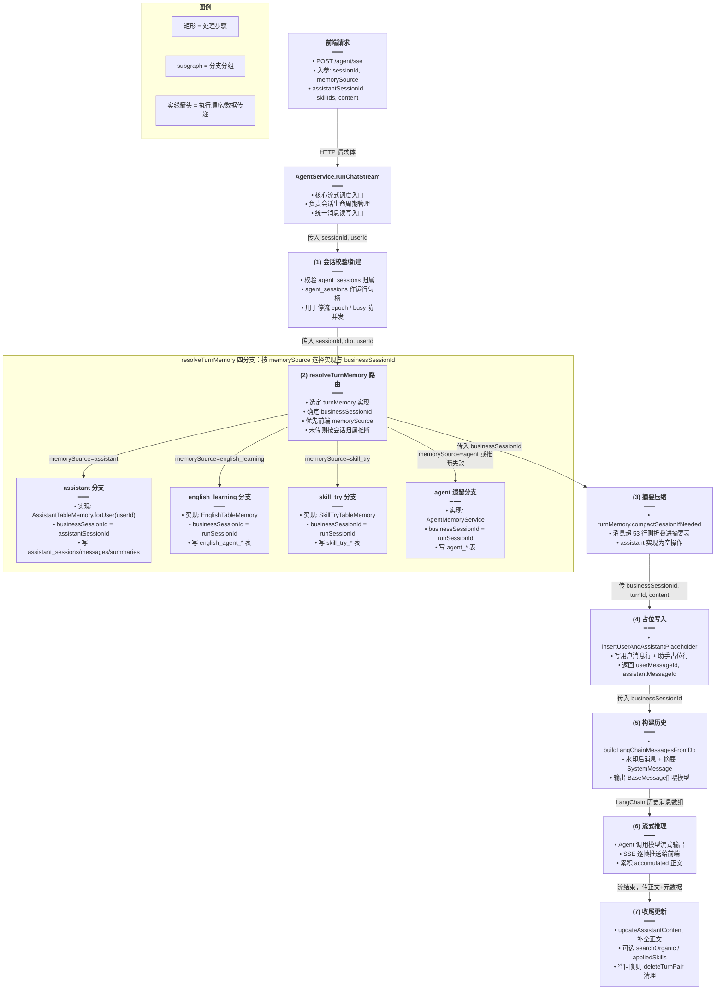
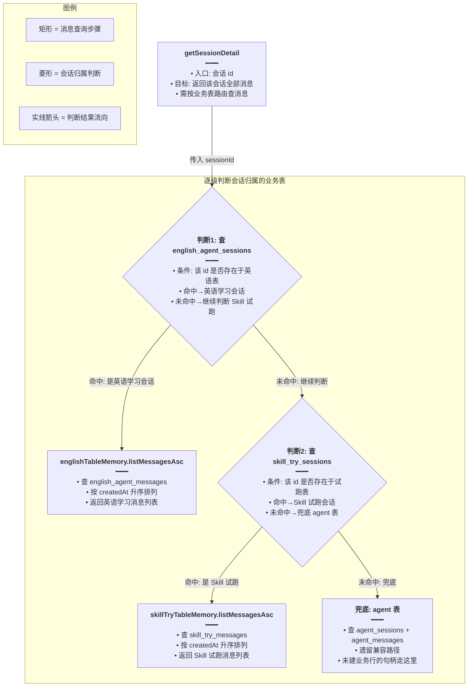
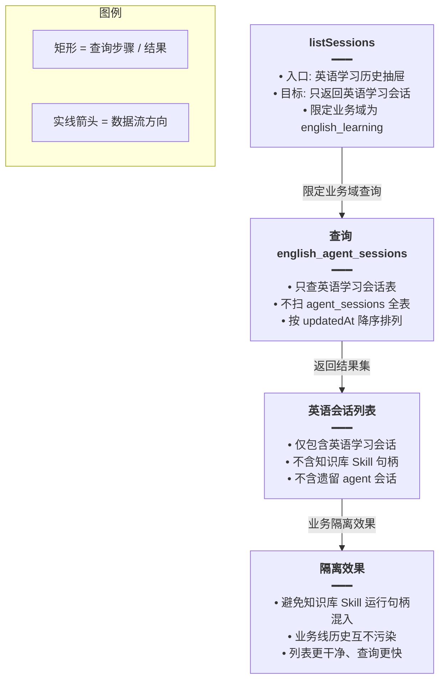
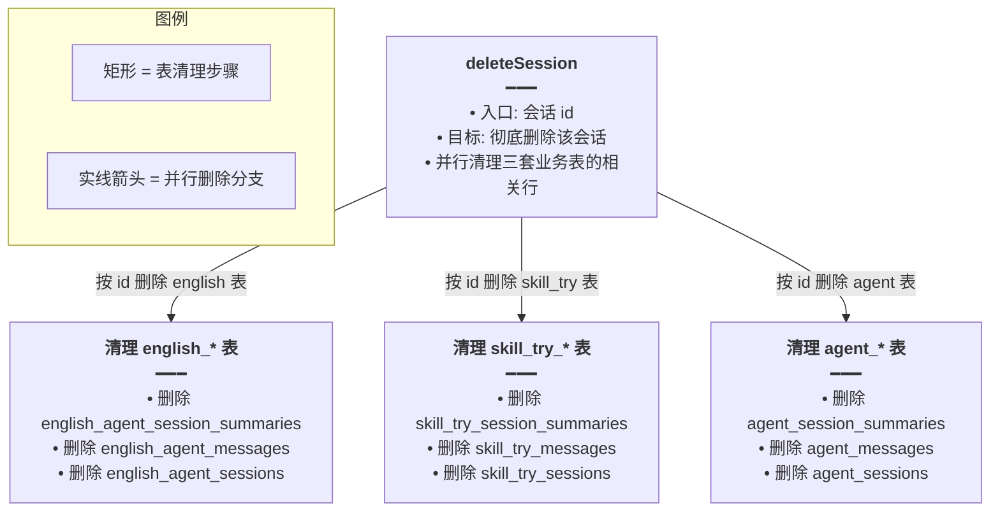

# Agent 业务消息分表方案

## 一、功能概述

本次改动将原本单一的 `agent_sessions / agent_messages` 消息存储，按业务场景拆分为四套独立的「业务消息表 + 摘要表」：

- 英语学习 → `english_agent_*`
- Skill 试跑 / 生成 → `skill_try_*`
- 知识库助手（带 Skill）→ `assistant_*`
- 遗留通用 Agent → `agent_*`（保留兼容）

目的是让不同业务线的会话互不污染：历史列表只展示本业务的会话、消息只读写本业务的表，同时复用同一套 LangChain Agent 流式推理与停流 epoch 机制。

## 二、实现方案

核心思路是引入 `AgentTurnMemory` 端口（Interface），把「一轮对话的消息读写」抽象出来，由 AgentService 在运行时根据 `memorySource`（或按会话归属推断）选择具体实现。`agent_sessions` 仍作为「运行句柄」负责停流 epoch，消息实际落在业务表。

### 整体数据流



### 分表职责对照

| memorySource | 会话表 | 消息表 | 摘要表 | 适用场景 |
|---|---|---|---|---|
| `assistant` | `assistant_sessions` | `assistant_messages` | `assistant_session_summaries` | 知识库助手（带 Skill） |
| `english_learning` | `english_agent_sessions` | `english_agent_messages` | `english_agent_session_summaries` | 英语学习 |
| `skill_try` | `skill_try_sessions` + `agent_sessions` | `skill_try_messages` | `skill_try_session_summaries` | Skill 试跑 / 生成 |
| `agent` | `agent_sessions` | `agent_messages` | `agent_session_summaries` | 遗留通用 Agent |

## 三、改动点明细

### 1. `apps/backend/src/services/agent/agent-turn-memory.ts`（新增）

#### 改动原因
把「一轮对话的消息读写」抽象成统一端口，让 AgentService 不关心消息落在哪张表，只依赖 `AgentTurnMemory` 接口。

#### 改动前
无此文件。AgentService 直接持有 `AgentMemoryService`，所有消息写入 `agent_messages`。

#### 改动后
```ts
// 从 langchain 核心包导入 BaseMessage 类型，用于后续构造模型历史消息数组
import type { BaseMessage } from '@langchain/core/messages';
// 引入联网检索条目类型 SerperOrganicItem，searchOrganic 字段的数据结构与之对齐
import type { SerperOrganicItem } from '../web-search/web-search.types';

/** 本轮强制应用的 Skill 快照类型（用于落库与 SSE 推送） */
// 定义 AppliedSkillRef 类型，只保留 id 和 title 两个字段，避免把 Skill 正文冗余存入每条消息行
export type AppliedSkillRef = { id: string; title: string };

/** updateAssistantContent 方法的可选落库字段；各 Memory 实现只读取自己需要的键 */
export type UpdateAssistantContentOpts = {
	// searchOrganic 三态：undefined 表示不改列；null 表示清空；数组表示落库（agent / english / skill_try 表有此列）
	searchOrganic?: SerperOrganicItem[] | null;
	// appliedSkills 三态：undefined 表示不改列；null 表示清空；数组表示落库（仅 assistant_* 表有此列）
	appliedSkills?: AppliedSkillRef[] | null;
};

/**
 * Agent 流式一轮对话的业务记忆端口：消息读写与 LangChain 历史构造必须同源。
 * 缺省实现写 agent_* 表；知识库 Skill 场景用 assistant_* 表（见 Agent业务消息分表方案）。
 */
export interface AgentTurnMemory {
	// compactSessionIfNeeded：长对话水印摘要压缩入口（assistant 实现可为空操作），入参为业务会话 id
	compactSessionIfNeeded(businessSessionId: string): Promise<void>;

	// insertUserAndAssistantPlaceholder：插入用户消息行 + 助手占位行，返回两条消息的 id（用于 SSE 回传前端对齐 chatId）
	insertUserAndAssistantPlaceholder(
		// businessSessionId：业务消息表的会话 id
		businessSessionId: string,
		// turnId：本轮对话的唯一标识，用于配对 user/assistant 两条消息
		turnId: string,
		// userContent：用户输入的文本内容
		userContent: string,
	// 返回用户消息 id 和助手消息 id
	): Promise<{ userMessageId: string; assistantMessageId: string }>;

	// buildLangChainMessagesFromDb：从业务表按时间升序构造 LangChain 历史消息数组（含水印摘要 SystemMessage）
	buildLangChainMessagesFromDb(
		// businessSessionId：业务会话 id
		businessSessionId: string,
	// 返回 LangChain BaseMessage 数组，直接喂给模型
	): Promise<BaseMessage[]>;

	// updateAssistantContent：流结束时补全助手正文，同时可携带 searchOrganic / appliedSkills 元数据
	updateAssistantContent(
		// businessSessionId：业务会话 id
		businessSessionId: string,
		// assistantMessageId：助手占位行的 id，定位要更新的消息行
		assistantMessageId: string,
		// content：模型流式输出拼接后的完整助手正文
		content: string,
		// opts：可选落库字段（searchOrganic / appliedSkills），各实现按需读取
		opts?: UpdateAssistantContentOpts,
	): Promise<void>;

	// deleteTurnPair：当助手回复为空时，按 turnId 删除本轮 user/assistant 两条消息
	deleteTurnPair(
		// businessSessionId：业务会话 id
		businessSessionId: string,
		// turnId：本轮对话标识，定位要删除的一对消息
		turnId: string,
	): Promise<void>;
}
```

#### 改动说明
接口把「会话占位 / 历史构建 / 正文更新 / 清理」四个动作统一签名，参数从原来的 `session: AgentSession` 实体改为 `businessSessionId: string`，这样各业务表实现不必依赖 `AgentSession` 实体。`UpdateAssistantContentOpts` 用 `undefined / null / 数组` 三态表达「不改 / 清空 / 写入」，避免不同业务表误清对方字段。

---

### 2. `apps/backend/src/services/agent/agent-memory.service.ts`（修改）

#### 改动原因
让 `AgentMemoryService` 实现 `AgentTurnMemory` 接口，成为 `memorySource=agent` 的缺省实现；同时把 `insertUserAndAssistantPlaceholder` 的入参从实体改为 `sessionId` 字符串，对齐接口签名。

#### 改动前
```ts
// 导入联网检索条目类型 SerperOrganicItem，updateAssistantContent 的 searchOrganic 参数用它
import type { SerperOrganicItem } from '../web-search/web-search.types';

// 水印之后最多保留 48 条消息行参与模型上下文（user/assistant 交错）
const MAX_TAIL_MESSAGE_ROWS = 48;
// 超过 56 行则触发「持久化摘要折叠」
const COMPACT_ROW_THRESHOLD = 56;

// AgentMemoryService 类定义，未 implements 任何接口
@Injectable()
export class AgentMemoryService {
	// ... 构造函数略

	// 插入用户和助手占位消息，入参直接传 AgentSession 实体
	async insertUserAndAssistantPlaceholder(
		session: AgentSession,
		turnId: string,
		userContent: string,
	): Promise<{ userMessageId: string; assistantMessageId: string }> {
		// 直接用 session 实体建消息，无需再查库
	}

	// 更新助手正文，searchOrganic 作为独立参数传入
	async updateAssistantContent(
		sessionId: string,
		assistantMessageId: string,
		content: string,
		// searchOrganic 独立参数：undefined 不改；null 清空；数组落库
		searchOrganic?: SerperOrganicItem[] | null,
	): Promise<void> {
		// ...
		// 判断 searchOrganic 是否显式传入，决定是否更新该列
		if (searchOrganic !== undefined) {
			patch.searchOrganic = searchOrganic;
		}
	}
}
```

#### 改动后
```ts
// 不再直接依赖 SerperOrganicItem，改从 agent-turn-memory 引入统一的 UpdateAssistantContentOpts 类型
import type {
	AgentTurnMemory,
	UpdateAssistantContentOpts,
} from './agent-turn-memory';

// 与 assistant / english / skill_try 记忆对齐：保留尾部 45 行消息参与模型上下文
const MAX_TAIL_MESSAGE_ROWS = 45;
// 阈值同步调整为 53，与其它三套记忆保持一致，避免不同业务压缩节奏不同
const COMPACT_ROW_THRESHOLD = 53;

/**
 * 基于 MySQL 实体维护 LangChain 所需的会话记忆（摘要表 + 消息表）
 * 亦为 AgentTurnMemory 默认实现（memorySource 缺省或显式传 agent 时使用）
 */
// 显式 implements AgentTurnMemory，保证接口契约，编译期检查方法签名是否齐全
@Injectable()
export class AgentMemoryService implements AgentTurnMemory {
	// ... 构造函数略

	// 插入用户和助手占位消息；入参从实体改为 sessionId 字符串，对齐 AgentTurnMemory 接口签名
	async insertUserAndAssistantPlaceholder(
		// sessionId：会话 id 字符串，方法内部自行查询实体
		sessionId: string,
		// turnId：本轮对话标识
		turnId: string,
		// userContent：用户输入文本
		userContent: string,
	): Promise<{ userMessageId: string; assistantMessageId: string }> {
		// 内部自己按 id 查询 AgentSession 实体，调用方不再需要持有实体
		const session = await this.sessionRepo.findOne({
			where: { id: sessionId },
		});
		// 会话不存在时抛出明确错误，方便定位问题
		if (!session) {
			throw new Error(`Agent 会话不存在: ${sessionId}`);
		}

		// 后续创建 user / assistant 消息行的逻辑保持不变，用查询到的 session 实体
		const user = this.messageRepo.create({
			session,
			role: AgentMessageRole.USER,
			content: userContent,
			turnId,
		});
		// ... 保存 user、创建 assistant 占位行等
	}

	// 更新助手正文；从独立 searchOrganic 参数改为 opts 对象，为 appliedSkills 等字段留扩展位
	async updateAssistantContent(
		// sessionId：会话 id
		sessionId: string,
		// assistantMessageId：助手消息行 id
		assistantMessageId: string,
		// content：完整助手正文
		content: string,
		// opts：可选落库字段对象，包含 searchOrganic 和 appliedSkills
		opts?: UpdateAssistantContentOpts,
	): Promise<void> {
		// 取当前时间戳，用于更新会话的 updatedAt
		const now = new Date();
		// 构造更新 patch 对象，必含 content
		const patch: {
			content: string;
			// searchOrganic 类型从 opts 中推导，保持一致
			searchOrganic?: UpdateAssistantContentOpts['searchOrganic'];
		} = { content };
		// 只在 opts.searchOrganic 显式传入时才更新该列；undefined 不动，避免误清
		if (opts?.searchOrganic !== undefined) {
			patch.searchOrganic = opts.searchOrganic;
		}
		// 并行更新消息正文和会话 updatedAt，提升性能
		await Promise.all([
			this.messageRepo.update({ id: assistantMessageId }, patch),
			this.sessionRepo.update({ id: sessionId }, { updatedAt: now }),
		]);
	}
}
```

#### 改动说明
- `MAX_TAIL_MESSAGE_ROWS` / `COMPACT_ROW_THRESHOLD` 与另外三套记忆统一，避免不同业务压缩节奏不一致。
- `insertUserAndAssistantPlaceholder` 入参从实体改为 id，使接口调用方只需知道 `businessSessionId`。
- `updateAssistantContent` 从独立 `searchOrganic` 参数改为 `opts` 对象，为后续 `appliedSkills` 等字段留扩展位。

---

### 3. `apps/backend/src/services/assistant/assistant-table-memory.ts`（新增）

#### 改动原因
为知识库助手场景提供 `assistant_*` 表的 `AgentTurnMemory` 实现，使带 Skill 的知识库对话写入助手业务表（不污染 `agent_messages`），并复用 `assistant_session_summaries` 做长对话水印折叠。

#### 改动前
无此文件。知识库助手消息由 `AssistantService` 直接操作 `assistant_messages`，不经过 Agent。

#### 改动后
```ts
// 从 langchain 核心包导入消息类型，用于构造模型历史
import {
	AIMessage,
	BaseMessage,
	HumanMessage,
	SystemMessage,
} from '@langchain/core/messages';
// 引入 ChatOpenAI 类，用于构建摘要压缩模型
import { ChatOpenAI } from '@langchain/openai';
// 引入 NestJS 装饰器和异常
import { Injectable, NotFoundException } from '@nestjs/common';
// 引入 ConfigService，用于读取 API 密钥和模型配置
import { ConfigService } from '@nestjs/config';
// 引入 TypeORM 的 InjectRepository 装饰器
import { InjectRepository } from '@nestjs/typeorm';
// 引入配置枚举 ModelEnum，用于读取配置 key
import { ModelEnum } from 'src/enum/config.enum';
// 引入 TypeORM Repository 类型
import { Repository } from 'typeorm';
// 引入 AgentTurnMemory 端口和 UpdateAssistantContentOpts 类型
import type {
	AgentTurnMemory,
	UpdateAssistantContentOpts,
} from '../agent/agent-turn-memory';
// 引入助手消息实体和角色枚举
import {
	AssistantMessage,
	AssistantMessageRole,
} from './assistant-message.entity';
// 引入助手会话实体
import { AssistantSession } from './assistant-session.entity';
// 引入助手会话摘要实体
import { AssistantSessionSummary } from './assistant-session-summary.entity';

// 水印之后保留进 prompt 的原文消息上限（与 Agent / 英语记忆对齐为 45）
const MAX_TAIL_MESSAGE_ROWS = 45;
// 未折叠行数超过此阈值（53）才触发摘要压缩
const COMPACT_ROW_THRESHOLD = 53;

/**
 * 知识库 Skill 场景的记忆实现：消息读写 assistant_* 表，供 Agent SSE 组上下文。
 * 不写 agent_messages；停流 epoch 仍用请求里的 agent sessionId。
 * 长对话经 assistant_session_summaries 水印摘要折叠，避免只截尾丢失历史。
 */
@Injectable()
export class AssistantTableMemory {
	// 构造函数注入三个 Repository 和 ConfigService
	constructor(
		// 注入助手会话 Repository
		@InjectRepository(AssistantSession)
		private readonly sessionRepo: Repository<AssistantSession>,
		// 注入助手消息 Repository
		@InjectRepository(AssistantMessage)
		private readonly messageRepo: Repository<AssistantMessage>,
		// 注入助手摘要 Repository
		@InjectRepository(AssistantSessionSummary)
		private readonly summaryRepo: Repository<AssistantSessionSummary>,
		// 注入配置服务
		private readonly configService: ConfigService,
	) {}

	/** 按用户绑定，返回一个实现 AgentTurnMemory 的闭包对象，保证只能写本人助手会话 */
	forUser(userId: number): AgentTurnMemory {
		// 返回闭包对象，把 userId 固化进去，所有方法都带上当前用户
		return {
			// compactSessionIfNeeded 直接委托给内部方法
			compactSessionIfNeeded: (sid) => this.compactSessionIfNeeded(sid),
			// insertUserAndAssistantPlaceholder 委托时传入 userId
			insertUserAndAssistantPlaceholder: (sid, turnId, content) =>
				this.insertUserAndAssistantPlaceholder(userId, sid, turnId, content),
			// buildLangChainMessagesFromDb 直接委托
			buildLangChainMessagesFromDb: (sid) =>
				this.buildLangChainMessagesFromDb(sid),
			// updateAssistantContent 直接委托
			updateAssistantContent: (sid, msgId, content, opts) =>
				this.updateAssistantContent(sid, msgId, content, opts),
			// deleteTurnPair 直接委托
			deleteTurnPair: (sid, turnId) => this.deleteTurnPair(sid, turnId),
		};
	}

	/** 构建摘要压缩用的模型（智谱，关闭 thinking） */
	private buildCompactionModel(): ChatOpenAI {
		// 读取智谱 API key
		const apiKey = this.configService.get<string>(ModelEnum.ZHIPU_API_KEY);
		// 读取智谱 baseURL，缺省走官方地址
		const baseURL =
			this.configService.get<string>(ModelEnum.ZHIPU_BASE_URL) ||
			'https://open.bigmodel.cn/api/paas/v4';
		// 模型名优先级：AGENT_SUMMARY_MODEL_NAME > SILICONFLOW > ZHIPU > glm-4.7
		const modelName =
			this.configService.get<string>('AGENT_SUMMARY_MODEL_NAME')?.trim() ||
			this.configService.get<string>(ModelEnum.SILICONFLOW_MODEL_NAME) ||
			this.configService.get<string>(ModelEnum.ZHIPU_MODEL_NAME) ||
			'glm-4.7';
		// API key 未配置时抛出明确错误
		if (!apiKey) {
			throw new Error('智谱 API 密钥未配置（ZHIPU_API_KEY）');
		}
		// 返回配置好的 ChatOpenAI 实例，关闭 thinking 模式
		return new ChatOpenAI({
			apiKey,
			modelName,
			temperature: 0.2,
			maxTokens: 2048,
			configuration: { baseURL },
			streaming: false,
			modelKwargs: { thinking: { type: 'disabled' as const } },
		});
	}

	/** 将较早消息折叠进摘要表并推进水印时间戳 */
	async compactSessionIfNeeded(businessSessionId: string): Promise<void> {
		// 取已有摘要行，没有则新建一个空摘要行
		const summaryRow =
			(await this.summaryRepo.findOne({
				where: { sessionId: businessSessionId },
			})) ??
			this.summaryRepo.create({
				sessionId: businessSessionId,
				summary: '',
				coversBeforeAt: null,
			});

		// 构建查询：查水印之后的消息，按时间升序
		const qb = this.messageRepo
			.createQueryBuilder('m')
			.where('m.session_id = :sid', { sid: businessSessionId })
			.orderBy('m.created_at', 'ASC');
		// 若已有水印，只取水印时间戳之后的消息
		if (summaryRow.coversBeforeAt) {
			qb.andWhere('m.created_at > :t', { t: summaryRow.coversBeforeAt });
		}
		// 执行查询获取消息行
		const rows = await qb.getMany();
		// 未超阈值不压缩，直接返回
		if (rows.length <= COMPACT_ROW_THRESHOLD) return;
		// 计算需要折叠的行数（保留尾部 MAX_TAIL 行）
		const foldCount = rows.length - MAX_TAIL_MESSAGE_ROWS;
		// 没有可折叠的行则返回
		if (foldCount <= 0) return;

		// 取前面 foldCount 行做摘要
		const toFold = rows.slice(0, foldCount);
		// 把消息拼成「用户: xxx / 助手: xxx」格式的文本
		const transcript = toFold
			.map((r) => {
				// 根据角色决定标签是「用户」还是「助手」
				const tag =
					r.role === AssistantMessageRole.USER ? '用户' : '助手';
				// 返回格式化的单条消息文本
				return `${tag}: ${r.content ?? ''}`;
			})
			.join('\n');
		// 调用摘要模型，把「已有摘要 + 新增片段」合并成新摘要
		const merged = await this.buildCompactionModel().invoke([
			// 系统提示：要求合并摘要，保留事实和用户偏好
			new SystemMessage(
				'你是摘要助手。将「已有摘要」与「新增对话片段」合并为一条连贯的中文摘要，保留事实、结论与用户偏好；省略寒暄，控制在约 2000 字以内。',
			),
			// 用户消息：提供已有摘要和新增片段
			new HumanMessage(
				`已有摘要：\n${summaryRow.summary?.trim() || '（无）'}\n\n新增片段：\n${transcript}`,
			),
		]);
		// 从 AIMessage 中提取纯文本内容
		const text =
			typeof merged.content === 'string'
				? merged.content
				: Array.isArray(merged.content)
					? merged.content
							.map((c: any) => (typeof c?.text === 'string' ? c.text : ''))
							.join('')
					: String(merged.content ?? '');
		// 更新摘要正文
		summaryRow.summary = text.trim();
		// 推进水印到最后一条被折叠消息的 createdAt
		summaryRow.coversBeforeAt = toFold[toFold.length - 1]!.createdAt;
		// 保存摘要行
		await this.summaryRepo.save(summaryRow);
	}

	// 插入用户消息 + 助手占位消息；首个用户消息会被用来生成会话标题
	async insertUserAndAssistantPlaceholder(
		// userId：当前用户 id，用于校验会话归属
		userId: number,
		// businessSessionId：助手会话 id
		businessSessionId: string,
		// turnId：本轮对话标识
		turnId: string,
		// userContent：用户输入文本
		userContent: string,
	): Promise<{ userMessageId: string; assistantMessageId: string }> {
		// 校验会话归属当前用户，防止越权
		const session = await this.sessionRepo.findOne({
			where: { id: businessSessionId, userId },
		});
		// 会话不存在或不属于当前用户时抛 404
		if (!session) {
			throw new NotFoundException('助手会话不存在');
		}

		// 创建用户消息行
		const user = this.messageRepo.create({
			session,
			role: AssistantMessageRole.USER,
			content: userContent,
			turnId,
		});
		// 保存用户消息
		await this.messageRepo.save(user);

		// 创建助手占位行，content 为空，等流结束补全
		const assistant = this.messageRepo.create({
			session,
			role: AssistantMessageRole.ASSISTANT,
			content: '',
			turnId,
		});
		// 保存助手占位行
		await this.messageRepo.save(assistant);

		// 会话无标题时，用首条用户消息前 60 字做标题
		if (!session.title?.trim()) {
			// 截取前 60 字符，空则用「新对话」
			const t = userContent.slice(0, 60) || '新对话';
			// 更新会话标题
			await this.sessionRepo.update({ id: session.id }, { title: t });
			// 同步内存中的 title
			session.title = t;
		}

		// 返回用户消息 id 和助手消息 id
		return { userMessageId: user.id, assistantMessageId: assistant.id };
	}

	// 从业务表 + 摘要表构造 LangChain 历史消息数组
	async buildLangChainMessagesFromDb(
		// businessSessionId：助手会话 id
		businessSessionId: string,
	): Promise<BaseMessage[]> {
		// 取摘要行
		const summaryRow = await this.summaryRepo.findOne({
			where: { sessionId: businessSessionId },
		});
		// 构建查询：查水印之后的消息，按时间升序
		const qb = this.messageRepo
			.createQueryBuilder('m')
			.where('m.session_id = :sid', { sid: businessSessionId })
			.orderBy('m.created_at', 'ASC');
		// 若有水印，只查水印之后的消息
		if (summaryRow?.coversBeforeAt) {
			qb.andWhere('m.created_at > :t', { t: summaryRow.coversBeforeAt });
		}
		// 执行查询
		const rows = await qb.getMany();

		// 初始化 LangChain 消息数组
		const messages: BaseMessage[] = [];
		// 若有摘要，作为 SystemMessage 放在最前面，告知模型这是更早对话的摘要
		if (summaryRow?.summary?.trim()) {
			messages.push(
				new SystemMessage(
					`以下为更早对话的摘要（水印折叠），请视作上下文的一部分：\n${summaryRow.summary.trim()}`,
				),
			);
		}
		// 逐条把数据库行转成 LangChain 消息
		for (const r of rows) {
			// 用户角色转 HumanMessage
			if (r.role === AssistantMessageRole.USER) {
				messages.push(new HumanMessage(r.content ?? ''));
			}
			// 助手角色且内容非空时转 AIMessage；空的占位行跳过
			else if (
				r.role === AssistantMessageRole.ASSISTANT &&
				(r.content ?? '').trim()
			) {
				messages.push(new AIMessage(r.content ?? ''));
			}
		}
		// 返回构造好的历史消息数组
		return messages;
	}

	// 更新助手正文与 appliedSkills；assistant 表无 search_organic 字段
	async updateAssistantContent(
		// businessSessionId：助手会话 id
		businessSessionId: string,
		// assistantMessageId：助手消息行 id
		assistantMessageId: string,
		// content：完整助手正文
		content: string,
		// opts：可选落库字段
		opts?: UpdateAssistantContentOpts,
	): Promise<void> {
		// 取当前时间戳
		const now = new Date();
		// 构造更新 patch，必含 content
		const patch: {
			content: string;
			// appliedSkills 只在有值时写入
			appliedSkills?: NonNullable<UpdateAssistantContentOpts['appliedSkills']>;
		} = { content };
		// 仅在有 Skill 时写入 appliedSkills；undefined 不改列，避免误清空
		if (opts?.appliedSkills?.length) {
			patch.appliedSkills = opts.appliedSkills;
		}
		// 并行更新消息正文和会话 updatedAt
		await Promise.all([
			this.messageRepo.update({ id: assistantMessageId }, patch),
			this.sessionRepo.update(
				{ id: businessSessionId },
				{ updatedAt: now },
			),
		]);
	}

	// 按 turnId 删除本轮 user/assistant 两条消息
	async deleteTurnPair(
		// businessSessionId：助手会话 id
		businessSessionId: string,
		// turnId：本轮对话标识
		turnId: string,
	): Promise<void> {
		// 用 QueryBuilder 构建删除语句
		await this.messageRepo
			.createQueryBuilder()
			.delete()
			.from(AssistantMessage)
			// 按会话 id 过滤
			.where('session_id = :sid', { sid: businessSessionId })
			// 按 turnId 过滤，只删本轮的两条消息
			.andWhere('turn_id = :tid', { tid: turnId })
			.execute();
	}
}
```

#### 改动说明
`AssistantTableMemory` 不直接 `implements AgentTurnMemory`，而是通过 `forUser(userId)` 返回一个绑定了 userId 的闭包对象，确保只能写本人助手会话。`updateAssistantContent` 只处理 `appliedSkills`（assistant 表无 `search_organic`，联网胶囊经 SSE 推前端不落库）。

---

### 4. `apps/backend/src/services/english-learning/english-table-memory.ts`（新增）

#### 改动原因
为英语学习场景提供 `english_agent_*` 表的 `AgentTurnMemory` 实现，使英语对话从 `agent_messages` 迁出到独立业务表。

#### 改动前
英语学习消息直接写 `agent_messages`，与知识库 Skill 等其它 Agent 运行句柄混在同一张表。

#### 改动后
```ts
// 从 langchain 导入消息类型
import {
	AIMessage,
	BaseMessage,
	HumanMessage,
	SystemMessage,
} from '@langchain/core/messages';
// 引入 ChatOpenAI 构建摘要模型
import { ChatOpenAI } from '@langchain/openai';
// 引入 NestJS Injectable
import { Injectable } from '@nestjs/common';
// 引入 ConfigService
import { ConfigService } from '@nestjs/config';
// 引入 InjectRepository
import { InjectRepository } from '@nestjs/typeorm';
// 引入配置枚举
import { ModelEnum } from 'src/enum/config.enum';
// 引入 Repository 类型
import { Repository } from 'typeorm';
// 引入 AgentTurnMemory 端口和更新参数类型
import type {
	AgentTurnMemory,
	UpdateAssistantContentOpts,
} from '../agent/agent-turn-memory';
// 引入英语学习消息实体和角色枚举
import {
	EnglishAgentMessage,
	EnglishAgentMessageRole,
} from './entity/english-agent-message.entity';
// 引入英语学习会话实体
import { EnglishAgentSession } from './entity/english-agent-session.entity';
// 引入英语学习摘要实体
import { EnglishAgentSessionSummary } from './entity/english-agent-session-summary.entity';

// 水印之后保留 45 行消息，与其它记忆对齐
const MAX_TAIL_MESSAGE_ROWS = 45;
// 超过 53 行触发摘要压缩
const COMPACT_ROW_THRESHOLD = 53;

/** 英语学习业务记忆实现，读写 english_agent_* 表 */
// 英语会话 id 与 agent_sessions.id 相同，所以直接 implements AgentTurnMemory，无需 forUser 绑定
@Injectable()
export class EnglishTableMemory implements AgentTurnMemory {
	// 构造函数注入三个 Repository 和 ConfigService
	constructor(
		// 注入英语会话 Repository
		@InjectRepository(EnglishAgentSession)
		private readonly sessionRepo: Repository<EnglishAgentSession>,
		// 注入英语消息 Repository
		@InjectRepository(EnglishAgentMessage)
		private readonly messageRepo: Repository<EnglishAgentMessage>,
		// 注入英语摘要 Repository
		@InjectRepository(EnglishAgentSessionSummary)
		private readonly summaryRepo: Repository<EnglishAgentSessionSummary>,
		// 注入配置服务
		private readonly configService: ConfigService,
	) {}

	// 构建摘要压缩模型（逻辑同 AssistantTableMemory，此处省略逐行注释）
	private buildCompactionModel(): ChatOpenAI { /* ... */ }

	// 水印摘要折叠（逻辑同 AssistantTableMemory，写 english_agent_session_summaries）
	async compactSessionIfNeeded(sessionId: string): Promise<void> { /* ... */ }

	// 从 english_agent_messages + 摘要表构造 LangChain 历史
	async buildLangChainMessagesFromDb(sessionId: string): Promise<BaseMessage[]> { /* ... */ }

	// 插入用户 + 助手占位消息；首条用户消息生成会话标题
	async insertUserAndAssistantPlaceholder(
		// sessionId：英语会话 id（与 agent session id 相同）
		sessionId: string,
		// turnId：本轮对话标识
		turnId: string,
		// userContent：用户输入文本
		userContent: string,
	): Promise<{ userMessageId: string; assistantMessageId: string }> {
		// 查找英语会话实体
		const session = await this.sessionRepo.findOne({
			where: { id: sessionId },
		});
		// 会话不存在时抛错
		if (!session) {
			throw new Error(`英语学习会话不存在: ${sessionId}`);
		}
		// 创建用户消息行
		const user = this.messageRepo.create({
			session,
			role: EnglishAgentMessageRole.USER,
			content: userContent,
			turnId,
		});
		// 保存用户消息
		await this.messageRepo.save(user);
		// 创建助手占位行
		const assistant = this.messageRepo.create({
			session,
			role: EnglishAgentMessageRole.ASSISTANT,
			content: '',
			turnId,
		});
		// 保存助手占位行
		await this.messageRepo.save(assistant);
		// 无标题时用首条用户消息前 60 字做标题
		if (!session.title?.trim()) {
			const t = userContent.slice(0, 60) || '新对话';
			await this.sessionRepo.update({ id: session.id }, { title: t });
			session.title = t;
		}
		// 返回两条消息 id
		return { userMessageId: user.id, assistantMessageId: assistant.id };
	}

	// 更新助手正文 + searchOrganic（英语表有联网胶囊字段）
	async updateAssistantContent(
		// sessionId：英语会话 id
		sessionId: string,
		// assistantMessageId：助手消息行 id
		assistantMessageId: string,
		// content：完整助手正文
		content: string,
		// opts：可选落库字段
		opts?: UpdateAssistantContentOpts,
	): Promise<void> {
		// 取当前时间戳
		const now = new Date();
		// 构造 patch，必含 content
		const patch: {
			content: string;
			// searchOrganic 英语表支持
			searchOrganic?: UpdateAssistantContentOpts['searchOrganic'];
		} = { content };
		// 显式传 searchOrganic 才更新该列
		if (opts?.searchOrganic !== undefined) {
			patch.searchOrganic = opts.searchOrganic;
		}
		// 并行更新消息和会话 updatedAt
		await Promise.all([
			this.messageRepo.update({ id: assistantMessageId }, patch),
			this.sessionRepo.update({ id: sessionId }, { updatedAt: now }),
		]);
	}

	// 按 turnId 删除本轮消息
	async deleteTurnPair(sessionId: string, turnId: string): Promise<void> {
		// 构建删除查询
		await this.messageRepo
			.createQueryBuilder()
			.delete()
			.from(EnglishAgentMessage)
			.where('session_id = :sid', { sid: sessionId })
			.andWhere('turn_id = :tid', { tid: turnId })
			.execute();
	}

	// 列出某会话全部消息（升序），供 getSessionDetail 使用
	async listMessagesAsc(sessionId: string) {
		// 按会话 id 查询，按 createdAt 升序
		return this.messageRepo.find({
			where: { session: { id: sessionId } },
			order: { createdAt: 'ASC' },
			// 只查需要的字段
			select: ['id', 'turnId', 'role', 'content', 'searchOrganic', 'createdAt'],
		});
	}

	// 删除会话摘要（deleteSession 时调用）
	async deleteSummary(sessionId: string): Promise<void> {
		// 按会话 id 删除摘要行
		await this.summaryRepo.delete({ sessionId });
	}
}
```

#### 改动说明
英语会话 id 与 `agent_sessions.id` 相同（`createSession` 时同时建两张表），所以 `EnglishTableMemory` 直接 `implements AgentTurnMemory`，无需 `forUser` 绑定。它支持 `searchOrganic`（英语学习会用联网搜索），不支持 `appliedSkills`。

---

### 5. `apps/backend/src/services/skill/skill-try-table-memory.ts`（新增）

#### 改动原因
为 Skill 试跑 / 生成场景提供 `skill_try_*` 表的 `AgentTurnMemory` 实现。Skill 试跑的标题仍存在 `agent_sessions`（与运行句柄同 id），消息存在 `skill_try_messages`。

#### 改动前
无此文件。

#### 改动后
```ts
// 引入 langchain 消息类型
import {
	AIMessage,
	BaseMessage,
	HumanMessage,
	SystemMessage,
} from '@langchain/core/messages';
// 引入 ChatOpenAI 构建摘要模型
import { ChatOpenAI } from '@langchain/openai';
// 引入 NestJS Injectable
import { Injectable } from '@nestjs/common';
// 引入 ConfigService
import { ConfigService } from '@nestjs/config';
// 引入 InjectRepository
import { InjectRepository } from '@nestjs/typeorm';
// 引入配置枚举
import { ModelEnum } from 'src/enum/config.enum';
// 引入 Repository 类型
import { Repository } from 'typeorm';
// 引入 AgentSession：Skill 试跑标题仍写 agent_sessions
import { AgentSession } from '../agent/agent-session.entity';
// 引入 AgentTurnMemory 端口和更新参数类型
import type {
	AgentTurnMemory,
	UpdateAssistantContentOpts,
} from '../agent/agent-turn-memory';
// 引入 Skill 试跑消息实体和角色枚举
import {
	SkillTryMessage,
	SkillTryMessageRole,
} from './skill-try-message.entity';
// 引入 Skill 试跑会话实体
import { SkillTrySession } from './skill-try-session.entity';
// 引入 Skill 试跑摘要实体
import { SkillTrySessionSummary } from './skill-try-session-summary.entity';

// 水印之后保留 45 行
const MAX_TAIL_MESSAGE_ROWS = 45;
// 超过 53 行触发压缩
const COMPACT_ROW_THRESHOLD = 53;

/** Skill 试跑/生成业务记忆，读写 skill_try_messages（标题仍在 agent_sessions） */
@Injectable()
export class SkillTryTableMemory implements AgentTurnMemory {
	// 构造函数注入四个 Repository 和 ConfigService
	constructor(
		// 注入 Skill 试跑会话 Repository
		@InjectRepository(SkillTrySession)
		private readonly trySessionRepo: Repository<SkillTrySession>,
		// 注入 Skill 试跑消息 Repository
		@InjectRepository(SkillTryMessage)
		private readonly messageRepo: Repository<SkillTryMessage>,
		// 注入 Skill 试跑摘要 Repository
		@InjectRepository(SkillTrySessionSummary)
		private readonly summaryRepo: Repository<SkillTrySessionSummary>,
		// 注入 AgentSession Repository，用于维护标题和 updatedAt
		@InjectRepository(AgentSession)
		private readonly agentSessionRepo: Repository<AgentSession>,
		// 注入配置服务
		private readonly configService: ConfigService,
	) {}

	// 构建摘要压缩模型（逻辑同上）
	private buildCompactionModel(): ChatOpenAI { /* ... */ }

	// 水印摘要折叠（写 skill_try_session_summaries）
	async compactSessionIfNeeded(sessionId: string): Promise<void> { /* ... */ }

	// 构造 LangChain 历史
	async buildLangChainMessagesFromDb(sessionId: string): Promise<BaseMessage[]> { /* ... */ }

	// 插入用户 + 助手占位；标题写 agent_sessions，updatedAt 两张表都更
	async insertUserAndAssistantPlaceholder(
		// sessionId：Skill 试跑会话 id（与 agent session id 相同）
		sessionId: string,
		// turnId：本轮对话标识
		turnId: string,
		// userContent：用户输入文本
		userContent: string,
	): Promise<{ userMessageId: string; assistantMessageId: string }> {
		// 校验 skill_try_sessions 存在
		const trySession = await this.trySessionRepo.findOne({
			where: { id: sessionId },
		});
		// 不存在时抛错
		if (!trySession) {
			throw new Error(`Skill 试跑会话不存在: ${sessionId}`);
		}
		// 创建用户消息行
		const user = this.messageRepo.create({ /* ... */ });
		// 保存用户消息
		await this.messageRepo.save(user);
		// 创建助手占位行
		const assistant = this.messageRepo.create({ /* ... */ });
		// 保存助手占位行
		await this.messageRepo.save(assistant);

		// 标题写 agent_sessions（历史列表从 agent_sessions 取）
		const agentSession = await this.agentSessionRepo.findOne({
			where: { id: sessionId },
		});
		// agentSession 存在且无标题时，用首条用户消息前 60 字做标题
		if (agentSession && !agentSession.title?.trim()) {
			const t = userContent.slice(0, 60) || '新对话';
			await this.agentSessionRepo.update({ id: sessionId }, { title: t });
		}
		// 取当前时间戳
		const now = new Date();
		// 两张表都更 updatedAt，保持列表排序与运行句柄一致
		await Promise.all([
			this.agentSessionRepo.update({ id: sessionId }, { updatedAt: now }),
			this.trySessionRepo.update({ id: sessionId }, { updatedAt: now }),
		]);
		// 返回两条消息 id
		return { userMessageId: user.id, assistantMessageId: assistant.id };
	}

	// 更新助手正文 + searchOrganic；agent_sessions 与 skill_try_sessions 都更 updatedAt
	async updateAssistantContent(
		// sessionId：会话 id
		sessionId: string,
		// assistantMessageId：助手消息行 id
		assistantMessageId: string,
		// content：完整正文
		content: string,
		// opts：可选落库字段
		opts?: UpdateAssistantContentOpts,
	): Promise<void> {
		// 取当前时间戳
		const now = new Date();
		// 构造 patch
		const patch: {
			content: string;
			searchOrganic?: UpdateAssistantContentOpts['searchOrganic'];
		} = { content };
		// 显式传 searchOrganic 才更新
		if (opts?.searchOrganic !== undefined) {
			patch.searchOrganic = opts.searchOrganic;
		}
		// 并行更新消息 + 两张表的 updatedAt
		await Promise.all([
			this.messageRepo.update({ id: assistantMessageId }, patch),
			this.agentSessionRepo.update({ id: sessionId }, { updatedAt: now }),
			this.trySessionRepo.update({ id: sessionId }, { updatedAt: now }),
		]);
	}

	// 按 turnId 删除本轮消息
	async deleteTurnPair(sessionId: string, turnId: string): Promise<void> { /* ... */ }

	// 列出消息（升序）
	async listMessagesAsc(sessionId: string) { /* ... */ }

	// 删除摘要
	async deleteSummary(sessionId: string): Promise<void> { /* ... */ }
}
```

#### 改动说明
Skill 试跑有个特殊点：`skill_try_sessions` 与 `agent_sessions` 同 id，历史列表从 `agent_sessions` 取（因为列表要按 updatedAt 排序，而标题也在 agent_sessions），所以 `insertUserAndAssistantPlaceholder` 和 `updateAssistantContent` 都同时更两张表的 `updatedAt`。

---

### 6. `apps/backend/src/services/agent/agent.service.ts`（修改）

#### 改动原因
AgentService 是核心调度器，需要根据 `memorySource` 路由到不同的 `AgentTurnMemory` 实现，并把消息读写从 `this.memory` 改为 `turnMemory`。

#### 改动前
```ts
// 直接用 AgentMemoryService 做所有消息读写
let streamSessionId: string | undefined;
// ...
await this.memory.compactSessionIfNeeded(sessionId);
const { userMessageId, assistantMessageId } =
	await this.memory.insertUserAndAssistantPlaceholder(session, turnId, dto.content.trim());
const lcMessages = await this.memory.buildLangChainMessagesFromDb(sessionId);
await this.memory.updateAssistantContent(streamSessionId, assistantMessageId, accumulated, organicToSave);
await this.memory.deleteTurnPair(streamSessionId, activeTurnId);
```

#### 改动后
```ts
// businessSessionId：业务消息表的会话 id，与 turnMemory 同源，不一定等于 agent 运行句柄 id
let businessSessionId: string | undefined;
// turnMemory：当前轮使用的记忆实现，缺省为 AgentMemoryService（agent 表）
let turnMemory: AgentTurnMemory = this.memory;
// turnAppliedSkills：本轮强制应用的 Skill 快照，收尾时写入 applied_skills
let turnAppliedSkills: AppliedSkillRef[] | null = null;

// （1）会话校验/新建（agent 运行句柄，用于停流 epoch）
if (!sessionId) {
	// 新建 agent_sessions 行
	/* ... */
} else {
	// 校验会话归属
	session = await this.assertSessionOwned(userId, sessionId);
}

// 解析本轮业务记忆实现与 businessSessionId
const resolved = await this.resolveTurnMemory(userId, dto, sessionId);
// 取得记忆实现
turnMemory = resolved.turnMemory;
// 取得业务会话 id
businessSessionId = resolved.businessSessionId;

// （2）会话自动摘要压缩（assistant Memory 为空操作）
await turnMemory.compactSessionIfNeeded(businessSessionId);

// （3）新一轮对话 turn 占位（写入业务表）
const turnId = randomUUID();
// 记录当前活跃 turnId
activeTurnId = turnId;
// 插入用户和助手占位消息，拿到两条消息 id
const { userMessageId: uid, assistantMessageId: aid } =
	await turnMemory.insertUserAndAssistantPlaceholder(
		businessSessionId,
		turnId,
		dto.content.trim(),
	);
// 记录助手消息 id
assistantMessageId = aid;
// SSE 推送 messageIds 事件，前端用真实 id 替换本地占位
subscriber.next({
	type: 'messageIds',
	data: { userMessageId: uid, assistantMessageId: aid },
});

// （4）构建 langchain message 历史（与业务表同源）
const lcMessages =
	await turnMemory.buildLangChainMessagesFromDb(businessSessionId);
// （5）~（9）流式推理...

// 收尾：用 turnMemory 写业务表，带正文 + searchOrganic + appliedSkills
await turnMemory.updateAssistantContent(
	businessSessionId,
	assistantMessageId,
	accumulated,
	{
		searchOrganic: organicToSave,
		// 有 Skill 时才带 appliedSkills，避免误清
		...(turnAppliedSkills?.length
			? { appliedSkills: turnAppliedSkills }
			: {}),
	},
);
```

`resolveTurnMemory` 方法实现：
```ts
/**
 * 解析本轮业务记忆实现与 businessSessionId。
 * runSessionId（agent session）仍用于停流/epoch；消息读写走 turnMemory。
 */
private async resolveTurnMemory(
	// userId：当前用户 id
	userId: number,
	// dto：请求体
	dto: AgentChatDto,
	// runSessionId：agent 运行句柄 id
	runSessionId: string,
): Promise<{ turnMemory: AgentTurnMemory; businessSessionId: string }> {
	// 优先用前端显式传的 memorySource
	let source = dto.memorySource;
	// 未传则按会话归属推断
	if (!source) {
		// 查 english / skill_try 表是否存在该 id，推断不出来则回退 agent
		source = (await this.inferMemorySource(runSessionId)) ?? 'agent';
	}

	// assistant 场景：知识库助手
	if (source === 'assistant') {
		// 必须传 assistantSessionId
		const aid = (dto.assistantSessionId ?? '').trim();
		// 未传则抛 400
		if (!aid) {
			throw new BadRequestException(
				'memorySource=assistant 时须提供 assistantSessionId',
			);
		}
		// 返回 AssistantTableMemory 绑定用户后的实现，businessSessionId 为助手会话 id
		return {
			turnMemory: this.assistantTableMemory.forUser(userId),
			businessSessionId: aid,
		};
	}
	// english_learning 场景：业务 id 就是 agent session id
	if (source === 'english_learning') {
		return {
			turnMemory: this.englishTableMemory,
			businessSessionId: runSessionId,
		};
	}
	// skill_try 场景：业务 id 就是 agent session id
	if (source === 'skill_try') {
		return {
			turnMemory: this.skillTryTableMemory,
			businessSessionId: runSessionId,
		};
	}
	// agent 场景：遗留，保留实现供未建业务行的句柄
	if (source === 'agent') {
		return {
			turnMemory: this.memory,
			businessSessionId: runSessionId,
		};
	}
	// 不支持的 memorySource 抛 400
	throw new BadRequestException(`不支持的 memorySource: ${source}`);
}
```

#### 改动说明
- `streamSessionId` 重命名为 `businessSessionId`，语义更清晰：这是业务消息表的 sessionId，不一定等于 agent 运行句柄。
- `turnMemory` 是当前轮的记忆实现，所有消息读写都走它。
- `inferMemorySource` 通过查 `english_agent_sessions` / `skill_try_sessions` 是否存在该 id 来推断归属，前端不传 `memorySource` 时兜底。

---

### 7. `apps/backend/src/services/agent/agent.module.ts`（修改）

#### 改动原因
需要把三套新记忆实现和相关实体注册进 AgentModule，供 AgentService 注入。

#### 改动前
```ts
// AgentModule 定义
@Module({
	// 只注册 Agent 相关实体
	imports: [
		TypeOrmModule.forFeature([AgentSession, AgentMessage, AgentSessionSummary]),
		KnowledgeQaModule,
	],
	controllers: [AgentController],
	providers: [AgentService, AgentMemoryService],
	exports: [AgentService, AgentMemoryService],
})
export class AgentModule {}
```

#### 改动后
```ts
// 引入 assistant 实体和记忆实现
import { AssistantMessage } from '../assistant/assistant-message.entity';
import { AssistantSession } from '../assistant/assistant-session.entity';
import { AssistantSessionSummary } from '../assistant/assistant-session-summary.entity';
import { AssistantTableMemory } from '../assistant/assistant-table-memory';
// 引入 english 记忆实现和实体
import { EnglishTableMemory } from '../english-learning/english-table-memory';
import { EnglishAgentMessage } from '../english-learning/entity/english-agent-message.entity';
import { EnglishAgentSession } from '../english-learning/entity/english-agent-session.entity';
import { EnglishAgentSessionSummary } from '../english-learning/entity/english-agent-session-summary.entity';
// 引入 SkillModule，供 AgentService 注入 SkillService
import { SkillModule } from '../skill/skill.module';
// 引入 skill_try 实体和记忆实现
import { SkillTryMessage } from '../skill/skill-try-message.entity';
import { SkillTrySession } from '../skill/skill-try-session.entity';
import { SkillTrySessionSummary } from '../skill/skill-try-session-summary.entity';
import { SkillTryTableMemory } from '../skill/skill-try-table-memory';

// AgentModule 定义
@Module({
	imports: [
		// 注册所有业务实体，供 Repository 注入
		TypeOrmModule.forFeature([
			AgentSession,
			AgentMessage,
			AgentSessionSummary,
			SkillTrySession,
			SkillTryMessage,
			SkillTrySessionSummary,
			AssistantSession,
			AssistantMessage,
			AssistantSessionSummary,
			EnglishAgentSession,
			EnglishAgentMessage,
			EnglishAgentSessionSummary,
		]),
		KnowledgeQaModule,
		// 引入 SkillModule，导出 SkillService
		SkillModule,
	],
	controllers: [AgentController],
	// 注册三套新记忆实现为 providers
	providers: [
		AgentService,
		AgentMemoryService,
		AssistantTableMemory,
		EnglishTableMemory,
		SkillTryTableMemory,
	],
	exports: [AgentService, AgentMemoryService],
})
export class AgentModule {}
```

#### 改动说明
AgentModule 现在依赖 SkillModule（因为 AgentService 要注入 `SkillService` 加载 Skill 正文），并注册了三套新记忆实现作为 providers。

---

### 8. `apps/backend/src/services/agent/dto/agent-chat.dto.ts`（修改）

#### 改动原因
AgentChatDto 需要新增 `skillIds`、`memorySource`、`assistantSessionId` 字段，并放开 `assistMode` 支持 `skill_generate`。

#### 改动前
```ts
// assistMode 只支持英语学习
@IsOptional()
@IsIn(['english_learning'])
assistMode?: 'english_learning';

// 无 skillIds / memorySource / assistantSessionId 字段
```

#### 改动后
```ts
// 引入数组校验装饰器
import {
	ArrayMaxSize,
	IsArray,
	IsIn,
	IsInt,
	IsNotEmpty,
	// ... 其它
} from 'class-validator';

// assistMode 支持英语学习和 Skill 生成两种专项模式
@IsOptional()
@IsIn(['english_learning', 'skill_generate'])
assistMode?: 'english_learning' | 'skill_generate';

// skillIds：用户本轮指定的 Skill ID（有序）；服务端强制加载并预置 apply_skill
@IsOptional()
@IsArray()
// 最多 8 个 Skill
@ArrayMaxSize(8)
// 每个必须是 UUID v4
@IsUUID('4', { each: true })
skillIds?: string[];

// memorySource：业务消息落库来源；缺省时按会话归属推断；显式 agent 仅兼容遗留
@IsOptional()
@IsIn(['agent', 'assistant', 'english_learning', 'skill_try'])
memorySource?: 'agent' | 'assistant' | 'english_learning' | 'skill_try';

// assistantSessionId：memorySource=assistant 时必填，知识库助手会话 id
@IsOptional()
@IsUUID()
assistantSessionId?: string;

// intentPrefix 上限从 20_000 提到 80_000，知识库全文注入需要
@IsOptional()
@IsString()
@MaxLength(80_000)
intentPrefix?: string;
```

#### 改动说明
- `skillIds` 限制最多 8 个 UUID，服务端会按顺序加载并强制应用。
- `memorySource` 决定消息写哪张业务表。
- `assistantSessionId` 仅在 `memorySource=assistant` 时必填。
- `intentPrefix` 上限提到 80k，因为知识库助手会把文档全文作为 intentPrefix 注入模型上下文（不入库）。

## 四、功能实现逻辑

### 会话详情路由（getSessionDetail）

`getSessionDetail` 不再只查 `agent_messages`，而是按业务表路由：



### 会话列表（listSessions）

英语学习的历史抽屉只列 `english_agent_sessions`，不再扫全部 `agent_sessions`，避免知识库 Skill 运行句柄混入英语学习历史。



### 删除会话（deleteSession）

删除时要同时清理三张表的摘要与会话行：`english_*`、`skill_try_*`、`agent_*`。



## 五、注意事项 / 风险点

1. **id 复用**：英语学习和 Skill 试跑的业务表 id 与 `agent_sessions.id` 相同，创建会话时需同时建两张表，否则 `inferMemorySource` 会推断失败回退到 `agent`。
2. **停流 epoch 仍用 agent sessionId**：`memorySource=assistant` 时，停流 epoch 仍走请求里的 `agent sessionId`，消息写 `assistant_*`，两者解耦。
3. **appliedSkills 只在 assistant 表落地**：`updateAssistantContent` 的 `appliedSkills` 字段只有 `AssistantTableMemory` 会写，其它实现忽略。
4. **摘要阈值统一**：四套记忆的 `MAX_TAIL_MESSAGE_ROWS=45` / `COMPACT_ROW_THRESHOLD=53` 保持一致，避免不同业务压缩节奏不同。
5. **Agent SSE 错误兜底**：`chatStream` 的 catch 用 `subscriber.next({ type: 'error' })` 而非 `subscriber.error`，因为 Nest SSE 中途 error 常丢帧，浏览器只看到流结束。
