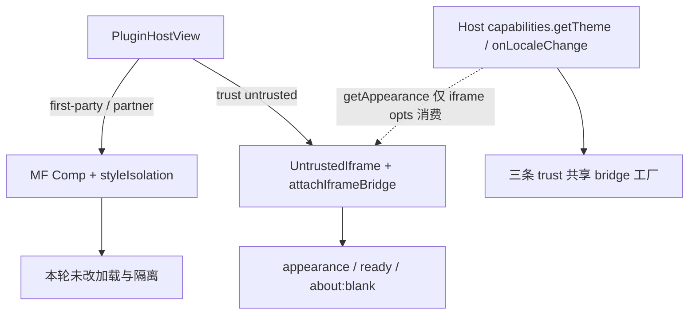

# iframe Appearance / Bridge 改动对 trust 模式的影响面

> 分析范围：本轮 `federation-kit` iframe bridge / Host appearance / `PluginHostView` untrusted 卸载 / `useInputsOnlyTab` 等相关改动。  
> 阅读约定：「历史风险」指旧实现曾出现的问题，不代表现行代码仍会触发。  
> （若与仓库最新源码不一致，以源码为准）

## 1. 分析目的与既有能力基线

微前端按 `PluginTrust` 分三条主路径（`packages/federation-kit/src/types/index.ts`）：

| trust | 加载 | 挂载 | 样式 |
|-------|------|------|------|
| **first-party** / **partner** | MF `loadRemote` + `beginPluginStyleCapture` | `<Comp {...bridge} />` + `data-mf-style-realm` | `attachPluginStyleIsolation` |
| **untrusted** | 仅 `iframeUrl` + Host bridge，不走 MF entry | `<UntrustedIframe>` + `attachIframeBridge` | **不**挂 style isolation |

分叉点（未改语义）：

- `createPluginRuntime`：`meta.trust === 'untrusted'` 早退，不 `registerRemote` / `loadRemoteApp`
- `PluginHostView`：`trust === 'untrusted'` → iframe；否则 → MF + isolation

## 2. 改动文件表（与 trust 相关）

| 路径 | 摘要 |
|------|------|
| `packages/federation-kit/src/bridge/attachIframeBridge.ts` | appearance 协议、ready 去重、contentDocument 防护 |
| `packages/federation-kit/src/react/PluginHostView.tsx` | **仅** `UntrustedIframe`：ref 绑定、卸载 `about:blank` |
| `packages/federation-kit/src/config/types.ts` | `HostIframeAppearance`、`getAppearance` / `onAppearanceChange`（可选） |
| `packages/federation-kit/src/createFederation.ts` | `getIframeBridgeOptions` 透传 appearance |
| `apps/frontend/.../iframeAppearance.ts` | Host 读主题/token（新建） |
| `apps/frontend/.../runtime/index.ts` | 挂 capabilities；`readTheme` 抽到 chrome helper；locale 取消订阅加固 |
| `apps/frontend/.../PluginHostPage.tsx` | 包装 `host`，强制 iframe bridge 带 appearance |
| `apps/frontend/.../useInputsOnlyTab.ts` | 全站：跳过 iframe / dialog 内控件 |

**未改**：`style-isolation/**`、`mf/mf.ts`、`loadRemote`、partner/first-party 校验与权限模型。

## 3. 是否影响原有功能（按 trust / 能力）

| 既有能力 | 判定 | 理由 |
|----------|------|------|
| first-party / partner **MF 加载与 activate** | **否** | runtime 仍按 trust 分支；未改 `loadRemote` / capture |
| first-party / partner **CSS @scope / Portal 收编** | **否** | isolation 代码未动；挂载条件仍排除 untrusted |
| first-party / partner **bridge.api（http/ui/modules）** | **否** | `createHostBridge` 与 capability 装配未改业务 API |
| first-party / partner **读 `api.theme`** | **有条件变化（极低）** | `getTheme` 改为 `readHostChromeTheme()`；旧实现已含 `theme-black`/`body.dark`，语义基本等价 |
| first-party / partner **locale 热更新** | **有条件变化（正向）** | `onLocaleChange` 增加 cancelled 防泄漏；行为仍是监听后回调 |
| **untrusted iframe 握手 / 主题外观** | **是（增强）** | appearance 下发、ready 去重、卸载 blank，专为 iframe |
| **Host 全站 Tab 序（含 MF Dialog）** | **有条件变化** | Dialog 内不再强设 `tabIndex=-1`；iframe 不再进 Tab 序——Host 壳层，不改 MF 加载架构 |
| **插件目录 / registry trust 字段** | **否** | 与 appearance 无关（目录 UI 改动另论） |

## 4. 影响点矩阵（架构层）

| 模块 | first-party | partner | untrusted |
|------|:-----------:|:-------:|:---------:|
| Module Federation 加载 | — | — | — |
| Style isolation / Portal patch | — | — | —（本就不挂） |
| `attachIframeBridge` / appearance | — | — | **改** |
| `PluginHostView` UntrustedIframe 生命周期 | — | — | **改** |
| `capabilities.getTheme` | 读法统一 | 同左 | 同左 + appearance |
| `useInputsOnlyTab` | Host UI 焦点 | 同左 | 同左 + 不抢 iframe |

图示（改动落点）：

## 5. 对当前微前端架构的含义

1. **三条 trust 分叉仍然成立**：MF（first-party/partner）与 iframe（untrusted）仍是互斥挂载；本轮没有把 appearance「灌进」MF 文档树，也没有改 isolation 契约。
2. **新增能力挂在可选 HostCapabilities 上**：未实现 `getAppearance` 的 Host 行为与旧版一致（iframe 只有 `theme` 字符串）；本仓 Host 已实现，只增强 untrusted。
3. **共享面只有 Host 壳层**：`getTheme` 读法、`onLocaleChange` 清理、`useInputsOnlyTab`——不改变「谁加载、谁隔离」，只影响 Host chrome / 焦点辅助。
4. **回归焦点应放在 untrusted**：外观同步、路由离开卡死、ready 风暴；first-party 冒烟即可（打开既有 MF 插件、Dialog Tab、切主题）。

## 6. 风险与回归清单

| 风险 | 等级 | 建议 |
|------|------|------|
| MF 插件因 `getTheme` 细微差异主题错乱 | 低 | 打开 remote-react-shadcn，切 black/white 看 `api.theme` 与 UI |
| Dialog 内可 Tab 到按钮（useInputsOnlyTab 放宽） | 低 / 有意 | 抽查 Host 与 MF Dialog 焦点陷阱是否正常 |
| iframe 卸载 `about:blank` 在个别 WebView 异常 | 低 | 从 untrusted 页跳主题设置确认不卡死 |
| appearance 订阅在多 iframe（drawer+页）重复 | 低 | 已有 fp 去重；多实例时确认无主题切换卡顿 |

**建议回归**

- [ ] first-party：既有 MF 插件进页、侧栏、Dialog/Sheet
- [ ] partner：若有样例，同样冒烟加载与 isolation
- [ ] untrusted：握手、强调色/主题、Select/Button outline、离页进设置
- [ ] 切主题：仅 untrusted 打开 / 仅 MF 打开 / 两者并存（drawer）

## 7. 结论

**没有改动 first-party / partner 的核心架构逻辑**（加载、隔离、Portal、权限）。本轮是 **untrusted iframe 专用协议与生命周期加固**，外加少量 **Host 共享壳层** 的只读主题与焦点调整；对 MF 架构的影响面为 **旁路增强 + 低风险共享读路径**，不是 trust 模型重写。
