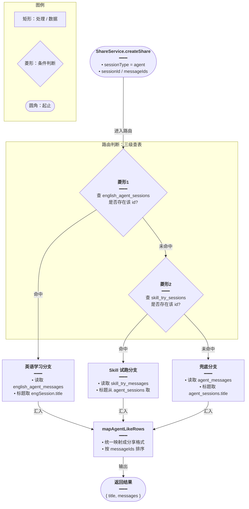
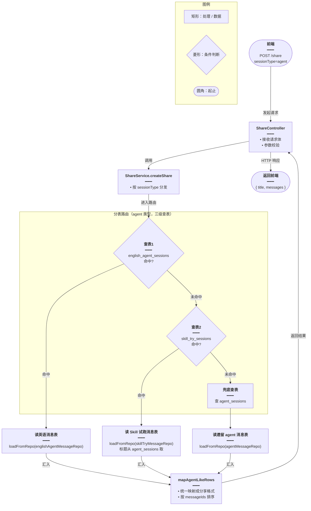
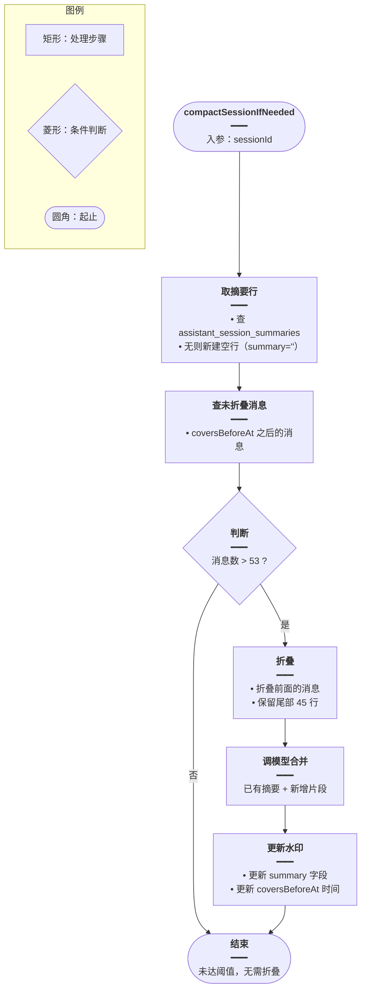

# Share 分表路由与 Assistant 改造

## 一、功能概述

分享功能需要把不同业务表的会话消息导出为统一格式。本次改动让 `ShareService` 在处理 `sessionType=agent` 时，按 `english_agent_*` → `skill_try_*` → `agent_*` 的顺序路由到正确的业务表取消息。

同时 `AssistantService` 做了三处增强：

1. `assistant_messages` 新增 `applied_skills` 列，存储助手行已应用的 Skill 快照
2. `import-transcript` 支持迁入 `appliedSkills`
3. 删除会话时同时删 `assistant_session_summaries`

## 二、实现方案

### Share 分表路由



抽出 `mapAgentLikeRows` 和 `loadFromRepo` 两个内部函数，避免三套表的消息映射逻辑重复。

## 三、改动点明细

### 1. `apps/backend/src/services/share/share.service.ts`（修改）

#### 改动原因
`sessionType=agent` 的分享原来只读 `agent_messages`，英语学习和 Skill 试跑的消息实际在 `english_agent_messages` / `skill_try_messages`，导致分享内容为空。

#### 改动前
```ts
// 判断当前请求是否为 agent 类型的分享
if (params.sessionType === 'agent') {
	// 通过 sessionId 查询 agent_sessions 表，只取展示分享所需的字段
	const session = await this.agentSessionRepo.findOne({
		// 按会话 id 精确匹配
		where: { id: params.sessionId },
		// 只 select 需要的列，减少数据传输量
		select: ['id', 'title', 'createdAt', 'updatedAt'],
	// 结束 findOne 配置对象
	});
	// 会话不存在时抛出 404，阻止后续流程
	if (!session) throw new NotFoundException('会话不存在');

	// 基于 agentMessageRepo 构造查询构造器，别名 m
	const qb = this.agentMessageRepo
		// 创建查询构造器并指定表别名
		.createQueryBuilder('m')
		// 选取分享展示必需的字段
		.select(['m.id', 'm.role', 'm.content', 'm.createdAt'])
		// 过滤当前会话下的消息
		.where('m.session_id = :sid', { sid: params.sessionId });

	// 如果传入了 messageIds，则只查询这些消息
	if (params.messageIds?.length) {
		// 追加 IN 条件，按 id 列表过滤
		qb.andWhere('m.id IN (:...ids)', { ids: params.messageIds });
	// 结束 if 块
	}

	// 执行查询，先按创建时间升序，再把 user 消息排到 assistant 前面（同一轮），最后按 id 升序兜底
	const rows = await qb
		// 第一排序键：创建时间升序
		.orderBy('m.created_at', 'ASC')
		// 第二排序键：user 角色映射为 0 排在前，其他角色映射为 1 排在后
		.addOrderBy("CASE WHEN m.role = 'user' THEN 0 ELSE 1 END", 'ASC')
		// 第三排序键：同时间同角色时按 id 升序，保证顺序稳定
		.addOrderBy('m.id', 'ASC')
		// 执行查询返回多条结果
		.getMany();

	// 默认保持查询结果顺序
	let orderedRows = rows;
	// 如果指定了 messageIds，则按传入顺序重排
	if (params.messageIds?.length) {
		// 构建 id → 索引的映射表，用于 O(1) 查找顺序
		const orderIndex = new Map(params.messageIds.map((id, i) => [id, i]));
		// 复制数组后排序，避免污染原数组（实现省略）
		orderedRows = [...rows].sort((a, b) => { /* ... */ });
	// 结束 if 块
	}

	// 把数据库行映射成前端分享需要的统一格式
	const messages = orderedRows.map((m) => ({
		// 消息 id 直接透传
		id: m.id,
		// chatId 与 id 保持一致，兼容前端字段命名
		chatId: m.id,
		// 角色归一化：assistant 保持，其余一律当 user
		role: (m.role === 'assistant' ? 'assistant' : 'user') as 'user' | 'assistant',
		// content 可能为 null，兜底为空字符串
		content: m.content ?? '',
		// 把 Date 转成毫秒时间戳
		timestamp: this.toEpochMs(m.createdAt),
	// 结束 map 回调对象
	}));
	// 返回分享结果：优先用会话已有标题，否则用首条消息生成标题
	return {
		// 标题：有则用会话标题，无则用 generateTitle 生成
		title: session.title || this.generateTitle(messages as unknown as ChatMessages[]),
		// 映射后的消息数组
		messages,
	// 结束 return 对象
	};
// 结束 if (params.sessionType === 'agent') 块
}
```

#### 改动后
```ts
// agent 类型分享的路由入口：按 英语 → Skill 试跑 → 遗留 agent 顺序查表
if (params.sessionType === 'agent') {
	// 通用映射函数：把任意业务表的消息行转成分享格式，并按 messageIds 排序
	const mapAgentLikeRows = (
		// 当前命中的会话对象，用于提供标题
		session: { id: string; title: string | null },
		// 从业务表查出的原始消息行数组
		rows: Array<{
			// 消息主键
			id: string;
			// 角色：user / assistant 等
			role: string;
			// 消息正文
			content: string;
			// 创建时间，用于排序和时间戳
			createdAt: Date;
		}>,
	// 结束参数列表，开始函数体
	) => {
		// 默认保持数据库查询顺序
		let orderedRows = rows;
		// 如果前端指定了 messageIds，则按其顺序重排
		if (params.messageIds?.length) {
			// 构建 id 到索引的 Map，便于快速比较顺序
			const orderIndex = new Map(
				// 把 messageIds 转成 [id, index] 键值对
				params.messageIds.map((id, i) => [id, i]),
			// 结束 Map 构造参数
			);
			// 复制数组再排序，避免修改原 rows
			orderedRows = [...rows].sort((a, b) => {
				// 取 a 在 messageIds 中的位置
				const ai = orderIndex.get(a.id);
				// 取 b 在 messageIds 中的位置
				const bi = orderIndex.get(b.id);
				// 两个都不在 messageIds 中时，按创建时间和 id 排序
				if (ai == null && bi == null) {
					// a 的时间戳（转换失败用 0 兜底）
					const at = this.toEpochMs(a.createdAt, 0);
					// b 的时间戳
					const bt = this.toEpochMs(b.createdAt, 0);
					// 时间不同则按时间升序
					if (at !== bt) return at - bt;
					// 时间相同则按 id 字典序兜底
					return String(a.id).localeCompare(String(b.id));
				// 结束两个都不在列表的分支
				}
				// a 不在列表中、b 在列表中，则 b 排前面（a 往后放）
				if (ai == null) return 1;
				// b 不在列表中、a 在列表中，则 a 排前面
				if (bi == null) return -1;
				// 两个都在列表中，按索引升序
				return ai - bi;
			// 结束 sort 回调
			});
		// 结束 messageIds 排序分支
		}
		// 把排序后的行映射成统一的分享消息格式
		const messages = orderedRows.map((m) => ({
			// 消息 id
			id: m.id,
			// chatId 与 id 相同，兼容前端字段
			chatId: m.id,
			// 角色归一化为 user 或 assistant
			role: (m.role === 'assistant' ? 'assistant' : 'user') as 'user' | 'assistant',
			// content 为空时兜底空字符串
			content: m.content ?? '',
			// Date 转毫秒时间戳
			timestamp: this.toEpochMs(m.createdAt),
		// 结束 map 回调对象
		}));
		// 返回标题和消息数组
		return {
			// 优先用会话已有标题，没有则用消息生成
			title:
				session.title ||
				// 用首条用户消息生成标题
				this.generateTitle(messages as unknown as ChatMessages[]),
			// 映射后的消息列表
			messages,
		// 结束 return 对象
		};
	// 结束 mapAgentLikeRows 函数
	};

	// 通用加载函数：从指定的 messageRepo 查询当前会话的消息
	const loadFromRepo = async (
		// 任意业务表的 message 仓库（英语/Skill 试跑/遗留 agent）
		messageRepo: Repository<
			EnglishAgentMessage | SkillTryMessage | AgentMessage
		>,
	// 结束参数列表
	) => {
		// 构造查询构造器，别名 m
		const qb = messageRepo
			// 创建查询构造器并指定表别名
			.createQueryBuilder('m')
			// 选取分享所需字段
			.select(['m.id', 'm.role', 'm.content', 'm.createdAt'])
			// 限定当前会话
			.where('m.session_id = :sid', { sid: params.sessionId });
		// 如果指定了 messageIds，则追加 IN 过滤
		if (params.messageIds?.length) {
			// 按 id 列表过滤消息
			qb.andWhere('m.id IN (:...ids)', { ids: params.messageIds });
		// 结束 if 块
		}
		// 执行查询并返回排序后的消息数组
		return qb
			// 先按创建时间升序
			.orderBy('m.created_at', 'ASC')
			// 同一轮内 user 排在 assistant 前面
			.addOrderBy("CASE WHEN m.role = 'user' THEN 0 ELSE 1 END", 'ASC')
			// 最后按 id 升序兜底
			.addOrderBy('m.id', 'ASC')
			// 执行查询
			.getMany();
	// 结束 loadFromRepo 函数
	};

	// 第 1 优先级：查英语学习会话表
	const engSession = await this.englishAgentSessionRepo.findOne({
		// 按 sessionId 匹配
		where: { id: params.sessionId },
		// 只取 id 和标题
		select: ['id', 'title'],
	// 结束 findOne 配置
	});
	// 命中英语表则用英语消息表返回
	if (engSession) {
		// 从 englishAgentMessageRepo 加载消息
		const rows = await loadFromRepo(this.englishAgentMessageRepo);
		// 映射成分享格式并返回
		return mapAgentLikeRows(engSession, rows);
	// 结束英语表分支
	}

	// 第 2 优先级：查 Skill 试跑会话表（该表无 title 字段）
	const trySession = await this.skillTrySessionRepo.findOne({
		// 按 sessionId 匹配
		where: { id: params.sessionId },
		// 只取 id 用于判断是否存在
		select: ['id'],
	// 结束 findOne 配置
	});
	// 命中 Skill 试跑表
	if (trySession) {
		// 标题需从 agent_sessions 表取（Skill 试跑复用 agent 会话的标题）
		const agentSession = await this.agentSessionRepo.findOne({
			// 按同一个 sessionId 匹配
			where: { id: params.sessionId },
			// 取 id 和标题
			select: ['id', 'title'],
		// 结束 findOne 配置
		});
		// agent_sessions 中找不到对应会话则报错
		if (!agentSession) {
			// 抛出 404 异常
			throw new NotFoundException('会话不存在');
		// 结束 if 块
		}
		// 从 skillTryMessageRepo 加载消息
		const rows = await loadFromRepo(this.skillTryMessageRepo);
		// 用 agent 会话的标题 + Skill 试跑消息映射后返回
		return mapAgentLikeRows(agentSession, rows);
	// 结束 Skill 试跑分支
	}

	// 第 3 优先级（兜底）：查遗留 agent 会话表
	const session = await this.agentSessionRepo.findOne({
		// 按 sessionId 匹配
		where: { id: params.sessionId },
		// 取展示所需字段
		select: ['id', 'title', 'createdAt', 'updatedAt'],
	// 结束 findOne 配置
	});
	// 会话不存在则报错
	if (!session) {
		// 抛出 404 异常
		throw new NotFoundException('会话不存在');
	// 结束 if 块
	}
	// 从 agentMessageRepo 加载消息
	const rows = await loadFromRepo(this.agentMessageRepo);
	// 映射成分享格式并返回
	return mapAgentLikeRows(session, rows);
// 结束 if (params.sessionType === 'agent') 块
}
```

#### 改动说明
- `mapAgentLikeRows` 把消息映射 + messageIds 排序逻辑抽成通用函数，三套表复用。
- `loadFromRepo` 把查询逻辑抽成通用函数，接受任意 messageRepo。
- 路由顺序：英语 → Skill 试跑 → 遗留 agent，与 `getSessionDetail` 一致。

---

### 2. `apps/backend/src/services/share/share.module.ts`（修改）

#### 改动原因
ShareModule 需要注册 `EnglishAgentSession` / `EnglishAgentMessage` / `SkillTrySession` / `SkillTryMessage` 实体，供 ShareService 注入。

#### 改动前
```ts
// 向 TypeORM 注册当前模块需要用到的实体，使其仓库可被注入
TypeOrmModule.forFeature([
	// 只有 AgentSession, AgentMessage, Assistant*, Ebook*, Knowledge, Chat*
// 关闭实体数组与 forFeature 调用
])
```

#### 改动后
```ts
// 向 TypeORM 注册本模块依赖的所有实体，使对应 Repository 可被注入
TypeOrmModule.forFeature([
	// 其他已有实体（省略）
	// 遗留 Agent 会话实体
	AgentSession,
	// 遗留 Agent 消息实体
	AgentMessage,
	// 新增：英语学习会话实体
	EnglishAgentSession,
	// 新增：英语学习消息实体
	EnglishAgentMessage,
	// 新增：Skill 试跑会话实体
	SkillTrySession,
	// 新增：Skill 试跑消息实体
	SkillTryMessage,
	// Ebook 助手会话实体
	EbookAssistantSession,
	// Ebook 助手消息实体
	EbookAssistantMessage,
	// 其他已有实体（省略）
// 关闭实体数组与 forFeature 调用
])
```

同时 ShareService 构造函数新增四个 repo 注入：
```ts
// 注入英语学习会话仓库
@InjectRepository(EnglishAgentSession)
// 英语学习会话 Repository 实例，只读不允许重新赋值
private readonly englishAgentSessionRepo: Repository<EnglishAgentSession>,
// 注入英语学习消息仓库
@InjectRepository(EnglishAgentMessage)
// 英语学习消息 Repository 实例，只读
private readonly englishAgentMessageRepo: Repository<EnglishAgentMessage>,
// 注入 Skill 试跑会话仓库
@InjectRepository(SkillTrySession)
// Skill 试跑会话 Repository 实例，只读
private readonly skillTrySessionRepo: Repository<SkillTrySession>,
// 注入 Skill 试跑消息仓库
@InjectRepository(SkillTryMessage)
// Skill 试跑消息 Repository 实例，只读
private readonly skillTryMessageRepo: Repository<SkillTryMessage>,
```

#### 改动说明
ShareService 现在能直接查英语和 Skill 试跑的消息表。

---

### 3. `apps/backend/src/services/assistant/assistant-message.entity.ts`（修改）

#### 改动原因
`assistant_messages` 表新增 `applied_skills` 列，存储助手行已应用的 Skill 快照（id + title）。

#### 改动前
```ts
// 声明 assistant_messages 表对应的实体类
@Entity({ name: 'assistant_messages' })
// 助手消息实体
export class AssistantMessage {
	// 原有字段：id, session, role, turnId, content, createdAt
	// 无 appliedSkills
}
```

#### 改动后
```ts
// 声明 assistant_messages 表对应的实体类
@Entity({ name: 'assistant_messages' })
// 助手消息实体
export class AssistantMessage {
	// ... 原有字段

	// 已应用 Skill 快照（仅 assistant 行有值）
	@Column({ name: 'applied_skills', type: 'json', nullable: true })
	// 字段类型为 Skill 快照数组或 null，非空断言告诉 TS 由 TypeORM 负责赋值
	appliedSkills!: Array<{ id: string; title: string }> | null;
}
```

#### 改动说明
`applied_skills` 是 json 列，存 `[{ id, title }]`，供刷新后 UI 回显「已应用 Skill」标签。

---

### 4. `apps/backend/src/services/assistant/assistant.service.ts`（修改）

#### 改动原因
三处增强：
1. `getSessionDetail` 返回 `appliedSkills`
2. `importTranscript` 支持迁入 `appliedSkills`
3. `deleteSession` 同时删 `assistant_session_summaries`

#### 改动前
```ts
// getSessionDetail 查询消息时未 select appliedSkills 字段
select: ['id', 'turnId', 'role', 'content', 'createdAt'],

// importTranscript 不处理 appliedSkills

// deleteSession 事务中只删消息和会话，不删摘要
await this.dataSource.transaction(async (manager) => {
	// 删除该会话下的所有助手消息
	await manager.delete(AssistantMessage, { session: { id: sid } });
	// 删除该会话本身（带 userId 校验归属）
	await manager.delete(AssistantSession, { id: sid, userId });
// 结束事务回调
});
```

#### 改动后
```ts
// 1) getSessionDetail：查询消息时带上 appliedSkills 字段
const messages = await this.messageRepo.find({
	// 按会话 id 过滤消息
	where: { session: { id: sessionId } },
	// 按创建时间升序排列
	order: { createdAt: 'ASC' },
	// 选取返回字段，新增 appliedSkills
	select: ['id', 'turnId', 'role', 'content', 'appliedSkills', 'createdAt'],
// 结束 find 配置
});
// 返回会话详情对象
return {
	// 会话信息（省略）
	session: { /* ... */ },
	// 把消息实体映射成前端 DTO
	messages: messages.map((m) => ({
		// 消息 id
		id: m.id,
		// 轮次 id
		turnId: m.turnId,
		// 角色
		role: m.role,
		// 消息内容
		content: m.content,
		// 已应用 Skill 快照，为 null 时显式返回 null
		appliedSkills: m.appliedSkills ?? null,
		// 创建时间
		createdAt: m.createdAt,
	// 结束 map 回调对象
	})),
// 结束 return 对象
};

// 2) importTranscript：从下一行 assistant 消息提取 appliedSkills
const appliedSkills =
	// 仅当下一行是 assistant 且存在 appliedSkills 时才提取
	next?.role === 'assistant' && next.appliedSkills?.length
		// 映射成只含 id 和 title 的纯对象
		? next.appliedSkills.map((s) => ({
				// Skill id
				id: s.id,
				// Skill 标题
				title: s.title,
		// 结束 map 回调与三元表达式
		}))
		// 否则为 null
		: null;
// 如果下一行是 assistant，轮次自增
if (next?.role === 'assistant') {
	// 轮次计数 +1
	i++;
}
// 保存 assistant 消息到数据库
await this.messageRepo.save(
	// 通过 create 构造实体实例
	this.messageRepo.create({
		// 关联会话
		session,
		// 角色固定为 assistant
		role: AssistantMessageRole.ASSISTANT,
		// 助手消息正文
		content: assistantContent,
		// 所属轮次
		turnId,
		// 落库 appliedSkills（可能为 null）
		appliedSkills,
	// 结束 create 对象
	}),
// 结束 save 调用
);

// 已有标题则保留，避免全量迁入时覆盖用户或首轮设置的标题
const nextTitle = session.title?.trim()
	// 已有非空标题则沿用
	? session.title
	// 否则用首条用户消息生成的标题
	: titleFromFirstUser;
// 更新会话标题和更新时间
await this.sessionRepo.update(
	// 按会话 id + userId 定位（校验归属）
	{ id: sessionId, userId },
	// 更新标题和 updatedAt
	{ title: nextTitle, updatedAt: now },
// 结束 update 调用
);

// 3) deleteSession：在事务中同时删除摘要表
await this.dataSource.transaction(async (manager) => {
	// 删除该会话的摘要行，避免孤儿数据
	await manager.delete(AssistantSessionSummary, { sessionId: sid });
	// 删除该会话下的所有助手消息
	await manager.delete(AssistantMessage, { session: { id: sid } });
	// 删除会话本身（带 userId 校验）
	await manager.delete(AssistantSession, { id: sid, userId });
// 结束事务回调
});
```

#### 改动说明
- `getSessionDetail` 把 `appliedSkills` 返回给前端，刷新后能回显 Skill 标签。
- `importTranscript` 迁入草稿对话时保留 `appliedSkills`，避免 Skill 快照丢失。
- 标题保留逻辑：已有标题（含 Skill 路径显式写入）不覆盖，避免每次迁入都用首条用户消息覆盖。
- `deleteSession` 必须删摘要表，否则删会话后摘要行成孤儿。

---

### 5. `apps/backend/src/services/assistant/dto/import-assistant-transcript.dto.ts`（修改）

#### 改动原因
`AssistantTranscriptLineDto` 新增 `appliedSkills` 字段，迁入草稿时保留 Skill 快照。

#### 改动前
```ts
// 迁入草稿的单条消息 DTO
export class AssistantTranscriptLineDto {
	// 校验 role 只能是 user 或 assistant
	@IsIn(['user', 'assistant'])
	// 消息角色
	role!: 'user' | 'assistant';

	// 校验 content 为字符串
	@IsString()
	// 限制内容最大长度 10 万字符
	@MaxLength(100_000)
	// 消息正文
	content!: string;
	// 无 appliedSkills
}
```

#### 改动后
```ts
// 已应用 Skill 的单条快照 DTO
export class AssistantTranscriptAppliedSkillDto {
	// 校验 id 为字符串
	@IsString()
	// id 不能为空
	@IsNotEmpty()
	// id 最大长度 64
	@MaxLength(64)
	// Skill 唯一标识
	id!: string;

	// 校验 title 为字符串
	@IsString()
	// title 不能为空
	@IsNotEmpty()
	// title 最大长度 255
	@MaxLength(255)
	// Skill 显示标题
	title!: string;
}

// 迁入草稿的单条消息 DTO
export class AssistantTranscriptLineDto {
	// 校验 role 只能是 user 或 assistant
	@IsIn(['user', 'assistant'])
	// 消息角色
	role!: 'user' | 'assistant';

	// 校验 content 为字符串
	@IsString()
	// 限制内容最大长度 10 万字符
	@MaxLength(100_000)
	// 消息正文
	content!: string;

	// 仅 assistant 行有意义：草稿阶段 SSE 已带到前端的 Skill 快照
	@IsOptional()
	// 校验为数组
	@IsArray()
	// 最多允许 8 个 Skill
	@ArrayMaxSize(8)
	// 对数组每个元素做嵌套校验
	@ValidateNested({ each: true })
	// 运行时把元素转成 AssistantTranscriptAppliedSkillDto 实例
	@Type(() => AssistantTranscriptAppliedSkillDto)
	// 可选的已应用 Skill 列表
	appliedSkills?: AssistantTranscriptAppliedSkillDto[];
}
```

#### 改动说明
`appliedSkills` 限 8 个，每个含 id（最长 64）和 title（最长 255），只在 assistant 行有意义。

---

### 6. `apps/backend/src/services/assistant/assistant.controller.ts` & `assistant.module.ts`（修改）

#### 改动原因
- 控制器新增 `POST /assistant/session/title` 和 `POST /assistant/session/append-turn` 接口
- module 注册 `AssistantSessionSummary` 实体和 `AssistantTableMemory`

#### 改动前
无这两个接口。

#### 改动后
```ts
// assistant.controller.ts
// 注册 POST /session/title 路由
@Post('session/title')
// 更新会话标题接口，从请求体取 dto
async updateSessionTitle(@Req() req, @Body() dto) {
	// 调用 assistantService.updateSessionTitle 处理业务逻辑
}

// 注册 POST /session/append-turn 路由
@Post('session/append-turn')
// 追加对话轮次接口，接收 AppendAssistantTurnDto
async appendTurn(@Req() req, @Body() dto: AppendAssistantTurnDto) {
	// 调用 assistantService.appendTurn 处理业务逻辑
}
```

```ts
// assistant.module.ts
// 模块导入列表
imports: [
	// 注册 TypeORM 实体
	TypeOrmModule.forFeature([
		// 助手会话实体
		AssistantSession,
		// 助手消息实体
		AssistantMessage,
		// 新增：助手会话摘要实体
		AssistantSessionSummary,
	// 关闭实体数组
	]),
// 关闭 imports 数组
],
// 模块提供者列表
providers: [
	// 助手业务服务
	AssistantService,
	// 新增：助手表内存管理（摘要折叠）
	AssistantTableMemory,
// 关闭 providers 数组
],
```

#### 改动说明
- `updateSessionTitle` 给知识库助手 Skill 路径更新标题用（Agent SSE 不自动写标题）。
- `appendTurn` 把草稿阶段的对话追加到已保存会话。

---

### 7. `apps/backend/src/services/assistant/assistant-session-summary.entity.ts`（新增）

#### 改动原因
知识库助手长对话需要水印摘要折叠，新增 `assistant_session_summaries` 表实体。

#### 改动前
无此文件。

#### 改动后
```ts
// 从 typeorm 导入装饰器：普通列、创建时间列、实体、索引、主键列、更新时间列
import { Column, CreateDateColumn, Entity, Index, PrimaryColumn, UpdateDateColumn } from 'typeorm';

// 声明 assistant_session_summaries 表对应的实体
@Entity({ name: 'assistant_session_summaries' })
// 在 sessionId 上建索引，加速按会话查询摘要
@Index('idx_assistant_summary_session', ['sessionId'])
// 助手会话摘要实体
export class AssistantSessionSummary {
	// 与会话 id 一对一，作为主键
	@PrimaryColumn({ name: 'session_id', type: 'varchar', length: 36 })
	// 会话 id（UUID 字符串）
	sessionId!: string;

	// 摘要正文列
	@Column({ type: 'longtext' })
	// 折叠后的摘要内容
	summary!: string;

	// 水印时间：此时间之前的消息已被折叠进摘要
	@Column({ name: 'covers_before_at', type: 'timestamp', nullable: true })
	// 水印时间，可为空
	coversBeforeAt!: Date | null;

	// 记录创建时间
	@CreateDateColumn({ name: 'created_at' })
	// 创建时间
	createdAt!: Date;

	// 记录更新时间
	@UpdateDateColumn({ name: 'updated_at' })
	// 更新时间
	updatedAt!: Date;
}
```

#### 改动说明
与 `agent_session_summaries` / `english_agent_session_summaries` / `skill_try_session_summaries` 结构一致：sessionId（主键）+ summary + coversBeforeAt（水印）。

---

### 8. `apps/backend/src/services/assistant/dto/append-assistant-turn.dto.ts` & `update-assistant-session-title.dto.ts`（新增）

#### 改动原因
新增两个 DTO：追加对话轮次、更新会话标题。

#### 改动前
无。

#### 改动后
```ts
// append-assistant-turn.dto.ts
// 追加对话轮次的请求 DTO
export class AppendAssistantTurnDto {
	// 校验 sessionId 为字符串
	@IsString()
	// 不能为空
	@IsNotEmpty()
	// 目标会话 id
	sessionId!: string;

	// 校验为字符串
	@IsString()
	// 最大长度 10 万字符
	@MaxLength(100_000)
	// 用户消息正文
	userContent!: string;

	// 校验为字符串
	@IsString()
	// 最大长度 10 万字符
	@MaxLength(100_000)
	// 助手消息正文
	assistantContent!: string;
}

// update-assistant-session-title.dto.ts
// 更新会话标题的请求 DTO
export class UpdateAssistantSessionTitleDto {
	// 校验 sessionId 为字符串
	@IsString()
	// 不能为空
	@IsNotEmpty()
	// 目标会话 id
	sessionId!: string;

	// 校验为字符串
	@IsString()
	// 不能为空
	@IsNotEmpty()
	// 最大长度 255
	@MaxLength(255)
	// 新的会话标题
	title!: string;
}
```

#### 改动说明
`appendTurn` 用于把草稿阶段（`memorySource=agent`）的对话追加到已保存的 assistant 会话（`memorySource=assistant`）。

## 四、功能实现逻辑

### Share 分表路由流程



### Assistant 摘要折叠流程



## 五、注意事项 / 风险点

1. **Share 路由顺序**：必须先查英语再查 Skill 试跑最后兜底 agent，与 `getSessionDetail` 保持一致。
2. **Skill 试跑标题来源**：`skill_try_sessions` 无 title 字段，标题从 `agent_sessions` 取。
3. **appliedSkills 仅 assistant 表**：`english_agent_messages` / `skill_try_messages` / `agent_messages` 无 `applied_skills` 列，Skill 快照只在 `assistant_messages` 落地。
4. **importTranscript 标题保留**：已有标题不覆盖，避免 Skill 路径显式写入的标题被首条用户消息覆盖。
5. **deleteSession 必须删摘要**：否则删会话后 `assistant_session_summaries` 留孤儿行，下次同 id 建会话会主键冲突。
