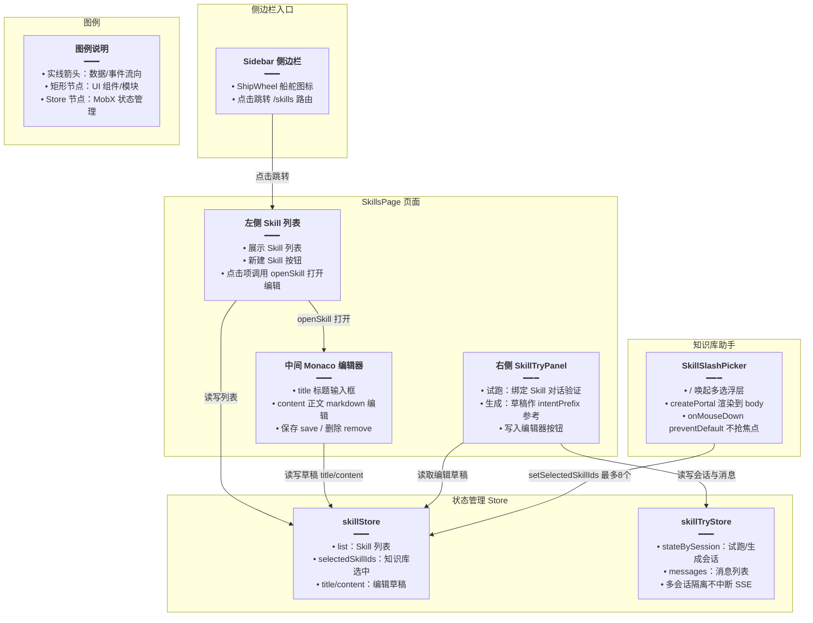
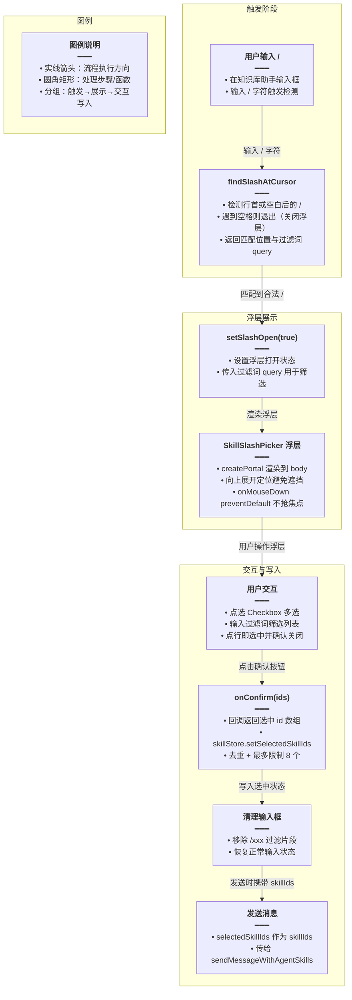
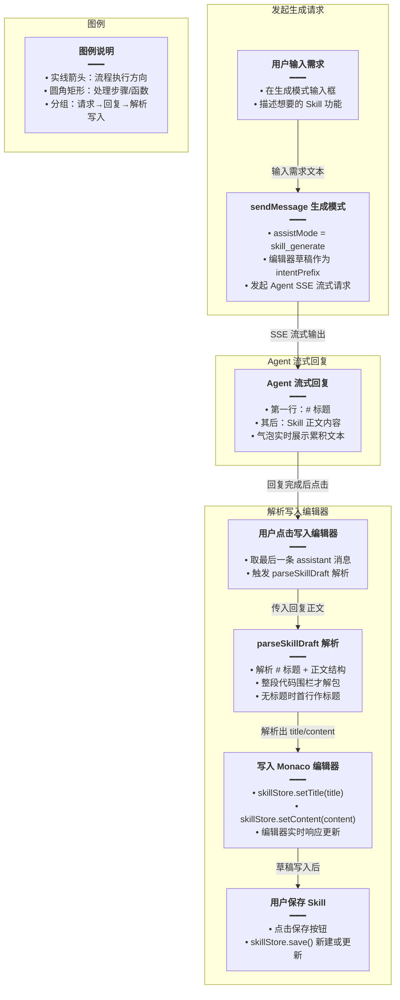

# Skill 前端

## 一、功能概述

Skill 前端包含三部分：

1. **Skill 管理页**（`/skills`）：列表、新建、编辑、删除 Skill（Monaco 编辑器）
2. **Skill 侧栏**（试跑 / 生成）：用 Skill 做对话，或让 Agent 起草 Skill 正文
3. **知识库助手 `/` 选择器**：在知识库助手输入框用 `/` 唤起 Skill 多选浮层

## 二、实现方案



两个 store：
- `skillStore`：Skill 列表、编辑草稿、知识库 `/` 选中的 Skill
- `skillTryStore`：Skill 侧栏试跑 / 生成的会话与消息

## 三、改动点明细

### 1. `apps/frontend/src/store/skill.ts`（新增）

#### 改动原因
Skill 列表、编辑草稿、知识库 `/` 选中 Skill 的状态管理。不挂 root store，页面直接 import（同 assistantStore 模式）。

#### 改动前
无此文件。

#### 改动后
```ts
// 导入 Toast 提示组件，用于列表加载/保存/删除等操作的成功或失败反馈
import { Toast } from '@ui/index';
// 导入 mobx 的 makeAutoObservable（自动把类属性变为可观察、方法变为 action）和 runInAction（在异步回调里批量更新状态避免触发多次渲染）
import { makeAutoObservable, runInAction } from 'mobx';
// 从 service 统一导入 Skill 相关的接口请求函数与类型定义
import {
	// 删除指定 Skill 的接口
	deleteSkill,
	// 获取单个 Skill 详情（拉后端最新内容）的接口
	getSkillDetail,
	// 获取当前用户 Skill 列表的接口
	listSkills,
	// 新建 Skill 的接口
	saveSkill,
	// Skill 记录的类型，供列表/详情等字段使用
	type SkillRecord,
	// 更新已有 Skill 的接口
	updateSkill,
} from '@/service';

// SkillStore 集中管理 Skill 列表、编辑草稿以及知识库 / 选择器选中项
class SkillStore {
	// Skill 列表，初始为空数组
	list: SkillRecord[] = [];
	/** 知识库助手 `/` 选中的 Skill（发送 Agent 时带 skillIds） */
	// 知识库助手选中的 Skill id 数组，发送时会作为 skillIds 透传给 Agent
	selectedSkillIds: string[] = [];
	// 正在编辑的 Skill id；为 null 代表当前是「新建」状态
	editingId: string | null = null;
	// 编辑草稿：标题文本
	title = '';
	// 编辑草稿：正文文本（Monaco 编辑器内容）
	content = '';
	// 加载状态：列表是否正在请求中，用于防抖避免重复请求
	loadingList = false;
	// 加载状态：是否正在保存，防止重复提交
	saving = false;
	// 加载状态：详情是否正在请求中
	loadingDetail = false;

	// 构造函数：调用 makeAutoObservable 让整个 store 可被 mobx 追踪
	constructor() {
		// 自动将 this 的属性转为 observable、方法转为 action
		makeAutoObservable(this);
	}

	/** 选中 Skill 的完整记录 */
	// 计算属性：根据 selectedSkillIds 从 list 中查出对应的完整 Skill 记录
	get selectedSkills(): SkillRecord[] {
		// 把列表转成 id → 记录 的 Map，后续按 id 查找是 O(1)
		const map = new Map(this.list.map((s) => [s.id, s]));
		// 按选中 id 的顺序映射出完整记录，并用类型守卫过滤掉 undefined
		return this.selectedSkillIds
			.map((id) => map.get(id))
			.filter((s): s is SkillRecord => Boolean(s));
	}

	/** 加载我的 Skill 列表 */
	// 加载当前用户的 Skill 列表，带 loading 防抖
	async loadList(): Promise<void> {
		// 如果已经在加载中，直接返回，避免重复请求
		if (this.loadingList) return;
		// 标记列表加载中
		this.loadingList = true;
		try {
			// 调用列表接口获取数据
			const res = await listSkills();
			// 在 action 中更新列表，保证响应式更新
			runInAction(() => {
				// 兼容接口返回非数组的异常情况，兜底为空数组
				this.list = Array.isArray(res.data) ? res.data : [];
			});
		} catch {
			// 请求失败时弹出错误提示
			Toast({ type: 'error', title: '加载 Skill 列表失败' });
		} finally {
			// 无论成功失败都要把 loading 置为 false
			runInAction(() => {
				this.loadingList = false;
			});
		}
	}

	/** 新建：清空编辑草稿 */
	// 新建 Skill：把编辑 id 置空、标题和正文清空
	createNew(): void {
		// editingId 为 null 表示新建状态
		this.editingId = null;
		// 清空标题草稿
		this.title = '';
		// 清空正文草稿
		this.content = '';
	}

	/** 打开某个 Skill 进行编辑 */
	// 打开指定 Skill 进行编辑：先用缓存填充减少等待，再拉后端最新内容
	async openSkill(id: string): Promise<void> {
		// 先从本地列表缓存里查找，立即填充编辑器避免白屏
		const cached = this.list.find((s) => s.id === id);
		// 命中缓存时先用缓存值填充
		if (cached) {
			// 设置当前编辑 id 为缓存项 id
			this.editingId = cached.id;
			// 用缓存的标题填充草稿
			this.title = cached.title;
			// 用缓存的正文填充草稿
			this.content = cached.content;
		}
		// 标记详情加载中
		this.loadingDetail = true;
		try {
			// 从后端拉取该 Skill 的最新内容
			const res = await getSkillDetail(id);
			// 取出返回的记录
			const row = res.data;
			// 返回数据异常（没有 id）时直接返回，不覆盖缓存
			if (!row?.id) return;
			// 在 action 中批量更新状态
			runInAction(() => {
				// 用后端返回的 id 覆盖编辑 id
				this.editingId = row.id;
				// 用后端标题更新草稿，缺省兜底为空串
				this.title = row.title ?? '';
				// 用后端正文更新草稿，缺省兜底为空串
				this.content = row.content ?? '';
				// 更新列表缓存：找到该 id 在列表中的下标
				const idx = this.list.findIndex((s) => s.id === row.id);
				// 已存在则原地替换
				if (idx >= 0) this.list[idx] = row;
				// 不存在则插入到列表头部
				else this.list = [row, ...this.list];
			});
		} catch {
			// 详情加载失败提示
			Toast({ type: 'error', title: '加载 Skill 失败' });
		} finally {
			// 重置详情 loading 状态
			runInAction(() => {
				this.loadingDetail = false;
			});
		}
	}

	// 更新草稿标题
	setTitle(v: string): void {
		// 把入参 v 赋值给 title
		this.title = v;
	}

	// 更新草稿正文
	setContent(v: string): void {
		// 把入参 v 赋值给 content
		this.content = v;
	}

	/** 保存（新建或更新） */
	// 保存当前草稿：根据 editingId 判断是新建还是更新，返回是否成功
	async save(): Promise<boolean> {
		// 对标题做 trim 去除首尾空白
		const title = this.title.trim();
		// 对正文做 trim 去除首尾空白
		const content = this.content.trim();
		// 标题或正文为空时不允许保存
		if (!title || !content) {
			// 弹出警告提示用户填写完整
			Toast({ type: 'warning', title: '请填写标题与内容' });
			// 返回失败
			return false;
		}
		// 已经在保存中则直接返回，防止重复提交
		if (this.saving) return false;
		// 标记保存中
		this.saving = true;
		try {
			// editingId 存在走更新逻辑
			if (this.editingId) {
				// 调用更新接口，传入标题和正文
				const res = await updateSkill(this.editingId, { title, content });
				// 取出更新后的记录
				const row = res.data;
				// 在 action 中更新本地状态
				runInAction(() => {
					// 仅当返回有效记录时才更新
					if (row?.id) {
						// 找到该记录在列表中的下标
						const idx = this.list.findIndex((s) => s.id === row.id);
						// 存在则替换为最新记录
						if (idx >= 0) this.list[idx] = row;
						// 用后端返回的标题覆盖草稿
						this.title = row.title;
						// 用后端返回的正文覆盖草稿
						this.content = row.content;
					}
				});
			} else {
				// editingId 为空走新建逻辑
				const res = await saveSkill({ title, content });
				// 取出新建后的记录
				const row = res.data;
				// 在 action 中更新本地状态
				runInAction(() => {
					// 返回没有 id 说明创建失败，直接返回
					if (!row?.id) return;
					// 生成当前 ISO 时间字符串作为兜底
					const now = new Date().toISOString();
					// 组装一条完整的 SkillRecord，缺省字段用兜底值
					const next: SkillRecord = {
						// 新建记录的 id
						id: row.id,
						// 标题，优先用后端返回的
						title: row.title ?? title,
						// 正文，优先用后端返回的
						content: row.content ?? content,
						// 作者 id，缺省为 0
						authorId: row.authorId ?? 0,
						// 创建时间，缺省用当前时间
						createdAt: row.createdAt ?? now,
						// 更新时间，缺省用当前时间
						updatedAt: row.updatedAt ?? now,
					};
					// 把编辑 id 更新为新建记录的 id
					this.editingId = next.id;
					// 新记录插入列表头部
					this.list = [next, ...this.list];
					// 标题同步为新建记录的标题
					this.title = next.title;
					// 正文同步为新建记录的正文
					this.content = next.content;
				});
			}
			// 保存成功提示
			Toast({ type: 'success', title: '已保存' });
			// 返回成功
			return true;
		} catch {
			// 保存失败提示
			Toast({ type: 'error', title: '保存失败' });
			// 返回失败
			return false;
		} finally {
			// 重置 saving 状态
			runInAction(() => {
				this.saving = false;
			});
		}
	}

	/** 删除 Skill */
	// 删除 Skill：参数缺省时删除当前编辑的 Skill
	async remove(id?: string): Promise<boolean> {
		// 确定要删除的目标 id：优先用入参，其次用当前编辑 id，最后兜底空串
		const target = (id ?? this.editingId ?? '').trim();
		// 目标为空则直接返回失败
		if (!target) return false;
		try {
			// 调用删除接口
			await deleteSkill(target);
			// 在 action 中更新本地状态
			runInAction(() => {
				// 从列表中过滤掉被删除的项
				this.list = this.list.filter((s) => s.id !== target);
				// 从知识库选中列表中移除该 id
				this.selectedSkillIds = this.selectedSkillIds.filter(
					(x) => x !== target,
				);
				// 如果删的是当前正在编辑的 Skill，则清空草稿回到新建状态
				if (this.editingId === target) this.createNew();
			});
			// 删除成功提示
			Toast({ type: 'success', title: '已删除' });
			// 返回成功
			return true;
		} catch {
			// 删除失败提示
			Toast({ type: 'error', title: '删除失败' });
			// 返回失败
			return false;
		}
	}

	/** 切换某个 Skill 的选中状态（最多 8 个） */
	// 切换某个 Skill 的选中状态，最多允许选中 8 个（与后端 @ArrayMaxSize(8) 对齐）
	toggleSelectedSkillId(id: string): void {
		// 对 id 做 trim 去除首尾空白
		const sid = id.trim();
		// id 为空直接返回
		if (!sid) return;
		// 已选中则取消选中
		if (this.selectedSkillIds.includes(sid)) {
			// 过滤掉该 id 即取消选中
			this.selectedSkillIds = this.selectedSkillIds.filter((x) => x !== sid);
		} else if (this.selectedSkillIds.length < 8) {
			// 未选中且未达上限 8 个时追加
			this.selectedSkillIds = [...this.selectedSkillIds, sid];
		}
	}

	/** 批量设置选中 Skill（去重 + 限 8） */
	// 批量设置选中的 Skill：去重并限制最多 8 个
	setSelectedSkillIds(ids: string[]): void {
		// 用于存放去重后 id 的数组
		const uniq: string[] = [];
		// 遍历传入的 id 列表
		for (const id of ids) {
			// 对每个 id 做 trim，null/undefined 兜底为空串
			const sid = (id ?? '').trim();
			// 空 id 或已存在则跳过
			if (!sid || uniq.includes(sid)) continue;
			// 加入去重数组
			uniq.push(sid);
			// 达到上限 8 个则停止遍历
			if (uniq.length >= 8) break;
		}
		// 把处理后的数组赋值给 selectedSkillIds
		this.selectedSkillIds = uniq;
	}

	/** 清空选中 */
	// 清空知识库选中的 Skill
	clearSelected(): void {
		// 把选中数组置空
		this.selectedSkillIds = [];
	}

	/** 切换账号时清空 */
	// 切换账号时重置所有状态，防止 A 用户数据泄露给 B 用户
	resetOnUserSwitch(): void {
		// 清空 Skill 列表
		this.list = [];
		// 清空选中的 Skill
		this.selectedSkillIds = [];
		// 清空编辑 id
		this.editingId = null;
		// 清空标题草稿
		this.title = '';
		// 清空正文草稿
		this.content = '';
		// 重置列表 loading
		this.loadingList = false;
		// 重置保存 loading
		this.saving = false;
		// 重置详情 loading
		this.loadingDetail = false;
	}
}

// 创建 SkillStore 单例
const skillStore = new SkillStore();
// 导出单例，页面直接 import 使用（不挂 root store）
export default skillStore;
```

#### 改动说明
- `selectedSkillIds` 是知识库助手 `/` 选择器选中的 Skill，发送时作为 `skillIds` 传给 Agent。
- `toggleSelectedSkillId` 限制最多 8 个，与后端 `@ArrayMaxSize(8)` 对齐。
- `openSkill` 先用缓存填充再拉最新，减少等待。

---

### 2. `apps/frontend/src/store/skillTry.ts`（新增）

#### 改动原因
Skill 侧栏试跑 / 生成的会话与消息管理。多会话按 `stateBySession` 隔离，切换历史 / Skill / 模式不中断其它会话 SSE。

#### 改动前
无此文件。

#### 改动后
```ts
// 导入 Toast 提示组件，用于登录校验、发送失败等场景的提示
import { Toast } from '@ui/index';
// 导入 mobx 的 makeAutoObservable 和 runInAction，用于响应式状态与异步批量更新
import { makeAutoObservable, runInAction } from 'mobx';
// 导入 React 的 UIEvent 类型，用于滚动事件等场景的类型标注
import type { UIEvent } from 'react';
// 导入 uuid 的 v4 方法，用于生成本地临时消息 id
import { v4 as uuidv4 } from 'uuid';
// 从 service 导入 Skill 试跑/生成相关的会话与 SSE 接口
import {
	// 创建 Skill 试跑/生成会话
	createSkillTrySession,
	// 删除 Agent 会话
	deleteAgentSession,
	// 获取 Agent 会话详情（用于空正文兜底找回已落库内容）
	getAgentSessionDetail,
	// 获取 Skill 试跑/生成的历史会话列表
	listSkillTrySessions,
	// 停止 Agent 流式输出
	stopAgentStream,
	// 更新 Agent 会话标题
	updateAgentSessionTitle,
} from '@/service';
// 导入聊天相关类型：Message 是单条消息结构，SearchOrganicItem 是搜索结果项
import type { Message, SearchOrganicItem } from '@/types/chat';
// 导入 Agent SSE 工具：用户中止标记常量与流式请求函数
import { AGENT_SSE_USER_ABORT_MARKER, streamAgentSse } from '@/utils/agentSse';
// 导入流式更新调度器，节流 mobx 状态写操作避免高频渲染
import { createStreamingMobxPatchScheduler } from '@/utils/scheduleStreamingMobxPatch';

// 定义面板模式联合类型：try 试跑 / generate 生成
export type SkillPanelMode = 'try' | 'generate';

// 单个会话的运行态，包含消息列表、发送中标记、历史加载中标记、中止流的函数
type SessionRuntime = {
	// 该会话的消息列表
	messages: Message[];
	// 是否正在发送（等待首字或已在流式输出）
	isSending: boolean;
	// 是否正在加载历史消息
	isHistoryLoading: boolean;
	// 中止当前 SSE 流的函数，null 表示没有进行中的流
	abortStream: (() => void) | null;
};

// 读取本地存储的 token，用于登录态校验
function readToken(): string {
	// 服务端渲染环境下没有 window，直接返回空串
	if (typeof window === 'undefined') return '';
	// 从 localStorage 读取 token，缺省返回空串
	return localStorage.getItem('token') || '';
}

// 把 API 返回的消息结构转换为 UI 层使用的 Message 结构（此处省略具体实现）
function mapApiMessagesToUi(/* ... */): Message[] { /* ... */ }

/** 流结束时统一正文：保留已生成内容；失败/空响应给出可读文案 */
// 流结束时统一处理正文：保留已生成内容；用户中止返回空；失败给出错误文案；空响应提示重试
function resolveAssistantEndContent(opts: {
	// 本次流式累积的文本
	accumulated: string;
	// 之前已有的正文（用于兜底）
	prevContent: string;
	// 错误信息，可选
	err?: string;
}): string {
	// 判断是否为用户主动中止（错误标记等于用户中止常量）
	const userAborted = opts.err === AGENT_SSE_USER_ABORT_MARKER;
	// 优先取本次累积内容，其次取之前已有内容
	const kept = opts.accumulated || opts.prevContent || '';
	// 有有效内容则直接返回
	if (kept.trim()) return kept;
	// 用户中止时返回空串，不展示错误文案
	if (userAborted) return '';
	// 有错误信息时展示「生成失败：错误原因」
	if (opts.err) return `生成失败：${opts.err}`;
	// 其它空响应情况提示用户重试
	return '本轮未生成文本，请重试';
}

/** 从 Agent 回复解析标题 + 正文，供写入 Monaco（须与气泡所见一致） */
// 把模型回复解析为 { title, content }，供「写入编辑器」使用，须与气泡展示内容一致
export function parseSkillDraft(raw: string): { title: string; content: string } {
	// 对原始文本做 trim，null/undefined 兜底为空串
	const text = (raw ?? '').trim();
	// 空文本直接返回空标题和空正文
	if (!text) return { title: '', content: '' };

	// 仅当整段就是一个代码围栏时才解包；禁止摘取文中第一个 ```，否则气泡全文与写入内容会分叉
	const wholeFence = text.match(
		/^```(?:skill|markdown)?\s*\r?\n([\s\S]*?)\r?\n```\s*$/i,
	);
	// 取围栏内的内容，没匹配到则用原文，并 trim
	const body = (wholeFence?.[1] ?? text).trim();

	// 匹配 # 标题 + 正文 的结构
	const heading = body.match(/^#\s+(.+?)\s*\r?\n([\s\S]*)$/);
	// 命中标题结构则返回标题与正文
	if (heading) {
		return {
			// 标题取第一个分组，trim 并限制最长 200 字符
			title: heading[1].trim().slice(0, 200),
			// 正文取第二个分组并 trim
			content: heading[2].trim(),
		};
	}
	// 无标题时用第一行做标题
	const lines = body.split(/\r?\n/);
	// 取第一行，去掉开头的 #，trim，兜底为「未命名 Skill」
	const first = (lines[0] ?? '').replace(/^#\s*/, '').trim() || '未命名 Skill';
	// 剩余行拼接为正文并 trim
	const rest = lines.slice(1).join('\n').trim();
	return {
		// 标题限制最长 200 字符
		title: first.slice(0, 200),
		// 正文为空时退回整段 body
		content: rest || body,
	};
}

// SkillTryStore：Skill 侧栏试跑/生成的会话与消息管理，多会话按 sessionId 隔离
class SkillTryStore {
	// 当前模式：try 试跑 / generate 生成
	mode: SkillPanelMode = 'try';
	// 当前展示的会话 id
	activeSessionId: string | null = null;
	// 当前会话的标题
	sessionTitle: string | null = null;
	// 试跑模式下当前绑定的 Skill id
	boundSkillId: string | null = null;
	// 试跑模式下各 Skill 上次展示的会话 id，切回时不丢失
	activeSessionBySkill: Record<string, string | null> = {};
	// 生成模式下上次展示的会话 id
	generateActiveSessionId: string | null = null;
	// 各会话独立运行态，支持后台继续流式输出而不被切换打断
	stateBySession: Record<string, SessionRuntime> = {};

	// 历史会话列表
	sessionList: Array<{ /* ... */ }> = [];
	// 历史列表分页信息
	sessionsPage = { pageNo: 1, pageSize: 20, total: 0 };
	// 历史列表是否加载中
	historySessionLoading = false;
	// 历史列表是否正在加载更多
	historySessionLoadingMore = false;

	// 构造函数：自动把 store 转为 mobx 可观察
	constructor() {
		makeAutoObservable(this);
	}

	// ... getters: sessionId, messages, isSending, isStreaming, hasMoreHistorySessions

	/** 确保会话运行态存在 */
	// 确保指定会话的运行态存在，不存在则初始化
	ensureSessionState(sid: string): SessionRuntime { /* ... */ }

	/** 记住当前 scope 的活动会话 */
	// 记住当前作用域（试跑/生成）的活动会话，切换后可恢复
	private rememberActiveForCurrentScope(): void {
		// 生成模式：把当前活动会话记到 generateActiveSessionId
		if (this.mode === 'generate') {
			this.generateActiveSessionId = this.activeSessionId;
			return;
		}
		// 试跑模式：按 boundSkillId 记录到 activeSessionBySkill
		const skillId = this.boundSkillId?.trim();
		// skillId 存在才记录
		if (skillId) {
			this.activeSessionBySkill[skillId] = this.activeSessionId;
		}
	}

	/** 恢复当前 scope 的活动会话 */
	// 恢复当前作用域的活动会话（此处省略实现）
	private restoreActiveForCurrentScope(): void { /* ... */ }

	/** 切换试跑 / 生成：不中止对方模式后台流 */
	// 切换试跑/生成模式：只切展示指针，不中止对方模式的后台 SSE 流
	setMode(mode: SkillPanelMode): void {
		// 模式未变则直接返回
		if (mode === this.mode) return;
		// 在 action 中批量更新状态
		runInAction(() => {
			// 先记住当前作用域的活动会话
			this.rememberActiveForCurrentScope();
			// 更新模式
			this.mode = mode;
			// 清空历史列表
			this.sessionList = [];
			// 重置分页
			this.sessionsPage = { pageNo: 1, pageSize: 20, total: 0 };
			// 恢复新作用域的活动会话
			this.restoreActiveForCurrentScope();
		});
		// 如果活动会话有缓存但消息未加载，则拉取
		this.hydrateActiveIfNeeded();
		// 刷新历史会话列表（fire-and-forget）
		void this.refreshSessionList();
	}

	/** 切 Skill：试跑记住并恢复该 Skill 的会话指针，不中止其它会话 SSE */
	// 试跑模式下切换绑定的 Skill：记住并恢复该 Skill 的会话指针，不中止其它会话 SSE
	bindSkill(skillId: string | null): void {
		// Skill 未变则直接返回
		if (skillId === this.boundSkillId) return;
		// 生成模式下绑定 Skill 不需要切会话
		if (this.mode === 'generate') {
			runInAction(() => {
				// 仅更新 boundSkillId
				this.boundSkillId = skillId;
			});
			return;
		}
		// 试跑模式下需要切会话指针
		runInAction(() => {
			// 记住当前 Skill 的活动会话
			this.rememberActiveForCurrentScope();
			// 更新绑定的 Skill
			this.boundSkillId = skillId;
			// 清空历史列表
			this.sessionList = [];
			// 重置分页
			this.sessionsPage = { pageNo: 1, pageSize: 20, total: 0 };
			// 恢复新 Skill 的活动会话
			this.restoreActiveForCurrentScope();
		});
		// 拉取活动会话消息
		this.hydrateActiveIfNeeded();
		// 刷新该 Skill 的历史会话列表
		if (skillId) void this.refreshSessionList(skillId);
	}

	/** 新对话：只切展示指针，不中止当前/其它会话流式 */
	// 新建对话：把展示指针置空，不中止任何会话的流式输出
	newChat(): void {
		runInAction(() => {
			// 清空当前展示会话
			this.activeSessionId = null;
			// 清空会话标题
			this.sessionTitle = null;
			// 记住当前作用域（此时为 null）
			this.rememberActiveForCurrentScope();
		});
	}

	/** 切换账号：中止全部 SSE 并清空 */
	// 切换账号时中止所有 SSE 并清空状态（此处省略实现）
	resetOnUserSwitch(): void { /* ... */ }

	/** 仅停止当前展示会话 */
	// 仅停止当前展示会话的流式输出，不影响其它会话
	stopGenerating(): void {
		// 取当前展示会话 id
		const sid = this.activeSessionId;
		// 没有活动会话则直接返回
		if (!sid) return;
		// 获取该会话的运行态
		const st = this.ensureSessionState(sid);
		// 调用本地 abort 函数中止 SSE
		st.abortStream?.();
		// 通知后端停止该会话的流式输出（忽略错误）
		void stopAgentStream({ sessionId: sid }).catch(() => undefined);
		// 在 action 中更新状态
		runInAction(() => {
			// 清空 abort 函数引用
			st.abortStream = null;
			// 标记发送结束
			st.isSending = false;
			// 把正在流式输出的消息标记为已停止
			st.messages = st.messages.map((m) =>
				m.isStreaming ? { ...m, isStreaming: false, isStopped: true } : m,
			);
		});
	}

	/** 刷新历史列表 */
	// 刷新历史会话列表（此处省略实现）
	async refreshSessionList(skillId?: string | null): Promise<void> { /* ... */ }

	/** 切换展示会话；本地已有消息/发送中则不重拉，不中止其它 SSE */
	// 切换展示的会话，本地已有消息或正在发送则不重新拉取，不中止其它 SSE
	async switchSession(sessionId: string): Promise<void> { /* ... */ }

	/** 删除会话 */
	// 删除指定会话（此处省略实现）
	async deleteSession(sessionId: string): Promise<void> { /* ... */ }

	/** 发送消息（试跑 / 生成） */
	// 发送消息：试跑模式传 skillIds，生成模式传 assistMode + 草稿 intentPrefix
	async sendMessage(
		// 用户输入的原始文本
		rawText: string,
		// 发送选项：skillId 试跑绑定的 Skill，draftTitle/draftContent 生成模式草稿
		options: {
			skillId?: string | null;
			draftTitle?: string;
			draftContent?: string;
		} = {},
	): Promise<void> {
		// 对用户文本做 trim
		const userText = (rawText ?? '').trim();
		// 空文本不发送
		if (!userText) return;
		// 登录校验
		// 没有 token 时提示登录并返回（此处省略 Toast）
		if (!readToken()) { /* Toast */ return; }
		// 取 skillId 并 trim，缺省为 null
		const skillId = options.skillId?.trim() || null;
		// 判断是否为生成模式
		const isGenerate = this.mode === 'generate';
		// 试跑模式必须有 skillId
		if (!isGenerate && !skillId) {
			// 提示先保存 Skill 再试跑
			Toast({ type: 'warning', title: '请先保存 Skill 后再试跑' });
			return;
		}
		// 当前会话正在发送或流式输出时不允许再发
		if (this.isSending || this.isStreaming) {
			// 提示等待当前回复结束
			Toast({ type: 'warning', title: '请等待当前回复结束后再试' });
			return;
		}

		// 绑定 Skill：试跑模式下 skillId 变化则调用 bindSkill 切换
		if (!isGenerate && skillId !== this.boundSkillId) {
			this.bindSkill(skillId);
		} else if (isGenerate && skillId !== this.boundSkillId) {
			// 生成模式下仅更新 boundSkillId
			runInAction(() => { this.boundSkillId = skillId; });
		}

		// 确保有会话：没有活动会话则创建一个
		let sid = this.activeSessionId;
		if (!sid) {
			// 调用创建会话接口，kind 区分试跑/生成
			const res = await createSkillTrySession({
				// 生成模式传 generate，试跑传 try
				kind: isGenerate ? 'generate' : 'try',
				// 试跑且有 skillId 时带上 skillId
				...(isGenerate || !skillId ? {} : { skillId }),
			});
			// 取后端返回的 sessionId，缺省为 null
			sid = res.data?.sessionId ?? null;
			// 创建失败则提示并返回
			if (!sid) { Toast({ type: 'error', title: '创建会话失败' }); return; }
			// 在 action 中更新状态
			runInAction(() => {
				// 设置活动会话 id
				this.activeSessionId = sid;
				// 设置会话标题预览
				this.sessionTitle = titlePreview;
				// 确保该会话运行态存在
				this.ensureSessionState(sid!);
				// 记住当前作用域的活动会话
				this.rememberActiveForCurrentScope();
				// 更新列表
			});
		}

		// 获取该会话的运行态
		const st = this.ensureSessionState(sid);
		// 中止本会话旧的流（防止叠加）
		st.abortStream?.();
		// 在 action 中更新发送状态
		runInAction(() => {
			// 清空旧 abort 引用
			st.abortStream = null;
			// 标记发送中
			st.isSending = true;
		});

		// 本地推送 user 消息和空 assistant 占位消息
		const userChatId = uuidv4();
		// 生成本地 assistant 占位消息 id
		const assistantChatId = uuidv4();
		// 记录本地 user 消息 id（后续会被后端 id 替换）
		let userRowId = userChatId;
		// 记录本地 assistant 消息 id（后续会被后端 id 替换）
		let assistantRowId = assistantChatId;
		// 在 action 中推入消息
		runInAction(() => {
			// 推入 user 消息
			st.messages.push({ /* user */ });
			// 推入 assistant 占位消息
			st.messages.push({ /* assistant placeholder */ });
		});

		// 累积流式输出的文本
		let accumulated = '';
		// 创建流式更新调度器，节流 UI 更新避免高频渲染
		const assistantPatchScheduler = createStreamingMobxPatchScheduler(/* ... */);

		// 生成模式：把编辑器草稿作为 intentPrefix 传给 Agent 作为参考
		const draftTitle = options.draftTitle?.trim() ?? '';
		// 草稿正文 trim，缺省空串
		const draftContent = options.draftContent?.trim() ?? '';
		// 生成模式且有草稿时拼出 intentPrefix，否则为 undefined
		const intentPrefix =
			isGenerate && (draftTitle || draftContent)
				? `【当前编辑器草稿（可选参考，可改写）】\n标题：${draftTitle || '（空）'}\n正文：\n${draftContent || '（空）'}\n`
				: undefined;

		// 把 sid 固定到局部变量，避免闭包里被改
		const streamSid = sid;
		try {
			// 发起 Agent SSE 流式请求
			const abort = await streamAgentSse({
				// 请求体
				body: {
					// 会话 id
					sessionId: streamSid,
					// 用户输入内容
					content: userText,
					// 记忆源标记，便于后端区分
					memorySource: 'skill_try',
					// 生成模式传 assistMode 和 intentPrefix，试跑模式传 skillIds
					...(isGenerate
						? {
								// 生成模式的 assistMode
								assistMode: 'skill_generate',
								// 有 intentPrefix 时带上
								...(intentPrefix ? { intentPrefix } : {}),
							}
						// 试跑模式：把 skillId 包成数组
						: { skillIds: skillId ? [skillId] : [] }),
				},
				// SSE 回调
				callbacks: {
					// 收到消息 id 时用后端 id 替换本地临时 id
					onMessageIds: ({ userMessageId, assistantMessageId }) => {
						// 替换本地 id 为库内 id
					},
					// 收到文本增量时累加到 accumulated 并调度 UI 更新
					onDelta: (d) => { accumulated += d; assistantPatchScheduler.schedule(); },
					// 收到搜索结果时写入 searchOrganic
					onSearchOrganic: (organic) => { /* 写 searchOrganic */ },
					// 收到应用的 Skill 列表时写入 appliedSkills
					onSkillsApplied: (skills) => { /* 写 appliedSkills */ },
					// 流结束回调
					onComplete: (err) => {
						// 立即 flush 调度器，把剩余累积写入 UI
						assistantPatchScheduler.flush();
						// 判断是否用户主动中止
						const userAborted = err === AGENT_SSE_USER_ABORT_MARKER;
						// 收尾：正文 + isStreaming=false
						// 空正文且无错误时，尝试从服务端找回已落库内容
					},
					// 错误回调
					onError: (e) => { /* 错误收尾 */ },
				},
			});
			// 把 abort 函数存入运行态，供 stopGenerating 调用
			runInAction(() => { st.abortStream = abort; });
		} catch (e) {
			// 异常收尾
		}
	}
}

// 创建 SkillTryStore 单例
const skillTryStore = new SkillTryStore();
// 导出单例
export default skillTryStore;
```

#### 改动说明
- 多会话隔离：`stateBySession` 存每个会话的运行态，切换会话不中止其它会话的 SSE。
- 试跑 vs 生成：试跑 `skillIds: [skillId]` + `memorySource: 'skill_try'`；生成 `assistMode: 'skill_generate'` + `intentPrefix`（草稿）。
- `parseSkillDraft`：把模型回复解析成 `{ title, content }`，供写入 Monaco 编辑器。
- 空正文兜底：`onComplete` 时空正文且无错误时，尝试从 `getAgentSessionDetail` 找回已落库内容（防 SSE 丢帧）。

---

### 3. `apps/frontend/src/components/design/SkillSlashPicker/index.tsx`（新增）

#### 改动原因
知识库助手输入框 `/` 唤起的 Skill 多选浮层，对齐 Cursor 交互：不抢焦点、行首或空白后才触发、空格退出。

#### 改动前
无此文件。

#### 改动后
```tsx
// 导入 UI 组件：Button 按钮、Checkbox 复选框、ScrollArea 滚动区域
import { Button, Checkbox, ScrollArea } from '@ui/index';
// 导入 lucide 的 Plus 图标，用于「新建技能」按钮
import { Plus } from 'lucide-react';
// 导入 mobx-react 的 observer，让组件响应 mobx 状态变化
import { observer } from 'mobx-react';
// 从 react 导入类型与 hooks
import {
	// RefObject 类型，用于锚点 ref 标注
	type RefObject,
	// useEffect 用于副作用
	useEffect,
	// useLayoutEffect 用于同步 DOM 测量（定位）
	useLayoutEffect,
	// useMemo 用于缓存过滤结果
	useMemo,
	// useState 用于本地状态
	useState,
} from 'react';
// 导入 createPortal，把浮层渲染到 body 下避免被父容器裁剪
import { createPortal } from 'react-dom';
// 导入 useNavigate，用于跳转到 Skill 管理页
import { useNavigate } from 'react-router';
// 导入国际化 hook
import { useI18n } from '@/hooks';
// 导入 cn 工具，用于合并 className
import { cn } from '@/lib/utils';
// 导入 skillStore，读取 Skill 列表与选中状态
import skillStore from '@/store/skill';

// SkillSlashPicker 组件的 props 类型
export type SkillSlashPickerProps = {
	// 浮层是否打开
	open: boolean;
	// 打开状态变化回调
	onOpenChange: (open: boolean) => void;
	/** `/` 后已输入的过滤词（由消息框驱动） */
	// 用户在 / 后输入的过滤词，由消息框传入
	query?: string;
	// 确认回调，返回选中的 Skill id 数组
	onConfirm: (ids: string[]) => void;
	/** 锚定输入框容器，用于 fixed 定位 */
	// 锚点元素 ref，用于计算浮层位置
	anchorRef?: RefObject<HTMLElement | null>;
	// 自定义 className
	className?: string;
};

// SkillSlashPicker 组件：知识库助手输入框 / 唤起的 Skill 多选浮层
const SkillSlashPicker = observer(function SkillSlashPicker({
	// 解构 open
	open,
	// 解构 onOpenChange
	onOpenChange,
	// 解构 query，缺省空串
	query = '',
	// 解构 onConfirm
	onConfirm,
	// 解构 anchorRef
	anchorRef,
	// 解构 className
	className,
}: SkillSlashPickerProps) {
	// 取国际化翻译函数
	const { t } = useI18n();
	// 取路由跳转函数
	const navigate = useNavigate();
	// 草稿选中 id 数组：确认前不直接改 store，取消则不生效
	const [draftIds, setDraftIds] = useState<string[]>([]);
	// 浮层定位状态：bottom/left/width/listHeight
	const [pos, setPos] = useState<{
		// 距视口底部距离
		bottom: number;
		// 距视口左边距离
		left: number;
		// 浮层宽度
		width: number;
		// 列表区域高度
		listHeight: number;
	// 初始定位值
	}>({ bottom: 0, left: 0, width: 288, listHeight: 224 });

	// 定位：根据锚点计算浮层位置（向上展开）
	useLayoutEffect(() => {
		// 未打开时不计算
		if (!open) return;
		// 定义更新定位的函数
		const update = () => {
			// 取锚点 DOM 元素
			const el = anchorRef?.current;
			// 锚点不存在则返回
			if (!el) return;
			// 获取锚点相对于视口的位置
			const r = el.getBoundingClientRect();
			// 计算浮层 bottom 值：锚点顶部距视口底部的距离 + 8px 间距
			const bottom = Math.max(8, window.innerHeight - r.top + 8);
			// 浮层向上展开：hint + footer + padding，剩余给列表
			const panelMax = Math.max(160, window.innerHeight - bottom - 12);
			// 列表高度在 96~224 之间
			const listHeight = Math.min(224, Math.max(96, panelMax - 84));
			// 更新定位状态
			setPos({ bottom, left: r.left, width: Math.min(320, Math.max(240, r.width)), listHeight });
		};
		// 立即执行一次定位
		update();
		// 监听窗口 resize 重新定位
		window.addEventListener('resize', update);
		// 监听滚动（捕获阶段）重新定位
		window.addEventListener('scroll', update, true);
		// 清理函数：移除监听器
		return () => { /* remove listeners */ };
	}, [open, anchorRef]);

	// 把已选 id 数组拼成字符串作为 effect 依赖
	const selectedKey = skillStore.selectedSkillIds.join('\0');

	// 打开时同步草稿 id 并加载列表
	useEffect(() => {
		// 未打开则不处理
		if (!open) return;
		// 从 store 同步已选 id 到草稿
		setDraftIds([...skillStore.selectedSkillIds]);
		// 列表为空时加载
		if (skillStore.list.length === 0) void skillStore.loadList();
	}, [open, selectedKey]);

	// Escape 关闭浮层
	useEffect(() => {
		// 未打开则不绑定
		if (!open) return;
		// 键盘事件处理函数
		const onKey = (e: KeyboardEvent) => {
			// 按下 Escape
			if (e.key === 'Escape') {
				// 阻止默认行为
				e.preventDefault();
				// 阻止冒泡，避免触发其它快捷键
				e.stopPropagation();
				// 关闭浮层
				onOpenChange(false);
			}
		};
		// 在捕获阶段监听 keydown
		window.addEventListener('keydown', onKey, true);
		// 清理：移除监听
		return () => window.removeEventListener('keydown', onKey, true);
	}, [open, onOpenChange]);

	// 过滤词转小写
	const filterQ = query.trim().toLowerCase();
	// 过滤后的 Skill 列表
	const filtered = useMemo(() => {
		// 无过滤词返回全部
		if (!filterQ) return skillStore.list;
		// 按标题包含过滤词过滤
		return skillStore.list.filter((s) =>
			s.title.toLowerCase().includes(filterQ),
		);
	}, [filterQ, skillStore.list]);

	// 切换某个 Skill 的选中状态
	const toggle = (id: string) => {
		// 用函数式更新，基于上一个状态
		setDraftIds((prev) => {
			// 已选中则取消
			if (prev.includes(id)) return prev.filter((x) => x !== id);
			// 达到上限 8 个则不允许再加
			if (prev.length >= 8) return prev;
			// 追加选中
			return [...prev, id];
		});
	};

	// 点行（非 checkbox）：选中该项后确认并关闭
	const pickAndConfirm = (id: string) => {
		// 计算最终选中列表：已选则不变；未满则追加；已满则替换最后一个
		const next = draftIds.includes(id)
			? draftIds
			: draftIds.length < 8
				? [...draftIds, id]
				: [...draftIds.slice(0, 7), id];
		// 回调确认
		onConfirm(next);
		// 关闭浮层
		onOpenChange(false);
	};

	// 跳转到 Skill 管理页新建
	const goCreateSkill = () => {
		// 先关闭浮层
		onOpenChange(false);
		// 通知 store 进入新建状态
		skillStore.createNew();
		// 跳转到 /skills 页面
		navigate('/skills');
	};

	// 未打开或非浏览器环境不渲染
	if (!open || typeof document === 'undefined') return null;

	// 用 createPortal 渲染到 body 下
	return createPortal(
		<div
			// 合并样式类
			className={cn(
				// 浮层基础样式：固定定位、flex 列布局、圆角、边框、阴影
				'z-100 flex flex-col overflow-hidden rounded-md border border-theme/10 bg-theme-background shadow-[0_0_16px_rgba(15,23,42,0.14)]',
				// 自定义类
				className,
			)}
			// 行内样式：fixed 定位到底部/左侧/宽度
			style={{ position: 'fixed', bottom: pos.bottom, left: pos.left, width: pos.width }}
			// 无障碍角色
			role="dialog"
			// 无障碍标签
			aria-label={t('skill.slash.placeholder')}
			// 保消息框焦点；滚动条拖动除外
			onMouseDown={(e) => {
				// 取事件目标元素
				const t = e.target as HTMLElement | null;
				// 目标是滚动条则不阻止默认，允许拖动
				if (t?.closest?.('[data-slot="scroll-area-scrollbar"]')) return;
				// 阻止默认行为，避免输入框失焦
				e.preventDefault();
			}}
		>
			{/* 头部：标题 + 过滤提示 */}
			<div className="flex items-center gap-3 px-2 py-3 mb-1 border-b border-theme/10">
				{/* 标题 */}
				<div className="text-sm text-textcolor">{t('route.skills.title')}</div>
				{/* 有过滤词时显示过滤提示 */}
				{filterQ ? (
					<div className="shrink-0 truncate text-xs text-textcolor/55">
						{t('skill.slash.filtering', { q: query.trim() })}
					</div>
				) : (
					// 无过滤词时显示提示文案
					<div className="shrink-0 text-xs text-textcolor/55">
						{t('skill.slash.hint')}
					</div>
				)}
			</div>
			{/* 列表 */}
			<ScrollArea className="w-full" style={{ height: pos.listHeight }} scrollbars="vertical">
				{/* 列表为空时展示空状态 */}
				{filtered.length === 0 ? (
					<div className="px-2.5 py-3 text-sm text-textcolor/60">
						{t('skill.slash.empty')}
					</div>
				) : (
					// 列表项容器
					<div className="flex flex-col gap-1 px-2">
						{/* 遍历过滤后的列表 */}
						{filtered.map((item) => {
							// 判断该项是否被选中
							const checked = draftIds.includes(item.id);
							return (
								// 列表项外层
								<div key={item.id}>
									<div
										// 行样式：选中时高亮
										className={cn(
											'flex w-full cursor-pointer items-center gap-2 rounded-md px-2 py-2 text-left text-sm hover:bg-theme/5',
											checked && 'bg-theme/8',
										)}
										// 点击行直接选中并确认
										onClick={() => pickAndConfirm(item.id)}
									>
										<Checkbox
											// 选中状态
											checked={checked}
											// 不参与 tab 焦点
											tabIndex={-1}
											// 阻止点击冒泡到行
											onClick={(e) => e.stopPropagation()}
											// 勾选变化时切换选中
											onCheckedChange={() => toggle(item.id)}
										/>
										{/* 标题，超出省略 */}
										<span className="min-w-0 flex-1 truncate">
											{item.title}
										</span>
									</div>
								</div>
							);
						})}
					</div>
				)}
			</ScrollArea>
			{/* 底部：新建 + 取消 + 确认 */}
			<div className="mt-1 flex shrink-0 items-center justify-between gap-2 border-t border-theme/10 px-2 py-1.5">
				{/* 新建技能按钮 */}
				<Button size="sm" variant="link" onClick={goCreateSkill}>
					<Plus className="size-4.5 -ml-0.5" aria-hidden />
					{t('skill.slash.add')}
				</Button>
				{/* 右侧操作按钮组 */}
				<div className="flex shrink-0 gap-2">
					{/* 取消按钮 */}
					<Button size="sm" variant="outline" onClick={() => onOpenChange(false)}>
						{t('common.cancel')}
					</Button>
					{/* 确认按钮：提交草稿选中 */}
					<Button size="sm" onClick={() => { onConfirm(draftIds); onOpenChange(false); }}>
						{t('skill.slash.confirm')}
					</Button>
				</div>
			</div>
		</div>,
		// portal 目标节点
		document.body,
	);
});

// 导出组件
export default SkillSlashPicker;
```

#### 改动说明
- 不抢焦点：`onMouseDown` 调 `preventDefault`（滚动条除外），输入框保持焦点。
- 向上展开：根据锚点位置计算，避免被输入框遮挡。
- `draftIds`：打开时从 `skillStore.selectedSkillIds` 同步，确认前不直接改 store，取消则不生效。
- 点行即确认：`pickAndConfirm` 选中该项后直接 `onConfirm` 并关闭，对齐 Cursor。

---

### 4. `apps/frontend/src/views/skills/index.tsx` & `SkillTryPanel.tsx`（新增）

#### 改动原因
Skill 管理页：左侧列表 + 右侧 Monaco 编辑器 + 侧栏试跑 / 生成面板。

#### 改动前
无此文件。

#### 改动后（核心结构）
```tsx
// index.tsx
// 导入 mobx-react 的 observer，响应 store 变化
import { observer } from 'mobx-react';
// 导入 skillStore，管理 Skill 列表与编辑草稿
import skillStore from '@/store/skill';
// 导入 skillTryStore，管理试跑/生成会话
import skillTryStore from '@/store/skillTry';
// 导入 Monaco 编辑器组件
import MonacoEditor from '@design/Monaco/MonacoEditor';
// 导入试跑面板组件
import SkillTryPanel from './SkillTryPanel';

// Skills 页面组件
const SkillsPage = observer(function SkillsPage() {
	// 左侧：Skill 列表 + 新建按钮
	// 右侧：Monaco 编辑器（title 输入框 + content 编辑器）+ 保存/删除
	// 侧栏：SkillTryPanel（试跑 / 生成对话）
	return (
		// 外层 flex 布局，占满高度
		<div className="flex h-full">
			{/* 左侧列表 */}
			<div className="w-64 border-r">
				{/* 新建按钮，点击进入新建状态 */}
				<Button onClick={() => skillStore.createNew()}>新建 Skill</Button>
				{/* 遍历 Skill 列表 */}
				{skillStore.list.map((s) => (
					// 点击某项打开编辑
					<div key={s.id} onClick={() => skillStore.openSkill(s.id)}>
						{s.title}
					</div>
				))}
			</div>
			{/* 中间编辑器区域 */}
			<div className="flex-1 flex flex-col">
				{/* 标题输入框，双向绑定到 skillStore.title */}
				<input value={skillStore.title} onChange={(e) => skillStore.setTitle(e.target.value)} />
				{/* Monaco 编辑器，markdown 语言 */}
				<MonacoEditor
					language="markdown"
					value={skillStore.content}
					onChange={(v) => skillStore.setContent(v ?? '')}
				/>
				{/* 操作按钮区 */}
				<div>
					{/* 保存按钮 */}
					<Button onClick={() => skillStore.save()}>保存</Button>
					{/* 删除按钮 */}
					<Button onClick={() => skillStore.remove()}>删除</Button>
				</div>
			</div>
			{/* 右侧试跑面板 */}
			<SkillTryPanel />
		</div>
	);
});
```

```tsx
// SkillTryPanel.tsx
// 导入 observer
import { observer } from 'mobx-react';
// 导入 skillTryStore 以及 parseSkillDraft 解析函数
import skillTryStore, { parseSkillDraft } from '@/store/skillTry';
// 导入 skillStore，取当前编辑的 Skill 与草稿
import skillStore from '@/store/skill';

// Skill 试跑/生成面板组件
const SkillTryPanel = observer(function SkillTryPanel() {
	// 顶部：试跑 / 生成 切换
	// 试跑模式：绑定当前编辑的 Skill
	// 生成模式：可选把草稿作为参考
	// 消息列表 + 输入框
	// 生成模式：回复后可「写入编辑器」（parseSkillDraft 解析）
	return (
		// 面板外层：固定宽度、左边框、flex 列布局
		<div className="w-80 border-l flex flex-col">
			{/* 模式切换 Tabs */}
			<Tabs value={skillTryStore.mode} onValueChange={(v) => skillTryStore.setMode(v as any)}>
				<TabsList>
					{/* 试跑 tab */}
					<TabsTrigger value="try">试跑</TabsTrigger>
					{/* 生成 tab */}
					<TabsTrigger value="generate">生成</TabsTrigger>
				</TabsList>
			</Tabs>
			{/* 消息列表 */}
			{skillTryStore.messages.map((m) => (
				<MessageRow message={m} />
			))}
			{/* 输入框 */}
			<Textarea
				// 回车发送（Shift+Enter 换行）
				onKeyDown={(e) => {
					if (e.key === 'Enter' && !e.shiftKey) {
						// 调用 sendMessage，传入当前编辑 Skill id 和草稿
						skillTryStore.sendMessage(e.currentTarget.value, {
							skillId: skillStore.editingId,
							draftTitle: skillStore.title,
							draftContent: skillStore.content,
						});
					}
				}}
			/>
			{/* 生成模式：写入编辑器按钮 */}
			{skillTryStore.mode === 'generate' && (
				<Button onClick={() => {
					// 取最后一条 assistant 消息
					const last = skillTryStore.messages.filter(m => m.role === 'assistant').pop();
					if (last) {
						// 解析回复为标题和正文
						const { title, content } = parseSkillDraft(last.content);
						// 写入编辑器标题
						skillStore.setTitle(title);
						// 写入编辑器正文
						skillStore.setContent(content);
					}
				}}>
					写入编辑器
				</Button>
			)}
		</div>
	);
});
```

#### 改动说明
- 试跑模式：把当前编辑的 Skill 作为 `skillId` 传给 Agent，验证 Skill 效果。
- 生成模式：把编辑器草稿作为 `intentPrefix`，让 Agent 起草 / 改写 Skill，回复后可「写入编辑器」。
- `parseSkillDraft` 解析模型回复的 `# 标题 + 正文` 格式。

---

### 5. `apps/frontend/src/components/design/Sidebar/enum.tsx` & `router/routes.ts`（修改）

#### 改动原因
在侧边栏加 Skill 入口，注册 `/skills` 路由。

#### 改动前
无 Skill 菜单项和路由。

#### 改动后
```tsx
// enum.tsx
// 导入船舵图标，寓意「操控 AI 行为」
import { ShipWheel } from 'lucide-react';

// 图标映射表：把字符串图标名映射到组件
export const ICON_MAP = {
	// ...
	// Skill 入口使用船舵图标
	ShipWheel: <ShipWheel />,
};

// 侧边栏菜单配置
export const MENUS: SidebarMenuConfig[] = [
	// ...
	{
		// 国际化 key
		nameKey: 'nav.skills',
		// 图标名
		icon: 'ShipWheel',
		// 路由路径
		path: '/skills',
		// 需要登录
		requiresAuth: true,
	},
	// ...
];
```

```ts
// routes.ts
// 懒加载 Skills 页面
const Skills = lazy(() => import('@/views/skills'));

// 路由配置数组
const routes: RouteConfig[] = [
	// ...
	{
		// 路径
		path: '/skills',
		// 页面组件
		Component: Skills,
		// 元信息：标题国际化 key
		meta: { titleKey: 'route.skills.title' },
	},
	// ...
];
```

#### 改动说明
Skill 入口放在知识库之后，图标用 `ShipWheel`（船舵，寓意「操控 AI 行为」）。

---

### 6. `apps/frontend/src/i18n/locales/zh-CN.ts` & `en-US.ts`（修改）

#### 改动原因
新增 Skill 相关的国际化文案：导航、路由、`/` 选择器、芯片等。

#### 改动前
无 Skill 文案。

#### 改动后
```ts
// zh-CN.ts
// 侧边栏导航文案：技能
'nav.skills': '技能',
// 路由标题文案：技能
'route.skills.title': '技能',
// / 选择器占位符：选择技能
'skill.slash.placeholder': '选择技能',
// / 选择器提示：输入 / 搜索技能，最多选 8 个
'skill.slash.hint': '输入 / 搜索技能，最多选 8 个',
// / 选择器过滤提示：过滤：{q}
'skill.slash.filtering': '过滤：{q}',
// / 选择器空状态：暂无技能
'skill.slash.empty': '暂无技能',
// / 选择器新建按钮：新建技能
'skill.slash.add': '新建技能',
// / 选择器确认按钮：确认
'skill.slash.confirm': '确认',
// / 选择器取消按钮：取消
'skill.slash.cancel': '取消',
// 已选技能芯片 aria 标签：已选技能
'skill.chips.aria': '已选技能',
```

```ts
// en-US.ts
// 侧边栏导航文案：Skills
'nav.skills': 'Skills',
// 路由标题文案：Skills
'route.skills.title': 'Skills',
// / 选择器占位符：Select Skills
'skill.slash.placeholder': 'Select Skills',
// / 选择器提示：Type / to search skills, up to 8
'skill.slash.hint': 'Type / to search skills, up to 8',
// / 选择器过滤提示：Filter: {q}
'skill.slash.filtering': 'Filter: {q}',
// / 选择器空状态：No skills
'skill.slash.empty': 'No skills',
// / 选择器新建按钮：New Skill
'skill.slash.add': 'New Skill',
// / 选择器确认按钮：Confirm
'skill.slash.confirm': 'Confirm',
// / 选择器取消按钮：Cancel
'skill.slash.cancel': 'Cancel',
// 已选技能芯片 aria 标签：Selected skills
'skill.chips.aria': 'Selected skills',
```

#### 改动说明
所有 Skill 相关文案都有中英文双语。

---

### 7. `apps/frontend/src/store/resetUserState.ts`（修改）

#### 改动原因
切换账号时清空 skillStore 和 skillTryStore。

#### 改动前
```ts
// 只清 assistant / englishAgent 等 store
```

#### 改动后
```ts
// 导入 skillStore，用于切换账号时清空 Skill 相关状态
import skillStore from '@/store/skill';
// 导入 skillTryStore，用于切换账号时清空试跑/生成会话状态
import skillTryStore from '@/store/skillTry';

// 在 resetOnUserSwitch 中加入：
// 清空 skillStore 的列表、选中项、编辑草稿等
skillStore.resetOnUserSwitch();
// 清空 skillTryStore 的所有会话与 SSE
skillTryStore.resetOnUserSwitch();
```

#### 改动说明
切换账号后必须清空 Skill 列表和选中状态，避免 A 用户的 Skill 泄露给 B 用户。

## 四、功能实现逻辑

### 知识库助手 `/` 选 Skill 流程



### Skill 生成 → 写入编辑器流程



## 五、注意事项 / 风险点

1. **最多 8 个 Skill**：前端 `toggleSelectedSkillId` / `setSelectedSkillIds` 限制 8 个，后端 `@ArrayMaxSize(8)` 双重保护。
2. **`/` 不抢焦点**：SkillSlashPicker 的 `onMouseDown` 调 `preventDefault`（滚动条除外），输入框保持焦点可继续输入。
3. **草稿 id 隔离**：SkillSlashPicker 用 `draftIds` 而非直接改 `skillStore.selectedSkillIds`，取消不生效。
4. **多会话 SSE 不中断**：`skillTryStore` 切换 Skill / 模式 / 会话只切展示指针，不中止后台其它会话流。
5. **空正文兜底**：生成模式流结束时空正文且无错误时，尝试从服务端 `getAgentSessionDetail` 找回已落库内容，防 SSE 丢帧。
6. **切换账号清空**：`resetUserState.ts` 必须清 skillStore 和 skillTryStore，防数据泄露。
