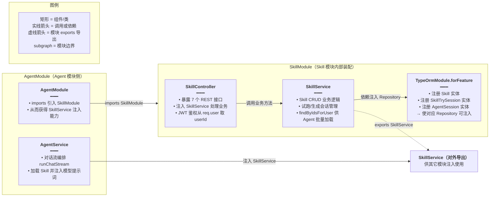
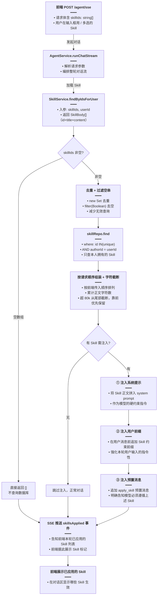
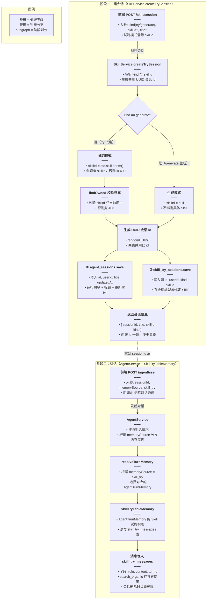

# Skill 系统后端

## 一、功能概述

Skill 是用户可编辑的 Prompt / 指令包（不进知识向量库），独立存于 `skill` 表。用户在知识库助手输入框用 `/` 多选 Skill，Agent 会把这些 Skill 正文作为硬约束注入本轮模型输入。Skill 页还支持「试跑」（用某个 Skill 做对话）和「生成」（让 Agent 起草 Skill 正文）两种侧栏模式。

## 二、实现方案

后端新增 `services/skill/` 模块，包含：

- `skill` 表：存 Skill 正文（title + content + authorId）
- `skill_try_sessions` / `skill_try_messages` / `skill_try_session_summaries`：Skill 试跑 / 生成的会话与消息
- `SkillService`：Skill CRUD + 试跑会话管理 + 按 id 批量加载（供 Agent）
- `SkillController`：REST 接口
- `SkillTryTableMemory`：Skill 试跑的 `AgentTurnMemory` 实现（见《Agent业务消息分表方案》）

### 模块依赖



## 三、改动点明细

### 1. `apps/backend/src/services/skill/skill.entity.ts`（新增）

#### 改动原因
定义 Skill 表结构，用户可编辑的 Prompt 指令包，不进知识向量库。

#### 改动前
无此文件。

#### 改动后
```ts
// 从 typeorm 包引入实体装饰器，用于将类映射为数据库表结构
import {
	// Column 装饰器：把类属性映射为数据库表的普通列
	Column,
	// CreateDateColumn 装饰器：自动维护记录创建时间的列
	CreateDateColumn,
	// Entity 装饰器：声明该类为 TypeORM 实体，对应一张数据库表
	Entity,
	// Index 装饰器：为指定字段创建数据库索引以提升查询速度
	Index,
	// PrimaryGeneratedColumn 装饰器：声明自动生成的主键列
	PrimaryGeneratedColumn,
	// UpdateDateColumn 装饰器：自动维护记录更新时间的列
	UpdateDateColumn,
} from 'typeorm';

/** 用户可编辑的 Skill / Prompt 指令包（不进知识向量库） */
// 声明该类对应数据库表名为 skill 的实体
@Entity({ name: 'skill' })
// 在 authorId 字段上建立名为 IDX_skill_author 的索引，加速按作者查询 Skill 列表的性能
@Index('IDX_skill_author', ['authorId'])
export class Skill {
	// 声明主键为 UUID 类型，由数据库自动生成
	@PrimaryGeneratedColumn('uuid')
	// Skill 唯一标识符，使用 UUID 字符串
	id!: string;

	// 声明 title 字段为 varchar 类型，最大长度 200
	@Column('varchar', { length: 200 })
	// Skill 的标题，用于在列表中展示
	title!: string;

	// 声明 content 字段为 longtext 类型，可存储超长 Prompt 文本
	@Column({ type: 'longtext' })
	// Skill 的正文内容，即 Prompt 指令包的具体指令
	content!: string;

	// 声明 authorId 字段对应数据库列 author_id，类型为 int
	@Column({ name: 'author_id', type: 'int' })
	// Skill 作者的用户 ID，用于权限校验与列表过滤
	authorId!: number;

	// 声明 createdAt 字段对应数据库列 created_at，类型为 timestamp，由 TypeORM 自动填充创建时间
	@CreateDateColumn({ name: 'created_at', type: 'timestamp' })
	// 记录创建时间
	createdAt!: Date;

	// 声明 updatedAt 字段对应数据库列 updated_at，类型为 timestamp，由 TypeORM 自动更新修改时间
	@UpdateDateColumn({ name: 'updated_at', type: 'timestamp' })
	// 记录最后更新时间
	updatedAt!: Date;
}
```

#### 改动说明
Skill 表很简单：标题 + 正文 + 作者。正文用 `longtext` 因为 Prompt 可能很长。不进知识向量库，所以没有 embedding 相关字段。

---

### 2. `apps/backend/src/services/skill/skill.service.ts`（新增）

#### 改动原因
Skill 模块的核心服务：CRUD + 按 id 批量加载 + 试跑会话管理。

#### 改动前
无此文件。

#### 改动后
```ts
// 从 @nestjs/common 引入一组内置异常类与 Injectable 装饰器，用于业务校验与依赖注入
import {
	// BadRequestException：参数不合法时抛出，对应 HTTP 400
	BadRequestException,
	// ForbiddenException：无权限操作时抛出，对应 HTTP 403
	ForbiddenException,
	// Injectable：将该类声明为可被 NestJS 依赖注入容器管理的服务
	Injectable,
	// NotFoundException：资源不存在时抛出，对应 HTTP 404
	NotFoundException,
} from '@nestjs/common';
// 从 @nestjs/typeorm 引入 InjectRepository 装饰器，用于注入 TypeORM Repository 实例
import { InjectRepository } from '@nestjs/typeorm';
// 从 node 内置 crypto 模块引入 randomUUID，用于生成 UUID 会话 ID
import { randomUUID } from 'node:crypto';
// 从 typeorm 引入 In 操作符与 Repository 类型，前者用于批量 IN 查询，后者是实体仓库的类型
import { In, Repository } from 'typeorm';
// 引入 AgentSession 实体，Skill 试跑会话的标题与更新时间复用 agent_sessions 表存储
import { AgentSession } from '../agent/agent-session.entity';
// 引入创建试跑会话的 DTO，定义入参结构（kind、skillId、title 等）
import { CreateSkillTrySessionDto } from './dto/create-skill-try-session.dto';
// 引入新建 Skill 的 DTO，包含 title 与 content 字段
import { SaveSkillDto } from './dto/save-skill.dto';
// 引入更新 Skill 的 DTO，包含 id、title、content 字段
import { UpdateSkillDto } from './dto/update-skill.dto';
// 引入 Skill 实体，对应 skill 表
import { Skill } from './skill.entity';
// 引入 SkillTrySession 实体，对应 skill_try_sessions 表
import { SkillTrySession } from './skill-try-session.entity';

// 定义 SkillBody 类型：Agent 加载 Skill 时使用的精简结构，只包含注入模型所需的 id、标题、正文
export type SkillBody = {
	// Skill 的唯一标识
	id: string;
	// Skill 的标题
	title: string;
	// Skill 的正文内容
	content: string;
};

// 定义单轮可加载的 Skill 正文总字符上限，避免注入过多 Prompt 导致上下文爆炸
const SKILL_CHARS_CAP = 80_000;

// 声明该服务可被 NestJS 依赖注入容器管理
@Injectable()
export class SkillService {
	// 构造函数：通过依赖注入获取三个实体的 Repository 实例
	constructor(
		// 注入 Skill 实体的 Repository，用于操作 skill 表
		@InjectRepository(Skill)
		private readonly skillRepo: Repository<Skill>,
		// 注入 SkillTrySession 实体的 Repository，用于操作 skill_try_sessions 表
		@InjectRepository(SkillTrySession)
		private readonly trySessionRepo: Repository<SkillTrySession>,
		// 注入 AgentSession 实体的 Repository，用于操作 agent_sessions 表
		@InjectRepository(AgentSession)
		private readonly agentSessionRepo: Repository<AgentSession>,
	) {}

	/** 新建 Skill */
	// 新建一条 Skill 记录，入参为当前用户 ID 与保存 DTO，返回保存后的实体
	async create(userId: number, dto: SaveSkillDto): Promise<Skill> {
		// 用 skillRepo.create 创建实体实例，标题去除首尾空格，正文原样写入，作者为当前用户
		const row = this.skillRepo.create({
			title: dto.title.trim(),
			content: dto.content,
			authorId: userId,
		});
		// 调用 save 将实体持久化到数据库并返回
		return this.skillRepo.save(row);
	}

	/** 更新 Skill（仅作者本人） */
	// 更新 Skill，先校验归属再按字段做部分更新
	async update(userId: number, dto: UpdateSkillDto): Promise<Skill> {
		// 调用 findOwned 校验 Skill 存在且归当前用户所有，否则抛异常
		const row = await this.findOwned(userId, dto.id);
		// 仅当 title 不为 null 时才更新标题并去除首尾空格，支持部分更新
		if (dto.title != null) row.title = dto.title.trim();
		// 仅当 content 不为 null 时才更新正文
		if (dto.content != null) row.content = dto.content;
		// 保存更新后的实体
		return this.skillRepo.save(row);
	}

	/** 删除 Skill（连带删除其试跑会话） */
	// 删除 Skill，同时级联删除其所有试跑会话（skill_try_sessions + agent_sessions）
	async remove(userId: number, id: string): Promise<void> {
		// 校验归属，非本人无法删除
		const row = await this.findOwned(userId, id);
		// 查出该 Skill 下当前用户的所有试跑会话，只取 id 用于后续批量删除
		const tryRows = await this.trySessionRepo.find({
			where: { userId, skillId: id },
			select: ['id'],
		});
		// 只有存在试跑会话时才执行级联删除，避免无谓的数据库操作
		if (tryRows.length) {
			// 提取所有试跑会话的 id 数组
			const ids = tryRows.map((r) => r.id);
			// 批量删除 skill_try_sessions 表中对应的记录，加 userId 条件防止越权
			await this.trySessionRepo.delete({ id: In(ids), userId });
			// 同步删除 agent_sessions 表中同 id 的记录，两表 id 一致
			await this.agentSessionRepo.delete({ id: In(ids), userId });
		}
		// 删除 Skill 主记录
		await this.skillRepo.remove(row);
	}

	/** 列出我的 Skill（按更新时间倒序） */
	// 列出当前用户的所有 Skill，按更新时间倒序排列
	async listMine(userId: number): Promise<Skill[]> {
		// 查询 authorId 为当前用户的记录，按 updatedAt 降序排序
		return this.skillRepo.find({
			where: { authorId: userId },
			order: { updatedAt: 'DESC' },
		});
	}

	/** 查单个 Skill（仅本人） */
	// 查询当前用户的单个 Skill 详情
	async findOneMine(userId: number, id: string): Promise<Skill> {
		// 复用 findOwned 做归属校验并返回实体
		return this.findOwned(userId, id);
	}

	/**
	 * 按请求顺序返回本人 Skill；丢弃无权/缺失 ID。
	 * 合计正文超长时从尾部截断集合（靠前优先）。
	 */
	// 供 Agent 加载 Skill：按请求顺序返回本人 Skill，合计正文超上限时从尾部截断
	async findByIdsForUser(
		// 前端传入的 Skill ID 数组，可能为空
		ids: string[] | undefined,
		// 当前用户 ID，用于过滤归属
		userId: number,
	): Promise<SkillBody[]> {
		// 若 ids 为空或长度为 0，直接返回空数组，避免后续无效查询
		if (!ids?.length) return [];
		// 对 ids 去重并过滤空串，减少不必要的数据库查询
		const unique = [...new Set(ids.filter(Boolean))];
		// 去重过滤后为空则返回空数组
		if (!unique.length) return [];
		// 查询本人拥有的、id 在 unique 列表中的 Skill 记录
		const rows = await this.skillRepo.find({
			where: { id: In(unique), authorId: userId },
		});
		// 将查询结果转为 id 到实体的 Map，方便按请求顺序快速查找
		const byId = new Map(rows.map((r) => [r.id, r]));
		// 初始化按请求顺序排列的结果数组
		const ordered: SkillBody[] = [];
		// 累计已选 Skill 的正文字符数
		let chars = 0;
		// 按前端请求的顺序遍历 ids，靠前的优先保留
		for (const id of ids) {
			// 从 Map 中取出该 id 对应的实体，不存在（无权限或已删除）则跳过
			const row = byId.get(id);
			if (!row) continue;
			// 计算加入当前 Skill 后的总字符数
			const next = chars + row.content.length;
			// 当结果已有至少一个 Skill 且加入当前后超过上限时停止，保证靠前的 Skill 被保留
			if (next > SKILL_CHARS_CAP && ordered.length > 0) break;
			// 将当前 Skill 加入结果数组
			ordered.push({
				id: row.id,
				title: row.title,
				content: row.content,
			});
			// 更新累计字符数
			chars = next;
		}
		// 返回按请求顺序且不超字符上限的 Skill 列表
		return ordered;
	}

	/** 新建 Skill 侧栏会话：skill_try_sessions + 同 id 的 agent_sessions */
	// 新建 Skill 试跑/生成会话，同时在 agent_sessions 与 skill_try_sessions 两张表写入同 id 的记录
	async createTrySession(userId: number, dto: CreateSkillTrySessionDto) {
		// 确定会话类型：只有明确传 generate 才是生成模式，否则默认试跑模式
		const kind = dto.kind === 'generate' ? 'generate' : 'try';
		// 生成模式不绑定具体 Skill（skillId 为 null）；试跑模式取传入的 skillId 并去空格，缺省为 null
		const skillId =
			kind === 'generate' ? null : dto.skillId?.trim() || null;
		// 试跑模式必须绑定 skillId，否则抛 400 参数错误
		if (kind === 'try' && !skillId) {
			throw new BadRequestException('试跑会话必须绑定 skillId');
		}
		// 若存在 skillId（试跑场景），校验该 Skill 归当前用户所有
		if (skillId) await this.findOwned(userId, skillId);
		// 生成一个 UUID 作为会话 ID，两张表共用此 ID
		const id = randomUUID();
		// 取标题并去空格，缺省为 null
		const title = dto.title?.trim() || null;
		// 取当前时间，用于两张表的 updatedAt 保持一致
		const now = new Date();
		// 先在 agent_sessions 表插入记录（运行句柄 + 标题 + 更新时间）
		await this.agentSessionRepo.save(
			this.agentSessionRepo.create({
				id,
				userId,
				title,
				updatedAt: now,
			}),
		);
		// 再在 skill_try_sessions 表插入记录（kind + skillId）
		await this.trySessionRepo.save(
			this.trySessionRepo.create({
				id,
				userId,
				kind,
				skillId,
				updatedAt: now,
			}),
		);
		// 返回新建会话的关键信息
		return { sessionId: id, title, skillId, kind };
	}

	/**
	 * 列出 Skill 侧栏历史。
	 * try：按 skillId；generate：用户级全局列表（不按 Skill）。
	 */
	// 列出 Skill 试跑/生成的历史会话，支持分页
	async listTrySessions(
		// 当前用户 ID
		userId: number,
		// 可选参数对象：skillId、kind、页码、每页条数
		opts: {
			skillId?: string | null;
			kind?: 'try' | 'generate';
			pageNo?: number;
			pageSize?: number;
		},
	): Promise<{ /* ... */ }> {
		// 确定查询的会话类型，默认为 try
		const kind = opts.kind === 'generate' ? 'generate' : 'try';
		// 生成模式不按 skillId 过滤；试跑模式取传入 skillId，缺省为 null
		const sid = kind === 'try' ? opts.skillId?.trim() || null : null;
		// 试跑模式必须传 skillId，否则抛 400
		if (kind === 'try' && !sid) {
			throw new BadRequestException('试跑历史须传 skillId');
		}
		// 试跑模式下校验 Skill 归属
		if (sid) await this.findOwned(userId, sid);
		// 计算页码，最小为 1，向下取整防止小数
		const pn = Math.max(1, Math.floor(opts.pageNo ?? 1));
		// 计算每页条数，限制在 1~50 之间，默认 20
		const ps = Math.min(50, Math.max(1, Math.floor(opts.pageSize ?? 20)));
		// 基于 agent_sessions 构建查询（标题与更新时间在此表），先按用户过滤
		// 不用 innerJoin(Entity) 是因为 ponytail 多库 databaseName 配置会导致 join 崩溃
		const qb = this.agentSessionRepo
			.createQueryBuilder('a')
			.where('a.user_id = :uid', { uid: userId });
		// 生成模式：用子查询筛选出 skill_try_sessions 中 kind 为 generate 的会话 id
		if (kind === 'generate') {
			qb.andWhere(
				`a.id IN (SELECT t.id FROM skill_try_sessions t WHERE t.user_id = :uid AND t.kind = 'generate')`,
			);
		} else {
			// 试跑模式：用子查询筛选出指定 skillId 且 kind 为 try 的会话 id
			qb.andWhere(
				`a.id IN (SELECT t.id FROM skill_try_sessions t WHERE t.user_id = :uid AND t.kind = 'try' AND t.skill_id = :sid)`,
				{ sid },
			);
		}
		// 按更新时间倒序，并应用分页偏移与条数
		qb.orderBy('a.updated_at', 'DESC')
			.skip((pn - 1) * ps)
			.take(ps);
		// 执行查询，同时获取记录列表与总条数
		const [rows, total] = await qb.getManyAndCount();
		// 组装返回结果，包含会话信息与分页元数据
		return {
			skillId: sid,
			kind,
			list: rows.map((r) => ({
				sessionId: r.id,
				title: r.title,
				createdAt: r.createdAt,
				updatedAt: r.updatedAt,
			})),
			pageNo: pn,
			pageSize: ps,
			total,
		};
	}

	/** 校验 Skill 归属：不存在抛 404，非本人抛 403 */
	// 私有方法：按 id 查 Skill，并校验归当前用户所有
	private async findOwned(userId: number, id: string): Promise<Skill> {
		// 按主键 id 查询 Skill
		const row = await this.skillRepo.findOne({ where: { id } });
		// 记录不存在则抛 404
		if (!row) throw new NotFoundException('Skill 不存在');
		// 记录作者不是当前用户则抛 403
		if (row.authorId !== userId) throw new ForbiddenException('无权操作该 Skill');
		// 校验通过，返回 Skill 实体
		return row;
	}
}
```

#### 改动说明
- `findByIdsForUser` 是 Agent 加载 Skill 的入口：按请求顺序返回本人 Skill，合计正文超 80k 时从尾部截断（靠前优先）。
- `createTrySession` 同时建 `agent_sessions` 和 `skill_try_sessions`（同 id），因为停流 epoch 走 agent_sessions，kind/skillId 存在 skill_try_sessions。
- `listTrySessions` 用子查询而非 innerJoin，避免 ponytail 多库 `databaseName` 问题。

---

### 3. `apps/backend/src/services/skill/skill.controller.ts`（新增）

#### 改动原因
暴露 Skill CRUD 与试跑会话的 REST 接口。

#### 改动前
无此文件。

#### 改动后
```ts
// 控制器提供以下接口：
// POST   /skill/save          新建 Skill
// GET    /skill/list          列出我的 Skill
// GET    /skill/detail/:id    查单个 Skill
// PUT    /skill/update/:id    更新 Skill
// DELETE /skill/delete/:id    删除 Skill
// POST   /skill/session       新建试跑/生成会话
// GET    /skill/sessions      列出试跑/生成历史
```
（具体实现为标准 NestJS 控制器，注入 SkillService，调用对应方法返回 `{ success, data }` 格式。）

#### 改动说明
所有接口走 JWT 鉴权，userId 从 req.user 取。

---

### 4. `apps/backend/src/services/skill/skill.module.ts`（新增）

#### 改动原因
Skill 模块的 DI 装配。

#### 改动前
无此文件。

#### 改动后
```ts
// 从 @nestjs/common 引入 Module 装饰器，用于声明 NestJS 模块
import { Module } from '@nestjs/common';
// 从 @nestjs/typeorm 引入 TypeOrmModule，用于注册实体的 Repository
import { TypeOrmModule } from '@nestjs/typeorm';
// 引入 AgentSession 实体，试跑会话的标题与更新时间复用 agent_sessions 表
import { AgentSession } from '../agent/agent-session.entity';
// 引入 Skill 控制器，暴露 REST 接口
import { SkillController } from './skill.controller';
// 引入 Skill 实体
import { Skill } from './skill.entity';
// 引入 Skill 服务，提供业务逻辑
import { SkillService } from './skill.service';
// 引入 SkillTrySession 实体
import { SkillTrySession } from './skill-try-session.entity';

// 声明 SkillModule 模块
@Module({
	// 注册三个实体到 TypeORM，使其 Repository 可被注入
	imports: [TypeOrmModule.forFeature([Skill, SkillTrySession, AgentSession])],
	// 注册控制器
	controllers: [SkillController],
	// 注册服务提供者
	providers: [SkillService],
	// 导出 SkillService，供 AgentModule 等其他模块注入使用
	exports: [SkillService],
})
export class SkillModule {}
```

#### 改动说明
SkillModule 导出 `SkillService`，AgentModule 引入后即可在 AgentService 中注入使用。

---

### 5. `apps/backend/src/services/skill/skill-try-session.entity.ts` / `skill-try-message.entity.ts` / `skill-try-session-summary.entity.ts`（新增）

#### 改动原因
Skill 试跑 / 生成的会话、消息、摘要表实体。

#### 改动前
无。

#### 改动后（核心字段）

**skill-try-session.entity.ts**
```ts
// 声明该类对应数据库表 skill_try_sessions
@Entity({ name: 'skill_try_sessions' })
export class SkillTrySession {
	// 声明 id 为主键列，varchar 类型长度 36，与 agent_sessions.id 保持一致以便关联
	@PrimaryColumn({ type: 'varchar', length: 36 })
	// 会话 ID，与 agent_sessions 表的 id 相同
	id!: string;

	// 声明 userId 对应数据库列 user_id，int 类型
	@Column({ name: 'user_id', type: 'int' })
	// 会话所属用户 ID
	userId!: number;

	// 声明 kind 为 enum 类型，取值 try 或 generate
	@Column({ type: 'enum', enum: ['try', 'generate'] })
	// 会话类型：试跑或生成
	kind!: 'try' | 'generate';

	// 声明 skillId 对应数据库列 skill_id，varchar 长度 36，允许为空
	@Column({ name: 'skill_id', type: 'varchar', length: 36, nullable: true })
	// 绑定的 Skill ID，试跑时非空，生成模式为 null
	skillId!: string | null;

	// 声明 updatedAt 对应数据库列 updated_at，自动维护更新时间
	@UpdateDateColumn({ name: 'updated_at' })
	// 会话最后更新时间
	updatedAt!: Date;
}
```

**skill-try-message.entity.ts**
```ts
// 声明该类对应数据库表 skill_try_messages
@Entity({ name: 'skill_try_messages' })
export class SkillTryMessage {
	// 声明主键为 UUID 类型，由数据库自动生成
	@PrimaryGeneratedColumn('uuid')
	// 消息唯一标识
	id!: string;

	// 声明多对一关系：多条消息属于一个试跑会话，会话删除时级联删除消息
	@ManyToOne(() => SkillTrySession, { onDelete: 'CASCADE' })
	// 指定外键列名为 session_id
	@JoinColumn({ name: 'session_id' })
	// 关联的试跑会话
	session!: SkillTrySession;

	// 声明 role 为 enum 类型，取值为 SkillTryMessageRole 中定义的角色
	@Column({ type: 'enum', enum: SkillTryMessageRole })
	// 消息角色：用户或助手
	role!: 'user' | 'assistant';

	// 声明 turnId 对应数据库列 turn_id，允许为空
	@Column({ name: 'turn_id', nullable: true })
	// 消息所属轮次 ID，用于关联 Agent 对话轮次
	turnId!: string | null;

	// 声明 content 为 longtext 类型，可存储超长消息内容
	@Column({ type: 'longtext' })
	// 消息正文内容
	content!: string;

	// 声明 searchOrganic 对应数据库列 search_organic，json 类型，允许为空
	@Column({ name: 'search_organic', type: 'json', nullable: true })
	// 联网检索结果胶囊，试跑过程中若使用搜索则存储搜索结果
	searchOrganic!: SerperOrganicItem[] | null;

	// 声明 createdAt 对应数据库列 created_at，自动维护创建时间
	@CreateDateColumn({ name: 'created_at' })
	// 消息创建时间
	createdAt!: Date;
}
```

**skill-try-session-summary.entity.ts**
```ts
// 声明该类对应数据库表 skill_try_session_summaries
@Entity({ name: 'skill_try_session_summaries' })
export class SkillTrySessionSummary {
	// 声明 sessionId 为主键列，对应数据库列 session_id，varchar 长度 36
	@PrimaryColumn({ name: 'session_id', length: 36 })
	// 会话 ID，与 skill_try_sessions.id 一致
	sessionId!: string;

	// 声明 summary 为 longtext 类型，可存储超长摘要
	@Column({ type: 'longtext' })
	// 会话历史消息的折叠摘要
	summary!: string;

	// 声明 coversBeforeAt 对应数据库列 covers_before_at，timestamp 类型，允许为空
	@Column({ name: 'covers_before_at', type: 'timestamp', nullable: true })
	// 水印时间点：此时间之前的消息已被折叠进摘要
	coversBeforeAt!: Date | null;
}
```

#### 改动说明
`skill_try_sessions.id` 与 `agent_sessions.id` 相同，`skill_try_sessions` 存 `kind` 和 `skillId`，`agent_sessions` 存标题和 `updatedAt`（历史列表从 agent_sessions 取）。

---

### 6. `apps/backend/src/app.module.ts`（修改）

#### 改动原因
在根模块注册 SkillModule。

#### 改动前
```ts
// imports 中无 SkillModule
```

#### 改动后
```ts
// 在 app.module.ts 的 imports 数组中加入 SkillModule
imports: [
	// ... 其它模块
	// 引入 Skill 模块，使 SkillService 等能力在整个应用中可用
	SkillModule,
]
```

#### 改动说明
SkillModule 需在根模块注册，AgentModule 通过 `imports: [SkillModule]` 引入 SkillService。

## 四、功能实现逻辑

### Skill CRUD 流程

```mermaid
flowchart TD
    subgraph LEGEND["图例"]
        LG["矩形 = 处理步骤<br/>菱形 = 判断/分支<br/>subgraph = CRUD 分支"]
    end

    subgraph CREATE["① Create 新建 Skill"]
        C1["<b>前端请求</b><br/>━━━<br/>• POST /skill/save<br/>• 入参: title, content<br/>• JWT 携带 userId"]
        C2["<b>SkillService.create</b><br/>━━━<br/>• title.trim() 去空格<br/>• content 原样写入<br/>• authorId = 当前 userId"]
        C3["<b>skillRepo.save</b><br/>━━━<br/>• 插入 skill 表<br/>• 数据库自动生成 id 与时间戳"]
        C1 -->|"调用"| C2
        C2 -->|"持久化"| C3
    end

    subgraph LIST["② List 列出我的 Skill"]
        Ls1["<b>前端请求</b><br/>━━━<br/>• GET /skill/list<br/>• 无需入参"]
        Ls2["<b>SkillService.listMine</b><br/>━━━<br/>• 按 authorId = userId 过滤<br/>• 返回本人所有 Skill"]
        Ls3["<b>skillRepo.find</b><br/>━━━<br/>• where: authorId = userId<br/>• order: updatedAt DESC（更新时间倒序）"]
        Ls1 -->|"调用"| Ls2
        Ls2 -->|"查询"| Ls3
    end

    subgraph UPDATE["③ Update 更新 Skill"]
        U1["<b>前端请求</b><br/>━━━<br/>• PUT /skill/update/:id<br/>• 入参: id, title?, content?<br/>• 支持部分更新"]
        U2["<b>SkillService.update</b><br/>━━━<br/>• 先校验归属<br/>• 仅非空字段才更新"]
        U3{"findOwned 校验<br/>Skill 存在且归本人?"}
        U4["<b>skillRepo.save</b><br/>━━━<br/>• 更新 skill 表对应记录<br/>• title 重新 trim"]
        U5["<b>抛异常</b><br/>━━━<br/>• 不存在 → 404 NotFound<br/>• 非本人 → 403 Forbidden"]
        U1 -->|"调用"| U2
        U2 -->|"校验"| U3
        U3 -->|"是"| U4
        U3 -->|"否"| U5
    end

    subgraph REMOVE["④ Remove 删除 Skill"]
        R1["<b>前端请求</b><br/>━━━<br/>• DELETE /skill/delete/:id<br/>• 入参: id"]
        R2["<b>SkillService.remove</b><br/>━━━<br/>• 校验归属<br/>• 级联删除试跑会话"]
        R3{"findOwned 校验<br/>Skill 存在且归本人?"}
        R4["<b>级联删除试跑会话</b><br/>━━━<br/>• trySessionRepo.delete IN(ids)<br/>• agentSessionRepo.delete IN(ids)<br/>• 两表 id 一致，同步删除"]
        R5["<b>skillRepo.remove</b><br/>━━━<br/>• 删除 skill 主记录"]
        R6["<b>抛异常</b><br/>━━━<br/>• 不存在 → 404<br/>• 非本人 → 403"]
        R1 -->|"调用"| R2
        R2 -->|"校验"| R3
        R3 -->|"是"| R4
        R4 -->|"删除 Skill"| R5
        R3 -->|"否"| R6
    end
```



### Agent 加载 Skill 流程



### Skill 试跑 / 生成流程



## 五、注意事项 / 风险点

1. **Skill 正文 80k 上限**：`findByIdsForUser` 合计正文超 80k 时从尾部截断，靠前的 Skill 优先保留。前端也限制最多选 8 个。
2. **试跑必须绑 skillId**：`createTrySession` 的 `kind=try` 时必须传 `skillId`，否则抛 400。
3. **生成模式不挂 Skill**：`kind=generate` 的会话 `skillId=null`，历史是用户级全局列表。
4. **删除 Skill 连带删试跑会话**：`remove` 会删该 Skill 所有试跑会话的 `skill_try_sessions` + `agent_sessions`。
5. **列表用子查询**：`listTrySessions` 不用 `innerJoin(Entity)`，因为 ponytail 多库 `databaseName` 配置会导致 join 崩。
