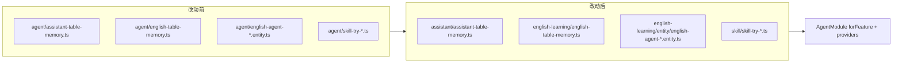

# 业务 Agent 记忆文件归位（从共享 `agent/` 迁入领域目录）

> **日期**：2026-09-16  
> **性质**：纯路径重构（**无行为变化**）  
> **延伸阅读**：
> - [Agent记忆分表.md](./Agent记忆分表.md) — `AgentTurnMemory` 端口与分表实现思路
> - [Agent业务消息分表落地.md](./Agent业务消息分表落地.md) — M0–M4 落地与回归清单
> - 规划：[docs/ideas/agent/Agent业务消息分表.md](../ideas/agent/Agent业务消息分表.md)

**文档角色**：记录「业务记忆实体 / TableMemory 实现」从共享 `apps/backend/src/services/agent/` **物理迁入** `assistant/`、`english-learning/`、`skill/` 的改动前后对比。Nest DI 注册关系不变，仅 import 路径调整。

**产品姊妹稿**：本改动对终端用户**不可见**（无新能力、无文案、无交互变化），**不要求**同步 `project-guide` / `project-update-info` 及四套前端姊妹 TS。

---

## 1. 背景与目标

业务消息分表（M1–M3）落地时，`AssistantTableMemory` / `EnglishTableMemory` / `SkillTryTableMemory` 及英语、Skill 试跑相关实体曾临时放在共享 `agent/` 目录，便于与 `AgentService.resolveTurnMemory` 同仓联调。分表稳定后，这些文件语义上属于各自业务域，继续堆在 `agent/` 会：

- 模糊「通用 Agent 运行时」与「领域表记忆」边界；
- 让 Share / 其它模块误以为业务实体是 Agent 核心依赖；
- 与既有约定（assistant 实体在 `assistant/`、英语实体在 `english-learning/entity/`、Skill 试跑在 `skill/`）不一致。

**目标**：把业务记忆文件**归位**到领域目录；**保持** `AgentModule` 仍 `forFeature` + `providers` 注入三类 TableMemory；**不改**表名、迁移、SSE 路由、分享解析逻辑语义。

---

## 2. 改动范围

### 2.1 迁出文件（改动后路径）

| 改动后路径 | 归属域 |
| ---------- | ------ |
| `apps/backend/src/services/assistant/assistant-table-memory.ts` | 知识库助手 / Skill 对话 |
| `apps/backend/src/services/english-learning/english-table-memory.ts` | 英语学习 |
| `apps/backend/src/services/english-learning/entity/english-agent-message.entity.ts` | 英语学习 |
| `apps/backend/src/services/english-learning/entity/english-agent-session.entity.ts` | 英语学习 |
| `apps/backend/src/services/english-learning/entity/english-agent-session-summary.entity.ts` | 英语学习 |
| `apps/backend/src/services/skill/skill-try-message.entity.ts` | Skill 试跑 |
| `apps/backend/src/services/skill/skill-try-session-summary.entity.ts` | Skill 试跑 |
| `apps/backend/src/services/skill/skill-try-table-memory.ts` | Skill 试跑 |

**改动前**：上述文件均位于 `apps/backend/src/services/agent/`（与 `agent.service.ts` 同级；英语实体未进 `entity/` 子目录）。

### 2.2 仅改 import 的消费者

| 路径 | 说明 |
| ---- | ---- |
| `apps/backend/src/services/agent/agent.module.ts` | `forFeature` / `providers` 符号不变，改为跨目录 import |
| `apps/backend/src/services/agent/agent.service.ts` | 注入三类 TableMemory + `EnglishAgentSession` 的 import 路径 |
| `apps/backend/src/services/share/share.module.ts` | 英语 / 试跑实体改为从领域目录 import |
| `apps/backend/src/services/share/share.service.ts` | 同上（构造注入仓储类型） |

### 2.3 明确不在本专题范围

- `AgentTurnMemory` 端口、`resolveTurnMemory`、分表写入策略（见 [Agent记忆分表.md](./Agent记忆分表.md)）。
- Share 侧「英语表 → 试跑表 → 遗留 `agent_messages`」查询分支的**功能**落地（见 [Agent业务消息分表落地.md](./Agent业务消息分表落地.md)）；本篇只关心实体 **import 路径** 是否跟文件归位一致。
- 数据库表结构 / migration / 前端 Store。

---

## 3. 实现思路

1. **按域归位，不按调用方归位**：文件跟「谁拥有这张业务表」走，而不是跟「谁注入了 TableMemory」走；通用 SSE 仍在 `AgentModule`。
2. **DI 不动、路径动**：`AgentModule.providers` 继续列出 `AssistantTableMemory` / `EnglishTableMemory` / `SkillTryTableMemory`；`TypeOrmModule.forFeature([...])` 实体列表符号不变。避免再拆 `EnglishLearningMemoryModule` 等额外 Nest 模块（YAGNI）。
3. **相对 import 随目录深度调整**：迁出后 TableMemory 回指 `agent-turn-memory` 用 `../agent/...`；英语实体进 `entity/` 后互引用保持同目录 `./`，对 `web-search` 多一层 `../../`。
4. **TypeORM 全局实体 glob 已覆盖**：`entities: [\`${__dirname}/../**/*.entity{.ts,.js}\`]` 递归匹配任意子目录下的 `*.entity.ts`，迁目录**不必**改 `TypeOrmConfigService`。
5. **无运行时行为变更**：不改类名、表名、`@Entity`、方法体、provider token；编译通过即完成。



---

## 4. 关键实现（改动前 / 改动后对比 + 注释）

### 4.1 `AgentModule`（`apps/backend/src/services/agent/agent.module.ts`）

**对比范围**：整文件（`@Module` 装饰器与 `export class AgentModule`）。

**基线说明**：`git show HEAD:apps/backend/src/services/agent/agent.module.ts` 仍是「仅 `agent_*` 三实体」的旧快照，**早于**业务分表工作树。下列「改动前」按**归位前工作树**忠实还原：业务实体与 TableMemory 已用 `./` 从同目录引入，且 `forFeature` / `providers` 已含业务符号。

**改动前** · `apps/backend/src/services/agent/agent.module.ts`（归位前工作树还原 · 整文件）

```typescript
// Nest 模块装饰器与元数据
import { Module } from '@nestjs/common';
// TypeORM 特性模块：按模块注册实体仓储
import { TypeOrmModule } from '@nestjs/typeorm';
// 助手会话实体（已在 assistant/；归位前亦从领域目录引）
import { AssistantMessage } from '../assistant/assistant-message.entity';
// 助手会话行
import { AssistantSession } from '../assistant/assistant-session.entity';
// 助手会话摘要行
import { AssistantSessionSummary } from '../assistant/assistant-session-summary.entity';
// 归位前：助手表记忆实现与 agent.service 同目录
import { AssistantTableMemory } from './assistant-table-memory';
// 归位前：英语表记忆实现与 agent.service 同目录
import { EnglishTableMemory } from './english-table-memory';
// 归位前：英语消息实体落在 agent/ 根下
import { EnglishAgentMessage } from './english-agent-message.entity';
// 归位前：英语会话实体落在 agent/ 根下
import { EnglishAgentSession } from './english-agent-session.entity';
// 归位前：英语摘要实体落在 agent/ 根下
import { EnglishAgentSessionSummary } from './english-agent-session-summary.entity';
// 知识库问答模块（工具链依赖，与归位无关）
import { KnowledgeQaModule } from '../knowledge-qa/knowledge-qa.module';
// Skill 模块（试跑会话创建等）
import { SkillModule } from '../skill/skill.module';
// 归位前：试跑消息实体在 agent/
import { SkillTryMessage } from './skill-try-message.entity';
// 试跑会话实体本身已在 skill/（本轮未迁）
import { SkillTrySession } from '../skill/skill-try-session.entity';
// 归位前：试跑摘要实体在 agent/
import { SkillTrySessionSummary } from './skill-try-session-summary.entity';
// 归位前：试跑表记忆实现在 agent/
import { SkillTryTableMemory } from './skill-try-table-memory';
// Agent HTTP 控制器
import { AgentController } from './agent.controller';
// Agent SSE / 会话服务
import { AgentService } from './agent.service';
// 遗留 agent_* 默认记忆
import { AgentMemoryService } from './agent-memory.service';
// 通用 Agent 消息实体
import { AgentMessage } from './agent-message.entity';
// 通用 Agent 会话（停流句柄）
import { AgentSession } from './agent-session.entity';
// 通用 Agent 会话摘要
import { AgentSessionSummary } from './agent-session-summary.entity';

// 声明本 Nest 模块的 imports / controllers / providers / exports
@Module({
	// 本模块需要导入的其它 Nest / TypeORM 特性
	imports: [
		// 为本模块注入下列实体的 Repository
		TypeOrmModule.forFeature([
			// 通用会话句柄表
			AgentSession,
			// 遗留 / 回退消息表
			AgentMessage,
			// 通用摘要表
			AgentSessionSummary,
			// Skill 试跑会话
			SkillTrySession,
			// Skill 试跑消息
			SkillTryMessage,
			// Skill 试跑摘要
			SkillTrySessionSummary,
			// 助手会话
			AssistantSession,
			// 助手消息
			AssistantMessage,
			// 助手摘要
			AssistantSessionSummary,
			// 英语业务会话
			EnglishAgentSession,
			// 英语业务消息
			EnglishAgentMessage,
			// 英语业务摘要
			EnglishAgentSessionSummary,
		]),
		// 挂载知识库问答能力
		KnowledgeQaModule,
		// 挂载 Skill 域能力
		SkillModule,
	],
	// 暴露 Agent HTTP / SSE 路由
	controllers: [AgentController],
	// 可注入的服务与表记忆实现（token = 类本身）
	providers: [
		// SSE 与会话编排
		AgentService,
		// 默认 agent_* 记忆
		AgentMemoryService,
		// M1 助手表记忆（归位前文件在本目录）
		AssistantTableMemory,
		// M2 英语表记忆
		EnglishTableMemory,
		// M3 试跑表记忆
		SkillTryTableMemory,
	],
	// 对外只导出编排与默认记忆，业务 TableMemory 供本模块内注入
	exports: [AgentService, AgentMemoryService],
})
// 导出模块类供 AppModule 导入
export class AgentModule {}
```

**改动后** · `apps/backend/src/services/agent/agent.module.ts`（当前 · 约 L1–L53 · 整文件）

```typescript
// Nest 模块装饰器与元数据
import { Module } from '@nestjs/common';
// TypeORM 特性模块：按模块注册实体仓储
import { TypeOrmModule } from '@nestjs/typeorm';
// 助手消息实体（领域目录，未迁）
import { AssistantMessage } from '../assistant/assistant-message.entity';
// 助手会话实体
import { AssistantSession } from '../assistant/assistant-session.entity';
// 助手会话摘要实体
import { AssistantSessionSummary } from '../assistant/assistant-session-summary.entity';
// 归位后：助手表记忆从 assistant/ 引入
import { AssistantTableMemory } from '../assistant/assistant-table-memory';
// 归位后：英语表记忆从 english-learning/ 引入
import { EnglishTableMemory } from '../english-learning/english-table-memory';
// 归位后：英语消息实体在 english-learning/entity/
import { EnglishAgentMessage } from '../english-learning/entity/english-agent-message.entity';
// 归位后：英语会话实体在 english-learning/entity/
import { EnglishAgentSession } from '../english-learning/entity/english-agent-session.entity';
// 归位后：英语摘要实体在 english-learning/entity/
import { EnglishAgentSessionSummary } from '../english-learning/entity/english-agent-session-summary.entity';
// 知识库问答模块
import { KnowledgeQaModule } from '../knowledge-qa/knowledge-qa.module';
// Skill 模块
import { SkillModule } from '../skill/skill.module';
// 归位后：试跑消息实体在 skill/
import { SkillTryMessage } from '../skill/skill-try-message.entity';
// 试跑会话实体（本轮未迁，仍在 skill/）
import { SkillTrySession } from '../skill/skill-try-session.entity';
// 归位后：试跑摘要实体在 skill/
import { SkillTrySessionSummary } from '../skill/skill-try-session-summary.entity';
// 归位后：试跑表记忆在 skill/
import { SkillTryTableMemory } from '../skill/skill-try-table-memory';
// Agent HTTP 控制器（仍在本目录）
import { AgentController } from './agent.controller';
// Agent SSE / 会话服务
import { AgentService } from './agent.service';
// 遗留 agent_* 默认记忆
import { AgentMemoryService } from './agent-memory.service';
// 通用 Agent 消息实体
import { AgentMessage } from './agent-message.entity';
// 通用 Agent 会话（停流句柄）
import { AgentSession } from './agent-session.entity';
// 通用 Agent 会话摘要
import { AgentSessionSummary } from './agent-session-summary.entity';

// 声明本 Nest 模块的 imports / controllers / providers / exports
@Module({
	// 本模块需要导入的其它 Nest / TypeORM 特性
	imports: [
		// 为本模块注入下列实体的 Repository（符号列表与归位前相同）
		TypeOrmModule.forFeature([
			// 通用会话句柄表
			AgentSession,
			// 遗留 / 回退消息表
			AgentMessage,
			// 通用摘要表
			AgentSessionSummary,
			// Skill 试跑会话
			SkillTrySession,
			// Skill 试跑消息
			SkillTryMessage,
			// Skill 试跑摘要
			SkillTrySessionSummary,
			// 助手会话
			AssistantSession,
			// 助手消息
			AssistantMessage,
			// 助手摘要
			AssistantSessionSummary,
			// 英语业务会话
			EnglishAgentSession,
			// 英语业务消息
			EnglishAgentMessage,
			// 英语业务摘要
			EnglishAgentSessionSummary,
		]),
		// 挂载知识库问答能力
		KnowledgeQaModule,
		// 挂载 Skill 域能力
		SkillModule,
	],
	// 暴露 Agent HTTP / SSE 路由
	controllers: [AgentController],
	// 可注入服务与三类业务 TableMemory（注册方式未改）
	providers: [
		// SSE 与会话编排
		AgentService,
		// 默认 agent_* 记忆
		AgentMemoryService,
		// M1：仍由 AgentModule 提供，仅源文件路径变了
		AssistantTableMemory,
		// M2：同上
		EnglishTableMemory,
		// M3：同上
		SkillTryTableMemory,
	],
	// 对外导出编排与默认记忆
	exports: [AgentService, AgentMemoryService],
})
// 导出模块类供 AppModule 导入
export class AgentModule {}
```

**变更摘要**：`forFeature` / `providers` / `exports` **结构不变**；唯一实质差异是业务 TableMemory 与英语 / 试跑实体的 import 从 `./…` 改为 `../assistant|english-learning|skill/…`。

---

### 4.2 `ShareModule`（`apps/backend/src/services/share/share.module.ts`）

**对比范围**：整文件（小文件）。

**改动前** · `apps/backend/src/services/share/share.module.ts`（归位前：英语 / 试跑消息从 `../agent/` 引入 · 整文件结构）

```typescript
// Nest 模块装饰器
import { Module } from '@nestjs/common';
// TypeORM 特性模块
import { TypeOrmModule } from '@nestjs/typeorm';
// 通用 Agent 消息（停流遗留路径仍用）
import { AgentMessage } from '../agent/agent-message.entity';
// 通用 Agent 会话
import { AgentSession } from '../agent/agent-session.entity';
// 归位前：英语消息实体误放在共享 agent/ 下
import { EnglishAgentMessage } from '../agent/english-agent-message.entity';
// 归位前：英语会话实体在 agent/
import { EnglishAgentSession } from '../agent/english-agent-session.entity';
// 归位前：试跑消息实体在 agent/
import { SkillTryMessage } from '../agent/skill-try-message.entity';
// 助手消息（领域目录）
import { AssistantMessage } from '../assistant/assistant-message.entity';
// 助手会话
import { AssistantSession } from '../assistant/assistant-session.entity';
// 主聊天附件
import { Attachments } from '../chat/attachments.entity';
// 主聊天消息
import { ChatMessages } from '../chat/chat.entity';
// 聊天模块（MessageService）
import { ChatModule } from '../chat/chat.module';
// 主聊天会话
import { ChatSessions } from '../chat/session.entity';
// 电子书助手消息
import { EbookAssistantMessage } from '../ebook-assistant/ebook-assistant-message.entity';
// 电子书助手会话
import { EbookAssistantSession } from '../ebook-assistant/ebook-assistant-session.entity';
// 知识库实体
import { Knowledge } from '../knowledge/knowledge.entity';
// 试跑会话（已在 skill/）
import { SkillTrySession } from '../skill/skill-try-session.entity';
// 分享控制器
import { ShareController } from './share.controller';
// 分享服务
import { ShareService } from './share.service';

// 声明 Share 模块
@Module({
	// 导入依赖与实体仓储
	imports: [
		// 导入 ChatModule 以使用 MessageService
		ChatModule,
		// 注册 TypeORM 实体
		TypeOrmModule.forFeature([
			// 主聊天消息
			ChatMessages,
			// 主聊天会话
			ChatSessions,
			// 附件
			Attachments,
			// 助手会话
			AssistantSession,
			// 助手消息
			AssistantMessage,
			// Agent 会话句柄
			AgentSession,
			// Agent 遗留消息
			AgentMessage,
			// 英语业务会话（符号不变，仅 import 路径将改）
			EnglishAgentSession,
			// 英语业务消息
			EnglishAgentMessage,
			// 试跑会话
			SkillTrySession,
			// 试跑消息
			SkillTryMessage,
			// 电子书助手会话
			EbookAssistantSession,
			// 电子书助手消息
			EbookAssistantMessage,
			// 知识库
			Knowledge,
		]),
	],
	// 分享 HTTP
	controllers: [ShareController],
	// 分享业务
	providers: [ShareService],
})
// 导出 Share 模块类
export class ShareModule {}
```

**改动后** · `apps/backend/src/services/share/share.module.ts`（当前 · 约 L1–L46 · 整文件）

```typescript
// Nest 模块装饰器
import { Module } from '@nestjs/common';
// TypeORM 特性模块
import { TypeOrmModule } from '@nestjs/typeorm';
// 通用 Agent 消息
import { AgentMessage } from '../agent/agent-message.entity';
// 通用 Agent 会话
import { AgentSession } from '../agent/agent-session.entity';
// 归位后：英语消息从 english-learning/entity 引入
import { EnglishAgentMessage } from '../english-learning/entity/english-agent-message.entity';
// 归位后：英语会话从 english-learning/entity 引入
import { EnglishAgentSession } from '../english-learning/entity/english-agent-session.entity';
// 归位后：试跑消息从 skill/ 引入
import { SkillTryMessage } from '../skill/skill-try-message.entity';
// 助手消息
import { AssistantMessage } from '../assistant/assistant-message.entity';
// 助手会话
import { AssistantSession } from '../assistant/assistant-session.entity';
// 主聊天附件
import { Attachments } from '../chat/attachments.entity';
// 主聊天消息
import { ChatMessages } from '../chat/chat.entity';
// 聊天模块（MessageService）
import { ChatModule } from '../chat/chat.module';
// 主聊天会话
import { ChatSessions } from '../chat/session.entity';
// 电子书助手消息
import { EbookAssistantMessage } from '../ebook-assistant/ebook-assistant-message.entity';
// 电子书助手会话
import { EbookAssistantSession } from '../ebook-assistant/ebook-assistant-session.entity';
// 知识库实体
import { Knowledge } from '../knowledge/knowledge.entity';
// 试跑会话（仍在 skill/）
import { SkillTrySession } from '../skill/skill-try-session.entity';
// 分享控制器
import { ShareController } from './share.controller';
// 分享服务
import { ShareService } from './share.service';

// 声明 Share 模块
@Module({
	// 导入依赖与实体仓储
	imports: [
		// 导入 ChatModule 以使用 MessageService
		ChatModule,
		// 注册 TypeORM 实体
		TypeOrmModule.forFeature([
			// 主聊天消息
			ChatMessages,
			// 主聊天会话
			ChatSessions,
			// 附件
			Attachments,
			// 助手会话
			AssistantSession,
			// 助手消息
			AssistantMessage,
			// Agent 会话句柄
			AgentSession,
			// Agent 遗留消息
			AgentMessage,
			// 英语业务会话（forFeature 符号未改）
			EnglishAgentSession,
			// 英语业务消息
			EnglishAgentMessage,
			// 试跑会话
			SkillTrySession,
			// 试跑消息
			SkillTryMessage,
			// 电子书助手会话
			EbookAssistantSession,
			// 电子书助手消息
			EbookAssistantMessage,
			// 知识库
			Knowledge,
		]),
	],
	// 分享 HTTP
	controllers: [ShareController],
	// 分享业务
	providers: [ShareService],
})
// 导出 Share 模块类
export class ShareModule {}
```

**变更摘要**：`forFeature` 列表不变；英语 / 试跑相关 import 从 `../agent/…` 改为领域路径。`ShareService` 顶部同类 import 同步（见 §4.3）。

---

### 4.3 `ShareService` import 区（路径同步）

**对比范围**：文件顶部实体 import（约 L18–L31）；构造注入符号名不变。

**改动前** · `apps/backend/src/services/share/share.service.ts`（归位前 import 摘录）

```typescript
// 通用 Agent 消息仓储类型
import { AgentMessage } from '../agent/agent-message.entity';
// 通用 Agent 会话仓储类型
import { AgentSession } from '../agent/agent-session.entity';
// 归位前：英语消息类型从 agent/ 解析
import { EnglishAgentMessage } from '../agent/english-agent-message.entity';
// 归位前：英语会话类型从 agent/ 解析
import { EnglishAgentSession } from '../agent/english-agent-session.entity';
// 归位前：试跑消息类型从 agent/ 解析
import { SkillTryMessage } from '../agent/skill-try-message.entity';
// 助手消息
import { AssistantMessage } from '../assistant/assistant-message.entity';
// 助手会话
import { AssistantSession } from '../assistant/assistant-session.entity';
// ...（未改动：chat / ebook / knowledge 等）
// 试跑会话（已在 skill/）
import { SkillTrySession } from '../skill/skill-try-session.entity';
```

**改动后** · `apps/backend/src/services/share/share.service.ts`（当前 · 约 L18–L31）

```typescript
// 通用 Agent 消息仓储类型
import { AgentMessage } from '../agent/agent-message.entity';
// 通用 Agent 会话仓储类型
import { AgentSession } from '../agent/agent-session.entity';
// 归位后：英语消息类型从 english-learning/entity 解析
import { EnglishAgentMessage } from '../english-learning/entity/english-agent-message.entity';
// 归位后：英语会话类型从 english-learning/entity 解析
import { EnglishAgentSession } from '../english-learning/entity/english-agent-session.entity';
// 归位后：试跑消息类型从 skill/ 解析
import { SkillTryMessage } from '../skill/skill-try-message.entity';
// 助手消息
import { AssistantMessage } from '../assistant/assistant-message.entity';
// 助手会话
import { AssistantSession } from '../assistant/assistant-session.entity';
// ...（未改动：chat / ebook / knowledge 等）
// 试跑会话（仍在 skill/）
import { SkillTrySession } from '../skill/skill-try-session.entity';
```

**变更摘要**：仅模块解析路径；`@InjectRepository(EnglishAgentMessage)` 等 token 与运行逻辑不变。

---

### 4.4 `AgentService` 业务记忆 import

**对比范围**：构造注入依赖的 import 行。

**改动前** · `apps/backend/src/services/agent/agent.service.ts`（归位前）

```typescript
// 端口类型（本目录，未迁）
import type {
	// 一轮流式业务记忆接口
	AgentTurnMemory,
	// 助手消息上记录的已应用 Skill 引用
	AppliedSkillRef,
} from './agent-turn-memory';
// 归位前：同目录相对路径
import { AssistantTableMemory } from './assistant-table-memory';
// 归位前：同目录
import { EnglishTableMemory } from './english-table-memory';
// 归位前：同目录英语会话实体
import { EnglishAgentSession } from './english-agent-session.entity';
// 归位前：同目录试跑记忆
import { SkillTryTableMemory } from './skill-try-table-memory';
```

**改动后** · `apps/backend/src/services/agent/agent.service.ts`（当前 · 约 L41–L48）

```typescript
// 端口类型仍留在 agent/
import type {
	// 一轮流式业务记忆接口
	AgentTurnMemory,
	// 助手消息上记录的已应用 Skill 引用
	AppliedSkillRef,
} from './agent-turn-memory';
// 归位后：跨到 assistant/
import { AssistantTableMemory } from '../assistant/assistant-table-memory';
// 归位后：跨到 english-learning/
import { EnglishTableMemory } from '../english-learning/english-table-memory';
// 归位后：英语会话实体在 entity 子目录
import { EnglishAgentSession } from '../english-learning/entity/english-agent-session.entity';
// 归位后：跨到 skill/
import { SkillTryTableMemory } from '../skill/skill-try-table-memory';
```

**变更摘要**：`constructor` 注入字段类型与 `resolveTurnMemory` 分支未改，只改模块解析路径。

---

### 4.5 迁出文件头部：相对 import 调整（改动后前 ~30 行）

下列「改动后」取自当前源码前约 30 行；「改动前」按文件仍在 `agent/` 时的相对路径还原。方法体与类逻辑**不在本专题对比范围**（无行为 diff）。

#### 4.5.1 `assistant-table-memory.ts`

**改动前** · `apps/backend/src/services/agent/assistant-table-memory.ts`（归位前 · 头部 import）

```typescript
// LangChain 消息类型包
import {
	// AI 回复消息类
	AIMessage,
	// 基类消息
	BaseMessage,
	// 用户消息类
	HumanMessage,
	// 系统消息类
	SystemMessage,
} from '@langchain/core/messages';
// OpenAI 兼容 Chat 模型封装
import { ChatOpenAI } from '@langchain/openai';
// Nest 可注入与 404
import { Injectable, NotFoundException } from '@nestjs/common';
// 配置读取
import { ConfigService } from '@nestjs/config';
// 仓储注入装饰器
import { InjectRepository } from '@nestjs/typeorm';
// 模型枚举
import { ModelEnum } from 'src/enum/config.enum';
// TypeORM 仓储类型
import { Repository } from 'typeorm';
// 归位前：与 agent-turn-memory 同目录
import type {
	// 业务记忆端口（本文件实现侧可不声明 implements）
	AgentTurnMemory,
	// 更新助手内容选项
	UpdateAssistantContentOpts,
} from './agent-turn-memory';
// 助手消息实体在领域目录
import {
	// 消息实体类
	AssistantMessage,
	// 角色枚举
	AssistantMessageRole,
} from '../assistant/assistant-message.entity';
// 助手会话实体
import { AssistantSession } from '../assistant/assistant-session.entity';
// 助手摘要实体
import { AssistantSessionSummary } from '../assistant/assistant-session-summary.entity';
```

**改动后** · `apps/backend/src/services/assistant/assistant-table-memory.ts`（当前 · 约 L1–L22）

```typescript
// LangChain 消息类型包
import {
	// AI 回复消息类
	AIMessage,
	// 基类消息
	BaseMessage,
	// 用户消息类
	HumanMessage,
	// 系统消息类
	SystemMessage,
} from '@langchain/core/messages';
// OpenAI 兼容 Chat 模型封装
import { ChatOpenAI } from '@langchain/openai';
// Nest 可注入与 404
import { Injectable, NotFoundException } from '@nestjs/common';
// 配置读取
import { ConfigService } from '@nestjs/config';
// 仓储注入装饰器
import { InjectRepository } from '@nestjs/typeorm';
// 模型枚举
import { ModelEnum } from 'src/enum/config.enum';
// TypeORM 仓储类型
import { Repository } from 'typeorm';
// 归位后：端口类型回指 agent/
import type {
	// 业务记忆端口类型
	AgentTurnMemory,
	// 更新助手内容选项
	UpdateAssistantContentOpts,
} from '../agent/agent-turn-memory';
// 同目录助手消息实体
import {
	// 消息实体类
	AssistantMessage,
	// 角色枚举
	AssistantMessageRole,
} from './assistant-message.entity';
// 同目录助手会话实体
import { AssistantSession } from './assistant-session.entity';
// 同目录助手摘要实体
import { AssistantSessionSummary } from './assistant-session-summary.entity';
```

**变更摘要**：`agent-turn-memory` 变为 `../agent/...`；助手实体改为同目录 `./`。

---

#### 4.5.2 `english-table-memory.ts`

**改动前** · `apps/backend/src/services/agent/english-table-memory.ts`（归位前 · 头部）

```typescript
// LangChain 消息类型
import {
	// AI 消息
	AIMessage,
	// 基类
	BaseMessage,
	// 用户消息
	HumanMessage,
	// 系统消息
	SystemMessage,
} from '@langchain/core/messages';
// Chat 模型
import { ChatOpenAI } from '@langchain/openai';
// 可注入
import { Injectable } from '@nestjs/common';
// 配置
import { ConfigService } from '@nestjs/config';
// 仓储注入
import { InjectRepository } from '@nestjs/typeorm';
// 模型枚举
import { ModelEnum } from 'src/enum/config.enum';
// 仓储类型
import { Repository } from 'typeorm';
// 归位前：端口同目录
import type {
	// 记忆端口
	AgentTurnMemory,
	// 更新助手内容选项
	UpdateAssistantContentOpts,
} from './agent-turn-memory';
// 归位前：英语实体与本文件同目录
import {
	// 英语消息实体
	EnglishAgentMessage,
	// 角色枚举
	EnglishAgentMessageRole,
} from './english-agent-message.entity';
// 英语会话
import { EnglishAgentSession } from './english-agent-session.entity';
// 英语摘要
import { EnglishAgentSessionSummary } from './english-agent-session-summary.entity';
```

**改动后** · `apps/backend/src/services/english-learning/english-table-memory.ts`（当前 · 约 L1–L22）

```typescript
// LangChain 消息类型
import {
	// AI 消息
	AIMessage,
	// 基类
	BaseMessage,
	// 用户消息
	HumanMessage,
	// 系统消息
	SystemMessage,
} from '@langchain/core/messages';
// Chat 模型
import { ChatOpenAI } from '@langchain/openai';
// 可注入
import { Injectable } from '@nestjs/common';
// 配置
import { ConfigService } from '@nestjs/config';
// 仓储注入
import { InjectRepository } from '@nestjs/typeorm';
// 模型枚举
import { ModelEnum } from 'src/enum/config.enum';
// 仓储类型
import { Repository } from 'typeorm';
// 归位后：端口回指 agent/
import type {
	// 记忆端口
	AgentTurnMemory,
	// 更新助手内容选项
	UpdateAssistantContentOpts,
} from '../agent/agent-turn-memory';
// 归位后：实体在 entity/ 子目录
import {
	// 英语消息实体
	EnglishAgentMessage,
	// 角色枚举
	EnglishAgentMessageRole,
} from './entity/english-agent-message.entity';
// 英语会话实体
import { EnglishAgentSession } from './entity/english-agent-session.entity';
// 英语摘要实体
import { EnglishAgentSessionSummary } from './entity/english-agent-session-summary.entity';
```

**变更摘要**：实体改为 `./entity/...`；端口改为 `../agent/agent-turn-memory`。

---

#### 4.5.3 英语实体（`english-learning/entity/`）

**改动后** · `apps/backend/src/services/english-learning/entity/english-agent-message.entity.ts`（当前 · 约 L1–L21）

```typescript
// TypeORM 列与关系装饰器
import {
	// 普通列
	Column,
	// 创建时间
	CreateDateColumn,
	// 实体标记
	Entity,
	// 索引
	Index,
	// 外键列名
	JoinColumn,
	// 多对一
	ManyToOne,
	// UUID 主键
	PrimaryGeneratedColumn,
} from 'typeorm';
// 相对 entity/ 多一层到 web-search（归位前在 agent/ 时为 ../web-search）
import type { SerperOrganicItem } from '../../web-search/web-search.types';
// 同目录会话实体
import { EnglishAgentSession } from './english-agent-session.entity';

// 消息角色枚举（与表 role 列一致）
export enum EnglishAgentMessageRole {
	// 用户
	USER = 'user',
	// 助手
	ASSISTANT = 'assistant',
}

// 映射表 english_agent_messages
@Entity('english_agent_messages')
// 会话 + 创建时间索引
@Index('idx_english_agent_msg_session_created', ['session', 'createdAt'])
// 会话 + turnId 索引
@Index('idx_english_agent_msg_session_turn', ['session', 'turnId'])
```

**改动后** · `apps/backend/src/services/english-learning/entity/english-agent-session.entity.ts`（当前 · 约 L1–L17）

```typescript
// TypeORM 装饰器
import {
	// 列
	Column,
	// 创建时间
	CreateDateColumn,
	// 实体
	Entity,
	// 索引
	Index,
	// 一对多
	OneToMany,
	// 主键（与 agent_sessions 同 id）
	PrimaryColumn,
	// 更新时间
	UpdateDateColumn,
} from 'typeorm';
// 同目录消息实体（反向关系）
import { EnglishAgentMessage } from './english-agent-message.entity';

// 英语学习 Agent 业务会话（与 agent_sessions 同 id 作停流句柄）
@Entity('english_agent_sessions')
// 用户 + 更新时间索引
@Index('idx_english_agent_session_user_updated', ['userId', 'updatedAt'])
```

**改动后** · `apps/backend/src/services/english-learning/entity/english-agent-session-summary.entity.ts`（当前 · 约 L1–L21）

```typescript
// TypeORM 装饰器
import {
	// 普通列装饰器
	Column,
	// 创建时间列
	CreateDateColumn,
	// 实体标记
	Entity,
	// 索引装饰器
	Index,
	// 主键（session_id）
	PrimaryColumn,
	// 更新时间列
	UpdateDateColumn,
} from 'typeorm';

/**
 * 英语学习 Agent 会话的长对话摘要（与 agent_session_summaries 同套路，消息分表后摘要也落在英语域）。
 * 每会话一行；EnglishTableMemory 多轮变长时把旧消息压成摘要写入本表，
 * 组 LangChain 历史时先塞 summary、再拼 coversBeforeAt 之后的原文，控制 token。
 * 删会话时摘要行一并删除。
 */
// 表名未改，仅文件目录变了
@Entity('english_agent_session_summaries')
// 按 sessionId 索引
@Index('idx_english_agent_summary_session', ['sessionId'])
```

**改动前要点（还原）**：三文件曾在 `apps/backend/src/services/agent/`；`english-agent-message` 对 `web-search` 为 `../web-search/web-search.types`；会话/消息互引仍为同目录 `./`。**表名与列定义未改。**

---

#### 4.5.4 Skill 试跑文件

**改动后** · `apps/backend/src/services/skill/skill-try-message.entity.ts`（当前 · 约 L1–L22）

```typescript
// TypeORM 装饰器
import {
	// 普通列
	Column,
	// 创建时间
	CreateDateColumn,
	// 实体标记
	Entity,
	// 索引
	Index,
	// 外键列名
	JoinColumn,
	// 多对一关系
	ManyToOne,
	// UUID 主键
	PrimaryGeneratedColumn,
} from 'typeorm';
// skill/ 与 web-search 同级，相对路径与归位前在 agent/ 时同为 ../web-search
import type { SerperOrganicItem } from '../web-search/web-search.types';
// 归位后：试跑会话已在同目录（归位前多为 ../skill/skill-try-session.entity）
import { SkillTrySession } from './skill-try-session.entity';

// 试跑消息角色枚举
export enum SkillTryMessageRole {
	// 用户轮
	USER = 'user',
	// 助手轮
	ASSISTANT = 'assistant',
}

/** Skill 试跑/生成消息（业务表；session_id = skill_try_sessions.id） */
// 映射表 skill_try_messages（表名未改）
@Entity('skill_try_messages')
// 会话 + 创建时间索引
@Index('idx_skill_try_msg_session_created', ['session', 'createdAt'])
// 会话 + turnId 索引
@Index('idx_skill_try_msg_session_turn', ['session', 'turnId'])
```

**改动后** · `apps/backend/src/services/skill/skill-try-session-summary.entity.ts`（当前 · 约 L1–L18）

```typescript
// TypeORM 装饰器
import {
	// 普通列
	Column,
	// 创建时间
	CreateDateColumn,
	// 实体标记
	Entity,
	// 索引
	Index,
	// 主键（session_id）
	PrimaryColumn,
	// 更新时间
	UpdateDateColumn,
} from 'typeorm';

/**
 * Skill 试跑 / 生成会话的长对话摘要（与 agent_session_summaries 同套路，消息分表后摘要也落在 skill_try 域）。
 * 每会话一行；SkillTryTableMemory 多轮变长时把旧消息压成摘要写入本表，
 * 组 LangChain 历史时先塞 summary、再拼 coversBeforeAt 之后的原文，控制 token。
 * 删会话时摘要行一并删除。
 */
// 映射表 skill_try_session_summaries（表名未改）
@Entity('skill_try_session_summaries')
// 按 sessionId 索引
@Index('idx_skill_try_summary_session', ['sessionId'])
```

**改动后** · `apps/backend/src/services/skill/skill-try-table-memory.ts`（当前 · 约 L1–L23）

```typescript
// LangChain 消息类型
import {
	// AI 回复消息类
	AIMessage,
	// 基类消息
	BaseMessage,
	// 用户消息类
	HumanMessage,
	// 系统消息类
	SystemMessage,
} from '@langchain/core/messages';
// Chat 模型
import { ChatOpenAI } from '@langchain/openai';
// 可注入
import { Injectable } from '@nestjs/common';
// 配置
import { ConfigService } from '@nestjs/config';
// 仓储注入
import { InjectRepository } from '@nestjs/typeorm';
// 模型枚举
import { ModelEnum } from 'src/enum/config.enum';
// 仓储类型
import { Repository } from 'typeorm';
// 归位后：标题仍读 agent_sessions，回指 agent/
import { AgentSession } from '../agent/agent-session.entity';
// 归位后：端口回指 agent/
import type {
	// 业务记忆端口
	AgentTurnMemory,
	// 更新助手内容选项
	UpdateAssistantContentOpts,
} from '../agent/agent-turn-memory';
// 同目录试跑消息
import {
	// 消息实体
	SkillTryMessage,
	// 角色枚举
	SkillTryMessageRole,
} from './skill-try-message.entity';
// 同目录试跑会话
import { SkillTrySession } from './skill-try-session.entity';
// 同目录试跑摘要
import { SkillTrySessionSummary } from './skill-try-session-summary.entity';
```

**变更摘要**：试跑记忆与消息/摘要进 `skill/`；对 `AgentSession` / `AgentTurnMemory` 使用 `../agent/...`；表名与类名不变。

---

### 4.6 TypeORM 实体 glob（无需改动）

**来源** · `apps/backend/src/database/typeorm-config.service.ts`（当前 · 约 L27–L29 · 未因归位修改）

```typescript
		const envConfig = {
			// 展开基础 ormconfig
			...typeOrmConfig,
			// 递归匹配 services 下任意子目录的 *.entity.ts / *.js —— 迁目录仍被扫到
			entities: [`${__dirname}/../**/*.entity{.ts,.js}`],
			// 额外参数：请求侧 version
			version: version || body?.version || 'default',
		};
```

**变更摘要**：**无 diff**。强调归位不依赖改 glob 或 `autoLoadEntities`。

---

## 5. 兼容性与影响

| 项 | 结论 |
| -- | ---- |
| 运行时行为 | **无变化**：同 token 注入、同表名、同 `resolveTurnMemory` 分支 |
| Nest DI | `AgentModule` 仍注册三类 TableMemory + 业务实体 `forFeature` |
| 数据库 | 不改 migration / 表结构；开发态 `DB_SYNC` 仍按实体元数据 |
| TypeORM 加载 | `**/*.entity{.ts,.js}` 继续覆盖新路径 |
| API / 前端 | 无契约变更 |
| 产品文档 | **用户不可见重构** → **不必**更新 project-guide / project-update-info |
| 旧专题路径 | [Agent记忆分表.md](./Agent记忆分表.md) 内若仍写 `agent/assistant-table-memory.ts` 等，以**本篇路径表**与当前源码为准 |

**破坏性风险**：仅「仍写死旧相对路径」的本地未提交补丁 / 外部 fork 会编译失败；仓库内消费者已改完。

---

## 6. 测试与回归建议

本改动无逻辑 diff，回归以**编译 + 冒烟**为主（细项仍可复用 [Agent业务消息分表落地.md](./Agent业务消息分表落地.md) §4）：

1. `pnpm` / Nest 启动无「Cannot find module …assistant-table-memory / english-agent-…」类错误。
2. 知识库 Skill 对话一轮：消息仍落 `assistant_messages`。
3. 英语 Agent 一轮：消息仍落 `english_agent_*`。
4. Skill 试跑一轮：消息仍落 `skill_try_messages`。
5. `sessionType=agent` 分享：英语 / 试跑 / 遗留路径仍能拉到消息（Share import 正确即可）。

---

## 7. 相关源码路径表

| 说明 | 改动前（`agent/`） | 改动后 |
| ---- | ------------------ | ------ |
| 助手表记忆 | `apps/backend/src/services/agent/assistant-table-memory.ts` | `apps/backend/src/services/assistant/assistant-table-memory.ts` |
| 英语表记忆 | `apps/backend/src/services/agent/english-table-memory.ts` | `apps/backend/src/services/english-learning/english-table-memory.ts` |
| 英语消息实体 | `apps/backend/src/services/agent/english-agent-message.entity.ts` | `apps/backend/src/services/english-learning/entity/english-agent-message.entity.ts` |
| 英语会话实体 | `apps/backend/src/services/agent/english-agent-session.entity.ts` | `apps/backend/src/services/english-learning/entity/english-agent-session.entity.ts` |
| 英语摘要实体 | `apps/backend/src/services/agent/english-agent-session-summary.entity.ts` | `apps/backend/src/services/english-learning/entity/english-agent-session-summary.entity.ts` |
| 试跑消息实体 | `apps/backend/src/services/agent/skill-try-message.entity.ts` | `apps/backend/src/services/skill/skill-try-message.entity.ts` |
| 试跑摘要实体 | `apps/backend/src/services/agent/skill-try-session-summary.entity.ts` | `apps/backend/src/services/skill/skill-try-session-summary.entity.ts` |
| 试跑表记忆 | `apps/backend/src/services/agent/skill-try-table-memory.ts` | `apps/backend/src/services/skill/skill-try-table-memory.ts` |
| 模块注册（路径更新） | — | `apps/backend/src/services/agent/agent.module.ts` |
| SSE 注入（路径更新） | — | `apps/backend/src/services/agent/agent.service.ts` |
| 分享模块（路径更新） | — | `apps/backend/src/services/share/share.module.ts` |
| 分享服务（路径更新） | — | `apps/backend/src/services/share/share.service.ts` |
| 实体 glob（未改） | — | `apps/backend/src/database/typeorm-config.service.ts` |
| 记忆端口（未迁） | — | `apps/backend/src/services/agent/agent-turn-memory.ts` |

---

## 8. 相关文档

- [Agent记忆分表.md](./Agent记忆分表.md)
- [Agent业务消息分表落地.md](./Agent业务消息分表落地.md)
- [docs/ideas/agent/Agent业务消息分表.md](../ideas/agent/Agent业务消息分表.md)

---

（若与仓库最新源码不一致，以源码为准）
