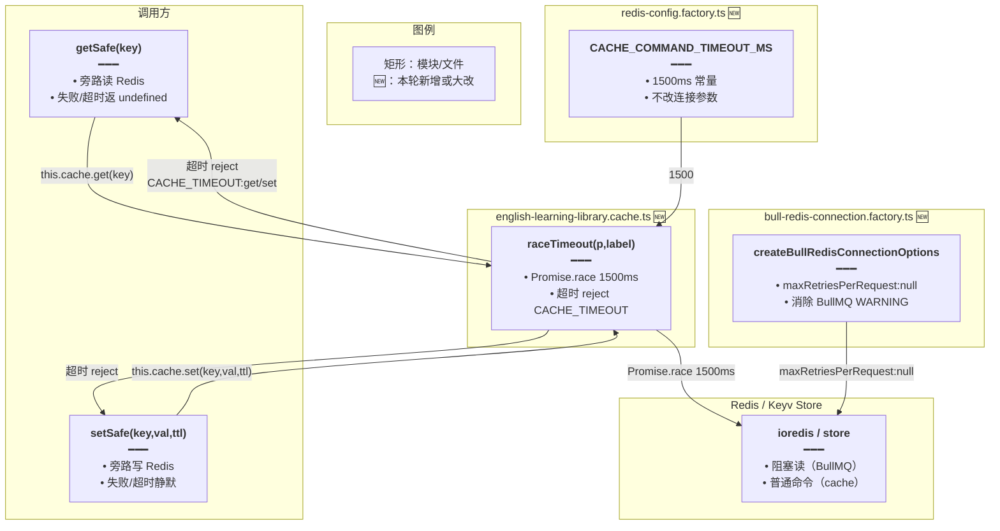

# Redis 缓存超时旁路

> 延伸阅读：[后端日志统一注入.md](./后端日志统一注入.md)（本轮同属后端横切优化，但聚焦日志管线；本篇聚焦 Redis 缓存命令超时与 BullMQ 连接参数）。

## 1. 背景与目标

英语学习资源库（`EnglishLearningLibraryCache`）用 Redis 旁路缓存库列表 / 词条页（`el:lib:*`），`getSafe` / `setSafe` 是请求路径上的关键 await。此前的问题：

1. **慢 / 挂起的 Redis 会阻塞请求**：`cache.get` / `cache.set` 无超时保护，Redis 抖动或网络挂起时单次命令可能等数十秒，拖垮请求线程池，表现为接口卡死、超时 504。
2. **BullMQ 连接刷 WARNING**：`createBullRedisConnectionOptions` 未显式设 `maxRetriesPerRequest: null`，ioredis 默认值与 BullMQ 的阻塞读要求冲突，启动时刷 `Using Redis maxRetriesPerRequest without null` 警告，淹没日志。
3. **死代码**：`redis-config.factory.ts` 残留一段注释掉的「测试连接」代码，无作用且易误导。

本轮目标：

- 新增 `CACHE_COMMAND_TIMEOUT_MS = 1500` 常量，仅供词库 `getSafe` / `setSafe` 与 TTS cacheOp 等「单次 await 旁路」用，不改变 Keyv / Cache 连接参数（验证码等仍走原语义）。
- `EnglishLearningLibraryCache` 新增 `raceTimeout(p, label)` 包装：`Promise.race` 一条 1500ms 定时器，超时即 reject `CACHE_TIMEOUT:${label}`，由 `getSafe` / `setSafe` 的 catch 兜底返回 `undefined` / 静默，不阻塞请求。
- `createBullRedisConnectionOptions` 显式设 `maxRetriesPerRequest: null`，消除 BullMQ WARNING。
- 删除 `redis-config.factory.ts` 的死代码测试连接块。

## 2. 改动范围

- `apps/backend/src/factorys/redis-config.factory.ts`（新增 `CACHE_COMMAND_TIMEOUT_MS` 常量；删除死代码）
- `apps/backend/src/factorys/bull-redis-connection.factory.ts`（`maxRetriesPerRequest: null`）
- `apps/backend/src/services/english-learning/english-learning-library.cache.ts`（`raceTimeout` + `getSafe` / `setSafe` 包装）

## 3. 实现思路

### 3.1 raceTimeout：1500ms 旁路超时

- **常量定位**：`CACHE_COMMAND_TIMEOUT_MS` 放在 `redis-config.factory.ts` 而非 cache 类内，便于 TTS cacheOp 等其它「单次 await 旁路」复用，避免重复定义。
- **不修改连接参数**：`CACHE_COMMAND_TIMEOUT_MS` 只作用于 `raceTimeout` 包装，不传给 ioredis `commandTimeout`（那会作用于 BullMQ 的 `XREAD BLOCK` / `BZPOPMIN` 等阻塞命令，误判超时）。
- **Promise.race 语义**：`raceTimeout(p, label)` 包一层 `new Promise`，内部起 `setTimeout(1500)`；先到的赢：
  - `p` 先 resolve → `clearTimeout(timer)` + resolve；
  - `p` 先 reject → `clearTimeout(timer)` + reject（让原错误透传给 `getSafe` / `setSafe` catch）；
  - `timer` 先到 → reject `CACHE_TIMEOUT:${label}`，原 `p` 仍在飞但不再 await（由 ioredis 内部兜底回收）。
- **不取消原命令**：JS 无法真正取消 ioredis 命令，`raceTimeout` 只是「不再等」；超时后底层连接仍可能完成，但结果被丢弃，不写缓存（`getSafe` catch 返回 `undefined`）。
- **getSafe / setSafe catch 兜底**：`getSafe` catch 返回 `undefined`（cache miss 语义，回源查库）；`setSafe` catch 静默（不写缓存不影响正确性，下次请求再写）。

### 3.2 BullMQ maxRetriesPerRequest: null

- **为何 null**：BullMQ 用 `XREAD BLOCK` / `BZPOPMIN` 等阻塞命令实现队列消费，这些命令本身会「长时间等待」；ioredis 默认 `maxRetriesPerRequest` 限制重试次数，与 BullMQ 的阻塞读语义冲突，启动时刷 WARNING。
- **显式写出**：`createBullRedisConnectionOptions` 显式 `maxRetriesPerRequest: null`，告诉 ioredis「不限制重试」，与 BullMQ 要求对齐，消除 WARNING。
- **不设 commandTimeout**：注释说明 BullMQ 依赖阻塞读，`commandTimeout` 会作用于整条命令等待时间，易在阻塞读正常等待时误判超时；本轮只加 `maxRetriesPerRequest`，不动 `commandTimeout`。

### 3.3 架构图



**读图要点**：`raceTimeout` 是 `getSafe` / `setSafe` 的超时旁路，常量来自 `redis-config.factory.ts`；BullMQ 连接的 `maxRetriesPerRequest:null` 是独立修复，与 `raceTimeout` 不耦合。

## 4. 关键实现（改动前 / 改动后对比 + 注释）

### 4.1 `CACHE_COMMAND_TIMEOUT_MS` 常量 + 死代码删除（`apps/backend/src/factorys/redis-config.factory.ts`）

**对比范围**：文件顶部新增 `CACHE_COMMAND_TIMEOUT_MS` 常量；`createCacheOptions` 内删除注释掉的「测试连接」块。

**改动前** · `apps/backend/src/factorys/redis-config.factory.ts`（基线，约 L1–L50）

```typescript
// 旧版：无超时常量；createCacheOptions 内残留测试连接注释块
import { Injectable } from '@nestjs/common';
import { ConfigService } from '@nestjs/config';
import { RedisEnum } from '../enum/config.enum';

// 旧版：无 CACHE_COMMAND_TIMEOUT_MS

@Injectable()
export class RedisConfigFactory implements CacheOptionsFactory {
	constructor(private readonly configService: ConfigService) {}

	public async createCacheOptions(): Promise<CacheModuleOptions> {
		// ...（未改动：建 store / error handler）

		// 旧版：残留的测试连接注释块，无作用且易误导
		// 测试连接
		// try {
		// 	await store.set('test_connection', Date.now(), 10000);
		// 	const testResult = await store.get('test_connection');
		// 	console.log(`Redis 连接测试 ${testResult ? '✅ 成功' : '❌ 失败'}`);
		// 	await store.delete('test_connection');
		// } catch (error) {
		// 	console.error('Redis连接测试失败:', error.message);
		// }

		return {
			store,
			// ttl...
		};
	}
}
```

**改动后** · `apps/backend/src/factorys/redis-config.factory.ts`（当前，约 L1–L50）

```typescript
// 新版：新增 CACHE_COMMAND_TIMEOUT_MS 常量；删除死代码
import { Injectable } from '@nestjs/common';
import { ConfigService } from '@nestjs/config';
import { RedisEnum } from '../enum/config.enum';

// 新增：仅供词库 getSafe / TTS cacheOp 等「单次 await 旁路」用，不改变 Keyv 连接参数
/**
 * 仅供词库 getSafe / TTS cacheOp 等「单次 await 旁路」用，不改变 Keyv 连接参数。
 * 验证码等仍走原 Cache 连接语义。
 */
export const CACHE_COMMAND_TIMEOUT_MS = 1500;

@Injectable()
export class RedisConfigFactory implements CacheOptionsFactory {
	constructor(private readonly configService: ConfigService) {}

	public async createCacheOptions(): Promise<CacheModuleOptions> {
		// ...（未改动：建 store / error handler）

		// 新版：删除残留的测试连接注释块（无作用，避免误导）

		return {
			store,
			// ttl...
		};
	}
}
```

**变更摘要**：新增 `CACHE_COMMAND_TIMEOUT_MS = 1500` 导出常量；删除 `createCacheOptions` 内的测试连接注释块。

### 4.2 `raceTimeout` + `getSafe` / `setSafe` 包装（`apps/backend/src/services/english-learning/english-learning-library.cache.ts`）

**对比范围**：`EnglishLearningLibraryCache` 类内新增 `raceTimeout` 私有方法；`getSafe` / `setSafe` 用 `raceTimeout` 包装 `cache.get` / `cache.set`。

**改动前** · `apps/backend/src/services/english-learning/english-learning-library.cache.ts`（基线，约 L1–L120）

```typescript
// 旧版：不导入超时常量；getSafe / setSafe 直接 await cache.get / set
import type { Cache } from '@nestjs/cache-manager';
import type { LoggerService } from '@nestjs/common';
// 旧版：无 CACHE_COMMAND_TIMEOUT_MS 导入

// ...（未改动：类型 / 常量 / key 工厂）

// 旧版：EnglishLearningLibraryCache 无 raceTimeout，getSafe / setSafe 直接 await
export class EnglishLearningLibraryCache {
	constructor(
		private readonly cache: Cache,
		private readonly logger: LoggerService,
	) {}

	// 旧版：无 raceTimeout

	async getSafe<T>(key: string): Promise<T | undefined> {
		try {
			// 旧版：直接 await，无超时保护，Redis 挂起会阻塞请求
			const v = await this.cache.get<T>(key);
			return v === null || v === undefined ? undefined : v;
		} catch (e) {
			this.logger.warn?.(
				`[el-lib-cache] get failed key=${key}: ${e instanceof Error ? e.message : e}`,
			);
			return undefined;
		}
	}

	async setSafe(key: string, value: unknown, ttlMs: number): Promise<void> {
		try {
			// 旧版：直接 await，无超时保护
			await this.cache.set(key, value, ttlMs);
		} catch (e) {
			this.logger.warn?.(
				`[el-lib-cache] set failed key=${key}: ${e instanceof Error ? e.message : e}`,
			);
		}
	}

	// ...（未改动：getVer / bumpVer / getListVers 等基于 getSafe / setSafe）
}
```

**改动后** · `apps/backend/src/services/english-learning/english-learning-library.cache.ts`（当前，约 L1–L137）

```typescript
// 新版：导入 CACHE_COMMAND_TIMEOUT_MS 常量
import type { Cache } from '@nestjs/cache-manager';
import type { LoggerService } from '@nestjs/common';
// 新增：从 redis-config.factory 导入超时常量
import { CACHE_COMMAND_TIMEOUT_MS } from '../../factorys/redis-config.factory';

// ...（未改动：类型 / 常量 / key 工厂）

// 新版：EnglishLearningLibraryCache 新增 raceTimeout；getSafe / setSafe 包装
export class EnglishLearningLibraryCache {
	constructor(
		private readonly cache: Cache,
		private readonly logger: LoggerService,
	) {}

	// 新增：raceTimeout 包装，Promise.race 一条 1500ms 定时器
	private raceTimeout<T>(p: Promise<T>, label: string): Promise<T> {
		// 返回一个新 Promise，与原 p 和 timer 竞速
		return new Promise<T>((resolve, reject) => {
			// 起 1500ms 定时器：到点 reject CACHE_TIMEOUT:${label}
			const timer = setTimeout(() => {
				// 超时 reject，由 getSafe / setSafe 的 catch 兜底
				reject(new Error(`CACHE_TIMEOUT:${label}`));
				// 常量来自 redis-config.factory，统一 1500ms
			}, CACHE_COMMAND_TIMEOUT_MS);
			// 原 p 先 resolve：clearTimer + resolve
			p.then(
				(v) => {
					// 清掉定时器，避免泄漏
					clearTimeout(timer);
					// 透传结果
					resolve(v);
				},
				(e) => {
					// 原 p 先 reject：clearTimer + reject，让原错误透传给 getSafe / setSafe catch
					clearTimeout(timer);
					// 透传错误
					reject(e);
				},
			);
		});
	}

	async getSafe<T>(key: string): Promise<T | undefined> {
		try {
			// 新版：用 raceTimeout 包装 cache.get，1500ms 超时即 reject
			const v = await this.raceTimeout(this.cache.get<T>(key), 'get');
			// null / undefined 统一为 undefined
			return v === null || v === undefined ? undefined : v;
		} catch (e) {
			// 超时或 Redis 失败：warn + 返回 undefined（cache miss 语义，回源查库）
			this.logger.warn?.(
				`[el-lib-cache] get failed key=${key}: ${e instanceof Error ? e.message : e}`,
			);
			// 返回 undefined，调用方走回源
			return undefined;
		}
	}

	async setSafe(key: string, value: unknown, ttlMs: number): Promise<void> {
		try {
			// 新版：用 raceTimeout 包装 cache.set，1500ms 超时即 reject
			await this.raceTimeout(this.cache.set(key, value, ttlMs), 'set');
		} catch (e) {
			// 超时或 Redis 失败：warn + 静默（不写缓存不影响正确性，下次再写）
			this.logger.warn?.(
				`[el-lib-cache] set failed key=${key}: ${e instanceof Error ? e.message : e}`,
			);
		}
	}

	// ...（未改动：getVer / bumpVer / getListVers 等基于 getSafe / setSafe）
}
```

**变更摘要**：导入 `CACHE_COMMAND_TIMEOUT_MS`；新增 `raceTimeout<T>(p, label)` 私有方法（`Promise.race` 1500ms 定时器）；`getSafe` / `setSafe` 用 `raceTimeout` 包装 `cache.get` / `cache.set`，超时由 catch 兜底。

### 4.3 BullMQ `maxRetriesPerRequest: null`（`apps/backend/src/factorys/bull-redis-connection.factory.ts`）

**对比范围**：`createBullRedisConnectionOptions` 返回对象新增 `maxRetriesPerRequest: null`；文件头注释补一行说明。

**改动前** · `apps/backend/src/factorys/bull-redis-connection.factory.ts`（基线，约 L1–L30）

```typescript
// 旧版：注释说不设 commandTimeout，但未提 maxRetriesPerRequest
/**
 * BullMQ / QueueEvents 共用的 Redis 连接选项。
 * 不显式设置 commandTimeout：BullMQ 依赖 XREAD BLOCK、BZPOPMIN 等阻塞命令，
 * ioredis 的 commandTimeout 会作用于整条命令等待时间，易在阻塞读正常等待时误判为超时并刷屏。
 */
export function createBullRedisConnectionOptions(configService: ConfigService) {
	return {
		// 旧版：无 maxRetriesPerRequest，ioredis 默认值与 BullMQ 冲突，启动刷 WARNING
		host: configService.get<string>(RedisEnum.REDIS_HOST),
		port: configService.get<number>(RedisEnum.REDIS_PORT),
		username: configService.get<string>(RedisEnum.REDIS_USERNAME),
		password: configService.get<string>(RedisEnum.REDIS_PASSWORD),
		connectTimeout: 5000,
		socket: {
			keepAlive: true,
			keepAliveInitialDelay: 30000,
		},
	};
}
```

**改动后** · `apps/backend/src/factorys/bull-redis-connection.factory.ts`（当前，约 L1–L30）

```typescript
// 新版：注释补 maxRetriesPerRequest 说明
/**
 * BullMQ / QueueEvents 共用的 Redis 连接选项。
 * 不显式设置 commandTimeout：BullMQ 依赖 XREAD BLOCK、BZPOPMIN 等阻塞命令，
 * ioredis 的 commandTimeout 会作用于整条命令等待时间，易在阻塞读正常等待时误判为超时并刷屏。
 * 新增：maxRetriesPerRequest 须为 null（Bull 要求；显式写出避免 WARNING）。
 */
export function createBullRedisConnectionOptions(configService: ConfigService) {
	return {
		host: configService.get<string>(RedisEnum.REDIS_HOST),
		port: configService.get<number>(RedisEnum.REDIS_PORT),
		username: configService.get<string>(RedisEnum.REDIS_USERNAME),
		password: configService.get<string>(RedisEnum.REDIS_PASSWORD),
		connectTimeout: 5000,
		// 新增：maxRetriesPerRequest: null，告诉 ioredis 不限制重试，与 BullMQ 阻塞读要求对齐
		maxRetriesPerRequest: null,
		socket: {
			keepAlive: true,
			keepAliveInitialDelay: 30000,
		},
	};
}
```

**变更摘要**：返回对象新增 `maxRetriesPerRequest: null`；文件头注释补一行说明 BullMQ 要求。

## 5. 行为变化与兼容性

- **词库缓存超时**：`getSafe` / `setSafe` 单次命令超过 1500ms 即 reject，由 catch 兜底（`getSafe` 返回 `undefined` 回源查库、`setSafe` 静默不写）；用户感知为「Redis 抖动时接口略慢但不会卡死」，而非超时 504。
- **超时不取消底层命令**：JS 无法真正取消 ioredis 命令，超时后底层连接仍可能完成；`getSafe` 丢弃结果不写缓存，下次请求再写，避免旧数据污染。
- **BullMQ WARNING 消除**：启动时不再刷 `Using Redis maxRetriesPerRequest without null`，日志更干净。
- **不影响验证码等其它 Cache 消费方**：`CACHE_COMMAND_TIMEOUT_MS` 只作用于 `EnglishLearningLibraryCache.raceTimeout`，不改变 `RedisConfigFactory.createCacheOptions` 返回的连接参数，验证码等仍走原 Cache 语义。
- **死代码清理**：删除 `createCacheOptions` 内的测试连接注释块，无行为变化。

## 6. 测试与回归建议

1. **正常命中**：Redis 正常时，`getSafe` / `setSafe` 行为与改动前一致（raceTimeout 不会触发，原 p 先 resolve）。
2. **超时回源**：模拟 Redis 慢（`DEBUG SLEEP 2` 或网络限速），确认 `getSafe` 在 ~1500ms 后返回 `undefined`，调用方回源查库；日志出现 `CACHE_TIMEOUT:get`。
3. **超时不写缓存**：`DEBUG SLEEP 2` 时 `setSafe` 在 ~1500ms 后静默，日志出现 `CACHE_TIMEOUT:set`，不抛错。
4. **BullMQ 启动**：重启后端，确认启动日志无 `maxRetriesPerRequest` WARNING，队列消费正常。
5. **验证码不受影响**：发验证码，确认验证码 Cache 读写仍走原语义，无 1500ms 超时。
6. **死代码已删**：grep `test_connection` 确认 `redis-config.factory.ts` 已无残留。

## 7. 相关源码路径

| 说明 | 路径 |
| ---- | ---- |
| 超时常量 | `apps/backend/src/factorys/redis-config.factory.ts` |
| BullMQ 连接选项 | `apps/backend/src/factorys/bull-redis-connection.factory.ts` |
| 词库缓存 raceTimeout | `apps/backend/src/services/english-learning/english-learning-library.cache.ts` |

---

若与仓库最新源码不一致，以源码为准。
