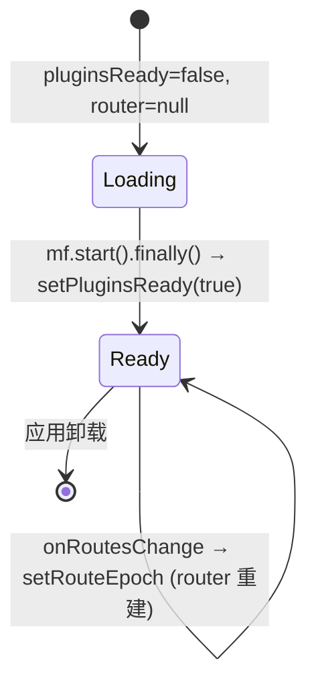

# Router 启动期延迟挂载

## 1. 背景与目标

Host 应用在启动时需要通过 Module Federation（MF）的 `mf.start()` 拉取并注入插件路由。旧实现中，`createBrowserRouter` 在 `useMemo` 内随 `pluginsReady` 与 `routeEpoch` 变化反复执行——`mf.start()` 进行中的 `onRoutesChange` 回调会触发 `setRouteEpoch`，导致 Router 在插件注入期间被反复销毁重建，出现：

- 启动期路由闪烁（catch-all 先渲染空白壳、再切到真实路由）；
- `mf.setNavigate` 指向的 `router.navigate` 在重建期间短暂失效；
- Tauri 事件监听（about / logout）因 `useEffect([router])` 重复 attach/detach。

本轮将 Router 的挂载**延迟到 `mf.start()` 完成之后**：`pluginsReady` 为 false 时不创建 `BrowserRouter`，直接渲染全屏 Loading；`start()` 完成后一次性创建 Router 并挂入插件路由。

核心目标：

- **启动期只创建一次 Router**：避免插件注入期间反复 `createBrowserRouter`；
- **`onRoutesChange` 在 start 完成前被忽略**：用 `started` 门闩防止启动中的路由变更污染 epoch；
- **Tauri 监听与 router 生命周期对齐**：router 为 null 时提前清理剪贴板快捷键，避免重复挂载；
- **不改变路由表结构**：`buildRoutes(true)` 仍注入动态插件路由，catch-all 不再需要 `PluginRoutesPending` 兜底。

---

## 2. 改动范围

| 路径 | 说明 |
|------|------|
| `apps/frontend/src/router/index.tsx` | `App` 组件：router 创建延迟到 `pluginsReady`；新增 `started` 门闩；null 安全渲染 |

`buildRoutes` 未改，仍保留 `pluginsReady` 参数（外部调用可传 false 复用 `PluginRoutesPending` 兜底），但本组件始终传 `true`。

---

## 3. 实现思路

### 3.1 关键决策

1. **`if (!pluginsReady) return null`**：`useMemo` 在插件未就绪时直接返回 null，不调用 `createBrowserRouter`。这样 `useMemo` 的依赖 `[routeEpoch, pluginsReady]` 在 `pluginsReady` 由 false→true 时才真正创建 router，且只创建一次。
2. **`started` 门闩**：`mf.onRoutesChange` 的回调在 `started === true` 之前不更新 `routeEpoch`。`mf.start()` 期间可能触发多次 `onRoutesChange`（插件逐个注册路由），若此时更新 epoch 会导致 router 重建。`started` 在 `finally` 中置 true，确保 start 完成后的路由变更才触发重建。
3. **移除 `.finally()` 中的 `setRouteEpoch`**：`setPluginsReady(true)` 已触发 `useMemo` 重算，无需再 bump epoch。保留 `setPluginsReady` 即可。
4. **`buildRoutes(true)` 写死**：router 只在 `pluginsReady === true` 时创建，此时动态路由已全部注入，直接传 `true` 让 catch-all 走真实 `NotFound` 组件。
5. **null 安全的 Tauri 监听 effect**：`useEffect([router])` 在 `router === null` 时提前 `return detachPlainFieldClipboard`，不注册 about/logout 监听；router 创建后再注册，且 cleanup 时正确 detach。
6. **条件渲染 `<RouterProvider>`**：`router` 为 null 时渲染 `<Loading />`，保持视觉一致。

### 3.2 启动时序

```mermaid
sequenceDiagram
    participant U as 用户
    participant App as App 组件
    participant MF as mf (federation)
    participant R as Router
    participant T as Tauri 事件

    U->>App: 打开应用
    App->>MF: mf.start()
    Note right of MF: 拉取远程插件<br/>逐个注入路由
    MF-->>App: onRoutesChange (started=false 被忽略)
    App->>App: render <Loading /> (router=null)
    MF-->>App: start().finally()
    App->>App: started=true; setPluginsReady(true)
    App->>R: createBrowserRouter(buildRoutes(true))
    R->>R: 注入动态插件路由
    App->>App: render <RouterProvider router=R />
    App->>T: attach about/logout 监听
    Note right of App: 此后 onRoutesChange<br/>才 setRouteEpoch 重建
```

### 3.3 状态机



---

## 4. 关键代码对比与注释

### 4.1 `App` 组件（`apps/frontend/src/router/index.tsx`）

**对比范围**：`App` 函数组件全量（import → export default）。核心变化在 `useEffect`（start 流程）、`useMemo`（router 创建）、`useEffect`（Tauri 监听）、`return`（渲染）四处。

**改动前** · `apps/frontend/src/router/index.tsx`（基线 HEAD `09d8ad04`，约 L1–L122）

```typescript
// 引入全屏加载组件，用于 Suspense fallback
import Loading from '@design/Loading';
// 引入全局 Toast 容器
import { Toaster } from '@ui/sonner';
// React 核心：Suspense 懒加载、useEffect 副作用、useMemo 缓存、useState 状态
import { Suspense, useEffect, useMemo, useState } from 'react';
// react-router：创建浏览器路由、类型、Provider
import {
	createBrowserRouter,
	type RouteObject,
	RouterProvider,
} from 'react-router';
// 模块联邦宿主实例
import { mf } from '@/federation';
// 限制输入框只在 tab 切换时失焦
import { useInputsOnlyTab } from '@/hooks';
// 同步读取窗口 Chrome 主题（用于 about 窗标题栏配色）
import { readWindowChromeThemeSync } from '@/hooks/theme';
// Tauri 纯文本字段剪贴板快捷键 + 开窗工具
import {
	attachTauriPlainFieldClipboardShortcuts,
	onCreateWindow,
} from '@/utils';
// 判断是否运行在 Tauri 桌面端
import { isTauriRuntime } from '@/utils/runtime';
// 登出逻辑（清态 + 跳转）
import { performLogout } from './authSession';
// 构建静态 + 动态插件路由表
import { buildRoutes } from './buildRoutes';

// 应用根组件
const App = () => {
	// 限制输入框行为
	useInputsOnlyTab();
	// 路由纪元：插件路由变更时 +1，触发 router 重建
	const [routeEpoch, setRouteEpoch] = useState(0);
	// 旧注释：false 时 catch-all 不渲染 404，等插件壳挂上后再决断
	const [pluginsReady, setPluginsReady] = useState(false);

	// 启动 MF 并监听路由变更
	useEffect(() => {
		// 桌面端禁用右键菜单
		if (isTauriRuntime()) {
			document.addEventListener('contextmenu', (e) => {
				e.preventDefault();
			});
		}
		// 订阅插件路由变更：每次变更都 bump epoch
		const unsub = mf.onRoutesChange(() => {
			setRouteEpoch((n) => n + 1);
		});
		// 启动联邦
		void mf
			.start()
			.catch((e) => console.error('[federation] start failed', e))
			.finally(() => {
				// 启动完成：标记就绪 + bump epoch 触发首次 router 创建
				setPluginsReady(true);
				setRouteEpoch((n) => n + 1);
			});
		// 卸载时取消订阅
		return unsub;
	}, []);

	// 根据 pluginsReady 构建路由并创建 router；pluginsReady 变化会重建
	const router = useMemo(() => {
		// 旧版：每次都创建 router，pluginsReady=false 时 catch-all 渲染空白壳
		const r = createBrowserRouter(buildRoutes(pluginsReady) as RouteObject[]);
		// 让 MF 能通过 host 导航
		mf.setNavigate((to) => {
			void r.navigate(to);
		});
		return r;
	}, [routeEpoch, pluginsReady]);

	// Tauri 事件监听（about / logout）+ 剪贴板快捷键
	useEffect(() => {
		let cancelled = false;
		const unlistenFns: Array<() => void> = [];

		// 异步注册 Tauri 事件
		(async () => {
			// 非 Tauri 环境不注册
			if (!isTauriRuntime()) {
				return;
			}
			// 动态导入 Tauri 事件 API
			const { listen } = await import('@tauri-apps/api/event');
			// 监听 about 菜单事件：打开关于窗口
			const aboutUnlisten = await listen('about', (event) => {
				const eventOptions = event.payload as {
					version: string;
				};
				void onCreateWindow({
					url: `/about?version=${encodeURIComponent(eventOptions.version)}`,
					label: 'about',
					title: 'dnhyxc-ai',
					width: 400,
					height: 300,
					titleBarStyle: 'visible',
					hiddenTitle: false,
					resizable: false,
					theme: readWindowChromeThemeSync(),
				});
			});
			// 监听 logout 菜单事件：执行登出
			const logoutUnlisten = await listen('logout', () => {
				performLogout((to) => router.navigate(to));
			});
			// 未取消则收集清理函数
			if (!cancelled) {
				unlistenFns.push(aboutUnlisten, logoutUnlisten);
			} else {
				aboutUnlisten();
				logoutUnlisten();
			}
		})();

		// 挂载剪贴板快捷键
		const detachPlainFieldClipboard = attachTauriPlainFieldClipboardShortcuts();

		// 清理：取消标记 + detach 全部监听
		return () => {
			cancelled = true;
			detachPlainFieldClipboard();
			for (const u of unlistenFns) {
				u();
			}
		};
	}, [router]);

	// 渲染根容器
	return (
		// data-mf-host-portal：标记 Host 根，供 MF Portal 劫持识别
		<div className="h-full w-full bg-theme-background" data-mf-host-portal>
			<Toaster />
			{/* 懒加载路由需 Suspense 包裹 */}
			<Suspense
				fallback={
					<Loading className="flex h-full items-center justify-center" />
				}
			>
				{/* 旧版：无条件渲染 RouterProvider，即使 router 是刚用 buildRoutes(false) 创建的 */}
				<RouterProvider router={router} />
			</Suspense>
		</div>
	);
};

export default App;
```

**改动后** · `apps/frontend/src/router/index.tsx`（当前工作区，约 L1–L129）

```typescript
// 引入全屏加载组件，用于 Suspense fallback 与 router 未就绪时的占位
import Loading from '@design/Loading';
// 引入全局 Toast 容器
import { Toaster } from '@ui/sonner';
// React 核心：Suspense 懒加载、useEffect 副作用、useMemo 缓存、useState 状态
import { Suspense, useEffect, useMemo, useState } from 'react';
// react-router：创建浏览器路由、类型、Provider
import {
	createBrowserRouter,
	type RouteObject,
	RouterProvider,
} from 'react-router';
// 模块联邦宿主实例
import { mf } from '@/federation';
// 限制输入框只在 tab 切换时失焦
import { useInputsOnlyTab } from '@/hooks';
// 同步读取窗口 Chrome 主题（用于 about 窗标题栏配色）
import { readWindowChromeThemeSync } from '@/hooks/theme';
// Tauri 纯文本字段剪贴板快捷键 + 开窗工具
import {
	attachTauriPlainFieldClipboardShortcuts,
	onCreateWindow,
} from '@/utils';
// 判断是否运行在 Tauri 桌面端
import { isTauriRuntime } from '@/utils/runtime';
// 登出逻辑（清态 + 跳转）
import { performLogout } from './authSession';
// 构建静态 + 动态插件路由表
import { buildRoutes } from './buildRoutes';

// 应用根组件
const App = () => {
	// 限制输入框行为
	useInputsOnlyTab();
	// 路由纪元：插件路由变更时 +1，触发 router 重建
	const [routeEpoch, setRouteEpoch] = useState(0);
	// 新注释：start 完成后才挂 Router，启动期 inject 不再反复 createBrowserRouter
	const [pluginsReady, setPluginsReady] = useState(false);

	// 启动 MF 并监听路由变更
	useEffect(() => {
		// 桌面端禁用右键菜单
		if (isTauriRuntime()) {
			document.addEventListener('contextmenu', (e) => {
				e.preventDefault();
			});
		}
		// 门闩：start 完成前忽略 onRoutesChange，避免启动中 bump epoch 导致 router 重建
		let started = false;
		// 订阅插件路由变更：仅在 started 后才 bump epoch
		const unsub = mf.onRoutesChange(() => {
			if (started) setRouteEpoch((n) => n + 1);
		});
		// 启动联邦
		void mf
			.start()
			.catch((e) => console.error('[federation] start failed', e))
			.finally(() => {
				// 置门闩：此后 onRoutesChange 才生效
				started = true;
				// 标记就绪，触发 useMemo 创建 router
				setPluginsReady(true);
			});
		// 卸载时取消订阅
		return unsub;
	}, []);

	// pluginsReady 为 false 时返回 null，不创建 router；就绪后只创建一次
	const router = useMemo(() => {
		// 关键：未就绪不创建 BrowserRouter，避免启动期反复重建
		if (!pluginsReady) return null;
		// 写死 true：此时动态插件路由已全部注入，catch-all 走真实 NotFound
		const r = createBrowserRouter(buildRoutes(true) as RouteObject[]);
		// 让 MF 能通过 host 导航
		mf.setNavigate((to) => {
			void r.navigate(to);
		});
		return r;
	}, [routeEpoch, pluginsReady]);

	// Tauri 事件监听（about / logout）+ 剪贴板快捷键
	useEffect(() => {
		// 剪贴板快捷键在 router 为 null 时也需挂载，因此先 attach
		const detachPlainFieldClipboard =
			attachTauriPlainFieldClipboardShortcuts();
		// router 未就绪：不注册 Tauri 事件，直接返回清理函数
		if (!router) return detachPlainFieldClipboard;
		let cancelled = false;
		const unlistenFns: Array<() => void> = [];

		// 异步注册 Tauri 事件
		(async () => {
			// 非 Tauri 环境不注册
			if (!isTauriRuntime()) {
				return;
			}
			// 动态导入 Tauri 事件 API
			const { listen } = await import('@tauri-apps/api/event');
			// 监听 about 菜单事件：打开关于窗口
			const aboutUnlisten = await listen('about', (event) => {
				const eventOptions = event.payload as {
					version: string;
				};
				void onCreateWindow({
					url: `/about?version=${encodeURIComponent(eventOptions.version)}`,
					label: 'about',
					title: 'dnhyxc-ai',
					width: 400,
					height: 300,
					titleBarStyle: 'visible',
					hiddenTitle: false,
					resizable: false,
					// 与主窗配色一致：非 black → light 标题栏（勿传 undefined 以免跟系统深色）
					theme: readWindowChromeThemeSync(),
				});
			});
			// 监听 logout 菜单事件：执行登出
			const logoutUnlisten = await listen('logout', () => {
				// Tauri File 菜单「退出登录」：需与侧边栏登出一致（清态 + 跳转）
				performLogout((to) => router.navigate(to));
			});
			// 未取消则收集清理函数
			if (!cancelled) {
				unlistenFns.push(aboutUnlisten, logoutUnlisten);
			} else {
				aboutUnlisten();
				logoutUnlisten();
			}
		})();

		// 清理：取消标记 + detach 全部监听
		return () => {
			cancelled = true;
			detachPlainFieldClipboard();
			for (const u of unlistenFns) {
				u();
			}
		};
	}, [router]);

	// 渲染根容器
	return (
		// data-mf-host-portal：标记 Host 应用根，供 MF 对 ReactDOM.createPortal 的劫持识别。
		// 插件 Portal 桥接会把挂到 body/documentElement 的内容重定向进 [data-mf-portal-scope]，
		// 以便落入 Remote 的 @scope([data-mf-style-realm])；若目标落在本属性子树内则跳过重定向。
		// <Toaster /> 自身会 portal 到 body（避开 #root fixed 层叠被 Dialog 挡住），
		// federation-kit 对 data-sonner-toaster / .toaster 已做 Host 保护，不会被收进插件域。
		<div className="h-full w-full bg-theme-background" data-mf-host-portal>
			<Toaster />
			{/* Layout 外路由（login/about 等）lazy 也需 Suspense */}
			<Suspense
				fallback={
					<Loading className="flex h-full items-center justify-center" />
				}
			>
				{/* router 为 null 时渲染全屏 Loading，就绪后渲染 RouterProvider */}
				{router ? (
					<RouterProvider router={router} />
				) : (
					<Loading className="flex h-full items-center justify-center" />
				)}
			</Suspense>
		</div>
	);
};

export default App;
```

**变更摘要**：四处改动——(1) `useEffect` 新增 `started` 门闩，start 完成前 `onRoutesChange` 不 bump epoch，且移除 `.finally()` 中的 `setRouteEpoch`；(2) `useMemo` 中 `if (!pluginsReady) return null`，router 只创建一次，`buildRoutes(true)` 写死；(3) Tauri 监听 effect 在 `router === null` 时提前返回剪贴板 detach，不注册事件；(4) 渲染层 `router ? <RouterProvider /> : <Loading />` 条件渲染。

---

## 5. 行为变化与兼容性

| 项 | 说明 |
|----|------|
| 启动视觉 | `mf.start()` 期间显示全屏 Loading，不再出现 catch-all 空白壳闪烁 |
| Router 创建次数 | 启动期仅 1 次（`pluginsReady` true 时）；运行期插件路由变更才重建 |
| `mf.setNavigate` | 指向稳定的 router 实例，启动期不再因重建而短暂失效 |
| Tauri 监听 | `about` / `logout` 仅在 router 就绪后注册一次，避免重复 attach/detach |
| 路由表 | 无变化；`buildRoutes(true)` 仍注入全部动态插件路由 |
| 异常 | `mf.start()` reject 时仍 `setPluginsReady(true)`（`finally`），router 正常创建，不卡死 Loading |

---

## 6. 风险与回归建议

1. **启动加载时间**：若 `mf.start()` 耗时较长，用户会看到 Loading。可加超时兜底（目前未加，依赖 MF 自身超时）。
2. **插件运行期增删**：`onRoutesChange` 在 `started` 后仍会 bump epoch 重建 router，验证插件热更新是否正常。
3. **Tauri 菜单**：启动期间点击「关于」/「退出登录」菜单——因 router 为 null 未注册监听，可能无响应。验证是否可接受（启动通常 <1s）。
4. **`buildRoutes` 兼容性**：函数仍保留 `pluginsReady` 参数，外部若传 false 仍会用 `PluginRoutesPending` 兜底，未破坏。

---

## 7. 相关源码路径

| 说明 | 路径 |
|------|------|
| 应用根组件 | `apps/frontend/src/router/index.tsx` |
| 路由表构建 | `apps/frontend/src/router/buildRoutes.tsx` |
| 联邦宿主 | `apps/frontend/src/federation/index.ts` |

---

（若与仓库最新源码不一致，以源码为准）
