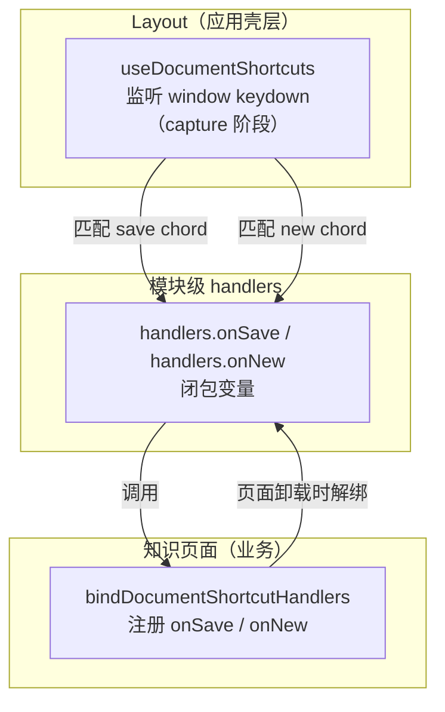

# 文档快捷键统一

> **文档角色**：实现思路专题（含改动前/后完整符号与逐行注释）
> **日期**：2026-09-17
> **延伸阅读**：
> - 知识库快捷键：[docs/knowledge/快捷键.md](../knowledge/快捷键.md)
> - 设置页架构：[guide/13-国际化与设置.md §13.3–§13.4](../../guide/13-国际化与设置.md)

---

## 1. 背景与目标

此前「保存」「新建」快捷键由知识库页面自行监听 `keydown`，且设置页中这些快捷键标注为「知识库：保存」「知识库：清空草稿」。但实际保存/新建能力已不限于知识库（未来其他文档页也可能复用），且页面级监听存在以下问题：

1. **命名不准**：「知识库：保存」实际是通用文档保存，设置页文案误导。
2. **监听分散**：每个页面各自监听 `keydown`，切换页面时需手动解绑，容易遗漏或重复。
3. **默认键冲突**：`Meta+Shift+D`（清空草稿）在 macOS 上常被系统拦截，应用收不到 keydown。

**目标**：
- 将「保存」「新建」提升为**应用级文档快捷键**，由 `Layout` 统一监听。
- 页面通过 `bindDocumentShortcutHandlers` 注册/解绑回调，切换页面自动失效。
- 设置页分类从「知识库：」重构为「通用：」「编辑器：」，语义更准确。
- 新建默认键改为 `Meta+Shift+N`，避开 macOS 系统拦截。

---

## 2. 改动范围

| 路径 | 角色 |
|------|------|
| `apps/frontend/src/hooks/useDocumentShortcuts.ts` | 新建：`useDocumentShortcuts` + `bindDocumentShortcutHandlers` + `useDocumentShortcutHints` |
| `apps/frontend/src/layout/index.tsx` | Layout 挂载 `useDocumentShortcuts` |
| `apps/frontend/src/views/knowledge/index.tsx` | 注册 `onSave` / `onNew` 回调 |
| `apps/frontend/src/utils/knowledge-shortcuts.ts` | 默认 `clear` 改为 `Meta+Shift+N`；删除旧迁移逻辑；新增 `isValidShortcutChord` |
| `apps/frontend/src/views/setting/system/config.ts` | 快捷键分类重命名（通用 / 编辑器） |
| `apps/frontend/src/hooks/index.ts` | 导出 `useDocumentShortcuts` |

---

## 3. 实现思路



要点：

1. **单一监听点**：`Layout` 挂载一次 `useDocumentShortcuts`，在 `window` 上以 `capture` 阶段监听 `keydown`；页面不再各自监听。
2. **回调注册表**：`handlers` 为模块级变量，页面 `useEffect` 中调用 `bindDocumentShortcutHandlers({ onSave, onNew })` 注册，返回解绑函数。
3. **同引用解绑**：解绑时检查 `handlers.onSave === next.onSave`，避免后续页面注册的回调被误清。
4. **chord 动态加载**：从 `knowledge-shortcuts` 读取用户自定义 chord，监听 `KNOWLEDGE_SHORTCUTS_CHANGED_EVENT` 实时刷新。
5. **设置页分类**：保存/新建归为「通用」；编辑器操作栏归为「编辑器」；其余知识库专属保留「知识库：」。

---

## 4. 关键代码对比与注释

### 4.1 `useDocumentShortcuts` Hook（新建，仅改动后）

**来源**：`apps/frontend/src/hooks/useDocumentShortcuts.ts` · **改动后** · 整文件

```typescript
// 导入 React hooks：useEffect 副作用、useRef 跨渲染持有、useState chord 状态
import { useEffect, useRef, useState } from 'react';
// 导入 knowledge-shortcuts 工具：chord 匹配、默认值、变更事件、加载函数
import {
	chordMatchesStored,
	KNOWLEDGE_SHORTCUT_DEFAULT_CHORDS,
	KNOWLEDGE_SHORTCUTS_CHANGED_EVENT,
	loadKnowledgeShortcutChords,
} from '@/utils/knowledge-shortcuts';

// 回调类型：保存与新建两个可选处理函数
type DocShortcutHandlers = {
	onSave?: () => void;
	onNew?: () => void;
};

// 模块级 handlers 注册表：Layout 监听时读取，页面注册时写入
let handlers: DocShortcutHandlers = {};

// bindDocumentShortcutHandlers：页面注册保存/新建回调，返回解绑函数
export function bindDocumentShortcutHandlers(
	next: DocShortcutHandlers,
): () => void {
	// 合并新回调到模块级 handlers
	handlers = { ...handlers, ...next };
	// 返回解绑函数
	return () => {
		// 仅当仍是同一函数引用时清空，防止误清后续页面注册的回调
		if (next.onSave && handlers.onSave === next.onSave) {
			handlers = { ...handlers, onSave: undefined };
		}
		if (next.onNew && handlers.onNew === next.onNew) {
			handlers = { ...handlers, onNew: undefined };
		}
	};
}

// useDocumentShortcuts：Layout 挂载，应用内统一监听保存/新建 chord
export function useDocumentShortcuts(): {
	saveChord: string;
	newChord: string;
} {
	// 初始化 chord 状态为默认值
	const [chords, setChords] = useState<{ save: string; clear: string }>({
		save: KNOWLEDGE_SHORTCUT_DEFAULT_CHORDS.save,
		clear: KNOWLEDGE_SHORTCUT_DEFAULT_CHORDS.clear,
	});
	// chordsRef 保证 keydown 回调中读到最新 chord，避免闭包陈旧
	const chordsRef = useRef(chords);
	chordsRef.current = chords;

	// 加载用户自定义 chord；监听变更事件实时刷新
	useEffect(() => {
		const reload = async () => {
			const c = await loadKnowledgeShortcutChords();
			setChords({ save: c.save, clear: c.clear });
		};
		void reload();
		const onChanged = () => void reload();
		window.addEventListener(KNOWLEDGE_SHORTCUTS_CHANGED_EVENT, onChanged);
		return () => {
			window.removeEventListener(KNOWLEDGE_SHORTCUTS_CHANGED_EVENT, onChanged);
		};
	}, []);

	// 监听 window keydown（capture 阶段，优先于页面内监听）
	useEffect(() => {
		const onKeyDown = (e: KeyboardEvent) => {
			const { save, clear } = chordsRef.current;
			// 匹配保存 chord
			if (chordMatchesStored(save, e)) {
				const fn = handlers.onSave;
				// 无回调则不处理（可能当前页面未注册）
				if (!fn) return;
				e.preventDefault();
				fn();
				return;
			}
			// 匹配新建 chord
			if (chordMatchesStored(clear, e)) {
				const fn = handlers.onNew;
				if (!fn) return;
				e.preventDefault();
				fn();
			}
		};
		window.addEventListener('keydown', onKeyDown, true);
		return () => window.removeEventListener('keydown', onKeyDown, true);
	}, []);

	// 返回当前 chord 供 UI 展示（如 Tooltip）
	return { saveChord: chords.save, newChord: chords.clear };
}

// useDocumentShortcutHints：页面侧只读 chord，用于 Tooltip 展示（不注册监听）
export function useDocumentShortcutHints(): {
	saveChord: string;
	newChord: string;
} {
	// 同 useDocumentShortcuts 的 chord 加载逻辑，但不监听 keydown
	const [chords, setChords] = useState<{ save: string; clear: string }>({
		save: KNOWLEDGE_SHORTCUT_DEFAULT_CHORDS.save,
		clear: KNOWLEDGE_SHORTCUT_DEFAULT_CHORDS.clear,
	});

	useEffect(() => {
		const reload = async () => {
			const c = await loadKnowledgeShortcutChords();
			setChords({ save: c.save, clear: c.clear });
		};
		void reload();
		const onChanged = () => void reload();
		window.addEventListener(KNOWLEDGE_SHORTCUTS_CHANGED_EVENT, onChanged);
		return () => {
			window.removeEventListener(KNOWLEDGE_SHORTCUTS_CHANGED_EVENT, onChanged);
		};
	}, []);

	return { saveChord: chords.save, newChord: chords.clear };
}
```

### 4.2 Layout 挂载（改动前 / 改动后）

**改动前** · `apps/frontend/src/layout/index.tsx`（基线）

```tsx
// 仅导入 useI18n、useTheme
import { useI18n, useTheme } from '@/hooks';

const Layout = () => {
	useTheme();
	// ... 无快捷键监听
};
```

**改动后** · `apps/frontend/src/layout/index.tsx`（当前）

```tsx
// 新增导入 useDocumentShortcuts
import { useDocumentShortcuts, useI18n, useTheme } from '@/hooks';

const Layout = () => {
	useTheme();
	// 挂载应用级文档快捷键监听（保存 / 新建）
	useDocumentShortcuts();
	// ...
};
```

### 4.3 知识页面注册回调（改动前 / 改动后）

**改动前** · `apps/frontend/src/views/knowledge/index.tsx`（基线，页面内自行监听）

```tsx
// 旧实现：页面内 useEffect 监听 keydown，匹配 save/clear chord 后调用 handleSave/handleNew
useEffect(() => {
	const onKeyDown = (e: KeyboardEvent) => {
		if (chordMatchesStored(saveChord, e)) {
			e.preventDefault();
			handleSave();
		}
		// ... clear 类似
	};
	window.addEventListener('keydown', onKeyDown);
	return () => window.removeEventListener('keydown', onKeyDown);
}, [handleSave, saveChord, /* ... */]);
```

**改动后** · `apps/frontend/src/views/knowledge/index.tsx`（当前，约 L1064–L1074）

```tsx
// 新实现：通过 bindDocumentShortcutHandlers 注册回调，由 Layout 统一监听
return bindDocumentShortcutHandlers({
	onSave: handleSave,
	onNew: handleNew,
});
```

**变更摘要**：页面不再自行监听 `keydown`，改为向模块级 `handlers` 注册回调；Layout 统一监听后分发，切换页面时 `useEffect` 清理自动解绑。

### 4.4 默认新建键修改（改动前 / 改动后）

**改动前** · `apps/frontend/src/utils/knowledge-shortcuts.ts`（基线）

```typescript
// 旧默认：Meta+Shift+D 在 macOS 上常被系统拦截，应用收不到 keydown
clear: 'Meta + Shift + D',
```

**改动后** · `apps/frontend/src/utils/knowledge-shortcuts.ts`（当前）

```typescript
// 新默认：Meta+Shift+N，避开 macOS 系统快捷键
clear: 'Meta + Shift + N',
```

同时删除了 `normalizeLegacyClearChord` 迁移函数及其调用——旧默认 `Meta+Control+D` 不再需要迁移，直接使用新默认即可。

### 4.5 设置页分类重命名（改动前 / 改动后）

**改动前** · `apps/frontend/src/views/setting/system/config.ts`（基线）

```typescript
// 旧分类：保存/新建/导入均标注为「知识库：」
{ label: '知识库：保存', key: KNOWLEDGE_SHORTCUT_KEY_IDS.save, ... },
{ label: '知识库：导入文件', key: KNOWLEDGE_SHORTCUT_KEY_IDS.import, ... },
{ label: '知识库：清空草稿', key: KNOWLEDGE_SHORTCUT_KEY_IDS.clear, ... },
{ label: '知识库：切换操作栏', key: KNOWLEDGE_SHORTCUT_KEY_IDS.toggleMarkdownBottomBar, ... },
{ label: '知识库：操作栏：编辑源码', key: KNOWLEDGE_SHORTCUT_KEY_IDS.markdownBarAction1, ... },
```

**改动后** · `apps/frontend/src/views/setting/system/config.ts`（当前）

```typescript
// 新分类：保存/新建归「通用」，编辑器操作栏归「编辑器」
{ label: '通用：保存', key: KNOWLEDGE_SHORTCUT_KEY_IDS.save, ... },
{ label: '通用：新建', key: KNOWLEDGE_SHORTCUT_KEY_IDS.clear, ... },
{ label: '知识库：导入文件', key: KNOWLEDGE_SHORTCUT_KEY_IDS.import, ... },
{ label: '编辑器：切换操作栏', key: KNOWLEDGE_SHORTCUT_KEY_IDS.toggleMarkdownBottomBar, ... },
{ label: '编辑器：编辑源码', key: KNOWLEDGE_SHORTCUT_KEY_IDS.markdownBarAction1, ... },
```

**变更摘要**：保存/新建从「知识库：」改为「通用：」（提升为应用级），清空草稿改名为「新建」；编辑器底部操作栏相关从「知识库：操作栏：」简化为「编辑器：」。

---

## 5. 行为变化与兼容性

| 场景 | 改动前 | 改动后 |
|------|--------|--------|
| 保存/新建监听 | 知识库页面自行监听 | Layout 统一监听，页面注册回调 |
| 设置页文案 | 「知识库：保存」「知识库：清空草稿」 | 「通用：保存」「通用：新建」 |
| 新建默认键 | `Meta+Shift+D`（macOS 可能被拦截） | `Meta+Shift+N` |
| 页面切换 | 需手动解绑 | `useEffect` 清理自动解绑 |

---

## 6. 测试与回归建议

- [ ] 知识库页按保存快捷键触发保存
- [ ] 知识库页按新建快捷键触发新建
- [ ] 切换到其他页面后，保存/新建快捷键不触发知识库逻辑
- [ ] 设置页修改保存快捷键后，知识库页即时生效
- [ ] macOS 上 `Meta+Shift+N` 可正常触发新建
- [ ] 设置页快捷键分类显示为「通用：」「编辑器：」「知识库：」

---

## 7. 相关源码路径

| 说明 | 路径 |
|------|------|
| 文档快捷键 Hook | `apps/frontend/src/hooks/useDocumentShortcuts.ts` |
| Layout 挂载 | `apps/frontend/src/layout/index.tsx` |
| 知识库回调注册 | `apps/frontend/src/views/knowledge/index.tsx` |
| 快捷键工具 | `apps/frontend/src/utils/knowledge-shortcuts.ts` |
| 设置页配置 | `apps/frontend/src/views/setting/system/config.ts` |

---

（若与仓库最新源码不一致，以源码为准）
