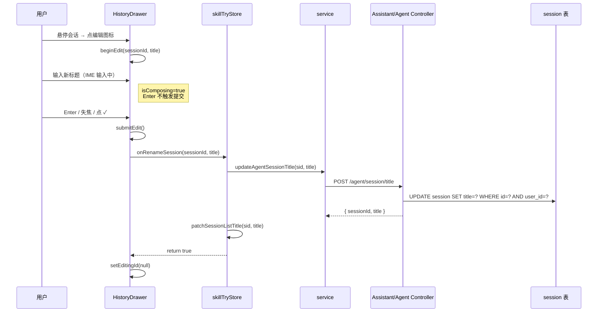

# 会话标题重命名

> **文档角色**：实现思路专题（含改动前/后完整符号与逐行注释）
> **延伸阅读**：
> - 知识库助手多会话：[docs/knowledge/知识库助手多会话前端实现.md](../knowledge/知识库助手多会话前端实现.md)
> - Skill 试跑会话：[docs/knowledge/Skill编辑试跑.md](../knowledge/Skill编辑试跑.md)
> - Agent 记忆分表：[docs/agent/Agent记忆分表.md](../agent/Agent记忆分表.md)

---

## 1. 背景与目标

助手类会话（知识库助手、英语 Agent、Skill 试跑）的标题此前只能由首条用户消息自动生成，用户无法手动修改。当自动标题截断或不符合语义时，历史抽屉中难以区分会话。

**目标**：在历史抽屉中支持**行内重命名**会话标题，提交后持久化到服务端；支持中英文输入法（IME）的 composition 事件，避免 Enter 选字误触发提交。

**范围**：
- 后端：`/assistant/session/title`、`/agent/session/title` 两个 PATCH 风格 POST 接口。
- 前端：`AssistantHistoryDrawer` 新增 `onRenameSession` 可选 prop + 行内编辑 UI；`skillTryStore.renameSession` 先接入；助手与英语 Agent 接口已就绪，后续按需接线。

---

## 2. 改动范围

| 路径 | 角色 |
|------|------|
| `apps/backend/src/services/assistant/dto/update-assistant-session-title.dto.ts` | 助手标题 DTO（新建） |
| `apps/backend/src/services/assistant/assistant.controller.ts` | `POST /assistant/session/title` |
| `apps/backend/src/services/assistant/assistant.service.ts` | `updateSessionTitle` 方法 |
| `apps/backend/src/services/agent/dto/update-agent-session-title.dto.ts` | Agent 标题 DTO（新建） |
| `apps/backend/src/services/agent/agent.controller.ts` | `POST /agent/session/title` |
| `apps/backend/src/services/agent/agent.service.ts` | `updateSessionTitle` 方法 |
| `apps/frontend/src/components/design/Assistant/HistoryDrawer.tsx` | 行内编辑 UI + IME 处理 |
| `apps/frontend/src/components/design/Assistant/types.ts` | `onRenameSession` prop 类型 |
| `apps/frontend/src/store/skillTry.ts` | `renameSession` 调用 Agent 接口 |
| `apps/frontend/src/service/api.ts` | `ASSISTANT_SESSION_TITLE` / `AGENT_SESSION_TITLE` 常量 |
| `apps/frontend/src/service/index.ts` | `updateAssistantSessionTitle` / `updateAgentSessionTitle` |

---

## 3. 实现思路



要点：

1. **行内编辑替代弹窗**：在历史列表项内直接展开 `<Input>`，减少上下文切换。
2. **IME 安全**：`onCompositionStart` 置 `isComposing=true`；`onKeyDown` 中同时检查 `nativeEvent.isComposing` 与 `isComposing`，中文输入法选字时的 Enter 不会提交。
3. **提交三重触发**：Enter（非 composition 中）、`onBlur`、点击 ✓ 按钮均走 `submitEdit`；`onMouseDown preventDefault` 防止按钮点击导致 Input 失焦提前触发 blur。
4. **空标题校验**：trim 后为空则 Toast 警告并取消编辑，不发请求。
5. **可选接入**：`onRenameSession` 为可选 prop；未传入时不显示编辑按钮（`canRename`），保持旧行为。
6. **后端鉴权**：`assertSessionOwned(userId, sid)` 确保只能改自己的会话；标题截断 255 字符。

---

## 4. 关键代码对比与注释

### 4.1 DTO：`UpdateAssistantSessionTitleDto`（新建，仅改动后）

**来源**：`apps/backend/src/services/assistant/dto/update-assistant-session-title.dto.ts` · **改动后** · 整文件

```typescript
// 导入 class-validator 装饰器：IsString 校验字符串、IsUUID 校验 UUID 格式、MaxLength/MinLength 校验长度
import { IsString, IsUUID, MaxLength, MinLength } from 'class-validator';

// 导出 DTO 类：助手会话标题更新请求体
export class UpdateAssistantSessionTitleDto {
	// sessionId 必须是 UUID：防止非法 id 穿透到 SQL
	@IsUUID()
	sessionId!: string;

	// title 必须是非空字符串且最长 255：与数据库列长度对齐
	@IsString()
	@MinLength(1)
	@MaxLength(255)
	title!: string;
}
```

`UpdateAgentSessionTitleDto` 结构完全相同，路径为 `apps/backend/src/services/agent/dto/update-agent-session-title.dto.ts`。

### 4.2 后端：`AssistantService.updateSessionTitle`（纯新增方法）

**来源**：`apps/backend/src/services/assistant/assistant.service.ts` · **改动后** · 约 L362–L385

```typescript
// 方法注释：Skill 路径不走 assistant SSE，需显式写首条用户问题为标题
// 更新助手会话标题；userId 鉴权、sessionId 归属校验、title 截断
async updateSessionTitle(
	// userId：当前登录用户 id，用于归属校验
	userId: number,
	// sessionId：目标会话 UUID
	sessionId: string,
	// rawTitle：用户输入的原始标题
	rawTitle: string,
) {
	// 去除 sessionId 首尾空白，防止空串
	const sid = (sessionId ?? '').trim();
	// 标题 trim 后截断到 255 字符，与 DTO MaxLength 对齐
	const title = (rawTitle ?? '').trim().slice(0, 255);
	// sessionId 为空则抛 404
	if (!sid) {
		throw new NotFoundException('会话不存在');
	}
	// 标题为空则抛 400
	if (!title) {
		throw new BadRequestException('标题不能为空');
	}
	// 归属校验：确保会话属于当前用户
	await this.assertSessionOwned(userId, sid);
	// 按 id + userId 双条件更新，防止越权
	await this.sessionRepo.update(
		{ id: sid, userId },
		{ title, updatedAt: new Date() },
	);
	// 返回更新后的 sessionId 与 title
	return { sessionId: sid, title };
}
```

`AgentService.updateSessionTitle` 逻辑相同，更新 `agent_sessions` 表。

### 4.3 后端 Controller：`POST /session/title`（纯新增）

**来源**：`apps/backend/src/services/assistant/assistant.controller.ts` · **改动后** · 约 L66–L82

```typescript
// 路由注释：须在 `session/:id` 之前注册，否则被动态路由吞掉
@Post('session/title')
async updateSessionTitle(
	// 从请求中提取登录用户
	@Req() req: AuthedRequest,
	// DTO 校验 sessionId + title
	@Body() dto: UpdateAssistantSessionTitleDto,
) {
	// 取 userId
	const userId = req.user?.userId;
	// 未登录直接返回失败
	if (userId == null) {
		return { success: false, message: '未登录' };
	}
	// 调用 service 更新标题
	const data = await this.assistantService.updateSessionTitle(
		userId,
		dto.sessionId,
		dto.title,
	);
	// 返回成功 + 数据
	return { success: true, data };
}
```

### 4.4 前端：`HistoryDrawer` 行内编辑（改动前 / 改动后）

**对比范围**：`AssistantHistoryDrawer` 组件渲染列表项的部分。

**改动前** · `apps/frontend/src/components/design/Assistant/HistoryDrawer.tsx`（基线）

```tsx
// 列表项：仅展示标题 + 时间，hover 显示删除按钮
<div
	className={cn(
		'group relative flex w-full cursor-pointer items-start rounded-md px-2.5 py-2 text-left transition-colors hover:bg-theme/10',
	)}
	onClick={() => handleSelectSession(s.sessionId)}
>
	<div className="min-w-0 flex-1">
		<div className="text-textcolor line-clamp-1 text-sm">
			{rowTitle}
		</div>
		<div className="text-textcolor/50 mt-1 text-xs">
			{s.updatedAt ? new Date(s.updatedAt).toLocaleString() : ''}
		</div>
	</div>
	<div className="flex h-7 shrink-0 items-center justify-center self-start overflow-hidden w-0 group-hover:w-7">
		<Button variant="link" className="text-textcolor/70 hover:text-rose-500 hover:bg-rose-500/10 hidden h-7 w-7 shrink-0 cursor-pointer items-center justify-center rounded-md group-hover:flex" aria-label={t('knowledge.assistant.deleteConversationTitle')} onClick={(e) => { e.stopPropagation(); setDeleteTargetSessionId(s.sessionId); setDeleteConfirmOpen(true); }}>
			<Trash2 className="h-4 w-4" />
		</Button>
	</div>
</div>
```

**改动后** · `apps/frontend/src/components/design/Assistant/HistoryDrawer.tsx`（当前，约 L200–L295，摘录编辑态分支）

```tsx
// canRename：由 onRenameSession 是否为函数决定；Skill 试跑页传入，助手/英语暂未传
const canRename = typeof onRenameSession === 'function';

// 编辑态：editingId 等于当前会话 id 时渲染 Input + 确认/取消按钮
{isEditing ? (
	<div className="flex min-w-0 flex-1 items-center" onClick={(e) => e.stopPropagation()}>
		<Input
			className="h-8 rounded-sm border-0 bg-transparent px-0 focus-visible:border-0 focus-visible:ring-0"
			value={editTitle}
			autoFocus
			onChange={(e: ChangeEvent<HTMLInputElement>) => setEditTitle(e.target.value)}
			// IME 开始：标记 composition 中，Enter 不提交
			onCompositionStart={() => setIsComposing(true)}
			// IME 结束：异步重置 composition 标记（setTimeout 0 确保本次 keyDown 已处理）
			onCompositionEnd={() => { setTimeout(() => setIsComposing(false), 0); }}
			onKeyDown={(e: KeyboardEvent<HTMLInputElement>) => {
				// 双重检查：nativeEvent.isComposing（部分浏览器）或 state 标记
				const composing = (e.nativeEvent as globalThis.KeyboardEvent).isComposing || isComposing;
				if (composing) return;
				// Enter 提交
				if (e.key === 'Enter') { e.preventDefault(); void submitEdit(); }
				// Escape 取消
				if (e.key === 'Escape') { e.preventDefault(); cancelEdit(); }
			}}
			// 失焦也提交（点击确认按钮前会先 blur，onMouseDown preventDefault 阻止）
			onBlur={(_e: FocusEvent<HTMLInputElement>) => { void submitEdit(); }}
		/>
		<div className="ml-1 flex shrink-0 items-center gap-1">
			<Button variant="link" className="h-7 w-7 rounded-md p-0 hover:bg-teal-500/15 hover:text-teal-500" aria-label={t('common.confirm')}
				// 阻止 mousedown 默认行为，避免 Input 失焦导致 blur 先于 onClick
				onMouseDown={(e: MouseEvent) => e.preventDefault()}
				onClick={(e) => { e.stopPropagation(); void submitEdit(); }}>
				<Check className="h-4 w-4" />
			</Button>
			<Button variant="link" className="h-7 w-7 rounded-md p-0 hover:bg-orange-500/15 hover:text-orange-500" aria-label={t('common.cancel')}
				onMouseDown={(e: MouseEvent) => e.preventDefault()}
				onClick={(e) => { e.stopPropagation(); cancelEdit(); }}>
				<X className="h-4 w-4" />
			</Button>
		</div>
	</div>
) : (
	<>
		{/* 非编辑态：标题 + 时间 + 编辑/删除按钮 */}
		<div className="min-w-0 flex-1">{/* ...标题与时间... */}</div>
		<div className={cn('flex h-7 shrink-0 items-center justify-end gap-0.5 self-start overflow-hidden',
			isStreaming ? 'w-7' : canRename ? 'w-0 group-hover:w-14' : 'w-0 group-hover:w-7')}>
			{isStreaming ? <Spinner /> : (
				<>
					{canRename && (
						<Button variant="link" className="... hover:text-teal-500 hover:bg-teal-500/10 ..." aria-label={t('knowledge.assistant.editConversationTitle')}
							onClick={(e) => { e.stopPropagation(); beginEdit(s.sessionId, rowTitle); }}>
							<SquarePen className="h-4 w-4" />
						</Button>
					)}
					<Button variant="link" className="... hover:text-rose-500 ..." onClick={/* 删除 */}>
						<Trash2 className="h-4 w-4" />
					</Button>
				</>
			)}
		</div>
	</>
)}
```

**变更摘要**：列表项从「展示 + 删除」变为「编辑态 Input + 非编辑态展示 + 编辑/删除」；编辑态通过 `editingId === sessionId` 切换；IME composition 防止中文选字 Enter 误提交；按钮 `onMouseDown preventDefault` 避免 blur 抢先触发。

### 4.5 前端：`submitEdit` 提交逻辑（纯新增）

**来源**：`apps/frontend/src/components/design/Assistant/HistoryDrawer.tsx` · **改动后** · 约 L98–L120

```tsx
// submitEdit：校验标题 → 调用 onRenameSession → 成功则退出编辑态
const submitEdit = async () => {
	// 无编辑中会话或无 rename 回调则不处理
	if (!editingId || !onRenameSession) return;
	// trim 标题
	const next = editTitle.trim();
	// 空标题：Toast 警告并取消编辑
	if (!next) {
		Toast({ type: 'warning', title: t('knowledge.assistant.titleRequired') });
		cancelEdit();
		return;
	}
	// 调用注入的 rename 回调（由各业务 store 实现）
	const ok = await onRenameSession(editingId, next);
	// 成功或失败均退出编辑态（失败时 store 内部已 Toast）
	setEditingId(null);
};
```

### 4.6 前端：`skillTryStore.renameSession`（纯新增）

**来源**：`apps/frontend/src/store/skillTry.ts` · **改动后** · 约 L509–L523

```typescript
// renameSession：更新 Skill 试跑会话标题；调用 Agent /session/title 接口
async renameSession(sessionId: string, rawTitle: string): Promise<boolean> {
	// trim sessionId
	const sid = (sessionId ?? '').trim();
	// trim + 截断标题到 255
	const title = (rawTitle ?? '').trim().slice(0, 255);
	// 空值直接返回失败
	if (!sid || !title) return false;
	// 未登录不发请求
	if (!readToken()) return false;
	try {
		// 调用 Agent 标题更新接口
		const res = await updateAgentSessionTitle(sid, title);
		// 取服务端返回的标题（可能被二次清洗）
		const next = res.data?.title?.trim() || title;
		// 本地 patch 列表标题，避免重新拉取
		this.patchSessionListTitle(sid, next);
		Toast({ type: 'success', title: '会话标题更新成功' });
		return true;
	} catch {
		// 失败静默返回 false（HistoryDrawer 退出编辑态）
		return false;
	}
}
```

### 4.7 前端 Service 封装（纯新增）

**来源**：`apps/frontend/src/service/index.ts` · **改动后** · 约 L441–L449、L662–L670

```typescript
// updateAssistantSessionTitle：调用助手会话标题更新接口
export const updateAssistantSessionTitle = async (
	sessionId: string,
	title: string,
) => {
	return await http.post<{ sessionId: string; title: string }>(
		ASSISTANT_SESSION_TITLE,
		{ sessionId, title },
	);
};

// updateAgentSessionTitle：调用 Agent 会话标题更新接口（Skill 试跑 / 英语 Agent）
export const updateAgentSessionTitle = async (
	sessionId: string,
	title: string,
) => {
	return await http.post<{ sessionId: string; title: string }>(
		AGENT_SESSION_TITLE,
		{ sessionId, title },
	);
};
```

---

## 5. 行为变化与兼容性

| 场景 | 改动前 | 改动后 |
|------|--------|--------|
| 历史抽屉项 | 仅展示 + 删除 | 展示 + 编辑（可选）+ 删除 |
| 标题修改 | 只能自动生成 | 可手动重命名（Skill 试跑已接入） |
| 中文输入法 | — | composition 期间 Enter 不提交 |
| 未传 `onRenameSession` | — | 不显示编辑按钮，行为不变 |

助手会话与英语 Agent 的后端接口已就绪，前端 store 尚未接入 `renameSession`；接入方式同 Skill 试跑，在 `SessionEntryToolbar` 注入 `onRenameSession` 即可。

---

## 6. 测试与回归建议

- [ ] Skill 试跑页：hover 会话出现编辑图标，点击进入行内编辑
- [ ] 输入中文后按 Enter 选字，不会误提交
- [ ] 输入英文标题按 Enter 提交，标题更新并 Toast 成功
- [ ] 空标题提交触发警告 Toast
- [ ] 点击 ✓ / ✕ / 失焦 / Esc 均能正确提交或取消
- [ ] 刷新后标题保持
- [ ] 助手页 / 英语 Agent 页未传 onRenameSession，不显示编辑按钮

---

## 7. 相关源码路径

| 说明 | 路径 |
|------|------|
| 助手标题 DTO | `apps/backend/src/services/assistant/dto/update-assistant-session-title.dto.ts` |
| Agent 标题 DTO | `apps/backend/src/services/agent/dto/update-agent-session-title.dto.ts` |
| 助手 Controller | `apps/backend/src/services/assistant/assistant.controller.ts` |
| Agent Controller | `apps/backend/src/services/agent/agent.controller.ts` |
| 历史抽屉 | `apps/frontend/src/components/design/Assistant/HistoryDrawer.tsx` |
| Skill 试跑 store | `apps/frontend/src/store/skillTry.ts` |
| Service 封装 | `apps/frontend/src/service/index.ts` |

---

（若与仓库最新源码不一致，以源码为准）
