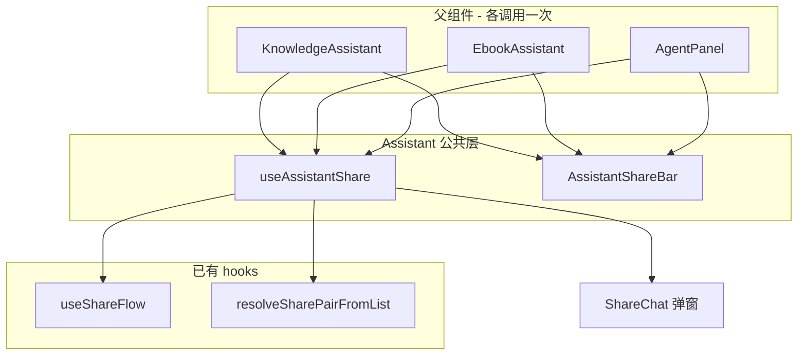

# 助手分享底栏与 Hook 统一（AssistantShareBar）

**延伸阅读**：

- 分享页渲染与后端拉取：[分享.md](./分享.md)
- 电子书 MOKE 助手分享（`sessionType=ebook`）：[../ebook/电子书Mock助手.md](../ebook/电子书Mock助手.md) §4.9
- 知识库助手完整链路（含分享边界）：[../knowledge/知识库助手完成.md](../knowledge/知识库助手完成.md) §8.2.2

---

## 1. 背景与目标

**问题**：知识库、英语学习 Agent、电子书阅读助手各自维护一套几乎相同的分享底栏 UI（`KnowledgeAssistantShareBar`、`ShareBar`、`EbookAssistantShareBar`）及对应的 `use*Share` hook，合计约 540 行重复代码。任意改动（如「已选组数」文案、全选逻辑、创建链接按钮）需改三处，易漏改。

**目标**：

| # | 目标 | 验收 |
|---|------|------|
| 1 | 抽取公共层 | `AssistantShareBar` + `useAssistantShare` 位于 `@/components/design/Assistant` |
| 2 | 三端直接引用 | 父组件 `import { AssistantShareBar, useAssistantShare } from '@/components/design/Assistant'` |
| 3 | 行为不变 | 勾选问答对、microtask/rAF 重放、`ShareChat` 弹窗、`sessionType` 分支与重构前一致 |
| 4 | 可扩展 | 新业务仅传 `sessionType` / `enabled` / 可选 i18n 与 `checkboxId` |

**关键决策**：删除各业务目录下的薄封装文件，**不在**业务层再保留 `useKnowledgeAssistantShare` 等别名 hook——差异（RAG 开关、持久化允许、Store 取 sessionId）留在各父组件的 `useAssistantShare({ enabled, ... })` 调用处，一眼可见。

---

## 2. 改动范围

| 路径 | 角色 |
|------|------|
| `apps/frontend/src/components/design/Assistant/ShareBar.tsx` | **新增** 分享底栏 UI |
| `apps/frontend/src/components/design/Assistant/useAssistantShare.tsx` | **新增** 会话级分享 hook（含 `ShareChat` 节点） |
| `apps/frontend/src/components/design/Assistant/types.ts` | 分享相关类型 |
| `apps/frontend/src/components/design/Assistant/index.ts` | 导出公共 API |
| `apps/frontend/src/views/knowledge/KnowledgeAssistant.tsx` | 改用公共 hook + 底栏 |
| `apps/frontend/src/views/englishLearning/agent/index.tsx` | 同上 |
| `apps/frontend/src/views/ebook/components/EbookAssistant.tsx` | 同上 |
| ~~`KnowledgeAssistantShareBar.tsx`~~ | **删除** |
| ~~`englishLearning/agent/ShareBar.tsx`~~ | **删除** |
| ~~`EbookAssistantShareBar.tsx`~~ | **删除** |

---

## 3. 架构与数据流



**生命周期边界**（与知识库 §8.2.2 约束一致）：

- `useAssistantShare` 是**会话级**状态机，必须在页面壳（`KnowledgeAssistant` / `EbookAssistant` / `AgentPanel`）**只调用一次**。
- 不可迁入 `AssistantMessageRow` / 单条气泡——否则每条消息各有一套 `shareSelection`，勾选与弹窗会错乱。
- `shareChatNode` 由父组件挂在 `AssistantFooter` 内，与底栏 `AssistantShareBar` 并列。

**Footer 互斥**：

```text
shareSelection.isSharing === false  →  ChatEntry（输入框）
shareSelection.isSharing === true   →  AssistantShareBar（全选 / 取消 / 创建链接）
```

---

## 4. 实现思路

### 4.1 `useAssistantShare` 参数设计

| 参数 | 含义 |
|------|------|
| `messages` | 当前会话消息列表（顺序即分享页顺序） |
| `sessionId` | 传给 `ShareChat` → 后端 `chatSessionId` |
| `sessionType` | `'assistant' \| 'agent' \| 'ebook'`，决定 `ShareService` 查哪张表 |
| `enabled` | 父组件组合业务开关；内部再与 `Boolean(sessionId)` 得 `allowAiShare` |

三端 `enabled` 差异：

| 场景 | `sessionType` | `enabled` 条件 |
|------|---------------|----------------|
| 知识库 AI 助手 | `assistant` | `!isRagMode && isLoggedIn && knowledgeAssistantPersistenceAllowed && activeSessionId` |
| 英语学习 Agent | `agent` | `isLoggedIn && sessionId` |
| 电子书阅读助手 | `ebook` | `isLoggedIn && activeSessionId` |

### 4.2 `onShare` 与 microtask/rAF 重放

从消息行点「分享」时，会同时 `setIsSharing(true)` 与 `replaceCheckedMessages(pair)`。React 批更新可能导致勾选被覆盖，故保留三重写入：

1. 同步 `replaceCheckedMessages(pair)`
2. `queueMicrotask` 再写一次
3. `requestAnimationFrame` 再写一次

另用 `pendingShareChatId` + `useEffect`：若 messages 尚未含目标 chatId（乐观 UI 换 id 前），等列表更新后再补选。

### 4.3 `AssistantShareBar` 扩展点

| Prop | 默认 | 用途 |
|------|------|------|
| `checkboxId` | `assistant-share-all` | 各场景唯一 id，避免 label 冲突 |
| `selectAllLabelKey` | `chat.share.selectAll` | 知识库传 `knowledge.assistant.share.selectAll` |
| `createLinkLabelKey` | `chat.share.createLink` | 知识库传 `knowledge.assistant.share.createLink` |
| `className` | 标准 footer 间距 | 特殊布局时可覆盖 |

「已选组数」统一 `chat.share.selectedPairs`（三端一致，本轮未改）。

### 4.4 TypeScript：`.tsx` 与显式扩展名

`useAssistantShare` 内含 JSX（`shareChatNode`），文件必须为 `.tsx`。`index.ts` 导出时使用 `./useAssistantShare.tsx` 显式扩展名，避免 `composite` 项目仍解析已删除的 `.ts` 路径。

---

## 5. 关键代码与注释

### 5.1 公共 hook

**来源**：`apps/frontend/src/components/design/Assistant/useAssistantShare.tsx`（约 L19–L105）

```typescript
export function useAssistantShare(params: UseAssistantShareParams): UseAssistantShareResult {
  const { messages, sessionId, sessionType, enabled } = params;
  const [shareModelVisible, setShareModelVisible] = useState(false);
  const [pendingShareChatId, setPendingShareChatId] = useState<string | null>(null);

  // 说明：enabled 由父组件传入（RAG/登录等）；此处再要求 sessionId 才允许分享
  const allowAiShare = enabled && Boolean(sessionId);

  const shareFlow = useShareFlow<Message>({
    enabled: allowAiShare,
    getAllMessages: () => messages,
    pairResolver: (message, all) =>
      resolveSharePairFromList(message, all ?? messages),
  });

  const onShare = useCallback((message?: Message) => {
    if (!allowAiShare || !message) return;
    setPendingShareChatId(message.chatId);
    shareSelection.setIsSharing(true);
    const pair = resolveSharePair(message);
    if (!pair) return;
    // 说明：三重写入防止进入分享态时勾选被 React 批更新覆盖
    shareSelection.replaceCheckedMessages(pair);
    queueMicrotask(() => shareSelection.replaceCheckedMessages(pair));
    requestAnimationFrame(() => shareSelection.replaceCheckedMessages(pair));
  }, [/* ... */]);

  return {
    allowAiShare,
    shareFlow,
    shareSelection,
    onShare,
    shareModelVisible,
    setShareModelVisible,
    onCloseShareModel,
    // 说明：ShareChat 与 sessionType 绑定后端 resolveShareMessagesBySessionId 分支
    shareChatNode: allowAiShare ? (
      <ShareChat
        open={shareModelVisible}
        onOpenChange={onCloseShareModel}
        checkedMessages={shareSelection.checkedMessages}
        orderedMessageIds={messages.map((m) => m.chatId)}
        sessionId={sessionId ?? undefined}
        sessionType={sessionType}
      />
    ) : null,
  };
}
```

### 5.2 分享底栏 UI

**来源**：`apps/frontend/src/components/design/Assistant/ShareBar.tsx`（约 L12–L80）

```typescript
export function AssistantShareBar({
  messages,
  shareSelection,
  shareFlow,
  setShareModelVisible,
  checkboxId = 'assistant-share-all',
  selectAllLabelKey = 'chat.share.selectAll',
  createLinkLabelKey = 'chat.share.createLink',
}: AssistantShareBarProps) {
  const { t } = useI18n();
  return (
    <div className="flex w-full items-center justify-between pt-4 pb-4.5">
      {/* 说明：全选 Checkbox + 已选问答对组数 */}
      <Checkbox
        id={checkboxId}
        checked={shareSelection.isAllChecked(messages)}
        onCheckedChange={(v) =>
          v ? shareSelection.setAllCheckedMessages(messages)
            : shareSelection.clearAllCheckedMessages()
        }
      />
      {/* 说明：取消退出分享态；创建链接打开 ShareChat（setShareModelVisible(true)） */}
      <Button onClick={() => shareFlow.onCancelShare()}>{t('common.cancel')}</Button>
      <Button
        disabled={shareSelection.checkedMessages.size === 0}
        onClick={() => setShareModelVisible(true)}
      >
        {t(createLinkLabelKey)}
      </Button>
    </div>
  );
}
```

### 5.3 电子书父组件接入

**来源**：`apps/frontend/src/views/ebook/components/EbookAssistant.tsx`（约 L59–L71、分享底栏约 L188–L196）

```typescript
const {
  allowAiShare,
  shareFlow,
  shareSelection,
  onShare,
  setShareModelVisible,
  shareChatNode,
} = useAssistantShare({
  messages: aiMessages,
  sessionId: ebookAssistantStore.activeSessionId,
  sessionType: 'ebook',
  enabled: isLoggedIn && Boolean(ebookAssistantStore.activeSessionId),
});

// Footer 内：
{allowAiShare && shareSelection.isSharing ? (
  <AssistantShareBar
    messages={aiMessages}
    checkboxId="ebook-assistant-share-all"
    shareSelection={shareSelection}
    shareFlow={shareFlow}
    setShareModelVisible={setShareModelVisible}
  />
) : (
  <ChatEntry /* ... */ />
)}
{shareChatNode}
```

### 5.4 知识库父组件接入（含 i18n 差异）

**来源**：`apps/frontend/src/views/knowledge/KnowledgeAssistant.tsx`（约 L468–L512）

```typescript
} = useAssistantShare({
  messages: aiMessages,
  sessionId: assistantStore.activeSessionId,
  sessionType: 'assistant',
  enabled:
    !isRagMode &&
    isLoggedIn &&
    assistantStore.knowledgeAssistantPersistenceAllowed &&
    Boolean(assistantStore.activeSessionId),
});

<AssistantShareBar
  messages={aiMessages}
  checkboxId="knowledge-assistant-share-all"
  selectAllLabelKey="knowledge.assistant.share.selectAll"
  createLinkLabelKey="knowledge.assistant.share.createLink"
  shareSelection={shareSelection}
  shareFlow={shareFlow}
  setShareModelVisible={setShareModelVisible}
/>
```

### 5.5 英语学习 Agent 接入

**来源**：`apps/frontend/src/views/englishLearning/agent/index.tsx`（约 L72–L84、底栏约 L151–L159）

```typescript
} = useAssistantShare({
  messages,
  sessionId: englishAgentStore.sessionId,
  sessionType: 'agent',
  enabled: isLoggedIn && Boolean(englishAgentStore.sessionId),
});

<AssistantShareBar
  messages={messages}
  checkboxId="english-learning-agent-share-all"
  shareSelection={shareSelection}
  shareFlow={shareFlow}
  setShareModelVisible={setShareModelVisible}
/>
```

---

## 6. 兼容性与影响

- **用户可见行为**：无变化；分享流程、文案（知识库仍用 `knowledge.assistant.share.*`）、链接参数不变。
- **破坏性**：删除 `useKnowledgeAssistantShare` / `useEbookAssistantShare` / `useSessionShare` 及对应 ShareBar 组件；外部若直接 import 旧路径会编译失败（仓库内已无引用）。
- **新产品接入**：在 Assistant 壳组件中调用 `useAssistantShare`，Footer 按 §3 互斥规则挂载即可；后端需在 `ShareService` 增加对应 `sessionType` 分支。

---

## 7. 建议回归

1. **知识库 AI 模式**：点 AI 回复分享 → 底栏出现 → 全选 / 取消 / 创建链接 → 分享页顺序与勾选一致。
2. **知识库 RAG 模式**：不应出现分享入口（`enabled` 为 false）。
3. **英语学习 Agent**：同上；`sessionType=agent` 链接可打开。
4. **电子书助手**：同上；`sessionType=ebook` 链接可打开。
5. **乐观 messageIds**：流式结束后 chatId 替换为 DB id，再点分享仍能正确成对勾选。

---

## 8. 相关源码路径

| 说明 | 路径 |
|------|------|
| 分享底栏 UI | `apps/frontend/src/components/design/Assistant/ShareBar.tsx` |
| 分享 hook | `apps/frontend/src/components/design/Assistant/useAssistantShare.tsx` |
| 类型与导出 | `apps/frontend/src/components/design/Assistant/types.ts`、`index.ts` |
| 成对解析 | `apps/frontend/src/hooks/useShareFlow.ts`（`resolveSharePairFromList`） |
| 分享弹窗 | `apps/frontend/src/components/design/Share/index.tsx` |
| 知识库接入 | `apps/frontend/src/views/knowledge/KnowledgeAssistant.tsx` |
| 英语 Agent 接入 | `apps/frontend/src/views/englishLearning/agent/index.tsx` |
| 电子书接入 | `apps/frontend/src/views/ebook/components/EbookAssistant.tsx` |

若与仓库最新源码不一致，以源码为准。
