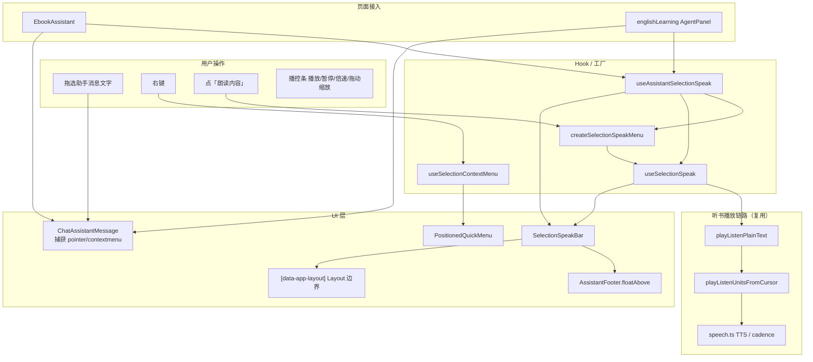
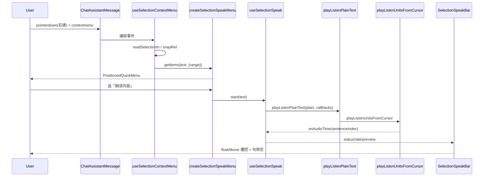

# Assistant 选区朗读：右键菜单 + 悬浮条 + 状态机（功能实现详解与复刻指南）

> **一句话**：本篇覆盖助手消息「选区右键菜单 + 悬浮播控条 + 朗读状态机」整条链路——拖选后右键可朗读/复制，朗读时 Footer 上方出现可拖动缩放的 `SelectionSpeakBar`，TTS 走听书同款按段链路并句级预览。  
> **入口**：英语 Agent 右侧面板、电子书「问书」助手 — 任意助手消息 Markdown 正文内拖选 → 右键「朗读内容」。  
> **关联文件**：`ContextMenu/*`、`SelectionSpeak/*`、`ChatAssistantMessage`、`Assistant/*`、`playListenPlainText.ts`、`layout/index.tsx`（`data-app-layout`）、`EbookAssistant.tsx`、`englishLearning/agent/index.tsx`  
> **关联文档**：[选区朗读通用.md](./选区朗读通用.md)（重构史 / 历史对照）、[english/选中文本朗读菜单.md](../english/选中文本朗读菜单.md)（英语域增量稿，现行实现以本篇为准）  
> **文档目标**：读懂实现思路；按复刻手册可在其他项目落地等价逻辑  
> **非目标**：EPUB 正文选区 PopBar、章节听书主循环细节（仅说明选区朗读如何复用 `playListenUnitsFromCursor` 与互斥钩子）

---

## 0. 先看这里（必填，一眼建立模型）

### 0.1 30 秒读懂

- **做什么**：助手气泡内选中文本 → 自定义右键菜单（朗读 + 复制）→ 朗读时 Footer 上方悬浮 `SelectionSpeakBar`（拖/缩/回位/播控 + 当前句预览）；TTS 与听书同链路；电子书与章节听书双向互斥。
- **不做什么**：不改 EPUB 阅读器正文选区工具条；不实现章节听书 UI/高亮主循环。
- **关键角色**：`useSelectionContextMenu` 判定选区并弹菜单；`createSelectionSpeakMenu` 组装菜单项；`useSelectionSpeak` 管状态机与 TTS；`playListenPlainText` 桥接听书单元；`SelectionSpeakBar` 负责悬浮 UI（边界 = Layout `[data-app-layout]`）；`useAssistantSelectionSpeak` 页面级一次性接线。

### 0.2 功能点总表（必填）

> 正文每一个功能点小节必须能在本表找到对应编号；本表有的项正文必须有小节。

| 编号 | 功能点（人话） | 用户可感知表现 | 关键实现位置（文件 → 符号） | 正文小节 |
|------|----------------|----------------|------------------------------|----------|
| F1 | 选区判定与 root 内限制 | 只有气泡内拖选的文字才出菜单 | `useSelectionContextMenu.tsx` → `readSelectionIn` | §4.1 |
| F2 | 右键按下快照 | macOS 点词后仍能读到用户拖选的文本 | `useSelectionContextMenu.tsx` → `onPointerDownCapture` | §4.2 |
| F3 | contextmenu 捕获弹菜单 | 右键出现「朗读/复制」，不出现系统菜单 | `useSelectionContextMenu.tsx` → `onContextMenuCapture` | §4.3 |
| F4 | PositionedQuickMenu 坐标锚定 | 菜单出现在鼠标附近 | `PositionedQuickMenu.tsx` → `PositionedQuickMenu` | §4.4 |
| F5 | 菜单项工厂（朗读/复制） | 两项可点；无 TTS 能力时朗读项 Toast 警告 | `createSelectionSpeakMenu.ts` → `createSelectionSpeakMenu` | §4.5 |
| F6 | ChatAssistantMessage / MessageRow / Footer.floatAbove | 消息行能右键；输入框上方出现播控条 | `ChatAssistantMessage`、`MessageRow`、`Footer` | §4.6 |
| F7 | useAssistantSelectionSpeak | 一处 hook 产出菜单工厂 + floatAbove + stop（无 boundsRef） | `useAssistantSelectionSpeak.tsx` | §4.7 |
| F8 | useSelectionSpeak 状态机 | 播放/暂停/停止/倍速；切会话不串台 | `useSelectionSpeak.ts` | §4.8 |
| F9 | playListenPlainText | 选区文本按段落单元 TTS，与听书同源 | `playListenPlainText.ts` | §4.9 |
| F10 | preview + CADENCE_LEAD | 悬浮条显示当前朗读句，随进度切换 | `useSelectionSpeak.ts` + cadence | §4.10 |
| F11 | SelectionSpeakBar 拖/缩/回位/stacked/播控 | 条可拖、可拉角改大小；高条上预览下按钮 | `SelectionSpeakBar.tsx` | §4.11 |
| F12 | resolveBoundsEl / data-app-layout / clamp | 拖离后不会飞出主内容区 | `SelectionSpeakBar.tsx` → `resolveBoundsEl` / clamp 族 | §4.12 |
| F13 | ResizeObserver + fixedPosRef 拖动守卫 | 窗口变化回夹；句切换时条不弹回旧位 | `SelectionSpeakBar.tsx` | §4.13 |
| F14 | Ebook 听书互斥 | 问书朗读前停章节听书；听书开播可停问书朗读 | `EbookAssistant.tsx` + `onBeforeStart` / `selectionSpeakStopRef` | §4.14 |

### 0.3 架构一图（必填）



### 0.4 文件地图与建造顺序（必填）

| 建造序 | 文件 | 职责（一句话） | 依赖 |
|--------|------|----------------|------|
| 1 | `layout/index.tsx` | 壳层 `data-app-layout` 供条边界查询 | 无 |
| 2 | `ContextMenu/types.ts` | 菜单项数据结构 | 无 |
| 3 | `ContextMenu/PositionedQuickMenu.tsx` | 鼠标坐标锚定 Dropdown | 2 |
| 4 | `ContextMenu/useSelectionContextMenu.tsx` | 选区读取 + 右键菜单 Hook | 2, 3 |
| 5 | `utils/speech.ts` | TTS、分句、倍速、停播 | 无 |
| 6 | `epub/listen/epubListenPlayUnits.ts` | 按段/首句快出声播放循环 | 5 |
| 7 | `epub/listen/playListenPlainText.ts` | 纯文本包装 → `playListenUnitsFromCursor` | 6 |
| 8 | `SelectionSpeak/useSelectionSpeak.ts` | 选区朗读状态机 + 预览同步 | 5, 7 |
| 9 | `SelectionSpeak/createSelectionSpeakMenu.ts` | 朗读/复制菜单项工厂 | 4 类型, 8 |
| 10 | `SelectionSpeak/SelectionSpeakBar.tsx` | 悬浮播控条 UI（拖/缩放/播控） | 8 类型, 1 |
| 11 | `SelectionSpeak/useAssistantSelectionSpeak.tsx` | 页面级组装 hook | 8–10 |
| 12 | `ChatAssistantMessage` / `MessageRow` / `Footer` | 气泡挂菜单；Footer 渲染 floatAbove | 4, 11 |
| 13 | `englishLearning/agent/index.tsx` | 英语 Agent：`useAssistantSelectionSpeak()` | 11–12 |
| 14 | `ebook/.../EbookAssistant.tsx` | 问书接入 + 听书互斥 | 11–12 |

---

## 1. 人话版：用户旅程（必填）

1. **进入**：打开英语 Agent 或电子书阅读页右侧「问书」助手，看到历史助手回复（Markdown 正文）。
2. **主路径**：用鼠标拖选一段回复文字 → 在选区内右键 → 弹出「朗读内容」「复制内容」→ 点「朗读内容」→ 输入框上方出现半透明播控条，开始朗读并显示当前句预览 → 可用播放/暂停、停止、倍速；可拖离、缩放、一键回位。
3. **分支**：
   - 点「复制内容」：文字进剪贴板，菜单关闭，无播控条。
   - 设备无 TTS：点朗读 Toast 提示不支持，不出条。
   - 电子书页且章节听书正在播：点朗读前先停章节听书（`onBeforeStart`）。
   - 换书/切会话/新建对话：自动 `stop()`，避免串台。
   - **仅按下把手未移动**：松手后条回到 Footer 默认位，不出现回位钮。
   - **拖离默认位**：条变 `fixed`，出现 LocateFixed 回位钮；坐标限制在 `[data-app-layout]` 矩形内（整页壳，不是助手侧栏）。
   - **拉高 ≥ 72px**：预览移到上方多行纵滚，按钮行居中在下。
   - **窗口/侧栏变宽变窄**：离位条自动 re-clamp，不被裁切。
4. **离开**：点停止或播完：条消失，状态回 idle。

---

## 2. 问题与解决方案总表（必填）

| 问题编号 | 现象 / 风险（人话） | 根因 | 解决方案（本项目做法） | 对应功能点 |
|----------|---------------------|------|------------------------|------------|
| P1 | macOS 右键后选区变成「点词」，菜单不出现 | 系统在 `contextmenu` 前改写 Selection | `pointerdown(button=2)` 快照选区，`contextmenu` 优先用快照 | F2, F3 |
| P2 | 气泡外误选也弹菜单 | 全局 Selection 未限定容器 | `readSelectionIn(root)` 校验 `commonAncestor` / `intersectsNode` | F1 |
| P3 | 系统右键菜单与自定义菜单叠加 | 未拦截默认行为 | 捕获阶段 `preventDefault` + `stopPropagation` | F3 |
| P4 | iframe/选区无法用 Dropdown Trigger 包裹 | Radix 需要 Trigger 元素 | 1×1px `fixed` 隐形 span 作 Trigger | F4 |
| P5 | 朗读与章节听书同时出声 | 共用全局 TTS 播放栈 | 电子书 `onBeforeStart` 停听书；`selectionSpeakStopRef` 反向停选区朗读 | F14 |
| P6 | 异步 TTS 回调在 stop 后仍改 UI | 多次 start/stop 竞态 | `seqRef` 会话序号，回调先比对 seq | F8 |
| P7 | 预览句跳得太早（估句 lead） | cadence 提前切句 | 无真实 progress 时延迟 `CADENCE_LEAD_SEC/rate`；有 `onAudioTime` 后忽略估句 | F10 |
| P8 | 选区含 Markdown 符号被读出来 | TTS 需要纯文本 | `stripMarkdownForTts` + `buildSentenceOffsetSpans` | F8, F9 |
| P9 | 暂停后 resume 失败需重播 | 软恢复依赖底层状态 | `resumePlaybackSoft` 失败则 `start(textRef)` 整段重播 | F8 |
| P10 | 条拖出助手侧栏后消失或被裁 | 边界用侧栏 ref 太窄 | 统一查 `[data-app-layout]` 整页壳 | F12 |
| P11 | 只点把手就冒出回位钮 | 按下即 `setFixedPos` | `dragActive` + `MOVE_EPS`；超阈值才离位 | F11 |
| P12 | 预览句切换时条弹回旧坐标 | preview 触发重渲染，effect 把 ref 打回 state | 拖/缩放中跳过 `fixedPosRef` 同步 effect | F13 |
| P13 | 窗口缩放后条飞出视口 | fixed 坐标未更新 | `ResizeObserver` on layout + re-clamp | F13 |
| P14 | NE 缩放时条往下「跳」 | 改高度时 top 未联动 | `clampSizeNe` 固定 bottom 反算 top | F11 |

---

## 3. 实现思路总览（必填）

### 3.1 总体策略

选区菜单与朗读拆成 **通用 ContextMenu 基础设施** + **SelectionSpeak 业务包** + **页面薄接线**。菜单通过 `getSelectionContextMenuItems` 注入，英语 Agent / 电子书问书共用。TTS 不另写播放器，而是 `playListenPlainText` 直接调听书的 `playListenUnitsFromCursor`。悬浮条几何状态自管，拖动边界固定为 Layout `[data-app-layout]`，页面**无需**再传 `boundsRef` / `panelRef`。

### 3.2 数据流与控制流



**核心状态字段**（`useSelectionSpeak`）：`status`（idle/loading/playing/paused）、`rate`、`preview`；ref 侧 `seqRef`、`textRef`、`plainRef`、`sentencesRef`、`audioClockRef`。

**悬浮条几何**：`fixedPos === null` 走 Footer 锚点；离位后 `fixed` + clamp 到 Layout；`ResizeObserver` 与 `fixedPosRef` 守卫见 F12/F13。

**结束条件**：播完 → idle；用户 stop → idle + `stopAllPlayback`；`isActive()` 返回 false（seq 变化或 paused）→ 播放链中断。

### 3.3 模块职责

| 模块 | 调用方 | 被调用 |
|------|--------|--------|
| `useSelectionContextMenu` | `ChatAssistantMessage` | `PositionedQuickMenu`, `getItems` |
| `createSelectionSpeakMenu` | `useAssistantSelectionSpeak` | `copyToClipboard`, `isPlaybackAvailable`, `start` |
| `useSelectionSpeak` | `useAssistantSelectionSpeak` | `playListenPlainText`, `speech.ts` |
| `SelectionSpeakBar` | `useAssistantSelectionSpeak.floatAbove` | Layout `resolveBoundsEl` |
| `useAssistantSelectionSpeak` | `EbookAssistant`, `AgentPanel` | 上述全部 |
| `AssistantMessageRow` | 页面 messageList | `ChatAssistantMessage` |
| `AssistantFooter` | 页面 footer | 渲染 `floatAbove` |

---

## 4. 分功能点详解（必填，核心）

### 4.1 F1：选区判定与 root 内限制

#### （1）人话说明

只有用户在**当前消息气泡**里真正选中了非空文字，后续才会考虑弹菜单。选区必须在 `root`（气泡 shell）内部，否则当作无选区。

#### （2）实现思路

`readSelectionIn(root)` 集中做 Selection API 读取与边界校验，供 pointerdown 快照与 contextmenu  live 读取共用，避免两处逻辑分叉。

#### （3）问题与对策

对应 P2：用 `contains` + `intersectsNode`（try/catch 防跨 iframe 异常）双重判定。

#### （4）实现过程

1. 读 `window.getSelection()`，collapsed 或无 range 则空。  
2. 判断选区与 `root` 的几何/ DOM 关系。  
3. `trim` 文本；克隆 `Range` 供菜单 ctx（当前复制/朗读只用 text）。

#### （5）关键代码（逐行上方注释）

- **位置**：`useSelectionContextMenu.tsx` → `readSelectionIn`（约第 31–58 行）

```ts
// 在指定 root 元素内读取当前选区，返回 trimmed 文本与克隆 Range
function readSelectionIn(root: HTMLElement): SelSnap {
	// 取浏览器原生选区对象
	const sel = window.getSelection();
	// 无选区、已折叠、或无 range 时视为无选中
	if (!sel || sel.isCollapsed || sel.rangeCount < 1) {
		return { text: '', range: null };
	}
	// 取第一个 range（常规文本选择只有一个）
	const range = sel.getRangeAt(0);
	// 选区公共祖先节点，用于判断是否在 root 子树内
	const ancestor = range.commonAncestorContainer;
	// 三种方式判定选区与 root 相交：祖先即 root、root 包含祖先、或 range 与 root 相交
	const inRoot =
		root === ancestor ||
		root.contains(ancestor) ||
		(() => {
			try {
				return range.intersectsNode(root);
			} catch {
				return false;
			}
		})();
	// 选区不在消息气泡内则忽略
	if (!inRoot) return { text: '', range: null };
	// 转为字符串并去首尾空白
	const text = sel.toString().trim();
	// 纯空白选区不算有效
	if (!text) return { text: '', range: null };
	// 克隆 range 供后续菜单 ctx（防止 live range 被系统改写）
	let cloned: Range | null = null;
	try {
		cloned = range.cloneRange();
	} catch {
		cloned = null;
	}
	return { text, range: cloned };
}
```

#### （6）复刻提示

- 可原样搬迁：`readSelectionIn` 整函数。  
- 须替换：`root` 须绑在**可被选中的 Markdown 容器**外层（本项目为 `data-chat-assistant-shell` 的 div）。  
- 最小验证：气泡内拖选有菜单，气泡外拖选无菜单。

---
### 4.2 F2：右键按下快照（防 macOS 点词）

#### （1）人话说明

在 macOS 上，右键瞬间系统可能把选区改成「光标下的单词」。在右键**按下**时先拍照存选区，后面弹菜单时优先用这张照片。

#### （2）实现思路

`pointerdown` 捕获阶段、`button === 2` 时写入 `snapRef`；`contextmenu` 消费后清空。

#### （3）问题与对策

对应 P1。

#### （4）实现过程

1. `onPointerDownCapture` 仅在传入 `getItems` 时启用。  
2. 仅响应右键（`button !== 2`  return）。  
3. `snapRef.current = readSelectionIn(e.currentTarget)`。

#### （5）关键代码

- **位置**：`useSelectionContextMenu.tsx` → `onPointerDownCapture`（约第 84–91 行）

```ts
// 捕获阶段：右键按下瞬间快照选区
const onPointerDownCapture = useCallback(
	(e: ReactPointerEvent<HTMLElement>) => {
		// 未配置菜单工厂则完全不介入
		if (!getItems) return;
		// 只处理右键（主键、中键忽略）
		if (e.button !== 2) return;
		// 在当前 target（消息 shell）内读取并保存选区快照
		snapRef.current = readSelectionIn(e.currentTarget);
	},
	[getItems],
);
```

#### （5b）关键代码 — hook 全文

- **位置**：`useSelectionContextMenu.tsx`（全文）

```tsx
import {
	type MouseEvent as ReactMouseEvent,
	type ReactNode,
	type PointerEvent as ReactPointerEvent,
	useCallback,
	useRef,
	useState,
} from 'react';
import {
	PositionedQuickMenu,
	type PositionedQuickMenuState,
} from './PositionedQuickMenu';
import type { QuickContextMenuEntry } from './types';

export type SelectionContextMenuCtx = {
	/** 右键按下前的选区快照（contextmenu 时原生选区可能已被系统改写） */
	range: Range | null;
};

/** 由使用方根据选中文本返回菜单项；返回 null/空则不弹出自定义菜单 */
export type SelectionContextMenuItemsFn = (
	selectedText: string,
	ctx: SelectionContextMenuCtx,
) => readonly QuickContextMenuEntry[] | null | undefined;

type SelSnap = {
	text: string;
	range: Range | null;
};

// … readSelectionIn 见 §4.1（5）…

type MenuState = PositionedQuickMenuState & {
	items: readonly QuickContextMenuEntry[];
};

/**
 * 选中文本后右键才弹出菜单；`getItems` 未传则无行为（默认关闭）。
 *
 * 可靠性（尤其 macOS）：
 * - pointerdown(button=2) 先快照选区（系统右键常会改写/点词选中）
 * - contextmenu 用捕获阶段，并尽早 preventDefault
 */
export function useSelectionContextMenu(
	getItems?: SelectionContextMenuItemsFn,
): {
	onContextMenuCapture: ((e: ReactMouseEvent<HTMLElement>) => void) | undefined;
	onPointerDownCapture:
		| ((e: ReactPointerEvent<HTMLElement>) => void)
		| undefined;
	menu: ReactNode;
} {
	const [menu, setMenu] = useState<MenuState | null>(null);
	/** 右键按下瞬间的选区；contextmenu 时优先用它 */
	const snapRef = useRef<SelSnap | null>(null);

	// … onPointerDownCapture / onContextMenuCapture 见 §4.2（5）、§4.3（5a）…

	if (!getItems) {
		return {
			onContextMenuCapture: undefined,
			onPointerDownCapture: undefined,
			menu: null,
		};
	}

	return {
		onContextMenuCapture,
		onPointerDownCapture,
		menu: (
			<PositionedQuickMenu
				state={menu}
				items={menu?.items ?? []}
				onOpenChange={(open) => {
					if (!open) setMenu(null);
					else setMenu((m) => (m ? { ...m, open } : m));
				}}
			/>
		),
	};
}
```

> 完整 `readSelectionIn`、`onPointerDownCapture`、`onContextMenuCapture` 逐行注释见 §4.1–§4.3；上块为文件骨架与导出类型，与仓库一致。

#### （6）复刻提示

- 必须与 F3 成对使用；只快照不消费无效。
- 最小验证：macOS 上拖选多词后右键，菜单仍针对整段拖选而非单字。

---
### 4.3 F3：contextmenu 捕获弹菜单

#### （1）人话说明

用户右键时，若有有效选区且菜单工厂返回非空项，则拦截系统菜单，在鼠标位置弹自定义项。

#### （2）实现思路

捕获阶段处理；文本优先 `snap?.text`，否则 live；`preventDefault` 必须在确认要弹菜单之后。

#### （3）问题与对策

对应 P1、P3。

#### （4）实现过程

1. 读 live 选区 + 取 snap。  
2. 合并文本；空则 return（走系统默认）。  
3. `getItems(text, { range })`；无项 return。  
4. 阻止默认 → `setMenu({ open, x, y, items })`。

#### （5）关键代码

- **位置**：`useSelectionContextMenu.tsx` → `onContextMenuCapture` + hook 返回（约第 93–138 行）

```ts
// 捕获阶段：contextmenu 时决定是否弹自定义菜单
const onContextMenuCapture = useCallback(
	(e: ReactMouseEvent<HTMLElement>) => {
		// 未配置 getItems 则不处理
		if (!getItems) return;

		// 同时读当前选区与 pointerdown 快照
		const live = readSelectionIn(e.currentTarget);
		const snap = snapRef.current;
		// 快照只用一次，读后清空
		snapRef.current = null;

		// 优先快照文本（用户拖选）；否则用 live
		const text = (snap?.text || live.text).trim();
		if (!text) return;

		// range：若快照有文本则用快照 range，否则 live range
		const range = snap?.text ? snap.range : live.range;
		// 由业务方生成菜单项（朗读/复制等）
		const items = getItems(text, { range });
		if (!items?.length) return;

		// 确认弹自定义菜单：阻止系统右键菜单
		e.preventDefault();
		e.stopPropagation();
		// 以鼠标 client 坐标打开 PositionedQuickMenu
		setMenu({ open: true, x: e.clientX, y: e.clientY, items });
	},
	[getItems],
);

// getItems 未传：不向 DOM 挂任何处理器，也不渲染 menu
if (!getItems) {
	return {
		onContextMenuCapture: undefined,
		onPointerDownCapture: undefined,
		menu: null,
	};
}

// 有 getItems：返回捕获处理器与菜单 React 节点
return {
	onContextMenuCapture,
	onPointerDownCapture,
	menu: (
		<PositionedQuickMenu
			state={menu}
			items={menu?.items ?? []}
			onOpenChange={(open) => {
				if (!open) setMenu(null);
				else setMenu((m) => (m ? { ...m, open } : m));
			}}
		/>
	),
};
```

#### （6）复刻提示

- `getItems` 为 optional：不传则功能完全关闭（Chat 默认行为）。  
- 最小验证：有选区时出现自定义菜单且无系统菜单。

---
### 4.4 F4：PositionedQuickMenu 坐标锚定

#### （1）人话说明

菜单紧贴鼠标位置弹出，不依赖包裹选区的 Trigger 元素。

#### （2）实现思路

Radix `DropdownMenu` + 1×1px `fixed` 隐形 `span` 作 `DropdownMenuTrigger`，`left/top` 设为 `clientX/clientY`。

#### （3）问题与对策

对应 P4。

#### （4）实现过程

1. `state` 为 null 时不渲染。  
2. `useMemo` 生成 anchor 的 inline style。  
3. `MenuEntries` 递归渲染 item/sub/separator。

#### （5a）关键代码 — 类型与 MenuEntries

- **位置**：`ContextMenu/types.ts`（全文）

```ts
// 从 React 引入 ReactNode 作菜单 label 类型
import type { ReactNode } from 'react';

/** 分隔线项 */
export type QuickContextMenuSeparator = {
	//  discriminant：分隔线
	type: 'separator';
	/** 列表渲染用 key，缺省则使用索引 */
	id?: string;
};

/** 普通可点击项 */
export type QuickContextMenuItem = {
	// discriminant：可点击项
	type: 'item';
	// 稳定 key
	id: string;
	// 展示文案（可为 React 节点）
	label: ReactNode;
	// 禁用态
	disabled?: boolean;
	// Radix inset 样式
	inset?: boolean;
	// 默认或 destructive 变体
	variant?: 'default' | 'destructive';
	// 右侧快捷键展示
	shortcut?: string;
	// 选中回调
	onSelect?: (event: Event) => void;
};

/** 子菜单 */
export type QuickContextMenuSub = {
	// discriminant：子菜单
	type: 'sub';
	id: string;
	label: ReactNode;
	disabled?: boolean;
	inset?: boolean;
	// 子项列表
	items: readonly QuickContextMenuEntry[];
};

// 三种入口的联合类型
export type QuickContextMenuEntry =
	| QuickContextMenuSeparator
	| QuickContextMenuItem
	| QuickContextMenuSub;
```

#### （5b）关键代码 — PositionedQuickMenu 全文

- **位置**：`PositionedQuickMenu.tsx`（全文）

```tsx
// 从 React 引入 useMemo
import { useMemo } from 'react';
// 引入 shadcn/ui Dropdown 系列组件
import {
	DropdownMenu,
	DropdownMenuContent,
	DropdownMenuItem,
	DropdownMenuSeparator,
	DropdownMenuShortcut,
	DropdownMenuSub,
	DropdownMenuSubContent,
	DropdownMenuSubTrigger,
	DropdownMenuTrigger,
} from '@/components/ui/dropdown-menu';
// 菜单项类型
import type { QuickContextMenuEntry } from './types';

// 菜单打开状态 + 锚点坐标
export type PositionedQuickMenuState = {
	open: boolean;
	x: number;
	y: number;
};

// 组件 props
type Props = {
	state: PositionedQuickMenuState | null;
	items: readonly QuickContextMenuEntry[];
	onOpenChange: (open: boolean) => void;
	contentClassName?: string;
};

// 递归渲染菜单项列表
function MenuEntries({
	entries,
}: {
	entries: readonly QuickContextMenuEntry[];
}) {
	// 按索引 map，根据 type 分支
	return entries.map((entry, index) => {
		// 分隔线
		if (entry.type === 'separator') {
			return <DropdownMenuSeparator key={entry.id ?? `sep-${index}`} />;
		}
		// 子菜单
		if (entry.type === 'sub') {
			return (
				<DropdownMenuSub key={entry.id}>
					<DropdownMenuSubTrigger disabled={entry.disabled} inset={entry.inset}>
						{entry.label}
					</DropdownMenuSubTrigger>
					<DropdownMenuSubContent>
						<MenuEntries entries={entry.items} />
					</DropdownMenuSubContent>
				</DropdownMenuSub>
			);
		}
		// 普通项
		return (
			<DropdownMenuItem
				key={entry.id}
				disabled={entry.disabled}
				inset={entry.inset}
				variant={entry.variant}
				onSelect={entry.onSelect}
			>
				{entry.label}
				{entry.shortcut != null && entry.shortcut !== '' ? (
					<DropdownMenuShortcut>{entry.shortcut}</DropdownMenuShortcut>
				) : null}
			</DropdownMenuItem>
		);
	});
}

/**
 * 锚定在鼠标坐标的声明式菜单（iframe / 选区右键等无法用 Trigger 包裹时用）。
 */
export function PositionedQuickMenu({
	state,
	items,
	onOpenChange,
	contentClassName = 'min-w-44',
}: Props) {
	// 根据 state 计算 1×1 隐形锚点样式
	const anchorStyle = useMemo(
		() =>
			state
				? ({
						position: 'fixed',
						left: state.x,
						top: state.y,
						width: 1,
						height: 1,
						pointerEvents: 'none',
					} as const)
				: undefined,
		[state],
	);

	// 无 state 不挂载 Dropdown
	if (!state) return null;

	return (
		<DropdownMenu open={state.open} onOpenChange={onOpenChange} modal>
			<DropdownMenuTrigger asChild>
				<span aria-hidden style={anchorStyle} />
			</DropdownMenuTrigger>
			<DropdownMenuContent
				className={contentClassName}
				align="start"
				side="right"
			>
				<MenuEntries entries={items} />
			</DropdownMenuContent>
		</DropdownMenu>
	);
}
```

#### （6）复刻提示

- 依赖 Radix/shadcn Dropdown；无则需自实现 popover + portal。  
- 最小验证：右键位置附近出现菜单，点击外部关闭。

---
### 4.5 F5：菜单项工厂（朗读/复制）

#### （1）人话说明

给定选中文本，返回两项：「朗读内容」调用 `onSpeak`；「复制内容」写剪贴板。朗读前检查 `isPlaybackAvailable()`。

#### （2）实现思路

纯函数工厂，符合 `SelectionContextMenuItemsFn` 签名，便于 i18n 与页面注入 `start`。

#### （3）问题与对策

无 TTS 时 Toast（`assistant.tts.unsupported`），不调用 `onSpeak`。

#### （4）实现过程

1. `trim` 空则 `return null`。  
2. 构建 speak item + copy item 数组。

#### （5）关键代码

- **位置**：`createSelectionSpeakMenu.ts`（全文）

```ts
// 引入菜单项函数类型
import type { SelectionContextMenuItemsFn } from '@design/ContextMenu';
// Toast 组件
import { Toast } from '@ui/index';
// 剪贴板工具
import { copyToClipboard } from '@/utils/clipboard';
// TTS 能力探测
import { isPlaybackAvailable } from '@/utils/speech';

// i18n t 函数类型
type TFn = (key: string, params?: Record<string, unknown>) => string;

/**
 * 助手消息选区右键：朗读内容 + 复制内容。
 */
export function createSelectionSpeakMenu(
	t: TFn,
	onSpeak: (text: string) => boolean,
): SelectionContextMenuItemsFn {
	// 返回符合 SelectionContextMenuItemsFn 的闭包
	return (selectedText) => {
		// 再次 trim，空文本不出菜单
		const text = selectedText.trim();
		if (!text) return null;

		return [
			{
				type: 'item',
				id: 'speak',
				label: t('assistant.selection.speak'),
				onSelect: () => {
					// 无播放能力则警告并返回
					if (!isPlaybackAvailable()) {
						Toast({
							type: 'warning',
							title: t('assistant.tts.unsupported'),
						});
						return;
					}
					// 发起朗读（boolean 表示是否成功发起）
					onSpeak(text);
				},
			},
			{
				type: 'item',
				id: 'copy',
				label: t('assistant.selection.copy'),
				onSelect: () => {
					// 异步复制，不阻塞菜单关闭
					void copyToClipboard(text);
				},
			},
		];
	};
}
```

#### （6）复刻提示

- i18n key：`assistant.selection.speak` / `copy`。  
- 最小验证：两项可见；复制后剪贴板有文本。

---
### 4.6 F6：页面接入透传 props + Footer 悬浮条

#### （1）人话说明

消息组件接收可选 `getSelectionContextMenuItems`；消息行透传；Footer 在输入框上方渲染 `floatAbove`（播控条）。

#### （2）实现思路

ChatAssistantMessage 是唯一挂 DOM 捕获点；Assistant 套件只透传 prop；Footer 只负责插槽位置。

#### （3）问题与对策

memo 比较须包含 `getSelectionContextMenuItems`，否则换 hook 实例不刷新。

#### （4）实现过程

1. `ChatAssistantMessage` 调 `useSelectionContextMenu(getSelectionContextMenuItems)`。  
2. shell div 绑 `onContextMenuCapture` / `onPointerDownCapture`。  
3. 末尾渲染 `{selectionContextMenu}`。  
4. `AssistantMessageRow` → `ChatAssistantMessage` 透传。  
5. `AssistantFooter` 渲染 `{floatAbove}` 在 `{children}` 前。

#### （5a）ChatAssistantMessage 选区相关摘录

- **位置**：`ChatAssistantMessage/index.tsx`

```tsx
// 从 design ContextMenu 引入类型与 hook
import {
	type SelectionContextMenuItemsFn,
	useSelectionContextMenu,
} from '@design/ContextMenu';

// props：可选选区菜单工厂
interface AssistantMessageProps {
	// ... 其他 props ...
	/**
	 * 选中消息正文后右键菜单；不传则关闭（默认）。
	 * 菜单能力由使用方传入（如英语 Agent 的朗读/复制）。
	 */
	getSelectionContextMenuItems?: SelectionContextMenuItemsFn;
}

function ChatAssistantMessageInner({
	// ...
	getSelectionContextMenuItems,
}: AssistantMessageProps) {
	// 选区右键 hook：处理器 + 菜单节点
	const {
		onContextMenuCapture: onSelectionContextMenuCapture,
		onPointerDownCapture: onSelectionPointerDownCapture,
		menu: selectionContextMenu,
	} = useSelectionContextMenu(getSelectionContextMenuItems);

	return (
		<div
			ref={shellRef}
			className="w-full h-auto"
			data-chat-assistant-shell
			// 捕获阶段绑定选区右键与 pointerdown 快照
			onContextMenuCapture={onSelectionContextMenuCapture}
			onPointerDownCapture={onSelectionPointerDownCapture}
		>
			{/* ... 消息正文 ... */}
			{/* 鼠标坐标锚定的快捷菜单 portal */}
			{selectionContextMenu}
		</div>
	);
}

// memo 相等性：须比较 getSelectionContextMenuItems
function areChatAssistantMessageMemoPropsEqual(
	prev: Readonly<AssistantMessageProps>,
	next: Readonly<AssistantMessageProps>,
): boolean {
	// ...
	return (
		// ...
		prev.getSelectionContextMenuItems === next.getSelectionContextMenuItems &&
		// ...
	);
}
```

#### （5b）MessageRow 透传

- **位置**：`Assistant/MessageRow.tsx`

```tsx
// AssistantMessageBubble 解构 getSelectionContextMenuItems
function AssistantMessageBubble({
	// ...
	getSelectionContextMenuItems,
}: AssistantMessageBubbleProps) {
	return (
		<div /* ... */>
			<Label /* ... */>
				{isUser ? (
					<ChatAssistantMessage
						message={message}
						t={t}
						className={messageUserContentClass(variant)}
						getSelectionContextMenuItems={getSelectionContextMenuItems}
					/>
				) : (
					<ChatAssistantMessage
						message={message}
						scrollViewportRef={scrollViewportRef}
						t={t}
						className={messageAssistantContentClass(variant)}
						getSelectionContextMenuItems={getSelectionContextMenuItems}
					/>
				)}
				{/* ... ChatMessageActions ... */}
			</Label>
		</div>
	);
}
```

#### （5c）Footer floatAbove

- **位置**：`Assistant/Footer.tsx`

```tsx
/** 助手输入区：max-w-3xl 居中 + 可选置顶/置底 FAB */
export function AssistantFooter({
	embedded: _embedded = false,
	containerClassName,
	showScrollFab = false,
	scrollFab,
	floatAbove,
	children,
}: AssistantFooterProps) {
	return (
		<div className="min-w-0 w-full shrink-0">
			<div
				className={cn(
					'relative mx-auto min-w-0 w-full max-w-3xl pl-4 pr-4',
					containerClassName,
				)}
			>
				{/* 选区朗读条等悬浮在输入区上方 */}
				{floatAbove}
				{showScrollFab && scrollFab ? <ScrollFab {...scrollFab} /> : null}
				{children}
			</div>
		</div>
	);
}
```

#### （6）复刻提示

- `floatAbove` 须放在 `relative` 容器内，条默认 `absolute bottom-full` 居中。  
- 最小验证：不传 `getSelectionContextMenuItems` 时无右键菜单。

---
### 4.7 F7：useAssistantSelectionSpeak（无 boundsRef；opts 为函数或 options）

#### （1）人话说明

页面只调一个 hook，得到：右键菜单工厂、Footer 上方 React 节点、对外 `stop`/`visible`。电子书可传 `onBeforeStart` 与初始宽高。

#### （2）实现思路

内部 `useSelectionSpeak()`；`start` 包装 `onBeforeStart`；`floatAbove` 在 `visible` 时渲染 `SelectionSpeakBar`。边界固定 Layout，无需 panel ref。

#### （3）问题与对策

对应 P5：`onBeforeStartRef` 避免 options 变导致 start 重建。opts 兼容 `() => void` 简写。

#### （4）实现过程

1. normalize options。  
2. `getSelectionContextMenuItems = createSelectionSpeakMenu(t, start)`。  
3. `floatAbove = visible ? <SelectionSpeakBar … /> : null`。  

#### （5）关键代码

```tsx
// 注释：助手选区朗读会话：菜单项工厂 + Footer 悬浮条 + stop
export function useAssistantSelectionSpeak(
	opts?: (() => void) | AssistantSelectionSpeakOptions,
) {
	const { t } = useI18n();
	const speak = useSelectionSpeak();
	const normalized =
		typeof opts === 'function' ? { onBeforeStart: opts } : (opts ?? {});
	const onBeforeStartRef = useRef(normalized.onBeforeStart);
	onBeforeStartRef.current = normalized.onBeforeStart;
	const initialWidth = normalized.initialWidth;
	const initialHeight = normalized.initialHeight;

	const start = useCallback(
		(text: string) => {
			onBeforeStartRef.current?.();
			return speak.start(text);
		},
		[speak.start],
	);

	const getSelectionContextMenuItems = useMemo(
		() => createSelectionSpeakMenu(t, start),
		[t, start],
	);

	const floatAbove = useMemo(
		() =>
			speak.visible ? (
				<SelectionSpeakBar
					status={speak.status}
					rate={speak.rate}
					preview={speak.preview}
					onTogglePlay={speak.togglePlay}
					onStop={speak.stop}
					onRateChange={speak.setRate}
					initialWidth={initialWidth}
					initialHeight={initialHeight}
				/>
			) : null,
		[
			speak.visible,
			speak.status,
			speak.rate,
			speak.preview,
			speak.togglePlay,
			speak.stop,
			speak.setRate,
			initialWidth,
			initialHeight,
		],
	);

	return {
		getSelectionContextMenuItems,
		floatAbove,
		stop: speak.stop,
		visible: speak.visible,
	};
}
```

#### （5b）页面接线片段

**英语 Agent**（`englishLearning/agent/index.tsx`）：

```tsx
// 注释：无互斥钩子，默认参数
const selectionSpeak = useAssistantSelectionSpeak();

// AssistantFooter：
floatAbove={selectionSpeak.floatAbove}

// AssistantMessageRow：
getSelectionContextMenuItems={
	selectionSpeak.getSelectionContextMenuItems
}
```

**电子书问书**（`EbookAssistant.tsx`）：

```tsx
// 注释：开播前停章节听书；初始宽 344px
const selectionSpeak = useAssistantSelectionSpeak({
	onBeforeStart: onBeforeSelectionSpeak,
	initialWidth: 344,
});

// 注释：把 stop 暴露给阅读页，供听书互斥
useEffect(() => {
	if (!selectionSpeakStopRef) return;
	selectionSpeakStopRef.current = selectionSpeak.stop;
	return () => {
		selectionSpeakStopRef.current = null;
	};
}, [selectionSpeak.stop, selectionSpeakStopRef]);

floatAbove={selectionSpeak.floatAbove}
```

#### （6）复刻提示

- 必须替换：各页 `AssistantFooter` / `MessageRow` 透传点。  
- 最小验证：两页面开播均出现条且菜单可触发。

---
### 4.8 F8：useSelectionSpeak 状态机

#### （1）人话说明

核心状态机：`idle → loading → playing ⇄ paused → idle`。`visible` 即非 idle。`stop` 硬停全局播放；`togglePlay` 在 playing/loading 与 paused 间切换；`setRate` 钳制并应用到活跃播放。

#### （2）实现思路

`seqRef` 会话序号；`rateRef` 供异步 `getRate`；`textRef`/`plainRef`/`sentencesRef` 缓存供 preview 与 resume 重播。

#### （3）问题与对策

对应 P7：所有 async 回调首行检查 `seq === seqRef.current`。卸载 effect 调 `stop()`。

#### （4）实现过程

1. `start`：strip markdown → 分句 → seq++ → `playListenPlainText`。  
2. `pause`/`resume`/`togglePlay`。  
3. `setRate`：`clampRate` + `applyActivePlaybackRate`。  

#### （5a）关键代码 — 状态与 stop/start 入口

```ts
// 注释：选区朗读状态机类型
export type SelectionSpeakStatus = 'idle' | 'loading' | 'playing' | 'paused';

export function useSelectionSpeak() {
	const [status, setStatus] = useState<SelectionSpeakStatus>('idle');
	const [rate, setRateState] = useState(1);
	const [preview, setPreview] = useState('');

	const seqRef = useRef(0);
	const pausedRef = useRef(false);
	const rateRef = useRef(1);
	const textRef = useRef('');
	const plainRef = useRef('');
	const sentencesRef = useRef<Array<{ start: number; end: number }>>([]);
	const statusRef = useRef<SelectionSpeakStatus>('idle');

	statusRef.current = status;

	const stop = useCallback(() => {
		seqRef.current += 1;
		pausedRef.current = false;
		audioClockRef.current = false;
		waitingRef.current = false;
		shownSiRef.current = 0;
		clearDelay();
		textRef.current = '';
		plainRef.current = '';
		sentencesRef.current = [];
		stopAllPlayback();
		setStatus('idle');
		setPreview('');
	}, [clearDelay]);

	useEffect(() => () => stop(), [stop]);

	const start = useCallback(
		(rawText: string) => {
			const text = rawText.trim();
			if (!text) return false;
			if (!isPlaybackAvailable()) return false;

			const plain = stripMarkdownForTts(text);
			if (!plain) return false;
			const sentences = buildSentenceOffsetSpans(plain);

			const seq = ++seqRef.current;
			pausedRef.current = false;
			shownSiRef.current = -1;
			clearDelay();
			textRef.current = text;
			plainRef.current = plain;
			sentencesRef.current = sentences;
			stopAllPlayback();
			applySentence(0);
			setStatus('loading');

			void (async () => {
				try {
					const ok = await playListenPlainText(plain, {
						isActive: () => seq === seqRef.current && !pausedRef.current,
						getRate: () => rateRef.current,
						onAwaitingCurrentTts: (waiting) => {
							if (seq !== seqRef.current || pausedRef.current) return;
							waitingRef.current = waiting;
							if (waiting) {
								audioClockRef.current = false;
								clearDelay();
							}
							setStatus(waiting ? 'loading' : 'playing');
						},
						// onAudioTime / onSentence 见 F15
					});
					if (seq !== seqRef.current) return;
					if (ok && !pausedRef.current) {
						setStatus('idle');
						setPreview('');
						textRef.current = '';
						plainRef.current = '';
						sentencesRef.current = [];
					} else if (!ok && statusRef.current !== 'paused') {
						setStatus('idle');
						setPreview('');
						textRef.current = '';
						plainRef.current = '';
						sentencesRef.current = [];
					}
				} catch {
					if (seq !== seqRef.current) return;
					setStatus('idle');
					setPreview('');
					textRef.current = '';
					plainRef.current = '';
					sentencesRef.current = [];
				}
			})();

			return true;
		},
		[applySentence, clearDelay],
	);
```

#### （5b）关键代码 — pause / resume / toggle / setRate / 导出

```ts
	const pause = useCallback(() => {
		const s = statusRef.current;
		if (s !== 'playing' && s !== 'loading') return;
		pausedRef.current = true;
		clearDelay();
		pausePlaybackSoft();
		setStatus('paused');
	}, [clearDelay]);

	const resume = useCallback(() => {
		if (statusRef.current !== 'paused') return;
		pausedRef.current = false;
		if (resumePlaybackSoft()) {
			setStatus('playing');
			return;
		}
		const text = textRef.current;
		if (!text) {
			setStatus('idle');
			return;
		}
		start(text);
	}, [start]);

	const togglePlay = useCallback(() => {
		const s = statusRef.current;
		if (s === 'playing' || s === 'loading') {
			pause();
			return;
		}
		if (s === 'paused') resume();
	}, [pause, resume]);

	const setRate = useCallback((next: number) => {
		const clamped = clampRate(next);
		rateRef.current = clamped;
		applyActivePlaybackRate(clamped);
		setRateState(clamped);
	}, []);

	return {
		status,
		rate,
		preview,
		visible: status !== 'idle',
		start,
		stop,
		togglePlay,
		setRate,
	};
}
```

#### （6）复刻提示

- 依赖 `speech.ts` 的停播/软暂停/倍速 API。  
- 最小验证：start 出条 → toggle 暂停/恢复 → stop 条消失。

---
### 4.9 F9：playListenPlainText

#### （1）人话说明

选区朗读不跑 EPUB 高亮，但**播放策略与听书相同**：plain 文本分句 → 段落单元 → 首句快出声 + 后续按段 cloud TTS。

#### （2）实现思路

`playListenPlainText` 薄包装：strip → `buildParagraphUnits` → 调 `playListenUnitsFromCursor({ startSi: 0, … })`。hooks 原样透传。

#### （3）问题与对策

不展开 `playListenUnitsFromCursor` 内部 for 循环与预取；章节听书差异见 [ideas/EPUB听书核心逻辑.md](../ideas/epub/EPUB听书核心逻辑.md)。

#### （4）实现过程

1. 预处理 plain + sentences。  
2. `buildParagraphUnits` 得 units。  
3. 委托 `playListenUnitsFromCursor`。  

#### （5a）关键代码 — playListenPlainText 全文

```ts
// 注释：无 EPUB 高亮的听当前同款播法
export async function playListenPlainText(
	rawText: string,
	options?: {
		isActive?: () => boolean;
		getRate?: () => number;
		onAwaitingCurrentTts?: (waiting: boolean) => void;
		onSentence?: (
			si: number,
			info: { forceCenter?: boolean; early?: boolean },
		) => void;
		onAudioTime?: (info: {
			text: string;
			baseSi: number;
			currentTime: number;
			duration: number;
			sentenceIndex?: number;
		}) => void;
	},
): Promise<boolean> {
	const plain = stripMarkdownForTts(rawText).trim();
	if (!plain) return false;
	const sentences = buildSentenceOffsetSpans(plain);
	if (sentences.length === 0) return false;
	const units = buildParagraphUnits(plain, sentences);
	if (units.length === 0) return false;

	return playListenUnitsFromCursor({
		plain,
		sentences,
		units,
		startSi: 0,
		getRate: options?.getRate ?? (() => 1),
		isActive: options?.isActive ?? (() => true),
		onSentence: options?.onSentence ?? (() => {}),
		onAwaitingCurrentTts: options?.onAwaitingCurrentTts,
		onAudioTime: options?.onAudioTime,
	});
}
```

#### （5b）关键代码 — playListenUnitsFromCursor 入口契约

```ts
// 注释：从 startSi 起按单元播放；选区朗读 startSi=0
export async function playListenUnitsFromCursor(
	args: PlayListenUnitsArgs,
): Promise<boolean> {
	const {
		plain,
		sentences,
		units,
		getRate,
		isActive,
		onSentence,
		onAwaitingCurrentTts,
		onAudioTime,
	} = args;

	if (units.length === 0 || sentences.length === 0) return false;

	// … 段循环：首句 cloudSingleUtterance 快出声，段内/段间预取 …
	// onAudioTime / onSentence 在 playCurrent / playPreferred 路径回调
}
```

#### （6）复刻提示

- 必须依赖：`speech.playPreferred`、`prefetchCloudTts`、`epubListenParagraphs`。  
- 最小验证：长选区首句 1–2s 内出声，后续连续不断。

---
### 4.10 F10：preview + CADENCE_LEAD

#### （1）人话说明

悬浮条中间预览应显示**正在读的那一句**。优先用音频真实进度（`onAudioTime` + `sentenceIndex`）；尚无 duration 时用估句回调，并延迟 0.35s（随倍速缩短）抵消 cadence 提前量。

#### （2）实现思路

`applySentence(si)` 从 `plainRef` 按 offset 切片；`shownSiRef` 去重。`audioClockRef` 为 true 后忽略 `onSentence`。`info.early` 首包提前切句丢弃。

#### （3）问题与对策

对应 P6：`CADENCE_LEAD_SEC = 0.35` 与 `speech.ts` 一致。`waitingRef` 时不用估句。

#### （4）实现过程

1. `buildSentenceOffsetSpans(plain)` 建句界。  
2. `onAudioTime`：有 duration → `applySentence(baseSi + clipSi)`。  
3. `onSentence`：延迟 `(CADENCE_LEAD_SEC / rate) * 1000` ms 再 apply。  

#### （5）关键代码

```ts
// 注释：与 speech.ts CLOUD_CADENCE_LEAD_SEC 一致
const CADENCE_LEAD_SEC = 0.35;

const applySentence = useCallback((si: number) => {
	const span = sentencesRef.current[si];
	if (!span) return;
	if (si === shownSiRef.current) return;
	shownSiRef.current = si;
	setPreview(previewOf(plainRef.current.slice(span.start, span.end)));
}, []);

// playListenPlainText 回调内：
onAudioTime: ({ baseSi, duration, sentenceIndex }) => {
	if (seq !== seqRef.current) return;
	if (!(duration > 0) || !Number.isFinite(duration)) {
		applySentence(baseSi);
		return;
	}
	audioClockRef.current = true;
	clearDelay();
	const clipSi =
		typeof sentenceIndex === 'number' && Number.isFinite(sentenceIndex)
			? Math.max(0, sentenceIndex)
			: 0;
	applySentence(baseSi + clipSi);
},
onSentence: (si, info) => {
	if (seq !== seqRef.current) return;
	if (info.early) return;
	if (audioClockRef.current || waitingRef.current) return;
	clearDelay();
	const delayMs =
		(CADENCE_LEAD_SEC / Math.max(RATE_MIN, rateRef.current)) * 1000;
	delayTimerRef.current = setTimeout(() => {
		delayTimerRef.current = null;
		if (seq !== seqRef.current) return;
		if (audioClockRef.current) return;
		applySentence(si);
	}, delayMs);
},
```

#### （6）复刻提示

- 更深 cadence 见 [ebook/TTS音频进度同步.md](../ebook/TTS音频进度同步.md)。  
- 最小验证：中英混排多句时 preview 与听感基本同步，无明显抢跑。

---
### 4.11 F11：SelectionSpeakBar 拖 / 缩 / 回位 / stacked / 播控

本功能点合并原悬浮条专题 F1、F3–F9：默认 Footer 锚点、拖动手柄、回位、SE/NE 缩放、stacked 布局、SpeakPreview、播控与倍速。
边界夹取见 **F12**；ResizeObserver / `fixedPosRef` 守卫见 **F13**。

#### F11.1 默认 Footer 锚点（absolute bottom-full 居中）

##### （1）人话说明

朗读开始后，条默认**不是**全屏 fixed，而是作为 `AssistantFooter` 的 `floatAbove` 子节点，用 Tailwind `absolute bottom-full left-1/2 -translate-x-1/2 mb-[9px]` 贴在输入区域正上方水平居中。用户未拖动前，条随 Footer 滚动布局自然定位。

##### （2）实现思路

`fixedPos === null` 表示「仍走 Footer 锚点」；根节点 class 在 `isFixedVisual` 为 false 时使用 absolute 锚点类。`AssistantFooter` 需为 `relative` 容器（已有），`floatAbove` 插在其子树顶部。

##### （3）问题与对策

对应 P2：默认态不要用 inline `left/top` px，否则与 Footer 流式布局冲突。`resetToDefault` 必须恢复 absolute 类并清空 style。

##### （4）实现过程

1. 初始 `fixedPos` state 为 `null`。  
2. 渲染时 `isFixedVisual = isDockedAway || dragActive`；false 时用 absolute 锚点 class。  
3. `resetToDefault` 清 ref/state 并加回 absolute 类。  

##### （5）关键代码

- **位置**：`SelectionSpeakBar.tsx` → `fixedPos` 初值、`isFixedVisual`、根节点 className（约 196–197、263–266、641–669 行）
- **说明**：默认锚点由「未离位」状态驱动；完整回位逻辑见 F4

```tsx
// 注释：null = 未拖离，走 Footer 锚点默认位
const [fixedPos, setFixedPos] = useState<Pos | null>(null);
// 注释：拖动手势进行中：仅用于 fixed 样式，不表示已离开默认位
const [dragActive, setDragActive] = useState(false);
// 注释：已提交的离位坐标；回位按钮与 ResizeObserver 跟这个走
const isDockedAway = fixedPos != null;
// 注释：视觉上是否 fixed（含正在拖、尚未超过阈值的按下）
const isFixedVisual = isDockedAway || dragActive;

// 注释：条根节点 class — 未离位且未在拖时用 Footer 锚点
className={cn(
	// 注释：未设像素尺寸时用 props.width 默认宽 class（约 22rem）
	!sized && width,
	// 注释：条外观：圆角、边框、半透明底、阴影
	'relative z-40 flex gap-1 rounded-md border border-theme/10 bg-theme-background/5 py-1 shadow-md backdrop-blur-sm',
	// 注释：离位或正在拖时用 fixed；否则 absolute 贴在 Footer 上方居中
	isFixedVisual
		? 'fixed'
		: 'absolute bottom-full left-1/2 mb-[9px] -translate-x-1/2',
	// 注释：高度够时纵向 stacked；否则横排
	stacked
		? 'flex-col items-stretch px-0'
		: 'flex-row items-center px-1.5',
)}
// 注释：仅视觉 fixed 且已有坐标 ref 时写内联 left/top；默认锚点不写 px
style={{
	...(isFixedVisual && fixedPosRef.current
		? {
				left: fixedPosRef.current.left,
				top: fixedPosRef.current.top,
			}
		: null),
}}
```

##### （6）复刻提示

- 可原样搬迁：`bottom-full` + `left-1/2` + `-translate-x-1/2` 模式。  
- 必须替换：Footer 容器需 `position: relative`；`floatAbove` 插入点。  
- 最小验证：开播后条在输入框正上方居中，未拖动时随 Footer 布局移动。  
- 回位清空见 **F4** `resetToDefault`。

---
#### F11.2 拖动 — pointer capture、MOVE_EPS、dragActive vs isDockedAway

##### （1）人话说明

左侧竖条把手可拖动条位置。按下时捕获 pointer，移动时实时改 `left/top`；位移超过 3px 才视为「真正离位」。仅按下未移动就松手，条回到 Footer 默认位。

##### （2）实现思路

- `dragActive`：手势进行中，用于切 `fixed` 视觉，**不**等于已离位。  
- `isDockedAway`：`fixedPos != null`，才显示回位钮。  
- `promoteToFixed`：按下即切 DOM 为 fixed + 写坐标，但不 setState 离位（除非 MOVE_EPS）。  

##### （3）问题与对策

对应 P2：`setFixedPos` 与回位钮绑定；`MOVE_EPS` 避免误触。`pointer capture` 保证移出把手仍收到 move/up。

##### （4）实现过程

1. `onHandlePointerDown`：capture → `setDragActive(true)` → `promoteToFixed` → 记录 origin。  
2. `onHandlePointerMove`：clamp 写 ref + DOM；超 EPS 才 `setFixedPos`。  
3. `onHandlePointerUp`：未 moved 且从默认位开始 → `resetToDefault`；否则提交 `fixedPos`。  

##### （5）关键代码

```tsx
// 注释：超过该位移才视为真正拖离默认位
const MOVE_EPS = 3;

// 注释：拖动手势进行中：仅用于 fixed 样式，不表示已离开默认位
const [dragActive, setDragActive] = useState(false);

// 注释：已提交的离位坐标
const isDockedAway = fixedPos != null;
// 注释：视觉上是否 fixed（含正在拖、尚未超过阈值的按下）
const isFixedVisual = isDockedAway || dragActive;

// 注释：仅切到 fixed DOM；不 setState，避免「只按下」就显示回位按钮
const promoteToFixed = useCallback(
	(bar: HTMLDivElement, barRect: DOMRect, box: DOMRect): Pos => {
		const current =
			fixedPosRef.current ??
			clampFixed(
				barRect.left,
				barRect.top,
				barRect.width,
				barRect.height,
				box,
			);
		if (fixedPosRef.current == null) {
			fixedPosRef.current = current;
			bar.classList.remove(
				'absolute',
				'bottom-full',
				'left-1/2',
				'mb-[9px]',
				'-translate-x-1/2',
			);
			bar.classList.add('fixed');
			applyFixedStyle(current);
		}
		return current;
	},
	[applyFixedStyle],
);

// 注释：把手 pointerdown
const onHandlePointerDown = useCallback(
	(e: ReactPointerEvent<HTMLButtonElement>) => {
		if (e.button !== 0) return;
		const box = resolveBoundsEl().getBoundingClientRect();
		const bar = barRef.current;
		const barRect = bar?.getBoundingClientRect();
		if (!bar || !barRect) return;
		e.preventDefault();
		e.currentTarget.setPointerCapture(e.pointerId);
		const startedFromDefault = fixedPosRef.current == null;
		setDragActive(true);
		const current = promoteToFixed(bar, barRect, box);
		const barW = sizeRef.current?.w ?? barRect.width;
		const barH = sizeRef.current?.h ?? barRect.height;
		dragRef.current = {
			pointerId: e.pointerId,
			startX: e.clientX,
			startY: e.clientY,
			originLeft: current.left,
			originTop: current.top,
			barW,
			barH,
			box,
			startedFromDefault,
			moved: false,
		};
	},
	[promoteToFixed],
);

// 注释：把手 pointermove
const onHandlePointerMove = useCallback(
	(e: ReactPointerEvent<HTMLButtonElement>) => {
		const drag = dragRef.current;
		if (!drag || drag.pointerId !== e.pointerId) return;
		const dx = e.clientX - drag.startX;
		const dy = e.clientY - drag.startY;
		const next = clampFixed(
			drag.originLeft + dx,
			drag.originTop + dy,
			drag.barW,
			drag.barH,
			drag.box,
		);
		fixedPosRef.current = next;
		applyFixedStyle(next);
		if (!drag.moved && (Math.abs(dx) > MOVE_EPS || Math.abs(dy) > MOVE_EPS)) {
			drag.moved = true;
			setFixedPos(next);
		}
	},
	[applyFixedStyle],
);

// 注释：把手 pointerup / cancel
const onHandlePointerUp = useCallback(
	(e: ReactPointerEvent<HTMLButtonElement>) => {
		const drag = dragRef.current;
		if (!drag || drag.pointerId !== e.pointerId) return;
		dragRef.current = null;
		setDragActive(false);
		try {
			e.currentTarget.releasePointerCapture(e.pointerId);
		} catch {
			// ignore
		}
		if (!drag.moved && drag.startedFromDefault) {
			resetToDefault();
			return;
		}
		const pos = fixedPosRef.current;
		if (pos) setFixedPos(pos);
	},
	[resetToDefault],
);
```

##### （6）复刻提示

- 可原样搬迁：capture + EPS + 双 flag 模式。  
- 最小验证：点把手不移动 → 无回位钮；拖 4px → 出现回位钮且坐标保持。

---
#### F11.3 回位按钮 LocateFixed + resetToDefault

##### （1）人话说明

条被拖离或缩放离位后，把手旁出现「定位」图标按钮；点击后条回到 Footer 上方默认居中位，回位钮消失。

##### （2）实现思路

`showReset = isDockedAway`（仅 `fixedPos != null`）。缩放开始时也会 `setFixedPos`，故缩放即视为离位。按钮 `onClick={resetToDefault}`，`onPointerDown stopPropagation` 避免触发拖动。

##### （3）问题与对策

与 F3 配合：未超 EPS 时不应出现此钮。回位不清 `size`，仅清 fixed 坐标（用户可保留自定义尺寸回锚点）。

##### （4）实现过程

1. 渲染 `showReset ? LocateFixed Button : null`。  
2. `resetToDefault` 恢复 absolute 类（见 F1）。  

##### （5）关键代码

```tsx
// 注释：仅离位后显示回位
const showReset = isDockedAway;

// controls 片段：
{showReset ? (
	<Tooltip content={t('assistant.selection.resetBar')}>
		<Button
			type="button"
			variant="ghost"
			size="icon-sm"
			className="text-textcolor opacity-55 hover:opacity-80 w-7 h-7 shrink-0"
			aria-label={t('assistant.selection.resetBar')}
			onPointerDown={(e) => e.stopPropagation()}
			onClick={resetToDefault}
		>
			<LocateFixed className="size-4" aria-hidden />
		</Button>
	</Tooltip>
) : null}
```

##### （6）复刻提示

- i18n 键：`assistant.selection.resetBar`。  
- 最小验证：拖离 → 点回位 → 条回输入框上居中且无回位钮。

---
#### F11.4 右下角 SE 缩放

##### （1）人话说明

条右下角有小三角柄，拖动可同时增大宽和高（左上锚点固定），仍受 Layout 边界限制。

##### （2）实现思路

`onResizePointerDown('se')` 开启缩放 session；move 时用 `clampSize(originW+dx, originH+dy)`；首次缩放会从 class 宽 seed 为像素 `size`。

##### （3）问题与对策

缩放即离位：`setFixedPos(pos)`。`stopPropagation` 避免与拖动把手冲突。

##### （4）实现过程

1. pointerdown：capture、`promoteToFixed`、seed size。  
2. pointermove（corner==='se'）：`clampSize` → ref + inline style。  
3. pointerup：提交 `setSize` / `setFixedPos`。  

##### （5）关键代码 — SE 分支

```tsx
// 注释：SE 缩放 move 分支（在 onResizePointerMove 内）
const next = clampSize(
	resize.originW + dx,
	resize.originH + dy,
	resize.box,
	resize.left,
	resize.top,
);
sizeRef.current = next;
applySizeStyle(next);
// 注释：跨过 STACK_H 阈值才 setState，减少 layout 抖动
if (prevH >= STACK_H !== next.h >= STACK_H) setSize(next);
```

##### （6）复刻提示

- 最小验证：拖 SE 角，条变大且 left/top 不变，不超出 Layout。

---
#### F11.5 右上角 NE 缩放（底边固定）

##### （1）人话说明

右上角柄拖动时，**底边不动**，向上增高（或变矮）；适合从矮条快速拉高预览区。

##### （2）实现思路

按下 NE 时记录 `bottom = pos.top + originH`。move 用 `clampSizeNe(w, originH - dy, box, left, bottom)`，同时更新 `top = bottom - h`。

##### （3）问题与对策

对应 P5：必须联动 top；跨过 `STACK_H` 时 setState 触发 stacked 布局切换。

##### （4）实现过程

1. resizeRef 存 `bottom`。  
2. NE move：`clampSizeNe` → 写 size + fixedPos。  

##### （5）关键代码

```tsx
// 注释：NE 缩放 move 分支
if (resize.corner === 'ne') {
	const { size: next, top } = clampSizeNe(
		resize.originW + dx,
		resize.originH - dy,
		resize.box,
		resize.left,
		resize.bottom,
	);
	sizeRef.current = next;
	applySizeStyle(next);
	const pos = { left: resize.left, top };
	fixedPosRef.current = pos;
	applyFixedStyle(pos);
	if (prevH >= STACK_H !== next.h >= STACK_H) {
		setSize(next);
		setFixedPos(pos);
	}
	return;
}
```

##### （6）复刻提示

- 最小验证：NE 拉高时底边视觉不动，预览区变高并切 stacked（≥72px）。

---
#### F11.6 高度 ≥ STACK_H 纵向 stacked 布局

##### （1）人话说明

条高度达到 72px 时，布局从「一行：控件 + 横滚预览」变为「上：多行预览；下：居中控件行」。

##### （2）实现思路

`stacked = (size?.h ?? 0) >= STACK_H`；根 flex 改 `flex-col`；子序 preview 在上、controls 在下。

##### （3）问题与对策

未设 `size` 时高度由内容决定，通常 < STACK_H，走矮条横排。

##### （4）实现过程

1. 常量 `STACK_H = 72`。  
2. className 按 `stacked` 切换 `flex-col` vs `flex-row`。  
3. JSX 分支调换 preview/controls 顺序。  

##### （5）关键代码

```tsx
// 注释：达到此高度：上文本 + 下操作的纵向布局
const STACK_H = 72;

// 注释：是否 stacked 由像素高判断
const stacked = (size?.h ?? 0) >= STACK_H;

// 根 className 片段：
stacked
	? 'flex-col items-stretch px-0'
	: 'flex-row items-center px-1.5',

// 子树顺序：
{stacked ? (
	<>
		<SpeakPreview text={preview} stacked />
		{controls}
	</>
) : (
	<>
		{controls}
		<SpeakPreview text={preview} stacked={false} />
	</>
)}
```

##### （6）复刻提示

- 最小验证：NE 拉高过 72px → 预览在上、按钮行居中在下。

---
#### F11.7 SpeakPreview 矮条横滚 / 高条纵滚

##### （1）人话说明

矮条：当前句单行横滚，滚轮纵向可转横向。高条：多行换行 + 纵向 ScrollArea。

##### （2）实现思路

独立组件 `SpeakPreview`；`stacked`  prop 分支；`key={display}` 句变时重置 scroll；`onPointerDown stopPropagation` 避免拖条。

##### （3）问题与对策

空 preview 显示 `'......'`。横滚条隐藏（opacity-0）但保留滚轮转发。

##### （4）实现过程

1. `display = text.trim() || '......'`。  
2. stacked → vertical ScrollArea + `whitespace-pre-wrap`。  
3. 非 stacked → horizontal + wheel → scrollLeft。  

##### （5）关键代码

```tsx
// 注释：固定槽位展示当前句；矮条横向滚，纵向布局时多行换行
function SpeakPreview({ text, stacked }: { text: string; stacked: boolean }) {
	const display = text.trim() || '......';

	if (stacked) {
		return (
			<ScrollArea
				key={display}
				scrollbars="vertical"
				className="pt-1 text-textcolor/90 min-h-0 min-w-0 w-full flex-1 text-sm"
				scrollbarClassName="w-1.5 border-0 py-0 pr-px pl-0"
				viewportClassName="pl-1.5 pr-2"
				onPointerDown={(e) => e.stopPropagation()}
			>
				<span className="px-[7px] block whitespace-pre-wrap wrap-break-word leading-relaxed">
					{display}
				</span>
			</ScrollArea>
		);
	}

	return (
		<ScrollArea
			key={display}
			scrollbars="horizontal"
			className="text-textcolor/80 ml-2 mr-2 h-8 min-w-0 flex-1 text-sm pb-0.5"
			scrollbarClassName="pointer-events-none h-0 border-0 opacity-0"
			viewportClassName="flex items-center [&>div]:flex-row! [&>div]:items-center! [&>div]:flex-nowrap!"
			onPointerDown={(e) => e.stopPropagation()}
			onWheel={(e) => {
				const viewport = e.currentTarget;
				if (Math.abs(e.deltaY) <= Math.abs(e.deltaX)) return;
				if (viewport.scrollWidth <= viewport.clientWidth + 2) return;
				e.preventDefault();
				viewport.scrollLeft += e.deltaY;
			}}
		>
			<span className="inline-block whitespace-nowrap">{display}</span>
		</ScrollArea>
	);
}
```

##### （6）复刻提示

- 最小验证：长句在矮条横滚；高条多行纵滚；句切换 scroll 重置。

---
#### F11.8 播放 / 暂停 / 停止 + 倍速下拉

##### （1）人话说明

teal 色播放钮：loading 显示 Spinner，playing 显示暂停图标，paused 显示播放。停止钮结束朗读。倍速钮打开上弹菜单，预设 0.75–3.0。

##### （2）实现思路

纯受控：回调 `onTogglePlay` / `onStop` / `onRateChange`；状态来自 `useSelectionSpeak`。倍速文案 `formatRate` → `"1.0 X"`。

##### （3）问题与对策

`playing = status === 'playing' || status === 'loading'`，loading 时仍显示暂停语义。Dropdown `modal={false}` 避免抢焦点。

##### （4）实现过程

1. `RATE_PRESETS` 常量数组。  
2. controls 区五个交互：把手、回位、播放、停止、倍速。  
3. 父 hook 传入 speak 方法。  

##### （5）关键代码

```tsx
// 注释：倍速预设列表
const RATE_PRESETS = [0.75, 1, 1.25, 1.5, 2, 2.5, 3] as const;

// 注释：格式化倍速显示
function formatRate(rate: number): string {
	return `${rate.toFixed(1)} X`;
}

const loading = status === 'loading';
const playing = status === 'playing' || status === 'loading';

// 播放钮 onClick={onTogglePlay}；停止 onStop；倍速：
<DropdownMenu modal={false}>
	<DropdownMenuTrigger asChild>
		<Button /* … */ onPointerDown={(e) => e.stopPropagation()}>
			{formatRate(rate)}
		</Button>
	</DropdownMenuTrigger>
	<DropdownMenuContent side="top" align="center" className="z-50 min-w-18">
		{RATE_PRESETS.map((preset) => (
			<DropdownMenuItem
				key={preset}
				className={cn(
					'tabular-nums flex items-center justify-center',
					preset === rate && 'bg-theme/10 text-teal-500',
				)}
				onSelect={() => onRateChange(preset)}
			>
				{formatRate(preset)}
			</DropdownMenuItem>
		))}
	</DropdownMenuContent>
</DropdownMenu>
```

##### （6）复刻提示

- 播放文案复用 `ebook.read.listenBook.pause/resume/speed`。  
- 最小验证：loading 转圈 → playing 可暂停 → 改倍速立即生效。

---
### 4.12 F12：resolveBoundsEl / data-app-layout / clamp

#### （1）人话说明

用户把条拖离 Footer 后，条不能拖出主内容白底区域。边界取自 Layout 壳上的 `[data-app-layout]`，四周留 `EDGE_PAD=12px` 内边距；缩放时宽高也受同一矩形约束。

#### （2）实现思路

`resolveBoundsEl()` 查询 `[data-app-layout]`，找不到则 fallback `document.documentElement`。三个纯函数分工：`clampFixed` 限 left/top；`clampSize` 限 SE 缩放；`clampSizeNe` 限 NE 缩放并反算 top。

#### （3）问题与对策

对应 P1：助手侧栏只是 Layout 子区域，必须用整页 layout 节点。影院态/圆角变化时 `getBoundingClientRect()` 仍正确。

#### （4）实现过程

1. Layout 根 div 加 `data-app-layout`（见 `layout/index.tsx`）。  
2. 拖动/缩放/ResizeObserver 均 `resolveBoundsEl().getBoundingClientRect()`。  
3. 每次 pointermove 调用 clamp 写 DOM。  

#### （5a）关键代码 — 边界选择与 clampFixed

- **位置**：`SelectionSpeakBar.tsx` → `LAYOUT_BOUNDS_SEL`、`resolveBoundsEl`、`clampFixed`

```tsx
// 注释：Layout 根节点选择器；拖动/缩放边界用整页壳
const LAYOUT_BOUNDS_SEL = '[data-app-layout]';

// 注释：解析边界元素，无则退回 documentElement
function resolveBoundsEl(): HTMLElement {
	return (
		document.querySelector<HTMLElement>(LAYOUT_BOUNDS_SEL) ??
		document.documentElement
	);
}

// 注释：fixed 坐标：限制在 bounds 视口矩形内
function clampFixed(
	left: number,
	top: number,
	barW: number,
	barH: number,
	box: DOMRect,
): Pos {
	// 注释：右边界允许的最大 left（条右缘不超出 box 右 - pad）
	const maxLeft = Math.max(box.left + EDGE_PAD, box.right - barW - EDGE_PAD);
	// 注释：下边界允许的最大 top
	const maxTop = Math.max(box.top + EDGE_PAD, box.bottom - barH - EDGE_PAD);
	return {
		// 注释：left 钳在 [box.left+pad, maxLeft]
		left: Math.min(maxLeft, Math.max(box.left + EDGE_PAD, left)),
		// 注释：top 同理
		top: Math.min(maxTop, Math.max(box.top + EDGE_PAD, top)),
	};
}
```

#### （5b）关键代码 — clampSize / clampSizeNe

```tsx
// 注释：SE 缩放：宽高上限取决于当前 left/top 与 box 右下
function clampSize(
	w: number,
	h: number,
	box: DOMRect,
	left: number,
	top: number,
): Size {
	// 注释：最大宽 = 右缘 - left - pad
	const maxW = Math.max(MIN_W, box.right - EDGE_PAD - left);
	// 注释：最大高 = 下缘 - top - pad
	const maxH = Math.max(MIN_H, box.bottom - EDGE_PAD - top);
	return {
		w: Math.min(maxW, Math.max(MIN_W, w)),
		h: Math.min(maxH, Math.max(MIN_H, h)),
	};
}

// 注释：右上角缩放：底边固定，向上增高
function clampSizeNe(
	w: number,
	h: number,
	box: DOMRect,
	left: number,
	bottom: number,
): { size: Size; top: number } {
	const maxW = Math.max(MIN_W, box.right - EDGE_PAD - left);
	// 注释：高不能超过 bottom 到 box 顶的距
	const maxH = Math.max(MIN_H, bottom - (box.top + EDGE_PAD));
	const size = {
		w: Math.min(maxW, Math.max(MIN_W, w)),
		h: Math.min(maxH, Math.max(MIN_H, h)),
	};
	// 注释：保持底边 bottom 不变，反算 top
	return { size, top: bottom - size.h };
}
```

#### （5c）Layout 标记

- **位置**：`layout/index.tsx` → `data-app-layout`

```tsx
// 注释：主内容区壳；SelectionSpeakBar 拖动边界锚点
<div
	data-app-layout
	className={cn(
		'relative h-full w-full min-w-0 max-w-full bg-theme-secondary',
		theater ? 'rounded-none' : 'rounded-md',
	)}
>
```

#### （6）复刻提示

- 可原样搬迁：clamp 纯函数。  
- 必须替换：宿主壳 `data-*` 选择器；`EDGE_PAD`/`MIN_W`/`MIN_H` 可按设计改。  
- 最小验证：拖至 Layout 四边时条贴边停住，不溢出圆角外。

---
### 4.13 F13：ResizeObserver + fixedPosRef 拖动守卫

窗口/侧栏尺寸变化时离位条需 re-clamp；句级 preview 重渲染时不得把拖动手势中的坐标打回旧 state。

#### F13.1 ResizeObserver 窗口变化回夹

##### （1）人话说明

浏览器窗口缩放、侧栏开合或 Layout 尺寸变化时，已离位的条会自动重新 clamp 位置与尺寸，避免跑出可视区。

##### （2）实现思路

`isDockedAway` 为 true 时 observe `resolveBoundsEl()`；回调里读 `fixedPosRef`/`sizeRef`，re-clamp 后写 DOM + setState。拖/缩放进行中跳过。

##### （3）问题与对策

对应 P4：observe 目标必须是 layout 壳而非 window。与 F11 共用「手势中跳过」守卫。

##### （4）实现过程

1. effect 依赖 `isDockedAway`。  
2. ResizeObserver callback → clampFixed + clampSize。  
3. cleanup disconnect。  

##### （5）关键代码

```tsx
useEffect(() => {
	if (!isDockedAway) return;
	const boxEl = resolveBoundsEl();
	const ro = new ResizeObserver(() => {
		if (dragRef.current || resizeRef.current) return;
		const box = resolveBoundsEl().getBoundingClientRect();
		const bar = barRef.current?.getBoundingClientRect();
		const prev = fixedPosRef.current;
		if (!bar || !prev) return;
		const sz = sizeRef.current;
		const barW = sz?.w ?? bar.width;
		const barH = sz?.h ?? bar.height;
		if (sz) {
			const nextSize = clampSize(sz.w, sz.h, box, prev.left, prev.top);
			sizeRef.current = nextSize;
			applySizeStyle(nextSize);
			setSize(nextSize);
		}
		const next = clampFixed(prev.left, prev.top, barW, barH, box);
		fixedPosRef.current = next;
		applyFixedStyle(next);
		setFixedPos(next);
	});
	ro.observe(boxEl);
	return () => ro.disconnect();
}, [isDockedAway, applyFixedStyle, applySizeStyle]);
```

##### （6）复刻提示

- 最小验证：拖条到右缘 → 缩窄窗口 → 条 left 自动减小仍完整可见。

---
#### F13.2 拖动中 preview 重渲染不把 fixedPosRef 打回旧坐标

##### （1）人话说明

朗读时 preview 每句都会 setState 触发重渲染。若把 `fixedPos` state 同步进 ref 的 effect 在拖动中也运行，会把 ref 打回**旧** state 坐标，条会闪跳。

##### （2）实现思路

`fixedPosRef`/`sizeRef` 为拖动时的**真源**；仅在手势 idle 时 effect 才 `ref = state`。style 渲染优先读 ref。

##### （3）问题与对策

对应 P3：guard `if (dragRef.current || resizeRef.current) return`。

##### （4）实现过程

1. pointermove 只写 ref + `applyFixedStyle`，不一定 setState。  
2. 两个 sync effect 带守卫。  
3. JSX style 用 `fixedPosRef.current` / `sizeRef.current ?? size`。  

##### （5）关键代码

```tsx
// 注释：仅空闲时用 state 回写 ref；拖动/缩放中 preview 等重渲染不得把 ref 打回旧坐标
useEffect(() => {
	if (dragRef.current || resizeRef.current) return;
	fixedPosRef.current = fixedPos;
}, [fixedPos]);

useEffect(() => {
	if (dragRef.current || resizeRef.current) return;
	sizeRef.current = size;
}, [size]);

// 根 style 片段：
style={{
	...(isFixedVisual && fixedPosRef.current
		? {
				left: fixedPosRef.current.left,
				top: fixedPosRef.current.top,
			}
		: null),
	...(sized
		? {
				width: (sizeRef.current ?? size).w,
				height: (sizeRef.current ?? size).h,
			}
		: null),
}}
```

##### （6）复刻提示

- 最小验证：拖条同时朗读多句，条位置不闪回。

---
### 4.14 F14：Ebook 听书互斥 onBeforeStart / selectionSpeakStopRef

#### （1）人话说明

电子书阅读页：问书选区朗读前先停章节听书；章节听书开播时可调 `selectionSpeakStopRef` 停问书朗读。换书/切会话自动 stop。英语 Agent 无听书互斥，仅 `useAssistantSelectionSpeak()`。

#### （2）实现思路

`EbookAssistant` 把父组件传入的 `onBeforeSelectionSpeak` 交给 hook 的 `onBeforeStart`；`useEffect` 写 `selectionSpeakStopRef.current = selectionSpeak.stop`。悬浮条边界由 Layout 自动解析，**不再**传面板 ref。

#### （3）问题与对策

对应 P5：两套播放共用全局 TTS 栈，必须双向互斥。

#### （4）实现过程

1. `useAssistantSelectionSpeak({ onBeforeStart: onBeforeSelectionSpeak, initialWidth: 344 })`。
2. `useEffect` 写 `selectionSpeakStopRef.current = selectionSpeak.stop`，卸载置 null。
3. 透传 `getSelectionContextMenuItems` + `floatAbove`。
4. 英语 Agent：`useAssistantSelectionSpeak()`；新建对话 `selectionSpeak.stop()`。

#### （5a）EbookAssistant 摘录

- **位置**：`EbookAssistant.tsx`

```tsx
// 注释：开播前停章节听书；初始宽 344px；边界走 Layout，无 panelRef
const selectionSpeak = useAssistantSelectionSpeak({
	onBeforeStart: onBeforeSelectionSpeak,
	initialWidth: 344,
});

// 注释：把 stop 暴露给阅读页，供听书开播前反向停问书朗读
useEffect(() => {
	if (!selectionSpeakStopRef) return;
	selectionSpeakStopRef.current = selectionSpeak.stop;
	return () => {
		selectionSpeakStopRef.current = null;
	};
}, [selectionSpeak.stop, selectionSpeakStopRef]);

// 注释：换书 / 切会话时停掉选区朗读，避免串台
useEffect(() => {
	selectionSpeak.stop();
}, [bookId, ebookAssistantStore.activeSessionId, selectionSpeak.stop]);

// AssistantFooter：
floatAbove={selectionSpeak.floatAbove}

// AssistantMessageRow：
getSelectionContextMenuItems={
	selectionSpeak.getSelectionContextMenuItems
}
```

#### （5b）英语 Agent 摘录

- **位置**：`englishLearning/agent/index.tsx`

```tsx
// 注释：无听书互斥，零参调用
const selectionSpeak = useAssistantSelectionSpeak();

// 注释：新建对话前先停朗读
const handleNewChat = useCallback(() => {
	selectionSpeak.stop();
	onNewChat();
}, [onNewChat, selectionSpeak.stop]);

floatAbove={selectionSpeak.floatAbove}

getSelectionContextMenuItems={
	selectionSpeak.getSelectionContextMenuItems
}
```

#### （6）复刻提示

- 听书侧须在开播前调用 `selectionSpeakStopRef.current?.()`。
- 最小验证：章节听书播放中启动选区朗读，听书先停；反之亦然。
- 可移植：`onBeforeStart` + 外部 stop ref 模式；不必照搬 EPUB 听书实现。

## 5. 跨项目复刻手册（必填）

### 5.1 前置条件

- **运行环境**：React 18+、支持 Selection API 的现代浏览器；Tauri 桌面同 WebView 行为。
- **TTS**：项目 `speech.ts` 提供 `isPlaybackAvailable`、`stopAllPlayback`、cloud cadence、`stripMarkdownForTts`、`buildSentenceOffsetSpans`。
- **UI**：shadcn Dropdown（PositionedQuickMenu）、design Button/Spinner/Tooltip、ScrollArea。
- **宿主**：助手消息可拖选 Markdown 渲染区域；Footer 相对定位容器；Layout 壳带 `data-app-layout`。
- **i18n**：`assistant.selection.*`、`assistant.tts.unsupported`、`ebook.read.listenBook.pause/resume/speed`。

### 5.2 推荐建造顺序（按依赖）

1. **Step 1 — Layout 边界**：宿主壳加 `data-app-layout`；验收：querySelector 能拿到 rect。
2. **Step 2 — ContextMenu 类型与 PositionedQuickMenu**：验收：手动 setState 能在坐标弹菜单。
3. **Step 3 — useSelectionContextMenu**：挂到任意 div，验收：选区右键出菜单（含 macOS 快照）。
4. **Step 4 — playListenPlainText**：验收：纯文本能播完。
5. **Step 5 — useSelectionSpeak**：验收：start/stop/preview 切换。
6. **Step 6 — SelectionSpeakBar**：验收：拖/缩放/回位/RO（F11–F13）。
7. **Step 7 — createSelectionSpeakMenu + useAssistantSelectionSpeak**：验收：菜单触发 + floatAbove。
8. **Step 8 — ChatAssistantMessage / MessageRow / Footer 接线**：验收：消息行右键 + Footer 出条。
9. **Step 9 — 业务页接入 + 互斥钩子**：英语 Agent 零参；电子书 `onBeforeStart` + `selectionSpeakStopRef`。

### 5.3 最小可运行切片（MVP）

| 阶段 | 功能点 | 说明 |
|------|--------|------|
| MVP | F1–F6（仅菜单 + 复制） | 选区右键；朗读可先用单句 stub |
| +播放 | F8, F9 | 接 playListenPlainText |
| +组装 | F7 | floatAbove 接线 |
| +UI | F11–F13 | 悬浮条拖缩放与守卫 |
| +同步 | F10 | onAudioTime 预览 |
| +互斥 | F14 | 仅电子书需要 |

### 5.4 平台差异清单

| 本项目用法 | 可移植抽象 | 其他项目常见替身 |
|------------|------------|------------------|
| `pointerdown` button=2 快照 | 「右键前选区快照」 | 仅 Linux/Windows 可省略，macOS 必须 |
| Radix Dropdown + fixed 1px anchor | 「坐标菜单」 | context-menu 库 / 自研 portal |
| `[data-app-layout]` getBoundingClientRect | 浮动 UI 边界容器 | Modal 层 / `#app` / SafeArea |
| `playListenUnitsFromCursor` | 「分句 + 分段 TTS 循环」 | Web Speech API（无句级进度） |
| `seqRef` 会话世代 | 「异步播放代数」 | AbortController |
| `selectionSpeakStopRef` | 「反向 stop 注入」 | 全局 event bus / zustand |
| CADENCE_LEAD 延迟 preview | 估句与音频对齐 | 仅 onTimeUpdate |

### 5.5 验收用例（对应功能点）

- [ ] **F1**：气泡内选区有效，外无效
- [ ] **F2/F3**：macOS 拖选多词右键，菜单针对整段
- [ ] **F4**：菜单出现在指针附近，点击外部关闭
- [ ] **F5**：复制进剪贴板；无 TTS 时 Toast
- [ ] **F6**：未接 hook 的 Chat 无菜单；接了的有 floatAbove
- [ ] **F7**：`useAssistantSelectionSpeak()` / `{ onBeforeStart, initialWidth }` 均可；**无** boundsRef
- [ ] **F8**：朗读 → loading → playing → 播完 idle；切会话 stop 不串台
- [ ] **F9**：长文本多段连续播放，首句快出声
- [ ] **F10**：preview 随句切换（中英混排），无明显抢跑
- [ ] **F11**：拖动/缩放/STACK_H 布局切换；点把手不移动无回位钮
- [ ] **F12**：拖至 Layout 边缘停住（非整侧栏）
- [ ] **F13**：缩窗口后离位条仍可见；句切换时条不跳动
- [ ] **F14**：电子书听书与问书朗读互斥；英语 Agent 零参正常
- [ ] **回归**：分享、流式、代码块复制等原助手能力正常

### 5.6 常见移植失误

1. **只绑 contextmenu 不绑 pointerdown**：macOS 上经常无菜单。
2. **忘记 preventDefault**：系统菜单与自定义菜单叠加。
3. **仍传 boundsRef/panelRef**：现行 API 已删除；边界走 Layout（F12）。
4. **边界用错容器**（侧栏 / ScrollArea viewport）：条拖出侧栏消失。
5. **按下即 setFixedPos**：误显回位钮 → 用 MOVE_EPS + dragActive。
6. **preview 更新闪跳**：拖动手势中 sync ref from state → 加 effect 守卫（F13）。
7. **估句抢跑**：无 duration 时 preview 超前 → CADENCE_LEAD 延迟（F10）。
8. **seq 未递增**：快速连点朗读串台 → stop/start 必须 bump seq（F8）。
9. **floatAbove 容器非 relative**：默认 absolute 锚点错位。
10. **与章节听书叠音**：缺 onBeforeStart / selectionSpeakStopRef（F14）。

---

## 6. 验证要点（建议）

- [ ] 主路径：选区 → 右键朗读 → 条出现 → 播完消失
- [ ] 边界：空选区、仅空白、超长 Markdown、rapid stop/start
- [ ] 失败：断网 TTS 失败复位 idle
- [ ] 并存：电子书听书互斥；与助手流式输出、分享模式、ScrollFab 不冲突
- [ ] 几何：拖/缩放/回位/窗口 resize re-clamp；句切换条不跳

---

## 7. 影响与边界（必填，放文末）

### 7.1 对本项目其他功能的影响

- **是否影响已有功能点**：局部 — 仅在使用 `getSelectionContextMenuItems` 的页面启用；主站 Chat 默认不传，行为不变。
- **是否影响既有正常逻辑**：局部 — 共用全局 TTS 栈，与章节听书、其他 TTS 需互斥 stop；未朗读时 `floatAbove` 为 null，Footer 布局不变。

### 7.2 影响点明细

| # | 对象 | 方式 | 程度 | 说明与回归 |
|---|------|------|------|------------|
| 1 | 全局 TTS 播放栈 | 共用 `stopAllPlayback` / `playCurrent` | 中 | 朗读与听书/其他 TTS 互斥；回归双开无声 |
| 2 | ChatAssistantMessage | 新增捕获事件与 menu 节点 | 低 | 不传 prop 时零开销 |
| 3 | 英语 Agent / 电子书问书 | hook 接线 | 中 | 两页选区菜单与播控条 |
| 4 | Layout 壳 | `data-app-layout` 被 RO observe | 低 | 仅离位条时 observe |
| 5 | i18n | `assistant.selection.*` | 低 | 中英文案齐全 |

### 7.3 文档范围外的相邻能力

- EPUB 正文选区 PopBar / 高亮工具条
- 章节听书主循环、进度条、章节切换（见 [ideas/EPUB听书核心逻辑.md](../ideas/epub/EPUB听书核心逻辑.md)、[ebook/听书互斥控制.md](../ebook/听书互斥控制.md)）
- 主站 `/chat` 路由默认助手（未接 SelectionSpeak）
- 拖选导致整页滚动（见 [app/选区拖拽壳层滚动指南.md](../ui/选区拖拽壳层滚动指南.md)）
- 重构过程与改前/改后对照（见 [选区朗读通用.md](./选区朗读通用.md)）

---

> **源码优先**：若本文与仓库源码不一致，**以源码为准**。实现变更时请优先更新本指南 §0.2 总表与 §4 对应小节。