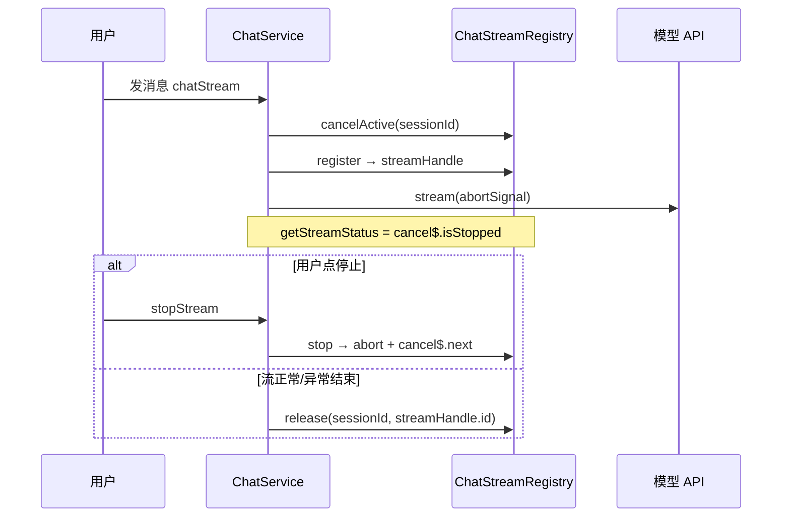

# 对话服务内存泄漏与 OOM 防护

> **文档角色**：主站 Chat / GLM 流式对话在 **长会话、重复解析附件、Redis 缓存 Subject** 场景下导致 Node 堆暴涨的专项修复；含 **Registry 世代号** 修复连发竞态。  
> **延伸阅读**：[knowledge/知识分块死循环内存溢出.md](../knowledge/知识分块死循环内存溢出.md)（知识库分片死循环，独立根因）、[聊天机器人.md](./聊天机器人.md)（对话架构总览）。

若与仓库最新源码不一致，**以源码为准**。

---

## 1. 背景与目标

### 1.1 现象

生产/本地 Node 进程在运行一段时间后堆内存持续上涨至 1.8GB+，最终 `FATAL ERROR: Reached heap limit`。与以下操作强相关：

- 多轮对话且历史消息含 **PDF / Excel / Word** 附件；
- 同一附件路径在 **每一轮** 被重新 `parseFile`；
- `findOneSession` 加载 **全量历史消息 + attachments**；
- 流式取消控制器 `Subject` 被 **写入 Redis**（无法正确序列化/反序列化，且易泄漏）。

### 1.2 目标

| # | 目标 | 手段 |
|---|------|------|
| 1 | 流式句柄进程内单例管理 | `ChatStreamRegistry` |
| 2 | 附件文本只解析一次 | `parseAttachmentForChat` + Redis 缓存 |
| 3 | 限制单轮解析体量 | `MAX_ATTACHMENT_BYTES` / `MAX_ATTACHMENT_TEXT_CHARS` |
| 4 | LLM 上下文有上限 | `findSessionForChatContext` 最近 60 条 |
| 5 | 历史 API 不再默认 9999 条 | `getHistory` 分页上限 100 |
| 6 | 连发/取消不误伤新流 | `handle.id` + 按 id `release` |

---

## 2. 改动范围

| 路径 | 说明 |
|------|------|
| `apps/backend/src/services/chat/chat-stream.registry.ts` | **新增** 流式 cancel/abort 注册表（含 `handle.id`） |
| `apps/backend/src/services/chat/chat-stream.registry.spec.ts` | **新增** 竞态单测 |
| `apps/backend/src/services/chat/chat.module.ts` | 注册 `ChatStreamRegistry` 单例 |
| `apps/backend/src/services/chat/chat.service.ts` | 接入 registry；轻量附件/上下文；`finally` 按 id 释放 |
| `apps/backend/src/services/chat/glm.service.ts` | 同上 |
| `apps/backend/src/services/chat/message.service.ts` | 上下文/附件轻量查询；历史分页 |
| `apps/backend/src/utils/attachment-parse.ts` | **新增** 带缓存的附件解析 |
| `apps/backend/src/utils/file-parser.ts` | 字节/字符上限；流式 URL 下载限长 |

---

## 3. 根因与对策对照

| 根因 | 后果 | 修复 |
|------|------|------|
| `cache.set(sessionId, cancel$)` 存 RxJS Subject | Redis 无法可靠存 Subject；旧句柄无法 GC | 改进程内 `ChatStreamRegistry` |
| 每轮 `parseFile(同一路径)` | pdf-parse / xlsx 重复吃 CPU+堆 | `parseAttachmentForChat` 缓存 7 天 |
| 无附件大小上限 | 15MB+ PDF 整包进堆 | `MAX_ATTACHMENT_BYTES = 15MB` |
| PDF 文本无截断 | 30 万+ 字符拼进 prompt | `MAX_ATTACHMENT_TEXT_CHARS = 300_000` |
| `findOneSession` 全量 messages | 长会话一次载入数千条 | 仅取最近 60 条 |
| `getHistory pageSize=9999` | 管理端拉历史撑爆 | 默认 20，最大 100 |
| **`finally` 无世代校验** | 旧流清理误 `complete` 新流 `cancel$` | `release(sessionId, handle.id)` |

---

## 4. 实现思路

### 4.1 流式生命周期（Registry）



1. **禁止 Subject 进 Redis**：`cancel$` 与 `AbortController` 仅存 Nest 单例 Map。
2. **同 session 新流**：`cancelActive` → `stop` 旧句柄后再 `register`。
3. **清理必须带 id**：Observable `finally` 调用 `release(sessionId, streamHandle.id)`，避免旧流异步收尾误伤新流（见 §4.2）。

### 4.2 连发竞态（二次修复）

**初版 Registry 的隐患**：用户快速连发两条消息时：

1. 流 A 被 `cancelActive` 停止并从 Map 删除；
2. 流 B `register` 新句柄；
3. 流 A 的 `finally` 仍执行 `release(sessionId)` → 命中 **B 的句柄**，`cancel$.complete()` → B 被误判为已取消，且 Map 中 B 被删 → **停止按钮失效、回复中途断流**。

**修复**：每个 `register` 分配递增 `handle.id`；`release` 仅当 Map 中当前句柄的 `id` 与传入一致时才清理。

### 4.3 附件与上下文

1. **去重**：同轮 `Set` 路径 + `dedupeAttachmentsByPath`；最多解析 8 个非图片附件。
2. **缓存**：解析结果 ≤ 200_000 字符才写 Redis（7 天 TTL）；更大仍返回但不缓存。
3. **上下文与附件解耦**：无本轮新附件时，`findDistinctSessionAttachments` 轻量查最近 32 行再去重取 8 个，不必 `findOneSession` 全量 messages。

---

## 5. 关键代码与注释

### 5.1 流式注册表（世代号 + 按 id 释放）

**来源**：`apps/backend/src/services/chat/chat-stream.registry.ts`（约 L1–L60）

```typescript
export type ChatStreamHandle = {
	/** 注册世代号：旧流 finally 清理时须匹配，避免误伤同 session 的新流 */
	id: number;
	cancel$: Subject<void>;           // RxJS：供 getStreamStatus / takeUntil
	abortController: AbortController; // fetch / LangChain：中断 HTTP
};

@Injectable()
export class ChatStreamRegistry {
	private readonly streams = new Map<string, ChatStreamHandle>();
	private nextHandleId = 0;

	register(sessionId: string): ChatStreamHandle {
		this.release(sessionId); // 无 handleId：仅清理 Map 中「当前」句柄（register 前通常已被 stop 清空）
		const handle: ChatStreamHandle = {
			id: ++this.nextHandleId,
			cancel$: new Subject<void>(),
			abortController: new AbortController(),
		};
		this.streams.set(sessionId, handle);
		return handle;
	}

	stop(sessionId: string): boolean {
		const handle = this.streams.get(sessionId);
		if (!handle) return false;
		handle.abortController.abort('用户手动停止');
		if (!handle.cancel$.closed) {
			handle.cancel$.next();
			handle.cancel$.complete();
		}
		this.streams.delete(sessionId);
		return true;
	}

	release(sessionId: string, handleId?: number): void {
		const handle = this.streams.get(sessionId);
		if (!handle) return;
		// 【竞态修复】旧流 finally 传入 handleA.id，Map 里已是 handleB → 直接 return
		if (handleId != null && handle.id !== handleId) return;
		if (!handle.cancel$.closed) handle.cancel$.complete();
		this.streams.delete(sessionId);
	}

	cancelActive(sessionId: string): void {
		this.stop(sessionId);
	}
}
```

### 5.2 ChatService：注册、上下文、按 id 释放

**来源**：`apps/backend/src/services/chat/chat.service.ts`（`chatStream` 入口，约 L217–L222）

```typescript
this.streamRegistry.cancelActive(sessionId);
const streamHandle = this.streamRegistry.register(sessionId);
const { cancel$, abortController } = streamHandle;
// 说明：abortController 传入 createLlm(..., { abortSignal })
// 说明：getStreamStatus = () => cancel$.isStopped || subscriber.closed
```

**来源**：`apps/backend/src/services/chat/chat.service.ts`（上下文，约 L353–L374）

```typescript
const memeries =
	await this.messageService.findSessionForChatContext(sessionId);

const attachments = !dto.attachments?.length
	? await this.messageService.findDistinctSessionAttachments(
			sessionId,
			MAX_ATTACHMENTS_PARSE_PER_TURN,
		)
	: [];

if (!dto.attachments?.length && attachments.length > 0) {
	const attachmentMsg = await this.buildAttachmentMessage(/* ... */);
	if (attachmentMsg) enhancedMessages = [attachmentMsg, ...enhancedMessages];
}
```

**来源**：`apps/backend/src/services/chat/chat.service.ts`（Observable `finally`，约 L611–L614）

```typescript
} finally {
	// 说明：必须传 streamHandle.id，禁止无 id 的 release(sessionId)
	this.streamRegistry.release(sessionId, streamHandle.id);
}
```

**来源**：`apps/backend/src/services/chat/chat.service.ts`（`stopStream`，约 L631–L645）

```typescript
async stopStream(sessionId: string) {
	const stopped = this.streamRegistry.stop(sessionId);
	if (!stopped) {
		return { success: false, message: '会话不存在或已完成' };
	}
	return { success: true, message: '已停止生成' };
}
```

### 5.3 GlmChatService：对称接入

**来源**：`apps/backend/src/services/chat/glm.service.ts`（约 L219–L223、L513–L516）

```typescript
this.streamRegistry.cancelActive(sessionId);
const streamHandle = this.streamRegistry.register(sessionId);
const { abortController } = streamHandle;
// GLM 路径 fetch 使用 signal: abortController.signal

} finally {
	this.streamRegistry.release(sessionId, streamHandle.id);
}
```

### 5.4 MessageService：限量上下文与附件

**来源**：`apps/backend/src/services/chat/message.service.ts`（约 L14–L80）

```typescript
const CHAT_CONTEXT_MESSAGE_LIMIT = 60;

async findSessionForChatContext(sessionId, messageLimit = CHAT_CONTEXT_MESSAGE_LIMIT) {
	const session = await this.chatSessionsRepository.findOne({ where: { id: sessionId } });
	if (!session) return null;
	const messages = await this.chatMessagesRepository.find({
		where: { sessionId },
		order: { createdAt: 'DESC' },
		take: messageLimit,
	});
	messages.reverse(); // 恢复 ASC 供 LLM 阅读
	session.messages = messages;
	return session;
}

async findDistinctSessionAttachments(sessionId, limit = 8) {
	const rows = await this.attachmentsRepository
		.createQueryBuilder('a')
		.innerJoin('a.message', 'm')
		.where('m.sessionId = :sessionId', { sessionId })
		.orderBy('a.createdAt', 'DESC')
		.limit(32)
		.getMany();
	return dedupeAttachmentsByPath(rows.map(/* path, mimetype */)).slice(0, limit);
}
```

**来源**：`apps/backend/src/services/chat/message.service.ts`（`getHistory`，约 L322–L334）

```typescript
// 旧：pageSize 默认 9999；relations 误写 messages.attachments（ChatMessages 无 messages 关系）
const pageSize = Math.min(dto.pageSize ?? 20, 100);
return this.chatMessagesRepository.findAndCount({
	relations: ['session', 'attachments'],
	take: pageSize,
	skip: (pageNo - 1) * pageSize,
});
```

### 5.5 附件解析缓存

**来源**：`apps/backend/src/utils/attachment-parse.ts`（约 L1–L49）

```typescript
const MAX_CACHEABLE_ATTACHMENT_CHARS = 200_000;
export const MAX_ATTACHMENTS_PARSE_PER_TURN = 8;

export async function parseAttachmentForChat(path: string, cache?: Cache): Promise<string> {
	const cacheKey = `attach-text:v1:${trimmed}`;
	if (cache) {
		const hit = await cache.get<string>(cacheKey);
		if (typeof hit === 'string') return hit;
	}
	const text = await parseFile(trimmed);
	if (cache && text.length <= MAX_CACHEABLE_ATTACHMENT_CHARS) {
		await cache.set(cacheKey, text, 7 * 24 * 60 * 60 * 1000);
	}
	return text;
}
```

### 5.6 文件解析体积上限

**来源**：`apps/backend/src/utils/file-parser.ts`（约 L14–L25、urlToBuffer 流式限长）

```typescript
export const MAX_ATTACHMENT_BYTES = 15 * 1024 * 1024;
export const MAX_ATTACHMENT_TEXT_CHARS = 300_000;

function capParsedText(text: string): string {
	if (text.length <= MAX_ATTACHMENT_TEXT_CHARS) return text;
	return `${text.slice(0, MAX_ATTACHMENT_TEXT_CHARS)}\n...[内容已截断]`;
}
// urlToBuffer：累加 chunk，超 maxBytes 则 response.destroy()
// 本地文件：stat 后 assertWithinParseLimit
```

### 5.7 单元测试（竞态）

**来源**：`apps/backend/src/services/chat/chat-stream.registry.spec.ts`

```typescript
it('旧流 finally 不应误清理同 session 的新流', () => {
	const handleA = reg.register(sessionId);
	reg.cancelActive(sessionId);
	const handleB = reg.register(sessionId);
	reg.release(sessionId, handleA.id); // 模拟流 A 的 finally
	expect(reg.get(sessionId)?.id).toBe(handleB.id); // B 仍存活
});
```

运行：`pnpm test -- chat-stream.registry.spec.ts`

---

## 6. 已知限制与风险

| 级别 | 项 | 说明 |
|------|-----|------|
| **部署** | 多实例无 sticky | Registry 在进程内存；stop 请求打到另一实例会失败。需 Nginx `ip_hash` 或单实例 |
| **产品** | 上下文 60 条 | 超长会话更早内容不进模型 |
| **产品** | 历史附件 ≤8 | 第 9 个旧附件上的追问可能不准 |
| **产品** | 单文件 15MB / 文本 30 万字 | 超限报错或截断 |
| **缓存** | 同 path 7 天 | 覆盖上传同路径文件可能读到旧解析（后续可加 mtime） |
| **GLM** | read 循环 | 仅 fetch 带 `abortSignal`；进入 SSE read 后停止略慢于 OpenAI 路径 |

---

## 7. 兼容性与影响

| 维度 | 说明 |
|------|------|
| API | 无 REST 变更；SSE / stop 语义与改前一致 |
| Redis | 不再用 `sessionId` 键存 Subject；Redis 仅用于附件文本缓存 |
| 破坏性 | 无对外契约破坏；长会话记忆范围有意收窄 |

---

## 8. 回归建议

| # | 场景 | 预期 |
|---|------|------|
| 1 | **连发两条**（不等第一条结束） | 第二条正常流式；第一条被中断 |
| 2 | 流式中点「停止」 | 立即停；可再发；`stopStream` success |
| 3 | 同 PDF 连问 5 轮 | 堆不线性涨；第 2 轮起解析更快（缓存） |
| 4 | 上传 >15MB 附件 | 明确错误，不 OOM |
| 5 | 会话 200+ 轮 | 仍可回复（仅带最近 60 条上下文） |
| 6 | 续写 / 重新生成 / 联网 | 与改前一致 |
| 7 | `pnpm test -- chat-stream.registry.spec.ts` | 2/2 通过 |

---

## 9. 相关源码路径

| 说明 | 路径 |
|------|------|
| 流式注册表 | `apps/backend/src/services/chat/chat-stream.registry.ts` |
| 注册表单测 | `apps/backend/src/services/chat/chat-stream.registry.spec.ts` |
| DeepSeek 流 | `apps/backend/src/services/chat/chat.service.ts` |
| 智谱 GLM 流 | `apps/backend/src/services/chat/glm.service.ts` |
| 消息/上下文 | `apps/backend/src/services/chat/message.service.ts` |
| 附件缓存解析 | `apps/backend/src/utils/attachment-parse.ts` |
| 解析上限 | `apps/backend/src/utils/file-parser.ts` |
| 模块注册 | `apps/backend/src/services/chat/chat.module.ts` |
