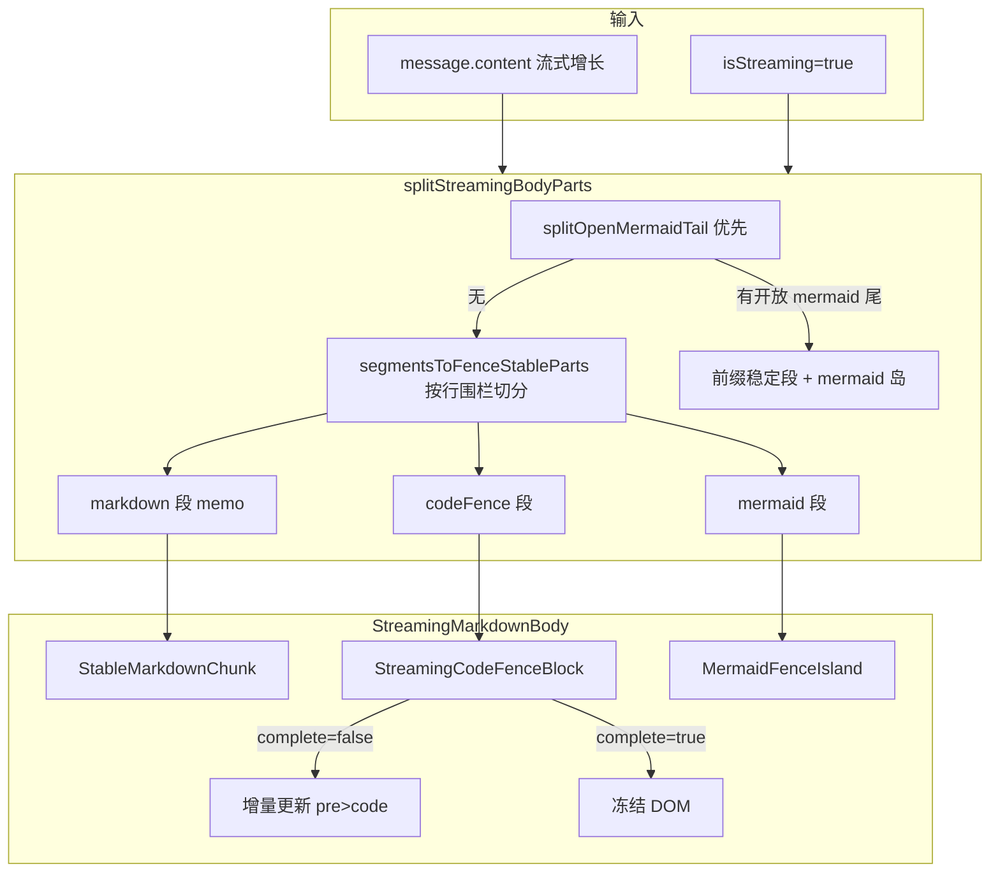

# 流式输出时代码块横向滚动修复

> **文档角色（主文档）**：说明助手消息在 **SSE 流式输出** 期间，Markdown **围栏代码块**（` ```lang `）无法稳定左右滚动的问题根因、拆段渲染方案与回归边界。  
> **延伸阅读**：[联网搜索.md](./联网搜索.md)（联网引用与 `StreamingMarkdownBody`）、[knowledge/知识库助手Mermaid流式.md](../knowledge/知识库助手Mermaid流式.md)（Mermaid 流式岛）、[../react/吸底滚动Hook.md](../react/吸底滚动Hook.md)（贴底滚动）、[../mermaid/Markdown缩放与预览.md](../mermaid/Markdown缩放与预览.md)（Mermaid 拆岛总览）、[../impact/对话流式选区保持影响.md](../impact/对话流式选区保持影响.md)（流式选区保持影响面）。

---

## 1. 背景与目标

### 1.1 用户可见问题

在 **智能对话 / 知识库文档助手 / 分享页在线阅读** 等使用 `ChatAssistantMessage` → `StreamingMarkdownBody` 的场景中，当模型 **边流式输出边生成** 含宽行的代码块时，用户无法在代码块 `<pre>` 内 **稳定横向滚动**：

| 阶段 | 现象 |
|------|------|
| 代码块 **正在输出** | 横向拖动滚动条或触控板横滑时，`scrollLeft` 反复归零，表现为抖动或完全不能滚 |
| 代码块 **已闭合**（出现结束 ` ``` `），但 **正文仍在流式** | 该代码块仍无法横滚（本次修复的重点场景） |
| **流式结束** | 同一代码块横滚恢复正常 |

### 1.2 目标

1. **流式期间**：顶格非 mermaid 围栏代码块可横向浏览长行。
2. **闭合后**：后续正文继续 SSE 时，已闭合代码块 DOM **不再被刷新**。
3. **保持既有能力**：`parser.render` 输出的 `chat-md-code-block` 外壳、复制/下载、吸顶工具栏、Mermaid 岛、联网引用后处理等行为不变。
4. **影响面可控**：仅 `isStreaming=true` 走新拆段路径；停流后与改前一致。

---

## 2. 根因分析

### 2.1 直接原因：`innerHTML` 整段替换销毁 `<pre>`

流式每个 SSE chunk 会更新 `message.content`，触发 `StreamingMarkdownBody` 重算并渲染。改前流式与非流式共用 `splitForMermaidIslandsWithOpenTail` + 各段 `dangerouslySetInnerHTML`：

- 每个 chunk 可能 **重建** 含代码块的 HTML 子树；
- 浏览器会 **销毁** 旧 `<pre>` 并创建新节点；
- `pre.scrollLeft` 归零 → 用户横滚被下一帧覆盖。

### 2.2 加剧因素

| 因素 | 说明 |
|------|------|
| **全文 `patchIncompleteNonMermaidFence`** | 流式时对全文补闭合行，易把尾栏之后的内容与代码混在同一段 markdown 里，扩大刷新范围 |
| **流式贴底** | `useStickToBottomScroll` 在 `contentRevision` 变化时 `scrollTop = scrollHeight`，与用户在代码块内的滚轮操作竞争 |
| **吸顶代码工具栏** | `layoutChatCodeToolbars` 每个 `streamTick` 重算 `minHeight`，可能引起布局抖动（次要） |

### 2.3 为何「闭合后仍不能滚」

即便代码围栏已在文本层闭合，若该围栏与 **仍在增长的后续正文** 落在 **同一段 markdown** 里，则每个 chunk 仍会 `innerHTML` 刷新整段，闭合代码块的 `<pre>` 照样被替换。

因此需要：

1. **按围栏拆段**：每个顶格非 mermaid 围栏独立成 React 子树；
2. **闭合后冻结**：该子树不再接受 `innerHTML` 更新；
3. **稳定 `key`**：开放→闭合 **不换组件**，避免卸载重建。

---

## 3. 方案总览



### 3.1 核心决策

| 决策 | 理由 | 放弃的备选 |
|------|------|------------|
| 流式/非流式 **双路径** | 停流后沿用成熟 `splitForMermaidIslandsWithOpenTail`，风险最小 | 流式也走同一 innerHTML 路径 + scrollLeft 快照恢复（仍抖动） |
| **`StreamingCodeFenceBlock` 手写 DOM 更新** | 未闭合时只改 `pre>code`，保留 `scrollLeft`；样式仍来自 `parser.render` | 自定义 React 代码块组件（样式与工具栏契约易偏离） |
| **`fenceKey` 序号稳定** | `code-fence-0/1/…` 开放到闭合同一实例，避免换 key 卸载 | 闭合后换 `StableMarkdownChunk` + `fence-${hash}` key |
| 流式跳过 **全文** patch | 尾栏局部 patch 在 `StreamingCodeFenceBlock` 内完成 | 流式仍 patch 全文（后续正文易被吞进 code） |
| 代码块滚轮 **解除贴底** | 避免 viewport 跟底与用户横滚冲突 | 仅记录 scrollLeft 不暂停贴底 |

---

## 4. 改动范围

| 路径 | 角色 |
|------|------|
| `apps/frontend/src/utils/splitMarkdownFences.ts` | `StreamingBodyPart`、`segmentsToFenceStableParts`、`splitStreamingBodyParts` |
| `apps/frontend/src/components/design/ChatAssistantMessage/StreamingCodeFenceBlock.tsx` | 流式代码围栏渲染与冻结 |
| `apps/frontend/src/components/design/ChatAssistantMessage/StreamingMarkdownBody.tsx` | 流式拆段入口、`StableMarkdownChunk` |
| `apps/frontend/src/components/design/ChatAssistantMessage/index.tsx` | 流式阶段跳过全文 `patchIncompleteNonMermaidFence` |
| `apps/frontend/src/hooks/useStickToBottomScroll.ts` | 代码块滚轮时解除贴底 |

**未改动**：Monaco 预览、`Markdown` 知识库组件、后端、`@dnhyxc-ai/markdown-kit` 解析器本体。

---

## 5. 数据流与拆段逻辑

> 以下代码块均为**讲解版**：**每一行源码上方**附一行中文注释，说明该行在流式横滚修复中的作用。与仓库一致处为摘录；`// ...` 表示省略无关分支。

### 5.1 入口：`ChatAssistantMessage` 正文预处理

流式时 **不** 对全文执行 `patchIncompleteNonMermaidFence`，避免 markdown-it 把后续正文吞进未闭合围栏；停流后再 patch，保证落库/最终态与联网场景兼容。

**来源**：`apps/frontend/src/components/design/ChatAssistantMessage/index.tsx`（约 L205–L221）

```typescript
// 用 useMemo 缓存「送入 StreamingMarkdownBody 的正文」；仅在依赖变化时重算，减少无效渲染
const bodyText = useMemo(() => {
	// 思考中占位文案；无正文且无 thinkContent 时用于 UI 占位
	const thinkingText = t?.('chat.assistant.thinking') ?? '思考中...';
	// 优先取助手正文 content；若仅有思考链则正文为空串，否则无内容时用 thinkingText
	let raw = message.content || (message?.thinkContent ? '' : thinkingText);
	// 联网检索有机结果列表，供后续角标占位与 HTML 注入
	const org = message.searchOrganic;
	// 若当前就是「思考中…」占位，直接返回，不做围栏修补与引用处理
	if (raw === thinkingText) {
		return raw;
	}
	// 【关键】流式阶段跳过全文 patch：否则未闭合尾栏会把后续 SSE 正文吞进同一段 code，扩大 innerHTML 刷新面
	if (!message.isStreaming) {
		// 停流后（或历史消息）再对全文补闭合行，兼容 ```json 未闭合 + 后续 mermaid/正文 场景
		raw = patchIncompleteNonMermaidFence(raw);
	}
	// 规范化落库时已存在的 <a data-organic-cite> 形态
	raw = normalizePersistedOrganicAnchorsInMarkdown(raw, org);
	// 无联网结果则不再做 【n】/[n] → 占位符 转换
	if (!org?.length) {
		return raw;
	}
	// 将引用占位符写入 raw markdown，渲染后由 injectSearchOrganicAnchorsHtml 注入真实 <a>
	return applyOrganicCitationAnchors(raw, org);
// 依赖含 isStreaming：流式↔停流切换时会切换是否 patch 全文
}, [message.content, message.thinkContent, message.searchOrganic, message.isStreaming, t]);
```

### 5.2 `splitStreamingBodyParts`：流式统一拆段

**来源**：`apps/frontend/src/utils/splitMarkdownFences.ts`（约 L365–L388）

```typescript
// 流式阶段拆段入口：输出 parts 数组供 StreamingMarkdownBody 按类型分别渲染
export function splitStreamingBodyParts(
	// 当前助手消息全文 markdown（随 SSE 增长）
	markdown: string,
	// 聊天用 MarkdownParser（enableChatCodeFenceToolbar: true, enableMermaid: false）
	parser: MarkdownParser,
	// 未闭合 mermaid 岛稳定 id 前缀，后拼接 openLine 行号
	openMermaidIdPrefix: string,
): {
	// 交替的 markdown / mermaid / codeFence 片段列表
	parts: StreamingBodyPart[];
	// 若尾部为开放 mermaid，则非 null，供 MermaidFenceIsland 作 blockId
	openMermaidId: string | null;
} {
	// 优先扫描全文：是否存在「未闭合的 ```mermaid」尾栏（按行解析，防注释误匹配）
	const openMermaid = splitOpenMermaidTail(markdown);
	// 若存在开放 mermaid 尾：前缀与尾部拆开渲染，避免整段 innerHTML 冲掉已绘 SVG
	if (openMermaid) {
		return {
			parts: [
				// 开放 mermaid 之前的所有内容：按围栏拆成稳定 markdown / codeFence / 闭合 mermaid
				...segmentsToFenceStableParts(openMermaid.prefix, parser),
				// 尾部 mermaid DSL 单独成岛，complete=false 表示流式未闭合
				{ type: 'mermaid', text: openMermaid.body, complete: false },
			],
			// 例如 mmd-open-line-12，与开放围栏起始行绑定，React key 稳定
			openMermaidId: `${openMermaidIdPrefix}${openMermaid.openLine}`,
		};
	}

	// 无开放 mermaid 尾：全文走围栏稳定切段（含未闭合非 mermaid 代码尾栏）
	return {
		parts: segmentsToFenceStableParts(markdown, parser),
		openMermaidId: null,
	};
}
```

### 5.3 `StreamingBodyPart` 类型与 `segmentsToFenceStableParts`

依赖 `splitMarkdownFencedBlocks`（`markdownFenceLineParser.ts`）按 **行首围栏** 切分，避免正文/注释里的 `` ``` `` 子串误截断。

**来源**：`apps/frontend/src/utils/splitMarkdownFences.ts`（约 L284–L357）

```typescript
// 流式拆段后的联合类型：三类片段对应三种 React 渲染路径
export type StreamingBodyPart =
	// 普通 markdown 段（含列表内代码等由 markdown-it 解析的内容）
	| { type: 'markdown'; text: string; partKey: string }
	// mermaid 围栏内容（DSL 文本 + 是否已闭合）
	| { type: 'mermaid'; text: string; complete: boolean }
	// 【本修复核心】顶格非 mermaid 围栏：独立 StreamingCodeFenceBlock，闭合后可冻结
	| {
			type: 'codeFence';
			fenceKey: string;
			lang: string;
			body: string;
			complete: boolean;
	  };

// 将 markdown 按「围栏段 / 散文段」切开后，转为 StreamingBodyPart 列表
function segmentsToFenceStableParts(
	markdown: string,
	parser: MarkdownParser,
): StreamingBodyPart[] {
	// 空串直接返回，避免无意义解析
	if (!markdown) return [];
	// 统一换行后按行扫描 ``` 围栏；返回 fenced/complete 等元数据
	const segments = splitMarkdownFencedBlocks(
		markdown.replace(/\r\n/g, '\n'),
	);
	// 累积输出的片段数组
	const parts: StreamingBodyPart[] = [];
	// 围栏之间的散文先缓存在此，遇到围栏或结束时 flush
	let proseBuf = '';
	// 第 N 个非 mermaid 围栏 → code-fence-N，流式只追加故序号稳定
	let fenceIndex = 0;

	// 将 proseBuf 刷入 parts：走 parser.splitForMermaidIslands 与 markdown-it 边界一致
	const flushProse = () => {
		// 无散文可刷则跳过
		if (!proseBuf) return;
		// 散文内可能含闭合 mermaid 围栏，由 parser 按 token 再拆
		for (const p of parser.splitForMermaidIslands(proseBuf)) {
			if (p.type === 'markdown') {
				parts.push({
					type: 'markdown',
					text: p.text,
					// hash 随尾段 prose 增长而变 → 仅尾部 markdown 段重渲染，不影响上方 codeFence
					partKey: `md-${hashText(p.text)}`,
				});
			} else {
				// 散文区内的闭合 mermaid（非尾部开放岛）
				parts.push({ type: 'mermaid', text: p.text, complete: true });
			}
		}
		// 刷完后清空缓冲，准备接收下一段散文
		proseBuf = '';
	};

	// 按顺序处理 splitMarkdownFencedBlocks 产出的每个 segment
	for (const seg of segments) {
		if (!seg.fenced) {
			// 非围栏散文：追加到缓冲，不立即渲染
			proseBuf += seg.text;
			continue;
		}
		// 遇到围栏前先把已累计散文刷成 markdown/mermaid 段
		flushProse();
		// 围栏全文按行拆开，首行为 ```lang，末行可能为闭合 ```
		const lines = seg.text.split('\n');
		const firstLine = lines[0] ?? '';
		// 匹配行首缩进 + 反引号数量 + lang 信息字符串
		const openMatch = /^(\s*)(`{3,})([^`]*)$/.exec(firstLine.trimEnd());
		// lang 转小写首词，用于判断是否 mermaid
		const lang =
			(openMatch?.[3] ?? '').trim().split(/\s+/)[0]?.toLowerCase() ?? '';
		// 已闭合：body 为开闭行之间的源码；未闭合：body 为开栏后至全文末尾
		const body =
			seg.complete && lines.length >= 2
				? lines.slice(1, -1).join('\n')
				: lines.slice(1).join('\n');
		if (isMermaidFenceLang(lang, body)) {
			// mermaid 围栏 → MermaidFenceIsland，不走代码块冻结逻辑
			parts.push({
				type: 'mermaid',
				text: body,
				complete: seg.complete,
			});
		} else {
			// 普通代码围栏 → 独立 codeFence 段，由 StreamingCodeFenceBlock 渲染
			parts.push({
				type: 'codeFence',
				// 稳定 React key：开放→闭合同一序号，避免卸载重建
				fenceKey: `code-fence-${fenceIndex++}`,
				// 展示用语言标签保留原始大小写（如 TypeScript）
				lang: (openMatch?.[3] ?? '').trim().split(/\s+/)[0] || 'text',
				body,
				// false=流式尾栏增量更新；true=闭合后冻结 DOM
				complete: seg.complete,
			});
		}
	}
	// 循环结束后刷入末尾散文（代码块之后的流式增长正文）
	flushProse();
	return parts;
}
```

**`partKey` / `fenceKey` 稳定性**：

- 已闭合围栏：`fenceKey` 与 `body` 不再变 → `StreamingCodeFenceBlock` memo 跳过后续渲染。
- 尾部 prose：`partKey` 随文本增长而变 → 仅 **新尾段** 重渲染，不影响上方已冻结代码块。

### 5.4 `StreamingMarkdownBody`：流式/非流式分叉与渲染

**来源**：`apps/frontend/src/components/design/ChatAssistantMessage/StreamingMarkdownBody.tsx`（约 L38–L192）

#### 5.4.1 `StableMarkdownChunk`（散文段 memo）

```typescript
// 单段 markdown 的 props：partKey 用于 memo 相等性判断
type StableMarkdownChunkProps = {
	partKey: string;
	text: string;
	parser: MarkdownParser;
	renderedMarkdownHtmlPostProcess?: (html: string) => string;
};

// 渲染一块已稳定的 markdown HTML（dangerouslySetInnerHTML）
function StableMarkdownChunkInner({
	text,
	parser,
	renderedMarkdownHtmlPostProcess,
}: StableMarkdownChunkProps) {
	// 仅 text/parser/postProcess 变化时重跑 parser.render
	const html = useMemo(() => {
		let out = parser.render(text);
		// 联网引用：在 HTML 层注入 <a data-organic-cite>（不进代码围栏段）
		if (renderedMarkdownHtmlPostProcess) {
			out = renderedMarkdownHtmlPostProcess(out);
		}
		return out;
	}, [text, parser, renderedMarkdownHtmlPostProcess]);

	// 一次性挂载 HTML；memo 阻止重复执行时 DOM 不变
	return <div dangerouslySetInnerHTML={{ __html: html }} />;
}

// 自定义比较：partKey+text 不变则跳过子树更新
const StableMarkdownChunk = memo(
	StableMarkdownChunkInner,
	(prev, next) =>
		prev.partKey === next.partKey &&
		prev.text === next.text &&
		prev.parser === next.parser &&
		prev.renderedMarkdownHtmlPostProcess ===
			next.renderedMarkdownHtmlPostProcess,
);
```

#### 5.4.2 `streamBundle` 与 `parts.map` 分发

```typescript
// markdown 全文 + isStreaming 决定走「流式拆段」还是「停流拆 mermaid 岛」
const streamBundle = useMemo(() => {
	// 非流式：与改前行为一致，不产出 codeFence 类型
	if (!isStreaming) {
		const split = splitForMermaidIslandsWithOpenTail({
			markdown,
			parser,
			enableOpenTail: true,
			openMermaidIdPrefix: 'mmd-open-line-',
		});
		return {
			parts: split.parts.map((p) =>
				p.type === 'mermaid'
					? { type: 'mermaid' as const, text: p.text, complete: true }
					: {
							type: 'markdown' as const,
							text: p.text,
							partKey: `md-${hashText(p.text)}`,
						},
			),
			openMermaidId: null as string | null,
		};
	}
	// 流式：走 splitStreamingBodyParts，产出 codeFence 段
	return splitStreamingBodyParts(markdown, parser, 'mmd-open-line-');
}, [markdown, parser, isStreaming]);

// 解构片段列表与开放 mermaid id
const { parts, openMermaidId } = streamBundle;

// ... renderMermaidPart 省略（与改前一致）...

// 外层容器：containerRef 供 Serper 角标等查询 DOM
return (
	<div ref={containerRef} className={cn('streaming-md-body', className)}>
		{parts.map((part: StreamingBodyPart, i: number) => {
			// 【分支一】顶格代码围栏 → 独立组件，不经过 dangerouslySetInnerHTML 整段刷新
			if (part.type === 'codeFence') {
				return (
					<StreamingCodeFenceBlock
						key={part.fenceKey}
						fenceKey={part.fenceKey}
						lang={part.lang}
						body={part.body}
						complete={part.complete}
						parser={parser}
					/>
				);
			}
			// 【分支二】markdown 散文段
			if (part.type === 'markdown') {
				// 流式：StableMarkdownChunk memo，仅变化的尾段重渲染
				if (isStreaming) {
					return (
						<StableMarkdownChunk
							key={part.partKey}
							partKey={part.partKey}
							text={part.text}
							parser={parser}
							renderedMarkdownHtmlPostProcess={
								renderedMarkdownHtmlPostProcess
							}
						/>
					);
				}
				// 停流：直接 render，逻辑与改前相同
				let html = parser.render(part.text);
				if (renderedMarkdownHtmlPostProcess) {
					html = renderedMarkdownHtmlPostProcess(html);
				}
				return (
					<div
						key={part.partKey}
						dangerouslySetInnerHTML={{ __html: html }}
					/>
				);
			}
			// 【分支三】mermaid 岛
			return renderMermaidPart(part, i);
		})}
		{mermaidImagePreviewModal}
	</div>
);
```

---

## 6. `StreamingCodeFenceBlock`：增量更新与冻结

### 6.1 辅助函数与组件主体

**来源**：`apps/frontend/src/components/design/ChatAssistantMessage/StreamingCodeFenceBlock.tsx`（全文摘录）

#### 6.1.1 拼接待渲染的围栏 markdown

```typescript
// 未闭合围栏：仅开头 ```lang，无闭合行（供 patchIncompleteNonMermaidFence 临时补全）
function renderOpenFenceMarkdown(lang: string, body: string): string {
	return `\`\`\`${lang}\n${body}`;
}

// 已闭合围栏：标准三反引号开闭，供闭合瞬间一次性 parser.render
function renderCompleteFenceMarkdown(lang: string, body: string): string {
	return `\`\`\`${lang}\n${body}\n\`\`\``;
}
```

#### 6.1.2 从高亮 HTML 中提取 code 节点（增量更新用）

```typescript
// 在内存中 parse parser 产出，只取 pre>code 的 class 与 innerHTML，避免替换整块 pre
function extractCodeFromRenderedFence(
	parser: MarkdownParser,
	markdown: string,
): { className: string; innerHTML: string } | null {
	// 用同一 parser 渲染补丁后的围栏 markdown
	const html = parser.render(markdown);
	// SSR 或无 DOMParser 环境下降级为 null，走 textContent 回退
	if (typeof DOMParser === 'undefined') return null;
	const doc = new DOMParser().parseFromString(html, 'text/html');
	// 与 markdown-kit 契约一致的选择器：pre code
	const code = doc.querySelector(MARKDOWN_CODE_FENCE_SOURCE_CODE_SELECTOR);
	if (!code) return null;
	// 返回高亮后的 className（hljs 语言类）与 HTML 片段
	return { className: code.className, innerHTML: code.innerHTML };
}
```

#### 6.1.3 `StreamingCodeFenceBlockInner` 与 memo 导出

```typescript
// 流式单块代码围栏：props 由 segmentsToFenceStableParts 注入
function StreamingCodeFenceBlockInner({
	fenceKey,
	lang,
	body,
	complete,
	parser,
}: StreamingCodeFenceBlockProps) {
	// 宿主 div，innerHTML 由 useLayoutEffect 写入 parser 产出
	const rootRef = useRef<HTMLDivElement>(null);
	// 记录当前语言；lang 变化时需整段重绘外壳
	const langRef = useRef(lang);
	// 闭合后置 true，此后任何 effect 触发均不再写 DOM
	const frozenRef = useRef(false);

	// 在浏览器绘制前同步 DOM，避免用户看到 scrollLeft 闪烁
	useLayoutEffect(() => {
		// 已冻结：后续正文 SSE 不再触碰此代码块（横滚位置得以保持）
		if (frozenRef.current) return;

		const root = rootRef.current;
		if (!root) return;

		// ---------- 分支 A：围栏已闭合 ----------
		if (complete) {
			// 闭合瞬间保留用户可能已设置的横向滚动位置
			const scrollLeft =
				root.querySelector<HTMLElement>('.chat-md-code-block pre')
					?.scrollLeft ?? 0;
			// 一次性渲染完整 chat-md-code-block（含工具栏 + pre + 高亮）
			root.innerHTML = parser.render(
				renderCompleteFenceMarkdown(lang, body),
			);
			const pre = root.querySelector<HTMLElement>('.chat-md-code-block pre');
			// 写回横滚偏移
			if (pre) pre.scrollLeft = scrollLeft;
			// 标记冻结：complete 后 body 不再变，后续 chunk 不再进入此 effect 写路径
			frozenRef.current = true;
			langRef.current = lang;
			return;
		}

		// ---------- 分支 B：语言变化（少见，如模型修正 lang）----------
		if (langRef.current !== lang) {
			langRef.current = lang;
			// 未闭合 markdown 补临时闭合行，避免 markdown-it 吞掉后续内容
			const patched = patchIncompleteNonMermaidFence(
				renderOpenFenceMarkdown(lang, body),
			);
			// 语言变了则整段重绘（工具栏语言标签等需更新）
			root.innerHTML = parser.render(patched);
			return;
		}

		// ---------- 分支 C：未闭合 + 同语言 → 增量更新 ----------
		const pre = root.querySelector<HTMLElement>('.chat-md-code-block pre');
		const code = pre?.querySelector<HTMLElement>('code');
		// 首帧或结构异常：尚无 pre/code，整段初始化
		if (!pre || !code) {
			const patched = patchIncompleteNonMermaidFence(
				renderOpenFenceMarkdown(lang, body),
			);
			root.innerHTML = parser.render(patched);
			return;
		}

		// 保存用户横纵滚动，仅更新 code 内容时不丢失
		const scrollLeft = pre.scrollLeft;
		const scrollTop = pre.scrollTop;
		const patched = patchIncompleteNonMermaidFence(
			renderOpenFenceMarkdown(lang, body),
		);
		// 单独渲染补丁 markdown，提取高亮 code 片段
		const next = extractCodeFromRenderedFence(parser, patched);
		if (next) {
			// 只改 code 的 class 与 innerHTML，pre 节点引用不变 → scrollLeft 可恢复
			code.className = next.className;
			code.innerHTML = next.innerHTML;
		} else {
			// 无 DOMParser 时纯文本回退
			code.textContent = body;
		}
		pre.scrollLeft = scrollLeft;
		pre.scrollTop = scrollTop;
	}, [body, complete, lang, parser]);

	// 空壳 div；data 属性供贴底滚轮逻辑识别「用户在代码区操作」
	return (
		<div
			ref={rootRef}
			data-streaming-code-fence
			data-fence-key={fenceKey}
		/>
	);
}

// props 浅比较相等则跳过渲染；闭合后 body/complete 不变则 effect 也不触发写 DOM
export const StreamingCodeFenceBlock = memo(
	StreamingCodeFenceBlockInner,
	(prev, next) =>
		prev.fenceKey === next.fenceKey &&
		prev.lang === next.lang &&
		prev.body === next.body &&
		prev.complete === next.complete &&
		prev.parser === next.parser,
);
```

### 6.2 开放→闭合不换组件

同一 `fenceKey`（如 `code-fence-0`）从 `complete=false` 变为 `true` 时：

- React **不卸载** 组件实例；
- `useLayoutEffect` 走 `complete` 分支，一次性固化 DOM；
- 之后下方 prose 段继续增长，代码块 DOM 保持不变 → **横滚可保持**。

改前方案在闭合时从 `GrowingCodeFenceBlock`（`key="growing-code-fence"`）切换到 `StableMarkdownChunk`（`key="fence-xxx"`），必然卸载重建，是「闭合后仍不能滚」的重要诱因之一。

---

## 7. 贴底滚动协同

**来源**：`apps/frontend/src/hooks/useStickToBottomScroll.ts`（约 L168–L189）

```typescript
// 在捕获阶段监听滚轮，优先于子元素默认滚动，用于流式时协调「贴底」与用户手动滚动
const onWheelCapture = useCallback<WheelEventHandler<HTMLDivElement>>(
	(e) => {
		// 非流式：贴底策略不同，不在此处理代码块横滚
		if (!isStreaming) return;
		// 事件实际目标（可能是 pre、code 或滚动条）
		const target = e.target;
		// 若滚轮发生在聊天代码块内，或流式围栏宿主内（含尚未渲染出 .chat-md-code-block 的首帧）
		if (
			target instanceof Element &&
			target.closest('.chat-md-code-block, [data-streaming-code-fence]')
		) {
			// 关闭自动贴底，避免下一帧 contentRevision 又把 viewport 滚到底
			stickToBottomRef.current = false;
			return;
		}
		// 配置项：流式时是否允许「向上滚」打断贴底
		if (!interruptOnWheelUpWhileStreaming) return;
		// deltaY<0 表示向上滚，用户在看历史内容，同样解除贴底
		if (e.deltaY < 0) {
			stickToBottomRef.current = false;
		}
	},
	[interruptOnWheelUpWhileStreaming, isStreaming],
);
```

助手滚动由 `useAssistantScroll` 组合 `useStickToBottomScroll` + `useChatCodeFloatingToolbar`，本改动仅扩展滚轮捕获的选择器。

---

## 8. 兼容性与影响面

### 8.1 不受影响

| 能力 | 说明 |
|------|------|
| **停流后渲染** | `isStreaming=false` 仍走 `splitForMermaidIslandsWithOpenTail` |
| **Monaco / 知识库 Markdown 预览** | 不经过 `splitStreamingBodyParts` |
| **Mermaid 流式岛** | `splitOpenMermaidTail` 优先级不变 |
| **联网引用注入** | 仍仅作用于 `StableMarkdownChunk`；代码块内无引用占位 |
| **复制/下载/吸顶条** | DOM 契约未改，`bindMarkdownCodeFenceActions` 仍委托在 shell 上 |
| **思考区 `thinkContent`** | 同一套流式拆段，无 `containerRef`/postProcess |

### 8.2 停流瞬间

`isStreaming` 由 `true→false` 时，代码块从 `StreamingCodeFenceBlock` 切换为整段 `parser.render`（与改前一致），可能有一次 DOM 重建；最终 HTML 与历史消息一致。

### 8.3 已知局限

| 局限 | 说明 |
|------|------|
| **列表内 / 深缩进围栏** | `splitMarkdownFencedBlocks` 仅识别行首 0–3 空格 ```；更深缩进的代码仍在 prose 段内，流式时仍可能整段刷新 |
| **闭合渲染手工拼接 ```** | `renderCompleteFenceMarkdown` 固定 3 个反引号；四反引号围栏或带缩进的开启行，流式闭合瞬间可能与最终态有细微差异，停流后纠正 |
| **流式中切换主题** | 已冻结闭合块不随 `chatMdParser`（highlightTheme）更新，需停流后刷新 |
| **`splitStreamingOpenCodeTail`** | 仍导出但已由 `segmentsToFenceStableParts` 覆盖，属遗留工具函数 |

---

## 9. 风险与回归建议

### 9.1 必测

1. 顶格代码块：**输出中**横滚；**闭合后正文继续流式**横滚。
2. 多代码块：第一块闭合 + 第二块开放；分别横滚。
3. ` ```json ` 未闭合 + 后续 mermaid/正文：无大块空白。
4. 复制、下载、吸顶工具栏：流式中与闭合后各测一次。
5. 停流后：与历史消息渲染一致，无样式回归。

### 9.2 建议测

- 思考区含代码块 + 主流式并行。
- 分享页只读（通常非流式，应无变化）。
- 联网引用消息：正文角标仍正常。

### 9.3 后续可做

- `codeFence` 段携带原始 `seg.text`，闭合时 `parser.render(seg.text)`，消除四反引号/缩进拼接风险。
- 为 `segmentsToFenceStableParts` 补充单元测试（开放尾、闭合+增长 prose、mermaid 优先等）。

---

## 10. 相关源码路径

| 说明 | 路径 |
|------|------|
| 流式拆段 | `apps/frontend/src/utils/splitMarkdownFences.ts` |
| 行级围栏解析 | `apps/frontend/src/utils/markdownFenceLineParser.ts` |
| 流式代码块组件 | `apps/frontend/src/components/design/ChatAssistantMessage/StreamingCodeFenceBlock.tsx` |
| 流式正文入口 | `apps/frontend/src/components/design/ChatAssistantMessage/StreamingMarkdownBody.tsx` |
| 正文预处理 | `apps/frontend/src/components/design/ChatAssistantMessage/index.tsx` |
| 贴底滚动 | `apps/frontend/src/hooks/useStickToBottomScroll.ts` |
| 助手滚动组合 | `apps/frontend/src/hooks/useAssistantScroll.ts` |
| 代码块工具栏布局 | `apps/frontend/src/utils/chatCodeToolbar.ts` |

若与仓库最新源码不一致，以源码为准。
