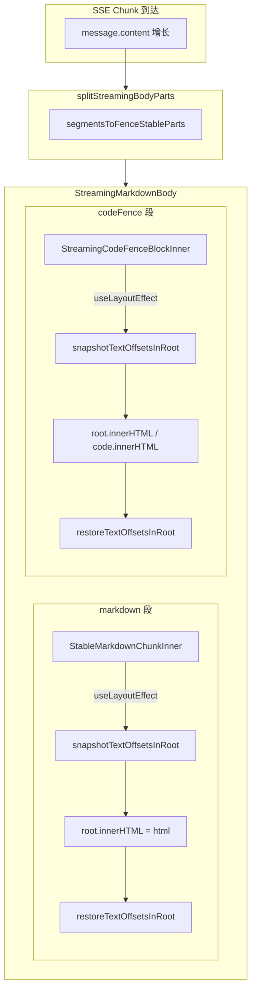

# 流式 Markdown 选区保持

> **文档角色（主文档）**：说明助手消息在 **SSE 流式输出** 期间，用户在 Markdown 正文或代码块内拖选文本时，选区被销毁的问题根因、选区快照/恢复方案与回归边界。
> **延伸阅读**：[流式代码块滚动.md](./流式代码块滚动.md)（流式代码块横向滚动修复）、[../impact/对话流式选区保持影响.md](../impact/对话流式选区保持影响.md)（影响点分析）。

---

## 1. 背景与目标

### 1.1 用户可见问题

在 **智能对话 / 知识库文档助手 / 分享页在线阅读** 等使用 `ChatAssistantMessage` → `StreamingMarkdownBody` 的场景中，当模型 **边流式输出边生成** Markdown 时，用户在助手气泡内拖选文本后，选区会在每个 SSE chunk 到达时被清除：

| 阶段 | 现象 |
|------|------|
| **流式输出中**，在正文拖选 | 选区闪烁或立即消失，无法稳定 ⌘/Ctrl+C 复制 |
| **流式输出中**，在未闭合代码块内拖选 | 选区同样被清掉，代码块横滚也可能抖动 |
| **流式结束后** | 选区恢复正常，可自由选择复制 |

### 1.2 目标

1. **流式期间**：用户在助手气泡内拖选文本时，选区在 SSE chunk 更新后仍尽量保持。
2. **代码块内选区**：未闭合/已闭合代码块内的选区同样受保护，与正文选区行为一致。
3. **保持既有能力**：流式代码块横滚、闭合冻结、联网引用后处理、Mermaid 岛、贴底滚动等行为不变。
4. **影响面可控**：仅在写入 DOM 前/后追加快照/恢复逻辑，不改变数据流与拆段算法。

---

## 2. 根因分析

### 2.1 直接原因：`innerHTML` / `dangerouslySetInnerHTML` 销毁 DOM 与选区

流式每个 SSE chunk 会更新 `message.content`，触发 `StreamingMarkdownBody` 重算并渲染。改前流式路径：

- `StableMarkdownChunkInner` 使用 `dangerouslySetInnerHTML` 将 `parser.render(text)` 的 HTML 注入 `<div>`；
- React 在 commit 阶段会 **销毁旧 DOM 子树并创建新节点**；
- 浏览器选区（Selection/Range）绑定旧 DOM 节点 → 节点被销毁后选区自然清空。

### 2.2 加剧因素

| 因素 | 说明 |
|------|------|
| **content-hash 作为 React key** | 流式 markdown 段使用 `md-${hashText(text)}` 作为 key，文本每次增长 hash 就变 → React 判定为新节点 → 卸载重建，选区直接丢失 |
| **代码块整段 innerHTML 替换** | `StreamingCodeFenceBlock` 在语言切换、围栏闭合等场景直接 `root.innerHTML = parser.render(...)`，同样销毁旧 DOM |
| **选区与 DOM 节点强绑定** | 浏览器 `Selection` 对象通过 `Range` 引用 DOM 节点；节点消失后 Range 失效，选区被清空 |

### 2.3 为何「仅保留 scrollLeft 不够」

代码块横滚修复中已在更新 DOM 前后保存/恢复 `scrollLeft`/`scrollTop`，但选区（Selection/Range）与滚动位置是独立的浏览器状态：

- `scrollLeft` 挂在 `<pre>` 节点上，节点保留时可恢复；
- `Selection` 挂在 `window` 上，依赖 DOM Range；即使 `<pre>` 节点保留，`code.innerHTML` 替换内容时，选区引用的旧文本节点也会被销毁。

因此需要 **独立的选区快照/恢复机制**。

---

## 3. 方案总览

### 3.1 核心决策

| 决策 | 理由 | 放弃的备选 |
|------|------|------------|
| **以纯文本偏移（TextOffset）作为选区序列化格式** | Markdown 重渲染时 DOM 结构会剧变（如列表闭合、加粗范围扩展），但纯文本内容在流式阶段是 **单调追加** 的；偏移对 DOM 结构不敏感 | DOM Range 序列化（依赖节点路径 + offset）、XPath（复杂且脆弱）、CSS selector（无法定位文本节点） |
| **在写入 DOM 前快照、写入后恢复** | React 的 `dangerouslySetInnerHTML` 在 commit 时已毁掉选区，无法事后恢复；必须在写入前保存 | 用 `document.selectionchange` 全局监听（性能差、停更画面） |
| **流式 markdown 段使用下标 `md-stream-${i}` 作为稳定 key** | 内容 hash 在流式中每字变化，导致无谓 remount；下标在 SSE 尾部增长时稳定 | 保持 `md-${hash}` key（每次 remount = 选区丢失） |
| **TreeWalker 从文本节点序列定位偏移** | 原生 API，稳定可靠；即使节点长度变化也能钳制到有效范围 | 手动遍历 childNodes（无法跨 `<br>`、`<span>` 等内联标签） |
| **无选区/域外选区时直接跳过** | 主路径（无选区）仅多一次 `getSelection` + `isCollapsed` 早退，性能影响可忽略 | 始终执行快照/恢复（无谓开销） |

### 3.2 数据流图



---

## 4. 关键代码对比与注释

### 4.1 `snapshotTextOffsetsInRoot` / `restoreTextOffsetsInRoot`（domTextSelection.ts）

> **新文件**，仅展示改后版本。

**来源**：`apps/frontend/src/utils/domTextSelection.ts`（全文，约 L1–L89）

```typescript
/**
 * 流式 Markdown 重绘前保存 / 恢复选区（按 root 内纯文本偏移）。
 * 无选区或选区不在 root 内时 snapshot 返回 null，调用方可直接改 DOM。
 */

/** root 内纯文本起止偏移；与 DOM 节点解耦，便于 Markdown 重绘后按文本位置还原选区 */
export type TextOffsetSelection = { start: number; end: number };

/**
 * 将当前浏览器选区快照为 root 内纯文本偏移。
 * 无选区、折叠选区、或不在 root 内时返回 null，调用方可直接改 DOM。
 */
export function snapshotTextOffsetsInRoot(
	root: Node,
): TextOffsetSelection | null {
	// 获取浏览器当前 Selection 对象；若为 null 则无选区，直接返回
	const sel = window.getSelection();
	// 无 Selection、无 Range、或仅光标（折叠）时无需保存
	if (!sel || sel.rangeCount === 0 || sel.isCollapsed) return null;
	// 取第一个 Range（浏览器多为单选区，Range 0 即当前选区）
	const range = sel.getRangeAt(0);
	// 选区公共祖先不在 root 内，说明选中的不是本容器内容，无需快照
	if (!root.contains(range.commonAncestorContainer)) return null;

	/** 把 (container, offset) 映射为「从 root 起点到该点」的纯文本字符数 */
	const toOffset = (container: Node, offset: number) => {
		// 用 Range 构造一个从 root 起点到目标点的区间
		const pre = document.createRange();
		// 先覆盖整个 root，再把终点收到目标点，toString 即此前全部可见文本
		pre.selectNodeContents(root);
		pre.setEnd(container, offset);
		// toString 返回该区间内所有文本节点拼接的纯文本长度
		return pre.toString().length;
	};

	try {
		// 分别计算选区起点和终点在 root 内的文本偏移
		return {
			start: toOffset(range.startContainer, range.startOffset),
			end: toOffset(range.endContainer, range.endOffset),
		};
	} catch {
		// Range 边界非法或 DOM 中间态时放弃快照，返回 null 让调用方继续写 DOM
		return null;
	}
}

/**
 * 按纯文本偏移在 root 内重建选区。
 * 文本节点增删后仍尽量落到对应字符；结构剧变无法定位时静默放弃。
 */
export function restoreTextOffsetsInRoot(
	root: Node,
	snap: TextOffsetSelection,
): void {
	// 获取浏览器 Selection；无 Selection 则无法恢复，直接返回
	const sel = window.getSelection();
	if (!sel) return;

	/** 在 root 文本节点序列上，找到累计长度覆盖 target 的 (Text, 节点内 offset) */
	const pointAt = (target: number): { node: Text; offset: number } | null => {
		// TreeWalker 按 DOM 深度优先遍历所有文本节点
		const walker = document.createTreeWalker(root, NodeFilter.SHOW_TEXT);
		// 累计已遍历文本节点的字符数
		let acc = 0;
		// 取下一个文本节点
		let node = walker.nextNode();
		// 记录最后一个文本节点，用于偏移超出全文时钳到末尾
		let last: Text | null = null;
		while (node) {
			// 当前节点为 Text 类型
			const text = node as Text;
			// 当前节点的文本长度
			const len = text.data.length;
			// 更新最后节点引用
			last = text;
			// 目标落在本节点内（含边界）：offset = target - 此前累计长度
			if (acc + len >= target) {
				return { node: text, offset: Math.max(0, target - acc) };
			}
			// 累加当前节点长度
			acc += len;
			// 继续遍历下一个文本节点
			node = walker.nextNode();
		}
		// 无文本节点则无法还原；偏移超出全文则钳到最后一个文本节点末尾
		if (!last) return null;
		return { node: last, offset: last.data.length };
	};

	// 分别定位选区起点（钳制到非负）
	const a = pointAt(Math.max(0, snap.start));
	// 分别定位选区终点（钳制到非负）
	const b = pointAt(Math.max(0, snap.end));
	// 任一端点定位失败则放弃恢复
	if (!a || !b) return;
	try {
		// 创建新的 Range 用于还原选区
		const range = document.createRange();
		// offset 再钳一次，避免节点变短后 setStart/setEnd 越界
		range.setStart(a.node, Math.min(a.offset, a.node.data.length));
		// 终点同理钳制
		range.setEnd(b.node, Math.min(b.offset, b.node.data.length));
		// 清除浏览器原有选区
		sel.removeAllRanges();
		// 添加还原后的选区
		sel.addRange(range);
	} catch {
		// 结构剧变时（如节点类型变更）setStart/setEnd 可能抛错，静默放弃恢复
	}
}
```

---

### 4.2 `StreamingCodeFenceBlockInner`（StreamingCodeFenceBlock.tsx）

#### 改前：无选区快照/恢复

**来源**：`apps/frontend/src/components/design/ChatAssistantMessage/StreamingCodeFenceBlock.tsx`（改前版本，约 L45–L115）

```typescript
// 引入 React hooks 与必要依赖
import { memo, useLayoutEffect, useRef } from 'react';
// 从 markdown-kit 导入代码块选择器常量和 MarkdownParser 类型
import {
	MARKDOWN_CODE_FENCE_SOURCE_CODE_SELECTOR,
	type MarkdownParser,
} from '@dnhyxc-ai/markdown-kit';
// 导入围栏补丁工具函数
import { patchIncompleteNonMermaidFence } from '@/utils/splitMarkdownFences';

// 定义组件 props 类型
export type StreamingCodeFenceBlockProps = {
	fenceKey: string;
	lang: string;
	body: string;
	complete: boolean;
	parser: MarkdownParser;
};

// 组件主体：未闭合时首帧渲染外壳，后续仅更新 pre>code
function StreamingCodeFenceBlockInner({
	fenceKey,
	lang,
	body,
	complete,
	parser,
}: StreamingCodeFenceBlockProps) {
	// 宿主 div ref
	const rootRef = useRef<HTMLDivElement>(null);
	// 记录当前语言，lang 变化时需整段重绘
	const langRef = useRef(lang);
	// 闭合后冻结 DOM
	const frozenRef = useRef(false);

	useLayoutEffect(() => {
		// 已冻结，不再写 DOM
		if (frozenRef.current) return;

		const root = rootRef.current;
		if (!root) return;

		// ---------- 分支 A：围栏已闭合 ----------
		if (complete) {
			// 闭合瞬间保留用户可能已设置的横向滚动位置
			const scrollLeft =
				root.querySelector<HTMLElement>('.chat-md-code-block pre')
					?.scrollLeft ?? 0;
			// 一次性渲染完整 chat-md-code-block
			root.innerHTML = parser.render(renderCompleteFenceMarkdown(lang, body));
			const pre = root.querySelector<HTMLElement>('.chat-md-code-block pre');
			// 写回横滚偏移
			if (pre) pre.scrollLeft = scrollLeft;
			// 标记冻结
			frozenRef.current = true;
			langRef.current = lang;
			return;
		}

		// ---------- 分支 B：语言变化 ----------
		if (langRef.current !== lang) {
			langRef.current = lang;
			// 未闭合 markdown 补临时闭合行
			const patched = patchIncompleteNonMermaidFence(
				renderOpenFenceMarkdown(lang, body),
			);
			// 语言变了则整段重绘
			root.innerHTML = parser.render(patched);
			return;
		}

		// ---------- 分支 C：未闭合 + 同语言 → 增量更新 ----------
		const pre = root.querySelector<HTMLElement>('.chat-md-code-block pre');
		const code = pre?.querySelector<HTMLElement>('code');
		// 首帧或结构异常：尚无 pre/code，整段初始化
		if (!pre || !code) {
			const patched = patchIncompleteNonMermaidFence(
				renderOpenFenceMarkdown(lang, body),
			);
			root.innerHTML = parser.render(patched);
			return;
		}

		// 保存用户横纵滚动
		const scrollLeft = pre.scrollLeft;
		const scrollTop = pre.scrollTop;
		const patched = patchIncompleteNonMermaidFence(
			renderOpenFenceMarkdown(lang, body),
		);
		// 单独渲染补丁 markdown，提取高亮 code 片段
		const next = extractCodeFromRenderedFence(parser, patched);
		if (next) {
			// 只改 code 的 class 与 innerHTML
			code.className = next.className;
			code.innerHTML = next.innerHTML;
		} else {
			// 无 DOMParser 时纯文本回退
			code.textContent = body;
		}
		pre.scrollLeft = scrollLeft;
		pre.scrollTop = scrollTop;
	}, [body, complete, lang, parser]);

	// 空壳 div
	return (
		<div ref={rootRef} data-streaming-code-fence data-fence-key={fenceKey} />
	);
}
```

#### 改后：在 4 处 DOM 写入点插入选区快照/恢复

**来源**：`apps/frontend/src/components/design/ChatAssistantMessage/StreamingCodeFenceBlock.tsx`（改后版本，约 L6–L115）

```typescript
// 引入 React hooks 与必要依赖
import { memo, useLayoutEffect, useRef } from 'react';
// 从 markdown-kit 导入代码块选择器常量和 MarkdownParser 类型
import {
	MARKDOWN_CODE_FENCE_SOURCE_CODE_SELECTOR,
	type MarkdownParser,
} from '@dnhyxc-ai/markdown-kit';
// 【新增】选区快照与恢复工具
import {
	restoreTextOffsetsInRoot,
	snapshotTextOffsetsInRoot,
} from '@/utils/domTextSelection';
// 导入围栏补丁工具函数
import { patchIncompleteNonMermaidFence } from '@/utils/splitMarkdownFences';

// 定义组件 props 类型
export type StreamingCodeFenceBlockProps = {
	fenceKey: string;
	lang: string;
	body: string;
	complete: boolean;
	parser: MarkdownParser;
};

// 组件主体：未闭合时首帧渲染外壳，后续仅更新 pre>code
function StreamingCodeFenceBlockInner({
	fenceKey,
	lang,
	body,
	complete,
	parser,
}: StreamingCodeFenceBlockProps) {
	// 宿主 div ref
	const rootRef = useRef<HTMLDivElement>(null);
	// 记录当前语言，lang 变化时需整段重绘
	const langRef = useRef(lang);
	// 闭合后冻结 DOM
	const frozenRef = useRef(false);

	useLayoutEffect(() => {
		// 已冻结，不再写 DOM
		if (frozenRef.current) return;

		const root = rootRef.current;
		if (!root) return;

		// ---------- 分支 A：围栏已闭合 ----------
		if (complete) {
			// 闭合瞬间保留用户可能已设置的横向滚动位置
			const scrollLeft =
				root.querySelector<HTMLElement>('.chat-md-code-block pre')
					?.scrollLeft ?? 0;
			// 【新增】写入前快照选区（无选区/域外则返回 null）
			const snap = snapshotTextOffsetsInRoot(root);
			// 一次性渲染完整 chat-md-code-block
			root.innerHTML = parser.render(renderCompleteFenceMarkdown(lang, body));
			const pre = root.querySelector<HTMLElement>('.chat-md-code-block pre');
			// 写回横滚偏移
			if (pre) pre.scrollLeft = scrollLeft;
			// 【新增】写入后恢复选区（snap 为 null 时跳过）
			if (snap) restoreTextOffsetsInRoot(root, snap);
			// 标记冻结
			frozenRef.current = true;
			langRef.current = lang;
			return;
		}

		// ---------- 分支 B：语言变化 ----------
		if (langRef.current !== lang) {
			langRef.current = lang;
			// 未闭合 markdown 补临时闭合行
			const patched = patchIncompleteNonMermaidFence(
				renderOpenFenceMarkdown(lang, body),
			);
			// 【新增】写入前快照选区
			const snap = snapshotTextOffsetsInRoot(root);
			// 语言变了则整段重绘
			root.innerHTML = parser.render(patched);
			// 【新增】写入后恢复选区
			if (snap) restoreTextOffsetsInRoot(root, snap);
			return;
		}

		// ---------- 分支 C：未闭合 + 同语言 → 增量更新 ----------
		const pre = root.querySelector<HTMLElement>('.chat-md-code-block pre');
		const code = pre?.querySelector<HTMLElement>('code');
		// 首帧或结构异常：尚无 pre/code，整段初始化
		if (!pre || !code) {
			const patched = patchIncompleteNonMermaidFence(
				renderOpenFenceMarkdown(lang, body),
			);
			// 【新增】写入前快照选区
			const snap = snapshotTextOffsetsInRoot(root);
			root.innerHTML = parser.render(patched);
			// 【新增】写入后恢复选区
			if (snap) restoreTextOffsetsInRoot(root, snap);
			return;
		}

		// 保存用户横纵滚动
		const scrollLeft = pre.scrollLeft;
		const scrollTop = pre.scrollTop;
		// 【新增】在增量更新 code.innerHTML 前也快照选区
		const snap = snapshotTextOffsetsInRoot(root);
		const patched = patchIncompleteNonMermaidFence(
			renderOpenFenceMarkdown(lang, body),
		);
		// 单独渲染补丁 markdown，提取高亮 code 片段
		const next = extractCodeFromRenderedFence(parser, patched);
		if (next) {
			// 只改 code 的 class 与 innerHTML
			code.className = next.className;
			code.innerHTML = next.innerHTML;
		} else {
			// 无 DOMParser 时纯文本回退
			code.textContent = body;
		}
		pre.scrollLeft = scrollLeft;
		pre.scrollTop = scrollTop;
		// 【新增】增量更新后恢复选区
		if (snap) restoreTextOffsetsInRoot(root, snap);
	}, [body, complete, lang, parser]);

	// 空壳 div
	return (
		<div ref={rootRef} data-streaming-code-fence data-fence-key={fenceKey} />
	);
}
```

**改动要点**：在 4 处 DOM 写入点（分支 A/B/C 共 3 处 `root.innerHTML` + 分支 C 的 `code.innerHTML`/`textContent` 增量更新）前后均插入 `snapshotTextOffsetsInRoot` → `restoreTextOffsetsInRoot` 配对调用。无选区或选区不在 root 内时，`snap` 为 `null`，`restoreTextOffsetsInRoot` 不执行，零额外开销。

---

### 4.3 `StableMarkdownChunkInner`（StreamingMarkdownBody.tsx）

#### 改前：使用 `dangerouslySetInnerHTML` 渲染

**来源**：`apps/frontend/src/components/design/ChatAssistantMessage/StreamingMarkdownBody.tsx`（改前版本，约 L42–L77）

```typescript
// 单段 markdown 的 props 类型
type StableMarkdownChunkProps = {
	partKey: string;
	text: string;
	parser: MarkdownParser;
	renderedMarkdownHtmlPostProcess?: (html: string) => string;
};

// 渲染一块 markdown HTML（使用 dangerouslySetInnerHTML）
function StableMarkdownChunkInner({
	text,
	parser,
	renderedMarkdownHtmlPostProcess,
}: StableMarkdownChunkProps) {
	// 仅 text/parser/postProcess 变化时重跑 parser.render
	const html = useMemo(() => {
		let out = parser.render(text);
		// 联网引用：在 HTML 层注入 <a data-organic-cite>
		if (renderedMarkdownHtmlPostProcess) {
			out = renderedMarkdownHtmlPostProcess(out);
		}
		return out;
	}, [text, parser, renderedMarkdownHtmlPostProcess]);

	// 直接用 dangerouslySetInnerHTML 写入 HTML；React commit 时销毁旧 DOM，选区丢失
	return <div dangerouslySetInnerHTML={{ __html: html }} />;
}

// 自定义 memo 比较：partKey+text 不变则跳过子树更新
const StableMarkdownChunk = memo(
	StableMarkdownChunkInner,
	(prev, next) =>
		prev.partKey === next.partKey &&
		prev.text === next.text &&
		prev.parser === next.parser &&
		prev.renderedMarkdownHtmlPostProcess ===
			next.renderedMarkdownHtmlPostProcess,
);
```

#### 改后：命令式 `useLayoutEffect` + 选区快照/恢复

**来源**：`apps/frontend/src/components/design/ChatAssistantMessage/StreamingMarkdownBody.tsx`（改后版本，约 L17–L87）

```typescript
// 【新增】导入选区快照与恢复工具
import {
	restoreTextOffsetsInRoot,
	snapshotTextOffsetsInRoot,
} from '@/utils/domTextSelection';

// 单段 markdown 的 props 类型
type StableMarkdownChunkProps = {
	partKey: string;
	text: string;
	parser: MarkdownParser;
	renderedMarkdownHtmlPostProcess?: (html: string) => string;
};

/**
 * 流式正文段：自管 innerHTML。
 * React 的 dangerouslySetInnerHTML 会在 commit 时先毁掉选区；此处先 snapshot 再写入。
 */
function StableMarkdownChunkInner({
	text,
	parser,
	renderedMarkdownHtmlPostProcess,
}: StableMarkdownChunkProps) {
	// 【改前】dangerouslySetInnerHTML → 【改后】rootRef 命令式写入
	const rootRef = useRef<HTMLDivElement>(null);
	// 仅 text/parser/postProcess 变化时重跑 parser.render
	const html = useMemo(() => {
		let out = parser.render(text);
		// 联网引用：在 HTML 层注入 <a data-organic-cite>
		if (renderedMarkdownHtmlPostProcess) {
			out = renderedMarkdownHtmlPostProcess(out);
		}
		return out;
	}, [text, parser, renderedMarkdownHtmlPostProcess]);

	// 【新增】在浏览器绘制前同步写入 DOM
	useLayoutEffect(() => {
		const root = rootRef.current;
		if (!root) return;
		// 【新增】若 HTML 未变化则跳过写入，避免无谓 DOM 操作与选区干扰
		if (root.innerHTML === html) return;
		// 【新增】写入前快照选区
		const snap = snapshotTextOffsetsInRoot(root);
		// 命令式写入 HTML（替换整个子树）
		root.innerHTML = html;
		// 【新增】写入后恢复选区
		if (snap) restoreTextOffsetsInRoot(root, snap);
	}, [html]);

	// 【改前】<div dangerouslySetInnerHTML={{ __html: html }} /> → 【改后】<div ref={rootRef} />
	return <div ref={rootRef} />;
}

// 自定义 memo 比较：partKey+text 不变则跳过子树更新
const StableMarkdownChunk = memo(
	StableMarkdownChunkInner,
	(prev, next) =>
		prev.partKey === next.partKey &&
		prev.text === next.text &&
		prev.parser === next.parser &&
		prev.renderedMarkdownHtmlPostProcess ===
			next.renderedMarkdownHtmlPostProcess,
);
```

**改动要点**：

1. **渲染方式**：从 `dangerouslySetInnerHTML` 改为 `useLayoutEffect` + `rootRef` 命令式写入。React 的 `dangerouslySetInnerHTML` 在 commit 阶段已销毁旧 DOM 并清空选区，无法事后恢复；命令式写入允许在写入前快照选区、写入后恢复。
2. **增量优化**：`useLayoutEffect` 内检查 `root.innerHTML === html`，HTML 未变化时跳过写入，避免无谓 DOM 操作。
3. **快照/恢复配对**：与 `StreamingCodeFenceBlock` 一致的快照-恢复模式，无选区时零开销。

---

### 4.4 流式 key 稳定化（StreamingMarkdownBody.tsx）

#### 改前：content-hash key，流式中每次变化导致 remount

**来源**：`apps/frontend/src/components/design/ChatAssistantMessage/StreamingMarkdownBody.tsx`（改前版本，parts.map 中 markdown 分支，约 L188–L213）

```typescript
// ... parts.map 中 markdown 分支 ...
if (part.type === 'markdown') {
	// 流式：StableMarkdownChunk memo，仅变化的尾段重渲染
	if (isStreaming) {
		// 【改前】key 使用 part.partKey = md-${hashText(text)}，每次文本增长 hash 变 → remount
		return (
			<StableMarkdownChunk
				key={part.partKey}
				partKey={part.partKey}
				text={part.text}
				parser={parser}
				renderedMarkdownHtmlPostProcess={
					renderedMarkdownHtmlPostProcess
				}
			/>
		);
	}
	// 停流：直接 render，逻辑与改前相同
	let html = parser.render(part.text);
	if (renderedMarkdownHtmlPostProcess) {
		html = renderedMarkdownHtmlPostProcess(html);
	}
	return (
		<div
			key={part.partKey}
			dangerouslySetInnerHTML={{ __html: html }}
		/>
	);
}
```

#### 改后：index-based 稳定 key，流式中避免 remount

**来源**：`apps/frontend/src/components/design/ChatAssistantMessage/StreamingMarkdownBody.tsx`（改后版本，parts.map 中 markdown 分支，约 L188–L203）

```typescript
// ... parts.map 中 markdown 分支 ...
if (part.type === 'markdown') {
	if (isStreaming) {
		// 【改后】用下标作稳定 key：内容 hash 会随流式变化导致 remount，选区无法恢复
		const stableKey = `md-stream-${i}`;
		return (
			<StableMarkdownChunk
				key={stableKey}
				partKey={stableKey}
				text={part.text}
				parser={parser}
				renderedMarkdownHtmlPostProcess={
					renderedMarkdownHtmlPostProcess
				}
			/>
		);
	}
	// 停流：直接 render，逻辑与改前相同
	let html = parser.render(part.text);
	if (renderedMarkdownHtmlPostProcess) {
		html = renderedMarkdownHtmlPostProcess(html);
	}
	return (
		<div
			key={part.partKey}
			dangerouslySetInnerHTML={{ __html: html }}
		/>
	);
}
```

**改动要点**：

- **改前**：`key={part.partKey}` = `md-${hashText(text)}`。流式中 `text` 每个 chunk 都在增长，hash 每次不同 → React 判定为新节点 → 卸载旧组件、挂载新组件 → 组件内 DOM 全毁、选区丢失。
- **改后**：`key={stableKey}` = `md-stream-${i}`。SSE 尾部增长时，已有的 markdown 段下标不变 → React 复用同一组件实例 → `useLayoutEffect` 内只更新 DOM 内容（配合快照/恢复），不触发组件卸载重建。

---

## 5. 兼容性与影响

### 5.1 不受影响

| 能力 | 说明 |
|------|------|
| **停流后渲染** | `isStreaming=false` 仍走 `dangerouslySetInnerHTML` + content-hash `partKey`，不经过命令式选区路径 |
| **流式代码块横滚 / 闭合冻结** | `scrollLeft`/`scrollTop` 保留与 `frozenRef` 逻辑不变；选区恢复在 scroll 恢复之后执行，不改 scroll 语义 |
| **流式贴底** | 未改 `useStickToBottomScroll`、未改 `ChatAssistantMessage` 贴底与「正在生成中…」状态 |
| **联网引用 HTML 后处理** | `renderedMarkdownHtmlPostProcess` 仍在 `useMemo` 计算 html 时调用 |
| **Mermaid 流式岛** | Mermaid 分支未改；选区工具不触达岛内命令式更新 |
| **代码块复制/下载工具栏** | DOM 契约未改，`bindMarkdownCodeFenceActions` 仍委托在 shell 上 |
| **拆分算法与 fenceKey 规则** | `splitStreamingBodyParts` / `segmentsToFenceStableParts` 未改 |
| **选区朗读 TTS / useSelectionSpeak** | 未改，仅间接受益于更稳的 Selection |
| **分享页只读展示** | 非流式路径，走旧 `dangerouslySetInnerHTML` |

### 5.2 性能影响

| 场景 | 影响 | 说明 |
|------|------|------|
| **无选区流式（主路径）** | 可忽略 | 每段 html 变化时多一次 `getSelection` + `isCollapsed` 早退；无 TreeWalker、无 setState |
| **有选区流式（用户主动拖选）** | 低～中 | 每段 html 变化时：两次 `Range#toString` 算偏移 + TreeWalker 定位；仅用户正在拖选时触发 |
| **选区跨多个 markdown 段** | 中（降级） | snapshot 以单个 chunk root 为界；跨段选区时一端更新可能截断另一端 |

### 5.3 已知局限

| 局限 | 说明 |
|------|------|
| **Markdown 结构剧变时选区可能丢失** | 如未闭合列表闭合、加粗范围扩展等，纯文本偏移与新 DOM 文本流可能错位；`restoreTextOffsetsInRoot` 内部 `try/catch` 会静默放弃，降级到改前行为（选区消失），不抛错、不打断流式 |
| **跨段选区** | 选区跨两个 `md-stream-*` 段时，中间插入 codeFence 导致下标 `i` 变化时 key 移位可能 remount，选区仍可能丢失 |
| **首帧空 div** | `useLayoutEffect` 在 paint 前写入，但首帧到达前可能有极短暂空 div 状态（与改前一致） |
| **`md-stream-${i}` 在「前插围栏」时 key 错位** | 正常 SSE 多为尾部增长；围栏从尾部打开时下标稳定；极端场景（如先出正文再出代码块）可能导致已有段 key 移位 |
| **代码块闭合后选区不恢复** | 代码块闭合后 `frozenRef.current = true`，后续 chunk 不再写 DOM，已保持的选区不会被清除；但闭合瞬间选区因 DOM 重建被清除后不会再恢复（与改前 `scrollLeft` 保留但选区丢失一致） |

---

## 6. 相关源码路径

| 说明 | 路径 |
|------|------|
| 选区快照/恢复工具（新文件） | `apps/frontend/src/utils/domTextSelection.ts` |
| 流式代码围栏组件 | `apps/frontend/src/components/design/ChatAssistantMessage/StreamingCodeFenceBlock.tsx` |
| 流式正文入口 / StableMarkdownChunk | `apps/frontend/src/components/design/ChatAssistantMessage/StreamingMarkdownBody.tsx` |
| 流式拆段算法 | `apps/frontend/src/utils/splitMarkdownFences.ts` |
| 贴底滚动 hook | `apps/frontend/src/hooks/useStickToBottomScroll.ts` |
| 影响点分析（延伸阅读） | `docs/impact/对话流式选区保持影响.md` |
| 代码块横滚修复（延伸阅读） | `docs/chat/流式代码块滚动.md` |

若与仓库最新源码不一致，以源码为准。