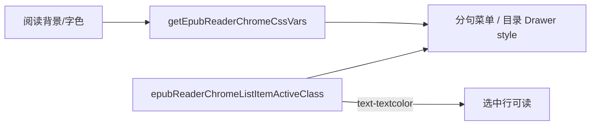

# 分句/目录列表选中态跟随阅读字色

## 文档角色

**增量专题**：修复听书 **分句菜单** 与 **书籍目录** 当前项在切换 **阅读背景** 后字色/底色仍跟 **应用主题色**（`text-theme`）导致浅色背景下选中行几乎不可读的问题。

**姊妹文档**：[EPUB阅读器Chrome对比度.md](./EPUB阅读器Chrome对比度.md)（chrome 变量与 Portal 基线）、[EPUB听书播放器栏标尺UI.md](./EPUB听书播放器栏标尺UI.md)（分句菜单消费方）、[电子书目录激活高亮.md](./电子书目录激活高亮.md)（目录高亮）。

**延伸阅读**：[EPUB听书播放修复2026-07.md](./EPUB听书播放修复2026-07.md)。

---

## 1. 背景与目标

### 1.1 问题

分句菜单 / 目录当前项使用 `bg-theme/15 text-theme`。绿色等浅色阅读背景下，应用主题色常为偏亮色，与浅高亮叠在一起对比极差（截图可见白字压浅绿）。

### 1.2 目标

- 选中态与 idle/hover 一律跟 **阅读正文字色**（`text-textcolor` / `bg-textcolor/*`），由 `getEpubReaderChromeCssVars` 注入的 `--color-textcolor` 驱动。
- 目录抽屉与分句菜单共用同一对 class，避免再手写 `text-theme`。

---

## 2. 改动范围

| 路径 | 变更要点 |
| ---- | -------- |
| `apps/frontend/src/views/ebook/utils/epub/reader/epubReaderSettings.ts` | `epubReaderChromeListItemIdleClass` / `ActiveClass` 改跟 `textcolor` |
| `apps/frontend/src/views/ebook/components/layout/EbookTocDrawer.tsx` | 目录项改用上述共享 class |
| `apps/frontend/src/views/ebook/components/listen/EpubListenPlayerBar.tsx` | 已引用共享 class，本轮无逻辑 diff（随常量生效） |

---

## 3. 实现思路

1. Portal 菜单已挂 `menuChromeStyle`（阅读 surface + 字色）；问题在 **token 选错**：`text-theme` 是应用品牌色，不是阅读字色。
2. 选中底用 `bg-textcolor/12`、字用 `text-textcolor`，与 idle 一致，任意阅读背景下对比可读。
3. 目录抽屉删除内联 `bg-theme/15 text-theme`，改 import 共享常量，与分句菜单同源。



---

## 4. 关键代码对比与注释

### 4.1 `epubReaderChromeListItemIdleClass` / `ActiveClass`（`apps/frontend/src/views/ebook/utils/epub/reader/epubReaderSettings.ts`）

**对比范围**：两个导出常量完整定义。

**改动前** · `apps/frontend/src/views/ebook/utils/epub/reader/epubReaderSettings.ts`（基线，约 L259–L264）

```typescript
// 阅读 chrome 列表项注释：默认 / 选中（与目录抽屉一致）
/** 阅读 chrome 列表项：默认 / 选中（与 EbookTocDrawer 目录项一致） */
// idle：字色跟阅读 textcolor，但 hover/focus 仍用应用主题浅底
export const epubReaderChromeListItemIdleClass =
	'text-textcolor transition-colors hover:bg-theme/10 focus:bg-theme/10 focus:text-textcolor';

// active：背景与字色都绑应用 theme —— 浅色阅读背景下易发白字
export const epubReaderChromeListItemActiveClass =
	'bg-theme/15 text-theme font-medium hover:bg-theme/15 focus:bg-theme/15 focus:text-theme';
```

**改动后** · `apps/frontend/src/views/ebook/utils/epub/reader/epubReaderSettings.ts`（当前，约 L259–L264）

```typescript
// 注释强调勿用 text-theme，须跟阅读字色
/** 阅读 chrome 列表项：默认 / 选中（与 EbookTocDrawer 目录项一致；跟阅读字色，勿用 text-theme） */
// idle：hover/focus 改为正文字色浅透明底，与阅读背景同系
export const epubReaderChromeListItemIdleClass =
	'text-textcolor transition-colors hover:bg-textcolor/8 focus:bg-textcolor/8 focus:text-textcolor';

// active：字与底均基于 textcolor，换阅读背景后对比仍可读
export const epubReaderChromeListItemActiveClass =
	'bg-textcolor/12 text-textcolor font-medium hover:bg-textcolor/12 focus:bg-textcolor/12 focus:text-textcolor';
```

**变更摘要**：去掉 `text-theme` / `bg-theme`；选中与 hover 统一吃阅读字色透明度。

---

### 4.2 `EbookTocDrawer`（`apps/frontend/src/views/ebook/components/layout/EbookTocDrawer.tsx`）

**对比范围**：组件函数完整定义（摘录中间未改逻辑用 `// ...`；本篇焦点为 class，`onSelect(item)` 语义见目录续听专题）。

**改动前** · `apps/frontend/src/views/ebook/components/layout/EbookTocDrawer.tsx`（基线，约 L24–L97）

```typescript
// 目录抽屉组件：接收 open、items、activeIndex、onSelect、chromeStyle
export function EbookTocDrawer({
	// 是否打开
	open,
	// 打开态变更
	onOpenChange,
	// 目录项列表
	items,
	// 当前章节索引，默认 -1
	activeIndex = -1,
	// 选中回调（基线为 href 字符串）
	onSelect,
	// Portal 内阅读 chrome 样式
	chromeStyle,
// 组件参数结束
}: EbookTocDrawerProps) {
	// i18n
	const { t } = useI18n();
	// 当前项 DOM，用于打开时滚入视口
	const activeItemRef = useRef<HTMLButtonElement>(null);

	// 打开且有有效 activeIndex 时 scrollIntoView
	useEffect(() => {
		// 未打开或无匹配则跳过
		if (!open || activeIndex < 0) return;
		// 下一帧再滚，等 Drawer 布局完成
		const id = requestAnimationFrame(() => {
			// 最近块对齐，避免整页跳动
			activeItemRef.current?.scrollIntoView({ block: 'nearest' });
		});
		// 清理 rAF
		return () => cancelAnimationFrame(id);
	// 依赖打开态、索引与列表
	}, [open, activeIndex, items]);

	// 渲染 Drawer
	return (
		// design Drawer；contentStyle 挂 chrome 变量
		<Drawer
			// 标题：书籍目录
			title={t('ebook.read.toc')}
			// 受控打开
			open={open}
			// 打开变更上抛
			onOpenChange={onOpenChange}
			// 内边距
			bodyClassName="pt-1.5 pb-2"
			// 阅读表面/字色注入 Portal
			contentStyle={chromeStyle}
		>
			{/* 列布局外壳 */}
			<div className="flex h-full min-h-0 flex-col">
				{/* 可滚动区域 */}
				<ScrollArea className="box-border flex min-h-0 flex-1 flex-col pr-1.5">
					{/* 列表容器 */}
					<div className="flex min-h-0 w-full flex-1 flex-col gap-1 text-sm">
						{/* 空目录文案分支省略，与改动后对称 */}
						{/* ...（空列表与 map 结构未改动） */}
						{/* 可点项：hover 用 bg-theme/10；选中硬编码 bg-theme/15 text-theme */}
						{/* className 内联 theme token —— 本轮要替换的焦点 */}
					</div>
				</ScrollArea>
			</div>
		</Drawer>
	);
}
```

**改动后** · `apps/frontend/src/views/ebook/components/layout/EbookTocDrawer.tsx`（当前，约 L27–L100）

```typescript
// 目录抽屉组件（与基线同职责）
export function EbookTocDrawer({
	// 是否打开
	open,
	// 打开态变更
	onOpenChange,
	// 目录项列表
	items,
	// 当前章节索引
	activeIndex = -1,
	// 选中回调（现为整项，供听书续听等使用）
	onSelect,
	// Portal chrome 样式
	chromeStyle,
// 参数结束
}: EbookTocDrawerProps) {
	// i18n
	const { t } = useI18n();
	// 当前项 ref
	const activeItemRef = useRef<HTMLButtonElement>(null);

	// 打开时滚到当前项
	useEffect(() => {
		// 守卫
		if (!open || activeIndex < 0) return;
		// 下一帧滚动
		const id = requestAnimationFrame(() => {
			// nearest 对齐
			activeItemRef.current?.scrollIntoView({ block: 'nearest' });
		});
		// 清理
		return () => cancelAnimationFrame(id);
	// 依赖同基线
	}, [open, activeIndex, items]);

	// 渲染
	return (
		// Drawer + chromeStyle
		<Drawer
			// 标题
			title={t('ebook.read.toc')}
			// 打开
			open={open}
			// 变更
			onOpenChange={onOpenChange}
			// 内边距
			bodyClassName="pt-1.5 pb-2"
			// 阅读 chrome
			contentStyle={chromeStyle}
		>
			{/* 外壳 */}
			<div className="flex h-full min-h-0 flex-col">
				{/* 滚动区 */}
				<ScrollArea className="box-border flex min-h-0 flex-1 flex-col pr-1.5">
					{/* 列表 */}
					<div className="flex min-h-0 w-full flex-1 flex-col gap-1 text-sm">
						{/* ...（空列表分支未改动） */}
						{/* map 内 button 的 className：可点用 IdleClass，选中叠加 ActiveClass */}
						{/* 见源码 L72–L78：不再手写 bg-theme/15 text-theme */}
					</div>
				</ScrollArea>
			</div>
		</Drawer>
	);
}
```

**列表项 className 摘录（改动后）** · `EbookTocDrawer.tsx`（约 L72–L78）

```typescript
// 合并布局 class 与 chrome 列表 token
className={cn(
	// 宽度与排版
	'w-full cursor-pointer rounded-md px-2 py-2 text-left text-sm',
	// 可点：共享 idle（含 hover 浅底）
	clickable
		? epubReaderChromeListItemIdleClass
		: // 不可点：降透明
			'cursor-default text-textcolor/45',
	// 当前章：共享 active（跟阅读字色）
	isActive && epubReaderChromeListItemActiveClass,
)}
```

**变更摘要**：目录选中/hover 与分句菜单同源；浅色阅读背景下当前项不再发白。

---

## 5. 行为变化与兼容性

- **用户可见**：换阅读背景后，分句当前句与目录当前章底色/字色可读。
- **兼容**：不改数据结构；依赖 Portal 已注入 chrome 变量（既有能力）。
- **PDF 目录**：同样走 `EbookTocDrawer`，若传入 `chromeStyle` 则一并受益；无 chrome 时 `text-textcolor` 回退应用字色。

---

## 6. 测试与回归建议

1. EPUB 听书 → 打开分句 → 切换阅读背景（绿/粉/米/夜）→ 当前句始终可读。
2. 打开书籍目录 → 同上切换背景 → 当前章高亮可读。
3. 深色应用主题 + 浅阅读背景 / 反向组合各测一次。

---

## 7. 相关源码路径

| 说明 | 路径 |
| ---- | ---- |
| 列表 token | `apps/frontend/src/views/ebook/utils/epub/reader/epubReaderSettings.ts` |
| 目录抽屉 | `apps/frontend/src/views/ebook/components/layout/EbookTocDrawer.tsx` |
| 分句菜单消费 | `apps/frontend/src/views/ebook/components/listen/EpubListenPlayerBar.tsx` |

---

（若与仓库最新源码不一致，以源码为准）
