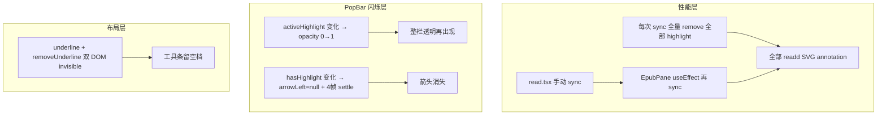
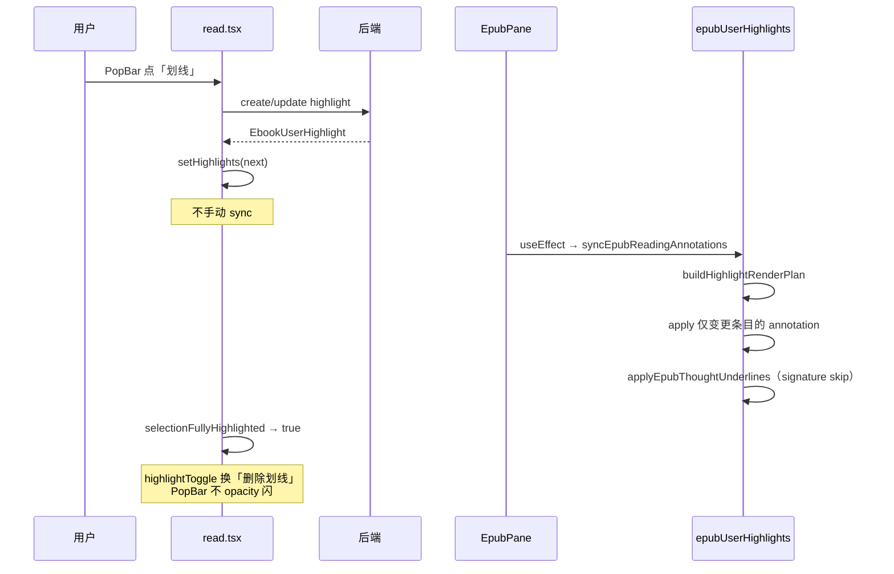

# EPUB 选区 PopBar：性能优化与防闪烁实现说明

## 文档角色

**增量专题**：说明 EPUB 阅读页在 **划线 / 删线 / 写想法** 后，如何消除 **PopBar 闪烁**、**划线应用卡顿**，以及 **「划线 ↔ 删除划线」** 工具栏槽位的最终实现。

**姊妹文档**：

- [EPUB划线DOM匹配.md](./EPUB划线DOM匹配.md) — PopBar **按钮态**（何时显示划线 vs 删除）与 **DOM 命中** 逻辑
- [EPUB用户划线实现.md](./EPUB用户划线实现.md) — 用户划线全链路主文档
- [EPUB选区PopBar视觉.md](./EPUB选区PopBar视觉.md) — 毛玻璃 / 阴影 / 箭头视觉（箭头测量已迁至 `EpubSelectionPopBarPanel`）
- [EPUB注释同步性能.md](./EPUB注释同步性能.md) — **2026-06-22** sync 主线程优化（patch 快路径、想法 DOM restack、即时 patch）

---

## 1. 背景与目标

### 1.1 用户可感知问题

| 现象 | 典型触发 |
|------|----------|
| **PopBar 整栏闪一下** | 点「划线」后按钮从「划线」变为「删除划线」；或改样式/颜色后 |
| **工具条出现大块空白** | 曾用「双按钮 + `invisible` 占位」时，「删除划线」左侧留空 |
| **划线 / 删线 / 写想法卡顿** | 每次操作后要等一会才看到正文彩色线或虚线更新 |
| **改一条线却全页重绘** | 书中已有大量划线时，改颜色尤其慢 |

### 1.2 优化目标

1. **功能不变**：DOM 命中、混选合并、PopBar 覆盖度规则与 [EPUB划线DOM匹配.md](./EPUB划线DOM匹配.md) 一致。
2. **增量 sync**：未变化的 annotation **不** remove + readd。
3. **单次 sync 通路**：避免 `read.tsx` 与 `EpubPane` **重复**调用 `syncEpubReadingAnnotations`。
4. **PopBar 稳定**：划线状态切换时 **不** 重播整栏入场动画、**不** 清空箭头。
5. **工具栏紧凑**：「划线 / 删除划线」占 **同一槽位** `highlightToggle`，无 invisible 占位。

---

## 2. 改动范围

| 路径 | 职责 |
|------|------|
| `apps/frontend/src/views/ebook/utils/epubUserHighlights.ts` | 划线 annotation 增量 apply；`buildHighlightRenderPlan`；`sync` 内 coalesce 只算一次 |
| `apps/frontend/src/views/ebook/read.tsx` | 移除冗余 `syncReadingAnnotations`；`selectionFullyHighlighted` 驱动 PopBar 按钮 |
| `apps/frontend/src/views/ebook/components/EpubPane.tsx` | `highlights` / `thoughts` 变化时 **唯一**自动 sync 入口（`useEffect`） |
| `apps/frontend/src/views/ebook/components/EpubSelectionPopBar.tsx` | Radix Popover 壳；入场 `visible` **仅**随打开/锚点变化 |
| `apps/frontend/src/views/ebook/components/EpubSelectionPopBarPanel.tsx` | 样式条 + ActionBar + 箭头；`ResizeObserver` 增量对齐箭头 |
| `apps/frontend/src/views/ebook/components/EpubQuoteActionBar.tsx` | `highlightToggle` 单槽位互斥按钮 |

---

## 3. 根因分析（三层）



### 3.1 性能：旧版 `applyEpubUserHighlights` 的致命循环

旧逻辑在每次 sync 开头：

```typescript
// 【已删除】旧版在 sync 开头对 raw highlights 逐条 remove，导致 appliedRef 全清
// 遍历当前内存中的全部划线记录（含尚未 coalesce 的原始 CFI）
for (const item of highlights) {
  // 从 epub.js annotation 层移除该 CFI 的 highlight 批注，并 delete appliedRef 对应项
  removeUserHighlightAnnotation(rend, item.cfiRange, appliedRef);
}
```

后果：

1. **所有**已绘制划线的 `appliedRef` 条目被清空；
2. 后续 `if (appliedRef.get(cfi) === nextSig) continue` **永远 false**；
3. 即使只改一条线的颜色，也会 **remove + readd 全书所有可见划线**；
4. 连带触发 `patchAllUserHighlightMarks`、想法虚线 suppressed 计算等 — 写想法保存同样变慢。

### 3.2 性能：重复 sync

`read.tsx` 在 `setHighlights(next)` 后曾调用：

```typescript
// 【已删除】在 setState 同一事件里立刻手动 sync，与 EpubPane useEffect 重复
epubNavRef.current?.syncReadingAnnotations(next);
```

而 `EpubPane` 已有：

```typescript
// highlights / thoughts 变化后，由 EpubPane 统一触发一次正文批注同步
useEffect(() => {
  // 调用 syncEpubReadingAnnotations，内部 apply 用户划线 + 想法虚线 + patch SVG
  syncEpubReadingAnnotations(rend, thoughts, highlights, ...);
// 依赖 highlights 与 thoughts：read.tsx setHighlights / setThoughts 后自动跑
}, [thoughts, highlights, rendReady]);
```

同一轮 `setHighlights` → **sync 执行两次**，DOM 与 SVG 操作翻倍。

### 3.3 闪烁：PopBar 外层 vs 工具栏内层

| 层级 | 旧触发 | 视觉效果 |
|------|--------|----------|
| `EpubSelectionPopBar` | `useLayoutEffect` 依赖 `activeHighlight?.id` | `opacity: 0` 双 rAF 后再显示 → **整栏闪** |
| `EpubSelectionPopBarPanel` | `hasHighlight` 变化时 `setArrowLeft(null)` + 4 帧 settle | **箭头先没再出现** |
| `EpubQuoteActionBar` | 过滤只渲染一个按钮 **或** 双按钮 invisible | 宽度突变 / 空档 |

**重要**：`highlightToggle` 单槽位主要解决 **空档与 DOM 重建**；**整栏闪烁** 主要靠 PopBar / Panel 两处 effect 依赖项修正。

---

## 4. 实现思路

### 4.1 划线 annotation：增量 apply + 共享 render plan

**核心原则**：

- 用 `buildHighlightApplySignature(item)` = `` `${style}|${color}|${id}` `` 判断单条是否变化；
- `purgeStaleUserHighlightAnnotations` 只删 **不在 keepCfis 内** 的 CFI（合并后旧 CFI、已删记录）；
- **不再**在循环前全量 remove 原始 `highlights` 数组。

**`buildHighlightRenderPlan`** 一次算出：

- `coalesced` — 渲染用合并后列表；
- `visibleCfis` — 应绘制的 CFI 集合；
- `sortedHighlights` — 叠层顺序；
- `keepCfis` — purge 白名单。

**`syncEpubReadingAnnotations`** 调用 plan **一次**，传给 `applyEpubUserHighlights(..., plan)`，避免 coalesce 算两遍。

想法虚线 `applyEpubThoughtUnderlines` 本身已有 signature skip；用户划线变快后，写想法保存的 **连带卡顿** 同步减轻。

### 4.2 sync 通路：只保留 EpubPane effect

`read.tsx` 在 `upsertHighlightForQuote` / `onRemoveHighlight` / `removeHighlightsForQuote` 中：

```typescript
// 同步 ref，供 PopBar / 异步回调读取最新列表
highlightsRef.current = next;
// 触发 EpubPane useEffect → syncEpubReadingAnnotations（唯一自动 sync 入口）
setHighlights(next);
// 【优化后】不再在此处调用 syncReadingAnnotations，避免与 effect 重复 sync
```

`epubNavRef.syncReadingAnnotations` 仍保留在 `EpubPane.onReady` 上，供 **需要立即用 ref 数据 sync** 的少数路径；常规状态更新走 React props。

### 4.3 PopBar 防闪烁

**`EpubSelectionPopBar`**：

- `visible` 入场动画 **仅**依赖 `[state?.open, state?.x, state?.y]`；
- **不**依赖 `activeHighlight?.id` / `selectionFullyHighlighted`（后者只传给 Panel 改按钮文案）。

**`EpubSelectionPopBarPanel`**：

- 去掉 `hasHighlight` 对 arrow effect 的依赖；
- 去掉 `setArrowLeft(null)` 与 4 帧 settle；
- 挂载时 + `resize` + `ResizeObserver` **直接** `measureArrowLeft` 更新箭头。

**`EpubQuoteActionBar` — `highlightToggle` 单槽位**（见 §5）：渲染前把 `ACTION_ORDER` 里的 `underline` + `removeUnderline` 合并为一个逻辑槽位。

### 4.4 PopBar 按钮态（与性能文档的边界）

按钮显示「划线」还是「删除划线」由 `read.tsx` 的 `selectionFullyHighlighted` 决定，内部走 `isSelectionFullyHighlighted` → `resolveSelectionHighlightCoverage`。

**本文不重复**覆盖度算法细节，见 [EPUB划线DOM匹配.md](./EPUB划线DOM匹配.md) §3.6、§4.3。

---

## 5. `highlightToggle` 单槽位设计

### 5.1 三种方案对比

| 方案 | 布局 | 闪烁 / 抖动 |
|------|------|-------------|
| **A. 过滤只渲染其一** | 紧凑 | 不同 `key` → 卸载/挂载按钮 → 宽度变 → ResizeObserver |
| **B. 双按钮 + `invisible`** | **留空档**（用户截图红框） | 宽度稳定，但 UX 差 |
| **C. `highlightToggle`（当前）** | 紧凑，始终 1 格 | 固定 `key="highlightToggle"` → **同一 DOM 更新** 图标/文案/handler |

### 5.2 渲染流水线

```text
ACTION_ORDER[floating]
  copy → underline → removeUnderline → writeThought → …
              ↓ buildRenderActions
  copy → highlightToggle → writeThought → …
              ↓ resolveHighlightToggleAction(hasHighlight)
  hasHighlight=false → { id:'underline', handler:onApplyHighlight }
  hasHighlight=true  → { id:'removeUnderline', handler:onRemoveHighlight }
```

### 5.3 为何能减少「工具条级」闪烁（而非整栏）

- React 复用 **同一** `<button key="highlightToggle">`，只做 **props 更新**，不 destroy/create；
- 无 invisible 兄弟节点 → **无空白占位**；
- 文案「划线」(2 字) vs「删除划线」(4 字) 仍可能略改宽度 → `ResizeObserver` **微调**箭头，但 **不会** 触发 PopBar 外层 `opacity` 动画。

### 5.4 可选后续优化

若需箭头完全不动，可为 `highlightToggle` 的 floating 按钮设 `min-width`（按最长文案「删除划线」+ 70px 规则定宽）。当前未做，以自然宽度为准。

---

## 6. 关键代码与注释

> 以下代码块采用「**每行代码上方一行中文注释**」格式，便于脱离 IDE 单独阅读。部分块为摘录，省略处用 `// ...` 标明。

### 6.1 增量 apply + render plan

**来源**：`apps/frontend/src/views/ebook/utils/epubUserHighlights.ts`（约 L808–L905）

```typescript
// 为单条划线生成「应用签名」：style / color / id 任一变化则需 readd
function buildHighlightApplySignature(item: EbookUserHighlight): string {
  // 拼接为字符串，存入 appliedRef Map 的值，用于增量 skip
  return `${item.style}|${item.color}|${item.id}`;
}

// 一次 sync 内共享的渲染计划，避免 coalesce 重复计算
type HighlightRenderPlan = {
  // DOM 相交合并后的划线列表（渲染层真实条目）
  coalesced: EbookUserHighlight[];
  // 应绘制可见样式的 CFI 集合（被更大选区严格包含的内层不绘制）
  visibleCfis: Set<string>;
  // 按叠层顺序排序后的 coalesced 列表
  sortedHighlights: EbookUserHighlight[];
  // purge 白名单：这些 CFI 的 annotation 应保留或按需更新
  keepCfis: Set<string>;
};

// 根据当前 highlights 与 rendition 构建 render plan（sync 入口只算一次）
function buildHighlightRenderPlan(
  rend: Rendition,
  highlights: EbookUserHighlight[],
): HighlightRenderPlan {
  // Union-Find 合并 DOM 相交的划线，得到渲染用 coalesced 列表
  const coalesced = coalesceOverlappingHighlightsForRender(rend, highlights);
  // 计算哪些 CFI 应显示（排除被外层严格包含的内层）
  const visibleCfis = computeVisibleHighlightCfis(coalesced, rend);
  // 按 span 长度等规则排序，保证 SVG 叠层顺序正确
  const sortedHighlights = sortHighlightsForStack(coalesced);
  // 从 sorted 中提取 visible 条目的 CFI，构成 keep 集合
  const keepCfis = new Set(
    sortedHighlights
      // 只保留 visibleCfis 内的条目
      .filter((item) => visibleCfis.has(item.cfiRange))
      // 取 CFI 字符串作为 Set 元素
      .map((item) => item.cfiRange),
  );
  // 返回四类数据供 apply 与想法 suppressed 共用
  return { coalesced, visibleCfis, sortedHighlights, keepCfis };
}

// 将用户划线应用到 epub.js annotation 层（核心增量逻辑）
export function applyEpubUserHighlights(
  rend: Rendition,
  highlights: EbookUserHighlight[],
  appliedRef: Map<string, string>,
  plan?: HighlightRenderPlan,
): void {
  // 注入 SVG 样式表；失败则整段 apply 中止
  try {
    ensureUserHighlightStyles();
  } catch {
    return;
  }

  // 若 sync 已传入 plan 则复用，否则本地构建（独立调用 apply 时的兜底）
  const renderPlan = plan ?? buildHighlightRenderPlan(rend, highlights);
  // 解构 plan，后续 purge 与循环共用
  const { visibleCfis, sortedHighlights, keepCfis } = renderPlan;

  // 更新模块级 meta Map，供 patchAllUserHighlightMarks 按 CFI 改 SVG
  highlightMetaByCfi = new Map(
    sortedHighlights
      // 仅 visible 条目进入 meta
      .filter((item) => visibleCfis.has(item.cfiRange))
      // [cfiRange, item] 键值对
      .map((item) => [item.cfiRange, item]),
  );

  // 删除 keepCfis 之外的 stale annotation（合并后旧 CFI、已删记录等）
  purgeStaleUserHighlightAnnotations(
    rend,
    highlights,
    keepCfis,
    appliedRef,
  );

  // 逐条处理应绘制的 coalesced 划线
  for (const item of sortedHighlights) {
    // 非 visible CFI 跳过（内层被外层盖住的不绘制）
    if (!visibleCfis.has(item.cfiRange)) continue;

    // 计算本条目标签名
    const nextSig = buildHighlightApplySignature(item);
    // 【关键】签名与 appliedRef 一致 → 本条无需 remove+readd，直接跳过
    if (appliedRef.get(item.cfiRange) === nextSig) continue;

    // 签名变化：先移除旧 annotation，再下面 readd
    removeUserHighlightAnnotation(rend, item.cfiRange, appliedRef);
    try {
      // 统一 highlight 类型，与想法 underline 批注槽位分离
      rend.annotations.highlight(
        // 目标 CFI（合并后可能是 union CFI）
        item.cfiRange,
        // data 属性：id / style / color
        buildHighlightData(item),
        // 点击回调：打开 PopBar
        buildUserHighlightClickHandler(item),
        // CSS class：背景 / 直线 / 波浪
        buildHighlightClassName(item),
        // SVG fill / stroke 样式
        buildHighlightStyles(item),
      );
      // 记录新签名，下次 sync 可 skip
      appliedRef.set(item.cfiRange, nextSig);
    } catch {
      // highlight 失败时清 appliedRef，下次 sync 会重试
      appliedRef.delete(item.cfiRange);
    }
  }
}
```

### 6.2 sync 内 coalesce 只算一次

**来源**：`apps/frontend/src/views/ebook/utils/epubUserHighlights.ts`（约 L2219–L2259）

```typescript
// 同步用户划线 + 想法虚线 + SVG patch 的总入口
export function syncEpubReadingAnnotations(
  rend: Rendition,
  thoughts: EbookThought[],
  highlights: EbookUserHighlight[],
  appliedThoughtsRef: Map<string, string>,
  appliedHighlightsRef: Map<string, string>,
): void {
  // 清空想法 patch 用的 blocker 源，避免上一轮 rect 残留
  setUserHighlightBlockerSourcesForThoughtPatch([]);

  // 【优化】只 build 一次 plan，apply 与 suppressed 共用 coalesced / visibleCfis
  const highlightPlan = buildHighlightRenderPlan(rend, highlights);
  // 传入 plan，内部不再重复 coalesce
  applyEpubUserHighlights(
    rend,
    highlights,
    appliedHighlightsRef,
    highlightPlan,
  );

  // 从 plan 取出 visible 划线对象列表，供 suppress 计算
  const visibleHighlights = highlightPlan.coalesced.filter((item) =>
    highlightPlan.visibleCfis.has(item.cfiRange),
  );

  // 可见划线 CFI 集合的签名（排序后 join），用于检测「集合是否变化」
  const highlightCfiSignature = buildVisibleHighlightCfiSignature(
    highlightPlan.coalesced,
    highlightPlan.visibleCfis,
  );
  // 仅 CFI 集合变化时才 invalidate 想法 mark，避免每次 sync 重排全部虚线
  if (highlightCfiSignature !== previousVisibleHighlightCfiSignature) {
    invalidateAllThoughtMarksForRestack(thoughts, appliedThoughtsRef);
    previousVisibleHighlightCfiSignature = highlightCfiSignature;
  }

  // 被用户划线完全盖住的 thought CFI，虚线需 suppress
  const suppressed = getThoughtCfisSuppressedByHighlights(
    thoughts,
    visibleHighlights,
    rend,
  );
  // 想法虚线 apply 自带 signature skip，未变的 underline 不会 readd
  applyEpubThoughtUnderlines(
    rend,
    thoughts,
    appliedThoughtsRef,
    suppressed,
  );

  // 收集用户划线 SVG rect，供想法 patch 时避让
  setUserHighlightBlockerSourcesForThoughtPatch(
    collectUserHighlightBlockerSources(rend),
  );
  // rAF 内 patch SVG 样式（不 remove+readd，避免闪烁）
  patchEpubReadingAnnotations(rend);
}
```

### 6.3 EpubPane：唯一自动 sync

**来源**：`apps/frontend/src/views/ebook/components/EpubPane.tsx`（约 L275–L286）

```typescript
// highlights 或 thoughts 变化时同步正文批注
useEffect(() => {
  // 取当前 rendition 实例
  const rend = rendRef.current;
  // rendition 未就绪则跳过
  if (!rend || !rendReady) return;

  // 唯一自动 sync 通路：read.tsx 只 setState，不手动 sync
  syncEpubReadingAnnotations(
    rend,
    // props thoughts，空则 []
    thoughts ?? [],
    // props highlights，空则 []
    highlights ?? [],
    // 想法 underline 已应用签名 Map（mutable ref）
    appliedThoughtsRef.current,
    // 用户划线 highlight 已应用签名 Map（mutable ref）
    appliedHighlightsRef.current,
  );
// rendReady 保证 iframe 已 display；highlights/thoughts 变则重跑
}, [thoughts, highlights, rendReady]);
```

**来源**：`apps/frontend/src/views/ebook/read.tsx`（`upsertHighlightForQuote` 成功分支，示意）

```typescript
// API 成功后写入 ref，供 PopBar 回调读取
highlightsRef.current = next;
// 触发 EpubPane 上述 useEffect → 一次 sync
setHighlights(next);
// 返回保存后的实体
return item;
// 【已删除】epubNavRef.current?.syncReadingAnnotations(next);
```

### 6.4 PopBar 入场：不随划线状态重播

**来源**：`apps/frontend/src/views/ebook/components/EpubSelectionPopBar.tsx`（约 L75–L85）

```typescript
// 控制 PopoverContent opacity 入场，避免 Radix 定位未完成时闪跳
useLayoutEffect(() => {
  // PopBar 关闭：立刻隐藏，避免残留透明层挡点击
  if (!state?.open) {
    setVisible(false);
    return;
  }
  // 打开时先隐藏，等双 rAF 后再显示（等 Popover 布局稳定）
  setVisible(false);
  // 第一帧：等浏览器完成 layout
  const id = requestAnimationFrame(() => {
    // 第二帧：再 setVisible(true)，减少定位抖动
    requestAnimationFrame(() => setVisible(true));
  });
  // 清理：取消未执行的 rAF，防止 unmount 后 setState
  return () => cancelAnimationFrame(id);
  // 【关键】仅 open / 锚点 x,y 变化时重播；不含 selectionFullyHighlighted / activeHighlight
}, [state?.open, state?.x, state?.y]);
```

### 6.5 箭头：增量测量，不清空

**来源**：`apps/frontend/src/views/ebook/components/EpubSelectionPopBarPanel.tsx`（约 L129–L146）

```typescript
// 挂载与工具条尺寸变化时更新箭头水平位置
useLayoutEffect(() => {
  // 封装：测量 toolbar 与 caretAnchorX，clamp 后 setArrowLeft
  const updateArrowLeft = () => {
    const next = measureArrowLeft();
    // 宽度为 0 时（未 layout）跳过
    if (next != null) setArrowLeft(next);
  };

  // 首次挂载立即测量（不再 setArrowLeft(null) 造成箭头闪没）
  updateArrowLeft();
  // 窗口 resize 时重算
  window.addEventListener('resize', updateArrowLeft);
  // 工具条宽度变化（如 highlightToggle 文案变长）时重算
  const observer = toolbarRef.current
    ? new ResizeObserver(updateArrowLeft)
    : null;
  // 开始观察 toolbar DOM
  if (toolbarRef.current && observer) observer.observe(toolbarRef.current);

  // effect 清理
  return () => {
    window.removeEventListener('resize', updateArrowLeft);
    observer?.disconnect();
  };
  // 【关键】依赖不含 hasHighlight；按钮切换只触发 ResizeObserver 微调，不 flash
}, [measureArrowLeft, showHighlightStyleBar]);
```

### 6.6 `highlightToggle` 槽位

**来源**：`apps/frontend/src/views/ebook/components/EpubQuoteActionBar.tsx`（约 L217–L365）

```typescript
// 将 ACTION_ORDER 中的 underline + removeUnderline 合并为一个逻辑槽位
function buildRenderActions(
  variant: BarVariant,
  onUnderline?: () => void,
  onRemoveUnderline?: () => void,
): RenderActionId[] {
  // 最终渲染顺序（含 highlightToggle 占位）
  const result: RenderActionId[] = [];
  // 标记是否已插入 highlightToggle，避免重复
  let highlightSlotAdded = false;

  // 按 variant（floating / inline / drawer）预设顺序遍历
  for (const id of ACTION_ORDER[variant]) {
    // 遇到划线相关 actionId 时合并处理
    if (id === 'underline' || id === 'removeUnderline') {
      // 第二个 underline/removeUnderline 跳过（已合并）
      if (highlightSlotAdded) continue;
      // 两个 handler 都没有则不展示该槽位
      if (!onUnderline && !onRemoveUnderline) continue;
      // 标记已添加
      highlightSlotAdded = true;
      // 推入逻辑槽位名，而非 underline 或 removeUnderline
      result.push('highlightToggle');
      continue;
    }
    // 其它 action 原样保留
    result.push(id);
  }

  return result;
}

// 根据 hasHighlight 决定 highlightToggle 槽位展示哪套 icon/文案/handler
function resolveHighlightToggleAction(
  hasHighlight: boolean,
  onUnderline?: () => void,
  onRemoveUnderline?: () => void,
): { id: ActionId; handler?: () => void } | null {
  // 选区已全部划线 → 展示「删除划线」
  if (hasHighlight) {
    if (!onRemoveUnderline) return null;
    return { id: 'removeUnderline', handler: onRemoveUnderline };
  }
  // 未划或混选 → 展示「划线」
  if (!onUnderline) return null;
  return { id: 'underline', handler: onUnderline };
}

// --- EpubQuoteActionBar 组件内 ---

// 根据 variant 与 handler 是否存在，生成 renderActions 数组
const renderActions = buildRenderActions(
  variant,
  onUnderline,
  onRemoveUnderline,
);
// 解析当前应展示的划线操作
const highlightToggle = resolveHighlightToggleAction(
  hasHighlight,
  onUnderline,
  onRemoveUnderline,
);

// JSX 渲染（摘录）
return (
  <div className={cn(CONTAINER_CLASS[variant], className)} role="toolbar">
    {renderActions.map((slot) => {
      // highlightToggle 槽位：固定 key，只更新 props
      if (slot === 'highlightToggle') {
        if (!highlightToggle) return null;
        const { id, handler } = highlightToggle;
        const onClick = buildOnClick(id, handler);
        return (
          <QuoteActionItem
            key="highlightToggle"
            variant={variant}
            label={labels[id]}
            onClick={onClick}
          >
            {renderActionIcon(id, variant, false)}
          </QuoteActionItem>
        );
      }
      // ... 其它 slot（copy / writeThought 等）
    })}
  </div>
);
```

**来源**：`apps/frontend/src/views/ebook/components/EpubQuoteActionBar.tsx`（`PRESERVE_SELECTION_ACTIONS` 与 `buildOnClick`）

```typescript
// 点击后不触发 onClearSelection 的操作（保持 EPUB 选区与 PopBar）
const PRESERVE_SELECTION_ACTIONS = new Set<ActionId>([
  'underline',
  'removeUnderline',
  'share',
  'listen',
]);

const buildOnClick = (id: ActionId, handler?: () => void) => {
  const action = id === 'copy' ? handleCopy : handler;
  // 浮动 PopBar：非 preserve 操作才在点击后清除选区
  if (
    variant === 'floating' &&
    onAnyAction &&
    !PRESERVE_SELECTION_ACTIONS.has(id)
  ) {
    return () => {
      action?.();
      if (id === 'copy') {
        window.setTimeout(() => onAnyAction(), COPY_SUCCESS_MS);
      } else {
        onAnyAction();
      }
    };
  }
  return action;
};
```

### 6.7 PopBar 按钮态 wiring

**来源**：`apps/frontend/src/views/ebook/read.tsx`（约 L252–L261、L397–L417）

```typescript
// 派生：当前选区是否「已全部划线」→ 驱动 highlightToggle 展示删除 vs 划线
const selectionFullyHighlighted = useMemo(() => {
  // 无 PopBar 或无 CFI 时视为未全划
  if (!selectionPopBar?.cfiRange) return false;
  // 取 rendition 做 DOM 覆盖度检测
  const rend = epubNavRef.current?.getRendition() ?? undefined;
  // resolveSelectionHighlightCoverage === 'full' 时返回 true
  return isSelectionFullyHighlighted(
    highlights,
    selectionPopBar.cfiRange,
    selectionPopBar.selectedText,
    rend,
  );
// highlights 变（划线/删线后）或选区变时重算
}, [highlights, selectionPopBar, epubNavReady]);

// upsertSelectionHighlight 保存成功后（摘录）：
const nextPayload: EpubSelectionPopBarPayload = {
  ...payload,
  cfiRange: item.cfiRange,
  selectedText: item.quote?.trim() || payload.selectedText,
};
selectionPopBarRef.current = nextPayload;
setHighlightStyle(item.style);
setHighlightColor(item.color);
// 更新 PopBar state → selectionFullyHighlighted 重算 → highlightToggle 切换文案
setSelectionPopBar({ ...nextPayload, open: true });
```

**来源**：`apps/frontend/src/views/ebook/components/EpubSelectionPopBarPanel.tsx`（约 L163–L173）

```typescript
<EpubQuoteActionBar
  variant={variant === 'inline' ? 'floating' : 'floating'}
  labels={labels}
  // 传入 coverage 结果，内部 resolveHighlightToggleAction 决定 icon/文案
  hasHighlight={selectionFullyHighlighted}
  onCopy={onCopy}
  // 未全划 / 混选时：highlightToggle 显示「划线」
  onUnderline={onApplyHighlight}
  // 全划时：highlightToggle 显示「删除划线」
  onRemoveUnderline={onRemoveHighlight}
  onWriteThought={onWriteThought}
  onAskBook={onAskBook}
  onAnyAction={onClearSelection}
/>
```

---

## 7. 端到端数据流（划线一次）



---

## 8. 兼容性与影响

| 项 | 说明 |
|----|------|
| **行为** | 划线/删线/合并/PopBar 规则不变 |
| **性能** | 改单条样式时其余划线不重绘；sync 次数减半 |
| **视觉** | PopBar 切换按钮时不再整栏透明；工具条无 invisible 空档 |
| **风险** | 若合并后 CFI 变化，`purgeStale` 必须删掉旧 CFI — 已由 `keepCfis` 覆盖；需回归重叠合并 |

---

## 9. 回归清单

**性能**

1. 书中 20+ 划线，只改其中一条颜色 → 其它线 **不闪**、响应明显变快。
2. 新建 / 删除一条划线 → 仅相关 SVG 变化。
3. 保存读书想法 → 虚线出现延迟缩短（连带 benefit）。

**PopBar / 工具栏**

4. 点「划线」→ 按钮变「删除划线」，**PopBar 不整栏闪**。
5. 点「删除划线」→ 变「划线」，**无工具条中间空档**。
6. 混选 / 子选区 / 整段已划 — 按钮态与 [EPUB划线DOM匹配.md](./EPUB划线DOM匹配.md) 一致。
7. 侧栏引用条（inline PopBarPanel）同样走 `highlightToggle`。

**合并 / 叠加**

8. 相邻划线合并后旧 CFI annotation 被 purge，无双层 SVG。
9. 用户划线与想法虚线叠加仍正常；被高亮盖住虚线仍 suppress。

---

## 10. 相关源码路径

| 说明 | 路径 |
|------|------|
| 划线 apply / sync | `apps/frontend/src/views/ebook/utils/epubUserHighlights.ts` |
| 想法 underline apply | `apps/frontend/src/views/ebook/utils/epubThoughtAnnotations.ts` |
| 阅读页状态 | `apps/frontend/src/views/ebook/read.tsx` |
| Rendition + effect sync | `apps/frontend/src/views/ebook/components/EpubPane.tsx` |
| PopBar 壳 | `apps/frontend/src/views/ebook/components/EpubSelectionPopBar.tsx` |
| PopBar 面板 + 箭头 | `apps/frontend/src/views/ebook/components/EpubSelectionPopBarPanel.tsx` |
| 操作按钮 | `apps/frontend/src/views/ebook/components/EpubQuoteActionBar.tsx` |
| DOM 命中 / 覆盖度 | 见 [EPUB划线DOM匹配.md](./EPUB划线DOM匹配.md) |

若与仓库最新源码不一致，以源码为准。
