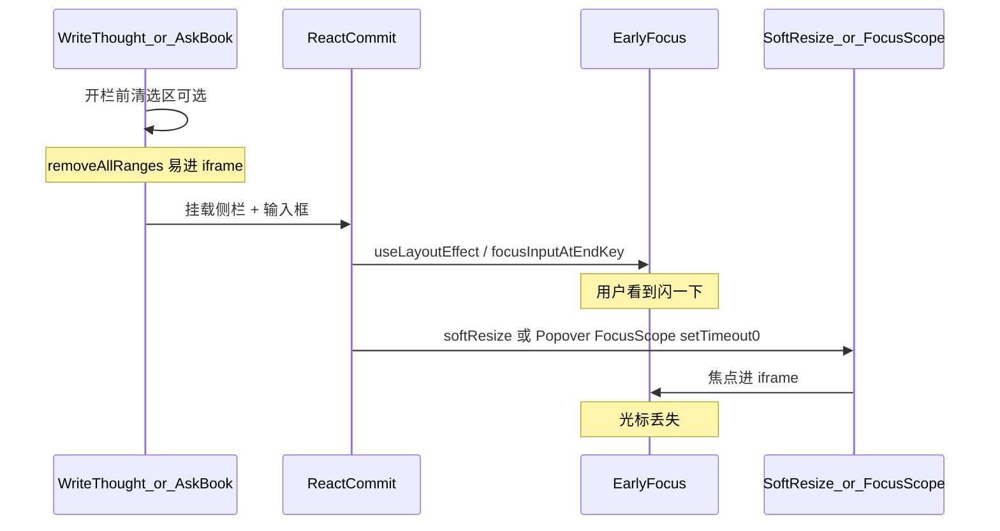

# EPUB 侧栏输入焦点（写想法 / MK 问书）

## 文档角色

**增量专题（2026-07-19）**：从选区浮动条（PopBar）或右键打开 **读书想法** / **MK 问书** 右侧分栏时，输入框曾出现 **「开启一瞬间有焦点 → 马上丢失」**。本轮推翻「补焦 / inert / FocusScope 抢回」路线，改为：

1. **PopBar 不再使用 Radix Popover**（去掉 FocusScope 异步还焦）；
2. **开栏过程中不 focus**，等侧栏输入框挂进 DOM 且 softResize 大致结束后再 **唯一交焦**；
3. **问书与想法** 共用 **单一** `sideComposeTarget` effect，来回切换互不 cancel；
4. 开栏期间短时挂起阅读区 `pointer-events`，清选区放在交焦之后。

阅读位保位见姊妹稿 [EPUB视口定位.md](./EPUB视口定位.md)（`applyHostResize` 内视口钉住，与交焦解耦）。

**延伸阅读**：[EPUB阅读分屏.md](./EPUB阅读分屏.md)、[EPUB想法侧面板.md](./EPUB想法侧面板.md)、[电子书Mock助手.md](./电子书Mock助手.md)、[EPUB视口定位.md](./EPUB视口定位.md)、[EPUB分屏软调整.md](./EPUB分屏软调整.md)。

---

## 1. 背景与目标

### 1.1 用户可见症状

| 场景 | 旧行为 | 目标行为 |
|------|--------|----------|
| 全宽 → PopBar「写想法」 | 输入框闪焦后丢失 | 侧栏打开后光标稳定，可直接键入 |
| 全宽 → PopBar「MK 问书」 | 同上（`focusInputAtEndKey` 过早 focus） | 同上 |
| 想法 ↔ 问书来回切换 | 一侧能聚焦、另一侧不能 / 两 effect 互抢 | 当前可见面板输入框都能自动聚焦 |
| 开合侧栏 / 拖手柄 | （交焦无关）阅读位跳动 | 由 viewport-pin 专题覆盖 |

### 1.2 根因（叠层，非单一 bug）



细节点：

1. **首次开栏**才挂载右栏（`EbookReadSplitLayout` 关栏时不挂右 panel）→ 阅读区变窄 → `ResizeObserver` → `softResize` / `view.expand`，浏览器常把焦点送进 EPUB iframe。
2. **旧问书**用 `ChatEntry` 的 `focusInputAtEndKey` + `useLayoutEffect`：**面板未 settle 就 focus**。
3. **旧写想法**在开栏前 `clearTextSelection`，与问书「开栏后再清」不一致；`removeAllRanges` 易抢焦。
4. **Radix Popover FocusScope**：关闭时 `setTimeout(0)` 把焦点还回打开前的元素（选区时即 iframe），即使 `onCloseAutoFocus.preventDefault` 仍可能与侧栏 focus 竞态。
5. **`host.inert` 开关**（曾尝试）：WebKit/Tauri 解除 inert 时可能把焦点还回 iframe，属错误方向，已废弃。
6. **双 effect**（想法一套、问书一套）：切面板时一方 cleanup `unsuspend` / `cancelled` 会打掉另一方交焦；且问书占栏时 `thoughtDialogOpen` 仍为 true，切回想法 deps 不变 → 不交焦。

### 1.3 目标原则

- **开栏过程中阅读区不能成为焦点竞争者**（短时 `pointer-events: none`）。
- **输入框只在「对应面板已挂载 + 短暂等待 softResize」后 focus 一次**。
- **可见面板唯一决定交焦目标**（`sideComposeTarget`），问书优先于想法。
- **不做** sticky focusin 守卫、inert、portal 搬移 textarea。

---

## 2. 改动范围

| 路径 | 变更要点 |
|------|----------|
| `apps/frontend/src/views/ebook/utils/common/epubThoughtComposeInput.ts` | **新增**：输入框 id、focus 助手、阅读区 pointer 挂起 |
| `apps/frontend/src/views/ebook/read.tsx` | `sideComposeTarget` + 单一交焦 effect；写想法/问书入口只开栏；`openAssistant` 关想法；`assistantFocusKey` |
| `apps/frontend/src/views/ebook/components/selection/EpubSelectionPopBar.tsx` | Popover → `createPortal` 固定定位 |
| `apps/frontend/src/views/ebook/components/selection/EpubQuoteActionBar.tsx` | 「写想法」mousedown `preventDefault`（不预 focus） |
| `apps/frontend/src/views/ebook/components/thought/EpubThought.tsx` | 去掉自动 focus effect；`textareaId` 常驻 |
| `apps/frontend/src/views/ebook/components/thought/EpubThoughtPanelShell.tsx` | `viewportTabIndex={-1}` |
| `apps/frontend/src/views/ebook/components/reader/EbookAssistant.tsx` | 去掉 `focusInputAtEndKey`；挂 `EPUB_ASSISTANT_INPUT_ID` |
| `apps/frontend/src/views/ebook/components/reader/EpubPane.tsx` | host `data-epub-reader-host`（供 pointer 挂起查询）；resize **不**碰焦点 |
| `apps/frontend/src/views/ebook/utils/epub/reader/epubSelectionToolbarAttach.ts` | `clearEpubTextSelection` 清完尝试还焦父页面 |
| `apps/frontend/src/components/design/ChatEntry/index.tsx` | 透传 `textareaId` |
| `apps/frontend/src/components/design/ChatTextArea/index.tsx` | `viewportTabIndex={-1}` |
| `apps/frontend/src/components/ui/scroll-area.tsx` | 支持 `viewportTabIndex` |

---

## 3. 实现思路

### 3.1 调用链（写想法）

1. PopBar「写想法」→ `onSelectionPopBarWriteThought`：**只** `openCreateThought`（关 PopBar、开想法侧栏、`thoughtComposeScrollKey++`），**不开栏前清选区、不 focus**。
2. React 提交：右栏挂载 `EpubThought` + `textarea#epub-thought-compose-input`；阅读区变窄触发 softResize（视口钉住走 pin 专题）。
3. `sideComposeTarget === 'thought'` → 交焦 effect：`pointer-events:none` on host → rAF 等到 textarea 存在 → **`setTimeout(150)`** → `clearTextSelection` → `focusThoughtComposeInput` → 恢复 pointer。

### 3.2 调用链（MK 问书）

1. PopBar「问书」→ `openAssistantWithSelection`：模板草稿 + `openAssistant`（**关闭想法**）+ `assistantFocusKey++`。
2. `sideComposeTarget === 'assistant'` → 同上 settle 后 `focusEpubAssistantInput`（光标置末、滚到底）。

### 3.3 来回切换

| 切换 | `sideComposeTarget` | 交焦 |
|------|---------------------|------|
| 想法 → 问书 | `thought` → `assistant` | effect 重跑 → 问书 |
| 问书 → 写想法 | `assistant` → `thought` | effect 重跑 → 想法 |
| 问书关闭且想法已关 | `null` | 不交焦 |

**不再**维护两套独立 effect，避免 cleanup 互抢。

### 3.4 为何 150ms 而不是「resize-end 瞬间」

`notifyEbookSplitPanelResizeEnd` 触发时，`ResizeObserver` 仍可能再排一帧 softResize。先等输入框进 DOM，再固定 **150ms** 躲开尾随 RO，比「双 effect + 守卫」简单可预期。

### 3.5 废弃方案一览（勿回潮）

| 方案 | 为何放弃 |
|------|----------|
| rAF/setTimeout 连环补焦、focusin sticky | 治标；与 softResize 赛跑 |
| portal 常驻 textarea 再搬槽 | portal 换容器 remount 丢焦 |
| `host.inert` 仅 softResize 期间 | WebKit 解除 inert 还焦 iframe |
| Popover + `onCloseAutoFocus` | FocusScope `setTimeout(0)` 还焦 |
| 想法/问书各一套 effect | 切换时互 cancel |

---

## 4. 关键实现（改动前 / 改动后 + 逐行注释）

### 4.1 `epubThoughtComposeInput.ts`（纯新增）

**对比范围**：整文件。基线无此模块；仅贴 **改动后**。

**改动后** · `apps/frontend/src/views/ebook/utils/common/epubThoughtComposeInput.ts`（当前，约 L1–L34）

```ts
// 模块职责：侧栏输入框用稳定 DOM id 聚焦；开栏时挂起阅读区指针
/** 侧栏输入：settle / 面板挂载后再由 read 页唯一交焦 */

// 想法写/编辑区原生 textarea 的 id，供 getElementById
export const EPUB_THOUGHT_COMPOSE_INPUT_ID = 'epub-thought-compose-input';
// MK 问书 ChatTextArea 内 textarea 的 id
export const EPUB_ASSISTANT_INPUT_ID = 'epub-assistant-compose-input';
// EpubPane 阅读宿主属性名，供 pointer-events 挂起查询
export const EPUB_READER_HOST_ATTR = 'data-epub-reader-host';

// 内部：按 id 聚焦；可选滚到内容底部（问书预填摘录）
function focusTextareaById(id: string, scrollToEnd = false): boolean {
	// 查找已挂载的 textarea；未挂载则交焦失败（effect 会 rAF 重试）
	const el = document.getElementById(id) as HTMLTextAreaElement | null;
	// 节点不存在：返回 false，不抛错
	if (!el) return false;
	// 聚焦且避免滚动整页
	el.focus({ preventScroll: true });
	// 校验焦点是否真落到该元素（iframe 抢焦时会失败）
	if (document.activeElement !== el) return false;
	// 光标放到文本末尾
	const end = el.value.length;
	// 设置选区为末尾折叠光标
	el.setSelectionRange(end, end);
	// 问书场景：把 textarea 内部滚动条滚到底，露出光标行
	if (scrollToEnd) el.scrollTop = el.scrollHeight;
	// 成功
	return true;
}

// 想法输入框聚焦入口
export function focusThoughtComposeInput(): boolean {
	// 不滚到底（想法草稿通常为空或短）
	return focusTextareaById(EPUB_THOUGHT_COMPOSE_INPUT_ID);
}

// MK 问书输入框聚焦：光标置末并滚到底
/** MK 问书输入框：光标置于末尾（预填摘录场景） */
export function focusEpubAssistantInput(): boolean {
	// scrollToEnd=true
	return focusTextareaById(EPUB_ASSISTANT_INPUT_ID, true);
}

// 开栏窗口内挂起阅读区命中测试，降低 mouseup/误点进 iframe
/** 开栏期间挂起阅读区指针，避免 mouseup/清选区把焦点打进 iframe */
export function setEpubReaderPointerSuspended(suspended: boolean): void {
	// 查询带 data-epub-reader-host 的宿主
	const host = document.querySelector(
		`[${EPUB_READER_HOST_ATTR}]`,
	) as HTMLElement | null;
	// 宿主未就绪则忽略（书未打开等）
	if (!host) return;
	// suspended 时 none；否则清空内联样式恢复 CSS
	host.style.pointerEvents = suspended ? 'none' : '';
}
```

**变更摘要**：集中 id / focus / pointer 挂起，供 read 页单一 effect 调用；无 pending 守卫、无 reclaim。

---

### 4.2 `sideComposeTarget` + 交焦 `useEffect`（`read.tsx`）

**对比范围**：交焦策略整体。

**改动前** · 问书路径（基线逻辑，符号分散）

旧问书：`openAssistantWithSelection` 内 `setFocusInputAtEndKey(n+1)` → `ChatEntry` `useLayoutEffect` 在 **input 非空时立刻** `el.focus()`，与分栏 softResize **同帧竞态**。

旧想法：侧栏组件内 effect / 多处 `focusThoughtComposeInput` / 开栏前 `clearTextSelection`，无统一 settle。

**改动前（问书 ChatEntry 消费 key）** · `apps/frontend/src/components/design/ChatEntry/index.tsx`（基线，约 L202–L218）

```tsx
// 仅在 focusInputAtEndKey 递增时聚焦一次；依赖 input 非空
useLayoutEffect(() => {
	// key 为 0/undefined：不处理
	if (!focusInputAtEndKey) return;
	// 已消费过的 key：防重复
	if (focusInputAtEndKey <= consumedFocusAtEndKeyRef.current) return;
	// draft 尚未写入时不 focus（等下一拍 input）
	if (!input.length) return;

	// 取 textarea 实参
	const el = textareaRef.current;
	// 无节点或空值：放弃
	if (!el?.value.length) return;

	// 标记 key 已消费
	consumedFocusAtEndKeyRef.current = focusInputAtEndKey;
	// 计算末尾偏移
	const len = el.value.length;
	// 若当前焦点在 iframe，先 blur
	const active = document.activeElement;
	// 父文档 activeElement 为 iframe 元素时 blur
	if (active instanceof HTMLIFrameElement) active.blur();
	// 立即聚焦——此时侧栏 softResize 可能尚未结束
	el.focus({ preventScroll: true });
	// 光标置末
	el.setSelectionRange(len, len);
	// 内部滚到底
	el.scrollTop = el.scrollHeight;
	// 依赖：key 与受控 input、ref
}, [focusInputAtEndKey, input, textareaRef]);
```

**改动后** · `apps/frontend/src/views/ebook/read.tsx`（当前，约 L1182–L1232）

```tsx
// 当前侧栏实际挂载的可编辑输入：问书优先（与 sidePanel 渲染顺序一致）
const sideComposeTarget =
	// 问书打开时 EpubThought 不挂载，目标只能是 assistant
	assistantOpen
		? ('assistant' as const)
		// 想法 create/edit 才有底部输入；view 无 compose
		: thoughtDialogOpen && thoughtDialogMode !== 'view'
			? ('thought' as const)
			: null;

// 单一交焦 effect：可见面板变化或 scrollKey/focusKey 递增时重跑
useEffect(() => {
	// 无侧栏可编辑输入：不挂起、不定时器
	if (!sideComposeTarget) return;

	// 按目标选择 DOM id
	const inputId =
		sideComposeTarget === 'assistant'
			? EPUB_ASSISTANT_INPUT_ID
			: EPUB_THOUGHT_COMPOSE_INPUT_ID;
	// 按目标选择 focus 函数（问书滚到底）
	const focusInput =
		sideComposeTarget === 'assistant'
			? focusEpubAssistantInput
			: focusThoughtComposeInput;

	// 开栏窗口：阅读区不接收指针，降低抢焦
	setEpubReaderPointerSuspended(true);
	// effect 清理时置 true，取消未完成的交焦
	let cancelled = false;
	// setTimeout 句柄；0 表示未调度
	let focusTimer = 0;

	// settle 完成后的唯一交焦
	const applyFocus = () => {
		// 已切换面板或卸载：放弃
		if (cancelled) return;
		// 清选区放在 focus 前一刻，避免开栏前清选区进 iframe
		epubNavRef.current?.clearTextSelection();
		// 聚焦对应 textarea
		focusInput();
		// 恢复阅读区指针
		setEpubReaderPointerSuspended(false);
	};

	// 等到输入框进 DOM（右栏条件渲染完成）
	const waitForPanel = () => {
		// 已取消则停止 rAF 链
		if (cancelled) return;
		// 尚未挂载：下一帧再查
		if (!document.getElementById(inputId)) {
			requestAnimationFrame(waitForPanel);
			return;
		}
		// 已挂载：再等 150ms 躲开尾随 softResize
		focusTimer = window.setTimeout(applyFocus, 150);
	};
	// 首帧再开始等，让本次 commit 的 DOM 先刷上
	requestAnimationFrame(waitForPanel);

	// 依赖变化或卸载：取消定时器并 unsuspend
	return () => {
		cancelled = true;
		if (focusTimer) window.clearTimeout(focusTimer);
		setEpubReaderPointerSuspended(false);
	};
	// target 切换=换面板；两 key 覆盖「同面板再次写想法/再问书」
}, [sideComposeTarget, thoughtComposeScrollKey, assistantFocusKey]);
```

**变更摘要**：交焦从 ChatEntry layout 挪到 read 页 settle；单一 effect 覆盖想法与问书切换。

---

### 4.3 写想法 / 问书入口（`read.tsx`）

**改动前** · 写想法典型路径：开栏前 `clearTextSelection` + 立即/ effect focus。

**改动后** · `onSelectionPopBarWriteThought`（当前，约 L1165–L1170）

```tsx
// PopBar「写想法」：只开栏，交焦交给 sideComposeTarget effect
const onSelectionPopBarWriteThought = useCallback(() => {
	// 取当前选区载荷
	const payload = selectionPopBarRef.current;
	// 无选区则忽略
	if (!payload) return;
	// 开想法侧栏（内部关 PopBar、关问书、scrollKey++）
	openCreateThought(payload.selectedText, payload.cfiRange);
	// 依赖 openCreateThought 稳定引用
}, [openCreateThought]);
```

**改动后** · `openAssistant` / `openAssistantWithSelection`（当前，约 L1764–L1790）

```tsx
// 打开 MK 问书：与想法互斥占栏
const openAssistant = useCallback((draft?: string) => {
	// 有草稿则写入受控 input（选区模板）
	if (draft?.trim()) {
		setAssistantInput(draft.trim());
	}
	// 关闭想法，避免双开导致切回时 deps 不触发
	setThoughtDialogOpen(false);
	// 打开问书侧栏
	setAssistantOpen(true);
	// 无额外 deps
}, []);

// 选区问书：填模板 + 递增 focusKey 触发交焦 effect
const openAssistantWithSelection = useCallback(
	(selectedText: string) => {
		// 去掉首尾空白
		const quote = selectedText.trim();
		// 空选区不打开
		if (!quote) return;
		// 只开栏填草稿；交焦等问书面板挂载后再做
		openAssistant(t('ebook.read.assistant.askSelectionDraft', { quote }));
		// 同面板再次问书时 target 不变，靠 key 递增重跑 effect
		setAssistantFocusKey((n) => n + 1);
	},
	// 依赖开栏函数与 i18n
	[openAssistant, t],
);
```

**改动后** · `onSelectionPopBarAskBook`（当前）：只关 PopBar state + `openAssistantWithSelection`；**不再**在 rAF 里抢先 `clearTextSelection`。

**变更摘要**：入口与交焦解耦；清选区并入 settle 后的 `applyFocus`。

---

### 4.4 `EpubSelectionPopBar`：Popover → portal

**对比范围**：整个 `EpubSelectionPopBar` 组件。

**改动前** · `apps/frontend/src/views/ebook/components/selection/EpubSelectionPopBar.tsx`（基线）

```tsx
// 使用 Radix Popover：含 FocusScope，关闭时可能 setTimeout(0) 还焦
import { Popover, PopoverAnchor, PopoverContent } from '@ui/index';
// React 钩子
import { type CSSProperties, useLayoutEffect, useMemo, useState } from 'react';
// className 合并
import { cn } from '@/lib/utils';
// 划线类型
import type { EpubHighlightColorId, EpubHighlightStyle } from '../../types';
// 阅读背景主题
import type { EpubReaderBgTheme } from '../../utils/epub/reader/epubReaderSettings';
// 选区载荷类型
import type { EpubSelectionPopBarPayload } from '../../utils/epub/reader/epubSelectionToolbarAttach';
// 面板 UI
import {
	type EpubSelectionPopBarLabels,
	EpubSelectionPopBarPanel,
} from './EpubSelectionPopBarPanel';

// state = 载荷 + open
export type EpubSelectionPopBarState = EpubSelectionPopBarPayload & {
	open: boolean;
};

// 再导出 labels 类型
export type { EpubSelectionPopBarLabels };

// 组件 props
type Props = {
	state: EpubSelectionPopBarState | null;
	labels: EpubSelectionPopBarLabels;
	selectionFullyHighlighted?: boolean;
	selectionHasHighlight?: boolean;
	highlightStyle: EpubHighlightStyle;
	highlightColor: EpubHighlightColorId;
	onHighlightStyleChange: (style: EpubHighlightStyle) => void;
	onHighlightColorChange: (color: EpubHighlightColorId) => void;
	onCopy: () => void;
	onApplyHighlight: () => void;
	onRemoveHighlight: () => void;
	onWriteThought: () => void;
	onAskBook: () => void;
	onShare?: () => void;
	onListen?: () => void;
	onClearSelection?: () => void;
	chromeStyle?: CSSProperties;
	readerBgTheme?: EpubReaderBgTheme;
};

// 旧注释：靠 Popover 碰撞检测
/**
 * 选区上方浮动操作条（Pop Sidebar）。
 * 锚点 + Radix Popover 碰撞检测，与 EpubReaderContextMenu 相同，避免贴边溢出。
 */
export function EpubSelectionPopBar({
	state,
	labels,
	selectionFullyHighlighted,
	selectionHasHighlight,
	highlightStyle,
	highlightColor,
	onHighlightStyleChange,
	onHighlightColorChange,
	onCopy,
	onApplyHighlight,
	onRemoveHighlight,
	onWriteThought,
	onAskBook,
	onShare,
	onListen,
	onClearSelection,
	chromeStyle,
	readerBgTheme = 'default',
}: Props) {
	// 显隐动画
	const [visible, setVisible] = useState(false);

	// 1x1 锚点样式
	const anchorStyle = useMemo(
		() =>
			state
				? ({
						position: 'fixed',
						left: state.x,
						top: state.y,
						width: 1,
						height: 1,
						pointerEvents: 'none',
					} as const)
				: undefined,
		[state],
	);

	// 打开时双 rAF 再显示，避免跳变
	useLayoutEffect(() => {
		if (!state?.open) {
			setVisible(false);
			return;
		}
		setVisible(false);
		const id = requestAnimationFrame(() => {
			requestAnimationFrame(() => setVisible(true));
		});
		return () => cancelAnimationFrame(id);
	}, [state?.open, state?.x, state?.y]);

	// 关闭则整树卸载（硬卸 FocusScope 更易还焦）
	if (!state?.open) return null;

	return (
		// 受控 open
		<Popover open={state.open}>
			{/* 锚点 */}
			<PopoverAnchor asChild>
				<span aria-hidden style={anchorStyle} />
			</PopoverAnchor>
			{/* 内容：关闭自动聚焦进 iframe 的竞态源 */}
			<PopoverContent
				side="top"
				align="center"
				sideOffset={10}
				collisionPadding={12}
				className={cn(
					'group/pop z-50 w-auto border-0 bg-transparent p-0 shadow-none outline-none',
					!visible && 'pointer-events-none opacity-0',
				)}
				style={chromeStyle}
				onOpenAutoFocus={(e) => e.preventDefault()}
				onCloseAutoFocus={(e) => e.preventDefault()}
				onMouseDown={(e) => {
					const el = e.target as HTMLElement;
					if (
						el.closest(
							'input, textarea, select, [data-slot=popover-content], [data-slot=select-content]',
						)
					) {
						return;
					}
					e.preventDefault();
				}}
			>
				<EpubSelectionPopBarPanel
					labels={labels}
					selectionFullyHighlighted={selectionFullyHighlighted}
					selectionHasHighlight={selectionHasHighlight}
					highlightStyle={highlightStyle}
					highlightColor={highlightColor}
					onHighlightStyleChange={onHighlightStyleChange}
					onHighlightColorChange={onHighlightColorChange}
					onCopy={onCopy}
					onApplyHighlight={onApplyHighlight}
					onRemoveHighlight={onRemoveHighlight}
					onWriteThought={onWriteThought}
					onAskBook={onAskBook}
					onShare={onShare}
					onListen={onListen}
					onClearSelection={onClearSelection}
					caretAnchorX={state.x}
					readerBgTheme={readerBgTheme}
				/>
			</PopoverContent>
		</Popover>
	);
}
```

**改动后** · 同路径（当前，约 L1–L143）

```tsx
// 不再引入 Popover
import { type CSSProperties, useLayoutEffect, useState } from 'react';
// 挂到 document.body，无 FocusScope
import { createPortal } from 'react-dom';
import { cn } from '@/lib/utils';
import type { EpubHighlightColorId, EpubHighlightStyle } from '../../types';
import type { EpubReaderBgTheme } from '../../utils/epub/reader/epubReaderSettings';
import type { EpubSelectionPopBarPayload } from '../../utils/epub/reader/epubSelectionToolbarAttach';
import {
	type EpubSelectionPopBarLabels,
	EpubSelectionPopBarPanel,
} from './EpubSelectionPopBarPanel';

export type EpubSelectionPopBarState = EpubSelectionPopBarPayload & {
	open: boolean;
};

export type { EpubSelectionPopBarLabels };

type Props = {
	state: EpubSelectionPopBarState | null;
	labels: EpubSelectionPopBarLabels;
	selectionFullyHighlighted?: boolean;
	selectionHasHighlight?: boolean;
	highlightStyle: EpubHighlightStyle;
	highlightColor: EpubHighlightColorId;
	onHighlightStyleChange: (style: EpubHighlightStyle) => void;
	onHighlightColorChange: (color: EpubHighlightColorId) => void;
	onCopy: () => void;
	onApplyHighlight: () => void;
	onRemoveHighlight: () => void;
	onWriteThought: () => void;
	onAskBook: () => void;
	onShare?: () => void;
	onListen?: () => void;
	onClearSelection?: () => void;
	chromeStyle?: CSSProperties;
	readerBgTheme?: EpubReaderBgTheme;
};

// 贴边内边距
const EDGE = 8;
// 与选区锚点的间隙
const GAP = 10;

/**
 * 选区上方浮动操作条。
 * 不用 Radix Popover：其 FocusScope 在卸载时 setTimeout(0) 把焦点还回打开前的
 * EPUB iframe，发生在侧栏输入框聚焦之后，表现为闪焦后丢失。
 */
export function EpubSelectionPopBar({
	state,
	labels,
	selectionFullyHighlighted,
	selectionHasHighlight,
	highlightStyle,
	highlightColor,
	onHighlightStyleChange,
	onHighlightColorChange,
	onCopy,
	onApplyHighlight,
	onRemoveHighlight,
	onWriteThought,
	onAskBook,
	onShare,
	onListen,
	onClearSelection,
	chromeStyle,
	readerBgTheme = 'default',
}: Props) {
	// 是否展示
	const open = Boolean(state?.open);
	// 淡入可见
	const [visible, setVisible] = useState(false);

	// 打开时双 rAF 显示
	useLayoutEffect(() => {
		if (!open) {
			setVisible(false);
			return;
		}
		setVisible(false);
		const id = requestAnimationFrame(() => {
			requestAnimationFrame(() => setVisible(true));
		});
		return () => cancelAnimationFrame(id);
	}, [open, state?.x, state?.y]);

	// 关闭：不渲染 portal
	if (!state?.open) return null;

	// 靠上空间够则在选区上方，否则下方
	const placeAbove = state.y > 72;
	// 水平夹紧，避免贴边裁切
	const left = Math.min(
		Math.max(state.x, EDGE),
		(typeof window !== 'undefined' ? window.innerWidth : state.x) - EDGE,
	);
	// 垂直位置
	const top = placeAbove
		? Math.max(EDGE, state.y - GAP)
		: state.y + GAP;

	// 挂到 body，无 FocusScope
	return createPortal(
		<div
			data-side={placeAbove ? 'top' : 'bottom'}
			className={cn(
				'group/pop fixed z-50 w-auto border-0 bg-transparent p-0 shadow-none outline-none',
				!visible && 'pointer-events-none opacity-0',
			)}
			style={{
				...chromeStyle,
				left,
				top,
				transform: placeAbove
					? 'translate(-50%, -100%)'
					: 'translate(-50%, 0)',
			}}
			onMouseDown={(e) => {
				const el = e.target as HTMLElement;
				// 按钮等可聚焦控件：不 preventDefault，保留点击
				if (
					el.closest(
						'button, a, input, textarea, select, [role="button"], [data-slot=select-content]',
					)
				) {
					return;
				}
				// 空白处按下：避免抢焦点
				e.preventDefault();
			}}
		>
			<EpubSelectionPopBarPanel
				labels={labels}
				selectionFullyHighlighted={selectionFullyHighlighted}
				selectionHasHighlight={selectionHasHighlight}
				highlightStyle={highlightStyle}
				highlightColor={highlightColor}
				onHighlightStyleChange={onHighlightStyleChange}
				onHighlightColorChange={onHighlightColorChange}
				onCopy={onCopy}
				onApplyHighlight={onApplyHighlight}
				onRemoveHighlight={onRemoveHighlight}
				onWriteThought={onWriteThought}
				onAskBook={onAskBook}
				onShare={onShare}
				onListen={onListen}
				onClearSelection={onClearSelection}
				caretAnchorX={state.x}
				readerBgTheme={readerBgTheme}
			/>
		</div>,
		document.body,
	);
}
```

**变更摘要**：去掉 FocusScope；用 fixed + 简易上下翻转替代 Popover 碰撞。

---

### 4.5 `clearEpubTextSelection` 还焦

**改动前**：清完 ranges 即返回，焦点常留在 iframe。

**改动后** · `apps/frontend/src/views/ebook/utils/epub/reader/epubSelectionToolbarAttach.ts`（约 L100–L138）

```ts
// 清除各 iframe 与顶层选区；若原先焦点在父页面则清完后还回
export function clearEpubTextSelection(rend: Rendition): void {
	// 记录清选区前的焦点
	const prev = document.activeElement;
	// 仅当 prev 是父文档 HTMLElement 且非 iframe 时才还焦
	const restore =
		prev instanceof HTMLElement &&
		prev.isConnected &&
		prev.ownerDocument === document &&
		!(prev instanceof HTMLIFrameElement);

	// 取出 epub.js contents
	const raw = rend.getContents();
	// 归一成数组
	const list: EpubIframeContents[] = Array.isArray(raw)
		? (raw as EpubIframeContents[])
		: raw
			? [raw as EpubIframeContents]
			: [];

	// 逐 iframe 清 selection
	for (const contents of list) {
		try {
			contents.window.getSelection()?.removeAllRanges();
		} catch {
			// iframe 已卸载时忽略
		}
	}
	try {
		window.getSelection()?.removeAllRanges();
	} catch {
		// ignore
	}

	// 不需要还焦，或焦点未被抢走
	if (!restore || document.activeElement === prev) return;
	// blur 各 iframe 元素，避免焦点粘在 frame
	for (const contents of list) {
		try {
			(contents.window.frameElement as HTMLElement | null)?.blur();
		} catch {
			// ignore
		}
	}
	// 还回侧栏/按钮等父页面焦点
	prev.focus({ preventScroll: true });
}
```

**变更摘要**：配合 settle 后清选区，减少「清选区把焦打进书内」。

---

### 4.6 其它细节点（摘要 + 要点）

下列条目在 **§4.7–§4.14** 与 **附录 A** 展开为改动前/后与逐行注释；本表仅作索引：

| 点 | 说明 | 详节 |
|----|------|------|
| `EpubThought` | 去掉 mount auto-focus；`textareaId` 常驻 | §4.7 |
| `EbookAssistant` | 去掉 `focusInputAtEndKey`；挂 `EPUB_ASSISTANT_INPUT_ID` | §4.8 |
| `ChatEntry` | 透传 `textareaId`；知识库仍可用 `focusInputAtEndKey` | §4.9 |
| `EpubQuoteActionBar` | 写想法 mousedown `preventDefault`；写想法/问书保留选区至交焦后 | §4.10 |
| ScrollArea / PanelShell / ChatTextArea | `viewportTabIndex={-1}` | §4.11 |
| `EpubPane` host | `data-epub-reader-host`；resize 不碰焦点 | §4.12 |
| `openCreateThought` / `openAssistant` | 互斥开栏；`thoughtComposeScrollKey` / `assistantFocusKey` | §4.13 |
| 验收时序表 | 12 条细节点对照 | §4.14 |

---

### 4.7 `EpubThought`：去掉组件内 auto-focus

**对比范围**：`EpubThought` 内原 `useEffect` 聚焦 + `ChatTextArea` 绑定。

**改动前** · `apps/frontend/src/views/ebook/components/thought/EpubThought.tsx`（基线，约 L64–L98）

```tsx
// 组件持有 textarea ref，供 effect 直接 focus
const textareaRef = useRef<HTMLTextAreaElement>(null);
// 曾用于滚到 compose 区
const scrollRef = useRef<HTMLDivElement>(null);

// i18n
const { t } = useI18n();
// 查看模式只读
const readOnly = mode === 'view';
// ...（未改动：displayName 等中间逻辑）

// mode / quote / scrollKey 变化时立刻 focus——与分栏 softResize 同帧竞态
useEffect(() => {
	// 查看模式无底部输入
	if (mode === 'view') return;
	// 下一帧 focus（仍早于侧栏 settle）
	const frame = requestAnimationFrame(() => {
		// 取原生 textarea
		const el = textareaRef.current;
		// 尚未挂载则放弃
		if (!el) return;
		// 立即聚焦（用户可见闪焦）
		el.focus({ preventScroll: true });
		// 计算末尾
		const end = el.value.length;
		// 光标置末
		el.setSelectionRange(end, end);
	});
	// 清理未执行的 rAF
	return () => cancelAnimationFrame(frame);
	// 任一依赖变化都会再抢焦点
}, [mode, quote, scrollToComposeKey]);
```

**改动后** · 同路径（当前）：删除上述 `useEffect` 与 `textareaRef`；底部：

```tsx
// 稳定 id，供 read 页 getElementById 在 settle 后交焦
<ChatTextArea
	textareaId={EPUB_THOUGHT_COMPOSE_INPUT_ID}
	input={content}
	setInput={onContentChange}
	sendMessage={handleSaveFromKeyboard}
	// ...（未改动：样式与占位符）
/>
```

**变更摘要**：组件不再 auto-focus；`scrollToComposeKey` 仍可传入作兼容，真正交焦靠 `thoughtComposeScrollKey` 触发 read 页 effect。

**例外**：详情「编辑」→ `onEdit` 内 `requestAnimationFrame(() => focusThoughtCompose())`（`read.tsx` 约 L2123–L2128）。此时侧栏**已开**、无大宽度突变，允许即时交焦。

---

### 4.8 `EbookAssistant`：去掉 `focusInputAtEndKey`

**对比范围**：`EbookAssistantProps` + `ChatEntry` 传参。

**改动前** · `apps/frontend/src/views/ebook/components/reader/EbookAssistant.tsx`（基线）

```tsx
// 旧 props：用递增 key 驱动 ChatEntry 立即 focus
export type EbookAssistantProps = {
	bookId: string;
	bookTitle: string;
	input?: string;
	onInputChange?: (value: string) => void;
	/** 递增时在 input 同步后聚焦输入框并将光标置于末尾 */
	focusInputAtEndKey?: number;
};

// 默认 key=0
const EbookAssistantInner = observer(function EbookAssistantInner({
	bookId,
	bookTitle,
	input: inputProp,
	onInputChange,
	focusInputAtEndKey = 0,
}: EbookAssistantProps) {
	// ...（未改动：消息列表等）
	return (
		<ChatEntry
			t={t}
			// key 到达且 draft 非空时 useLayoutEffect 立刻 focus
			focusInputAtEndKey={focusInputAtEndKey}
			input={input}
			setInput={setInput}
			// ...（未改动）
		/>
	);
});
```

**改动后** · 同路径（当前）

```tsx
// 引入问书 textarea 稳定 id
import { EPUB_ASSISTANT_INPUT_ID } from '../../utils/common/epubThoughtComposeInput';

// 不再暴露 focusInputAtEndKey
export type EbookAssistantProps = {
	bookId: string;
	bookTitle: string;
	input?: string;
	onInputChange?: (value: string) => void;
};

const EbookAssistantInner = observer(function EbookAssistantInner({
	bookId,
	bookTitle,
	input: inputProp,
	onInputChange,
}: EbookAssistantProps) {
	// ...（未改动）
	return (
		<ChatEntry
			t={t}
			// 只挂 id；交焦由 read.tsx 的 assistantFocusKey + settle effect
			textareaId={EPUB_ASSISTANT_INPUT_ID}
			input={input}
			setInput={setInput}
			// ...（未改动）
		/>
	);
});
```

**变更摘要**：电子书问书脱离 ChatEntry 抢焦；知识库等仍可用 `focusInputAtEndKey`。

---

### 4.9 `ChatEntry`：透传 `textareaId`

**改动前**：无 `textareaId`；电子书依赖 `focusInputAtEndKey`。

**改动后** · `apps/frontend/src/components/design/ChatEntry/index.tsx`（约 L166–L220、L901）

```tsx
interface ChatEntryProps {
	// ...（未改动）
	/** 递增时在 input 同步后聚焦并将光标置于末尾（如预填摘录） */
	focusInputAtEndKey?: number;
	/** 透传到原生 textarea（如电子书侧栏用 id 延后聚焦） */
	textareaId?: string;
}

const ChatEntry: React.FC<ChatEntryProps> = ({
	// ...（未改动）
	focusInputAtEndKey,
	textareaId,
}) => {
	useLayoutEffect(() => {
		// 电子书问书不再传 key，此处直接 return
		if (!focusInputAtEndKey) return;
		if (focusInputAtEndKey <= consumedFocusAtEndKeyRef.current) return;
		if (!input.length) return;
		const el = textareaRef.current;
		if (!el?.value.length) return;
		consumedFocusAtEndKeyRef.current = focusInputAtEndKey;
		const len = el.value.length;
		// 知识库路径加固：焦点在 iframe 时先 blur
		const active = document.activeElement;
		if (active instanceof HTMLIFrameElement) active.blur();
		el.focus({ preventScroll: true });
		el.setSelectionRange(len, len);
		el.scrollTop = el.scrollHeight;
	}, [focusInputAtEndKey, input, textareaRef]);

	return (
		<ChatTextArea
			ref={textareaRef}
			mode="chat"
			textareaId={textareaId}
			// ...（未改动）
		/>
	);
};
```

**变更摘要**：双通道——电子书 id+settle；知识库仍可用 key。

---

### 4.10 `EpubQuoteActionBar`：写想法 mousedown 防抢焦

**改动前**：`writeThought`/`askBook` 可能走公共 `onAnyAction` 提前清选区；按钮 mousedown 默认聚焦按钮。

**改动后** · `apps/frontend/src/views/ebook/components/selection/EpubQuoteActionBar.tsx`（约 L67–L75、L374–L390）

```tsx
const PRESERVE_SELECTION_ACTIONS = new Set<ActionId>([
	'removeUnderline',
	'share',
	'listen',
	// 写想法/问书在 settle 交焦后再清选区
	'writeThought',
	'askBook',
]);

const primeComposeFocus =
	slot === 'writeThought'
		? (e: ReactMouseEvent<HTMLButtonElement>) => {
				// 避免按钮 mousedown 抢焦；交焦由 read 页统一处理
				e.preventDefault();
			}
		: undefined;

return (
	<QuoteActionItem
		key={slot}
		variant={variant}
		label={isCopy && copySucceeded ? copiedLabel : labels[slot]}
		onClick={onClick}
		onMouseDown={primeComposeFocus}
		copied={isCopy && copySucceeded}
	>
		{renderActionIcon(slot, variant, isCopy && copySucceeded)}
	</QuoteActionItem>
);
```

---

### 4.11 ScrollArea `viewportTabIndex` 与 PanelShell

**问题**：ScrollArea Viewport 默认可聚焦，焦点可能落在滚动壳而非 textarea。

| 文件 | 改动 |
|------|------|
| `apps/frontend/src/components/ui/scroll-area.tsx` | 支持 `viewportTabIndex` → Viewport `tabIndex` |
| `apps/frontend/src/components/design/ChatTextArea/index.tsx` | `viewportTabIndex={-1}` |
| `apps/frontend/src/views/ebook/components/thought/EpubThoughtPanelShell.tsx` | 滚动区 `viewportTabIndex={-1}` |

---

### 4.12 `EpubPane` host 与 resize 边界

- 宿主带 `data-epub-reader-host`（`EPUB_READER_HOST_ATTR`），供 `setEpubReaderPointerSuspended`。
- `applyHostResize` **只**做视口钉住 + softResize，**不** focus / inert / reclaim（见 [EPUB视口定位.md](./EPUB视口定位.md)）。

---

### 4.13 `openCreateThought` / 互斥细节点

**改动后** · `apps/frontend/src/views/ebook/read.tsx`（约 L1099–L1133）

```tsx
const openCreateThought = useCallback(
	(quote: string, cfiRange?: string) => {
		const trimmed = quote.trim();
		if (!trimmed) return;
		if (!cfiRange) {
			Toast({ type: 'error', title: t('ebook.read.thought.cfiFailed') });
			return;
		}
		// 记录引用锚点 CFI（分栏保位/引用滚入用）
		thoughtQuoteAnchorCfiRef.current = cfiRange.trim();
		// 互斥：开想法前关问书
		setAssistantOpen(false);
		// 收起 PopBar（portal 卸载，无 FocusScope 还焦）
		setSelectionPopBar(null);
		selectionPopBarRef.current = null;
		// 若从列表进写想法，记下以便关闭后回列表
		if (thoughtListClusterRef.current) {
			returnToListClusterRef.current = thoughtListClusterRef.current;
		}
		setThoughtListOpen(false);
		setThoughtDraft({
			id: '',
			userId: currentUserId,
			quote: trimmed,
			cfiRange,
			content: '',
			username: '',
			avatar: '',
			createdAt: '',
			updatedAt: '',
			isPublic: true,
		});
		setThoughtDialogMode('create');
		setThoughtDialogOpen(true);
		// 递增 key：同面板再次写想法时 sideComposeTarget 不变也能重跑交焦 effect
		setThoughtComposeScrollKey((key) => key + 1);
	},
	[t, currentUserId],
);
```

对称：`openAssistant` 内 `setThoughtDialogOpen(false)`，避免问书盖住想法后切回 deps 不触发。

---

### 4.14 时序细节点清单（验收对照）

| # | 细节点 | 期望 |
|---|--------|------|
| 1 | 全宽首次写想法 | pointer 挂起 → 等 textarea → 150ms → 清选区 → focus → 恢复 pointer |
| 2 | 全宽首次 MK 问书 | 同上，目标问书框；光标在草稿末 |
| 3 | 开栏前不清选区 | PopBar 写想法/问书入口不调 `clearTextSelection` |
| 4 | PopBar 关闭 | 无 FocusScope `setTimeout(0)` 还焦 |
| 5 | 想法→问书 | `openAssistant` 关想法；target=`assistant`；effect 重跑 |
| 6 | 问书→写想法 | target=`thought`；`thoughtComposeScrollKey++`；effect 重跑 |
| 7 | 同面板再写想法 | 靠 `thoughtComposeScrollKey` |
| 8 | 同面板再问书 | 靠 `assistantFocusKey` |
| 9 | 详情点编辑 | 侧栏已开，`rAF` 直接 `focusThoughtCompose` |
| 10 | effect cleanup | `cancelled` + clearTimeout + unsuspend |
| 11 | 分栏保位 | pin 专题；交焦 effect 不滚 CFI |
| 12 | Viewport tabIndex | 滚动壳 `-1` |

---

### 附录 A · `epubThoughtComposeInput.ts` 全文（改动后 · 逐行注释）

**改动后** · `apps/frontend/src/views/ebook/utils/common/epubThoughtComposeInput.ts`（当前，整文件）

```ts
// 文件头注释：交焦策略总述（settle / 挂载后再由 read 页唯一交焦）
/** 侧栏输入：settle / 面板挂载后再由 read 页唯一交焦 */
// （空行：分隔）

// 想法写/编辑区原生 textarea 的稳定 DOM id
export const EPUB_THOUGHT_COMPOSE_INPUT_ID = 'epub-thought-compose-input';
// MK 问书 ChatTextArea 内 textarea 的稳定 DOM id
export const EPUB_ASSISTANT_INPUT_ID = 'epub-assistant-compose-input';
// EpubPane 阅读宿主 data 属性名，供 pointer-events 挂起查询
export const EPUB_READER_HOST_ATTR = 'data-epub-reader-host';
// （空行：分隔）

// 内部聚焦：按 id 取 textarea；scrollToEnd 控制是否滚到内容底
function focusTextareaById(id: string, scrollToEnd = false): boolean {
// 查找已挂载节点；未挂载返回 false，供 effect 用 rAF 重试
	const el = document.getElementById(id) as HTMLTextAreaElement | null;
// 节点不存在：交焦失败，不抛错
	if (!el) return false;
// 聚焦且 preventScroll，避免整页跳动
	el.focus({ preventScroll: true });
// 校验焦点是否真落到该元素（iframe 抢焦时返回 false）
	if (document.activeElement !== el) return false;
// 文本末尾偏移，用于折叠光标
	const end = el.value.length;
// 选区折叠到末尾，便于继续键入
	el.setSelectionRange(end, end);
// 问书预填摘录时把 textarea 内部滚到底
	if (scrollToEnd) el.scrollTop = el.scrollHeight;
// 交焦成功
	return true;
// 源码行：}
}
// 想法输入框聚焦公开入口

// 不滚到底（想法草稿通常为空或短）
export function focusThoughtComposeInput(): boolean {
// 源码行：return focusTextareaById(EPUB_THOUGHT_COMPOSE_INPUT_ID);
	return focusTextareaById(EPUB_THOUGHT_COMPOSE_INPUT_ID);
// 源码 JSDoc：问书光标置末（预填摘录）
}
// MK 问书输入框聚焦公开入口

// scrollToEnd=true，光标与滚动都到末尾
/** MK 问书输入框：光标置于末尾（预填摘录场景） */
// 源码行：export function focusEpubAssistantInput(): boolean {
export function focusEpubAssistantInput(): boolean {
// 源码 JSDoc：开栏期间挂起阅读区指针的原因
	return focusTextareaById(EPUB_ASSISTANT_INPUT_ID, true);
// 挂起或恢复阅读区 pointer-events
}
// 按 data 属性查询 EpubPane 宿主

// 属性选择器模板
/** 开栏期间挂起阅读区指针，避免 mouseup/清选区把焦点打进 iframe */
// 断言为可写 style 的 HTMLElement
export function setEpubReaderPointerSuspended(suspended: boolean): void {
// 宿主未就绪（书未打开等）则忽略
	const host = document.querySelector(
// suspended→none；否则清空内联样式交还 CSS
		`[${EPUB_READER_HOST_ATTR}]`,
// 源码行：) as HTMLElement | null;
	) as HTMLElement | null;
// 源码行：if (!host) return;
	if (!host) return;
// 源码行：host.style.pointerEvents = suspended ? 'none' : '';
	host.style.pointerEvents = suspended ? 'none' : '';
// 源码行：}
}
```


---

## 5. 行为变化与兼容性

| 项 | 说明 |
|----|------|
| 交焦时机 | 侧栏打开后约一帧 + 150ms，略晚于旧版「瞬间闪焦」，但可稳定键入 |
| 问书 ↔ 想法 | 当前可见面板输入框都会再交焦 |
| 知识库 ChatEntry | 仍可用 `focusInputAtEndKey`（电子书问书不再走该路径） |
| PopBar 贴边 | 无 Radix 碰撞，改用上下翻转 + 水平 clamp；极端窄屏可能略逊 Popover |
| 阅读位 | 不由本专题负责；见 viewport-pin |

---

## 6. 测试与回归建议

1. **全宽 EPUB** → 选区 → PopBar **写想法**：侧栏出现后光标进想法框且可连续输入；选区高亮应清除。
2. **全宽** → 选区 → **MK 问书**：草稿进输入框，光标在末尾，可继续输入。
3. **想法 ↔ 问书** 多次切换：两侧均能自动聚焦。
4. **侧栏已开**再写想法 / 再问书：仍交焦。
5. 开合侧栏、拖手柄、窗口缩放：**阅读行不跳动**（viewport-pin）。
6. 侧栏内按钮、引用操作可点；关闭侧栏后可读选区。
7. 知识库「复制到助手」聚焦（非本专题路径）仍正常。

---

## 7. 相关文档与代码索引

| 说明 | 路径 |
|------|------|
| 视口钉住 | [EPUB视口定位.md](./EPUB视口定位.md) |
| 分栏布局 | [EPUB阅读分屏.md](./EPUB阅读分屏.md) |
| 想法 UI | [EPUB想法侧面板.md](./EPUB想法侧面板.md) |
| MOKE 助手（旧 focusInputAtEndKey 叙述需以本文为准） | [电子书Mock助手.md](./电子书Mock助手.md) |
| softResize | [EPUB分屏软调整.md](./EPUB分屏软调整.md) |
| 交焦 util | `apps/frontend/src/views/ebook/utils/common/epubThoughtComposeInput.ts` |
| 交焦 effect | `apps/frontend/src/views/ebook/read.tsx`（`sideComposeTarget`） |
| PopBar | `apps/frontend/src/views/ebook/components/selection/EpubSelectionPopBar.tsx` |

---

---

---

（若与仓库最新源码不一致，以源码为准）
