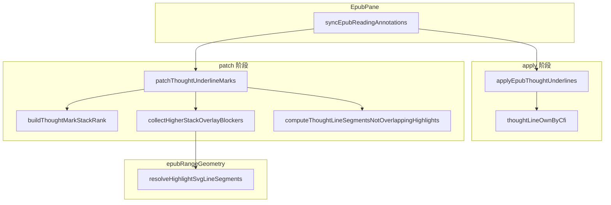

# 公开书多人想法虚线叠层修复 — 实现说明

> **状态**：已落地  
> **日期**：2026-07-02  
> **需求摘要**：公开书合并书主/读者想法后，正文虚线出现断续、灰橙双线叠加；须按叠层 spec 由上层盖住下层，重叠区只显示一条虚线。

## 延伸阅读

- [ideas/EPUB公开想法下划线修复.md](../ideas/epub/EPUB公开想法下划线修复.md) — 规划态排查时间线与架构图
- [EPUB想法部分重叠.md](./EPUB想法部分重叠.md) — 私有书单用户部分重叠去重（旧 `thoughtBlockers` 链）
- [EPUB想法用户划线重叠.md](./EPUB想法用户划线重叠.md) — 想法虚线与用户划线叠加
- [developer/EPUB标注分层共享.md](./developer/EPUB标注分层共享.md) — sync 编排总览

---

## 0. 读本文你将得到什么

- 公开书场景下 **三个递进故障** 的根因与修复路径
- **`patchThoughtUnderlineMarks`** 如何从「同作者 thoughtBlocker 链」改为 **叠层 rank + CFI 投影扣减**
- **`applyEpubThoughtUnderlines`** 如何写入本人/他人色与 `thoughtLineOwnByCfi`，以及 DOM 失步防御
- **`syncEpubReadingAnnotations`** 如何传入 `currentUserId` 并 invalidate 想法 mark
- 验收与回归要点

---

## 1. 背景与目标

### 1.1 问题

电子书 **公开分享** 后，阅读页会合并 **书主想法 + 读者本人想法**（及书主读源书时的读者公开想法）。每条想法对应一条 `annotations.underline` mark（`g.moke-epub-thought-ul`）。私有书时代仅单人想法，旧 patch 逻辑可用；公开书引入：

| 现象 | 用户感知 |
|------|----------|
| 断续橙点、几乎无线 | 写了想法但正文像坏掉 |
| 灰 `#797673` 与橙 `#d97706` 双线叠在同一行 | 本人想法未「盖住」他人 |
| 本人两条交叉想法仍双线 | 与私有书「部分重叠只一条线」不一致 |

### 1.2 目标（对齐 ebook-share §5.3）

叠层：**他人想法虚线 → 本人想法虚线 → 本人用户划线**。重叠区下层 **不绘制** 虚线段（非仅靠 z-index 半透明盖住）。

### 1.3 改动范围

| 路径 | 改动 |
|------|------|
| `apps/frontend/src/views/ebook/utils/epub/mark/epubThoughtAnnotations.ts` | 主改 |
| `apps/frontend/src/views/ebook/utils/epub/mark/epubUserHighlights.ts` | sync 入口 + `currentUserId` 透传 |
| `apps/frontend/src/views/ebook/components/reader/EpubPane.tsx` | 已传 `currentUserId`（本轮依赖，无新增逻辑） |

后端 `listThoughts` 合并 **无改动**；本修复纯 **marks-pane patch 几何**。

---

## 2. 实现思路

### 2.1 根因链

1. **旧 `thoughtLineBlockerSources`**：按绘制顺序登记已画虚线段，后画 mark 扣减。公开书多人同段 CFI 略不同却被判 **严格嵌套** 时，后画 mark 每行被 **整行扣光** → 断续点状（`stroke-dasharray: 1 6` 残段）。
2. **仅用 rect 属性互扣**：不同 `g` 的 `rect.x/y` **不在同一坐标系**，`horizontalSvgOverlap` 失效 → 灰橙叠线。
3. **仅 restack z-index**：dash 半透明，下层仍可见。

### 2.2 最终方案

| 步骤 | 做法 |
|------|------|
| Apply | `thoughtLineOwnByCfi`；本人 `#d97706`、他人 `#797673`；`appliedRef` 签名含 `lineOwn`；DOM 在才 skip |
| Rank | `buildThoughtMarkStackRank`：他人 < 本人；同 tier 长选区 < 短选区 |
| Patch | `collectHigherStackOverlayBlockers`：`resolveHighlightSvgLineSegments(rend, item.groupEl, other.cfi)` 投影到 **当前 group** |
| 扣减 | `computeThoughtLineSegmentsNotOverlappingHighlights(thoughtLocal, [...userBlockers, ...stackBlockers])` |
| Sync | `invalidateAppliedThoughtUnderlinesMissingDom` + `currentUserId` |

### 2.3 关键决策

| 决策 | 选用 | 不选 |
|------|------|------|
| 跨 mark 几何 | CFI 投影到当前 group | 直接读他组 rect |
| 覆盖语义 | 下层不画重叠段 | 仅 z-index |
| 跨用户嵌套 CFI | rank（本人>他人），不按嵌套互扣 | 恢复全局 `thoughtBlockers` |

---

## 3. 架构图



**图内方法说明**：

| 方法 | 功能 |
|------|------|
| `syncEpubReadingAnnotations` | invalidate → apply 用户线/想法线 → 注入 userBlockers → `runEpubReadingAnnotationPatch` |
| `applyEpubThoughtUnderlines` | 创建 underline mark，维护 `thoughtLineOwnByCfi` 与颜色 data |
| `patchThoughtUnderlineMarks` | 遍历想法 g，算线段并写 SVG line |
| `buildThoughtMarkStackRank` | 生成叠层序号，大序号在上 |
| `collectHigherStackOverlayBlockers` | 将更高 rank 的 CFI 投影到当前 group，收集相交 blocker |
| `resolveHighlightSvgLineSegments` | CFI→DOM Range→clientRect→marks-pane 局部坐标 |

**读图要点**：Apply 只挂 mark；可见虚线在 Patch 用 `<line>` 重画。几何与叠层策略分离。

---

## 4. 关键代码对比与注释

### 4.1 `patchThoughtUnderlineMarks`（`epubThoughtAnnotations.ts`）

**对比范围**：函数全量（patch 扣减主路径）。

**改动前** · `apps/frontend/src/views/ebook/utils/epub/mark/epubThoughtAnnotations.ts`（基线，约 L504–L569）

```typescript
// 在指定文档根下修正所有想法下划线 mark 的可见虚线段
function patchThoughtUnderlineMarks(
	// 默认从 document 查询；iframe 内由 patchAllThoughtUnderlineMarks 传入 content document
	root: ParentNode = document,
	// epub.js Rendition，用于 resolveMarkSvgLineSegments 校正多行几何
	rend?: Rendition,
): void {
	// 收集当前文档内所有想法 underline 的 SVG 分组节点
	const groupEls = [
		...root.querySelectorAll(
			`g.${EPUB_THOUGHT_UNDERLINE_CLASS}, g[ref="${EPUB_THOUGHT_UNDERLINE_CLASS}"]`,
		),
	] as SVGElement[];
	// 无任何 mark 则提前返回，避免后续空转
	if (groupEls.length === 0) return;

	// 逐个 group 准备 rect/line 与 showLine 等运行时状态
	const prepared = groupEls.map((groupEl) =>
		prepareThoughtUnderlineMark(groupEl, rend),
	);

	// 较短选区先画；用户划线 blocker 扣重叠段，thoughtBlockers 扣想法间重叠
	const thoughtLineBlockerSources: UserHighlightBlockerSource[] = [];
	// 每个 groupEl 对应一组「每行 rect → 虚线段数组」
	const lineSegmentsByGroup = new Map<SVGElement, ThoughtLineSegment[][]>();
	// 按较短选区优先排序，决定 thoughtBlocker 登记顺序
	const drawOrder = [...prepared].sort(compareThoughtMarksForLineDrawOrder);

	// 按绘制顺序处理每个想法 mark
	for (const item of drawOrder) {
		// 当前 mark 下每一行 rect 计算出的可绘制线段
		const perRectSegments: ThoughtLineSegment[][] = [];

		// 遍历该 mark 的每一行热区 rect
		for (const rect of item.rects) {
			// 将 SVG rect 属性解析为局部坐标结构
			const thoughtLocal = parseSvgMarkRect(rect);
			// 解析失败则该行不画线
			if (!thoughtLocal) {
				perRectSegments.push([]);
				continue;
			}

			// 收集与该行相交的用户划线 blocker（背景/直线/波浪）
			const userBlockers = getHighlightBlockerRectsForThought(
				thoughtLocal,
				userHighlightBlockerSources,
			);
			// 收集与该行相交的、已先绘制的想法虚线 blocker
			const thoughtBlockers = getHighlightBlockerRectsForThought(
				thoughtLocal,
				thoughtLineBlockerSources,
			);
			// 合并 blocker 后做水平区间减法，得到可见虚线段
			const segments = item.showLine
				? computeThoughtLineSegmentsNotOverlappingHighlights(thoughtLocal, [
						...userBlockers,
						...thoughtBlockers,
					])
				: [];
			perRectSegments.push(segments);

			// 若本行有可见段，登记到 thoughtLineBlockerSources 供后续 mark 扣减
			if (item.showLine && segments.length > 0) {
				appendThoughtLineBlockerRects(
					thoughtLineBlockerSources,
					item.cfi,
					thoughtLocal,
					segments,
				);
			}
		}

		lineSegmentsByGroup.set(item.groupEl, perRectSegments);
	}

	// 第二遍：将计算好的线段写入 SVG line 元素
	for (const item of prepared) {
		applyThoughtUnderlineLineSegments(
			item,
			lineSegmentsByGroup.get(item.groupEl) ?? [],
		);
	}
}
```

**改动后** · `apps/frontend/src/views/ebook/utils/epub/mark/epubThoughtAnnotations.ts`（当前，约 L626–L683）

```typescript
// 在指定文档根下修正所有想法下划线 mark 的可见虚线段
function patchThoughtUnderlineMarks(
	root: ParentNode = document,
	rend?: Rendition,
): void {
	const groupEls = [
		...root.querySelectorAll(
			`g.${EPUB_THOUGHT_UNDERLINE_CLASS}, g[ref="${EPUB_THOUGHT_UNDERLINE_CLASS}"]`,
		),
	] as SVGElement[];
	if (groupEls.length === 0) return;

	const prepared = groupEls.map((groupEl) =>
		prepareThoughtUnderlineMark(groupEl, rend),
	);
	// 按他人<本人、长<短生成叠层序号；序号越大越在上层
	const rankByGroup = buildThoughtMarkStackRank(prepared);

	const lineSegmentsByGroup = new Map<SVGElement, ThoughtLineSegment[][]>();

	// 绘制顺序不再影响扣减；每个 mark 独立收集「更高叠层」blocker
	for (const item of prepared) {
		const perRectSegments: ThoughtLineSegment[][] = [];

		for (const rect of item.rects) {
			const thoughtLocal = parseSvgMarkRect(rect);
			if (!thoughtLocal) {
				perRectSegments.push([]);
				continue;
			}

			const userBlockers = getHighlightBlockerRectsForThought(
				thoughtLocal,
				userHighlightBlockerSources,
			);
			// 将更高 rank 想法的 CFI 投影到当前 group，得到同坐标系 blocker
			const stackBlockers = collectHigherStackOverlayBlockers(
				item,
				thoughtLocal,
				prepared,
				rankByGroup,
				rend,
			);
			const segments = item.showLine
				? computeThoughtLineSegmentsNotOverlappingHighlights(thoughtLocal, [
					...userBlockers,
					...stackBlockers,
				])
				: [];
			perRectSegments.push(segments);
		}

		lineSegmentsByGroup.set(item.groupEl, perRectSegments);
	}

	for (const item of prepared) {
		applyThoughtUnderlineLineSegments(
			item,
			lineSegmentsByGroup.get(item.groupEl) ?? [],
		);
	}
}
```

**变更摘要**：移除 `thoughtLineBlockerSources` / `appendThoughtLineBlockerRects` / `drawOrder`；改为 `rankByGroup` + `collectHigherStackOverlayBlockers`（CFI 投影）。

---

### 4.2 `collectHigherStackOverlayBlockers`（纯新增）

**改动后** · `apps/frontend/src/views/ebook/utils/epub/mark/epubThoughtAnnotations.ts`（当前，约 L534–L560）

```typescript
// 将更高叠层 mark 的 CFI 投影到当前 group 坐标系，扣减下层虚线避免双线叠加
function collectHigherStackOverlayBlockers(
	// 正在计算虚线的当前 mark
	item: PreparedThoughtMark,
	// 当前行 rect 的局部坐标
	thoughtLocal: SvgLocalRect,
	// 同文档内全部已 prepare 的 mark
	prepared: PreparedThoughtMark[],
	// groupEl → 叠层序号（越大越在上）
	rankByGroup: Map<SVGElement, number>,
	rend?: Rendition,
): SvgLocalRect[] {
	// 当前 mark 的叠层序号，默认 0
	const itemRank = rankByGroup.get(item.groupEl) ?? 0;
	// 与当前行相交、且应扣减当前行虚线的 blocker 矩形列表
	const blockers: SvgLocalRect[] = [];
	// 遍历所有其它 mark
	for (const other of prepared) {
		// 跳过自身
		if (other.groupEl === item.groupEl) continue;
		// 其它 mark 的叠层序号
		const otherRank = rankByGroup.get(other.groupEl) ?? 0;
		// 仅更高叠层才能挡住当前层；同级或更低不扣
		if (otherRank <= itemRank) continue;

		// 关键：把 other 的 CFI 解析到 item.groupEl 所属 marks-pane 坐标系
		const segments =
			rend && other.cfi
				? resolveHighlightSvgLineSegments(rend, item.groupEl, other.cfi)
				: readMarkSvgLineSegmentsFromRects(other.groupEl);
		// 逐行判断是否与当前 thoughtLocal 在 y/x 上相交
		for (const seg of segments) {
			if (horizontalSvgOverlap(thoughtLocal, seg)) {
				blockers.push(seg);
			}
		}
	}
	return blockers;
}
```

---

### 4.3 `applyEpubThoughtUnderlines`（`epubThoughtAnnotations.ts`）

**对比范围**：导出函数全量。

**改动前** · 基线，约 L852–L903

```typescript
/**
 * 仅同步下划线批注（thoughts 变化时调用，不重复注册 hooks）
 * ponytail: 每条想法都画可见虚线；嵌套/重叠由 patch 短选区先画 + thoughtBlockers 去重。
 */
export function applyEpubThoughtUnderlines(
	rend: Rendition,
	thoughts: EbookThought[],
	appliedRef: Map<string, string>,
): void {
	try {
		ensureThoughtUnderlineStyles();
	} catch {
		return;
	}

	const grouped = groupThoughtsByCfi(thoughts);
	const nextCfis = new Set(grouped.keys());

	for (const cfiRange of [...appliedRef.keys()]) {
		if (!nextCfis.has(cfiRange)) {
			try {
				rend.annotations.remove(cfiRange, 'underline');
			} catch {
				// ignore
			}
			appliedRef.delete(cfiRange);
		}
	}

	const sortedEntries = sortCfiGroupsForUnderlineStack([...grouped.entries()]);

	for (const [cfiRange, group] of sortedEntries) {
		const thoughtIds = group.map((t) => t.id);
		const showLine = true;
		const nextSig = buildThoughtUnderlineSignature(thoughtIds, showLine);
		if (appliedRef.get(cfiRange) === nextSig) continue;

		try {
			rend.annotations.remove(cfiRange, 'underline');
			rend.annotations.underline(
				cfiRange,
				{
					thoughtIds,
					[THOUGHT_MARK_DATA_SHOW_LINE]: showLine ? '1' : '0',
				},
				undefined,
				EPUB_THOUGHT_UNDERLINE_CLASS,
				EPUB_THOUGHT_UNDERLINE_STYLES,
			);
			appliedRef.set(cfiRange, nextSig);
		} catch {
			appliedRef.delete(cfiRange);
		}
	}
}
```

**改动后** · 当前，约 L956–L1033

```typescript
/**
 * 仅同步下划线批注（thoughts 变化时调用，不重复注册 hooks）
 * ponytail: 每条想法都画可见虚线；重叠由 patch 按叠层优先级 + CFI 投影扣减。
 */
export function applyEpubThoughtUnderlines(
	rend: Rendition,
	thoughts: EbookThought[],
	appliedRef: Map<string, string>,
	// 当前登录用户 id，用于本人/他人色与 thoughtLineOwnByCfi
	currentUserId = 0,
): void {
	try {
		ensureThoughtUnderlineStyles();
	} catch {
		return;
	}

	const grouped = groupThoughtsByCfi(thoughts);
	const nextCfis = new Set(grouped.keys());
	const nextOwnByCfi = new Map<string, boolean>();

	for (const [cfiRange, group] of grouped) {
		nextOwnByCfi.set(
			cfiRange,
			group.some((t) => t.userId === currentUserId),
		);
	}
	for (const key of [...thoughtLineOwnByCfi.keys()]) {
		if (!nextOwnByCfi.has(key)) thoughtLineOwnByCfi.delete(key);
	}
	for (const [cfi, own] of nextOwnByCfi) {
		thoughtLineOwnByCfi.set(cfi, own);
	}

	for (const cfiRange of [...appliedRef.keys()]) {
		if (!nextCfis.has(cfiRange)) {
			try {
				rend.annotations.remove(cfiRange, 'underline');
			} catch {
				// ignore
			}
			appliedRef.delete(cfiRange);
		}
	}

	const sortedEntries = sortCfiGroupsForUnderlineStack([...grouped.entries()]);

	for (const [cfiRange, group] of sortedEntries) {
		const thoughtIds = group.map((t) => t.id);
		const showLine = true;
		const lineOwn = group.some((t) => t.userId === currentUserId);
		const nextSig = `${buildThoughtUnderlineSignature(thoughtIds, showLine)}|${lineOwn ? '1' : '0'}`;
		if (
			appliedRef.get(cfiRange) === nextSig &&
			isThoughtUnderlineMarkPresent(rend, cfiRange)
		) {
			continue;
		}

		try {
			rend.annotations.remove(cfiRange, 'underline');
			rend.annotations.underline(
				cfiRange,
				{
					thoughtIds,
					[THOUGHT_MARK_DATA_SHOW_LINE]: showLine ? '1' : '0',
					[THOUGHT_MARK_DATA_LINE_OWN]: lineOwn ? '1' : '0',
				},
				undefined,
				EPUB_THOUGHT_UNDERLINE_CLASS,
				{
					...EPUB_THOUGHT_UNDERLINE_STYLES,
					stroke: resolveThoughtLineColor(group, currentUserId),
				},
			);
			appliedRef.set(cfiRange, nextSig);
		} catch {
			appliedRef.delete(cfiRange);
		}
	}
}
```

**变更摘要**：新增 `currentUserId`、`thoughtLineOwnByCfi`、他人色 data、签名含 `lineOwn`、skip 前校验 DOM 存在。

---

### 4.4 `syncEpubReadingAnnotations`（`epubUserHighlights.ts`）

**对比范围**：导出函数全量。

**改动前** · 基线，约 L2479–L2507

```typescript
export function syncEpubReadingAnnotations(
	rend: Rendition,
	thoughts: EbookThought[],
	highlights: EbookUserHighlight[],
	appliedThoughtsRef: Map<string, string>,
	appliedHighlightsRef: Map<string, string>,
): void {
	beginEpubAnnotationSyncScope();
	try {
		invalidateAppliedUserHighlightsMissingDom(rend, appliedHighlightsRef);
		setUserHighlightBlockerSourcesForThoughtPatch([]);
		const highlightPlan = buildHighlightRenderPlan(rend, highlights);
		applyEpubUserHighlights(
			rend,
			highlights,
			appliedHighlightsRef,
			highlightPlan,
		);
		applyEpubThoughtUnderlines(rend, thoughts, appliedThoughtsRef);
		setUserHighlightBlockerSourcesForThoughtPatch(
			collectUserHighlightBlockerSources(rend),
		);
		runEpubReadingAnnotationPatch(rend);
	} finally {
		endEpubAnnotationSyncScope();
	}
}
```

**改动后** · 当前，约 L2480–L2512

```typescript
export function syncEpubReadingAnnotations(
	rend: Rendition,
	thoughts: EbookThought[],
	highlights: EbookUserHighlight[],
	appliedThoughtsRef: Map<string, string>,
	appliedHighlightsRef: Map<string, string>,
	currentUserId = 0,
): void {
	beginEpubAnnotationSyncScope();
	try {
		invalidateAppliedUserHighlightsMissingDom(rend, appliedHighlightsRef);
		invalidateAppliedThoughtUnderlinesMissingDom(rend, appliedThoughtsRef);
		setUserHighlightBlockerSourcesForThoughtPatch([]);
		const highlightPlan = buildHighlightRenderPlan(rend, highlights);
		applyEpubUserHighlights(
			rend,
			highlights,
			appliedHighlightsRef,
			highlightPlan,
		);
		applyEpubThoughtUnderlines(
			rend,
			thoughts,
			appliedThoughtsRef,
			currentUserId,
		);
		setUserHighlightBlockerSourcesForThoughtPatch(
			collectUserHighlightBlockerSources(rend),
		);
		runEpubReadingAnnotationPatch(rend);
	} finally {
		endEpubAnnotationSyncScope();
	}
}
```

**变更摘要**：增加想法 mark DOM invalidate；`applyEpubThoughtUnderlines` 传入 `currentUserId`。

---

## 5. 兼容性与影响

| 场景 | 影响 |
|------|------|
| 私有书仅本人想法 | rank 仅一层本人，行为与旧版一致 |
| 用户划线 | 仍通过 `userHighlightBlockerSources` 盖住想法虚线，不变 |
| 听书播放背景 | 独立层，无交叉 |
| 翻页 `relocated` | 仅 patch；依赖 `thoughtLineOwnByCfi` + `dataset.thought-line-own` |
| 性能 | 单页 mark 数通常 <50，投影 O(n²) 可接受 |

---

## 6. 验收清单

| # | 步骤 | 期望 |
|---|------|------|
| AC1 | 读者在书主已标注段写本人公开发送想法 | 重叠行仅橙色虚线 |
| AC2 | 同段仅他人想法 | 完整灰色虚线，非断续点 |
| AC3 | 本人两条部分交叉想法 | 交叉区一条虚线 |
| AC4 | 翻章后返回 | 叠层仍正确 |
| AC5 | 同段用户高亮 | 高亮压住虚线（原设计） |

---

## 7. 相关源码路径

| 说明 | 路径 |
|------|------|
| 想法 patch / apply | `apps/frontend/src/views/ebook/utils/epub/mark/epubThoughtAnnotations.ts` |
| 联合 sync | `apps/frontend/src/views/ebook/utils/epub/mark/epubUserHighlights.ts` |
| CFI 投影 | `apps/frontend/src/views/ebook/utils/epub/mark/epubRangeGeometry.ts` |
| Pane 传参 | `apps/frontend/src/views/ebook/components/reader/EpubPane.tsx` |

---

（若与仓库最新源码不一致，以源码为准。）
