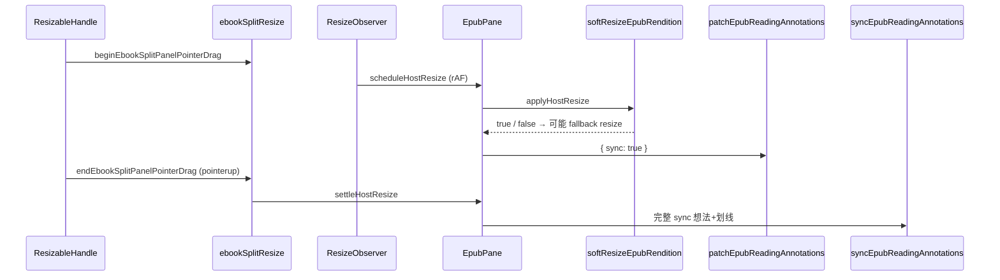

# EPUB 分栏拖拽：soft resize 与划线 patch 协同

## 文档角色

**增量专题**：读书页左右分栏拖拽手柄时，左侧 EPUB 阅读区宽度连续变化。旧实现每次 `ResizeObserver` 触发都调用 `rendition.resize()`，会 **清空 view 并重载章节**，连续拖拽出现 **白屏/闪烁**；新实现用 `softResizeEpubRendition` 只更新 stage 尺寸与 layout，拖拽结束再 `syncEpubReadingAnnotations` 做完整同步，拖拽过程中用 `patchEpubReadingAnnotations(rend, { sync: true })` 恢复用户划线样式。

**姊妹文档**：[EPUB注释同步性能.md](./EPUB注释同步性能.md)（patch 快路径与 sync 性能）、[EPUB想法引用划线切换.md](./EPUB想法引用划线切换.md)（侧栏引用划线判定）、[EPUB想法列表UI.md](./EPUB想法列表UI.md)（想法列表 UI，分栏同栏位）、[EPUB窗口尺寸重布局影响.md](./EPUB窗口尺寸重布局影响.md)（窗口放大/全屏居中）。

**延伸阅读**：[EPUB用户划线实现.md](./EPUB用户划线实现.md)、[EPUB想法侧面板.md](./EPUB想法侧面板.md)。

---

## 1. 背景与目标

### 1.1 问题

| 现象 | 触发 |
| ---- | ---- |
| 拖拽分栏手柄时 EPUB **白屏或章节重载** | `ResizeObserver` → `rendition.resize()` |
| 拖拽过程中 **用户彩色划线消失**（下划线仍可见） | soft resize 触发 `marks-pane.render()` 重建 rect（无 fill） |
| 程序化开关侧栏后排版未及时对齐 | 无「布局稳定」统一回调 |

### 1.2 目标

- 分栏 **pointer 拖拽期间**：优先 **soft resize**，避免 `resize()` 清 view。
- 每次尺寸变化：**rAF 合并** ResizeObserver 回调；soft resize 后立即 **同步 patch** 划线样式。
- **拖拽结束 / 侧栏开关稳定后**：`syncEpubReadingAnnotations` 完整同步想法与用户划线。
- soft resize 不可用时（内部 API 缺失）：**回退** `rendition.resize()`。

---

## 2. 改动范围

| 路径 | 变更要点 |
| ---- | -------- |
| `apps/frontend/src/views/ebook/utils/epubSoftResize.ts` | **新增** `softResizeEpubRendition` |
| `apps/frontend/src/views/ebook/utils/ebookSplitResize.ts` | **新增** 分栏拖拽信号与 `resizeEnd` 订阅 |
| `apps/frontend/src/views/ebook/utils/epubUserHighlights.ts` | `patchEpubReadingAnnotations` 增加 `{ sync?: boolean }` |
| `apps/frontend/src/views/ebook/components/EpubPane.tsx` | rAF + soft resize + patch + settle + 订阅 `resizeEnd` |
| `apps/frontend/src/views/ebook/components/EbookReadSplitLayout.tsx` | 手柄 `pointerdown/up`、侧栏开关后 `notifyEbookSplitPanelResizeEnd` |

**未改动**：`syncEpubReadingAnnotations` 主链路逻辑、`ResizablePanelGroup` 比例持久化（`lastSplitLayoutRef`）。

---

## 3. 实现思路

1. **为何不用 `rendition.resize()` 跟拖拽**：epub.js 的 `resize()` 会 destroy 当前 view 再 render，高频调用导致白屏；内部 `manager.stage.size` + `updateLayout()` 可在 **保留已渲染 iframe** 的前提下改排版（见 `epubSoftResize.ts` 注释）。
2. **分栏信号模块**：`ebookSplitResize.ts` 用模块级 ref + `Set` 监听器，解耦 `EbookReadSplitLayout`（发信号）与 `EpubPane`（消费 settle），避免 prop drilling。
3. **拖拽生命周期**：`ResizableHandle.onPointerDown` → `beginEbookSplitPanelPointerDrag`；`window pointerup/cancel` 或 `onLayoutChanged` → `endEbookSplitPanelPointerDrag` → 通知所有 `subscribeEbookSplitPanelResizeEnd` 订阅者。
4. **EpubPane 三阶段**：
   - `scheduleHostResize`：ResizeObserver → 取消_pending rAF → 下一帧 `applyHostResize`；
   - `applyHostResize`：`softResizeEpubRendition`（失败则 `resize`）→ `patchEpubReadingAnnotations(rend, { sync: true })`；
   - `settleHostResize`（仅 resizeEnd）：再 `applyHostResize` + `syncEpubReadingAnnotations`。
5. **patch `sync: true`**：取消排队中的 patch rAF，**同步**执行 `runEpubReadingAnnotationPatch`，避免拖拽帧内划线样式落后一帧（与 [EPUB注释同步性能.md](./EPUB注释同步性能.md) 中 defer 路径互补）。



---

## 4. 关键代码对比与注释

### 4.1 `softResizeEpubRendition`（`epubSoftResize.ts`）

**对比范围**：完整导出函数（**基线中不存在，纯新增**）。

**改动后** · `apps/frontend/src/views/ebook/utils/epubSoftResize.ts`（当前，约 L1–L47）

```typescript
// 从 epubjs 引入 Rendition 类型，供 soft resize 入参标注
import type { Rendition } from 'epubjs';

// 描述 epub.js 内部 view manager 上 soft resize 所需的最小 API 形状
type EpubViewManager = {
	// stage 子对象，负责 iframe 舞台尺寸
	stage?: {
		// 设置舞台宽高并返回实际生效尺寸
		size: (
			width?: number | null,
			height?: number | null,
		) => { width: number; height: number };
	};
	// 上一次 stage 尺寸缓存，用于短路相同尺寸
	_stageSize?: { width: number; height: number };
	// 触发布局重算而不销毁 view
	updateLayout: () => void;
};

/**
 * 在不 clear 已有 view 的前提下更新 EPUB 排版。
 * rendition.resize() 会清空视图并重载章节，连续调用会白屏；拖拽分栏应优先走此路径。
 */
// 导出：对 rendition 做「软」尺寸更新，成功返回 true
export function softResizeEpubRendition(
	// 当前 EPUB rendition 实例
	rend: Rendition,
	// 目标宽度（CSS 像素）
	width: number,
	// 目标高度（CSS 像素）
	height: number,
// 返回是否成功走 soft 路径（含尺寸未变短路）
): boolean {
	// 从 rendition 上取出内部 manager（epub.js 未公开的类型，需断言）
	const manager = (rend as unknown as { manager?: EpubViewManager }).manager;
	// manager 缺少 stage.size 或 updateLayout 时无法 soft resize
	if (!manager?.stage?.size || typeof manager.updateLayout !== 'function') {
		// 告知调用方应回退 rendition.resize()
		return false;
	}

	// 宽度取整且至少 1px，避免 0 导致 layout 异常
	const w = Math.max(Math.floor(width), 1);
	// 高度同样取整且至少 1px
	const h = Math.max(Math.floor(height), 1);
	// 读取 manager 缓存的上一帧 stage 尺寸
	const prev = manager._stageSize;
	// 与目标完全一致则跳过 DOM 写操作，仍视为成功
	if (prev && prev.width === w && prev.height === h) {
		// 尺寸未变，无需 updateLayout
		return true;
	}

	// soft resize 主体：写 settings、stage.size、updateLayout
	try {
		// 断言 rendition.settings 可写 width/height
		const rendition = rend as unknown as {
			settings: { width?: number; height?: number };
		};
		// 同步 epub.js 内部 settings，与 stage 一致
		rendition.settings.width = w;
		// 同步高度到 settings
		rendition.settings.height = h;
		// 更新 iframe 舞台物理尺寸
		manager.stage.size(w, h);
		// 在不 destroy view 的情况下重排分页/滚动
		manager.updateLayout();
		// soft 路径完成
		return true;
	} catch {
		// 任意内部异常时回退由调用方处理
		return false;
	}
}
```

**变更摘要**：新增工具函数；通过 manager 内部 API 绕过 `resize()` 的清 view 行为。

---

### 4.2 分栏 resize 信号（`ebookSplitResize.ts`）

**对比范围**：整文件导出（**基线中不存在，纯新增**）。

**改动后** · `apps/frontend/src/views/ebook/utils/ebookSplitResize.ts`（当前，约 L1–L28）

```typescript
// 模块级 ref：分栏手柄 pointer 拖拽进行中时为 true
/** 分栏手柄拖拽期间为 true */
export const ebookSplitPanelResizingRef = { current: false };

// 布局稳定（拖拽结束）后的订阅者集合
const resizeEndListeners = new Set<() => void>();

// 注册分栏拖拽结束后的回调，返回取消订阅函数
/** 注册分栏布局稳定后的回调（返回取消订阅函数） */
export function subscribeEbookSplitPanelResizeEnd(listener: () => void) {
	// 将 listener 加入 Set
	resizeEndListeners.add(listener);
	// 返回 unsubscribe，供 useEffect cleanup 使用
	return () => {
		// 组件卸载或 effect 重跑时移除 listener
		resizeEndListeners.delete(listener);
	};
}

// 遍历并调用所有 resizeEnd 订阅者（如 EpubPane.settleHostResize）
export function notifyEbookSplitPanelResizeEnd() {
	// 依次 invoke 每个 listener
	for (const listener of resizeEndListeners) {
		// 单个订阅者执行 settle/sync
		listener();
	}
}

// 手柄 pointerdown：标记拖拽开始
export function beginEbookSplitPanelPointerDrag() {
	// 置 true，可供其它模块查询「是否正在拖分栏」
	ebookSplitPanelResizingRef.current = true;
}

// 手柄 pointerup/cancel：结束拖拽并广播 resizeEnd
export function endEbookSplitPanelPointerDrag() {
	// 若未在拖拽态则 no-op，避免重复 notify
	if (!ebookSplitPanelResizingRef.current) return;
	// 清除拖拽标记
	ebookSplitPanelResizingRef.current = false;
	// 触发所有 settle 回调
	notifyEbookSplitPanelResizeEnd();
}
```

**变更摘要**：轻量 pub/sub，连接分栏 UI 与 EpubPane 的「布局稳定后 full sync」。

---

### 4.3 `patchEpubReadingAnnotations` 的 `sync` 选项（`epubUserHighlights.ts`）

**对比范围**：`patchEpubReadingAnnotations` 完整函数。

**改动前** · `apps/frontend/src/views/ebook/utils/epubUserHighlights.ts`（基线 HEAD，约 L2337–L2357）

```typescript
// 滚动/翻页后仅 patch 样式，不 remove+readd（避免闪烁）
/** 滚动/翻页后仅 patch 样式，不 remove+readd（避免闪烁） */
export function patchEpubReadingAnnotations(
	// 当前 rendition
	rend: Rendition,
	// 可选：defer 双 rAF 全量 patch
	options?: { defer?: boolean },
// 无返回值，异步或下一帧执行 patch
): void {
	// defer 为 true 时标记 pending 全量 patch（content 加载后）
	if (options?.defer) {
		// 置位，供内层 rAF 消费
		pendingReadingAnnotationFullPatch = true;
	}

	// 取消尚未执行的 patch rAF，合并多次调度
	cancelAnimationFrame(readingAnnotationPatchRaf);
	// 下一帧执行 patch 逻辑
	readingAnnotationPatchRaf = requestAnimationFrame(() => {
		// 若 pending 全量 patch，再走一层 rAF（等内容稳定）
		if (pendingReadingAnnotationFullPatch) {
			// 清除 pending 标志
			pendingReadingAnnotationFullPatch = false;
			// 第二层 rAF 再 run patch
			readingAnnotationPatchRaf = requestAnimationFrame(() => {
				// 执行 SVG/rect 样式修复
				runEpubReadingAnnotationPatch(rend);
			});
			// 结束 defer 双 rAF 分支
			return;
		}
		// 常规定帧 patch
		runEpubReadingAnnotationPatch(rend);
	});
}
```

**改动后** · `apps/frontend/src/views/ebook/utils/epubUserHighlights.ts`（当前，约 L2337–L2365）

```typescript
// 滚动/翻页后仅 patch 样式，不 remove+readd（避免闪烁）
/** 滚动/翻页后仅 patch 样式，不 remove+readd（避免闪烁） */
export function patchEpubReadingAnnotations(
	// 当前 rendition
	rend: Rendition,
	// 可选：defer 双 rAF；sync 同步立即 patch（分栏 soft resize 用）
	options?: { defer?: boolean; sync?: boolean },
// 无返回值
): void {
	// sync 为 true：取消排队 rAF，当前帧立即 patch（拖拽 resize 需即时恢复划线 fill）
	if (options?.sync) {
		// 取消尚未执行的 patch rAF
		cancelAnimationFrame(readingAnnotationPatchRaf);
		// 重置 rAF id
		readingAnnotationPatchRaf = 0;
		// 清除 defer  pending 标志，避免后续误触发双 rAF
		pendingReadingAnnotationFullPatch = false;
		// 同步执行 patch，不等待下一帧
		runEpubReadingAnnotationPatch(rend);
		// 提前返回，不走下方 rAF 路径
		return;
	}

	// defer 为 true 时标记 pending 全量 patch
	if (options?.defer) {
		// 置位供内层 rAF 消费
		pendingReadingAnnotationFullPatch = true;
	}

	// 取消尚未执行的 patch rAF，合并多次调度
	cancelAnimationFrame(readingAnnotationPatchRaf);
	// 下一帧执行 patch 逻辑（与基线相同）
	readingAnnotationPatchRaf = requestAnimationFrame(() => {
		// 若 pending 全量 patch，再走一层 rAF
		if (pendingReadingAnnotationFullPatch) {
			// 清除 pending
			pendingReadingAnnotationFullPatch = false;
			// 第二层 rAF
			readingAnnotationPatchRaf = requestAnimationFrame(() => {
				// 执行 patch
				runEpubReadingAnnotationPatch(rend);
			});
			// 结束 defer 分支
			return;
		}
		// 常规定帧 patch
		runEpubReadingAnnotationPatch(rend);
	});
}
```

**变更摘要**：新增 `sync` 分支，供 EpubPane 在 soft resize 同一帧内恢复用户划线样式；原有 `defer` / 单 rAF 路径不变。

---

### 4.4 `EpubPane` host 尺寸响应（`EpubPane.tsx`）

**对比范围**：`useEffect` 打开 EPUB 后的 ResizeObserver 及相关 cleanup（`applyHostResize` / `scheduleHostResize` / `settleHostResize` 为改动后新增闭包）。

**改动前** · `apps/frontend/src/views/ebook/components/EpubPane.tsx`（基线 HEAD，约 L443–L454）

```typescript
		// 监听 host 容器尺寸变化
		const ro = new ResizeObserver(() => {
			// rendition 或 host 未就绪则跳过
			if (!readyRef.current || !hostRef.current || !rendRef.current) return;
			// 直接调用 epub.js resize，会清 view 并重载
			try {
				// 用 client 宽高触发完整 resize
				rendRef.current.resize(
					hostRef.current.clientWidth,
					hostRef.current.clientHeight,
				);
			} catch {
				// ignore
			}
		});
		// 开始观察 host 元素
		ro.observe(el);
```

**改动后** · `apps/frontend/src/views/ebook/components/EpubPane.tsx`（当前，约 L446–L495）

```typescript
		// 合并 ResizeObserver 触发的 rAF id，用于 cancel
		let resizeRaf: number | null = null;

		// 实际应用 host 尺寸：soft resize → fallback resize → sync patch
		const applyHostResize = () => {
			// host / ready / rendition 任一缺失则不处理
			if (!hostRef.current || !readyRef.current || !rendRef.current) return;
			// 宽度下限 320，与 paginated min 对齐
			const w = Math.max(hostRef.current.clientWidth, 320);
			// 高度下限 320
			const h = Math.max(hostRef.current.clientHeight, 320);
			// 局部变量便于多次使用
			const rend = rendRef.current;
			// 优先 soft resize，失败则回退 rendition.resize()
			if (!softResizeEpubRendition(rend, w, h)) {
				// soft 不可用或抛错时的回退路径
				try {
					// 完整 resize（可能清 view）
					rend.resize(w, h);
				} catch {
					// ignore
				}
			}
			// soft resize 会触发 marks-pane.render() 重建 highlight rect（无 fill）；
			// underline 自带 stroke 仍可见，用户划线需立即 patch 恢复样式
			patchEpubReadingAnnotations(rend, { sync: true });
		};

		// ResizeObserver 回调：合并到下一 animation frame
		const scheduleHostResize = () => {
			// 若已有 pending rAF 则取消，只保留最新一帧
			if (resizeRaf != null) cancelAnimationFrame(resizeRaf);
			// 下一帧执行 applyHostResize
			resizeRaf = requestAnimationFrame(() => {
				// 执行后清空 id
				resizeRaf = null;
				// 应用尺寸与 patch
				applyHostResize();
			});
		};

		// 分栏拖拽结束或侧栏开关稳定后：再 apply + full sync
		const settleHostResize = () => {
			// 先走与拖拽中相同的 apply（含 soft resize + sync patch）
			applyHostResize();
			// 再次取 rendition 引用
			const rend = rendRef.current;
			// 未就绪则不做 full sync
			if (!rend || !readyRef.current) return;
			// 完整同步想法虚线与用户划线（remove+readd 计划）
			syncEpubReadingAnnotations(
				rend,
				thoughtsRef.current ?? [],
				highlightsRef.current ?? [],
				appliedThoughtsRef.current,
				appliedHighlightsRef.current,
			);
		};

		// ResizeObserver：仅 schedule，不直接 resize
		const ro = new ResizeObserver(() => {
			// 合并到 rAF
			scheduleHostResize();
		});
		// 观察 host 根元素
		ro.observe(el);

		// 订阅分栏 resizeEnd，卸载时 unsub
		const unsubSplitResizeEnd = subscribeEbookSplitPanelResizeEnd(settleHostResize);

		// ... effect cleanup 中新增：cancel resizeRaf、unsubSplitResizeEnd（约 L493–L495）
```

**变更摘要**：由「Observer 直调 `resize()`」改为 rAF 合并 + soft resize + 即时 patch；拖拽/侧栏稳定后 `settleHostResize` 做 full sync。

---

### 4.5 `EbookReadSplitLayout` 分栏 pointer 与 resizeEnd（`EbookReadSplitLayout.tsx`）

**对比范围**：`EbookReadSplitLayout` 组件完整定义。

**改动前** · `apps/frontend/src/views/ebook/components/EbookReadSplitLayout.tsx`（基线 HEAD，约 L1–L77）

```typescript
// ReactNode 类型用于 children / sidePanel
import type { ReactNode } from 'react';
// useEffect / useRef 用于侧栏开关与 layout 记忆
import { useEffect, useRef } from 'react';
// react-resizable-panels 的 imperative handle 与 Layout 类型
import type { GroupImperativeHandle, Layout } from 'react-resizable-panels';
// 分栏 UI 组件
import {
	ResizableHandle,
	ResizablePanel,
	ResizablePanelGroup,
} from '@/components/ui/resizable';
// 条件 className 工具
import { cn } from '@/lib/utils';

// 组件 props：侧栏是否打开、侧栏内容、左侧阅读区 children
export type EbookReadSplitLayoutProps = {
	/** 右侧分栏是否展开（MOKE 助手或读书想法） */
	sidePanelOpen: boolean;
	sidePanel: ReactNode;
	children: ReactNode;
};

/**
 * 电子书阅读页分栏：左阅读、右 MOKE 助手 / 读书想法（互斥，同栏位）。
 */
// 分栏布局组件
export function EbookReadSplitLayout({
	sidePanelOpen,
	sidePanel,
	children,
}: EbookReadSplitLayoutProps) {
	// 面板组 imperative API，用于 setLayout
	const panelGroupRef = useRef<GroupImperativeHandle | null>(null);
	// 记住上次打开时的 reader/assistant 比例
	const lastSplitLayoutRef = useRef<Layout>({ reader: 58, assistant: 42 });

	// 侧栏开关变化时调整 layout
	useEffect(() => {
		// 关闭侧栏：阅读区占满
		if (!sidePanelOpen) {
			panelGroupRef.current?.setLayout({ reader: 100, assistant: 0 });
			// 提前 return，不恢复 lastSplit
			return;
		}
		// 打开侧栏：恢复上次比例
		panelGroupRef.current?.setLayout(lastSplitLayoutRef.current);
	}, [sidePanelOpen]);

	// 渲染水平分栏
	return (
		<ResizablePanelGroup
			id="ebook-read-split"
			orientation="horizontal"
			className="h-full min-h-0 min-w-0"
			groupRef={panelGroupRef}
			onLayoutChanged={(layout) => {
				// 仅侧栏打开时记忆 layout
				if (sidePanelOpen) lastSplitLayoutRef.current = layout;
			}}
		>
			<ResizablePanel
				id="reader"
				defaultSize={58}
				minSize={30}
				className="min-h-0 min-w-0"
			>
				{children}
			</ResizablePanel>
			<ResizableHandle
				withHandle
				className={cn('w-0', !sidePanelOpen && 'pointer-events-none opacity-0')}
			/>
			<ResizablePanel
				id="assistant"
				defaultSize={42}
				minSize={0}
				className={cn(
					'min-h-0 min-w-0',
					!sidePanelOpen && 'pointer-events-none opacity-0',
				)}
			>
				<div className="border-theme/10 flex h-full min-h-0 min-w-0 flex-col overflow-hidden border-l contain-[inline-size]">
					<div className="min-h-0 flex-1 overflow-hidden">
						{sidePanelOpen ? sidePanel : null}
					</div>
				</div>
			</ResizablePanel>
		</ResizablePanelGroup>
	);
}
```

**改动后** · `apps/frontend/src/views/ebook/components/EbookReadSplitLayout.tsx`（当前，约 L1–L108）

```typescript
// ReactNode 类型
import type { ReactNode } from 'react';
// 新增 useCallback；仍用 useEffect / useRef
import { useCallback, useEffect, useRef } from 'react';
// 分栏 imperative 类型
import type { GroupImperativeHandle, Layout } from 'react-resizable-panels';
// 分栏 UI
import {
	ResizableHandle,
	ResizablePanel,
	ResizablePanelGroup,
} from '@/components/ui/resizable';
// className 工具
import { cn } from '@/lib/utils';
// 分栏拖拽与 resizeEnd 信号
import {
	beginEbookSplitPanelPointerDrag,
	endEbookSplitPanelPointerDrag,
	notifyEbookSplitPanelResizeEnd,
} from '../utils/ebookSplitResize';

// props 与基线相同
export type EbookReadSplitLayoutProps = {
	/** 右侧分栏是否展开（MOKE 助手或读书想法） */
	sidePanelOpen: boolean;
	sidePanel: ReactNode;
	children: ReactNode;
};

/**
 * 电子书阅读页分栏：左阅读、右 MOKE 助手 / 读书想法（互斥，同栏位）。
 */
// 分栏布局组件（含 pointer 拖拽生命周期）
export function EbookReadSplitLayout({
	sidePanelOpen,
	sidePanel,
	children,
}: EbookReadSplitLayoutProps) {
	// 面板组 ref
	const panelGroupRef = useRef<GroupImperativeHandle | null>(null);
	// 上次 layout 记忆
	const lastSplitLayoutRef = useRef<Layout>({ reader: 58, assistant: 42 });
	// 本组件内：手柄 pointer 是否按下（与模块级 ref 配合）
	const splitPointerActiveRef = useRef(false);

	// 结束拖拽：清本地 flag 并调用 endEbookSplitPanelPointerDrag
	const finishSplitPointerDrag = useCallback(() => {
		// 未 active 则 no-op
		if (!splitPointerActiveRef.current) return;
		// 清本地 pointer 状态
		splitPointerActiveRef.current = false;
		// 模块级 end + notify resizeEnd 订阅者
		endEbookSplitPanelPointerDrag();
	}, []);

	// 全局 pointerup/cancel：防止手柄外松手未结束拖拽
	useEffect(() => {
		// 统一收尾函数
		const onPointerUp = () => finishSplitPointerDrag();
		// 监听 window pointerup
		window.addEventListener('pointerup', onPointerUp);
		// 监听 pointercancel（如系统手势打断）
		window.addEventListener('pointercancel', onPointerUp);
		// cleanup 移除监听
		return () => {
			window.removeEventListener('pointerup', onPointerUp);
			window.removeEventListener('pointercancel', onPointerUp);
		};
	}, [finishSplitPointerDrag]);

	// 侧栏开关：setLayout + 下一帧 notify resizeEnd（触发 EpubPane settle）
	useEffect(() => {
		// 关闭：阅读区 100%
		if (!sidePanelOpen) {
			panelGroupRef.current?.setLayout({ reader: 100, assistant: 0 });
		} else {
			// 打开：恢复记忆比例
			panelGroupRef.current?.setLayout(lastSplitLayoutRef.current);
		}
		// 程序化开关侧栏后补一次 EPUB 真 resize
		const raf = requestAnimationFrame(() => {
			// 广播 resizeEnd，EpubPane 执行 settleHostResize
			notifyEbookSplitPanelResizeEnd();
		});
		// effect cleanup 取消 pending rAF
		return () => cancelAnimationFrame(raf);
	}, [sidePanelOpen]);

	// 渲染分栏
	return (
		<ResizablePanelGroup
			id="ebook-read-split"
			orientation="horizontal"
			className="h-full min-h-0 min-w-0"
			groupRef={panelGroupRef}
			onLayoutChanged={(layout) => {
				// 侧栏打开时更新 lastSplitLayoutRef
				if (sidePanelOpen) lastSplitLayoutRef.current = layout;
				// layout 变化时也尝试结束 pointer 拖拽（库可能在 drag 结束触发）
				finishSplitPointerDrag();
			}}
		>
			<ResizablePanel
				id="reader"
				defaultSize={58}
				minSize={30}
				className="min-h-0 min-w-0"
			>
				{children}
			</ResizablePanel>
			<ResizableHandle
				withHandle
				className={cn('w-0', !sidePanelOpen && 'pointer-events-none opacity-0')}
				onPointerDown={() => {
					// 标记本地 pointer 按下
					splitPointerActiveRef.current = true;
					// 模块级 begin，ebookSplitPanelResizingRef.current = true
					beginEbookSplitPanelPointerDrag();
				}}
			/>
			<ResizablePanel
				id="assistant"
				defaultSize={42}
				minSize={0}
				className={cn(
					'min-h-0 min-w-0',
					!sidePanelOpen && 'pointer-events-none opacity-0',
				)}
			>
				<div className="border-theme/10 flex h-full min-h-0 min-w-0 flex-col overflow-hidden border-l contain-[inline-size]">
					<div className="min-h-0 flex-1 overflow-hidden">
						{sidePanelOpen ? sidePanel : null}
					</div>
				</div>
			</ResizablePanel>
		</ResizablePanelGroup>
	);
}
```

**变更摘要**：手柄 `pointerdown/up` 驱动 `ebookSplitResize`；侧栏 programmatic 开关后 rAF `notifyEbookSplitPanelResizeEnd`；`onLayoutChanged` 补充 `finishSplitPointerDrag`。

---

## 5. 行为变化与兼容性

| 场景 | 改动前 | 改动后 |
| ---- | ------ | ------ |
| 拖拽分栏手柄 | 每帧 `resize()`，易白屏 | 优先 `softResizeEpubRendition`，拖拽中 sync patch |
| 松手 / layout 稳定 | 无统一 settle | `syncEpubReadingAnnotations` full sync |
| 开关侧栏（无拖拽） | 仅 `setLayout` | 下一帧 `notifyEbookSplitPanelResizeEnd` → settle |
| soft API 不可用 | N/A（总是 resize） | 回退 `rendition.resize()`，行为与旧版接近 |
| 翻页/滚动 patch | defer / 单 rAF | **不变**；仅新增 `{ sync: true }` 调用点 |

**破坏性**：无 API 变更；依赖 epub.js 内部 `manager.stage`（不可用则自动回退）。

---

## 6. 测试与回归建议

1. **分栏拖拽**：打开读书想法或 MOKE 侧栏，快速左右拖手柄 3～5 秒 → 正文 **无白屏**，章节 **不跳回**。
2. **划线可见性**：书中有多条彩色用户划线时拖拽 → 拖拽过程中划线 **fill 不长时间消失**（下划线/波浪线仍正常）。
3. **松手后**：松手后 1 秒内想法虚线与划线 **与拖拽前一致**，无重复或丢失。
4. **侧栏开关**：关闭再打开侧栏 → 阅读区宽度恢复，EPUB **重新排版**且无永久空白。
5. **窗口 resize**：浏览器窗口缩放 → 仍走 ResizeObserver + soft 路径，与分栏拖拽不冲突。
6. **回归**：[EPUB注释同步性能.md](./EPUB注释同步性能.md) 中保存划线/想法后的延迟与卡顿场景；[EPUB想法引用划线切换.md](./EPUB想法引用划线切换.md) 侧栏引用区划线按钮状态。

---

## 7. 相关文档与代码索引

| 说明 | 路径 |
| ---- | ---- |
| soft resize 实现 | `apps/frontend/src/views/ebook/utils/epubSoftResize.ts` |
| 分栏拖拽信号 | `apps/frontend/src/views/ebook/utils/ebookSplitResize.ts` |
| patch `sync` 选项 | `apps/frontend/src/views/ebook/utils/epubUserHighlights.ts` |
| host ResizeObserver + settle | `apps/frontend/src/views/ebook/components/EpubPane.tsx` |
| 分栏 pointer 生命周期 | `apps/frontend/src/views/ebook/components/EbookReadSplitLayout.tsx` |
| 划线/想法 sync 性能 | [EPUB注释同步性能.md](./EPUB注释同步性能.md) |
| 侧栏引用划线 toggle | [EPUB想法引用划线切换.md](./EPUB想法引用划线切换.md) |
| 想法列表 UI | [EPUB想法列表UI.md](./EPUB想法列表UI.md) |

---

（若与仓库最新源码不一致，以源码为准）
