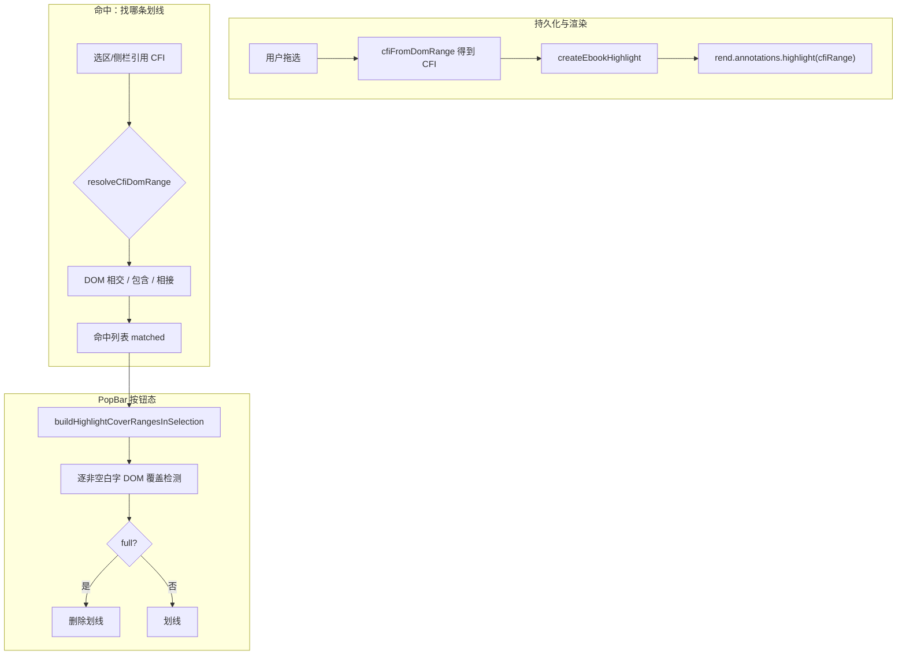

# EPUB 用户划线：按位置匹配（避免 quote 同名误命中）

## 文档角色

**增量专题**：说明用户划线在「命中 / 合并 / PopBar 按钮状态」三条链路上，**为何不能靠 quote 文本相同就视为同一条划线**，以及当前 **DOM + CFI 优先** 的实现方案。

**姊妹文档**：[EPUB用户划线实现.md](./EPUB用户划线实现.md)（用户划线全链路主文档）、[EPUB想法下划线实现.md](./EPUB想法下划线实现.md)（想法虚线）。

**延伸阅读**：PopBar「划线 / 删除划线」互斥与覆盖度检测，见本文 §4；全量 PopBar 交互见 [EPUB用户划线实现.md](./EPUB用户划线实现.md) §6；**性能、防闪烁、highlightToggle 单槽位**见 [EPUB PopBar性能体验.md](./EPUB PopBar性能体验.md)。

---

## 1. 背景与目标

### 1.1 用户担心的问题

书中 **同一句话可能出现多次**（例如两处都有「司马懿的第四子」）。若程序用 **quote 文本是否相同/包含** 来判断「是否已划线、是否合并、是否删除」，会出现：

- 在 **A 处** 选中「司马懿的第四子」划线或删除，误操作 **B 处** 同名句子；
- 或 PopBar 绑错划线记录（样式条颜色对不上视觉位置）。

早期曾用 **「较短 quote ≥ 4 字才做子串互为包含」** 规避单字「曹」误并 distant 段；但 **`subject === highlight`（文本完全相同）仍会命中**，对 **7 字完整句** 无效。

### 1.2 设计目标（类微信读书）

| 原则 | 含义 |
|------|------|
| **划线落盘与渲染** | 每条记录绑定 **CFI 坐标**；正文只在该 CFI 对应 DOM 范围绘制 |
| **命中 / 删除 / 合并** | 有 rendition 时 **只认 DOM 相交/包含/相接**，**不用** quote 跨位置 fallback |
| **PopBar 按钮** | `full` → **删除划线**；`none` / `partial` → **划线**（混选可增量合并） |
| **quote 文本** | 仅在 **已命中划线的 DOM 范围内** 精确定位「有效覆盖片段」，不用于跨段匹配 |

---

## 2. 改动范围

| 路径 | 变更要点 |
|------|----------|
| `apps/frontend/src/views/ebook/utils/epubUserHighlights.ts` | 删除 `hasSignificantQuoteOverlap` / `isQuoteMutuallyInclusive`；侧栏命中改 DOM 优先；PopBar 覆盖度与子选区 fallback |
| `apps/frontend/src/views/ebook/read.tsx` | `selectionFullyHighlighted` 走 `isSelectionFullyHighlighted`；保存合并不再用 quote 子串扫 distant 段 |

---

## 3. 实现思路

### 3.1 三层职责分离



**关键决策**：「找哪条」与「是否已全部覆盖」拆成两步；**找哪条** 不允许 quote 跨位置；**是否覆盖** 在 matched 之内用 quote 定位 + DOM 逐字检测。

### 3.2 旧方案为何有问题

旧版 `doesUserHighlightCoverSubject` 在 **DOM 已解析但不重叠** 时仍可能：

```typescript
// 已删除的逻辑（示意）
if (hasSignificantQuoteOverlap(subjectQuote, itemQuote)) {
  return true; // subject === highlight 时恒为 true，与位置无关
}
```

无 rendition 时还会：**同 spine + quote 重叠** → 命中。同章两处相同句子会被当成同一条。

### 3.3 新方案：侧栏 / 想法引用命中（`findAllUserHighlightsCoveringCfi`）

有 rendition 时 **仅** 下列条件命中（**无 quote 文本 fallback**）：

1. CFI 字符串完全相同；
2. `isHighlightCfiStrictlyContained`（DOM 严格包含，双向）；
3. 引用 CFI 点落在划线范围内（`isCfiResolvedRangeWithinHighlight`）；
4. **同一 iframe** 内 `doDomRangesOverlapForMerge`（相交或首尾相接）；
5. **不同 iframe**（分页）→ **直接 false**，不用 quote 补判。

无 rendition → **false**（不再用「同章 + quote 重叠」）。

### 3.4 新方案：正文选区 PopBar 命中（`findAllUserHighlightsForSelection`）

与侧栏一致以 **DOM 为主**；额外允许：

- 选区 DOM **完全落在大段划线 DOM 内**，且选区文本是该划线 quote 的 **子串** → 命中（用于在大段已划线下只选「李龙」等子集）。

**仍不允许**：选区 DOM 与 distant 划线无交集、仅 quote 文本相同 → **不命中**。

### 3.5 保存合并（`resolveMergedOverlappingHighlight`）

合并删除旧记录时 **只** 扩展 DOM 相交/相接的划线（Union-Find + `doDomRangesOverlapForMerge`）。  
**已移除** upsert 中对 `findAllUserHighlightsCoveringCfi` 的调用，避免 quote 子串把 distant 段并进来。

### 3.6 PopBar「划线 / 删除划线」（`resolveSelectionHighlightCoverage`）

| 覆盖度 | PopBar 按钮 | 典型场景 |
|--------|-------------|----------|
| `none` | 划线 | 选区无任何命中划线 |
| `partial` | 划线 | 混选（未划前缀 + 已划后缀）；或命中但覆盖范围未盖满 |
| `full` | 删除划线 | 选区每个非空白字都在有效 cover range 内 |

**混选安全**：`buildHighlightCoverRangeInSelection` 仅在 `clippedNorm === selectionNorm`（选区未伸出划线外）且 `quoteNorm.includes(clippedNorm)` 时，才允许 DOM 子选区 fallback；混选时 `clippedNorm` 仅为交集、小于整段选区 → **不会** 误判 `full`。

**子选区安全**：在大段划线内只选「李龙」→ `selectionWithinHighlightDom` → cover 整段子选区 → `full` → **删除划线**。

---

## 4. 关键代码与注释

### 4.1 侧栏命中：DOM 优先，移除 quote 跨位置 fallback

**来源**：`apps/frontend/src/views/ebook/utils/epubUserHighlights.ts`（约 L928–L972，`doesUserHighlightCoverSubject`）

```typescript
/**
 * 侧栏/想法引用是否被某条划线覆盖。
 * 与 PopBar 一致：有 rendition 时只认 CFI/DOM，不用 quote 文本跨位置命中
 * （同章两处「司马懿的第四子」不会互相误匹配）。
 */
function doesUserHighlightCoverSubject(
  item: EbookUserHighlight,
  subject: { cfiRange: string; quote: string },
  rend?: Rendition,
): boolean {
  const key = subject.cfiRange.trim();
  const itemCfi = item.cfiRange.trim();
  if (!key || !itemCfi) return false;
  if (itemCfi === key) return true; // 说明：CFI 完全一致 → 同一条

  // 说明：双向严格 DOM 包含（嵌套划线场景）
  if (isHighlightCfiStrictlyContained(subject, item, rend)) return true;
  if (isHighlightCfiStrictlyContained({ cfiRange: itemCfi, quote: item.quote ?? '' }, subject, rend)) {
    return true;
  }

  if (!rend) return false; // 说明：无渲染器时不做 quote 文本 fallback

  // 说明：侧栏引用可能是「点 CFI」，判断该点是否落在划线范围内
  if (isCfiResolvedRangeWithinHighlight(rend, key, item)) return true;

  const subjectRange = resolveCfiDomRange(rend, key);
  const highlightRange = resolveCfiDomRange(rend, itemCfi);
  if (!subjectRange || !highlightRange) return false;

  // 说明：分页多 iframe 时 DOM 不可比 → 不命中，避免 quote 误配另一页同名句
  if (subjectRange.startContainer.ownerDocument !== highlightRange.startContainer.ownerDocument) {
    return false;
  }

  // 说明：仅同一文档内的 DOM 相交/相接才算覆盖（不再调用 hasSignificantQuoteOverlap）
  return doDomRangesOverlapForMerge(subjectRange, highlightRange);
}
```

### 4.2 正文选区命中：DOM + 子选区 quote 校验

**来源**：`apps/frontend/src/views/ebook/utils/epubUserHighlights.ts`（约 L1005–L1053，`doesUserHighlightMatchSelection`）

```typescript
function doesUserHighlightMatchSelection(/* ... */): boolean {
  // ... 前置：CFI 相同、严格包含，与侧栏相同 ...

  const subjectRange = resolveCfiDomRange(rend, key);
  const highlightRange = resolveCfiDomRange(rend, itemCfi);
  if (!subjectRange || !highlightRange) return false;

  if (subjectRange.startContainer.ownerDocument !== highlightRange.startContainer.ownerDocument) {
    return false;
  }

  // 说明：选区完全落在大段划线 DOM 内，且选区文本属于该 quote → 命中（子选区删线/改色）
  if (isDomRangeContainedIn(subjectRange, highlightRange)) {
    const subjectNorm = normalizeComparableText(subject.quote);
    const itemNorm = normalizeComparableText(itemQuote);
    if (!subjectNorm || !itemNorm || itemNorm.includes(subjectNorm)) {
      return true;
    }
  }

  // 说明：一般相交/包含；不含「仅端点相接」，避免选区末尾误命中下一段
  return doDomRangesOverlapForSelection(subjectRange, highlightRange);
}
```

**注意**：这里的 `itemNorm.includes(subjectNorm)` **必须** 与 `isDomRangeContainedIn` 联用——quote 子串判断 **限定在 DOM 已确认的位置关系内**，不会跨 distant 段。

### 4.3 PopBar 覆盖范围：混选 vs 子选区

**来源**：`apps/frontend/src/views/ebook/utils/epubUserHighlights.ts`（约 L1411–L1456，`buildHighlightCoverRangeInSelection`）

```typescript
function buildHighlightCoverRangeInSelection(
  item: EbookUserHighlight,
  selectionRange: Range,
  rend: Rendition,
): Range | null {
  const highlightRange = resolveCfiDomRange(rend, item.cfiRange.trim());
  if (!highlightRange) return null;

  const clipped = clipRangeToOuterBounds(highlightRange, selectionRange);
  if (!clipped) return null;
  const trimmedClipped = trimSelectionRange(clipped);

  const normalizedSelection = trimSelectionRange(selectionRange);
  const selectionNorm = normalizeComparableText(normalizedSelection.toString());
  const clippedNorm = normalizeComparableText(trimmedClipped.toString());
  const quoteNorm = normalizeComparableText(item.quote ?? '');

  // 说明：子选区条件——选区未伸出划线 DOM，且文本是 quote 子串
  const selectionWithinHighlightDom =
    isDomRangeContainedIn(normalizedSelection, highlightRange) &&
    clippedNorm.length > 0 &&
    clippedNorm === selectionNorm && // 说明：混选时 clipped 只是交集，不等于整段选区 → 不走此分支
    quoteNorm.includes(clippedNorm);

  const located = locateHighlightQuoteCoverInSelection(trimmedClipped, quote, highlightRange);
  if (located) return located;

  if (selectionWithinHighlightDom) {
    return trimmedClipped; // 说明：quote 定位失败时的子选区 fallback（如只选「李龙」）
  }

  return null; // 说明：混选时只计入 quote 能精确定位的片段
}
```

### 4.4 PopBar 按钮态入口

**来源**：`apps/frontend/src/views/ebook/read.tsx`（约 L265–L274，`selectionFullyHighlighted`）

```typescript
const selectionFullyHighlighted = useMemo(() => {
  if (!selectionPopBar?.cfiRange) return false;
  const rend = epubNavRef.current?.getRendition() ?? undefined;
  return isSelectionFullyHighlighted(
    highlights,
    selectionPopBar.cfiRange,
    selectionPopBar.selectedText,
    rend,
  ); // 说明：内部 resolveSelectionHighlightCoverage === 'full' 才为 true → PopBar 显示「删除划线」
}, [highlights, selectionPopBar, epubNavReady]);
```

**来源**：`apps/frontend/src/views/ebook/utils/epubUserHighlights.ts`（约 L1538–L1566，`resolveSelectionHighlightCoverage`）

```typescript
export function resolveSelectionHighlightCoverage(/* ... */): SelectionHighlightCoverage {
  const matched = findAllUserHighlightsForSelection(/* ... */);
  if (matched.length === 0) return 'none';

  const coverRanges = buildHighlightCoverRangesInSelection(matched, normalized, rend);
  if (coverRanges.length === 0) return 'partial';

  return isDomRangeFullyCoveredByHighlightRanges(normalized, coverRanges)
    ? 'full'
    : 'partial';
}
```

### 4.5 保存合并：仅 DOM 扩展

**来源**：`apps/frontend/src/views/ebook/read.tsx`（约 L319–L321，注释）

```typescript
// 合并删除仅依赖 DOM 相交/相接（resolveMergedOverlappingHighlight）与严格包含，
// 不用 quote 子串（如单字「曹」）避免误并 distant 划线
```

**来源**：`apps/frontend/src/views/ebook/utils/epubUserHighlights.ts`（约 L1640–L1680，`resolveMergedOverlappingHighlight` 核心循环）

```typescript
// 说明：从 seedRange 出发，反复吸纳 DOM 与 ranges 中任一 range 相交/相接的其它划线
const domMerge = ranges.some((range) =>
  doDomRangesOverlapForMerge(range, itemRange),
);
if (!domMerge) continue; // 说明：quote 相同但 DOM 不相交 → 不合并
```

---

## 5. 「完全相同仍算命中」到底管什么？

| 场景 | 是否仅靠 quote 相同命中 | 实际行为 |
|------|-------------------------|----------|
| A 处划「司马懿的第四子」，B 处同名未划 | **否** | 新建只在 A 的 CFI 落库与渲染 |
| 侧栏删 A 处引用 | **否** | `findAllUserHighlightsCoveringCfi` 只删 DOM 重叠的 id |
| PopBar 在 B 处选同名句 | **否** | `findAllUserHighlightsForSelection` 无 DOM 交集 → `none` → 显示「划线」 |
| 在大段已划线下只选子串「李龙」 | **是（有限制）** | DOM 包含 + quote 子串 → 命中 + `full` → 「删除划线」 |
| 混选未划前缀 + 已划后缀 | **否** | cover 只计后缀 → `partial` → 「划线」 |

**结论**：「完全相同 quote 仍算命中」**仅** 在 **DOM 已证明选区落在该划线范围内** 时用于子选区；**不会** 因全书同名句子跨位置联动。

---

## 6. 兼容性与影响

- **数据层**：不改表结构；旧数据仍按 CFI + quote 存储。
- **行为变化**：侧栏删除 / 定位更「保守」——只影响 **DOM 可解析且位置一致** 的划线；跨 iframe 且仅 quote 相同的不再误删 distant 段。
- **破坏性**：若用户依赖「删一处同名句顺便删全书同句」（非产品设计），此行为被修正。

---

## 7. 建议回归

1. 同章 **两处**「司马懿的第四子」：只划 A → B 不受影响；PopBar 在 B 仍显示「划线」。
2. 侧栏删 A 处划线 → 仅 A 消失。
3. 大段已划线下只选「李龙」→ PopBar **删除划线**。
4. 混选（未划前缀 + 已划后缀）→ PopBar **划线**；点划线后合并并变 **删除划线**。
5. 单字「曹」点划线 → 不并 distant 段（DOM 合并 + 子串阈值历史用例）。
6. 相邻段首尾相接合并 → 仍合并为一条（`doDomRangesOverlapForMerge` 保留）。

---

## 8. 相关源码路径

| 说明 | 路径 |
|------|------|
| 命中 / 覆盖 / 合并核心 | `apps/frontend/src/views/ebook/utils/epubUserHighlights.ts` |
| PopBar 状态与保存 | `apps/frontend/src/views/ebook/read.tsx` |
| CFI ↔ DOM 几何 | `apps/frontend/src/views/ebook/utils/epubRangeGeometry.ts` |
| PopBar UI 互斥按钮 | `apps/frontend/src/views/ebook/components/EpubQuoteActionBar.tsx` |

若与仓库最新源码不一致，以源码为准。
