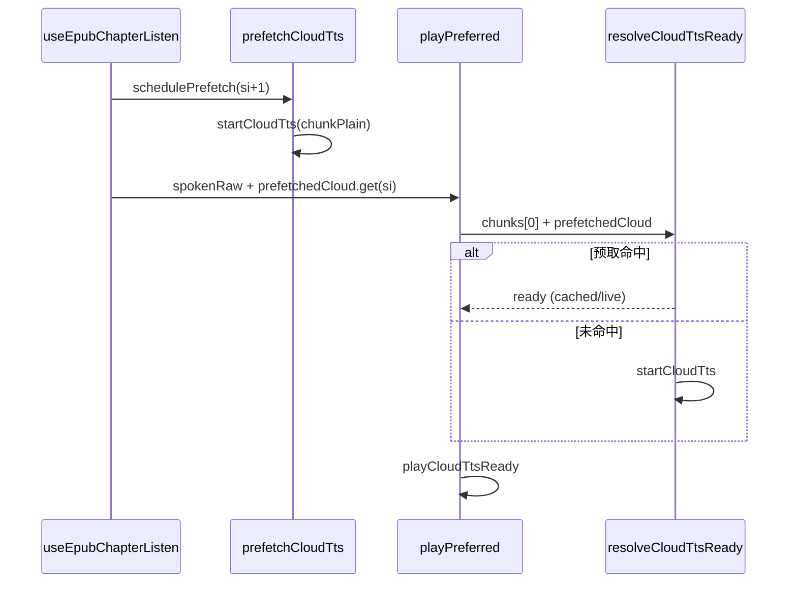

# EPUB 听读 — 句间云端 TTS 预取

## 延伸阅读

- [EPUB 听书：首包出声后再预取](EPUB听书启动后预取.md) — `onPlaybackStart` 错开首包与预取 HTTP（本篇句间预取的后续优化）
- [EPUB 听书：跨章 trim 后 FAB CFI 重挂载](EPUB听书跟随CFI重挂载.md) — FAB 回位与滚动（与本篇带宽优化正交）
- [EPUB听书云端预取影响.md](../impact/EPUB听书云端预取影响.md) — **影响面矩阵**与回归清单
- [developer/EPUB听书开发.md](./developer/EPUB听书开发.md) — 听当前 + 听书总手册
- [EPUB听书句首标点影响.md](./EPUB听书句首标点影响.md) — 句界算法（与本篇正交，可同轮发布）

**文档角色**：听书 / 听当前 **句与句之间** 云端合成等待优化的实现说明；句内 chunk 预取见 `speech.ts` 既有 `playCloudTtsCadenceSegments` 循环。

---

## 1. 背景与目标

### 1.1 问题

听书、听当前按句调用 `playPreferred`。改前每播完一句才 `startCloudTts` 下一句，**句内**长文虽有 chunk 级预取，**句间**无预取，云端会员听感上句与句之间停顿过长。

### 1.2 目标

- 播第 N 句时并行预取第 N+1 句 MP3（开播前即预取第二句）。
- **不改** 分句、高亮、播放条、互斥、本机 Web Speech 路径。
- `playPreferred` 对其它调用方 **向后兼容**（可选 `prefetchedCloud`）。

---

## 2. 改动范围

| 路径 | 变更 |
|------|------|
| `apps/frontend/src/utils/speech.ts` | `prefetchCloudTts`、`resolveCloudTtsReady`；`PlayPreferredOptions.prefetchedCloud` |
| `apps/frontend/src/views/ebook/hooks/useEpubChapterListen.ts` | `playSentencesFromCursor` 内 `prefetchedByIndex` / `schedulePrefetch` |
| `apps/frontend/src/views/ebook/hooks/useEbookQuoteListen.ts` | `playFromCursor` 内同上 |

**分析基准**：工作区相对 `HEAD`（`82925c9d` 侧）的未提交 diff。

---

## 3. 实现思路

1. **句间 vs 句内**  
   句内：`playCloudTtsCadenceSegments` 循环里 `pendingReady = startCloudTts(chunks[i+1])`。句间：听书 hook 在循环外维护 `Map<句索引, Promise>`，播 N 时注入 N 的预取结果。

2. **chunk 文本对齐**  
   `firstCloudTtsChunkPlain` 与 `splitTextForTtsCadence` 首 chunk 一致；`resolveCloudTtsReady` 比对 `hit.plain === chunkPlain`，不匹配则回退 `startCloudTts`（跳句 / 超长句首 chunk 安全）。

3. **非云端零成本**  
   `prefetchCloudTts` 在 `shouldUseCloudTts` 为 false 时返回 `null`；Map 存 null 等价未预取。

4. **不在 hook 里合并会话**  
   仍每句 `beginPlaybackSession()`，避免改动停止 / 世代语义；预取 Promise 与 generation 解耦，仅复用 MP3 / LRU。

5. **听书与听当前同构**  
   `schedulePrefetch(si + 1)` + `prefetchedCloud: prefetchedByIndex.get(si)`，差异仅在取句文本 API。

6. **刻意不做**  
   不取消在途预取 HTTP；不改为整章单次 `playPreferred`；不改 `PAUSE_AFTER_*` 本机顿挫。

---

## 4. 数据流



---

## 5. 关键代码对比与注释

### 5.1 `prefetchCloudTts` 与 helper（纯新增）

**对比范围**：`firstCloudTtsChunkPlain`、`resolveCloudTtsReady`、`prefetchCloudTts` 全函数（改前不存在）。

**改动后** · `apps/frontend/src/utils/speech.ts`（当前，约 L932–L968）

```typescript
// 从整句 plain 算出云端首段请求文本，与 playCloudTtsCadenceSegments 首 chunk 对齐
function firstCloudTtsChunkPlain(plain: string): string {
	// 按 cadence 规则切分（句末 / 逗号 / 硬切）
	const chunks = splitTextForTtsCadence(plain);
	// 无 chunk 时回退整段 plain
	return chunks[0]?.text ?? plain;
}

// 解析云端 MP3：优先消费预取 Promise，失败或不匹配则现场请求
async function resolveCloudTtsReady(
	chunkPlain: string,
	prefetched?: Promise<TtsSentencePrefetch> | null,
): Promise<CloudTtsReady> {
	// 调用方传入了预取 Promise
	if (prefetched) {
		try {
			// 等待预取完成
			const hit = await prefetched;
			// plain 与当前要播的 chunk 一致则直接返回
			if (hit.plain === chunkPlain) return hit.ready;
		} catch {
			// 预取失败则回退现场请求
		}
	}
	// 无预取、未命中或异常：同步路径与改前 startCloudTts 一致
	return startCloudTts(chunkPlain);
}

// 导出：听书/听当前在播当前句时预取下一句；非云端返回 null
export function prefetchCloudTts(
	rawText: string,
	options?: Pick<PlayPreferredOptions, 'preferLocal'>,
): Promise<TtsSentencePrefetch> | null {
	// 本机路径或不允许云端时不预取
	if (!shouldUseCloudTts(options)) return null;
	// 去 markdown 得 plain
	const plain = stripMarkdownForTts(rawText);
	// 空文本不请求
	if (!plain) return null;
	// 与播放侧一致的首 chunk 文本
	const chunkPlain = firstCloudTtsChunkPlain(plain);
	// 发起请求并包装 { plain, ready } 供 resolve 校验
	return startCloudTts(chunkPlain).then((ready) => ({
		plain: chunkPlain,
		ready,
	}));
}
```

**变更摘要**：新增句间预取入口与命中解析；未改 `startCloudTts` / LRU 逻辑。

---

### 5.2 `PlayPreferredOptions` 与类型

**对比范围**：`TtsSentencePrefetch` 类型与 `PlayPreferredOptions` 字段。

**改动前** · `apps/frontend/src/utils/speech.ts`（基线 HEAD，约 L447–L456）

```typescript
// 播放优选 TTS 的可选参数（改前无 prefetchedCloud）
export type PlayPreferredOptions = {
	// 为 true 时强制本机 Web Speech
	preferLocal?: boolean;
	// 本机朗读透传 Web Speech 参数
	speak?: SpeakOptions;
	// 节奏段开始/结束回调（电子书句内高亮等）
	onCadenceChunk?: (event: TtsCadenceChunkEvent) => void;
};

// cadence 回调钩子类型（改前仅 onCadenceChunk）
type CadencePlaybackHooks = Pick<PlayPreferredOptions, 'onCadenceChunk'>;
```

**改动后** · `apps/frontend/src/utils/speech.ts`（当前，约 L447–L468）

```typescript
// 听书逐句：预取结果携带 chunk plain 与 CloudTtsReady
export type TtsSentencePrefetch = {
	// 实际请求的 chunk 文本（用于命中校验）
	plain: string;
	// 缓存 Blob 或 live Response 包装
	ready: CloudTtsReady;
};

// 播放优选 TTS 的可选参数（新增 prefetchedCloud）
export type PlayPreferredOptions = {
	// 为 true 时强制本机 Web Speech
	preferLocal?: boolean;
	// 本机朗读透传 Web Speech 参数
	speak?: SpeakOptions;
	// 节奏段开始/结束回调
	onCadenceChunk?: (event: TtsCadenceChunkEvent) => void;
	// 听书/听当前逐句：上一轮发起的下一句云端预取
	prefetchedCloud?: Promise<TtsSentencePrefetch> | null;
};

// cadence 钩子含预取字段，传入 playCloudTtsCadenceSegments
type CadencePlaybackHooks = Pick<
	PlayPreferredOptions,
	'onCadenceChunk' | 'prefetchedCloud'
>;
```

**变更摘要**：对外可选 `prefetchedCloud`；新增 `TtsSentencePrefetch` 导出类型。

---

### 5.3 `playCloudTtsCadenceSegments`（首段解析摘录）

**对比范围**：单 chunk 快路径与多 chunk 循环的 `pendingReady` 初始化（对称摘录，循环体未改）。

**改动前** · `apps/frontend/src/utils/speech.ts`（基线 HEAD，约 L1056–L1071）

```typescript
	// 单 chunk 且未超长：一次云端请求
	if (
		chunks.length === 1 &&
		chunks[0].text.length <= MAX_SINGLE_CLOUD_TTS_CHARS
	) {
		// cadence 开始事件
		emitCadenceChunk(opts, plain, chunks, 0, 'start');
		// 改前：直接 startCloudTts，句间无预取注入
		const ready = await startCloudTts(chunks[0].text);
		// 世代已作废则退出
		if (!isPlaybackGenerationActive(generation)) return;
		// 播放 MP3
		await playCloudTtsReady(ready, generation, rate);
		// 世代检查
		if (!isPlaybackGenerationActive(generation)) return;
		// cadence 结束事件
		emitCadenceChunk(opts, plain, chunks, 0, 'end');
		// 单 chunk 路径结束
		return;
	}

	// 多 chunk：改前首段 pending 直接 startCloudTts
	let pendingReady: Promise<CloudTtsReady> | null = startCloudTts(
		chunks[0].text,
	);
```

**改动后** · `apps/frontend/src/utils/speech.ts`（当前，约 L1105–L1124）

```typescript
	// 单 chunk 且未超长：一次云端请求
	if (
		chunks.length === 1 &&
		chunks[0].text.length <= MAX_SINGLE_CLOUD_TTS_CHARS
	) {
		// cadence 开始事件
		emitCadenceChunk(opts, plain, chunks, 0, 'start');
		// 改后：可走 hook 传入的 prefetchedCloud
		const ready = await resolveCloudTtsReady(
			chunks[0].text,
			opts?.prefetchedCloud,
		);
		// 世代已作废则退出
		if (!isPlaybackGenerationActive(generation)) return;
		// 播放 MP3
		await playCloudTtsReady(ready, generation, rate);
		// 世代检查
		if (!isPlaybackGenerationActive(generation)) return;
		// cadence 结束事件
		emitCadenceChunk(opts, plain, chunks, 0, 'end');
		// 单 chunk 路径结束
		return;
	}

	// 多 chunk：首段同样 resolveCloudTtsReady（可命中句间预取）
	let pendingReady: Promise<CloudTtsReady> | null = resolveCloudTtsReady(
		chunks[0].text,
		opts?.prefetchedCloud,
	);
```

**变更摘要**：首段 `startCloudTts` 替换为 `resolveCloudTtsReady`；循环内后续 chunk 仍为 `startCloudTts(chunks[i+1])`。

---

### 5.4 `playPreferred`（cadence 钩子摘录）

**对比范围**：`cadenceHooks` 对象构造（摘录）。

**改动前** · `apps/frontend/src/utils/speech.ts`（基线 HEAD，约 L1243–L1246）

```typescript
	// 是否走云端
	const useCloud = shouldUseCloudTts(options);
	// 传给云端/本机 cadence 的钩子（改前仅 onCadenceChunk）
	const cadenceHooks: CadencePlaybackHooks = {
		onCadenceChunk: options?.onCadenceChunk,
	};
```

**改动后** · `apps/frontend/src/utils/speech.ts`（当前，约 L1296–L1300）

```typescript
	// 是否走云端
	const useCloud = shouldUseCloudTts(options);
	// 传给云端/本机 cadence 的钩子（含 prefetchedCloud）
	const cadenceHooks: CadencePlaybackHooks = {
		onCadenceChunk: options?.onCadenceChunk,
		prefetchedCloud: options?.prefetchedCloud,
	};
```

**变更摘要**：透传 `prefetchedCloud` 至 `playCloudTtsCadenceSegments`。

---

### 5.5 `playSentencesFromCursor`（`useEpubChapterListen.ts`）

**对比范围**：`const playSentencesFromCursor = useCallback(...)` 全函数。

**改动前** · `apps/frontend/src/views/ebook/hooks/useEpubChapterListen.ts`（基线 HEAD，约 L183–L240）

```typescript
// 从当前句游标依次朗读章节句子（改前无句间预取）
const playSentencesFromCursor = useCallback(
	async (
		ctx: SectionCtx,
		gen: number,
		opts?: { scrollCenterOnFirst?: boolean },
	): Promise<boolean> => {
		// 章节 plain、分句、DOM Range
		const { plain, sentences, sentenceRanges } = ctx;
		// epub rendition
		const rend = getRenditionRef.current();
		// 起始句索引
		const startSi = sentenceCursorRef.current;

		// 从游标遍历到章末
		for (let si = sentenceCursorRef.current; si < sentences.length; si += 1) {
			// 暂停或 generation 失效
			if (!isGenActive(gen) || pausedRef.current) return false;

			// 当前句 span
			const sent = sentences[si]!;
			// 朗读用文本
			const spokenRaw = stripMarkdownForTts(
				plain.slice(sent.start, sent.end),
			);
			// 空句跳过
			if (!spokenRaw.trim()) continue;

			// 更新游标
			sentenceCursorRef.current = si;
			// 更新播放条 state
			syncState({
				status: 'playing',
				sentenceIndex: si,
				sentenceCount: sentences.length,
			});

			// 当前句 DOM Range
			const domRange = sentenceRanges[si];
			// 是否可高亮
			const hasHighlight = !!(rend && domRange);
			if (hasHighlight) {
				// 首句可选居中滚动
				const jumpScroll =
					opts?.scrollCenterOnFirst && si === startSi
						? ({ forceScroll: true, align: 'center' as const } as const)
						: undefined;
				showChapterListenSentenceHighlight(rend, domRange, jumpScroll);
			}

			try {
				// 改前：无 prefetchedCloud，句末才请求下一句
				await playPreferred(spokenRaw, {
					speak: { rate: rateRef.current },
				});
			} catch {
				// TTS 失败 toast
				if (isGenActive(gen)) {
					Toast({
						type: 'warning',
						title: tRef.current('englishLearning.tts.unsupported'),
					});
				}
				return false;
			}

			// 中断检查
			if (!isGenActive(gen) || pausedRef.current) return false;
			// 清除句级高亮
			if (hasHighlight) clearChapterListenSentenceHighlight(rend);
		}

		// 章内句播完
		return isGenActive(gen);
	},
	[syncState],
);
```

**改动后** · `apps/frontend/src/views/ebook/hooks/useEpubChapterListen.ts`（当前，约 L189–L289）

```typescript
// 从当前句游标依次朗读章节句子（含句间云端预取）
const playSentencesFromCursor = useCallback(
	async (
		ctx: SectionCtx,
		gen: number,
		opts?: { scrollCenterOnFirst?: boolean },
	): Promise<boolean> => {
		// 章节 plain、分句、DOM Range
		const { plain, sentences, sentenceRanges } = ctx;
		// epub rendition
		const rend = getRenditionRef.current();
		// 起始句索引
		const startSi = sentenceCursorRef.current;
		// 句索引 → 预取 Promise
		const prefetchedByIndex = new Map<
			number,
			ReturnType<typeof prefetchCloudTts>
		>();

		// 为指定句索引启动预取（幂等）
		const schedulePrefetch = (index: number) => {
			// 越界或已预取
			if (index >= sentences.length || prefetchedByIndex.has(index)) return;
			// 句 span
			const sent = sentences[index];
			if (!sent) return;
			// 句文本
			const raw = stripMarkdownForTts(
				plain.slice(sent.start, sent.end),
			).trim();
			if (!raw) return;
			// 写入 Map
			prefetchedByIndex.set(index, prefetchCloudTts(raw));
		};
		// 开播前预取下一句
		schedulePrefetch(startSi + 1);

		// 从游标遍历到章末
		for (let si = sentenceCursorRef.current; si < sentences.length; si += 1) {
			// 暂停或 generation 失效
			if (!isGenActive(gen) || pausedRef.current) return false;

			// 当前句 span
			const sent = sentences[si]!;
			// 朗读用文本
			const spokenRaw = stripMarkdownForTts(
				plain.slice(sent.start, sent.end),
			);
			// 空句跳过
			if (!spokenRaw.trim()) continue;

			// 更新游标
			sentenceCursorRef.current = si;
			// 更新播放条 state
			syncState({
				status: 'playing',
				sentenceIndex: si,
				sentenceCount: sentences.length,
			});

			// 当前句 DOM Range
			const domRange = sentenceRanges[si];
			// 是否可高亮
			const hasHighlight = !!(rend && domRange);
			if (hasHighlight) {
				// 首句可选居中滚动
				const jumpScroll =
					opts?.scrollCenterOnFirst && si === startSi
						? ({ forceScroll: true, align: 'center' as const } as const)
						: undefined;
				showChapterListenSentenceHighlight(rend, domRange, jumpScroll);
			}

			// 并行预取下一句
			schedulePrefetch(si + 1);

			try {
				// 注入本句预取（si≥1 时常已就绪）
				await playPreferred(spokenRaw, {
					speak: { rate: rateRef.current },
					prefetchedCloud: prefetchedByIndex.get(si) ?? null,
				});
			} catch {
				// TTS 失败 toast
				if (isGenActive(gen)) {
					Toast({
						type: 'warning',
						title: tRef.current('englishLearning.tts.unsupported'),
					});
				}
				return false;
			}

			// 中断检查
			if (!isGenActive(gen) || pausedRef.current) return false;
			// 清除句级高亮
			if (hasHighlight) clearChapterListenSentenceHighlight(rend);
		}

		// 章内句播完
		return isGenActive(gen);
	},
	[syncState],
);
```

**变更摘要**：新增 `prefetchedByIndex` / `schedulePrefetch`；`playPreferred` 传入 `prefetchedCloud`。

---

### 5.6 `playFromCursor`（`useEbookQuoteListen.ts`）

**对比范围**：`const playFromCursor = useCallback(...)` 全函数（听当前与 5.5 同构，取句用 `resolveSpokenAt`）。

**改动前** · `apps/frontend/src/views/ebook/hooks/useEbookQuoteListen.ts`（基线 HEAD，约 L127–L173）

```typescript
// 听当前：从游标逐句播放（改前无预取）
const playFromCursor = useCallback(
	async (gen: number): Promise<boolean> => {
		// rendition
		const rend = getRenditionRef.current?.() ?? null;
		// overlay session 元信息
		const meta = getEpubListenSessionMeta();
		// plain 文本
		const plain = meta?.plain ?? fallbackPlainRef.current;
		// 句数
		const sentenceCount =
			meta?.sentenceCount ?? buildSentenceOffsetSpans(plain.trim()).length;

		// 无可播内容
		if (!plain.trim() || sentenceCount <= 0) return false;

		// 逐句循环
		for (let si = sentenceCursorRef.current; si < sentenceCount; si += 1) {
			// 中断
			if (!isGenActive(gen) || pausedRef.current) return false;

			// 当前句文本
			const spokenRaw = resolveSpokenAt(si, plain);
			if (!spokenRaw) continue;

			// 游标与 state
			sentenceCursorRef.current = si;
			syncState({
				status: 'playing',
				sentenceIndex: si,
				sentenceCount,
			});

			// 句级高亮
			if (rend) showEpubListenPlainSpan(0, 0, si);

			try {
				// 改前无 prefetchedCloud
				await playPreferred(spokenRaw, {
					speak: { rate: rateRef.current },
				});
			} catch {
				if (isGenActive(gen)) {
					Toast({
						type: 'warning',
						title: tRef.current('englishLearning.tts.unsupported'),
					});
				}
				return false;
			}

			if (!isGenActive(gen) || pausedRef.current) return false;
			if (rend) clearActiveListenHighlight(rend);
		}

		return isGenActive(gen);
	},
	[syncState],
);
```

**改动后** · `apps/frontend/src/views/ebook/hooks/useEbookQuoteListen.ts`（当前，约 L129–L216）

```typescript
// 听当前：从游标逐句播放（含句间云端预取）
const playFromCursor = useCallback(
	async (gen: number): Promise<boolean> => {
		// rendition
		const rend = getRenditionRef.current?.() ?? null;
		// overlay session 元信息
		const meta = getEpubListenSessionMeta();
		// plain 文本
		const plain = meta?.plain ?? fallbackPlainRef.current;
		// 句数
		const sentenceCount =
			meta?.sentenceCount ?? buildSentenceOffsetSpans(plain.trim()).length;

		// 无可播内容
		if (!plain.trim() || sentenceCount <= 0) return false;

		// 句索引 → 预取 Promise
		const prefetchedByIndex = new Map<
			number,
			ReturnType<typeof prefetchCloudTts>
		>();

		// 预取指定句（幂等）
		const schedulePrefetch = (index: number) => {
			if (index >= sentenceCount || prefetchedByIndex.has(index)) return;
			const raw = resolveSpokenAt(index, plain);
			if (!raw) return;
			prefetchedByIndex.set(index, prefetchCloudTts(raw));
		};
		// 开播前预取下一句
		schedulePrefetch(sentenceCursorRef.current + 1);

		// 逐句循环
		for (let si = sentenceCursorRef.current; si < sentenceCount; si += 1) {
			// 中断
			if (!isGenActive(gen) || pausedRef.current) return false;

			// 当前句文本
			const spokenRaw = resolveSpokenAt(si, plain);
			if (!spokenRaw) continue;

			// 游标与 state
			sentenceCursorRef.current = si;
			syncState({
				status: 'playing',
				sentenceIndex: si,
				sentenceCount,
			});

			// 句级高亮
			if (rend) showEpubListenPlainSpan(0, 0, si);

			// 预取下一句
			schedulePrefetch(si + 1);

			try {
				// 注入本句预取
				await playPreferred(spokenRaw, {
					speak: { rate: rateRef.current },
					prefetchedCloud: prefetchedByIndex.get(si) ?? null,
				});
			} catch {
				if (isGenActive(gen)) {
					Toast({
						type: 'warning',
						title: tRef.current('englishLearning.tts.unsupported'),
					});
				}
				return false;
			}

			if (!isGenActive(gen) || pausedRef.current) return false;
			if (rend) clearActiveListenHighlight(rend);
		}

		return isGenActive(gen);
	},
	[syncState],
);
```

**变更摘要**：与听书相同的预取 Map 模式；取句 API 为 `resolveSpokenAt`。

---

## 6. 兼容性与影响

| 维度 | 说明 |
|------|------|
| 其它 `playPreferred` 调用方 | 未传 `prefetchedCloud`，行为不变 |
| 本机 Web Speech | `prefetchCloudTts` 返回 null |
| 云端连播 | 句间等待缩短；停止后未播预取可能仍完成并写 LRU |
| 超长句（>120 字） | 仅首 chunk 可句间预取；后续 chunk 仍句内预取 |

详见 [Influence-point 姊妹稿](../impact/EPUB听书云端预取影响.md)。

---

## 7. 相关源码路径

| 说明 | 路径 |
|------|------|
| 预取 API 与云端解析 | `apps/frontend/src/utils/speech.ts` |
| 听书逐句循环 | `apps/frontend/src/views/ebook/hooks/useEpubChapterListen.ts` |
| 听当前逐句循环 | `apps/frontend/src/views/ebook/hooks/useEbookQuoteListen.ts` |

---

（若与仓库最新源码不一致，以源码为准）
