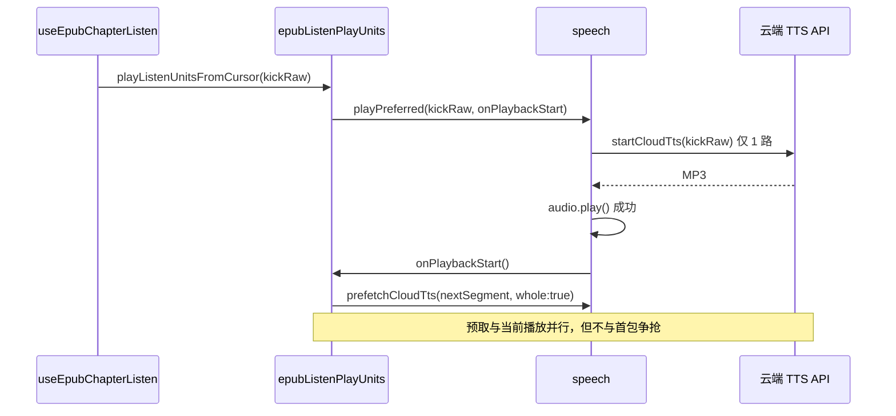

# EPUB 听书：首包出声后再预取（错开 HTTP）

## 延伸阅读

- [EPUB 听读 — 句间云端 TTS 预取](EPUB听书云端预取影响.md) — 句间预取总体设计与 `prefetchCloudTts`
- [EPUB 听当前：播放自动跟随与回位 FAB](EPUB听书自动跟随浮动按钮.md) — 播放跟随 FAB（与本篇带宽优化正交）
- [developer/EPUB听书开发.md](./developer/EPUB听书开发.md) — 听书 / 听当前 TTS 调用链

**文档角色**：首次听书、切句、听当前时 **首包 TTS HTTP 与预取并行抢带宽** 的问题，以及 `onPlaybackStart` + `epubListenPlayUnits` 错开预取的实现说明。

**分析基准**：工作区相对 `HEAD` 的未提交 diff；改动前取自 `git show HEAD:<path>`。

---

## 1. 背景与目标

### 1.1 问题

改前听书 / 听当前在 **起播瞬间** 即 `schedulePrefetch(startSi + 1)`（或段内下一段），与 **当前句 / 当前段首包** `startCloudTts` **同时发出两条 HTTP**，在弱网下：

- 首包合成变慢，**首句出声延迟**明显；
- 切句后同样双请求并行，句间等待反而变长。

### 1.2 目标

1. `speech` 暴露 **`onPlaybackStart`**：云端 `audio.play()` 成功或本机首段 `speak` 开始后触发；
2. `epubListenPlayUnits` 在 **`onPlaybackStart`（及 `oncePrefetch` 兜底）之后** 再 `schedulePrefetch`；
3. **kick 路径仅合成当前一句**（1 路 HTTP），同段剩余与后续段再整段预取。

---

## 2. 改动范围

| 路径 | 变更 |
| ---- | ---- |
| `apps/frontend/src/utils/speech.ts` | `PlayPreferredOptions.onPlaybackStart`；`playCloudTtsCadenceSegments` / `startCloudAudioPlayback` / `playCloudMp3Blob` / `speakTextWithGeneration` 触发回调 |
| `apps/frontend/src/views/ebook/utils/epub/listen/epubListenPlayUnits.ts` | **新增** `oncePrefetch`、`playListenUnitsFromCursor`；kick 后预取 |
| `apps/frontend/src/views/ebook/hooks/useEpubChapterListen.ts` | `playSentencesFromCursor` 委托 `playListenUnitsFromCursor`（移除内联 `schedulePrefetch`） |
| `apps/frontend/src/views/ebook/hooks/useEbookQuoteListen.ts` | 同上（听当前共用 play units） |

---

## 3. 实现思路

1. **出声即回调**：云端在 `audio.play()` resolve 后、`playCloudMp3Blob` 内 `notifyStart` 去重调用；本机在首 chunk `speak` 前 `notifyPlaybackStart`。
2. **oncePrefetch 兜底**：本机 Web Speech 无统一 play 事件，`await playPreferred` 返回后再调一次 `prefetchAfterKickStart()`，保证预取仍会启动。
3. **kick 仅当前句**：`playListenUnitsFromCursor` 首包 `sentenceRaw` + `cloudSingleUtterance: true`，不预取；`onPlaybackStart` 里再 `schedulePrefetch` 段内下一句或下一段。
4. **段级预取键**：`prefetchedByText` 以段文本为 key，`whole: true` 对齐整段合成。
5. **inflight 合并**（同轮 `speech` 附带）：`startCloudTts` 同 cacheKey 合并进行中的请求，避免兜底与回调重复打 stream（见 `speech.ts` `inflightCloudTts`）。

---

## 4. 关键代码对比与注释

### 4.1 `PlayPreferredOptions.onPlaybackStart`（`speech.ts`）

**对比范围**：类型字段与 `CadencePlaybackHooks`。

**改动前** · 基线 `HEAD`，约 L470–L488

```typescript
export type PlayPreferredOptions = {
	preferLocal?: boolean;
	speak?: SpeakOptions;
	onCadenceChunk?: (event: TtsCadenceChunkEvent) => void;
	/** 听书/听当前逐句：由上一轮发起的下一句云端预取（缩短句间等待） */
	prefetchedCloud?: Promise<TtsSentencePrefetch> | null;
};

type CadencePlaybackHooks = Pick<
	PlayPreferredOptions,
	'onCadenceChunk' | 'prefetchedCloud'
>;
```

**改动后** · 当前，约 L470–L495

```typescript
export type PlayPreferredOptions = {
	preferLocal?: boolean;
	speak?: SpeakOptions;
	onCadenceChunk?: (event: TtsCadenceChunkEvent) => void;
	/** 听书/听当前：由上一轮发起的云端预取（缩短等待） */
	prefetchedCloud?: Promise<TtsSentencePrefetch> | null;
	/**
	 * 云端整段一次合成（听书/听当前按段 TTS）。
	 * 为 true 时不按句读拆 HTTP；超厂商字节上限仍回退 cadence。
	 * 句高亮靠播放进度估算触发 onCadenceChunk。
	 */
	cloudSingleUtterance?: boolean;
	/**
	 * 当前段真正开始出声后回调（云端 audio.play / 本机 speak 成功）。
	 * 听书用来错开预取，避免与首包 HTTP 抢带宽。
	 */
	onPlaybackStart?: () => void;
};

type CadencePlaybackHooks = Pick<
	PlayPreferredOptions,
	'onCadenceChunk' | 'prefetchedCloud' | 'onPlaybackStart'
>;
```

**变更摘要**：新增可选 `onPlaybackStart`；cadence 管道透传该钩子。

---

### 4.2 `playCloudTtsCadenceSegments` 出声通知（`speech.ts`）

**对比范围**：函数开头 `notifyPlaybackStart` 与单段播放传参（摘录）。

**改动前** · 基线，单段分支直接 `playCloudTtsReady(ready, generation, rate)`，无出声回调。

**改动后** · 当前，约 L1299–L1357

```typescript
async function playCloudTtsCadenceSegments(
	plain: string,
	generation: number,
	opts?: CloudTtsPlaybackOptions,
): Promise<void> {
	let playbackStartNotified = false;
	const notifyPlaybackStart = () => {
		if (playbackStartNotified) return;
		playbackStartNotified = true;
		opts?.onPlaybackStart?.();
	};

	if (opts?.singleUtterance) {
		// ... singleUtterance 分支透传 notifyPlaybackStart
	}

	// ... 多 chunk 循环
		await playCloudTtsReady(
			ready,
			generation,
			rate,
			undefined,
			notifyPlaybackStart,
		);
```

**变更摘要**：每段播放仅首次 `notifyPlaybackStart` 调用外部 `onPlaybackStart`。

---

### 4.3 `startCloudAudioPlayback` / `playCloudMp3Blob`（`speech.ts`）

**对比范围**：完整 `startCloudAudioPlayback`；`playCloudMp3Blob` 中 `notifyStart` 相关摘录。

**改动前** · 基线 `startCloudAudioPlayback`，约 L1300–L1312

```typescript
async function startCloudAudioPlayback(audio: HTMLAudioElement): Promise<void> {
	await waitCloudAudioCanPlay(audio);
	try {
		await audio.play();
	} catch (err) {
		if (!isTauriRuntime()) throw err;
		audio.load();
		await waitCloudAudioCanPlay(audio);
		await audio.play();
	}
}
```

**改动后** · 当前，约 L1568–L1621

```typescript
async function startCloudAudioPlayback(
	audio: HTMLAudioElement,
	rate?: number,
	onPlaybackStart?: () => void,
): Promise<void> {
	await waitCloudAudioCanPlay(audio);
	audio.playbackRate = clampPlaybackRate(rate);
	try {
		await audio.play();
		onPlaybackStart?.();
	} catch (err) {
		if (!isTauriRuntime()) throw err;
		audio.load();
		await waitCloudAudioCanPlay(audio);
		audio.playbackRate = clampPlaybackRate(rate);
		await audio.play();
		onPlaybackStart?.();
	}
}

// playCloudMp3Blob 内
	let startNotified = false;
	const notifyStart = () => {
		if (startNotified) return;
		startNotified = true;
		onPlaybackStart?.();
	};
	return startCloudAudioPlayback(audio, rate, notifyStart).then(
		() => ended,
		// ...
	);
```

**变更摘要**：`play()` 成功后才触发 `onPlaybackStart`，与 MP3 首帧出声对齐。

---

### 4.4 `oncePrefetch`（`epubListenPlayUnits.ts`，**纯新增**）

**改动后** · 当前，约 L42–L50

```typescript
/** 只触发一次的预取调度（出声回调 + await 后兜底） */
function oncePrefetch(run: () => void): () => void {
	let done = false;
	return () => {
		if (done) return;
		done = true;
		run();
	};
}
```

---

### 4.5 `playListenUnitsFromCursor` — kick 与延迟预取（**纯新增**）

**对比范围**：kick 分支（首句 1 路 HTTP + `onPlaybackStart` 后预取）。

**改动后** · 当前，约 L56–L131

```typescript
export async function playListenUnitsFromCursor(
	args: PlayListenUnitsArgs,
): Promise<boolean> {
	const {
		plain,
		sentences,
		units,
		getRate,
		isActive,
		onSentence,
		onUnitIdle,
		scrollCenterOnFirst,
	} = args;
	const loopStartSi = args.startSi;

	if (units.length === 0 || sentences.length === 0) return false;

	const prefetchedByText = new Map<
		string,
		ReturnType<typeof prefetchCloudTts>
	>();

	const schedulePrefetch = (paraIndex: number, fromSi: number) => {
		if (!isActive()) return;
		if (paraIndex >= units.length) return;
		const unit = units[paraIndex]!;
		const raw = sliceParagraphFromSentence(plain, unit, sentences, fromSi);
		if (!raw || prefetchedByText.has(raw)) return;
		prefetchedByText.set(raw, prefetchCloudTts(raw, { whole: true }));
	};

	// ... pi / kickSentence 初始化

		if (kickSentence) {
			const kickRaw = sentenceRaw(plain, sentences, startSi);
			if (!kickRaw) {
				si = startSi + 1;
				continue;
			}

			onSentence(startSi, {
				forceCenter: !!scrollCenterOnFirst && startSi === loopStartSi,
			});

			const prefetchAfterKickStart = oncePrefetch(() => {
				if (startSi + 1 < unit.siEnd) {
					schedulePrefetch(pi, startSi + 1);
				} else if (pi + 1 < units.length) {
					schedulePrefetch(pi + 1, units[pi + 1]!.siStart);
				}
			});

			await playPreferred(kickRaw, {
				speak: { rate: getRate() },
				cloudSingleUtterance: true,
				onPlaybackStart: prefetchAfterKickStart,
			});
			prefetchAfterKickStart();

			if (!isActive()) return false;
			onUnitIdle?.();
			si = startSi + 1;
			// ... 同段 rest / 后续 unit 分支同理：onPlaybackStart + oncePrefetch 兜底
		}
	// ...
	return isActive();
}
```

**变更摘要**：起播不预取；出声回调（或 await 后兜底）再 `schedulePrefetch`；kick 仅当前句文本。

---

### 4.6 `playSentencesFromCursor`（`useEpubChapterListen.ts`）

**对比范围**：预取调度时机（改前起播即 `schedulePrefetch(startSi+1)`）。

**改动前** · 基线，约 L211–L272

```typescript
			const prefetchedByIndex = new Map<
				number,
				ReturnType<typeof prefetchCloudTts>
			>();

			const schedulePrefetch = (index: number) => {
				if (index >= sentences.length || prefetchedByIndex.has(index)) return;
				const sent = sentences[index];
				if (!sent) return;
				const raw = stripMarkdownForTts(
					plain.slice(sent.start, sent.end),
				).trim();
				if (!raw) return;
				prefetchedByIndex.set(index, prefetchCloudTts(raw));
			};
			schedulePrefetch(startSi + 1);

			for (let si = sentenceCursorRef.current; si < sentences.length; si += 1) {
				// ...
				schedulePrefetch(si + 1);

				await playPreferred(spokenRaw, {
					speak: { rate: rateRef.current },
					prefetchedCloud: prefetchedByIndex.get(si) ?? null,
				});
```

**改动后** · 当前，约 L262–L312

```typescript
	const playSentencesFromCursor = useCallback(
		async (
			ctx: SectionCtx,
			gen: number,
			opts?: { scrollCenterOnFirst?: boolean },
		): Promise<boolean> => {
			const { plain, sentences, paragraphs } = ctx;
			const units =
				paragraphs.length > 0
					? paragraphs
					: buildParagraphUnits(plain, sentences);
			const rend = getRenditionRef.current();
			const loopStartSi = sentenceCursorRef.current;

			try {
				return await playListenUnitsFromCursor({
					plain,
					sentences,
					units,
					startSi: loopStartSi,
					getRate: () => rateRef.current,
					isActive: () => isGenActive(gen) && !pausedRef.current,
					scrollCenterOnFirst: opts?.scrollCenterOnFirst,
					onSentence: (globalSi, info) => {
						// ... 高亮与 rebind（见 follow-cfi-remount 专题）
					},
					onUnitIdle: () => {
						if (rend) clearChapterListenSentenceHighlight(rend);
					},
				});
			} catch (err) {
				// ...
			}
		},
		[rebindSectionDomRanges, syncState],
	);
```

**变更摘要**：预取逻辑下沉 `epubListenPlayUnits`；hook 只负责状态与高亮回调。

---

## 5. 数据流



---

## 6. 兼容性与回归

| 场景 | 期望 |
| ---- | ---- |
| 首次点听书 | 首句尽快出声；第二句/段预取在首句 play 后启动 |
| 播放条切句 | kick 仅新句 1 路 HTTP；预取不提前 |
| 本机 Web Speech | `oncePrefetch` 在 `await` 后兜底预取 |
| 非听书调用 `playPreferred` | 不传 `onPlaybackStart` 时行为与改前兼容 |

---

## 7. 相关源码路径

| 说明 | 路径 |
| ---- | ---- |
| 出声回调与云端播放 | `apps/frontend/src/utils/speech.ts` |
| kick + 延迟预取 | `apps/frontend/src/views/ebook/utils/epub/listen/epubListenPlayUnits.ts` |
| 听书接入 | `apps/frontend/src/views/ebook/hooks/useEpubChapterListen.ts` |
| 听当前接入 | `apps/frontend/src/views/ebook/hooks/useEbookQuoteListen.ts` |

---

若与仓库最新源码不一致，以源码为准。
