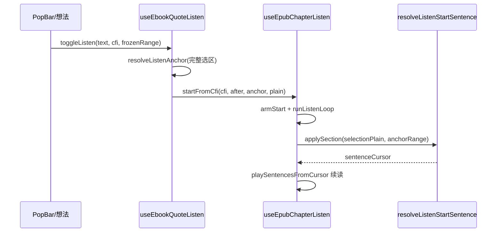

# EPUB「听当前」切入听书续读与起播句定位

**文档角色**：选区「听当前」对齐微信读书——从选中句起播后像听书一样向下续读；并修复起播偏到下一句。

**延伸阅读**：[EPUB引用听书.md](./EPUB引用听书.md)（旧独立听当前会话）、[EPUB章节听书.md](./EPUB章节听书.md)（听书主链路）、[EPUB听书PopBar关闭.md](./EPUB听书PopBar关闭.md)（PopBar 入口 UX）、[developer/EPUB听书开发.md](./developer/EPUB听书开发.md)

---

## 1. 背景与目标

### 1.1 问题

| 场景 | 旧行为 | 期望 |
|------|--------|------|
| 点「听当前」 | 独立 quote 会话，**播完选区即停** | 从选区所在句切入**听书会话**并**向下续读** |
| 起播句 | 选区/CFI collapse 后 `after` 点定位；句 Range `null` 时易落到**下一句** | 选区 **plain 优先**命中所在句；完整选区做 DOM 重叠提示 |
| 底栏 | 听当前 / 听书两套 bar 切换 | 听当前后**始终**用听书底栏（含切章） |

### 1.2 目标

1. `useEbookQuoteListen` 瘦身为入口：解析选区 → `chapterBridge.startFromCfi(..., selectionPlain)`。
2. `useEpubChapterListen.startFromCfi` + `startPlainOverrideRef` / `startRangeOverrideRef`。
3. `resolveListenStartSentence`：`selectionPlain` → `resolveListenStartBySelectionPlain`；完整 `anchorRange` 重叠；点定位两趟（先包含、后之后）。

---

## 2. 改动范围

| 路径 | 说明 |
|------|------|
| `apps/frontend/src/views/ebook/hooks/useEbookQuoteListen.ts` | 桥接到听书；去掉独立播放会话 |
| `apps/frontend/src/views/ebook/hooks/useEpubChapterListen.ts` | `startFromCfi`、plain/range override |
| `apps/frontend/src/views/ebook/utils/epub/listen/epubListenChapter.ts` | plain / 重叠 / 点定位起播 |
| `apps/frontend/src/views/ebook/read.tsx` | bridge 接线；`epubListenBar = chapterListen` |

---

## 3. 实现思路



1. **续读**：听当前 = 听书从选区起，不再单独 quote loop。
2. **plain 优先**：句级 DOM Range 常 index 失败；用「节 plain 中包含选区文本的句子」更稳。
3. **勿先 collapse 选区**：句末选区 collapse 后 `after` 易跳下一句；保留完整 Range 做重叠提示。
4. **点定位两趟**：先「包含锚点」，再「句首 ≥ 锚点」，避免中间句 `null` 时误用 `startVs >= 0` 跳句。

---

## 4. 关键实现（改动前 / 改动后对比 + 注释）

### 4.1 `resolveListenStartSentence`（`epubListenChapter.ts`）

**对比范围**：导出函数完整定义。

**改动前** · `apps/frontend/src/views/ebook/utils/epub/listen/epubListenChapter.ts`（基线，约 L471–L530）

```typescript
// 按 startCfi 在可见节内反查起播句下标
export function resolveListenStartSentence(
	// epubjs 渲染实例
	rend: Rendition,
	// 当前可见朗读节
	section: VisibleListenSection,
	// 起播 CFI
	startCfi: string,
	// 可选：句 Range 与 before/after 模式
	opts?: {
		// 已索引句 Range
		sentenceRanges?: Array<Range | null>;
		// before=续听左侧句；after=锚点处或之后
		mode?: 'before' | 'after';
	},
): number {
	// 节纯文本
	const trimmed = section.plain.trim();
	// 分句 span
	const sentences = buildSentenceOffsetSpans(trimmed);
	// 无句回退 0
	if (!sentences.length) return 0;

	// 规范化 CFI
	const cfi = startCfi.trim();
	// 空 CFI 回退 0
	if (!cfi) return 0;

	// CFI → DOM Range
	const at = resolveCfiDomRange(rend, cfi);
	// 解析失败回退 0
	if (!at) return 0;

	// 节所在 document
	const sectionDoc = section.outerRange.startContainer.ownerDocument;
	// 跨文档则回退 0
	if (at.startContainer.ownerDocument !== sectionDoc) return 0;

	// 复用或现算句 Range
	const ranges =
		opts?.sentenceRanges ??
		indexChapterSentenceRanges(section.outerRange, trimmed);

	// 默认 before
	const startMode = opts?.mode ?? 'before';
	// after：从前往后含锚点或句首在锚点后
	if (startMode === 'after') {
		for (let i = 0; i < sentences.length; i += 1) {
			const r = ranges[i];
			if (!r) continue;
			const startVs = r.compareBoundaryPoints(Range.START_TO_START, at);
			const endVs = r.compareBoundaryPoints(Range.END_TO_START, at);
			// 句首在锚点后，或锚点落在句内（旧：endVs>0 不含句末齐平）
			if (startVs >= 0 || (startVs <= 0 && endVs > 0)) return i;
		}
		return 0;
	}

	// before：从后往前找锚点左侧最后一句
	for (let i = sentences.length - 1; i >= 0; i -= 1) {
		const r = ranges[i];
		if (!r) continue;
		if (r.compareBoundaryPoints(Range.END_TO_START, at) <= 0) return i;
	}
	return 0;
}
```

**改动后** · `apps/frontend/src/views/ebook/utils/epub/listen/epubListenChapter.ts`（当前，约 L593–L660）

```typescript
// 按 CFI / 选区 / 选区纯文反查起播句下标
export function resolveListenStartSentence(
	// epubjs 渲染实例
	rend: Rendition,
	// 当前可见朗读节
	section: VisibleListenSection,
	// 起播 CFI（听当前可作辅）
	startCfi: string,
	// 扩展：选区 Range + 选区纯文
	opts?: {
		// 已索引句 Range
		sentenceRanges?: Array<Range | null>;
		// before / after
		mode?: 'before' | 'after';
		// 听当前完整选区（勿先 collapse）
		anchorRange?: Range | null;
		// 听当前选区纯文（主定位）
		selectionPlain?: string | null;
	},
): number {
	// 节纯文本
	const trimmed = section.plain.trim();
	// 分句 span
	const sentences = buildSentenceOffsetSpans(trimmed);
	// 无句回退 0
	if (!sentences.length) return 0;

	// 句 DOM Range 列表
	const ranges =
		opts?.sentenceRanges ??
		indexChapterSentenceRanges(section.outerRange, trimmed);
	// 点定位模式
	const startMode = opts?.mode ?? 'before';
	// 节 document
	const sectionDoc = section.outerRange.startContainer.ownerDocument;

	// DOM 提示下标；-1 表示未命中
	let domHint = -1;
	// 选区锚点
	const anchor = opts?.anchorRange;
	// 同文档才可用锚点
	if (anchor && anchor.startContainer.ownerDocument === sectionDoc) {
		// 未塌缩：重叠取第一句
		if (!anchor.collapsed) {
			domHint = resolveListenStartOverlappingSelection(anchor, ranges);
		} else {
			// 已塌缩：点定位
			domHint = resolveListenStartAtDomRange(anchor, ranges, startMode);
		}
	}

	// plain 主路径（听当前）
	const byPlain = resolveListenStartBySelectionPlain(
		trimmed,
		opts?.selectionPlain ?? '',
		domHint >= 0 ? domHint : undefined,
	);
	// plain 命中直接用
	if (byPlain != null) return byPlain;
	// plain 失败用 DOM 提示
	if (domHint >= 0) return domHint;

	// 有锚点则塌缩到起点再点定位
	if (anchor && anchor.startContainer.ownerDocument === sectionDoc) {
		const point = anchor.cloneRange();
		point.collapse(true);
		return resolveListenStartAtDomRange(point, ranges, startMode);
	}

	// 回退 CFI
	const cfi = startCfi.trim();
	if (!cfi) return 0;
	const at = resolveCfiDomRange(rend, cfi);
	if (!at) return 0;
	if (at.startContainer.ownerDocument !== sectionDoc) return 0;

	// range CFI：先重叠
	if (!at.collapsed) {
		const overlap = resolveListenStartOverlappingSelection(at, ranges);
		if (overlap >= 0) return overlap;
		const point = at.cloneRange();
		point.collapse(true);
		return resolveListenStartAtDomRange(point, ranges, startMode);
	}
	// 点 CFI
	return resolveListenStartAtDomRange(at, ranges, startMode);
}
```

**变更摘要**：听当前主路径改为 **选区纯文**；DOM 仅作并列歧义提示；点定位拆成「先包含、后之后」。

### 4.2 `resolveListenStartBySelectionPlain`（纯新增）

**改动后** · `apps/frontend/src/views/ebook/utils/epub/listen/epubListenChapter.ts`（当前，约 L533–L587）

```typescript
// 用选区纯文在节 plain 中找所在句下标
export function resolveListenStartBySelectionPlain(
	// 节级朗读 plain
	sectionPlain: string,
	// 用户选区文本
	selectionPlain: string,
	// 可选：DOM 重叠得到的偏好下标
	preferSi?: number,
): number | null {
	// trim 节文本
	const trimmed = sectionPlain.trim();
	// 清洗选区针
	const needle = stripMarkdownForTts(selectionPlain).trim();
	// 空则无法定位
	if (!trimmed || !needle) return null;

	// 分句
	const sentences = buildSentenceOffsetSpans(trimmed);
	if (!sentences.length) return null;

	// 收集「句文本包含 needle」的下标
	const hits: number[] = [];
	for (let i = 0; i < sentences.length; i += 1) {
		const sent = trimmed.slice(sentences[i]!.start, sentences[i]!.end);
		if (sent.includes(needle)) hits.push(i);
	}
	// 唯一命中
	if (hits.length === 1) return hits[0]!;
	// 多命中：靠近 preferSi 或取首个
	if (hits.length > 1) {
		if (preferSi != null && hits.includes(preferSi)) return preferSi;
		if (preferSi != null) {
			let best = hits[0]!;
			let bestDist = Math.abs(best - preferSi);
			for (const h of hits) {
				const d = Math.abs(h - preferSi);
				if (d < bestDist) {
					best = h;
					bestDist = d;
				}
			}
			return best;
		}
		return hits[0]!;
	}

	// 跨句选区：needle 在 plain 中的起点 → 句下标
	const idx = trimmed.indexOf(needle);
	if (idx >= 0) {
		for (let i = sentences.length - 1; i >= 0; i -= 1) {
			if (idx >= sentences[i]!.start) return i;
		}
	}

	// 去空白模糊包含
	const compactNeedle = needle.replace(/\s+/g, '');
	if (compactNeedle.length < 2) return null;
	for (let i = 0; i < sentences.length; i += 1) {
		const sent = trimmed
			.slice(sentences[i]!.start, sentences[i]!.end)
			.replace(/\s+/g, '');
		if (sent.includes(compactNeedle) || compactNeedle.includes(sent)) {
			return i;
		}
	}
	return null;
}
```

**变更摘要**：纯新增；不依赖句级 DOM Range 是否 index 成功。

### 4.3 `useEbookQuoteListen` 桥接（摘录）

**对比范围**：入口从独立播放改为 `startFromCfi`。

**改动前** · 基线具备完整 quote 播放循环（`playListenUnitsFromCursor` + overlay session）；`toggleListen` 在同 key 下 pause/resume。

**改动后** · `apps/frontend/src/views/ebook/hooks/useEbookQuoteListen.ts`（当前，约 L111–L157）

```typescript
	// 从选区起听：校验后交给听书 bridge
	const startFromSelection = useCallback(
		(
			// 选区或引用文本
			text: string,
			// 入口 key（PopBar/想法）；现已不用于播放态
			_key: string,
			// 选区 CFI
			cfiRange?: string,
			// 冻结 DOM Range
			frozenRange?: Range | null,
		) => {
			const trimmed = text.trim();
			if (!trimmed) return;

			const bridge = bridgeRef.current;
			if (!bridge) {
				Toast({
					type: 'warning',
					title: tRef.current('ebook.read.listenBook.notReady'),
				});
				return;
			}

			if (!isPlaybackAvailable()) {
				Toast({
					type: 'warning',
					title: tRef.current('englishLearning.tts.unsupported'),
				});
				return;
			}

			primePlaybackForUserGesture();
			const rend = getRenditionRef.current?.() ?? null;
			const { cfi, anchor } = resolveListenAnchor(
				rend,
				trimmed,
				cfiRange,
				frozenRange,
			);
			if (!cfi && !anchor) {
				Toast({
					type: 'warning',
					title: tRef.current('ebook.read.listenBook.notReady'),
				});
				return;
			}

			// after + 完整选区 + plain
			bridge.startFromCfi(cfi, 'after', anchor, trimmed);
		},
		[],
	);
```

**变更摘要**：不再维护 quote 会话；`listenLabel` 恒为默认「听当前」。

---

## 5. 行为变化与兼容性

- 听当前播完选区后**继续向下**听书；底栏切章可用。
- 起播应落在**包含选区文字的句子**，不再系统性地偏下一句。
- 目录切章仍用 CFI `after` 点定位（无 `selectionPlain` 时走原路径）。

## 6. 测试与回归建议

1. 选中句中/句末片段 → 听当前：从该句起播并续读。
2. 听当前后底栏上一章/下一章可用。
3. 顶栏听书从当前位置起播（`before`）不受影响。
4. 想法引用「听当前」同路径。

## 7. 相关文档与代码索引

| 说明 | 路径 |
|------|------|
| 起播解析 | `apps/frontend/src/views/ebook/utils/epub/listen/epubListenChapter.ts` |
| 听书 hook | `apps/frontend/src/views/ebook/hooks/useEpubChapterListen.ts` |
| 听当前入口 | `apps/frontend/src/views/ebook/hooks/useEbookQuoteListen.ts` |

---

（若与仓库最新源码不一致，以源码为准）
