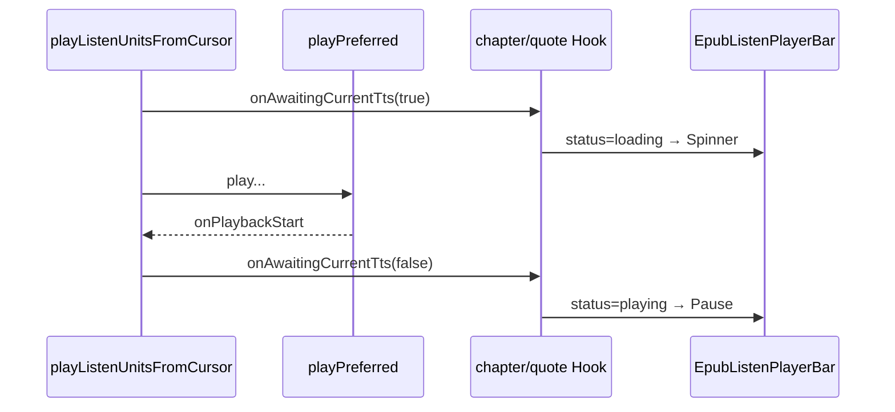

# 听书播放钮：当前 TTS pending 时 loading

## 文档角色

**增量专题**：当前正要播放的云端/本机 TTS **尚未出声** 时，底部播放条播放钮显示 **Spinner**（`status: 'loading'`）；**预取** 不触发 loading。

**姊妹文档**：[EPUB听书段落朗读.md](../ideas/epub/EPUB听书段落朗读.md)、[EPUB听书启动后预取.md](./EPUB听书启动后预取.md)、[EPUB听书播放器栏.md](./EPUB听书播放器栏.md)。

**延伸阅读**：[EPUB听书等待加载.md](./EPUB听书等待加载.md)（**2026-07-17 修复**：连播/多包等待时 loading 被 `onSentence` 盖掉）、[EPUB听书触控栏加载.md](./EPUB听书触控栏加载.md)（loading 期隐藏/锁定 Touch Bar）、[EPUB听书播放修复2026-07.md](./EPUB听书播放修复2026-07.md)。

---

## 1. 背景与目标

### 1.1 问题

首包或切句后合成仍在请求时，播放钮仍像可播/暂停态，用户不知道在等待。

### 1.2 目标

- 仅 **阻塞当前播放** 的 TTS 等待置 `loading`；`prefetchCloudTts` 不改 UI。
- 出声（`onPlaybackStart`）或结束/失败后回到 `playing`（或会话结束态）。
- 播放钮可点（软暂停路径仍可用），用 `aria-busy` + Spinner 表达等待。

---

## 2. 改动范围

| 路径 | 变更要点 |
| ---- | -------- |
| `apps/frontend/src/views/ebook/utils/epub/listen/epubListenPlayUnits.ts` | `onAwaitingCurrentTts` + `playCurrent` 包装 |
| `apps/frontend/src/views/ebook/hooks/useEpubChapterListen.ts` | 回调 → `syncState({ status })` |
| `apps/frontend/src/views/ebook/hooks/useEbookQuoteListen.ts` | 同上 |
| `apps/frontend/src/views/ebook/components/listen/EpubListenPlayerBar.tsx` | `status === 'loading'` 时 Spinner |
| `apps/frontend/src/i18n/locales/zh-CN.ts` / `en-US.ts` | `ebook.read.listenBook.loading` 文案（若已有则复用） |

---

## 3. 实现思路



1. `playCurrent` 在 `await playPreferred` 前后夹 `true/false`；出声回调里先 `false` 再转调原 `onPlaybackStart`（以便预取仍挂在出声后）。
2. Hook 在 gen 仍有效且未软暂停时同步 `loading`/`playing`。
3. Bar：`loading` 优先于 `playing` 渲染 Spinner。

---

## 4. 关键代码对比与注释

### 4.1 `PlayListenUnitsArgs` / `playCurrent`（`epubListenPlayUnits.ts`）

**对比范围**：该文件为本轮新增播放单元模块；下列为 **与 loading 相关的符号**（纯新增，仅贴改动后）。

**改动后** · `apps/frontend/src/views/ebook/utils/epub/listen/epubListenPlayUnits.ts`（当前，约 L19–L111）

```typescript
// 从光标播放听读单元时的参数包
export type PlayListenUnitsArgs = {
	// 章节/选区纯文本
	plain: string;
	// 句偏移列表
	sentences: SentenceSpan[];
	// 段单元
	units: ParagraphUnit[];
	// 起始句下标
	startSi: number;
	// 每次起播取倍速
	getRate: () => number;
	// 会话是否仍有效
	isActive: () => boolean;
	// 句高亮/跟随回调
	onSentence: (si: number, info: { forceCenter?: boolean }) => void;
	// 单元间隙清高亮
	onUnitIdle?: () => void;
	// 首句是否强制居中
	scrollCenterOnFirst?: boolean;
	// 当前播放 TTS 等待中（true）/ 已出声或结束（false）；预取不得调用
	onAwaitingCurrentTts?: (waiting: boolean) => void;
};

// ...（sentenceRaw / oncePrefetch / playListenUnitsFromCursor 外层未在此展开）

	/** 当前播放路径的 TTS 等待；预取勿走这里 */
	const playCurrent = async (
		// 待合成原文
		raw: string,
		// 传给 playPreferred 的选项
		opts: Parameters<typeof playPreferred>[1],
	) => {
		// 进入等待：通知 Hook 置 loading
		onAwaitingCurrentTts?.(true);
		try {
			// 保留调用方原来的出声回调（如 schedulePrefetch）
			const notifyStart = opts?.onPlaybackStart;
			// 真正播放 / 拉流
			await playPreferred(raw, {
				// 展开原选项
				...opts,
				// 出声时先结束 loading，再转调预取等逻辑
				onPlaybackStart: () => {
					// UI：可切到 playing
					onAwaitingCurrentTts?.(false);
					// 原回调（预取错开）
					notifyStart?.();
				},
			});
		} finally {
			// 失败、中断或自然结束都确保清掉 waiting，避免卡 Spinner
			onAwaitingCurrentTts?.(false);
		}
	};
```

**变更摘要**：播放路径独享 waiting 信号；预取走 `prefetchCloudTts`，不进 `playCurrent`。

---

### 4.2 Hook：`onAwaitingCurrentTts`（听书 / 听当前对称）

**对比范围**：`playListenUnitsFromCursor({...})` 参数对象中新增回调（基线无此字段）。

**改动后** · `apps/frontend/src/views/ebook/hooks/useEpubChapterListen.ts`（当前，约 L313–L316；听当前同构）

```typescript
// 当前句 TTS 等待 → 底栏 loading；预取不进此回调
onAwaitingCurrentTts: (waiting) => {
	// 代际失效或已软暂停则忽略，避免旧 gen 覆盖 UI
	if (!isGenActive(gen) || pausedRef.current) return;
	// waiting 时 loading，出声后 playing
	syncState({ status: waiting ? 'loading' : 'playing' });
},
```

**变更摘要**：把单元层布尔事件映射为既有 `status` 枚举，Bar 无需新 prop。

---

### 4.3 播放钮 Spinner（`EpubListenPlayerBar`）

**对比范围**：播放按钮分支（基线 `disabled={loading}` + 无 Spinner；现 Spinner + `aria-busy`）。

**改动前** · `apps/frontend/src/views/ebook/components/listen/EpubListenPlayerBar.tsx`（基线，播放钮附近）

```typescript
// Tooltip：播放中显示暂停，否则继续
<Tooltip
	content={
		// 仅区分 playing / resume
		playing
			? t('ebook.read.listenBook.pause')
			: t('ebook.read.listenBook.resume')
	}
>
	{/* 播放/暂停按钮 */}
	<Button
		type="button"
		variant="ghost"
		size="icon-sm"
		className="text-teal-500 shrink-0"
		// loading 时禁用点击
		disabled={loading}
		aria-label={
			// 无 loading 专用文案
			playing
				? t('ebook.read.listenBook.pause')
				: t('ebook.read.listenBook.resume')
		}
		onClick={onTogglePlay}
	>
		{/* 仅 Pause / Play 二态 */}
		{playing ? (
			<Pause className="size-4" aria-hidden />
		) : (
			<Play className="size-4" aria-hidden />
		)}
	</Button>
</Tooltip>
```

**改动后** · `apps/frontend/src/views/ebook/components/listen/EpubListenPlayerBar.tsx`（当前，约 L566–L595）

```typescript
// Tooltip：loading 优先提示「正在加载」
<Tooltip
	content={
		loading
			? t('ebook.read.listenBook.loading')
			: playing
				? t('ebook.read.listenBook.pause')
				: t('ebook.read.listenBook.resume')
	}
>
	{/* 播放钮：等待时可点（配合软暂停），用 busy 表达 */}
	<Button
		type="button"
		variant="ghost"
		size="icon-sm"
		className="text-teal-500 shrink-0"
		// 辅助技术：忙碌中
		aria-busy={loading}
		aria-label={
			loading
				? t('ebook.read.listenBook.loading')
				: playing
					? t('ebook.read.listenBook.pause')
					: t('ebook.read.listenBook.resume')
		}
		onClick={onTogglePlay}
	>
		{/* 三态：Spinner / Pause / Play */}
		{loading ? (
			<Spinner className="size-4 text-teal-500" aria-hidden />
		) : playing ? (
			<Pause className="size-4" aria-hidden />
		) : (
			<Play className="size-4" aria-hidden />
		)}
	</Button>
</Tooltip>
```

**变更摘要**：可见 Spinner；不再仅靠 `disabled` 表达等待。

---

## 5. 行为变化与兼容性

- **用户可见**：合成中播放钮转圈；出声后变暂停图标。
- **兼容**：`status: 'loading'` 枚举本就存在；本轮把「当前 TTS pending」也映射进去。
- **边界**：预取、软暂停中不应被旧 gen 的 `false` 误打成 playing（Hook 内守卫）。

---

## 6. 测试与回归建议

1. 云端听书 / 听当前：点播后钮先 Spinner，出声后 Pause。
2. 切句、切章：等待首包时同样 Spinner。
3. Network 慢时确认预取进行中 **不会** 单独把钮打成 loading。
4. 暂停再继续：软暂停路径不卡死在 Spinner。

---

## 7. 相关源码路径

| 说明 | 路径 |
| ---- | ---- |
| 播放单元 | `apps/frontend/src/views/ebook/utils/epub/listen/epubListenPlayUnits.ts` |
| 听书 Hook | `apps/frontend/src/views/ebook/hooks/useEpubChapterListen.ts` |
| 听当前 Hook | `apps/frontend/src/views/ebook/hooks/useEbookQuoteListen.ts` |
| 播放条 | `apps/frontend/src/views/ebook/components/listen/EpubListenPlayerBar.tsx` |

---

（若与仓库最新源码不一致，以源码为准）
