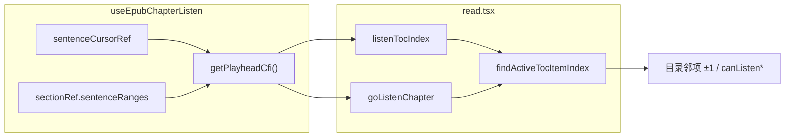

# EPUB 听书底栏：播头 CFI 定位目录邻项

> **文档角色**：修复同一 spine 文件含多个目录节时，听书底栏 ◀▶ 切章算错「当前章」的问题；用**当前分句播头 CFI** 参与 `findActiveTocItemIndex`，替代仅 spine 索引。  
> **延伸阅读**：[EPUB听书栏章节导航.md](./EPUB听书栏章节导航.md)（底栏切章基线）、[EPUB目录激活CFI.md](./EPUB目录激活CFI.md)（目录高亮 / `findActiveTocItemIndex` 的 CFI 消歧）、[EPUB听书目录锚点启动.md](./EPUB听书目录锚点启动.md)（目录跳转锚点与起播 CFI）。

## 1. 背景与目标

| 场景 | 旧行为 | 期望 |
|------|--------|------|
| 同一 EPUB spine 项对应多个 TOC 节（如一章内多节标题） | `findActiveTocItemIndex` 只传 `epubSpineIndex`，同 spine 多节时恒取**第一项** | 用**当前正在朗读的分句**在 DOM 上的 CFI，在同 spine 候选里选出**真正所在节** |
| 听书播放中点底栏「上一章 / 下一章」 | 邻章索引可能偏移，跳到错误目录项 | 与目录抽屉高亮、点目录切章**同一套**位置语义 |
| 阅读视图 `relocated` CFI | 用户未滚动时仍可能滞后于 TTS 播头 | 播头优先取 hook 内 `sentenceRanges[sentenceCursor]` 生成的 CFI，再回退阅读 CFI |

**根因**：`goListenChapter` 与 `listenTocIndex`（控制 ◀▶ 是否可点）原先只向 `findActiveTocItemIndex` 传入 spine 索引。当多个目录项共享同一 `spineIndex` 时，`activeAmongSameSpine` 在无 `epubCfi` 时会回退到同 spine **第一项**（见 `tocActiveIndex.ts` 注释），导致播到第 2、3 节时仍被当作第 1 节，上下章邻项计算错误。

**目标**：在听书活跃态下，为目录定位补充**播头 CFI**；`findActiveTocItemIndex` 的 CFI 消歧细节见姊妹稿 [EPUB目录激活CFI.md](./EPUB目录激活CFI.md)。

## 2. 改动范围

| 路径 | 说明 |
|------|------|
| `apps/frontend/src/views/ebook/hooks/useEpubChapterListen.ts` | 新增 `getPlayheadCfi`；`return` 导出供阅读页调用 |
| `apps/frontend/src/views/ebook/read.tsx` | `listenTocIndex`、`goListenChapter` 调用 `findActiveTocItemIndex` 时传入 `epubCfi` + `getRendition` |
| `apps/frontend/src/views/ebook/utils/common/tocActiveIndex.ts` | **未改**（本轮消费方补参；CFI 消歧逻辑见 [EPUB目录激活CFI.md](./EPUB目录激活CFI.md)） |

## 3. 实现思路



**要点**

1. **`getPlayheadCfi`**：从当前分句 `Range` 经 `cfiFromDomRange(rend, range)` 生成 CFI；无 rendition / 无 range 时回退 `getCurrentCfiRef`（阅读 relocated），保证弱网下仍有定位。
2. **勿直接用 `readingCfi` 作首选**：TTS 已推进到下一句时，阅读视图 CFI 可能尚未 `relocated`；播头 CFI 与朗读进度同步。
3. **回退链**：`getPlayheadCfi() || readingCfi || currentEpubCfiRef.current`，与目录高亮、切章其它路径一致。
4. **`getRendition`**：传给 `findActiveTocItemIndex`，供 `activeAmongSameSpine` 做 CFI 比较（姊妹稿详述）。

## 4. 关键代码对比与注释

### 4.1 `getPlayheadCfi`（`useEpubChapterListen.ts`）

**对比范围**：纯新增 `useCallback` 全符号；hook `return` 增加 `getPlayheadCfi` 导出。

**改动后** · `apps/frontend/src/views/ebook/hooks/useEpubChapterListen.ts`（当前，约 L809–838）

```typescript
// 当前分句播头 CFI：底栏上下章定位目录用（勿用阅读 relocated CFI，会滞后）
const getPlayheadCfi = useCallback((): string | undefined => {
	// 取 epub.js rendition，用于 DOM Range → CFI 转换
	const rend = getRenditionRef.current();
	// 当前章节听读上下文（含 sentenceRanges、spine 等）
	const ctx = sectionRef.current;
	// 无播头时的回退：阅读视图当前 CFI（relocated 或最近写入）
	const fallback = getCurrentCfiRef.current()?.trim() || undefined;
	// rendition 或听读上下文尚未就绪时直接回退
	if (!rend || !ctx) return fallback;
	// 当前句 cursor 对应的分句 DOM Range
	const range = ctx.sentenceRanges[sentenceCursorRef.current];
	// 该句 Range 不存在（章末、重建中）时回退
	if (!range) return fallback;
	// 尝试把分句 Range 转为 epub CFI 字符串
	try {
		// 转换成功则 trim 后返回，否则仍用 fallback
		return cfiFromDomRange(rend, range)?.trim() || fallback;
	} catch {
		// cfiFromDomRange 异常（iframe 卸载等）时安全回退
		return fallback;
	}
}, []);

// hook 对外暴露的状态与方法集合
return {
	// 展开听书状态：status、spineIndex、sentenceIndex 等
	...state,
	// 是否处于 loading / playing / paused 听书会话
	isActive,
	// 顶栏听书开关
	toggleChapterListen,
	// 播放 / 暂停切换
	togglePlay,
	// 暂停 TTS
	pause,
	// 续播
	resume,
	// 停止听书
	stop,
	// 目录 / 切章后按目标 CFI 重开（同 HTML 多节见 toc-anchor-start）
	restartFromChapterStart,
	// 上一句（分句菜单仍用）
	prevSentence: () => seekSentence(-1),
	// 下一句（分句菜单仍用）
	nextSentence: () => seekSentence(1),
	// 跳转到指定句下标
	goToSentence,
	// 设置倍速
	setRate,
	// 新增：当前分句播头 CFI，供 read.tsx 目录邻项定位
	getPlayheadCfi,
};
```

**变更摘要**：新增 `getPlayheadCfi`；`return` 增加同名导出。基线 HEAD 无此符号，`return` 不含 `getPlayheadCfi`。

---

### 4.2 `listenTocIndex` 计算（`read.tsx`）

**对比范围**：听书活跃时 `findActiveTocItemIndex` 的完整入参表达式（const 赋值右值）。

**改动前** · `apps/frontend/src/views/ebook/read.tsx`（基线 HEAD，约 L1334–1338）

```typescript
// 听书中时当前目录项索引；非听书为 -1
const listenTocIndex = chapterListen.isActive
	// 听书活跃：按 TOC 与当前位置求索引
	? findActiveTocItemIndex(tocItems, {
			// 仅 spine 索引：同 spine 多节时无法消歧
			epubSpineIndex: epubListenBar.spineIndex,
		})
	// 未听书：无底栏目录锚点
	: -1;
```

**改动后** · `apps/frontend/src/views/ebook/read.tsx`（当前，约 L1359–1368）

```typescript
// 听书中时当前目录项索引；非听书为 -1
const listenTocIndex = chapterListen.isActive
	// 听书活跃：按 TOC 与当前位置求索引
	? findActiveTocItemIndex(tocItems, {
			// spine 索引：先筛出同文件候选
			epubSpineIndex: epubListenBar.spineIndex,
			// 播头 CFI 优先，消歧同 spine 多节；再回退阅读 CFI
			epubCfi:
				chapterListen.getPlayheadCfi() ||
				readingCfi ||
				currentEpubCfiRef.current,
			// rendition 供 activeAmongSameSpine 做 CFI 比较
			getRendition: () => epubNavRef.current?.getRendition() ?? null,
		})
	// 未听书：无底栏目录锚点
	: -1;
```

**变更摘要**：补充 `epubCfi` 与 `getRendition`；`canListenPrevChapter` / `canListenNextChapter` 依赖 `listenTocIndex`，一并修正可点状态。

---

### 4.3 `goListenChapter`（`read.tsx`）

**对比范围**：完整 `useCallback`（声明 → 闭合含 deps）。

**改动前** · `apps/frontend/src/views/ebook/read.tsx`（基线 HEAD，约 L1351–1383）

```typescript
// 听书底栏切章：优先目录相邻项（与点目录一致）；无目录时回退 spine±1
const goListenChapter = useCallback(
	// delta：-1 上一章，+1 下一章
	(delta: -1 | 1) => {
		// 读 ref 避免闭包陈旧
		const listen = chapterListenRef.current;
		// 非听书态不处理
		if (!listen.isActive) return;

		// 当前所在目录项索引
		const active = findActiveTocItemIndex(tocItems, {
			// 仅用 listen.spineIndex，同 spine 多节时 active 可能偏到第一节
			epubSpineIndex: listen.spineIndex,
		});
		// 命中目录项时走 TOC 邻项
		if (active >= 0) {
			// 在 active 基础上 ±1 找第一个有效 EPUB href
			const neighbor = findListenTocNeighbor(active, delta);
			// 邻项 href
			const href = neighbor?.href?.trim();
			// 有 href 则走统一目录跳转（内含 stop + go + restartFromChapterStart）
			if (href) {
				goEpubTocHref(href, neighbor?.spineIndex);
				return;
			}
		}

		// 无目录匹配：回退 spine 数组 ±1
		const spine = epubNavRef.current?.getBook()?.spine as
			| {
					// spine 长度
					length?: number;
					// 按索引取 spine 项
					get?: (i: number) => { href?: string } | null;
			  }
			| undefined;
		// spine 总节数
		const len = spine?.length ?? 0;
		// 目标 spine 下标
		const target = listen.spineIndex + delta;
		// 无 get 或越界则放弃
		if (!spine?.get || target < 0 || target >= len) return;
		// 目标节 href
		const href = spine.get(target)?.href?.trim();
		// 无 href 则放弃
		if (!href) return;
		// spine 回退路径同样走 goEpubTocHref
		goEpubTocHref(href, target);
	},
	// 依赖：邻项查找、目录跳转、toc 列表（无 readingCfi）
	[findListenTocNeighbor, goEpubTocHref, tocItems],
);
```

**改动后** · `apps/frontend/src/views/ebook/read.tsx`（当前，约 L1381–1419）

```typescript
// 听书底栏切章：优先目录相邻项（与点目录一致）；无目录时回退 spine±1
const goListenChapter = useCallback(
	// delta：-1 上一章，+1 下一章
	(delta: -1 | 1) => {
		// 读 ref 避免闭包陈旧
		const listen = chapterListenRef.current;
		// 非听书态不处理
		if (!listen.isActive) return;

		// 当前所在目录项索引（含播头 CFI 消歧）
		const active = findActiveTocItemIndex(tocItems, {
			// spine 索引筛候选
			epubSpineIndex: listen.spineIndex,
			// 用当前分句播头，避免阅读 CFI 滞后导致邻章算错
			epubCfi:
				listen.getPlayheadCfi() ||
				readingCfi ||
				currentEpubCfiRef.current,
			// rendition 供 CFI 比较
			getRendition: () => epubNavRef.current?.getRendition() ?? null,
		});
		// 命中目录项时走 TOC 邻项
		if (active >= 0) {
			// 在 active 基础上 ±1 找第一个有效 EPUB href
			const neighbor = findListenTocNeighbor(active, delta);
			// 邻项 href
			const href = neighbor?.href?.trim();
			// 有 href 则走统一目录跳转（内含 stop + go + restartFromChapterStart）
			if (href) {
				goEpubTocHref(href, neighbor?.spineIndex);
				return;
			}
		}

		// 无目录匹配：回退 spine 数组 ±1
		const spine = epubNavRef.current?.getBook()?.spine as
			| {
					// spine 长度
					length?: number;
					// 按索引取 spine 项
					get?: (i: number) => { href?: string } | null;
			  }
			| undefined;
		// spine 总节数
		const len = spine?.length ?? 0;
		// 目标 spine 下标
		const target = listen.spineIndex + delta;
		// 无 get 或越界则放弃
		if (!spine?.get || target < 0 || target >= len) return;
		// 目标节 href
		const href = spine.get(target)?.href?.trim();
		// 无 href 则放弃
		if (!href) return;
		// spine 回退路径同样走 goEpubTocHref
		goEpubTocHref(href, target);
	},
	// 依赖：邻项查找、目录跳转、toc 列表、阅读 CFI（回退链用）
	[findListenTocNeighbor, goEpubTocHref, tocItems, readingCfi],
);
```

**变更摘要**：`findActiveTocItemIndex` 入参增加 `epubCfi` 与 `getRendition`；deps 增加 `readingCfi`。spine±1 回退分支未改。

---

### 4.4 `findActiveTocItemIndex` 与 CFI 消歧（简述）

本轮**未修改** `apps/frontend/src/views/ebook/utils/common/tocActiveIndex.ts`。消费方传入 `epubCfi` 后，当 `epubSpineIndex` 对应多个目录项时，内部 `activeAmongSameSpine` 会用 CFI 在候选中选最接近当前位置的节；无 CFI 时仍回退同 spine 第一项（旧 bug 来源）。

完整算法、与目录高亮共用路径、以及 `TocActivePosition` 字段说明见 **[EPUB目录激活CFI.md](./EPUB目录激活CFI.md)**。

## 5. 兼容性与影响

| 维度 | 说明 |
|------|------|
| 破坏性 | 无 API 变更；仅听书活跃态下目录邻项计算更准 |
| 非听书 | `listenTocIndex === -1`，`goListenChapter` 早退，行为不变 |
| 单节 spine | 仅一个 TOC 项时 CFI 消歧与旧 spine-only 结果一致 |
| 连续滚动 / 分页 | 共用 `cfiFromDomRange`；iframe 卸载时走 fallback CFI |
| 关联 | 与 [EPUB听书栏章节导航.md](./EPUB听书栏章节导航.md) 切章链路、`goEpubTocHref` + `restartFromChapterStart` 仍兼容 |

## 6. 测试建议

1. **同 spine 多节**：选一本 TOC 中多项共享同一 HTML 文件的 EPUB；听至第 2 节后点「下一章」，应进入第 3 节而非重复第 2 节或跳错章。
2. **底栏禁用态**：第一章「上一章」、末章「下一章」在 `listenTocIndex` 修正后应与目录结构一致。
3. **播头回退**：暂停后立即切章（无 relocated），应仍凭 `getPlayheadCfi` 或 `currentEpubCfiRef` 正确定位。
4. **回归**：目录抽屉点选切章、分句菜单、听当前（不切章）不受影响。

## 7. 相关源码路径

| 说明 | 路径 |
|------|------|
| 播头 CFI | `apps/frontend/src/views/ebook/hooks/useEpubChapterListen.ts` |
| 底栏切章 / listenTocIndex | `apps/frontend/src/views/ebook/read.tsx` |
| 目录活跃索引 | `apps/frontend/src/views/ebook/utils/common/tocActiveIndex.ts` |
| 切章基线专题 | [EPUB听书栏章节导航.md](./EPUB听书栏章节导航.md) |
| CFI 消歧姊妹稿 | [EPUB目录激活CFI.md](./EPUB目录激活CFI.md) |

---

（若与仓库最新源码不一致，以源码为准）
