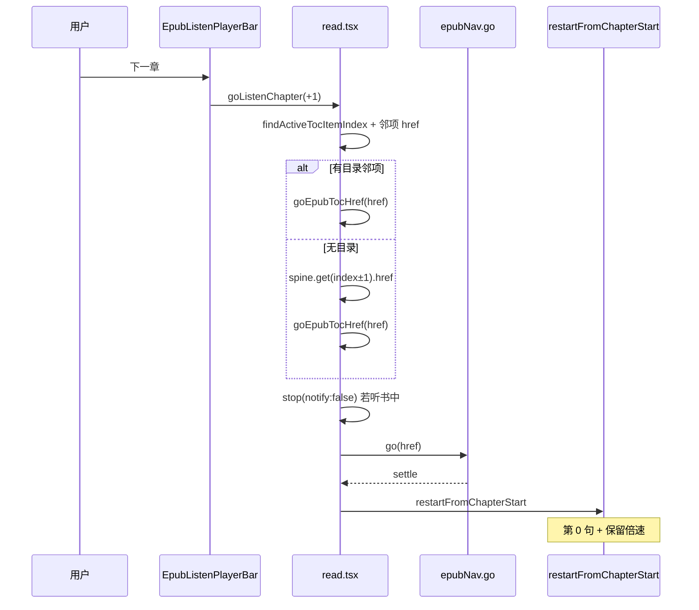

# EPUB 听书底栏：上一章 / 下一章

> **文档角色**：听书底部播放条 ◀▶ 由「上下句」改为「上下章」；与点目录共用 `go → restartFromChapterStart`。  
> **延伸阅读**：[EPUB听书目录章节重启.md](./EPUB听书目录章节重启.md)（目录切章重开）、[EPUB听书栏播放头目录.md](./EPUB听书栏播放头目录.md)（播头 CFI 目录邻项）、[EPUB听书播放器栏.md](./EPUB听书播放器栏.md)（播放条基线）、[../ideas/EPUB听书播放优化.md](../ideas/epub/EPUB听书播放优化.md)（M2 规划，本文归档落地）。

## 1. 背景与目标

| 场景 | 旧行为 | 期望 |
|------|--------|------|
| 听书底栏点 ◀ / ▶ | 上一句 / 下一句 | **上一章 / 下一章**，并从该章第 0 句开听 |
| 句级跳转 | 底栏 ◀▶ + 分句菜单 | **仅分句菜单** |
| 听当前共用底栏 | 同样暴露上下句 | 切章按钮 **禁用**（选区语义不切章） |
| 切章目标 | — | 优先 **目录相邻项**（与点目录一致）；无目录时回退 `spine±1` |

## 2. 改动范围

| 路径 | 说明 |
|------|------|
| `apps/frontend/src/views/ebook/components/listen/EpubListenPlayerBar.tsx` | props / 文案 / disabled 改切章 |
| `apps/frontend/src/views/ebook/read.tsx` | `goEpubTocHref`、`goListenChapter`、`canListen*`；TOC `onSelect` 复用 |
| `apps/frontend/src/i18n/locales/zh-CN.ts` / `en-US.ts` | `prevChapter` / `nextChapter` |

## 3. 实现思路



**决策**

1. **目录优先于 spine±1**：用户心智是「章」，与 TOC 一致；避免落到封面/空 spine。
2. **复用目录重开路径**：不新开 TTS 协议；`goEpubTocHref` 与 TOC 抽屉同源。
3. **听当前不切章**：`canPrev/NextChapter` 依赖 `chapterListen.isActive`。

## 4. 关键实现（改动前 / 改动后）

### 4.1 播放条 props 与 ◀▶（`EpubListenPlayerBar`）

**对比范围**：`type Props` 中导航回调字段 + 组件内 ◀▶ 按钮区（组件其余未改，用 `// ...` 对称省略）。

**改动前** · `apps/frontend/src/views/ebook/components/listen/EpubListenPlayerBar.tsx`（基线 HEAD，约 L473–L496 / L654–L679）

```tsx
// 播放条对外 props：状态、句进度、倍速与回调
type Props = {
	// 听书会话状态：idle / loading / playing / paused
	status: ChapterListenStatus;
	// 当前 spine 索引（进度文案「第 N 章」）
	spineIndex: number;
	// 当前句下标（0-based）
	sentenceIndex: number;
	// 本章句总数
	sentenceCount: number;
	// 分句菜单预览文案
	sentenceLabels: string[];
	// 当前倍速
	rate: number;
	// 播放/暂停切换
	onTogglePlay: () => void;
	// 停止听书
	onStop: () => void;
	// 上一句（旧底栏导航）
	onPrevSentence: () => void;
	// 下一句（旧底栏导航）
	onNextSentence: () => void;
	// 分句菜单跳句
	onGoToSentence: (index: number) => void;
	// 倍速变更
	onRateChange: (rate: number) => void;
	// ...（未改动：sentenceMenuOpen / rateMenuOpen / menuChromeStyle）
};

// ...（未改动：组件前半播放/停止/进度/分句菜单）

			// 上一句 Tooltip
			<Tooltip content={t('ebook.read.listenBook.prevSentence')}>
				{/* 图标按钮：加载中或已是首句则禁用 */}
				<Button
					type="button"
					variant="ghost"
					size="icon-sm"
					className="text-textcolor/80 shrink-0"
					disabled={loading || sentenceIndex <= 0}
					aria-label={t('ebook.read.listenBook.prevSentence')}
					onClick={onPrevSentence}
				>
					{/* 左箭头图标 */}
					<ChevronLeft className="size-4" aria-hidden />
				</Button>
			</Tooltip>

			// 下一句 Tooltip
			<Tooltip content={t('ebook.read.listenBook.nextSentence')}>
				{/* 图标按钮：加载中或已是末句则禁用 */}
				<Button
					type="button"
					variant="ghost"
					size="icon-sm"
					className="text-textcolor/80 shrink-0"
					disabled={loading || sentenceIndex >= sentenceCount - 1}
					aria-label={t('ebook.read.listenBook.nextSentence')}
					onClick={onNextSentence}
				>
					{/* 右箭头图标 */}
					<ChevronRight className="size-4" aria-hidden />
				</Button>
			</Tooltip>

// ...（未改动：倍速菜单）
```

**改动后** · `apps/frontend/src/views/ebook/components/listen/EpubListenPlayerBar.tsx`（当前，约 L473–L511 / L658–L684）

```tsx
// 播放条对外 props：导航改为切章，句跳转仍走分句菜单
type Props = {
	// 听书会话状态：idle / loading / playing / paused
	status: ChapterListenStatus;
	// 当前 spine 索引（进度文案「第 N 章」）
	spineIndex: number;
	// 当前句下标（0-based，供分句菜单高亮）
	sentenceIndex: number;
	// 本章句总数
	sentenceCount: number;
	// 分句菜单预览文案
	sentenceLabels: string[];
	// 当前倍速
	rate: number;
	// 播放/暂停切换
	onTogglePlay: () => void;
	// 停止听书
	onStop: () => void;
	// 上一章（新底栏导航）
	onPrevChapter: () => void;
	// 下一章（新底栏导航）
	onNextChapter: () => void;
	// 是否可上一章（听书中且非首章；听当前为 false）
	canPrevChapter?: boolean;
	// 是否可下一章
	canNextChapter?: boolean;
	// 分句菜单跳句（承接原句级导航）
	onGoToSentence: (index: number) => void;
	// 倍速变更
	onRateChange: (rate: number) => void;
	// ...（未改动：sentenceMenuOpen / rateMenuOpen / menuChromeStyle）
};

// 解构 props：导航改为章回调与 can* 默认 false
export function EpubListenPlayerBar({
	status,
	spineIndex,
	sentenceIndex,
	sentenceCount,
	sentenceLabels,
	rate,
	onTogglePlay,
	onStop,
	onPrevChapter,
	onNextChapter,
	canPrevChapter = false,
	canNextChapter = false,
	onGoToSentence,
	onRateChange,
	// ...（未改动：菜单受控与 chromeStyle）
}: Props) {
	// ...（未改动：组件前半）

			// 上一章 Tooltip（文案 key 换 prevChapter）
			<Tooltip content={t('ebook.read.listenBook.prevChapter')}>
				{/* 加载中或 canPrevChapter 为 false 时禁用 */}
				<Button
					type="button"
					variant="ghost"
					size="icon-sm"
					className="text-textcolor/80 shrink-0"
					disabled={loading || !canPrevChapter}
					aria-label={t('ebook.read.listenBook.prevChapter')}
					onClick={onPrevChapter}
				>
					{/* 左箭头图标，视觉与旧版一致 */}
					<ChevronLeft className="size-4" aria-hidden />
				</Button>
			</Tooltip>

			// 下一章 Tooltip
			<Tooltip content={t('ebook.read.listenBook.nextChapter')}>
				{/* 加载中或 canNextChapter 为 false 时禁用 */}
				<Button
					type="button"
					variant="ghost"
					size="icon-sm"
					className="text-textcolor/80 shrink-0"
					disabled={loading || !canNextChapter}
					aria-label={t('ebook.read.listenBook.nextChapter')}
					onClick={onNextChapter}
				>
					{/* 右箭头图标 */}
					<ChevronRight className="size-4" aria-hidden />
				</Button>
			</Tooltip>

	// ...（未改动：倍速菜单与闭合）
}
```

**变更摘要**：`onPrev/NextSentence` → `onPrev/NextChapter` + `can*`；禁用条件改为章边界而非句边界；句跳转保留在分句菜单。

### 4.2 `goEpubTocHref` / `goListenChapter`（`read.tsx`）

**对比范围**：纯新增符号（基线无底栏切章）；TOC `onSelect` 改为调用 `goEpubTocHref`。

**改动前**：无 `goEpubTocHref` / `goListenChapter`；底栏接线为 `onPrevSentence={epubListenBar.prevSentence}`。

**改动后** · `apps/frontend/src/views/ebook/read.tsx`（当前，约 L1300–L1405）

```tsx
	/** EPUB 目录/听书切章共用：go → 听书中则 restartFromChapterStart */
	const goEpubTocHref = useCallback(
		// href：目录或 spine 链接；spineIndex：可选预写当前章索引
		(href: string, spineIndex?: number) => {
			// 去掉首尾空白，空串直接返回
			const target = href.trim();
			// 无有效 href 则不导航
			if (!target) return;
			// 若调用方已知目标 spine，先写入 ref/state，便于听书重开取 hint
			if (spineIndex != null && Number.isFinite(spineIndex)) {
				epubSpineIndexRef.current = spineIndex;
				setEpubSpineIndex(spineIndex);
			}
			// 读听书 hook 最新引用（避免闭包陈旧）
			const listen = chapterListenRef.current;
			// 切章前是否正在听书（决定是否重开）
			const wasListening = listen.isActive;
			// 听书中：解锁手势 + 静默 stop（不收底栏 notify）
			if (wasListening) {
				primePlaybackForUserGesture();
				listen.stop({ notify: false });
			}
			// 异步 go，避免阻塞点击；settle 失败也不挡重开
			void (async () => {
				try {
					// 分页 display(href)；连续滚动走 displayEpubScrolledHref
					await epubNavRef.current?.go(target);
				} catch {
					// settle/trim 抛错忽略，仍尝试按当前 location 重开
				}
				// 跳转后从 rendition 回读真实 spine
				const rend = epubNavRef.current?.getRendition();
				const loc = (
					rend as
						| { location?: { start?: { index?: number } } }
						| null
						| undefined
				)?.location?.start?.index;
				// 合法 index 则同步到阅读进度 state
				if (loc != null && Number.isFinite(loc)) {
					epubSpineIndexRef.current = loc;
					setEpubSpineIndex(loc);
				}
				// 听书会话：从新章第 0 句 restart（保留倍速）
				if (wasListening) {
					chapterListenRef.current.restartFromChapterStart();
				}
			})();
		},
		[],
	);

	// 听书激活时，用听书 spine 映射当前目录项下标
	const listenTocIndex = chapterListen.isActive
		? findActiveTocItemIndex(tocItems, {
				epubSpineIndex: epubListenBar.spineIndex,
			})
		: -1;

	// 沿目录 delta 方向找下一个带 EPUB href 的项（跳过 PDF 页链）
	const findListenTocNeighbor = useCallback(
		(from: number, delta: -1 | 1): EbookTocItem | null => {
			for (let i = from + delta; i >= 0 && i < tocItems.length; i += delta) {
				const href = tocItems[i]?.href?.trim();
				if (href && parsePdfPageHref(href) == null) return tocItems[i];
			}
			return null;
		},
		[tocItems],
	);

	/** 听书底栏切章：优先目录相邻项；无目录时回退 spine±1 */
	const goListenChapter = useCallback(
		(delta: -1 | 1) => {
			const listen = chapterListenRef.current;
			// 仅听书会话切章；听当前直接 return
			if (!listen.isActive) return;

			// 当前听书位置对应的目录项
			const active = findActiveTocItemIndex(tocItems, {
				epubSpineIndex: listen.spineIndex,
			});
			// 目录可用时走邻项
			if (active >= 0) {
				const neighbor = findListenTocNeighbor(active, delta);
				const href = neighbor?.href?.trim();
				if (href) {
					goEpubTocHref(href, neighbor?.spineIndex);
					return;
				}
			}

			// 回退：epubjs Spine.get(index±1)
			const spine = epubNavRef.current?.getBook()?.spine as
				| {
						length?: number;
						get?: (i: number) => { href?: string } | null;
				  }
				| undefined;
			const len = spine?.length ?? 0;
			const target = listen.spineIndex + delta;
			if (!spine?.get || target < 0 || target >= len) return;
			const href = spine.get(target)?.href?.trim();
			if (!href) return;
			goEpubTocHref(href, target);
		},
		[findListenTocNeighbor, goEpubTocHref, tocItems],
	);

	// 上一章是否可点：听书中 + 有目录前项或 spine>0
	const canListenPrevChapter =
		chapterListen.isActive &&
		(listenTocIndex >= 0
			? findListenTocNeighbor(listenTocIndex, -1) != null
			: epubListenBar.spineIndex > 0);
	// 下一章是否可点：听书中 + 有目录后项或未到 spine 末
	const canListenNextChapter =
		chapterListen.isActive &&
		(listenTocIndex >= 0
			? findListenTocNeighbor(listenTocIndex, 1) != null
			: epubNavReady &&
				epubListenBar.spineIndex >= 0 &&
				epubListenBar.spineIndex <
					((epubNavRef.current?.getBook()?.spine as { length?: number })
						?.length ?? 0) -
						1);
```

**变更摘要**：底栏切章与 TOC 共用 `goEpubTocHref`；邻章解析优先 TOC。

### 4.3 i18n

新增 key（保留旧 `prevSentence` / `nextSentence` 供规格/历史引用）：

| key | zh | en |
|-----|----|----|
| `ebook.read.listenBook.prevChapter` | 上一章 | Previous chapter |
| `ebook.read.listenBook.nextChapter` | 下一章 | Next chapter |

## 5. 行为变化与兼容性

- 底栏 ◀▶：**章**导航；句跳转用分句菜单。
- 听当前：切章按钮禁用。
- 目录点选：行为与改前「听书中目录续听」一致，仅实现抽成共用函数。
- Hook 仍导出 `prevSentence` / `nextSentence`，底栏不再接线。

## 6. 测试与回归建议

- [ ] 听书中点下一章 → 跳到目录下一章并从第 1 句播，倍速不变
- [ ] 首章上一章 / 末章下一章按钮禁用
- [ ] 听当前时 ◀▶ 禁用，分句菜单仍可跳句
- [ ] 连续滚动 + 分页两种翻页方式切章均可续听
- [ ] 点目录切章与底栏切章效果一致

## 7. 相关文档与代码索引

| 说明 | 路径 |
|------|------|
| 目录切章重开 | `docs/ebook/EPUB听书目录章节重启.md` |
| 播放条 | `apps/frontend/src/views/ebook/components/listen/EpubListenPlayerBar.tsx` |
| 阅读页接线 | `apps/frontend/src/views/ebook/read.tsx` |
| 听书 Hook | `apps/frontend/src/views/ebook/hooks/useEpubChapterListen.ts` |

---

（若与仓库最新源码不一致，以源码为准）
