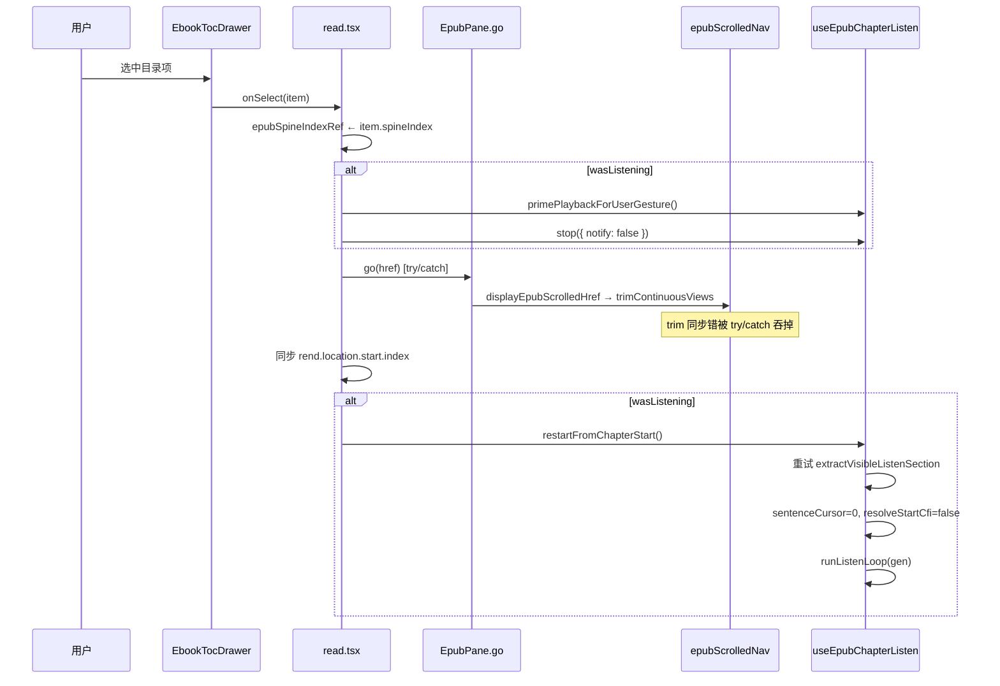

# EPUB 听书：目录切章从第 0 句重开

> **文档角色**：听书播放中点击 **书籍目录** 切章时自动续听并保留倍速；修复 `go()` / `trimContinuousViews` 同步抛错导致听书不重开。  
> **起播句更新（2026-07-16）**：同 HTML 多目录锚点时，不再固定文件「第 0 句」，改为按目标 CFI `mode: 'after'` 起播——见 [EPUB听书目录锚点启动.md](./EPUB听书目录锚点启动.md)。本文仍描述 **重开链路与 trim 容错**。  
> **延伸阅读**：[EPUB听书目录锚点启动.md](./EPUB听书目录锚点启动.md)（锚点起播）、[EPUB目录CFI导航.md](./EPUB目录CFI导航.md)（目录 CFI 跳转）、[EPUB章节听书.md](./EPUB章节听书.md)（听书 MVP）、[EPUB听书栏章节导航.md](./EPUB听书栏章节导航.md)（底栏切章）、[../ideas/EPUB目录章节顶部对齐.md](../ideas/epub/EPUB目录章节顶部对齐.md)（章首对齐规划）。

## 1. 背景与目标

### 1.1 现象与用户期望

| 场景 | 旧行为 | 期望 |
|------|--------|------|
| 听书播放中点目录另一章 | 仅 `stop` + `syncToCurrentView`，或 `go()` 因 `trimContinuousViews` **同步抛错** 中断，**不重开听书** | 选中章 **自动从第 0 句** 开听，**保留倍速** |
| 目录 `go()` settle 阶段 | `manager.trim()` 读 `views` 时 manager 未就绪 → **同步 throw**，外层 `await go()` reject | `go()` 对齐仍尽量完成；听书重开 **不依赖** `go()` 必须 resolve |
| 旧 `syncToCurrentView` | `resolveStartCfiRef = true`，按 **当前 CFI** 取起始句，非章首 | 目录切章等同 **新开一章**，固定 **句 0** |

### 1.2 目标

1. 听书激活时 TOC `onSelect`：**prime → stop（静默）→ go（try/catch）→ restartFromChapterStart**。
2. `trimContinuousViews`：**try/catch** 包住 `trim.call(manager)`，吞掉 manager/views 未就绪的同步错误。
3. 用 **`restartFromChapterStart`** 替代 **`syncToCurrentView`**：`resolveStartCfiRef = false`，与 `startFromCurrentPosition` 同路径，**句 0** 起播，**保留 `rateRef`**。

## 2. 改动范围

| 路径 | 说明 |
|------|------|
| `apps/frontend/src/views/ebook/utils/epub/reader/epubScrolledNav.ts` | `trimContinuousViews` try/catch + `trim.call(manager)` |
| `apps/frontend/src/views/ebook/read.tsx` | `chapterListenRef`；TOC `onSelect(item)`：spine 预写、prime/stop/go/restart |
| `apps/frontend/src/views/ebook/hooks/useEpubChapterListen.ts` | 新增 `restartFromChapterStart`；导出替换 `syncToCurrentView`；`stopInternal` 保留倍速；`stop(opts?)` |

**关联（本专题不展开 diff）**：同轮 `epubScrolledNav` 还扩展了 `scrollEpubRangeToViewCenter` / `bringEpubCfiIntoScrolledView`（跨章 trim 后 CFI 回退），供听书高亮跟随；目录重开主链路不直接调用。

## 3. 实现思路

### 3.1 调用链（听书中点目录）



### 3.2 关键决策

| # | 决策 | 理由 |
|---|------|------|
| 1 | TOC 前 **`stop({ notify: false })`** | 清 TTS/高亮/代际，但不触发 `onSessionEnd` 收底栏；跳转后 **`restartFromChapterStart`** 再开 |
| 2 | **`go()` try/catch** | `display` 已成功时 settle/trim 仍可能 throw；不能因此跳过 restart |
| 3 | **`chapterListenRef`** | `onSelect` 闭包/async 内读 **最新** hook API，避免 stale `chapterListen` |
| 4 | **`restartFromChapterStart` 替代 `syncToCurrentView`** | 旧版 `resolveStartCfiRef=true` 非章首；新版固定句 0 + `usePrepare` 与正常开听一致 |
| 5 | **`stopInternal` 保留 `rateRef`** | 目录 stop 后若误写 `IDLE_STATE.rate=1` 会丢用户倍速 |
| 6 | **`trimContinuousViews` try/catch** | `Promise.resolve(trim()).catch()` **捕不到** trim 内同步 throw |

### 3.3 未采用

- **保留 `syncToCurrentView` 仅改 CFI 标志**：命名与「同步当前视口 CFI」语义混淆；目录场景 product 明确要章首。
- **不 stop 直接 restart**：旧 Audio/高亮/代际会与新 loop 打架。
- **在 `EbookTocDrawer` 内听书逻辑**：跳转与听书状态在 `read.tsx` 已集中，YAGNI。

## 4. 关键代码对比与注释

### 4.1 `trimContinuousViews`（`apps/frontend/src/views/ebook/utils/epub/reader/epubScrolledNav.ts`）

**对比范围**：`trimContinuousViews` 全函数。

**改动前** · `apps/frontend/src/views/ebook/utils/epub/reader/epubScrolledNav.ts`（基线 HEAD，约 L190–L196）

```typescript
// 连续滚动 settle 后裁剪视口外 epub-view，减轻邻章 prepend 顶 scroll
async function trimContinuousViews(rend: Rendition): Promise<void> {
	// 从 rendition 上取出 manager.trim 方法（epub.js continuous manager）
	const trim = (
		rend as unknown as { manager?: { trim?: () => Promise<unknown> } }
	).manager?.trim;
	// manager 或 trim 不存在则无需裁剪
	if (!trim) return;
	// 仅对 Promise rejection 做 catch；trim 内部同步读 views 抛错会穿透
	await Promise.resolve(trim()).catch(() => undefined);
}
```

**改动后** · `apps/frontend/src/views/ebook/utils/epub/reader/epubScrolledNav.ts`（当前，约 L190–L202）

```typescript
// 连续滚动 settle 后裁剪视口外 epub-view，减轻邻章 prepend 顶 scroll
async function trimContinuousViews(rend: Rendition): Promise<void> {
	// 先取 manager 本体，便于 trim.call(manager) 绑定 this
	const manager = (
		rend as unknown as { manager?: { trim?: () => Promise<unknown> } }
	).manager;
	// 再取 trim 方法引用
	const trim = manager?.trim;
	// manager 或 trim 不存在则无需裁剪
	if (!trim) return;
	// epub.js continuous trim 内部会读 views；manager 未就绪时同步抛错，不能只 .catch Promise
	try {
		// call 保证 trim 内 this 指向 manager；await 统一异步/同步返回
		await Promise.resolve(trim.call(manager));
	} catch {
		// ponytail: 目录跳转 settle 时偶发 views 未挂好；跳过 trim，后续对齐仍可用
	}
}
```

**变更摘要**：先持有 `manager`，用 **try/catch** 包住 `trim.call(manager)`，同步 throw 与 Promise reject 均可吞掉；目录 `go()` 不再因 trim 失败而 reject。

---

### 4.2 `chapterListenRef`（`apps/frontend/src/views/ebook/read.tsx`）

**对比范围**：纯新增（`useEpubChapterListen` 调用后两行）。

**改动后** · `apps/frontend/src/views/ebook/read.tsx`（当前，约 L210–L211）

```typescript
	// ref 始终指向最新 chapterListen 对象，供 TOC onSelect 异步回调读取
	const chapterListenRef = useRef(chapterListen);
	// 每次 render 同步 ref，避免闭包捕获旧 restartFromChapterStart/stop
	chapterListenRef.current = chapterListen;
```

**变更摘要**：TOC `onSelect` 在 `void (async () => { ... })()` 内通过 `chapterListenRef.current` 调用，避免 stale closure。

---

### 4.3 `EbookTocDrawer.onSelect`（`apps/frontend/src/views/ebook/read.tsx`）

**对比范围**：`onSelect` 回调属性全函数（含 JSX 属性行）。

**改动前** · `apps/frontend/src/views/ebook/read.tsx`（基线 HEAD，约 L2594–L2606）

```typescript
				// 目录项选中：仅传 href 字符串
				onSelect={(href) => {
					// PDF 伪 href 解析为页码
					const pdfPage = parsePdfPageHref(href);
					// PDF 书走 PDF 导航
					if (pdfPage != null) {
						pdfNavRef.current?.go(pdfPage);
						return;
					}
					// EPUB：异步跳转后在听书激活时 syncToCurrentView
					void (async () => {
						// go reject 时后续 sync 不执行
						await epubNavRef.current?.go(href);
						// 听书进行中则同步到新章（旧逻辑：CFI 起始句 + waitForRelocated）
						if (chapterListen.isActive) {
							chapterListen.syncToCurrentView();
						}
					})();
				}}
```

**改动后** · `apps/frontend/src/views/ebook/read.tsx`（当前，约 L2597–L2641）

```typescript
				// 目录项选中：传完整 item（href + spineIndex 等）
				onSelect={(item) => {
					// 规范化 href，空则忽略
					const href = item.href?.trim() ?? '';
					if (!href) return;
					// PDF 伪 href 解析为页码
					const pdfPage = parsePdfPageHref(href);
					// PDF 书走 PDF 导航
					if (pdfPage != null) {
						pdfNavRef.current?.go(pdfPage);
						return;
					}
					// 目录项若带 spineIndex，先写入 ref/state，供听书 extract  hint
					if (
						item.spineIndex != null &&
						Number.isFinite(item.spineIndex)
					) {
						epubSpineIndexRef.current = item.spineIndex;
						setEpubSpineIndex(item.spineIndex);
					}
					// 读 ref 上最新 listen API
					const listen = chapterListenRef.current;
					// 跳转前是否在听书（loading/playing/paused）
					const wasListening = listen.isActive;
					// 点击同步 unlock；stop 会保留已播过的 Audio 元素供跳转后复用
					if (wasListening) {
						primePlaybackForUserGesture();
						listen.stop({ notify: false });
					}
					// EPUB 跳转与听书重开
					void (async () => {
						// display 已成功时 settle/trim 仍可能抛错；不能因此跳过重开听书
						try {
							await epubNavRef.current?.go(href);
						} catch {
							// ignore
						}
						// go 后从 rendition.location 回写 spine index
						const rend = epubNavRef.current?.getRendition();
						const loc = (
							rend as
								| { location?: { start?: { index?: number } } }
								| null
								| undefined
						)?.location?.start?.index;
						if (loc != null && Number.isFinite(loc)) {
							epubSpineIndexRef.current = loc;
							setEpubSpineIndex(loc);
						}
						// 跳转前在听则从新章第 0 句重开
						if (wasListening) {
							chapterListenRef.current.restartFromChapterStart();
						}
					})();
				}}
```

**变更摘要**：`onSelect` 改为 `item`；听书时 **prime + stop(notify:false)**；**go try/catch**；**restartFromChapterStart** 替代 **syncToCurrentView**；`chapterListenRef` 防 stale。

---

### 4.4 `stopInternal`（`apps/frontend/src/views/ebook/hooks/useEpubChapterListen.ts`）

**对比范围**：`stopInternal` 全 `useCallback`（含闭合 `}, []);`）。

**改动前** · `apps/frontend/src/views/ebook/hooks/useEpubChapterListen.ts`（基线 HEAD，约 L130–L142）

```typescript
	// 内部停止： bump 代际、清 section、停 TTS/高亮
	const stopInternal = useCallback((opts?: { notify?: boolean }) => {
		loopGenRef.current += 1;
		pausedRef.current = false;
		resolveStartCfiRef.current = false;
		sectionRef.current = null;
		sectionDocRef.current = null;
		stopAllPlayback();
		teardownChapterListenHighlight(getRenditionRef.current() ?? undefined);
		clearEpubListenSegmentOverlay();
		setState(IDLE_STATE);
		stateRef.current = IDLE_STATE;
		if (opts?.notify !== false) onSessionEndRef.current?.();
	}, []);
```

**改动后** · `apps/frontend/src/views/ebook/hooks/useEpubChapterListen.ts`（当前，约 L150–L164）

```typescript
	// 内部停止： bump 代际、清 section、停 TTS/高亮
	const stopInternal = useCallback((opts?: { notify?: boolean }) => {
		loopGenRef.current += 1;
		pausedRef.current = false;
		resolveStartCfiRef.current = false;
		sectionRef.current = null;
		sectionDocRef.current = null;
		stopAllPlayback();
		teardownChapterListenHighlight(getRenditionRef.current() ?? undefined);
		clearEpubListenSegmentOverlay();
		// 保留倍速：IDLE_STATE.rate=1 会把用户调速清掉
		const idle = { ...IDLE_STATE, rate: rateRef.current };
		setState(idle);
		stateRef.current = idle;
		if (opts?.notify !== false) onSessionEndRef.current?.();
	}, []);
```

**变更摘要**：stop 时 state 用 `{ ...IDLE_STATE, rate: rateRef.current }`，目录 **stop → restart** 不丢倍速。

---

### 4.5 `syncToCurrentView` → `restartFromChapterStart`（`apps/frontend/src/views/ebook/hooks/useEpubChapterListen.ts`）

**对比范围**：旧 `syncToCurrentView` 全函数 vs 新 `restartFromChapterStart` 全函数。

**改动前** · `apps/frontend/src/views/ebook/hooks/useEpubChapterListen.ts`（基线 HEAD，约 L586–L649）

```typescript
	// 目录/视图变化后同步听书到当前可见章（旧：CFI 起始句）
	const syncToCurrentView = useCallback(() => {
		if (stateRef.current.status === 'idle') return;

		const rend = getRenditionRef.current();
		if (!rend) return;

		const resumePlay =
			stateRef.current.status === 'playing' ||
			stateRef.current.status === 'loading';

		void (async () => {
			await waitForRelocated(rend);
			await new Promise<void>((r) => {
				requestAnimationFrame(() => requestAnimationFrame(() => r()));
			});

			if (stateRef.current.status === 'idle') return;

			stopAllPlayback();
			teardownChapterListenHighlight(rend);
			clearEpubListenSegmentOverlay();
			beginChapterListenAutoFollow(rend);
			loopGenRef.current += 1;
			const gen = ++loopGenRef.current;
			pausedRef.current = !resumePlay;
			sentenceCursorRef.current = 0;
			resolveStartCfiRef.current = true;
			sectionRef.current = null;
			sectionDocRef.current = null;

			const spineHint = getCurrentSpineIndexRef.current?.();
			const preview = extractVisibleListenSection(rend, spineHint);
			if (!preview?.plain.trim()) {
				Toast({
					type: 'warning',
					title: tRef.current('ebook.read.listenBook.emptySection'),
				});
				if (resumePlay) stopInternal();
				return;
			}

			sectionDocRef.current = preview.outerRange.startContainer.ownerDocument;

			const sentences = buildSentenceOffsetSpans(preview.plain.trim());
			const plain = preview.plain.trim();
			syncState({
				status: resumePlay ? 'loading' : 'paused',
				spineIndex: preview.spineIndex,
				sentenceIndex: 0,
				sentenceCount: sentences.length,
				sentenceLabels: buildSentenceLabels(plain, sentences),
				rate: rateRef.current,
			});

			if (resumePlay) {
				void runListenLoop(gen);
				return;
			}

			prepareSection(rend);
			pausedRef.current = true;
			syncState({ status: 'paused' });
		})();
	}, [prepareSection, runListenLoop, stopInternal, syncState]);
```

**改动后** · `apps/frontend/src/views/ebook/hooks/useEpubChapterListen.ts`（当前，约 L608–L692）

```typescript
	/**
	 * 目录跳转完成后：与 startFromCurrentPosition 同一开听路径，仅从第 0 句起（不解析 CFI）。
	 */
	const restartFromChapterStart = useCallback(() => {
		if (!isPlaybackAvailable()) {
			Toast({
				type: 'warning',
				title: tRef.current('englishLearning.tts.unsupported'),
			});
			return;
		}

		const rend = getRenditionRef.current();
		if (!rend) {
			Toast({
				type: 'warning',
				title: tRef.current('ebook.read.listenBook.notReady'),
			});
			return;
		}

		primePlaybackForUserGesture();
		const keepRate = rateRef.current;

		invokeStopQuoteListen();
		stopAllPlayback();
		clearEpubListenSegmentOverlay();
		beginChapterListenAutoFollow(rend);

		void (async () => {
			// 等跳转后的章文档可读（go 已 settle，再补几帧 + 重试）
			let preview: VisibleListenSection | null = null;
			for (let attempt = 0; attempt < 25; attempt += 1) {
				if (attempt > 0) {
					await new Promise<void>((r) => {
						window.setTimeout(r, 80);
					});
				} else {
					await new Promise<void>((r) => {
						requestAnimationFrame(() => requestAnimationFrame(() => r()));
					});
				}
				const spineHint =
					getCurrentSpineIndexRef.current?.() ??
					listenSpineIndexFromRendition(rend);
				preview =
					extractVisibleListenSection(rend, spineHint) ??
					extractVisibleListenSection(rend);
				if (preview?.plain.trim()) break;
				preview = null;
			}

			if (!preview?.plain.trim()) {
				Toast({
					type: 'warning',
					title: tRef.current('ebook.read.listenBook.emptySection'),
				});
				return;
			}

			const gen = ++loopGenRef.current;
			pausedRef.current = false;
			rateRef.current = keepRate;
			sentenceCursorRef.current = 0;
			// 与 start 相同：走 prepareSection；false 表示不按旧 CFI 取句
			resolveStartCfiRef.current = false;
			scrollSeekRef.current = true;
			sectionRef.current = null;
			// 置空 → usePrepare=true，与正常听书首段同一路径（勿钉死旧 sectionDoc）
			sectionDocRef.current = null;

			const plain = preview.plain.trim();
			const sentences = buildSentenceOffsetSpans(plain);
			syncState({
				status: 'loading',
				spineIndex: preview.spineIndex,
				sentenceIndex: 0,
				sentenceCount: sentences.length,
				sentenceLabels: buildSentenceLabels(plain, sentences),
				rate: keepRate,
			});

			void runListenLoop(gen);
		})();
	}, [runListenLoop, syncState]);
```

**变更摘要**：删除 `syncToCurrentView`；`restartFromChapterStart` 固定 **`resolveStartCfiRef=false`**、**句 0**、**`keepRate`**；25 次重试等章 DOM；不再 `waitForRelocated` / 非播放态 paused 分支；空章只 Toast 不 `stopInternal`。

---

### 4.6 Hook 导出：`stop` 与 `return`（`apps/frontend/src/views/ebook/hooks/useEpubChapterListen.ts`）

**对比范围**：`stop` 回调 + `return { … }` 对象（含各属性行）。

**改动前** · `apps/frontend/src/views/ebook/hooks/useEpubChapterListen.ts`（基线 HEAD，约 L667–L738）

```typescript
	const stop = useCallback(() => {
		stopInternal();
	}, [stopInternal]);

	// ... goToSentence / seekSentence / setRate / togglePlay 未改动 ...

	const isActive =
		state.status === 'loading' ||
		state.status === 'playing' ||
		state.status === 'paused';

	return {
		...state,
		isActive,
		toggleChapterListen,
		togglePlay,
		pause,
		resume,
		stop,
		syncToCurrentView,
		prevSentence: () => seekSentence(-1),
		nextSentence: () => seekSentence(1),
		goToSentence,
		setRate,
	};
}
```

**改动后** · `apps/frontend/src/views/ebook/hooks/useEpubChapterListen.ts`（当前，约 L710–L783）

```typescript
	const stop = useCallback((opts?: { notify?: boolean }) => {
		stopInternal(opts);
	}, [stopInternal]);

	// ... goToSentence / seekSentence / setRate / togglePlay 未改动 ...

	const isActive =
		state.status === 'loading' ||
		state.status === 'playing' ||
		state.status === 'paused';

	return {
		...state,
		isActive,
		toggleChapterListen,
		togglePlay,
		pause,
		resume,
		stop,
		restartFromChapterStart,
		prevSentence: () => seekSentence(-1),
		nextSentence: () => seekSentence(1),
		goToSentence,
		setRate,
	};
}
```

**变更摘要**：`stop` 透传 `{ notify?: boolean }`；对外 API **`syncToCurrentView` → `restartFromChapterStart`**（仓库内无其它 `syncToCurrentView` 调用方）。

## 5. 行为变化与回归

### 5.1 用户可见

| 项 | 变化 |
|----|------|
| 听书中点目录 | 新章 **第 0 句** 自动播放，倍速不变 |
| 听书未开时点目录 | 仅跳转，无听书副作用 |
| 底栏播放条 | TOC 前 `stop(notify:false)`，跳转后 restart，条 **保持**（不触发 session end） |

### 5.2 建议回归

- [ ] 连续滚动 + 听书：点目录多章，每章从首句播，无静默失败。
- [ ] 分页模式：同上。
- [ ] 听书 1.5× / 2×：切章后倍速不变。
- [ ] 空章 / 仅图片章：Toast `emptySection`，不崩溃。
- [ ] 与「听当前」互斥：切章 restart 前已 `invokeStopQuoteListen`（在 restart 内）。
- [ ] `go()` 故意失败（坏 href）：try/catch 后仍尝试 restart（可能 emptySection Toast）。
- [ ] 顶栏停止听书：`stop()` 默认仍 `notify: true`，底栏收起。

### 5.3 风险

| 风险 | 缓解 |
|------|------|
| 25×80ms 仍读不到正文 | 与开听相同 extract；失败 Toast |
| 双 prime（read + hook） | 均为用户手势链，冗余无害 |
| 文档/开发者手册仍写 `syncToCurrentView` | 以本文 + 源码 `restartFromChapterStart` 为准 |

## 6. 相关源码路径

| 说明 | 路径 |
|------|------|
| 连续滚动 trim | `apps/frontend/src/views/ebook/utils/epub/reader/epubScrolledNav.ts` |
| TOC 接线 | `apps/frontend/src/views/ebook/read.tsx` |
| 听书 Hook | `apps/frontend/src/views/ebook/hooks/useEpubChapterListen.ts` |
| 目录抽屉（仅透传 item） | `apps/frontend/src/views/ebook/components/layout/EbookTocDrawer.tsx` |
| 可见章抽取 | `apps/frontend/src/views/ebook/utils/epub/listen/epubListenChapter.ts` |
| 用户手势 prime | `apps/frontend/src/utils/speech.ts` |

---

若与仓库最新源码不一致，**以源码为准**。
