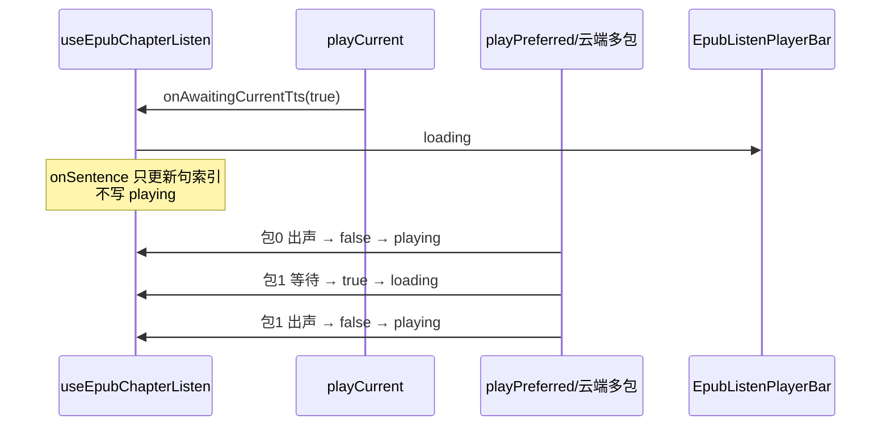

# 听书等待播放时持续 loading

> **文档角色**：增量修复——底部播放钮 **只要在等当前要播的音频** 就保持 Spinner，不再仅首次起播可见。  
> **姊妹文档**：[EPUB听书播放加载.md](./EPUB听书播放加载.md)（首版 `onAwaitingCurrentTts`）、[EPUB听书段落朗读.md](../ideas/epub/EPUB听书段落朗读.md)、[EPUB听书启动后预取.md](./EPUB听书启动后预取.md)。  
> **延伸阅读**：[EPUB听书触控栏加载.md](./EPUB听书触控栏加载.md)（loading 期隐藏/锁定 Touch Bar）、[EPUB听书播放修复2026-07.md](./EPUB听书播放修复2026-07.md)。

## 1. 背景与目标

### 1.1 问题

首版已在 `playCurrent` 前后夹 `onAwaitingCurrentTts(true/false)`，但实际连播时 Spinner **几乎只在首次起播**出现：

1. **`onSentence` / `applySection` 过早写 `status: 'playing'`**：云端 cadence 常在 TTS 就绪前就 `emit` 句开始，把刚置的 `loading` 盖掉。  
2. **同一次 `playPreferred` 多包/多段**：首包 `onPlaybackStart` 后清掉 waiting；第二包仍在 HTTP，UI 已是暂停图标。  
3. **分句跳转**起播写成 `playing`，等待合成时也不像加载中。

### 1.2 目标

- 凡阻塞 **当前播放路径** 的等待（首句、切句、段间、超长多包、切章）→ `loading` + Spinner。  
- **预取**仍不改 UI。  
- `loading` / `playing` **只由** `onAwaitingCurrentTts`（及暂停/停止等会话态）驱动，句高亮回调勿抢写 `status`。

## 2. 改动范围

| 路径 | 变更要点 |
| ---- | -------- |
| `apps/frontend/src/views/ebook/hooks/useEpubChapterListen.ts` | `applySection` / `onSentence` 去掉 `status:'playing'`；`goToSentence` → `loading` |
| `apps/frontend/src/views/ebook/utils/epub/listen/epubListenPlayUnits.ts` | `playPreferred` 透传 `onAwaitingPlayback` |
| `apps/frontend/src/utils/speech.ts` | 新增 `onAwaitingPlayback`；多段 cadence / 多包 singleUtterance / 本机分段 在段间再 `true` |

## 3. 实现思路



1. **单一真相源**：等待态只走 `onAwaitingCurrentTts` ↔ `status`。  
2. **speech 层**：`PlayPreferredOptions.onAwaitingPlayback`；多包循环 `i>0` 再 `true`，每包出声 `false`。  
3. **playCurrent**：把同一回调传给 `onAwaitingPlayback`，与外层 `true` / `onPlaybackStart`/`finally` 的 `false` 配合。

## 4. 关键实现（改动前 / 改动后对比 + 注释）

### 4.1 `applySection` 内 `syncState`（勿抢写 playing）

**对比范围**：`applySection` 成功路径末尾同步状态（摘录；函数其余定位逻辑未改，对称省略）。

**改动前** · `apps/frontend/src/views/ebook/hooks/useEpubChapterListen.ts`（基线，约 L287–L296）

```typescript
			// 挂上当前节上下文
			sectionRef.current = ctx;
			// 记下本节 document，供续听/抽节
			sectionDocRef.current = visible.outerRange.startContainer.ownerDocument;

			// 节就绪即标 playing——此时 TTS 往往尚未请求，后续 loading 易被盖掉
			syncState({
				status: 'playing',
				spineIndex: visible.spineIndex,
				sentenceIndex: sentenceCursorRef.current,
				sentenceCount: ctx.sentences.length,
				sentenceLabels: buildSentenceLabels(ctx.plain, ctx.sentences),
				rate: rateRef.current,
			});
```

**改动后** · `apps/frontend/src/views/ebook/hooks/useEpubChapterListen.ts`（当前，约 L287–L296）

```typescript
			// 挂上当前节上下文
			sectionRef.current = ctx;
			// 记下本节 document，供续听/抽节
			sectionDocRef.current = visible.outerRange.startContainer.ownerDocument;

			// 勿在此写 status:playing——随后 playCurrent 才会进 TTS 等待；由 onAwaitingCurrentTts 驱动 loading/playing
			// 只同步章节/句列表与倍速元数据
			syncState({
				spineIndex: visible.spineIndex,
				sentenceIndex: sentenceCursorRef.current,
				sentenceCount: ctx.sentences.length,
				sentenceLabels: buildSentenceLabels(ctx.plain, ctx.sentences),
				rate: rateRef.current,
			});
```

**变更摘要**：节准备完成不再伪装「已在播放」。

---

### 4.2 `onSentence`（cadence 勿盖 loading）

**对比范围**：`playSentencesFromCursor` → `playListenUnitsFromCursor` 的 `onSentence` 回调（摘录同步状态部分）。

**改动前** · `apps/frontend/src/views/ebook/hooks/useEpubChapterListen.ts`（基线，约 L349–L356）

```typescript
					onSentence: (globalSi, info) => {
						if (!isGenActive(gen) || pausedRef.current) return;
						sentenceCursorRef.current = globalSi;
						// cadence 在 TTS 就绪前也会触发 → 强制 playing 盖掉 loading
						syncState({
							status: 'playing',
							sentenceIndex: globalSi,
							sentenceCount: sentences.length,
						});
						// ...（未改动）DOM 高亮与滚动
```

**改动后** · `apps/frontend/src/views/ebook/hooks/useEpubChapterListen.ts`（当前，约 L349–L356）

```typescript
					onSentence: (globalSi, info) => {
						if (!isGenActive(gen) || pausedRef.current) return;
						sentenceCursorRef.current = globalSi;
						// 勿写 status:playing——cadence 常在 TTS 就绪前触发，会盖掉 loading
						syncState({
							sentenceIndex: globalSi,
							sentenceCount: sentences.length,
						});
						// ...（未改动）DOM 高亮与滚动
```

**变更摘要**：句高亮只改索引；等待态留给 awaiting 回调。

---

### 4.3 `goToSentence` 起播 status

**对比范围**：`goToSentence` 内重启循环前的 `syncState`。

**改动前** · `apps/frontend/src/views/ebook/hooks/useEpubChapterListen.ts`（基线，约 L989–L994）

```typescript
			const gen = ++loopGenRef.current;
			syncState({
				sentenceIndex: next,
				sentenceCount: ctx.sentences.length,
				sentenceLabels: buildSentenceLabels(ctx.plain, ctx.sentences),
				// 跳句后立刻 playing，合成未归时钮不像加载中
				status: 'playing',
			});
```

**改动后** · `apps/frontend/src/views/ebook/hooks/useEpubChapterListen.ts`（当前，约 L989–L994）

```typescript
			const gen = ++loopGenRef.current;
			syncState({
				sentenceIndex: next,
				sentenceCount: ctx.sentences.length,
				sentenceLabels: buildSentenceLabels(ctx.plain, ctx.sentences),
				// 跳句后先 loading，等 onAwaiting / 出声再变 playing
				status: 'loading',
			});
```

**变更摘要**：分句菜单跳转与首启一致，先等再播。

---

### 4.4 `playCurrent` 透传 `onAwaitingPlayback`

**对比范围**：`playListenUnitsFromCursor` 内局部函数 `playCurrent` 完整定义。

**改动前** · `apps/frontend/src/views/ebook/utils/epub/listen/epubListenPlayUnits.ts`（基线，约 L93–L111）

```typescript
	/** 当前播放路径的 TTS 等待；预取勿走这里 */
	const playCurrent = async (
		raw: string,
		opts: Parameters<typeof playPreferred>[1],
	) => {
		onAwaitingCurrentTts?.(true);
		try {
			const notifyStart = opts?.onPlaybackStart;
			await playPreferred(raw, {
				...opts,
				onPlaybackStart: () => {
					onAwaitingCurrentTts?.(false);
					notifyStart?.();
				},
			});
		} finally {
			onAwaitingCurrentTts?.(false);
		}
	};
```

**改动后** · `apps/frontend/src/views/ebook/utils/epub/listen/epubListenPlayUnits.ts`（当前，约 L93–L112）

```typescript
	/** 当前播放路径的 TTS 等待；预取勿走这里 */
	const playCurrent = async (
		raw: string,
		opts: Parameters<typeof playPreferred>[1],
	) => {
		// 本段起播前进入等待
		onAwaitingCurrentTts?.(true);
		try {
			const notifyStart = opts?.onPlaybackStart;
			await playPreferred(raw, {
				...opts,
				// 交给 speech：多包/多段中间再次 true/false
				onAwaitingPlayback: onAwaitingCurrentTts,
				onPlaybackStart: () => {
					onAwaitingCurrentTts?.(false);
					notifyStart?.();
				},
			});
		} finally {
			// 结束/失败也清掉，避免卡 Spinner
			onAwaitingCurrentTts?.(false);
		}
	};
```

**变更摘要**：外层夹一次 + 内层段间续报。

---

### 4.5 `PlayPreferredOptions.onAwaitingPlayback`（纯新增字段）

**改动前**：无该可选回调。

**改动后** · `apps/frontend/src/utils/speech.ts`（当前，约 L508–L523）

```typescript
	/**
	 * 当前段真正开始出声后回调（云端 audio.play / 本机 speak 成功）。
	 * 听书用来错开预取，避免与首包 HTTP 抢带宽。
	 */
	onPlaybackStart?: () => void;
	/**
	 * 当前正要播放的音频仍在等待（合成/下载/canplay）时为 true，出声后为 false。
	 * 多包/多段时会在每一段等待前再次 true；prefetch 未完成也会 true。
	 */
	onAwaitingPlayback?: (waiting: boolean) => void;
};

// Cadence/云端 opts 一并携带 awaiting
type CadencePlaybackHooks = Pick<
	PlayPreferredOptions,
	'onCadenceChunk' | 'prefetchedCloud' | 'onPlaybackStart' | 'onAwaitingPlayback'
>;
```

**变更摘要**：TTS 层可感知「仍在等当前听感」。

---

### 4.6 `playCloudTtsPackedSingleUtterances` 多包续报 waiting

**对比范围**：打包循环体（函数前半造 `packs` 未改，对称省略）。

**改动前** · `apps/frontend/src/utils/speech.ts`（基线，约 L1836–L1855）

```typescript
	const parentOnCadence = opts?.onCadenceChunk;
	for (let i = 0; i < packs.length; i += 1) {
		if (!isPlaybackGenerationActive(generation)) return;
		const pack = packs[i]!;
		const baseSi = sentenceIndexAtOffset(sentences, pack.start);
		await playCloudTtsSingleUtterance(pack.text, generation, {
			...opts,
			// 仅首包可吃预取 / 触发 onPlaybackStart
			prefetchedCloud: i === 0 ? opts?.prefetchedCloud : null,
			// 仅首包清 waiting → 后续包 HTTP 期间 UI 已是 playing
			onPlaybackStart: i === 0 ? opts?.onPlaybackStart : undefined,
			onCadenceChunk: parentOnCadence
				? (event) => {
						parentOnCadence({
							...event,
							sentenceIndex: baseSi + event.sentenceIndex,
						});
					}
				: undefined,
		});
	}
```

**改动后** · `apps/frontend/src/utils/speech.ts`（当前，约 L1846–L1870）

```typescript
	const parentOnCadence = opts?.onCadenceChunk;
	for (let i = 0; i < packs.length; i += 1) {
		if (!isPlaybackGenerationActive(generation)) return;
		// 第二包起再次进入等待：首包出声后 loading 已清，后续 HTTP 需重新点亮
		if (i > 0) opts?.onAwaitingPlayback?.(true);
		const pack = packs[i]!;
		const baseSi = sentenceIndexAtOffset(sentences, pack.start);
		await playCloudTtsSingleUtterance(pack.text, generation, {
			...opts,
			// 仅首包可吃预取
			prefetchedCloud: i === 0 ? opts?.prefetchedCloud : null,
			onPlaybackStart: () => {
				opts?.onAwaitingPlayback?.(false);
				if (i === 0) opts?.onPlaybackStart?.();
			},
			onCadenceChunk: parentOnCadence
				? (event) => {
						parentOnCadence({
							...event,
							sentenceIndex: baseSi + event.sentenceIndex,
						});
					}
				: undefined,
		});
	}
```

**变更摘要**：超长按段打包时，每一包等待都会再亮 Spinner。同文件 cadence 多 chunk、本机多段亦对称处理（见源码 `playCloudTtsCadenceSegments` / `speakTextWithGeneration`）。

## 5. 行为变化与兼容性

| 场景 | 改前 | 改后 |
| ---- | ---- | ---- |
| 首次听书 | 有 loading（起播 sync） | 仍有；且不会被 `applySection`/`onSentence` 提前清掉 |
| 段间 / 多包 HTTP | 常仍显示暂停图标 | 等待中 Spinner |
| 分句跳转 | 立刻像可暂停 | 先 loading 再出声 |
| 预取 | 不改 UI | 不变 |

## 6. 测试与回归建议

1. 云端听书：故意断预取或读长段，观察 **句间/段间** 播放钮是否出现 Spinner。  
2. 分句菜单跳到远处句：跳转后至出声前应为加载中。  
3. 软暂停：loading 时可点暂停；续播行为与改前一致。  
4. 预取命中时 Spinner 应极短或几乎看不见，但不应卡死在 loading。

## 7. 相关文档与代码索引

| 说明 | 路径 |
| ---- | ---- |
| 本专题 | `docs/ebook/EPUB听书等待加载.md` |
| 首版 loading | `docs/ebook/EPUB听书播放加载.md` |
| 播放条 UI | `docs/ebook/EPUB听书播放器栏.md` |

---

若与仓库最新源码不一致，以源码为准。
