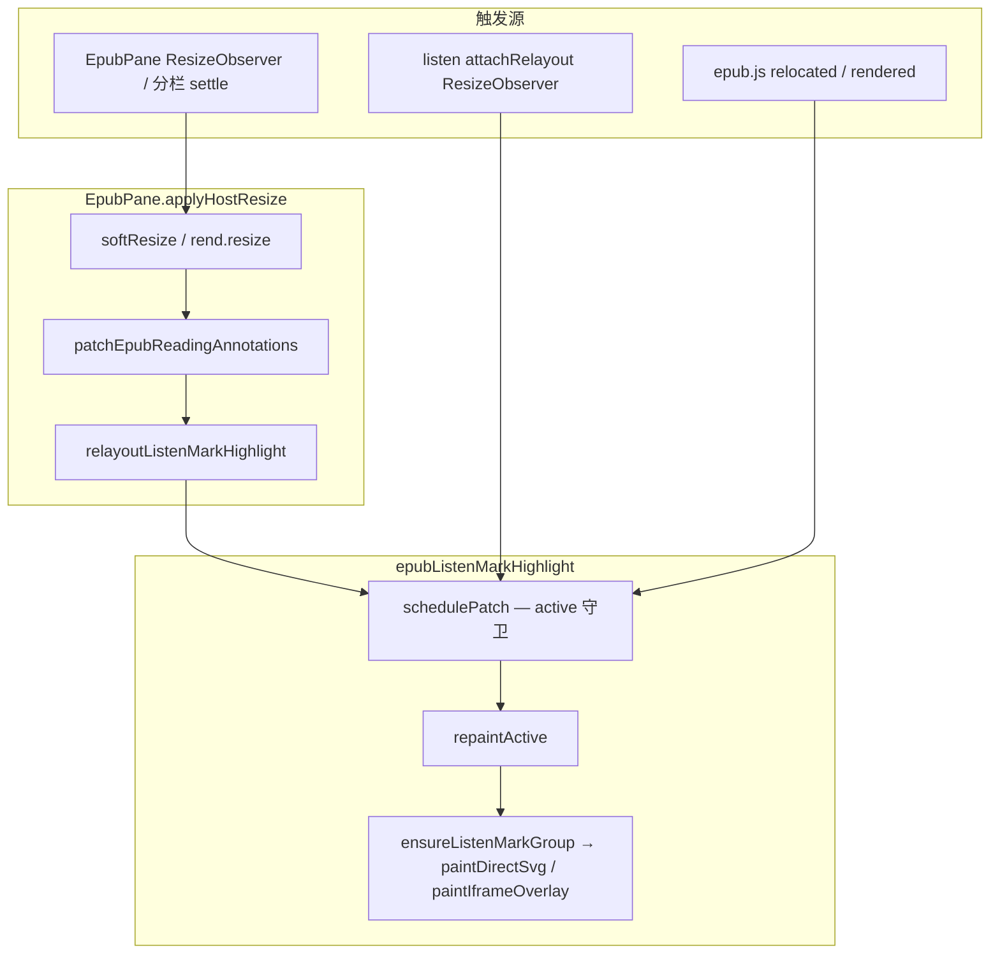

# EPUB 听读播放背景 — 阅读区 resize 重绘

## 延伸阅读

- [EPUB听书背景与注释影响.md](../impact/EPUB听书背景与注释影响.md) — 播放背景与用户划线 / 想法虚线的隔离
- [EPUB听书尺寸重布局影响.md](../impact/EPUB听书尺寸重布局影响.md) — 本次改动的**影响面矩阵**与回归清单
- [EPUB分屏软调整.md](./EPUB分屏软调整.md) — 分栏 soft resize 与批注 patch 主路径
- [developer/EPUB听书开发.md](./developer/EPUB听书开发.md) — 听当前 + 听书总手册

---

## 1. 背景与目标

### 1.1 问题

**听当前**、**听书** 播放时，当前句以淡黄色底（`moke-epub-listen-bg`）标在 EPUB 正文上。背景矩形由 Range 的 `getClientRects()` 快照绘制到 marks-pane SVG（或 iframe 绝对定位层）。

当阅读区宽度变化时（典型场景）：

- 打开 / 关闭 **读书想法** 右侧分栏；
- 拖拽 **MOKE 问书 / 想法** 分栏宽度；
- `softResizeEpubRendition` 重排正文但不触发 epub.js 的 `relocated` / `rendered`。

会出现：

1. **背景错位** — 旧 rect 仍停在旧宽度下的坐标；
2. **背景消失** — marks-pane SVG 重建后，`active.group` 已断开，重绘失败；
3. **误走 iframe 兜底** — 坐标与滚动不一致。

### 1.2 目标

- 布局变化后 **自动重算** 当前句播放背景；
- **不破坏** 用户划线、想法虚线、换句 / 停止清除边界；
- 与既有 `EpubPane.applyHostResize` → `patchEpubReadingAnnotations` 链路 **对齐时序**。

---

## 2. 改动范围

| 路径 | 变更 |
|------|------|
| `apps/frontend/src/views/ebook/utils/epubListenMarkHighlight.ts` | `repaintActive` 重挂 group；`attachRelayout` 增 ResizeObserver；新增 `relayoutListenMarkHighlight` |
| `apps/frontend/src/views/ebook/components/EpubPane.tsx` | `applyHostResize` 末尾调用 `relayoutListenMarkHighlight` |

**未改**：`showListenMarkHighlight` / `clearListenMarkHighlight` 对外语义；听书 / 听当前编排层（`epubListenSegmentOverlay.ts` 等）。

---

## 3. 实现思路

1. **根因：`repaintActive` 复用 stale SVG 引用**  
   soft resize 后 marks-pane 常重建，`active.group?.isConnected === false` 时改前仍可能用旧 group 或错误 iframe 兜底。改后每次 relayout **重新 `ensureListenMarkGroup`**，并更新 `active.mode` / `active.group` / `active.doc`。

2. **补事件盲区：ResizeObserver**  
   `attachRelayout` 除 `relocated` / `rendered` 外，监听 EPUB **滚动容器**及其**父节点**尺寸变化（分栏改宽、侧栏开关）。仅在活跃听读 session 存在时挂载，随 `clearListenMarkHighlight` 释放。

3. **与 EpubPane resize 主路径接线**  
   `applyHostResize` 在 `patchEpubReadingAnnotations` **之后**调用 `relayoutListenMarkHighlight`，与批注恢复同帧；无活跃 listen 时 `schedulePatch` 因 `!active` 立即 return，不影响非听读场景。

4. **双帧 retry**  
   `relayoutListenMarkHighlight` 内 `schedulePatch` + 下一帧再 `schedulePatch`，应对 marks-pane **晚一帧就绪**。

5. **刻意不做**  
   - 不在 relayout 时调用 `clearListenMarkHighlight`（避免换句外全量清层）；  
   - 不扩大 purge selector（仍仅 `moke-epub-listen-*`）；  
   - 不接入 `syncEpubReadingAnnotations`（播放层与用户/想法三层分离）。

---

## 4. 数据流



---

## 5. 关键代码对比与注释

### 5.1 `repaintActive`（`apps/frontend/src/views/ebook/utils/epubListenMarkHighlight.ts`）

**对比范围**：`function repaintActive` 全函数。

**改动前** · `apps/frontend/src/views/ebook/utils/epubListenMarkHighlight.ts`（基线 HEAD，约 L290–L299）

```typescript
// 内部函数：按当前 active 缓存重绘听书播放背景
function repaintActive(): void {
	// 无活跃 session 或 Range 已从 DOM 移除则跳过
	if (!active || !isRangeConnected(active.range)) return;
	// 规范化 Range，处理跨 iframe 等 epub 选区边界
	const normalized =
		normalizeSelectionRangeForEpub(active.range) ?? active.range;
	// 若上次用 SVG 且 group 仍连接在文档树上，直接在旧 group 上重画 rect
	if (active.mode === 'svg' && active.group?.isConnected) {
		// 复用 stale group，resize 后 marks-pane 重建时此处易失败或错位
		paintDirectSvg(active.group, normalized);
	} else {
		// 否则在缓存的 doc 上用 iframe 绝对定位 div 层绘制
		paintIframeOverlay(active.doc, normalized);
	}
}
```

**改动后** · `apps/frontend/src/views/ebook/utils/epubListenMarkHighlight.ts`（当前，约 L295–L323）

```typescript
// 内部函数：按当前 active 缓存重绘听书播放背景（含 resize 后重挂 SVG group）
function repaintActive(): void {
	// 无活跃 session 或 Range 已从 DOM 移除则跳过
	if (!active || !isRangeConnected(active.range)) return;
	// 规范化 Range，处理跨 iframe 等 epub 选区边界
	const normalized =
		normalizeSelectionRangeForEpub(active.range) ?? active.range;
	// 从 Range 起点取所属 Document，作为 marks-pane 查询根
	const doc = normalized.startContainer.ownerDocument;
	// ownerDocument 不可用时无法绘制
	if (!doc) return;
	// 每次 relayout 重新查找或创建 listen 专用 SVG g，不依赖可能已断开的 active.group
	const group = ensureListenMarkGroup(doc);
	// SVG 路径可用且 rect 计算成功时优先走 marks-pane
	if (group && paintDirectSvg(group, normalized)) {
		// 同步 active 状态为 svg 模式
		active.mode = 'svg';
		// 记录本次有效的 group 引用供调试与后续判断
		active.group = group;
		// 记录 doc 与 Range 所属文档一致
		active.doc = doc;
		// SVG 绘制成功则结束，不再走 iframe 兜底
		return;
	}
	// SVG 不可用或 paint 失败时 fallback 到 iframe 内绝对定位层
	if (paintIframeOverlay(doc, normalized)) {
		// 标记为 iframe 模式
		active.mode = 'iframe';
		// iframe 模式不使用 SVG group
		active.group = null;
		// 更新 doc 引用
		active.doc = doc;
	}
}
```

**变更摘要**：去掉对 `active.group?.isConnected` 的依赖；每次 relayout 重新 `ensureListenMarkGroup`；显式更新 `active.mode` / `active.group` / `active.doc`；绘制策略与初次 `showListenMarkHighlight` 一致（SVG 优先）。

---

### 5.2 `attachRelayout`（`apps/frontend/src/views/ebook/utils/epubListenMarkHighlight.ts`）

**对比范围**：`function attachRelayout` 全函数。

**改动前** · `apps/frontend/src/views/ebook/utils/epubListenMarkHighlight.ts`（基线 HEAD，约 L311–L326）

```typescript
// 为活跃 listen session 注册 epub 渲染事件，在翻页/重渲染时 schedule 重绘
function attachRelayout(rend: Rendition): void {
	// 解绑上一轮 session 的监听，避免重复注册
	detachRelayout?.();
	// 统一重排入口：防抖 schedulePatch
	const onRelayout = () => schedulePatch(rend);
	// 翻页或 spine 定位变化
	rend.on('relocated', onRelayout);
	// 章节 view 渲染完成
	rend.on('rendered', onRelayout);
	// 保存 teardown 闭包供 clearListenMarkHighlight 调用
	detachRelayout = () => {
		// 取消 pending 的 rAF 重绘
		cancelAnimationFrame(relayoutRaf);
		// 重置 rAF 句柄
		relayoutRaf = 0;
		try {
			// 解绑 relocated 回调
			rend.off('relocated', onRelayout);
			// 解绑 rendered 回调
			rend.off('rendered', onRelayout);
		} catch {
			// rendition 已销毁时 off 可能抛错，忽略
		}
	};
}
```

**改动后** · `apps/frontend/src/views/ebook/utils/epubListenMarkHighlight.ts`（当前，约 L346–L390）

```typescript
// 为活跃 listen session 注册重绘监听：epub 事件 + 容器 ResizeObserver
function attachRelayout(rend: Rendition): void {
	// 解绑上一轮 session 的监听，避免重复注册与泄漏
	detachRelayout?.();
	// 统一重排入口：防抖 schedulePatch
	const onRelayout = () => schedulePatch(rend);
	// 翻页或 spine 定位变化
	rend.on('relocated', onRelayout);
	// 章节 view 渲染完成
	rend.on('rendered', onRelayout);
	// 收集 ResizeObserver disconnect 回调，供 detach 时批量执行
	const resizeCleanups: (() => void)[] = [];
	// 取得 EPUB 连续滚动模式下的外层滚动容器
	const scrollContainer = getEpubScrollContainer(rend);
	// 容器存在时才挂 ResizeObserver
	if (scrollContainer) {
		// 滚动容器尺寸变化时触发重绘（正文 reflow 后 rect 需重算）
		const ro = new ResizeObserver(() => onRelayout());
		// 开始观察 scrollContainer 的 content box
		ro.observe(scrollContainer);
		// 注册 disconnect 清理
		resizeCleanups.push(() => ro.disconnect());
		// 分栏有时只改外层 host 宽高，内层 scroll 晚一拍变化
		const host = scrollContainer.parentElement;
		// 父节点存在则额外观察一层
		if (host) {
			// 父容器专用 observer
			const roHost = new ResizeObserver(() => onRelayout());
			// 观察 host 元素
			roHost.observe(host);
			// 注册 host observer 清理
			resizeCleanups.push(() => roHost.disconnect());
		}
	}
	// 保存 teardown 闭包供 clearListenMarkHighlight 调用
	detachRelayout = () => {
		// 取消 pending 的 rAF 重绘
		cancelAnimationFrame(relayoutRaf);
		// 重置 rAF 句柄
		relayoutRaf = 0;
		// 断开所有 ResizeObserver
		for (const cleanup of resizeCleanups) cleanup();
		// 逐个执行 disconnect
		try {
			// 解绑 relocated 回调
			rend.off('relocated', onRelayout);
			// 解绑 rendered 回调
			rend.off('rendered', onRelayout);
		} catch {
			// rendition 已销毁时 off 可能抛错，忽略
		}
	};
}
```

**变更摘要**：新增对 scroll 容器与父 host 的 `ResizeObserver`；`detachRelayout` 增加 observer 清理。`schedulePatch` 本体逻辑未变（仅源码注释增补，文档从略）。

---

### 5.3 `relayoutListenMarkHighlight`（纯新增）

**改动后** · `apps/frontend/src/views/ebook/utils/epubListenMarkHighlight.ts`（当前，约 L392–L397）

```typescript
// 导出：供 EpubPane 等外部在 resize 后主动触发当前句背景重绘
export function relayoutListenMarkHighlight(rend: Rendition): void {
	// 当前帧 schedule 一次重绘（内部校验 active && active.rend === rend）
	schedulePatch(rend);
	// 下一帧再 schedule 一次，应对 soft resize 后 marks-pane 晚就绪
	requestAnimationFrame(() => schedulePatch(rend));
}
```

**说明**：纯新增导出；无改动前块。无活跃 listen 时两次 `schedulePatch` 均为空操作。

---

### 5.4 `applyHostResize`（`apps/frontend/src/views/ebook/components/EpubPane.tsx`）

**对比范围**：`applyHostResize` 箭头函数全段（摘录自 `EpubPane` 初始化 effect）。

**改动前** · `apps/frontend/src/views/ebook/components/EpubPane.tsx`（基线 HEAD，约 L488–L504）

```typescript
		// 实际尺寸应用及高亮样式恢复
		const applyHostResize = () => {
			// host 或 rendition 未就绪则跳过
			if (!hostRef.current || !readyRef.current || !rendRef.current) return;
			// 阅读区宽度下限 320，避免 epub.js 传入 0
			const w = Math.max(hostRef.current.clientWidth, 320);
			// 阅读区高度下限 320
			const h = Math.max(hostRef.current.clientHeight, 320);
			// 当前 rendition 实例
			const rend = rendRef.current;
			// 优先 soft resize，避免 rend.resize 清空 view 白屏
			if (!softResizeEpubRendition(rend, w, h)) {
				try {
					// soft 失败则完整 resize
					rend.resize(w, h);
				} catch {
					// resize 异常忽略，避免 effect 崩溃
				}
			}
			// soft resize 后用户/想法 mark 可能失色，即时 patch
			patchEpubReadingAnnotations(rend, { sync: true });
		};
```

**改动后** · `apps/frontend/src/views/ebook/components/EpubPane.tsx`（当前，约 L488–L506）

```typescript
		// 实际尺寸应用及高亮样式恢复
		const applyHostResize = () => {
			// host 或 rendition 未就绪则跳过
			if (!hostRef.current || !readyRef.current || !rendRef.current) return;
			// 阅读区宽度下限 320，避免 epub.js 传入 0
			const w = Math.max(hostRef.current.clientWidth, 320);
			// 阅读区高度下限 320
			const h = Math.max(hostRef.current.clientHeight, 320);
			// 当前 rendition 实例
			const rend = rendRef.current;
			// 优先 soft resize，避免 rend.resize 清空 view 白屏
			if (!softResizeEpubRendition(rend, w, h)) {
				try {
					// soft 失败则完整 resize
					rend.resize(w, h);
				} catch {
					// resize 异常忽略，避免 effect 崩溃
				}
			}
			// soft resize 后用户/想法 mark 可能失色，即时 patch
			patchEpubReadingAnnotations(rend, { sync: true });
			// 听读活跃时重绘当前句播放背景（无 active 时 schedulePatch 空操作）
			relayoutListenMarkHighlight(rend);
		};
```

**变更摘要**：文件顶增加 `import { relayoutListenMarkHighlight } from '../utils/epubListenMarkHighlight'`；`applyHostResize` 末尾一行 relayout。`settleHostResize` 因调用 `applyHostResize` 间接获得相同行为。

---

## 6. 兼容性与影响

| 维度 | 结论 |
|------|------|
| 破坏性 | **无** — 对外 API 仅新增 `relayoutListenMarkHighlight` |
| 用户/想法批注 | **无逻辑影响** — 清除 selector 与 sync 流水线未变 |
| 非听读 resize | **无可见影响** — `schedulePatch` 守卫 `active` |
| 听读播放中 resize | **正向修复** — 背景对齐当前句 |
| 性能 | 听读活跃期多 2 个 ResizeObserver + 偶发双帧 repaint；同帧 `schedulePatch` 合并 |

详细影响矩阵见 [EPUB听书尺寸重布局影响.md](../impact/EPUB听书尺寸重布局影响.md)。

---

## 7. 建议回归

| # | 场景 | 期望 |
|---|------|------|
| R1 | 听书中开关想法侧栏 | 淡黄底与当前句对齐 |
| R2 | 听书中拖分栏后松手 | 背景正确；用户/想法线仍正常 |
| R3 | 听当前 + 开关侧栏 | 同 R1 |
| R4 | 未听书，仅拖分栏 | 无 listen DOM 残留、无报错 |
| R5 | 换句 / 停止听书 | 无双层黄、清除正常 |

---

## 8. 相关源码路径

| 说明 | 路径 |
|------|------|
| 播放背景模块 | `apps/frontend/src/views/ebook/utils/epubListenMarkHighlight.ts` |
| EPUB 容器 resize | `apps/frontend/src/views/ebook/components/EpubPane.tsx` |
| soft resize | `apps/frontend/src/views/ebook/utils/epubSoftResize.ts` |
| 影响面分析 | `docs/impact/EPUB听书尺寸重布局影响.md` |

---

（若与仓库最新源码不一致，以源码为准）
