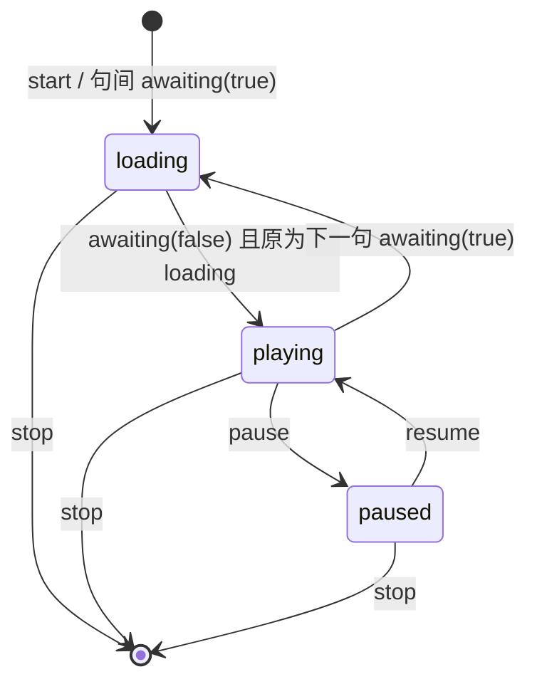
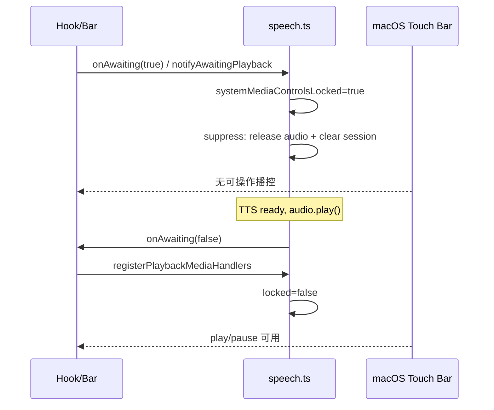

# EPUB / 选区朗读：loading 期隐藏与锁定系统播控（Touch Bar / Media Session）

> **文档角色**：听书与选区朗读在 **loading（等 TTS 出声）** 期间隐藏/锁定 macOS Touch Bar 与 Media Session 播控，避免句间残留可操作控件，以及连点系统键导致播放条状态错乱。**改动前后对比见 §4；改动后完整实现见 §8**。  
> **延伸阅读**：[EPUB听书软暂停.md](./EPUB听书软暂停.md)（软暂停与媒体键基线）、[EPUB听书播放加载.md](./EPUB听书播放加载.md)（播放钮 loading）、[EPUB听书等待加载.md](./EPUB听书等待加载.md)（连播持续 loading）、[../chat/选区朗读媒体会话.md](../chat/选区朗读媒体会话.md)（选区朗读接入 Media Session）。

## 1. 背景与目标

### 1.1 问题

| 现象 | 用户感知 |
|------|----------|
| 句间等 TTS 时 Touch Bar 仍显示可点的播放/暂停 | 以为还能播控，实际声音未就绪 |
| loading 期连点 Touch Bar / 控制中心 | 听书底栏或选区朗读条状态错乱（卡住、显示播放却无声等） |
| 初始开听时 Touch Bar 能藏住，句间换轨后残留 | 仅 soft detach 时 macOS 仍按旧 `<audio>` 推 Now Playing |

### 1.2 产品规则（终态）

| UI / 会话状态 | 系统播控 |
|---------------|----------|
| `loading`（等出声） | **不可操作**：卸键、压 Chrome、锁 `systemMediaControlsLocked` |
| `playing` / `paused` | 注册 Media Session `play` / `pause` |
| `stop` / 退出会话 | `registerPlaybackMediaHandlers(null)` 硬拆（世代++、释放元素） |

### 1.3 目标

- loading 期间系统键与条上播放钮一致：**不可点**。
- 出声后才接线；句间等待不再残留 Touch Bar。
- 连点系统键不会静默 `pausePlaybackSoft` 把介质卡住而 UI 仍 loading/playing。

## 2. 改动范围

| 路径 | 说明 |
|------|------|
| `apps/frontend/src/utils/speech.ts` | 锁、suppress、detach、bridge、soft pause/resume、起播轮询压 Chrome |
| `apps/frontend/src/components/design/SelectionSpeak/useSelectionSpeak.ts` | `mediaReady` 接线；`onAwaiting` 同步 suppress；loading 禁 pause |
| `apps/frontend/src/views/ebook/hooks/useEpubChapterListen.ts` | 同上（听书） |
| `apps/frontend/src/views/ebook/utils/epub/listen/epubListenPlayUnits.ts` | `playCurrent` 去掉 finally 强制 `awaiting(false)` |
| `apps/frontend/src/components/design/SelectionSpeak/SelectionSpeakBar.tsx` | 播放钮 `disabled={loading}`；`playing` 不含 loading |
| `apps/frontend/src/views/ebook/components/listen/EpubListenPlayerBar.tsx` | 播放钮 `disabled={loading}` |

> **完整实现**：各符号改动后全文见文末 [§8 附录](#8-附录改动后完整实现)。

## 3. 实现思路（决策时间线）

### 3.1 产品规则 → 初版失败

**规则**：loading → Touch Bar 不可操作；playing/paused → 注册 play/pause；stop → `register(null)`。

**初版尝试**：loading 也注册 Media Session，并强制 `playbackState = 'playing'`。结果：系统 UI 仍可点，连点后条状态错乱。

### 3.2 仅 playing|paused 注册 + soft detach

改为：`mediaReady = playing || paused` 才 `registerPlaybackMediaHandlers`；loading 走 `detachPlaybackMediaHandlers`（**不** `generation++`，不杀 TTS）。

**现象**：初始开听 Touch Bar 正常隐藏（起播前 `stopAll` → `releaseCloudAudioEl`）；**句间等 TTS** 仍显示——仅 detach 保留旧 `<audio>`，macOS 残留 Now Playing。

### 3.3 `suppressPlaybackMediaChromeForLoading`

补强：detach + `releaseCloudAudioEl` + 清 session + 上锁 + `clearSoftPauseState`。`onAwaiting(true)` 同步调用。云端分句把 `awaiting(true)` 提前到 `pauseMs` 前。挂 `src`→`play` 窗口内无 handlers 时轮询 `suppressOrphanMediaSessionChrome`。

### 3.4 连点仍错乱 → 终态锁

**根因**：pause 桥在无 handlers 时静默 `pausePlaybackSoft()`——loading 期 Touch Bar 仍可能触发元素 `pause`，介质卡住而 UI 仍 loading/playing。

**终态**：

1. `systemMediaControlsLocked`；suppress / `notifyAwaitingPlayback(true)` 上锁并清 soft-pause。
2. bridge 锁定时顶掉误 pause；无接线勿 soft-pause。
3. `pausePlaybackSoft` / `resumePlaybackSoft` 上锁直接 return。
4. `register` 包装 handlers 再查锁。
5. 去掉 `playCurrent` finally 强制 `awaiting(false)`；`awaiting(false)` 仅从 loading→playing。





## 4. 关键代码对比与注释

### 4.1 `systemMediaControlsLocked` + `notifyAwaitingPlayback`（纯新增）

**对比范围**：纯新增，基线中不存在。

**改动后** · `apps/frontend/src/utils/speech.ts`（纯新增，约 L943–L981）

```typescript
// 模块级 JSDoc 开块：说明 loading 锁用途
/**
 * loading（等出声）为 true：忽略系统 pause/play。
 * 否则连点 Touch Bar 易经 pause 桥静默 soft-pause，条上状态错乱。
 */
// 全局锁默认关闭；suppress / notifyAwaiting(true) 置 true，register(handlers) 置 false
let systemMediaControlsLocked = false;

// speech 内部在调用 UI 的 onAwaiting 前回调此函数，保证先上锁
function notifyAwaitingPlayback(
	// 听书/选区传入的 awaiting 回调；可为空
	cb: ((waiting: boolean) => void) | undefined,
	// true=进入等 TTS；false=出声或失败清 waiting（本函数只在 true 上锁）
	waiting: boolean,
): void {
	// 源码自带注释：先于 hook：loading 期立刻锁系统键，避免连点抢在 suppress 之前
	// 先于 hook：loading 期立刻锁系统键，避免连点抢在 suppress 之前
	// 仅 waiting 上锁；解锁留给 registerPlaybackMediaHandlers(非 null)
	if (waiting) systemMediaControlsLocked = true;
	// 再交给 hook：suppress / setStatus('loading'|'playing')
	cb?.(waiting);
}
```

**变更摘要**：纯新增全局锁与 awaiting 通知入口；waiting 为 true 时先于 UI 回调上锁。


### 4.2 `registerPlaybackMediaHandlers`

**对比范围**：完整符号定义。

**改动前** · `apps/frontend/src/utils/speech.ts`（基线 HEAD，约 L1078–L1114）

```typescript
// 导出函数 registerPlaybackMediaHandlers 声明
export function registerPlaybackMediaHandlers(
// 语句：handlers: PlaybackMediaHandlers | null,
	handlers: PlaybackMediaHandlers | null,
// 语句：): void {
): void {
// 条件分支：(!handlers) {
	if (!handlers) {
// 模块级 Media Session handlers 引用：englishPlaybackMediaHandlers = null;
		englishPlaybackMediaHandlers = null;
// 源码自带注释：先作废异步 play，再拆掉元素，避免无声进度条继续走
		// 先作废异步 play，再拆掉元素，避免无声进度条继续走
// 播放世代：作废异步播放
		playbackGeneration += 1;
// 语句：abortCloudAudioWait?.();
		abortCloudAudioWait?.();
// 语句：abortCloudAudioWait = null;
		abortCloudAudioWait = null;
// 清除软暂停状态
		clearSoftPauseState();
// 条件分支：(isSpeechSupported()) {
		if (isSpeechSupported()) {
// try：可能抛错的操作
			try {
// 本机 speechSynthesis 操作
				window.speechSynthesis.cancel();
// catch：吞掉或处理错误
			} catch {
// 源码自带注释：ignore
				// ignore
// 闭合当前块
			}
// 闭合当前块
		}
// 释放云端 <audio> 元素引用
		releaseCloudAudioEl();
// 语句：silenceCloudAudioUnlock();
		silenceCloudAudioUnlock();
// 清空 Media Session 展示与 handlers
		clearPlaybackMediaSession({ clearHandlers: true });
// 源码自带注释：macOS Chrome：偶发需下一帧再清一次才收起控制中心
		// macOS Chrome：偶发需下一帧再清一次才收起控制中心
// 下一帧再执行（macOS 偶发需二次清理）
		requestAnimationFrame(() => {
// 条件分支：(englishPlaybackMediaHandlers) return;
			if (englishPlaybackMediaHandlers) return;
// 清空 Media Session 展示与 handlers
			clearPlaybackMediaSession({ clearHandlers: true });
// 语句：});
		});
// 提前返回
		return;
// 闭合当前块
	}
// 模块级 Media Session handlers 引用：englishPlaybackMediaHandlers = handlers;
	englishPlaybackMediaHandlers = handlers;
// 条件分支：(typeof navigator === 'undefined' || !navigator.mediaSession) retur
	if (typeof navigator === 'undefined' || !navigator.mediaSession) return;
// try：可能抛错的操作
	try {
// 向 Media Session 注册系统媒体键回调
		navigator.mediaSession.setActionHandler('play', () => handlers.play());
// 向 Media Session 注册系统媒体键回调
		navigator.mediaSession.setActionHandler('pause', () => handlers.pause());
// 向 Media Session 注册系统媒体键回调
		navigator.mediaSession.setActionHandler('stop', () => handlers.pause());
// catch：吞掉或处理错误
	} catch {
// 源码自带注释：旧环境不支持 setActionHandler
		// 旧环境不支持 setActionHandler
// 闭合当前块
	}
// 闭合当前块
}
```

**改动后** · `apps/frontend/src/utils/speech.ts`（当前，约 L1092–L1146）

```typescript
// 导出函数 registerPlaybackMediaHandlers 声明
export function registerPlaybackMediaHandlers(
// 语句：handlers: PlaybackMediaHandlers | null,
	handlers: PlaybackMediaHandlers | null,
// 语句：): void {
): void {
// 条件分支：(!handlers) {
	if (!handlers) {
// 模块级 Media Session handlers 引用：englishPlaybackMediaHandlers = null;
		englishPlaybackMediaHandlers = null;
// 读写系统播控锁：systemMediaControlsLocked = false;
		systemMediaControlsLocked = false;
// 源码自带注释：先作废异步 play，再拆掉元素，避免无声进度条继续走
		// 先作废异步 play，再拆掉元素，避免无声进度条继续走
// 播放世代：作废异步播放
		playbackGeneration += 1;
// 语句：abortCloudAudioWait?.();
		abortCloudAudioWait?.();
// 语句：abortCloudAudioWait = null;
		abortCloudAudioWait = null;
// 清除软暂停状态
		clearSoftPauseState();
// 条件分支：(isSpeechSupported()) {
		if (isSpeechSupported()) {
// try：可能抛错的操作
			try {
// 本机 speechSynthesis 操作
				window.speechSynthesis.cancel();
// catch：吞掉或处理错误
			} catch {
// 源码自带注释：ignore
				// ignore
// 闭合当前块
			}
// 闭合当前块
		}
// 释放云端 <audio> 元素引用
		releaseCloudAudioEl();
// 语句：silenceCloudAudioUnlock();
		silenceCloudAudioUnlock();
// 清空 Media Session 展示与 handlers
		clearPlaybackMediaSession({ clearHandlers: true });
// 源码自带注释：macOS Chrome：偶发需下一帧再清一次才收起控制中心
		// macOS Chrome：偶发需下一帧再清一次才收起控制中心
// 下一帧再执行（macOS 偶发需二次清理）
		requestAnimationFrame(() => {
// 条件分支：(englishPlaybackMediaHandlers) return;
			if (englishPlaybackMediaHandlers) return;
// 清空 Media Session 展示与 handlers
			clearPlaybackMediaSession({ clearHandlers: true });
// 语句：});
		});
// 提前返回
		return;
// 闭合当前块
	}
// 源码自带注释：已出声/可暂停：允许系统键；包装一层防止 loading 锁期间误入
	// 已出声/可暂停：允许系统键；包装一层防止 loading 锁期间误入
// 读写系统播控锁：systemMediaControlsLocked = false;
	systemMediaControlsLocked = false;
// 模块级 Media Session handlers 引用：englishPlaybackMediaHandlers = {
	englishPlaybackMediaHandlers = {
// handlers 字段：play: () => {
		play: () => {
// 条件分支：(systemMediaControlsLocked) return;
			if (systemMediaControlsLocked) return;
// 语句：handlers.play();
			handlers.play();
// 对象属性或回调项结束（带逗号）
		},
// handlers 字段：pause: () => {
		pause: () => {
// 条件分支：(systemMediaControlsLocked) return;
			if (systemMediaControlsLocked) return;
// 语句：handlers.pause();
			handlers.pause();
// 对象属性或回调项结束（带逗号）
		},
// 闭合语句（对象/回调赋值结束）
	};
// 条件分支：(typeof navigator === 'undefined' || !navigator.mediaSession) retur
	if (typeof navigator === 'undefined' || !navigator.mediaSession) return;
// try：可能抛错的操作
	try {
// 向 Media Session 注册系统媒体键回调
		navigator.mediaSession.setActionHandler('play', () =>
// 模块级 Media Session handlers 引用：englishPlaybackMediaHandlers?.play(),
			englishPlaybackMediaHandlers?.play(),
// 语句：);
		);
// 向 Media Session 注册系统媒体键回调
		navigator.mediaSession.setActionHandler('pause', () =>
// 模块级 Media Session handlers 引用：englishPlaybackMediaHandlers?.pause(),
			englishPlaybackMediaHandlers?.pause(),
// 语句：);
		);
// 向 Media Session 注册系统媒体键回调
		navigator.mediaSession.setActionHandler('stop', () =>
// 模块级 Media Session handlers 引用：englishPlaybackMediaHandlers?.pause(),
			englishPlaybackMediaHandlers?.pause(),
// 语句：);
		);
// catch：吞掉或处理错误
	} catch {
// 源码自带注释：旧环境不支持 setActionHandler
		// 旧环境不支持 setActionHandler
// 闭合当前块
	}
// 闭合当前块
}
```

**变更摘要**：硬拆时解锁；注册时解锁并用包装层防 loading 锁误入；setActionHandler 改调模块级包装。


### 4.3 `detachPlaybackMediaHandlers`（纯新增）

**对比范围**：纯新增，基线中不存在。

**改动后** · `apps/frontend/src/utils/speech.ts`（纯新增，约 L1152–L1160）

```typescript
// 导出函数 detachPlaybackMediaHandlers 声明
export function detachPlaybackMediaHandlers(): void {
// 模块级 Media Session handlers 引用：englishPlaybackMediaHandlers = null;
	englishPlaybackMediaHandlers = null;
// 清空 Media Session 展示与 handlers
	clearPlaybackMediaSession({ clearHandlers: true });
// 源码自带注释：macOS：句间换轨后偶发需下一帧再清才收起 Touch Bar
	// macOS：句间换轨后偶发需下一帧再清才收起 Touch Bar
// 下一帧再执行（macOS 偶发需二次清理）
	requestAnimationFrame(() => {
// 条件分支：(englishPlaybackMediaHandlers) return;
		if (englishPlaybackMediaHandlers) return;
// 清空 Media Session 展示与 handlers
		clearPlaybackMediaSession({ clearHandlers: true });
// 语句：});
	});
// 闭合当前块
}
```

**变更摘要**：effect cleanup / mediaReady=false 用此软拆：不 generation++、不杀 TTS、不丢 audio。基线中不存在（旧 cleanup 直接 register(null) 硬拆）。


### 4.4 `suppressPlaybackMediaChromeForLoading`（纯新增）

**对比范围**：纯新增，基线中不存在。

**改动后** · `apps/frontend/src/utils/speech.ts`（纯新增，约 L1166–L1178）

```typescript
// 导出函数 suppressPlaybackMediaChromeForLoading 声明
export function suppressPlaybackMediaChromeForLoading(): void {
// 读写系统播控锁：systemMediaControlsLocked = true;
	systemMediaControlsLocked = true;
// 模块级 Media Session handlers 引用：englishPlaybackMediaHandlers = null;
	englishPlaybackMediaHandlers = null;
// 源码自带注释：清掉 loading 期误入的静默 soft-pause，避免出声后卡住
	// 清掉 loading 期误入的静默 soft-pause，避免出声后卡住
// 清除软暂停状态
	clearSoftPauseState();
// 释放云端 <audio> 元素引用
	releaseCloudAudioEl();
// 语句：silenceCloudAudioUnlock();
	silenceCloudAudioUnlock();
// 清空 Media Session 展示与 handlers
	clearPlaybackMediaSession({ clearHandlers: true });
// 下一帧再执行（macOS 偶发需二次清理）
	requestAnimationFrame(() => {
// 条件分支：(englishPlaybackMediaHandlers) return;
		if (englishPlaybackMediaHandlers) return;
// 清空 Media Session 展示与 handlers
		clearPlaybackMediaSession({ clearHandlers: true });
// 语句：});
	});
// 闭合当前块
}
```

**变更摘要**：loading/句间等待：上锁 + 卸键 + 丢 audio + 清 session；解决仅 detach 时 macOS 残留 Touch Bar。


### 4.5 `bindCloudAudioPauseBridge`

**对比范围**：完整符号定义。

**改动前** · `apps/frontend/src/utils/speech.ts`（基线 HEAD，约 L1352–L1372）

```typescript
// 内部函数 bindCloudAudioPauseBridge 声明
function bindCloudAudioPauseBridge(
// 语句：audio: HTMLAudioElement,
	audio: HTMLAudioElement,
// 语句：generation: number,
	generation: number,
// 语句：): void {
): void {
// 卸载或重绑 pause 桥
	detachCloudAudioPauseBridge?.();
// 常量/局部绑定：const onPause = () => {
	const onPause = () => {
// 条件分支：(suppressAudioPauseEvent) return;
		if (suppressAudioPauseEvent) return;
// 条件分支：(!isPlaybackGenerationActive(generation)) return;
		if (!isPlaybackGenerationActive(generation)) return;
// 条件分支：(audio.ended) return;
		if (audio.ended) return;
// 条件分支：(englishPlaybackMediaHandlers) {
		if (englishPlaybackMediaHandlers) {
// 源码自带注释：系统控制中心 / 耳机键 pause：同步听书 UI（hook 内软暂停）
			// 系统控制中心 / 耳机键 pause：同步听书 UI（hook 内软暂停）
// 模块级 Media Session handlers 引用：englishPlaybackMediaHandlers.pause();
			englishPlaybackMediaHandlers.pause();
// 提前返回
			return;
// 闭合当前块
		}
// 软暂停入口：pausePlaybackSoft();
		pausePlaybackSoft();
// 闭合语句（对象/回调赋值结束）
	};
// 监听 DOM 事件
	audio.addEventListener('pause', onPause);
// 卸载或重绑 pause 桥
	detachCloudAudioPauseBridge = () => {
// 移除 DOM 事件监听
		audio.removeEventListener('pause', onPause);
// 闭合语句（对象/回调赋值结束）
	};
// 闭合当前块
}
```

**改动后** · `apps/frontend/src/utils/speech.ts`（当前，约 L1439–L1466）

```typescript
// 内部函数 bindCloudAudioPauseBridge 声明
function bindCloudAudioPauseBridge(
// 语句：audio: HTMLAudioElement,
	audio: HTMLAudioElement,
// 语句：generation: number,
	generation: number,
// 语句：): void {
): void {
// 卸载或重绑 pause 桥
	detachCloudAudioPauseBridge?.();
// 常量/局部绑定：const onPause = () => {
	const onPause = () => {
// 条件分支：(suppressAudioPauseEvent) return;
		if (suppressAudioPauseEvent) return;
// 条件分支：(systemMediaControlsLocked) {
		if (systemMediaControlsLocked) {
// 源码自带注释：loading 刚 play、尚未接线：顶掉 Touch Bar 误暂停，避免条显示播放却无声
			// loading 刚 play、尚未接线：顶掉 Touch Bar 误暂停，避免条显示播放却无声
// 条件分支：(!audio.ended && audio.paused) {
			if (!audio.ended && audio.paused) {
// 真正开始播放 <audio>
				void audio.play().catch(() => {});
// 闭合当前块
			}
// 提前返回
			return;
// 闭合当前块
		}
// 条件分支：(!isPlaybackGenerationActive(generation)) return;
		if (!isPlaybackGenerationActive(generation)) return;
// 条件分支：(audio.ended) return;
		if (audio.ended) return;
// 条件分支：(englishPlaybackMediaHandlers) {
		if (englishPlaybackMediaHandlers) {
// 源码自带注释：系统控制中心 / 耳机键 pause：同步听书 UI（hook 内软暂停）
			// 系统控制中心 / 耳机键 pause：同步听书 UI（hook 内软暂停）
// 模块级 Media Session handlers 引用：englishPlaybackMediaHandlers.pause();
			englishPlaybackMediaHandlers.pause();
// 提前返回
			return;
// 闭合当前块
		}
// 源码自带注释：ponytail: 无 UI 接线时勿静默 soft-pause——loading 期 Touch Bar 会把介质卡住而条状态错乱
		// ponytail: 无 UI 接线时勿静默 soft-pause——loading 期 Touch Bar 会把介质卡住而条状态错乱
// 闭合语句（对象/回调赋值结束）
	};
// 监听 DOM 事件
	audio.addEventListener('pause', onPause);
// 卸载或重绑 pause 桥
	detachCloudAudioPauseBridge = () => {
// 移除 DOM 事件监听
		audio.removeEventListener('pause', onPause);
// 闭合语句（对象/回调赋值结束）
	};
// 闭合当前块
}
```

**变更摘要**：锁定时强制续播顶掉误 pause；无 handlers 时不再静默 soft-pause（根因修复）。


### 4.6 `pausePlaybackSoft`

**对比范围**：完整符号定义。

**改动前** · `apps/frontend/src/utils/speech.ts`（基线 HEAD，约 L1297–L1312）

```typescript
// 导出函数 pausePlaybackSoft 声明
export function pausePlaybackSoft(): void {
// 语句：playbackSoftPaused = true;
	playbackSoftPaused = true;
// 条件分支：(isSpeechSupported()) {
	if (isSpeechSupported()) {
// try：可能抛错的操作
		try {
// 本机 speechSynthesis 操作
			window.speechSynthesis.pause();
// catch：吞掉或处理错误
		} catch {
// 源码自带注释：ignore
			// ignore
// 闭合当前块
		}
// 闭合当前块
	}
// 条件分支：(cloudAudio && !cloudAudio.paused) {
	if (cloudAudio && !cloudAudio.paused) {
// 语句：withSuppressedAudioPauseEvent(() => {
		withSuppressedAudioPauseEvent(() => {
// 语句：cloudAudio?.pause();
			cloudAudio?.pause();
// 语句：});
		});
// 闭合当前块
	}
// 同步 Media Session playbackState
	setPlaybackMediaState('paused');
// 闭合当前块
}
```

**改动后** · `apps/frontend/src/utils/speech.ts`（当前，约 L1382–L1398）

```typescript
// 导出函数 pausePlaybackSoft 声明
export function pausePlaybackSoft(): void {
// 条件分支：(systemMediaControlsLocked) return;
	if (systemMediaControlsLocked) return;
// 语句：playbackSoftPaused = true;
	playbackSoftPaused = true;
// 条件分支：(isSpeechSupported()) {
	if (isSpeechSupported()) {
// try：可能抛错的操作
		try {
// 本机 speechSynthesis 操作
			window.speechSynthesis.pause();
// catch：吞掉或处理错误
		} catch {
// 源码自带注释：ignore
			// ignore
// 闭合当前块
		}
// 闭合当前块
	}
// 条件分支：(cloudAudio && !cloudAudio.paused) {
	if (cloudAudio && !cloudAudio.paused) {
// 语句：withSuppressedAudioPauseEvent(() => {
		withSuppressedAudioPauseEvent(() => {
// 语句：cloudAudio?.pause();
			cloudAudio?.pause();
// 语句：});
		});
// 闭合当前块
	}
// 同步 Media Session playbackState
	setPlaybackMediaState('paused');
// 闭合当前块
}
```

**变更摘要**：loading 锁期间直接 return，避免系统键旁路把介质静默软暂停。


### 4.7 `resumePlaybackSoft`

**对比范围**：完整符号定义。

**改动前** · `apps/frontend/src/utils/speech.ts`（基线 HEAD，约 L1315–L1350）

```typescript
// 导出函数 resumePlaybackSoft 声明
export function resumePlaybackSoft(): boolean {
// 常量/局部绑定：const audio = cloudAudio;
	const audio = cloudAudio;
// 常量/局部绑定：const hasSrc = Boolean(audio?.currentSrc || audio?.getAttribute('src')
	const hasSrc = Boolean(audio?.currentSrc || audio?.getAttribute('src'));
// 常量/局部绑定：const canResumeAudio = !!(audio && hasSrc && !audio.ended);
	const canResumeAudio = !!(audio && hasSrc && !audio.ended);
// 空行，分隔逻辑块

// 语句：playbackSoftPaused = false;
	playbackSoftPaused = false;
// 常量/局部绑定：const waiters = softResumeWaiters;
	const waiters = softResumeWaiters;
// 语句：softResumeWaiters = [];
	softResumeWaiters = [];
// 循环：for (const w of waiters) w();
	for (const w of waiters) w();
// 空行，分隔逻辑块

// 模块级变量声明：let resumed = false;
	let resumed = false;
// 条件分支：(canResumeAudio && audio) {
	if (canResumeAudio && audio) {
// 条件分支：(audio.paused) {
		if (audio.paused) {
// 源码行：void audio
			void audio
// 源码行：.play()
				.play()
// 语句：.then(() => {
				.then(() => {
// 条件分支：(playbackSoftPaused) return;
					if (playbackSoftPaused) return;
// 同步 Media Session playbackState
					setPlaybackMediaState('playing');
// 源码行：})
				})
// 语句：.catch(() => {});
				.catch(() => {});
// 闭合当前块
		}
// 语句：resumed = true;
		resumed = true;
// 闭合当前块
	}
// 条件分支：(isSpeechSupported()) {
	if (isSpeechSupported()) {
// try：可能抛错的操作
		try {
// 条件分支：(window.speechSynthesis.paused) {
			if (window.speechSynthesis.paused) {
// 本机 speechSynthesis 操作
				window.speechSynthesis.resume();
// 语句：resumed = true;
				resumed = true;
// 闭合当前块
			}
// catch：吞掉或处理错误
		} catch {
// 源码自带注释：ignore
			// ignore
// 闭合当前块
		}
// 闭合当前块
	}
// 条件分支：(resumed) setPlaybackMediaState('playing');
	if (resumed) setPlaybackMediaState('playing');
// 返回：resumed;
	return resumed;
// 闭合当前块
}
```

**改动后** · `apps/frontend/src/utils/speech.ts`（当前，约 L1401–L1437）

```typescript
// 导出函数 resumePlaybackSoft 声明
export function resumePlaybackSoft(): boolean {
// 条件分支：(systemMediaControlsLocked) return false;
	if (systemMediaControlsLocked) return false;
// 常量/局部绑定：const audio = cloudAudio;
	const audio = cloudAudio;
// 常量/局部绑定：const hasSrc = Boolean(audio?.currentSrc || audio?.getAttribute('src')
	const hasSrc = Boolean(audio?.currentSrc || audio?.getAttribute('src'));
// 常量/局部绑定：const canResumeAudio = !!(audio && hasSrc && !audio.ended);
	const canResumeAudio = !!(audio && hasSrc && !audio.ended);
// 空行，分隔逻辑块

// 语句：playbackSoftPaused = false;
	playbackSoftPaused = false;
// 常量/局部绑定：const waiters = softResumeWaiters;
	const waiters = softResumeWaiters;
// 语句：softResumeWaiters = [];
	softResumeWaiters = [];
// 循环：for (const w of waiters) w();
	for (const w of waiters) w();
// 空行，分隔逻辑块

// 模块级变量声明：let resumed = false;
	let resumed = false;
// 条件分支：(canResumeAudio && audio) {
	if (canResumeAudio && audio) {
// 条件分支：(audio.paused) {
		if (audio.paused) {
// 源码行：void audio
			void audio
// 源码行：.play()
				.play()
// 语句：.then(() => {
				.then(() => {
// 条件分支：(playbackSoftPaused) return;
					if (playbackSoftPaused) return;
// 同步 Media Session playbackState
					setPlaybackMediaState('playing');
// 源码行：})
				})
// 语句：.catch(() => {});
				.catch(() => {});
// 闭合当前块
		}
// 语句：resumed = true;
		resumed = true;
// 闭合当前块
	}
// 条件分支：(isSpeechSupported()) {
	if (isSpeechSupported()) {
// try：可能抛错的操作
		try {
// 条件分支：(window.speechSynthesis.paused) {
			if (window.speechSynthesis.paused) {
// 本机 speechSynthesis 操作
				window.speechSynthesis.resume();
// 语句：resumed = true;
				resumed = true;
// 闭合当前块
			}
// catch：吞掉或处理错误
		} catch {
// 源码自带注释：ignore
			// ignore
// 闭合当前块
		}
// 闭合当前块
	}
// 条件分支：(resumed) setPlaybackMediaState('playing');
	if (resumed) setPlaybackMediaState('playing');
// 返回：resumed;
	return resumed;
// 闭合当前块
}
```

**变更摘要**：loading 锁期间 return false，禁止系统键误续播。


### 4.8 `startCloudAudioPlayback`

**对比范围**：完整符号定义。

**改动前** · `apps/frontend/src/utils/speech.ts`（基线 HEAD，约 L2004–L2044）

```typescript
// 异步函数 startCloudAudioPlayback 声明
async function startCloudAudioPlayback(
// 语句：audio: HTMLAudioElement,
	audio: HTMLAudioElement,
// 语句：generation: number,
	generation: number,
// 语句：_rate?: number,
	_rate?: number,
// 通知外层：已出声
	onPlaybackStart?: () => void,
// 语句：): Promise<void> {
): Promise<void> {
// 等待 audio 可播放
	await waitCloudAudioCanPlay(audio);
// 条件分支：(!isPlaybackGenerationActive(generation)) return;
	if (!isPlaybackGenerationActive(generation)) return;
// 源码自带注释：必须在 src 就绪后设 playbackRate：改 src / load 会把倍速打回 1
	// 必须在 src 就绪后设 playbackRate：改 src / load 会把倍速打回 1
// 源码自带注释：读 desiredPlaybackRate：loading 期间调速已写入，勿用起播快照
	// 读 desiredPlaybackRate：loading 期间调速已写入，勿用起播快照
// 写入当前期望倍速
	audio.playbackRate = desiredPlaybackRate;
// 空行，分隔逻辑块

// 常量/局部绑定：const playOnce = async () => {
	const playOnce = async () => {
// 源码自带注释：软暂停中（含合成返回时 UI 已暂停）：等续播再 play，保留已挂好的 src
		// 软暂停中（含合成返回时 UI 已暂停）：等续播再 play，保留已挂好的 src
// 语句：await waitWhileSoftPaused(generation);
		await waitWhileSoftPaused(generation);
// 条件分支：(!isPlaybackGenerationActive(generation)) return false;
		if (!isPlaybackGenerationActive(generation)) return false;
// 条件分支：(playbackSoftPaused) return false;
		if (playbackSoftPaused) return false;
// 真正开始播放 <audio>
		await audio.play();
// 条件分支：(!isPlaybackGenerationActive(generation) || playbackSoftPaused) {
		if (!isPlaybackGenerationActive(generation) || playbackSoftPaused) {
// 语句：withSuppressedAudioPauseEvent(() => {
			withSuppressedAudioPauseEvent(() => {
// 语句：audio.pause();
				audio.pause();
// 语句：});
			});
// 返回：false;
			return false;
// 闭合当前块
		}
// 同步 Media Session playbackState
		setPlaybackMediaState('playing');
// 通知外层：已出声
		onPlaybackStart?.();
// 返回：true;
		return true;
// 闭合语句（对象/回调赋值结束）
	};
// 空行，分隔逻辑块

// try：可能抛错的操作
	try {
// 语句：await playOnce();
		await playOnce();
// catch：吞掉或处理错误
	} catch (err) {
// 条件分支：(!isPlaybackGenerationActive(generation) || playbackSoftPaused) ret
		if (!isPlaybackGenerationActive(generation) || playbackSoftPaused) return;
// 条件分支：(!isTauriRuntime()) throw err;
		if (!isTauriRuntime()) throw err;
// 语句：audio.load();
		audio.load();
// 等待 audio 可播放
		await waitCloudAudioCanPlay(audio);
// 条件分支：(!isPlaybackGenerationActive(generation)) return;
		if (!isPlaybackGenerationActive(generation)) return;
// 写入当前期望倍速
		audio.playbackRate = desiredPlaybackRate;
// 语句：await playOnce();
		await playOnce();
// 闭合当前块
	}
// 闭合当前块
}
```

**改动后** · `apps/frontend/src/utils/speech.ts`（当前，约 L2097–L2151）

```typescript
// 异步函数 startCloudAudioPlayback 声明
async function startCloudAudioPlayback(
// 语句：audio: HTMLAudioElement,
	audio: HTMLAudioElement,
// 语句：generation: number,
	generation: number,
// 语句：_rate?: number,
	_rate?: number,
// 通知外层：已出声
	onPlaybackStart?: () => void,
// 语句：): Promise<void> {
): Promise<void> {
// 源码自带注释：挂 src→play 窗口内浏览器常又亮 Touch Bar；无 handlers 时轮询压住
	// 挂 src→play 窗口内浏览器常又亮 Touch Bar；无 handlers 时轮询压住
// 常量/局部绑定：const suppressIv =
	const suppressIv =
// 模块级 Media Session handlers 引用：englishPlaybackMediaHandlers == null
		englishPlaybackMediaHandlers == null
// 轮询或停止轮询压 Touch Bar：? window.setInterval(() => suppressOrphanMediaSessionChrome(
			? window.setInterval(() => suppressOrphanMediaSessionChrome(), 80)
// 语句：: 0;
			: 0;
// 常量/局部绑定：const stopSuppress = () => {
	const stopSuppress = () => {
// 条件分支：(suppressIv) window.clearInterval(suppressIv);
		if (suppressIv) window.clearInterval(suppressIv);
// 闭合语句（对象/回调赋值结束）
	};
// try：可能抛错的操作
	try {
// 等待 audio 可播放
		await waitCloudAudioCanPlay(audio);
// 条件分支：(!isPlaybackGenerationActive(generation)) return;
		if (!isPlaybackGenerationActive(generation)) return;
// 无 handlers 时清孤儿 Now Playing
		suppressOrphanMediaSessionChrome();
// 源码自带注释：必须在 src 就绪后设 playbackRate：改 src / load 会把倍速打回 1
		// 必须在 src 就绪后设 playbackRate：改 src / load 会把倍速打回 1
// 源码自带注释：读 desiredPlaybackRate：loading 期间调速已写入，勿用起播快照
		// 读 desiredPlaybackRate：loading 期间调速已写入，勿用起播快照
// 写入当前期望倍速
		audio.playbackRate = desiredPlaybackRate;
// 空行，分隔逻辑块

// 常量/局部绑定：const playOnce = async () => {
		const playOnce = async () => {
// 源码自带注释：软暂停中（含合成返回时 UI 已暂停）：等续播再 play，保留已挂好的 src
			// 软暂停中（含合成返回时 UI 已暂停）：等续播再 play，保留已挂好的 src
// 语句：await waitWhileSoftPaused(generation);
			await waitWhileSoftPaused(generation);
// 条件分支：(!isPlaybackGenerationActive(generation)) return false;
			if (!isPlaybackGenerationActive(generation)) return false;
// 条件分支：(playbackSoftPaused) return false;
			if (playbackSoftPaused) return false;
// 真正开始播放 <audio>
			await audio.play();
// 条件分支：(!isPlaybackGenerationActive(generation) || playbackSoftPaused) {
			if (!isPlaybackGenerationActive(generation) || playbackSoftPaused) {
// 语句：withSuppressedAudioPauseEvent(() => {
				withSuppressedAudioPauseEvent(() => {
// 语句：audio.pause();
					audio.pause();
// 语句：});
				});
// 返回：false;
				return false;
// 闭合当前块
			}
// 语句：stopSuppress();
			stopSuppress();
// 同步 Media Session playbackState
			setPlaybackMediaState('playing');
// 通知外层：已出声
			onPlaybackStart?.();
// 返回：true;
			return true;
// 闭合语句（对象/回调赋值结束）
		};
// 空行，分隔逻辑块

// try：可能抛错的操作
		try {
// 语句：await playOnce();
			await playOnce();
// catch：吞掉或处理错误
		} catch (err) {
// 条件分支：(!isPlaybackGenerationActive(generation) || playbackSoftPaused) ret
			if (!isPlaybackGenerationActive(generation) || playbackSoftPaused) return;
// 条件分支：(!isTauriRuntime()) throw err;
			if (!isTauriRuntime()) throw err;
// 语句：audio.load();
			audio.load();
// 等待 audio 可播放
			await waitCloudAudioCanPlay(audio);
// 条件分支：(!isPlaybackGenerationActive(generation)) return;
			if (!isPlaybackGenerationActive(generation)) return;
// 写入当前期望倍速
			audio.playbackRate = desiredPlaybackRate;
// 语句：await playOnce();
			await playOnce();
// 闭合当前块
		}
// finally：无论成败都执行清理
	} finally {
// 语句：stopSuppress();
		stopSuppress();
// 闭合当前块
	}
// 闭合当前块
}
```

**变更摘要**：挂 src→play 窗口无 handlers 时 80ms 轮询压孤儿 Touch Bar；出声后停轮询。


### 4.9 `playCurrent`（`epubListenPlayUnits.ts`）

**对比范围**：完整符号定义。

**改动前** · `apps/frontend/src/views/ebook/utils/epub/listen/epubListenPlayUnits.ts`（基线 HEAD，约 L109–L127）

```typescript
// 局部异步函数 playCurrent：播当前句并夹 awaiting
const playCurrent = async (
// 源码行：raw: string,
	raw: string,
// 依赖数组或数组项结束
	opts: Parameters<typeof playPreferred>[1],
// 源码行：) => {
) => {
// awaiting 相关：onAwaitingCurrentTts?.(true);
	onAwaitingCurrentTts?.(true);
// try：可能抛错的操作
	try {
// 常量/局部绑定：const notifyStart = opts?.onPlaybackStart;
		const notifyStart = opts?.onPlaybackStart;
// 调用 playPreferred 播当前文本
		await playPreferred(raw, {
// 源码行：...opts,
			...opts,
// awaiting 相关：onAwaitingPlayback: onAwaitingCurrentTts,
			onAwaitingPlayback: onAwaitingCurrentTts,
// 源码行：onPlaybackStart: () => {
			onPlaybackStart: () => {
// awaiting 相关：onAwaitingCurrentTts?.(false);
				onAwaitingCurrentTts?.(false);
// 源码行：notifyStart?.();
				notifyStart?.();
// 对象属性或回调项结束
			},
// 源码行：});
		});
// finally：清理
	} finally {
// awaiting 相关：onAwaitingCurrentTts?.(false);
		onAwaitingCurrentTts?.(false);
// 闭合当前块
	}
// 闭合语句
};
```

**改动后** · `apps/frontend/src/views/ebook/utils/epub/listen/epubListenPlayUnits.ts`（当前，约 L109–L130）

```typescript
// 局部异步函数 playCurrent：播当前句并夹 awaiting
const playCurrent = async (
// 源码行：raw: string,
	raw: string,
// 依赖数组或数组项结束
	opts: Parameters<typeof playPreferred>[1],
// 源码行：) => {
) => {
// awaiting 相关：onAwaitingCurrentTts?.(true);
	onAwaitingCurrentTts?.(true);
// try：可能抛错的操作
	try {
// 常量/局部绑定：const notifyStart = opts?.onPlaybackStart;
		const notifyStart = opts?.onPlaybackStart;
// 调用 playPreferred 播当前文本
		await playPreferred(raw, {
// 源码行：...opts,
			...opts,
// awaiting 相关：onAwaitingPlayback: onAwaitingCurrentTts,
			onAwaitingPlayback: onAwaitingCurrentTts,
// 源码行：onPlaybackStart: () => {
			onPlaybackStart: () => {
// awaiting 相关：onAwaitingCurrentTts?.(false);
				onAwaitingCurrentTts?.(false);
// 源码行：notifyStart?.();
				notifyStart?.();
// 对象属性或回调项结束
			},
// 源码行：});
		});
// catch：处理失败
	} catch (err) {
// 源码自带注释：未出声失败：清掉 waiting，避免条卡在 loading
		// 未出声失败：清掉 waiting，避免条卡在 loading
// awaiting 相关：onAwaitingCurrentTts?.(false);
		onAwaitingCurrentTts?.(false);
// 重新抛出错误
		throw err;
// 闭合当前块
	}
// 源码自带注释：勿在 finally 里 false：段结束后强制 playing 会让 Touch Bar 在句间空隙复活，连点易错乱
	// 勿在 finally 里 false：段结束后强制 playing 会让 Touch Bar 在句间空隙复活，连点易错乱
// 闭合语句
};
```

**变更摘要**：去掉 finally 强制 awaiting(false)；仅 catch 失败时清 waiting，避免句间空隙复活 Touch Bar。


### 4.10 `useSelectionSpeak`：`onAwaitingCurrentTts` 回调

**对比范围**：对象属性回调 onAwaitingCurrentTts（完整箭头函数到闭合）。

**改动前** · `apps/frontend/src/components/design/SelectionSpeak/useSelectionSpeak.ts`（基线 HEAD，约 L148–L156（start 内回调））

```typescript
// awaiting 相关：onAwaitingCurrentTts: (waiting) => {
onAwaitingCurrentTts: (waiting) => {
// 条件分支：(seq !== seqRef.current || pausedRef.current) return;
	if (seq !== seqRef.current || pausedRef.current) return;
// 源码行：waitingRef.current = waiting;
	waitingRef.current = waiting;
// 条件分支：(waiting) {
	if (waiting) {
// 源码行：audioClockRef.current = false;
		audioClockRef.current = false;
// 源码行：clearDelay();
		clearDelay();
// 闭合当前块
	}
// 更新 UI 状态：setStatus(waiting ? 'loading' : 'playing');
	setStatus(waiting ? 'loading' : 'playing');
// 对象属性或回调项结束
},
```

**改动后** · `apps/frontend/src/components/design/SelectionSpeak/useSelectionSpeak.ts`（当前，约 L149–L162（start 内回调））

```typescript
// awaiting 相关：onAwaitingCurrentTts: (waiting) => {
onAwaitingCurrentTts: (waiting) => {
// 条件分支：(seq !== seqRef.current || pausedRef.current) return;
	if (seq !== seqRef.current || pausedRef.current) return;
// 源码行：waitingRef.current = waiting;
	waitingRef.current = waiting;
// 条件分支：(waiting) {
	if (waiting) {
// 源码行：audioClockRef.current = false;
		audioClockRef.current = false;
// 源码行：clearDelay();
		clearDelay();
// 源码自带注释：同步卸键+丢 <audio>：中途仅 detach 时 macOS 常残留 Touch Bar
		// 同步卸键+丢 <audio>：中途仅 detach 时 macOS 常残留 Touch Bar
// loading 期压系统播控 Chrome
		suppressPlaybackMediaChromeForLoading();
// 更新 UI 状态：setStatus('loading');
		setStatus('loading');
// 提前返回
		return;
// 闭合当前块
	}
// 源码自带注释：仅离开 loading；勿在 paused 时被迟到的 false 打成 playing
	// 仅离开 loading；勿在 paused 时被迟到的 false 打成 playing
// 条件分支：(statusRef.current === 'loading') setStatus('playing');
	if (statusRef.current === 'loading') setStatus('playing');
// 对象属性或回调项结束
},
```

**变更摘要**：waiting 时同步 suppress；false 仅 loading→playing，避免迟到 false 盖掉 paused。


### 4.11 `useSelectionSpeak`：`pause` / `togglePlay` / `mediaReady` effects

**对比范围**：pause、togglePlay、mediaReady 与两个 useEffect（完整含 deps）。

**改动前** · `apps/frontend/src/components/design/SelectionSpeak/useSelectionSpeak.ts`（基线 HEAD，约 L224–L289）

```typescript
// 常量/局部绑定：const pause = useCallback(() => {
const pause = useCallback(() => {
// 常量/局部绑定：const s = statusRef.current;
	const s = statusRef.current;
// 条件分支：(s !== 'playing' && s !== 'loading') return;
	if (s !== 'playing' && s !== 'loading') return;
// 暂停标志 ref
	pausedRef.current = true;
// 源码行：clearDelay();
	clearDelay();
// 软暂停
	pausePlaybackSoft();
// 更新 UI 状态：setStatus('paused');
	setStatus('paused');
// useCallback/useEffect 闭合与 deps 开始
}, [clearDelay]);
// 空行，分隔逻辑块

// 常量/局部绑定：const togglePlay = useCallback(() => {
const togglePlay = useCallback(() => {
// 常量/局部绑定：const s = statusRef.current;
	const s = statusRef.current;
// 条件分支：(s === 'playing' || s === 'loading') {
	if (s === 'playing' || s === 'loading') {
// 源码行：pause();
		pause();
// 提前返回
		return;
// 闭合当前块
	}
// 条件分支：(s === 'paused') resume();
	if (s === 'paused') resume();
// useCallback/useEffect 闭合与 deps 开始
}, [pause, resume]);
// 空行，分隔逻辑块

// 常量/局部绑定：const isActive =
const isActive =
// 源码行：status === 'loading' || status === 'playing' || status === 'paused';
	status === 'loading' || status === 'playing' || status === 'paused';
// 空行，分隔逻辑块

// React useEffect
useEffect(() => {
// 条件分支：(!isActive) return;
	if (!isActive) return;
// 注册系统媒体键 handlers
	registerPlaybackMediaHandlers({
// 源码行：play: () => resumeRef.current(),
		play: () => resumeRef.current(),
// 源码行：pause: () => pauseRef.current(),
		pause: () => pauseRef.current(),
// 源码行：});
	});
// 返回：() => registerPlaybackMediaHandlers(null);
	return () => registerPlaybackMediaHandlers(null);
// useCallback/useEffect 闭合与 deps 开始
}, [isActive]);
```

**改动后** · `apps/frontend/src/components/design/SelectionSpeak/useSelectionSpeak.ts`（当前，约 L233–L302）

```typescript
// 常量/局部绑定：const pause = useCallback(() => {
const pause = useCallback(() => {
// 条件分支：(statusRef.current !== 'playing') return;
	if (statusRef.current !== 'playing') return;
// 暂停标志 ref
	pausedRef.current = true;
// 源码行：clearDelay();
	clearDelay();
// 软暂停
	pausePlaybackSoft();
// 更新 UI 状态：setStatus('paused');
	setStatus('paused');
// useCallback/useEffect 闭合与 deps 开始
}, [clearDelay]);
// 空行，分隔逻辑块

// 常量/局部绑定：const togglePlay = useCallback(() => {
const togglePlay = useCallback(() => {
// 常量/局部绑定：const s = statusRef.current;
	const s = statusRef.current;
// 条件分支：(s === 'loading') return;
	if (s === 'loading') return;
// 条件分支：(s === 'playing') {
	if (s === 'playing') {
// 源码行：pause();
		pause();
// 提前返回
		return;
// 闭合当前块
	}
// 条件分支：(s === 'paused') resume();
	if (s === 'paused') resume();
// useCallback/useEffect 闭合与 deps 开始
}, [pause, resume]);
// 空行，分隔逻辑块

// 常量/局部绑定：const mediaReady = status === 'playing' || status === 'paused';
const mediaReady = status === 'playing' || status === 'paused';
// 空行，分隔逻辑块

// React useEffect
useEffect(() => {
// 条件分支：(!mediaReady) {
	if (!mediaReady) {
// 软卸 Media Session handlers
		detachPlaybackMediaHandlers();
// 提前返回
		return;
// 闭合当前块
	}
// 注册系统媒体键 handlers
	registerPlaybackMediaHandlers({
// 源码行：play: () => resumeRef.current(),
		play: () => resumeRef.current(),
// 源码行：pause: () => pauseRef.current(),
		pause: () => pauseRef.current(),
// 源码行：});
	});
// 返回：() => detachPlaybackMediaHandlers();
	return () => detachPlaybackMediaHandlers();
// useCallback/useEffect 闭合与 deps 开始
}, [mediaReady]);
// 空行，分隔逻辑块

// React useEffect
useEffect(() => {
// 条件分支：(status === 'playing') setPlaybackMediaSessionState('playing');
	if (status === 'playing') setPlaybackMediaSessionState('playing');
// 同步 Media Session playing/paused
	else if (status === 'paused') setPlaybackMediaSessionState('paused');
// useCallback/useEffect 闭合与 deps 开始
}, [status]);
```

**变更摘要**：loading 禁 pause/toggle；仅 mediaReady 接线；cleanup 改 soft detach；新增 sessionState 同步 effect。


### 4.12 `useEpubChapterListen`：`onAwaitingCurrentTts`

**对比范围**：完整符号定义。

**改动前** · `apps/frontend/src/views/ebook/hooks/useEpubChapterListen.ts`（基线 HEAD，约 L384–L387）

```typescript
// awaiting 相关：onAwaitingCurrentTts: (waiting) => {
onAwaitingCurrentTts: (waiting) => {
// 条件分支：(!isGenActive(gen) || pausedRef.current) return;
	if (!isGenActive(gen) || pausedRef.current) return;
// 更新 UI 状态：syncState({ status: waiting ? 'loading' : 'playing' });
	syncState({ status: waiting ? 'loading' : 'playing' });
// 对象属性或回调项结束
},
```

**改动后** · `apps/frontend/src/views/ebook/hooks/useEpubChapterListen.ts`（当前，约 L384–L396）

```typescript
// awaiting 相关：onAwaitingCurrentTts: (waiting) => {
onAwaitingCurrentTts: (waiting) => {
// 条件分支：(!isGenActive(gen) || pausedRef.current) return;
	if (!isGenActive(gen) || pausedRef.current) return;
// 条件分支：(waiting) {
	if (waiting) {
// 源码自带注释：同步卸键+丢 <audio>：中途仅 detach 时 macOS 常残留 Touch Bar
		// 同步卸键+丢 <audio>：中途仅 detach 时 macOS 常残留 Touch Bar
// loading 期压系统播控 Chrome
		suppressPlaybackMediaChromeForLoading();
// 更新 UI 状态：syncState({ status: 'loading' });
		syncState({ status: 'loading' });
// 提前返回
		return;
// 闭合当前块
	}
// 源码自带注释：仅离开 loading；勿被迟到的 false 盖掉 paused
	// 仅离开 loading；勿被迟到的 false 盖掉 paused
// 条件分支：(stateRef.current.status === 'loading') {
	if (stateRef.current.status === 'loading') {
// 更新 UI 状态：syncState({ status: 'playing' });
		syncState({ status: 'playing' });
// 闭合当前块
	}
// 对象属性或回调项结束
},
```

**变更摘要**：与选区朗读同策略：waiting 同步 suppress；false 仅 loading→playing。


### 4.13 `useEpubChapterListen`：`pause` / `togglePlay` / `mediaReady` effects

**对比范围**：pause、togglePlay、mediaReady 与两个 useEffect（完整含 deps）。

**改动前** · `apps/frontend/src/views/ebook/hooks/useEpubChapterListen.ts`（基线 HEAD，约 L953–L1057）

```typescript
// 常量/局部绑定：const pause = useCallback(() => {
const pause = useCallback(() => {
// 常量/局部绑定：const status = stateRef.current.status;
	const status = stateRef.current.status;
// 条件分支：(status !== 'playing' && status !== 'loading') return;
	if (status !== 'playing' && status !== 'loading') return;
// 暂停标志 ref
	pausedRef.current = true;
// 源码自带注释：软暂停：不杀 loopGen / 不 abort TTS wait，续播从 currentTime 继续
	// 软暂停：不杀 loopGen / 不 abort TTS wait，续播从 currentTime 继续
// 软暂停
	pausePlaybackSoft();
// 更新 UI 状态：syncState({ status: 'paused' });
	syncState({ status: 'paused' });
// useCallback/useEffect 闭合与 deps 开始
}, [syncState]);
// 空行，分隔逻辑块

// 常量/局部绑定：const togglePlay = useCallback(() => {
const togglePlay = useCallback(() => {
// 常量/局部绑定：const status = stateRef.current.status;
	const status = stateRef.current.status;
// 源码自带注释：loading = 当前句 TTS 等待中，允许点暂停取消等待
	// loading = 当前句 TTS 等待中，允许点暂停取消等待
// 条件分支：(status === 'playing' || status === 'loading') {
	if (status === 'playing' || status === 'loading') {
// 源码行：pause();
		pause();
// 提前返回
		return;
// 闭合当前块
	}
// 条件分支：(status === 'paused') {
	if (status === 'paused') {
// 源码行：resume();
		resume();
// 闭合当前块
	}
// useCallback/useEffect 闭合与 deps 开始
}, [pause, resume]);
// 空行，分隔逻辑块

// 常量/局部绑定：const isActive =
const isActive =
// 源码行：state.status === 'loading' ||
	state.status === 'loading' ||
// 源码行：state.status === 'playing' ||
	state.status === 'playing' ||
// 源码行：state.status === 'paused';
	state.status === 'paused';
// 空行，分隔逻辑块

// React useEffect
useEffect(() => {
// 条件分支：(!isActive) return;
	if (!isActive) return;
// 注册系统媒体键 handlers
	registerPlaybackMediaHandlers({
// 源码行：play: () => resumeRef.current(),
		play: () => resumeRef.current(),
// 源码行：pause: () => pauseRef.current(),
		pause: () => pauseRef.current(),
// 源码行：});
	});
// 返回：() => registerPlaybackMediaHandlers(null);
	return () => registerPlaybackMediaHandlers(null);
// useCallback/useEffect 闭合与 deps 开始
}, [isActive]);
```

**改动后** · `apps/frontend/src/views/ebook/hooks/useEpubChapterListen.ts`（当前，约 L955–L1078）

```typescript
// 常量/局部绑定：const pause = useCallback(() => {
const pause = useCallback(() => {
// 源码自带注释：loading（声音未就绪）不允许暂停；与 Touch Bar 卸键策略一致
	// loading（声音未就绪）不允许暂停；与 Touch Bar 卸键策略一致
// 条件分支：(stateRef.current.status !== 'playing') return;
	if (stateRef.current.status !== 'playing') return;
// 暂停标志 ref
	pausedRef.current = true;
// 源码自带注释：软暂停：不杀 loopGen / 不 abort TTS wait，续播从 currentTime 继续
	// 软暂停：不杀 loopGen / 不 abort TTS wait，续播从 currentTime 继续
// 软暂停
	pausePlaybackSoft();
// 更新 UI 状态：syncState({ status: 'paused' });
	syncState({ status: 'paused' });
// useCallback/useEffect 闭合与 deps 开始
}, [syncState]);
// 空行，分隔逻辑块

// 常量/局部绑定：const togglePlay = useCallback(() => {
const togglePlay = useCallback(() => {
// 常量/局部绑定：const status = stateRef.current.status;
	const status = stateRef.current.status;
// 源码自带注释：loading：声音未就绪，禁止播控（条上 disabled + 此处兜底）
	// loading：声音未就绪，禁止播控（条上 disabled + 此处兜底）
// 条件分支：(status === 'loading') return;
	if (status === 'loading') return;
// 条件分支：(status === 'playing') {
	if (status === 'playing') {
// 源码行：pause();
		pause();
// 提前返回
		return;
// 闭合当前块
	}
// 条件分支：(status === 'paused') {
	if (status === 'paused') {
// 源码行：resume();
		resume();
// 闭合当前块
	}
// useCallback/useEffect 闭合与 deps 开始
}, [pause, resume]);
// 空行，分隔逻辑块

// 常量/局部绑定：const mediaReady =
const mediaReady =
// 源码行：state.status === 'playing' || state.status === 'paused';
	state.status === 'playing' || state.status === 'paused';
// 空行，分隔逻辑块

// React useEffect
useEffect(() => {
// 条件分支：(!mediaReady) {
	if (!mediaReady) {
// 软卸 Media Session handlers
		detachPlaybackMediaHandlers();
// 提前返回
		return;
// 闭合当前块
	}
// 注册系统媒体键 handlers
	registerPlaybackMediaHandlers({
// 源码行：play: () => resumeRef.current(),
		play: () => resumeRef.current(),
// 源码行：pause: () => pauseRef.current(),
		pause: () => pauseRef.current(),
// 源码行：});
	});
// 返回：() => detachPlaybackMediaHandlers();
	return () => detachPlaybackMediaHandlers();
// useCallback/useEffect 闭合与 deps 开始
}, [mediaReady]);
// 空行，分隔逻辑块

// React useEffect
useEffect(() => {
// 条件分支：(state.status === 'playing') setPlaybackMediaSessionState('playing'
	if (state.status === 'playing') setPlaybackMediaSessionState('playing');
// 同步 Media Session playing/paused
	else if (state.status === 'paused') setPlaybackMediaSessionState('paused');
// useCallback/useEffect 闭合与 deps 开始
}, [state.status]);
```

**变更摘要**：听书与选区朗读对齐：loading 禁控；mediaReady 接线；soft detach cleanup。


### 4.14 `SelectionSpeakBar` 播放钮（loading 禁用）

**对比范围**：摘录：loading/playing 派生与播放 Button（同一对比范围前后对称）。

**改动前** · `apps/frontend/src/components/design/SelectionSpeak/SelectionSpeakBar.tsx`（基线 HEAD，约 L528–L606）

```typescript
// 常量/局部绑定：const loading = status === 'loading';
const loading = status === 'loading';
// 常量/局部绑定：const playing = status === 'playing' || status === 'loading';
const playing = status === 'playing' || status === 'loading';
// 空行，分隔逻辑块

// JSX/表达式：<Tooltip
<Tooltip
// 组件属性：content={
	content={
// 源码行：playing
		playing
// JSX/表达式：? t('ebook.read.listenBook.pause')
			? t('ebook.read.listenBook.pause')
// 源码行：: t('ebook.read.listenBook.resume')
			: t('ebook.read.listenBook.resume')
// 闭合当前块
	}
// 源码行：>
>
// JSX/表达式：<Button
	<Button
// 组件属性：type="button"
		type="button"
// 组件属性：variant="ghost"
		variant="ghost"
// 组件属性：size="icon-sm"
		size="icon-sm"
// 组件属性：className="w-7 h-7 text-teal-500 shrink-0"
		className="w-7 h-7 text-teal-500 shrink-0"
// 无障碍标签属性
		aria-label={
// 源码行：playing
			playing
// JSX/表达式：? t('ebook.read.listenBook.pause')
				? t('ebook.read.listenBook.pause')
// 源码行：: t('ebook.read.listenBook.resume')
				: t('ebook.read.listenBook.resume')
// 闭合当前块
		}
// 点击处理
		onClick={onTogglePlay}
// 源码行：>
	>
// JSX/表达式：{loading ? (
		{loading ? (
// 播放钮图标分支
			<Spinner className="size-4 text-teal-500" aria-hidden />
// 源码行：) : playing ? (
		) : playing ? (
// 播放钮图标分支
			<SquarePause className="size-4" aria-hidden />
// 源码行：) : (
		) : (
// 播放钮图标分支
			<SquarePlay className="size-4" aria-hidden />
// 源码行：)}
		)}
// JSX/表达式：</Button>
	</Button>
// JSX/表达式：</Tooltip>
</Tooltip>
```

**改动后** · `apps/frontend/src/components/design/SelectionSpeak/SelectionSpeakBar.tsx`（当前，约 L528–L601）

```typescript
// 常量/局部绑定：const loading = status === 'loading';
const loading = status === 'loading';
// 常量/局部绑定：const playing = status === 'playing';
const playing = status === 'playing';
// 空行，分隔逻辑块

// JSX/表达式：<Tooltip
<Tooltip
// 组件属性：content={
	content={
// 源码行：loading
		loading
// JSX/表达式：? t('ebook.read.listenBook.loading')
			? t('ebook.read.listenBook.loading')
// 源码行：: playing
			: playing
// JSX/表达式：? t('ebook.read.listenBook.pause')
				? t('ebook.read.listenBook.pause')
// 源码行：: t('ebook.read.listenBook.resume')
				: t('ebook.read.listenBook.resume')
// 闭合当前块
	}
// 源码行：>
>
// JSX/表达式：<Button
	<Button
// 组件属性：type="button"
		type="button"
// 组件属性：variant="ghost"
		variant="ghost"
// 组件属性：size="icon-sm"
		size="icon-sm"
// 组件属性：className="w-7 h-7 text-teal-500 shrink-0"
		className="w-7 h-7 text-teal-500 shrink-0"
// loading 时禁用控件
		disabled={loading}
// aria-busy：加载中
		aria-busy={loading}
// 无障碍标签属性
		aria-label={
// 源码行：loading
			loading
// JSX/表达式：? t('ebook.read.listenBook.loading')
				? t('ebook.read.listenBook.loading')
// 源码行：: playing
				: playing
// JSX/表达式：? t('ebook.read.listenBook.pause')
					? t('ebook.read.listenBook.pause')
// 源码行：: t('ebook.read.listenBook.resume')
					: t('ebook.read.listenBook.resume')
// 闭合当前块
		}
// 点击处理
		onClick={onTogglePlay}
// 源码行：>
	>
// JSX/表达式：{loading ? (
		{loading ? (
// 播放钮图标分支
			<Spinner className="size-4 text-teal-500" aria-hidden />
// 源码行：) : playing ? (
		) : playing ? (
// 播放钮图标分支
			<SquarePause className="size-4" aria-hidden />
// 源码行：) : (
		) : (
// 播放钮图标分支
			<SquarePlay className="size-4" aria-hidden />
// 源码行：)}
		)}
// JSX/表达式：</Button>
	</Button>
// JSX/表达式：</Tooltip>
</Tooltip>
```

**变更摘要**：playing 不再包含 loading；播放钮 loading 时 disabled + loading 文案。同文件倍速下拉触发钮亦 `disabled={loading}`（与播放钮同策略，此处不另贴块）。


### 4.15 `EpubListenPlayerBar` 播放钮 `disabled={loading}`

**对比范围**：摘录：播放 Button（前后对称；仅增 disabled）。

**改动前** · `apps/frontend/src/views/ebook/components/listen/EpubListenPlayerBar.tsx`（基线 HEAD，约 L690–L713）

```typescript
// JSX/表达式：<Button
<Button
// 组件属性：type="button"
	type="button"
// 组件属性：variant="ghost"
	variant="ghost"
// 组件属性：size="icon-sm"
	size="icon-sm"
// 组件属性：className="text-teal-500 shrink-0"
	className="text-teal-500 shrink-0"
// aria-busy：加载中
	aria-busy={loading}
// 无障碍标签属性
	aria-label={
// 源码行：loading
		loading
// JSX/表达式：? t('ebook.read.listenBook.loading')
			? t('ebook.read.listenBook.loading')
// 源码行：: playing
			: playing
// JSX/表达式：? t('ebook.read.listenBook.pause')
				? t('ebook.read.listenBook.pause')
// 源码行：: t('ebook.read.listenBook.resume')
				: t('ebook.read.listenBook.resume')
// 闭合当前块
	}
// 点击处理
	onClick={onTogglePlay}
// 源码行：>
>
// JSX/表达式：{loading ? (
	{loading ? (
// 播放钮图标分支
		<Spinner className="size-4 text-teal-500" aria-hidden />
// 源码行：) : playing ? (
	) : playing ? (
// 播放钮图标分支
		<SquarePause className="size-4" aria-hidden />
// 源码行：) : (
	) : (
// 播放钮图标分支
		<SquarePlay className="size-4" aria-hidden />
// 源码行：)}
	)}
// JSX/表达式：</Button>
</Button>
```

**改动后** · `apps/frontend/src/views/ebook/components/listen/EpubListenPlayerBar.tsx`（当前，约 L690–L713）

```typescript
// JSX/表达式：<Button
<Button
// 组件属性：type="button"
	type="button"
// 组件属性：variant="ghost"
	variant="ghost"
// 组件属性：size="icon-sm"
	size="icon-sm"
// 组件属性：className="text-teal-500 shrink-0"
	className="text-teal-500 shrink-0"
// loading 时禁用控件
	disabled={loading}
// aria-busy：加载中
	aria-busy={loading}
// 无障碍标签属性
	aria-label={
// 源码行：loading
		loading
// JSX/表达式：? t('ebook.read.listenBook.loading')
			? t('ebook.read.listenBook.loading')
// 源码行：: playing
			: playing
// JSX/表达式：? t('ebook.read.listenBook.pause')
				? t('ebook.read.listenBook.pause')
// 源码行：: t('ebook.read.listenBook.resume')
				: t('ebook.read.listenBook.resume')
// 闭合当前块
	}
// 点击处理
	onClick={onTogglePlay}
// 源码行：>
>
// JSX/表达式：{loading ? (
	{loading ? (
// 播放钮图标分支
		<Spinner className="size-4 text-teal-500" aria-hidden />
// 源码行：) : playing ? (
	) : playing ? (
// 播放钮图标分支
		<SquarePause className="size-4" aria-hidden />
// 源码行：) : (
	) : (
// 播放钮图标分支
		<SquarePlay className="size-4" aria-hidden />
// 源码行：)}
	)}
// JSX/表达式：</Button>
</Button>
```

**变更摘要**：听书底栏播放钮 loading 时禁用，与选区条、系统键策略一致。

### 4.16 `ensureCloudAudioEl`

**对比范围**：完整函数。

**改动前** · `apps/frontend/src/utils/speech.ts`（基线 HEAD，约 L1255–L1258）

```typescript
// 内部函数 ensureCloudAudioEl：懒创建并配置云端 <audio>
function ensureCloudAudioEl(): HTMLAudioElement {
// 尚无实例：创建 Audio 并尽量关闭远端播控
	if (!cloudAudio) cloudAudio = new Audio();
// 返回共用云端 Audio 实例
	return cloudAudio;
// 结束函数/回调体
}
```

**改动后** · `apps/frontend/src/utils/speech.ts`（当前，约 L1332–L1343）

```typescript
// 内部函数 ensureCloudAudioEl：懒创建并配置云端 <audio>
function ensureCloudAudioEl(): HTMLAudioElement {
// 尚无实例：创建 Audio 并尽量关闭远端播控
	if (!cloudAudio) {
// 创建 HTMLAudioElement 作为云端 MP3 载体
		cloudAudio = new Audio();
// 源码内注（保留）：尽量少走远端播控 UI；macOS Touch Bar 仍可能由 Media Session / 元素拉起
		// 尽量少走远端播控 UI；macOS Touch Bar 仍可能由 Media Session / 元素拉起
// try：包裹可能失败的平台/异步操作
		try {
// 尽量关闭远端播控 UI（Touch Bar 仍可能由 Session 拉起）
			cloudAudio.disableRemotePlayback = true;
// catch：旧环境不支持或取消失败时吞掉，避免打断主路径
		} catch {
// 源码内注（保留）：ignore
			// ignore
// 结束 catch 块
		}
// 结束 try 块
	}
// 返回共用云端 Audio 实例
	return cloudAudio;
// 结束 if 分支
}
```

**变更摘要**：新建 Audio 时设置 disableRemotePlayback；Touch Bar 仍需 Session 层 suppress。

### 4.17 `setPlaybackMediaSessionState（纯新增）`

**对比范围**：完整导出函数（含注释）。

**改动后（纯新增）** · `apps/frontend/src/utils/speech.ts`（约 L1180–L1185）

```typescript
// 块注释开始：说明紧随其后的符号职责
/** 已接线时同步系统 playing / paused */
// 导出函数 setPlaybackMediaSessionState：供 hook/播放链路调用
export function setPlaybackMediaSessionState(
// 形参 state: 'playing' | 'paused'
	state: 'playing' | 'paused',
// 标注返回类型并打开函数体
): void {
// 写入 navigator.mediaSession.playbackState
	setPlaybackMediaState(state);
// 闭合上方控制结构/函数体
}
```

**变更摘要**：基线不存在：hook 在 status 变化时同步 playbackState。

### 4.18 `suppressOrphanMediaSessionChrome（纯新增）`

**对比范围**：完整内部函数（含注释）。

**改动后（纯新增）** · `apps/frontend/src/utils/speech.ts`（约 L1187–L1191）

```typescript
// 块注释开始：说明紧随其后的符号职责
/** 无播控会话时清掉系统 Now Playing（挂 src 后浏览器可能又拉起 Touch Bar） */
// 内部函数 suppressOrphanMediaSessionChrome：无 handlers 时清孤儿 Now Playing
function suppressOrphanMediaSessionChrome(): void {
// 已接线则：要么跳过孤儿清理，要么把 pause 转给 UI
	if (englishPlaybackMediaHandlers) return;
// 清空 Now Playing 元数据与 action handlers
	clearPlaybackMediaSession({ clearHandlers: true });
// 结束函数/回调体
}
```

**变更摘要**：基线不存在：无 handlers 时清孤儿 Now Playing。

### 4.19 `playCloudTtsCadenceSegments 中 if (i > 0) 块`

**对比范围**：完整 if (i > 0) { … }。

**改动前** · `apps/frontend/src/utils/speech.ts`（基线 HEAD，约 L1731–L1739）

```typescript
// 非首段：句间空隙——先 awaiting(true) 再 pauseMs
		if (i > 0) {
// 源码内注（保留）：为每一段（首段除外）播放前等待上段定义的停顿时长，单位 ms，速率控制
			// 为每一段（首段除外）播放前等待上段定义的停顿时长，单位 ms，速率控制
// 上一段句后停顿 ms（缺省用 PAUSE_AFTER_CLAUSE_MS）
			const prevPause = chunks[i - 1]?.pauseAfterMs ?? PAUSE_AFTER_CLAUSE_MS;
// 应用当前期望倍速（含 loading 期调速）
			await pauseMs(Math.max(0, Math.round(prevPause / desiredPlaybackRate)));
// 源码内注（保留）：校验暂停期间世代是否仍然有效
			// 校验暂停期间世代是否仍然有效
// 校验播放世代：stop/换会话后丢弃过期异步
			if (!isPlaybackGenerationActive(generation)) return;
// 源码内注（保留）：下一段 TTS 可能仍在飞：恢复等待态
			// 下一段 TTS 可能仍在飞：恢复等待态
// 云端分句 awaiting 回调
			opts?.onAwaitingPlayback?.(true);
// 结束 if 分支
		}
```

**改动后** · `apps/frontend/src/utils/speech.ts`（当前，约 L1825–L1832）

```typescript
// 非首段：句间空隙——先 awaiting(true) 再 pauseMs
		if (i > 0) {
// 统一 awaiting 入口：true 时先上锁再通知 hook
			notifyAwaitingPlayback(opts?.onAwaitingPlayback, true);
// 源码内注（保留）：为每一段（首段除外）播放前等待上段定义的停顿时长，单位 ms，速率控制
			// 为每一段（首段除外）播放前等待上段定义的停顿时长，单位 ms，速率控制
// 上一段句后停顿 ms（缺省用 PAUSE_AFTER_CLAUSE_MS）
			const prevPause = chunks[i - 1]?.pauseAfterMs ?? PAUSE_AFTER_CLAUSE_MS;
// 应用当前期望倍速（含 loading 期调速）
			await pauseMs(Math.max(0, Math.round(prevPause / desiredPlaybackRate)));
// 源码内注（保留）：校验暂停期间世代是否仍然有效
			// 校验暂停期间世代是否仍然有效
// 校验播放世代：stop/换会话后丢弃过期异步
			if (!isPlaybackGenerationActive(generation)) return;
// 结束 if 分支
		}
```

**变更摘要**：awaiting(true) 提前到 pauseMs 前并走 notifyAwaitingPlayback，句间立刻上锁。

### 4.20 `playCloudMp3Blob`

**对比范围**：完整函数。

**改动前** · `apps/frontend/src/utils/speech.ts`（基线 HEAD，约 L2046–L2137）

```typescript
// 内部函数 playCloudMp3Blob：blob→objectURL→挂 src→起播
function playCloudMp3Blob(
// 形参 blob: Blob
	blob: Blob,
// 形参 generation: number
	generation: number,
// 形参 rate?: number
	rate?: number,
// 形参 onTimeUpdate?: (currentTime: number, duration: number) => void
	onTimeUpdate?: (currentTime: number, duration: number) => void,
// 形参 onPlaybackStart?: () => void
	onPlaybackStart?: () => void,
// 标注返回类型并打开函数体
): Promise<void> {
// 只停介质不拆会话，准备挂新 blob
	stopPlaybackMediaOnly();
// 校验播放世代：stop/换会话后丢弃过期异步
	if (!isPlaybackGenerationActive(generation)) {
// 世代无效：立刻 resolve，避免调用方一直 await
		return Promise.resolve();
// 结束 if 分支
	}
// 空行：分隔上下逻辑段，便于阅读

// 为 MP3 blob 创建 object URL，赋给 audio.src
	const url = URL.createObjectURL(blob);
// 写入 cloudObjectUrl，供后续播放/UI 使用
	cloudObjectUrl = url;
// 取得共用云端 HTMLAudioElement
	const audio = ensureCloudAudioEl();
// 写入 audio.muted，供后续播放/UI 使用
	audio.muted = false;
// 写入 audio.volume，供后续播放/UI 使用
	audio.volume = 1;
// 挂 object URL——此刻常立刻拉起 Touch Bar
	audio.src = url;
// 结束本次调用表达式
	abortCloudCadenceRaf?.();
// 写入 abortCloudCadenceRaf，供后续播放/UI 使用
	abortCloudCadenceRaf = null;
// 需要进度回调：启动 rAF 泵送 currentTime/duration
	if (onTimeUpdate) {
// 模块级可变状态 rafId
		let rafId = 0;
// 声明 stopRaf，保存本步计算结果
		const stopRaf = () => {
// 取消尚未执行的 animation frame
			if (rafId) cancelAnimationFrame(rafId);
// 写入 rafId，供后续播放/UI 使用
			rafId = 0;
// 结束函数赋值并以分号收尾
		};
// 声明 emit，保存本步计算结果
		const emit = () => {
// 校验播放世代：stop/换会话后丢弃过期异步
			if (!isPlaybackGenerationActive(generation)) return;
// 结束本次调用表达式
			onTimeUpdate(audio.currentTime, audio.duration);
// 结束函数赋值并以分号收尾
		};
// 声明 pump，保存本步计算结果
		const pump = () => {
// 写入 rafId，供后续播放/UI 使用
			rafId = 0;
// 结束本次调用表达式
			emit();
// 执行语句：if (
			if (
// 校验播放世代：stop/换会话后丢弃过期异步
				isPlaybackGenerationActive(generation) &&
// 执行语句：!audio.paused &&
				!audio.paused &&
// 执行语句：!audio.ended
				!audio.ended
// 结束括号表达式 / 三元分支
			) {
// 下一帧再清：macOS 偶发需二次清理
				rafId = requestAnimationFrame(pump);
// 闭合上方控制结构/函数体
			}
// 结束函数赋值并以分号收尾
		};
// 声明 onPlaying，保存本步计算结果
		const onPlaying = () => {
// 结束本次调用表达式
			stopRaf();
// 下一帧再清：macOS 偶发需二次清理
			rafId = requestAnimationFrame(pump);
// 结束函数赋值并以分号收尾
		};
// audio「pause」监听器：桥接系统键 / 顶掉误暂停
		const onPauseOrEnd = () => {
// 结束本次调用表达式
			stopRaf();
// 结束本次调用表达式
			emit();
// 结束函数赋值并以分号收尾
		};
// 赋值：abortCloudCadenceRaf = () => {
		abortCloudCadenceRaf = () => {
// 结束本次调用表达式
			stopRaf();
// 移除 pause 监听，避免重复绑定
			audio.removeEventListener('playing', onPlaying);
// 移除 pause 监听，避免重复绑定
			audio.removeEventListener('pause', onPauseOrEnd);
// 移除 pause 监听，避免重复绑定
			audio.removeEventListener('ended', onPauseOrEnd);
// 写入 abortCloudCadenceRaf，供后续播放/UI 使用
			abortCloudCadenceRaf = null;
// 结束函数赋值并以分号收尾
		};
// 注册 audio pause 监听（系统键桥）
		audio.addEventListener('playing', onPlaying);
// 注册 audio pause 监听（系统键桥）
		audio.addEventListener('pause', onPauseOrEnd);
// 注册 audio pause 监听（系统键桥）
		audio.addEventListener('ended', onPauseOrEnd);
// 源码内注（保留）：兜底：部分环境 playing 事件稀疏
		// 兜底：部分环境 playing 事件稀疏
// 赋值：audio.ontimeupdate = () => {
		audio.ontimeupdate = () => {
// 校验播放世代：stop/换会话后丢弃过期异步
			if (!isPlaybackGenerationActive(generation)) return;
// 结束本次调用表达式
			emit();
// 结束函数赋值并以分号收尾
		};
// 结束 if 分支
	}
// 空行：分隔上下逻辑段，便于阅读

// 结束本次调用表达式
	bindCloudAudioPauseBridge(audio, generation);
// 空行：分隔上下逻辑段，便于阅读

// 源码内注（保留）：先挂 onended，再 play：短音频可能在 then 链里注册监听前就结束，导致一直等到超时、UI 假播放
	// 先挂 onended，再 play：短音频可能在 then 链里注册监听前就结束，导致一直等到超时、UI 假播放
// 调用结束：const ended = waitCloudAudioEnd(audio, url, generation)
	const ended = waitCloudAudioEnd(audio, url, generation);
// 模块级可变状态 startNotified
	let startNotified = false;
// 缓存外层 onPlaybackStart，清 awaiting 后再转发
	const notifyStart = () => {
// 执行：if (startNotified) return;
		if (startNotified) return;
// 写入 startNotified，供后续播放/UI 使用
		startNotified = true;
// 结束本次调用表达式
		onPlaybackStart?.();
// 结束函数赋值并以分号收尾
	};
// 返回：startCloudAudioPlayback(audio, generation, rate, notifySta
	return startCloudAudioPlayback(audio, generation, rate, notifyStart).then(
// 赋值：() => ended,
		() => ended,
// 赋值：(err) => {
		(err) => {
// 中止 canplay/ended 等待
			abortCloudAudioWait?.();
// 中止 canplay/ended 等待
			abortCloudAudioWait = null;
// 赋值：if (cloudObjectUrl === url) {
			if (cloudObjectUrl === url) {
// 结束本次调用表达式
				URL.revokeObjectURL(url);
// 写入 cloudObjectUrl，供后续播放/UI 使用
				cloudObjectUrl = null;
// 结束 if 分支
			}
// 校验播放世代：stop/换会话后丢弃过期异步
			if (!isPlaybackGenerationActive(generation)) {
// 世代无效：立刻 resolve，避免调用方一直 await
				return Promise.resolve();
// 结束 if 分支
			}
// 向上抛错，让调用方清 loading 或提示用户
			throw err;
// 结束本属性/回调项，后面还有兄弟项
		},
// 结束本次调用表达式
	);
// 结束函数/回调体
}
```

**改动后** · `apps/frontend/src/utils/speech.ts`（当前，约 L2153–L2247）

```typescript
// 内部函数 playCloudMp3Blob：blob→objectURL→挂 src→起播
function playCloudMp3Blob(
// 形参 blob: Blob
	blob: Blob,
// 形参 generation: number
	generation: number,
// 形参 rate?: number
	rate?: number,
// 形参 onTimeUpdate?: (currentTime: number, duration: number) => void
	onTimeUpdate?: (currentTime: number, duration: number) => void,
// 形参 onPlaybackStart?: () => void
	onPlaybackStart?: () => void,
// 标注返回类型并打开函数体
): Promise<void> {
// 只停介质不拆会话，准备挂新 blob
	stopPlaybackMediaOnly();
// 校验播放世代：stop/换会话后丢弃过期异步
	if (!isPlaybackGenerationActive(generation)) {
// 世代无效：立刻 resolve，避免调用方一直 await
		return Promise.resolve();
// 结束 if 分支
	}
// 空行：分隔上下逻辑段，便于阅读

// 为 MP3 blob 创建 object URL，赋给 audio.src
	const url = URL.createObjectURL(blob);
// 写入 cloudObjectUrl，供后续播放/UI 使用
	cloudObjectUrl = url;
// 取得共用云端 HTMLAudioElement
	const audio = ensureCloudAudioEl();
// 写入 audio.muted，供后续播放/UI 使用
	audio.muted = false;
// 写入 audio.volume，供后续播放/UI 使用
	audio.volume = 1;
// 挂 object URL——此刻常立刻拉起 Touch Bar
	audio.src = url;
// 源码内注（保留）：挂 src 后 Chromium/macOS 可能立刻拉起 Touch Bar；loading 期已 detach 则再清一次
	// 挂 src 后 Chromium/macOS 可能立刻拉起 Touch Bar；loading 期已 detach 则再清一次
// 无合法 handlers 时清孤儿 Now Playing
	suppressOrphanMediaSessionChrome();
// 无合法 handlers 时清孤儿 Now Playing
	requestAnimationFrame(() => suppressOrphanMediaSessionChrome());
// 结束本次调用表达式
	abortCloudCadenceRaf?.();
// 写入 abortCloudCadenceRaf，供后续播放/UI 使用
	abortCloudCadenceRaf = null;
// 需要进度回调：启动 rAF 泵送 currentTime/duration
	if (onTimeUpdate) {
// 模块级可变状态 rafId
		let rafId = 0;
// 声明 stopRaf，保存本步计算结果
		const stopRaf = () => {
// 取消尚未执行的 animation frame
			if (rafId) cancelAnimationFrame(rafId);
// 写入 rafId，供后续播放/UI 使用
			rafId = 0;
// 结束函数赋值并以分号收尾
		};
// 声明 emit，保存本步计算结果
		const emit = () => {
// 校验播放世代：stop/换会话后丢弃过期异步
			if (!isPlaybackGenerationActive(generation)) return;
// 结束本次调用表达式
			onTimeUpdate(audio.currentTime, audio.duration);
// 结束函数赋值并以分号收尾
		};
// 声明 pump，保存本步计算结果
		const pump = () => {
// 写入 rafId，供后续播放/UI 使用
			rafId = 0;
// 结束本次调用表达式
			emit();
// 执行语句：if (
			if (
// 校验播放世代：stop/换会话后丢弃过期异步
				isPlaybackGenerationActive(generation) &&
// 执行语句：!audio.paused &&
				!audio.paused &&
// 执行语句：!audio.ended
				!audio.ended
// 结束括号表达式 / 三元分支
			) {
// 下一帧再清：macOS 偶发需二次清理
				rafId = requestAnimationFrame(pump);
// 闭合上方控制结构/函数体
			}
// 结束函数赋值并以分号收尾
		};
// 声明 onPlaying，保存本步计算结果
		const onPlaying = () => {
// 结束本次调用表达式
			stopRaf();
// 下一帧再清：macOS 偶发需二次清理
			rafId = requestAnimationFrame(pump);
// 结束函数赋值并以分号收尾
		};
// audio「pause」监听器：桥接系统键 / 顶掉误暂停
		const onPauseOrEnd = () => {
// 结束本次调用表达式
			stopRaf();
// 结束本次调用表达式
			emit();
// 结束函数赋值并以分号收尾
		};
// 赋值：abortCloudCadenceRaf = () => {
		abortCloudCadenceRaf = () => {
// 结束本次调用表达式
			stopRaf();
// 移除 pause 监听，避免重复绑定
			audio.removeEventListener('playing', onPlaying);
// 移除 pause 监听，避免重复绑定
			audio.removeEventListener('pause', onPauseOrEnd);
// 移除 pause 监听，避免重复绑定
			audio.removeEventListener('ended', onPauseOrEnd);
// 写入 abortCloudCadenceRaf，供后续播放/UI 使用
			abortCloudCadenceRaf = null;
// 结束函数赋值并以分号收尾
		};
// 注册 audio pause 监听（系统键桥）
		audio.addEventListener('playing', onPlaying);
// 注册 audio pause 监听（系统键桥）
		audio.addEventListener('pause', onPauseOrEnd);
// 注册 audio pause 监听（系统键桥）
		audio.addEventListener('ended', onPauseOrEnd);
// 源码内注（保留）：兜底：部分环境 playing 事件稀疏
		// 兜底：部分环境 playing 事件稀疏
// 赋值：audio.ontimeupdate = () => {
		audio.ontimeupdate = () => {
// 校验播放世代：stop/换会话后丢弃过期异步
			if (!isPlaybackGenerationActive(generation)) return;
// 结束本次调用表达式
			emit();
// 结束函数赋值并以分号收尾
		};
// 结束 if 分支
	}
// 空行：分隔上下逻辑段，便于阅读

// 结束本次调用表达式
	bindCloudAudioPauseBridge(audio, generation);
// 空行：分隔上下逻辑段，便于阅读

// 源码内注（保留）：先挂 onended，再 play：短音频可能在 then 链里注册监听前就结束，导致一直等到超时、UI 假播放
	// 先挂 onended，再 play：短音频可能在 then 链里注册监听前就结束，导致一直等到超时、UI 假播放
// 调用结束：const ended = waitCloudAudioEnd(audio, url, generation)
	const ended = waitCloudAudioEnd(audio, url, generation);
// 模块级可变状态 startNotified
	let startNotified = false;
// 缓存外层 onPlaybackStart，清 awaiting 后再转发
	const notifyStart = () => {
// 执行：if (startNotified) return;
		if (startNotified) return;
// 写入 startNotified，供后续播放/UI 使用
		startNotified = true;
// 结束本次调用表达式
		onPlaybackStart?.();
// 结束函数赋值并以分号收尾
	};
// 返回：startCloudAudioPlayback(audio, generation, rate, notifySta
	return startCloudAudioPlayback(audio, generation, rate, notifyStart).then(
// 赋值：() => ended,
		() => ended,
// 赋值：(err) => {
		(err) => {
// 中止 canplay/ended 等待
			abortCloudAudioWait?.();
// 中止 canplay/ended 等待
			abortCloudAudioWait = null;
// 赋值：if (cloudObjectUrl === url) {
			if (cloudObjectUrl === url) {
// 结束本次调用表达式
				URL.revokeObjectURL(url);
// 写入 cloudObjectUrl，供后续播放/UI 使用
				cloudObjectUrl = null;
// 结束 if 分支
			}
// 校验播放世代：stop/换会话后丢弃过期异步
			if (!isPlaybackGenerationActive(generation)) {
// 世代无效：立刻 resolve，避免调用方一直 await
				return Promise.resolve();
// 结束 if 分支
			}
// 向上抛错，让调用方清 loading 或提示用户
			throw err;
// 结束本属性/回调项，后面还有兄弟项
		},
// 结束本次调用表达式
	);
// 结束函数/回调体
}
```

**变更摘要**：挂 src 后 suppressOrphan + rAF 再清，压住立刻拉起的 Touch Bar。

### 4.21 `useSelectionSpeak 的 start（完整 useCallback）`

**对比范围**：完整 const start = useCallback(…, [deps]);。

**改动前** · `apps/frontend/src/components/design/SelectionSpeak/useSelectionSpeak.ts`（基线 HEAD，约 L111–L221）

```typescript
// 稳定回调 start（useCallback），减少 effect 因引用变化重跑
	const start = useCallback(
// 赋值：(rawText: string) => {
		(rawText: string) => {
// 从入参规范化出的朗读文本 / 分句
			const text = rawText.trim();
// 执行：if (!text) return false;
			if (!text) return false;
// 执行：if (!isPlaybackAvailable()) return false;
			if (!isPlaybackAvailable()) return false;
// 空行：分隔上下逻辑段，便于阅读

// 源码内注（保留）：TTS 前去掉 markdown 标记，避免读出符号
			// TTS 前去掉 markdown 标记，避免读出符号
// 从入参规范化出的朗读文本 / 分句
			const plain = stripMarkdownForTts(text);
// 执行：if (!plain) return false;
			if (!plain) return false;
// 从入参规范化出的朗读文本 / 分句
			const sentences = buildSentenceOffsetSpans(plain);
// 空行：分隔上下逻辑段，便于阅读

// 源码内注（保留）：新会话：递增 seq，重置暂停/时钟/等待与展示句
			// 新会话：递增 seq，重置暂停/时钟/等待与展示句
// 本轮 start 会话号，用于作废过期异步回调
			const seq = ++seqRef.current;
// 清除暂停标记，允许续播
			pausedRef.current = false;
// 写入 audioClockRef.current，供后续播放/UI 使用
			audioClockRef.current = false;
// 写入 waitingRef.current，供后续播放/UI 使用
			waitingRef.current = false;
// 源码内注（保留）：-1 使 applySentence(0) 一定会写入首句预览
			// -1 使 applySentence(0) 一定会写入首句预览
// 写入 shownSiRef.current，供后续播放/UI 使用
			shownSiRef.current = -1;
// 结束本次调用表达式
			clearDelay();
// 写入 textRef.current，供后续播放/UI 使用
			textRef.current = text;
// 写入 plainRef.current，供后续播放/UI 使用
			plainRef.current = plain;
// 写入 sentencesRef.current，供后续播放/UI 使用
			sentencesRef.current = sentences;
// 源码内注（保留）：先停掉可能残留的全局播放，再展示首句并进入 loading
			// 先停掉可能残留的全局播放，再展示首句并进入 loading
// 停掉全局播放，避免双音频
			stopAllPlayback();
// 更新预览到指定句
			applySentence(0);
// 更新 UI 状态 → loading
			setStatus('loading');
// 空行：分隔上下逻辑段，便于阅读

// 不等待 Promise：错误吞掉以免打断主流程
			void (async () => {
// try：包裹可能失败的平台/异步操作
				try {
// playListenPlainText 是否正常播完
					const ok = await playListenPlainText(plain, {
// 源码内注（保留）：仅当前会话且未暂停时继续拉流/播下一段
						// 仅当前会话且未暂停时继续拉流/播下一段
// 会话号校验：stop/重 start 后忽略过期回调
						isActive: () => seq === seqRef.current && !pausedRef.current,
// 赋值：getRate: () => rateRef.current,
						getRate: () => rateRef.current,
// 源码内注（保留）：TTS 排队/出声：waiting 时回 loading，并清掉不可靠的估句时钟
						// TTS 排队/出声：waiting 时回 loading，并清掉不可靠的估句时钟
// 通知 UI 进入/离开 TTS 等待
						onAwaitingCurrentTts: (waiting) => {
// 会话号校验：stop/重 start 后忽略过期回调
							if (seq !== seqRef.current || pausedRef.current) return;
// 写入 waitingRef.current，供后续播放/UI 使用
							waitingRef.current = waiting;
// awaiting=true：压 Chrome、切 loading，并 return
							if (waiting) {
// 写入 audioClockRef.current，供后续播放/UI 使用
								audioClockRef.current = false;
// 结束本次调用表达式
								clearDelay();
// 结束 if 分支
							}
// 更新 UI 状态 → loading
							setStatus(waiting ? 'loading' : 'playing');
// 结束本属性/回调项，后面还有兄弟项
						},
// 源码内注（保留）：真实音频时钟：优先用 speech 与听书同一套 cadence 句下标（中英权重）
						// 真实音频时钟：优先用 speech 与听书同一套 cadence 句下标（中英权重）
// 赋值：onAudioTime: ({ baseSi, duration, sentenceIndex }) => {
						onAudioTime: ({ baseSi, duration, sentenceIndex }) => {
// 会话号校验：stop/重 start 后忽略过期回调
							if (seq !== seqRef.current) return;
// 执行语句：if (!(duration > 0) || !Number.isFinite(duration)) {
							if (!(duration > 0) || !Number.isFinite(duration)) {
// 源码内注（保留）：出声瞬间尚无 duration：只钉到本段首句，不锁死 audioClock
								// 出声瞬间尚无 duration：只钉到本段首句，不锁死 audioClock
// 更新预览到指定句
								applySentence(baseSi);
// 本分支结束，不再执行后续逻辑
								return;
// 结束 if 分支
							}
// 写入 audioClockRef.current，供后续播放/UI 使用
							audioClockRef.current = true;
// 结束本次调用表达式
							clearDelay();
// 声明 clipSi，保存本步计算结果
							const clipSi =
// 赋值/更新：typeof sentenceIndex === 'number' &&
								typeof sentenceIndex === 'number' &&
// 执行语句：Number.isFinite(sentenceIndex)
								Number.isFinite(sentenceIndex)
// 三元运算符分支值
									? Math.max(0, sentenceIndex)
// 三元运算符分支值
									: 0;
// 更新预览到指定句
							applySentence(baseSi + clipSi);
// 结束本属性/回调项，后面还有兄弟项
						},
// 源码内注（保留）：估句回调：仅在无真实进度时作降级；并延迟 CADENCE_LEAD 抵消提前量
						// 估句回调：仅在无真实进度时作降级；并延迟 CADENCE_LEAD 抵消提前量
// 赋值：onSentence: (si, info) => {
						onSentence: (si, info) => {
// 会话号校验：stop/重 start 后忽略过期回调
							if (seq !== seqRef.current) return;
// 源码内注（保留）：首包 80% 提前切句：下一句音频还没出
							// 首包 80% 提前切句：下一句音频还没出
// 执行：if (info.early) return;
							if (info.early) return;
// 源码内注（保留）：已有真实进度则完全交给 onAudioTime
							// 已有真实进度则完全交给 onAudioTime
// 执行：if (audioClockRef.current || waitingRef.current) return;
							if (audioClockRef.current || waitingRef.current) return;
// 源码内注（保留）：本机等无 progress：抵消 cadence 的 0.35s lead（随语速缩短延迟）
							// 本机等无 progress：抵消 cadence 的 0.35s lead（随语速缩短延迟）
// 结束本次调用表达式
							clearDelay();
// 声明 delayMs，保存本步计算结果
							const delayMs =
// 执行：(CADENCE_LEAD_SEC / Math.max(RATE_MIN, rateRef.current)) * 1000;
								(CADENCE_LEAD_SEC / Math.max(RATE_MIN, rateRef.current)) * 1000;
// 赋值：delayTimerRef.current = setTimeout(() => {
							delayTimerRef.current = setTimeout(() => {
// 写入 delayTimerRef.current，供后续播放/UI 使用
								delayTimerRef.current = null;
// 会话号校验：stop/重 start 后忽略过期回调
								if (seq !== seqRef.current) return;
// 源码内注（保留）：延迟期间若已拿到真实时钟，则丢弃这次估句
								// 延迟期间若已拿到真实时钟，则丢弃这次估句
// 执行：if (audioClockRef.current) return;
								if (audioClockRef.current) return;
// 更新预览到指定句
								applySentence(si);
// 结束本次调用表达式
							}, delayMs);
// 结束本属性/回调项，后面还有兄弟项
						},
// 结束本次调用表达式
					});
// 源码内注（保留）：会话已切换（stop/重新 start）则不再改 UI
					// 会话已切换（stop/重新 start）则不再改 UI
// 会话号校验：stop/重 start 后忽略过期回调
					if (seq !== seqRef.current) return;
// 播完或失败：按是否用户暂停决定是否复位 idle
					if (ok && !pausedRef.current) {
// 源码内注（保留）：正常播完：回到 idle 并清空文本缓存
						// 正常播完：回到 idle 并清空文本缓存
// 更新 UI 状态 → idle
						setStatus('idle');
// 结束本次调用表达式
						setPreview('');
// 写入 textRef.current，供后续播放/UI 使用
						textRef.current = '';
// 写入 plainRef.current，供后续播放/UI 使用
						plainRef.current = '';
// 写入 sentencesRef.current，供后续播放/UI 使用
						sentencesRef.current = [];
// 播完或失败：按是否用户暂停决定是否复位 idle
					} else if (!ok && statusRef.current !== 'paused') {
// 源码内注（保留）：失败且不是用户暂停导致的中断：同样复位
						// 失败且不是用户暂停导致的中断：同样复位
// 更新 UI 状态 → idle
						setStatus('idle');
// 结束本次调用表达式
						setPreview('');
// 写入 textRef.current，供后续播放/UI 使用
						textRef.current = '';
// 写入 plainRef.current，供后续播放/UI 使用
						plainRef.current = '';
// 写入 sentencesRef.current，供后续播放/UI 使用
						sentencesRef.current = [];
// 闭合上方控制结构/函数体
					}
// catch：旧环境不支持或取消失败时吞掉，避免打断主路径
				} catch {
// 会话号校验：stop/重 start 后忽略过期回调
					if (seq !== seqRef.current) return;
// 更新 UI 状态 → idle
					setStatus('idle');
// 结束本次调用表达式
					setPreview('');
// 写入 textRef.current，供后续播放/UI 使用
					textRef.current = '';
// 写入 plainRef.current，供后续播放/UI 使用
					plainRef.current = '';
// 写入 sentencesRef.current，供后续播放/UI 使用
					sentencesRef.current = [];
// 结束 catch 块
				}
// 结束本次调用表达式
			})();
// 空行：分隔上下逻辑段，便于阅读

// 返回 true：成功出声或 start 已接受文本
			return true;
// 结束本属性/回调项，后面还有兄弟项
		},
// 更新预览到指定句
		[applySentence, clearDelay],
// 结束本次调用表达式
	);
```

**改动后** · `apps/frontend/src/components/design/SelectionSpeak/useSelectionSpeak.ts`（当前，约 L114–L230）

```typescript
// 稳定回调 start（useCallback），减少 effect 因引用变化重跑
	const start = useCallback(
// 赋值：(rawText: string) => {
		(rawText: string) => {
// 从入参规范化出的朗读文本 / 分句
			const text = rawText.trim();
// 执行：if (!text) return false;
			if (!text) return false;
// 执行：if (!isPlaybackAvailable()) return false;
			if (!isPlaybackAvailable()) return false;
// 空行：分隔上下逻辑段，便于阅读

// 源码内注（保留）：TTS 前去掉 markdown 标记，避免读出符号
			// TTS 前去掉 markdown 标记，避免读出符号
// 从入参规范化出的朗读文本 / 分句
			const plain = stripMarkdownForTts(text);
// 执行：if (!plain) return false;
			if (!plain) return false;
// 从入参规范化出的朗读文本 / 分句
			const sentences = buildSentenceOffsetSpans(plain);
// 空行：分隔上下逻辑段，便于阅读

// 源码内注（保留）：新会话：递增 seq，重置暂停/时钟/等待与展示句
			// 新会话：递增 seq，重置暂停/时钟/等待与展示句
// 本轮 start 会话号，用于作废过期异步回调
			const seq = ++seqRef.current;
// 清除暂停标记，允许续播
			pausedRef.current = false;
// 写入 audioClockRef.current，供后续播放/UI 使用
			audioClockRef.current = false;
// 写入 waitingRef.current，供后续播放/UI 使用
			waitingRef.current = false;
// 源码内注（保留）：-1 使 applySentence(0) 一定会写入首句预览
			// -1 使 applySentence(0) 一定会写入首句预览
// 写入 shownSiRef.current，供后续播放/UI 使用
			shownSiRef.current = -1;
// 结束本次调用表达式
			clearDelay();
// 写入 textRef.current，供后续播放/UI 使用
			textRef.current = text;
// 写入 plainRef.current，供后续播放/UI 使用
			plainRef.current = plain;
// 写入 sentencesRef.current，供后续播放/UI 使用
			sentencesRef.current = sentences;
// 源码内注（保留）：先停掉可能残留的全局播放，再展示首句并进入 loading
			// 先停掉可能残留的全局播放，再展示首句并进入 loading
// 停掉全局播放，避免双音频
			stopAllPlayback();
// loading 压 Chrome：卸键+丢 audio+清 session+上锁+清 soft-pause
			suppressPlaybackMediaChromeForLoading();
// 更新预览到指定句
			applySentence(0);
// 更新 UI 状态 → loading
			setStatus('loading');
// 空行：分隔上下逻辑段，便于阅读

// 不等待 Promise：错误吞掉以免打断主流程
			void (async () => {
// try：包裹可能失败的平台/异步操作
				try {
// playListenPlainText 是否正常播完
					const ok = await playListenPlainText(plain, {
// 源码内注（保留）：仅当前会话且未暂停时继续拉流/播下一段
						// 仅当前会话且未暂停时继续拉流/播下一段
// 会话号校验：stop/重 start 后忽略过期回调
						isActive: () => seq === seqRef.current && !pausedRef.current,
// 赋值：getRate: () => rateRef.current,
						getRate: () => rateRef.current,
// 源码内注（保留）：TTS 排队/出声：waiting 时回 loading，并清掉不可靠的估句时钟
						// TTS 排队/出声：waiting 时回 loading，并清掉不可靠的估句时钟
// 通知 UI 进入/离开 TTS 等待
						onAwaitingCurrentTts: (waiting) => {
// 会话号校验：stop/重 start 后忽略过期回调
							if (seq !== seqRef.current || pausedRef.current) return;
// 写入 waitingRef.current，供后续播放/UI 使用
							waitingRef.current = waiting;
// awaiting=true：压 Chrome、切 loading，并 return
							if (waiting) {
// 写入 audioClockRef.current，供后续播放/UI 使用
								audioClockRef.current = false;
// 结束本次调用表达式
								clearDelay();
// 源码内注（保留）：同步卸键+丢 <audio>：中途仅 detach 时 macOS 常残留 Touch Bar
								// 同步卸键+丢 <audio>：中途仅 detach 时 macOS 常残留 Touch Bar
// loading 压 Chrome：卸键+丢 audio+清 session+上锁+清 soft-pause
								suppressPlaybackMediaChromeForLoading();
// 更新 UI 状态 → loading
								setStatus('loading');
// 本分支结束，不再执行后续逻辑
								return;
// 结束 if 分支
							}
// 源码内注（保留）：仅离开 loading；勿在 paused 时被迟到的 false 打成 playing
							// 仅离开 loading；勿在 paused 时被迟到的 false 打成 playing
// 更新 UI 状态 → loading
							if (statusRef.current === 'loading') setStatus('playing');
// 结束本属性/回调项，后面还有兄弟项
						},
// 源码内注（保留）：真实音频时钟：优先用 speech 与听书同一套 cadence 句下标（中英权重）
						// 真实音频时钟：优先用 speech 与听书同一套 cadence 句下标（中英权重）
// 赋值：onAudioTime: ({ baseSi, duration, sentenceIndex }) => {
						onAudioTime: ({ baseSi, duration, sentenceIndex }) => {
// 会话号校验：stop/重 start 后忽略过期回调
							if (seq !== seqRef.current) return;
// 执行语句：if (!(duration > 0) || !Number.isFinite(duration)) {
							if (!(duration > 0) || !Number.isFinite(duration)) {
// 源码内注（保留）：出声瞬间尚无 duration：只钉到本段首句，不锁死 audioClock
								// 出声瞬间尚无 duration：只钉到本段首句，不锁死 audioClock
// 更新预览到指定句
								applySentence(baseSi);
// 本分支结束，不再执行后续逻辑
								return;
// 结束 if 分支
							}
// 写入 audioClockRef.current，供后续播放/UI 使用
							audioClockRef.current = true;
// 结束本次调用表达式
							clearDelay();
// 声明 clipSi，保存本步计算结果
							const clipSi =
// 赋值/更新：typeof sentenceIndex === 'number' &&
								typeof sentenceIndex === 'number' &&
// 执行语句：Number.isFinite(sentenceIndex)
								Number.isFinite(sentenceIndex)
// 三元运算符分支值
									? Math.max(0, sentenceIndex)
// 三元运算符分支值
									: 0;
// 更新预览到指定句
							applySentence(baseSi + clipSi);
// 结束本属性/回调项，后面还有兄弟项
						},
// 源码内注（保留）：估句回调：仅在无真实进度时作降级；并延迟 CADENCE_LEAD 抵消提前量
						// 估句回调：仅在无真实进度时作降级；并延迟 CADENCE_LEAD 抵消提前量
// 赋值：onSentence: (si, info) => {
						onSentence: (si, info) => {
// 会话号校验：stop/重 start 后忽略过期回调
							if (seq !== seqRef.current) return;
// 源码内注（保留）：首包 80% 提前切句：下一句音频还没出
							// 首包 80% 提前切句：下一句音频还没出
// 执行：if (info.early) return;
							if (info.early) return;
// 源码内注（保留）：已有真实进度则完全交给 onAudioTime
							// 已有真实进度则完全交给 onAudioTime
// 执行：if (audioClockRef.current || waitingRef.current) return;
							if (audioClockRef.current || waitingRef.current) return;
// 源码内注（保留）：本机等无 progress：抵消 cadence 的 0.35s lead（随语速缩短延迟）
							// 本机等无 progress：抵消 cadence 的 0.35s lead（随语速缩短延迟）
// 结束本次调用表达式
							clearDelay();
// 声明 delayMs，保存本步计算结果
							const delayMs =
// 执行：(CADENCE_LEAD_SEC / Math.max(RATE_MIN, rateRef.current)) * 1000;
								(CADENCE_LEAD_SEC / Math.max(RATE_MIN, rateRef.current)) * 1000;
// 赋值：delayTimerRef.current = setTimeout(() => {
							delayTimerRef.current = setTimeout(() => {
// 写入 delayTimerRef.current，供后续播放/UI 使用
								delayTimerRef.current = null;
// 会话号校验：stop/重 start 后忽略过期回调
								if (seq !== seqRef.current) return;
// 源码内注（保留）：延迟期间若已拿到真实时钟，则丢弃这次估句
								// 延迟期间若已拿到真实时钟，则丢弃这次估句
// 执行：if (audioClockRef.current) return;
								if (audioClockRef.current) return;
// 更新预览到指定句
								applySentence(si);
// 结束本次调用表达式
							}, delayMs);
// 结束本属性/回调项，后面还有兄弟项
						},
// 结束本次调用表达式
					});
// 源码内注（保留）：会话已切换（stop/重新 start）则不再改 UI
					// 会话已切换（stop/重新 start）则不再改 UI
// 会话号校验：stop/重 start 后忽略过期回调
					if (seq !== seqRef.current) return;
// 播完或失败：按是否用户暂停决定是否复位 idle
					if (ok && !pausedRef.current) {
// 源码内注（保留）：正常播完：回到 idle 并清空文本缓存
						// 正常播完：回到 idle 并清空文本缓存
// 更新 UI 状态 → idle
						setStatus('idle');
// 结束本次调用表达式
						setPreview('');
// 写入 textRef.current，供后续播放/UI 使用
						textRef.current = '';
// 写入 plainRef.current，供后续播放/UI 使用
						plainRef.current = '';
// 写入 sentencesRef.current，供后续播放/UI 使用
						sentencesRef.current = [];
// 播完或失败：按是否用户暂停决定是否复位 idle
					} else if (!ok && statusRef.current !== 'paused') {
// 源码内注（保留）：失败且不是用户暂停导致的中断：同样复位
						// 失败且不是用户暂停导致的中断：同样复位
// 更新 UI 状态 → idle
						setStatus('idle');
// 结束本次调用表达式
						setPreview('');
// 写入 textRef.current，供后续播放/UI 使用
						textRef.current = '';
// 写入 plainRef.current，供后续播放/UI 使用
						plainRef.current = '';
// 写入 sentencesRef.current，供后续播放/UI 使用
						sentencesRef.current = [];
// 闭合上方控制结构/函数体
					}
// catch：旧环境不支持或取消失败时吞掉，避免打断主路径
				} catch {
// 会话号校验：stop/重 start 后忽略过期回调
					if (seq !== seqRef.current) return;
// 更新 UI 状态 → idle
					setStatus('idle');
// 结束本次调用表达式
					setPreview('');
// 写入 textRef.current，供后续播放/UI 使用
					textRef.current = '';
// 写入 plainRef.current，供后续播放/UI 使用
					plainRef.current = '';
// 写入 sentencesRef.current，供后续播放/UI 使用
					sentencesRef.current = [];
// 结束 catch 块
				}
// 结束本次调用表达式
			})();
// 空行：分隔上下逻辑段，便于阅读

// 返回 true：成功出声或 start 已接受文本
			return true;
// 结束本属性/回调项，后面还有兄弟项
		},
// 更新预览到指定句
		[applySentence, clearDelay],
// 结束本次调用表达式
	);
```

**变更摘要**：起播前 suppress；onAwaiting(true) 同步 suppress；false 仅 loading→playing。

## 5. 兼容性与影响

| 项 | 说明 |
|----|------|
| 平台 | 主要收益在 **macOS Touch Bar / 控制中心 Now Playing**；其它有 Media Session 的环境同样受益于「loading 不接线」 |
| 行为变化 | loading 时 **不能** 再靠系统键或条上播放钮暂停等待；须等出声后，或点 **停止** |
| 破坏性 | 有意收紧：旧版 loading 可点暂停取消等待；现与「声音未就绪不可操作」产品规则对齐 |
| 软暂停基线 | 不替代 [EPUB听书软暂停.md](./EPUB听书软暂停.md)；本专题只收窄 loading 窗口 |
| 会话硬拆 | 退出仍 `register(null)`（世代++）；句间用 `detach` / `suppress`，避免误杀 TTS |

## 6. 回归清单

- [ ] 开听 / 选区朗读：首包 loading 时 Touch Bar **无**可点 play/pause；出声后可暂停/继续
- [ ] 连播句间（云端慢 TTS）：间隙 Touch Bar 不残留上一句控件
- [ ] loading 期间连点 Touch Bar / 控制中心：条状态仍为 loading，出声后正常 playing
- [ ] 出声后系统键 pause/play 与底栏/选区条一致
- [ ] 点停止：声音停、Touch Bar / Now Playing 收起
- [ ] 软暂停续播（非 loading）仍从 currentTime 继续
- [ ] 条上播放钮 loading 时不可点；倍速/切章等右侧控件仍可用（听书）

## 7. 相关源码路径

| 说明 | 路径 |
|------|------|
| 播控锁 / Media Session / soft pause bridge | `apps/frontend/src/utils/speech.ts` |
| 选区朗读状态机与接线 | `apps/frontend/src/components/design/SelectionSpeak/useSelectionSpeak.ts` |
| 听书状态机与接线 | `apps/frontend/src/views/ebook/hooks/useEpubChapterListen.ts` |
| 句级 awaiting 夹层 | `apps/frontend/src/views/ebook/utils/epub/listen/epubListenPlayUnits.ts` |
| 选区条 UI | `apps/frontend/src/components/design/SelectionSpeak/SelectionSpeakBar.tsx` |
| 听书底栏 UI | `apps/frontend/src/views/ebook/components/listen/EpubListenPlayerBar.tsx` |
| 软暂停基线专题 | `docs/ebook/EPUB听书软暂停.md` |
| loading UI 专题 | `docs/ebook/EPUB听书播放加载.md` |
| 连播持续 loading | `docs/ebook/EPUB听书等待加载.md` |

## 8. 附录：改动后完整实现

> 以下均为**当前工作区**源码正文（改动后）。每行上方为详细中文讲解。

### 8.1 `speech.ts：systemMediaControlsLocked～suppressPlaybackMediaChromeForLoading 整段`

**改动后完整实现** · `apps/frontend/src/utils/speech.ts`（约 L942–L1178）

```typescript
// 模块级 Media Session handlers；null 表示未接线或已卸键
let englishPlaybackMediaHandlers: PlaybackMediaHandlers | null = null;
// 块注释开始：说明紧随其后的符号职责
/**
// 注释说明：loading（等出声）为 true：忽略系统 pause/play。
 * loading（等出声）为 true：忽略系统 pause/play。
// 注释说明：否则连点 Touch Bar 易经 pause 桥静默 soft-pause，条上状态错乱。
 * 否则连点 Touch Bar 易经 pause 桥静默 soft-pause，条上状态错乱。
// 块注释结束
 */
// 全局锁：loading 为 true 时吞掉系统 play/pause 与 soft API
let systemMediaControlsLocked = false;
// 空行：分隔上下逻辑段，便于阅读

// 内部函数 withSuppressedAudioPauseEvent：程序 pause 时抑制桥接误判
function withSuppressedAudioPauseEvent(run: () => void): void {
// 写入 suppressAudioPauseEvent，供后续播放/UI 使用
	suppressAudioPauseEvent = true;
// try：执行传入的 pause 等操作
	try {
// 执行调用方传入的函数（通常是 audio.pause）
		run();
// finally：用 queueMicrotask 延迟清 suppress 标志，避免同步 pause 事件误入桥
	} finally {
// 微任务后再清 suppress，确保同步 pause 事件仍被忽略
		queueMicrotask(() => {
// 恢复桥接：之后的 pause 事件可正常同步 UI
			suppressAudioPauseEvent = false;
// 结束本次调用表达式
		});
// 结束函数/回调体
	}
// 闭合上方控制结构/函数体
}
// 空行：分隔上下逻辑段，便于阅读

// 内部函数 clearSoftPauseState：清 soft-pause 与 waiter
function clearSoftPauseState(): void {
// 写入 playbackSoftPaused，供后续播放/UI 使用
	playbackSoftPaused = false;
// 取出 soft-resume 等待队列并清空，准备逐个 resolve
	const waiters = softResumeWaiters;
// 写入 softResumeWaiters，供后续播放/UI 使用
	softResumeWaiters = [];
// 循环：唤醒 soft-resume 等待者或遍历媒体 action
	for (const w of waiters) w();
// 结束函数/回调体
}
// 空行：分隔上下逻辑段，便于阅读

// 内部函数 waitWhileSoftPaused：软暂停期间挂起 play
function waitWhileSoftPaused(_generation: number): Promise<void> {
// 结束本次调用表达式
	if (!playbackSoftPaused) return Promise.resolve();
// 返回：new Promise((resolve) => {
	return new Promise((resolve) => {
// 结束本次调用表达式
		softResumeWaiters.push(resolve);
// 结束本次调用表达式
	});
// 结束函数/回调体
}
// 空行：分隔上下逻辑段，便于阅读

// 内部函数 notifyAwaitingPlayback：awaiting 通知入口，true 时先上锁
function notifyAwaitingPlayback(
// 形参 cb: ((waiting: boolean) => void) | undefined
	cb: ((waiting: boolean) => void) | undefined,
// 形参 waiting: boolean
	waiting: boolean,
// 标注返回类型并打开函数体
): void {
// 源码内注（保留）：先于 hook：loading 期立刻锁系统键，避免连点抢在 suppress 之前
	// 先于 hook：loading 期立刻锁系统键，避免连点抢在 suppress 之前
// awaiting=true：压 Chrome、切 loading，并 return
	if (waiting) systemMediaControlsLocked = true;
// 结束本次调用表达式
	cb?.(waiting);
// 闭合上方控制结构/函数体
}
// 空行：分隔上下逻辑段，便于阅读

// 块注释开始：说明紧随其后的符号职责
/** 退出听书后清掉 macOS 菜单栏 / 控制中心 Now Playing（含进度条） */
// 内部函数 clearPlaybackMediaSession：清 Media Session 展示与键
function clearPlaybackMediaSession(opts?: {
// 块注释开始：说明紧随其后的符号职责
	/** 默认 true：卸掉 play/pause 等；句间停介质时传 false，避免媒体键短暂失效 */
// 执行：clearHandlers?: boolean;
	clearHandlers?: boolean;
// 执行语句：}): void {
}): void {
// 无 Media Session API：只保存 handlers 不注册系统键
	if (typeof navigator === 'undefined' || !navigator.mediaSession) return;
// 写入 const ms，供后续播放/UI 使用
	const ms = navigator.mediaSession;
// try：包裹可能失败的平台/异步操作
	try {
// 写入 ms.metadata，供后续播放/UI 使用
		ms.metadata = null;
// catch：旧环境不支持或取消失败时吞掉，避免打断主路径
	} catch {
// 源码内注（保留）：ignore
		// ignore
// 结束 catch 块
	}
// try：包裹可能失败的平台/异步操作
	try {
// 写入 ms.playbackState，供后续播放/UI 使用
		ms.playbackState = 'none';
// catch：旧环境不支持或取消失败时吞掉，避免打断主路径
	} catch {
// 源码内注（保留）：ignore
		// ignore
// 结束 catch 块
	}
// try：包裹可能失败的平台/异步操作
	try {
// 执行语句：(
		(
// 执行语句：ms as MediaSession & {
			ms as MediaSession & {
// 写入 setPositionState: (state?: MediaPositionState | null)，供后续播放/UI 使用
				setPositionState: (state?: MediaPositionState | null) => void;
// 闭合上方控制结构/函数体
			}
// 结束本次调用表达式
		).setPositionState(null);
// catch：旧环境不支持或取消失败时吞掉，避免打断主路径
	} catch {
// try：包裹可能失败的平台/异步操作
		try {
// 结束本次调用表达式
			ms.setPositionState();
// catch：旧环境不支持或取消失败时吞掉，避免打断主路径
		} catch {
// 源码内注（保留）：ignore
			// ignore
// 结束 catch 块
		}
// 结束 try 块
	}
// 写入 if (opts?.clearHandlers，供后续播放/UI 使用
	if (opts?.clearHandlers === false) return;
// 循环：唤醒 soft-resume 等待者或遍历媒体 action
	for (const action of [
// 执行语句：'play',
		'play',
// 执行语句：'pause',
		'pause',
// 执行语句：'stop',
		'stop',
// 执行语句：'seekto',
		'seekto',
// 执行语句：'seekbackward',
		'seekbackward',
// 执行语句：'seekforward',
		'seekforward',
// 执行语句：'previoustrack',
		'previoustrack',
// 执行语句：'nexttrack',
		'nexttrack',
// 执行语句：] as const) {
	] as const) {
// try：注册 Media Session action（旧环境可能抛错）
		try {
// 向系统注册媒体键回调
			ms.setActionHandler(action, null);
// catch：旧环境不支持或取消失败时吞掉，避免打断主路径
		} catch {
// 源码内注（保留）：部分 action 不支持
			// 部分 action 不支持
// 结束 catch 块
		}
// 结束 try 块
	}
// 闭合上方控制结构/函数体
}
// 空行：分隔上下逻辑段，便于阅读

// 块注释开始：说明紧随其后的符号职责
/**
// 注释说明：丢掉云端 <audio> 引用：仅 pause/清 src 时，Chromium/macOS 仍可能按旧元素外推进度条（无声）。
 * 丢掉云端 <audio> 引用：仅 pause/清 src 时，Chromium/macOS 仍可能按旧元素外推进度条（无声）。
// 注释说明：句间换轨的 stopPlaybackMediaOnly 勿调；会话结束、或 loading 压 Touch Bar 时再调。
 * 句间换轨的 stopPlaybackMediaOnly 勿调；会话结束、或 loading 压 Touch Bar 时再调。
// 块注释结束
 */
// 内部函数 releaseCloudAudioEl：丢弃 <audio> 引用以收起 Touch Bar
function releaseCloudAudioEl(): void {
// 先卸旧桥再绑，保证单一监听器
	detachCloudAudioPauseBridge?.();
// 先卸旧桥再绑，保证单一监听器
	detachCloudAudioPauseBridge = null;
// 取得共用云端 HTMLAudioElement
	const audio = cloudAudio;
// 写入 cloudAudio，供后续播放/UI 使用
	cloudAudio = null;
// 执行语句：if (cloudObjectUrl) {
	if (cloudObjectUrl) {
// 结束本次调用表达式
		URL.revokeObjectURL(cloudObjectUrl);
// 写入 cloudObjectUrl，供后续播放/UI 使用
		cloudObjectUrl = null;
// 结束 if 分支
	}
// 执行：if (!audio) return;
	if (!audio) return;
// try：包裹可能失败的平台/异步操作
	try {
// 写入 audio.muted，供后续播放/UI 使用
		audio.muted = true;
// 写入 audio.volume，供后续播放/UI 使用
		audio.volume = 0;
// 暂停 audio 元素
		audio.pause();
// 写入 audio.onended，供后续播放/UI 使用
		audio.onended = null;
// 写入 audio.onerror，供后续播放/UI 使用
		audio.onerror = null;
// 写入 audio.onloadedmetadata，供后续播放/UI 使用
		audio.onloadedmetadata = null;
// 写入 audio.ontimeupdate，供后续播放/UI 使用
		audio.ontimeupdate = null;
// 结束本次调用表达式
		audio.removeAttribute('src');
// 结束本次调用表达式
		audio.removeAttribute('title');
// 挂 object URL——此刻常立刻拉起 Touch Bar
		audio.srcObject = null;
// Tauri 下 play 失败时 reload 再试
		audio.load();
// catch：旧环境不支持或取消失败时吞掉，避免打断主路径
	} catch {
// 源码内注（保留）：ignore
		// ignore
// 结束 catch 块
	}
// 结束 try 块
}
// 空行：分隔上下逻辑段，便于阅读

// 内部函数 silenceCloudAudioUnlock：模块内辅助
function silenceCloudAudioUnlock(): void {
// 执行：if (!cloudAudioUnlock) return;
	if (!cloudAudioUnlock) return;
// try：包裹可能失败的平台/异步操作
	try {
// 结束本次调用表达式
		cloudAudioUnlock.pause();
// 写入 cloudAudioUnlock.currentTime，供后续播放/UI 使用
		cloudAudioUnlock.currentTime = 0;
// catch：旧环境不支持或取消失败时吞掉，避免打断主路径
	} catch {
// 源码内注（保留）：ignore
		// ignore
// 结束 catch 块
	}
// 结束 try 块
}
// 空行：分隔上下逻辑段，便于阅读

// 内部函数 setPlaybackMediaState：写 playbackState
function setPlaybackMediaState(state: MediaSessionPlaybackState): void {
// 无 Media Session API：只保存 handlers 不注册系统键
	if (typeof navigator === 'undefined' || !navigator.mediaSession) return;
// 赋值：if (state === 'none') {
	if (state === 'none') {
// 源码内注（保留）：句间换轨也会走这里：只清展示，保留已注册的媒体键
		// 句间换轨也会走这里：只清展示，保留已注册的媒体键
// 清空 Now Playing 元数据与 action handlers
		clearPlaybackMediaSession({
// 执行语句：clearHandlers: !englishPlaybackMediaHandlers,
			clearHandlers: !englishPlaybackMediaHandlers,
// 结束本次调用表达式
		});
// 本分支结束，不再执行后续逻辑
		return;
// 闭合上方控制结构/函数体
	}
// 源码内注（保留）：听书已退出后，异步 play() 仍可能迟到；禁止再把系统 UI 拉回 playing
	// 听书已退出后，异步 play() 仍可能迟到；禁止再把系统 UI 拉回 playing
// 执行：if (!englishPlaybackMediaHandlers) return;
	if (!englishPlaybackMediaHandlers) return;
// try：包裹可能失败的平台/异步操作
	try {
// 写入 navigator.mediaSession.playbackState，供后续播放/UI 使用
		navigator.mediaSession.playbackState = state;
// catch：旧环境不支持或取消失败时吞掉，避免打断主路径
	} catch {
// 源码内注（保留）：部分 WebView 只读
		// 部分 WebView 只读
// 结束 catch 块
	}
// 结束 try 块
}
// 空行：分隔上下逻辑段，便于阅读

// 块注释开始：说明紧随其后的符号职责
/** 听书/听当前/选区朗读：把系统媒体键接到 pause/resume；传 null 硬拆会话 */
// 导出函数 registerPlaybackMediaHandlers：供 hook/播放链路调用
export function registerPlaybackMediaHandlers(
// 形参 handlers: PlaybackMediaHandlers | null
	handlers: PlaybackMediaHandlers | null,
// 标注返回类型并打开函数体
): void {
// handlers===null：硬拆会话（世代++、杀 TTS、丢 audio、解锁）
	if (!handlers) {
// 清空 handlers 引用（卸键）
		englishPlaybackMediaHandlers = null;
// 解锁：出声接线或硬拆结束后允许系统键
		systemMediaControlsLocked = false;
// 源码内注（保留）：先作废异步 play，再拆掉元素，避免无声进度条继续走
		// 先作废异步 play，再拆掉元素，避免无声进度条继续走
// 递增世代：作废进行中的异步 play
		playbackGeneration += 1;
// 中止 canplay/ended 等待
		abortCloudAudioWait?.();
// 中止 canplay/ended 等待
		abortCloudAudioWait = null;
// 清 soft-pause，防止出声后卡在等续播
		clearSoftPauseState();
// 本机合成可用时再操作 speechSynthesis
		if (isSpeechSupported()) {
// try：包裹可能失败的平台/异步操作
			try {
// 硬拆：取消本机 utterance
				window.speechSynthesis.cancel();
// catch：旧环境不支持或取消失败时吞掉，避免打断主路径
			} catch {
// 源码内注（保留）：ignore
				// ignore
// 结束 catch 块
			}
// 结束 try 块
		}
// 丢弃 <audio>：否则 macOS 常残留 Touch Bar
		releaseCloudAudioEl();
// 处理手势解锁用静音 audio
		silenceCloudAudioUnlock();
// 清空 Now Playing 元数据与 action handlers
		clearPlaybackMediaSession({ clearHandlers: true });
// 源码内注（保留）：macOS Chrome：偶发需下一帧再清一次才收起控制中心
		// macOS Chrome：偶发需下一帧再清一次才收起控制中心
// 下一帧再清：macOS 偶发需二次清理
		requestAnimationFrame(() => {
// 已接线则：要么跳过孤儿清理，要么把 pause 转给 UI
			if (englishPlaybackMediaHandlers) return;
// 清空 Now Playing 元数据与 action handlers
			clearPlaybackMediaSession({ clearHandlers: true });
// 结束本次调用表达式
		});
// 本分支结束，不再执行后续逻辑
		return;
// 结束函数/回调体
	}
// 源码内注（保留）：已出声/可暂停：允许系统键；包装一层防止 loading 锁期间误入
	// 已出声/可暂停：允许系统键；包装一层防止 loading 锁期间误入
// 解锁：出声接线或硬拆结束后允许系统键
	systemMediaControlsLocked = false;
// 保存包装后的 handlers，供 bridge 与系统键共用
	englishPlaybackMediaHandlers = {
// 包装 play：锁定则吞掉，否则转发 hook.resume
		play: () => {
// loading 锁生效：忽略系统键 / soft API / 或顶掉误 pause
			if (systemMediaControlsLocked) return;
// 转发到 UI 的真实 play/resume
			handlers.play();
// 结束本属性/回调项，后面还有兄弟项
		},
// 包装 pause：锁定则吞掉，否则转发 hook.pause
		pause: () => {
// loading 锁生效：忽略系统键 / soft API / 或顶掉误 pause
			if (systemMediaControlsLocked) return;
// 转发到 UI 的真实 pause
			handlers.pause();
// 结束本属性/回调项，后面还有兄弟项
		},
// 结束函数赋值并以分号收尾
	};
// 无 Media Session API：只保存 handlers 不注册系统键
	if (typeof navigator === 'undefined' || !navigator.mediaSession) return;
// try：注册 Media Session action（旧环境可能抛错）
	try {
// 向系统注册媒体键回调
		navigator.mediaSession.setActionHandler('play', () =>
// 执行语句：englishPlaybackMediaHandlers?.play(),
			englishPlaybackMediaHandlers?.play(),
// 结束本次调用表达式
		);
// 向系统注册媒体键回调
		navigator.mediaSession.setActionHandler('pause', () =>
// 执行语句：englishPlaybackMediaHandlers?.pause(),
			englishPlaybackMediaHandlers?.pause(),
// 结束本次调用表达式
		);
// 向系统注册媒体键回调
		navigator.mediaSession.setActionHandler('stop', () =>
// 执行语句：englishPlaybackMediaHandlers?.pause(),
			englishPlaybackMediaHandlers?.pause(),
// 结束本次调用表达式
		);
// catch：旧环境不支持或取消失败时吞掉，避免打断主路径
	} catch {
// 源码内注（保留）：旧环境不支持 setActionHandler
		// 旧环境不支持 setActionHandler
// 结束 catch 块
	}
// 结束 try 块
}
// 空行：分隔上下逻辑段，便于阅读

// 块注释开始：说明紧随其后的符号职责
/**
// 注释说明：仅卸 Media Session 键与展示，不递增世代、不杀 TTS、不丢 <audio>。
 * 仅卸 Media Session 键与展示，不递增世代、不杀 TTS、不丢 <audio>。
// 注释说明：effect cleanup 用这个（避免 remount 误杀正在播的介质）。
 * effect cleanup 用这个（避免 remount 误杀正在播的介质）。
// 块注释结束
 */
// 导出函数 detachPlaybackMediaHandlers：供 hook/播放链路调用
export function detachPlaybackMediaHandlers(): void {
// 清空 handlers 引用（卸键）
	englishPlaybackMediaHandlers = null;
// 清空 Now Playing 元数据与 action handlers
	clearPlaybackMediaSession({ clearHandlers: true });
// 源码内注（保留）：macOS：句间换轨后偶发需下一帧再清才收起 Touch Bar
	// macOS：句间换轨后偶发需下一帧再清才收起 Touch Bar
// 下一帧再清：macOS 偶发需二次清理
	requestAnimationFrame(() => {
// 已接线则：要么跳过孤儿清理，要么把 pause 转给 UI
		if (englishPlaybackMediaHandlers) return;
// 清空 Now Playing 元数据与 action handlers
		clearPlaybackMediaSession({ clearHandlers: true });
// 结束本次调用表达式
	});
// 结束函数/回调体
}
// 空行：分隔上下逻辑段，便于阅读

// 块注释开始：说明紧随其后的符号职责
/**
// 注释说明：声音未就绪（loading / 句间等 TTS）：卸键并丢掉 <audio>。
 * 声音未就绪（loading / 句间等 TTS）：卸键并丢掉 <audio>。
// 注释说明：中途仅 detach 时 macOS 常残留上一句的 Touch Bar；初始 stopAll 会 release 所以不明显。
 * 中途仅 detach 时 macOS 常残留上一句的 Touch Bar；初始 stopAll 会 release 所以不明显。
// 块注释结束
 */
// 导出函数 suppressPlaybackMediaChromeForLoading：供 hook/播放链路调用
export function suppressPlaybackMediaChromeForLoading(): void {
// 上锁：系统键与 soft pause/resume 立即无效
	systemMediaControlsLocked = true;
// 清空 handlers 引用（卸键）
	englishPlaybackMediaHandlers = null;
// 源码内注（保留）：清掉 loading 期误入的静默 soft-pause，避免出声后卡住
	// 清掉 loading 期误入的静默 soft-pause，避免出声后卡住
// 清 soft-pause，防止出声后卡在等续播
	clearSoftPauseState();
// 丢弃 <audio>：否则 macOS 常残留 Touch Bar
	releaseCloudAudioEl();
// 处理手势解锁用静音 audio
	silenceCloudAudioUnlock();
// 清空 Now Playing 元数据与 action handlers
	clearPlaybackMediaSession({ clearHandlers: true });
// 下一帧再清：macOS 偶发需二次清理
	requestAnimationFrame(() => {
// 已接线则：要么跳过孤儿清理，要么把 pause 转给 UI
		if (englishPlaybackMediaHandlers) return;
// 清空 Now Playing 元数据与 action handlers
		clearPlaybackMediaSession({ clearHandlers: true });
// 结束本次调用表达式
	});
// 结束函数/回调体
}
```


### 8.2 `ensureCloudAudioEl`

**改动后完整实现** · `apps/frontend/src/utils/speech.ts`（约 L1332–L1343）

```typescript
// 内部函数 ensureCloudAudioEl：懒创建并配置云端 <audio>
function ensureCloudAudioEl(): HTMLAudioElement {
// 尚无实例：创建 Audio 并尽量关闭远端播控
	if (!cloudAudio) {
// 创建 HTMLAudioElement 作为云端 MP3 载体
		cloudAudio = new Audio();
// 源码内注（保留）：尽量少走远端播控 UI；macOS Touch Bar 仍可能由 Media Session / 元素拉起
		// 尽量少走远端播控 UI；macOS Touch Bar 仍可能由 Media Session / 元素拉起
// try：包裹可能失败的平台/异步操作
		try {
// 尽量关闭远端播控 UI（Touch Bar 仍可能由 Session 拉起）
			cloudAudio.disableRemotePlayback = true;
// catch：旧环境不支持或取消失败时吞掉，避免打断主路径
		} catch {
// 源码内注（保留）：ignore
			// ignore
// 结束 catch 块
		}
// 结束 try 块
	}
// 返回共用云端 Audio 实例
	return cloudAudio;
// 结束 if 分支
}
```


### 8.3 `pausePlaybackSoft`

**改动后完整实现** · `apps/frontend/src/utils/speech.ts`（约 L1382–L1398）

```typescript
// 导出函数 pausePlaybackSoft：供 hook/播放链路调用
export function pausePlaybackSoft(): void {
// loading 锁生效：忽略系统键 / soft API / 或顶掉误 pause
	if (systemMediaControlsLocked) return;
// 写入 playbackSoftPaused，供后续播放/UI 使用
	playbackSoftPaused = true;
// 本机合成可用时再操作 speechSynthesis
	if (isSpeechSupported()) {
// try：包裹可能失败的平台/异步操作
		try {
// 本机合成软暂停
			window.speechSynthesis.pause();
// catch：旧环境不支持或取消失败时吞掉，避免打断主路径
		} catch {
// 源码内注（保留）：ignore
			// ignore
// 结束 catch 块
		}
// 结束 try 块
	}
// 云端 audio 正在播：在 suppress 标志下 pause
	if (cloudAudio && !cloudAudio.paused) {
// 程序 pause 时置 suppress，避免桥接误判
		withSuppressedAudioPauseEvent(() => {
// 结束本次调用表达式
			cloudAudio?.pause();
// 结束本次调用表达式
		});
// 结束函数/回调体
	}
// 写入 navigator.mediaSession.playbackState
	setPlaybackMediaState('paused');
// 结束 if 分支
}
```


### 8.4 `resumePlaybackSoft`

**改动后完整实现** · `apps/frontend/src/utils/speech.ts`（约 L1401–L1437）

```typescript
// 导出函数 resumePlaybackSoft：供 hook/播放链路调用
export function resumePlaybackSoft(): boolean {
// loading 锁生效：忽略系统键 / soft API / 或顶掉误 pause
	if (systemMediaControlsLocked) return false;
// 取得共用云端 HTMLAudioElement
	const audio = cloudAudio;
// 判断能否从当前 audio src/currentTime 续播
	const hasSrc = Boolean(audio?.currentSrc || audio?.getAttribute('src'));
// 判断能否从当前 audio src/currentTime 续播
	const canResumeAudio = !!(audio && hasSrc && !audio.ended);
// 空行：分隔上下逻辑段，便于阅读

// 写入 playbackSoftPaused，供后续播放/UI 使用
	playbackSoftPaused = false;
// 取出 soft-resume 等待队列并清空，准备逐个 resolve
	const waiters = softResumeWaiters;
// 写入 softResumeWaiters，供后续播放/UI 使用
	softResumeWaiters = [];
// 循环：唤醒 soft-resume 等待者或遍历媒体 action
	for (const w of waiters) w();
// 空行：分隔上下逻辑段，便于阅读

// 模块级可变状态 resumed
	let resumed = false;
// 具备续播条件：尝试 audio.play
	if (canResumeAudio && audio) {
// 元素 paused：调用 play 从 currentTime 继续
		if (audio.paused) {
// 不等待 Promise：错误吞掉以免打断主流程
			void audio
// 执行语句：.play()
				.play()
// play 成功后再同步 Media Session
				.then(() => {
// 软暂停中：不要强行 play
					if (playbackSoftPaused) return;
// 写入 navigator.mediaSession.playbackState
					setPlaybackMediaState('playing');
// 执行语句：})
				})
// 忽略 play 拒绝（自动播放策略等）
				.catch(() => {});
// 结束函数/回调体
		}
// 写入 resumed，供后续播放/UI 使用
		resumed = true;
// 结束 if 分支
	}
// 本机合成可用时再操作 speechSynthesis
	if (isSpeechSupported()) {
// try：包裹可能失败的平台/异步操作
		try {
// 本机合成软暂停
			if (window.speechSynthesis.paused) {
// 本机合成续播
				window.speechSynthesis.resume();
// 写入 resumed，供后续播放/UI 使用
				resumed = true;
// 结束 if 分支
			}
// catch：旧环境不支持或取消失败时吞掉，避免打断主路径
		} catch {
// 源码内注（保留）：ignore
			// ignore
// 结束 catch 块
		}
// 结束 try 块
	}
// 续播成功：把系统态标成 playing
	if (resumed) setPlaybackMediaState('playing');
// 返回：resumed;
	return resumed;
// 结束 if 分支
}
```


### 8.5 `bindCloudAudioPauseBridge`

**改动后完整实现** · `apps/frontend/src/utils/speech.ts`（约 L1439–L1466）

```typescript
// 内部函数 bindCloudAudioPauseBridge：把 audio pause 事件桥到 UI/ soft-pause
function bindCloudAudioPauseBridge(
// 形参 audio: HTMLAudioElement
	audio: HTMLAudioElement,
// 形参 generation: number
	generation: number,
// 标注返回类型并打开函数体
): void {
// 先卸旧桥再绑，保证单一监听器
	detachCloudAudioPauseBridge?.();
// audio「pause」监听器：桥接系统键 / 顶掉误暂停
	const onPause = () => {
// 程序主动 pause：不触发桥接，避免递归 soft-pause
		if (suppressAudioPauseEvent) return;
// loading 锁生效：忽略系统键 / soft API / 或顶掉误 pause
		if (systemMediaControlsLocked) {
// 源码内注（保留）：loading 刚 play、尚未接线：顶掉 Touch Bar 误暂停，避免条显示播放却无声
			// loading 刚 play、尚未接线：顶掉 Touch Bar 误暂停，避免条显示播放却无声
// 锁定中被误暂停且未结束：立即 play 拉回，避免「条在播却无声」
			if (!audio.ended && audio.paused) {
// 真正出声；成功才算离开纯 loading
				void audio.play().catch(() => {});
// 结束 if 分支
			}
// 本分支结束，不再执行后续逻辑
			return;
// 结束 if 分支
		}
// 校验播放世代：stop/换会话后丢弃过期异步
		if (!isPlaybackGenerationActive(generation)) return;
// 自然结束：不当作用户暂停
		if (audio.ended) return;
// 已接线则：要么跳过孤儿清理，要么把 pause 转给 UI
		if (englishPlaybackMediaHandlers) {
// 源码内注（保留）：系统控制中心 / 耳机键 pause：同步听书 UI（hook 内软暂停）
			// 系统控制中心 / 耳机键 pause：同步听书 UI（hook 内软暂停）
// 结束本次调用表达式
			englishPlaybackMediaHandlers.pause();
// 本分支结束，不再执行后续逻辑
			return;
// 结束 if 分支
		}
// 源码内注（保留）：ponytail: 无 UI 接线时勿静默 soft-pause——loading 期 Touch Bar 会把介质卡住而条状态错乱
		// ponytail: 无 UI 接线时勿静默 soft-pause——loading 期 Touch Bar 会把介质卡住而条状态错乱
// 结束函数赋值并以分号收尾
	};
// 注册 audio pause 监听（系统键桥）
	audio.addEventListener('pause', onPause);
// 先卸旧桥再绑，保证单一监听器
	detachCloudAudioPauseBridge = () => {
// 移除 pause 监听，避免重复绑定
		audio.removeEventListener('pause', onPause);
// 结束函数赋值并以分号收尾
	};
// 闭合上方控制结构/函数体
}
```


### 8.6 `startCloudAudioPlayback`

**改动后完整实现** · `apps/frontend/src/utils/speech.ts`（约 L2097–L2151）

```typescript
// 异步函数 startCloudAudioPlayback：内部会 await TTS/Audio
async function startCloudAudioPlayback(
// 形参 audio: HTMLAudioElement
	audio: HTMLAudioElement,
// 形参 generation: number
	generation: number,
// 形参 _rate?: number
	_rate?: number,
// 形参 onPlaybackStart?: () => void
	onPlaybackStart?: () => void,
// 标注返回类型并打开函数体
): Promise<void> {
// 源码内注（保留）：挂 src→play 窗口内浏览器常又亮 Touch Bar；无 handlers 时轮询压住
	// 挂 src→play 窗口内浏览器常又亮 Touch Bar；无 handlers 时轮询压住
// 无 handlers 时的 80ms suppress 定时器 id；已接线则为 0
	const suppressIv =
// 保存包装后的 handlers，供 bridge 与系统键共用
		englishPlaybackMediaHandlers == null
// 无合法 handlers 时清孤儿 Now Playing
			? window.setInterval(() => suppressOrphanMediaSessionChrome(), 80)
// 三元运算符分支值
			: 0;
// 停止 suppress 轮询的本地闭包，供 play 成功与 finally 调用
	const stopSuppress = () => {
// 若启动过轮询：clearInterval 防泄漏
		if (suppressIv) window.clearInterval(suppressIv);
// 结束函数赋值并以分号收尾
	};
// try：等待 canplay 并 play；失败则桌面端可重试
	try {
// 等到可播放再设倍速并 play
		await waitCloudAudioCanPlay(audio);
// 校验播放世代：stop/换会话后丢弃过期异步
		if (!isPlaybackGenerationActive(generation)) return;
// 无合法 handlers 时清孤儿 Now Playing
		suppressOrphanMediaSessionChrome();
// 源码内注（保留）：必须在 src 就绪后设 playbackRate：改 src / load 会把倍速打回 1
		// 必须在 src 就绪后设 playbackRate：改 src / load 会把倍速打回 1
// 源码内注（保留）：读 desiredPlaybackRate：loading 期间调速已写入，勿用起播快照
		// 读 desiredPlaybackRate：loading 期间调速已写入，勿用起播快照
// 应用当前期望倍速（含 loading 期调速）
		audio.playbackRate = desiredPlaybackRate;
// 空行：分隔上下逻辑段，便于阅读

// 真正执行 play 的内嵌异步函数（含 soft-pause 等待）
		const playOnce = async () => {
// 源码内注（保留）：软暂停中（含合成返回时 UI 已暂停）：等续播再 play，保留已挂好的 src
			// 软暂停中（含合成返回时 UI 已暂停）：等续播再 play，保留已挂好的 src
// UI 已软暂停则挂起，直到 resume
			await waitWhileSoftPaused(generation);
// 校验播放世代：stop/换会话后丢弃过期异步
			if (!isPlaybackGenerationActive(generation)) return false;
// 软暂停中：不要强行 play
			if (playbackSoftPaused) return false;
// 真正出声；成功才算离开纯 loading
			await audio.play();
// 校验播放世代：stop/换会话后丢弃过期异步
			if (!isPlaybackGenerationActive(generation) || playbackSoftPaused) {
// 程序 pause 时置 suppress，避免桥接误判
				withSuppressedAudioPauseEvent(() => {
// 暂停 audio 元素
					audio.pause();
// 结束本次调用表达式
				});
// 返回 false：未续播 / playOnce 未真正出声
				return false;
// 结束函数/回调体
			}
// 结束本次调用表达式
			stopSuppress();
// 写入 navigator.mediaSession.playbackState
			setPlaybackMediaState('playing');
// 结束本次调用表达式
			onPlaybackStart?.();
// 返回 true：成功出声或 start 已接受文本
			return true;
// 结束函数赋值并以分号收尾
		};
// 空行：分隔上下逻辑段，便于阅读

// try：等待 canplay 并 play；失败则桌面端可重试
		try {
// 结束本次调用表达式
			await playOnce();
// catch：旧环境不支持或取消失败时吞掉，避免打断主路径
		} catch (err) {
// 校验播放世代：stop/换会话后丢弃过期异步
			if (!isPlaybackGenerationActive(generation) || playbackSoftPaused) return;
// 非桌面端：不走 load 重试，直接抛出 play 错误
			if (!isTauriRuntime()) throw err;
// Tauri 下 play 失败时 reload 再试
			audio.load();
// 等到可播放再设倍速并 play
			await waitCloudAudioCanPlay(audio);
// 校验播放世代：stop/换会话后丢弃过期异步
			if (!isPlaybackGenerationActive(generation)) return;
// 应用当前期望倍速（含 loading 期调速）
			audio.playbackRate = desiredPlaybackRate;
// 结束本次调用表达式
			await playOnce();
// 结束 catch 块
		}
// finally：无论 play 成败都 clearInterval 停掉 suppress 轮询
	} finally {
// 结束本次调用表达式
		stopSuppress();
// 闭合上方控制结构/函数体
	}
// 结束 try 块
}
```


### 8.7 `playCloudMp3Blob`

**改动后完整实现** · `apps/frontend/src/utils/speech.ts`（约 L2153–L2247）

```typescript
// 内部函数 playCloudMp3Blob：blob→objectURL→挂 src→起播
function playCloudMp3Blob(
// 形参 blob: Blob
	blob: Blob,
// 形参 generation: number
	generation: number,
// 形参 rate?: number
	rate?: number,
// 形参 onTimeUpdate?: (currentTime: number, duration: number) => void
	onTimeUpdate?: (currentTime: number, duration: number) => void,
// 形参 onPlaybackStart?: () => void
	onPlaybackStart?: () => void,
// 标注返回类型并打开函数体
): Promise<void> {
// 只停介质不拆会话，准备挂新 blob
	stopPlaybackMediaOnly();
// 校验播放世代：stop/换会话后丢弃过期异步
	if (!isPlaybackGenerationActive(generation)) {
// 世代无效：立刻 resolve，避免调用方一直 await
		return Promise.resolve();
// 结束 if 分支
	}
// 空行：分隔上下逻辑段，便于阅读

// 为 MP3 blob 创建 object URL，赋给 audio.src
	const url = URL.createObjectURL(blob);
// 写入 cloudObjectUrl，供后续播放/UI 使用
	cloudObjectUrl = url;
// 取得共用云端 HTMLAudioElement
	const audio = ensureCloudAudioEl();
// 写入 audio.muted，供后续播放/UI 使用
	audio.muted = false;
// 写入 audio.volume，供后续播放/UI 使用
	audio.volume = 1;
// 挂 object URL——此刻常立刻拉起 Touch Bar
	audio.src = url;
// 源码内注（保留）：挂 src 后 Chromium/macOS 可能立刻拉起 Touch Bar；loading 期已 detach 则再清一次
	// 挂 src 后 Chromium/macOS 可能立刻拉起 Touch Bar；loading 期已 detach 则再清一次
// 无合法 handlers 时清孤儿 Now Playing
	suppressOrphanMediaSessionChrome();
// 无合法 handlers 时清孤儿 Now Playing
	requestAnimationFrame(() => suppressOrphanMediaSessionChrome());
// 结束本次调用表达式
	abortCloudCadenceRaf?.();
// 写入 abortCloudCadenceRaf，供后续播放/UI 使用
	abortCloudCadenceRaf = null;
// 需要进度回调：启动 rAF 泵送 currentTime/duration
	if (onTimeUpdate) {
// 模块级可变状态 rafId
		let rafId = 0;
// 声明 stopRaf，保存本步计算结果
		const stopRaf = () => {
// 取消尚未执行的 animation frame
			if (rafId) cancelAnimationFrame(rafId);
// 写入 rafId，供后续播放/UI 使用
			rafId = 0;
// 结束函数赋值并以分号收尾
		};
// 声明 emit，保存本步计算结果
		const emit = () => {
// 校验播放世代：stop/换会话后丢弃过期异步
			if (!isPlaybackGenerationActive(generation)) return;
// 结束本次调用表达式
			onTimeUpdate(audio.currentTime, audio.duration);
// 结束函数赋值并以分号收尾
		};
// 声明 pump，保存本步计算结果
		const pump = () => {
// 写入 rafId，供后续播放/UI 使用
			rafId = 0;
// 结束本次调用表达式
			emit();
// 执行语句：if (
			if (
// 校验播放世代：stop/换会话后丢弃过期异步
				isPlaybackGenerationActive(generation) &&
// 执行语句：!audio.paused &&
				!audio.paused &&
// 执行语句：!audio.ended
				!audio.ended
// 结束括号表达式 / 三元分支
			) {
// 下一帧再清：macOS 偶发需二次清理
				rafId = requestAnimationFrame(pump);
// 闭合上方控制结构/函数体
			}
// 结束函数赋值并以分号收尾
		};
// 声明 onPlaying，保存本步计算结果
		const onPlaying = () => {
// 结束本次调用表达式
			stopRaf();
// 下一帧再清：macOS 偶发需二次清理
			rafId = requestAnimationFrame(pump);
// 结束函数赋值并以分号收尾
		};
// audio「pause」监听器：桥接系统键 / 顶掉误暂停
		const onPauseOrEnd = () => {
// 结束本次调用表达式
			stopRaf();
// 结束本次调用表达式
			emit();
// 结束函数赋值并以分号收尾
		};
// 赋值：abortCloudCadenceRaf = () => {
		abortCloudCadenceRaf = () => {
// 结束本次调用表达式
			stopRaf();
// 移除 pause 监听，避免重复绑定
			audio.removeEventListener('playing', onPlaying);
// 移除 pause 监听，避免重复绑定
			audio.removeEventListener('pause', onPauseOrEnd);
// 移除 pause 监听，避免重复绑定
			audio.removeEventListener('ended', onPauseOrEnd);
// 写入 abortCloudCadenceRaf，供后续播放/UI 使用
			abortCloudCadenceRaf = null;
// 结束函数赋值并以分号收尾
		};
// 注册 audio pause 监听（系统键桥）
		audio.addEventListener('playing', onPlaying);
// 注册 audio pause 监听（系统键桥）
		audio.addEventListener('pause', onPauseOrEnd);
// 注册 audio pause 监听（系统键桥）
		audio.addEventListener('ended', onPauseOrEnd);
// 源码内注（保留）：兜底：部分环境 playing 事件稀疏
		// 兜底：部分环境 playing 事件稀疏
// 赋值：audio.ontimeupdate = () => {
		audio.ontimeupdate = () => {
// 校验播放世代：stop/换会话后丢弃过期异步
			if (!isPlaybackGenerationActive(generation)) return;
// 结束本次调用表达式
			emit();
// 结束函数赋值并以分号收尾
		};
// 结束 if 分支
	}
// 空行：分隔上下逻辑段，便于阅读

// 结束本次调用表达式
	bindCloudAudioPauseBridge(audio, generation);
// 空行：分隔上下逻辑段，便于阅读

// 源码内注（保留）：先挂 onended，再 play：短音频可能在 then 链里注册监听前就结束，导致一直等到超时、UI 假播放
	// 先挂 onended，再 play：短音频可能在 then 链里注册监听前就结束，导致一直等到超时、UI 假播放
// 调用结束：const ended = waitCloudAudioEnd(audio, url, generation)
	const ended = waitCloudAudioEnd(audio, url, generation);
// 模块级可变状态 startNotified
	let startNotified = false;
// 缓存外层 onPlaybackStart，清 awaiting 后再转发
	const notifyStart = () => {
// 执行：if (startNotified) return;
		if (startNotified) return;
// 写入 startNotified，供后续播放/UI 使用
		startNotified = true;
// 结束本次调用表达式
		onPlaybackStart?.();
// 结束函数赋值并以分号收尾
	};
// 返回：startCloudAudioPlayback(audio, generation, rate, notifySta
	return startCloudAudioPlayback(audio, generation, rate, notifyStart).then(
// 赋值：() => ended,
		() => ended,
// 赋值：(err) => {
		(err) => {
// 中止 canplay/ended 等待
			abortCloudAudioWait?.();
// 中止 canplay/ended 等待
			abortCloudAudioWait = null;
// 赋值：if (cloudObjectUrl === url) {
			if (cloudObjectUrl === url) {
// 结束本次调用表达式
				URL.revokeObjectURL(url);
// 写入 cloudObjectUrl，供后续播放/UI 使用
				cloudObjectUrl = null;
// 结束 if 分支
			}
// 校验播放世代：stop/换会话后丢弃过期异步
			if (!isPlaybackGenerationActive(generation)) {
// 世代无效：立刻 resolve，避免调用方一直 await
				return Promise.resolve();
// 结束 if 分支
			}
// 向上抛错，让调用方清 loading 或提示用户
			throw err;
// 结束本属性/回调项，后面还有兄弟项
		},
// 结束本次调用表达式
	);
// 结束函数/回调体
}
```


### 8.8 `useSelectionSpeak.ts 整个文件`

**改动后完整实现** · `apps/frontend/src/components/design/SelectionSpeak/useSelectionSpeak.ts`（约 L1–L315）

```typescript
// 导入依赖，来自 react
import { useCallback, useEffect, useRef, useState } from 'react';
// 导入依赖
import {
// 倍速立刻作用于当前介质
	applyActivePlaybackRate,
// 执行语句：buildSentenceOffsetSpans,
	buildSentenceOffsetSpans,
// 软卸 Media Session：不 generation++、不杀 TTS
	detachPlaybackMediaHandlers,
// 执行语句：isPlaybackAvailable,
	isPlaybackAvailable,
// 软暂停：保留 src/currentTime
	pausePlaybackSoft,
// 注册系统 play/pause（包装层会再查锁）
	registerPlaybackMediaHandlers,
// 软续播：从 currentTime 继续
	resumePlaybackSoft,
// 同步 playing/paused 到 Media Session
	setPlaybackMediaSessionState,
// 停掉全局播放，避免双音频
	stopAllPlayback,
// 执行语句：stripMarkdownForTts,
	stripMarkdownForTts,
// loading 压 Chrome：卸键+丢 audio+清 session+上锁+清 soft-pause
	suppressPlaybackMediaChromeForLoading,
// 执行：} from '@/utils/speech';
} from '@/utils/speech';
// 导入依赖，来自 @/views/ebook/utils/epub/listen/playListenPlainText
import { playListenPlainText } from '@/views/ebook/utils/epub/listen/playListenPlainText';
// 空行：分隔上下逻辑段，便于阅读

// 块注释开始：说明紧随其后的符号职责
/** 选区朗读状态机：空闲 / 等 TTS / 播放中 / 已暂停 */
// 写入 export type SelectionSpeakStatus，供后续播放/UI 使用
export type SelectionSpeakStatus = 'idle' | 'loading' | 'playing' | 'paused';
// 空行：分隔上下逻辑段，便于阅读

// 块注释开始：说明紧随其后的符号职责
/** 语速下限（与播放器可设范围对齐） */
// 写入 const RATE_MIN，供后续播放/UI 使用
const RATE_MIN = 0.5;
// 块注释开始：说明紧随其后的符号职责
/** 语速上限 */
// 写入 const RATE_MAX，供后续播放/UI 使用
const RATE_MAX = 3;
// 块注释开始：说明紧随其后的符号职责
/** 与 speech.ts CLOUD_CADENCE_LEAD_SEC 一致：无真实进度时抵消听书估句提前量 */
// 写入 const CADENCE_LEAD_SEC，供后续播放/UI 使用
const CADENCE_LEAD_SEC = 0.35;
// 空行：分隔上下逻辑段，便于阅读

// 块注释开始：说明紧随其后的符号职责
/** 将语速钳到 [RATE_MIN, RATE_MAX]，并保留一位小数，避免浮点抖动 */
// 内部函数 clampRate：模块内辅助
function clampRate(rate: number): number {
// 返回：Math.min(RATE_MAX, Math.max(RATE_MIN, Number(rate.toFixed(
	return Math.min(RATE_MAX, Math.max(RATE_MIN, Number(rate.toFixed(1))));
// 结束函数/回调体
}
// 空行：分隔上下逻辑段，便于阅读

// 块注释开始：说明紧随其后的符号职责
/** 预览文案：折叠空白并去首尾空格，便于 UI 单行展示当前句 */
// 内部函数 previewOf：模块内辅助
function previewOf(text: string): string {
// 返回：text.replace(/\s+/g, ' ').trim();
	return text.replace(/\s+/g, ' ').trim();
// 结束函数/回调体
}
// 空行：分隔上下逻辑段，便于阅读

// 块注释开始：说明紧随其后的符号职责
/**
// 注释说明：选区朗读：TTS 仍走听书按段链路；预览跟听书同一套 cadence 句下标（含中英权重）。
 * 选区朗读：TTS 仍走听书按段链路；预览跟听书同一套 cadence 句下标（含中英权重）。
// 注释说明：loading（声音未就绪）：不挂 Touch Bar；playing / paused 再接线。
 * loading（声音未就绪）：不挂 Touch Bar；playing / paused 再接线。
// 块注释结束
 */
// 导出选区朗读 hook：状态机 + Media Session 接线 + 条 UI 所需 API
export function useSelectionSpeak() {
// React 状态「status」：驱动朗读条展示
	const [status, setStatus] = useState<SelectionSpeakStatus>('idle');
// React 状态「rate」：驱动朗读条展示
	const [rate, setRateState] = useState(1);
// 块注释开始：说明紧随其后的符号职责
	/** 当前高亮/展示的那一句纯文本预览 */
// React 状态「preview」：驱动朗读条展示
	const [preview, setPreview] = useState('');
// 空行：分隔上下逻辑段，便于阅读

// 块注释开始：说明紧随其后的符号职责
	/** 会话序号：每次 start/stop 递增，用于作废过期的异步回调 */
// Ref「seqRef」：跨渲染可变，不触发重渲染
	const seqRef = useRef(0);
// 块注释开始：说明紧随其后的符号职责
	/** 是否处于用户暂停（与 status 同步，供 isActive 闭包读取） */
// Ref「pausedRef」：跨渲染可变，不触发重渲染
	const pausedRef = useRef(false);
// 块注释开始：说明紧随其后的符号职责
	/** 当前语速镜像，供播放链路 getRate 同步读取，避免闭包陈旧 */
// Ref「rateRef」：跨渲染可变，不触发重渲染
	const rateRef = useRef(1);
// 块注释开始：说明紧随其后的符号职责
	/** 原始选区文本（含 markdown），resume 软恢复失败时整段重播用 */
// Ref「textRef」：跨渲染可变，不触发重渲染
	const textRef = useRef('');
// 块注释开始：说明紧随其后的符号职责
	/** 去 markdown 后的 TTS 纯文本，切片预览用 */
// Ref「plainRef」：跨渲染可变，不触发重渲染
	const plainRef = useRef('');
// 块注释开始：说明紧随其后的符号职责
	/** plain 上的句子 offset 列表，与 applySentence 下标对应 */
// Ref「sentencesRef」：跨渲染可变，不触发重渲染
	const sentencesRef = useRef<Array<{ start: number; end: number }>>([]);
// 块注释开始：说明紧随其后的符号职责
	/** status 的 ref 镜像，供异步收尾判断是否仍处于 paused */
// Ref「statusRef」：跨渲染可变，不触发重渲染
	const statusRef = useRef<SelectionSpeakStatus>('idle');
// 块注释开始：说明紧随其后的符号职责
	/** 当前已展示的句下标，避免重复 setPreview */
// Ref「shownSiRef」：跨渲染可变，不触发重渲染
	const shownSiRef = useRef(0);
// 块注释开始：说明紧随其后的符号职责
	/** 已拿到 duration>0 的真实进度；之后忽略带 lead 的 onSentence */
// Ref「audioClockRef」：跨渲染可变，不触发重渲染
	const audioClockRef = useRef(false);
// 块注释开始：说明紧随其后的符号职责
	/** 是否正在等待当前段 TTS（loading）；等待期间不用估句回调 */
// Ref「waitingRef」：跨渲染可变，不触发重渲染
	const waitingRef = useRef(false);
// 块注释开始：说明紧随其后的符号职责
	/** 无真实进度时，延迟应用 onSentence 的定时器句柄 */
// Ref「delayTimerRef」：跨渲染可变，不触发重渲染
	const delayTimerRef = useRef<ReturnType<typeof setTimeout> | null>(null);
// 空行：分隔上下逻辑段，便于阅读

// 源码内注（保留）：每次 render 把最新 status 写入 ref，供异步路径读取
	// 每次 render 把最新 status 写入 ref，供异步路径读取
// 写入 statusRef.current，供后续播放/UI 使用
	statusRef.current = status;
// 空行：分隔上下逻辑段，便于阅读

// 块注释开始：说明紧随其后的符号职责
	/** 按句下标更新 preview；越界或与当前句相同则跳过 */
// 稳定回调 applySentence（useCallback），减少 effect 因引用变化重跑
	const applySentence = useCallback((si: number) => {
// 写入 const span，供后续播放/UI 使用
		const span = sentencesRef.current[si];
// 执行：if (!span) return;
		if (!span) return;
// 写入 if (si，供后续播放/UI 使用
		if (si === shownSiRef.current) return;
// 写入 shownSiRef.current，供后续播放/UI 使用
		shownSiRef.current = si;
// 结束本次调用表达式
		setPreview(previewOf(plainRef.current.slice(span.start, span.end)));
// 结束回调体，声明依赖数组（变化则重建）
	}, []);
// 空行：分隔上下逻辑段，便于阅读

// 块注释开始：说明紧随其后的符号职责
	/** 清掉 cadence 补偿用的延迟定时器，防止停/切会话后仍改 preview */
// 稳定回调 clearDelay（useCallback），减少 effect 因引用变化重跑
	const clearDelay = useCallback(() => {
// 写入 if (delayTimerRef.current，供后续播放/UI 使用
		if (delayTimerRef.current == null) return;
// 结束本次调用表达式
		clearTimeout(delayTimerRef.current);
// 写入 delayTimerRef.current，供后续播放/UI 使用
		delayTimerRef.current = null;
// 结束回调体，声明依赖数组（变化则重建）
	}, []);
// 空行：分隔上下逻辑段，便于阅读

// 块注释开始：说明紧随其后的符号职责
	/** 停止朗读：作废会话、清状态与预览，并硬停底层播放 */
// 稳定回调 stop（useCallback），减少 effect 因引用变化重跑
	const stop = useCallback(() => {
// 写入 seqRef.current +，供后续播放/UI 使用
		seqRef.current += 1;
// 清除暂停标记，允许续播
		pausedRef.current = false;
// 写入 audioClockRef.current，供后续播放/UI 使用
		audioClockRef.current = false;
// 写入 waitingRef.current，供后续播放/UI 使用
		waitingRef.current = false;
// 写入 shownSiRef.current，供后续播放/UI 使用
		shownSiRef.current = 0;
// 结束本次调用表达式
		clearDelay();
// 写入 textRef.current，供后续播放/UI 使用
		textRef.current = '';
// 写入 plainRef.current，供后续播放/UI 使用
		plainRef.current = '';
// 写入 sentencesRef.current，供后续播放/UI 使用
		sentencesRef.current = [];
// 停掉全局播放，避免双音频
		stopAllPlayback();
// 源码内注（保留）：与听书一致：同步卸 Media Session，避免 macOS Touch Bar / 控制中心残留
		// 与听书一致：同步卸 Media Session，避免 macOS Touch Bar / 控制中心残留
// 硬拆：作废世代并拆除系统键
		registerPlaybackMediaHandlers(null);
// 更新 UI 状态 → idle
		setStatus('idle');
// 结束本次调用表达式
		setPreview('');
// 结束回调体，声明依赖数组（变化则重建）
	}, [clearDelay]);
// 空行：分隔上下逻辑段，便于阅读

// 源码内注（保留）：组件卸载时确保停播并释放定时器
	// 组件卸载时确保停播并释放定时器
// 结束本次调用表达式
	useEffect(() => () => stop(), [stop]);
// 空行：分隔上下逻辑段，便于阅读

// 块注释开始：说明紧随其后的符号职责
	/**
// 注释说明：开始朗读选区文本。
	 * 开始朗读选区文本。
// 注释说明：@returns false 表示文本无效或播放能力不可用；true 表示已发起异步播放
	 * @returns false 表示文本无效或播放能力不可用；true 表示已发起异步播放
// 块注释结束
	 */
// 稳定回调 start（useCallback），减少 effect 因引用变化重跑
	const start = useCallback(
// 赋值：(rawText: string) => {
		(rawText: string) => {
// 从入参规范化出的朗读文本 / 分句
			const text = rawText.trim();
// 执行：if (!text) return false;
			if (!text) return false;
// 执行：if (!isPlaybackAvailable()) return false;
			if (!isPlaybackAvailable()) return false;
// 空行：分隔上下逻辑段，便于阅读

// 源码内注（保留）：TTS 前去掉 markdown 标记，避免读出符号
			// TTS 前去掉 markdown 标记，避免读出符号
// 从入参规范化出的朗读文本 / 分句
			const plain = stripMarkdownForTts(text);
// 执行：if (!plain) return false;
			if (!plain) return false;
// 从入参规范化出的朗读文本 / 分句
			const sentences = buildSentenceOffsetSpans(plain);
// 空行：分隔上下逻辑段，便于阅读

// 源码内注（保留）：新会话：递增 seq，重置暂停/时钟/等待与展示句
			// 新会话：递增 seq，重置暂停/时钟/等待与展示句
// 本轮 start 会话号，用于作废过期异步回调
			const seq = ++seqRef.current;
// 清除暂停标记，允许续播
			pausedRef.current = false;
// 写入 audioClockRef.current，供后续播放/UI 使用
			audioClockRef.current = false;
// 写入 waitingRef.current，供后续播放/UI 使用
			waitingRef.current = false;
// 源码内注（保留）：-1 使 applySentence(0) 一定会写入首句预览
			// -1 使 applySentence(0) 一定会写入首句预览
// 写入 shownSiRef.current，供后续播放/UI 使用
			shownSiRef.current = -1;
// 结束本次调用表达式
			clearDelay();
// 写入 textRef.current，供后续播放/UI 使用
			textRef.current = text;
// 写入 plainRef.current，供后续播放/UI 使用
			plainRef.current = plain;
// 写入 sentencesRef.current，供后续播放/UI 使用
			sentencesRef.current = sentences;
// 源码内注（保留）：先停掉可能残留的全局播放，再展示首句并进入 loading
			// 先停掉可能残留的全局播放，再展示首句并进入 loading
// 停掉全局播放，避免双音频
			stopAllPlayback();
// loading 压 Chrome：卸键+丢 audio+清 session+上锁+清 soft-pause
			suppressPlaybackMediaChromeForLoading();
// 更新预览到指定句
			applySentence(0);
// 更新 UI 状态 → loading
			setStatus('loading');
// 空行：分隔上下逻辑段，便于阅读

// 不等待 Promise：错误吞掉以免打断主流程
			void (async () => {
// try：包裹可能失败的平台/异步操作
				try {
// playListenPlainText 是否正常播完
					const ok = await playListenPlainText(plain, {
// 源码内注（保留）：仅当前会话且未暂停时继续拉流/播下一段
						// 仅当前会话且未暂停时继续拉流/播下一段
// 会话号校验：stop/重 start 后忽略过期回调
						isActive: () => seq === seqRef.current && !pausedRef.current,
// 赋值：getRate: () => rateRef.current,
						getRate: () => rateRef.current,
// 源码内注（保留）：TTS 排队/出声：waiting 时回 loading，并清掉不可靠的估句时钟
						// TTS 排队/出声：waiting 时回 loading，并清掉不可靠的估句时钟
// 通知 UI 进入/离开 TTS 等待
						onAwaitingCurrentTts: (waiting) => {
// 会话号校验：stop/重 start 后忽略过期回调
							if (seq !== seqRef.current || pausedRef.current) return;
// 写入 waitingRef.current，供后续播放/UI 使用
							waitingRef.current = waiting;
// awaiting=true：压 Chrome、切 loading，并 return
							if (waiting) {
// 写入 audioClockRef.current，供后续播放/UI 使用
								audioClockRef.current = false;
// 结束本次调用表达式
								clearDelay();
// 源码内注（保留）：同步卸键+丢 <audio>：中途仅 detach 时 macOS 常残留 Touch Bar
								// 同步卸键+丢 <audio>：中途仅 detach 时 macOS 常残留 Touch Bar
// loading 压 Chrome：卸键+丢 audio+清 session+上锁+清 soft-pause
								suppressPlaybackMediaChromeForLoading();
// 更新 UI 状态 → loading
								setStatus('loading');
// 本分支结束，不再执行后续逻辑
								return;
// 结束 if 分支
							}
// 源码内注（保留）：仅离开 loading；勿在 paused 时被迟到的 false 打成 playing
							// 仅离开 loading；勿在 paused 时被迟到的 false 打成 playing
// 更新 UI 状态 → loading
							if (statusRef.current === 'loading') setStatus('playing');
// 结束本属性/回调项，后面还有兄弟项
						},
// 源码内注（保留）：真实音频时钟：优先用 speech 与听书同一套 cadence 句下标（中英权重）
						// 真实音频时钟：优先用 speech 与听书同一套 cadence 句下标（中英权重）
// 赋值：onAudioTime: ({ baseSi, duration, sentenceIndex }) => {
						onAudioTime: ({ baseSi, duration, sentenceIndex }) => {
// 会话号校验：stop/重 start 后忽略过期回调
							if (seq !== seqRef.current) return;
// 执行语句：if (!(duration > 0) || !Number.isFinite(duration)) {
							if (!(duration > 0) || !Number.isFinite(duration)) {
// 源码内注（保留）：出声瞬间尚无 duration：只钉到本段首句，不锁死 audioClock
								// 出声瞬间尚无 duration：只钉到本段首句，不锁死 audioClock
// 更新预览到指定句
								applySentence(baseSi);
// 本分支结束，不再执行后续逻辑
								return;
// 结束 if 分支
							}
// 写入 audioClockRef.current，供后续播放/UI 使用
							audioClockRef.current = true;
// 结束本次调用表达式
							clearDelay();
// 声明 clipSi，保存本步计算结果
							const clipSi =
// 赋值/更新：typeof sentenceIndex === 'number' &&
								typeof sentenceIndex === 'number' &&
// 执行语句：Number.isFinite(sentenceIndex)
								Number.isFinite(sentenceIndex)
// 三元运算符分支值
									? Math.max(0, sentenceIndex)
// 三元运算符分支值
									: 0;
// 更新预览到指定句
							applySentence(baseSi + clipSi);
// 结束本属性/回调项，后面还有兄弟项
						},
// 源码内注（保留）：估句回调：仅在无真实进度时作降级；并延迟 CADENCE_LEAD 抵消提前量
						// 估句回调：仅在无真实进度时作降级；并延迟 CADENCE_LEAD 抵消提前量
// 赋值：onSentence: (si, info) => {
						onSentence: (si, info) => {
// 会话号校验：stop/重 start 后忽略过期回调
							if (seq !== seqRef.current) return;
// 源码内注（保留）：首包 80% 提前切句：下一句音频还没出
							// 首包 80% 提前切句：下一句音频还没出
// 执行：if (info.early) return;
							if (info.early) return;
// 源码内注（保留）：已有真实进度则完全交给 onAudioTime
							// 已有真实进度则完全交给 onAudioTime
// 执行：if (audioClockRef.current || waitingRef.current) return;
							if (audioClockRef.current || waitingRef.current) return;
// 源码内注（保留）：本机等无 progress：抵消 cadence 的 0.35s lead（随语速缩短延迟）
							// 本机等无 progress：抵消 cadence 的 0.35s lead（随语速缩短延迟）
// 结束本次调用表达式
							clearDelay();
// 声明 delayMs，保存本步计算结果
							const delayMs =
// 执行：(CADENCE_LEAD_SEC / Math.max(RATE_MIN, rateRef.current)) * 1000;
								(CADENCE_LEAD_SEC / Math.max(RATE_MIN, rateRef.current)) * 1000;
// 赋值：delayTimerRef.current = setTimeout(() => {
							delayTimerRef.current = setTimeout(() => {
// 写入 delayTimerRef.current，供后续播放/UI 使用
								delayTimerRef.current = null;
// 会话号校验：stop/重 start 后忽略过期回调
								if (seq !== seqRef.current) return;
// 源码内注（保留）：延迟期间若已拿到真实时钟，则丢弃这次估句
								// 延迟期间若已拿到真实时钟，则丢弃这次估句
// 执行：if (audioClockRef.current) return;
								if (audioClockRef.current) return;
// 更新预览到指定句
								applySentence(si);
// 结束本次调用表达式
							}, delayMs);
// 结束本属性/回调项，后面还有兄弟项
						},
// 结束本次调用表达式
					});
// 源码内注（保留）：会话已切换（stop/重新 start）则不再改 UI
					// 会话已切换（stop/重新 start）则不再改 UI
// 会话号校验：stop/重 start 后忽略过期回调
					if (seq !== seqRef.current) return;
// 播完或失败：按是否用户暂停决定是否复位 idle
					if (ok && !pausedRef.current) {
// 源码内注（保留）：正常播完：回到 idle 并清空文本缓存
						// 正常播完：回到 idle 并清空文本缓存
// 更新 UI 状态 → idle
						setStatus('idle');
// 结束本次调用表达式
						setPreview('');
// 写入 textRef.current，供后续播放/UI 使用
						textRef.current = '';
// 写入 plainRef.current，供后续播放/UI 使用
						plainRef.current = '';
// 写入 sentencesRef.current，供后续播放/UI 使用
						sentencesRef.current = [];
// 播完或失败：按是否用户暂停决定是否复位 idle
					} else if (!ok && statusRef.current !== 'paused') {
// 源码内注（保留）：失败且不是用户暂停导致的中断：同样复位
						// 失败且不是用户暂停导致的中断：同样复位
// 更新 UI 状态 → idle
						setStatus('idle');
// 结束本次调用表达式
						setPreview('');
// 写入 textRef.current，供后续播放/UI 使用
						textRef.current = '';
// 写入 plainRef.current，供后续播放/UI 使用
						plainRef.current = '';
// 写入 sentencesRef.current，供后续播放/UI 使用
						sentencesRef.current = [];
// 闭合上方控制结构/函数体
					}
// catch：旧环境不支持或取消失败时吞掉，避免打断主路径
				} catch {
// 会话号校验：stop/重 start 后忽略过期回调
					if (seq !== seqRef.current) return;
// 更新 UI 状态 → idle
					setStatus('idle');
// 结束本次调用表达式
					setPreview('');
// 写入 textRef.current，供后续播放/UI 使用
					textRef.current = '';
// 写入 plainRef.current，供后续播放/UI 使用
					plainRef.current = '';
// 写入 sentencesRef.current，供后续播放/UI 使用
					sentencesRef.current = [];
// 结束 catch 块
				}
// 结束本次调用表达式
			})();
// 空行：分隔上下逻辑段，便于阅读

// 返回 true：成功出声或 start 已接受文本
			return true;
// 结束本属性/回调项，后面还有兄弟项
		},
// 更新预览到指定句
		[applySentence, clearDelay],
// 结束本次调用表达式
	);
// 空行：分隔上下逻辑段，便于阅读

// 块注释开始：说明紧随其后的符号职责
	/** 软暂停：仅已出声的 playing 可进（loading 时无 Touch Bar / 条上播控禁用） */
// 稳定回调 pause（useCallback），减少 effect 因引用变化重跑
	const pause = useCallback(() => {
// 写入 if (statusRef.current !，供后续播放/UI 使用
		if (statusRef.current !== 'playing') return;
// 标记用户暂停，异步回调据此短路
		pausedRef.current = true;
// 结束本次调用表达式
		clearDelay();
// 软暂停：保留 src/currentTime
		pausePlaybackSoft();
// 更新 UI 状态 → paused
		setStatus('paused');
// 结束回调体，声明依赖数组（变化则重建）
	}, [clearDelay]);
// 空行：分隔上下逻辑段，便于阅读

// 块注释开始：说明紧随其后的符号职责
	/**
// 注释说明：从 paused 恢复：优先软 resume；失败则用缓存原文重新 start。
	 * 从 paused 恢复：优先软 resume；失败则用缓存原文重新 start。
// 注释说明：无缓存文本时直接回 idle。
	 * 无缓存文本时直接回 idle。
// 块注释结束
	 */
// 稳定回调 resume（useCallback），减少 effect 因引用变化重跑
	const resume = useCallback(() => {
// 写入 if (statusRef.current !，供后续播放/UI 使用
		if (statusRef.current !== 'paused') return;
// 清除暂停标记，允许续播
		pausedRef.current = false;
// 软续播：从 currentTime 继续
		if (resumePlaybackSoft()) {
// 更新 UI 状态 → playing
			setStatus('playing');
// 本分支结束，不再执行后续逻辑
			return;
// 结束 if 分支
		}
// 从入参规范化出的朗读文本 / 分句
		const text = textRef.current;
// 执行语句：if (!text) {
		if (!text) {
// 更新 UI 状态 → idle
			setStatus('idle');
// 本分支结束，不再执行后续逻辑
			return;
// 结束 if 分支
		}
// 结束本次调用表达式
		start(text);
// 结束回调体，声明依赖数组（变化则重建）
	}, [start]);
// 空行：分隔上下逻辑段，便于阅读

// Ref「pauseRef」：跨渲染可变，不触发重渲染
	const pauseRef = useRef(pause);
// 写入 pauseRef.current，供后续播放/UI 使用
	pauseRef.current = pause;
// Ref「resumeRef」：跨渲染可变，不触发重渲染
	const resumeRef = useRef(resume);
// 写入 resumeRef.current，供后续播放/UI 使用
	resumeRef.current = resume;
// 空行：分隔上下逻辑段，便于阅读

// 块注释开始：说明紧随其后的符号职责
	/** 仅 playing ↔ paused；loading 禁止播控 */
// 稳定回调 togglePlay（useCallback），减少 effect 因引用变化重跑
	const togglePlay = useCallback(() => {
// 写入 const s，供后续播放/UI 使用
		const s = statusRef.current;
// loading：禁止 toggle/播控，与卸键一致
		if (s === 'loading') return;
// 已出声：可暂停或同步 Media Session 为 playing
		if (s === 'playing') {
// 结束本次调用表达式
			pause();
// 本分支结束，不再执行后续逻辑
			return;
// 结束 if 分支
		}
// 已暂停：可续播或同步 Media Session 为 paused
		if (s === 'paused') resume();
// 结束回调体，声明依赖数组（变化则重建）
	}, [pause, resume]);
// 空行：分隔上下逻辑段，便于阅读

// 块注释开始：说明紧随其后的符号职责
	/** 更新语速：钳制后写 ref、应用到当前活跃播放，并同步 React state */
// 稳定回调 setRate（useCallback），减少 effect 因引用变化重跑
	const setRate = useCallback((next: number) => {
// 倍速钳制到合法区间后的值
		const clamped = clampRate(next);
// 写入 rateRef.current，供后续播放/UI 使用
		rateRef.current = clamped;
// 倍速立刻作用于当前介质
		applyActivePlaybackRate(clamped);
// 结束本次调用表达式
		setRateState(clamped);
// 结束回调体，声明依赖数组（变化则重建）
	}, []);
// 空行：分隔上下逻辑段，便于阅读

// 块注释开始：说明紧随其后的符号职责
	/** 声音未就绪前不挂 Touch Bar；仅 playing / paused 接线 */
// 仅 playing/paused 为真——loading 不注册系统播控
	const mediaReady = status === 'playing' || status === 'paused';
// 空行：分隔上下逻辑段，便于阅读

// 挂载副作用：按 mediaReady/status 注册或同步 Media Session
	useEffect(() => {
// 未出声：软卸 handlers（不杀 TTS）
		if (!mediaReady) {
// 软卸 Media Session：不 generation++、不杀 TTS
			detachPlaybackMediaHandlers();
// 本分支结束，不再执行后续逻辑
			return;
// 结束 if 分支
		}
// 注册系统 play/pause（包装层会再查锁）
		registerPlaybackMediaHandlers({
// 包装 play：锁定则吞掉，否则转发 hook.resume
			play: () => resumeRef.current(),
// 包装 pause：锁定则吞掉，否则转发 hook.pause
			pause: () => pauseRef.current(),
// 结束本次调用表达式
		});
// effect 清理函数：卸载时 soft detach，避免 remount 误杀介质
		return () => detachPlaybackMediaHandlers();
// 结束回调体，声明依赖数组（变化则重建）
	}, [mediaReady]);
// 空行：分隔上下逻辑段，便于阅读

// 挂载副作用：按 mediaReady/status 注册或同步 Media Session
	useEffect(() => {
// 已出声：可暂停或同步 Media Session 为 playing
		if (status === 'playing') setPlaybackMediaSessionState('playing');
// 已暂停：可续播或同步 Media Session 为 paused
		else if (status === 'paused') setPlaybackMediaSessionState('paused');
// 结束回调体，声明依赖数组（变化则重建）
	}, [status]);
// 空行：分隔上下逻辑段，便于阅读

// 返回：{
	return {
// 依赖项 status：变化时重建该回调/effect
		status,
// 执行语句：rate,
		rate,
// 执行语句：preview,
		preview,
// 块注释开始：说明紧随其后的符号职责
		/** 非 idle 时展示选区朗读条 */
// 赋值/更新：visible: status !== 'idle',
		visible: status !== 'idle',
// 执行语句：start,
		start,
// 执行语句：stop,
		stop,
// 执行语句：togglePlay,
		togglePlay,
// 执行语句：setRate,
		setRate,
// 结束函数赋值并以分号收尾
	};
// 结束函数/回调体
}
```


### 8.9 `playCurrent（epubListenPlayUnits.ts）`

**改动后完整实现** · `apps/frontend/src/views/ebook/utils/epub/listen/epubListenPlayUnits.ts`（约 L109–L130）

```typescript
// 播当前句：夹 awaiting(true/false) 的局部异步函数
	const playCurrent = async (
// 形参 raw: string
		raw: string,
// 优选 TTS 路径播放本句
		opts: Parameters<typeof playPreferred>[1],
// 赋值/更新：) => {
	) => {
// 通知 UI 进入/离开 TTS 等待
		onAwaitingCurrentTts?.(true);
// try：包裹可能失败的平台/异步操作
		try {
// 缓存外层 onPlaybackStart，清 awaiting 后再转发
			const notifyStart = opts?.onPlaybackStart;
// 优选 TTS 路径播放本句
			await playPreferred(raw, {
// 执行语句：...opts,
				...opts,
// 通知 UI 进入/离开 TTS 等待
				onAwaitingPlayback: onAwaitingCurrentTts,
// 赋值：onPlaybackStart: () => {
				onPlaybackStart: () => {
// 通知 UI 进入/离开 TTS 等待
					onAwaitingCurrentTts?.(false);
// 结束本次调用表达式
					notifyStart?.();
// 结束本属性/回调项，后面还有兄弟项
				},
// 结束本次调用表达式
			});
// catch：旧环境不支持或取消失败时吞掉，避免打断主路径
		} catch (err) {
// 源码内注（保留）：未出声失败：清掉 waiting，避免条卡在 loading
			// 未出声失败：清掉 waiting，避免条卡在 loading
// 通知 UI 进入/离开 TTS 等待
			onAwaitingCurrentTts?.(false);
// 向上抛错，让调用方清 loading 或提示用户
			throw err;
// 结束 catch 块
		}
// 源码内注（保留）：勿在 finally 里 false：段结束后强制 playing 会让 Touch Bar 在句间空隙复活，连点易错乱
		// 勿在 finally 里 false：段结束后强制 playing 会让 Touch Bar 在句间空隙复活，连点易错乱
// 结束函数赋值并以分号收尾
	};
```


### 8.10 `useEpubChapterListen：pause / resume / togglePlay / mediaReady / effects`

**改动后完整实现** · `apps/frontend/src/views/ebook/hooks/useEpubChapterListen.ts`（约 L955–L1078）

```typescript
// 稳定回调 pause（useCallback），减少 effect 因引用变化重跑
	const pause = useCallback(() => {
// 源码内注（保留）：loading（声音未就绪）不允许暂停；与 Touch Bar 卸键策略一致
		// loading（声音未就绪）不允许暂停；与 Touch Bar 卸键策略一致
// 非 playing（含 loading）：禁止软暂停
		if (stateRef.current.status !== 'playing') return;
// 标记用户暂停，异步回调据此短路
		pausedRef.current = true;
// 源码内注（保留）：软暂停：不杀 loopGen / 不 abort TTS wait，续播从 currentTime 继续
		// 软暂停：不杀 loopGen / 不 abort TTS wait，续播从 currentTime 继续
// 软暂停：保留 src/currentTime
		pausePlaybackSoft();
// 更新 UI 状态 → paused
		syncState({ status: 'paused' });
// 结束回调体，声明依赖数组（变化则重建）
	}, [syncState]);
// 空行：分隔上下逻辑段，便于阅读

// 稳定回调 resume（useCallback），减少 effect 因引用变化重跑
	const resume = useCallback(() => {
// 写入 if (stateRef.current.status !，供后续播放/UI 使用
		if (stateRef.current.status !== 'paused') return;
// 清除暂停标记，允许续播
		pausedRef.current = false;
// 软续播：从 currentTime 继续
		if (resumePlaybackSoft()) {
// 更新 UI 状态 → playing
			syncState({ status: 'playing' });
// 本分支结束，不再执行后续逻辑
			return;
// 结束 if 分支
		}
// 源码内注（保留）：无已挂起音频（如暂停发生在合成返回前）：从当前句重开循环
		// 无已挂起音频（如暂停发生在合成返回前）：从当前句重开循环
// 写入 const gen，供后续播放/UI 使用
		const gen = ++loopGenRef.current;
// 更新 UI 状态 → loading
		syncState({ status: 'loading' });
// 结束本次调用表达式
		void runListenLoop(gen, { continueSections: true });
// 结束回调体，声明依赖数组（变化则重建）
	}, [runListenLoop, syncState]);
// 空行：分隔上下逻辑段，便于阅读

// Ref「pauseRef」：跨渲染可变，不触发重渲染
	const pauseRef = useRef(pause);
// 写入 pauseRef.current，供后续播放/UI 使用
	pauseRef.current = pause;
// Ref「resumeRef」：跨渲染可变，不触发重渲染
	const resumeRef = useRef(resume);
// 写入 resumeRef.current，供后续播放/UI 使用
	resumeRef.current = resume;
// 空行：分隔上下逻辑段，便于阅读

// 稳定回调 stop（useCallback），减少 effect 因引用变化重跑
	const stop = useCallback(
// 赋值：(opts?: { notify?: boolean }) => {
		(opts?: { notify?: boolean }) => {
// 结束本次调用表达式
			stopInternal(opts);
// 结束本属性/回调项，后面还有兄弟项
		},
// 执行语句：[stopInternal],
		[stopInternal],
// 结束本次调用表达式
	);
// 空行：分隔上下逻辑段，便于阅读

// 稳定回调 goToSentence（useCallback），减少 effect 因引用变化重跑
	const goToSentence = useCallback(
// 赋值：(index: number) => {
		(index: number) => {
// 写入 const ctx，供后续播放/UI 使用
			const ctx = sectionRef.current;
// 执行：if (!ctx?.sentences.length) return;
			if (!ctx?.sentences.length) return;
// 空行：分隔上下逻辑段，便于阅读

// 调用结束：const next = Math.min(ctx.sentences.length - 1, Math.max(0, 
			const next = Math.min(ctx.sentences.length - 1, Math.max(0, index));
// 写入 sentenceCursorRef.current，供后续播放/UI 使用
			sentenceCursorRef.current = next;
// 写入 scrollSeekRef.current，供后续播放/UI 使用
			scrollSeekRef.current = true;
// 停掉全局播放，避免双音频
			stopAllPlayback();
// 清除暂停标记，允许续播
			pausedRef.current = false;
// 空行：分隔上下逻辑段，便于阅读

// 写入 const gen，供后续播放/UI 使用
			const gen = ++loopGenRef.current;
// 更新听书/朗读 UI 状态
			syncState({
// 执行语句：sentenceIndex: next,
				sentenceIndex: next,
// 执行语句：sentenceCount: ctx.sentences.length,
				sentenceCount: ctx.sentences.length,
// 执行语句：sentenceLabels: buildSentenceLabels(ctx.plain, ctx.sentences),
				sentenceLabels: buildSentenceLabels(ctx.plain, ctx.sentences),
// 执行语句：status: 'loading',
				status: 'loading',
// 结束本次调用表达式
			});
// 空行：分隔上下逻辑段，便于阅读

// 源码内注（保留）：先高亮目标句，避免 Range 未就绪时残留上一句大块背景
			// 先高亮目标句，避免 Range 未就绪时残留上一句大块背景
// 调用结束：const rend = getRenditionRef.current()
			const rend = getRenditionRef.current();
// 写入 const jumpRange，供后续播放/UI 使用
			const jumpRange = ctx.sentenceRanges[next];
// 执行语句：if (rend && isLiveDomRange(jumpRange)) {
			if (rend && isLiveDomRange(jumpRange)) {
// 执行语句：showChapterListenSentenceHighlight(rend, jumpRange, {
				showChapterListenSentenceHighlight(rend, jumpRange, {
// 执行语句：forceScroll: true,
					forceScroll: true,
// 执行语句：align: 'center',
					align: 'center',
// 结束本次调用表达式
				});
// 否则若：处理另一状态分支
			} else if (rend) {
// 结束本次调用表达式
				clearChapterListenSentenceHighlight(rend);
// 闭合上方控制结构/函数体
			}
// 空行：分隔上下逻辑段，便于阅读

// 结束本次调用表达式
			void runListenLoop(gen);
// 结束本属性/回调项，后面还有兄弟项
		},
// 依赖列表：runListenLoop, syncState
		[runListenLoop, syncState],
// 结束本次调用表达式
	);
// 空行：分隔上下逻辑段，便于阅读

// 稳定回调 seekSentence（useCallback），减少 effect 因引用变化重跑
	const seekSentence = useCallback(
// 赋值：(delta: -1 | 1) => {
		(delta: -1 | 1) => {
// 结束本次调用表达式
			goToSentence(sentenceCursorRef.current + delta);
// 结束本属性/回调项，后面还有兄弟项
		},
// 执行语句：[goToSentence],
		[goToSentence],
// 结束本次调用表达式
	);
// 空行：分隔上下逻辑段，便于阅读

// 稳定回调 setRate（useCallback），减少 effect 因引用变化重跑
	const setRate = useCallback(
// 赋值：(rate: number) => {
		(rate: number) => {
// 写入 rateRef.current，供后续播放/UI 使用
			rateRef.current = rate;
// 倍速立刻作用于当前介质
			applyActivePlaybackRate(rate);
// 更新听书/朗读 UI 状态
			syncState({ rate });
// 结束本属性/回调项，后面还有兄弟项
		},
// 依赖列表：syncState
		[syncState],
// 结束本次调用表达式
	);
// 空行：分隔上下逻辑段，便于阅读

// 稳定回调 togglePlay（useCallback），减少 effect 因引用变化重跑
	const togglePlay = useCallback(() => {
// 写入 const status，供后续播放/UI 使用
		const status = stateRef.current.status;
// 源码内注（保留）：loading：声音未就绪，禁止播控（条上 disabled + 此处兜底）
		// loading：声音未就绪，禁止播控（条上 disabled + 此处兜底）
// loading：禁止 toggle/播控，与卸键一致
		if (status === 'loading') return;
// 已出声：可暂停或同步 Media Session 为 playing
		if (status === 'playing') {
// 结束本次调用表达式
			pause();
// 本分支结束，不再执行后续逻辑
			return;
// 结束 if 分支
		}
// 已暂停：可续播或同步 Media Session 为 paused
		if (status === 'paused') {
// 结束本次调用表达式
			resume();
// 结束 if 分支
		}
// 结束回调体，声明依赖数组（变化则重建）
	}, [pause, resume]);
// 空行：分隔上下逻辑段，便于阅读

// 旧活跃判定：含 loading（会错误挂 Touch Bar）
	const isActive =
// 判断是否仍在 TTS 等待
		state.status === 'loading' ||
// 已出声：可暂停或同步 Media Session 为 playing
		state.status === 'playing' ||
// 已暂停：可续播或同步 Media Session 为 paused
		state.status === 'paused';
// 空行：分隔上下逻辑段，便于阅读

// 块注释开始：说明紧随其后的符号职责
	/** 声音未就绪前不挂 Touch Bar；仅 playing / paused 接线 */
// 仅 playing/paused 为真——loading 不注册系统播控
	const mediaReady =
// 已出声：可暂停或同步 Media Session 为 playing
		state.status === 'playing' || state.status === 'paused';
// 空行：分隔上下逻辑段，便于阅读

// 挂载副作用：按 mediaReady/status 注册或同步 Media Session
	useEffect(() => {
// 未出声：软卸 handlers（不杀 TTS）
		if (!mediaReady) {
// 软卸 Media Session：不 generation++、不杀 TTS
			detachPlaybackMediaHandlers();
// 本分支结束，不再执行后续逻辑
			return;
// 结束 if 分支
		}
// 注册系统 play/pause（包装层会再查锁）
		registerPlaybackMediaHandlers({
// 包装 play：锁定则吞掉，否则转发 hook.resume
			play: () => resumeRef.current(),
// 包装 pause：锁定则吞掉，否则转发 hook.pause
			pause: () => pauseRef.current(),
// 结束本次调用表达式
		});
// effect 清理函数：卸载时 soft detach，避免 remount 误杀介质
		return () => detachPlaybackMediaHandlers();
// 结束回调体，声明依赖数组（变化则重建）
	}, [mediaReady]);
// 空行：分隔上下逻辑段，便于阅读

// 挂载副作用：按 mediaReady/status 注册或同步 Media Session
	useEffect(() => {
// 已出声：可暂停或同步 Media Session 为 playing
		if (state.status === 'playing') setPlaybackMediaSessionState('playing');
// 已暂停：可续播或同步 Media Session 为 paused
		else if (state.status === 'paused') setPlaybackMediaSessionState('paused');
// 结束回调体，声明依赖数组（变化则重建）
	}, [state.status]);
```


### 8.11 `SelectionSpeakBar 播放钮相关片段（含 disabled={loading}）`

**改动后完整实现** · `apps/frontend/src/components/design/SelectionSpeak/SelectionSpeakBar.tsx`（约 L528–L602）

```typescript
// 是否处于 TTS 等待（条上 Spinner / disabled）
	const loading = status === 'loading';
// 是否已出声播放中（不含 loading）
	const playing = status === 'playing';
// 布局派生量：堆叠高度 / 是否已测量 / 是否显示复位
	const stacked = (size?.h ?? 0) >= STACK_H;
// 布局派生量：堆叠高度 / 是否已测量 / 是否显示复位
	const sized = size != null;
// 布局派生量：堆叠高度 / 是否已测量 / 是否显示复位
	const showReset = isDockedAway;
// 空行：分隔上下逻辑段，便于阅读

// 声明 controls，保存本步计算结果
	const controls = (
// JSX 节点 <div
		<div
// 按钮 className 外观
			className={cn(
// 执行语句：'flex shrink-0 items-center gap-1',
				'flex shrink-0 items-center gap-1',
// 执行语句：stacked && 'w-full justify-center px-1.5',
				stacked && 'w-full justify-center px-1.5',
// 结束 JSX 条件表达式插值
			)}
// 开始子节点（图标）
		>
// JSX 节点 <button
			<button
// 按钮 type 外观
				type="button"
// 按钮 className 外观
				className="text-textcolor/55 hover:text-textcolor/80 flex h-8 w-6 shrink-0 cursor-grab items-center justify-center active:cursor-grabbing"
// 无障碍名称：随 loading/暂停/继续切换
				aria-label={t('assistant.selection.dragBar')}
// 赋值/更新：onPointerDown={onHandlePointerDown}
				onPointerDown={onHandlePointerDown}
// 赋值/更新：onPointerMove={onHandlePointerMove}
				onPointerMove={onHandlePointerMove}
// 赋值/更新：onPointerUp={onHandlePointerUp}
				onPointerUp={onHandlePointerUp}
// 赋值/更新：onPointerCancel={onHandlePointerUp}
				onPointerCancel={onHandlePointerUp}
// 开始子节点（图标）
			>
// JSX 节点 <GripVertical className="size-4" aria-hidden />
				<GripVertical className="size-4" aria-hidden />
// JSX 节点 </button>
			</button>
// 空行：分隔上下逻辑段，便于阅读

// 执行语句：{showReset ? (
			{showReset ? (
// Tooltip：按 loading/playing 显示不同提示
				<Tooltip content={t('assistant.selection.resetBar')}>
// 播放/暂停按钮（loading 时可禁用）
					<Button
// 按钮 type 外观
						type="button"
// 按钮 variant 外观
						variant="ghost"
// 按钮 size 外观
						size="icon-sm"
// 按钮 className 外观
						className="text-textcolor/55 hover:text-textcolor/80 w-7 h-7 shrink-0"
// 无障碍名称：随 loading/暂停/继续切换
						aria-label={t('assistant.selection.resetBar')}
// 赋值：onPointerDown={(e) => e.stopPropagation()}
						onPointerDown={(e) => e.stopPropagation()}
// 赋值/更新：onClick={resetToDefault}
						onClick={resetToDefault}
// 开始子节点（图标）
					>
// JSX 节点 <LocateFixed className="size-4" aria-hidden />
						<LocateFixed className="size-4" aria-hidden />
// 闭合 Button 标签
					</Button>
// 闭合 Tooltip 标签
				</Tooltip>
// 结束括号表达式 / 三元分支
			) : null}
// 空行：分隔上下逻辑段，便于阅读

// Tooltip：按 loading/playing 显示不同提示
			<Tooltip
// Tooltip 文案绑定
				content={
// 三元条件：是否 loading
					loading
// 文案键：加载中
						? t('ebook.read.listenBook.loading')
// 三元运算符分支值
						: playing
// 文案键：暂停
							? t('ebook.read.listenBook.pause')
// 文案键：继续
							: t('ebook.read.listenBook.resume')
// 闭合上方控制结构/函数体
				}
// 开始子节点（图标）
			>
// 播放/暂停按钮（loading 时可禁用）
				<Button
// 按钮 type 外观
					type="button"
// 按钮 variant 外观
					variant="ghost"
// 按钮 size 外观
					size="icon-sm"
// 按钮 className 外观
					className="w-7 h-7 text-teal-500 shrink-0"
// loading 禁用按钮，防止连点导致条状态错乱
					disabled={loading}
// 辅助技术：标记控件正忙
					aria-busy={loading}
// 无障碍名称：随 loading/暂停/继续切换
					aria-label={
// 三元条件：是否 loading
						loading
// 文案键：加载中
							? t('ebook.read.listenBook.loading')
// 三元运算符分支值
							: playing
// 文案键：暂停
								? t('ebook.read.listenBook.pause')
// 文案键：继续
								: t('ebook.read.listenBook.resume')
// 闭合上方控制结构/函数体
					}
// 点击切换播放；loading 时 hook 内直接 return
					onClick={onTogglePlay}
// 开始子节点（图标）
				>
// 图标三元：loading→Spinner，playing→Pause，否则 Play
					{loading ? (
// 加载中显示 Spinner，替代可点暂停图标
						<Spinner className="size-4 text-teal-500" aria-hidden />
// 进入三元的下一分支
					) : playing ? (
// 播放中：暂停图标
						<SquarePause className="size-4" aria-hidden />
// 进入三元的下一分支
					) : (
// 已暂停：播放图标
						<SquarePlay className="size-4" aria-hidden />
// 结束 JSX 条件表达式插值
					)}
// 闭合 Button 标签
				</Button>
// 闭合 Tooltip 标签
			</Tooltip>
```


### 8.12 `EpubListenPlayerBar 播放钮相关片段（含 disabled={loading}）`

**改动后完整实现** · `apps/frontend/src/views/ebook/components/listen/EpubListenPlayerBar.tsx`（约 L538–L714）

```typescript
// Tooltip：按 loading/playing 显示不同提示
						<Tooltip content={scrollLabel}>
// 播放/暂停按钮（loading 时可禁用）
							<Button
// 按钮 type 外观
								type="button"
// 按钮 variant 外观
								variant="ghost"
// 按钮 size 外观
								size="icon-sm"
// 按钮 className 外观
								className="text-textcolor/55 size-7 shrink-0 bg-theme/5 hover:bg-theme/15 hover:text-textcolor/70 border border-theme/5 rounded-full"
// 无障碍名称：随 loading/暂停/继续切换
								aria-label={scrollLabel}
// 赋值：onPointerDown={(e) => e.stopPropagation()}
								onPointerDown={(e) => e.stopPropagation()}
// 赋值：onClick={(e) => {
								onClick={(e) => {
// 结束本次调用表达式
									e.preventDefault();
// 结束本次调用表达式
									e.stopPropagation();
// 结束本次调用表达式
									onScrollFabClick();
// 执行语句：}}
								}}
// 开始子节点（图标）
							>
// 赋值：{displayMode === 'bottom' ? (
								{displayMode === 'bottom' ? (
// JSX 节点 <ChevronDown className="size-3.5" aria-hidden />
									<ChevronDown className="size-3.5" aria-hidden />
// 结束括号表达式 / 三元分支
								) : displayMode === 'top' ? (
// JSX 节点 <ChevronUp className="size-3.5" aria-hidden />
									<ChevronUp className="size-3.5" aria-hidden />
// 进入三元的下一分支
								) : (
// JSX 节点 <LocateFixed className="size-3.5" aria-hidden />
									<LocateFixed className="size-3.5" aria-hidden />
// 结束 JSX 条件表达式插值
								)}
// 闭合 Button 标签
							</Button>
// 闭合 Tooltip 标签
						</Tooltip>
// 结束括号表达式 / 三元分支
					) : null}
// JSX 节点 </div>
				</div>
// JSX 节点 </DropdownMenuLabel>
			</DropdownMenuLabel>
// JSX 节点 <ScrollArea
			<ScrollArea
// 赋值/更新：ref={viewportRef}
				ref={viewportRef}
// 按钮 className 外观
				className="max-h-55.5 w-full"
// 赋值/更新：viewportClassName="max-h-55.5 overscroll-y-contain px-1 [&>div]:!block
				viewportClassName="max-h-55.5 overscroll-y-contain px-1 [&>div]:!block [&>div]:!min-h-0"
// 赋值/更新：scrollbarClassName="right-0"
				scrollbarClassName="right-0"
// 赋值/更新：onScroll={handleScroll}
				onScroll={handleScroll}
// 开始子节点（图标）
			>
// JSX 节点 <div className="relative w-full pb-1" style={{ h
				<div className="relative w-full pb-1" style={{ height: listHeight }}>
// 赋值：{labels.slice(first, last).map((label, offset) => {
					{labels.slice(first, last).map((label, offset) => {
// 写入 const index，供后续播放/UI 使用
						const index = first + offset;
// 写入 const selected，供后续播放/UI 使用
						const selected = index === activeIndex;
// 调用结束：const preview = truncateSentenceLabel(label)
						const preview = truncateSentenceLabel(label);
// 返回：(
						return (
// JSX 节点 <DropdownMenuItem
							<DropdownMenuItem
// 赋值/更新：key={index}
								key={index}
// 赋值/更新：data-active-sentence={selected ? 'true' : undefined}
								data-active-sentence={selected ? 'true' : undefined}
// 赋值/更新：aria-current={selected ? 'true' : undefined}
								aria-current={selected ? 'true' : undefined}
// 按钮 className 外观
								className={cn(
// 执行语句：'absolute right-0 left-0 flex min-w-0 items-center gap-2 rounded-md px
									'absolute right-0 left-0 flex min-w-0 items-center gap-2 rounded-md px-2 py-2 text-xs leading-snug',
// 执行语句：selected
									selected
// 三元运算符分支值
										? epubReaderChromeListItemActiveClass
// 三元运算符分支值
										: epubReaderChromeListItemIdleClass,
// 结束 JSX 条件表达式插值
								)}
// 赋值/更新：style={{
								style={{
// 执行语句：top: index * SENTENCE_ROW_STRIDE_PX,
									top: index * SENTENCE_ROW_STRIDE_PX,
// 执行语句：height: SENTENCE_ROW_STRIDE_PX - 4,
									height: SENTENCE_ROW_STRIDE_PX - 4,
// 执行语句：}}
								}}
// 赋值：onSelect={() => onSelect(index)}
								onSelect={() => onSelect(index)}
// 开始子节点（图标）
							>
// JSX 节点 <span
								<span
// 按钮 className 外观
									className={cn(
// 执行语句：'shrink-0 tabular-nums',
										'shrink-0 tabular-nums',
// 执行语句：!selected && 'text-textcolor/45',
										!selected && 'text-textcolor/45',
// 结束 JSX 条件表达式插值
									)}
// 开始子节点（图标）
								>
// 执行语句：{index + 1}.
									{index + 1}.
// JSX 节点 </span>
								</span>
// JSX 节点 <span className="min-w-0 truncate">{preview}</sp
								<span className="min-w-0 truncate">{preview}</span>
// JSX 节点 </DropdownMenuItem>
							</DropdownMenuItem>
// 结束本次调用表达式
						);
// 执行语句：})}
					})}
// JSX 节点 </div>
				</div>
// JSX 节点 </ScrollArea>
			</ScrollArea>
// JSX 节点 </div>
		</div>
// 结束本次调用表达式
	);
// 闭合上方控制结构/函数体
}
// 空行：分隔上下逻辑段，便于阅读

// 块注释开始：说明紧随其后的符号职责
/** 听书底部播放条 */
// 导出函数 EpubListenPlayerBar：供 hook/播放链路调用
export function EpubListenPlayerBar({
// 依赖项 status：变化时重建该回调/effect
	status,
// 执行语句：spineIndex,
	spineIndex,
// 执行语句：sentenceIndex,
	sentenceIndex,
// 执行语句：sentenceCount,
	sentenceCount,
// 执行语句：sentenceLabels,
	sentenceLabels,
// 执行语句：rate,
	rate,
// 执行语句：onTogglePlay,
	onTogglePlay,
// 执行语句：onStop,
	onStop,
// 执行语句：onPrevChapter,
	onPrevChapter,
// 执行语句：onNextChapter,
	onNextChapter,
// 赋值/更新：canPrevChapter = false,
	canPrevChapter = false,
// 赋值/更新：canNextChapter = false,
	canNextChapter = false,
// 执行语句：onGoToSentence,
	onGoToSentence,
// 执行语句：onRateChange,
	onRateChange,
// 赋值/更新：rateBookOnly = false,
	rateBookOnly = false,
// 执行语句：onRateBookOnlyChange,
	onRateBookOnlyChange,
// 执行语句：sentenceMenuOpen: sentenceMenuOpenProp,
	sentenceMenuOpen: sentenceMenuOpenProp,
// 执行语句：onSentenceMenuOpenChange,
	onSentenceMenuOpenChange,
// 执行语句：rateMenuOpen: rateMenuOpenProp,
	rateMenuOpen: rateMenuOpenProp,
// 执行语句：onRateMenuOpenChange,
	onRateMenuOpenChange,
// 执行语句：menuChromeStyle,
	menuChromeStyle,
// 执行语句：}: Props) {
}: Props) {
// 调用结束：const { t } = useI18n()
	const { t } = useI18n();
// 声明 [sentenceOpenUncontrolled, setSentenceOpenUncontrolled]，保存本步计算结果
	const [sentenceOpenUncontrolled, setSentenceOpenUncontrolled] =
// 结束本次调用表达式
		useState(false);
// React 状态「rateOpenUncontrolled」：驱动朗读条展示
	const [rateOpenUncontrolled, setRateOpenUncontrolled] = useState(false);
// 写入 const sentenceOpen，供后续播放/UI 使用
	const sentenceOpen = sentenceMenuOpenProp ?? sentenceOpenUncontrolled;
// 写入 const rateOpen，供后续播放/UI 使用
	const rateOpen = rateMenuOpenProp ?? rateOpenUncontrolled;
// 空行：分隔上下逻辑段，便于阅读

// 稳定回调 handleRateOpenChange（useCallback），减少 effect 因引用变化重跑
	const handleRateOpenChange = useCallback(
// 赋值：(open: boolean) => {
		(open: boolean) => {
// 结束本次调用表达式
			if (onRateMenuOpenChange) onRateMenuOpenChange(open);
// 结束本次调用表达式
			else setRateOpenUncontrolled(open);
// 结束本属性/回调项，后面还有兄弟项
		},
// 执行语句：[onRateMenuOpenChange],
		[onRateMenuOpenChange],
// 结束本次调用表达式
	);
// 空行：分隔上下逻辑段，便于阅读

// 稳定回调 handleSentenceOpenChange（useCallback），减少 effect 因引用变化重跑
	const handleSentenceOpenChange = useCallback(
// 赋值：(open: boolean) => {
		(open: boolean) => {
// 结束本次调用表达式
			if (onSentenceMenuOpenChange) onSentenceMenuOpenChange(open);
// 结束本次调用表达式
			else setSentenceOpenUncontrolled(open);
// 结束本属性/回调项，后面还有兄弟项
		},
// 执行语句：[onSentenceMenuOpenChange],
		[onSentenceMenuOpenChange],
// 结束本次调用表达式
	);
// 空行：分隔上下逻辑段，便于阅读

// 写入 if (status，供后续播放/UI 使用
	if (status === 'idle') return null;
// 空行：分隔上下逻辑段，便于阅读

// 是否已出声播放中（不含 loading）
	const playing = status === 'playing';
// 是否处于 TTS 等待（条上 Spinner / disabled）
	const loading = status === 'loading';
// 声明 progressLabel，保存本步计算结果
	const progressLabel =
// 执行语句：sentenceCount > 0
		sentenceCount > 0
// 三元运算符分支值
			? t('ebook.read.listenBook.progress', {
// 执行语句：chapter: spineIndex + 1,
					chapter: spineIndex + 1,
// 执行语句：current: sentenceIndex + 1,
					current: sentenceIndex + 1,
// 执行语句：total: sentenceCount,
					total: sentenceCount,
// 执行语句：})
				})
// 文案键：加载中
			: t('ebook.read.listenBook.loading');
// 空行：分隔上下逻辑段，便于阅读

// 返回：(
	return (
// JSX 节点 <div
		<div
// 按钮 className 外观
			className={cn(
// 执行语句：'flex shrink-0 items-center gap-2 overflow-x-hidden border-t px-3 h-12
				'flex shrink-0 items-center gap-2 overflow-x-hidden border-t px-3 h-12',
// 执行语句：epubReaderChromeBorderColorClass,
				epubReaderChromeBorderColorClass,
// 执行语句：'backdrop-blur-[2px]',
				'backdrop-blur-[2px]',
// 结束 JSX 条件表达式插值
			)}
// 赋值/更新：role="region"
			role="region"
// 无障碍名称：随 loading/暂停/继续切换
			aria-label={t('ebook.read.listenBook.barAria')}
// 开始子节点（图标）
		>
// Tooltip：按 loading/playing 显示不同提示
			<Tooltip
// Tooltip 文案绑定
				content={
// 三元条件：是否 loading
					loading
// 文案键：加载中
						? t('ebook.read.listenBook.loading')
// 三元运算符分支值
						: playing
// 文案键：暂停
							? t('ebook.read.listenBook.pause')
// 文案键：继续
							: t('ebook.read.listenBook.resume')
// 闭合上方控制结构/函数体
				}
// 开始子节点（图标）
			>
// 播放/暂停按钮（loading 时可禁用）
				<Button
// 按钮 type 外观
					type="button"
// 按钮 variant 外观
					variant="ghost"
// 按钮 size 外观
					size="icon-sm"
// 按钮 className 外观
					className="text-teal-500 shrink-0"
// loading 禁用按钮，防止连点导致条状态错乱
					disabled={loading}
// 辅助技术：标记控件正忙
					aria-busy={loading}
// 无障碍名称：随 loading/暂停/继续切换
					aria-label={
// 三元条件：是否 loading
						loading
// 文案键：加载中
							? t('ebook.read.listenBook.loading')
// 三元运算符分支值
							: playing
// 文案键：暂停
								? t('ebook.read.listenBook.pause')
// 文案键：继续
								: t('ebook.read.listenBook.resume')
// 闭合上方控制结构/函数体
					}
// 点击切换播放；loading 时 hook 内直接 return
					onClick={onTogglePlay}
// 开始子节点（图标）
				>
// 图标三元：loading→Spinner，playing→Pause，否则 Play
					{loading ? (
// 加载中显示 Spinner，替代可点暂停图标
						<Spinner className="size-4 text-teal-500" aria-hidden />
// 进入三元的下一分支
					) : playing ? (
// 播放中：暂停图标
						<SquarePause className="size-4" aria-hidden />
// 进入三元的下一分支
					) : (
// 已暂停：播放图标
						<SquarePlay className="size-4" aria-hidden />
// 结束 JSX 条件表达式插值
					)}
// 闭合 Button 标签
				</Button>
// 闭合 Tooltip 标签
			</Tooltip>
```


---

若与仓库最新源码不一致，以源码为准。

