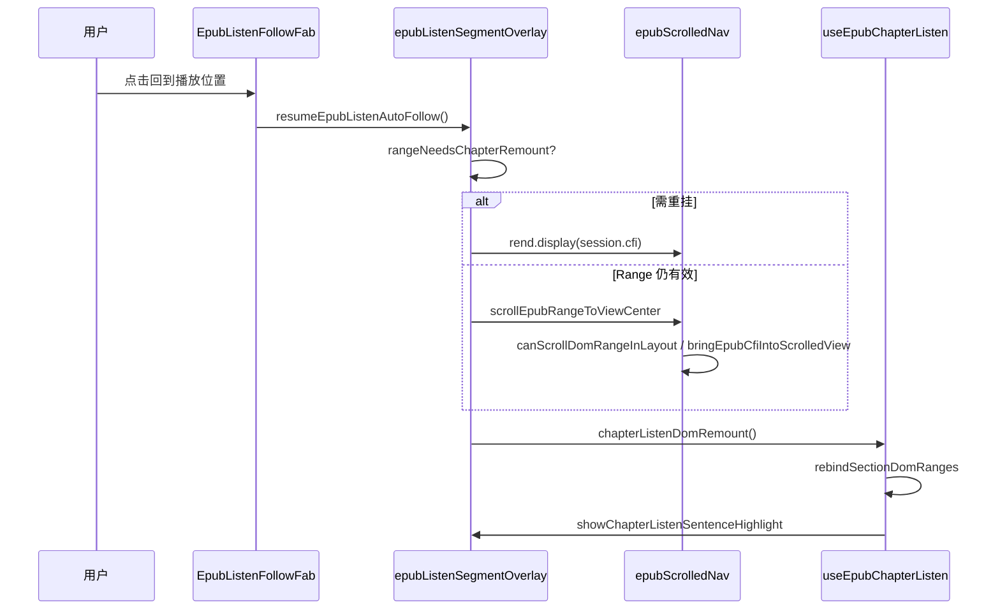

# EPUB 听书：跨章 trim 后「回到播放位置」CFI 重挂载

## 延伸阅读

- [EPUB 听当前：播放自动跟随与回位 FAB](EPUB听书自动跟随浮动按钮.md) — FAB 与 `autoFollow` 基础行为
- [EPUB 听读 — 句间云端 TTS 预取](EPUB听书云端预取影响.md) — 句间预取（与本篇滚动修复正交）
- [EPUB 连续滚动章节衔接](EPUB阅读器设置滚动.md) — continuous 模式与 iframe trim
- [developer/EPUB听书开发.md](./developer/EPUB听书开发.md) — 听书完整调用链

**文档角色**：连续滚动听书时，用户手动滚远后点击右下角 FAB「回到播放位置」无效的根因与 CFI display + DOM 重建修复。

**分析基准**：工作区相对 `HEAD` 的未提交 diff；改动前取自 `git show HEAD:<path>`。

---

## 1. 背景与目标

### 1.1 问题

连续滚动（continuous）听书时，epub.js 会对远离视口的章节 iframe 做 **trim**（从布局中移除或折叠为 0×0）。此时：

1. 播放句对应的 **DOM Range 仍挂在已 trim 的 iframe 文档**上，`scrollTop` 调整无效；
2. `scrollEpubRangeIntoView` / `scrollEpubDomRangeToCenter` 对 **0×0 iframe** 滚不动；
3. 用户点击 FAB 调用 `resumeEpubListenAutoFollow` 后，**视口不跳回、高亮不更新**，体验上 FAB「无效」。

### 1.2 目标

- 滚动 API 在 DOM 滚动失败时 **回退 `rend.display(cfi)`** 重新挂载目标章；
- FAB 恢复跟随时 **先 display 再重建句 Range**，不钉死旧 iframe；
- 听书 hook 在 display 后 **rebind 句 Range 并重绘高亮**。

---

## 2. 改动范围

| 路径 | 变更 |
| ---- | ---- |
| `apps/frontend/src/views/ebook/utils/epub/reader/epubScrolledNav.ts` | `canScrollDomRangeInLayout`、`bringEpubCfiIntoScrolledView`；`scrollEpubRangeToViewCenter` / `scrollEpubRangeIntoView` CFI 回退 |
| `apps/frontend/src/views/ebook/utils/epub/listen/epubListenSegmentOverlay.ts` | `rangeNeedsChapterRemount`、`resumeEpubListenAutoFollow` 重写；`showEpubListenDomRange` 更新 `active.cfi`；`registerChapterListenDomRemount` |
| `apps/frontend/src/views/ebook/hooks/useEpubChapterListen.ts` | `isLiveDomRange`、`rebindSectionDomRanges`、`remountListenDomAfterFollow`；`onSentence` 按需重建 Range |

---

## 3. 实现思路

1. **可滚动性探测**：`canScrollDomRangeInLayout` 检查 Range 所在 iframe 是否仍 `isConnected` 且 `getBoundingClientRect` 宽高非零；否则不走 `scrollTop` 短路。
2. **CFI 回退挂载**：`bringEpubCfiIntoScrolledView` 用 Range 或 `fallbackCfi` 调 `rend.display`，双 rAF 等待布局，再 `resolveCfiDomRange` 后居中/滚入视口。
3. **FAB 两阶段恢复**：`resumeEpubListenAutoFollow` 若 `rangeNeedsChapterRemount` 则先 `display(session.cfi)`，再调 hook 注册的 `chapterListenDomRemount` 重建句 Range 与高亮。
4. **播放中自愈**：`onSentence` 不再闭包旧 `sentenceRanges`；每次高亮前 `isLiveDomRange`，失效则 `rebindSectionDomRanges`。
5. **CFI 随句更新**：`showEpubListenDomRange` 从当前句 Range 反算 CFI 写入 `active.cfi`，供后续 display 回退。

---

## 4. 关键代码对比与注释

### 4.1 `scrollEpubRangeToViewCenter`（`apps/frontend/src/views/ebook/utils/epub/reader/epubScrolledNav.ts`）

**对比范围**：完整导出函数。

**改动前** · `apps/frontend/src/views/ebook/utils/epub/reader/epubScrolledNav.ts`（基线 `HEAD`，约 L404–L417）

```typescript
// 听书分句跳转：连续滚动尝试 DOM 居中，分页回退 scrollEpubRangeIntoView
export async function scrollEpubRangeToViewCenter(
	rend: Rendition,
	range: Range,
	fallbackCfi?: string,
): Promise<boolean> {
	// 连续滚动模式：有主滚动容器
	if (getEpubScrollContainer(rend)) {
		try {
			// 直接改 container.scrollTop 使 Range 居中
			return scrollEpubDomRangeToCenter(rend, range);
		} catch {
			// 异常则返回 false，无 CFI 回退
			return false;
		}
	}
	// 分页模式走通用滚入视口（含 display CFI）
	return scrollEpubRangeIntoView(rend, range, fallbackCfi);
}
```

**改动后** · 当前，约 L411–L435

```typescript
// 听书分句跳转：连续滚动下 trim 后 DOM 居中无效，须回退 display(cfi)
export async function scrollEpubRangeToViewCenter(
	rend: Rendition,
	range: Range,
	fallbackCfi?: string,
): Promise<boolean> {
	// 连续滚动模式
	if (getEpubScrollContainer(rend)) {
		// iframe 仍在布局且可测到尺寸时才尝试 scrollTop
		if (canScrollDomRangeInLayout(range)) {
			try {
				// 尝试 DOM 居中
				if (scrollEpubDomRangeToCenter(rend, range)) {
					try {
						// 居中后确认 Range 已在阅读区可见
						if (isEpubRangeInReaderView(rend, range, QUOTE_VIEW_MARGIN_PX)) {
							return true;
						}
					} catch {
						// 可见性判断失败，落入 CFI 回退
					}
				}
			} catch {
				// DOM 滚动异常，落入 CFI 回退
			}
		}
		// trim 或 DOM 滚动失败：display CFI 后重新挂载并居中
		return bringEpubCfiIntoScrolledView(rend, range, fallbackCfi, 'center');
	}
	// 分页模式
	return scrollEpubRangeIntoView(rend, range, fallbackCfi);
}
```

**变更摘要**：连续滚动不再在 DOM 滚动失败时直接 `return false`，统一走 `bringEpubCfiIntoScrolledView`。

---

### 4.2 `scrollEpubRangeIntoView`（连续滚动分支）

**对比范围**：`scrollEpubRangeIntoView` 中 `getEpubScrollContainer` 为真时的逻辑（分页尾部 `display` 未改）。

**改动前** · 基线，约 L424–L438

```typescript
	} catch {
		// 可见性异常直接 false，未区分 trim
		return false;
	}

	if (getEpubScrollContainer(rend)) {
		// 仅调 scrollTop，trim 后无效
		return scrollEpubDomRangeIntoView(rend, range);
	}
```

**改动后** · 当前，约 L446–L471

```typescript
	} catch {
		// range/iframe 可能已因 continuous trim 失效
	}

	if (getEpubScrollContainer(rend)) {
		if (canScrollDomRangeInLayout(range)) {
			try {
				if (scrollEpubDomRangeIntoView(rend, range)) {
					try {
						if (isEpubRangeInReaderView(rend, range, QUOTE_VIEW_MARGIN_PX)) {
							return true;
						}
					} catch {
						// fall through → CFI
					}
				}
			} catch {
				// fall through → CFI
			}
		}
		return bringEpubCfiIntoScrolledView(rend, range, fallbackCfi, 'nearest');
	}
```

**变更摘要**：与居中 API 对称，连续滚动统一 CFI 回退，`align` 为 `nearest`。

---

### 4.3 `canScrollDomRangeInLayout` / `bringEpubCfiIntoScrolledView`（**纯新增**）

**改动后** · 当前，约 L496–L542

```typescript
// continuous 下目标章 iframe 仍挂在布局里时才可直接改 scrollTop
function canScrollDomRangeInLayout(range: Range): boolean {
	try {
		// Range 所在 iframe 的 window
		const win = range.startContainer.ownerDocument?.defaultView;
		// 对应 iframe 元素
		const iframe = win?.frameElement as HTMLIFrameElement | null;
		// 未连接 DOM 则不可滚动
		if (!iframe?.isConnected) return false;
		// trim 后 iframe 常为 0×0
		const rect = iframe.getBoundingClientRect();
		return rect.width > 0 || rect.height > 0;
	} catch {
		return false;
	}
}

// 用 CFI 重新 display 挂载目标章，再滚入视口（跨章听书回到播放位置）
async function bringEpubCfiIntoScrolledView(
	rend: Rendition,
	range: Range | null,
	fallbackCfi: string | undefined,
	align: 'nearest' | 'center',
): Promise<boolean> {
	// 优先从 Range 算 CFI，否则用 session 存的 fallbackCfi
	const cfi =
		(range ? cfiFromDomRange(rend, range)?.trim() : '') ||
		fallbackCfi?.trim() ||
		'';
	if (!cfi) return false;

	try {
		// 重新挂载目标章 iframe
		await rend.display(cfi);
		await new Promise<void>((resolve) => {
			requestAnimationFrame(() => {
				requestAnimationFrame(() => resolve());
			});
		});
	} catch {
		return false;
	}

	// display 后从新 DOM 解析 Range
	const resolved = resolveCfiDomRange(rend, cfi);
	if (!resolved) return true;
	try {
		return align === 'center'
			? scrollEpubDomRangeToCenter(rend, resolved)
			: scrollEpubDomRangeIntoView(rend, resolved);
	} catch {
		return true;
	}
}
```

---

### 4.4 `rangeNeedsChapterRemount` / `resumeEpubListenAutoFollow`（`epubListenSegmentOverlay.ts`）

**对比范围**：`resumeEpubListenAutoFollow` 全函数；`rangeNeedsChapterRemount` 为新增。

**改动前** · 基线，约 L562–L568

```typescript
export function resumeEpubListenAutoFollow(): void {
	if (!session) return;
	session.autoFollow = true;
	pendingFollowScroll = false;
	emitAutoFollowState();
	scrollActiveListenIntoView();
}
```

**改动后** · 当前，约 L427–L476

```typescript
// 判断当前播放句 Range 是否需先 display 重挂章（trim / 断连）
function rangeNeedsChapterRemount(range: Range | null): boolean {
	if (!range || !isRangeConnected(range)) return true;
	try {
		const node = range.startContainer;
		if (!node.isConnected) return true;
		const iframe = node.ownerDocument?.defaultView
			?.frameElement as HTMLElement | null;
		if (!iframe?.isConnected) return true;
		const rect = iframe.getBoundingClientRect();
		return rect.width <= 0 && rect.height <= 0;
	} catch {
		return true;
	}
}

export function resumeEpubListenAutoFollow(): void {
	if (!session) return;
	session.autoFollow = true;
	pendingFollowScroll = false;
	emitAutoFollowState();

	const { rend, cfi, epoch } = session;
	const key = cfi.trim();
	const range = resolveActiveListenDomRange();

	void withProgrammaticScroll(async () => {
		// 远章 trim：先 display 挂回播放章
		if (rangeNeedsChapterRemount(range) && key) {
			try {
				await rend.display(key);
				await new Promise<void>((resolve) => {
					requestAnimationFrame(() => {
						requestAnimationFrame(() => resolve());
					});
				});
			} catch {
				// ignore
			}
		} else if (range) {
			await scrollEpubRangeToViewCenter(rend, range, key);
		}

		if (!session || session.epoch !== epoch) return;
		// 听书 hook 重建句 Range 与高亮
		if (chapterListenDomRemount) {
			chapterListenDomRemount();
			return;
		}
		scrollActiveListenIntoView();
	});
}
```

**变更摘要**：FAB 点击后异步 `display` + 注册回调重建 DOM；未注册时回退 `scrollActiveListenIntoView`。

---

### 4.5 `scrollActiveListenIntoView` / `showEpubListenDomRange` / `registerChapterListenDomRemount`

**改动前** · `scrollActiveListenIntoView` 基线，约 L410–L419

```typescript
function scrollActiveListenIntoView(): void {
	if (!session) return;
	const range = resolveActiveListenDomRange();
	if (!range) return;
	const { rend, cfi, epoch } = session;
	void withProgrammaticScroll(async () => {
		await scrollEpubRangeIntoView(rend, range, cfi);
		if (!session || session.epoch !== epoch) return;
	});
}
```

**改动后** · 当前，约 L410–L418、L662–L677、L842–L845

```typescript
function scrollActiveListenIntoView(): void {
	if (!session) return;
	const range = resolveActiveListenDomRange();
	if (!range) return;
	const { rend, cfi, epoch } = session;
	void withProgrammaticScroll(async () => {
		// 换句自动跟随：居中滚入（内含 CFI 回退）
		await scrollEpubRangeToViewCenter(rend, range, cfi);
		if (!session || session.epoch !== epoch) return;
	});
}

// showEpubListenDomRange 内新增：每句高亮时刷新 session.cfi
	const rangeCfi = cfiFromDomRange(rend, snapped)?.trim();
	if (rangeCfi) active.cfi = rangeCfi;

// 模块级注册点
type DomRemountFn = () => void;
let chapterListenDomRemount: DomRemountFn | null = null;

/** 跨章回跳 display 后：听书 hook 重建句 Range，避免钉死旧 iframe 高亮 */
export function registerChapterListenDomRemount(fn: DomRemountFn | null): void {
	chapterListenDomRemount = fn;
}
```

**变更摘要**：自动跟随改居中 API；句高亮同步 CFI；hook 通过 `registerChapterListenDomRemount` 注入重建逻辑。

---

### 4.6 `rebindSectionDomRanges` / `remountListenDomAfterFollow`（`useEpubChapterListen.ts`，**纯新增**）

**改动后** · 当前，约 L80–L213

```typescript
// 判断句 Range 是否仍挂在已连接 iframe 上
function isLiveDomRange(range: Range | null | undefined): range is Range {
	if (!range) return false;
	try {
		const node = range.startContainer;
		if (!node.isConnected) return false;
		const iframe = node.ownerDocument?.defaultView
			?.frameElement as HTMLElement | null;
		return !!iframe?.isConnected;
	} catch {
		return false;
	}
}

	/** continuous trim 后重建当前章句 Range，供高亮/跟随继续跟着播放句走 */
	const rebindSectionDomRanges = useCallback(
		(rend: Rendition): boolean => {
			const ctx = sectionRef.current;
			if (!ctx) return false;
			const visible =
				extractVisibleListenSection(rend, ctx.spineIndex) ??
				extractVisibleListenSection(rend);
			if (!visible?.outerRange) return false;
			const sentenceRanges = indexChapterSentenceRanges(
				visible.outerRange,
				ctx.plain,
			);
			sectionRef.current = { ...ctx, sentenceRanges };
			sectionDocRef.current =
				visible.outerRange.startContainer.ownerDocument;
			return sentenceRanges.some(isLiveDomRange);
		},
		[],
	);

	const remountListenDomAfterFollow = useCallback(() => {
		const rend = getRenditionRef.current();
		const ctx = sectionRef.current;
		if (!rend || !ctx) return;
		if (!rebindSectionDomRanges(rend)) return;
		const si = sentenceCursorRef.current;
		const range = sectionRef.current?.sentenceRanges[si];
		if (!range) return;
		showChapterListenSentenceHighlight(rend, range, {
			forceScroll: true,
			align: 'center',
		});
	}, [rebindSectionDomRanges]);

	useEffect(() => {
		registerChapterListenDomRemount(remountListenDomAfterFollow);
		return () => registerChapterListenDomRemount(null);
	}, [remountListenDomAfterFollow]);
```

---

### 4.7 `playSentencesFromCursor` → `onSentence`（Range 重建）

**对比范围**：`onSentence` 回调（旧版为内联 `for` 循环内高亮逻辑）。

**改动前** · 基线内联高亮，约 L257–L269

```typescript
				const domRange = sentenceRanges[si];
				const hasHighlight = !!(rend && domRange);

				if (hasHighlight) {
					const jumpScroll =
						opts?.scrollCenterOnFirst && si === startSi
							? ({ forceScroll: true, align: 'center' as const } as const)
							: undefined;
					showChapterListenSentenceHighlight(rend, domRange, jumpScroll);
				}
```

**改动后** · 当前 `onSentence`，约 L286–L307

```typescript
					onSentence: (globalSi, info) => {
						if (!isGenActive(gen) || pausedRef.current) return;
						sentenceCursorRef.current = globalSi;
						syncState({
							status: 'playing',
							sentenceIndex: globalSi,
							sentenceCount: sentences.length,
						});
						if (!rend) return;
						let liveCtx = sectionRef.current;
						let domRange = liveCtx?.sentenceRanges[globalSi];
						if (!isLiveDomRange(domRange)) {
							if (!rebindSectionDomRanges(rend)) return;
							liveCtx = sectionRef.current;
							domRange = liveCtx?.sentenceRanges[globalSi];
						}
						if (!isLiveDomRange(domRange)) return;
						const jumpScroll = info.forceCenter
							? ({ forceScroll: true, align: 'center' as const } as const)
							: undefined;
						showChapterListenSentenceHighlight(rend, domRange, jumpScroll);
					},
```

**变更摘要**：播放过程中句 Range 失效时按需 rebind，不依赖开听时快照。

---

## 5. 数据流



---

## 6. 兼容性与回归

| 场景 | 期望 |
| ---- | ---- |
| 连续滚动听书，手动滚到远章后点 FAB | 视口跳回当前句，高亮正确，`autoFollow` 恢复 |
| 播放中跨章 trim，下一句高亮 | `onSentence` 自动 rebind，不中断朗读 |
| 分页模式听书 | 仍走 `scrollEpubRangeIntoView` 分页 `display` 路径 |
| 听当前（非听书）点 FAB | `chapterListenDomRemount` 未注册时回退 `scrollActiveListenIntoView` |

---

## 7. 相关源码路径

| 说明 | 路径 |
| ---- | ---- |
| 滚动 + CFI 回退 | `apps/frontend/src/views/ebook/utils/epub/reader/epubScrolledNav.ts` |
| FAB / session / remount 注册 | `apps/frontend/src/views/ebook/utils/epub/listen/epubListenSegmentOverlay.ts` |
| 句 Range 重建 | `apps/frontend/src/views/ebook/hooks/useEpubChapterListen.ts` |

---

若与仓库最新源码不一致，以源码为准。
