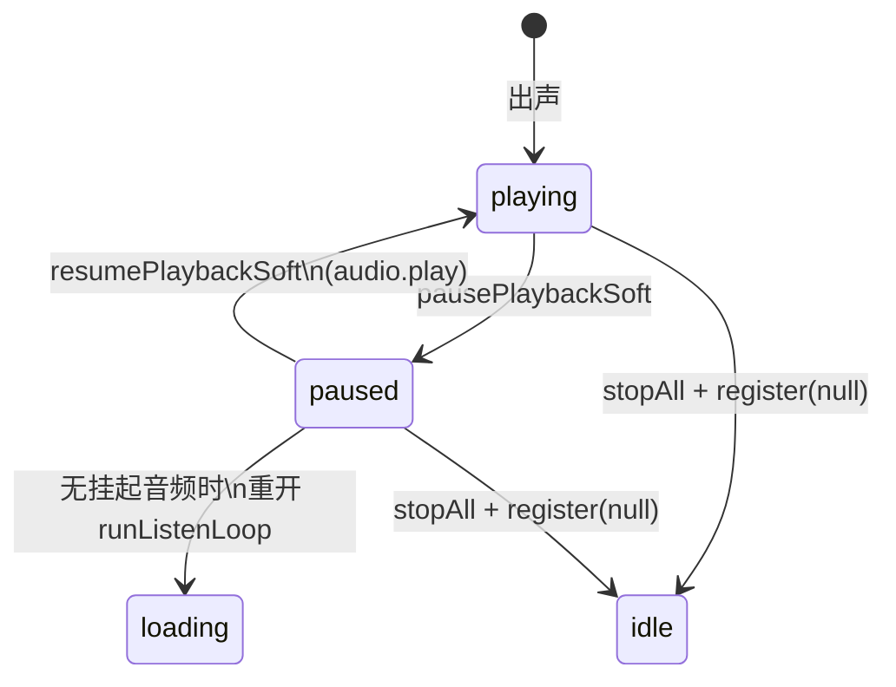

# EPUB 听书：软暂停与系统媒体同步

> **文档角色**：听书 / 听当前底栏暂停后从 **currentTime** 续播；与系统 Now Playing / 媒体键双向同步；退出会话时尽力拆除 Media Session。  
> **延伸阅读**：[EPUB听书触控栏加载.md](./EPUB听书触控栏加载.md)（loading 期隐藏/锁定 Touch Bar）、[EPUB听书音频结束UI.md](./EPUB听书音频结束UI.md)（ended 与 UI）、[EPUB听书栏章节导航.md](./EPUB听书栏章节导航.md)（底栏切章）、[EPUB章节听书.md](./EPUB章节听书.md)（状态机基线）、[EPUB听书播放修复2026-07.md](./EPUB听书播放修复2026-07.md)（本轮索引）。

## 1. 背景与目标

| 场景 | 旧行为 | 期望 |
|------|--------|------|
| 底栏点暂停再继续 | `stopAll` + 重开循环 → **整段/整句从头播** | **从暂停进度**续播 |
| 底栏已暂停 | 系统控制中心仍可能显示播放 / 幽灵 `play()` | 系统与底栏 **同为暂停** |
| 系统媒体键暂停 | 音频停了，底栏仍显示播放中 | 底栏同步为 **暂停** |
| 系统媒体键继续 | 无桥接 | 底栏同步 **继续** 并从进度续播 |
| 退出听书 | handlers 等 React effect 才卸；元素/session 可能残留 | `stopInternal` **同步** `register(null)`：卸键、清 metadata/position、丢弃 Audio 引用 |

## 2. 改动范围

| 路径 | 说明 |
|------|------|
| `apps/frontend/src/utils/speech.ts` | 软暂停 API；Media Session；`audio` pause bridge；`register(null)` 会话拆除（`releaseCloudAudioEl` + `clearPlaybackMediaSession`） |
| `apps/frontend/src/views/ebook/hooks/useEpubChapterListen.ts` | `pause` / `resume` 软路径；`stopInternal` 同步卸媒体键 |
| `apps/frontend/src/views/ebook/hooks/useEbookQuoteListen.ts` | 同上 |

## 3. 实现思路

**软暂停（相对硬 stop）**

| | 硬 `stopAllPlayback` | 软 `pausePlaybackSoft` |
|--|------------------------------|-------------------------------|
| `playbackGeneration` | +1，作废异步 | **不变** |
| `waitCloudAudioEnd` | abort | **保持等待** |
| Audio | `pause` + 清 `src` | **仅 `pause`，保留 src/currentTime** |
| 续播 | 重新合成 | `audio.play()` 从进度继续 |



**系统同步（播放中）**

1. `navigator.mediaSession.setActionHandler(play/pause/stop)` → hook `resume` / `pause`
2. `audio` 的 `pause` 事件（系统键）→ 回调 hook 软暂停（应用内 pause 用 `suppressAudioPauseEvent` 防回环）
3. `playbackState`：`playing` / `paused`；`none` 时走 `clearPlaybackMediaSession`（metadata / position / 可选 handlers）

**退出听书（会话拆除）**

1. Hook `stopInternal`：先 `stopAllPlayback()`，再 **同步** `registerPlaybackMediaHandlers(null)`（勿只等 `isActive` 的 effect cleanup）
2. `register(null)`：`playbackGeneration++`、abort wait、`releaseCloudAudioEl()`（丢掉主文档 `<audio>` 引用）、停解锁音、`clearPlaybackMediaSession({ clearHandlers: true })`，并 `requestAnimationFrame` 再清一次
3. 句间换轨仍只 `stopPlaybackMediaOnly`（保留元素与已注册媒体键），不走完整 `register(null)`

**刻意不做的方案（已回退）**

| 尝试 | 结果 |
|------|------|
| 仅 `setPositionState({ duration: Infinity })` 藏进度条 | macOS 仍读 `HTMLAudioElement` 有限 duration，scrubber 仍在 |
| 云端改纯 Web Audio（无 `<audio>`） | 系统控件偶发仍残留；且与解锁/续播路径耦合风险高 |
| 隔离 iframe 播放，退出时 `remove` iframe | **破坏正常出声**，已回退主文档 `new Audio()` |

结论：浏览器 / WKWebView 下 **无法保证**退出后 macOS 菜单栏/控制中心控件立刻消失；当前以实现 **软暂停续播 + 媒体键↔底栏同步** 为准，退出路径做尽力拆除。若桌面端必须硬清 Now Playing，需另开 **Tauri 原生** `MPNowPlayingInfoCenter` 方案（未落地）。

## 4. 关键实现（改动前 / 改动后）

### 4.1 Hook `pause` / `resume`（`useEpubChapterListen`）

**对比范围**：`pause`、`resume` 两个完整 `useCallback`（听当前 Hook 同构，见 §4.3）。

**改动前** · `apps/frontend/src/views/ebook/hooks/useEpubChapterListen.ts`（基线 HEAD，约 L651–L665）

```tsx
	// 底栏暂停：仅 playing 可进
	const pause = useCallback(() => {
		// 非播放中忽略（loading 时不能暂停）
		if (stateRef.current.status !== 'playing') return;
		// 标记暂停，供 isActive / 循环判断
		pausedRef.current = true;
		// 杀掉听书循环世代，当前 runListenLoop 退出
		loopGenRef.current += 1;
		// 硬停：递增 TTS 世代 + 清 Audio src，无法从进度续播
		stopAllPlayback();
		// UI 显示暂停
		syncState({ status: 'paused' });
	}, [syncState]);

	// 底栏继续：整段循环从句游标重开（合成从头）
	const resume = useCallback(() => {
		// 仅 paused 可继续
		if (stateRef.current.status !== 'paused') return;
		// 清除暂停标记
		pausedRef.current = false;
		// 新世代启动听书主循环
		const gen = ++loopGenRef.current;
		// 先显示 loading，等首包
		syncState({ status: 'loading' });
		// 从 sentenceCursor 重新 playListenUnitsFromCursor（非 Audio currentTime）
		void runListenLoop(gen, { continueSections: true });
	}, [runListenLoop, syncState]);
```

**改动后** · `apps/frontend/src/views/ebook/hooks/useEpubChapterListen.ts`（当前，约 L697–L790）

```tsx
	// 底栏/系统暂停：软暂停，不杀 loopGen
	const pause = useCallback(() => {
		// 播放中或合成中均可暂停（系统键可能在 loading 触发）
		const status = stateRef.current.status;
		if (status !== 'playing' && status !== 'loading') return;
		// 标记暂停（循环 isActive 会为 false，但 await wait 仍挂起）
		pausedRef.current = true;
		// 软暂停：不杀 loopGen / 不 abort TTS wait，续播从 currentTime 继续
		pausePlaybackSoft();
		// UI 显示暂停
		syncState({ status: 'paused' });
	}, [syncState]);

	// 底栏/系统继续：优先软续播
	const resume = useCallback(() => {
		// 仅 paused 可继续
		if (stateRef.current.status !== 'paused') return;
		// 清除暂停标记，允许 cadence / isActive
		pausedRef.current = false;
		// 有挂起 Audio（含合成已就绪待播）则 play() 续进度
		if (resumePlaybackSoft()) {
			// 软续播成功：直接 playing，不重开循环
			syncState({ status: 'playing' });
			return;
		}
		// 无已挂起音频（如暂停发生在合成返回前）：从当前句重开循环
		const gen = ++loopGenRef.current;
		syncState({ status: 'loading' });
		void runListenLoop(gen, { continueSections: true });
	}, [runListenLoop, syncState]);

	// 供 Media Session 回调读到最新 pause/resume
	const pauseRef = useRef(pause);
	pauseRef.current = pause;
	const resumeRef = useRef(resume);
	resumeRef.current = resume;

	// ...（未改动：stop / goToSentence / setRate / togglePlay）

	// 会话活跃：loading | playing | paused
	const isActive =
		state.status === 'loading' ||
		state.status === 'playing' ||
		state.status === 'paused';

	// 听书激活期间把系统媒体键接到本 hook
	useEffect(() => {
		if (!isActive) return;
		registerPlaybackMediaHandlers({
			play: () => resumeRef.current(),
			pause: () => pauseRef.current(),
		});
		// 失活或卸载时卸掉 handlers，避免误触
		return () => registerPlaybackMediaHandlers(null);
	}, [isActive]);
```

**变更摘要**：暂停不再 `stopAll` / `loopGen++`；继续优先 `resumePlaybackSoft`；注册 Media Session。

### 4.2 `pausePlaybackSoft` / `resumePlaybackSoft`（纯新增）

**改动前**：无此二符号；暂停一律 `stopAllPlayback`。

**改动后** · `apps/frontend/src/utils/speech.ts`（当前，约 L1122–L1201）

```ts
/**
 * 听书底栏软暂停：只 pause 介质，不递增世代、不 abort wait。
 * 续播走 resumePlaybackSoft，从 currentTime 继续。
 */
export function pausePlaybackSoft(): void {
	// 标记软暂停：后续 startCloudAudioPlayback 在 play 前会 wait
	playbackSoftPaused = true;
	// 本机 Web Speech：浏览器 pause API（若不支持则忽略）
	if (isSpeechSupported()) {
		try {
			window.speechSynthesis.pause();
		} catch {
			// ignore
		}
	}
	// 云端 Audio：应用内 pause，抑制 pause 事件以免回环进 Media Session
	if (cloudAudio && !cloudAudio.paused) {
		withSuppressedAudioPauseEvent(() => {
			cloudAudio?.pause();
		});
	}
	// 系统 Now Playing 显示 paused
	setPlaybackMediaState('paused');
}

/** @returns 是否已从暂停的 Audio / speechSynthesis 续上（含合成已就绪待播） */
export function resumePlaybackSoft(): boolean {
	// 当前云端 Audio 元素
	const audio = cloudAudio;
	// 是否仍挂着可播资源
	const hasSrc = Boolean(audio?.currentSrc || audio?.getAttribute('src'));
	// 未 ended 且有 src 则可软续播
	const canResumeAudio = !!(audio && hasSrc && !audio.ended);

	// 清除软暂停，并唤醒 waitWhileSoftPaused 等待者
	playbackSoftPaused = false;
	const waiters = softResumeWaiters;
	softResumeWaiters = [];
	for (const w of waiters) w();

	let resumed = false;
	if (canResumeAudio && audio) {
		// 仍 paused：从 currentTime play
		if (audio.paused) {
			void audio
				.play()
				.then(() => {
					// 若 play 完成前又被软暂停，不再标 playing
					if (playbackSoftPaused) return;
					setPlaybackMediaState('playing');
				})
				.catch(() => {});
		}
		// 已在播（竞态）也算续上，避免误走重开循环
		resumed = true;
	}
	// 本机 TTS 若处于 speechSynthesis.paused 则 resume
	if (isSpeechSupported()) {
		try {
			if (window.speechSynthesis.paused) {
				window.speechSynthesis.resume();
				resumed = true;
			}
		} catch {
			// ignore
		}
	}
	if (resumed) setPlaybackMediaState('playing');
	return resumed;
}

// 把系统/用户对 Audio 的 pause 桥到听书 UI
function bindCloudAudioPauseBridge(
	audio: HTMLAudioElement,
	generation: number,
): void {
	// 先卸旧监听，避免重复
	detachCloudAudioPauseBridge?.();
	const onPause = () => {
		// 应用内 pause/stop 触发的事件忽略
		if (suppressAudioPauseEvent) return;
		// 过期世代忽略
		if (!isPlaybackGenerationActive(generation)) return;
		// ended 后的 pause 不算用户暂停
		if (audio.ended) return;
		if (englishPlaybackMediaHandlers) {
			// 系统控制中心 / 耳机键：走 hook 软暂停以同步底栏
			englishPlaybackMediaHandlers.pause();
			return;
		}
		// 无 UI bridge 时仍软暂停介质
		pausePlaybackSoft();
	};
	audio.addEventListener('pause', onPause);
	detachCloudAudioPauseBridge = () => {
		audio.removeEventListener('pause', onPause);
	};
}
```

**变更摘要**：软暂停保留进度；`bindCloudAudioPauseBridge` 打通系统 pause → UI。

### 4.3 Media Session 注册与会话拆除

**对比范围**：`registerPlaybackMediaHandlers` 全函数。

**改动前** · `apps/frontend/src/utils/speech.ts`（基线：仅卸 action + `playbackState = none`）

```ts
// 听书/听当前：把系统媒体键接到 pause/resume；传 null 卸载
export function registerPlaybackMediaHandlers(
	// handlers 为 null 表示会话结束
	handlers: PlaybackMediaHandlers | null,
	// 函数体开始
): void {
	// 模块级保存，供 audio pause bridge 调用
	englishPlaybackMediaHandlers = handlers;
	// SSR / 无 Media Session 的环境直接返回
	if (typeof navigator === 'undefined' || !navigator.mediaSession) return;
	try {
		// 卸载分支：听书结束后不再响应媒体键
		if (!handlers) {
			// 卸掉 play
			navigator.mediaSession.setActionHandler('play', null);
			// 卸掉 pause
			navigator.mediaSession.setActionHandler('pause', null);
			// 卸掉 stop
			navigator.mediaSession.setActionHandler('stop', null);
			// 仅标 none，不清理 metadata / position，也不丢弃 Audio
			navigator.mediaSession.playbackState = 'none';
			// 结束卸载分支
			return;
		}
		// 系统播放 → hook resume
		navigator.mediaSession.setActionHandler('play', () => handlers.play());
		// 系统暂停 → hook pause
		navigator.mediaSession.setActionHandler('pause', () => handlers.pause());
		// 系统停止按暂停处理
		navigator.mediaSession.setActionHandler('stop', () => handlers.pause());
	} catch {
		// 旧环境不支持 setActionHandler
	}
	// 函数结束
}
```

**改动后** · `apps/frontend/src/utils/speech.ts`（当前，约 L1037–L1073）

```ts
// 听书/听当前：把系统媒体键接到 pause/resume；传 null 卸载并拆除介质
export function registerPlaybackMediaHandlers(
	// handlers 为 null 表示会话结束（完整拆除）
	handlers: PlaybackMediaHandlers | null,
	// 函数体开始
): void {
	// 卸载：先清空回调，避免异步 pause 再进 UI
	if (!handlers) {
		// 模块级 handlers 置空（迟到的 playing 状态也会被挡住）
		englishPlaybackMediaHandlers = null;
		// 作废进行中的 play / wait，防止无声进度条继续走
		playbackGeneration += 1;
		// 打断 waitCloudAudioEnd
		abortCloudAudioWait?.();
		// 清空 abort 引用
		abortCloudAudioWait = null;
		// 唤醒软暂停 waiters 并清标记，避免悬挂 Promise
		clearSoftPauseState();
		// 取消本机 Web Speech
		if (isSpeechSupported()) {
			try {
				// 硬取消合成
				window.speechSynthesis.cancel();
			} catch {
				// 部分环境无 speechSynthesis
			}
		}
		// 丢掉主文档 <audio> 引用并 pause/清 src（句间不走此路径）
		releaseCloudAudioEl();
		// 停掉 prime 用的静音解锁 Audio
		silenceCloudAudioUnlock();
		// 清 metadata / position / 全部 action handlers
		clearPlaybackMediaSession({ clearHandlers: true });
		// macOS Chrome：偶发需下一帧再清一次
		requestAnimationFrame(() => {
			// 若已重新注册听书则不再清
			if (englishPlaybackMediaHandlers) return;
			// 再清一次 Media Session
			clearPlaybackMediaSession({ clearHandlers: true });
		});
		// 卸载分支结束
		return;
	}
	// 保存 play/pause 回调供 bridge 使用
	englishPlaybackMediaHandlers = handlers;
	// 无 Media Session 则只保存回调
	if (typeof navigator === 'undefined' || !navigator.mediaSession) return;
	try {
		// 系统播放 → hook resume（软续播或重开循环）
		navigator.mediaSession.setActionHandler('play', () => handlers.play());
		// 系统暂停 → hook pause（软暂停）
		navigator.mediaSession.setActionHandler('pause', () => handlers.pause());
		// 系统停止按暂停处理
		navigator.mediaSession.setActionHandler('stop', () => handlers.pause());
	} catch {
		// 旧环境不支持 setActionHandler
	}
	// 函数结束
}
```

**变更摘要**：`register(null)` 从「只卸键」升级为「世代++ + 丢弃 Audio + 清 Media Session（含 rAF 二次清）」。

### 4.4 Hook `stopInternal` 同步卸媒体键

**对比范围**：`useEpubChapterListen` 的 `stopInternal`（听当前同构，多一行 `register(null)`）。

**改动前** · `apps/frontend/src/views/ebook/hooks/useEpubChapterListen.ts`（基线：只 `stopAll`，等 effect cleanup 卸键）

```tsx
	// 停止听书会话：idle + 清高亮
	const stopInternal = useCallback((opts?: { notify?: boolean }) => {
		// 作废听书循环世代
		loopGenRef.current += 1;
		// 清暂停标记
		pausedRef.current = false;
		// 清 CFI 起听标记
		resolveStartCfiRef.current = false;
		// 清空节上下文
		sectionRef.current = null;
		// 清空节文档
		sectionDocRef.current = null;
		// 硬停 TTS（清 src、世代++）
		stopAllPlayback();
		// 卸章听高亮
		teardownChapterListenHighlight(getRenditionRef.current() ?? undefined);
		// 清 host 浮层
		clearEpubListenSegmentOverlay();
		// 保留倍速进 idle
		const idle = { ...IDLE_STATE, rate: rateRef.current };
		// 写入 React state
		setState(idle);
		// 同步 ref
		stateRef.current = idle;
		// 默认通知会话结束（切章等可 notify:false）
		if (opts?.notify !== false) onSessionEndRef.current?.();
		// useCallback 无依赖
	}, []);
```

**改动后** · `apps/frontend/src/views/ebook/hooks/useEpubChapterListen.ts`（当前，约 L153–L169）

```tsx
	// 停止听书会话：idle + 清高亮 + 同步卸系统媒体键
	const stopInternal = useCallback((opts?: { notify?: boolean }) => {
		// 作废听书循环世代
		loopGenRef.current += 1;
		// 清暂停标记
		pausedRef.current = false;
		// 清 CFI 起听标记
		resolveStartCfiRef.current = false;
		// 清空节上下文
		sectionRef.current = null;
		// 清空节文档
		sectionDocRef.current = null;
		// 硬停 TTS（清 src、世代++）
		stopAllPlayback();
		// 同步卸 Media Session / 丢弃 Audio，勿等 isActive effect
		registerPlaybackMediaHandlers(null);
		// 卸章听高亮
		teardownChapterListenHighlight(getRenditionRef.current() ?? undefined);
		// 清 host 浮层
		clearEpubListenSegmentOverlay();
		// 保留倍速进 idle
		const idle = { ...IDLE_STATE, rate: rateRef.current };
		// 写入 React state
		setState(idle);
		// 同步 ref
		stateRef.current = idle;
		// 默认通知会话结束
		if (opts?.notify !== false) onSessionEndRef.current?.();
		// useCallback 无依赖
	}, []);
```

**变更摘要**：退出路径立刻 `register(null)`，缩短系统控件残留窗口。`useEbookQuoteListen.stopInternal` 同样在 `stopAll` 后调用 `register(null)`。

### 4.5 听当前 Hook

`useEbookQuoteListen` 的 `pause` / `resume` / `useEffect(register…)` 与听书同构：软暂停 + `resumePlaybackSoft` 失败时 `playFromCursor` 重开。切句 / 停止仍走 `stopAllPlayback`；停止时额外同步 `register(null)`。

### 4.6 超时与软暂停

`waitCloudAudioEnd` 的超时在 `playbackSoftPaused` 或 `audio.paused && !ended` 时 **重新武装**（按剩余时长），避免长暂停被误判 `AUDIO_TIMEOUT`。

### 4.7 `setPlaybackMediaState('none')`

句间 `stopPlaybackMediaOnly` 会调 `setPlaybackMediaState('none')` → `clearPlaybackMediaSession({ clearHandlers: !englishPlaybackMediaHandlers })`：听书仍活跃时只清展示、**保留**已注册的 play/pause 键；会话已卸 handlers 时连 action 一并清掉。

## 5. 行为变化与兼容性

- 暂停/继续：**同段音频从进度续**；暂停发生在合成返回前则仍从当前句重开。
- 停止 / 切句 / 切章 / 新开听书：仍硬 `stopAll`；**停止/退出**另走 `register(null)` 完整拆除。
- 系统媒体键与底栏状态双向同步（支持 Media Session 的环境）。
- **已知限制**：macOS 退出后 Now Playing / 播放暂停钮可能仍短暂或持续显示（平台绑定 `HTMLAudioElement`）；不以 Web Audio / iframe 等方式牺牲出声稳定性。桌面硬清留给原生方案。

## 6. 测试与回归建议

- [ ] 播放中途底栏暂停 → 继续：声音从暂停点接着，非整段重头
- [ ] 暂停超过数十秒再继续：不因超时中断
- [ ] 系统控制中心暂停 → 底栏变暂停图标；再点系统播放 → 底栏播放且续进度
- [ ] 底栏暂停后系统 Now Playing 为 paused（非仍在播）
- [ ] 停止听书后系统媒体键不再驱动听书 UI（handlers 已卸）
- [ ] 停止后云端出声立即停止（无幽灵无声音频）
- [ ] 听当前暂停/继续与听书一致
- [ ] 硬刷新后云端听书可正常出声（确认 iframe/Web Audio 实验未残留）

## 7. 相关文档与代码索引

| 说明 | 路径 |
|------|------|
| TTS 软暂停 / Media Session / 会话拆除 | `apps/frontend/src/utils/speech.ts` |
| 听书 Hook | `apps/frontend/src/views/ebook/hooks/useEpubChapterListen.ts` |
| 听当前 Hook | `apps/frontend/src/views/ebook/hooks/useEbookQuoteListen.ts` |
| 音频 ended / abort | `docs/ebook/EPUB听书音频结束UI.md` |
| 底栏切章 | `docs/ebook/EPUB听书栏章节导航.md` |
| 本轮播放改动索引 | `docs/ebook/EPUB听书播放修复2026-07.md` |

---

（若与仓库最新源码不一致，以源码为准）
