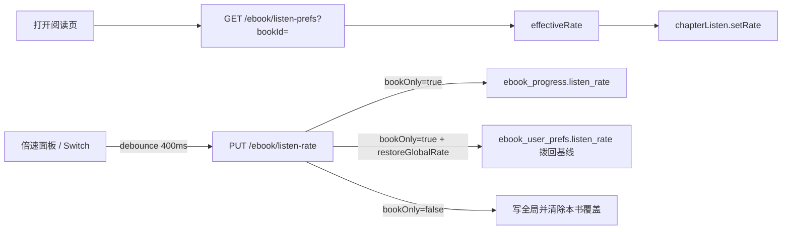

# EPUB 听书倍速落库与「设置为本书籍」

> **文档角色**：本轮听书倍速账号级持久化（全局 + 本书覆盖）的实现说明（主文档）。  
> **延伸阅读**：[EPUB听书播放器栏标尺UI.md](./EPUB听书播放器栏标尺UI.md)（刻度尺 UI）· [EPUB听书栏加载控件.md](./EPUB听书栏加载控件.md)（loading 时右侧操作）· [EPUB听书源后速率.md](./EPUB听书源后速率.md)（云端倍速听感）

## 1. 背景与目标

- **问题**：听书倍速仅会话内有效，换书/刷新后丢失；需要账号落库，并支持「只对本书生效」。
- **目标**：
  - 默认改倍速 → 写用户**全局**偏好，未单独设置的书共用。
  - 打开 **设置为本书籍** → 只写本书覆盖；其它书用各自覆盖或全局。
  - 未设置时默认 **1.0×**。
  - 面板 UI：倍速卡片下方独立一行，左文案、右 Switch。

## 2. 改动范围

| 层 | 路径 |
| -- | ---- |
| Migration | `apps/backend/src/migrations/1784311349242-ebook_listen_rate.ts` |
| Entity | `apps/backend/src/services/ebook/ebook-user-prefs.entity.ts`（新）· `ebook-progress.entity.ts`（`listen_rate` 可空） |
| DTO / API | `dto/save-ebook-listen-rate.dto.ts` · `ebook.controller.ts` · `ebook.service.ts` · `ebook.module.ts` |
| 前端 API | `apps/frontend/src/service/api.ts` · `service/index.ts` |
| 阅读页接线 | `apps/frontend/src/views/ebook/read.tsx` |
| 倍速面板 UI | `apps/frontend/src/views/ebook/components/listen/EpubListenPlayerBar.tsx` |
| i18n | `apps/frontend/src/i18n/locales/zh-CN.ts` · `en-US.ts` |

## 3. 实现思路



1. **数据模型**：`ebook_user_prefs.listen_rate`（用户全局，默认 1）+ `ebook_progress.listen_rate`（本书覆盖，`null` = 跟全局）。
2. **生效公式**：`effectiveRate = bookListenRate ?? globalListenRate ?? 1`。
3. **污染修复**：先拖倍速会写全局，再开「本书」时，前端带上进书时记下的 `restoreGlobalRate`，后端把全局拨回基线，避免其它书被带跑。
4. **基线更新时机**：仅 hydrate 与「取消本书」时更新；全局模式下拖速不改基线。
5. **UI**：独立卡片 + Switch，左文案右开关，对齐常见播客「只应用到本专辑」布局。

## 4. 关键实现（改动前 / 改动后对比 + 注释）

### 4.1 `saveListenRate`（纯新增）

**对比范围**：`EbookService.saveListenRate` 全方法。基线无此方法，仅贴改动后。

**改动后** · `apps/backend/src/services/ebook/ebook.service.ts`（当前，约 L391–L450）

```typescript
// 保存听书倍速：bookOnly 写本书；否则写全局并可清本书覆盖
async saveListenRate(
	// 当前登录用户 id
	userId: number,
	// 请求体：rate / bookOnly / bookId / restoreGlobalRate
	dto: SaveEbookListenRateDto,
	// 返回最新偏好 DTO（含 effectiveRate）
): Promise<EbookListenPrefsDto> {
	// 把倍速夹到 0.5～3，保留一位小数
	const rate = this.clampListenRate(dto.rate);
	// 仅显式 true 视为「设置为本书籍」
	const bookOnly = dto.bookOnly === true;

	// 本书覆盖分支
	if (bookOnly) {
		// 本书模式必须带 bookId
		if (!dto.bookId) {
			// 参数不合法直接 400
			throw new BadRequestException('设置为本书籍时需要 bookId');
		}
		// 校验书籍归属当前用户
		const book = await this.bookRepo.findOne({
			// 按 id + userId 查
			where: { id: dto.bookId, userId },
		});
		// 书不存在或不属于用户
		if (!book) {
			// 404
			throw new NotFoundException('书籍不存在');
		}
		// 查本书进度行（兼存 listen_rate）
		let prog = await this.progRepo.findOne({
			// 进度主键为 bookId + 用户维度
			where: { bookId: dto.bookId, userId },
		});
		// 尚无进度行则创建空壳，只为存倍速
		if (!prog) {
			// 新建进度实体
			prog = this.progRepo.create({
				// 关联本书
				bookId: dto.bookId,
				// 关联用户
				userId,
			});
		}
		// 写入本书覆盖倍速
		prog.listenRate = rate;
		// 持久化进度行
		await this.progRepo.save(prog);

		// 若前端传来基线，把全局拨回去（避免先写全局再勾本书污染其它书）
		if (dto.restoreGlobalRate != null) {
			// 取或建用户偏好行
			const prefs = await this.getOrCreateUserPrefs(userId);
			// 全局恢复为基线值
			prefs.listenRate = this.clampListenRate(dto.restoreGlobalRate);
			// 持久化全局偏好
			await this.prefsRepo.save(prefs);
		}
		// 返回本书视角的最新 prefs
		return this.getListenPrefs(userId, dto.bookId);
	}

	// —— 以下：写全局 ——
	// 取或建用户偏好
	const prefs = await this.getOrCreateUserPrefs(userId);
	// 更新全局倍速
	prefs.listenRate = rate;
	// 持久化
	await this.prefsRepo.save(prefs);

	// 带 bookId 时：取消本书覆盖（改回跟全局）
	if (dto.bookId) {
		// 查本书进度
		const prog = await this.progRepo.findOne({
			// 同用户本书
			where: { bookId: dto.bookId, userId },
		});
		// 若曾写过本书倍速则清空
		if (prog?.listenRate != null) {
			// null = 跟全局
			prog.listenRate = null;
			// 落库
			await this.progRepo.save(prog);
		}
		// 返回本书视角 prefs
		return this.getListenPrefs(userId, dto.bookId);
	}

	// 无 bookId：只回全局快照
	return {
		// 全局倍速
		listenRate: rate,
		// 无本书覆盖
		bookListenRate: null,
		// 生效即全局
		effectiveRate: rate,
		// 未开本书模式
		bookOnly: false,
	};
}
```

**变更摘要**：新增账号级保存；`restoreGlobalRate` 专治「先改速再勾本书」污染。

### 4.2 `schedulePersistListenRate`（纯新增，阅读页）

**对比范围**：`EbookReadPage` 内 debounce 持久化回调。基线无此逻辑。

**改动后** · `apps/frontend/src/views/ebook/read.tsx`（当前，约 L276–L304）

```typescript
// 防抖提交倍速到服务端；bookOnly 时附带全局基线
const schedulePersistListenRate = useCallback(
	(
		// 当前面板倍速
		rate: number,
		// 是否仅本书
		bookOnly: boolean,
		// 取消本书时把当前速记为新全局基线
		opts?: { /** 取消「本书」后，把当前倍速记为新的全局基线 */ commitGlobalBaseline?: boolean },
	) => {
		// 无书或尚未 hydrate 完成则不写，避免覆盖服务端
		if (!bookId || !listenRatePersistReadyRef.current) return;
		// 拖动刻度时合并请求：清掉上一次定时器
		if (listenRatePersistTimerRef.current) {
			// 取消未触发的 PUT
			clearTimeout(listenRatePersistTimerRef.current);
		}
		// 400ms 后真正发请求
		listenRatePersistTimerRef.current = setTimeout(() => {
			// 定时器已触发，清空句柄
			listenRatePersistTimerRef.current = null;
			// 组装 PUT body
			const body: {
				// 倍速
				rate: number;
				// 是否本书
				bookOnly: boolean;
				// 当前书
				bookId: string;
				// 可选：拨回全局
				restoreGlobalRate?: number;
			} = { rate, bookOnly, bookId };
			// 勾选本书：附带进书/上次取消本书时的全局基线
			if (bookOnly) {
				// 后端会把全局写成该值
				body.restoreGlobalRate = listenRateGlobalBaselineRef.current;
			} else if (opts?.commitGlobalBaseline) {
				// 取消本书：当前速成为新的全局基线（供下次勾本书恢复）
				listenRateGlobalBaselineRef.current = rate;
			}
			// 异步 PUT，失败静默（不打断听书）
			void saveEbookListenRate(body).catch(() => {});
		}, 400);
	},
	// 书切换后重建闭包
	[bookId],
);
```

**变更摘要**：hydrate 前不写；勾本书必带 `restoreGlobalRate`；仅取消本书时提交基线。

### 4.3 `EpubListenRatePanel`（本书开关 UI）

**对比范围**：组件签名与面板底部「本书」控件；刻度尺主体两侧对称省略。

**改动前** · `apps/frontend/src/views/ebook/components/listen/EpubListenPlayerBar.tsx`（基线，约 L115–L273）

```tsx
// 旧版倍速面板：仅 rate / onRateChange，无本书作用域
function EpubListenRatePanel({
	// 当前倍速
	rate,
	// 改速回调
	onRateChange,
}: {
	// 倍速数值
	rate: number;
	// 改速
	onRateChange: (rate: number) => void;
}) {
	// ...（未改动：刻度尺指针、拖拽、键盘、大号倍速文案与预设圆钮）
	return (
		// 外层：阻止 pointer 冒泡以免关掉 Dropdown
		<div className="px-3 pt-2 pb-3" onPointerDown={(e) => e.stopPropagation()}>
			{/* ...（未改动：标题 + 刻度尺卡片内预设） */}
			{/* 旧版卡片在预设后直接闭合，无「设置为本书籍」行 */}
		</div>
	);
}
```

**改动后** · `apps/frontend/src/views/ebook/components/listen/EpubListenPlayerBar.tsx`（当前，约 L168–L345）

```tsx
// 新版：增加 bookOnly / onBookOnlyChange，底部独立 Switch 卡片
function EpubListenRatePanel({
	// 当前倍速
	rate,
	// 改速
	onRateChange,
	// 是否仅本书
	bookOnly,
	// 切换本书开关
	onBookOnlyChange,
}: {
	// 倍速
	rate: number;
	// 改速
	onRateChange: (rate: number) => void;
	// 本书模式
	bookOnly: boolean;
	// 本书模式变更
	onBookOnlyChange: (bookOnly: boolean) => void;
}) {
	// ...（未改动：刻度尺指针、拖拽、键盘、大号倍速与预设圆钮）
	return (
		// 外层：阻止 pointer 冒泡
		<div className="px-3 pt-2 pb-3" onPointerDown={(e) => e.stopPropagation()}>
			{/* ...（未改动：标题 + 倍速刻度卡片，预设仍在卡片内） */}
			{/* 独立卡片：左文案、右 Switch，与倍速区上下分隔 */}
			<label
				// 与 Switch id 关联，点击文案也可切换
				htmlFor="epub-listen-rate-book-only"
				// 同主题浅底、两端对齐、圆角
				className="bg-theme/5 mt-2 flex cursor-pointer items-center justify-between gap-3 rounded-md px-3.5 py-3"
			>
				{/* 左侧文案：设置为本书籍 */}
				<span className="text-textcolor text-sm">
					{t('ebook.read.listenBook.speedBookOnly')}
				</span>
				{/* 右侧开关，替代旧 Checkbox */}
				<Switch
					// 可访问性 id
					id="epub-listen-rate-book-only"
					// 受控选中态
					checked={bookOnly}
					// Radix 回调：规范为 boolean
					onCheckedChange={(v) => onBookOnlyChange(v === true)}
					// 读屏标签
					aria-label={t('ebook.read.listenBook.speedBookOnly')}
				/>
			</label>
		</div>
	);
}
```

**变更摘要**：新增本书作用域 props；UI 改为独立卡片 + Switch。

## 5. 行为变化与兼容性

| 场景 | 行为 |
| ---- | ---- |
| 未开本书，改速 | 写全局；其它无覆盖的书随后打开用新全局 |
| 开本书，改速 | 只写本书；全局保持基线 |
| 先改速再开本书 | 本书=当前速，全局拨回进书基线 |
| 关本书 | 当前速写全局，清除本书覆盖 |
| 未登录 / 请求失败 | hydrate 失败回退 1×；保存失败不打断播放 |
| 迁移未跑 | 接口会报错；需执行 `1784311349242-ebook_listen_rate` |

## 6. 测试与回归建议

- [ ] 书 A 改 2.0×（不开本书）→ 书 B 打开为 2.0×
- [ ] 书 A 开「本书」改 2.5× → 书 B 仍为原全局（多为 1.0×）
- [ ] 书 A 先拖到 2.0× 再开「本书」→ 书 B 不为 2.0×
- [ ] 刷新书 A：倍速与 Switch 状态从服务端恢复
- [ ] 关「本书」后改速，其它书跟随新全局
- [ ] 刻度尺拖动不产生请求风暴（约 400ms 合并）

## 7. 相关源码路径

| 说明 | 路径 |
| ---- | ---- |
| 全局表 | `apps/backend/src/services/ebook/ebook-user-prefs.entity.ts` |
| 本书覆盖列 | `apps/backend/src/services/ebook/ebook-progress.entity.ts` |
| GET/PUT | `ebook.controller.ts` `listen-prefs` / `listen-rate` |
| 前端 hydrate | `apps/frontend/src/views/ebook/read.tsx` |
| 面板 UI | `EpubListenPlayerBar.tsx` → `EpubListenRatePanel` |

---

（若与仓库最新源码不一致，以源码为准）
