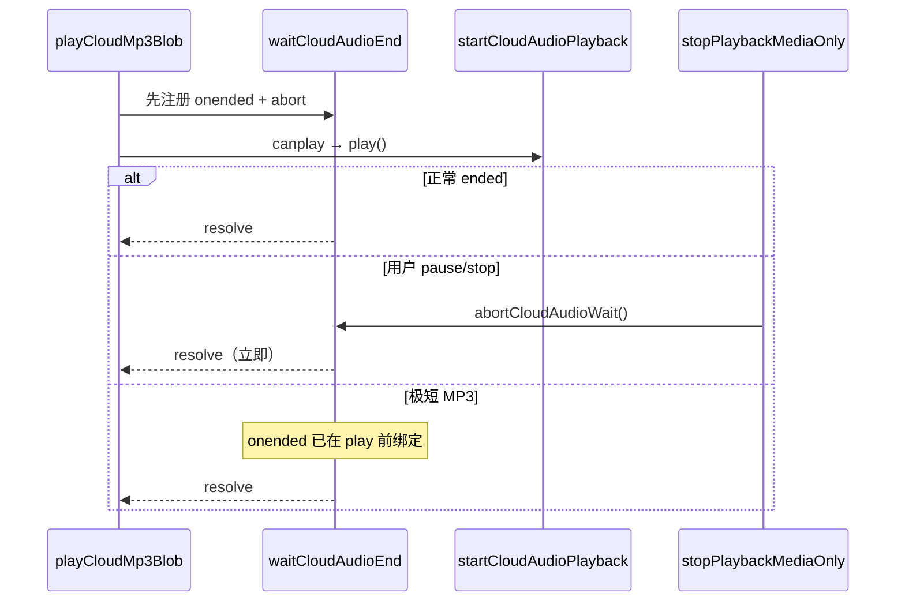

# EPUB 听读 — 音频已停但 UI 仍「播放中」

## 延伸阅读

- [EPUB听书源后速率.md](./EPUB听书源后速率.md) — 同轮修复：复用 Audio 后倍速须在 canplay 后设置
- [EPUB听书播放器栏.md](./EPUB听书播放器栏.md) — 底部播放条 playing / paused 状态
- [developer/EPUB听书开发.md](./developer/EPUB听书开发.md) — 听当前 + 听书总手册

**文档角色**：云端 MP3 **已无声结束或用户已 stop**，但播放条 / 顶栏仍显示 **播放中**、进度不回落的根因与修复；分析基准为工作区相对 `HEAD` 的 `apps/frontend/src/utils/speech.ts` 未提交 diff。

---

## 1. 背景与目标

### 1.1 问题（用户视角）

EPUB 听书或听当前使用 **云端 TTS** 时偶发：

- 音频 **已经播完或点击暂停**，底部播放条仍 **暂停图标 / playing 态**；
- 需等 **数十秒～两分钟**（`waitCloudAudioEnd` 超时）UI 才恢复；
- **短句**、**快速切句**、**stop 后立即播下一段** 更容易复现。

本机 Web Speech 路径不受影响（走 `speechSynthesis` + utterance `onend`）。

### 1.2 根因（两类叠加）

1. **`stopPlaybackMediaOnly` 清掉 `onended`**  
   改前 `stop` 时 `cloudAudio.src = ''` + `load()` + **`cloudAudio = null`**。改后复用节点时会 **`onended = null`**。若 **`waitCloudAudioEnd` 的 Promise 仍在 await**，永远收不到 ended，只能挂到 **120s 兜底超时** 或 **按 duration 估算的超时**。

2. **`playCloudMp3Blob` 注册顺序错误**  
   改前：`startCloudAudioPlayback(audio).then(() => waitCloudAudioEnd(...))` —— 须等 **`play()` resolve** 才挂 `onended`。极短 MP3 可能在 microtask 链执行 **`waitCloudAudioEnd` 之前** 已 **`ended`**，监听丢失，同样 **假播放至超时**。

### 1.3 目标

- 引入 **`abortCloudAudioWait`**：`stop` / play 失败时 **主动 finish** 挂起的 end Promise。
- **`stopPlaybackMediaOnly`** 开头调用 abort。
- **`waitCloudAudioEnd`** 注册 **`abortCloudAudioWait = abort`**，finish 时清理。
- **`playCloudMp3Blob`**：**先** `const ended = waitCloudAudioEnd(...)`，**再** `startCloudAudioPlayback(...).then(() => ended)`。

---

## 2. 改动范围

| 路径 | 变更 |
|------|------|
| `apps/frontend/src/utils/speech.ts` | 模块变量 `abortCloudAudioWait`；`stopPlaybackMediaOnly`、`waitCloudAudioEnd`、`playCloudMp3Blob` |

上层 hook（`useEpubChapterListen`、`useEbookQuoteListen`）依赖 `playPreferred` Promise  settle 后切 UI；**speech 层 Promise 不结束即 UI 卡住**。

---

## 3. 实现思路

1. **abort 与 stop 对称**  
   `waitCloudAudioEnd` 创建 Promise 时，把 `() => finish()` 存到模块级 `abortCloudAudioWait`。任何 **`stopPlaybackMediaOnly`**、**play 失败清理** 路径先 `abortCloudAudioWait?.()`，使 **`ended` Promise 立即 resolve**（无 err），hook 可进 paused / 下一句。

2. **先挂监听再 play**  
   `onended` / `onloadedmetadata` / `onerror` 在 **`audio.play()` 之前** 绑定，消除短音频 race。

3. **`releaseUrl` 不再 `cloudAudio = null`**  
   与 rate 专题一致：复用节点；abort/stop 只 revoke object URL，保留 `cloudAudio` 引用。

4. **play 失败分支也 abort**  
   `startCloudAudioPlayback` reject 时 `abortCloudAudioWait?.()`，避免失败路径仍挂超时。

5. **刻意不改超时算法**  
   `armTimeout` 仍按 `duration / playbackRate` 估算；abort 解决 **正常 stop / 短音频** 主路径，超时仍作 **真卡死** 兜底。

---

## 4. 关键代码对比与注释

### 4.1 模块变量 `abortCloudAudioWait`（纯新增）

**对比范围**：`cloudObjectUrl` 邻近模块级声明（改前无此变量）。

**改动后** · `apps/frontend/src/utils/speech.ts`（当前，约 L875–L878）

```typescript
// 当前正在播放的云端 Audio 元素引用（可复用）
let cloudAudio: HTMLAudioElement | null = null;
// 当前 Blob 的 object URL，ended/stop 时 revoke
let cloudObjectUrl: string | null = null;
// stopPlaybackMediaOnly 时打断 waitCloudAudioEnd，避免 onended 被清掉后一直挂到超时
let abortCloudAudioWait: (() => void) | null = null;
```

**变更摘要**：纯新增；作为 stop ↔ wait 之间的 **显式取消通道**。

---

### 4.2 `stopPlaybackMediaOnly`

**对比范围**：全函数（本篇强调 abort 与清事件；保留节点见 rate 专题）。

**改动前** · `apps/frontend/src/utils/speech.ts`（基线 `HEAD`，约 L940–L955）

```typescript
// 仅停介质、不递增 playbackGeneration
function stopPlaybackMediaOnly(): void {
	// 取消本机朗读
	if (isSpeechSupported()) {
		window.speechSynthesis.cancel();
	}
	// 停云端 Audio
	if (cloudAudio) {
		cloudAudio.pause();
		cloudAudio.src = '';
		cloudAudio.load();
		cloudAudio = null;
	}
	// 释放 Blob URL
	if (cloudObjectUrl) {
		URL.revokeObjectURL(cloudObjectUrl);
		cloudObjectUrl = null;
	}
}
```

**改动后** · `apps/frontend/src/utils/speech.ts`（当前，约 L993–L1013）

```typescript
// 仅停介质、不递增 playbackGeneration
function stopPlaybackMediaOnly(): void {
	// 取消本机朗读
	if (isSpeechSupported()) {
		window.speechSynthesis.cancel();
	}
	// 主动结束挂起的 waitCloudAudioEnd Promise
	abortCloudAudioWait?.();
	// 防止重复 abort
	abortCloudAudioWait = null;
	// 停云端 Audio（保留 DOM 节点）
	if (cloudAudio) {
		cloudAudio.pause();
		// 清 onended——否则 stop 后旧 Promise 永远等不到回调
		cloudAudio.onended = null;
		cloudAudio.onerror = null;
		cloudAudio.onloadedmetadata = null;
		cloudAudio.ontimeupdate = null;
		cloudAudio.removeAttribute('src');
		cloudAudio.load();
	}
	// 释放 Blob URL
	if (cloudObjectUrl) {
		URL.revokeObjectURL(cloudObjectUrl);
		cloudObjectUrl = null;
	}
}
```

**变更摘要**：**开头 abort**；清 **全部** 媒体事件再 unload；**不再销毁** `cloudAudio` 引用。

---

### 4.3 `waitCloudAudioEnd`

**对比范围**：全函数。

**改动前** · `apps/frontend/src/utils/speech.ts`（基线 `HEAD`，约 L1110–L1171）

```typescript
// 等到 Audio 播放结束或超时/错误
function waitCloudAudioEnd(
	audio: HTMLAudioElement,
	objectUrl: string,
	generation: number,
): Promise<void> {
	return new Promise((resolve, reject) => {
		// 是否已 resolve/reject
		let settled = false;
		// 超时 timer id
		let timeoutId = 0;

		// 释放 object URL 与 cloudAudio 引用
		const releaseUrl = () => {
			if (cloudObjectUrl === objectUrl) {
				URL.revokeObjectURL(objectUrl);
				cloudObjectUrl = null;
				cloudAudio = null;
			}
		};

		// 统一结束
		const finish = (err?: Error) => {
			if (settled) return;
			settled = true;
			window.clearTimeout(timeoutId);
			releaseUrl();
			if (err && isPlaybackGenerationActive(generation)) {
				reject(err);
				return;
			}
			resolve();
		};

		// 按 duration 重 arm 超时
		const armTimeout = () => {
			window.clearTimeout(timeoutId);
			const playbackRate = audio.playbackRate > 0 ? audio.playbackRate : 1;
			const durationMs =
				Number.isFinite(audio.duration) && audio.duration > 0
					? ((audio.duration * 1000) / playbackRate) * 1.5 + 5000
					: 90_000;
			timeoutId = window.setTimeout(
				() => {
					audio.pause();
					finish(new Error('AUDIO_TIMEOUT'));
				},
				Math.min(durationMs, 600_000),
			);
		};

		// 初始 120s 兜底超时
		timeoutId = window.setTimeout(() => {
			audio.pause();
			finish(new Error('AUDIO_TIMEOUT'));
		}, 120_000);

		// metadata 就绪后收紧超时
		audio.onloadedmetadata = () => armTimeout();
		// 正常播完
		audio.onended = () => finish();
		// 播放错误
		audio.onerror = () => {
			if (!isPlaybackGenerationActive(generation)) {
				finish();
				return;
			}
			finish(new Error('AUDIO_PLAY'));
		};
	});
}
```

**改动后** · `apps/frontend/src/utils/speech.ts`（当前，约 L1196–L1259）

```typescript
// 等到 Audio 播放结束或超时/错误；可被 abortCloudAudioWait 打断
function waitCloudAudioEnd(
	audio: HTMLAudioElement,
	objectUrl: string,
	generation: number,
): Promise<void> {
	return new Promise((resolve, reject) => {
		// 是否已 resolve/reject
		let settled = false;
		// 超时 timer id
		let timeoutId = 0;

		// 释放 object URL（保留 cloudAudio 节点供复用）
		const releaseUrl = () => {
			if (cloudObjectUrl === objectUrl) {
				URL.revokeObjectURL(objectUrl);
				cloudObjectUrl = null;
			}
		};

		// 统一结束
		const finish = (err?: Error) => {
			if (settled) return;
			settled = true;
			window.clearTimeout(timeoutId);
			// 若当前 abort 即本 Promise 的，清模块引用
			if (abortCloudAudioWait === abort) abortCloudAudioWait = null;
			releaseUrl();
			if (err && isPlaybackGenerationActive(generation)) {
				reject(err);
				return;
			}
			resolve();
		};

		// stop / 切句时外部调用，无 err 地 resolve
		const abort = () => finish();
		// 登记供 stopPlaybackMediaOnly 调用
		abortCloudAudioWait = abort;

		// 按 duration 重 arm 超时
		const armTimeout = () => {
			window.clearTimeout(timeoutId);
			const playbackRate = audio.playbackRate > 0 ? audio.playbackRate : 1;
			const durationMs =
				Number.isFinite(audio.duration) && audio.duration > 0
					? ((audio.duration * 1000) / playbackRate) * 1.5 + 5000
					: 90_000;
			timeoutId = window.setTimeout(
				() => {
					audio.pause();
					finish(new Error('AUDIO_TIMEOUT'));
				},
				Math.min(durationMs, 600_000),
			);
		};

		// 初始 120s 兜底超时
		timeoutId = window.setTimeout(() => {
			audio.pause();
			finish(new Error('AUDIO_TIMEOUT'));
		}, 120_000);

		// metadata 就绪后收紧超时
		audio.onloadedmetadata = () => armTimeout();
		// 正常播完
		audio.onended = () => finish();
		// 播放错误
		audio.onerror = () => {
			if (!isPlaybackGenerationActive(generation)) {
				finish();
				return;
			}
			finish(new Error('AUDIO_PLAY'));
		};
	});
}
```

**变更摘要**：新增 **`abort` + `abortCloudAudioWait` 注册**；`releaseUrl` **不再 `cloudAudio = null`**；`finish` 时清理 abort 槽位。

---

### 4.4 `playCloudMp3Blob`（结束等待顺序）

**对比范围**：全函数（本篇强调 `ended` 先于 `play`；rate 见姊妹篇）。

**改动前** · `apps/frontend/src/utils/speech.ts`（基线 `HEAD`，约 L1307–L1339）

```typescript
// 播放一段云端 MP3 Blob
function playCloudMp3Blob(
	blob: Blob,
	generation: number,
	rate?: number,
): Promise<void> {
	// 停上一轮
	stopPlaybackMediaOnly();
	// 世代失效
	if (!isPlaybackGenerationActive(generation)) {
		return Promise.resolve();
	}

	const url = URL.createObjectURL(blob);
	cloudObjectUrl = url;
	const audio = new Audio(url);
	audio.playbackRate = clampPlaybackRate(rate);
	cloudAudio = audio;
	// 先 play，then 里才 waitCloudAudioEnd——短音频可能已 ended
	return startCloudAudioPlayback(audio).then(
		() => waitCloudAudioEnd(audio, url, generation),
		(err) => {
			if (!isPlaybackGenerationActive(generation)) {
				if (cloudObjectUrl === url) {
					URL.revokeObjectURL(url);
					cloudObjectUrl = null;
					cloudAudio = null;
				}
				return Promise.resolve();
			}
			if (cloudObjectUrl === url) {
				URL.revokeObjectURL(url);
				cloudObjectUrl = null;
				cloudAudio = null;
			}
			throw err;
		},
	);
}
```

**改动后** · `apps/frontend/src/utils/speech.ts`（当前，约 L1589–L1636）

```typescript
// 播放一段云端 MP3 Blob
function playCloudMp3Blob(
	blob: Blob,
	generation: number,
	rate?: number,
	onTimeUpdate?: (currentTime: number, duration: number) => void,
	onPlaybackStart?: () => void,
): Promise<void> {
	// 停上一轮（内含 abortCloudAudioWait）
	stopPlaybackMediaOnly();
	if (!isPlaybackGenerationActive(generation)) {
		return Promise.resolve();
	}

	const url = URL.createObjectURL(blob);
	cloudObjectUrl = url;
	const audio = ensureCloudAudioEl();
	audio.volume = 1;
	audio.src = url;
	if (onTimeUpdate) {
		audio.ontimeupdate = () => {
			if (!isPlaybackGenerationActive(generation)) return;
			onTimeUpdate(audio.currentTime, audio.duration);
		};
	}

	// 先挂 onended，再 play：短音频可能在 then 链里注册监听前就结束，导致一直等到超时、UI 假播放
	const ended = waitCloudAudioEnd(audio, url, generation);
	let startNotified = false;
	const notifyStart = () => {
		if (startNotified) return;
		startNotified = true;
		onPlaybackStart?.();
	};
	return startCloudAudioPlayback(audio, rate, notifyStart).then(
		() => ended,
		(err) => {
			abortCloudAudioWait?.();
			abortCloudAudioWait = null;
			if (cloudObjectUrl === url) {
				URL.revokeObjectURL(url);
				cloudObjectUrl = null;
			}
			if (!isPlaybackGenerationActive(generation)) {
				return Promise.resolve();
			}
			throw err;
		},
	);
}
```

**变更摘要**：**`const ended = waitCloudAudioEnd(...)` 置于 `startCloudAudioPlayback` 之前**；play 失败 **abort**；成功 **`then(() => ended)`** 而非在 then 内才创建 wait。

---

## 5. 时序说明



---

## 6. 行为变化与回归

| 场景 | 改前 | 改后 |
|------|------|------|
| 短句云端连播 | UI 假播放至超时 | 句末立即 paused |
| 播放中点暂停 | 可能卡 playing | 立即 paused |
| 快速切下一句 | 上一句 wait 挂起 | stop abort 上一句 |
| `play()` 失败 | 可能挂超时 | abort + reject/清理 |

**建议回归**：听书连播 10+ 短句；听当前；播放中暂停 / 拖进度切句；stop 后立即重播；Tauri Edge 云端。

---

## 7. 相关源码路径

| 说明 | 路径 |
|------|------|
| 云端 end 等待与 abort | `apps/frontend/src/utils/speech.ts` |
| 章节听书 hook | `apps/frontend/src/views/ebook/hooks/useEpubChapterListen.ts` |
| 听当前 hook | `apps/frontend/src/views/ebook/hooks/useEbookQuoteListen.ts` |
| 播放条 UI | `apps/frontend/src/views/ebook/read.tsx` 等 |

---

若与仓库最新源码不一致，以源码为准。
