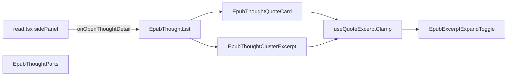

# EPUB 想法列表：单击进详情与引用摘录展开

## 文档角色

**增量专题**：读书想法 **列表侧栏** 交互与 **分组摘录 UI** 调整——列表项 **单击即进详情**；移除列表内「选中高亮」与引用区点击回书 PopBar；分组头由字符截断改为 **可展开摘录**；引用区与分组头共用 **通用 clamp hook** 与 **展开切换按钮**。

**姊妹文档**：[EPUB想法侧面板.md](./EPUB想法侧面板.md)（右栏分栏主文档）、[EPUB想法聚类桥接.md](./EPUB想法聚类桥接.md)（点击聚合与 `quoteGroups` 分组）、[EPUB想法引用划线切换.md](./EPUB想法引用划线切换.md)（引用区划线覆盖度判定）。

**延伸阅读**：[EPUB分屏软调整.md](./EPUB分屏软调整.md)（分栏拖拽软重排）。

---

## 1. 背景与目标

### 1.1 问题

旧列表交互为 **单击选中**（`onSelectThought` / `selectThoughtInList` 写 `selectedThoughtId`）、**双击或点「查看详情」** 才进详情；多分组时组头用 `truncateQuoteExcerpt` **硬截 24 字**，长引用不可读。列表顶栏引用卡片另传 `onQuoteHighlightClick`，点击引用可在书中打开 PopBar——与「列表以浏览想法为主」的场景重复，且与详情页能力重叠。

### 1.2 目标

| 区域 | 旧行为 | 新行为 |
| ---- | ------ | ------ |
| 列表项 | 单击选中；双击 / 右侧按钮进详情 | **单击直接进详情** |
| 列表 cluster 状态 | `selectThoughtInList` 更新 `selectedThoughtId` | 移除选中回调；`selectedThoughtId` 仍可由打开列表时的 cluster 带入（如从单条想法点入） |
| 顶栏引用卡片（列表） | 可点引用回书 PopBar | **不再传** `onQuoteHighlightClick`（详情弹层仍保留，见 `EpubThought`） |
| 多分组组头 | 24 字 + `…` | **`EpubThoughtClusterExcerpt`**：单行 clamp + 溢出时展开 |
| 引用区 clamp | `useQuoteExcerptClamp(quote)` 固定 3 行 | **`resetKey` + 可配置 `clampLines`**，引用区与组头复用 |

---

## 2. 改动范围

| 路径 | 变更要点 |
| ---- | -------- |
| `apps/frontend/src/views/ebook/components/EpubThoughtList.tsx` | 移除 `onSelectThought` / `onQuoteHighlightClick`；`EpubThoughtListItem` 单击进详情；组头改用 `EpubThoughtClusterExcerpt`；删除 `truncateQuoteExcerpt` |
| `apps/frontend/src/views/ebook/components/EpubThoughtParts.tsx` | 泛化 `useQuoteExcerptClamp`；新增 `lineClampClass`、`EpubExcerptExpandToggle`、`EpubThoughtClusterExcerpt`；`EpubThoughtQuoteCard` 复用展开钮；`EpubThoughtItemCard` 去掉 `onDoubleClick` / 多态 `button` |
| `apps/frontend/src/views/ebook/read.tsx` | 删除 `selectThoughtInList`；`EpubThoughtList` 不再传 `onSelectThought` / `onQuoteHighlightClick` |

**未改动**：`EpubThought.tsx` 详情仍保留 `onQuoteHighlightClick`；`thoughtListQuoteActions` 引用操作条逻辑（见 [EPUB想法引用划线切换.md](./EPUB想法引用划线切换.md)）。

---

## 3. 实现思路

1. **单击进详情**：列表项 `onClick` 直接调 `onOpenThoughtDetail(thought)`，去掉选中态切换与右侧 Chevron 按钮，降低操作步数。
2. **移除列表内选中 API**：`read.tsx` 不再维护 `selectThoughtInList`；`EpubThoughtList` Props 收窄，避免误用「仅高亮不跳转」。
3. **列表顶栏引用不可点回书**：列表场景不再向 `EpubThoughtQuoteCard` 传 `onQuoteHighlightClick`；划线 / 复制等仍经 `quoteActions` 底栏完成。
4. **clamp 逻辑抽取**：`useQuoteExcerptClamp(resetKey, clampLines)` 用 `resetKey` 替代裸 `quote`（组头为 `` `${spanLength}:${quote}` ``），返回 `clampClass` 供 `line-clamp-1` / `line-clamp-3` 切换；`ResizeObserver` 测量逻辑与旧版一致。
5. **展开 UI 组件化**：`EpubExcerptExpandToggle` 封装 Tooltip + 圆形 Chevron 按钮；顶栏引用与分组摘录共用，样式与 a11y 一致。
6. **分组摘录组件**：`EpubThoughtClusterExcerpt` 使用 `clampLines: 1`，右侧固定 26px 占位保证无溢出时布局不跳。



---

## 4. 关键代码对比与注释

### 4.1 `EpubThoughtList` Props 与组件（`EpubThoughtList.tsx`）

**对比范围**：`Props` 类型与 `EpubThoughtList` 导出组件完整定义。

**改动前** · `apps/frontend/src/views/ebook/components/EpubThoughtList.tsx`（基线 HEAD，约 L10–L92）

```tsx
// 列表容器 Props：含选中回调与引用点击回书
type Props = {
	// 关闭列表侧栏
	onClose: () => void;
	// 当前点击聚合后的 cluster
	cluster: EbookThoughtClickCluster;
	// 单击列表项时仅更新 selectedThoughtId，不跳详情
	onSelectThought: (thought: EbookThought) => void;
	// 双击或点「查看详情」时打开详情面板
	onOpenThoughtDetail: (thought: EbookThought) => void;
	// 顶栏引用区底栏操作条配置（复制/划线等）
	quoteActions?: EpubQuoteActionBarProps | null;
	// 点击顶栏引用文本时在书中打开 PopBar
	onQuoteHighlightClick?: () => void;
};

// 将过长 quote 截为 maxLen 字符并加省略号（组头展示用）
function truncateQuoteExcerpt(quote: string, maxLen = 24): string {
	// 去掉首尾空白再量长度
	const trimmed = quote.trim();
	// 未超长则原样返回
	if (trimmed.length <= maxLen) return trimmed;
	// 超长则切前 maxLen 字并追加 Unicode 省略号
	return `${trimmed.slice(0, maxLen)}…`;
}

/** 嵌套选区聚合后的想法列表（引用区默认最外层 quote） */
export function EpubThoughtList({
	// 关闭列表
	onClose,
	// 聚合 cluster 数据
	cluster,
	// 列表内选中（写 selectedThoughtId）
	onSelectThought,
	// 打开详情
	onOpenThoughtDetail,
	// 引用操作条
	quoteActions,
	// 引用点击回书
	onQuoteHighlightClick,
}: Props) {
	// i18n
	const { t } = useI18n();
	// 顶栏展示用的聚合 quote
	const quote = getThoughtClusterDisplayQuote(cluster);
	// 列表标题文案
	const listTitle = t('ebook.read.thought.viewTitle');
	// 多分组时渲染组头
	const showGroupHeaders = cluster.quoteGroups.length > 1;
	// 当前选中想法 id（列表内单击写入）
	const selectedThoughtId = cluster.selectedThoughtId;

	return (
		// 侧栏壳：顶栏 + 滚动列表
		<EpubThoughtPanelShell>
			// 顶栏引用卡片
			<EpubThoughtQuoteCard
				// 聚合展示 quote
				quote={quote}
				// 标题「读书想法」等
				title={listTitle}
				// 想法总数
				count={cluster.allThoughts.length}
				// 关闭列表
				onClose={onClose}
				// 关闭钮 tooltip 为 view 模式
				closeMode="view"
				// 底栏引用操作
				quoteActions={quoteActions}
				// 点击引用回书 PopBar
				onQuoteHighlightClick={onQuoteHighlightClick}
			/>

			// 从单条想法进入列表时提示当前引用上下文
			{cluster.selectedThoughtId ? (
				<p className="text-textcolor/50 border-theme/10 border-t px-4 py-2 text-xs">
					{t('ebook.read.thought.selectedQuoteHint')}
				</p>
			) : null}

			// 多分组：每组组头 + 该组想法列表
			{showGroupHeaders
				? cluster.quoteGroups.map((group) => (
						<section key={group.cfiRange}>
							// 组头：span 长度 + 截断 quote
							<div className="text-textcolor/55 border-theme/10 bg-theme/5 border-t px-4 py-2 text-xs">
								{t('ebook.read.thought.clusterExcerpt', {
									length: group.spanLength,
								})}
								<span className="text-textcolor/40 mx-1">·</span>
								<span className="text-textcolor/65 italic">
									{truncateQuoteExcerpt(group.quote)}
								</span>
							</div>
							{group.thoughts.map((thought) => (
								<EpubThoughtListItem
									key={thought.id}
									thought={thought}
									selected={thought.id === selectedThoughtId}
									onSelectThought={onSelectThought}
									onOpenThoughtDetail={onOpenThoughtDetail}
								/>
							))}
						</section>
					))
				// 单分组：扁平渲染全部想法
				: cluster.allThoughts.map((thought) => (
						<EpubThoughtListItem
							key={thought.id}
							thought={thought}
							selected={thought.id === selectedThoughtId}
							onSelectThought={onSelectThought}
							onOpenThoughtDetail={onOpenThoughtDetail}
						/>
					))}
		</EpubThoughtPanelShell>
	);
}
```

**改动后** · `apps/frontend/src/views/ebook/components/EpubThoughtList.tsx`（当前，约 L12–L76）

```tsx
// 列表 Props：仅关闭、cluster、进详情、引用操作条
type Props = {
	// 关闭列表侧栏
	onClose: () => void;
	// 点击聚合后的 cluster
	cluster: EbookThoughtClickCluster;
	// 打开想法详情（列表项单击触发）
	onOpenThoughtDetail: (thought: EbookThought) => void;
	// 顶栏引用底栏操作条
	quoteActions?: EpubQuoteActionBarProps | null;
};

/** 嵌套选区聚合后的想法列表（引用区默认最外层 quote） */
export function EpubThoughtList({
	// 关闭列表
	onClose,
	// cluster 数据
	cluster,
	// 单击进详情
	onOpenThoughtDetail,
	// 引用区操作条
	quoteActions,
}: Props) {
	// i18n
	const { t } = useI18n();
	// 顶栏展示 quote
	const quote = getThoughtClusterDisplayQuote(cluster);
	// 列表标题
	const listTitle = t('ebook.read.thought.viewTitle');
	// 是否多分组（决定是否渲染组头）
	const showGroupHeaders = cluster.quoteGroups.length > 1;
	// 打开列表时带入的选中 id（只读展示 selected 样式，不再由列表单击写入）
	const selectedThoughtId = cluster.selectedThoughtId;

	return (
		// 侧栏壳
		<EpubThoughtPanelShell>
			// 顶栏引用卡片（不再传 onQuoteHighlightClick）
			<EpubThoughtQuoteCard
				quote={quote}
				title={listTitle}
				count={cluster.allThoughts.length}
				onClose={onClose}
				closeMode="view"
				quoteActions={quoteActions}
			/>

			// 从单条进入时的引用提示
			{cluster.selectedThoughtId ? (
				<p className="text-textcolor/50 border-theme/10 border-t px-4 py-2 text-xs">
					{t('ebook.read.thought.selectedQuoteHint')}
				</p>
			) : null}

			// 多分组：可展开组头 + 想法项
			{showGroupHeaders
				? cluster.quoteGroups.map((group) => (
						<section key={group.cfiRange}>
							// 单行 clamp + 展开的分组摘录组件
							<EpubThoughtClusterExcerpt
								spanLength={group.spanLength}
								quote={group.quote}
							/>
							{group.thoughts.map((thought) => (
								<EpubThoughtListItem
									key={thought.id}
									thought={thought}
									selected={thought.id === selectedThoughtId}
									onOpenThoughtDetail={onOpenThoughtDetail}
								/>
							))}
						</section>
					))
				// 单分组扁平列表
				: cluster.allThoughts.map((thought) => (
						<EpubThoughtListItem
							key={thought.id}
							thought={thought}
							selected={thought.id === selectedThoughtId}
							onOpenThoughtDetail={onOpenThoughtDetail}
						/>
					))}
		</EpubThoughtPanelShell>
	);
}
```

**变更摘要**：删除 `onSelectThought`、`onQuoteHighlightClick` 与 `truncateQuoteExcerpt`；组头改为 `EpubThoughtClusterExcerpt`；顶栏引用卡片不再支持点击回书。

---

### 4.2 `EpubThoughtListItem`（`EpubThoughtList.tsx`）

**对比范围**：文件内私有列表项组件完整定义。

**改动前** · `apps/frontend/src/views/ebook/components/EpubThoughtList.tsx`（基线 HEAD，约 L94–L137）

```tsx
// 单条想法行：选中 + 详情双入口
function EpubThoughtListItem({
	// 想法实体
	thought,
	// 是否为 cluster.selectedThoughtId
	selected,
	// 单击：仅选中
	onSelectThought,
	// 打开详情
	onOpenThoughtDetail,
}: {
	thought: EbookThought;
	selected: boolean;
	onSelectThought: (thought: EbookThought) => void;
	onOpenThoughtDetail: (thought: EbookThought) => void;
}) {
	// i18n（未知用户兜底）
	const { t } = useI18n();

	return (
		// 相对定位容器：容纳右侧详情按钮
		<div className="relative border-t border-theme/10">
			// 想法卡片：单击选中、双击详情
			<EpubThoughtItemCard
				username={thought.username || t('ebook.read.thought.unknownUser')}
				avatar={thought.avatar}
				createdAt={thought.createdAt}
				selected={selected}
				onClick={() => onSelectThought(thought)}
				onDoubleClick={() => onOpenThoughtDetail(thought)}
				className={cn('pr-12')}
			>
				<p className="text-textcolor text-sm wrap-break-word">
					{thought.content}
				</p>
			</EpubThoughtItemCard>
			// 右侧「查看详情」文字按钮
			<button
				type="button"
				className="text-textcolor/45 hover:text-textcolor absolute right-3 top-4 flex cursor-pointer items-center gap-0.5 rounded-sm px-1 py-0.5 text-xs transition-colors"
				aria-label={t('ebook.read.thought.viewDetail')}
				onClick={(event) => {
					// 阻止冒泡到卡片 onClick（避免只选中）
					event.stopPropagation();
					onOpenThoughtDetail(thought);
				}}
			>
				{t('ebook.read.thought.viewDetail')}
				<ChevronRight className="size-3.5" aria-hidden />
			</button>
		</div>
	);
}
```

**改动后** · `apps/frontend/src/views/ebook/components/EpubThoughtList.tsx`（当前，约 L78–L100）

```tsx
// 单条想法行：单击即进详情
function EpubThoughtListItem({
	// 想法数据
	thought,
	// 打开列表时带入的选中态（只读）
	selected,
	// 打开详情面板
	onOpenThoughtDetail,
}: {
	thought: EbookThought;
	selected: boolean;
	onOpenThoughtDetail: (thought: EbookThought) => void;
}) {
	// i18n
	const { t } = useI18n();

	return (
		// 想法卡片即整行可点区域
		<EpubThoughtItemCard
			username={thought.username || t('ebook.read.thought.unknownUser')}
			avatar={thought.avatar}
			createdAt={thought.createdAt}
			selected={selected}
			onClick={() => onOpenThoughtDetail(thought)}
		>
			<p className="text-textcolor text-sm wrap-break-word">{thought.content}</p>
		</EpubThoughtItemCard>
	);
}
```

**变更摘要**：移除 `onSelectThought`、双击、右侧 Chevron 按钮与 `pr-12` 留白；`onClick` 直接打开详情。

---

### 4.3 `useQuoteExcerptClamp`（`EpubThoughtParts.tsx`）

**对比范围**：引用/摘录 clamp 测量 hook 完整定义。

**改动前** · `apps/frontend/src/views/ebook/components/EpubThoughtParts.tsx`（基线 HEAD，约 L84–L126）

```typescript
// 引用区默认最多展示 3 行
const QUOTE_CLAMP_LINES = 3;

// 测量 quote 文本是否超过固定行数，并管理展开态
function useQuoteExcerptClamp(quote: string) {
	// 包裹 figure/div，供 ResizeObserver 与宽度测量
	const wrapperRef = useRef<HTMLDivElement>(null);
	// 正文 p 元素，clone 测高
	const textRef = useRef<HTMLParagraphElement>(null);
	// 是否已展开（取消 line-clamp）
	const [expanded, setExpanded] = useState(false);
	// 内容是否溢出 clamp 行数
	const [overflows, setOverflows] = useState(false);

	// quote 变化时重置为收起
	useEffect(() => {
		setExpanded(false);
	}, [quote]);

	// 布局后测量 + 监听容器宽度变化
	useLayoutEffect(() => {
		const wrapper = wrapperRef.current;
		const textEl = textRef.current;
		if (!wrapper || !textEl) return;

		const measure = () => {
			const width = wrapper.clientWidth;
			if (width <= 0) return;

			const lineHeight = Number.parseFloat(getComputedStyle(textEl).lineHeight);
			if (!Number.isFinite(lineHeight) || lineHeight <= 0) return;

			const clone = textEl.cloneNode(true) as HTMLParagraphElement;
			clone.style.cssText =
				'position:absolute;visibility:hidden;pointer-events:none;height:auto;max-height:none;overflow:visible;display:block;-webkit-line-clamp:unset;';
			clone.style.width = `${width}px`;
			clone.classList.remove('line-clamp-3');
			wrapper.appendChild(clone);
			const fullHeight = clone.scrollHeight;
			clone.remove();

			setOverflows(fullHeight > lineHeight * QUOTE_CLAMP_LINES + 1);
		};

		measure();
		const ro = new ResizeObserver(measure);
		ro.observe(wrapper);
		return () => ro.disconnect();
	}, [quote]);

	return { wrapperRef, textRef, expanded, setExpanded, overflows };
}
```

**改动后** · `apps/frontend/src/views/ebook/components/EpubThoughtParts.tsx`（当前，约 L83–L134）

```typescript
// 引用区默认 clamp 行数常量
const QUOTE_CLAMP_LINES = 3;

// 根据 clamp 行数返回 Tailwind line-clamp 类名
function lineClampClass(clampLines: number) {
	// 1 行用 line-clamp-1，否则默认 3 行类
	return clampLines === 1 ? 'line-clamp-1' : 'line-clamp-3';
}

// 通用摘录 clamp：resetKey 变化时重置展开；clampLines 可配置
function useQuoteExcerptClamp(
	resetKey: string,
	clampLines = QUOTE_CLAMP_LINES,
) {
	// 外层测量容器 ref
	const wrapperRef = useRef<HTMLDivElement>(null);
	// 文本节点 ref
	const textRef = useRef<HTMLParagraphElement>(null);
	// 展开状态
	const [expanded, setExpanded] = useState(false);
	// 是否溢出
	const [overflows, setOverflows] = useState(false);
	// 当前 clamp 对应的 CSS 类
	const clampClass = lineClampClass(clampLines);

	// resetKey（quote 或组头复合键）变化时收起
	useEffect(() => {
		setExpanded(false);
	}, [resetKey]);

	// 测量溢出并订阅尺寸变化
	useLayoutEffect(() => {
		const wrapper = wrapperRef.current;
		const textEl = textRef.current;
		if (!wrapper || !textEl) return;

		const measure = () => {
			const width = wrapper.clientWidth;
			if (width <= 0) return;

			const lineHeight = Number.parseFloat(getComputedStyle(textEl).lineHeight);
			if (!Number.isFinite(lineHeight) || lineHeight <= 0) return;

			const clone = textEl.cloneNode(true) as HTMLParagraphElement;
			clone.style.cssText =
				'position:absolute;visibility:hidden;pointer-events:none;height:auto;max-height:none;overflow:visible;display:block;-webkit-line-clamp:unset;';
			clone.style.width = `${width}px`;
			clone.classList.remove('line-clamp-1', 'line-clamp-3');
			wrapper.appendChild(clone);
			const fullHeight = clone.scrollHeight;
			clone.remove();

			setOverflows(fullHeight > lineHeight * clampLines + 1);
		};

		measure();
		const ro = new ResizeObserver(measure);
		ro.observe(wrapper);
		return () => ro.disconnect();
	}, [resetKey, clampLines]);

	return { wrapperRef, textRef, expanded, setExpanded, overflows, clampClass };
}
```

**变更摘要**：入参改为 `resetKey` + 可选 `clampLines`；新增 `lineClampClass` 与返回值 `clampClass`；clone 时移除两种 clamp 类；deps 含 `clampLines`。

---

### 4.4 `EpubExcerptExpandToggle`（`EpubThoughtParts.tsx`）

**对比范围**：**纯新增**导出前私有组件，基线中不存在。

**改动后** · `apps/frontend/src/views/ebook/components/EpubThoughtParts.tsx`（当前新增，约 L136–L176）

```tsx
// 摘录展开/收起：Tooltip + 圆形 Chevron 按钮
function EpubExcerptExpandToggle({
	// 当前是否已展开
	expanded,
	// 切换展开态
	onToggle,
}: {
	expanded: boolean;
	onToggle: () => void;
}) {
	// i18n 文案
	const { t } = useI18n();

	return (
		// 悬停提示展开或收起
		<Tooltip
			side="top"
			sideOffset={6}
			delayDuration={200}
			shadow
			content={
				expanded
					? t('ebook.read.thought.quoteCollapse')
					: t('ebook.read.thought.quoteExpand')
			}
		>
			<button
				type="button"
				className="-mr-2 text-textcolor/45 hover:text-textcolor shrink-0 cursor-pointer rounded-sm p-1 transition-colors"
				aria-label={
					expanded
						? t('ebook.read.thought.quoteCollapse')
						: t('ebook.read.thought.quoteExpand')
				}
				aria-expanded={expanded}
				onClick={onToggle}
			>
				{expanded ? (
					<CircleChevronUp className="size-4.5" aria-hidden />
				) : (
					<CircleChevronDown className="size-4.5" aria-hidden />
				)}
			</button>
		</Tooltip>
	);
}
```

**变更摘要**：从 `EpubThoughtQuoteCard` 顶栏内联 Tooltip+button 抽出，供引用区与分组摘录复用。

---

### 4.5 `EpubThoughtClusterExcerpt`（`EpubThoughtParts.tsx`）

**对比范围**：**纯新增**导出组件，替代列表内联截断组头。

**改动后** · `apps/frontend/src/views/ebook/components/EpubThoughtParts.tsx`（当前新增，约 L178–L215）

```tsx
/** 想法列表分组摘录：单行省略，右侧展开/收起（逻辑对齐引用区） */
export function EpubThoughtClusterExcerpt({
	// 该分组在书中的 span 长度（供 i18n 插值）
	spanLength,
	// 分组完整 quote 文本
	quote,
}: {
	spanLength: number;
	quote: string;
}) {
	// i18n
	const { t } = useI18n();
	// 组头内容变化时重置 clamp（长度 + 文本）
	const resetKey = `${spanLength}:${quote}`;
	// 单行 clamp hook
	const { wrapperRef, textRef, expanded, setExpanded, overflows, clampClass } =
		useQuoteExcerptClamp(resetKey, 1);

	return (
		// 组头行：左摘录 + 右展开钮占位
		<div className="text-textcolor/55 border-theme/10 bg-theme/5 flex items-center gap-0.5 border-t px-4 py-2 text-xs">
			<div ref={wrapperRef} className="min-w-0 flex-1">
				<p
					ref={textRef}
					className={cn('min-h-lh leading-normal', !expanded && clampClass)}
				>
					{t('ebook.read.thought.clusterExcerpt', { length: spanLength })}
					<span className="text-textcolor/40 mx-1">·</span>
					<span className="text-textcolor/65 italic">{quote}</span>
				</p>
			</div>
			// 固定宽度列：有溢出显示按钮，无溢出占位防布局跳动
			<div className="flex w-[26px] shrink-0 items-center justify-center">
				{overflows ? (
					<EpubExcerptExpandToggle
						expanded={expanded}
						onToggle={() => setExpanded((value) => !value)}
					/>
				) : (
					<span className="size-[26px] shrink-0" aria-hidden />
				)}
			</div>
		</div>
	);
}
```

**变更摘要**：展示完整 `quote`（非 24 字截断）；`clampLines: 1`；溢出才显示 `EpubExcerptExpandToggle`。

---

### 4.6 `EpubThoughtQuoteCard` 顶栏展开区（`EpubThoughtParts.tsx`）

**对比范围**：组件内 hook 调用与顶栏右侧展开/关闭按钮区（`showHeader` 分支内）。

**改动前** · `apps/frontend/src/views/ebook/components/EpubThoughtParts.tsx`（基线 HEAD，约 L210–L314 摘录）

```tsx
/** 段落引用 + 操作条；标题与关闭钮在卡片顶栏 */
export function EpubThoughtQuoteCard({
	quote,
	quoteActions,
	onQuoteHighlightClick,
	title,
	count,
	onClose,
	closeMode = 'view',
	className,
}: QuoteCardProps) {
	const { t } = useI18n();
	const hasQuote = Boolean(quote.trim());
	const showHeader = Boolean(title || onClose);
	// 旧 hook：仅传 quote，固定 3 行
	const { wrapperRef, textRef, expanded, setExpanded, overflows } =
		useQuoteExcerptClamp(quote);

	const openPopBarAtBook = () => {
		onQuoteHighlightClick?.();
	};

	const drawerQuoteActions = quoteActions;

	if (!hasQuote && !showHeader) return null;

	return (
		<div className={cn('shrink-0 overflow-hidden', className)}>
			{showHeader ? (
				<div
					className={cn(
						quoteCardBarRowClass,
						'border-theme/10 justify-between gap-3 border-b px-4',
					)}
				>
					// ... 标题与 count 区未改动 ...
					<div className="flex shrink-0 items-center gap-0.5">
						{overflows && hasQuote ? (
							<Tooltip
								side="top"
								sideOffset={6}
								delayDuration={200}
								shadow
								content={
									expanded
										? t('ebook.read.thought.quoteCollapse')
										: t('ebook.read.thought.quoteExpand')
								}
							>
								<button
									type="button"
									className="text-textcolor/60 hover:text-textcolor shrink-0 cursor-pointer rounded-sm p-1 transition-colors"
									aria-label={
										expanded
											? t('ebook.read.thought.quoteCollapse')
											: t('ebook.read.thought.quoteExpand')
									}
									aria-expanded={expanded}
									onClick={() => setExpanded((v) => !v)}
								>
									{expanded ? (
										<CircleChevronUp className="size-4.5" aria-hidden />
									) : (
										<CircleChevronDown className="size-4.5" aria-hidden />
									)}
								</button>
							</Tooltip>
						) : null}
						// ... onClose 关闭钮未改动 ...
					</div>
				</div>
			) : null}
			{hasQuote ? (
				<figure ref={wrapperRef} className="px-4 pb-3 pt-2" aria-label={t('ebook.read.thought.bookExcerpt')}>
					<p
						ref={textRef}
						className={cn(
							'text-textcolor/85 font-serif leading-[1.85] wrap-break-word',
							// 硬编码 line-clamp-3
							overflows && !expanded && 'line-clamp-3',
						)}
					>
						// ... 书名号与 EpubHighlightedQuoteText 未改动 ...
					</p>
				</figure>
			) : null}
			// ... drawerQuoteActions 底栏未改动 ...
		</div>
	);
}
```

**改动后** · `apps/frontend/src/views/ebook/components/EpubThoughtParts.tsx`（当前，约 L298–L413 摘录）

```tsx
/** 段落引用 + 操作条；标题与关闭钮在卡片顶栏 */
export function EpubThoughtQuoteCard({
	quote,
	quoteActions,
	onQuoteHighlightClick,
	title,
	count,
	onClose,
	closeMode = 'view',
	className,
}: QuoteCardProps) {
	const { t } = useI18n();
	const hasQuote = Boolean(quote.trim());
	const showHeader = Boolean(title || onClose);
	// 新 hook：quote 作 resetKey，默认 3 行，返回 clampClass
	const { wrapperRef, textRef, expanded, setExpanded, overflows, clampClass } =
		useQuoteExcerptClamp(quote);

	const openPopBarAtBook = () => {
		onQuoteHighlightClick?.();
	};

	const drawerQuoteActions = quoteActions;

	if (!hasQuote && !showHeader) return null;

	return (
		<div className={cn('shrink-0 overflow-hidden', className)}>
			{showHeader ? (
				<div
					className={cn(
						quoteCardBarRowClass,
						'border-theme/10 justify-between gap-3 border-b px-4',
					)}
				>
					// ... 标题与 count 区未改动 ...
					<div className="flex shrink-0 items-center gap-3">
						{overflows && hasQuote ? (
							<EpubExcerptExpandToggle
								expanded={expanded}
								onToggle={() => setExpanded((value) => !value)}
							/>
						) : null}
						// ... onClose 关闭钮未改动 ...
					</div>
				</div>
			) : null}
			{hasQuote ? (
				<figure ref={wrapperRef} className="px-4 pb-3 pt-2" aria-label={t('ebook.read.thought.bookExcerpt')}>
					<p
						ref={textRef}
						className={cn(
							'text-textcolor/85 font-serif leading-[1.85] wrap-break-word',
							// 使用 hook 返回的 clampClass
							overflows && !expanded && clampClass,
						)}
					>
						// ... 书名号与 EpubHighlightedQuoteText 未改动 ...
					</p>
				</figure>
			) : null}
			// ... drawerQuoteActions 底栏未改动 ...
		</div>
	);
}
```

**变更摘要**：顶栏展开改用 `EpubExcerptExpandToggle`；正文 clamp 类来自 hook；顶栏右侧 `gap-3`（原 `gap-0.5`）。`onQuoteHighlightClick` 仍保留于 Props 供 **详情** `EpubThought` 使用，列表侧不再传入。

---

### 4.7 `EpubThoughtItemCard`（`EpubThoughtParts.tsx`）

**对比范围**：单条想法卡片组件完整定义。

**改动前** · `apps/frontend/src/views/ebook/components/EpubThoughtParts.tsx`（基线 HEAD，约 L130–L149 与 L364–L399）

```typescript
// ThoughtCardProps 含双击回调
type ThoughtCardProps = {
	username: string;
	avatar?: string;
	createdAt?: string;
	children: ReactNode;
	className?: string;
	selected?: boolean;
	onClick?: () => void;
	onDoubleClick?: () => void;
};

/** 单条想法卡片：头像 + 用户名 + 发布日期 + 正文 */
export function EpubThoughtItemCard({
	username,
	avatar,
	createdAt,
	children,
	className,
	selected,
	onClick,
	onDoubleClick,
}: ThoughtCardProps) {
	// 有 onClick 时渲染为 button，否则 div
	const Comp = onClick ? 'button' : 'div';

	return (
		<Comp
			type={onClick ? 'button' : undefined}
			onClick={onClick}
			onDoubleClick={onDoubleClick}
			data-selected={selected ? 'true' : undefined}
			className={cn(
				'p-4 text-left transition-colors border-t border-theme/10',
				onClick &&
					'cursor-pointer hover:bg-theme/10 outline-none focus:outline-none focus-visible:outline-none focus-visible:ring-0',
				selected && 'bg-theme/12',
				className,
			)}
		>
			<ThoughtUserMeta
				username={username}
				avatar={avatar}
				createdAt={createdAt}
			/>
			{children}
		</Comp>
	);
}
```

**改动后** · `apps/frontend/src/views/ebook/components/EpubThoughtParts.tsx`（当前，约 L230–L456）

```typescript
// ThoughtCardProps 移除 onDoubleClick
type ThoughtCardProps = {
	username: string;
	avatar?: string;
	createdAt?: string;
	children: ReactNode;
	className?: string;
	selected?: boolean;
	onClick?: () => void;
};

/** 单条想法卡片：头像 + 用户名 + 发布日期 + 正文 */
export function EpubThoughtItemCard({
	username,
	avatar,
	createdAt,
	children,
	className,
	selected,
	onClick,
}: ThoughtCardProps) {
	return (
		// 统一 div 容器，点击由 onClick 可选挂载
		<div
			onClick={onClick}
			data-selected={selected ? 'true' : undefined}
			className={cn(
				'p-4 text-left transition-colors border-t border-theme/10',
				onClick && 'cursor-pointer hover:bg-theme/10',
				selected && 'bg-theme/12',
				className,
			)}
		>
			<ThoughtUserMeta
				username={username}
				avatar={avatar}
				createdAt={createdAt}
			/>
			{children}
		</div>
	);
}
```

**变更摘要**：去掉 `onDoubleClick` 与 `button`/`div` 多态；列表单击进详情不再依赖双击。

---

### 4.8 `selectThoughtInList`（`read.tsx`）

**对比范围**：**纯删除**——列表内更新 `selectedThoughtId` 的回调。

**改动前** · `apps/frontend/src/views/ebook/read.tsx`（基线 HEAD，约 L750–L754）

```typescript
// 列表内单击想法：仅写 cluster.selectedThoughtId，不打开详情
const selectThoughtInList = useCallback((thought: EbookThought) => {
	setThoughtListCluster((prev) =>
		prev ? { ...prev, selectedThoughtId: thought.id } : prev,
	);
}, []);
```

**变更摘要**：单击改由 `EpubThoughtListItem` 直接 `openViewThought`；该 callback 与 `sidePanel` deps 一并移除。

---

### 4.9 `sidePanel` 中 `EpubThoughtList` 挂载（`read.tsx`）

**对比范围**：`sidePanel` 的 `useMemo` 内想法列表分支及依赖数组相关项。

**改动前** · `apps/frontend/src/views/ebook/read.tsx`（基线 HEAD，约 L1192–L1237 摘录）

```tsx
		if (thoughtListOpen && thoughtListCluster) {
			return (
				<EpubThoughtList
					onClose={closeThoughtList}
					cluster={thoughtListCluster}
					onSelectThought={selectThoughtInList}
					onOpenThoughtDetail={(thought) => openViewThought(thought, true)}
					quoteActions={thoughtListQuoteActions}
					onQuoteHighlightClick={() => {
						const quote = getThoughtClusterDisplayQuote(thoughtListCluster);
						const cfiRange = getThoughtClusterDisplayCfi(thoughtListCluster);
						openHighlightPopBarAtBookContent(cfiRange, quote);
					}}
				/>
			);
		}
		return null;
	}, [
		// ... 其它 deps 未改动 ...
		thoughtListQuoteActions,
		selectThoughtInList,
		openHighlightPopBarAtBookContent,
		thoughtSaving,
	]);
```

**改动后** · `apps/frontend/src/views/ebook/read.tsx`（当前，约 L1192–L1223 摘录）

```tsx
		if (thoughtListOpen && thoughtListCluster) {
			return (
				<EpubThoughtList
					onClose={closeThoughtList}
					cluster={thoughtListCluster}
					onOpenThoughtDetail={(thought) => openViewThought(thought, true)}
					quoteActions={thoughtListQuoteActions}
				/>
			);
		}
		return null;
	}, [
		// ... 其它 deps 未改动 ...
		thoughtListQuoteActions,
		openHighlightPopBarAtBookContent,
		thoughtSaving,
	]);
```

**变更摘要**：不再传 `onSelectThought`、`onQuoteHighlightClick`；deps 去掉 `selectThoughtInList`（`openHighlightPopBarAtBookContent` 仍供详情 `EpubThought` 使用）。

---

## 5. 行为变化与兼容性

| 场景 | 变化 |
| ---- | ---- |
| 列表项单击 | **直接打开详情**（原为先选中） |
| 列表项双击 | **无效果**（原进详情） |
| 列表「查看详情」按钮 | **已移除** |
| 列表顶栏引用文本点击 | **不可回书 PopBar**（原可）；底栏 `quoteActions` 仍可用 |
| 详情页引用点击 | **不变**（`EpubThought` 仍传 `onQuoteHighlightClick`） |
| 多分组组头 | **可展开完整 quote**（原 24 字截断） |
| `cluster.selectedThoughtId` | 仍可在 **打开列表时** 由 cluster 带入（如从某条想法入口），列表内 **不再写入** |

---

## 6. 测试与回归建议

1. **单击进详情**：聚合列表含多条想法，单击任一条应打开详情且 `returnToListCfiRef` 语义不变。
2. **多分组组头**：桥接聚合产生多个 `quoteGroups`（见 [EPUB想法聚类桥接.md](./EPUB想法聚类桥接.md)），组长引用溢出时出现展开钮，展开后可见全文。
3. **顶栏引用 clamp**：长引用在列表顶栏 3 行 clamp + 顶栏展开钮与分组 1 行 clamp 互不干扰。
4. **列表引用不可点**：列表顶栏引用文本点击无 PopBar；详情页引用仍可点回书。
5. **引用操作条**：列表底栏复制 / 划线 / 写想法 / 问书仍正常（覆盖度规则见 [EPUB想法引用划线切换.md](./EPUB想法引用划线切换.md)）。
6. **分栏 resize**：拖拽分栏后 clamp 重新测量（`ResizeObserver`），见 [EPUB分屏软调整.md](./EPUB分屏软调整.md)。

---

## 7. 相关文档与代码索引

| 说明 | 路径 |
| ---- | ---- |
| 右栏分栏主文档 | `docs/ebook/EPUB想法侧面板.md` |
| 点击聚合 / 分组 | `docs/ebook/EPUB想法聚类桥接.md` |
| 引用划线覆盖度 | `docs/ebook/EPUB想法引用划线切换.md` |
| 分栏软重排 | `docs/ebook/EPUB分屏软调整.md` |
| 想法列表 | `apps/frontend/src/views/ebook/components/EpubThoughtList.tsx` |
| 卡片 / clamp 片段 | `apps/frontend/src/views/ebook/components/EpubThoughtParts.tsx` |
| 阅读页编排 | `apps/frontend/src/views/ebook/read.tsx` |

---

（若与仓库最新源码不一致，以源码为准）
