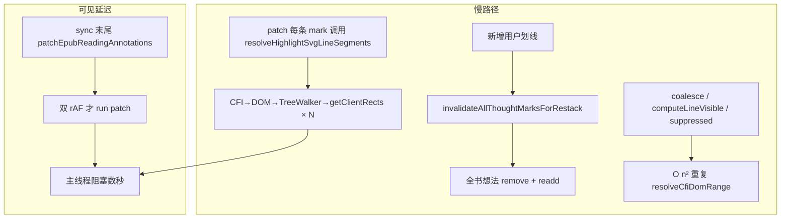
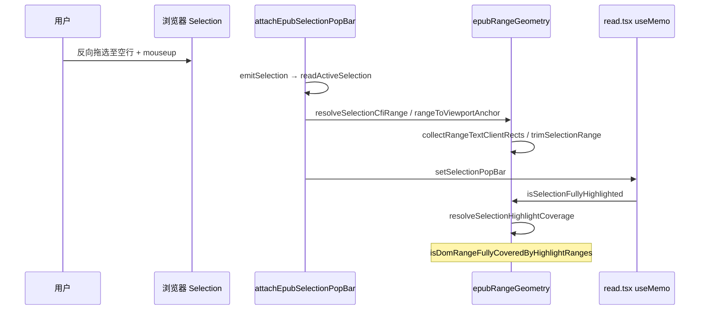
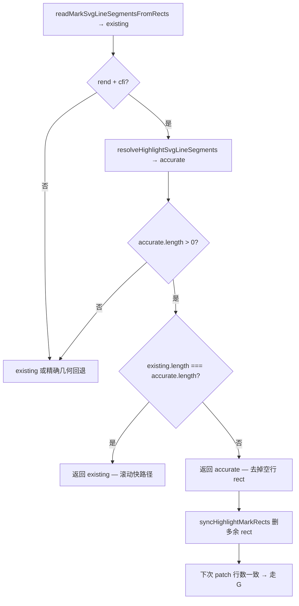
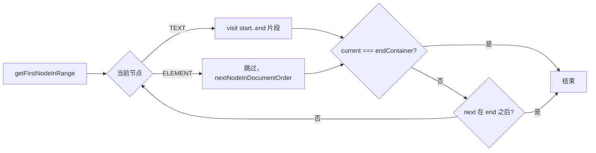

# EPUB 划线/想法同步性能优化

## 文档角色

**增量专题**：解决保存想法或用户划线后，正文标记 **延迟数秒才出现**、同步过程中 **页面卡顿无法滚动** 的问题；以及 **反向拖选到空行松手后应用卡死** 的选区几何性能回归（§3.5 / §4.6）。

**延伸阅读**：[EPUB PopBar性能体验.md](./EPUB PopBar性能体验.md)（增量 apply、PopBar 防闪烁）、[EPUB想法部分重叠.md](./EPUB想法部分重叠.md)（想法 patch 层 blocker 去重）、[EPUB用户划线实现.md](./EPUB用户划线实现.md) / [EPUB想法下划线实现.md](./EPUB想法下划线实现.md)（主链路）。

---

## 1. 背景与目标

### 1.1 用户可见问题

| 现象                                               | 触发                                      |
| -------------------------------------------------- | ----------------------------------------- |
| 新增划线/想法后 **3～8s** 才看到彩色线或琥珀虚线   | 书中已有较多 mark                         |
| 同步过程中 **主线程阻塞**，阅读区 **无法流畅滚动** | 保存想法、PopBar 划线                     |
| **反向拖选到段上方空行** 松手后 **应用卡死**       | 选区 PopBar 打开链路（mouseup → CFI/覆盖） |

### 1.2 目标

- **功能不变**：重叠合并、嵌套去重、PopBar 命中、想法/划线叠放与点击行为保持原样。
- **用户操作后**：标记应 **尽快可见**，且 **不长时间占用主线程**。
- **滚动/翻页**：仍走 rAF 防抖 patch，避免与阅读争抢。

---

## 2. 改动范围

| 路径                                                               | 说明                                                                                      |
| ------------------------------------------------------------------ | ----------------------------------------------------------------------------------------- |
| `apps/frontend/src/views/ebook/utils/epubRangeGeometry.ts`         | patch 快路径、行数对齐空行校正、`forEachTextNodeInRange`、选区 `normalize`、CFI 缓存      |
| `apps/frontend/src/views/ebook/utils/epubSelectionToolbarAttach.ts` | 选区 PopBar：`readActiveSelection` / `rangeToViewportAnchor` 使用规范化 Range 与精确 rect |
| `apps/frontend/src/views/ebook/utils/epubUserHighlights.ts`        | `syncEpubReadingAnnotations`、覆盖判定 `isDomRangeFullyCoveredByHighlightRanges`        |
| `apps/frontend/src/views/ebook/utils/epubThoughtAnnotations.ts`    | `restackThoughtMarkGroups`、patch 用 `resolveMarkSvgLineSegments`                         |

---

## 3. 问题根源

性能问题出在 **`syncEpubReadingAnnotations` 整条同步链**，而不是单点 bug。用户保存想法或 PopBar 划线后，`EpubPane` 的 `useEffect` 触发该函数，依次执行：构建渲染计划 → apply 用户划线 → 计算想法 suppression → apply 想法虚线 → patch SVG 样式。任一环节在主线程上耗时过长，都会表现为 **标记迟迟不出现** 与 **滚动卡顿**。



### 3.1 Patch 阶段对每条 mark 做 CFI→DOM→TreeWalker→getClientRects

`patchUserHighlightMarks` / `patchThoughtUnderlineMarks` 在每次 patch 时对 **全书每一条** mark 调用 `resolveHighlightSvgLineSegments`：

1. 用 CFI 解析 DOM `Range`；
2. `TreeWalker` 遍历选区内全部文本节点；
3. 对每个片段调用 `getClientRects` 做布局测量。

书中已有 **N** 条用户划线 + 想法虚线时，一次 sync 就是 **N 次** 重布局计算，主线程被长时间占满 → **卡顿、无法滚动**。

### 3.2 新增一条用户划线会触发全部想法 remove + readd

优化前，`invalidateAllThoughtMarksForRestack` 在 **可见用户划线 CFI 集合** 变化时，清空 **所有** 想法的 `appliedRef`。于是每次新增一条划线（即使与大部分想法无关），都要对 **全书所有想法** 执行 `annotations.remove` + `annotations.underline`，epub.js 批注层全量重建，耗时随想法数量线性放大。

### 3.3 sync 内重复解析 CFI 与 clientRect

在 **同一次** `syncEpubReadingAnnotations` 内，下列逻辑各自包含 O(n²) 或 O(n×m) 循环，且 **无缓存**：

| 函数                                     | 重复操作                                             |
| ---------------------------------------- | ---------------------------------------------------- |
| `coalesceOverlappingHighlightsForRender` | 两两 `resolveCfiDomRange` 判相交                     |
| `computeLineVisibleCfis`                 | 两两 CFI 嵌套判定                                    |
| `getThoughtCfisSuppressedByHighlights`   | 想法 × 划线，`resolveCfiDomRange` + `getClientRects` |

同一 CFI 在一次 sync 中被解析数十上百次，进一步拉长主线程占用。

### 3.4 用户操作后 patch 走双 rAF

优化前，`syncEpubReadingAnnotations` 末尾调用 `patchEpubReadingAnnotations`，内部 **连续两次** `requestAnimationFrame` 才真正执行 `runEpubReadingAnnotationPatch`。叠加上述主线程阻塞，用户体感为 **3～8s** 才看到彩色线或琥珀虚线。

### 3.5 选区结束落在空行：`TreeWalker` + `intersectsNode` 误扫整章

与 §3.1 patch 慢路径 **同类根因**，但触发点在 **文字选区 PopBar**（`mouseup` 后），而非 sync patch。

#### 3.5.1 现象

从正文某处（如「西晋帝…」）**反向拖选**到其 **上方无文字空行** 后松手：浏览器选区高亮会覆盖空行大块区域，随后 **主线程长时间占满、页面无响应**（卡死）。

#### 3.5.2 触发链路



拖动过程中 `selecting === true`，`selectionchange` **早退**，卡死发生在 **松手后** 的同步计算，而非拖动每一帧。

#### 3.5.3 根因：复杂度从 O(选区) 退化为 O(整章)

反向选到空行时，浏览器常把 Range 一端落在 **块级节点**（空 `<p>`、章容器子节点边界）。此时：

| 字段 | 典型值 | 后果 |
| ---- | ------ | ---- |
| `range.startContainer` / `endContainer` | 空段落元素或章级 `div` 子边界 | 结构跨度大于视觉选区 |
| `range.commonAncestorContainer` | **整章** `div` / `section` | TreeWalker 根节点为章容器 |

旧实现（`collectRangeTextClientRects`、`isDomRangeFullyCoveredByHighlightRanges`）使用：

**来源**：优化前 `apps/frontend/src/views/ebook/utils/epubRangeGeometry.ts`（`collectRangeTextClientRects` / 覆盖判定，概念摘录）

```typescript
// 以 Range 的最近公共祖先为根创建 TreeWalker（反向选空行时常为整章 div）
const walker = doc.createTreeWalker(
	// Walker 根节点：常为章级容器，子树含全书全部文本节点
	range.commonAncestorContainer,
	// 仅遍历 TEXT 节点
	NodeFilter.SHOW_TEXT,
	{
		// 对每个候选文本节点调用 intersectsNode 过滤
		acceptNode(node) {
			// 节点与 Range 有交集则接受，否则拒绝
			return range.intersectsNode(node)
				// 接受：该文本节点会进入后续 visit
				? NodeFilter.FILTER_ACCEPT
				// 拒绝：跳过该节点
				: NodeFilter.FILTER_REJECT;
		},
	},
);
// 随后 walker.nextNode() 循环：复杂度 O(章内文本节点总数)，而非 O(选区跨度)
```

`TreeWalker` 会 **遍历根下每一个文本节点**，对每个节点调用 `range.intersectsNode()`。当 Range 在文档序上从章内较前位置延伸到当前段落时，`intersectsNode` 对 **中间大量段落** 返回 `true`——复杂度约为 **O(章内文本节点数 × 调用次数)**。

一次松手会串联多次重计算：

| 步骤 | 函数 | 旧复杂度（最坏） |
| ---- | ---- | ---------------- |
| CFI | `resolveSelectionCfiRange` → `trimSelectionRange` | 边界步进 × `toString()` |
| PopBar 锚点 | `rangeToViewportAnchor` → `getAccurateRangeLineClientRects` | O(章) TreeWalker |
| 覆盖判定 | `resolveSelectionHighlightCoverage` → `isDomRangeFullyCoveredByHighlightRanges` | O(章 × 字符) 逐字检查 |
| 命中划线 | `findAllUserHighlightsForSelection` × `resolveCfiDomRange` | O(划线条数)（相对次要） |

长章节 + 已有较多划线时，主线程可被占满 **数秒至数十秒**，表现为应用卡死。

#### 3.5.4 与 §4.5 空行划线的关系

| 问题 | 阶段 | 表现 |
| ---- | ---- | ---- |
| §4.5 跨段划线画到空行 | **保存划线后 patch** | 空行出现整行宽彩色线 |
| §3.5 选区落空行卡死 | **松手后 PopBar** | 主线程阻塞、无法操作 |

二者都涉及「空行 / 块边界」与 Range 几何，但 **不同链路**；§4.5 用行数对齐校正 SVG rect，§3.5 用 **文档序定向遍历** 替代章级 TreeWalker。

---

## 4. 优化方案（功能逻辑不变）

| 优化                               | 作用                                                                                                                                                                                                                                                         |
| ---------------------------------- | ------------------------------------------------------------------------------------------------------------------------------------------------------------------------------------------------------------------------------------------------------------ |
| **`resolveMarkSvgLineSegments`**   | Patch **优先**读 marks-pane 已有 SVG `<rect>`；**行数与精确文本行几何一致** 时走快路径（滚动 O 读属性）；**不一致** 时用 `getAccurateRangeLineClientRects` 校正（去掉跨段落空行 rect）。首次校正后 `syncHighlightMarkRects` 删多余 rect，后续滚动仍快。      |
| **`forEachTextNodeInRange`**       | 沿文档序从 `startContainer` 走到 `endContainer` 遍历文本节点，**O(选区跨度)**；替代章级 `TreeWalker` + `intersectsNode`，修复 §3.5 选区落空行卡死；同时供 `collectRangeTextClientRects`、覆盖判定复用。                                                     |
| **`normalizeSelectionRangeForEpub`** | `snapSelectionRangeToTextContent` 收拢到首尾非空白字 + `trimSelectionRange`；用于 CFI、PopBar 锚点、`readActiveSelection` 出口。                                                                                                                            |
| **`beginEpubAnnotationSyncScope`** | 单次 sync 内启用 CFI / clientRect **缓存**（`resolveCfiDomRange`、`getAccurateRangeLineClientRectsCached`），避免 O(n²) 循环重复解析同一 CFI。判定规则不变。                                                                                                 |
| **取消全量想法 reapply**           | 删除 `invalidateAllThoughtMarksForRestack`；改为 **`restackThoughtMarkGroups`** DOM 重排（按 span 长→短 `appendChild`，短选区仍在上层可点）+ **`invalidateThoughtMarksWithChangedSuppression`**（仅 `showLine` 因用户划线盖住而变化的 CFI 才失效 reapply）。 |
| **sync 后立即同步 patch**          | 用户保存/划线后 `syncEpubReadingAnnotations` 直接调用 **`runEpubReadingAnnotationPatch`**，不再等双 rAF；**滚动/翻页**仍走 `patchEpubReadingAnnotations`（rAF 防抖），不与阅读争抢。                                                                         |

以下分节展开各优化的实现细节。

### 4.1 Patch 快路径：`resolveMarkSvgLineSegments`

epub.js 在 `annotations.highlight/underline` 后已在 marks-pane 写入 SVG `<rect>`，滚动时由引擎同步坐标。

- **读** `readMarkSvgLineSegmentsFromRects(group)` 得 `existing`。
- **有 CFI + Rendition** 时并行算 `accurate = resolveHighlightSvgLineSegments(...)`（`forEachTextNodeInRange` 仅遍历选区跨度内**文本节点**，不含段落间空行）。
- **`existing.length === accurate.length`** → 认为 rect 已校正，返回 `existing`（滚动热路径，O 读属性）。
- **行数不一致** → 返回 `accurate`；`syncHighlightMarkRects` 写入正确行数并 **remove 多余 rect**（见 §4.5）。
- **无 CFI / accurate 为空** → 回退 `existing` 或精确几何。

用户划线 patch、想法 patch 均走此入口。全书 N 条 mark、且 rect 已校正时，典型复杂度 **O(N × 读属性)**；仅 **新增/变更** 的跨段落 mark 首帧会触发精确几何。

### 4.5 快路径回归修复：跨段落选区空行被划线

#### 4.5.1 现象

PopBar **跨两段**选中（选区覆盖段末 + 段间空行 + 下一段段首）并划 **下划线 / 波浪线** 时，**段落之间的空行** 也会出现整行宽的彩色线——该空行无文字。

#### 4.5.2 根因

| 来源                                          | 行为                                                                                  |
| --------------------------------------------- | ------------------------------------------------------------------------------------- |
| epub.js `annotations.highlight`               | 对 Range 调用 `getClientRects`，跨 `<p>` 时会产生 **空行整宽** rect 并写入 marks-pane |
| 初版快路径 `readMarkSvgLineSegmentsFromRects` | 凡 `width/height > 0.5` 的 rect **全部**用于 patch，**不区分**是否有文本              |
| `getAccurateRangeLineClientRects`             | `collectRangeTextClientRects` 只遍历 **TEXT 节点**片段，空行无文本 → **不产生**线段   |

初版逻辑「有 rect 就直接返回」在单段选区正常；跨段选区 `existing.length > accurate.length`，空行 rect 被当成有效线段绘制。

#### 4.5.3 修复策略（行数对齐，兼顾性能）

不废除快路径，用 **行数** 作轻量校验：



- **首帧 / 跨段新划线**：`existing` 含空行 → 行数多于 `accurate` → 用精确几何 → `syncHighlightMarkRects` 删掉空行 rect。
- **滚动 / 翻页**：epub.js 只更新已有 rect 坐标，行数已与 `accurate` 一致 → 仍 **只读属性**，性能与初版快路径相同。
- **想法虚线** 同样经 `resolveMarkSvgLineSegments` → `prepareThoughtUnderlineMark`，一并受益。

#### 4.5.4 与性能优化的关系

| 场景                              | 是否触发 CFI→DOM→TreeWalker                          |
| --------------------------------- | ---------------------------------------------------- |
| 全书 N 条已校正 mark + 滚动 patch | **否**（行数一致 → existing）                        |
| 新增跨段落划线 / 首帧 apply       | **是**（一次校正，随后走快路径；底层 `forEachTextNodeInRange`） |
| sync 内 suppression 等            | 仍走 `getAccurateRangeLineClientRectsCached`（§4.2） |

**不**回退到「每条 mark 每次 patch 都 resolveHighlightSvgLineSegments」的优化前慢路径。

### 4.2 sync 作用域缓存

`beginEpubAnnotationSyncScope` / `endEpubAnnotationSyncScope` 包裹一次 `syncEpubReadingAnnotations`：

- `resolveCfiDomRange` 按 CFI 字符串缓存 `Range | null`。
- `getAccurateRangeLineClientRectsCached` 缓存精确 client rect（供「想法被用户划线盖住」判定复用）。

合并、嵌套、suppression 等逻辑 **不改判定规则**，仅避免重复解析。

### 4.3 想法叠放：DOM restack 替代全量 reapply

原逻辑：可见用户划线集合变化 → 清空全部想法 `appliedRef` → 每条想法 `remove` + `underline`。

新逻辑：

- `restackThoughtMarkGroups(rend)`：按选区 span **长→短** 排序后 `appendChild` 到 marks-pane 末尾，保证想法在彩色划线 **之上**，短选区仍在 **上层** 可点。
- `invalidateThoughtMarksWithChangedSuppression`：仅当某 CFI 的 **showLine 是否被用户划线 suppress** 状态变化时，才从 `appliedRef` 删除该条。

新增一条与某想法无关的划线时，**不再** reapply 全书想法。

### 4.4 用户 sync 后立即 patch

`syncEpubReadingAnnotations` 末尾直接 `runEpubReadingAnnotationPatch(rend)`，不再经 `patchEpubReadingAnnotations` 的双 rAF。

滚动/翻页/内容渲染仍通过 `installEpubUserHighlightPatchListeners` → `patchEpubReadingAnnotations`（rAF 防抖），避免滚动时同步重活。

### 4.6 选区落空行卡死：文档序遍历 + 选区规范化

#### 4.6.1 设计目标

- **松手后 PopBar** 在 **亚秒级** 完成 CFI、锚点、划线覆盖判定，长章节也不扫整章 DOM。
- **语义不变**：用户可见选中文本仍为 `Selection.toString().trim()`；CFI / 几何只针对 **真实正文** 字符，不把空行块边界写入 CFI。
- **与 patch 快路径共用** `forEachTextNodeInRange`，`collectRangeTextClientRects` 在 patch 校正时同样受益（不再误用章级 TreeWalker）。

#### 4.6.2 核心：`forEachTextNodeInRange`

**不**以 `commonAncestorContainer` 为 Walker 根，而从 Range 边界沿 **文档序** 单向前进：



- `getFirstNodeInRange`：处理 `startContainer` 为 ELEMENT 时 offset 落在子节点之间/之后的情况。
- `isNodeAfterRangeEnd`：下一节点若已在 `endContainer` 之后则停止，避免走出选区。
- 复杂度 **O(选区内节点数)**，与章总长度无关。

#### 4.6.3 选区规范化：`snap` + `normalize`

| 函数 | 作用 |
| ---- | ---- |
| `snapSelectionRangeToTextContent` | 在 `forEachTextNodeInRange` 内找首尾 **非空白** 字符，重建最小 Range |
| `normalizeSelectionRangeForEpub` | snap 后再 `trimSelectionRange`（去掉段内首尾空白）；无有效正文则返回 `null` |
| `trimBoundary` | 增加 `TRIM_BOUNDARY_MAX_STEPS = 8192` 上限，防止极端 DOM 边界步进过长 |

#### 4.6.4 调用点（PopBar 全链路）

| 位置 | 改动 |
| ---- | ---- |
| `epubSelectionToolbarAttach.readActiveSelection` | 出口 Range 改为 `normalizeSelectionRangeForEpub` 结果 |
| `epubSelectionToolbarAttach.rangeToViewportAnchor` | 用规范化 Range + `getAccurateRangeLineClientRects`（不用 raw `getClientRects` 大块空行 rect） |
| `epubRangeGeometry.resolveSelectionCfiRange` | CFI 自规范化 Range 生成 |
| `epubUserHighlights.resolveSelectionHighlightCoverage` | subject 先 `snapSelectionRangeToTextContent` |
| `epubUserHighlights.isDomRangeFullyCoveredByHighlightRanges` | 改用 `forEachTextNodeInRange` 逐字判定 |

#### 4.6.5 未改动的部分

- 拖动中 `selectionchange`：`selecting === true` 仍早退，不 emit PopBar。
- `findAllUserHighlightsForSelection` 仍 O(划线条数)；长列表可后续 debounce，非本次卡死主因。
- patch 快路径 §4.1 / §4.5 **逻辑保持**；§4.6 仅替换其底层 `collectRangeTextClientRects` 的遍历实现。

---

## 5. 改动前后对比

### 5.1 Patch 线段解析：每条 mark 都走 CFI 精确几何 → 优先读 SVG rect

**改动前**（`patchUserHighlightMarks` / `patchThoughtUnderlineMarks` 内）：

**来源**：优化前 `apps/frontend/src/views/ebook/utils/epubUserHighlights.ts`（`patchUserHighlightMarks` 内）

```typescript
// 从 epub.js 写入 g 节点的 data-epubcfi 读取当前 mark 的 CFI 地址
const cfi = groupEl.dataset.epubcfi?.trim();
// 每次 patch 都走精确几何：CFI→DOM Range→TreeWalker→getClientRects（全书 N 条即 N 次布局）
const segments = resolveHighlightSvgLineSegments(rend, groupEl, cfi);
// 按 segments 同步 SVG rect，供后续绘制彩色 fill / 下划线 / 波浪线
const rects = syncHighlightMarkRects(groupEl, segments);
```

**改动后**：

**来源**：`apps/frontend/src/views/ebook/utils/epubUserHighlights.ts`（`patchUserHighlightMarks` 内，约 L183–L185）

```typescript
// 从 g 节点 dataset 读取 CFI；供 resolveMarkSvgLineSegments 行数校验与精确几何使用
const cfi = groupEl.dataset.epubcfi?.trim();
// v2：读 rect 快路径 + 行数不一致时用精确文本行几何（去跨段空行）
const segments = resolveMarkSvgLineSegments(rend, groupEl, cfi);
// 与改动前相同：按 segments 写入/更新 rect 几何
const rects = syncHighlightMarkRects(groupEl, segments);
```

**新增（初版，约 2026-06）**（`epubRangeGeometry.ts`）— 快路径 v1，**已因 §4.5 空行回归 supersede**：

**来源**：初版 `apps/frontend/src/views/ebook/utils/epubRangeGeometry.ts`（`resolveMarkSvgLineSegments`）

```typescript
// patch 阶段统一入口：快路径 + 精确几何回退（v1）
export function resolveMarkSvgLineSegments(
	// epub.js Rendition；精确几何回退时需要
	rend: Rendition | undefined,
	// 当前 mark 的 SVG <g> 节点
	group: Element,
	// epub CFI 字符串；无 rect 回退时用
	cfiRange?: string,
): SvgLineSegment[] {
	// 尝试从 g 下已有 rect 读取线段（不触发布局）
	const existing = readMarkSvgLineSegmentsFromRects(group);
	// 有有效 rect 则直接返回 —— 跨段落时会含空行 rect（回归）
	if (existing.length > 0) return existing;
	// 无 rect 时回退精确几何
	return resolveHighlightSvgLineSegments(rend, group, cfiRange);
}
```

**当前（v2，含空行校正）**：

**来源**：`apps/frontend/src/views/ebook/utils/epubRangeGeometry.ts`（`resolveMarkSvgLineSegments`，约 L326–L351）

```typescript
// patch 阶段解析 mark 线段（v2：行数对齐校正 + 滚动快路径）
export function resolveMarkSvgLineSegments(
	// Rendition；精确几何路径解析 CFI 时需要
	rend: Rendition | undefined,
	// 当前 mark 的 SVG <g> 节点
	group: Element,
	// epub CFI；有值时才做 existing vs accurate 行数比对
	cfiRange?: string,
): SvgLineSegment[] {
	// 从 marks-pane 读取 epub.js 已写入的 rect（可能含段落间空行）
	const existing = readMarkSvgLineSegmentsFromRects(group);

	// 有 Rendition + CFI 时，用精确文本行几何作校验
	if (rend && cfiRange?.trim()) {
		// CFI→Range→forEachTextNodeInRange 文本片段 rect（不含空行）
		const accurate = resolveHighlightSvgLineSegments(rend, group, cfiRange);
		// 精确几何至少有一行有效线段
		if (accurate.length > 0) {
			// 行数一致：rect 已校正或单段选区，滚动热路径
			if (existing.length === accurate.length) {
				// 直接返回 marks-pane 已有 rect
				return existing;
			}
			// 行数不一致：existing 多出的 rect 多为空行，用 accurate
			return accurate;
		}
	}

	// 无 CFI 或 accurate 为空：尽量用 existing
	if (existing.length > 0) return existing;
	// 最后回退精确几何
	return resolveHighlightSvgLineSegments(rend, group, cfiRange);
}
```

|                           | 优化前（无快路径）          | 快路径 v1          | **快路径 v2（当前）**               |
| ------------------------- | --------------------------- | ------------------ | ----------------------------------- |
| 全书 N 条 mark 滚动 patch | N 次 CFI→DOM→getClientRects | N 次读 rect 属性   | **N 次读 rect**（行数已对齐时）     |
| 跨段落新划线首帧          | 精确几何                    | 空行被划线（回归） | **一次精确几何校正**，随后走读 rect |
| 单段选区                  | 精确几何                    | 读 rect            | 行数一致 → **读 rect**              |

---

### 5.2 sync 主流程：无缓存 + 全书想法 reapply + 双 rAF

**改动前**（`syncEpubReadingAnnotations` 完整摘录）：

**来源**：优化前 `apps/frontend/src/views/ebook/utils/epubUserHighlights.ts`

```typescript
// 用户划线 / 想法变化后的正文批注同步入口（无 sync 作用域缓存）
export function syncEpubReadingAnnotations(
	// epub.js Rendition 实例
	rend: Rendition,
	// 当前书籍全部想法数据
	thoughts: EbookThought[],
	// 当前书籍全部用户划线数据
	highlights: EbookUserHighlight[],
	// cfiRange → 想法 apply 签名（thoughtIds + showLine）
	appliedThoughtsRef: Map<string, string>,
	// cfiRange → 用户划线 apply 签名（style|color|id）
	appliedHighlightsRef: Map<string, string>,
): void {
	// 清空想法 patch 用的用户划线 blocker 源
	setUserHighlightBlockerSourcesForThoughtPatch([]);
	// 构建渲染计划：coalesce、visibleCfis、sorted（CFI 解析无缓存，O(n²) 可重复）
	const highlightPlan = buildHighlightRenderPlan(rend, highlights);
	// 增量 apply 用户划线（此项优化前已有，见 EPUB PopBar性能体验.md）
	applyEpubUserHighlights(
		// rendition
		rend,
		// 用户划线列表
		highlights,
		// apply 签名 Map
		appliedHighlightsRef,
		// 预计算的渲染计划
		highlightPlan,
	);

	// 筛出当前可见的用户划线，供 suppression 与 signature 使用
	const visibleHighlights = highlightPlan.coalesced.filter((item) =>
		// 仅当 CFI 在 visibleCfis 集合内才保留
		highlightPlan.visibleCfis.has(item.cfiRange),
	);
	// 将可见划线 CFI 排序拼接为字符串，用于检测集合是否变化
	const highlightCfiSignature = buildVisibleHighlightCfiSignature(
		// coalesce 后的划线列表
		highlightPlan.coalesced,
		// 当前应可见的 CFI 集合
		highlightPlan.visibleCfis,
	);
	// 可见用户划线集合相对上一轮发生变化
	if (highlightCfiSignature !== previousVisibleHighlightCfiSignature) {
		// 清空全部仍在使用的想法 appliedRef → 迫使全书想法 remove+underline
		invalidateAllThoughtMarksForRestack(thoughts, appliedThoughtsRef);
		// 更新模块级 signature 快照
		previousVisibleHighlightCfiSignature = highlightCfiSignature;
	}

	// 计算哪些想法 CFI 的虚线应被用户划线盖住
	const suppressed = getThoughtCfisSuppressedByHighlights(
		// 全部想法
		thoughts,
		// 当前可见用户划线
		visibleHighlights,
		// rendition（解析 CFI→Range）
		rend,
	);
	// apply 想法虚线（若上一步 invalidate，则全书 reapply）
	applyEpubThoughtUnderlines(rend, thoughts, appliedThoughtsRef, suppressed);
	// 收集 DOM 上用户划线 rect，供想法 patch 扣线
	setUserHighlightBlockerSourcesForThoughtPatch(
		// 从 marks-pane 收集 blocker 源
		collectUserHighlightBlockerSources(rend),
	);
	// 调度 patch：内部双 rAF，叠加主线程阻塞 → 体感延迟数秒
	patchEpubReadingAnnotations(rend);
}

// 优化前：用户划线集合一变，所有活跃想法 CFI 的 apply 签名全部失效
function invalidateAllThoughtMarksForRestack(
	// 当前书籍全部想法
	thoughts: EbookThought[],
	// 想法 apply 签名 Map
	appliedThoughtsRef: Map<string, string>,
): void {
	// 当前仍存在的想法 CFI 集合
	const activeCfis = new Set(
		// 提取每条想法的 cfiRange，trim 后过滤空串
		thoughts.map((t) => t.cfiRange.trim()).filter(Boolean),
	);
	// 遍历已 apply 的想法 CFI
	for (const cfi of [...appliedThoughtsRef.keys()]) {
		// 该 CFI 仍对应有效想法
		if (activeCfis.has(cfi)) {
			// 删除签名 → applyEpubThoughtUnderlines 会对该条 remove+underline
			appliedThoughtsRef.delete(cfi);
		}
	}
}
```

**改动后**：

**来源**：`apps/frontend/src/views/ebook/utils/epubUserHighlights.ts`（约 L2185–L2260）

```typescript
// 优化后 sync 入口：包裹 CFI/clientRect 缓存作用域
export function syncEpubReadingAnnotations(
	// epub.js Rendition 实例
	rend: Rendition,
	// 当前书籍全部想法数据
	thoughts: EbookThought[],
	// 当前书籍全部用户划线数据
	highlights: EbookUserHighlight[],
	// cfiRange → 想法 apply 签名
	appliedThoughtsRef: Map<string, string>,
	// cfiRange → 用户划线 apply 签名
	appliedHighlightsRef: Map<string, string>,
): void {
	// 开启本轮 sync 缓存（resolveCfiDomRange / clientRect 复用）
	beginEpubAnnotationSyncScope();
	// try/finally 保证无论成功失败都释放 sync 缓存
	try {
		// 清空上一轮 blocker，避免 stale rect
		setUserHighlightBlockerSourcesForThoughtPatch([]);
		// 构建渲染计划（coalesce 等同轮只算一次，且走 CFI 缓存）
		const highlightPlan = buildHighlightRenderPlan(rend, highlights);
		// 增量 apply 用户划线
		applyEpubUserHighlights(
			// rendition
			rend,
			// 用户划线列表
			highlights,
			// apply 签名 Map
			appliedHighlightsRef,
			// 预计算的渲染计划
			highlightPlan,
		);
		// 筛可见用户划线
		const visibleHighlights = highlightPlan.coalesced.filter((item) =>
			// 仅保留 visibleCfis 内的 CFI
			highlightPlan.visibleCfis.has(item.cfiRange),
		);
		// 已删除 highlightCfiSignature + invalidateAllThoughtMarksForRestack

		// 计算应 suppress 虚线的想法 CFI
		const suppressed = getThoughtCfisSuppressedByHighlights(
			// 全部想法
			thoughts,
			// 当前可见用户划线
			visibleHighlights,
			// rendition
			rend,
		);
		// 仅 showLine suppress 状态变化的 CFI 才失效签名
		invalidateThoughtMarksWithChangedSuppression(
			// 本轮 suppress 集合
			suppressed,
			// 想法 apply 签名 Map
			appliedThoughtsRef,
		);
		// 增量 apply 想法虚线
		applyEpubThoughtUnderlines(rend, thoughts, appliedThoughtsRef, suppressed);
		// 注入用户划线 blocker 供想法 patch
		setUserHighlightBlockerSourcesForThoughtPatch(
			// 从 marks-pane 收集 blocker 源
			collectUserHighlightBlockerSources(rend),
		);
		// 当前帧立即 patch，不等 patchEpubReadingAnnotations 双 rAF
		runEpubReadingAnnotationPatch(rend);
	} finally {
		// 释放 sync 缓存，避免跨轮脏读
		endEpubAnnotationSyncScope();
	}
}

// 优化后：仅 suppress 状态翻转的 CFI 才 reapply
function invalidateThoughtMarksWithChangedSuppression(
	// 本轮应 suppress 虚线的 CFI 集合
	suppressedLineCfis: Set<string>,
	// 想法 apply 签名 Map
	appliedThoughtsRef: Map<string, string>,
): void {
	// 遍历已 apply 的全部想法 CFI
	for (const cfi of [...appliedThoughtsRef.keys()]) {
		// 上一轮该 CFI 是否被用户划线盖住而隐藏虚线
		const wasSuppressed = previousThoughtSuppressedCfis.has(cfi);
		// 本轮是否应 suppress
		const nowSuppressed = suppressedLineCfis.has(cfi);
		// 状态未变则保留签名，skip remove+underline
		if (wasSuppressed !== nowSuppressed) {
			// 状态翻转：删除签名，触发该条 reapply
			appliedThoughtsRef.delete(cfi);
		}
	}
	// 保存本轮 suppress 快照供下轮 diff
	previousThoughtSuppressedCfis = new Set(suppressedLineCfis);
}
```

|                  | 改动前                   | 改动后                                       |
| ---------------- | ------------------------ | -------------------------------------------- |
| 新增一条无关划线 | 全书想法 remove+readd    | 仅 DOM restack（见 5.3）                     |
| sync 内 CFI 解析 | 每次直接解析，O(n²) 重复 | `begin/endEpubAnnotationSyncScope` 缓存      |
| 用户操作后可见线 | 等双 rAF + 主线程阻塞    | 同函数内立即 `runEpubReadingAnnotationPatch` |

---

### 5.3 想法叠放：全书 reapply → DOM restack

**改动前**：用户划线集合变化时，通过 `invalidateAllThoughtMarksForRestack` 迫使 epub.js 对 **每条想法** 重新 `annotations.remove` + `annotations.underline`，以改变 SVG 叠层顺序。**无** `restackThoughtMarkGroups` 函数。

**改动后**：

**来源**：`apps/frontend/src/views/ebook/utils/epubThoughtAnnotations.ts`（`restackThoughtMarkGroups`，约 L177–L209）

```typescript
// 新增：纯 DOM 重排想法 mark，不触碰 epub.js 批注注册表
export function restackThoughtMarkGroups(
	// 可选 Rendition，用于收集 iframe document
	rend?: Rendition,
): void {
	// 待处理 document：主文档 + 各 iframe
	const docs = new Set<Document>([document]);
	// 从 rendition 收集 iframe document
	for (const contents of getRenditionContentsList(rend)) {
		// 有效 document 加入集合
		if (contents.document) docs.add(contents.document);
	}

	// 逐个 document 处理
	for (const doc of docs) {
		// try/catch：iframe 卸载时 querySelector 可能抛错
		try {
			// 遍历该 document 内所有 marks-pane
			for (const pane of doc.querySelectorAll(".marks-pane")) {
				// 收集 pane 内全部想法 underline 的 g 节点
				const groups = [
					// 展开 querySelectorAll 结果为数组
					...pane.querySelectorAll(
						// 匹配 class 或 ref 属性为想法 underline 的 g 节点
						`g.${EPUB_THOUGHT_UNDERLINE_CLASS}, g[ref="${EPUB_THOUGHT_UNDERLINE_CLASS}"]`,
					),
					// 断言为 SVGElement 数组
				] as SVGElement[];
				// 按 span 长→短排序（与 apply 时 sortCfiGroupsForUnderlineStack 一致）
				groups.sort((left, right) => {
					// 用 rect 宽度估算 span，避免 CFI→DOM
					const spanDiff =
						// 右 span 减左 span：正值表示 right 更长
						thoughtMarkSpanLength(right) - thoughtMarkSpanLength(left);
					// span 不同：长的排前（先 append，DOM 靠下）
					if (spanDiff !== 0) return spanDiff;
					// span 相同：CFI 字符串长度 tie-break，保证顺序稳定
					return (
						// 左 CFI 长度
						(left.dataset.epubcfi?.length ?? 0) -
						// 减右 CFI 长度
						(right.dataset.epubcfi?.length ?? 0)
					);
				});
				// appendChild 已有节点 = 移到 pane 末尾，提升绘制/命中层级
				for (const group of groups) {
					// 将 g 节点 append 到 marks-pane 末尾
					pane.appendChild(group);
				}
			}
		} catch {
			// iframe 卸载或 document 不可访问时忽略
		}
	}
}
```

**`runEpubReadingAnnotationPatch` 末尾对比**：

**来源**：`apps/frontend/src/views/ebook/utils/epubUserHighlights.ts`（约 L2228–L2239）

```typescript
// ---------- 改动前 ----------
// 执行一轮 SVG patch（无 DOM restack）
function runEpubReadingAnnotationPatch(
	// epub.js Rendition
	rend: Rendition,
): void {
	// patch 全书用户划线 SVG 样式
	patchAllUserHighlightMarks(rend);
	// 刷新 blocker 源
	setUserHighlightBlockerSourcesForThoughtPatch(
		// 从 marks-pane 收集用户划线 rect
		collectUserHighlightBlockerSources(rend),
	);
	// patch 全书想法虚线
	patchEpubThoughtUnderlineMarks(rend);
	// 叠层靠 invalidateAllThoughtMarksForRestack 全书 reapply 实现
}

// ---------- 改动后 ----------
// 执行一轮 SVG patch，末尾增加 DOM restack
function runEpubReadingAnnotationPatch(
	// epub.js Rendition
	rend: Rendition,
): void {
	// patch 全书用户划线 SVG 样式（已改用 resolveMarkSvgLineSegments 快路径）
	patchAllUserHighlightMarks(rend);
	// 刷新 blocker 源
	setUserHighlightBlockerSourcesForThoughtPatch(
		// 从 marks-pane 收集用户划线 rect
		collectUserHighlightBlockerSources(rend),
	);
	// patch 全书想法虚线
	patchEpubThoughtUnderlineMarks(rend);
	// 新增：DOM 重排想法 g，叠在用户划线之上，无需全书 reapply
	restackThoughtMarkGroups(rend);
}
```

---

### 5.4 CFI / clientRect 缓存与 suppression 测量

**改动前**：

**来源**：优化前 `apps/frontend/src/views/ebook/utils/epubRangeGeometry.ts` / `epubUserHighlights.ts`

```typescript
// 无模块级缓存；每次调用都遍历 iframe 解析 CFI
export function resolveCfiDomRange(
	// epub.js Rendition
	rend: Rendition,
	// epub CFI 字符串
	cfiRange: string,
): Range | null {
	// 直接 uncached 解析
	return resolveCfiDomRangeUncached(rend, cfiRange);
}

// 想法是否被用户划线 clientRect 完全盖住（无缓存，O(n×m) 重复 getClientRects）
function isDomRangeFullyCoveredByHighlightClientRects(
	// 想法选区 DOM Range
	thoughtRange: Range,
	// 用户划线选区 DOM Range
	highlightRange: Range,
): boolean {
	// 想法选区全部 client rect（含行尾空白，未裁剪）
	const thoughtRects = [...thoughtRange.getClientRects()].filter(
		// 过滤宽度和高度均 > 0.5 的有效 rect
		(rect) => rect.width > 0.5 && rect.height > 0.5,
	);
	// 用户划线选区全部 client rect
	const highlightRects = [...highlightRange.getClientRects()].filter(
		// 过滤宽度和高度均 > 0.5 的有效 rect
		(rect) => rect.width > 0.5 && rect.height > 0.5,
	);
	// 任一方无 rect 则不算完全覆盖
	if (thoughtRects.length === 0 || highlightRects.length === 0) return false;

	// 想法每个 rect 须被某个 highlight rect 完全包含
	return thoughtRects.every((thoughtRect) =>
		highlightRects.some((highlightRect) => {
			// 垂直方向无交集则跳过该 highlight rect
			if (
				// thought 底边在 highlight 顶边之上
				thoughtRect.bottom <= highlightRect.top + 0.5 ||
				// thought 顶边在 highlight 底边之下
				thoughtRect.top >= highlightRect.bottom - 0.5
			) {
				// 垂直不重叠
				return false;
			}
			// 水平方向想法 rect 在 highlight rect 内（±1px 容差）
			return (
				// thought 左边界不早于 highlight 左边界
				thoughtRect.left >= highlightRect.left - 1 &&
				// thought 右边界不晚于 highlight 右边界
				thoughtRect.right <= highlightRect.right + 1
			);
		}),
	);
}
```

**改动后**：

**来源**：`apps/frontend/src/views/ebook/utils/epubRangeGeometry.ts`（约 L340–L410）及 `epubUserHighlights.ts`

```typescript
// 模块级：sync 作用域内 CFI→Range 缓存（null 表示未在 sync 中）
let syncCfiRangeCache: Map<string, Range | null> | null = null;
// 模块级：sync 作用域内 CFI key→精确 clientRect[] 缓存
let syncAccurateClientRectCache: Map<string, DOMRect[]> | null = null;

// sync 开始时启用缓存
export function beginEpubAnnotationSyncScope(): void {
	// 初始化 CFI 缓存 Map
	syncCfiRangeCache = new Map();
	// 初始化 clientRect 缓存 Map
	syncAccurateClientRectCache = new Map();
}

// sync 结束时释放缓存
export function endEpubAnnotationSyncScope(): void {
	// 置 null，下一轮 sync 重新建 Map
	syncCfiRangeCache = null;
	// 同步清空 clientRect 缓存
	syncAccurateClientRectCache = null;
}

// 带缓存的 CFI→Range（同轮 coalesce / suppressed 等复用）
export function resolveCfiDomRange(
	// epub.js Rendition
	rend: Rendition,
	// epub CFI 字符串
	cfiRange: string,
): Range | null {
	// 规范化缓存键
	const key = cfiRange.trim();
	// 在 sync 作用域内
	if (syncCfiRangeCache && key) {
		// 命中缓存
		if (syncCfiRangeCache.has(key)) {
			// 返回已缓存的 Range（可能为 null）
			return syncCfiRangeCache.get(key) ?? null;
		}
		// 未命中：解析并写入
		const resolved = resolveCfiDomRangeUncached(rend, key);
		// 存入 CFI 缓存供同轮后续调用复用
		syncCfiRangeCache.set(key, resolved);
		// 返回本次解析结果
		return resolved;
	}
	// sync 外：行为与改动前相同
	return resolveCfiDomRangeUncached(rend, cfiRange);
}

// 优化后：用 cached 精确 clientRect（裁剪行尾空白 + 同 CFI 只测一次）
function isDomRangeFullyCoveredByHighlightClientRects(
	// 想法 CFI（作缓存键前缀）
	thoughtCfi: string,
	// 想法 DOM Range
	thoughtRange: Range,
	// 用户划线 CFI（作缓存键前缀）
	highlightCfi: string,
	// 用户划线 DOM Range
	highlightRange: Range,
): boolean {
	// 想法 rect（缓存键 thought:${cfi}）
	const thoughtRects = getAccurateRangeLineClientRectsCached(
		// 缓存键：区分想法与用户划线
		`thought:${thoughtCfi}`,
		// 已解析的 DOM Range
		thoughtRange,
	);
	// 用户划线 rect（缓存键 highlight:${cfi}）
	const highlightRects = getAccurateRangeLineClientRectsCached(
		// 缓存键
		`highlight:${highlightCfi}`,
		// 已解析的 DOM Range
		highlightRange,
	);
	// 任一方无 rect 则不算完全覆盖
	if (thoughtRects.length === 0 || highlightRects.length === 0) return false;

	// 判定逻辑与改动前相同，仅 rect 来源改为 cached
	return thoughtRects.every((thoughtRect) =>
		highlightRects.some((highlightRect) => {
			// 垂直方向无交集则该 highlight rect 不可能覆盖 thought rect
			if (
				// thought 底边在 highlight 顶边之上（含 0.5px 容差）
				thoughtRect.bottom <= highlightRect.top + 0.5 ||
				// thought 顶边在 highlight 底边之下
				thoughtRect.top >= highlightRect.bottom - 0.5
			) {
				// 垂直不重叠，尝试下一个 highlight rect
				return false;
			}
			// 水平方向：thought rect 完全落在 highlight rect 内（±1px 容差）
			return (
				// thought 左边界不早于 highlight 左边界
				thoughtRect.left >= highlightRect.left - 1 &&
				// thought 右边界不晚于 highlight 右边界
				thoughtRect.right <= highlightRect.right + 1
			);
		}),
	);
}
```

---

### 5.5 用户操作 vs 滚动：patch 触发路径对比

| 场景                       | 改动前                                                            | 改动后                                                  |
| -------------------------- | ----------------------------------------------------------------- | ------------------------------------------------------- |
| 保存想法 / PopBar 划线     | `sync` → `patchEpubReadingAnnotations(rend)` → **双 rAF** → patch | `sync` → **`runEpubReadingAnnotationPatch(rend)` 同步** |
| 滚动 / 翻页 / content 渲染 | `patchEpubReadingAnnotations(rend, { defer })` → rAF              | **不变**，仍走 rAF 防抖                                 |

**改动前** sync 末尾 + `patchEpubReadingAnnotations` 内部：

**来源**：优化前 `apps/frontend/src/views/ebook/utils/epubUserHighlights.ts`

```typescript
// sync 末尾：调度异步 patch（非立即执行）
patchEpubReadingAnnotations(rend);

// patchEpubReadingAnnotations 内部（摘录）
export function patchEpubReadingAnnotations(
	// epub.js Rendition
	rend: Rendition,
	// 可选：defer 时走双 rAF
	options?: { defer?: boolean },
): void {
	// content 渲染场景标记需要双 rAF
	if (options?.defer) {
		pendingReadingAnnotationFullPatch = true;
	}
	// 取消上一轮未执行的 rAF
	cancelAnimationFrame(readingAnnotationPatchRaf);
	// 注册第一帧 rAF 回调
	readingAnnotationPatchRaf = requestAnimationFrame(() => {
		// defer 时第二帧 rAF 才 patch
		if (pendingReadingAnnotationFullPatch) {
			// 清除 defer 标记，避免后续重复双 rAF
			pendingReadingAnnotationFullPatch = false;
			// 注册第二帧 rAF
			readingAnnotationPatchRaf = requestAnimationFrame(() => {
				// 第二帧执行完整 patch
				runEpubReadingAnnotationPatch(rend);
			});
			// 第一帧回调结束，等待第二帧
			return;
		}
		// 非 defer：第一帧 rAF 后直接 patch
		runEpubReadingAnnotationPatch(rend);
	});
}
```

**改动后** sync 末尾：

**来源**：`apps/frontend/src/views/ebook/utils/epubUserHighlights.ts`（`syncEpubReadingAnnotations` 内）

```typescript
// 收集用户划线 blocker（想法 patch 扣线用）
setUserHighlightBlockerSourcesForThoughtPatch(
	// 从 marks-pane 收集当前可见用户划线的 SVG rect 列表
	collectUserHighlightBlockerSources(rend),
);
// 直接同步执行 patch，当前调用栈内完成，无 rAF 等待
runEpubReadingAnnotationPatch(rend);
```

---

## 6. 关键代码与注释（改动后完整版）

> 全文代码块均采用「**每行代码上方一行中文注释**」格式（含 §3 根因摘录、§5 改动前后对比与 §6 完整版）。部分块为摘录，省略处用 `// ...` 标明。

### 6.1 从 SVG rect 读取线段（patch 热路径）

**来源**：`apps/frontend/src/views/ebook/utils/epubRangeGeometry.ts`（`readMarkSvgLineSegmentsFromRects`，约 L300–L324）

```typescript
// 从 epub.js 已在 mark 上写好的 SVG <rect> 读取线段，避免 CFI→DOM→getClientRects
export function readMarkSvgLineSegmentsFromRects(
	// 单个 annotation 对应的 SVG <g> 分组节点
	group: Element,
): SvgLineSegment[] {
	// 收集有效 rect 转换后的线段列表
	const segments: SvgLineSegment[] = [];
	// 遍历该 g 下所有 rect（多行选区时 epub.js 会写多个 rect）
	for (const node of group.querySelectorAll("rect")) {
		// 非 SVGRectElement 的节点跳过
		if (!(node instanceof SVGRectElement)) continue;
		// 读取 rect 的 x 坐标（marks-pane 局部坐标系）
		const x = Number.parseFloat(node.getAttribute("x") ?? "NaN");
		// 读取 rect 的 y 坐标
		const y = Number.parseFloat(node.getAttribute("y") ?? "NaN");
		// 读取 rect 宽度
		const width = Number.parseFloat(node.getAttribute("width") ?? "NaN");
		// 读取 rect 高度
		const height = Number.parseFloat(node.getAttribute("height") ?? "NaN");
		// 以下任一条件成立则跳过当前 rect（无效或过小）
		if (
			// x 坐标非有限数
			!Number.isFinite(x) ||
			// y 坐标非有限数
			!Number.isFinite(y) ||
			// 宽度非有限数
			!Number.isFinite(width) ||
			// 高度非有限数
			!Number.isFinite(height) ||
			// 宽度过小（不可见）
			width <= 0.5 ||
			// 高度过小（不可见）
			height <= 0.5
		) {
			// 当前 rect 不可用，尝试下一个
			continue;
		}
		// 将有效 rect 转为统一的 SvgLineSegment 结构
		segments.push({ x, y, width, height });
	}
	// 返回全部有效线段（可能为空，调用方会走 CFI 回退）
	return segments;
}
```

### 6.2 Patch 入口：`resolveMarkSvgLineSegments`（v2，含空行校正）

**来源**：`apps/frontend/src/views/ebook/utils/epubRangeGeometry.ts`（约 L326–L351）

```typescript
// patch 阶段解析 mark 线段：行数对齐校验 + 滚动快路径（见 §4.5）
export function resolveMarkSvgLineSegments(
	// epub.js Rendition；精确几何校验时需要
	rend: Rendition | undefined,
	// 当前 mark 的 SVG <g> 节点
	group: Element,
	// epub CFI 字符串
	cfiRange?: string,
): SvgLineSegment[] {
	// 读取 marks-pane 上 epub.js 维护的 rect（跨段时可能含空行块）
	const existing = readMarkSvgLineSegmentsFromRects(group);

	// 有 CFI 时用精确文本行几何校验行数
	if (rend && cfiRange?.trim()) {
		// CFI→Range→forEachTextNodeInRange 文本片段 → SVG 局部坐标线段
		const accurate = resolveHighlightSvgLineSegments(rend, group, cfiRange);
		// 精确几何至少有一行
		if (accurate.length > 0) {
			// 行数相同：已校正或天然一致，滚动时只读属性
			if (existing.length === accurate.length) {
				// 返回 existing，O(读 rect 属性)
				return existing;
			}
			// existing 多出空行 rect → 采用 accurate
			return accurate;
		}
	}

	// 无法校验时优先 existing
	if (existing.length > 0) return existing;
	// 兜底精确几何
	return resolveHighlightSvgLineSegments(rend, group, cfiRange);
}
```

### 6.3 sync 作用域缓存

**来源**：`apps/frontend/src/views/ebook/utils/epubRangeGeometry.ts`（约 L340–L410）

```typescript
// 模块级：当前是否在 syncEpubReadingAnnotations 批处理作用域内
let syncCfiRangeCache: Map<string, Range | null> | null = null;
// 模块级：sync 内精确 clientRect 缓存（供 suppression 判定复用）
let syncAccurateClientRectCache: Map<string, DOMRect[]> | null = null;

// sync 开始时调用：启用本轮 CFI / clientRect 缓存
export function beginEpubAnnotationSyncScope(): void {
	// 新建 CFI→Range 缓存 Map
	syncCfiRangeCache = new Map();
	// 新建 CFI key→clientRect[] 缓存 Map
	syncAccurateClientRectCache = new Map();
}

// sync 结束时调用：释放缓存，避免跨轮 sync 脏数据
export function endEpubAnnotationSyncScope(): void {
	// 清空 CFI 缓存引用
	syncCfiRangeCache = null;
	// 清空 clientRect 缓存引用
	syncAccurateClientRectCache = null;
}

// sync 阶段带缓存的精确 clientRect（想法被用户划线盖住判定用）
export function getAccurateRangeLineClientRectsCached(
	// 缓存键，如 thought:${cfi} 或 highlight:${cfi}，避免想法/划线 rect 冲突
	cfiKey: string,
	// 已解析的 DOM Range；null 时直接返回空数组
	range: Range | null,
): DOMRect[] {
	// Range 无效则无需测量
	if (!range) return [];
	// 仅在 sync 作用域内走缓存
	if (syncAccurateClientRectCache) {
		// 命中缓存则直接返回，避免重复 TreeWalker + getClientRects
		const cached = syncAccurateClientRectCache.get(cfiKey);
		if (cached) return cached;
		// 未命中：执行精确几何（裁剪行尾空白等）
		const rects = getAccurateRangeLineClientRects(range);
		// 写入缓存供同轮后续 O(n×m) 循环复用
		syncAccurateClientRectCache.set(cfiKey, rects);
		return rects;
	}
	// sync 作用域外（如滚动 patch）仍走无缓存精确几何
	return getAccurateRangeLineClientRects(range);
}

// 对外统一的 CFI→Range 解析；sync 内自动走缓存
export function resolveCfiDomRange(
	rend: Rendition,
	cfiRange: string,
): Range | null {
	// 规范化 CFI 字符串作为缓存键
	const key = cfiRange.trim();
	// sync 作用域内且 key 非空时尝试缓存
	if (syncCfiRangeCache && key) {
		// 已解析过则直接返回缓存结果（含 null）
		if (syncCfiRangeCache.has(key)) {
			return syncCfiRangeCache.get(key) ?? null;
		}
		// 未命中：真正解析 CFI（遍历 iframe contents / rend.getRange）
		const resolved = resolveCfiDomRangeUncached(rend, key);
		// 写入缓存，同轮 coalesce / computeLineVisible / suppressed 可复用
		syncCfiRangeCache.set(key, resolved);
		return resolved;
	}
	// 非 sync 作用域：每次直接解析，行为与优化前一致
	return resolveCfiDomRangeUncached(rend, cfiRange);
}
```

### 6.4 sync 主流程

**来源**：`apps/frontend/src/views/ebook/utils/epubUserHighlights.ts`（`syncEpubReadingAnnotations`，约 L2185–L2223）

```typescript
// 用户划线 / 想法数据变化后的唯一正文批注同步入口（EpubPane useEffect 调用）
export function syncEpubReadingAnnotations(
	// epub.js Rendition 实例
	rend: Rendition,
	// 当前书籍全部想法数据
	thoughts: EbookThought[],
	// 当前书籍全部用户划线数据
	highlights: EbookUserHighlight[],
	// cfiRange → 想法 apply 签名（thoughtIds + showLine）
	appliedThoughtsRef: Map<string, string>,
	// cfiRange → 用户划线 apply 签名（style|color|id）
	appliedHighlightsRef: Map<string, string>,
): void {
	// 开启 sync 作用域：本轮 resolveCfiDomRange / clientRect 走缓存
	beginEpubAnnotationSyncScope();
	try {
		// 清空想法 patch 用的用户划线 blocker，避免上一轮 rect 残留
		setUserHighlightBlockerSourcesForThoughtPatch([]);
		// 构建渲染计划：coalesce + visibleCfis + sorted（只算一次，见 EPUB PopBar性能体验.md）
		const highlightPlan = buildHighlightRenderPlan(rend, highlights);
		// 增量 apply 用户划线：仅 signature 变化的 CFI 才 remove+highlight
		applyEpubUserHighlights(
			rend,
			highlights,
			appliedHighlightsRef,
			highlightPlan,
		);
		// 从 coalesced 中筛出 visibleCfis 内的用户划线
		const visibleHighlights = highlightPlan.coalesced.filter((item) =>
			// 仅保留应绘制可见样式的 CFI
			highlightPlan.visibleCfis.has(item.cfiRange),
		);
		// 计算哪些想法 CFI 的虚线应被用户彩色划线盖住而 suppress
		const suppressed = getThoughtCfisSuppressedByHighlights(
			thoughts,
			visibleHighlights,
			rend,
		);
		// 仅 showLine 状态相对上一轮变化的 CFI 才从 appliedRef 删除（增量 reapply）
		invalidateThoughtMarksWithChangedSuppression(
			suppressed,
			appliedThoughtsRef,
		);
		// 增量 apply 想法虚线：signature 未变则 skip
		applyEpubThoughtUnderlines(rend, thoughts, appliedThoughtsRef, suppressed);
		// 收集当前 DOM 上用户划线的 SVG rect，供想法 patch 扣减重叠线段
		setUserHighlightBlockerSourcesForThoughtPatch(
			collectUserHighlightBlockerSources(rend),
		);
		// 用户主动保存/划线：同步 patch，不等 patchEpubReadingAnnotations 的双 rAF
		runEpubReadingAnnotationPatch(rend);
	} finally {
		// 无论成功失败都结束 sync 作用域，释放 CFI/clientRect 缓存
		endEpubAnnotationSyncScope();
	}
}
```

### 6.5 同步 patch 与 suppression 增量失效

**来源**：`apps/frontend/src/views/ebook/utils/epubUserHighlights.ts`（约 L2228–L2260）

```typescript
// 执行一轮完整 SVG patch：用户划线样式 + 想法虚线 + DOM 叠放
function runEpubReadingAnnotationPatch(
	// epub.js Rendition
	rend: Rendition,
): void {
	try {
		// 遍历全书用户划线 mark，用 resolveMarkSvgLineSegments 快路径改 SVG
		patchAllUserHighlightMarks(rend);
		// patch 用户划线后刷新 blocker 源（想法虚线需扣减彩色块占用的水平区间）
		setUserHighlightBlockerSourcesForThoughtPatch(
			collectUserHighlightBlockerSources(rend),
		);
		// 遍历全书想法 mark，绘制琥珀虚线并处理想法间重叠 blocker
		patchEpubThoughtUnderlineMarks(rend);
		// DOM 重排：想法 g 移到 marks-pane 末尾，叠在用户划线之上，无需全书 reapply
		restackThoughtMarkGroups(rend);
	} catch {
		// rendition 已销毁时忽略（切书/卸载）
	}
}

// 模块级：上一轮 sync 结束时被 suppress 虚线的想法 CFI 集合
let previousThoughtSuppressedCfis = new Set<string>();

// 仅当某 CFI 的「是否被用户划线盖住而隐藏虚线」状态变化时，才迫使 reapply 该条想法
function invalidateThoughtMarksWithChangedSuppression(
	// 本轮计算出的应 suppress 虚线的 CFI 集合
	suppressedLineCfis: Set<string>,
	// 想法 apply 签名 Map；delete 后 applyEpubThoughtUnderlines 会 remove+underline
	appliedThoughtsRef: Map<string, string>,
): void {
	// 遍历当前已 apply 的全部想法 CFI
	for (const cfi of [...appliedThoughtsRef.keys()]) {
		// 上一轮该 CFI 是否处于 suppress 状态
		const wasSuppressed = previousThoughtSuppressedCfis.has(cfi);
		// 本轮该 CFI 是否应 suppress
		const nowSuppressed = suppressedLineCfis.has(cfi);
		// 仅状态翻转时才失效签名，触发该条 remove+underline
		if (wasSuppressed !== nowSuppressed) {
			// 删除 apply 签名，applyEpubThoughtUnderlines 会对该 CFI reapply
			appliedThoughtsRef.delete(cfi);
		}
	}
	// 更新模块级快照，供下一轮 diff
	previousThoughtSuppressedCfis = new Set(suppressedLineCfis);
}
```

### 6.6 想法 DOM 叠放（替代全书 reapply）

**来源**：`apps/frontend/src/views/ebook/utils/epubThoughtAnnotations.ts`（`restackThoughtMarkGroups`，约 L177–L209）

```typescript
// 将想法 mark 移到 marks-pane DOM 末尾，保证叠放在用户划线之上且无需 remove+readd
export function restackThoughtMarkGroups(
	// 可选 Rendition，用于收集 iframe document
	rend?: Rendition,
): void {
	// 待处理的 document 集合：主文档 + 各章节 iframe 文档
	const docs = new Set<Document>([document]);
	// 从 rendition 收集所有 iframe contents 的 document
	for (const contents of getRenditionContentsList(rend)) {
		// iframe 已挂载 document 时加入待处理集合
		if (contents.document) docs.add(contents.document);
	}

	// 逐个 document 处理其 marks-pane
	for (const doc of docs) {
		// try/catch：iframe 卸载时 querySelector 可能抛错
		try {
			// 每个 marks-pane 是 epub.js 批注 SVG 的容器
			for (const pane of doc.querySelectorAll(".marks-pane")) {
				// 收集该 pane 内全部想法 underline 的 g 节点
				const groups = [
					// 展开 querySelectorAll 结果为数组
					...pane.querySelectorAll(
						// 匹配 class 或 ref 为想法 underline 的 g 节点
						`g.${EPUB_THOUGHT_UNDERLINE_CLASS}, g[ref="${EPUB_THOUGHT_UNDERLINE_CLASS}"]`,
					),
					// 断言为 SVGElement 数组
				] as SVGElement[];
				// 按 span 长→短排序，保证短选区在 DOM 上层
				groups.sort((left, right) => {
					// 右减左：span 大的排前面（先 append）
					const spanDiff =
						// 用 rect 宽度估算 span
						thoughtMarkSpanLength(right) - thoughtMarkSpanLength(left);
					// span 不同则按差值排序
					if (spanDiff !== 0) return spanDiff;
					// span 相同：CFI 字符串长度作 tie-break
					return (
						// 左 CFI 长度
						(left.dataset.epubcfi?.length ?? 0) -
						// 减右 CFI 长度
						(right.dataset.epubcfi?.length ?? 0)
					);
				});
				// 按排序结果依次 appendChild，完成叠层
				for (const group of groups) {
					// 移到 marks-pane 末尾
					pane.appendChild(group);
				}
			}
		} catch {
			// iframe 卸载或文档不可用时忽略
		}
	}
}
```

### 6.7 patch 调用点改用快路径（摘录）

**改动前**（`patchUserHighlightMarks` 内）：

**来源**：优化前 `apps/frontend/src/views/ebook/utils/epubUserHighlights.ts`

```typescript
// 读取 mark 的 CFI
const cfi = groupEl.dataset.epubcfi?.trim();
// 每次都走 CFI 精确几何（慢路径）
const segments = resolveHighlightSvgLineSegments(rend, groupEl, cfi);
// 同步 rect
const rects = syncHighlightMarkRects(groupEl, segments);
```

**改动后**（`patchUserHighlightMarks` 内）：

**来源**：`apps/frontend/src/views/ebook/utils/epubUserHighlights.ts`（约 L183–L185）

```typescript
// 从 g 节点 dataset 读取 epub CFI，供回退精确几何时使用
const cfi = groupEl.dataset.epubcfi?.trim();
// 优先读 marks-pane 已有 rect，全书 N 条 mark 时不重复 getClientRects
const segments = resolveMarkSvgLineSegments(rend, groupEl, cfi);
// 按 segments 同步/创建 SVG rect，后续绘制彩色 fill 或下划线/波浪线
const rects = syncHighlightMarkRects(groupEl, segments);
```

**改动后**（`prepareThoughtUnderlineMark` 内）：

**来源**：`apps/frontend/src/views/ebook/utils/epubThoughtAnnotations.ts`（约 L474–L502）

```typescript
// 清理上一轮 patch 生成的额外虚线段 DOM（避免残留 line 叠加）
groupEl.querySelectorAll(`line.${THOUGHT_LINE_SEG_CLASS}`).forEach((node) => {
	// 从 DOM 移除该 line 节点
	node.remove();
});

// 与用户划线相同：优先 SVG rect 快路径
const segments = resolveMarkSvgLineSegments(rend, groupEl, cfi);
// 同步 rect 热区（点击命中）与后续虚线几何
const rects = syncThoughtMarkRects(groupEl, segments);
```

### 6.8 滚动/翻页仍走 rAF 防抖（对比摘录）

**来源**：`apps/frontend/src/views/ebook/utils/epubUserHighlights.ts`（`patchEpubReadingAnnotations`，约 L2324–L2342）

```typescript
// 滚动/翻页/content 渲染后调用：rAF 防抖，避免与阅读争抢主线程
export function patchEpubReadingAnnotations(
	// epub.js Rendition
	rend: Rendition,
	// defer 时双 rAF，等 content DOM 稳定
	options?: { defer?: boolean },
): void {
	// defer 时标记需要双 rAF 全量 patch（content 刚注入，等 DOM 稳定）
	if (options?.defer) {
		pendingReadingAnnotationFullPatch = true;
	}

	// 取消上一轮尚未执行的 rAF，合并为一次 patch
	cancelAnimationFrame(readingAnnotationPatchRaf);
	// 注册下一帧 rAF 回调
	readingAnnotationPatchRaf = requestAnimationFrame(() => {
		// content 渲染场景：再推迟一帧，确保 marks-pane SVG 已挂载
		if (pendingReadingAnnotationFullPatch) {
			// 清除 defer 标记
			pendingReadingAnnotationFullPatch = false;
			// 第二帧 rAF 再执行 patch
			readingAnnotationPatchRaf = requestAnimationFrame(() => {
				// 执行完整 SVG patch
				runEpubReadingAnnotationPatch(rend);
			});
			// 第一帧结束，等待第二帧
			return;
		}
		// relocated 等场景：单 rAF 后 patch
		runEpubReadingAnnotationPatch(rend);
	});
}
```

> **对比**：用户保存想法 / PopBar 划线走 `syncEpubReadingAnnotations` → **直接** `runEpubReadingAnnotationPatch`；滚动翻页走本节 **rAF** 路径。二者最终都调用同一 patch 函数，但触发时机不同。

---

### 5.6 跨段落空行划线回归：快路径 v1 → v2（行数对齐）

**问题复现**：选区从上一段末尾拖至下一段开头（中间经过 `<p>` 间空行），PopBar 划波浪线/下划线 → 空行出现 **整行宽** 彩色线。

**改动前（快路径 v1）**：§5.1 初版 — `existing.length > 0` 即返回，空行 rect 参与 `syncHighlightMarkRects` 与 `buildWavyUnderlinePath`。

**改动后（快路径 v2）**：§5.1 当前版 — 比对 `existing.length` 与 `accurate.length`；多出的 rect 丢弃；`patchUserHighlightMarks` 内 `syncHighlightMarkRects(groupEl, segments)` 移除多余 `<rect>` / `<path>` / `<line>`。

**精确几何如何排除空行**（`getAccurateRangeLineClientRects` → `collectRangeTextClientRects`）：

**来源**：`apps/frontend/src/views/ebook/utils/epubRangeGeometry.ts`（`collectRangeTextClientRects`，约 L228–L250）

```typescript
// 按 range 内各文本节点片段取 client rect，避免整行/block 宽度误命中行尾空白
function collectRangeTextClientRects(range: Range): DOMRect[] {
	// 从 Range 任一端点取得所属 document
	const doc = range.startContainer.ownerDocument;
	// document 不可用时无法创建子 Range
	if (!doc) return [];

	// 收集各文本片段对应的可见 client rect
	const rects: DOMRect[] = [];

	// §4.6：文档序遍历，不再用 commonAncestor + TreeWalker + intersectsNode
	forEachTextNodeInRange(range, (node, start, end) => {
		// 为当前文本节点片段创建临时 Range
		const segment = doc.createRange();
		// 片段起点：首节点用 Range.startOffset，否则 0
		segment.setStart(node, start);
		// 片段终点：末节点用 Range.endOffset，否则 node.length
		segment.setEnd(node, end);
		// 遍历该片段的布局矩形（多行文本可能多个 rect）
		for (const rect of segment.getClientRects()) {
			// 过滤宽/高过小的不可见 rect
			if (rect.width > 0.5 && rect.height > 0.5) {
				// 保留有效文本行 rect
				rects.push(rect);
			}
		}
	});

	// 去掉被更大 rect 完全包含的「父级块 rect」，保留叶子行 rect
	return preferLeafLineClientRects(rects);
}
```

> **注**：§5.6 初稿曾写 `TreeWalker(range.commonAncestorContainer)`；该写法在选区 PopBar 路径会导致 §3.5 卡死，已于 §4.6 统一替换为 `forEachTextNodeInRange`。

**下游**：`patchUserHighlightMarks` / `prepareThoughtUnderlineMark` 调用链不变，仍为一行：

**来源**：`apps/frontend/src/views/ebook/utils/epubUserHighlights.ts` / `epubThoughtAnnotations.ts`（patch 内摘录）

```typescript
// 从 g 节点 dataset 读取 epub CFI
const cfi = groupEl.dataset.epubcfi?.trim();
// v2 线段解析：快路径 + 行数对齐空行校正
const segments = resolveMarkSvgLineSegments(rend, groupEl, cfi);
// 按 segments 同步/裁剪 SVG rect，删除多余空行 rect
const rects = syncHighlightMarkRects(groupEl, segments);
```

校正后 segment 数减少 → 多余 SVG 子节点被 remove → 空行不再绘制。

---

### 5.7 选区落空行卡死：章级 TreeWalker → 文档序遍历

**问题复现**：从段首文字（如「西晋帝…」）**反向拖选**到上方 **无文字空行**，松手后应用 **卡死**；选区高亮可见覆盖空行大块区域。

**改动前**（`collectRangeTextClientRects` / `isDomRangeFullyCoveredByHighlightRanges`）：

**来源**：优化前 `apps/frontend/src/views/ebook/utils/epubRangeGeometry.ts` / `epubUserHighlights.ts`（概念摘录）

```typescript
// 以 commonAncestor 为根（反向选空行时常为整章 div）
const walker = doc.createTreeWalker(
	// Walker 根：章级容器，子树含全书文本节点
	range.commonAncestorContainer,
	// 仅遍历 TEXT 节点类型
	NodeFilter.SHOW_TEXT,
	{
		// 过滤：仅保留与 Range 相交的文本节点
		acceptNode(node) {
			// intersectsNode 为 true 时接受该节点
			return range.intersectsNode(node)
				// 进入 walker 循环体
				? NodeFilter.FILTER_ACCEPT
				// 跳过不相交节点
				: NodeFilter.FILTER_REJECT;
		},
	},
);
// 循环 walker.nextNode()：遍历章内每一个文本节点 × intersectsNode
// 覆盖判定还对每个非空白字符调用 compareBoundaryPoints → O(章 × 字符)
```

**改动后**：

| 能力 | 实现 |
| ---- | ---- |
| 定向遍历 | `forEachTextNodeInRange`：从 `getFirstNodeInRange` 沿 `nextNodeInDocumentOrder` 至 `endContainer` |
| 选区收拢 | `snapSelectionRangeToTextContent` + `normalizeSelectionRangeForEpub` |
| PopBar 出口 | `readActiveSelection` / `rangeToViewportAnchor` / `resolveSelectionCfiRange` 统一用规范化 Range |
| 覆盖判定 | `isDomRangeFullyCoveredByHighlightRanges` 改用 `forEachTextNodeInRange` |
| 安全网 | `trimBoundary` 最多 8192 步 |

**复杂度**：O(选区跨度) + O(划线条数 × CFI 解析)；不再 O(章内文本节点总数)。

---

### 6.9 选区落空行：`forEachTextNodeInRange` 与选区规范化

#### 6.9.0 辅助：文档序步进与 Range 边界

**来源**：`apps/frontend/src/views/ebook/utils/epubRangeGeometry.ts`（`nextNodeInDocumentOrder` / `getFirstNodeInRange` / `isNodeAfterRangeEnd`，约 L83–L114）

```typescript
/** 文档序下一节点（深度优先：先子后兄弟，再祖先兄弟） */
function nextNodeInDocumentOrder(node: Node): Node | null {
	// 有子节点则进入第一个子节点
	if (node.firstChild) return node.firstChild;
	// 无子节点则沿祖先链找下一个兄弟
	let current: Node | null = node;
	// 向上冒泡直到找到有 nextSibling 的祖先
	while (current) {
		// 当前层有右兄弟则返回
		if (current.nextSibling) return current.nextSibling;
		// 否则回到父节点继续向上
		current = current.parentNode;
	}
	// 已到文档末尾
	return null;
}

// 从 Range 起点边界解析文档序第一个待访问节点
function getFirstNodeInRange(range: Range): Node | null {
	// 解构 Range 起点
	const { startContainer, startOffset } = range;
	// 起点已是文本节点则直接从该节点开始
	if (startContainer.nodeType === Node.TEXT_NODE) {
		return startContainer;
	}
	// 起点为 ELEMENT：取 offset 位置的子节点
	const child = startContainer.childNodes[startOffset];
	// 子节点存在则进入该子树
	if (child) return child;
	// offset > 0：起点在「第 offset-1 个子节点之后」
	if (startOffset > 0) {
		// 取前一个子节点
		const prev = startContainer.childNodes[startOffset - 1];
		// 从前一子节点子树末尾的下一节点开始（跨过 ELEMENT 边界）
		if (prev) return nextNodeInDocumentOrder(prev);
	}
	// offset === 0 且无子：从 startContainer 子树之后第一个节点开始
	return nextNodeInDocumentOrder(startContainer);
}

// 判断 node 是否严格位于 Range 的 endContainer 之后（文档序）
function isNodeAfterRangeEnd(node: Node, range: Range): boolean {
	// Range 终点容器
	const end = range.endContainer;
	// 节点就是 endContainer 时尚未走出选区
	if (node === end) return false;
	// compareDocumentPosition：node 在 end 之后则 FOLLOWING 位为真
	return Boolean(
		end.compareDocumentPosition(node) & Node.DOCUMENT_POSITION_FOLLOWING,
	);
}
```

#### 6.9.1 文档序遍历文本节点

**来源**：`apps/frontend/src/views/ebook/utils/epubRangeGeometry.ts`（`forEachTextNodeInRange`，约 L116–L144）

```typescript
/** 沿文档序遍历 Range 内文本节点（O(选区跨度)，避免章级 TreeWalker + intersectsNode） */
export function forEachTextNodeInRange(
	// 待遍历的 DOM Range（可含空行块边界）
	range: Range,
	// 对每个文本片段的回调：(节点, 片段起点 offset, 片段终点 offset)
	visit: (node: Text, start: number, end: number) => void,
): void {
	// 缓存 Range 终点容器与 offset，循环内多次比较
	const endContainer = range.endContainer;
	// 终点在终点容器内的字符/子节点偏移
	const endOffset = range.endOffset;

	// 从 Range 起点边界进入文档序第一个待访问节点
	let current: Node | null = getFirstNodeInRange(range);

	// 沿文档序前进直到走出选区或到达 endContainer
	while (current) {
		// 仅处理文本节点；ELEMENT（如空 <p>）直接跳过 visit
		if (current.nodeType === Node.TEXT_NODE) {
			// 断言为 Text 类型
			const textNode = current as Text;
			// 首文本节点：起点用 range.startOffset；中间节点从 0 开始
			const start =
				current === range.startContainer ? range.startOffset : 0;
			// 末文本节点：终点用 endOffset；中间节点取全长
			const end =
				current === range.endContainer ? endOffset : textNode.length;
			// 有效片段（非 collapsed）才回调
			if (start < end) {
				// 将 [start, end) 片段交给调用方
				visit(textNode, start, end);
			}
		}

		// 当前节点已是 endContainer（含 end 落在空 ELEMENT 上）则结束
		if (current === endContainer) break;

		// 文档序下一个节点
		const next = nextNodeInDocumentOrder(current);
		// 无下一节点，或下一节点已在 end 之后 → 选区已遍历完毕
		if (!next || isNodeAfterRangeEnd(next, range)) break;
		// 继续前进
		current = next;
	}
}
```

#### 6.9.2 收拢到正文：`snap` + `normalize` + `trimBoundary` 安全网

**来源**：`apps/frontend/src/views/ebook/utils/epubRangeGeometry.ts`（`snapSelectionRangeToTextContent` / `normalizeSelectionRangeForEpub` / `trimBoundary`，约 L21–L187）

```typescript
// trimBoundary 最大步数，防止极端 DOM 边界下 while 过长
const TRIM_BOUNDARY_MAX_STEPS = 8192;

// 从 Range 一端向内收缩，去掉该端首个空白字符
function trimBoundary(range: Range, fromStart: boolean): void {
	// 步数计数器
	let steps = 0;
	// 有步数上限的 while，替代无界循环
	while (steps++ < TRIM_BOUNDARY_MAX_STEPS) {
		// 当前 Range 的纯文本内容
		const text = range.toString();
		// 已无文本则停止
		if (!text) return;

		// 待检查的首字符或末字符
		const edge = fromStart ? text[0] : text.at(-1);
		// 非空白则边界已贴紧正文
		if (!edge || !/\s/u.test(edge)) return;

		// 尝试将 start/end 边界移过当前空白
		if (!stepRangeBoundary(range, fromStart)) return;
	}
}

/**
 * 将选区收拢到首尾非空白字符，跳过空行/块级边界。
 * 反向拖选到空行时 Range 的 commonAncestor 常升到章容器，不可再用整棵 TreeWalker。
 */
export function snapSelectionRangeToTextContent(range: Range): Range | null {
	// 用于 createRange 的 document
	const doc = range.startContainer.ownerDocument;
	// 无 document 无法创建新 Range
	if (!doc) return null;

	// 首个非空白字符所在文本节点
	let firstNode: Text | null = null;
	// 首字符在文本节点内的 offset
	let firstOffset = 0;
	// 最后一个非空白字符所在文本节点
	let lastNode: Text | null = null;
	// 末字符后一位的 offset（Range 为左闭右开）
	let lastOffset = 0;

	// 仅在选区跨度内扫描，复杂度 O(选区) 而非 O(章)
	forEachTextNodeInRange(range, (node, start, end) => {
		// 遍历片段内每个字符
		for (let offset = start; offset < end; offset++) {
			// 读取字符
			const ch = node.data[offset];
			// 跳过空白（含换行、空格）
			if (!ch || /\s/u.test(ch)) continue;
			// 记录第一个非空白字符位置
			if (!firstNode) {
				firstNode = node;
				firstOffset = offset;
			}
			// 持续更新最后一个非空白字符（offset+1 为 Range end）
			lastNode = node;
			lastOffset = offset + 1;
		}
	});

	// 选区内无有效正文
	if (!firstNode || !lastNode) return null;

	// 用首尾非空白字符重建最小 Range
	const snapped = doc.createRange();
	// 设置起点
	snapped.setStart(firstNode, firstOffset);
	// 设置终点
	snapped.setEnd(lastNode, lastOffset);
	// 返回收拢后的 Range
	return snapped;
}

/** 规范化文字选区：收拢正文边界并去掉首尾空白，供 CFI / PopBar 使用 */
export function normalizeSelectionRangeForEpub(range: Range): Range | null {
	// 第一步：跳过空行块，只保留正文字符跨度
	const snapped = snapSelectionRangeToTextContent(range);
	// 无有效正文则视为无效选区
	if (!snapped) return null;
	// 第二步：去掉段内首尾空白字符
	const trimmed = trimSelectionRange(snapped);
	// trim 后仍无可见文本则无效
	if (!trimmed.toString().trim()) return null;
	// 返回可供 CFI / 几何使用的 Range
	return trimmed;
}
```

#### 6.9.3 PopBar 选区出口

**来源**：`apps/frontend/src/views/ebook/utils/epubSelectionToolbarAttach.ts`（`rangeToViewportAnchor` / `readActiveSelection`，约 L125–L195）

```typescript
// 将 iframe 内选区 Range 转为视口坐标，供 PopBar 定位
function rangeToViewportAnchor(
	// 选区所在的 iframe window
	win: Window,
	// 浏览器原始选区 Range（可能含空行块）
	range: Range,
): { centerX: number; top: number } | null {
	// iframe 相对顶层视口的偏移
	const offset = toIframeViewportOffset(win);
	// 规范化：去掉空行块边界，避免 getClientRects 大块空行 rect
	const normalized = normalizeSelectionRangeForEpub(range) ?? range;
	// 精确文本行几何（内部已走 forEachTextNodeInRange）
	const visibleRects = getAccurateRangeLineClientRects(normalized);

	// 单行选区：锚点取该行水平中心与顶边
	if (visibleRects.length === 1) {
		// 唯一文本行 rect
		const rect = visibleRects[0]!;
		// 返回视口坐标（iframe 偏移 + 行内中心/顶）
		return {
			// 水平中心
			centerX: offset.x + rect.left + rect.width / 2,
			// 顶边（PopBar 显示在上方）
			top: offset.y + rect.top,
		};
	}

	// 多行选区：水平取各行并集中心，垂直取 focus 行或首行顶
	if (visibleRects.length > 1) {
		// 各行 rect 的左右边界并集
		const bounds = unionRectBounds(visibleRects);
		// 反向选时 focus 可能在空行，仍用原始 range 算 focus 行顶
		const lineTop = resolvePopBarAnchorLineTop(win, range, visibleRects);
		// 返回多行锚点
		return {
			// 水平中心 = 并集左右均值
			centerX: offset.x + (bounds.left + bounds.right) / 2,
			// 顶边 = focus 行或首行
			top: offset.y + lineTop,
		};
	}

	// 无有效文本行 rect：回退到 caret 边界
	const startRect = readCollapsedRangeRect(range, true);
	// 终点 caret rect
	const endRect = readCollapsedRangeRect(range, false);
	// 优先 start，否则 end
	const fallback = startRect ?? endRect;
	// caret 也无效时用 getBoundingClientRect
	if (!fallback) {
		// 整块选区包围盒
		const box = range.getBoundingClientRect();
		// 完全不可见则无法锚定
		if (box.width === 0 && box.height === 0) return null;
		// 用包围盒中心/顶作为最后回退
		return {
			centerX: offset.x + box.left + box.width / 2,
			top: offset.y + box.top,
		};
	}

	// start/end caret 至少有一个有效
	const start = startRect ?? fallback;
	// end 优先，否则与 start 相同
	const end = endRect ?? fallback;
	// 综合两端 caret 计算锚点
	return {
		// 水平中心取两端左右极值的中点
		centerX:
			offset.x +
			(Math.min(start.left, end.left) + Math.max(start.right, end.right)) / 2,
		// 顶边取较上者
		top: offset.y + Math.min(start.top, end.top),
	};
}

// 读取 rendition 各 iframe 中当前有效文字选区
function readActiveSelection(
	// epub.js Rendition
	rend: Rendition,
): { win: Window; text: string; range: Range } | null {
	// 获取 rendition 内容区（单 iframe 或数组）
	const raw = rend.getContents();
	// 规范化为数组便于遍历
	const list: EpubIframeContents[] = Array.isArray(raw)
		? raw
		: raw
			? [raw as EpubIframeContents]
			: [];

	// 逐个 iframe 查找非 collapsed 选区
	for (const contents of list) {
		// 该 iframe 的 window
		const win = contents.window;
		// 浏览器 Selection API
		const sel = win.getSelection();
		// 无选区或 rangeCount 为 0
		if (!sel || sel.rangeCount === 0) continue;
		// 取第一个 Range（通常仅一个）
		const range = sel.getRangeAt(0);
		// collapsed 光标不算文字选区
		if (range.collapsed) continue;
		// 可见文本（trim 后）
		const text = readSelectionText(win);
		// 无可见文本则跳过
		if (!text) continue;
		// 规范化 Range：去掉空行块，供后续 CFI / 锚点使用
		const normalized = normalizeSelectionRangeForEpub(range);
		// 规范化失败（仅空白）则跳过
		if (!normalized) continue;
		// 返回规范化后的选区三元组
		return { win, text, range: normalized };
	}
	// 所有 iframe 均无有效选区
	return null;
}
```

#### 6.9.4 划线覆盖判定与 CFI 出口

**来源**：`apps/frontend/src/views/ebook/utils/epubUserHighlights.ts` / `epubRangeGeometry.ts`（约 L1480–L1554 / L471–L478）

```typescript
/** 选区每个非空白字符是否都落在给定划线 DOM 范围内 */
function isDomRangeFullyCoveredByHighlightRanges(
	// 待判定的选区 Range（通常已 normalize）
	outer: Range,
	// 命中划线在选区内的有效覆盖 Range 列表
	covers: Range[],
): boolean {
	// 无覆盖范围则不可能 fully covered
	if (covers.length === 0) return false;

	// 累积结果；forEach 内 early return 需用 flag
	let fullyCovered = true;
	// 旧：TreeWalker(commonAncestor) + intersectsNode → 章级扫描
	forEachTextNodeInRange(outer, (node, start, end) => {
		// 已判定未全覆盖则跳过后续节点
		if (!fullyCovered) return;
		// 逐字符检查（跳过空白）
		for (let offset = start; offset < end; offset++) {
			// 当前字符
			const ch = node.data[offset];
			// 空白不计入「须划线」正文
			if (ch && /\s/u.test(ch)) continue;
			// 该字符是否落在任一 cover Range 内
			if (!isDomPointInsideAnyRange(node, offset, covers)) {
				// 发现未覆盖字符
				fullyCovered = false;
				// 结束当前文本节点片段
				return;
			}
		}
	});
	// 全部非空白字符均在 covers 内
	return fullyCovered;
}

// 将浏览器选区转为 epub CFI（供 PopBar payload 与覆盖判定）
export function resolveSelectionCfiRange(
	// epub.js Rendition
	rend: Rendition,
	// 选区所在 iframe window（用于匹配 contents）
	win: Window,
	// 浏览器原始 Range
	range: Range,
): string | undefined {
	// 规范化：收拢正文 + trim，避免 CFI 含空行块
	const normalized = normalizeSelectionRangeForEpub(range);
	// 无效选区不生成 CFI
	if (!normalized) return undefined;
	// 获取 rendition 全部 iframe contents
	const raw = rend.getContents();
	// 规范化为数组
	const list: EpubIframeContents[] = Array.isArray(raw)
		? (raw as EpubIframeContents[])
		: raw
			? [raw as EpubIframeContents]
			: [];

	// 优先匹配选区所在 window 的 iframe
	const matching = list.filter((c) => c.window === win);
	// 无匹配则回退全部 contents（单 iframe 场景）
	const candidates = matching.length > 0 ? matching : list;

	// 逐个 iframe 尝试 cfiFromRange
	for (const contents of candidates) {
		try {
			// 用规范化 Range 生成 CFI，忽略 epubjs-hl 批注节点
			return contents.cfiFromRange(normalized, EPUB_ANNOTATION_IGNORE_CLASS);
		} catch {
			// 当前 iframe 解析失败，尝试下一个
		}
	}
	// 全部 contents 均无法生成 CFI
	return undefined;
}

// PopBar「删除划线」判定：选区覆盖关系（摘录 normalize 段）
export function resolveSelectionHighlightCoverage(
	// 全书用户划线列表
	highlights: EbookUserHighlight[],
	// 选区 CFI（来自 resolveSelectionCfiRange）
	cfiRange: string,
	// 选区可见文本
	quote?: string,
	// epub.js Rendition
	rend?: Rendition,
): SelectionHighlightCoverage {
	// ... findAllUserHighlightsForSelection 命中划线
	// CFI 反解为 DOM Range
	const subjectRange = resolveCfiDomRange(rend, cfiRange.trim());
	if (!subjectRange) return 'partial';

	// 先 snap 到正文边界，避免章级 Range 拖慢覆盖判定
	const normalized =
		snapSelectionRangeToTextContent(subjectRange) ??
		trimSelectionRange(subjectRange);
	// ... buildHighlightCoverRangesInSelection + isDomRangeFullyCoveredByHighlightRanges(normalized, ...)
}
```

---

## 7. 兼容性与影响

| 项            | 说明                                                                            |
| ------------- | ------------------------------------------------------------------------------- |
| 划线/想法逻辑 | 合并、嵌套、PopBar、suppression、部分重叠 blocker **未改判定**                  |
| 精确几何      | 无 rect 或 **行数不一致** 时用 CFI 文本行几何；已校正 mark 滚动 patch 仍读 rect |
| 跨段落划线    | **不**在段落间空行画线（§4.5 `existing.length === accurate.length` 校验）       |
| 选区落空行    | PopBar 链路 **不**再章级 TreeWalker；CFI/锚点/覆盖判定走 §4.6 规范化 Range       |
| 点击叠放      | restack 按 span 排序，与 `sortCfiGroupsForUnderlineStack` 一致                  |
| 滚动 patch    | `relocated` / `content` 仍 rAF，行为与优化前相同                                |
| 极端规模      | 单章上千 mark 时仍 O(N) patch；若仍慢可再做「仅 patch 变更 CFI」                |

---

## 8. 建议回归

1. 书中已有 **20+** 条划线/想法时，再 **新增一条划线** → 应 **亚秒级** 出现，滚动不卡死。
2. **写想法保存** → 虚线尽快出现；与既有 [EPUB想法部分重叠.md](./EPUB想法部分重叠.md) 用例一并测。
3. **新增用户划线** 后点击 **较短想法选区** → 仍打开对应列表（restack 顺序）。
4. **彩色高亮盖住虚线** → 删划线后虚线恢复（suppression 增量失效）。
5. **连续滚动 / 翻章** → 线与虚线位置正确，无闪烁恶化。
6. **跨两段选中** 划下划线/波浪线/高亮 → **段落间空行无彩色线**；仅含文字的行有 mark（§4.5 / §5.6）。
7. 从段首 **反向拖选到上方空行** 松手 → **亚秒级** 弹出 PopBar，页面不卡死（§3.5 / §4.6 / §5.7）。
8. 长章节 + **20+ 划线** 时重复步骤 7 → 仍流畅（覆盖判定不再 O(章)）。

---

## 9. 相关源码路径

| 说明                 | 路径                                                                                      |
| -------------------- | ----------------------------------------------------------------------------------------- |
| 几何与缓存           | `apps/frontend/src/views/ebook/utils/epubRangeGeometry.ts`                                |
| 选区 PopBar 监听     | `apps/frontend/src/views/ebook/utils/epubSelectionToolbarAttach.ts`                       |
| sync 编排 / 覆盖判定 | `apps/frontend/src/views/ebook/utils/epubUserHighlights.ts`                               |
| 想法 patch / restack | `apps/frontend/src/views/ebook/utils/epubThoughtAnnotations.ts`                           |
| 触发入口             | `apps/frontend/src/views/ebook/components/EpubPane.tsx`（`thoughts`/`highlights` effect） |

若与仓库最新源码不一致，以源码为准。
