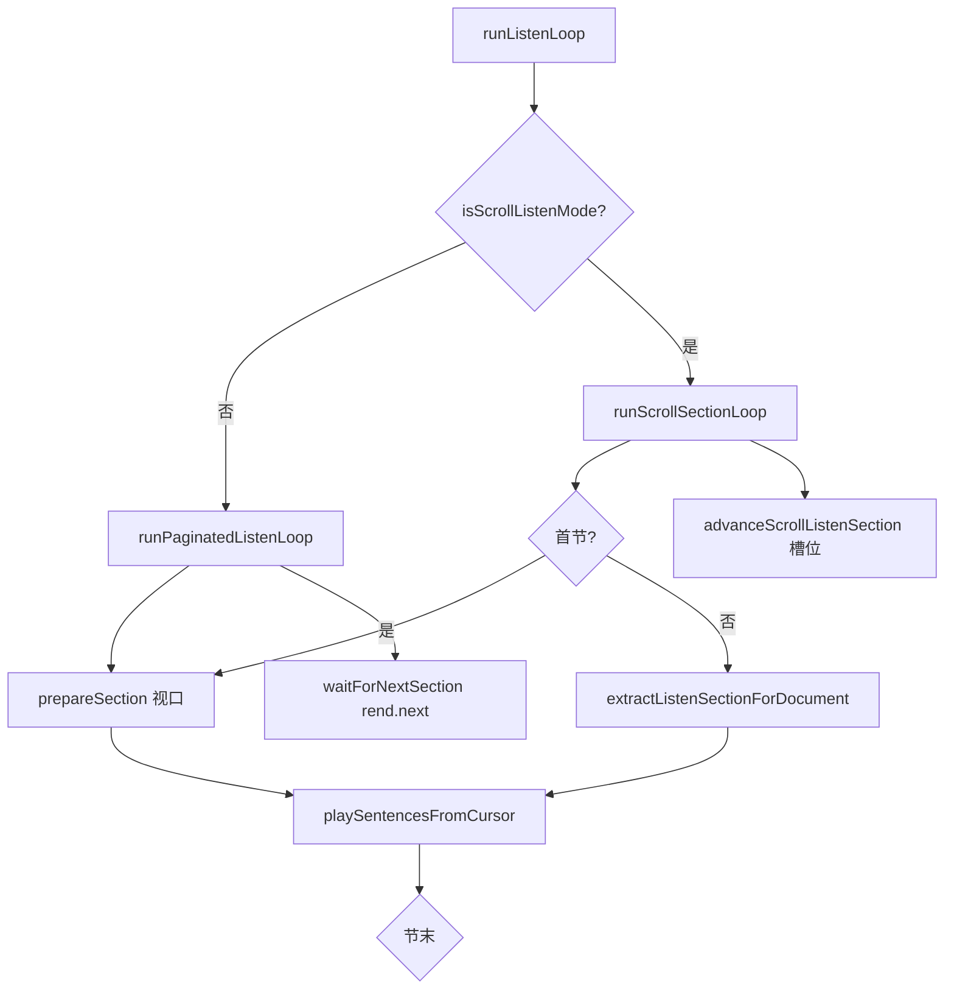

# EPUB 连续滚动听书 — 逐 iframe 节间衔接

## 延伸阅读

- [EPUB章节听书.md](./EPUB章节听书.md) — 听书 MVP 总览（改前单一 `waitForNextSection` 环）
- [EPUB阅读器设置滚动.md](./EPUB阅读器设置滚动.md) — 连续滚动阅读与 `continuous` manager
- [EPUB听书播放器栏.md](./EPUB听书播放器栏.md) — 播放条切句 / 倍速
- [连续滚动听书逐 iframe 节间衔接 — 影响点分析](../impact/EPUB滚动听书章节前进影响.md) — 回归矩阵与风险
- [连续滚动多 iframe 听书续播 — 实现思路](../ideas/epub/EPUB滚动多iframe听书.md) — 解题套路与 §8 逐点改动清单

## 1. 背景与目标

**用户视角**：阅读设置选 **连续滚动** 时，epub.js 会在同一滚动容器内同时挂载多个 `.epub-view`（部分为空槽、部分 `visibility:hidden` 预加载）。听书播完当前 iframe 内最后一句后，应 **自动衔接下方下一 iframe** 继续朗读，而不是误报「全书读完」或卡在 loading。

**技术问题（改前）**：

- `runListenLoop` 每轮 `prepareSection` → `extractVisibleListenSection`（视口）+ `waitForNextSection`（`rend.next()`）。
- 多 iframe 并存时，视口抽取与 spine `next()` **无法稳定对应「当前 iframe → 下一 iframe」**。
- 中间方案（合并句流、`rend.display`、播放中频繁 scroll）曾引入页面跳动、句数突变等回归。

**本轮定稿**：

- **分页模式**：逻辑与改前等价（`runPaginatedListenLoop` + `waitForNextSection`）。
- **连续滚动**：`runScrollSectionLoop` 逐 **document** 播放；节末 `advanceScrollListenSection` 按 DOM 槽位 scroll + `manager.check()` 加载下一 iframe。
- **切句 / 暂停**：`loopGenRef` 被取代时旧循环 **静默 return**，不再误 `stopInternal`；`goToSentence` 重入 `runListenLoop`。

## 2. 改动范围

| 路径 | 说明 |
| ---- | ---- |
| `apps/frontend/src/views/ebook/hooks/useEpubChapterListen.ts` | 拆分循环、`applySection` / `prepareSection`、`sectionDocRef`、`goToSentence` 修复 |
| `apps/frontend/src/views/ebook/utils/epubScrollListenAdvance.ts` | **新增** 槽位枚举与节间 advance |
| `apps/frontend/src/views/ebook/utils/epubListenChapter.ts` | **新增** `extractListenSectionForDocument`、`spineIndexForDocument` |

## 3. 实现思路

1. **模式分叉**：`isScrollListenMode(rend)` 检测 `getEpubScrollContainer(rend)` 是否存在；有则滚动听书，无则分页听书。
2. **首节**：仍 `prepareSection` → 视口 `extractVisibleListenSection` + CFI `resolveListenStartSentence`；`startFromCurrentPosition` 预写 `sectionDocRef`。
3. **后续节（滚动）**：`extractListenSectionForDocument(rend, sectionDoc)` 对 **指定 iframe document** 抽 `plain` / `outerRange`，避免视口漂移。
4. **节末衔接**：`advanceScrollListenSection` 在 `.epub-view` 列表中找当前 doc 的下一槽；已加载则直接返回；空槽则 scroll 到槽位并轮询 `manager.check()`（最多 5 轮 nudge）。
5. **刻意不做**：合并多 iframe 句流、`rend.display`、`rend.next()`（历史回归源）。
6. **gen 代际**：切句 / 暂停递增 `loopGenRef`；`playSentencesFromCursor` 返回 false 时，先判 `!isGenActive(gen)` 再判 `pausedRef`，避免误杀新播放。



## 4. 关键代码对比与注释

### 4.1 `runListenLoop`（`apps/frontend/src/views/ebook/hooks/useEpubChapterListen.ts`）

**对比范围**：听书主循环入口（改前为单一环；改后为模式分发 + 分页环抽离）。

**改动前** · `apps/frontend/src/views/ebook/hooks/useEpubChapterListen.ts`（基线 HEAD，约 L291–L340）

```typescript
// 用 useCallback 缓存主听书循环，避免子组件重复创建闭包
const runListenLoop = useCallback(
	// 异步入口：gen 为本次会话代际；opts.continueSections 控制是否跨节
	async (gen: number, opts?: { continueSections?: boolean }) => {
		// 取 epub.js Rendition；无则停止听书
		const rend = getRenditionRef.current();
		if (!rend) {
			stopInternal();
			return;
		}

		// 默认 true：节末继续下一 spine；resume 等场景可传入
		const continueSections = opts?.continueSections ?? true;

		// 无限循环：每轮一节（视口可见 section）
		for (;;) {
			// gen 已被 stop/pause/seek 递增则退出
			if (!isGenActive(gen)) return;

			// 从当前视口抽正文并写入 sectionRef / 播放条状态
			const ctx = prepareSection(rend, gen);
			if (!ctx) {
				Toast({
					type: 'warning',
					title: tRef.current('ebook.read.listenBook.emptySection'),
				});
				stopInternal();
				return;
			}

			// 从 sentenceCursorRef 起逐句 TTS
			const finished = await playSentencesFromCursor(ctx, gen);
			if (!finished) {
				// 暂停且 gen 仍有效：保留 paused 状态
				if (pausedRef.current && isGenActive(gen)) return;
				// 其它中断（含 gen 失效）直接 stop
				if (isGenActive(gen)) stopInternal();
				return;
			}

			// 单节播放模式或 gen 失效
			if (!continueSections || !isGenActive(gen)) {
				stopInternal();
				return;
			}

			// 下一节从第 0 句开始，不再解析 CFI
			sentenceCursorRef.current = 0;
			resolveStartCfiRef.current = false;
			sectionRef.current = null;

			// rend.next() 等待 relocated
			const advanced = await waitForNextSection(rend, () => isGenActive(gen));
			if (!advanced || !isGenActive(gen)) {
				Toast({
					type: 'info',
					title: tRef.current('ebook.read.listenBook.finished'),
				});
				stopInternal();
				return;
			}
		}
	},
	// 依赖：逐句播放、备节、停止
	[playSentencesFromCursor, prepareSection, stopInternal],
);
```

**改动后** · `apps/frontend/src/views/ebook/hooks/useEpubChapterListen.ts`（当前，约 L430–L444）

```typescript
// 用 useCallback 缓存主听书循环入口
const runListenLoop = useCallback(
	// 异步入口：gen 与可选 continueSections（分页环使用）
	async (gen: number, opts?: { continueSections?: boolean }) => {
		// 取 Rendition；缺失则停止
		const rend = getRenditionRef.current();
		if (!rend) {
			stopInternal();
			return;
		}
		// 连续滚动容器存在 → 逐 iframe 环
		if (isScrollListenMode(rend)) {
			await runScrollSectionLoop(gen);
			return;
		}
		// 分页模式 → 原 waitForNextSection 路径
		await runPaginatedListenLoop(gen, opts);
	},
	// 依赖两个子循环与 stop
	[runPaginatedListenLoop, runScrollSectionLoop, stopInternal],
);
```

**变更摘要**：改前单一循环混用视口抽取与 `waitForNextSection`；改后按 `isScrollListenMode` 分叉，分页逻辑抽至 `runPaginatedListenLoop`（体与改前环相同，仅修正 `!finished` 分支）。

---

### 4.2 `runScrollSectionLoop`（`apps/frontend/src/views/ebook/hooks/useEpubChapterListen.ts`）

**对比范围**：**纯新增** — 连续滚动逐 iframe 播放环。

**改动后** · `apps/frontend/src/views/ebook/hooks/useEpubChapterListen.ts`（当前，约 L278–L373）

```typescript
// 连续滚动专用：逐 iframe 播放，节末槽位 advance
const runScrollSectionLoop = useCallback(
	// 仅接收 gen；节间续播由内部 for(;;) 驱动
	async (gen: number) => {
		// 取 Rendition
		const rend = getRenditionRef.current();
		if (!rend) {
			stopInternal();
			return;
		}

		// 当前节 document；开播或 sync 时可能已预写
		let sectionDoc = sectionDocRef.current;
		// 首节或尚无 doc：走 prepareSection（视口 + CFI）
		let usePrepare = resolveStartCfiRef.current || !sectionDoc;

		// 节间循环
		for (;;) {
			if (!isGenActive(gen)) return;

			let ctx: SectionCtx | null;
			if (usePrepare) {
				// 视口抽取 + applySection
				ctx = prepareSection(rend);
				usePrepare = false;
				sectionDoc = sectionDocRef.current;
			} else {
				if (!sectionDoc) {
					stopInternal();
					return;
				}
				// 对已知 iframe document 抽节，不依赖视口
				const visible = extractListenSectionForDocument(rend, sectionDoc);
				if (!visible) {
					Toast({
						type: 'warning',
						title: tRef.current('ebook.read.listenBook.emptySection'),
					});
					stopInternal();
					return;
				}
				ctx = applySection(rend, visible);
			}

			if (!ctx) {
				if (!isGenActive(gen)) return;
				Toast({
					type: 'warning',
					title: tRef.current('ebook.read.listenBook.emptySection'),
				});
				stopInternal();
				return;
			}

			// 切句或首节需要居中滚动
			const scrollCenter =
				scrollSeekRef.current || sentenceCursorRef.current === 0;
			scrollSeekRef.current = false;

			const finished = await playSentencesFromCursor(ctx, gen, {
				scrollCenterOnFirst: scrollCenter,
			});
			if (!finished) {
				// gen 已被 seek/pause/stop 取代：静默退出
				if (!isGenActive(gen)) return;
				if (pausedRef.current) return;
				stopInternal();
				return;
			}

			if (!isGenActive(gen)) return;

			sectionDoc = sectionDocRef.current ?? sectionDoc;
			if (!sectionDoc) {
				stopInternal();
				return;
			}

			// 下一 iframe 从第 0 句起
			sentenceCursorRef.current = 0;
			resolveStartCfiRef.current = false;

			syncState({ status: 'loading' });

			// 槽位 scroll + manager.check 解析下一 document
			const nextDoc = await advanceScrollListenSection(rend, sectionDoc);
			if (!nextDoc || !isGenActive(gen)) {
				Toast({
					type: 'info',
					title: tRef.current('ebook.read.listenBook.finished'),
				});
				stopInternal();
				return;
			}

			sectionDoc = nextDoc;
			sectionDocRef.current = nextDoc;
		}
	},
	[
		applySection,
		playSentencesFromCursor,
		prepareSection,
		stopInternal,
		syncState,
	],
);
```

**变更摘要**：新增滚动模式主环；节间用 `advanceScrollListenSection` 替代 `waitForNextSection`；`!finished` 时先判 gen 失效，修复切句误 stop。

---

### 4.3 `prepareSection` / `applySection`（`apps/frontend/src/views/ebook/hooks/useEpubChapterListen.ts`）

**对比范围**：改前 `prepareSection` 一体；改后拆为 `applySection`（写 section 状态）+ `prepareSection`（视口抽取）。

**改动前** · `apps/frontend/src/views/ebook/hooks/useEpubChapterListen.ts`（基线 HEAD，约 L136–L182）

```typescript
// 从视口准备当前节上下文
const prepareSection = useCallback(
	// rend 与 gen：gen 用于 apply 末尾门禁
	(rend: Rendition, gen: number): SectionCtx | null => {
		const spineHint = getCurrentSpineIndexRef.current?.();
		const visible = extractVisibleListenSection(rend, spineHint);
		if (!visible) return null;

		const plain = visible.plain.trim();
		const sentences = buildSentenceOffsetSpans(plain);
		if (!sentences.length) return null;

		const sentenceRanges = indexChapterSentenceRanges(
			visible.outerRange,
			plain,
		);

		if (resolveStartCfiRef.current) {
			const cfi = getCurrentCfiRef.current()?.trim() ?? '';
			sentenceCursorRef.current = resolveListenStartSentence(
				rend,
				visible,
				cfi,
				sentenceRanges,
			);
			resolveStartCfiRef.current = false;
		}

		const ctx: SectionCtx = {
			plain,
			sentences,
			sentenceRanges,
			spineIndex: visible.spineIndex,
		};
		sectionRef.current = ctx;

		syncState({
			status: 'playing',
			spineIndex: visible.spineIndex,
			sentenceIndex: sentenceCursorRef.current,
			sentenceCount: sentences.length,
			sentenceLabels: buildSentenceLabels(plain, sentences),
			rate: rateRef.current,
		});

		// gen 失效时返回 null，曾导致 loading 卡死
		return isGenActive(gen) ? ctx : null;
	},
	[syncState],
);
```

**改动后** · `apps/frontend/src/views/ebook/hooks/useEpubChapterListen.ts`（当前，约 L155–L197）

```typescript
// 将 VisibleListenSection 写入 sectionRef 与播放条（不含视口抽取）
const applySection = useCallback(
	(rend: Rendition, visible: VisibleListenSection): SectionCtx | null => {
		const ctx = ctxFromVisible(visible);
		if (!ctx.sentences.length) return null;

		if (resolveStartCfiRef.current) {
			const cfi = getCurrentCfiRef.current()?.trim() ?? '';
			sentenceCursorRef.current = resolveListenStartSentence(
				rend,
				visible,
				cfi,
				ctx.sentenceRanges,
			);
			resolveStartCfiRef.current = false;
		}

		sectionRef.current = ctx;
		sectionDocRef.current =
			visible.outerRange.startContainer.ownerDocument;

		syncState({
			status: 'playing',
			spineIndex: visible.spineIndex,
			sentenceIndex: sentenceCursorRef.current,
			sentenceCount: ctx.sentences.length,
			sentenceLabels: buildSentenceLabels(ctx.plain, ctx.sentences),
			rate: rateRef.current,
		});

		return ctx;
	},
	[syncState],
);

// 视口路径：extractVisibleListenSection → applySection
const prepareSection = useCallback(
	(rend: Rendition): SectionCtx | null => {
		const spineHint = getCurrentSpineIndexRef.current?.();
		const visible = extractVisibleListenSection(rend, spineHint);
		if (!visible) return null;
		return applySection(rend, visible);
	},
	[applySection],
);
```

**变更摘要**：去掉 `isGenActive(gen)` 门禁；新增 `sectionDocRef`；`extractListenSectionForDocument` 路径复用 `applySection`。

---

### 4.4 `goToSentence`（`apps/frontend/src/views/ebook/hooks/useEpubChapterListen.ts`）

**对比范围**：播放条切句 / 分句菜单跳转。

**改动前** · `apps/frontend/src/views/ebook/hooks/useEpubChapterListen.ts`（基线 HEAD，约 L490–L515）

```typescript
// 跳转到指定句索引并从此句播放
const goToSentence = useCallback(
	(index: number) => {
		const ctx = sectionRef.current;
		if (!ctx?.sentences.length) return;

		const next = Math.min(ctx.sentences.length - 1, Math.max(0, index));
		sentenceCursorRef.current = next;
		loopGenRef.current += 1;
		stopAllPlayback();
		pausedRef.current = false;

		const gen = loopGenRef.current;
		syncState({
			sentenceIndex: next,
			sentenceCount: ctx.sentences.length,
			sentenceLabels: buildSentenceLabels(ctx.plain, ctx.sentences),
			status: 'playing',
		});

		const rend = getRenditionRef.current();
		if (!rend) return;

		void playSentencesFromCursor(ctx, gen, { scrollCenterOnFirst: true });
	},
	[playSentencesFromCursor, syncState],
);
```

**改动后** · `apps/frontend/src/views/ebook/hooks/useEpubChapterListen.ts`（当前，约 L598–L620）

```typescript
// 跳转到指定句索引并从此句播放
const goToSentence = useCallback(
	(index: number) => {
		const ctx = sectionRef.current;
		if (!ctx?.sentences.length) return;

		const next = Math.min(ctx.sentences.length - 1, Math.max(0, index));
		sentenceCursorRef.current = next;
		scrollSeekRef.current = true;
		stopAllPlayback();
		pausedRef.current = false;

		const gen = ++loopGenRef.current;
		syncState({
			sentenceIndex: next,
			sentenceCount: ctx.sentences.length,
			sentenceLabels: buildSentenceLabels(ctx.plain, ctx.sentences),
			status: 'playing',
		});

		void runListenLoop(gen);
	},
	[runListenLoop, syncState],
);
```

**变更摘要**：不再脱离主循环单独 `playSentencesFromCursor`；`++loopGenRef` 一次取代两次递增；`scrollSeekRef` 驱动节内首句居中；旧环 gen 失效后不再误 `stopInternal`。

---

### 4.5 `extractListenSectionForDocument`（`apps/frontend/src/views/ebook/utils/epubListenChapter.ts`）

**对比范围**：**纯新增** — 按指定 iframe `document` 抽听书节。

**改动后** · `apps/frontend/src/views/ebook/utils/epubListenChapter.ts`（当前，约 L157–L184）

```typescript
// 导出：连续滚动节间对已挂载 iframe 抽正文
export function extractListenSectionForDocument(
	// epub.js 渲染实例，用于 spineIndex 解析
	rend: Rendition,
	// 目标 iframe 的 contentDocument
	doc: Document,
): VisibleListenSection | null {
	// 无 body 无法抽正文
	if (!doc.body) return null;

	// innerText 得 plain，与 TTS 同源；stripMarkdownForTts 去 md
	let plain = stripMarkdownForTts(
		doc.body.innerText ?? doc.body.textContent ?? '',
	).trim();
	// 空章不可听
	if (!plain) return null;
	// 超长截断，与 extractVisibleListenSection 一致
	if (plain.length > MAX_PLAIN_CHARS) {
		plain = plain.slice(0, MAX_PLAIN_CHARS);
	}

	// 节级 outerRange 供 TreeWalker 句 Range 索引
	const outerRange = doc.createRange();
	try {
		outerRange.selectNodeContents(doc.body);
	} catch {
		return null;
	}

	// 组装 VisibleListenSection，spineIndex 来自 document 映射
	return {
		plain,
		outerRange,
		spineIndex: spineIndexForDocument(rend, doc),
	};
}
```

**变更摘要**：与 `extractVisibleListenSection` 同源 innerText 路径，但 **不依赖视口**，输入为已知 `sectionDoc`；`spineIndexForDocument` 优先 rendition view.index，fallback canonical href。

---

### 4.6 `advanceScrollListenSection`（`apps/frontend/src/views/ebook/utils/epubScrollListenAdvance.ts`）

**对比范围**：**纯新增** — 节末解析下一 iframe document。

**改动后** · `apps/frontend/src/views/ebook/utils/epubScrollListenAdvance.ts`（当前，约 L136–L175）

```typescript
// 判断是否为连续滚动听书模式（有 scroll 容器即 true）
export function isScrollListenMode(rend: Rendition): boolean {
	// getEpubScrollContainer 非 null 表示 scrolled + continuous
	return getEpubScrollContainer(rend) != null;
}

// 当前 iframe 播完后，解析并挂载下一 iframe 的 document
export async function advanceScrollListenSection(
	rend: Rendition,
	currentDoc: Document,
): Promise<Document | null> {
	// 枚举当前 DOM 中所有 .epub-view 槽位
	let slots = listEpubViewSlots(rend);
	// 若下一槽已有 loaded doc，直接返回
	const ready = nextLoadedDoc(slots, currentDoc);
	if (ready) return ready;

	// 定位当前 doc 在槽位列表中的索引
	let slotIdx = findSlotIndex(slots, currentDoc);
	// 找不到时 fallback 到最后一个有 doc 的槽（ponytail: 启发式）
	if (slotIdx < 0) {
		for (let i = slots.length - 1; i >= 0; i -= 1) {
			if (slots[i]!.doc) {
				slotIdx = i;
				break;
			}
		}
	}

	// 最多 ADVANCE_ROUNDS 轮：尝试加载 + nudge scroll
	for (let round = 0; round < ADVANCE_ROUNDS; round += 1) {
		slots = listEpubViewSlots(rend);
		for (let i = slotIdx + 1; i < slots.length; i += 1) {
			// 对空槽 scroll + manager.check 直到 iframe 有正文
			const doc = await ensureSlotDocument(rend, slots[i]!);
			if (doc && !sameDoc(doc, currentDoc)) return doc;
		}

		// 本轮未成功：向下 scroll 一屏促 continuous manager 加载
		const host = getEpubScrollContainer(rend);
		if (host) {
			host.scrollTop += Math.max(200, Math.floor(host.clientHeight * 0.9));
			await invokeManagerCheck(rend);
			await pauseForLayout();
		}
	}

	// 无下一节可读
	return null;
}
```

**变更摘要**：先查已加载下一 doc；否则对空槽 `ensureSlotDocument`（scrollTo + 最多 8 次 check）；5 轮 nudge scroll 仍失败则 null → Toast 全书读完。内部 `listEpubViewSlots` / `ensureSlotDocument` 见同文件 L51–L111。

## 5. 兼容性与影响

| 场景 | 兼容性 |
| ---- | ------ |
| 分页听书 | **等价** — `runPaginatedListenLoop` 保留 `waitForNextSection` |
| 连续滚动听书 | **行为增强** — 节间 iframe 衔接；空槽失败仍可能误报读完（见影响点文 §4） |
| 播放条 API | **不变** — hook 导出字段未改 |
| 听当前 / 互斥 | **不变** — 未改 `useEbookQuoteListen` |
| `playSentencesFromCursor` | **不变** — TTS / 预取 / 高亮逻辑未改 |

## 6. 相关源码路径

| 说明 | 路径 |
| ---- | ---- |
| 听书 Hook | `apps/frontend/src/views/ebook/hooks/useEpubChapterListen.ts` |
| 滚动节间 advance | `apps/frontend/src/views/ebook/utils/epubScrollListenAdvance.ts` |
| 正文抽取 | `apps/frontend/src/views/ebook/utils/epubListenChapter.ts` |
| 滚动容器 | `apps/frontend/src/views/ebook/utils/epubScrolledNav.ts` |
| 影响点分析 | `docs/impact/EPUB滚动听书章节前进影响.md` |

---

（若与仓库最新源码不一致，以源码为准）
