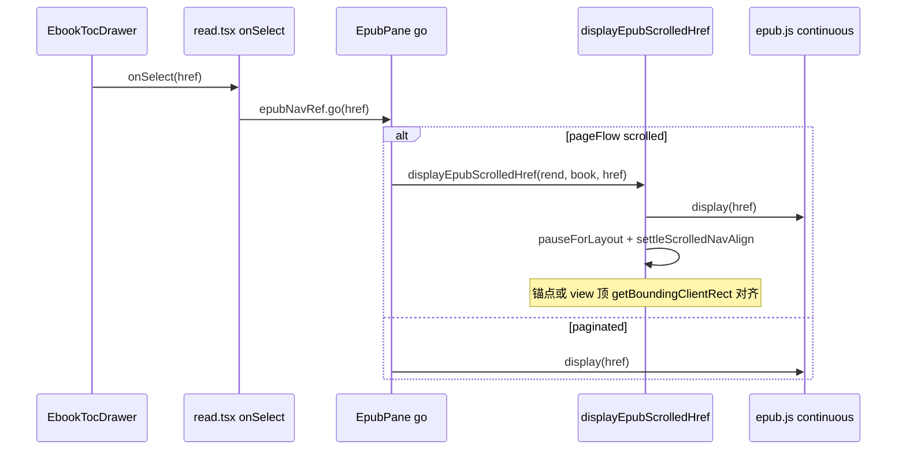

# EPUB 连续滚动：目录跳转章首对齐

> **文档角色**：修复 Web 端 **连续滚动** 模式下点击 **书籍目录** 后定位不准（滚到章末、上一章末尾顶入视口）的增量专题。  
> **延伸阅读**：[EPUB阅读器设置滚动.md](./EPUB阅读器设置滚动.md)（连续滚动 manager 与边界衔接）、[电子书目录激活高亮.md](./电子书目录激活高亮.md)（目录高亮）、[EPUB滚动卡顿性能.md](../ideas/epub/EPUB滚动卡顿性能.md)（relocated 批注 patch 时序）。**后续**：目录 CFI 跳转与 `go` 返回 destCFI 见 [EPUB目录CFI导航.md](./EPUB目录CFI导航.md)（替代本文 `EpubPane.go` 接线）。

## 1. 背景与目标

### 1.1 现象

- **Web 浏览器** 在阅读设置为 **连续滚动**（`pageFlow: 'scrolled'` + epub.js `continuous` manager）时，从 **书籍目录** 点某一章，常见：
  - 滚到该章 **底部** 而非章首；
  - 或短暂对齐后又被 **上一章末尾**（如【知识点】、流程图）顶入视口，目标章标题被挤到屏幕中下方。
- **桌面端（Tauri）** 若使用 **分页翻页** 或布局时序不同，可能不易复现；两端共用源码，差异来自 **排版模式** 与 **浏览器 scroll anchoring / 异步 layout**。

### 1.2 根因（归纳）

| 因素 | 说明 |
|------|------|
| 仅 `rend.display(href)` | continuous 在 `display` 后会 `fill()` → `check()` **prepend 邻章**，iframe 高度异步变化 |
| 单次 `offsetTop` | 测量早于 iframe 展开，scroll 不足 |
| 错误 fallback | 文内 **第一个「第×章」** 或 DOM 中 **第一个 `.epub-view`**（实为上一章）导致对齐目标错误 |
| 布局后续扰动 | 想法/划线 `relocated` patch（~120ms）、邻章 trim 未执行时 scroll 未再校正 |
| `overflow-anchor` | 浏览器默认锚定会在 DOM 上方增高时调整 `scrollTop` |

### 1.3 目标

- 连续滚动目录跳转后，**章标题或 `#fragment` 锚点** 稳定对齐阅读容器顶边（保留 `SCROLL_EDGE_PX` 边距）。
- **分页模式** 行为不变，仍 `rend.display(href)`。
- 不引入新依赖；最小 diff 落在 `epubScrolledNav.ts` + `EpubPane` 接线 + 滚动容器 CSS。

## 2. 改动范围

| 路径 | 说明 |
|------|------|
| `apps/frontend/src/views/ebook/utils/epub/reader/epubScrolledNav.ts` | 新增 `displayEpubScrolledHref` 及目录对齐辅助函数 |
| `apps/frontend/src/views/ebook/components/reader/EpubPane.tsx` | `go(href)` 在连续滚动时改调 `displayEpubScrolledHref` |
| `apps/frontend/src/views/ebook/utils/common/readerScrollbar.ts` | `.epub-container` / `.epub-view` 关闭 `overflow-anchor` |

## 3. 实现思路

1. **分层跳转**：`EpubPane` 的 `NavApi.go` 仅在 `pageFlow === 'scrolled'` 且有 `Book` 实例时走新路径；否则保持 epub.js 默认 `display`。
2. **`display(href)` 后再对齐**：不替换 epub.js 的 spine/fragment 解析，只在 `display` resolve 后按 **视口坐标** 校正 scroll。
3. **对齐目标选择（关键）**：
   - href **含 `#`**：仅在 iframe 内查找 **锚点元素**（`id` / `a[name]`）；找不到则 **不对齐**（避免误滚）。
   - href **无 fragment**：对齐目标 spine 对应 **`.epub-view` 顶边**（隐藏 prepend 的上一章 iframe）。
   - **禁止** 用文内第一个 `h1/h2` 或第一个 `.epub-view` 作 fallback（同文件多章时会滚到上一章标题）。
4. **`getBoundingClientRect` + 增量 scroll**：`scrolledNavAlignDelta` 计算目标顶与容器顶的差值，写 `container.scrollTop += delta`（比一次性 `offsetTop` 更抗 layout 抖动）。
5. **多次 settle**：在 0 / 100 / 220ms 重复解析 view 与对齐；第 2 轮调用 `manager.trim()` 去掉视口外邻章 view 后再对齐一次。
6. **CSS**：Tailwind 后代选择器为 `.epub-container`、`.epub-view` 设置 `overflow-anchor: none`。

### 3.1 未采用方案

- **目录跳转临时改分页 manager**：切换成本高，破坏连续滚动 UX。
- **跳转后再 `manager.check()`**：易触发 prepend，与对齐打架。
- **按文内「第×章」正则选标题**：同 spine 多章 xhtml 会选中错误章节。

## 4. 关键代码对比与注释

### 4.1 `EpubPane` 导航 `go(href)`（`apps/frontend/src/views/ebook/components/reader/EpubPane.tsx`）

**对比范围**：`onReady` 回调内 `NavApi.go` 完整箭头函数。

**改动前** · `apps/frontend/src/views/ebook/components/reader/EpubPane.tsx`（基线，约 L482–L485）

```typescript
// 目录或外链跳转：直接交给 epub.js display，连续滚动下易留章末或邻章顶入视口
go: async (href) => {
	// rendition 尚未就绪则直接返回
	if (!rendRef.current) return;
	// 不区分分页/连续滚动，统一 display
	await rendRef.current.display(href);
},
```

**改动后** · `apps/frontend/src/views/ebook/components/reader/EpubPane.tsx`（当前，约 L485–L497）

```typescript
// 目录或外链跳转：连续滚动走 displayEpubScrolledHref，分页仍 display
go: async (href) => {
	// 缓存当前 rendition 与 book，避免闭包内 ref 中途被清空
	const rend = rendRef.current;
	// spine 索引解析依赖 Book 实例
	const spineBook = bookRef.current;
	// rendition 未就绪则无法跳转
	if (!rend) return;
	// 连续滚动且 book 可用：display 后再按视口坐标对齐章首/锚点
	if (
		readerSettingsRef.current.pageFlow === 'scrolled' &&
		spineBook
	) {
		// 内部 await display + settle 对齐
		await displayEpubScrolledHref(rend, spineBook, href);
		// 连续滚动路径结束，不再 fall through
		return;
	}
	// 分页模式或 book 未就绪：保持 epub.js 默认 display
	await rend.display(href);
},
```

**变更摘要**：连续滚动目录跳转从「仅 `display`」改为「`displayEpubScrolledHref` + 章首对齐」；分页模式不变。

---

### 4.2 `displayEpubScrolledHref`（`apps/frontend/src/views/ebook/utils/epub/reader/epubScrolledNav.ts`）

**对比范围**：纯新增导出函数（基线无对应符号）。

**改动后** · `apps/frontend/src/views/ebook/utils/epub/reader/epubScrolledNav.ts`（当前，约 L239–L253）

```typescript
// 连续滚动模式下目录/外链 href 跳转的对外入口
export async function displayEpubScrolledHref(
	// epub.js Rendition 实例
	rend: Rendition,
	// epub.js Book，用于 spine 索引与 view 解析
	book: Book,
	// 目录 nav 项 href，可含 #fragment
	href: string,
): Promise<void> {
	// 先走 epub.js 原生 display（含 fragment moveTo）
	await rend.display(href);
	// 非连续滚动或 manager 未挂载容器时无需后续对齐
	if (!getEpubScrollContainer(rend)) return;

	// 等待两帧，让 display/fill 首轮 layout 落地
	await pauseForLayout();
	// 多次按视口坐标校正 + 中途 trim 邻章 view
	await settleScrolledNavAlign(rend, book, href);
}
```

---

### 4.3 `alignScrolledNavTarget`（`apps/frontend/src/views/ebook/utils/epub/reader/epubScrolledNav.ts`）

**对比范围**：纯新增内部函数，单次对齐决策。

**改动后** · `apps/frontend/src/views/ebook/utils/epub/reader/epubScrolledNav.ts`（当前，约 L198–L210）

```typescript
// 根据 href 类型选择锚点对齐或 view 顶对齐
function alignScrolledNavTarget(
	// Rendition，用于取 scroll 容器
	rend: Rendition,
	// 目录 href，判断是否含 fragment
	href: string,
	// 目标 spine 对应的 .epub-view，可为 null
	viewEl: HTMLElement | null,
): boolean {
	// 是否带 #fragment，决定无锚点时的策略
	const hasFragment = href.includes('#');
	// 优先：在所有已挂载 view 的 iframe 内找锚点
	const anchor = findNavAnchor(rend, viewEl, href);
	// 找到锚点则把锚点顶边对齐容器顶
	if (anchor) return alignElementTopToContainer(rend, anchor);
	// 有 fragment 但锚点未渲染：拒绝 fallback，避免滚错
	if (hasFragment) return false;
	// 无 view 则无法做 view 顶对齐
	if (!viewEl) return false;

	// 无 fragment：对齐 .epub-view 顶，隐藏 prepend 的上一章
	return alignViewTopToContainer(rend, viewEl);
}
```

---

### 4.4 `settleScrolledNavAlign`（`apps/frontend/src/views/ebook/utils/epub/reader/epubScrolledNav.ts`）

**对比范围**：纯新增；固定次数 settle + 中途 trim。

**改动后** · `apps/frontend/src/views/ebook/utils/epub/reader/epubScrolledNav.ts`（当前，约 L212–L237）

```typescript
// ponytail: 固定次数校正 + trim；upgrade: ResizeObserver 直到 targetTop 稳定
const NAV_ALIGN_SETTLE_MS = [0, 100, 220] as const;

// 在 layout 与批注 patch 时序内多次对齐
async function settleScrolledNavAlign(
	// Rendition
	rend: Rendition,
	// Book，解析 spine view
	book: Book,
	// 目录 href
	href: string,
): Promise<void> {
	// 遍历预设延迟点（0/100/220ms）
	for (let i = 0; i < NAV_ALIGN_SETTLE_MS.length; i += 1) {
		// 当前轮次延迟毫秒数
		const delay = NAV_ALIGN_SETTLE_MS[i]!;
		// 非首轮先 sleep，等待 iframe 增高与 patch
		if (delay > 0) {
			await new Promise<void>((resolve) => {
				window.setTimeout(resolve, delay);
			});
		}
		// 双 rAF 等待 layout
		await pauseForLayout();
		// 解析当前应使用的 .epub-view
		const viewEl = await resolveViewElAfterDisplay(rend, book, href);
		// 执行一轮对齐
		alignScrolledNavTarget(rend, href, viewEl);
		// 第二轮（100ms）后 trim 视口外 view 并再对齐
		if (i === 1) {
			await trimContinuousViews(rend);
			await pauseForLayout();
			const trimmedView = await resolveViewElAfterDisplay(rend, book, href);
			alignScrolledNavTarget(rend, href, trimmedView);
		}
	}
}
```

---

### 4.5 `READER_NATIVE_SCROLLBAR_EPUB_CONTAINER`（`apps/frontend/src/views/ebook/utils/common/readerScrollbar.ts`）

**对比范围**：常量数组前两行新增。

**改动前** · `apps/frontend/src/views/ebook/utils/common/readerScrollbar.ts`（基线）

```typescript
/** epub.js 滚动发生在内部 .epub-container 上 */
export const READER_NATIVE_SCROLLBAR_EPUB_CONTAINER = [
	'[&_.epub-container]:[scrollbar-width:thin]',
	// ... 其余滚动条美化 class 未改动
] as const;
```

**改动后** · `apps/frontend/src/views/ebook/utils/common/readerScrollbar.ts`（当前）

```typescript
/** epub.js 滚动发生在内部 .epub-container 上 */
export const READER_NATIVE_SCROLLBAR_EPUB_CONTAINER = [
	// 关闭浏览器 scroll anchoring，减轻邻章 prepend 时 scroll 被自动顶偏
	'[&_.epub-container]:[overflow-anchor:none]',
	// 各 .epub-view 槽位同样关闭锚定
	'[&_.epub-view]:[overflow-anchor:none]',
	'[&_.epub-container]:[scrollbar-width:thin]',
	// ... 其余滚动条美化 class 未改动
] as const;
```

**变更摘要**：仅增加 `overflow-anchor: none`，滚动条样式不变。

## 5. 数据流（目录点击）



## 6. 兼容性与影响

| 场景 | 影响 |
|------|------|
| 分页翻页 `paginated` | **无**，仍 `rend.display(href)` |
| PDF 目录 | **无**，走 `PdfPane` |
| 听书 `syncToCurrentView` | **无**，目录选中后逻辑未改 |
| 引用 `scrollEpubCfiIntoView` | **无**，独立路径 |
| 边缘 wheel 衔接 | **无**，`attachEpubScrolledEdgeNav` 未改 |

## 7. 风险与回归清单

- [ ] Web + **连续滚动**：点目录各章，章标题在视口 **顶边**（非章末、非上一章【知识点】）。
- [ ] 同 xhtml 多章（href 带 `#`）：对齐 **锚点** 章节，而非文件中更早的「第×章」。
- [ ] **分页** 模式目录跳转仍正常。
- [ ] 听书进行中目录跳转 + `syncToCurrentView` 仍可用。
- [ ] 公开书想法 patch 后滚动位置仍稳定（220ms settle 覆盖 relocated patch）。

## 8. 相关源码路径

| 说明 | 路径 |
|------|------|
| 目录对齐主逻辑 | `apps/frontend/src/views/ebook/utils/epub/reader/epubScrolledNav.ts` |
| NavApi 接线 | `apps/frontend/src/views/ebook/components/reader/EpubPane.tsx` |
| 滚动容器 CSS | `apps/frontend/src/views/ebook/utils/common/readerScrollbar.ts` |
| 目录抽屉 | `apps/frontend/src/views/ebook/components/layout/EbookTocDrawer.tsx` |
| spine 索引 | `apps/frontend/src/views/ebook/utils/epub/reader/epubSpineIndex.ts` |

---

（若与仓库最新源码不一致，以源码为准）
