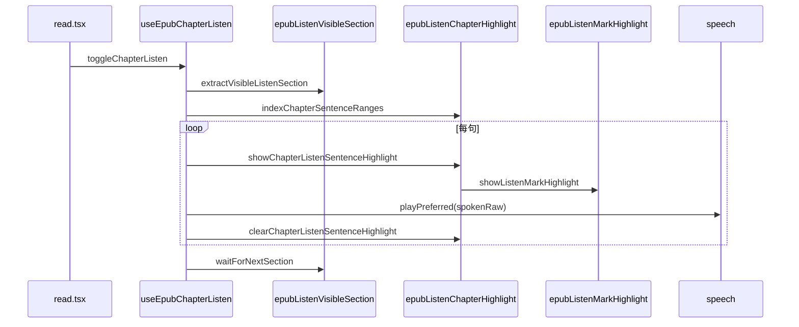

# EPUB 边听边读（全书听书 MVP）

## 延伸阅读

- [EPUB 引用「听当前」](EPUB引用听书.md) — 选区朗读、TTS 复用
- [EPUB 听当前逐句播放背景](EPUB听书句背景.md) — 「听当前」plain 偏移与 `onCadenceChunk`
- [EPUB 听当前 host 浮层](EPUB听书宿主覆盖层.md) — 「听当前」绘制层（听书**不**走 overlay session）
- [EPUB 听当前播放自动跟随与回位 FAB](EPUB听书自动跟随浮动按钮.md) — `autoFollow`、FAB（听书可共用 FAB 状态）
- [EPUB 听书播放条：分句菜单与倍速增强](EPUB听书播放器栏.md) — 分句跳转、倍速 3×、TTS `playbackRate`
- [连续滚动听书逐 iframe 节间衔接 — 影响点分析](../impact/EPUB滚动听书章节前进影响.md) — `runScrollSectionLoop` / 分页分叉回归范围
- [连续滚动听书逐 iframe 节间衔接](./EPUB滚动听书章节前进影响.md) — 实现思路与改动前后代码对比
- [连续滚动多 iframe 听书续播 — 实现思路](../ideas/epub/EPUB滚动多iframe听书.md) — 问题根因、逐点改动、类似场景通用套路

## 1. 背景与目标

**用户视角**：阅读 EPUB 时，从**当前可见章节**连续听下去——底部播放条、句级淡黄背景、节末自动下一 spine；与「听当前」互斥。

**定稿原则（本轮迭代结论）**：

| 维度 | 定稿 | 迭代中废弃（勿再混用） |
|------|------|------------------------|
| 正文抽取 | `body.innerText` + `stripMarkdownForTts` | DOM 句表 `buildDomSentenceIndex` 作主路径 |
| 句界 | `buildSentenceOffsetSpans(plain)` | 与 TTS 不同源的 compact 流 |
| TTS | 直接 `playPreferred(spokenRaw)` | 每句 `beginPlaybackSession` / `playbackGeneration` 复用 |
| iframe 发现 | `getRenditionViewsList` + 滚动容器 iframe 扫描 | `for…of rend.views()`（epub.js 非数组，会抛错→误报空章） |
| 播放背景 | `epubListenMarkHighlight.showListenMarkHighlight` | 听书走 `beginEpubListenOverlaySession`；`window.find` 逐句搜索（卡死） |

**未纳入（V1）**：PDF 听书、Whispersync 级进度、词级卡拉 OK、定时关闭。

## 2. 改动范围

| 路径 | 说明 |
| ---- | ---- |
| `apps/frontend/src/views/ebook/hooks/useEpubChapterListen.ts` | **新增** 听书状态机、播放循环 |
| `apps/frontend/src/views/ebook/utils/epubListenVisibleSection.ts` | **新增** 视口 iframe + innerText 抽正文 |
| `apps/frontend/src/views/ebook/utils/epubListenChapterHighlight.ts` | **新增** TreeWalker 句 Range 索引 + 高亮入口 |
| `apps/frontend/src/views/ebook/utils/epubListenMarkHighlight.ts` | **新增** 听书专用 SVG/iframe 单层背景 |
| `apps/frontend/src/views/ebook/utils/epubListenController.ts` | **新增** quote/chapter 互斥 stop |
| `apps/frontend/src/views/ebook/components/EpubListenPlayerBar.tsx` | **新增** 底部播放条 |
| `apps/frontend/src/views/ebook/utils/epubRangeGeometry.ts` | `getRenditionViewsList` |
| `apps/frontend/src/views/ebook/read.tsx` | 顶栏听书、PlayerBar、`syncToCurrentView` |
| `apps/frontend/src/views/ebook/hooks/useEbookQuoteListen.ts` | `invokeStopChapterListen`、互斥注册 |
| `apps/frontend/src/i18n/locales/zh-CN.ts`、`en-US.ts` | `ebook.read.listenBook.*` |

## 3. 实现思路

1. **正文**：`extractVisibleListenSection` 在 `getContents` / `views.all()` / 滚动容器 iframe 中取**有字** document；`innerText` 得 `plain`，与 TTS 同源。
2. **句表**：`buildSentenceOffsetSpans(plain)` 得 `{start,end}`；`spokenRaw = stripMarkdownForTts(plain.slice(...))`。
3. **句 DOM**：节级一次 `indexChapterSentenceRanges`（TreeWalker + 空白归一化顺序 `indexOf`）；播放时**零 DOM 搜索**。
4. **播放**：`loopGenRef` 代际取消；`prepareSection` → `playSentencesFromCursor` → `waitForNextSection`。
5. **背景**：有 `sentenceRanges[i]` 时 `showListenMarkHighlight`；句末 `clearListenMarkHighlight`；**无 Range 仍播 TTS**。
6. **互斥**：`registerQuoteListenStop` / `registerChapterListenStop` 模块级回调。

## 4. 数据流



## 5. 关键代码对比与注释

### 5.1 `getRenditionViewsList`（`apps/frontend/src/views/ebook/utils/epubRangeGeometry.ts`）

**对比范围**：epub.js `views()` 展开为数组（**纯新增**；下方「改动前」为迭代中错误范式）。

**改动前** · 错误范式（`listIframeDocuments` 内，不可迭代）

```typescript
// 将 rend.views() 当作数组使用（实际为 Views 集合对象）
const views = (rend as Rendition & { views?: () => EpubView[] }).views?.() as
	| EpubView[]
	| undefined;
// views.length 可能 > 0，但 for…of 抛 TypeError: not iterable
if (views?.length) {
	for (const view of views) {
		const doc = view.contents?.document;
		if (doc?.body) docs.add(doc);
	}
}
```

**改动后** · `apps/frontend/src/views/ebook/utils/epubRangeGeometry.ts`（当前，约 L36–L48）

```typescript
// epub.js 单节 view 的最小类型（index + iframe document）
export type EpubRenditionView = {
	index?: number;
	contents?: { document?: Document };
};

// 将 rend.views() 统一展开为可遍历数组
export function getRenditionViewsList(rend?: Rendition): EpubRenditionView[] {
	// 无 rendition 时返回空列表
	if (!rend) return [];
	// 原始值可能是 Views 实例或空
	const raw = rend.views();
	if (!raw) return [];
	// 少数环境已是数组则直接返回
	if (Array.isArray(raw)) return raw as EpubRenditionView[];
	// 连续滚动下须调用 .all() 取 _views 数组
	return (raw as { all?: () => EpubRenditionView[] }).all?.() ?? [];
}
```

**变更摘要**：修复听书入口对 `views()` 的错误迭代，避免 `extractVisibleListenSection` 抛错后被 catch 误报「本章暂无文字可读」。

---

### 5.2 `extractVisibleListenSection`（`apps/frontend/src/views/ebook/utils/epubListenVisibleSection.ts`）

**对比范围**：导出函数全定义（**纯新增**）。

**改动后** · 当前，约 L99–L126

```typescript
// 同步读取当前可见 spine 节：plain + outerRange + spineIndex
export function extractVisibleListenSection(
	rend: Rendition,
	spineHint?: number,
): VisibleListenSection | null {
	// 视口中心 / spineHint 选定有正文的 iframe document
	const doc = pickDocumentForListen(rend, spineHint);
	// 无 body 无法抽正文
	if (!doc?.body) return null;

	// 与 TTS 同源的 plain（innerText 路径，不用 DOM 句表）
	let plain = stripMarkdownForTts(
		doc.body.innerText ?? doc.body.textContent ?? '',
	).trim();
	// 空章直接失败
	if (!plain) return null;
	// ponytail: 单节 plain 上限
	if (plain.length > MAX_PLAIN_CHARS) {
		plain = plain.slice(0, MAX_PLAIN_CHARS);
	}

	// 节级 outerRange 供句 Range 索引
	const outerRange = doc.createRange();
	try {
		outerRange.selectNodeContents(doc.body);
	} catch {
		return null;
	}

	return {
		plain,
		outerRange,
		spineIndex: spineIndexFromRendition(rend, spineHint),
	};
}
```

---

### 5.3 `showChapterListenSentenceHighlight`（`apps/frontend/src/views/ebook/utils/epubListenChapterHighlight.ts`）

**对比范围**：句级高亮入口（听书背景绘制路径切换）。

**改动前** · 迭代方案（overlay session，约 L90–L100）

```typescript
// 与「听当前」相同：用 selectionRange 建 overlay session
export function showChapterListenSentenceHighlight(
	rend: Rendition,
	range: Range,
): void {
	const snapped =
		normalizeSelectionRangeForEpub(range.cloneRange()) ?? range.cloneRange();
	const plain = stripMarkdownForTts(snapped.toString()).trim();
	if (!plain) return;

	beginEpubListenOverlaySession(rend, plain, { selectionRange: snapped });
	showEpubListenPlainSpan(0, plain.length, 0);
}
```

**改动后** · 当前，约 L126–L133

```typescript
// 听书句背景：直接绘制 mark 浮层，不经 quote overlay session
export function showChapterListenSentenceHighlight(
	rend: Rendition,
	range: Range,
): void {
	// 与划线/CFI 一致的 Range 规范化
	const snapped =
		normalizeSelectionRangeForEpub(range.cloneRange()) ?? range.cloneRange();
	// 单例浮层：换句先清再绘，颜色 rgba(251,231,128,0.28)
	showListenMarkHighlight(rend, snapped);
}
```

**变更摘要**：听书背景与用户划线、听当前 overlay 解耦；播放逻辑仍用 innerText + `playPreferred`，不依赖 overlay plain 映射。

---

### 5.4 `playSentencesFromCursor`（`apps/frontend/src/views/ebook/hooks/useEpubChapterListen.ts`）

**对比范围**：`useCallback` 内完整异步播放循环（**纯新增**）。

**改动后** · 当前，约 L166–L214

```typescript
	const playSentencesFromCursor = useCallback(
		async (ctx: SectionCtx, gen: number): Promise<boolean> => {
			// 节上下文：plain、句偏移表、预建 DOM Range 数组
			const { plain, sentences, sentenceRanges } = ctx;
			// 当前 rendition，用于高亮
			const rend = getRenditionRef.current();

			for (let si = sentenceCursorRef.current; si < sentences.length; si += 1) {
				// 代际或暂停则中断循环
				if (!isGenActive(gen) || pausedRef.current) return false;

				const sent = sentences[si]!;
				// 与 TTS 完全一致的朗读文本
				const spokenRaw = stripMarkdownForTts(
					plain.slice(sent.start, sent.end),
				);
				// 空句跳过
				if (!spokenRaw.trim()) continue;

				sentenceCursorRef.current = si;
				syncState({
					status: 'playing',
					sentenceIndex: si,
					sentenceCount: sentences.length,
				});

				const domRange = sentenceRanges[si];
				// 仅当节级索引命中 DOM 时才绘制背景
				const hasHighlight = !!(rend && domRange);
				if (hasHighlight) {
					showChapterListenSentenceHighlight(rend, domRange);
				}

				try {
					await playPreferred(spokenRaw, {
						speak: { rate: rateRef.current },
					});
				} catch {
					if (isGenActive(gen)) {
						Toast({
							type: 'warning',
							title: tRef.current('englishLearning.tts.unsupported'),
						});
					}
					return false;
				}

				if (!isGenActive(gen) || pausedRef.current) return false;
				if (hasHighlight) clearChapterListenSentenceHighlight(rend);
			}

			return isGenActive(gen);
		},
		[syncState],
	);
```

---

### 5.5 `indexChapterSentenceRanges`（`apps/frontend/src/views/ebook/utils/epubListenChapterHighlight.ts`）

**对比范围**：导出函数全定义（**纯新增**；节选核心映射循环，helpers 未改动）。

**改动后** · 当前，约 L84–L124

```typescript
// 节级一次遍历：为每句预建 DOM Range（顺序匹配 TTS 句文本）
export function indexChapterSentenceRanges(
	outerRange: Range,
	plain: string,
): Array<Range | null> {
	const trimmed = plain.trim();
	const sentences = buildSentenceOffsetSpans(trimmed);
	if (!sentences.length) return [];

	const body = bodyFromOuter(outerRange);
	if (!body) return sentences.map(() => null);

	const positions = listBodyTextPositions(body);
	if (!positions.length) return sentences.map(() => null);

	const { norm, map } = buildNormStream(positions);
	if (!norm) return sentences.map(() => null);

	let cursor = 0;
	return sentences.map((sent) => {
		const needle = normForMatch(trimmed.slice(sent.start, sent.end));
		if (!needle) return null;

		let idx = norm.indexOf(needle, cursor);
		if (idx < 0 && needle.length >= 8) {
			const head = needle.slice(0, Math.min(24, needle.length));
			idx = norm.indexOf(head, cursor);
			if (idx >= 0 && norm.slice(idx, idx + needle.length) !== needle) {
				idx = -1;
			}
		}
		if (idx < 0) return null;

		const startPi = map[idx];
		const endPi = map[idx + needle.length - 1];
		if (startPi == null || endPi == null) return null;

		const range = rangeFromPosSpan(positions, startPi, endPi);
		if (range) cursor = idx + needle.length;
		return range;
	});
}
```

---

### 5.6 `useEbookQuoteListen` 互斥（`apps/frontend/src/views/ebook/hooks/useEbookQuoteListen.ts`）

**对比范围**：`toggleListen` 启动听当前前停止听书（摘录）。

**改动前** · 基线（无听书互斥）

```typescript
			if (playingKey === key) {
				stopAllPlayback();
				clearEpubListenSegmentOverlay();
				onListenSessionEnd?.();
				setPlayingKey(null);
				return;
			}
			if (!isPlaybackAvailable()) {
```

**改动后** · 当前

```typescript
			if (playingKey === key) {
				stopAllPlayback();
				clearEpubListenSegmentOverlay();
				onListenSessionEnd?.();
				setPlayingKey(null);
				return;
			}
			// 听当前启动前停止整章听书
			invokeStopChapterListen();
			if (!isPlaybackAvailable()) {
```

**变更摘要**：双向互斥；听书侧对称调用 `invokeStopQuoteListen()`。

## 6. 兼容性与影响

- **听当前**：仍走 `epubListenSegmentOverlay` + `onCadenceChunk`；互斥 stop 不影响选区高亮逻辑。
- **用户划线 / 想法**：听书背景在独立 `moke-epub-listen-bg` / iframe layer，清除时不碰 `moke-epub-user-hl`。
- **连续滚动 / 分页**：`pickDocumentForListen` 用视口中心 iframe；多 iframe 时 `spineHint` 优先且须 `sectionPlain` 非空。
- **无句 Range**：`sentenceRanges[i] === null` 时仅跳过背景，TTS 照常。

## 7. 风险与回归

1. 顶栏 **听书** → 底部播放条出现 → 能连续播放、不卡死、不误报空章。
2. 当前句淡黄底（DOM 能匹配时）；换句清除上一句。
3. 节末自动 `rend.next()`；全书读完 Toast。
4. 听书中点 **听当前** / 反向互斥。
5. 目录跳转后 `syncToCurrentView` 从新位置续播。
6. 播放条：暂停/继续、上一句/下一句、倍速。

## 8. 相关源码路径

| 说明 | 路径 |
| ---- | ---- |
| 听书 Hook | `apps/frontend/src/views/ebook/hooks/useEpubChapterListen.ts` |
| 正文抽取 | `apps/frontend/src/views/ebook/utils/epubListenVisibleSection.ts` |
| 句 Range + 高亮入口 | `apps/frontend/src/views/ebook/utils/epubListenChapterHighlight.ts` |
| 背景绘制 | `apps/frontend/src/views/ebook/utils/epubListenMarkHighlight.ts` |
| 互斥 | `apps/frontend/src/views/ebook/utils/epubListenController.ts` |
| 播放条 UI | `apps/frontend/src/views/ebook/components/EpubListenPlayerBar.tsx` |
| 阅读页接线 | `apps/frontend/src/views/ebook/read.tsx` |

---

（若与仓库最新源码不一致，以源码为准）
