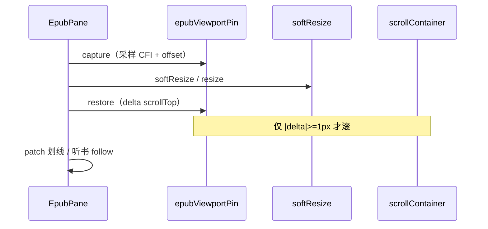

# EPUB softResize 视口钉住

## 文档角色

**增量专题**：读书页左侧 EPUB 在 **soft resize**（开/关侧栏、拖分栏手柄、窗口缩放）时正文会重排，原先屏幕顶部的阅读位置常被 **挤出视口**。本轮在 `EpubPane.applyHostResize` 内对 **每次** host 尺寸应用做 **视口采样 → softResize → 偏移恢复**，用 CFI + 相对滚动容器顶边的像素偏移钉住阅读位置。

**与 [EPUB想法引用视口.md](./EPUB想法引用视口.md) 的区别**：

| 维度 | `epub-thought-quote-viewport`（旧） | 本轮 `epubViewportPin` |
|------|-------------------------------------|-------------------------|
| 触发 | 想法侧栏开合、`subscribeEbookSplitPanelResizeEnd`、双 rAF | **每一次** `applyHostResize`（含拖拽连续帧） |
| 锚点 | 想法 **引用段 CFI**（`thoughtQuoteAnchorCfiRef`） | 视口上方 **任意正文** 采样点 → CFI |
| 目的 | 引用段滚回屏内便于对照编辑 | **保持用户当前阅读行** 不因分栏变宽/变窄跳动 |
| 与交焦 | read 页 effect 可能 scroll，易抢焦点 | 在 resize 路径完成，[EPUB侧面板输入焦点.md](./EPUB侧面板输入焦点.md) 可删 CFI scroll |

**延伸阅读**：[EPUB分屏软调整.md](./EPUB分屏软调整.md)、[EPUB阅读分屏.md](./EPUB阅读分屏.md)、[EPUB侧面板输入焦点.md](./EPUB侧面板输入焦点.md)、[EPUB想法引用视口.md](./EPUB想法引用视口.md)。

---

## 1. 背景与目标

### 1.1 问题

- 右侧 **想法 / MK 问书** 侧栏从 0 展开 → 左侧宽度骤降 → `softResizeEpubRendition` 重排。
- 拖 **ResizableHandle** 连续改变比例时，每帧 resize 可能改变折行，**scrollTop 不变** 时视口内正文已换段。
- 旧方案在 `read.tsx` 对 **引用 CFI** 做 `scrollEpubCfiIntoView`，仅覆盖「想法引用段」且与侧栏交焦冲突。

### 1.2 目标

| 场景 | 期望 |
|------|------|
| 首次开侧栏（全宽→分栏） | 用户正在读的那一行仍在视口相近位置 |
| 拖分栏手柄 | 连续 soft resize 不「滑页」 |
| 关侧栏恢复全宽 | 同上 |
| 窗口 resize / 全屏 | `applyHostResize` 同路径生效 |
| 分页模式 | 无 scroll 容器时 **no-op** |
| 侧栏已开换想法引用 | 仍由 `ensureQuoteCfiInViewport` 处理 |

---

## 2. 改动范围

| 路径 | 变更要点 |
|------|----------|
| `apps/frontend/src/views/ebook/utils/epub/reader/epubViewportPin.ts` | **新增** `captureEpubViewportPin` / `restoreEpubViewportPin` |
| `apps/frontend/src/views/ebook/components/reader/EpubPane.tsx` | `applyHostResize` 前后 pin；host 加 `data-epub-reader-host` |
| `apps/frontend/src/views/ebook/read.tsx` | 删除分栏 resize 订阅 + 引用 CFI 双 rAF scroll |

---

## 3. 实现思路

### 3.1 算法

1. **采样（capture）**：在连续滚动容器内取视口上方约 20% 处（clamp 24–96px）水平中心点；`caretRangeFromPoint` → CFI；记录 `offsetFromTop`。
2. **soft resize**：既有 `softResizeEpubRendition` 或 fallback `rend.resize`。
3. **恢复（restore）**：解析 CFI 得新 Range，算 delta，`|delta| >= 1` 时 `container.scrollTop += delta`。
4. **ponytail 边界**：仅连续滚动；分页 capture/restore 均 no-op。

### 3.2 与 resize 链路关系




### 3.3 read 页删减

- 移除 `scrollThoughtQuoteAnchorIntoView` 与 `subscribeEbookSplitPanelResizeEnd`。
- `thoughtPanelOpen` effect 只同步 `thoughtQuoteAnchorCfiRef`。
- `openThoughtCluster` 在 `sideAlreadyOpen` 时仍 `ensureQuoteCfiInViewport`。

---

## 4. 关键代码对比与注释

### 4.1 `epubViewportPin.ts`（纯新增）

**对比范围**：完整新文件。

**改动后** · `apps/frontend/src/views/ebook/utils/epub/reader/epubViewportPin.ts`（当前，约 L1–L100）

```typescript
// 导入依赖：type { Rendition } from 'epubjs';
import type { Rendition } from 'epubjs';
// 导入依赖：{ cfiFromDomRange, resolveCfiDomRange } from '../mark/epubRange
import { cfiFromDomRange, resolveCfiDomRange } from '../mark/epubRangeGeometry';
// 导入依赖：{ getEpubScrollContainer } from './epubScrolledNav';
import { getEpubScrollContainer } from './epubScrolledNav';

// 导出类型：type EpubViewportPin = {
export type EpubViewportPin = {
	// 类型成员：cfi
	cfi: string;
	// 源码块注释（JSDoc）：保留原义，见下一行
	/** 锚点相对滚动容器顶边的视口偏移（px） */
	// 类型成员：offsetFromTop
	offsetFromTop: number;
// 闭合代码块并结束语句
};

// 内部函数：caretRangeFromPoint
function caretRangeFromPoint(doc: Document, x: number, y: number): Range | null {
	// 条件判断：(doc.caretRangeFromPoint) return doc.caretRangeFromP
	if (doc.caretRangeFromPoint) return doc.caretRangeFromPoint(x, y);
	// 声明常量 withCaret
	const withCaret = doc as Document & {
		// 对象字段/回调：caretPositionFromPoint?
		caretPositionFromPoint?: (
			// 对象字段/回调：px
			px: number,
			// 对象字段/回调：py
			py: number,
		// 闭合调用并续写：) => { offsetNode: Node; offset: number } | null;
		) => { offsetNode: Node; offset: number } | null;
	// 闭合代码块并结束语句
	};
	// 声明常量 pos
	const pos = withCaret.caretPositionFromPoint?.(x, y);
	// 条件判断：(!pos) return null;
	if (!pos) return null;
	// 声明常量 range
	const range = doc.createRange();
	// 调用方法/读属性：range.setStart(pos.offsetNode, pos.offset);
	range.setStart(pos.offsetNode, pos.offset);
	// 调用方法/读属性：range.collapse(true);
	range.collapse(true);
	// 返回值：range;
	return range;
// 闭合当前代码块
}

// 内部函数：rangeOffsetFromContainerTop
function rangeOffsetFromContainerTop(
	// 对象字段/回调：range
	range: Range,
	// 对象字段/回调：iframe
	iframe: HTMLIFrameElement,
	// 对象字段/回调：container
	container: HTMLElement,
// 打开块：): number {
): number {
	// 声明常量 rect
	const rect = range.getBoundingClientRect();
	// 声明常量 iframeRect
	const iframeRect = iframe.getBoundingClientRect();
	// 声明常量 containerRect
	const containerRect = container.getBoundingClientRect();
	// 声明常量 top
	const top =
		// 执行：rect.height > 0 || rect.width > 0
		rect.height > 0 || rect.width > 0
			// 三元运算符真值分支：iframeRect.top + rect.top
			? iframeRect.top + rect.top
			// 三元运算符假值分支或类型续行：iframeRect.top + rect.top;
			: iframeRect.top + rect.top;
	// 返回值：top - containerRect.top;
	return top - containerRect.top;
// 闭合当前代码块
}

// 源码块注释（JSDoc）：保留原义，见下一行
/**
 // 块注释续行
 * soft resize / 分栏宽度变化前采样：视口上方正文 → CFI + 相对容器顶偏移。
 // 块注释续行
 * ponytail: 仅连续滚动；分页无 scroll 容器时返回 null。
 // 块注释结束
 */
// 导出：function captureEpubViewportPin
export function captureEpubViewportPin(
	// 对象字段/回调：rend
	rend: Rendition,
// 打开块：): EpubViewportPin | null {
): EpubViewportPin | null {
	// 声明常量 container
	const container = getEpubScrollContainer(rend);
	// 条件判断：(!container) return null;
	if (!container) return null;

	// 声明常量 containerRect
	const containerRect = container.getBoundingClientRect();
	// 条件判断：(containerRect.height < 1 || containerRect.width < 1
	if (containerRect.height < 1 || containerRect.width < 1) return null;

	// 声明常量 sampleY
	const sampleY =
		// 执行：containerRect.top + Math.min(96, Math.max(24, container
		containerRect.top + Math.min(96, Math.max(24, containerRect.height * 0.2));
	// 声明常量 sampleX
	const sampleX = containerRect.left + containerRect.width / 2;

	// 遍历：(const el of container.querySelectorAll('iframe')) 
	for (const el of container.querySelectorAll('iframe')) {
		// 声明常量 iframe
		const iframe = el as HTMLIFrameElement;
		// 声明常量 iframeRect
		const iframeRect = iframe.getBoundingClientRect();
		// 条件判断：(sampleY < iframeRect.top || sampleY > iframeRect.bo
		if (sampleY < iframeRect.top || sampleY > iframeRect.bottom) continue;
		// 声明常量 doc
		const doc = iframe.contentDocument;
		// 条件判断：(!doc) continue;
		if (!doc) continue;
		// 声明常量 range
		const range = caretRangeFromPoint(
			// 参数或依赖项：doc
			doc,
			// 参数或字段续行：sampleX - iframeRect.left
			sampleX - iframeRect.left,
			// 参数或字段续行：sampleY - iframeRect.top
			sampleY - iframeRect.top,
		// 闭合函数调用或表达式语句
		);
		// 条件判断：(!range) continue;
		if (!range) continue;
		// 声明常量 cfi
		const cfi = cfiFromDomRange(rend, range)?.trim();
		// 条件判断：(!cfi) continue;
		if (!cfi) continue;
		// 返回配置对象
		return {
			// 参数或依赖项：cfi
			cfi,
			// 对象字段/回调：offsetFromTop
			offsetFromTop: rangeOffsetFromContainerTop(range, iframe, container),
		// 闭合代码块并结束语句
		};
	// 闭合当前代码块
	}
	// 返回值：null;
	return null;
// 闭合当前代码块
}

// 源码块注释（JSDoc）：保留原义，见下一行
/** soft resize 后把采样锚点滚回原视口偏移，避免正文被挤出屏外 */
// 导出：function restoreEpubViewportPin
export function restoreEpubViewportPin(
	// 对象字段/回调：rend
	rend: Rendition,
	// 对象字段/回调：pin
	pin: EpubViewportPin | null,
// 打开块：): boolean {
): boolean {
	// 条件判断：(!pin?.cfi) return false;
	if (!pin?.cfi) return false;
	// 声明常量 container
	const container = getEpubScrollContainer(rend);
	// 条件判断：(!container) return false;
	if (!container) return false;
	// 声明常量 range
	const range = resolveCfiDomRange(rend, pin.cfi);
	// 条件判断：(!range) return false;
	if (!range) return false;
	// 声明常量 win
	const win = range.startContainer.ownerDocument?.defaultView;
	// 声明常量 iframe
	const iframe = win?.frameElement as HTMLIFrameElement | null;
	// 条件判断：(!iframe) return false;
	if (!iframe) return false;

	// 声明常量 offset
	const offset = rangeOffsetFromContainerTop(range, iframe, container);
	// 声明常量 delta
	const delta = offset - pin.offsetFromTop;
	// 条件判断：(Math.abs(delta) < 1) return true;
	if (Math.abs(delta) < 1) return true;
	// 调用方法/读属性：container.scrollTop += delta;
	container.scrollTop += delta;
	// 返回值：true;
	return true;
// 闭合当前代码块
}
```

**变更摘要**：新增通用「阅读行」视口钉住，不依赖想法引用 CFI。

---

### 4.2 `applyHostResize`（`EpubPane.tsx`）

**对比范围**：`applyHostResize` 完整内部函数。

**改动前** · `apps/frontend/src/views/ebook/components/reader/EpubPane.tsx`（基线 HEAD，约 L556–L574）

```typescript
// 声明常量 applyHostResize
const applyHostResize = () => {
			// 节点未就绪或渲染器尚未 Ready 时直接忽略
			// 条件判断：(!hostRef.current || !readyRef.current || !rendRef.c
			if (!hostRef.current || !readyRef.current || !rendRef.current) return;
			// 声明常量 w
			const w = Math.max(hostRef.current.clientWidth, 320);
			// 声明常量 h
			const h = Math.max(hostRef.current.clientHeight, 320);
			// 声明常量 rend
			const rend = rendRef.current;
			// 优先使用 softResize 尝试温和调整（部分内容重排避免闪屏）
			// 条件判断：(!softResizeEpubRendition(rend, w, h)) {
			if (!softResizeEpubRendition(rend, w, h)) {
				// 进入 try：可能抛错的 DOM/iframe 操作
				try {
					// 调用方法/读属性：rend.resize(w, h); // 兜底：完整 resize
					rend.resize(w, h); // 兜底：完整 resize
				// 捕获异常（忽略已卸载 iframe 等）
				} catch {
					// 忽略 resize 闪断异常
				// 闭合当前代码块
				}
			// 闭合当前代码块
			}
			// soft resize 可能令高亮失色/划线消失，需立即恢复批注样式
			// 执行：patchEpubReadingAnnotations(rend, { sync: true });
			patchEpubReadingAnnotations(rend, { sync: true });
			// 执行：relayoutListenMarkHighlight(rend);
			relayoutListenMarkHighlight(rend);
			// 执行：checkEpubListenFollowAfterLayout(rend);
			checkEpubListenFollowAfterLayout(rend);
		// 闭合代码块并结束语句
		};
```

**改动后** · `apps/frontend/src/views/ebook/components/reader/EpubPane.tsx`（当前，约 L560–L579）

```typescript
// 声明常量 applyHostResize
const applyHostResize = () => {
			// 声明常量 host
			const host = hostRef.current;
			// 节点未就绪或渲染器尚未 Ready 时直接忽略
			// 条件判断：(!host || !readyRef.current || !rendRef.current) ret
			if (!host || !readyRef.current || !rendRef.current) return;
			// 声明常量 w
			const w = Math.max(host.clientWidth, 320);
			// 声明常量 h
			const h = Math.max(host.clientHeight, 320);
			// 声明常量 rend
			const rend = rendRef.current;
			// 声明常量 pin
			const pin = captureEpubViewportPin(rend);
			// 条件判断：(!softResizeEpubRendition(rend, w, h)) {
			if (!softResizeEpubRendition(rend, w, h)) {
				// 进入 try：可能抛错的 DOM/iframe 操作
				try {
					// 调用方法/读属性：rend.resize(w, h);
					rend.resize(w, h);
				// 捕获异常（忽略已卸载 iframe 等）
				} catch {
					// 忽略 resize 闪断异常
				// 闭合当前代码块
				}
			// 闭合当前代码块
			}
			// 执行：restoreEpubViewportPin(rend, pin);
			restoreEpubViewportPin(rend, pin);
			// 执行：patchEpubReadingAnnotations(rend, { sync: true });
			patchEpubReadingAnnotations(rend, { sync: true });
			// 执行：relayoutListenMarkHighlight(rend);
			relayoutListenMarkHighlight(rend);
			// 执行：checkEpubListenFollowAfterLayout(rend);
			checkEpubListenFollowAfterLayout(rend);
		// 闭合代码块并结束语句
		};
```

**变更摘要**：在每次 `applyHostResize` 包裹 soft resize；host 增加 `data-epub-reader-host`。

---

### 4.3 `read.tsx` 引用视口 scroll 删减

**对比范围**：想法侧栏开合后的 effect（改动后仅同步锚点 CFI）。

**改动后** · `apps/frontend/src/views/ebook/read.tsx`（当前，约 L2060–L2065）

```typescript
// 开合侧栏 / 窗口缩放 / 拖手柄的阅读位保持由 EpubPane.applyHostResize 视口钉住完成。
	// 此处只同步锚点 CFI（划线 pin），避免再 display/scroll 抢焦点、打乱原阅读位置。
	// 注册副作用：面板就绪后交焦或显示控制
	useEffect(() => {
		// 条件判断：(book?.fmt !== 'epub') return;
		if (book?.fmt !== 'epub') return;
		// 条件判断：(thoughtPanelOpen) syncThoughtQuoteAnchorCfi();
		if (thoughtPanelOpen) syncThoughtQuoteAnchorCfi();
	// 执行：}, [book?.fmt, thoughtPanelOpen, syncThoughtQuoteAnchor
	}, [book?.fmt, thoughtPanelOpen, syncThoughtQuoteAnchorCfi]);
```

**变更摘要**：通用阅读位置交给 `epubViewportPin`；引用 CFI ref 仍服务划线。

---

## 5. 行为变化

| 项目 | 变化 |
|------|------|
| 开/关想法或问书侧栏 | 当前阅读行尽量保持原位 |
| 拖分栏 | 连续帧 pin，减少「滑页」 |
| 想法引用滚入视口 | 不再每次开栏 CFI scroll；窄场景保留 |
| 分页 EPUB | 无 scroll 容器则 no-op |
| 与交焦 | resize 路径不 focus |

---

## 6. 测试回归

- [ ] 连续滚动：全宽读中段 → 开想法侧栏 → 当前段仍在屏内
- [ ] 拖分栏手柄来回拖 → 正文不大幅跳动
- [ ] 关侧栏恢复全宽 → 阅读位置连贯
- [ ] 窗口放大/缩小 → pin 生效
- [ ] 侧栏已开 → 点另一处下划线 → 新引用滚入视口
- [ ] 分页模式无异常
- [ ] 与侧栏交焦联测（见姊妹文）
- [ ] 听书 follow / 划线 patch 正常

---

## 7. 相关源码路径

| 说明 | 路径 |
|------|------|
| 视口 pin 算法 | `apps/frontend/src/views/ebook/utils/epub/reader/epubViewportPin.ts` |
| resize 接线 | `apps/frontend/src/views/ebook/components/reader/EpubPane.tsx` |
| soft resize | `apps/frontend/src/views/ebook/utils/epub/reader/epubSoftResize.ts` |
| scroll 容器 | `apps/frontend/src/views/ebook/utils/epub/reader/epubScrolledNav.ts` |
| 旧引用视口专题 | [EPUB想法引用视口.md](./EPUB想法引用视口.md) |
| 侧栏交焦 | [EPUB侧面板输入焦点.md](./EPUB侧面板输入焦点.md) |

---

若与仓库最新源码不一致，以源码为准。
