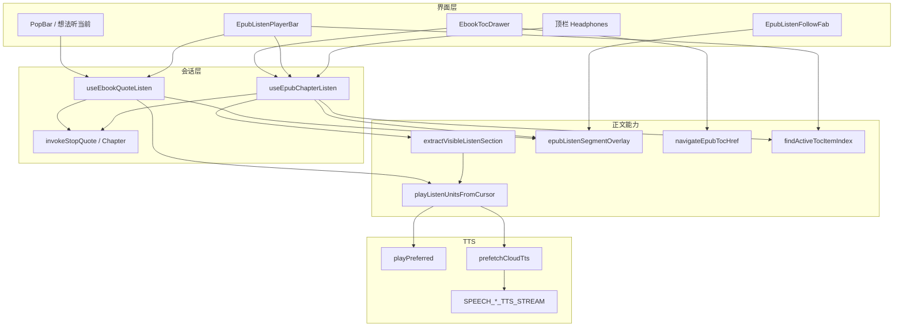
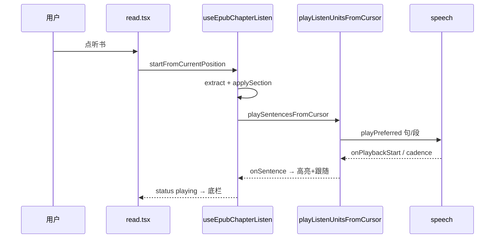

# Web 端 EPUB 听书（章节听书 + 听当前 + TTS + 多节目录）— 功能实现详解与复刻指南

> **一句话**：在 EPUB 阅读页用同一套 TTS 与底栏，支持「听书」连续朗读全书/可视区，以及「听当前」只读选区/引用；同 HTML 多目录节时按 CFI 精确定位与起播。  
> **入口**：阅读 EPUB → 顶栏耳机（听书）；选区 PopBar / 想法引用条（听当前）；底栏切章、分句、倍速、暂停。  
> **关联文件**：见 §0.4 文件地图。  
> **文档目标**：读懂整套实现；按 §5 复刻手册在其他项目落地等价逻辑。  
> **非目标**：PDF 听书、英语学习喇叭页、桌面端特有的系统集成细节以外的宿主能力、后端 TTS 微服务实现内部（仅述前端契约）。  
> **改动追溯**：增量对比见 [EPUB章节听书.md](../EPUB章节听书.md)、[EPUB听书栏播放头目录.md](../EPUB听书栏播放头目录.md)、[EPUB目录CFI导航.md](../EPUB目录CFI导航.md)、[EPUB听书目录锚点启动.md](../EPUB听书目录锚点启动.md) 等；本文以**当前源码**为准自洽。  
> **手册版本**：2026-07-16（按 feature-impl-guide 重写；替代 2026-06-27 旧版结构）。

---

## 0. 先看这里（一眼建立模型）

### 0.1 30 秒读懂

- **做什么**：Web 前端在 EPUB 正文上开启朗读——**听书**从当前位置连读（连续滚动跨 iframe / 分页翻 spine），**听当前**只读一段；淡黄句背景 + 自动跟随 + 底栏控制；语音走本机 / Edge / MiniMax / 讯飞。
- **不做什么**：不为 PDF 做听书；不在本文展开划线/想法 DOM 合并算法（见划线/想法手册）；不写 TTS 服务端源码。
- **关键角色**：
  - **界面**：`read.tsx` 接线、`EpubListenPlayerBar`、FAB、PopBar/想法「听」。
  - **会话**：`useEpubChapterListen` / `useEbookQuoteListen` 持 `idle|loading|playing|paused` 与句光标。
  - **能力**：`epubListen*` 抽节/段合成/高亮；`speech` 出声；`epubTocNavigate` + `tocActiveIndex` 多节定位。

### 0.2 功能点总表

| 编号 | 功能点（人话）                       | 用户可感知表现                 | 关键实现位置                                          | 正文  |
| ---- | ------------------------------------ | ------------------------------ | ----------------------------------------------------- | ----- |
| F1   | 顶栏耳机开听书，从当前阅读位置连续听 | 底栏出现，出声，句淡黄底       | `useEpubChapterListen` → `startFromCurrentPosition`   | §4.1  |
| F2   | 再点耳机或底栏停止，结束会话         | 底栏消失，底色清掉             | `stopInternal`                                        | §4.2  |
| F3   | 底栏播放/暂停；loading 也可暂停      | 暂停后可从原位置续             | `togglePlay` / soft pause                             | §4.3  |
| F4   | 底栏章号、句进度与分句列表跳转       | 点列表从该句续播               | `EpubListenPlayerBar` / `goToSentence`                | §4.4  |
| F5   | 底栏倍速 0.5×～3× 会话内生效         | 听感立即变化                   | `setRate` / `CHAPTER_LISTEN_RATES`                    | §4.5  |
| F6   | 听书底栏上一章/下一章                | 跳邻节并从头（锚点）续听       | `goListenChapter`                                     | §4.6  |
| F7   | 听书中点目录换节并自动续听           | 滚到节首并继续读               | `goEpubTocHref` / `restartFromChapterStart`           | §4.7  |
| F8   | 同 spine 多锚点时目录高亮跟 CFI      | 高亮当前节而非文件首/末        | `attachTocCfis` / `findActiveTocItemIndex`            | §4.8  |
| F9   | 切章起播用 after，落在锚点后第一句   | 不会先念上一节末句             | `resolveListenStartSentence` mode `after`             | §4.9  |
| F10  | 从当前位置听用 before                | 从靠近阅读点的句子续           | mode `before`                                         | §4.10 |
| F11  | 连续滚动节末自动进下一 iframe        | 无需手动翻屏仍连读             | `runScrollSectionLoop` / `advanceScrollListenSection` | §4.11 |
| F12  | 分页节末自动翻下一 spine             | 分页模式也能全书连听           | `runPaginatedListenLoop` / `waitForNextSection`       | §4.12 |
| F13  | 选区 PopBar「听当前」                | 只读选中文字，底栏出现         | `toggleListen('popbar')`                              | §4.13 |
| F14  | 想法列表/详情引用「听当前」          | 引用条可听/停                  | `thought*QuoteActions.onListen`                       | §4.14 |
| F15  | 听书与听当前互斥，共用底栏           | 开一边停另一边                 | `invokeStop*` / `epubListenBar`                       | §4.15 |
| F16  | 当前句半透明背景，换句不叠层         | 淡黄底跟着句走                 | `showListenMarkHighlight`                             | §4.16 |
| F17  | 自动跟随；手动滚后 FAB 回位          | 右下角「回到播放位置」         | `EpubListenFollowFab`                                 | §4.17 |
| F18  | 首句快出声 + 段级预取                | 首句快、句间停顿短             | `playListenUnitsFromCursor`                           | §4.18 |
| F19  | TTS 四源选路                         | 设置页选本机/Edge/MiniMax/讯飞 | `shouldUseCloudTts` / `playPreferred`   | §4.19 |
| F20  | 云端失败降级 Edge 再本机             | 仍可能出声并提示               | `sessionCloudSourceOverride`                          | §4.20 |
| F21  | 中文为主时本机选中文音色             | 中文听书发音正确               | `pickChineseVoice`                                    | §4.21 |
| F22  | 系统媒体键与底栏同步                 | 耳机/控制中心可暂停续播        | `registerPlaybackMediaHandlers`                | §4.22 |
| F23  | 软暂停从 Audio 进度续                | 不整段重头                     | `pausePlaybackSoft`                            | §4.23 |
| F24  | TOC `#fragment` → CFI display 顶对齐 | 点目录到对应节首               | `navigateEpubTocHref`                                 | §4.24 |
| F25  | 底栏切章用播头 CFI                   | 邻节正确                       | `getPlayheadCfi`                                      | §4.25 |

### 0.3 架构一图



### 0.4 文件地图与建造顺序

| 建造序 | 文件                                        | 职责（一句话）                                   | 依赖          |
| ------ | ------------------------------------------- | ------------------------------------------------ | ------------- |
| 1      | `apps/frontend/src/service/api.ts`          | TTS 流式路径常量                                 | 后端已部署    |
| 2      | `apps/frontend/src/utils/speech.ts`     | 选路、云端/本机播放、软暂停、预取、Media Session | 1             |
| 3      | `.../listen/epubListenParagraphs.ts`        | plain → 段落合成单元                             | 无            |
| 4      | `.../listen/epubListenChapter.ts`           | 抽节、句 Range、起播句 before/after              | 2 的分句      |
| 5      | `.../listen/epubListenPlayUnits.ts`         | 从句下标起：kick + 段合成 + 预取                 | 2, 3          |
| 6      | `.../listen/epubListenMarkHighlight.ts`     | 句背景绘制                                       | epub.js marks |
| 7      | `.../listen/epubListenSegmentOverlay.ts`    | overlay 会话、跟随、互斥注册                     | 6             |
| 8      | `.../listen/epubScrollListenAdvance.ts`     | 滚动模式找下一 iframe                            | epub scrolled |
| 9      | `.../reader/epubTocNavigate.ts`             | TOC→CFI 跳转、`attachTocCfis`                    | epub.js       |
| 10     | `.../common/tocActiveIndex.ts`              | 活跃目录项（含同 spine CFI）                     | 9 的 tocCfi   |
| 11     | `hooks/useEpubChapterListen.ts`             | 听书状态机与主循环                               | 4–8           |
| 12     | `hooks/useEbookQuoteListen.ts`              | 听当前状态机                                     | 5, 7          |
| 13     | `components/listen/EpubListenPlayerBar.tsx` | 底栏 UI                                          | 11/12 状态    |
| 14     | `components/listen/EpubListenFollowFab.tsx` | 回位按钮                                         | 7             |
| 15     | `read.tsx` + `EpubPane.tsx`                 | 接线、go、目录、互斥展示                         | 全部          |

---

## 1. 人话版：用户旅程

1. **进入**：打开一本 EPUB，正文加载完成，顶栏耳机可点。
2. **主路径（听书）**：点耳机 → 从当前屏幕附近的句子开始读 → 底栏出现 → 句有淡黄底并自动滚入视口 → 本节读完自动进下一节（滚动或分页）。
3. **主路径（听当前）**：拖选文字 → PopBar 点「听」→ 只读这段 → 底栏出现但**切章禁用** → 读完自动停。
4. **分支**：暂停（底栏或系统键）→ 续播从停下处；调倍速；分句列表跳句；点目录或底栏上下章换节续听；手动滚远 → 出现 FAB → 点回播放句。
5. **离开**：再点耳机或底栏停止 → 底栏关、底色清、媒体键解绑。

---

## 2. 问题与解决方案总表

| 问题编号 | 现象 / 风险                   | 根因                         | 本项目做法                                    | 对应 F |
| -------- | ----------------------------- | ---------------------------- | --------------------------------------------- | ------ |
| P1       | 云端逐句请求多、首句慢        | 每句一次 HTTP                | 首句 kick 单句快出；同段整段合成 + 预取错开   | F18    |
| P2       | 听书与听当前叠音              | 两套会话抢 Audio             | `invokeStop*` 互斥 + `stopAllPlayback` | F15    |
| P3       | 连续滚动节末以为全书完        | spine 未变，下一 iframe 未进 | `advanceScrollListenSection` 扫 `.epub-view`  | F11    |
| P4       | 同 HTML 多目录节跳到错处      | 只 `display(spine)`          | `navigateEpubTocHref` → CFI + 顶对齐          | F24    |
| P5       | 切章从文件第 0 句或上节末起播 | 不解析目标 CFI / before 模式 | `restart` + `mode:'after'`                    | F9,F7  |
| P6       | 底栏上下章切错邻节            | 用滞后 reading CFI           | `getPlayheadCfi`                              | F25    |
| P7       | 暂停后续播从头                | stop 杀了 Audio              | 软暂停保留 `currentTime`                      | F23    |
| P8       | 目录高亮总在同文件末/首       | 只比 spineIndex              | `tocCfi` 比较 + 视口回退                      | F8     |
| P9       | 本机先 prime 再 begin 无声    | cancel 掉解锁 utterance      | `beginPlaybackSession` 先于 prime             | F19    |
| P10      | Media Session 残留            | 只靠 effect 卸载             | `stopInternal` 内同步 `register(null)`        | F22    |

---

## 3. 实现思路总览

### 3.1 总体策略

听书本质是：**可见章节 DOM → 纯文本句表 →（可选）按 CFI 选起播句 → 段单元合成 → 句级 UI 回调**。会话用 `loopGenRef` 作世代取消；UI 状态与 ref 双写避免闭包陈旧。听当前复用同一播放单元与底栏，但抽取范围缩到选区/引用，且**禁止切章**。

### 3.2 数据流与控制流



核心状态：`status`、`spineIndex`、`sentenceIndex`、`sentenceCount`、`sentenceLabels`、`rate`；内部 `sectionRef.sentenceRanges` 供高亮与播头 CFI。

### 3.3 模块职责

- **read**：唯一编排页——谁显示底栏、目录如何 `go`、切章是否 `restart`。
- **Chapter/Quote Hook**：会话生命周期；Chapter 多出全书循环与 `getPlayheadCfi`。
- **PlayUnits**：与 EPUB 无关的「从句下标播到文末」。
- **speech**：与电子书无关的出声与降级。
- **TOC 导航/活跃项**：同文件多节时「跳得准 + 高亮准 + 邻章准」。

---

## 4. 分功能点详解（必填，核心）

本章按 **F1–F25** 拆解听书/听当前能力的独立功能点；每点含人话说明、实现思路、问题对策、落地步骤、带逐行注释的关键代码与复刻提示。代码均摘自当前仓库实现，路径为仓库根相对路径。

---

### 4.1 F1：从当前位置开始听书（start）

#### （1）人话说明

用户点顶栏耳机或播放条旁的「开始听书」，系统从**当前屏幕可见正文**的第一句（或 CFI 左侧最后一句）起连续朗读，并弹出底部播放条。若已在听，则同一按钮变为停止。

#### （2）实现思路

入口 `toggleChapterListen`：非 `idle` 则 `stopInternal`，否则 `startFromCurrentPosition`。起播前互斥停引用听、清 overlay、开 autoFollow；`loopGenRef` 递增作废旧循环；`resolveStartCfiRef=true` + `mode=before` 让 `applySection` 按阅读 CFI 定位起播句；按 `isScrollListenMode` 分叉 scroll / paginated 主循环。

#### （3）问题与对策

| 问题             | 对策                                               |
| ---------------- | -------------------------------------------------- |
| TTS 不可用       | `isPlaybackAvailable` + Toast               |
| rendition 未就绪 | `getRendition()` 空则 Toast `notReady`             |
| 当前节无正文     | `extractVisibleListenSection` 空则 `emptySection`  |
| 与听当前冲突     | `invokeStopQuoteListen` + `stopAllPlayback` |

#### （4）实现过程（有序列表）

1. `read.tsx` 顶栏绑定 `chapterListen.toggleChapterListen`。
2. 点击时 `primePlaybackForUserGesture` 解锁音频。
3. 校验 TTS 与 rendition，提取 `preview` 可见节。
4. `++loopGenRef`，置 ref 标志，`syncState(loading)`。
5. `void runListenLoop(gen)` 进入 F11/F12 主循环。

#### （5）关键代码

**来源**：`apps/frontend/src/views/ebook/hooks/useEpubChapterListen.ts` · `startFromCurrentPosition` / `toggleChapterListen`

```typescript
// 从当前阅读位置开始 TTS 朗读章节
const startFromCurrentPosition = useCallback(() => {
	// 在用户手势同步栈预热 Web Speech / Audio，降低后续 async play 被 autoplay 策略拦截
	primePlaybackForUserGesture();
	// 本机或云端 TTS 均不可用时直接 Toast 并退出，避免进入 loading 后无声
	if (!isPlaybackAvailable()) {
		Toast({
			type: "warning",
			title: tRef.current("englishLearning.tts.unsupported"),
		});
		return;
	}
	// 取 epub.js rendition；阅读器 iframe 未挂载时无法抽正文
	const rend = getRenditionRef.current();
	if (!rend) {
		Toast({
			type: "warning",
			title: tRef.current("ebook.read.listenBook.notReady"),
		});
		return;
	}
	// 互斥：停引用/选区听书，避免双声道
	invokeStopQuoteListen();
	// 作废上一轮 TTS 介质与世代
	stopAllPlayback();
	// 清听当前 overlay 与高亮 session
	clearEpubListenSegmentOverlay();
	// 注册滚动 guard，首句高亮前即可响应用户打断与 FAB
	beginChapterListenAutoFollow(rend);
	// 优先用阅读页记录的 spine 索引定位 iframe
	const spineHint = getCurrentSpineIndexRef.current?.();
	// 从当前可见区域抽 innerText 正文与 outerRange
	const preview = extractVisibleListenSection(rend, spineHint);
	// 节内无可用文字则提示并退出
	if (!preview?.plain.trim()) {
		Toast({
			type: "warning",
			title: tRef.current("ebook.read.listenBook.emptySection"),
		});
		return;
	}
	// 递增世代号，使旧 runListenLoop 回调 isGenActive 为 false
	const gen = ++loopGenRef.current;
	// 标记未暂停、句游标归零、待按 CFI 解析起播句（F10 before 模式）
	pausedRef.current = false;
	sentenceCursorRef.current = 0;
	resolveStartCfiRef.current = true;
	resolveStartCfiModeRef.current = "before";
	sectionRef.current = null;
	// 记录首节 document，供 scroll 模式节间 advance 比对
	sectionDocRef.current = preview.outerRange.startContainer.ownerDocument;
	// 预计算句界与标签，播放条立即有 sentenceCount
	const sentences = buildSentenceOffsetSpans(preview.plain.trim());
	const plain = preview.plain.trim();
	syncState({
		status: "loading",
		spineIndex: preview.spineIndex,
		sentenceIndex: 0,
		sentenceCount: sentences.length,
		sentenceLabels: buildSentenceLabels(plain, sentences),
		rate: rateRef.current,
	});
	// 异步进入主循环，不阻塞 UI
	void runListenLoop(gen);
}, [runListenLoop, syncState]);

// 顶栏耳机：idle 则起播，否则整段停止（F2）
const toggleChapterListen = useCallback(() => {
	if (stateRef.current.status !== "idle") {
		stopInternal();
		return;
	}
	startFromCurrentPosition();
}, [startFromCurrentPosition, stopInternal]);
```

#### （6）复刻提示

最小复刻：一个 `gen` ref + `start()` 调 `extractVisible` → `playLoop(gen)`。务必在起播前 `stopAll` 与互斥停另一路听书；`resolveStartCfi` 标志与 F10 解耦起播句。

---

### 4.2 F2：停止听书（stop）

#### （1）人话说明

用户点播放条停止、切章前静默停、或组件卸载时，听书会话彻底结束：TTS 静音、高亮清除、Media Session 卸掉、状态回到 `idle`（保留用户倍速）。

#### （2）实现思路

`stop` 委托 `stopInternal`：`loopGenRef++` 作废循环；`stopAllPlayback`；同步 `registerPlaybackMediaHandlers(null)`（勿等 effect）；`teardownChapterListenHighlight` + `clearEpubListenSegmentOverlay`；`IDLE_STATE` 但 `rate` 沿用 `rateRef`。

#### （3）问题与对策

| 问题                      | 对策                                                 |
| ------------------------- | ---------------------------------------------------- |
| macOS 控制中心残留进度条  | stop 时同步 `register(null)`，不等 `isActive` effect |
| 卸载误触发 `onSessionEnd` | `stopInternal({ notify: false })`                    |
| 用户调速被清零            | idle 合并 `rate: rateRef.current`                    |

#### （4）实现过程（有序列表）

1. UI 调 `epubListenBar.stop` 或 `goEpubTocHref` 内 `listen.stop({ notify: false })`。
2. `loopGenRef++` 使所有 `isGenActive` 为 false。
3. 停 TTS、卸 Media Session、拆高亮与 overlay。
4. `setState(IDLE)`，`onSessionEnd` 可选通知阅读页 sync 批注。

#### （5）关键代码

**来源**：`apps/frontend/src/views/ebook/hooks/useEpubChapterListen.ts` · `stopInternal` / `stop`

```typescript
// 内部停止：清 ref、停播、卸 UI 副作用，可选是否通知阅读页
const stopInternal = useCallback((opts?: { notify?: boolean }) => {
	// 递增世代，正在 await 的 playListenUnitsFromCursor 会尽快退出
	loopGenRef.current += 1;
	pausedRef.current = false;
	resolveStartCfiRef.current = false;
	resolveStartCfiModeRef.current = "before";
	sectionRef.current = null;
	sectionDocRef.current = null;
	// 作废 TTS 会话与云端/本机介质
	stopAllPlayback();
	// 同步卸 Media Session，勿等 isActive effect：否则 macOS 仍残留进度条/控件
	registerPlaybackMediaHandlers(null);
	// 清除 marks-pane 听书句背景
	teardownChapterListenHighlight(getRenditionRef.current() ?? undefined);
	clearEpubListenSegmentOverlay();
	// 保留倍速：IDLE_STATE.rate=1 会把用户调速清掉
	const idle = { ...IDLE_STATE, rate: rateRef.current };
	setState(idle);
	stateRef.current = idle;
	// 目录切章等场景可跳过 notify，避免多余 sync
	if (opts?.notify !== false) onSessionEndRef.current?.();
}, []);

// 对外 stop：薄包装，供播放条与 ref 调用
const stop = useCallback(
	(opts?: { notify?: boolean }) => {
		stopInternal(opts);
	},
	[stopInternal],
);
```

#### （6）复刻提示

停止必须同时：**作废异步世代** + **停物理音频** + **清 DOM 高亮**。若只 `pause` 不 `gen++`，切句/切章会与旧循环竞态。

---

### 4.3 F3：暂停与续播（pause）

#### （1）人话说明

播放条暂停：当前句 TTS **软暂停**（音频 currentTime 保留），状态变 `paused`；再点播放则从断点续播；若暂停发生在合成返回前，则 `resume` 失败并**从当前句重开循环**。

#### （2）实现思路

`pause`：`pausedRef=true` + `pausePlaybackSoft` + `syncState(paused)`。`resume`：先 `resumePlaybackSoft`，成功则 `playing`；否则 `++loopGenRef` 并 `runListenLoop(gen, { continueSections: true })`。`togglePlay` 在 `loading` 时也允许暂停（取消 TTS 等待）。

#### （3）问题与对策

| 问题               | 对策                                 |
| ------------------ | ------------------------------------ |
| 暂停仍消耗 loopGen | 软暂停不递增 `loopGenRef`            |
| loading 无法点停   | `togglePlay` 把 `loading` 视作可暂停 |
| 无挂起音频         | `resume` 走重开循环分支              |

#### （4）实现过程（有序列表）

1. `EpubListenPlayerBar.onTogglePlay` → `togglePlay`。
2. `playing|loading` → `pause` → F23 软暂停介质。
3. `paused` → `resume` → 优先 F23 续播，失败则新 `gen` 重跑循环。

#### （5）关键代码

**来源**：`apps/frontend/src/views/ebook/hooks/useEpubChapterListen.ts` · `pause` / `resume` / `togglePlay`

```typescript
// 软暂停：不杀 loopGen，不 abort 云端 wait
const pause = useCallback(() => {
	const status = stateRef.current.status;
	// 仅播放中或等待 TTS 时可暂停
	if (status !== "playing" && status !== "loading") return;
	pausedRef.current = true;
	pausePlaybackSoft();
	syncState({ status: "paused" });
}, [syncState]);

// 续播：优先从挂起介质恢复，否则从当前句重开循环
const resume = useCallback(() => {
	if (stateRef.current.status !== "paused") return;
	pausedRef.current = false;
	if (resumePlaybackSoft()) {
		syncState({ status: "playing" });
		return;
	}
	// 无已挂起音频（如暂停发生在合成返回前）：从当前句重开循环
	const gen = ++loopGenRef.current;
	syncState({ status: "loading" });
	void runListenLoop(gen, { continueSections: true });
}, [runListenLoop, syncState]);

// 播放条主按钮：playing/loading 暂停，paused 续播
const togglePlay = useCallback(() => {
	const status = stateRef.current.status;
	// loading = 当前句 TTS 等待中，允许点暂停取消等待
	if (status === "playing" || status === "loading") {
		pause();
		return;
	}
	if (status === "paused") {
		resume();
	}
}, [pause, resume]);
```

#### （6）复刻提示

区分 **软暂停**（F23）与 **硬停止**（F2）：前者保留 `sentenceCursorRef` 与 `sectionRef`，后者清空。`isActive` 回调须读 `pausedRef`。

---

### 4.4 F4：播放条切句（goToSentence）

#### （1）人话说明

用户在播放条句菜单选第 N 句或点上一句/下一句，立即停止当前 TTS，从目标句重新播放，并滚动居中该句（`scrollSeekRef`）。

#### （2）实现思路

`goToSentence` 钳制索引 → 写 `sentenceCursorRef` → `scrollSeekRef=true` → `stopAllPlayback` → `++loopGenRef` → `syncState` → `runListenLoop(gen)`。`seekSentence` 为 `±1` 包装。

#### （3）问题与对策

| 问题                        | 对策                                                                   |
| --------------------------- | ---------------------------------------------------------------------- |
| 连点下一句误 `stopInternal` | `playSentencesFromCursor` 返回 false 时先判 `!isGenActive \|\| paused` |
| 切句后高亮钉死旧 Range      | `onSentence` 内 `rebindSectionDomRanges`（见 F16）                     |

#### （4）实现过程（有序列表）

1. `EpubListenPlayerBar.onGoToSentence(index)`。
2. 校验 `sectionRef` 有 `sentences`。
3. 停播 + 新 `gen`，`runListenLoop` 从游标句 kick 首包（F18）。

#### （5）关键代码

**来源**：`apps/frontend/src/views/ebook/hooks/useEpubChapterListen.ts` · `goToSentence` / `seekSentence`

```typescript
// 跳转到节内指定句索引并重新进入播放循环
const goToSentence = useCallback(
	(index: number) => {
		const ctx = sectionRef.current;
		// 尚无节上下文或句表为空则无法切句
		if (!ctx?.sentences.length) return;
		// 钳制到 [0, sentenceCount-1]
		const next = Math.min(ctx.sentences.length - 1, Math.max(0, index));
		sentenceCursorRef.current = next;
		// 下一句 play 时首句 forceCenter 滚动
		scrollSeekRef.current = true;
		stopAllPlayback();
		pausedRef.current = false;
		const gen = ++loopGenRef.current;
		syncState({
			sentenceIndex: next,
			sentenceCount: ctx.sentences.length,
			sentenceLabels: buildSentenceLabels(ctx.plain, ctx.sentences),
			status: "playing",
		});
		void runListenLoop(gen);
	},
	[runListenLoop, syncState],
);

// 相对当前句偏移 -1 或 +1
const seekSentence = useCallback(
	(delta: -1 | 1) => {
		goToSentence(sentenceCursorRef.current + delta);
	},
	[goToSentence],
);
```

#### （6）复刻提示

切句必须 **新 gen + stopAll**，不能只改 `sentenceIndex` 状态。`scrollSeekRef` 与 F18 `scrollCenterOnFirst` 配合实现首句居中。

---

### 4.5 F5：倍速调节（setRate）

#### （1）人话说明

用户在播放条倍速菜单选 0.75×–3×，当前及后续 TTS 按新速率播放；停止听书后倍速仍保留。

#### （2）实现思路

`setRate` 写 `rateRef`（供 F18 `getRate()` 每次起播读取）+ `applyActivePlaybackRate` 立即作用于挂起中的 `Audio`/`speechSynthesis` + `syncState({ rate })`。

#### （3）问题与对策

| 问题              | 对策                                    |
| ----------------- | --------------------------------------- |
| 段循环外快照 rate | F18 用 `getRate: () => rateRef.current` |
| stop 后倍速丢失   | F2 idle 合并 `rateRef.current`          |

#### （4）实现过程（有序列表）

1. `EpubListenPlayerBar.onRateChange` → `setRate`。
2. 更新 ref 与正在播放的介质速率。
3. React 状态驱动菜单选中项。

#### （5）关键代码

**来源**：`apps/frontend/src/views/ebook/hooks/useEpubChapterListen.ts` · `setRate`

```typescript
// 设置听书倍速：持久化到 ref，并立即作用于当前 TTS 介质
const setRate = useCallback(
	(rate: number) => {
		rateRef.current = rate;
		applyActivePlaybackRate(rate);
		syncState({ rate });
	},
	[syncState],
);
```

**来源**：`apps/frontend/src/views/ebook/hooks/useEpubChapterListen.ts` · `CHAPTER_LISTEN_RATES`

```typescript
// 播放条可选倍速档位（与 UI 菜单一致）
export const CHAPTER_LISTEN_RATES = [
	0.75, 1, 1.25, 1.5, 1.8, 2, 2.25, 2.5, 2.8, 3,
] as const;
```

#### （6）复刻提示

倍速存 **ref 而非仅 state**，异步 `playPreferred` 才能读到最新值。听当前 `useEbookQuoteListen.setRate` 同构。

---

### 4.6 F6：听书底栏切章（goListenChapter）

#### （1）人话说明

听书时播放条「上一章/下一章」：优先按**目录相邻项**跳转（与点目录一致）；无目录匹配时回退 `spineIndex ± 1`。用**播头 CFI**（F25）算当前目录项，避免阅读 CFI 滞后。

#### （2）实现思路

`findActiveTocItemIndex` + `findListenTocNeighbor` 找邻项 → `goEpubTocHref(href, spineIndex)`（F7）。`canListenPrev/NextChapter` 用同样邻接逻辑控制按钮禁用。

#### （3）问题与对策

| 问题     | 对策                                   |
| -------- | -------------------------------------- |
| 邻章算错 | `getPlayheadCfi()` 优先于 `readingCfi` |
| 无 TOC   | 回退 spine `get(target)?.href`         |

#### （4）实现过程（有序列表）

1. 校验 `chapterListen.isActive`。
2. `findActiveTocItemIndex` 得 `active`。
3. 有邻项则 `goEpubTocHref`；否则 spine ±1。

#### （5）关键代码

**来源**：`apps/frontend/src/views/ebook/read.tsx` · `goListenChapter` / `findListenTocNeighbor`

```typescript
// 在目录数组中沿 delta 找下一个有效 EPUB href（跳过 PDF 页项）
const findListenTocNeighbor = useCallback(
	(from: number, delta: -1 | 1): EbookTocItem | null => {
		for (let i = from + delta; i >= 0 && i < tocItems.length; i += delta) {
			const href = tocItems[i]?.href?.trim();
			if (href && parsePdfPageHref(href) == null) return tocItems[i];
		}
		return null;
	},
	[tocItems],
);

/** 听书底栏切章：优先目录相邻项（与点目录一致）；无目录时回退 spine±1 */
const goListenChapter = useCallback(
	(delta: -1 | 1) => {
		const listen = chapterListenRef.current;
		if (!listen.isActive) return;
		const active = findActiveTocItemIndex(tocItems, {
			epubSpineIndex: listen.spineIndex,
			// 用当前分句播头，避免阅读 CFI 滞后导致邻章算错
			epubCfi:
				listen.getPlayheadCfi() || readingCfi || currentEpubCfiRef.current,
			getRendition: () => epubNavRef.current?.getRendition() ?? null,
		});
		if (active >= 0) {
			const neighbor = findListenTocNeighbor(active, delta);
			const href = neighbor?.href?.trim();
			if (href) {
				goEpubTocHref(href, neighbor?.spineIndex);
				return;
			}
		}
		// ...（此处省略：spine ±1 回退分支，见源码 L1403–L1414）
	},
	[findListenTocNeighbor, goEpubTocHref, tocItems, readingCfi],
);
```

#### （6）复刻提示

底栏切章与目录点击应共用 **同一 go 函数**（F7），保证听书中跳章后 `restartFromChapterStart` 行为一致。

---

### 4.7 F7：目录跳转并重开听书（goEpubTocHref + restart）

#### （1）人话说明

用户点目录或 F6 切章：先 `epubNav.go(href)` 跳转，**立即**把目标 CFI 写入 `currentEpubCfiRef`；若跳转前在听书，则停播（不 notify）后调 `restartFromChapterStart`，按目标 CFI **after** 模式（F9）起播。

#### （2）实现思路

`goEpubTocHref`：听书中 `prime` + `stop({ notify: false })` → async `go` → 写 CFI/spine → `wasListening` 则 `restartFromChapterStart`。restart 内重试 `extractVisibleListenSection`（最多 25 次），`resolveStartCfiModeRef='after'`，`sectionDocRef=null` 强制 `usePrepare`。

#### （3）问题与对策

| 问题                       | 对策                                    |
| -------------------------- | --------------------------------------- |
| 等 relocated 用旧 CFI 起播 | go 返回后**同步**写 `currentEpubCfiRef` |
| 跳章后起在上一节末句       | F9 `after` 模式                         |
| 文档未就绪                 | restart 内 rAF + 80ms 重试              |

#### （4）实现过程（有序列表）

1. `goEpubTocHref` 更新 spine 状态，听书中静默 stop。
2. `epubNav.go` 完成，写 `destCfi` 到 ref 与 `readingCfi`。
3. `restartFromChapterStart`：重试抽正文 → 新 gen → `runListenLoop`。

#### （5）关键代码

**（5a）goEpubTocHref**

**来源**：`apps/frontend/src/views/ebook/read.tsx` · `goEpubTocHref`

```typescript
/** EPUB 目录/听书切章共用：go → 听书中则 restartFromChapterStart */
const goEpubTocHref = useCallback((href: string, spineIndex?: number) => {
	const target = href.trim();
	if (!target) return;
	if (spineIndex != null && Number.isFinite(spineIndex)) {
		epubSpineIndexRef.current = spineIndex;
		setEpubSpineIndex(spineIndex);
	}
	const listen = chapterListenRef.current;
	const wasListening = listen.isActive;
	if (wasListening) {
		primePlaybackForUserGesture();
		listen.stop({ notify: false });
	}
	void (async () => {
		let destCfi: string | undefined;
		try {
			destCfi = await epubNavRef.current?.go(target);
		} catch {
			// ignore
		}
		const rend = epubNavRef.current?.getRendition();
		const start = (
			rend as
				| { location?: { start?: { index?: number; cfi?: string } } }
				| null
				| undefined
		)?.location?.start;
		const cfi = destCfi?.trim() || start?.cfi?.trim();
		// 听书重开必须用目录目标 CFI；勿等 relocated，否则会按旧位置起播
		if (cfi) {
			currentEpubCfiRef.current = cfi;
			setReadingCfi(cfi);
		}
		// ...（此处省略：spine index 同步 L1346–L1352）
		if (wasListening) {
			chapterListenRef.current.restartFromChapterStart();
		}
	})();
}, []);
```

**（5b）restartFromChapterStart**

**来源**：`apps/frontend/src/views/ebook/hooks/useEpubChapterListen.ts` · `restartFromChapterStart`（核心尾部）

```typescript
const restartFromChapterStart = useCallback(() => {
	// ...（此处省略：TTS/rendition 校验、互斥与 autoFollow，见 L626–L649）
	void (async () => {
		let preview: VisibleListenSection | null = null;
		for (let attempt = 0; attempt < 25; attempt += 1) {
			// 跳转后等待文档可读：首帧双 rAF，后续 80ms 重试
			// ...（省略重试体 L655–L671）
			if (preview?.plain.trim()) break;
			preview = null;
		}
		if (!preview?.plain.trim()) {
			Toast({
				type: "warning",
				title: tRef.current("ebook.read.listenBook.emptySection"),
			});
			return;
		}
		const gen = ++loopGenRef.current;
		pausedRef.current = false;
		rateRef.current = keepRate;
		sentenceCursorRef.current = 0;
		// 目录 / 底栏切章：按目标 CFI「处或之后」第一句起播（勿取上一节末句）
		resolveStartCfiRef.current = true;
		resolveStartCfiModeRef.current = "after";
		scrollSeekRef.current = true;
		sectionRef.current = null;
		sectionDocRef.current = null;
		// ...（省略 syncState 与 runListenLoop L694–L705）
	})();
}, [runListenLoop, syncState]);
```

#### （6）复刻提示

「跳转 + 续听」三件套：**同步目标 CFI**、**after 起播句**、**清空 sectionDoc 走 prepare**。勿在 go 完成前 restart。

---

### 4.8 F8：目录高亮定位（findActiveTocItemIndex + attachTocCfis）

#### （1）人话说明

侧边目录高亮当前章/节：单 spine 多项时靠 `tocCfi` 与当前 CFI 比较；无 CFI 时按视口锚点；听书时用播头 CFI 驱动 `listenTocIndex`。

#### （2）实现思路

加载 TOC 后 `attachTocCfis` 为每项挂 `tocCfi`。`findActiveTocItemIndex`：PDF 按页码；EPUB 先找 `spineIndex` 匹配集，再 `activeAmongSameSpine`（CFI 比较 → 视口锚点 → 首项回退）。

#### （3）问题与对策

| 问题                  | 对策                            |
| --------------------- | ------------------------------- |
| 同 spine 误选最后一项 | CFI 比较器全 0 时不选 last      |
| 无 fragment           | 取同 spine **第一项**非最后一项 |

#### （4）实现过程（有序列表）

1. 书籍打开后 `attachTocCfis(book, tocItems)`。
2. 阅读/听书位置变化时传 `epubSpineIndex` + `epubCfi` 调 `findActiveTocItemIndex`。
3. 听书活跃时用 `getPlayheadCfi()` 作为 `epubCfi`。

#### （5）关键代码

**（5a）findActiveTocItemIndex**

**来源**：`apps/frontend/src/views/ebook/utils/common/tocActiveIndex.ts`

```typescript
// 当前阅读位置对应的目录项索引（无匹配时返回 -1）
export function findActiveTocItemIndex(
	items: EbookTocItem[],
	position: TocActivePosition,
): number {
	if (items.length === 0) return -1;
	const { pdfPage, epubSpineIndex, epubCfi, getRendition } = position;
	// ...（此处省略：PDF 按页码分支 L108–L117）
	if (epubSpineIndex != null && Number.isFinite(epubSpineIndex)) {
		let bestBefore = -1;
		const same: number[] = [];
		for (let i = 0; i < items.length; i++) {
			const spineIndex = items[i].spineIndex;
			if (spineIndex == null) continue;
			if (spineIndex < epubSpineIndex) bestBefore = i;
			else if (spineIndex === epubSpineIndex) same.push(i);
		}
		if (same.length === 0) return bestBefore;
		const rend = getRendition?.() ?? null;
		return activeAmongSameSpine(items, same, epubCfi, rend);
	}
	return -1;
}
```

**（5b）attachTocCfis**

**来源**：`apps/frontend/src/views/ebook/utils/epub/reader/epubTocNavigate.ts` · `attachTocCfis`（核心循环）

```typescript
/** 为目录项挂 tocCfi，供同 spine 多锚点时 CFI 比较高亮 */
export async function attachTocCfis(
	book: Book,
	items: EbookTocItem[],
): Promise<EbookTocItem[]> {
	if (items.length === 0) return items;
	// ...（此处省略：按 spine 分组 jobs L256–L265）
	const out = items.map((item) => ({ ...item }));
	for (const [spineIndex, jobs] of bySpine) {
		const section = spine.get?.(spineIndex);
		if (!section?.load) continue;
		try {
			await Promise.resolve(section.load(book.load.bind(book)));
			const doc = section.document;
			if (!doc) continue;
			for (const job of jobs) {
				const el = job.fragment ? findTocAnchor(doc, job.fragment) : doc.body;
				if (!el) continue;
				out[job.itemIndex] = {
					...out[job.itemIndex]!,
					tocCfi: section.cfiFromElement(el),
				};
			}
		} catch {
			// 单章失败不影响其余
		} finally {
			section.unload?.();
		}
	}
	return out;
}
```

#### （6）复刻提示

同 HTML 多目录项必须先 **离线挂 tocCfi**，再在线比较。听书务必传 **播头 CFI** 而非仅 `relocated` 阅读 CFI。

---

### 4.9 F9：目录锚点起播句（after 模式）

#### （1）人话说明

目录/底栏切章后，从目标 CFI **处或之后的第一句**开始读，避免误播上一节末尾句。

#### （2）实现思路

`restartFromChapterStart` 设 `resolveStartCfiModeRef='after'`。`applySection` 内 `resolveListenStartSentence(..., { mode: 'after' })`：正向扫描句 Range，命中「句首 ≥ CFI」或「CFI 落在句内」即返回索引。

#### （3）问题与对策

| 问题                | 对策                                                    |
| ------------------- | ------------------------------------------------------- |
| CFI 在节外 document | `at.startContainer.ownerDocument !== sectionDoc` 回退 0 |
| 无匹配句            | 回退索引 0                                              |

#### （4）实现过程（有序列表）

1. F7 写入目标 CFI 到 `getCurrentCfiRef`。
2. `applySection` 见 `resolveStartCfiRef` 调 `resolveListenStartSentence`。
3. `sentenceCursorRef` 设为 after 索引后进入 F18 播放。

#### （5）关键代码

**来源**：`apps/frontend/src/views/ebook/utils/epub/listen/epubListenChapter.ts` · `resolveListenStartSentence`（after 分支）

```typescript
export function resolveListenStartSentence(
	rend: Rendition,
	section: VisibleListenSection,
	startCfi: string,
	opts?: {
		sentenceRanges?: Array<Range | null>;
		mode?: "before" | "after";
	},
): number {
	// ...（此处省略：plain/sentences/cfi/at 解析 L480–L496）
	const startMode = opts?.mode ?? "before";
	if (startMode === "after") {
		// 目录/锚点：从前往后，命中「含 CFI」或「句首 ≥ CFI」的第一句
		for (let i = 0; i < sentences.length; i += 1) {
			const r = ranges[i];
			if (!r) continue;
			const startVs = r.compareBoundaryPoints(Range.START_TO_START, at);
			const endVs = r.compareBoundaryPoints(Range.END_TO_START, at);
			if (startVs >= 0 || (startVs <= 0 && endVs > 0)) return i;
		}
		return 0;
	}
	// ...（F10 before 分支）
}
```

**来源**：`apps/frontend/src/views/ebook/hooks/useEpubChapterListen.ts` · `applySection` 内解析

```typescript
if (resolveStartCfiRef.current) {
	const cfi = getCurrentCfiRef.current()?.trim() ?? "";
	sentenceCursorRef.current = resolveListenStartSentence(rend, visible, cfi, {
		sentenceRanges: ctx.sentenceRanges,
		mode: resolveStartCfiModeRef.current,
	});
	resolveStartCfiRef.current = false;
	resolveStartCfiModeRef.current = "before";
}
```

#### （6）复刻提示

after 只用于 **锚点跳转后续听**；从当前屏幕听书用 F10 before。两种模式通过 ref 切换，用后复位 `before`。

---

### 4.10 F10：从当前位置续听起播句（before 模式）

#### （1）人话说明

用户点「从当前位置听」，起播句为阅读 CFI **左侧最后一句**（含当前位置所在句），实现「从这儿接着听」而非跳到锚点后。

#### （2）实现思路

F1 `startFromCurrentPosition` 设 `resolveStartCfiModeRef='before'`。`resolveListenStartSentence` 从后往前找 `range.end ≤ CFI` 的最后一句。

#### （3）问题与对策

| 问题            | 对策                              |
| --------------- | --------------------------------- |
| 无 CFI          | 回退句 0                          |
| 句 Range 未索引 | 现场 `indexChapterSentenceRanges` |

#### （4）实现过程（有序列表）

1. F1 置 `resolveStartCfiRef=true`、`mode=before`。
2. 首节 `applySection` 解析起播索引。
3. F18 从该索引 kick 首包。

#### （5）关键代码

**来源**：`apps/frontend/src/views/ebook/utils/epub/listen/epubListenChapter.ts` · `resolveListenStartSentence`（before 分支）

```typescript
	// 从后往前找，定位最靠前且比 CFI 范围“在左边”的句
	for (let i = sentences.length - 1; i >= 0; i -= 1) {
		const r = ranges[i];
		if (!r) continue;
		if (r.compareBoundaryPoints(Range.END_TO_START, at) <= 0) return i;
	}
	return 0;
}
```

**来源**：`apps/frontend/src/views/ebook/hooks/useEpubChapterListen.ts` · ref 注释

```typescript
/** 目录切章用 after，避免起播落在上一节末句；从当前位置听用 before */
const resolveStartCfiModeRef = useRef<"before" | "after">("before");
```

#### （6）复刻提示

before/after 差异是 **同文件多节** 与 **屏幕续听** 的分水岭；复刻时勿混用 relocated 阅读 CFI 与目录目标 CFI。

---

### 4.11 F11：连续滚动听书主循环（scroll loop）

#### （1）人话说明

连续滚动 EPUB（多 iframe `.epub-view`）下，当前 iframe 播完后自动加载并播放下一 iframe，直到全书读完或用户停止。

#### （2）实现思路

`runListenLoop` 见 `isScrollListenMode` 走 `runScrollSectionLoop`：`for(;;)` 内 `prepareSection` 或 `extractListenSectionForDocument` → `playSentencesFromCursor` → `advanceScrollListenSection` 取下一 `Document`，句游标节间归零、`scrollSeekRef=true`。

#### （3）问题与对策

| 问题               | 对策                                                         |
| ------------------ | ------------------------------------------------------------ |
| 下一 iframe 未挂载 | F11 配套 `advanceScrollListenSection` 滚动 + `manager.check` |
| 切句误杀新会话     | `!finished` 先判 `!isGenActive \|\| paused`                  |

#### （4）实现过程（有序列表）

1. F1 进入 `runListenLoop` → `runScrollSectionLoop`。
2. 每节 `playSentencesFromCursor` 至句末。
3. `advanceScrollListenSection` 推进；null 则 Toast finished + stop。

#### （5）关键代码

**来源**：`apps/frontend/src/views/ebook/hooks/useEpubChapterListen.ts` · `runScrollSectionLoop`（节选）

```typescript
const runScrollSectionLoop = useCallback(
	async (gen: number) => {
		const rend = getRenditionRef.current();
		if (!rend) {
			stopInternal();
			return;
		}
		let sectionDoc = sectionDocRef.current;
		let usePrepare = resolveStartCfiRef.current || !sectionDoc;
		for (;;) {
			if (!isGenActive(gen)) return;
			let ctx: SectionCtx | null;
			if (usePrepare) {
				ctx = prepareSection(rend);
				usePrepare = false;
				sectionDoc = sectionDocRef.current;
			} else {
				// ...（省略 extractListenSectionForDocument 分支 L376–L393）
			}
			if (!ctx) {
				// ...（省略 emptySection 处理 L397–L406）
			}
			const scrollCenter =
				scrollSeekRef.current || sentenceCursorRef.current === 0;
			scrollSeekRef.current = false;
			const finished = await playSentencesFromCursor(ctx, gen, {
				scrollCenterOnFirst: scrollCenter,
			});
			if (!finished) {
				if (!isGenActive(gen) || pausedRef.current) return;
				stopInternal();
				return;
			}
			if (!isGenActive(gen)) return;
			sentenceCursorRef.current = 0;
			resolveStartCfiRef.current = false;
			scrollSeekRef.current = true;
			syncState({ status: "loading" });
			const nextDoc = await advanceScrollListenSection(rend, sectionDoc!);
			if (!nextDoc || !isGenActive(gen)) {
				Toast({
					type: "info",
					title: tRef.current("ebook.read.listenBook.finished"),
				});
				stopInternal();
				return;
			}
			sectionDoc = nextDoc;
			sectionDocRef.current = nextDoc;
		}
	},
	[
		applySection,
		playSentencesFromCursor,
		prepareSection,
		stopInternal,
		syncState,
	],
);
```

#### （6）复刻提示

scroll 模式**禁止** `rend.next()` 合并句流；节边界以 **iframe document** 为准。与 F12 共用 `playSentencesFromCursor`。

---

### 4.12 F12：分页听书主循环（paginated）

#### （1）人话说明

分页/单页 EPUB 下，当前节播完后 `waitForNextSection`（`rend.next()` + `relocated`）翻章，直至末章或无 relocated。

#### （2）实现思路

`runPaginatedListenLoop`：`prepareSection` → `playSentencesFromCursor` → 可选 `waitForNextSection`；节间清 `sectionRef`/`sectionDocRef`，`scrollSeekRef=true`。

#### （3）问题与对策

| 问题           | 对策                                                     |
| -------------- | -------------------------------------------------------- |
| relocated 超时 | `waitForNextSection` 带超时（见 `epubListenChapter.ts`） |
| 末章仍 next    | `!advanced` → finished Toast + stop                      |

#### （4）实现过程（有序列表）

1. `runListenLoop` 非 scroll 模式进入本函数。
2. 每轮 `prepareSection` 抽可见节。
3. `waitForNextSection` 成功则继续循环。

#### （5）关键代码

**来源**：`apps/frontend/src/views/ebook/hooks/useEpubChapterListen.ts` · `runPaginatedListenLoop`

```typescript
const runPaginatedListenLoop = useCallback(
	async (gen: number, opts?: { continueSections?: boolean }) => {
		const rend = getRenditionRef.current();
		if (!rend) {
			stopInternal();
			return;
		}
		const continueSections = opts?.continueSections ?? true;
		for (;;) {
			if (!isGenActive(gen)) return;
			const ctx = prepareSection(rend);
			if (!ctx) {
				Toast({
					type: "warning",
					title: tRef.current("ebook.read.listenBook.emptySection"),
				});
				stopInternal();
				return;
			}
			const finished = await playSentencesFromCursor(ctx, gen);
			if (!finished) {
				if (!isGenActive(gen) || pausedRef.current) return;
				stopInternal();
				return;
			}
			if (!continueSections || !isGenActive(gen)) {
				stopInternal();
				return;
			}
			sentenceCursorRef.current = 0;
			resolveStartCfiRef.current = false;
			scrollSeekRef.current = true;
			sectionRef.current = null;
			sectionDocRef.current = null;
			const advanced = await waitForNextSection(rend, () => isGenActive(gen));
			if (!advanced || !isGenActive(gen)) {
				Toast({
					type: "info",
					title: tRef.current("ebook.read.listenBook.finished"),
				});
				stopInternal();
				return;
			}
		}
	},
	[playSentencesFromCursor, prepareSection, stopInternal],
);

const runListenLoop = useCallback(
	async (gen: number, opts?: { continueSections?: boolean }) => {
		const rend = getRenditionRef.current();
		if (!rend) {
			stopInternal();
			return;
		}
		if (isScrollListenMode(rend)) {
			await runScrollSectionLoop(gen);
			return;
		}
		await runPaginatedListenLoop(gen, opts);
	},
	[runPaginatedListenLoop, runScrollSectionLoop, stopInternal],
);
```

#### （6）复刻提示

分页与滚动的唯一分叉是 **`isScrollListenMode`**；播放内核共用 F18。resume 重开时传 `continueSections: true`。

---

### 4.13 F13：选区 PopBar 听当前（quote popbar）

#### （1）人话说明

用户拖选文字后点 PopBar「听」，朗读选区全文，与听书共用底部播放条；再点同入口停止。

#### （2）实现思路

`read.tsx` `onSelectionPopBarListen` → `toggleListen(text, 'popbar', cfiRange, frozenRange)`。`useEbookQuoteListen` 内 `invokeStopChapterListen`、`resolveEpubListenPlain`、`beginEpubListenOverlaySession`、`playFromCursor`。

#### （3）问题与对策

| 问题       | 对策                                               |
| ---------- | -------------------------------------------------- |
| 与听书双开 | F15 `invokeStopChapterListen`                      |
| 选区丢失   | `getRememberedEpubPopBarSelectionRange` 冻结 Range |

#### （4）实现过程（有序列表）

1. `EpubSelectionPopBar` 展示 `listenLabel('popbar', …)`。
2. `toggleListen` 同 key 且非 idle 则 stop。
3. `startPlayback` 建 overlay session 后 `playFromCursor`。

#### （5）关键代码

**来源**：`apps/frontend/src/views/ebook/read.tsx` · PopBar 听

```typescript
const onSelectionPopBarListen = useCallback(() => {
	const payload = selectionPopBarRef.current;
	if (!payload?.selectedText.trim()) return;
	suppressEpubSelectionPopBarDismiss();
	void toggleListen(
		payload.selectedText,
		"popbar",
		payload.cfiRange,
		getRememberedEpubPopBarSelectionRange(),
	);
}, [toggleListen]);
```

**来源**：`apps/frontend/src/views/ebook/hooks/useEbookQuoteListen.ts` · `toggleListen` / `startPlayback`（头部）

```typescript
const startPlayback = useCallback(
	async (
		text: string,
		key: string,
		cfiRange?: string,
		frozenRange?: Range | null,
	) => {
		const trimmed = text.trim();
		if (!trimmed) return;
		invokeStopChapterListen();
		if (!isPlaybackAvailable()) {
			Toast({
				type: "warning",
				title: tRef.current("englishLearning.tts.unsupported"),
			});
			return;
		}
		primePlaybackForUserGesture();
		stopAllPlayback();
		clearEpubListenSegmentOverlay();
		const rend = getRenditionRef.current?.() ?? null;
		const { plain, selectionRange } = resolveEpubListenPlain(
			rend,
			trimmed,
			frozenRange,
		);
		if (rend && plain) {
			beginEpubListenOverlaySession(rend, plain, {
				cfi: cfiRange?.trim() ?? "",
				selectionRange,
			});
		}
		// ...（省略 playFromCursor 与 stopInternal 收尾）
	},
	[playFromCursor, stopInternal, syncState],
);

const toggleListen = useCallback(
	async (
		text: string,
		key: string,
		cfiRange?: string,
		frozenRange?: Range | null,
	) => {
		if (playingKeyRef.current === key && stateRef.current.status !== "idle") {
			stopInternal();
			return;
		}
		await startPlayback(text, key, cfiRange, frozenRange);
	},
	[startPlayback, stopInternal],
);
```

#### （6）复刻提示

听当前必须 **DOM 句锚**（overlay session），勿复用听书 `innerText` 节级路径。`playingKey` 实现同入口 toggle。

---

### 4.14 F14：想法/引用听当前（thought listen）

#### （1）人话说明

想法列表簇、想法对话框中的引用条同样提供「听」：按 `quote` + `cfiRange` 起播，key 含 `thought-list` / `thought-dialog` 前缀以区分 PopBar。

#### （2）实现思路

`thoughtListQuoteActions` / `thoughtDialogQuoteActions` 组装 `onListen: () => toggleListen(quote, listenKey, cfiRange)`，`listenLabel` 动态显示「停止」。

#### （3）问题与对策

| 问题               | 对策                           |
| ------------------ | ------------------------------ |
| 无 cfiRange        | 仍可用 `quote` 纯文本 fallback |
| 与 PopBar 状态混淆 | 独立 `listenKey`               |

#### （4）实现过程（有序列表）

1. `getThoughtClusterHighlightSubject` 取 `quote`/`cfiRange`。
2. `listenKey = thought-list:…` 或 `thought-dialog:…`。
3. 共用 F13 `toggleListen` 管线。

#### （5）关键代码

**来源**：`apps/frontend/src/views/ebook/read.tsx` · `thoughtListQuoteActions`（节选）

```typescript
const thoughtListQuoteActions = useMemo(
	() => {
		if (!thoughtListCluster) return null;
		const rend = epubNavRef.current?.getRendition() ?? undefined;
		const { cfiRange, quote } = getThoughtClusterHighlightSubject(
			thoughtListCluster,
			rend,
		);
		const listenKey = `thought-list:${cfiRange}`;
		return {
			labels: {
				...selectionPopBarLabels,
				listen: listenLabel(listenKey, t("ebook.read.selectionPop.listen")),
			},
			// ...（省略 copy/share/highlight 等）
			onListen: () => void toggleListen(quote, listenKey, cfiRange),
		};
	},
	[
		/* deps */
	],
);
```

**来源**：`apps/frontend/src/views/ebook/read.tsx` · `thoughtDialogQuoteActions`（onListen）

```typescript
onListen: () =>
	void toggleListen(thoughtDraft.quote, listenKey, thoughtDraft.cfiRange),
```

#### （6）复刻提示

想法听与 F13 仅差 **入口与 key**；勿 duplicate 播放逻辑，统一 `useEbookQuoteListen`。

---

### 4.15 F15：听书与听当前互斥（mutex）

#### （1）人话说明

任意时刻只允许一路播放：开听书停听当前，开听当前停听书；模块级注册 stop 回调，避免 hook 循环依赖。

#### （2）实现思路

`epubListenSegmentOverlay` 持有 `stopQuoteListen` / `stopChapterListen` 函数指针；两 hook `useEffect` 注册自身 `stopInternal`；起播前 `invokeStop*` 同步调用对方。

#### （3）问题与对策

| 问题              | 对策                            |
| ----------------- | ------------------------------- |
| 双 hook import 环 | 互斥放 utils 单例               |
| 卸载泄漏          | effect cleanup `register(null)` |

#### （4）实现过程（有序列表）

1. `useEpubChapterListen` 注册 `registerChapterListenStop`。
2. `useEbookQuoteListen` 注册 `registerQuoteListenStop`。
3. 各 `start*` 首行 `invokeStop*` 对端。

#### （5）关键代码

**来源**：`apps/frontend/src/views/ebook/utils/epub/listen/epubListenSegmentOverlay.ts`

```typescript
type StopFn = () => void;

let stopQuoteListen: StopFn | null = null;
let stopChapterListen: StopFn | null = null;

export function registerQuoteListenStop(fn: StopFn | null): void {
	stopQuoteListen = fn;
}

export function registerChapterListenStop(fn: StopFn | null): void {
	stopChapterListen = fn;
}

export function invokeStopQuoteListen(): void {
	stopQuoteListen?.();
}

export function invokeStopChapterListen(): void {
	stopChapterListen?.();
}
```

**来源**：`apps/frontend/src/views/ebook/hooks/useEpubChapterListen.ts` · 注册

```typescript
useEffect(() => {
	warmupSpeechVoices();
	registerChapterListenStop(() => stopInternal());
	return () => {
		registerChapterListenStop(null);
		stopInternal({ notify: false });
	};
}, [stopInternal]);
```

#### （6）复刻提示

互斥回调应调 **stopInternal（无 notify）** 而非仅 pause。`epubListenBar` 择 active hook 显示状态（见 `read.tsx` L222–226）。

---

### 4.16 F16：播放句高亮与滚动（highlight）

#### （1）人话说明

听书每句切换时在 EPUB 正文画淡黄底 marks-pane 高亮，并可选 forceScroll 居中；听当前走 overlay `paintSentence`。

#### （2）实现思路

听书：`playSentencesFromCursor` 的 `onSentence` → `showChapterListenSentenceHighlight` → `showEpubListenDomRange`。跨章 trim 后 `rebindSectionDomRanges` 重建句 Range。换句前 `clearChapterListenSentenceHighlight`。

#### （3）问题与对策

| 问题           | 对策                                                          |
| -------------- | ------------------------------------------------------------- |
| Range 脱离 DOM | `isLiveDomRange` + `rebindSectionDomRanges`                   |
| 与用户划线互删 | class `moke-epub-listen-bg` 隔离（`epubListenMarkHighlight`） |

#### （4）实现过程（有序列表）

1. F18 `onSentence` 回调更新 UI。
2. `showChapterListenSentenceHighlight(rend, domRange, jumpScroll)`。
3. `onUnitIdle` 清句间高亮。

#### （5）关键代码

**来源**：`apps/frontend/src/views/ebook/utils/epub/listen/epubListenChapter.ts`

```typescript
export function showChapterListenSentenceHighlight(
	rend: Rendition,
	range: Range,
	opts?: { forceScroll?: boolean; align?: "center" | "nearest" },
): void {
	showEpubListenDomRange(rend, range, opts);
}
```

**来源**：`apps/frontend/src/views/ebook/hooks/useEpubChapterListen.ts` · `onSentence`（节选）

```typescript
onSentence: (globalSi, info) => {
	if (!isGenActive(gen) || pausedRef.current) return;
	sentenceCursorRef.current = globalSi;
	syncState({ status: 'playing', sentenceIndex: globalSi, sentenceCount: sentences.length });
	if (!rend) return;
	let liveCtx = sectionRef.current;
	let domRange = liveCtx?.sentenceRanges[globalSi];
	if (!isLiveDomRange(domRange)) {
		if (!rebindSectionDomRanges(rend)) return;
		liveCtx = sectionRef.current;
		domRange = liveCtx?.sentenceRanges[globalSi];
	}
	if (!isLiveDomRange(domRange)) return;
	const jumpScroll = info.forceCenter
		? ({ forceScroll: true, align: 'center' as const } as const)
		: undefined;
	showChapterListenSentenceHighlight(rend, domRange, jumpScroll);
},
```

#### （6）复刻提示

高亮层与 TTS **解耦**：先 `onSentence` 再 await 播放。听书用节级 `indexChapterSentenceRanges` 一次索引（`epubListenChapter.ts`）。

---

### 4.17 F17：自动跟随 FAB

#### （1）人话说明

听书/听当前时用户手动滚动或布局变化导致播放句离屏，自动跟随暂停，右下角出现「回到播放位置」FAB；点击恢复滚动并高亮。

#### （2）实现思路

`attachListenScrollGuard` 监听 scroll/wheel → `pauseListenAutoFollow`。`checkEpubListenFollowAfterLayout`（`EpubPane` resize 后）检测播放句是否在视口。`EpubListenFollowFab` 订阅 `active && !autoFollow` 显示，点击 `resumeEpubListenAutoFollow`。

#### （3）问题与对策

| 问题                | 对策                                             |
| ------------------- | ------------------------------------------------ |
| 程序滚动误触 guard  | `programmaticScroll` 计数                        |
| 远章 iframe 被 trim | `rangeNeedsChapterRemount` → `rend.display(cfi)` |

#### （4）实现过程（有序列表）

1. F1/F13 `beginChapterListenAutoFollow` / `beginEpubListenOverlaySession` 挂 guard。
2. 用户滚动 → `autoFollow=false` → FAB 可见。
3. FAB → `resumeEpubListenAutoFollow` → 可选 `chapterListenDomRemount`。

#### （5）关键代码

**来源**：`apps/frontend/src/views/ebook/components/listen/EpubListenFollowFab.tsx`

```typescript
export function EpubListenFollowFab() {
	const { t } = useI18n();
	const [visible, setVisible] = useState(false);
	useEffect(
		() =>
			subscribeEpubListenAutoFollow(({ active, autoFollow }) => {
				setVisible(active && !autoFollow);
			}),
		[],
	);
	if (!visible) return null;
	return (
		<Button
			aria-label={t('ebook.read.listen.followResumeAria')}
			title={t('ebook.read.listen.followResume')}
			onClick={() => resumeEpubListenAutoFollow()}
		>
			<LocateFixed className="size-4.5" aria-hidden />
		</Button>
	);
}
```

**来源**：`apps/frontend/src/views/ebook/utils/epub/listen/epubListenSegmentOverlay.ts` · `checkEpubListenFollowAfterLayout`（核心）

```typescript
export function checkEpubListenFollowAfterLayout(rend: Rendition): void {
	requestAnimationFrame(() => {
		requestAnimationFrame(() => {
			if (!session || session.rend !== rend) return;
			const range = resolveActiveListenDomRange();
			if (!range) return;
			try {
				if (isEpubRangeInReaderView(rend, range)) return;
			} catch {
				return;
			}
			pauseListenAutoFollow();
		});
	});
}
```

#### （6）复刻提示

FAB 状态来自 **overlay session 的 autoFollow**，不是 React hook state。`EpubPane` resize 后必须调 `checkEpubListenFollowAfterLayout`。

---

### 4.18 F18：段落单元播放内核（playListenUnitsFromCursor）

#### （1）人话说明

听书与听当前共用的异步播放引擎：当前句 **单句首包** 快出声，同段剩余与后续段 **整段合成**；出声后再预取下一段，避免与首包抢带宽。

#### （2）实现思路

按 `ParagraphUnit` 遍历；`kickSentence` 首包 `cloudSingleUtterance`；`playCurrent` 包装 `playPreferred` 并驱动 `onAwaitingCurrentTts`；`onCadenceChunk` 逐句回调 `onSentence`；`isActive()` 为 false 则 return false。

#### （3）问题与对策

| 问题           | 对策                                     |
| -------------- | ---------------------------------------- |
| 首包与预取并行 | `oncePrefetch` 仅在 `onPlaybackStart` 后 |
| 单句标题段     | 不消耗 `kickSentence`，下段仍逐句首包    |

#### （4）实现过程（有序列表）

1. 计算 `startSi` 所在 `pi`（段落索引）。
2. kick 分支：`sentenceRaw` → `playCurrent` → 预取 rest/下段。
3. 非 kick：整段 `sliceParagraphFromSentence` + cadence 回调。

#### （5）关键代码

**来源**：`apps/frontend/src/views/ebook/utils/epub/listen/epubListenPlayUnits.ts` · `playListenUnitsFromCursor`（kick 核心）

```typescript
export async function playListenUnitsFromCursor(
	args: PlayListenUnitsArgs,
): Promise<boolean> {
	const {
		plain,
		sentences,
		units,
		getRate,
		isActive,
		onSentence,
		onUnitIdle,
		scrollCenterOnFirst,
		onAwaitingCurrentTts,
	} = args;
	const loopStartSi = args.startSi;
	if (units.length === 0 || sentences.length === 0) return false;
	// ...（省略 prefetchedByText / schedulePrefetch / playCurrent L79–L111）
	let si = Math.max(0, Math.min(args.startSi, sentences.length - 1));
	let pi = paragraphIndexForSentence(units, si);
	if (pi < 0) return false;
	let kickSentence = true;
	for (; pi < units.length; pi += 1) {
		if (!isActive()) return false;
		const unit = units[pi]!;
		const startSi = Math.max(si, unit.siStart);
		if (startSi >= unit.siEnd) continue;
		if (kickSentence) {
			const kickRaw = sentenceRaw(plain, sentences, startSi);
			if (!kickRaw) {
				si = startSi + 1;
				continue;
			}
			onSentence(startSi, {
				forceCenter: !!scrollCenterOnFirst && startSi === loopStartSi,
			});
			const prefetchAfterKickStart = oncePrefetch(() => {
				if (startSi + 1 < unit.siEnd) schedulePrefetch(pi, startSi + 1);
				else if (pi + 1 < units.length)
					schedulePrefetch(pi + 1, units[pi + 1]!.siStart);
			});
			await playCurrent(kickRaw, {
				speak: { rate: getRate() },
				cloudSingleUtterance: true,
				onPlaybackStart: prefetchAfterKickStart,
			});
			prefetchAfterKickStart();
			if (!isActive()) return false;
			onUnitIdle?.();
			si = startSi + 1;
			if (si >= unit.siEnd) continue;
			kickSentence = false;
			// ...（省略 restRaw 整段播放 L166–L199）
			continue;
		}
		// ...（省略后续单元整段分支 L202–L239）
	}
	return isActive();
}
```

#### （6）复刻提示

`getRate` 必须是函数引用；`isActive` 须含 **gen 与 paused** 双重判断。预取 `prefetchCloudTts` 不走 `onAwaitingCurrentTts`。

---

### 4.19 F19：TTS 选路（playPreferred / shouldUseCloudTts）

#### （1）人话说明

每段朗读前决定走 **本机 Web Speech** 还是 **云端 MP3**（MiniMax/讯飞/Edge），依据用户设置 `playbackSource` 与会员态。

#### （2）实现思路

`shouldUseCloudTts`：`preferLocal` → false；`local` → false；会员专属源非会员 → false；否则 `canUseCloudPlaybackSource`。`playPreferred` 先 `beginPlaybackSession`，`useCloud` 则 `playCloudTtsCadenceSegments`，否则 `speakTextWithGeneration`。

#### （3）问题与对策

| 问题                 | 对策                                                 |
| -------------------- | ---------------------------------------------------- |
| 设置改 edge 仍走旧云 | `preferLocal===true` 清 `sessionCloudSourceOverride` |
| 本机需用户手势       | `primePlaybackForUserGesture` 在 `begin` 之后 |

#### （4）实现过程（有序列表）

1. F18 `playCurrent` → `playPreferred(raw, opts)`。
2. `stripMarkdownForTts` 得 plain。
3. `shouldUseCloudTts` 分支本机/云端。

#### （5）关键代码

**来源**：`apps/frontend/src/utils/speech.ts` · `shouldUseCloudTts`

```typescript
function shouldUseCloudTts(
	options?: PlayPreferredOptions,
): boolean {
	if (options?.preferLocal === true) return false;
	const prefs = loadMinimaxTtsUserPrefs();
	const source = prefs.playbackSource;
	if (source === "local") return false;
	if (options?.preferLocal === false) {
		return canUseCloudPlaybackSource(source);
	}
	if (isMemberOnlyPlaybackSource(source) && !isCloudTtsAllowed()) {
		return false;
	}
	return canUseCloudPlaybackSource(source);
}
```

**来源**：`apps/frontend/src/utils/speech.ts` · `playPreferred`（选路头部）

```typescript
export async function playPreferred(
	rawText: string,
	options?: PlayPreferredOptions,
): Promise<void> {
	const plain = stripMarkdownForTts(rawText);
	if (!plain) return;
	const speakOpts = options?.speak;
	const useCloud = shouldUseCloudTts(options);
	if (options?.preferLocal === true || !useCloud) {
		sessionCloudSourceOverride = null;
	}
	const generation = beginPlaybackSession();
	primePlaybackForUserGesture();
	// ...（省略 cadenceHooks）
	if (!useCloud) {
		if (!isPlaybackGenerationActive(generation)) return;
		if (!isSpeechSupported()) throwNoTts();
		await speakTextWithGeneration(rawText, generation, {
			...speakOpts,
			...cadenceHooks,
		});
		return;
	}
	await playCloudTtsCadenceSegments(plain, generation, cloudPlayOpts);
	// ...（F20 fallback 见下）
}
```

#### （6）复刻提示

选路函数宜 **非 export** 仅模块内用；对外只暴露 `playPreferred`。会员判定与 LLM 页共用 `isMembershipActiveFromUserInfo`。

---

### 4.20 F20：云端失败降级（fallback）

#### （1）人话说明

云端 TTS 失败时：MiniMax/讯飞 → 同会话粘滞 **Edge**；仍失败则 Toast 并降级 **本机 Web Speech**；全无则抛错。

#### （2）实现思路

`playPreferred` 的 `catch`：`sessionCloudSourceOverride='edge'` 重试；再 catch 则 `notifyCloudTtsFallback` + `speakTextWithGeneration`；`cloudTtsNotified` 避免重复 Toast。

#### （3）问题与对策

| 问题                 | 对策                                  |
| -------------------- | ------------------------------------- |
| 每句重试死源         | `sessionCloudSourceOverride` 会话粘滞 |
| 失败源 prefetch 复用 | fallback 时 `prefetchedCloud: null`   |

#### （4）实现过程（有序列表）

1. `playCloudTtsCadenceSegments` throw。
2. 判 `generation` 仍 active。
3. Edge 重试 → 本机 fallback → hook catch 处理 `cloudTtsNotified`。

#### （5）关键代码

**来源**：`apps/frontend/src/utils/speech.ts` · `playPreferred`（catch 分支）

```typescript
try {
	await playCloudTtsCadenceSegments(plain, generation, cloudPlayOpts);
	return;
} catch {
	if (!isPlaybackGenerationActive(generation)) return;
	const preferred = loadMinimaxTtsUserPrefs().playbackSource;
	const failedSource = effectiveCloudPlaybackSource();
	if (
		(preferred === "cloud" || preferred === "xfyun") &&
		sessionCloudSourceOverride !== "edge"
	) {
		try {
			sessionCloudSourceOverride = "edge";
			notifyCloudFallbackToEdge(failedSource);
			await playCloudTtsCadenceSegments(plain, generation, {
				...cloudPlayOpts,
				prefetchedCloud: null,
			});
			return;
		} catch {
			if (!isPlaybackGenerationActive(generation)) return;
			lastCloudTtsErrorToastAt = 0;
		}
	}
	const canFallbackLocal = isSpeechSupported();
	notifyCloudTtsFallback(canFallbackLocal, failedSource);
	if (!canFallbackLocal) {
		throwNoTts({ cloudTtsNotified: true });
	}
	await prepareLocalSpeechAfterCloud(generation);
	if (!isPlaybackGenerationActive(generation)) return;
	await speakTextWithGeneration(rawText, generation, {
		...speakOpts,
		onCadenceChunk: options?.onCadenceChunk,
	});
}
```

#### （6）复刻提示

降级链路与 **playbackGeneration** 绑定；`stopAllPlayback` 会清 `sessionCloudSourceOverride`。hook 层 catch 须识别 `cloudTtsNotified`。

---

### 4.21 F21：CJK 本机音色（CJK voice）

#### （1）人话说明

节内中文为主时，本机 Web Speech 自动选 **中文音色**（如 Ting-Ting），英文段仍用用户偏好英语声；避免中文用英语声发音怪异。

#### （2）实现思路

`isPredominantlyCjk` 统计 CJK vs 字母；`pickVoiceForChunk` CJK 优先 `pickChineseVoice` 再回退 `pickEnglishVoice`；`speak` 时 `utter.lang` 设 `zh-CN` 或 `en-US`。

#### （3）问题与对策

| 问题           | 对策                           |
| -------------- | ------------------------------ |
| 无中文声       | 回退英语声                     |
| 音色列表未就绪 | `pickEnglishVoice` 不缓存 null |

#### （4）实现过程（有序列表）

1. 本机路径 `speakTextWithGeneration` 分 chunk。
2. 每 chunk `pickVoiceForChunk(chunkText)`。
3. 设置 `utter.voice` 与 `utter.lang`。

#### （5）关键代码

**来源**：`apps/frontend/src/utils/speech.ts`

```typescript
function isPredominantlyCjk(text: string): boolean {
	let cjk = 0;
	let letters = 0;
	for (const ch of text) {
		if (/[\u4e00-\u9fff\u3400-\u4dbf\uf900-\ufaff]/.test(ch)) cjk += 1;
		else if (/[A-Za-z]/.test(ch)) letters += 1;
	}
	return cjk > 0 && cjk >= letters;
}

function pickVoiceForChunk(chunkText: string): SpeechSynthesisVoice | null {
	if (isPredominantlyCjk(chunkText)) {
		return pickChineseVoice() ?? pickEnglishVoice();
	}
	return pickEnglishVoice();
}
```

#### （6）复刻提示

CJK 判定在 **chunk 级** 而非全书级；中英混排段按占比切换。云端 TTS 由服务端处理语言，F21 主要影响本机 fallback。

---

### 4.22 F22：Media Session 系统媒体键（media session）

#### （1）人话说明

听书/听当前活跃时，系统控制中心/耳机键的播放暂停映射到应用 `resume`/`pause`；停止时卸掉 handlers，避免 macOS 残留 Now Playing。

#### （2）实现思路

hook `isActive` effect 注册 `{ play: resumeRef, pause: pauseRef }`；`registerPlaybackMediaHandlers(null)` 递增 `playbackGeneration`、释放 audio、清 Media Session。云端 audio `pause` 事件桥接到 `handlers.pause`（软暂停 UI）。

#### （3）问题与对策

| 问题                   | 对策                     |
| ---------------------- | ------------------------ |
| stop 后进度条仍在      | F2 同步 `register(null)` |
| Chrome 无 mediaSession | try/catch 忽略           |

#### （4）实现过程（有序列表）

1. `isActive` 为 true 时 effect 注册 handlers。
2. `navigator.mediaSession.setActionHandler('play'|'pause'|'stop')`。
3. idle/stop 时 `register(null)` 与 rAF 二次清理。

#### （5）关键代码

**来源**：`apps/frontend/src/utils/speech.ts` · `registerPlaybackMediaHandlers`

```typescript
export function registerPlaybackMediaHandlers(
	handlers: PlaybackMediaHandlers | null,
): void {
	if (!handlers) {
		englishPlaybackMediaHandlers = null;
		playbackGeneration += 1;
		abortCloudAudioWait?.();
		abortCloudAudioWait = null;
		clearSoftPauseState();
		// ...（省略 speechSynthesis.cancel / releaseCloudAudioEl）
		clearPlaybackMediaSession({ clearHandlers: true });
		requestAnimationFrame(() => {
			if (englishPlaybackMediaHandlers) return;
			clearPlaybackMediaSession({ clearHandlers: true });
		});
		return;
	}
	englishPlaybackMediaHandlers = handlers;
	if (typeof navigator === "undefined" || !navigator.mediaSession) return;
	try {
		navigator.mediaSession.setActionHandler("play", () => handlers.play());
		navigator.mediaSession.setActionHandler("pause", () => handlers.pause());
		navigator.mediaSession.setActionHandler("stop", () => handlers.pause());
	} catch {
		// 旧环境不支持 setActionHandler
	}
}
```

**来源**：`apps/frontend/src/views/ebook/hooks/useEpubChapterListen.ts` · effect

```typescript
useEffect(() => {
	if (!isActive) return;
	registerPlaybackMediaHandlers({
		play: () => resumeRef.current(),
		pause: () => pauseRef.current(),
	});
	return () => registerPlaybackMediaHandlers(null);
}, [isActive]);
```

#### （6）复刻提示

用 **ref 包 resume/pause** 避免 effect 闭包陈旧。系统 pause 应走 F23 软暂停以保持句位置。

---

### 4.23 F23：软暂停与软续播（soft pause）

#### （1）人话说明

暂停时不递增 `playbackGeneration`、不 abort 云端 fetch；`Audio.pause()` / `speechSynthesis.pause()`；续播从 `currentTime` 或 paused synthesis 继续；若无挂起介质返回 false 触发重开循环。

#### （2）实现思路

`pausePlaybackSoft`：`playbackSoftPaused=true`，pause 介质，`setPlaybackMediaState('paused')`。`resumePlaybackSoft`：唤醒 `softResumeWaiters`，`audio.play()` / `speechSynthesis.resume()`，返回是否 resumed。

#### （3）问题与对策

| 问题                         | 对策                                           |
| ---------------------------- | ---------------------------------------------- |
| 系统控制中心 pause 不同步 UI | `bindCloudAudioPauseBridge` → `handlers.pause` |
| 合成未返回就暂停             | resume false → F3 重开循环                     |

#### （4）实现过程（有序列表）

1. F3 `pause` → `pausePlaybackSoft`。
2. F3 `resume` → `resumePlaybackSoft`。
3. 失败则新 gen + `runListenLoop`。

#### （5）关键代码

**来源**：`apps/frontend/src/utils/speech.ts`

```typescript
export function pausePlaybackSoft(): void {
	playbackSoftPaused = true;
	if (isSpeechSupported()) {
		try {
			window.speechSynthesis.pause();
		} catch {
			// ignore
		}
	}
	if (cloudAudio && !cloudAudio.paused) {
		withSuppressedAudioPauseEvent(() => {
			cloudAudio?.pause();
		});
	}
	setPlaybackMediaState("paused");
}

export function resumePlaybackSoft(): boolean {
	const audio = cloudAudio;
	const hasSrc = Boolean(audio?.currentSrc || audio?.getAttribute("src"));
	const canResumeAudio = !!(audio && hasSrc && !audio.ended);
	playbackSoftPaused = false;
	const waiters = softResumeWaiters;
	softResumeWaiters = [];
	for (const w of waiters) w();
	let resumed = false;
	if (canResumeAudio && audio) {
		if (audio.paused) {
			void audio
				.play()
				.then(() => {
					if (playbackSoftPaused) return;
					setPlaybackMediaState("playing");
				})
				.catch(() => {});
		}
		resumed = true;
	}
	if (isSpeechSupported()) {
		try {
			if (window.speechSynthesis.paused) {
				window.speechSynthesis.resume();
				resumed = true;
			}
		} catch {
			// ignore
		}
	}
	if (resumed) setPlaybackMediaState("playing");
	return resumed;
}
```

#### （6）复刻提示

软暂停与 `stopAllPlayback`（硬停）严格区分：后者 `playbackGeneration++`。续播 waiter 用于「合成已完成尚未 play」场景。

---

### 4.24 F24：EPUB 目录导航（navigateEpubTocHref）

#### （1）人话说明

底层 TOC 跳转：有 `#fragment` 转 CFI 再 `display`；无 fragment 则 `display(spineIndex)`；连续滚动模式顶对齐锚点（非章末）；返回目标 CFI 供听书 F7 写 ref。

#### （2）实现思路

`canonicalizeEpubTocHref` → 有 fragment 则 `cfiFromTocHref` → `clearContinuousViews` → `rend.display` → 双帧 `snapAfterTocDisplay`（fragment 锚点优先，其次 CFI，再次整章 view 顶）。

#### （3）问题与对策

| 问题                        | 对策                                                        |
| --------------------------- | ----------------------------------------------------------- |
| iframe 坐标误加导致滚到章末 | `snapAnchorToContainerTop` 用 `viewEl.offsetTop + innerTop` |
| 同章二次跳转                | `clearContinuousViews`                                      |

#### （4）实现过程（有序列表）

1. `epubNav.go` 内部调 `navigateEpubTocHref`（或等价）。
2. 解析 href → display 目标。
3. 返回 `snapCfi` 或 `location.start.cfi`。

#### （5）关键代码

**来源**：`apps/frontend/src/views/ebook/utils/epub/reader/epubTocNavigate.ts` · `navigateEpubTocHref`

```typescript
export async function navigateEpubTocHref(
	rend: Rendition,
	book: Book,
	href: string,
): Promise<string | undefined> {
	const raw = href.trim();
	if (!raw) return undefined;
	const canon = canonicalizeEpubTocHref(book, raw);
	const displayHref = canon?.href ?? raw;
	const { fragment } = splitFragment(displayHref);
	let displayTarget: string | number = displayHref;
	let snapCfi: string | undefined;
	if (fragment) {
		const cfi = await cfiFromTocHref(book, displayHref);
		if (cfi) {
			displayTarget = cfi;
			snapCfi = cfi;
		}
	} else if (canon) {
		displayTarget = canon.spineIndex;
	}
	clearContinuousViews(rend);
	if (typeof displayTarget === "number") {
		await rend.display(displayTarget);
	} else {
		await rend.display(displayTarget);
	}
	await pauseForLayout();
	snapAfterTocDisplay(rend, snapCfi, fragment, canon?.spineIndex);
	await pauseForLayout();
	snapAfterTocDisplay(rend, snapCfi, fragment, canon?.spineIndex);
	return (
		snapCfi ||
		(rend as { location?: { start?: { cfi?: string } } }).location?.start
			?.cfi ||
		undefined
	);
}
```

#### （6）复刻提示

听书 F7 依赖本函数返回的 CFI **立即**写入 `currentEpubCfiRef`，勿仅等 `relocated`。连续滚动顶对齐逻辑与阅读 TOC 点击共用。

---

### 4.25 F25：播头 CFI（getPlayheadCfi）

#### （1）人话说明

听书时底部切章与目录高亮需要「当前正在读的那句」的 CFI，而不是滞后的阅读 `relocated` CFI；由当前句 DOM Range 反算 CFI，失败则回退 `getCurrentCfi()`。

#### （2）实现思路

`getPlayheadCfi`：取 `sectionRef.sentenceRanges[sentenceCursorRef]` → `cfiFromDomRange(rend, range)`；无 rend/ctx/range 或异常则用 `getCurrentCfiRef()` fallback。

#### （3）问题与对策

| 问题                | 对策                                  |
| ------------------- | ------------------------------------- |
| trim 后 Range 失效  | 配合 F16 `rebindSectionDomRanges`     |
| 听当前无 sectionRef | 仅听书 hook 暴露；听当前用 spineIndex |

#### （4）实现过程（有序列表）

1. F6/F8 调 `chapterListen.getPlayheadCfi()`。
2. 优先于 `readingCfi` 传入 `findActiveTocItemIndex`。
3. Range 来自 `sentenceCursorRef` 当前索引。

#### （5）关键代码

**来源**：`apps/frontend/src/views/ebook/hooks/useEpubChapterListen.ts` · `getPlayheadCfi`

```typescript
/** 当前分句播头 CFI：底栏上下章定位目录用（勿用阅读 relocated CFI，会滞后） */
const getPlayheadCfi = useCallback((): string | undefined => {
	const rend = getRenditionRef.current();
	const ctx = sectionRef.current;
	const fallback = getCurrentCfiRef.current()?.trim() || undefined;
	if (!rend || !ctx) return fallback;
	const range = ctx.sentenceRanges[sentenceCursorRef.current];
	if (!range) return fallback;
	try {
		return cfiFromDomRange(rend, range)?.trim() || fallback;
	} catch {
		return fallback;
	}
}, []);
```

**来源**：`apps/frontend/src/views/ebook/read.tsx` · `listenTocIndex`

```typescript
const listenTocIndex = chapterListen.isActive
	? findActiveTocItemIndex(tocItems, {
			epubSpineIndex: epubListenBar.spineIndex,
			epubCfi:
				chapterListen.getPlayheadCfi() ||
				readingCfi ||
				currentEpubCfiRef.current,
			getRendition: () => epubNavRef.current?.getRendition() ?? null,
		})
	: -1;
```

#### （6）复刻提示

播头 CFI 是 **听书目录联动** 的关键；复刻时若无 DOM 句 Range，可退化为节级 CFI，但同 spine 多锚点精度会下降。

---

**读完本章应掌握**：F1–F25 覆盖听书从起播、暂停、切句、切章、目录联动、双模式主循环、听当前入口、互斥、高亮跟随、TTS 选路与降级到播头 CFI 的完整拼图；实现时优先复用 `useEpubChapterListen` + `playListenUnitsFromCursor` + `epubListenSegmentOverlay` 三板斧，再按阅读模式分叉 F11/F12。

## 5. 跨项目复刻手册（必填）

### 5.1 前置条件

- **运行环境**：现代浏览器（Chromium / Safari / Firefox）；本机朗读依赖 `speechSynthesis`；云端依赖可播 HTML `Audio` + fetch/ReadableStream。
- **宿主能力**：已集成 epub.js（或等价）可拿 `Rendition`/`Book`、iframe 内章节 DOM、CFI。
- **后端契约**（形状即可，无密钥）：
  - `POST` MiniMax / 讯飞 / Edge 流式 TTS：请求体含文本与音色参数，响应可拼成可播音频（或 PCM→WAV）。
  - 用户设置接口可读 `playbackSource: 'local'|'cloud'|'xfyun'|'edge'` 与会员态。
- **权限**：用户手势上下文内起播（`primePlaybackForUserGesture`）；部分浏览器需先 unlock Audio。

### 5.2 推荐建造顺序（按依赖）

1. **Step 1 — TTS MVP（F19/F21）**：实现 `playPreferred` 最小版（仅本机 Web Speech）。验收：控制台播一句中英文。
2. **Step 2 — 云端与降级（F18–F20）**：接一路 Edge 流式 + prefetch 缓存；失败回本机。验收：断网/错误源仍可听到本机。
3. **Step 3 — 分句与段单元（F18）**：`buildSentenceOffsetSpans` + `buildParagraphUnits` + `playListenUnitsFromCursor`。验收：长文首句快、后续段合成。
4. **Step 4 — 抽节（F1/F10）**：`extractVisibleListenSection` + 句 DOM Range。验收：能从当前章 plain 起播。
5. **Step 5 — 听书 Hook（F1–F5/F23/F22）**：状态机 + soft pause + Media Session + 底栏。验收：暂停续播、倍速、分句跳。
6. **Step 6 — 模式循环（F11/F12）**：滚动 `advanceScrollListenSection` / 分页 `waitForNextSection`。验收：节末自动续。
7. **Step 7 — 视觉（F16/F17）**：句背景 + 自动跟随 + FAB。验收：手动滚出后 FAB 回位。
8. **Step 8 — 听当前（F13–F15）**：quote Hook + 互斥 + 同一底栏。验收：两边不能叠音。
9. **Step 9 — 多节 TOC（F7–F9/F24/F8/F6/F25）**：`navigateEpubTocHref`、`attachTocCfis`、after 起播、播头邻章。验收：同 HTML 多 `#filepos` 书目录与底栏正确。

### 5.3 最小可运行切片（MVP）

- **先做**：F19 → F18（简化为逐句云端/本机）→ F1 → F2 → F3 → F16（可先用 CSS 背景）→ F15（可先全局单例 Audio）。
- **增强顺序**：F4/F5 → F11/F12 → F13 → F23/F22 → F24/F7/F9 → F8/F25/F6 → F20/F17。

### 5.4 平台差异清单

| 本项目用法                        | 可移植抽象         | 其他项目常见替身                   |
| --------------------------------- | ------------------ | ---------------------------------- |
| epub.js `Rendition` + iframe      | 「章节文档 + CFI」 | foliate-js、自定义 WebView         |
| `playPreferred` + 流式 API | 「文本→可播音频」  | 原生 AVSpeech、系统 TTS SDK        |
| marks-pane SVG 句背景             | 「Range→高亮层」   | CSS Custom Highlight API、`<mark>` |
| `manager.clear` + `display(cfi)`  | 「目录精确定位」   | 原生 scrollIntoView(id)            |
| Media Session API                 | 「系统媒体键」     | 无则忽略                           |

### 5.5 验收用例（对应功能点）

- [ ] F1：顶栏听书出声，底栏出现
- [ ] F2：停止后底栏与句底消失
- [ ] F3：暂停后继续从原位（云端）
- [ ] F4：分句列表跳到第 N 句并对齐正文
- [ ] F5：2.0× 听感与 UI 一致
- [ ] F6：同文件多节书底栏下一章进入下一节
- [ ] F7：听书中点目录换节自动续
- [ ] F8：打开目录高亮为当前节
- [ ] F9：从中部节目录起播不念上一节末
- [ ] F10：从当前位置听靠近阅读点
- [ ] F11：连续滚动本书连听跨多 iframe
- [ ] F12：分页模式节末自动翻章
- [ ] F13/F14：听当前三入口可听可停
- [ ] F15：听书与听当前互斥
- [ ] F16/F17：句底 + FAB
- [ ] F18：首句明显快于「整段等齐」
- [ ] F19–F21：四源与中文音色
- [ ] F22–F23：媒体键与软暂停
- [ ] F24–F25：多锚点跳转与邻章
- [ ] 回归：停听书后划线/想法仍正常

### 5.6 常见移植失误

1. 忘记世代号 `loopGen` → 停不干净、双重播放。
2. 切章用阅读 CFI 而非播头/目标 CFI → 邻章与起播错位（P5/P6）。
3. iframe 内 `getBoundingClientRect().top` 当页面坐标 → 滚到章末（P4）。
4. 预取与首包并行 → 首句更慢（P1）。
5. 软暂停却 `stopAll`/`beginPlaybackSession` → 从头播（P7）。
6. 两会话未互斥 → 叠音（P2）。
7. 只比 spineIndex → 多节高亮永远错（P8）。

---

## 6. 验证要点（建议）

- [ ] 主路径：听书连读、听当前读完自停
- [ ] 边界：空章、超长章（50k 截断）、无 TTS
- [ ] 失败：云端 5xx 降级提示
- [ ] 并存：播放中划线/开想法侧栏，句底仍对齐（soft resize/reconcile）
- [ ] 多节书专项：《同文件多 filepos》目录、底栏、高亮、起播四连测

---

## 7. 影响与边界（必填）

### 7.1 对本项目其他功能的影响

- **是否影响已有功能点**：局部 — 听书占用 Media Session、互斥会停听当前；目录 `go` 统一走 CFI 导航，改善多节书。
- **是否影响既有正常逻辑**：局部 — 单节 HTML 书路径与从前一致；同 spine 多锚点行为相对「只比 spine」有修正。

### 7.2 影响点明细

| #   | 对象                | 方式               | 程度 | 说明与回归                        |
| --- | ------------------- | ------------------ | ---- | --------------------------------- |
| 1   | 听当前              | 互斥 stop          | 中   | 开听书必停 quote                  |
| 2   | 用户划线 / 想法虚线 | 播放层 class 隔离  | 中   | 播完建议 `syncReadingAnnotations` |
| 3   | 目录抽屉高亮        | CFI 比较           | 中   | 需 `attachTocCfis` 完成           |
| 4   | 连续滚动 fill/trim  | remount 重建 Range | 中   | FAB 跨章依赖                      |
| 5   | 系统 Now Playing    | Media Session      | 低   | macOS 残留为平台限制              |

### 7.3 文档范围外的相邻能力

PDF 听书、英语学习页喇叭、后端 Edge/MiniMax/讯飞服务实现、书架进度百分比展示、阅读设置字色对分句菜单的样式（见 chrome 专题）。播放背景与划线 DOM 深度协调见 [EPUB听书用户划线对账.md](../EPUB听书用户划线对账.md) 与 [EPUB标注分层共享.md](./EPUB标注分层共享.md)。

---

## 8. 维护速查（现象 → 文件）

| 现象              | 先打开                        | 符号                         |
| ----------------- | ----------------------------- | ---------------------------- |
| 听书无声          | `speech.ts`               | `playPreferred`       |
| 节末不续（滚动）  | `epubScrollListenAdvance.ts`  | `advanceScrollListenSection` |
| 目录/切章起播错句 | `epubListenChapter.ts`        | `resolveListenStartSentence` |
| 底栏邻章错        | `useEpubChapterListen.ts`     | `getPlayheadCfi`             |
| 多节高亮错        | `tocActiveIndex.ts`           | `activeAmongSameSpine`       |
| 叠音              | `epubListenSegmentOverlay.ts` | `invokeStop*`                |
| 暂停从头          | `speech.ts`               | `pausePlaybackSoft`   |

---

（若与仓库最新源码不一致，以源码为准。）
