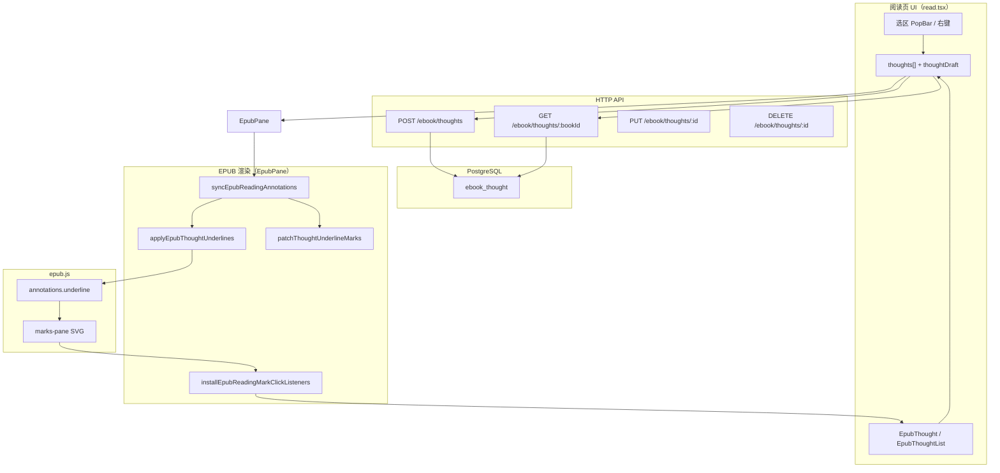
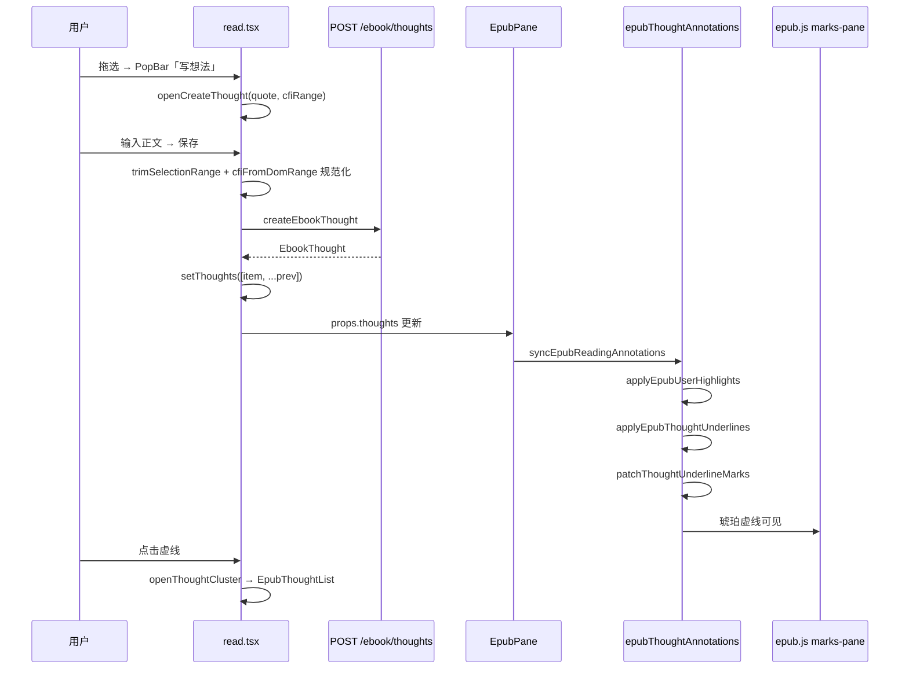
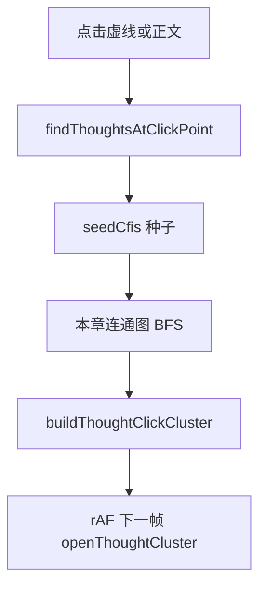

# EPUB 读书想法添加与虚线下划线 — 开发者实现手册

## 文档角色

**本文档**：EPUB 读书想法（添加 + 虚线 + 侧栏 + 点击聚合）的 **唯一完整开发者手册**。原分散在多篇姊妹文中的内容已并入下文对应章节，**读本文即可**，无需再跳转其它想法专题。

**推荐阅读顺序**：

| 顺序 | 章节 | 内容 |
|------|------|------|
| 1 | **§0** | 从何下手：维护定位表 / M1–M7 从零顺序 / 断点调用链 |
| 2 | **§2**（尤其 **§2.0、§2.9、§2.10**） | **白话实现思路**：全景 / 分场景 / 按文件拆解 + 例子走读 |
| 3 | **§3–§8** | 数据模型、添加、划线、sync、点击（含源码） |
| 4 | **§13–§19** | 产品范围、侧栏 UI、桥接规则、重叠去重、稳定性、全量回归 |
| 5 | **§10 + §19** | 验收清单 |

**仍须另读（非想法专题）**：[EPUB用户划线开发.md](./EPUB用户划线开发.md)（用户彩色划线）、[EPUB听书用户划线对账.md](../EPUB听书用户划线对账.md)（听 current 与划线）。

**历史姊妹文**（已归档为索引，细节以本文为准）：`EPUB想法下划线实现.md`、`EPUB阅读想法.md`、`EPUB想法侧面板.md`、`EPUB想法聚类桥接.md`、`EPUB想法部分重叠.md` — 文首仅保留跳转表。

---

## 0. 开发者从何下手（必读）

本章回答：**打开仓库后第一步做什么、按什么顺序改、改完怎么知道对了**。**想先懂「怎么实现的」** → 读 [§2.0](#20-白话五分钟整功能怎么跑起来)、[§2.9](#29-分场景白话详解一看就懂怎么实现)、[§2.10](#210-实现拆解按文件--例子走读具体怎么写进代码的)；本节给**可执行的步骤表**。

### 0.1 先判断：你要哪种工作？

| 你的目标 | 走哪条路 | 预计涉及 |
|----------|----------|----------|
| **在现有项目上改 bug / 加小需求** | → [§0.2 维护路径](#02-维护现有功能按需求定位) | 通常 1–3 个文件 |
| **在新分支从零做一版「读书想法」** | → [§0.3 从零实现顺序](#03-从零实现严格按阶段顺序做) | 后端 → 前端 state → 渲染 → 交互 |
| **只想搞懂一次完整用户操作** | → [§0.4 跟一遍运行时调用链](#04-跟一遍运行时调用链调试地图) | 浏览器 + 断点 |

本仓库**已经实现完整功能**。多数情况是 **§0.2 维护路径**；只有新仓库或大规模重写才走 §0.3。

### 0.2 维护现有功能：按需求定位

用下表 **直接跳到文件 + 函数**，改完用「怎么验」自测。细节代码见 §4–§7。

| 需求 / 现象 | 先打开 | 关键符号 | 怎么验 |
|-------------|--------|----------|--------|
| 选区后无法「写想法」/ 无 CFI | `epubSelectionToolbarAttach.ts` | 选区 → `cfiRange` 写入 PopBar payload | 拖选后 PopBar 出现；断点看 payload.cfiRange 非空 |
| 点写想法侧栏不开 | `read.tsx` | `openCreateThought` | 无 CFI 应 Toast；有 CFI 应 `thoughtDialogOpen=true` |
| 保存失败 / 401 | `service/index.ts` + 后端 `ebook.controller.ts` | `createEbookThought` | Network 看 POST `/ebook/thoughts` 状态码与 body |
| 保存成功但正文 **无线** | `EpubPane.tsx` | `useEffect([thoughts])` → `syncEpubReadingAnnotations` | React DevTools：`thoughts` 含新 id；断点进 `applyEpubThoughtUnderlines` |
| 有线但是 **黑色/矩形框** | `epubThoughtAnnotations.ts` | `ensureThoughtUnderlineStyles`、`patchThoughtUnderlineMarks` | 断点进 patch；看 marks-pane 里 `<line stroke>` |
| 与用户 **粉块重叠** 双线或穿帮 | `epubUserHighlights.ts` | `syncEpubReadingAnnotations` **顺序**；`collectUserHighlightBlockerSources` | 必须先 apply 用户线再 apply 想法线（§2.4.4） |
| **拖选松手** 误开列表 | `epubThoughtAnnotations.ts` | `attachThoughtMarkClickGuard` | mousedown 后 mark `pointer-events:none` |
| **单击虚线** 无反应 | `epubUserHighlights.ts` | `installEpubReadingMarkClickListeners`、`markClicked` | 断点 `onThoughtClusterClick`；看 `thoughtIds` |
| 列表 **缺条** / 聚合不对 | `epubThoughtCluster.ts` | `findThoughtsAtClickPoint`、`reconcileThoughtClickCluster` | 见 [§16](#16-点击聚合与桥接规则cluster) |
| 删想法后线还在 | `epubThoughtAnnotations.ts` | `applyEpubThoughtUnderlines` 里 purge 分支 | `thoughts` 少一条后应对 CFI `annotations.remove` |
| 编辑想法改了定位（不应发生） | `read.tsx` | `saveThought` 仅 create 写 cfi/quote | update 只 PUT content |

**维护时最小闭环**：拖选 → 写想法 → 保存 → **看见琥珀虚线** → 再点线进列表。任一步失败，用上表定位阶段。

### 0.3 从零实现：严格按阶段顺序做

**不要**同时写 UI 和 patch 重叠逻辑。每一阶段 **只做表中「本阶段工作」**，验过再进下一阶段；否则无法判断 bug 在哪一层。

#### 阶段 M1：能存能查（无 UI、无划线）

| 步 | 做什么 | 文件（按顺序创建/改） |
|----|--------|------------------------|
| 1 | 建表 `ebook_thought` | `apps/backend/.../ebook-thought.entity.ts`、migration |
| 2 | DTO + 校验 | `dto/create-ebook-thought.dto.ts`、`update-...` |
| 3 | Service CRUD | `ebook.service.ts`：`listThoughts`、`createThought`、`updateThought`、`removeThought` |
| 4 | Controller 路由 | `ebook.controller.ts`：`GET/POST/PUT/DELETE` under `/ebook/thoughts` |
| 5 | 删书级联 | `ebook.service.remove` 里 `thoughtRepo.delete({ bookId, userId })` |
| 6 | 前端类型 + API | `types.ts` 的 `EbookThought`；`service/index.ts` 四个函数 |

**验收**：Postman 或 curl — `POST` 一条 → `GET` 按 bookId 能拿回；字段含 `cfiRange`、`quote`、`content`。

**本阶段不要做**：React 组件、epub.js、任何 SVG。

---

#### 阶段 M2：能写能存（有侧栏，仍无划线）

| 步 | 做什么 | 文件 |
|----|--------|------|
| 1 | 阅读页拉列表 | `read.tsx`：`useEffect` + `fetchEbookThoughts` → `thoughts` state |
| 2 | 选区入口 | 已有 PopBar：`onSelectionPopBarWriteThought` → `openCreateThought(quote, cfiRange)` |
| 3 | 撰写 state | `read.tsx`：`thoughtDraft`、`thoughtDialogOpen`、`thoughtDialogMode` |
| 4 | 打开撰写 | `openCreateThought`：校验 cfi、关 PopBar、填 draft、开侧栏 |
| 5 | 保存 | `saveThought`：`createEbookThought` → `setThoughts` |
| 6 | 侧栏 UI | `EpubThought.tsx` + `EbookReadSplitLayout` 的 `sidePanel` 分支 |

**验收**：EPUB 拖选 → 写想法 → 保存 → Network 200 → 刷新页面后 GET 仍能拉到；**正文还没有线是正常的**。

**本阶段不要做**：`annotations.underline`、不要改 `EpubPane` 渲染。

---

#### 阶段 M3：能看见线（丑线即可）

| 步 | 做什么 | 文件 |
|----|--------|------|
| 1 | thoughts 传入渲染层 | `read.tsx` → `EpubPane` props：`thoughts={thoughts}` |
| 2 | thoughts 变化时 sync | `EpubPane.tsx`：`useEffect([thoughts, rendReady])` 调 sync |
| 3 | 只做 apply | 新建/扩 `epubThoughtAnnotations.ts`：`groupThoughtsByCfi` + `applyEpubThoughtUnderlines` |
| 4 | appliedRef | `EpubPane` 里 `useRef<Map>` 存 `cfiRange → signature`，skip 未变 CFI |
| 5 | 注册 underline | `rend.annotations.underline(cfi, { thoughtIds }, …, EPUB_THOUGHT_UNDERLINE_CLASS, styles)` |

**验收**：保存想法后，正文下方出现 **任意颜色** 的线或 mark-pane 里能看到 `<g>`；翻页再回来线仍在（或 relocated 后再 sync 后仍在）。

**本阶段不要做**：`patchThoughtUnderlineMarks`、用户划线、点击列表。

---

#### 阶段 M4：线长得对（琥珀虚线）

| 步 | 做什么 | 文件 |
|----|--------|------|
| 1 | 注入 CSS | `ensureThoughtUnderlineStyles`：隐藏 rect 描边、line 琥珀 dasharray |
| 2 | patch 入口 | `patchThoughtUnderlineMarks`：遍历 `g.moke-epub-thought-ul` |
| 3 | 挂到 sync 末尾 | 在 apply 之后调用 patch（可先直接在 `EpubPane` effect 里调，后再并入 `syncEpubReadingAnnotations`） |
| 4 | relayout | `rend.on('rendered')` debounce 后再 sync（`EpubPane` 已有类似逻辑可对齐） |

**验收**：深色主题下 **细琥珀虚线**，不是黑色实线、不是虚线框矩形。

---

#### 阶段 M5：与用户划线共存

| 步 | 做什么 | 文件 |
|----|--------|------|
| 1 | 统一 sync | `epubUserHighlights.ts`：`syncEpubReadingAnnotations` |
| 2 | 固定顺序 | 先 `applyEpubUserHighlights`，再 `applyEpubThoughtUnderlines` |
| 3 | blocker | `collectUserHighlightBlockerSources` → patch 前注入 → `computeThoughtLineSegmentsNotOverlappingHighlights` |

**验收**：同段先用户高亮再写想法：重叠处虚线被扣掉；只删用户线不影响想法数据。

---

#### 阶段 M6：点击与防误触

| 步 | 做什么 | 文件 |
|----|--------|------|
| 1 | 拖选 guard | `attachThoughtMarkClickGuard` |
| 2 | mark 点击 | `installEpubReadingMarkClickListeners` → `markClicked` → `thoughtIds` |
| 3 | 开列表 | `read.tsx`：`openThoughtCluster` + `EpubThoughtList` |
| 4 | 有选区则忽略 | `hasTextSelectionInRend` 在 click 路由里 return |

**验收**：拖选松手 **不** 弹列表；轻点虚线 **进列表**；列表点条目进详情。

---

#### 阶段 M7：重叠与聚合（可最后做）

| 工作 | 文件 | 文档 |
|------|------|------|
| 部分相交只画一段线 | `patchThoughtUnderlineMarks` blocker | [§17](#17-部分重叠与用户划线叠加) |
| 点击多 CFI 合并列表 | `epubThoughtCluster.ts` | [§16](#16-点击聚合与桥接规则cluster) |

**验收**：两句相交只一条虚线；点击桥接区域列表含多条。

---

### 0.4 跟一遍运行时调用链（调试地图）

在 **已跑通的环境** 里设断点，建议顺序（新建想法）：

```text
1. [选区] epubSelectionToolbarAttach → payload { selectedText, cfiRange }
2. [入口] read.tsx openCreateThought(quote, cfiRange)
3. [保存] read.tsx saveThought
         → resolveCfiDomRange / cfiFromDomRange 规范化
         → createEbookThought POST
         → setThoughts([item, ...])
4. [渲染] EpubPane useEffect(thoughts)
         → syncEpubReadingAnnotations(rend, thoughts, highlights, ...)
5. [apply] applyEpubThoughtUnderlines
         → groupThoughtsByCfi
         → rend.annotations.underline(cfi, { thoughtIds })
6. [patch] runEpubReadingAnnotationPatch
         → patchThoughtUnderlineMarks
7. [点击] markClicked / findThoughtsAtClickPoint
         → openThoughtCluster → EpubThoughtList
```

**本地启动**（实现或联调时）：

```bash
# 后端（仓库根目录，按项目惯例）
# 前端
cd apps/frontend && npm run dev
# 打开 EPUB 阅读页，登录态下操作
```

若 **第 4 步断点不进**：检查 `EpubPane` 是否收到 `thoughts`、`rendReady` 是否为 true。  
若 **第 5 步不进**：检查 `applyEpubThoughtUnderlines` 是否被 sync 调用、CFI 是否 `resolveCfiDomRange` 成功。  
若 **第 6 步无线段**：先看 marks-pane 有无 `<g>`，再进 patch。

### 0.5 三个最容易卡住的点

| 卡点 | 典型原因 | 处理 |
|------|----------|------|
| **保存成功但没有线** | `thoughts` 没传到 `EpubPane`；或 CFI 在当前章解析失败 | 看 props；`display(cfi)` 或切到对应章后再 sync |
| **线有了但一翻页没了** | 未监听 `relocated`/`rendered` 再 sync | `EpubPane` 里 debounce sync |
| **拖选就弹列表** | guard 未绑或 pointer-events 恢复太早 | 检查 `attachThoughtMarkClickGuard`；mouseup 用 setTimeout(0) |

### 0.6 需求 → 实现对照（产品语言）

| 产品需求 | 你要实现的实质 | 最早在哪一阶段可用 |
|----------|----------------|-------------------|
| 选中文字写感想 | POST + 侧栏 compose | M2 |
| 正文标记读过 | underline mark | M3（M4 才好看） |
| 同段多条想法 | DB 多行 + 同 CFI 一个 mark + `thoughtIds[]` | M3 |
| 点击标记看列表 | click → cluster → list | M6 |
| 不与彩色划线打架 | sync 顺序 + blocker patch | M5 |
| 嵌套/相交不太丑 | patch blocker + cluster | M7 |

---

## 1. 架构总览

### 1.1 分层



### 1.2 核心设计决策

| 决策 | 原因 |
|------|------|
| 每条想法独立一行 DB 记录 | 同段可有多条感想，列表按时间倒序 |
| 同 `cfiRange` 只画 **一条** underline | epub.js 一个 CFI 对应一个 mark；`thoughtIds` 数组挂多条 id |
| 用 `annotations.underline`，**不用** `highlight` | 与用户彩色划线槽位分离，避免 remove 互相误删 |
| apply 后 **patch** SVG `<line>` | epub.js 默认黑色实线 + rect 虚线框；需琥珀细虚线 + 线下偏移 |
| 用户划线 **blocker** 扣减重叠段 | 用户实色块/线下划线盖住想法虚线重叠部分 |
| 短选区 **先画**、长选区后画并扣减 | 句级想法不被整段虚线完全盖住（partial overlap） |
| 选区进行中 `pointer-events: none` | 拖选松手不误触打开想法列表 |

### 1.3 关键源码路径

| 模块 | 路径 |
|------|------|
| 类型定义 | `apps/frontend/src/views/ebook/types.ts` |
| HTTP 客户端 | `apps/frontend/src/service/index.ts` |
| 阅读页状态与保存 | `apps/frontend/src/views/ebook/read.tsx` |
| 下划线 apply + patch | `apps/frontend/src/views/ebook/utils/epubThoughtAnnotations.ts` |
| 批注 sync 编排 | `apps/frontend/src/views/ebook/utils/epubUserHighlights.ts` |
| 点击聚合 | `apps/frontend/src/views/ebook/utils/epubThoughtCluster.ts` |
| Rendition 挂载 | `apps/frontend/src/views/ebook/components/EpubPane.tsx` |
| 后端实体 | `apps/backend/src/services/ebook/ebook-thought.entity.ts` |
| 后端服务 | `apps/backend/src/services/ebook/ebook.service.ts` |

---

## 2. 详细实现思路

本章回答：**为什么要拆成这些模块、每一步解决什么问题、若从零实现应按什么顺序做**。  
**不想先看术语**：直接读 **[§2.0](#20-白话五分钟整功能怎么跑起来)**、**[§2.9](#29-分场景白话详解一看就懂怎么实现)**、**[§2.10](#210-实现拆解按文件--例子走读具体怎么写进代码的)**（按文件 + 「傻皇帝」例子走读）；代码细节见 §4 起。

### 2.0 白话五分钟：整功能怎么跑起来

想象你在微信读书里划一段话、写感想——我们程序里其实是 **四条线** 在并行工作：

```text
① 记地址（CFI）  →  ② 存数据库  →  ③ 在正文上画标记  →  ④ 点标记打开侧栏
```

下面用**人话**把四条线串起来（先建立画面，后面 §2.1 起再讲「为什么」）。

#### ① 记地址：选中字的那一刻

1. 用户在 EPUB 正文（iframe 里）拖选文字，松手。
2. PopBar（浮动条）或右键菜单出现；此时程序**立刻**做两件事：
   - 把选中的字复制成 `quote`（给人看的摘录）；
   - 用 epub.js 把选区转成 **CFI**（给机器看的「这段字在电子书第几章第几段第几个字」）。
3. 这两个值放进 `selectionPopBarRef`（一个 ref，相当于「便签条」），**不能等侧栏打开再算**——那时选区往往已经没了。

**没有 CFI 就不让写想法**：没有地址，刷新或换设备后找不到同一段字，虚线也就画不对位置。

#### ② 存数据库：点保存

1. 用户点「写想法」，右侧出现输入框（`read.tsx` 把 `thoughtDialogOpen` 设为 true）。
2. 输入正文点保存 → `saveThought`：
   - 再 trim 一遍选区，把 CFI/quote **规范化**（去掉首尾空白，和 DOM 对齐）；
   - `POST /ebook/thoughts`，body 里带 `bookId、cfiRange、quote、content`；
   - 服务器写入 `ebook_thought` 表，返回带 `id` 的整条记录。
3. 前端 `setThoughts([新记录, ...旧列表])`——**全书想法只维护这一份数组**，侧栏和 EPUB 渲染都读它。

**同一段写第二条想法**：数据库多一行（两个 id），但 `cfiRange` 相同；渲染层会把两个 id 塞进**同一条**虚线的 `thoughtIds` 里，所以正文仍只有一条线。

#### ③ 画标记：保存后自动出现琥珀虚线

1. `thoughts` 变了 → `EpubPane` 的 `useEffect` 被触发。
2. 调用 `syncEpubReadingAnnotations`（批注总调度），里面固定顺序做：
   - 先画**用户彩色划线**（如果有）；
   - 再画**想法虚线**（`applyEpubThoughtUnderlines`：按 CFI 向 epub.js 注册 underline）；
   - 最后 **patch**（`patchThoughtUnderlineMarks`：把默认黑线改成琥珀细虚线，并扣掉被粉块或其它想法占用的线段）。
3. epub.js 在正文上方盖一层透明 SVG（marks-pane），虚线画在这层里，**跟着正文一起滚**。

**为什么要 apply 又 patch？**  
apply 是「告诉 epub.js：这段 CFI 要有个标记」；patch 是「epub.js 画完以后，我们拿改锥刀修样式和重叠」——库默认是黑实线，也不会帮你处理「和粉块重叠就不画」。

#### ④ 点标记：打开右侧列表

1. 用户**轻点**虚线（不是拖选）。
2. `markClicked` 或几何命中 → 找到点中的想法 id → 再算 **cluster**（哪些相邻/嵌套/桥接的想法应一起显示）。
3. `read.tsx` 打开 `EpubThoughtList`：上面是合并后的引用摘录，下面是想法卡片列表；点某条再进详情。

**拖选松手不会开列表**：拖选时 marks 层暂时 `pointer-events: none`，mouseup 不会点到虚线上；若仍有选区残留，click 路由也会直接忽略。

---

**一张图记全局**（保存一条新想法）：

```text
拖选 → PopBar 拿到 quote+CFI
     → openCreateThought 开右栏
     → saveThought POST
     → setThoughts 更新
     → EpubPane sync
         → apply 注册 underline
         → patch 修线型+扣重叠
     → 用户看到琥珀虚线
点击虚线 → cluster 聚合 → 右栏列表
```

---

EPUB 读书想法不是「在 React 里画一条线」这么简单，实际约束来自三层：

| 层 | 约束 | 对设计的影响 |
|----|------|----------------|
| **产品** | 同一段可有多条想法；点击虚线进列表；拖选不误开列表；与用户彩色划线共存 | 数据一行一条想法，渲染一 CFI 一条 mark；点击与选区必须分流 |
| **epub.js** | 定位靠 **CFI**；批注画在 **marks-pane SVG**；`underline` / `highlight` 是不同槽位；relayout 会重建 DOM | 不能指望「只存 quote」；apply 后还要 patch；不能把想法与用户划线混用 API |
| **工程** | 阅读页已有 MK 问书、用户划线、PopBar、分栏；想法不能拖垮首屏 | 想法列表 **全书一次 GET**；渲染 **增量 sync**（`appliedRef` 签名 skip）；UI 与渲染解耦（`read.tsx` 管 state，`EpubPane` 管 rendition） |

**核心矛盾**：数据库粒度是「一条想法一行」，epub.js 粒度是「一个 CFI 一个 underline mark」。中间必须用 **`groupThoughtsByCfi` + `thoughtIds[]`** 做聚合，且列表 UI 仍按 thought 行展示。

### 2.2 总体方案：三层数据 + 双阶段渲染

```text
┌─────────────────────────────────────────────────────────────┐
│ 持久层：ebook_thought（每想法一行：cfiRange + quote + content）│
└───────────────────────────┬─────────────────────────────────┘
                            │ GET/POST 同步到
┌───────────────────────────▼─────────────────────────────────┐
│ 页面 state：read.tsx 的 thoughts[]（全书内存列表，单一数据源）   │
└───────────────────────────┬─────────────────────────────────┘
                            │ props 传入 EpubPane
┌───────────────────────────▼─────────────────────────────────┐
│ 渲染层：                                                        │
│   ① apply — rend.annotations.underline(cfi) 注册 mark        │
│   ② patch — 改 SVG line 颜色/位置，扣减与用户线/其它想法重叠    │
└─────────────────────────────────────────────────────────────┘
```

**为何必须双阶段（apply + patch）？**

1. **apply 阶段**：epub.js 只负责「在 CFI 对应区域插 `<g>` + 命中 rect + 占位 line」。这是官方扩展点，翻页、滚动时 marks-pane 会跟着走。
2. **patch 阶段**：库默认 line 是黑色实线、rect 会继承 stroke 变成虚线框；且**无法**在 apply 时表达「与用户粉块重叠 30px 不画线」。重叠扣减必须在拿到 SVG rect 坐标后做**水平区间减法**。

若试图跳过 patch、只用 CSS：epub.js 会把样式 merge 到 `g` 上，深色主题仍会出现 rect 描边；且**无法**做 thought-thought / thought-highlight 的逐像素 blocker。

**为何想法用 `underline`、用户线用 `highlight`？**

- `annotations.remove(cfi, type)` 按 **type** 删除。共用 `highlight` 时，删用户线会误删想法 mark，或播放层清 highlight 时误伤（见 [EPUB听书用户划线对账.md](../EPUB听书用户划线对账.md)）。
- 槽位分离后，purge 用户线与 purge 想法线互不干扰。

### 2.3 想法添加：逐步推理

#### 2.3.1 定位信息从哪来？

用户拖选发生在 **iframe 内文**，`read.tsx` 拿不到 Range，必须由 **`attachEpubSelectionPopBar`**（或右键菜单）在选区仍有效时：

1. 用 `contents.cfiFromRange(range)` 得到 **cfiRange**；
2. 用 `range.toString()` 得到 **quote**（展示用摘录）；
3. 封装为 `EpubSelectionPopBarPayload` 交给 `read.tsx`。

**实现要点**：CFI 必须在 **mouseup 当时** 计算；侧栏打开后再读 Selection 往往已 collapse。PopBar payload 存于 `selectionPopBarRef`，写想法时从 ref 读，而不是再查 DOM。

**若无 CFI**：不打开撰写面板，Toast `cfiFailed`——没有稳定定位就无法保证刷新后虚线还在同一段。

#### 2.3.2 为何保存前再规范化 CFI/quote？

`saveThought` 里会：

```text
resolveCfiDomRange(cfi) → trimSelectionRange → cfiFromDomRange + quote = range.toString()
```

原因：

- PopBar 生成 CFI 时可能含边界空白节点；**trim 后再转 CFI** 与 DOM 实际选区一致，减少「同段两条 CFI 字符串略不同」导致的重复 mark。
- 仅 **create** 写库 CFI/quote；**update** 只改 `content`，避免编辑文字时动定位。

#### 2.3.3 侧栏 state：撰写 vs 列表 vs MK 互斥

`read.tsx` 用一组布尔 + draft 驱动右侧 `sidePanel`（见 [§15](#15-右侧分栏-ui-状态机)）：

| 状态 | 条件 | 渲染 |
|------|------|------|
| MK 问书 | `assistantOpen` | `EbookAssistant`（优先级最高） |
| 想法详情/撰写 | `thoughtDialogOpen` | `EpubThought`（create/view/edit） |
| 想法列表 | `thoughtListPanelOpen` | `EpubThoughtList` |

`openCreateThought` 刻意做：

- `setAssistantOpen(false)` — 与 MK 同栏互斥；
- `setSelectionPopBar(null)` — 避免 PopBar 挡侧栏；
- `returnToListClusterRef` — 从列表点「再写一条」时，保存后 **reconcile** 原 cluster，而不是丢失列表上下文。

**保存成功后的 UX 路径**：

- 新建 → `setThoughtListOpen(true)` + 构建/更新 `thoughtListCluster`，让用户立刻看到刚写的那条；
- 编辑 → 关 dialog，列表/cluster 不变。

#### 2.3.4 从 POST 到出现虚线（无需手动刷 DOM）

数据流是 **单向 React props**：

```text
saveThought → setThoughts(updated)
  → EpubPane props.thoughts 变化
  → useEffect([thoughts, highlights]) 
  → syncEpubReadingAnnotations
  → applyEpubThoughtUnderlines（新 CFI 注册 underline）
  → runEpubReadingAnnotationPatch（patch 琥珀虚线）
```

**不要**在 `saveThought` 里直接调 `rend.annotations`——否则 bypass 用户线 blocker 顺序，且与 relayout 时 sync 逻辑分叉。

#### 2.3.5 后端：为何 username 不入库？

想法表只存 `userId`；列表/详情返回前 **批量查 user 表**填 `username`/`avatar`。这样用户改名后历史想法显示新昵称，且不做冗余同步。

删书时 **`thoughtRepo.delete({ bookId, userId })`** 级联清想法，避免孤儿记录。

### 2.4 想法划线：逐步推理

#### 2.4.1 Apply 流水线（注册 mark）

对 `thoughts[]` 每次 sync：

```text
groupThoughtsByCfi
  → 对每个 cfiRange：
       若 appliedRef 签名未变 → skip（性能）
       否则 remove + underline(cfi, { thoughtIds, showLine })
  → 对 appliedRef 里已不在 grouped 的 CFI → remove
```

**签名** `buildThoughtUnderlineSignature(thoughtIds, showLine)`：同 CFI 下 id 列表变化（新增第二条想法）才重绘，避免 relayout 全量闪烁。

**叠放顺序** `sortCfiGroupsForUnderlineStack`：**长 quote 先 apply、短 quote 后 apply**。这样 marks-pane 里短选区 mark 在 DOM 顺序上更靠后，为 patch 阶段「短选区先画线、长选区后画并扣减」提供基础。

#### 2.4.2 Patch 流水线（把线画对）

`patchThoughtUnderlineMarks` 对每个 `<g.moke-epub-thought-ul>`：

```text
1. prepareThoughtUnderlineMark
   → 读 rect 列表、CFI、showLine、估算 span（行宽之和）

2. 按 compareThoughtMarksForLineDrawOrder 排序
   → 较短 span 的 mark 先进入绘制循环（关键：句级想法先占线）

3. 对每个 rect（一行文字一块 hit box）：
   a. parseSvgMarkRect → 局部 SVG 坐标
   b. 收集 userHighlightBlockerSources（用户粉/蓝块占用的 x 区间）
   c. 收集 thoughtLineBlockerSources（已画想法虚线占用的 x 区间）
   d. computeThoughtLineSegmentsNotOverlappingHighlights
      → 从 [localX, localX+width] 减去 blocker 区间 → 多段 {x1,x2,y}
   e. 若本 mark 画了可见段 → appendThoughtLineBlockerRects 登记供后续 mark 扣减

4. applyThoughtUnderlineLineSegments
   → 写 <line> 的 x1/x2/y1/y2、stroke、dasharray；无段则 hide
```

**为何在 SVG 局部坐标做减法，不用 getClientRects？**

marks-pane 与正文同步滚动，**rect 的 x/y/width/height 已由 epub.js 维护**；局部坐标减法 O(n) 且 relayout 稳定。client 坐标在 iframe 缩放/分栏 resize 时要额外换算。

**用户线下划线 vs 波浪线 blocker**：下划线只用 **rect** 扣减；波浪线还要读 **path** 几何（否则 path 比 rect 窄，会漏扣）。见 `collectUserHighlightBlockerSources`。

#### 2.4.3 三种重叠策略对照

| 关系 | 示例 | 策略 | 数据 |
|------|------|------|------|
| **同 CFI 多条想法** | 同段写两次感想 | 一条 underline，`thoughtIds=[id1,id2]` | 多行 DB |
| **严格嵌套** | 「傻皇帝」⊂「傻皇帝与黑美人」 | 短选区先画 + 长选区 patch 扣减；点击仍可按坐标命中内层 | 两行 DB、两个 CFI |
| **部分相交** | 「…杨广死」与「死于…」共享「死」 | thoughtBlocker 扣重叠水平段，只留一条虚线 | 两行 DB；详见 [§17](#17-部分重叠与用户划线叠加) |

嵌套判定 **`isThoughtCfiRangeStrictlyContained`**：优先 DOM Range 边界比较；解析失败则 **quote 严格子串 + 同 spine hint** 回退。

#### 2.4.4 Sync 编排顺序（不可乱）

`syncEpubReadingAnnotations` 固定顺序：

```text
1. applyEpubUserHighlights     ← 用户线 mark 先存在
2. applyEpubThoughtUnderlines  ← 想法 underline 注册
3. collectUserHighlightBlockerSources → 注入 patch 上下文
4. runEpubReadingAnnotationPatch
     → patchUserHighlightMarks
     → patchThoughtUnderlineMarks
     → restackThoughtMarkGroups / restackUserHighlightMarkGroups
```

若先 apply 想法再 apply 用户线，patch 时用户 blocker 为空，虚线会 **画进粉块底下** 再被盖住，且扣减逻辑错误。

`relocated` / `rendered` 时 debounce 再 sync：翻页后 CFI 可能暂时解析失败，**等 rendered 再 apply** 减少空 mark。

### 2.5 点击与防误触：两套机制

**问题**：marks-pane 盖在文字上，用户拖选松手时 mouseup 落在 mark 上 → epub.js 触发 `markClicked` → 误开想法列表。

**解法 A — pointer-events 窗口期**（`attachThoughtMarkClickGuard`）：

- `mousedown/touchstart` on iframe → 全部想法 mark `pointer-events: none`；
- 顶层 `pointerup/touchend` + `setTimeout(0)` → 恢复 `auto`。
- 保证 **选区手势整轮** 不会 hit test 到 mark。

**解法 B — 有选区则忽略 click**（`hasTextSelectionInRend`）：

- `markClicked` / 用户线 click 路由里，若任一 iframe 仍有非空 Selection → return。

两者叠加：A 防 mouseup 命中，B 防程序性残留选区。

**点击命中后**：

```text
markClicked(thoughtIds) 或 findThoughtsAtClickPoint(clientX,Y)
  → scheduleThoughtClusterClick（合并相邻/桥接 CFI，见 epubThoughtCluster.ts）
  → openThoughtCluster → EpubThoughtList
```

列表与详情分离：**第一次点击永远进列表**（即使只有 1 条），与微信读书习惯一致；列表项再进 `EpubThought` view 模式。

### 2.6 侧栏与引用锚点（与添加联动）

- `thoughtQuoteAnchorCfiRef`：打开撰写/列表时记录 **primary CFI**，分栏 resize 或开合后 `scrollEpubCfiIntoView` 把左侧引用段滚回视口（[EPUB想法引用视口.md](../EPUB想法引用视口.md)）。
- `thoughtListPanelOpen` 要求 `allThoughts.length > 0`：删光列表后不再占分栏（[EPUB阅读分屏.md](../EPUB阅读分屏.md)）。

### 2.7 若从零实现：推荐排期

与 **§0.3 逐步表** 一致；此处为阶段摘要。详细「改哪些文件」以 §0.3 为准。

| 阶段 | 交付 | 验收 |
|------|------|------|
| **M1 数据** | 表 + CRUD API + `fetchEbookThoughts` / `createEbookThought` | Postman 建删查 |
| **M2 撰写 UI** | `openCreateThought` + `EpubThought` compose + `saveThought` | 能保存，暂无划线 |
| **M3 裸 underline** | `applyEpubThoughtUnderlines` only | 有线（可能黑/丑） |
| **M4 patch 样式** | CSS 注入 + `patchThoughtUnderlineMarks` 单色虚线 | 琥珀虚线正确 |
| **M5 共存** | 接入 `syncEpubReadingAnnotations` + 用户 blocker | 与粉块重叠扣减 |
| **M6 交互** | click guard + list/cluster + 防误触 | 拖选不弹窗、点击进列表 |
| **M7 重叠** | partial overlap blocker + cluster 桥接 | 嵌套/相交场景 |

**原则**：M3 之前不要写 patch；M5 之前不要接用户划线 sync；M6 之前不要写 cluster 桥接。

### 2.8 刻意不做的事（YAGNI）

| 不做 | 原因 |
|------|------|
| 按 thought id 各画一条线 | epub.js 一 CFI 一 mark；多线会叠厚且点击难拆 |
| 前端离线队列/sync 冲突合并 | 当前全书 GET + 单用户写；有需求再加 |
| PDF 想法 | 无 EPUB CFI；另产品 |
| 在 apply 阶段算重叠 | epub.js 不提供几何；必须 patch |
| 编辑改 CFI | 定位与数据一致性成本高；仅改 content |

### 2.9 分场景白话详解（一看就懂怎么实现）

下面按**真实用户场景**写「程序里具体做了什么」。每节末尾标 **涉及文件**，方便对照 §4–§8 源码。

---

#### 2.9.1 场景：第一次选中文字写想法

**用户看到**：拖选 → 点 PopBar「写想法」→ 右侧出现引用+输入框 → 保存 → 正文出现虚线。

**程序实际步骤**：

| 步 | 发生什么 | 谁负责 |
|----|----------|--------|
| 1 | iframe 里选区变化，PopBar 弹出 | `epubSelectionToolbarAttach.ts` |
| 2 | 从 `contents.cfiFromRange(range)` 得到 CFI，从 `range.toString()` 得到 quote | 同上，写入 payload |
| 3 | 用户点「写想法」→ `read.tsx` 调 `openCreateThought(quote, cfiRange)` | `read.tsx` |
| 4 | 校验 CFI 非空；关 PopBar、关 MK 助手；`thoughtDraft` 填 quote/cfi/content | `read.tsx` |
| 5 | `thoughtDialogOpen=true`，右栏渲染 `EpubThought` compose 模式 | `EpubThought.tsx` |
| 6 | 用户输入，点保存 → `saveThought` trim 后 POST | `read.tsx` + `createEbookThought` |
| 7 | 成功 → `setThoughts` 头部插入新记录；关 compose，开想法列表 | `read.tsx` |
| 8 | `EpubPane` 发现 `thoughts` 变了 → sync → apply + patch | `EpubPane.tsx` + `epubThoughtAnnotations.ts` |

**关键设计点**：保存动作**只改 React state**，不直接碰 epub.js；所有划线都走 sync，这样翻页、resize 后还能用同一套逻辑重画。

---

#### 2.9.2 场景：虚线具体是怎么画到屏幕上的

可以把过程想成 **「登记 → 占位 → 修图」** 三步：

**第一步：登记（apply）**

1. 把 `thoughts[]` 按 `cfiRange` 分组：`groupThoughtsByCfi` → 同 CFI 的多条想法合成一组。
2. 对每个 CFI 调用 `rend.annotations.underline(cfiRange, { thoughtIds: [...] })`。
3. epub.js 在 marks-pane 里插入 `<g class="moke-epub-thought-ul">`，里面有透明 `<rect>`（点击热区）和占位 `<line>`。

**第二步：占位线往往不对**

- 颜色可能是黑色；rect 可能带 stroke 像虚线框；线可能在文字中间而不是下方。
- 所以 apply **只负责「这里有想法」**，不负责最终好看。

**第三步：修图（patch）**

1. 遍历所有 `<g.moke-epub-thought-ul>`，读每个 rect 的 x/y/width/height。
2. 在 rect **底边下方 1px** 画琥珀虚线（`#d97706`，dash `1 6`）。
3. 若该段与用户粉块或其它想法线段在水平方向重叠，用 **区间减法** 把重叠部分切掉，只留没占用的 x 段。

**涉及文件**：`epubThoughtAnnotations.ts`（apply + patch）、`epubUserHighlights.ts`（sync 编排）。

---

#### 2.9.3 场景：同一段写第二条想法

**用户看到**：同一段再选一次（或引用区再点写想法）→ 保存 → 仍**一条**虚线 → 点线列表里**两条**。

**程序怎么做**：

1. 第二条 POST 后 `thoughts` 里同一 `cfiRange` 有两条记录（id 不同）。
2. `groupThoughtsByCfi` 仍只产生**一个**分组，但 `thoughtIds=[id1, id2]`。
3. apply 时发现签名变了（id 列表变了）→ 对该 CFI `remove` 旧 mark 再 `underline` 新 mark（仍是一个 g）。
4. 点击时 `markClicked` 带回两个 id，列表按 `createdAt` 倒序展示两条。

**不会**为每条想法各画一条线——epub.js 一个 CFI 只能挂一个 underline mark，多线会叠成粗线且点击难拆。

---

#### 2.9.4 场景：用户点击虚线，列表怎么知道显示哪些想法

**用户看到**：点一处虚线 → 右侧列表有时只有那一句，有时整段合并摘录。

**程序分四步**：

1. **命中**：鼠标坐标落在哪个 mark 的 rect 上？或 epub.js 的 `markClicked` 带了哪些 `thoughtIds`？
2. **种子**：把命中想法的 CFI 当作起点（seed）。
3. **扩展（桥接）**：在本章内建「谁和谁算一伙」的连通图，BFS 找出所有连通 CFI 下的全部想法。  
   - 碰在一起 → 一伙；  
   - 大段包小段 → 一伙；  
   - A、逗号、B **都标了想法** → 一伙；  
   - 中间只有**没标过的**逗号/换行 → **不**一伙。
4. **展示**：引用区 = 各 CFI 在 DOM 上的并集文字（不是简单拼 quote 字段）；列表 = cluster 里全部 thought 行。

**涉及文件**：`epubThoughtCluster.ts`（规则）、`epubUserHighlights.ts`（点击入口）、`read.tsx`（开侧栏）。细则见 §16。

---

#### 2.9.5 场景：为什么拖选松手不会误开列表

**问题从哪来**：虚线 SVG 盖在文字上面；拖选松手时 mouseup 可能落在 SVG 上，epub.js 当成「点击虚线」。

**两道保险**：

| 保险 | 做法 | 白话 |
|------|------|------|
| A | iframe `mousedown` 时，所有想法 mark 设 `pointer-events: none`；全局 `pointerup` 后再恢复 | 拖选整轮「虚线暂时摸不到」 |
| B | click 处理前检查 iframe 里是否还有非空选区 | 有选区就当作还在划字，不打开列表 |

**涉及文件**：`epubThoughtAnnotations.ts`（guard）、`epubUserHighlights.ts`（click 路由）。

---

#### 2.9.6 场景：用户粉块和想法虚线叠在一起

**用户看到**：先划粉色彩色高亮，再在同段写想法 → 粉块底下虚线被盖住；删掉粉块后虚线露出来。

**程序怎么做**：

1. sync **必须先** apply 用户 highlight，再 apply 想法 underline。
2. patch 前收集用户 mark 占用的水平区间（blocker）；粉块、实线下划线用 rect，波浪线还要读 path。
3. patch 想法线时：从本段虚线的 `[x, x+width]` 里**减去** blocker 区间，被盖住的地方不画 `<line>`。

**不会**删用户 highlight 的数据，也**不会**用 `remove(highlight)` 清想法——两种 mark 用不同 API 槽位（underline vs highlight），互不误删。

**涉及文件**：`epubUserHighlights.ts`、`epubThoughtAnnotations.ts`。

---

#### 2.9.7 场景：两句选区部分重叠，为什么只画一条虚线

**例子**：先选「…杨广死」，再选「死于…」，「死」字重叠。

**问题**：两个 CFI、两条 mark，若各自画满长线，重叠处会有**两条**琥珀虚线叠在一起。

**做法**（patch 阶段）：

1. 按选区**长度从长到短**排序，长的先画、先「占坑」。
2. 每画完一段可见虚线，把占用的 x 区间登记到 `thoughtLineBlockerSources`。
3. 后画的较短 mark 扣减已占区间 → 重叠水平段只保留一条线。
4. 数据库仍是两行 thought；点击短选区仍只出该段列表（透明热区没缩短）。

**涉及文件**：`epubThoughtAnnotations.ts` § `patchThoughtUnderlineMarks`。细则见 §17。

---

#### 2.9.8 场景：右侧分栏显示什么（MK / 写想法 / 列表）

**规则**：左半边永远是 EPUB；右半边**同一时刻只显示一种**面板，按优先级：

```text
MK 问书助手  >  写想法/看详情  >  想法列表
```

**典型切换**：

| 用户操作 | state 变化 | 右栏显示 |
|----------|------------|----------|
| 点 MK | `assistantOpen=true` | 助手 |
| 点写想法 | `assistantOpen=false`，`thoughtDialogOpen=true` | 输入框在 footer 固定 |
| 保存新想法 | `thoughtDialogOpen=false`，`thoughtListOpen=true` | 刚写那条的列表 |
| 点虚线 | `openThoughtCluster` → `thoughtListCluster` 有值 | 聚合后的列表 |
| 列表删光最后一条 | `allThoughts.length=0` | 分栏应收起（见 read-split-panel 文档） |

**涉及文件**：`read.tsx`、`EbookReadSplitLayout.tsx`、`EpubThought*.tsx`。细则见 §15。

---

#### 2.9.9 场景：翻页、改分栏宽度后线还在吗

**用户看到**：切章、拖宽侧栏、换主题后，虚线应仍在正确位置。

**程序怎么做**：

1. epub.js 翻页/重排时会重建 marks-pane → 旧 SVG 没了。
2. `EpubPane` 监听 `relocated` / `rendered`，debounce 几百毫秒后再调一次 `syncEpubReadingAnnotations`。
3. sync 用 `appliedRef` 记「这个 CFI 的 thoughtIds 签名」——没变就 skip，避免闪烁；变了才 remove+重 apply，再 patch。

**监听只绑一次**：注册 click guard / markClicked 的 effect 依赖 `[rendReady]`，与 `[thoughts]` 的 sync effect **分开**，避免重复注册导致白屏（§18）。

---

#### 2.9.10 术语对照（读源码时遇到）

| 术语 | 白话 |
|------|------|
| **CFI** | 电子书里的「坐标地址」，刷新后还能找到同一段字 |
| **marks-pane** | 盖在正文上的透明 SVG 层，划线和虚线都画在这 |
| **apply** | 向 epub.js **注册**「这段要有 mark」 |
| **patch** | 注册完成后**修改** SVG 线条样式、扣重叠 |
| **blocker** | 「这段 x 区间已被占用，别再画线」的矩形列表 |
| **cluster** | 一次点击应一起展示的那批想法 |
| **thoughtIds** | 挂在一条虚线上的多个想法 id（同 CFI 多条感想） |

### 2.10 实现拆解：按文件 + 例子走读（具体怎么写进代码的）

读完 §2.0、§2.9 仍觉得「知道流程但不知道代码在哪」时，读本节。每一小节都对应仓库里**真实存在的文件和函数名**。

---

#### 2.10.1 八个文件各管什么事（先建立地图）

| 文件 | 白话职责 | 你改这里通常是为了… |
|------|----------|---------------------|
| `read.tsx` | 阅读页「总控」：拉想法列表、开/关侧栏、保存/删改、把 `thoughts` 传给 EPUB | 保存逻辑、侧栏切换、列表打开方式 |
| `EpubPane.tsx` | EPUB 容器：`thoughts` 变了就 sync；rend 就绪后绑点击/防误触；翻页后再 sync | 保存后没线、翻页线消失、重复绑事件白屏 |
| `epubSelectionToolbarAttach.ts` | 拖选后算 CFI + quote，弹出 PopBar | 选区没有 CFI、PopBar 没「写想法」 |
| `epubThoughtAnnotations.ts` | 想法虚线：**apply** 注册 underline + **patch** 改 SVG 线 | 线颜色/样式、重叠扣线、拖选误触 guard |
| `epubUserHighlights.ts` | 批注**总调度** `syncEpubReadingAnnotations` + 用户线 + 点击分发 | sync 顺序、点击虚线进列表、与用户线共存 |
| `epubThoughtCluster.ts` | 点击时算「哪些想法算一伙」（cluster） | 列表缺条、该合的不合、该分的不分 |
| `epubRangeGeometry.ts` | CFI ↔ 浏览器 Range 互转 | CFI 解析失败、引用区摘录不对 |
| `ebook.service.ts`（后端） | 存库、鉴权、username 查询、删书级联 | API 报错、删书后想法还在 |

**数据只在一个地方是「权威」**：`read.tsx` 的 `thoughts` 数组。侧栏读它、EPUB 渲染读它；保存/删除只改这个数组，**不要**在别处再维护一份想法列表。

---

#### 2.10.2 `read.tsx` 状态变量：像仪表盘上的灯

| 变量 | 白话含义 | 典型何时变 |
|------|----------|------------|
| `thoughts` | 本书全部想法（从 GET 来，保存/删改时本地更新） | 进书、保存、删除 |
| `thoughtDraft` | 当前侧栏正在写/编的那一条：quote、cfiRange、content | `openCreateThought` / 进详情编辑 |
| `thoughtDialogOpen` | 右栏是否显示「写想法 / 看详情 / 编辑」面板 | 点写想法、保存后关、点列表项进详情 |
| `thoughtDialogMode` | `'create' \| 'view' \| 'edit'` | 打开面板时设定 |
| `thoughtListOpen` | 是否显示想法**列表**侧栏 | 点虚线、保存后、关列表 |
| `thoughtListCluster` | 本次列表要展示的「一伙想法」打包结果 | `openThoughtCluster`、保存后 rebuild |
| `returnToListClusterRef` | 从列表去写想法时，暂存原 cluster，保存后还能回到对的路 | 列表里点「再写一条」 |
| `assistantOpen` | MK 问书是否占右栏 | 点 MK / 写想法时关 MK |

**侧栏最终显示谁**：`useMemo` 里按优先级选——MK > 撰写/详情 > 列表（§15）。

---

#### 2.10.3 例子走读 A：选中「傻皇帝」→ 写想法 → 保存（逐步到函数）

假设正文有一句「傻皇帝与黑美人」，用户只选中「傻皇帝」三个字。

| 步 | 用户动作 | 程序内部（按顺序） |
|----|----------|-------------------|
| 1 | 鼠标拖选「傻皇帝」 | iframe 内 `Selection` 非空 |
| 2 | 松手 | `attachEpubSelectionPopBar` 收到选区，调用 `cfiFromRange` → 得到类似 `epubcfi(/6/4[chap]/2/1:0,/6/4[chap]/2/1:3)` 的 **cfiRange**；`quote = "傻皇帝"` |
| 3 | PopBar 出现 | payload 写入 ref：`{ selectedText: "傻皇帝", cfiRange: "..." }` |
| 4 | 点「写想法」 | `read.tsx` → `openCreateThought("傻皇帝", cfiRange)` |
| 5 | 右栏打开 | `thoughtDraft = { quote, cfiRange, content: "" }`；`thoughtDialogOpen = true`；PopBar 关掉 |
| 6 | 输入「这段有意思」点保存 | `saveThought()` |
| 7 | 保存前规范化 | `resolveCfiDomRange(rend, cfiRange)` 找回 DOM Range → `trimSelectionRange` → 再 `cfiFromDomRange`，保证存的 CFI 和 DOM 一致 |
| 8 | 请求后端 | `POST /ebook/thoughts` body: `{ bookId, cfiRange, quote: "傻皇帝", content: "这段有意思" }` |
| 9 | 返回 `{ id: "uuid-1", ... }` | `setThoughts([新记录, ...旧])` — 此时内存里多一行 |
| 10 | 关撰写、开列表 | `thoughtDialogOpen = false`；`thoughtListOpen = true`；`thoughtListCluster` = 仅含 uuid-1 的单 CFI cluster |
| 11 | React 重渲染 | `EpubPane` 收到新 `thoughts` prop |
| 12 | sync 触发 | `useEffect([thoughts,...])` → `syncEpubReadingAnnotations(rend, thoughts, highlights, ...)` |
| 13 | apply | `groupThoughtsByCfi` → 一个 key=cfiRange；`annotations.underline(cfiRange, { thoughtIds: ["uuid-1"] })` |
| 14 | patch | 找到新 `<g.moke-epub-thought-ul>`，在「傻皇帝」三字下方画琥珀虚线（若无粉块遮挡） |
| 15 | 用户看到 | 正文「傻皇帝」下出现细虚线；右栏是刚写的那条列表 |

**此例没有做的事**：`saveThought` **没有**直接调用 `rend.annotations`——划线全靠第 11–14 步的 props 驱动 sync。

---

#### 2.10.4 例子走读 B：点击那条虚线 → 右侧列表

接上面，用户**单击**（不是拖选）「傻皇帝」下的虚线。

| 步 | 发生什么 | 函数 / 机制 |
|----|----------|-------------|
| 1 | epub.js 触发 `markClicked`，data 带 `thoughtIds: ["uuid-1"]` | `installEpubReadingMarkClickListeners` |
| 2 | 检查是否在划字 | `hasTextSelectionInRend` → false 才继续 |
| 3 | 用 id 从 `getThoughts()` 取完整 `EbookThought` 对象 | 回调里传入的 thoughts 即 props |
| 4 | 算 cluster | `buildThoughtClickClusterFromCandidates`：只有一处 CFI → cluster 就这一条 |
| 5 | 延迟一帧 | `scheduleThoughtClusterClick`（避免卡住滚动） |
| 6 | 回调到阅读页 | `read.tsx` → `openThoughtCluster(cluster)` |
| 7 | 开列表 | `setThoughtListCluster(cluster)`；`setThoughtListOpen(true)`；`setThoughtDialogOpen(false)` |
| 8 | 右栏 | `EpubThoughtList` 显示引用「傻皇帝」+ 列表项「这段有意思」 |
| 9 | 再点列表项 | `openViewThought(thought)` → `thoughtDialogMode='view'`，详情在侧栏 |

若同段还有第二条想法（同 cfiRange、id 为 uuid-2），第 1 步 `thoughtIds` 会是 `["uuid-1","uuid-2"]`，列表显示两条，**仍只有一条虚线**。

---

#### 2.10.5 `EpubPane`：两个 effect 分工（必记）

```text
┌─────────────────────────────────────────────────────────────┐
│ Effect A  依赖 [rendReady]                                   │
│   → installEpubThoughtUnderlineListeners（拖选 guard）        │
│   → installEpubReadingMarkClickListeners（点虚线）           │
│   只做一次：像「给电话装接听器」                              │
└─────────────────────────────────────────────────────────────┘

┌─────────────────────────────────────────────────────────────┐
│ Effect B  依赖 [thoughts, highlights, rendReady]             │
│   → syncEpubReadingAnnotations（改 marks-pane 上的 SVG）     │
│   想法增删改、用户划线变、首次 rend 就绪都会跑                │
└─────────────────────────────────────────────────────────────┘
```

**为什么不能合并成一个 effect？**  
若 `[thoughts]` 变化时重复 `install...Listeners`，会叠多层 `markClicked` 监听 → 点一次开多个列表，严重时渲染异常/白屏。

**翻页**：`rendered` / `relocated` 事件里 debounce 再调 `syncEpubReadingAnnotations`——因为 epub.js 重建了 marks-pane，要用最新 `thoughts` 把线画回来。

---

#### 2.10.6 `syncEpubReadingAnnotations` 四步（一次同步里具体干什么）

可以把一次 sync 想成工厂流水线：

```text
第 1 步  applyEpubUserHighlights
         → 按 highlights[] 在用户选区画彩色 mark（粉/蓝块等）

第 2 步  applyEpubThoughtUnderlines
         → 按 thoughts[] 在每个 CFI 注册想法 underline mark

第 3 步  collectUserHighlightBlockerSources + setUserHighlightBlockerSourcesForThoughtPatch
         → 扫描用户 mark 的 SVG rect/path，记下「哪些 x 区间被占了」

第 4 步  runEpubReadingAnnotationPatch
         → patchUserHighlightMarks（用户线修形）
         → patchThoughtUnderlineMarks（想法虚线修形 + 扣 blocker）
         → restack（用户 mark 叠在想法 mark 上面，点击优先）
```

**第 2 步必须在第 1 步之后**：否则第 3 步扫不到用户 mark，想法虚线会画进粉块底下。

**第 4 步里双 requestAnimationFrame**：epub.js 刚写完 SVG 可能还没布局完，等两帧再改 `<line>` 坐标更稳。

---

#### 2.10.7 marks-pane 里实际长什么样（DOM 结构）

epub.js apply 之后，在正文上方 SVG 里大致是：

```text
<svg class="epubjs-marks-pane">          ← 透明层，跟着 iframe 滚
  <g class="moke-epub-thought-ul" ref="moke-epub-thought-ul"
     data-thought-ids="uuid-1,uuid-2"     ← 点击时读 thoughtIds
     data-show-line="1">
    <rect x="120" y="400" width="80" .../>  ← 透明热区，负责接收点击
    <line x1="120" y1="415" x2="200" .../>  ← patch 前可能是黑的；patch 后琥珀虚线
  </g>
  <g class="moke-epub-user-hl" ...>        ← 用户粉块，另一套 class
    ...
  </g>
</svg>
```

**apply 负责插入 `<g>` + 占位 `<rect>`/`<line>`**；**patch 负责改 `<line>` 的 x1/x2/stroke/dasharray，并按 blocker 可能拆成多段 line**。

---

#### 2.10.8 patch「区间减法」数字例子

某行文字对应 rect：水平从 **x=100** 到 **x=300**（宽 200px）。要在底边 y=420 画虚线。

- **无 blocker**：画一条 line，`x1=100, x2=300`。
- **用户粉块**占 x=150~220：blocker 区间 `[150,220]` → 减法后两段线 `[100,150]` 和 `[220,300]`，中间 70px 不画（被粉块盖住）。
- **另有一条更长的想法虚线**已占 x=180~250（thoughtBlocker）：后处理的短 mark 再减去这段 → 可能与用户 blocker 叠加扣减。

实现函数：`subtractHorizontalIntervals(100, 300, [[150,220]])` → `[[100,150],[220,300]]`。与用户划线共用同一套数学。

---

#### 2.10.9 编辑 / 删除想法时程序怎么走

**编辑（只改正文）**

1. 列表进详情 → `thoughtDialogMode='edit'`，`thoughtDraft.id` 有值。
2. `saveThought` 走 `PUT /ebook/thoughts/:id`，body **只有** `{ content }`。
3. `setThoughts` 替换同 id 那条的 content；**cfiRange 不变** → apply 签名不变 → **虚线不用重画**。

**删除**

1. `deleteEbookThought(id)` → `setThoughts(filter 掉 id)`。
2. 若该 CFI 下还有别的想法 → apply 时 `thoughtIds` 变短，重 underline 同一条 mark。
3. 若该 CFI 最后一条也没了 → apply 的 purge 分支 `annotations.remove(cfiRange, 'underline')`，虚线消失。
4. 若删光列表里所有条 → `thoughtListCluster` 空 → 分栏应收起（`thoughtListPanelOpen` 变 false）。

---

#### 2.10.10 cluster 桥接：三个白话小例子

| 正文情况 | 点 A 处虚线 | 列表里有什么 |
|----------|-------------|--------------|
| 「有才，心里很不舒服」——只给「有才」和「心里」分别标了想法，**逗号没标** | 只显示「有才」相关 | **只有** A 段想法，不含 B |
| 「有才，心里」——**逗号也单独标了一条**想法 | 引用可显示「有才，心里…」 | A + 逗号想法 + B **合并** |
| 大段「傻皇帝与黑美人」包着小段「傻皇帝」 | 点内层或外层 | **整簇**想法（嵌套规则 R5） |

实现都在 `epubThoughtCluster.ts` 的 `areThoughtCfisConnected` 五条判定里；细则 §16。

---

#### 2.10.11 从零写代码时，最小可运行切片

若你要**亲手写第一版**，按这个切片验证（每步都能单独跑通）：

1. **只 POST + GET**：无 UI，curl 能存能查。
2. **只侧栏**：`openCreateThought` + `saveThought`，保存后 Network 200，**不**接 `EpubPane` thoughts。
3. **只一条丑线**：`EpubPane` 传 `thoughts`，`applyEpubThoughtUnderlines` 不做 patch——能看见 `<g>` 即可。
4. **琥珀虚线**：加 `patchThoughtUnderlineMarks`。
5. **能点**：`markClicked` → `openThoughtCluster` → 列表。
6. **最后**才做 blocker、cluster、防误触。

与 §0.3 的 M1–M7 一一对应；**不要跳步**。

---

## 3. 数据模型与 API

> **白话**：想法在数据库里就是一行记录——「谁、哪本书、选区地址 CFI、摘录 quote、正文 content」。前端 `EbookThought` 类型与表字段一一对应；`username` 是查 user 表临时填上的，不写入想法表。下面贴类型与 API 源码。

### 3.1 前端类型 `EbookThought`

**来源**：`apps/frontend/src/views/ebook/types.ts`（约 L71–L85）

```typescript
// EPUB 读书想法（服务端存储，按 CFI 定位）
export type EbookThought = {
	// 主键 UUID
	id: string;
	// 发帖用户 id（JWT 对应）
	userId: number;
	// epub.js CFI range，唯一定位选区
	cfiRange: string;
	// 选中的原文摘录（展示用，可与 DOM 略有空白差异）
	quote: string;
	// 用户输入的想法正文（≤500 字由 UI 限制，API MaxLength 16384）
	content: string;
	// 查询时由 user 表实时解析，不入库
	username: string;
	avatar: string;
	createdAt: string;
	updatedAt: string;
};
```

### 3.2 后端实体

**来源**：`apps/backend/src/services/ebook/ebook-thought.entity.ts`

```typescript
// TypeORM 实体，映射表 ebook_thought
@Entity('ebook_thought')
// 复合索引：按用户 + 书籍拉列表
@Index('idx_ebook_thought_user_book', ['userId', 'bookId'])
export class EbookThought {
	@PrimaryGeneratedColumn('uuid')
	id: string;

	@Column({ type: 'int', name: 'user_id' })
	userId: number;

	@Column({ type: 'uuid', name: 'book_id' })
	bookId: string;

	// EPUB CFI 字符串，与前端 cfiRange 一致
	@Column({ type: 'text', name: 'cfi_range' })
	cfiRange: string;

	@Column({ type: 'text' })
	quote: string;

	@Column({ type: 'text' })
	content: string;

	@CreateDateColumn({ name: 'created_at', type: 'timestamp' })
	createdAt: Date;

	@UpdateDateColumn({ name: 'updated_at', type: 'timestamp' })
	updatedAt: Date;
}
```

### 3.3 创建 DTO 与校验

**来源**：`apps/backend/src/services/ebook/dto/create-ebook-thought.dto.ts`

```typescript
export class CreateEbookThoughtDto {
	@IsUUID()
	bookId: string;

	@IsString()
	@MinLength(1)
	@MaxLength(8192)
	cfiRange: string;

	@IsString()
	@MinLength(1)
	@MaxLength(8192)
	quote: string;

	@IsString()
	@MinLength(1)
	@MaxLength(16384)
	content: string;
}
```

### 3.4 后端 `createThought`

**来源**：`apps/backend/src/services/ebook/ebook.service.ts`（约 L837–L851）

```typescript
async createThought(
	userId: number,
	dto: CreateEbookThoughtDto,
): Promise<EbookThoughtDto> {
	// 校验该书属于当前用户（防越权写他人书）
	await this.assertBookOwned(userId, dto.bookId);
	// 构造 ORM 行，trim 掉 CFI/quote/content 首尾空白
	const row = this.thoughtRepo.create({
		userId,
		bookId: dto.bookId,
		cfiRange: dto.cfiRange.trim(),
		quote: dto.quote.trim(),
		content: dto.content.trim(),
	});
	// 写入数据库
	await this.thoughtRepo.save(row);
	// 附带 username/avatar 返回 DTO
	return this.toThoughtDtoWithUsername(row);
}
```

### 3.5 前端 HTTP 封装

**来源**：`apps/frontend/src/service/index.ts`（约 L2054–L2088）

```typescript
/** GET /ebook/thoughts/:bookId — 进入阅读页时拉全量列表 */
export const fetchEbookThoughts = async (
	bookId: string,
): Promise<EbookThought[]> => {
	const res = await http.get<EbookThought[]>(`${EBOOK_THOUGHTS}/${bookId}`);
	return res.data;
};

/** POST /ebook/thoughts — 新建想法 */
export const createEbookThought = async (body: {
	bookId: string;
	cfiRange: string;
	quote: string;
	content: string;
}): Promise<EbookThought> => {
	const res = await http.post<EbookThought>(EBOOK_THOUGHTS, body);
	return res.data;
};

/** PUT /ebook/thoughts/:id — 仅更新 content */
export const updateEbookThought = async (
	thoughtId: string,
	body: { content: string },
): Promise<EbookThought> => {
	const res = await http.put<EbookThought>(
		`${EBOOK_THOUGHTS}/${thoughtId}`,
		body,
	);
	return res.data;
};

/** DELETE /ebook/thoughts/:id */
export const deleteEbookThought = async (thoughtId: string): Promise<void> => {
	await http.delete(EBOOK_THOUGHTS, { params: [thoughtId] });
};
```

---

## 4. Part I — 想法添加（前端）

> **本节与 §2.3、§2.9.1、§2.10.3 对照**：§2 用白话讲流程；本节贴 `read.tsx` 关键源码。

### 4.0 白话：添加想法就是改 state + 调 API，不直接画线

```text
openCreateThought  →  填 thoughtDraft，开侧栏
saveThought        →  POST/PUT，setThoughts
EpubPane           →  发现 thoughts 变了，自己去 sync 画线（§6）
```

下面按「进书加载 → 入口 → 打开面板 → 保存」顺序贴代码。

### 4.1 进入阅读页：加载想法列表

**来源**：`apps/frontend/src/views/ebook/read.tsx`（约 L249–L272）

```typescript
useEffect(() => {
	// 换书时清空 cluster 连通性缓存（点击聚合用）
	invalidateThoughtClusterConnectivityCache();
	if (!bookId) {
		setThoughts([]);
		return;
	}
	let cancelled = false;
	// 异步拉取该书全部想法
	void fetchEbookThoughts(bookId)
		.then((list) => {
			if (!cancelled) setThoughts(list);
		})
		.catch((e) => {
			if (!cancelled) {
				Toast({
					type: 'error',
					title: t('ebook.read.thought.loadFailed'),
					message: getRequestErrorMessage(e),
				});
			}
		});
	return () => {
		cancelled = true;
	};
}, [bookId, t]);
```

`thoughts` 经 props 传入 `EpubPane`；`EpubPane` 的 `useEffect([thoughts, highlights])` 触发 `syncEpubReadingAnnotations`，从而绘制虚线（见 §6）。

### 4.2 入口：选区 PopBar「写想法」

**白话逐步**：

1. 用户在 EPUB **iframe 正文**里拖选（不是外层 React 页面）。
2. `attachEpubSelectionPopBar` 监听 iframe 的 `mouseup` / 选区变化。
3. 有选区时调用 epub.js：`contents.cfiFromRange(range)` → **cfiRange**；`range.toString()` → **quote**。
4. 组装 `EpubSelectionPopBarPayload`，交给 `read.tsx` 显示 PopBar（浮动在选区附近）。
5. 用户点「写想法」→ `onSelectionPopBarWriteThought` 从 ref 读出 payload → `openCreateThought(quote, cfiRange)`。
6. **右键**「写想法」走同一条路，只是 payload 存在 `contextPayloadRef`，菜单关闭时 ref 仍保留。

**常见坑**：若在侧栏打开后才去 iframe 里读 Selection，往往已 collapse → CFI 为空 → Toast `cfiFailed`。

数据流：

1. 用户在 iframe 内拖选 → `attachEpubSelectionPopBar` 生成 `EpubSelectionPopBarPayload`（含 `selectedText`、`cfiRange`）。
2. `read.tsx` 的 `onSelectionPopBarWriteThought` 读取 payload → 调用 `openCreateThought(quote, cfiRange)`。
3. 右键菜单「写想法」同理，经 `contextPayloadRef` 传入 quote + cfi。

### 4.3 `openCreateThought` — 打开右侧撰写面板

**来源**：`apps/frontend/src/views/ebook/read.tsx`（约 L875–L909）

```typescript
const openCreateThought = useCallback(
	(quote: string, cfiRange?: string) => {
		// 无有效摘录则直接返回
		const trimmed = quote.trim();
		if (!trimmed) return;
		// CFI 解析失败时不打开面板，Toast 提示
		if (!cfiRange) {
			Toast({
				type: 'error',
				title: t('ebook.read.thought.cfiFailed'),
			});
			return;
		}
		// 记录引用锚点，供侧栏开合后 scroll 回引用段
		thoughtQuoteAnchorCfiRef.current = cfiRange.trim();
		// 关闭 MK 问书，避免与想法侧栏互斥冲突
		setAssistantOpen(false);
		// 关闭 PopBar，避免与侧栏叠加
		setSelectionPopBar(null);
		selectionPopBarRef.current = null;
		// 若当前在想法列表，关闭列表但保留 cluster 快照以便保存后回到列表
		if (thoughtListClusterRef.current) {
			returnToListClusterRef.current = thoughtListClusterRef.current;
		}
		setThoughtListOpen(false);
		// 初始化 draft：create 模式无 id
		setThoughtDraft({
			id: '',
			quote: trimmed,
			cfiRange,
			content: '',
			username: '',
			avatar: '',
			createdAt: '',
			updatedAt: '',
		});
		setThoughtDialogMode('create');
		setThoughtDialogOpen(true);
		// 触发 EpubThought 内 compose 区 scrollIntoView
		setThoughtComposeScrollKey((key) => key + 1);
	},
	[t],
);
```

侧栏渲染：`thoughtDialogOpen` 为 true 时 `sidePanel` 挂载 `EpubThought`（compose / view / edit 模式由 `thoughtDialogMode` 控制）。

### 4.4 `saveThought` — 保存（创建 / 更新）

**来源**：`apps/frontend/src/views/ebook/read.tsx`（约 L972–L1035，完整函数）

```typescript
const saveThought = useCallback(async () => {
	// 正文、CFI、bookId 缺一不可；防重复提交
	const content = thoughtDraft.content.trim();
	if (!content || !thoughtDraft.cfiRange || !bookId || thoughtSaving) {
		return;
	}
	setThoughtSaving(true);
	try {
		let cfiRange = thoughtDraft.cfiRange;
		let quote = thoughtDraft.quote;
		const rend = epubNavRef.current?.getRendition();
		// 保存前用当前 DOM 再规范化 CFI/quote（选区与 CFI 可能因 trim 略有偏差）
		if (rend) {
			const resolved = resolveCfiDomRange(rend, cfiRange);
			if (resolved) {
				const normalized = trimSelectionRange(resolved);
				cfiRange = cfiFromDomRange(rend, normalized) ?? cfiRange.trim();
				quote = normalized.toString().trim() || quote.trim();
			}
		}
		if (thoughtDialogMode === 'create') {
			// POST 新建
			const item = await createEbookThought({
				bookId,
				cfiRange,
				quote,
				content,
			});
			setThoughts((prev) => {
				// 新记录插到列表头部（与 API createdAt DESC 展示一致）
				const updated = [item, ...prev];
				const snapshot = returnToListClusterRef.current;
				const clusterCfis = snapshot
					? new Set(snapshot.quoteGroups.map((group) => group.cfiRange))
					: null;
				// 若从列表点「再写一条」且 CFI 仍在原 cluster，reconcile 列表
				if (clusterCfis?.has(item.cfiRange)) {
					const reconciled = reconcileThoughtClickCluster(
						snapshot!,
						updated,
						epubNavRef.current?.getRendition() ?? undefined,
					);
					if (reconciled) {
						setThoughtListCluster(reconciled);
					}
				} else {
					// 否则打开仅含本条的新 cluster 列表
					setThoughtListCluster(
						buildSingleCfiCluster(updated, item.cfiRange) ?? null,
					);
				}
				return updated;
			});
			// 保存成功后切到想法列表侧栏
			setThoughtListOpen(true);
			returnToListClusterRef.current = null;
		} else if (thoughtDraft.id) {
			// PUT 仅更新正文
			const item = await updateEbookThought(thoughtDraft.id, { content });
			setThoughts((prev) => prev.map((t) => (t.id === item.id ? item : t)));
		}
		setThoughtDialogOpen(false);
	} catch (e) {
		Toast({
			type: 'error',
			title: t('ebook.read.thought.saveFailed'),
			message: getRequestErrorMessage(e),
		});
	} finally {
		setThoughtSaving(false);
	}
}, [bookId, t, thoughtDialogMode, thoughtDraft, thoughtSaving]);
```

**保存后虚线如何出现**：`setThoughts` 更新 → `EpubPane` props.thoughts 变化 → §6 `syncEpubReadingAnnotations` → `applyEpubThoughtUnderlines` 在新 CFI 注册 underline。

---

## 5. Part II — 想法虚线渲染

> **本节与 §2.4、§2.9.2、§2.10.6–§2.10.8 对照**：§2 讲 apply/patch 双阶段；本节贴 `epubThoughtAnnotations.ts` 核心实现。

### 5.0 白话：划线 = apply 登记 + patch 修 SVG

| 阶段 | 输入 | 输出 | 一句话 |
|------|------|------|--------|
| apply | `thoughts[]` | marks-pane 里多个 `<g.moke-epub-thought-ul>` | 告诉 epub.js「这些 CFI 有想法」 |
| patch | 上一步的 SVG + 用户 blocker | 琥珀 `<line>`，重叠处可能分段或消失 | 把线画对、画好看 |

### 5.1 常量与样式令牌

**来源**：`apps/frontend/src/views/ebook/utils/epubThoughtAnnotations.ts`（约 L33–L91）

| 符号 | 值 | 含义 |
|------|-----|------|
| `EPUB_THOUGHT_UNDERLINE_CLASS` | `moke-epub-thought-ul` | epub.js mark class / ref |
| `THOUGHT_LINE_COLOR` | `#d97706` | 琥珀色 |
| `THOUGHT_LINE_DASHARRAY` | `1 6` | 细虚线 |
| `THOUGHT_LINE_OFFSET_PX` | `1` | 线相对文字底边偏移 |
| `EPUB_THOUGHT_UNDERLINE_STYLES` | stroke 等 | 传给 `annotations.underline` 的初始样式 |

注入 CSS（`ensureThoughtUnderlineStyles`）覆盖 epub.js 在 `g` 上继承 stroke 导致的**虚线矩形框**，并把 `<line>` 强制为琥珀虚线。

### 5.2 按 CFI 分组 `groupThoughtsByCfi`

**来源**：`apps/frontend/src/views/ebook/utils/epubThoughtAnnotations.ts`（约 L778–L790）

```typescript
function groupThoughtsByCfi(
	thoughts: EbookThought[],
): Map<string, EbookThought[]> {
	// key: trim 后的 cfiRange，value: 该段全部想法
	const map = new Map<string, EbookThought[]>();
	for (const thought of thoughts) {
		const cfi = thought.cfiRange.trim();
		if (!cfi) continue;
		const list = map.get(cfi) ?? [];
		list.push(thought);
		map.set(cfi, list);
	}
	return map;
}
```

**要点**：数据库仍是一行一条；渲染层 **每个 CFI 一组**，一组只调用一次 `annotations.underline`，data 里带 `thoughtIds: string[]`。

### 5.3 `applyEpubThoughtUnderlines` — 注册 / 增量 sync

**来源**：`apps/frontend/src/views/ebook/utils/epubThoughtAnnotations.ts`（约 L958–L1007，完整函数）

```typescript
export function applyEpubThoughtUnderlines(
	rend: Rendition,
	thoughts: EbookThought[],
	appliedRef: Map<string, string>,
): void {
	try {
		// 主文档 + 各 iframe 注入下划线 CSS
		ensureThoughtUnderlineStyles();
	} catch {
		return;
	}

	// 按 CFI 聚合
	const grouped = groupThoughtsByCfi(thoughts);
	const nextCfis = new Set(grouped.keys());

	// 删除已不存在的 CFI 对应 underline
	for (const cfiRange of [...appliedRef.keys()]) {
		if (!nextCfis.has(cfiRange)) {
			try {
				rend.annotations.remove(cfiRange, 'underline');
			} catch {
				// ignore
			}
			appliedRef.delete(cfiRange);
		}
	}

	// 长选区先 apply、短选区后 apply（叠放顺序为 patch 做准备）
	const sortedEntries = sortCfiGroupsForUnderlineStack([...grouped.entries()]);

	for (const [cfiRange, group] of sortedEntries) {
		const thoughtIds = group.map((t) => t.id);
		const showLine = true;
		// 签名 = showLine + thoughtIds，未变则 skip
		const nextSig = buildThoughtUnderlineSignature(thoughtIds, showLine);
		if (appliedRef.get(cfiRange) === nextSig) continue;

		try {
			// 先 remove 再 underline，避免 epub.js 重复 mark
			rend.annotations.remove(cfiRange, 'underline');
			rend.annotations.underline(
				cfiRange,
				{
					thoughtIds,
					[THOUGHT_MARK_DATA_SHOW_LINE]: showLine ? '1' : '0',
				},
				undefined,
				EPUB_THOUGHT_UNDERLINE_CLASS,
				EPUB_THOUGHT_UNDERLINE_STYLES,
			);
			appliedRef.set(cfiRange, nextSig);
		} catch {
			appliedRef.delete(cfiRange);
		}
	}
}
```

`appliedRef` 存在 `EpubPane` 的 ref 中，key 为 `cfiRange`，value 为签名串，避免每次 relayout 全量重绘。

### 5.4 `patchThoughtUnderlineMarks` — 把 SVG 线画对

epub.js 在 marks-pane 生成 `<g class="moke-epub-thought-ul">` + `<rect>` + `<line>`。默认 line 位置/颜色不对，且可能与用户划线、其它想法重叠。

**来源**：`apps/frontend/src/views/ebook/utils/epubThoughtAnnotations.ts`（约 L536–L601，核心循环摘录）

```typescript
function patchThoughtUnderlineMarks(
	root: ParentNode = document,
	rend?: Rendition,
): void {
	// 找出所有想法 underline 分组
	const groupEls = [
		...root.querySelectorAll(
			`g.${EPUB_THOUGHT_UNDERLINE_CLASS}, g[ref="${EPUB_THOUGHT_UNDERLINE_CLASS}"]`,
		),
	] as SVGElement[];
	if (groupEls.length === 0) return;

	// 预处理每个 mark：rect 列表、是否 showLine、CFI、跨度
	const prepared = groupEls.map((groupEl) =>
		prepareThoughtUnderlineMark(groupEl, rend),
	);

	const thoughtLineBlockerSources: UserHighlightBlockerSource[] = [];
	const lineSegmentsByGroup = new Map<SVGElement, ThoughtLineSegment[][]>();
	// 较短选区先画（compareThoughtMarksForLineDrawOrder）
	const drawOrder = [...prepared].sort(compareThoughtMarksForLineDrawOrder);

	for (const item of drawOrder) {
		const perRectSegments: ThoughtLineSegment[][] = [];

		for (const rect of item.rects) {
			const thoughtLocal = parseSvgMarkRect(rect);
			if (!thoughtLocal) {
				perRectSegments.push([]);
				continue;
			}

			// 用户彩色划线占用的水平区间 → blocker
			const userBlockers = getHighlightBlockerRectsForThought(
				thoughtLocal,
				userHighlightBlockerSources,
			);
			// 已画想法虚线占用的区间 → thoughtBlockers
			const thoughtBlockers = getHighlightBlockerRectsForThought(
				thoughtLocal,
				thoughtLineBlockerSources,
			);
			const segments = item.showLine
				? computeThoughtLineSegmentsNotOverlappingHighlights(thoughtLocal, [
						...userBlockers,
						...thoughtBlockers,
					])
				: [];
			perRectSegments.push(segments);

			// 登记本 mark 已画线段，供后续较长选区扣减
			if (item.showLine && segments.length > 0) {
				appendThoughtLineBlockerRects(
					thoughtLineBlockerSources,
					item.cfi,
					thoughtLocal,
					segments,
				);
			}
		}

		lineSegmentsByGroup.set(item.groupEl, perRectSegments);
	}

	// 把算好的线段写入各 <line> 坐标与 stroke
	for (const item of prepared) {
		applyThoughtUnderlineLineSegments(
			item,
			lineSegmentsByGroup.get(item.groupEl) ?? [],
		);
	}
}
```

`computeThoughtLineSegmentsNotOverlappingHighlights` 对每一行 rect 做**水平区间减法**，得到不被 blocker 盖住的多段 `{x1,x2,y}`，再写到 SVG line 上（见同文件 `subtractHorizontalIntervals`）。

### 5.5 嵌套选区（严格包含）

当想法 B 的 CFI/quote **严格包含** 想法 A 时，历史上曾用 `showLine=0` 隐藏内层可见线；当前实现以 **patch 层 blocker + 短选区优先** 为主（见 [§17](#17-部分重叠与用户划线叠加)）。

判定工具函数 **`isThoughtCfiRangeStrictlyContained`**（导出）：

**来源**：`apps/frontend/src/views/ebook/utils/epubThoughtAnnotations.ts`（约 L903–L945）

```typescript
export function isThoughtCfiRangeStrictlyContained(
	inner: string,
	outer: string,
	innerGroup: EbookThought[],
	outerGroup: EbookThought[],
	rend: Rendition,
): boolean {
	return isCfiRangeStrictlyContained(
		inner,
		outer,
		innerGroup,
		outerGroup,
		rend,
	);
}

function isCfiRangeStrictlyContained(
	inner: string,
	outer: string,
	innerGroup: EbookThought[],
	outerGroup: EbookThought[],
	rend: Rendition,
): boolean {
	if (inner === outer) return false;

	const innerRange = resolveCfiDomRange(rend, inner);
	const outerRange = resolveCfiDomRange(rend, outer);
	if (innerRange && outerRange) {
		return isDomRangeStrictlyContained(innerRange, outerRange);
	}

	const innerQuote = innerGroup[0]?.quote?.trim() ?? '';
	const outerQuote = outerGroup[0]?.quote?.trim() ?? '';
	if (!isQuoteStrictlyNested(innerQuote, outerQuote)) return false;

	return extractCfiSpineHint(inner) === extractCfiSpineHint(outer);
}
```

---

## 6. Part III — Sync 编排（EpubPane）

> **白话**：`syncEpubReadingAnnotations` 是「批注总开关」——每次 `thoughts` 或用户 `highlights` 变了，或翻页重排后，都走它：先画用户线、再登记想法线、收集粉块占用的 x 区间、最后统一 patch 修线型和扣重叠。`EpubPane` 负责在正确时机调用它，并**单独**绑点击/防误触（§2.10.5）。

> **本节与 §2.4.4、§2.10.6 对照**。

### 6.1 `syncEpubReadingAnnotations`

**来源**：`apps/frontend/src/views/ebook/utils/epubUserHighlights.ts`（约 L2440–L2466）

```typescript
export function syncEpubReadingAnnotations(
	rend: Rendition,
	thoughts: EbookThought[],
	highlights: EbookUserHighlight[],
	appliedThoughtsRef: Map<string, string>,
	appliedHighlightsRef: Map<string, string>,
): void {
	beginEpubAnnotationSyncScope();
	try {
		invalidateAppliedUserHighlightsMissingDom(rend, appliedHighlightsRef);
		setUserHighlightBlockerSourcesForThoughtPatch([]);
		// 1. 先 apply 用户划线（collect blocker 数据源）
		const highlightPlan = buildHighlightRenderPlan(rend, highlights);
		applyEpubUserHighlights(
			rend,
			highlights,
			appliedHighlightsRef,
			highlightPlan,
		);
		// 2. 再 apply 想法 underline
		applyEpubThoughtUnderlines(rend, thoughts, appliedThoughtsRef);
		// 3. 把用户划线 rect 传给 thought patch
		setUserHighlightBlockerSourcesForThoughtPatch(
			collectUserHighlightBlockerSources(rend),
		);
		// 4. 统一 patch 用户线 + 想法虚线 + restack
		runEpubReadingAnnotationPatch(rend);
	} finally {
		endEpubAnnotationSyncScope();
	}
}
```

**顺序不可颠倒**：用户划线必须先于想法 underline apply，patch 阶段才能用用户 rect 扣减想法虚线。

### 6.2 EpubPane 挂载点

**来源**：`apps/frontend/src/views/ebook/components/EpubPane.tsx`

| 时机 | 调用 |
|------|------|
| `useEffect([thoughts, highlights, rendReady])` | `syncEpubReadingAnnotations(...)` |
| `useEffect([rendReady])` | `installEpubThoughtUnderlineListeners`（选区防误触 guard） |
| `useEffect([rendReady])` | `installEpubReadingMarkClickListeners`（点击虚线 / 用户线） |
| `rend.on('relocated'/'rendered')` | debounced `syncEpubReadingAnnotations`（翻页/重排后重绘） |

---

## 7. Part IV — 点击打开想法列表

> **白话**：点击分两条路进列表——epub.js 的 `markClicked`（点 SVG 虚线）或几何命中（点正文但坐标落在透明 rect 上）。进去之前先确认用户不是在拖选（guard + 有选区则 return）；然后用 `thoughtIds` 或坐标找想法，再 `epubThoughtCluster` 扩展成 cluster，最后一帧 `openThoughtCluster` 开右栏列表。

> **本节与 §2.5、§2.10.4 对照**。

### 7.1 防误触：`attachThoughtMarkClickGuard`

**来源**：`apps/frontend/src/views/ebook/utils/epubThoughtAnnotations.ts`（约 L700–L749，摘录）

```typescript
function attachThoughtMarkClickGuard(rend: Rendition): () => void {
	const contentCleanups = new Map<EpubIframeContents, () => void>();

	const onSelectionPointerDown = () => {
		// 拖选开始：整页想法 mark 不可点
		setThoughtMarkPointerEvents('none');
	};

	const onSelectionPointerUp = () => {
		// 下一轮 task 再恢复，避免 mouseup 同轮触发 mark click
		setTimeout(() => setThoughtMarkPointerEvents('auto'), 0);
	};

	const bindContents = (contents: EpubIframeContents) => {
		if (contentCleanups.has(contents)) return;
		const doc = contents.document;
		doc.addEventListener('mousedown', onSelectionPointerDown, true);
		doc.addEventListener('touchstart', onSelectionPointerDown, true);
		contentCleanups.set(contents, () => {
			doc.removeEventListener('mousedown', onSelectionPointerDown, true);
			doc.removeEventListener('touchstart', onSelectionPointerDown, true);
		});
	};

	rend.hooks.content.register(bindContents);
	// ... 绑定已有 iframe ...

	document.addEventListener('pointerup', onSelectionPointerUp, true);
	document.addEventListener('touchend', onSelectionPointerUp, true);

	return () => {
		// 解绑所有 listener
	};
}
```

### 7.2 点击分发：`markClicked` → cluster → 侧栏

**来源**：`apps/frontend/src/views/ebook/utils/epubUserHighlights.ts` 中 `installEpubReadingMarkClickListeners`

要点：

1. `hasTextSelectionInRend(rend)` 为 true 时 **忽略** mark 点击（与 guard 双保险）。
2. mark data 含 `thoughtIds` → 查 `getThoughts()` → `scheduleThoughtClusterClick` → `onThoughtClusterClick(cluster)`。
3. `read.tsx` 的 `openThoughtCluster` 设置 `thoughtListCluster` + `thoughtListOpen(true)`，渲染 `EpubThoughtList`。

**来源**：`apps/frontend/src/views/ebook/read.tsx`（约 L955–L968）

```typescript
const openThoughtCluster = useCallback(
	(cluster: EbookThoughtClickCluster) => {
		if (cluster.allThoughts.length === 0) return;
		const rend = epubNavRef.current?.getRendition() ?? undefined;
		const { cfiRange } = getThoughtClusterHighlightSubject(cluster, rend);
		if (cfiRange.trim()) {
			thoughtQuoteAnchorCfiRef.current = cfiRange.trim();
		}
		startTransition(() => {
			setAssistantOpen(false);
			setThoughtListCluster({ ...cluster, selectedThoughtId: undefined });
			setThoughtListOpen(true);
		});
	},
	[],
);
```

聚合规则（多 CFI 桥接、部分相交）见 **`epubThoughtCluster.ts`** 与 [§16](#16-点击聚合与桥接规则cluster)。

---

## 8. 端到端时序（新建一条想法）



---

## 9. 与用户划线的边界（实现时必须分离）

| 维度 | 想法虚线 | 用户划线 |
|------|----------|----------|
| epub.js API | `annotations.underline` | `annotations.highlight` |
| remove 类型 | `'underline'` | `'highlight'` |
| class | `moke-epub-thought-ul` | `moke-epub-user-hl` 等 |
| 数据表 | `ebook_thought` | `ebook_highlight` |
| 点击 | 想法列表 | PopBar 改色/删除 |

**禁止**对用户划线调用 `remove(cfi,'underline')` 或对想法调用 `remove(cfi,'highlight')`，否则 mark 互相误删。

---

## 10. 开发者验收清单

### 10.1 添加

- [ ] 无 CFI 时 PopBar「写想法」Toast 报错，不打开侧栏
- [ ] 保存后 `thoughts` 含新 id，`EpubPane` 出现新 CFI 虚线
- [ ] 同 CFI 第二条想法保存后仍 **一条** 虚线，列表显示 2 条
- [ ] 编辑仅改 content，不新增 CFI/underline
- [ ] 删书后该书 thoughts 级联删除（后端）

### 10.2 划线

- [ ] 深色主题下虚线为琥珀色细虚线，非黑色实线
- [ ] 用户粉色高亮与想法虚线重叠处，虚线被扣减
- [ ] 两句部分相交的想法，重叠水平段只一条虚线
- [ ] 翻页 / relayout 后虚线仍在（sync + patch）

### 10.3 交互

- [ ] 拖选松手 **不** 打开想法列表
- [ ] 单击虚线打开列表；再点条目进详情
- [ ] 与用户划线同区域点击时，短选区 / 精确 hit 优先

---

## 11. 扩展与常见坑

| 坑 | 说明 | 处理 |
|----|------|------|
| 虚线变矩形框 | epub.js stroke 继承到 rect | `ensureThoughtUnderlineStyles` + patch rect |
| 保存后无线 | thoughts 未传入 EpubPane / sync 未跑 | 检查 `useEffect([thoughts])` |
| 重叠双线 | 未走 patch blocker | 确认 `runEpubReadingAnnotationPatch` 在 apply 之后 |
| 听 current 误删划线 | 播放层 remove highlight | 播放用独立 class，见 [EPUB听书用户划线对账.md](../EPUB听书用户划线对账.md) |
| PDF 无想法 | 无 EPUB CFI | 产品范围仅 EPUB |

---

## 12. 相关源码索引

| 能力 | 主文件 | 关键符号 |
|------|--------|----------|
| 打开撰写 | `read.tsx` | `openCreateThought`, `saveThought`, `deleteThought` |
| 列表/详情 UI | `EpubThought.tsx`, `EpubThoughtList.tsx` | `onSave`, `onOpenThoughtDetail` |
| underline apply | `epubThoughtAnnotations.ts` | `applyEpubThoughtUnderlines`, `groupThoughtsByCfi` |
| underline patch | `epubThoughtAnnotations.ts` | `patchThoughtUnderlineMarks`, `computeThoughtLineSegmentsNotOverlappingHighlights` |
| sync 编排 | `epubUserHighlights.ts` | `syncEpubReadingAnnotations`, `runEpubReadingAnnotationPatch` |
| 点击 | `epubUserHighlights.ts` | `installEpubReadingMarkClickListeners` |
| 聚合 | `epubThoughtCluster.ts` | `findThoughtsAtClickPoint`, `reconcileThoughtClickCluster` |
| CFI 几何 | `epubRangeGeometry.ts` | `resolveCfiDomRange`, `cfiFromDomRange` |

---

## 13. 产品需求与工程范围

（原 `EPUB阅读想法.md` 产品层说明，开发实现须满足。）

**人话版**：登录用户能在 EPUB 里划字写感想；感想存服务器、换设备还能看见；正文用**一条琥珀虚线**标记位置；同一段可以写很多条，但线只有一条；删书时想法一起删；PDF 暂不支持。

### 13.1 功能要点

- **登录**后写想法；数据存**服务端**，同账号换设备可同步。
- **同一段（同一 CFI）可有多条想法**；列表按 `createdAt` **倒序**。
- 正文 **琥珀色细虚线**；同 CFI **只画一条线**，点击进**列表**（即使只有 1 条）。
- **重叠选区**：嵌套时外层可见线；部分相交时重叠段只一条线（§17）。
- **username** 查询时从 user 表解析，**不入** `ebook_thought`。
- **删书**级联删除该书下当前用户全部想法。
- **仅 EPUB**；PDF 无正文 CFI，不挂载想法侧栏。

### 13.2 工程改动范围（全链路文件）

| 区域 | 路径 |
|------|------|
| 实体与迁移 | `apps/backend/src/services/ebook/ebook-thought.entity.ts`、`migrations/*ebook_thought*` |
| DTO / API | `dto/create-ebook-thought.dto.ts`、`dto/update-ebook-thought.dto.ts`、`ebook.controller.ts`、`ebook.service.ts` |
| 前端类型与 HTTP | `types.ts`（`EbookThought`）、`service/index.ts`、`service/api.ts`（`EBOOK_THOUGHTS`） |
| 阅读页编排 | `read.tsx` |
| 右栏 UI | `EpubThought.tsx`、`EpubThoughtList.tsx`、`EpubThoughtPanelShell.tsx`、`EpubThoughtParts.tsx` |
| 下划线与点击 | `epubThoughtAnnotations.ts`、`epubUserHighlights.ts`、`epubThoughtCluster.ts` |
| Rendition | `EpubPane.tsx` |
| 选区入口 | `epubSelectionToolbarAttach.ts`、`buildEpubContextMenuItems.ts` |
| i18n | `i18n/locales/zh-CN.ts`、`en-US.ts` |

### 13.3 HTTP API 一览

| 方法 | 路径 | 作用 |
|------|------|------|
| GET | `/ebook/thoughts/:bookId` | 拉全书想法，`createdAt DESC`，带 username |
| POST | `/ebook/thoughts` | 新建 `{ bookId, cfiRange, quote, content }` |
| PUT | `/ebook/thoughts/:id` | 仅更新 `content` |
| DELETE | `/ebook/thoughts/:id` | 删除单条 |

### 13.4 删书级联与 username

删书时在 `ebook.service.remove` 内：`await this.thoughtRepo.delete({ bookId, userId })`。

列表接口 `listThoughts`：`buildUsernameMap` 批量查 user 表填 DTO，用户改名后下次 GET 即更新。

### 13.5 数据层实现思路（10 条）

1. **数据模型**：`ebook_thought` 存 `user_id`、`book_id`、`cfi_range`、`quote`、`content`；**不存 username**。
2. **API**：JWT 下 CRUD；列表 `createdAt DESC`。
3. **username**：响应 DTO 时按 `userId` 批量查 user 表。
4. **删书级联**：`remove()` 前 `thoughtRepo.delete({ bookId, userId })`。
5. **下划线**：`annotations.underline`；同 CFI 一条线，`data.thoughtIds` 带全 id。
6. **marks-pane 样式**：注入 CSS + `content` hook 后 **patch** line/rect（琥珀虚线、隐藏 rect 描边）。
7. **嵌套重叠**：内层可只留透明热区；patch 层 thoughtBlocker 去双线（§17）。
8. **点击**：统一点线进列表；拖选 guard（§18）。
9. **右侧面板**：`EbookReadSplitLayout.sidePanel`（§15）。
10. **入口**：PopBar + 右键「写想法」；`contextPayloadRef` 同步读 payload。

### 13.6 实体与后端关键代码

**来源**：`apps/backend/src/services/ebook/ebook-thought.entity.ts`

```typescript
@Entity('ebook_thought')
@Index('idx_ebook_thought_user_book', ['userId', 'bookId'])
export class EbookThought {
	@PrimaryGeneratedColumn('uuid')
	id: string;
	@Column({ type: 'int', name: 'user_id' })
	userId: number;
	@Column({ type: 'uuid', name: 'book_id' })
	bookId: string;
	@Column({ type: 'text', name: 'cfi_range' })
	cfiRange: string;
	@Column({ type: 'text' })
	quote: string;
	@Column({ type: 'text' })
	content: string;
	@CreateDateColumn({ name: 'created_at', type: 'timestamp' })
	createdAt: Date;
	@UpdateDateColumn({ name: 'updated_at', type: 'timestamp' })
	updatedAt: Date;
}
```

**来源**：`apps/backend/src/services/ebook/ebook.service.ts`（删书级联 + 列表 username）

```typescript
// remove 内：删书前清想法
await this.thoughtRepo.delete({ bookId, userId });

private async buildUsernameMap(userIds: number[]): Promise<Map<number, string>> {
	const unique = [...new Set(userIds.filter((id) => id > 0))];
	const map = new Map<number, string>();
	if (unique.length === 0) return map;
	const users = await this.userRepo.find({
		where: { id: In(unique) },
		select: { id: true, username: true },
	});
	for (const user of users) map.set(user.id, user.username);
	for (const id of unique) if (!map.has(id)) map.set(id, String(id));
	return map;
}

async listThoughts(userId: number, bookId: string): Promise<EbookThoughtDto[]> {
	await this.assertBookOwned(userId, bookId);
	const rows = await this.thoughtRepo.find({
		where: { userId, bookId },
		order: { createdAt: 'DESC' },
	});
	const usernameMap = await this.buildUsernameMap(rows.map((row) => row.userId));
	return Promise.all(rows.map((row) => this.toThoughtDtoWithUsername(row, usernameMap)));
}
```

> **源码注**：早期 apply 用 `computeLineVisibleCfis` + `showLine=0` 压内层线；当前以 patch blocker + 透明热区叠放为主，以 `epubThoughtAnnotations.ts` 为准。

---

## 14. 用户操作 → 程序步骤（速查）

（原 `EPUB想法下划线实现.md` §4，与 §0.4 调用链互补。）

### 14.1 写第一条想法

| 步 | 程序行为 |
|----|----------|
| 1 | 拖选 → PopBar / 右键「写想法」→ payload 含 `cfiRange` + quote |
| 2 | `openCreateThought` → 侧栏 compose，`thoughtDraft` 写入 |
| 3 | 用户输入 → `saveThought` → POST → `setThoughts` |
| 4 | `EpubPane` effect → `syncEpubReadingAnnotations` → apply + patch → 琥珀虚线 |

### 14.2 同段第二条想法

| 步 | 程序行为 |
|----|----------|
| 1 | 同 `cfiRange` 再 POST |
| 2 | `groupThoughtsByCfi` 得 2 条；签名变 → remove + underline 一条 mark |
| 3 | `thoughtIds` 含 2 个 id；UI 仍 **一条线**，列表 2 条 |

### 14.3 点击虚线

| 步 | 程序行为 |
|----|----------|
| 1 | mousedown guard：`pointer-events: none` |
| 2 | 松手后恢复；`hasTextSelectionInRend` 为 true 则忽略 click |
| 3 | `markClicked` / 几何命中 → `buildThoughtClickClusterFromCandidates` |
| 4 | `openThoughtCluster` → `EpubThoughtList` |

### 14.4 与用户划线的外观对比

| | 想法虚线 | 用户划线 |
|--|----------|----------|
| 外观 | 琥珀、细、虚线 | 粉/紫/蓝/绿/黄，高亮/实线/波浪 |
| epub API | `annotations.underline` | `annotations.highlight` |
| 点击 | 想法列表 | PopBar 改色/删除 |
| 拖选松手 | **不**弹列表 | 弹 PopBar |

---

## 15. 右侧分栏 UI 状态机

（原 `EPUB想法侧面板.md`；全屏 BottomSheet / Model 已废弃，**仅**右分栏。）

**人话版**：阅读页左边看书、右边一个「抽屉位」——要么 MK 助手、要么写/看想法、要么想法列表，**不会三个同时叠在一起**。写想法时输入框钉在面板底部，上面滚动只看引用和详情。

### 15.1 布局与互斥

- `EbookReadSplitLayout`：`sidePanelOpen` + `sidePanel: ReactNode`，左阅读右面板。
- `sidePanelOpen = assistantOpen || thoughtDialogOpen || thoughtListPanelOpen`。
- `thoughtListPanelOpen = thoughtListOpen && cluster != null && allThoughts.length > 0`（删光最后一条须收栏，见 [EPUB阅读分屏.md](../EPUB阅读分屏.md)）。

### 15.2 sidePanel 渲染优先级

```text
1. assistantOpen        → EbookAssistant（MK 问书）
2. thoughtDialogOpen    → EpubThought（compose / view / edit）
3. thoughtListPanelOpen → EpubThoughtList（cluster 驱动）
```

打开想法时 `setAssistantOpen(false)`；打开 MK 时由优先级覆盖，不必清 thought state。

### 15.3 关键 ref 与回退

| ref / state | 用途 |
|-------------|------|
| `thoughtDraft` | 撰写/编辑：quote、cfiRange、content |
| `thoughtListCluster` | 列表数据：`EbookThoughtClickCluster` |
| `returnToListClusterRef` | 从列表进详情/再写一条时，保存后 reconcile 列表 |
| `returnToListCfiRef` | 详情关闭后回到同 CFI 列表（旧路径，cluster 为主） |
| `thoughtQuoteAnchorCfiRef` | 分栏 resize 后 scroll 引用段回视口 |

### 15.4 面板结构（实现要点）

- `EpubThoughtPanelShell`：顶栏关闭 + 滚动区 + 可选 **footer**。
- 写/编辑：`ChatTextArea` 固定在 **footer**（`EpubThoughtComposeCard`），避免嵌套滚动抢焦点。
- `scrollToComposeKey`：引用区再点「写想法」时递增，触发 focus + 滚底。
- 打开想法/列表/右键时关闭 PopBar，避免与面板叠层。

### 15.5 保存后列表同步（create）

```text
saveThought 成功
  → setThoughts([item, ...prev])
  → 若 returnToListClusterRef 有快照且含新 CFI → reconcileThoughtClickCluster
  → 否则 buildSingleCfiCluster → setThoughtListCluster
  → setThoughtListOpen(true)
  → setThoughtDialogOpen(false)
```

### 15.6 关键代码摘录

**分栏泛化** — `EbookReadSplitLayout.tsx`：

```tsx
export type EbookReadSplitLayoutProps = {
	sidePanelOpen: boolean;
	sidePanel: ReactNode;
	children: ReactNode;
};
// sidePanelOpen=false 时 reader 占 100%，不挂载 sidePanel（防 0 高 ChatEntry 抖动）
```

**sidePanel 优先级** — `read.tsx`（cluster 驱动列表）：

```tsx
const thoughtListPanelOpen =
	thoughtListOpen && thoughtListCluster != null && thoughtListCluster.allThoughts.length > 0;
const sidePanelOpen = assistantOpen || thoughtDialogOpen || thoughtListPanelOpen;

const sidePanel = useMemo(() => {
	if (assistantOpen) return <EbookAssistant /* ... */ />;
	if (thoughtDialogOpen) return <EpubThought mode={thoughtDialogMode} /* ... */ />;
	if (thoughtListPanelOpen)
		return (
			<EpubThoughtList
				cluster={thoughtListCluster}
				onSelect={(t) => openViewThought(t, true)}
			/>
		);
	return null;
}, [/* ... */]);
```

**footer 固定输入** — `EpubThought.tsx`：

```tsx
<EpubThoughtPanelShell
	footer={
		readOnly ? undefined : (
			<EpubThoughtComposeCard actions={/* 取消/保存 */}>
				<ChatTextArea sendMessage={handleSaveFromKeyboard} /* Enter 保存 */ />
			</EpubThoughtComposeCard>
		)
	}
>
	<EpubThoughtQuoteCard quote={quote} quoteActions={quoteActions} />
</EpubThoughtPanelShell>
```

**兼容性**：Model 弹窗、全屏 BottomSheet 已删除；列表由 `EbookThoughtClickCluster` 驱动，不再用单一 `thoughtListGroup`。

---

## 16. 点击聚合与桥接规则（cluster）

（原 `EPUB想法聚类桥接.md`；实现文件 `epubThoughtCluster.ts`。）

**人话版**：一章里可能划了很多处想法。用户点其中一处时，程序要猜：「是只给看这一处，还是把旁边几处也算同一伙？」——**碰在一起、大套小、或者中间标点你也单独标过想法** 才算一伙；中间空着没标过的逗号/换行**不算桥**，各看各的。

### 16.1 要解决什么

同章多段划线时，点击一处须决定：

1. 引用区显示哪段字（`primaryQuote`）？
2. 列表包含哪些 `cfiRange` 下的想法？

**cluster（簇）** = 一次点击应展示的一组想法；**桥接** = 两想法是否算「同一伙」。

### 16.2 产品规则（连通图 v5）

口诀：**只有「碰在一起」或「中间标点也标了想法」或「有跨行搭桥想法」才合并；未标注的逗号/换行不桥。**

| 编号 | 场景 | 点击任一处 | 合并列表 |
|------|------|------------|----------|
| R1 | A、B 中间逗号**未**单独标想法 | 只显示 A 或 B | 否 |
| R2 | A、**逗号**、B **都**标了 | 显示「A，B」 | 是 |
| R3 | 换行两侧各标、无交集 | 各显示各的 | 否 |
| R4 | 一次选中跨换行 CD，与 ABC/DEF 重叠 | 合并摘录 | 是 |
| R5 | 严格嵌套或 DOM 重叠 | 并集摘录 | 是 |

### 16.3 五种连通条件（满足任一即连通，可传递）

实现：`areThoughtCfisConnected`（`epubThoughtCluster.ts`）

1. **相交或紧挨** — `doRangesTouchOrOverlap`
2. **严格嵌套** — `isNestedEitherWay` / `isThoughtCfiRangeStrictlyContained`
3. **间隙被已标注想法盖满** — `isGapFullyCoveredByAnnotatedThoughts`（R2）
4. **跨行搭桥想法** — `isBridgedBySpanningThought`（R4）
5. **同 CFI** —  trivially true

### 16.4 运行时流程

```text
点击 mark / 正文
  → findThoughtsAtClickPoint（几何 + thoughtIds）
  → seedCfis = 命中想法的 CFI 集合
  → collectConnectedClosureAroundCfis（本章邻接表 BFS）
  → buildThoughtClickCluster → primaryQuote 并集
  → scheduleThoughtClusterClick（rAF 下一帧，避免卡滚动）
  → read.tsx openThoughtCluster
```

### 16.5 性能要点

- **仅本章 spine** 建连通图，不全书 O(n²)。
- 缓存 `CONNECTIVITY_GRAPH_VERSION = 'v5'`，想法未变复用邻接表。
- CFI→Range 批处理缓存：`withThoughtClusterSyncScope`。
- 引用区多组合并：`mergeDomRangeUnion(ranges).toString()`，非简单拼接 quote 字段。

### 16.6 实现入口符号

| 符号 | 作用 |
|------|------|
| `buildThoughtConnectivityAdjacency` | 本章 CFI 邻接表 |
| `collectConnectedClosureAroundCfis` | 种子 BFS 扩展 |
| `buildThoughtClickClusterFromCandidates` | 点击 → cluster |
| `resolveClusterPrimaryDisplay` | primaryQuote / primaryCfiRange |
| `reconcileThoughtClickCluster` | 保存新想法后刷新列表 cluster |

### 16.7 回归反例（必测）

- 上一段末尾「针头……」与下一段「贾南风……」**无交集** → 点任一处不应带出另一段。
- 「有才」与「心里很不舒服」中间只有 **未标注** 逗号 → 不合并（除非逗号单独标了想法 → R2）。

### 16.8 点击到侧栏流程



### 16.9 连通判定核心代码

**来源**：`epubThoughtCluster.ts` — `areThoughtCfisConnected`

```typescript
function areThoughtCfisConnected(
	rend: Rendition,
	leftCfi: string,
	rightCfi: string,
	leftGroup: EbookThought[],
	rightGroup: EbookThought[],
	leftRange: Range,
	rightRange: Range,
	allRanges: Range[],
	allCfis: string[],
): boolean {
	if (leftCfi === rightCfi) return true;
	if (leftRange.startContainer.ownerDocument !== rightRange.startContainer.ownerDocument) {
		return false;
	}
	if (doRangesTouchOrOverlap(leftRange, rightRange)) return true;
	if (isNestedEitherWay(rend, leftCfi, rightCfi, leftGroup, rightGroup)) return true;
	if (isGapFullyCoveredByAnnotatedThoughts(leftRange, rightRange, allRanges)) return true;
	return isBridgedBySpanningThought(
		leftRange, rightRange, leftCfi, rightCfi, allRanges, allCfis,
	);
}
```

**R2 间隙盖满** — `isGapFullyCoveredByAnnotatedThoughts` 要点：`gapNorm.length === 0` 且间隙内无想法 → **不连通**（未标注标点不桥接）。

---

## 17. 部分重叠与用户划线叠加

（原 `EPUB想法部分重叠.md` + 与用户划线共存要点。）

**人话版**：两次写想法如果选区**交叉但不包含**（都盖住「死」字），默认会画出两条虚线叠在一起——我们在 patch 阶段让**长的先画、短的后面扣掉重叠段**，视觉上只剩一条线；数据库仍是两条，点短的那条仍只出它的列表。和用户粉块重叠时，则是**粉块盖住虚线**，不是删数据。

### 17.1 部分相交双线问题

两次选区**有交集但不互为包含**时，若两层都只 `showLine=1` 且 patch 不扣想法 blocker → 重叠段 **两条虚线**。

**fix**：patch 阶段 `thoughtLineBlockerSources`，与用户 blocker 相同水平区间减法。

### 17.2 patch 两阶段（与 §5.4 一致）

1. **Prepare + 排序**：`compareThoughtMarksForLineDrawOrder` — **较长选区先画**占线。
2. **按序扣线**：blockers = 用户 rect/path blocker ∪ 已画想法线段 blocker。
3. **登记**：`appendThoughtLineBlockerRects` 只登记**实际画出**的线段。
4. **Apply**：`applyThoughtUnderlineLineSegments` 写回 `<line>`。

**不合并 CFI / 不改 apply 嵌套逻辑** — 点短选区仍只出该段列表。

### 17.3 与用户彩色划线共存

| 层 | 行为 |
|----|------|
| apply | 想法恒 `showLine=true`（当前实现）；用户线 `applyEpubUserHighlights` 先执行 |
| patch | 用户 blocker **先**扣减；`restackUserHighlightMarkGroups` 使用户 mark 在上 |
| 波浪线 | blocker 读 **path** bbox，不只 rect（避免误扣想法虚线） |

PopBar「是否已划线」用 `findUserHighlightForSelection` 等，与渲染 suppress **解耦**。

### 17.4 严格嵌套 vs 部分相交

| 关系 | apply 层 | patch 层 |
|------|----------|----------|
| 严格嵌套 | 历史上内层 `showLine=0`；现以短选区先画 + blocker 为主 | 长段扣减重叠 |
| 部分相交 | 两 CFI 均可 `showLine=1` | thoughtBlocker 去双线 |

### 17.5 根因与 patch 关键代码

**两层去重**：

| 层级 | 机制 | 场景 |
|------|------|------|
| apply | `computeLineVisibleCfis` / 嵌套判定 | 严格嵌套内层可不画可见线 |
| patch | `thoughtLineBlockerSources` + 用户 blocker | 部分相交、与用户粉块叠加 |

**来源**：`epubThoughtAnnotations.ts` — `patchThoughtUnderlineMarks`（摘录）

```typescript
const thoughtLineBlockerSources: UserHighlightBlockerSource[] = [];
const drawOrder = [...prepared].sort(compareThoughtMarksForLineDrawOrder);

for (const item of drawOrder) {
	for (const rect of item.rects) {
		const userBlockers = getHighlightBlockerRectsForThought(thoughtLocal, userHighlightBlockerSources);
		const thoughtBlockers = getHighlightBlockerRectsForThought(thoughtLocal, thoughtLineBlockerSources);
		const segments = item.showLine
			? computeThoughtLineSegmentsNotOverlappingHighlights(thoughtLocal, [
					...userBlockers,
					...thoughtBlockers,
				])
			: [];
		if (item.showLine && segments.length > 0) {
			appendThoughtLineBlockerRects(thoughtLineBlockerSources, item.cfi, thoughtLocal, segments);
		}
	}
}
// 第二阶段按 DOM 顺序 applyThoughtUnderlineLineSegments
```

`compareThoughtMarksForLineDrawOrder`：**较长 span 先画**占线；仅命中不画线的内层 mark 不参与 blocker。

---

## 18. 监听拆分、同步稳定性与白屏

（原 `EPUB想法下划线实现.md` §10、`EPUB想法下划线同步.md` 要点。）

**人话版**：`EpubPane` 里有两类副作用——**绑事件**（点虚线、防误触）和 **改 DOM 划线**（sync）。必须分成两个 `useEffect`：事件只绑一次；`thoughts` 变了只 rerun sync。否则 HMR 或切章会重复绑 listener，严重时整页白屏。

### 18.1 双 effect 分离（EpubPane）

| Effect 依赖 | 职责 | 为何分开 |
|-------------|------|----------|
| `[rendReady]` | `installEpubThoughtUnderlineListeners` + `installEpubReadingMarkClickListeners` | hooks **只注册一次**，防重复 register 白屏 |
| `[thoughts, highlights, rendReady]` | `syncEpubReadingAnnotations` | 仅改批注 DOM，不重复绑事件 |

### 18.2 relocated / rendered

翻页、分栏 resize、主题切换后 marks-pane 重建 → debounce 再 `syncEpubReadingAnnotations` + `runEpubReadingAnnotationPatch`。

### 18.3 patch 时序

`schedulePatchThoughtUnderlineMarks` / `runEpubReadingAnnotationPatch` 内双 `requestAnimationFrame`：等 epub.js 写完 SVG 再改 line 坐标。

---

## 19. 全量回归清单（合并）

除 §10 外，发布前建议覆盖：

**添加与侧栏**

- [ ] 右键「写想法」与 PopBar 入口一致
- [ ] A 段列表 → 选 B 段写想法 → 保存 → B 段列表（非 A）
- [ ] 列表 → 详情 → 关闭 → 回列表
- [ ] 写想法页 footer 输入：Enter 保存、不抢滚动

**桥接（§16）**

- [ ] R1：A、B 中间未标逗号 → 点 A 仅 A
- [ ] R2：A、逗号、B 都标 → 引用「A，B」
- [ ] R3：换行两侧无交集 → 不合并
- [ ] R4：跨行选区搭桥 → 合并摘录
- [ ] 嵌套大小段 → 点内/外层列表含整簇

**重叠与划线**

- [ ] 部分重叠两句 → 重叠段单线（§17）
- [ ] 用户粉块 + 想法 → 重叠处虚线被扣
- [ ] 删用户线后虚线恢复

**稳定性**

- [ ] 快速连点、边滚边点 → 列表仍能开
- [ ] HMR / 切章 → 无白屏、线仍在
- [ ] 删书 → 想法与线均消失

---

（若与仓库最新源码不一致，以源码为准。）
