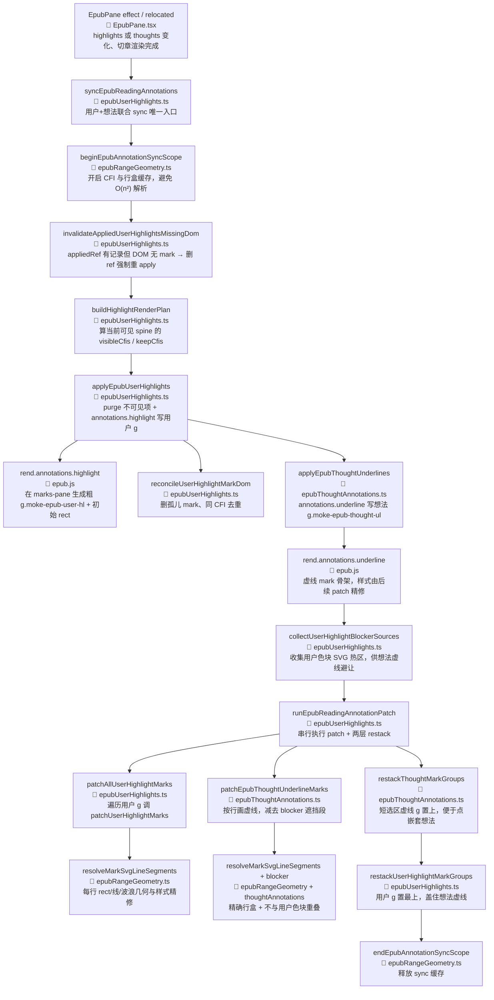
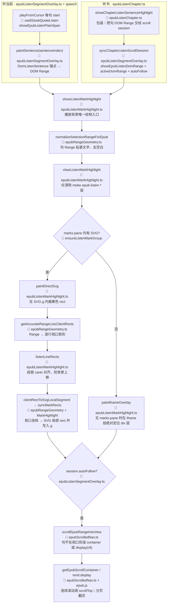
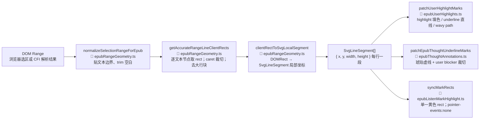

# EPUB 三层标注共用方法 — 用户划线 / 想法虚线 / 播放背景

## 文档角色

说明 **用户彩色划线**、**想法琥珀虚线**、**听读播放背景** 三类视觉层共用的底层方法：每个符号的**具体作用**、**所在文件**、**谁在什么时机调用**。

**延伸阅读**：[EPUB用户划线开发.md](./EPUB用户划线开发.md)、[EPUB想法添加下划线开发.md](./EPUB想法添加下划线开发.md)、[EPUB听书开发.md](./EPUB听书开发.md)、[Influence-point 播放背景 vs 划线](../../impact/EPUB听书背景与注释影响.md)。

---

## 1. 三层与源文件一览

| 维度 | 用户划线 | 想法虚线 | 播放背景 |
|------|----------|----------|----------|
| **主模块** | `epubUserHighlights.ts` | `epubThoughtAnnotations.ts` | `epubListenMarkHighlight.ts` |
| **横切 helper** | 共用 `epubMarkShared.ts`（CFI spine、Range 嵌套、SVG attr、contents 列表） | 同上 | 同上 |
| **几何内核** | 共用 `epubRangeGeometry.ts` | 同上 | 同上 |
| **滚动** | `epubScrolledNav.ts`（侧栏引用等） | 同上 | 同上 + `epubListenSegmentOverlay.ts` |
| **DOM class** | `moke-epub-user-hl` | `moke-epub-thought-ul` | `moke-epub-listen-bg` |
| **epub.js 槽位** | `annotations.highlight` | `annotations.underline` | 不写入用户/想法槽位 |
| **持久化** | `ebook_highlight` | `ebook_thought` | 无（会话临时） |
| **总入口** | `syncEpubReadingAnnotations` | 同上内联 | `showListenMarkHighlight` |

---

## 2. 架构总图（节点含文件 + 作用说明）

```mermaid
flowchart TB
  subgraph shared ["共用基础设施"]
    RG1["normalizeSelectionRangeForEpub<br/>📁 epubRangeGeometry.ts<br/>收拢选区边界、去首尾空白，供 CFI 与行盒计算"]
    RG2["getAccurateRangeLineClientRects<br/>📁 epubRangeGeometry.ts<br/>Range → 逐行 DOMRect，过滤大行块误检"]
    RG3["clientRectToSvgLocalSegment<br/>📁 epubRangeGeometry.ts<br/>视口矩形 → marks-pane SVG 局部坐标"]
    RG4["resolveCfiDomRange / cfiFromDomRange<br/>📁 epubRangeGeometry.ts<br/>CFI ↔ DOM Range 双向解析"]
    RG5["resolveMarkSvgLineSegments<br/>📁 epubRangeGeometry.ts<br/>patch 主入口：读 mark rect 或 CFI 校正行线段"]
    RG6["beginEpubAnnotationSyncScope<br/>endEpubAnnotationSyncScope<br/>📁 epubRangeGeometry.ts<br/>sync 批处理内启用 CFI/行盒缓存"]
    SN1["getEpubScrollContainer<br/>📁 epubScrolledNav.ts<br/>取连续滚动 .epub-container"]
    SN2["scrollEpubRangeIntoView<br/>📁 epubScrolledNav.ts<br/>Range 不在视口时 scrollTop 或 display(cfi)"]
  end

  subgraph userThought ["用户 + 想法 共用流水线"]
    SYNC["syncEpubReadingAnnotations<br/>📁 epubUserHighlights.ts<br/>总编排：invalidate→apply 用户→apply 想法→patch→restack"]
    PATCH["runEpubReadingAnnotationPatch<br/>📁 epubUserHighlights.ts<br/>串行 patch 用户 mark、想法虚线、两层 restack"]
    APPLY_U["applyEpubUserHighlights<br/>📁 epubUserHighlights.ts<br/>rend.annotations.highlight 落 g.moke-epub-user-hl"]
    APPLY_T["applyEpubThoughtUnderlines<br/>📁 epubThoughtAnnotations.ts<br/>rend.annotations.underline 落 g.moke-epub-thought-ul"]
    PU["patchAllUserHighlightMarks<br/>📁 epubUserHighlights.ts<br/>遍历用户 g，写 rect/下划线/波浪 path"]
    PT["patchEpubThoughtUnderlineMarks<br/>📁 epubThoughtAnnotations.ts<br/>按行画琥珀虚线，按用户 blocker 裁切"]
    RS_T["restackThoughtMarkGroups<br/>📁 epubThoughtAnnotations.ts<br/>短 CFI 虚线 g 排到 marks-pane 上层便于点击"]
    RS_U["restackUserHighlightMarkGroups<br/>📁 epubUserHighlights.ts<br/>用户 g append 到 pane 末尾，盖住想法虚线"]
  end

  subgraph listen ["播放背景 专用"]
    SHOW["showListenMarkHighlight<br/>📁 epubListenMarkHighlight.ts<br/>清 listen 层→SVG rect 或 iframe div 淡黄底"]
    CLEAR["clearListenMarkHighlight<br/>📁 epubListenMarkHighlight.ts<br/>仅删 moke-epub-listen-*，不碰用户/想法"]
    SESS["epubListenSegmentOverlay<br/>📁 epubListenSegmentOverlay.ts<br/>session/autoFollow；换句写 activeDomRange 并触发滚动"]
  end

  SYNC --> APPLY_U --> RG5
  SYNC --> APPLY_T --> RG5
  SYNC --> PATCH
  PATCH --> PU --> RG5
  PATCH --> PT --> RG5
  PATCH --> RS_T
  PATCH --> RS_U
  SYNC --> RG6
  PU --> RG6
  SHOW --> RG1
  SHOW --> RG2
  SHOW --> RG3
  SHOW --> CLEAR
  SESS --> SN2
  SESS --> RG1
  SHOW --> SN1
```

---

## 3. 方法详解 — `epubRangeGeometry.ts`（几何 + CFI 内核）

| 方法 | 用户 | 想法 | 播放 | 具体作用 | 典型调用时机 |
|------|:----:|:----:|:----:|----------|--------------|
| **`normalizeSelectionRangeForEpub(range)`** | ✓ | ✓ | ✓ | 先 `snapSelectionRangeToTextContent` 把 Range 贴到可见文本节点，再 `trimSelectionRange` 去掉首尾空白；空选区返回 `null`。保证 CFI 生成、PopBar 取词、行盒计算都基于「有效文字边界」。 | 保存划线前、patch 前、播放背景绘制前、PopBar 算 CFI 前 |
| **`snapSelectionRangeToTextContent(range)`** | ✓ | — | — | 在 Range 起止容器内向前/后找第一个非空 Text 节点，重写 Range 起止点。 | `normalizeSelectionRangeForEpub` 内部 |
| **`trimSelectionRange(range)`** | ✓ | — | — | 从 Range 两端逐步收缩，跳过纯空白字符（最多 8192 步防死循环）。 | 规范化选区、保存 highlight 前 |
| **`getAccurateRangeLineClientRects(range)`** | ✓ | ✓ | ✓ | **核心行盒算法**：① `forEachTextNodeInRange` 按文本片段取 `getClientRects`；② `preferLeafLineClientRects` 去掉被其它 rect 完全包裹的「大行块」；③ 用首尾 caret 的 client rect 裁切第一行左缘、最后一行右缘，避免行尾空白被划线。 | patch 用户/想法 mark、播放 `listenLineRects`、点击命中 |
| **`getAccurateRangeLineClientRectsCached(cfiKey, range)`** | ✓ | ✓ | — | 在 `beginEpubAnnotationSyncScope`～`end` 之间用 `cfiKey` 缓存行盒数组，避免 sync 内对同一 CFI 重复 layout。 | `isDomRangeFullyCoveredByHighlightClientRects` 等重叠判定 |
| **`clientRectToSvgLocalSegment(rect, svg, container)`** | ✓ | ✓ | ✓ | 把**视口坐标**的 `DOMRect` 转为 marks-pane 内 SVG 的 `{x,y,width,height}`：减去 svg 与 container 的 `getBoundingClientRect` 偏移。 | 写入 SVG `<rect>`、计算下划线 y |
| **`resolveDomRangeSvgLineSegments(group, range)`** | — | — | ✓ | 不经过 CFI：直接对 live Range 做 normalize → 行盒 → SVG 局部坐标。听书句 Range 索引命中后用此路径，避免 CFI 往返截断跨节点选区。 | `listenRangeToSvgSegments` / `paintDirectSvg` |
| **`resolveHighlightSvgLineSegments(rend, group, cfi)`** | ✓ | — | — | `resolveCfiDomRange` → normalize → `resolveDomRangeSvgLineSegments`。用户 highlight 专用 CFI 入口。 | `resolveMarkSvgLineSegments` 校正分支 |
| **`resolveMarkSvgLineSegments(rend, group, cfi)`** | ✓ | ✓ | — | **patch 统一入口**：先读 mark 上已有 `<rect>`（快路径）；若 CFI 存在且与精确行盒行数/总宽不一致，则用 CFI→Range 精确几何**替换** epub.js 粗 rect（去段落间空行）。 | `patchUserHighlightMarks`、`patchEpubThoughtUnderlineMarks` |
| **`readMarkSvgLineSegmentsFromRects(group)`** | ✓ | ✓ | — | 只解析 SVG 上已有 `rect` 的 x/y/width/height，**不触发布局**。滚动后 patch 性能路径。 | `resolveMarkSvgLineSegments` 首选 |
| **`resolveCfiDomRange(rend, cfi)`** | ✓ | ✓ | ✓ | 在当前 rendition 各 iframe `contents` 上调用 epub.js `getRange(cfi)`，得到仍连接 DOM 的 Range；sync 内带 Map 缓存。 | apply 可见性、点击、听书 `resolveListenStartSentence`、patch |
| **`cfiFromDomRange(rend, range)`** | ✓ | — | ✓ | 遍历 contents，用 `cfiFromRange` 把 DOM Range 编成 CFI 字符串；保存划线、听当前 session 存 cfi 备用。 | 用户 upsert、overlay session |
| **`resolveSelectionCfiRange(rend, win, range)`** | ✓ | — | — | normalize 后调 iframe 的 `cfiFromRange`，PopBar 拖选保存用。 | `epubSelectionToolbarAttach` |
| **`forEachTextNodeInRange(outer, fn)`** | ✓ | — | ✓ | TreeWalker 遍历 Range 内每个 Text 节点的 `[start,end)` 字符，回调 `(node,start,end)`。 | 行盒收集、听当前 `buildDomSentenceIndex`（overlay 内） |
| **`isPointInRangeTextBand(range, iframe, x, y, maxBelow)`** | ✓ | — | — | 用精确行盒判断点击是否落在 Range **文字带**内（非整行空白）；支持 iframe 坐标换算。 | marks-pane 点击命中用户线/想法 |
| **`beginEpubAnnotationSyncScope()`** | ✓ | ✓ | — | 创建模块级 `syncCfiRangeCache`、`syncAccurateClientRectCache`。 | `syncEpubReadingAnnotations` 开头 |
| **`endEpubAnnotationSyncScope()`** | ✓ | ✓ | — | 释放上述缓存 Map。 | `syncEpubReadingAnnotations` finally |
| **`getRenditionViewsList(rend)`** | — | — | ✓ | 安全展开 `rend.views()`（须 `.all()`），供听书枚举 iframe document。 | `epubListenChapter.listIframeDocuments` |
| **`getAccurateRangeLineClientRects` 辅助** | | | | `preferLeafLineClientRects`：去掉被其它 rect 完全包含的父级大行块。`collectRangeTextClientRects`：按文本节点分段取 rect。 | 内部 |

---

## 4. 方法详解 — `epubScrolledNav.ts`（滚动与视口）

| 方法 | 用户 | 想法 | 播放 | 具体作用 | 典型调用时机 |
|------|:----:|:----:|:----:|----------|--------------|
| **`getEpubScrollContainer(rend)`** | — | — | ✓ | 读 `rend.manager.container`，连续滚动模式下的主滚动 div；分页模式为 `null`。 | 听书找 iframe、scroll guard 绑定、listen 枚举 document |
| **`scrollEpubRangeIntoView(rend, range, fallbackCfi?)`** | — | — | ✓ | ① `isDomRangeInReaderView` 已在视口则返回；② 有 scroll container 则 `scrollEpubDomRangeIntoView` 调 `scrollTop`；③ 否则 `cfiFromDomRange` / `fallbackCfi` → `rend.display(cfi)` 翻页。 | 听读 autoFollow、`resumeEpubListenAutoFollow` |
| **`scrollEpubCfiIntoView(rend, cfiRange)`** | ✓ | ✓ | — | CFI → `resolveCfiDomRange` → 仅连续滚动容器内滚 DOM；**不分页 display**。 | 想法侧栏打开后滚到引用段、用户引用定位 |
| **`scrollEpubDomRangeIntoView(rend, range)`** | — | — | ✓ | 根据 Range 各 rect 与容器视口关系，计算目标 `scrollTop` 使 Range 垂直居中（带 `QUOTE_VIEW_MARGIN_PX` 留白）。 | `scrollEpubRangeIntoView` 连续滚动分支 |
| **`isDomRangeInReaderView(rend, range, marginPx)`** | — | — | ✓ | 判断 Range 行盒是否落在滚动容器（或 iframe 视口）可见区域内。 | autoFollow 短路：已在视口则不滚 |

---

## 5. 方法详解 — 用户 + 想法 sync 流水线

### 5.1 总编排（`epubUserHighlights.ts`）

| 方法 | 具体作用 | 典型调用时机 |
|------|----------|--------------|
| **`syncEpubReadingAnnotations(rend, thoughts, highlights, appliedThoughtsRef, appliedHighlightsRef)`** | **用户与想法唯一的联合入口**。顺序：① `beginEpubAnnotationSyncScope`；② `invalidateAppliedUserHighlightsMissingDom`（DOM mark 被误删时清 appliedRef 以便重 apply）；③ `buildHighlightRenderPlan` 算当前章可见 CFI；④ `applyEpubUserHighlights`；⑤ `applyEpubThoughtUnderlines`；⑥ `collectUserHighlightBlockerSources`；⑦ `runEpubReadingAnnotationPatch`；⑧ `endEpubAnnotationSyncScope`。 | `EpubPane` 的 highlights/thoughts effect、`relocated`/`rendered` debounce、听读结束 `onSessionEnd` |
| **`runEpubReadingAnnotationPatch(rend)`** | 依次：`patchAllUserHighlightMarks` → 再次 `setUserHighlightBlockerSourcesForThoughtPatch` → `patchEpubThoughtUnderlineMarks` → `restackThoughtMarkGroups` → `restackUserHighlightMarkGroups`。把 epub.js 粗 mark **精修为最终样式与叠层顺序**。 | 仅在 `syncEpubReadingAnnotations` 末尾；或 `patchEpubReadingAnnotations` 延迟 RAF |
| **`invalidateAppliedUserHighlightsMissingDom(rend, appliedRef)`** | 对每个 applied CFI 调 `isUserHighlightMarkPresent`；DOM 上无对应 `g` 则从 Map 删除，迫使下次 apply 重绘。 | sync 开头；修复播放层误伤后的恢复 |
| **`buildHighlightRenderPlan(rend, highlights)`** | 算 `visibleCfis`（当前 spine 可见）、`sortedHighlights`（渲染顺序）、`keepCfis`（purge 白名单）。 | `applyEpubUserHighlights` 前 |
| **`applyEpubUserHighlights(rend, highlights, appliedRef, plan?)`** | 注入用户 SVG 样式；purge 不可见 CFI；对每条可见 highlight：签名未变且 DOM 存在则 skip；否则 `removeUserHighlightAnnotation` 后 `rend.annotations.highlight(..., moke-epub-user-hl)`；末尾 `reconcileUserHighlightMarkDom` 删孤儿/同 CFI 重复 mark。 | sync 内、用户增删改色后 |
| **`patchAllUserHighlightMarks(rend?)`** | 遍历所有 `USER_HIGHLIGHT_SELECTOR` 的 `g`，对每个调 `patchUserHighlightMarks`（内部用 `resolveMarkSvgLineSegments`）。 | `runEpubReadingAnnotationPatch` |
| **`patchUserHighlightMarks(root, metaByCfi, rend)`** | 按 style（highlight/underline/wavy）写每行 SVG：`rect` 填色、`<line>` 下划线、`<path>` 波浪；`pointer-events: none`。 | patchAll 内部 |
| **`collectUserHighlightBlockerSources(rend)`** | 扫描用户 mark 的 SVG rect（及 wavy path bbox），生成 `{cfi, rects[]}` 列表。 | sync 中 apply 用户 **之后**，供想法 patch **裁切**被色块挡住的虚线 |
| **`reconcileUserHighlightMarkDom(rend, keepCfis)`** | 删除不在 keepCfis 的孤儿 `g`；同一 CFI 只保留第一个 mark。 | purge 末尾 |
| **`restackUserHighlightMarkGroups(rend?)`** | 把每个用户 `g` `appendChild` 到 marks-pane 末尾，使用户 stroke **绘制在想法虚线之上**。 | patch 末尾 |
| **`patchEpubReadingAnnotations(rend, opts?)`** | 滚动/resize 时 **只 patch 不 re-apply**（defer RAF 合并），避免闪烁。 | EpubPane scroll、分栏 resize |

### 5.2 想法专用（`epubThoughtAnnotations.ts`）

| 方法 | 具体作用 | 典型调用时机 |
|------|----------|--------------|
| **`applyEpubThoughtUnderlines(rend, thoughts, appliedRef)`** | 按 CFI 分组想法；删除已不存在的 CFI 的 underline 批注；对每组 `rend.annotations.underline(..., moke-epub-thought-ul)` 写入虚线 mark 骨架。 | sync 内、紧接 `applyEpubUserHighlights` **之后** |
| **`patchEpubThoughtUnderlineMarks(rend?)`** | 遍历想法 `g`：用 `resolveMarkSvgLineSegments` 得每行几何；画 `<line stroke-dasharray>` 琥珀虚线；与 `userHighlightBlockerSources` 求交，**跳过被用户色块覆盖的线段**。 | `runEpubReadingAnnotationPatch` |
| **`setUserHighlightBlockerSourcesForThoughtPatch(sources)`** | 模块级注入 blocker 数组；patch 想法前由 user 侧 `collectUserHighlightBlockerSources` 填充。 | sync 中 apply 用户后、patch 前 |
| **`restackThoughtMarkGroups(rend?)`** | 想法 `g` 按 CFI 跨度**从短到长**排序后 append，短选区在上层便于点击嵌套想法。 | patch 末尾（在用户 restack **之前**） |
| **`parseSvgMarkRect(rect)`** | 读 SVGRectElement 的 x/y/width/height 为数值对象，非法或 ≤0.5px 则 null；**定义**于 `epubRangeGeometry.ts`，想法层 re-export。 | blocker 收集、readMarkSvgLineSegmentsFromRects |

### 5.3 播放背景专用

| 方法 | 文件 | 具体作用 | 典型调用时机 |
|------|------|----------|--------------|
| **`showListenMarkHighlight(rend, range)`** | `epubListenMarkHighlight.ts` | … | 听当前 `showEpubListenPlainSpan`、听书 `syncChapterListenScrollSession` |
| **`clearListenMarkHighlight(rend?)`** | 同上 | 取消 RAF；`purgeListenAnnotations`（**仅** `moke-epub-listen` class）；`purgeDocListenLayers` 删 listen SVG/iframe 层；**不**调用 `annotations.remove` 无 class 过滤。 | 换句、停止听书、句末（听当前） |
| **`listenLineRects(range)`** | 同上（内部） | 在 `getAccurateRangeLineClientRects` 结果上，用句首 caret rect 对齐首行 top，修正 `……` 段首误检导致背景整体上移一行。 | `paintDirectSvg` / `paintIframeOverlay` |
| **`syncMarkRects(group, segments)`** | 同上（内部） | 清空 `g` 子节点，为每段 `SvgLineSegment` 创建 SVG `<rect fill=rgba(251,231,128,0.28)>`。 | paintDirectSvg |
| **`repaintActive()`** | 同上（内部） | 滚动/翻页后按缓存的 `active.range` 重新 paint，保持播放底与文字对齐。 | `relocated` / `rendered` 回调 |
| **`syncChapterListenScrollSession(rend, range)`** | `epubListenSegmentOverlay.ts` | 调 `showEpubListenDomRange`：写入 session `activeDomRange`、画 mark、若 `autoFollow` 则 `scrollEpubRangeIntoView`。 | 听书每句播放前 |
| **`paintSentence(sentenceIndex)`** | `epubListenSegmentOverlay.ts` | 听当前历史路径；现行听当前用 `showEpubListenPlainSpan` 逐句驱动。 | 可选 legacy |
| **`attachListenScrollGuard(rend)`** | `epubListenSegmentOverlay.ts` | 监听 scroll container、iframe document、wheel；用户滚动时 `pauseListenAutoFollow` 并显示 FAB。 | 听当前/听书 session 启动 |

---

## 6. 流程图：用户 + 想法 sync（每步含文件与作用）

---

## 7. 流程图：播放背景（每步含文件与作用）

**与用户/想法的本质区别**：播放层 **不调用** `syncEpubReadingAnnotations`，**不写入** `annotations.highlight/underline`；清除 selector 独立，见 [Influence-point](../../impact/EPUB听书背景与注释影响.md)。

---

## 8. 流程图：DOM Range → SVG 行盒（共用几何管道）

| 出口函数 | 文件 | 对 SvgLineSegment 的后续 |
|----------|------|---------------------------|
| `patchUserHighlightMarks` | `epubUserHighlights.ts` | 每段：`rect` 半透明 fill；或 `line`/`path` 下划线/波浪 |
| `patchEpubThoughtUnderlineMarks` | `epubThoughtAnnotations.ts` | 每段：底部 `line` 虚线；与 blocker 矩形不交才绘制 |
| `syncMarkRects` | `epubListenMarkHighlight.ts` | 每段：一个 `rect`，fill=`rgba(251,231,128,0.28)` |

---

## 9. 尚未提取的重复私有逻辑

| 私有逻辑 | 出现位置 | 作用 |
|----------|----------|------|
| `getRenditionContentsList(rend)` | `epubRangeGeometry`、`epubUserHighlights`、`epubThoughtAnnotations` | 把 `rend.getContents()` 统一成 `{document, window}[]`，供多 iframe 遍历 |
| `iterHighlightDocuments` / `listListenDocuments` | 用户 vs 听书 | 收集主文档 + 各 spine iframe 的 `Document`，用于 querySelector 扫 mark |
| `findMarksPaneSvg(doc)` | listen / rangeGeometry | 在 `.marks-pane` 下找 SVG 根，作为局部坐标系 |

---

## 10. 快速定位表

| 现象 / 需求 | 优先打开 |
|-------------|----------|
| 行盒偏高/偏低、换行不准 | `epubRangeGeometry.ts` → `getAccurateRangeLineClientRects` |
| 用户色块/下划线/波浪不对 | `epubUserHighlights.ts` → `patchUserHighlightMarks` |
| 想法虚线画进用户色块 | `collectUserHighlightBlockerSources` + `patchEpubThoughtUnderlineMarks` |
| 播放背景段首上移 | `epubListenMarkHighlight.ts` → `listenLineRects` |
| 播放误删用户线 | **勿改** `purgeListenAnnotations` 的 class 过滤 |
| 听书/听当前不滚入视口 | `scrollEpubRangeIntoView` + overlay `requestListenAutoFollowScroll` |
| CFI 保存不准 | `normalizeSelectionRangeForEpub` + `cfiFromDomRange` |
| 切章后划线消失 | `invalidateAppliedUserHighlightsMissingDom` + 重新 `applyEpubUserHighlights` |

---

## 11. 源码路径索引

| 层级 | 路径 |
|------|------|
| 共用几何 | `apps/frontend/src/views/ebook/utils/epubRangeGeometry.ts` |
| 共用滚动 | `apps/frontend/src/views/ebook/utils/epubScrolledNav.ts` |
| 用户划线 | `apps/frontend/src/views/ebook/utils/epubUserHighlights.ts` |
| 想法虚线 | `apps/frontend/src/views/ebook/utils/epubThoughtAnnotations.ts` |
| 播放背景 | `apps/frontend/src/views/ebook/utils/epubListenMarkHighlight.ts` |
| 听读 session | `apps/frontend/src/views/ebook/utils/epubListenSegmentOverlay.ts` |
| 听书正文/句 Range / 节间 | `apps/frontend/src/views/ebook/utils/epubListenChapter.ts` |
| 连续滚动槽位 advance | `apps/frontend/src/views/ebook/utils/epubScrollListenAdvance.ts` |

---

（若与仓库最新源码不一致，以源码为准）
