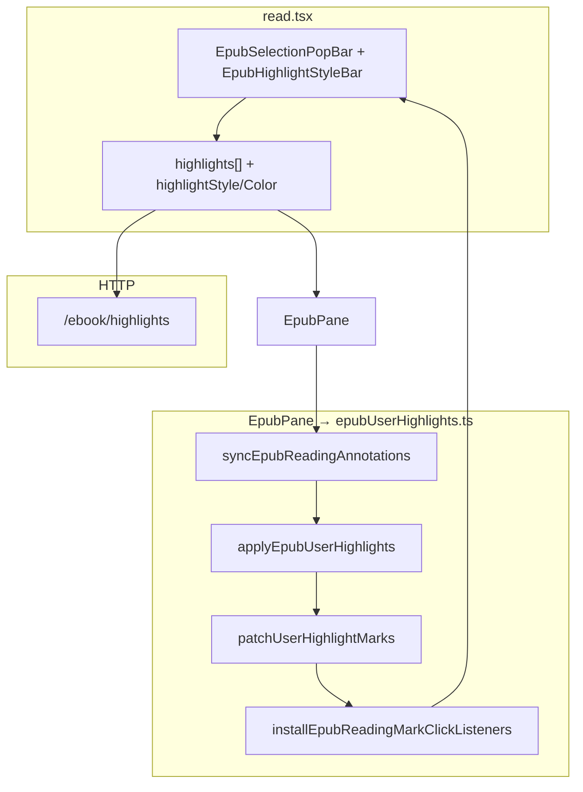
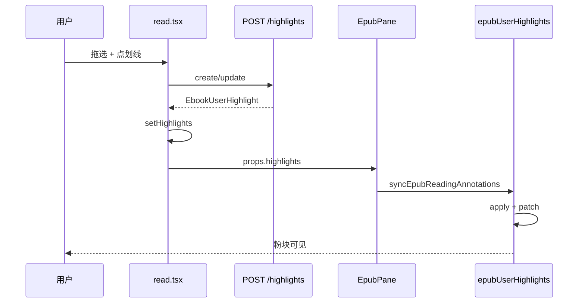

# EPUB 用户彩色划线 — 开发者实现手册

## 文档角色

**本文档**：EPUB **用户划线**（选中 → 粉/紫/蓝/绿/黄 高亮 / 下划线 / 波浪线 → 持久化 → 点击改色删）的 **唯一完整开发者手册**。结构对齐 [EPUB想法添加下划线开发.md](./EPUB想法添加下划线开发.md)（想法虚线手册）：**白话实现思路 + 可执行维护表 + 关键源码**。

**延伸阅读**：[epub-highlight-custom-color-picker 影响点分析](../../impact/EPUB划线自定义颜色选择器影响.md) — 自定义色 ColorPicker、`#rrggbb(aa)` 与 PopBar 嵌套取色波及面；[EPUB划线自定义颜色.md](../EPUB划线自定义颜色.md) — 实现说明与代码对比。

**推荐阅读顺序**：

| 顺序 | 章节 | 内容 |
|------|------|------|
| 1 | **§0** | 从何下手：维护定位表 / M1–M6 / 调用链 |
| 2 | **§2**（**§2.0、§2.9、§2.10**） | 白话：全景 / 分场景 / 按文件 + 例子走读 |
| 3 | **§3–§8** | 数据模型、保存、渲染、sync、PopBar（含源码摘录） |
| 4 | **§13–§17** | 重叠合并、DOM 命中、与想法共存、听 current |
| 5 | **§10 + §18** | 验收清单 |

**仍须另读（非划线专题）**：[EPUB想法添加下划线开发.md](./EPUB想法添加下划线开发.md)（想法虚线）、[EPUB听书用户划线对账.md](../EPUB听书用户划线对账.md)（听 current 与划线 DOM）。

**历史姊妹文**（已归档为索引）：`EPUB用户划线实现.md`、`EPUB划线DOM匹配.md`（要点已并入 §14–§15）— 文首仅保留跳转。

---

## 0. 开发者从何下手（必读）

**想先懂「怎么实现的」** → [§2.0](#20-白话五分钟整功能怎么跑起来)、[§2.9](#29-分场景白话详解)、[§2.10](#210-实现拆解按文件--例子走读)。

### 0.1 先判断：你要哪种工作？

| 你的目标 | 走哪条路 |
|----------|----------|
| 改 bug / 小需求 | [§0.2 维护路径](#02-维护现有功能按需求定位) |
| 从零做一版用户划线 | [§0.3 M1–M6](#03-从零实现严格按阶段顺序做) |
| 跟一遍用户操作 | [§0.4 调用链](#04-跟一遍运行时调用链) |

### 0.2 维护现有功能：按需求定位

| 需求 / 现象 | 先打开 | 关键符号 | 怎么验 |
|-------------|--------|----------|--------|
| 拖选后 PopBar 无「划线」 | `EpubSelectionPopBar.tsx` | 选区 payload | 有 `cfiRange` |
| 点划线没颜色 | `read.tsx` | `upsertSelectionHighlight` | Network POST/PUT |
| 保存成功正文 **无线** | `EpubPane.tsx` | `useEffect([highlights])` → sync | 断点 `applyEpubUserHighlights` |
| 有线但 **样式错**（该波浪却是色块） | `epubUserHighlights.ts` | `patchUserHighlightMarks` | marks-pane 看 rect/line/path |
| 相邻两次划 **叠两层色** | `read.tsx` + `epubUserHighlights.ts` | `resolveMergedOverlappingHighlight` | DB 应合并为一条 |
| 点已有线 **PopBar 不出** | `epubUserHighlights.ts` | `installEpubReadingMarkClickListeners` | 断点 `onUserHighlightPopBar` |
| 删划线删错段 / 删不掉 | `read.tsx` | `findAllUserHighlightsCoveringCfi` | 应用 DOM 覆盖而非 quote 同名 |
| 与 **想法虚线** 互相误删 | `epubUserHighlights.ts` | `remove(..., 'highlight')` vs `'underline'` | §9 |
| 想法虚线穿帮 / 双线 | 想法手册 §17 | sync **顺序** | 用户线必须先 apply |
| 听 current 后用户线消失 | [listen-reconcile](../EPUB听书用户划线对账.md) | `reconcileUserHighlightMarkDom` | 播完 sync |
| 翻页线没了 | `EpubPane.tsx` | `rendered`/`relocated` debounce sync | 切章后再 sync |

**最小闭环**：拖选 → 点划线选粉色高亮 → 正文出现粉块 → 再点粉块 PopBar 改蓝色 → 删划线消失。

### 0.3 从零实现：严格按阶段顺序做

#### M1：能存能查（无 UI、无 SVG）

| 步 | 做什么 | 文件 |
|----|--------|------|
| 1 | 建表 `ebook_highlight` | `ebook-highlight.entity.ts`、migration |
| 2 | DTO + CRUD | `create/update-ebook-highlight.dto.ts`、`ebook.service.ts` |
| 3 | Controller | `GET/POST/PUT/DELETE` `/ebook/highlights` |
| 4 | 删书级联 | `ebook.service.remove` 删 highlight |
| 5 | 前端类型 + HTTP | `types.ts`、`service/index.ts` |

**验收**：Postman POST 一条 → GET 按 bookId 拉回，含 `style`、`color`。

**不要做**：epub.js、PopBar。

#### M2：PopBar 能保存（仍可无正确样式）

| 步 | 做什么 |
|----|--------|
| 1 | `read.tsx` 拉 `highlights[]` |
| 2 | `upsertHighlightForQuote` + `upsertSelectionHighlight` |
| 3 | PopBar 绑 `onApplyHighlight`、颜色/样式条 |

**验收**：保存后 Network 200，刷新 GET 仍在；正文可以还没有色块。

#### M3：能看见 mark（丑块即可）

| 步 | 做什么 |
|----|--------|
| 1 | `highlights` 传入 `EpubPane` |
| 2 | `applyEpubUserHighlights`：`rend.annotations.highlight` |
| 3 | `appliedHighlightsRef` 签名 skip |

#### M4：三种样式 patch 正确

| 步 | 做什么 |
|----|--------|
| 1 | `ensureUserHighlightStyles` |
| 2 | `patchUserHighlightMarks`：highlight / underline / wavy |
| 3 | 挂到 `runEpubReadingAnnotationPatch` |

#### M5：重叠合并 + DOM 命中

| 步 | 做什么 |
|----|--------|
| 1 | `resolveMergedOverlappingHighlight` 写库前合并 |
| 2 | `coalesceOverlappingHighlightsForRender` 渲染前合并 |
| 3 | `findAllUserHighlightsCoveringCfi` 删除覆盖 |

#### M6：与想法虚线共存

| 步 | 做什么 |
|----|--------|
| 1 | 接入 `syncEpubReadingAnnotations`（用户先、想法后） |
| 2 | `collectUserHighlightBlockerSources` 供想法 patch |
| 3 | `restackUserHighlightMarkGroups` |

### 0.4 跟一遍运行时调用链

**新建一条粉色高亮**：

```text
1. attachEpubSelectionPopBar → payload { cfiRange, selectedText }
2. onApplyHighlight → upsertSelectionHighlight(style, color)
3. upsertHighlightForQuote → resolveMergedOverlappingHighlight → POST/PUT
4. setHighlights(next) → EpubPane effect
5. syncEpubReadingAnnotations → applyEpubUserHighlights → patchUserHighlightMarks
6. 用户看见粉块
```

**点击已有线改色**：

```text
1. installEpubReadingMarkClickListeners → 坐标/DOM 命中
2. onUserHighlightPopBar(payload, highlight)
3. 用户改色 → updateEbookHighlight → setHighlights → sync
```

### 0.5 三个最容易卡住的点

| 卡点 | 原因 | 处理 |
|------|------|------|
| 保存成功无线 | `highlights` 未传 `EpubPane` 或 CFI 当前章解析失败 | props + `display(cfi)` |
| 「死」字叠两层色 | 写库未合并或 render 未 coalesce | §13 |
| remove 误删想法线 | 用了 `remove(cfi,'underline')` 清用户线 | 只用 `'highlight'` §9 |

---

## 1. 架构总览

### 1.1 分层



### 1.2 核心设计决策

| 决策 | 原因 |
|------|------|
| 用 `annotations.highlight`，想法用 `underline` | `remove(cfi, type)` 按槽位删，互不误伤 |
| **写库**与**渲染**各做一次重叠合并 | 写库减 DB 行；渲染减 SVG 叠色（§13） |
| 三种样式共用 highlight API，**patch 分岔** | epub.js 只给 rect+line；波浪线要自建 `<path>` |
| 用户 mark `pointer-events: none` | 点击走 iframe 坐标换算，与想法 mark 统一路由 |
| 短选区 **后** apply（stack 在上） | 重叠处优先命中更精确选区 |
| PopBar 用 `highlightsRef` | upsert 异步闭包内列表要最新 |

### 1.3 关键源码路径

| 模块 | 路径 |
|------|------|
| 阅读页保存/删 | `apps/frontend/src/views/ebook/read.tsx` |
| 渲染与合并 | `apps/frontend/src/views/ebook/utils/epubUserHighlights.ts` |
| Rendition | `apps/frontend/src/views/ebook/components/EpubPane.tsx` |
| PopBar | `EpubSelectionPopBar.tsx`、`EpubHighlightStyleBar.tsx` |
| 侧栏划线按钮 | `EpubQuoteActionBar.tsx` |
| 实体/API | `ebook-highlight.entity.ts`、`ebook.service.ts` |

---

## 2. 详细实现思路

**不想先看术语**：读 **§2.0 → §2.9 → §2.10**；源码见 §4 起。

### 2.0 白话五分钟：整功能怎么跑起来

四条线：

```text
① 记地址（CFI+quote） → ② 存数据库 → ③ SVG 彩色标记 → ④ 点标记 PopBar 改/删
```

#### ① 记地址

拖选松手 → PopBar 出现；**立刻**算 `cfiRange` 和 `selectedText`，存 `selectionPopBarRef`。和想法一样，**不能**等 PopBar 关了再算。

#### ② 存数据库

点「划线」或选颜色 → `upsertHighlightForQuote`：

1. trim 规范化 CFI/quote；
2. `resolveMergedOverlappingHighlight`：与已有线 **相交/相接/包含** 则算并集，旧 id 待删；
3. 无合并：`create` 或同 CFI `update`；有合并：先 `delete` 旧的多条，再 `create` **一条**（样式用用户本次选的）；
4. `setHighlights` — **全书划线只此一份数组**。

#### ③ 画标记

`highlights` 变 → `EpubPane` sync：

1. `buildHighlightRenderPlan`：`coalesceOverlappingHighlightsForRender`（渲染层再合并一层）；
2. `applyEpubUserHighlights`：对每个可见 CFI `rend.annotations.highlight`；
3. `patchUserHighlightMarks`：按 `style` 改 rect 填色 / line 下划线 / path 波浪线。

#### ④ 点标记

用户划线 SVG **不接收指针**（`pointer-events: none`）。点击走 iframe 内坐标 → 命中哪条 highlight → `onUserHighlightPopBar` 再开 PopBar。

---

### 2.1 问题域与硬约束

| 层 | 约束 | 设计影响 |
|----|------|----------|
| 产品 | 三色样式 + 五色；改色即时；删要删「覆盖这一段」的所有线 | upsert + 覆盖查询；update API |
| epub.js | 批注在 marks-pane SVG；`highlight` 与 `underline` 不同槽位 | patch 三种样式；与想法分离 |
| 工程 | 相邻划「死」字不能叠两层；PopBar 不能闪 | 写库合并 + render coalesce；`suppressEpubSelectionPopBarDismiss` |

### 2.2 双阶段渲染（apply + patch）

**apply**：epub.js 在 CFI 处插入 `<g class="moke-epub-user-hl">` + 占位 rect/line。

**patch**：库默认样式不对——高亮要半透明 fill；下划线/波浪要把 rect 几乎透明、线画在底边；波浪要生成 `<path>`。

### 2.3 保存：upsert 五步（白话）

`upsertHighlightForQuote`（`read.tsx`）内部逻辑可记：

```text
(1) 规范化 CFI/quote（trimSelectionRange）
(2) resolveMergedOverlappingHighlight → 并集 + removeIds
(3) findHighlightsStrictlyContainedIn → 大段包小段，小段 id 也进 removeIds
(4) 若 removeIds 非空 → buildMergedHighlightTarget 再算一遍并集 CFI
(5) removeIds 空 → update 或 create；非空 → delete 多条 + create 一条
```

**不要**在 upsert 里直接 `rend.annotations`——和想法一样，只改 state，让 sync 画线。

### 2.4 渲染计划 `buildHighlightRenderPlan`

```text
highlights[]
  → coalesceOverlappingHighlightsForRender（DOM 合并，样式取 updatedAt 最新）
  → computeVisibleHighlightCfis（当前章/iframe 能解析的才画）
  → sortHighlightsForStack（短选区后 apply，点击优先短段）
  → apply + purge 不在 keepCfis 的旧 mark
```

### 2.5 Sync 顺序（与想法共用）

```text
applyEpubUserHighlights      ← 必须先
applyEpubThoughtUnderlines   ← 想法虚线
collectUserHighlightBlockerSources
runEpubReadingAnnotationPatch
  → patchUserHighlightMarks
  → patchThoughtUnderlineMarks（想法扣用户 blocker）
  → restack
```

详见 [想法手册 §2.4.4](./EPUB想法添加下划线开发.md)。

### 2.6 PopBar 与「划线 / 删除划线」

| 状态 | 判定 | 按钮 |
|------|------|------|
| 选区未被任何 highlight 覆盖 | `isSelectionFullyHighlighted` false | 「划线」→ create/update |
| 选区已被覆盖 | true | 「删除划线」→ `removeHighlightsForQuote` |

侧栏引用区用 `resolveSelectionHighlightCoverage`（**full 覆盖**才显示删除），见 §15。

### 2.7 从零排期（M1–M6）

与 §0.3 一致。**M3 前不要 patch；M5 前不要接想法 sync；M6 前不要改 restack。**

### 2.8 刻意不做

| 不做 | 原因 |
|------|------|
| PDF 用户划线 | 无 EPUB CFI |
| 按 quote 字符串删划线 | 同名不同位置会误删；用 CFI+DOM §14 |
| 与想法共用 highlight API | remove 互相误删 |

### 2.9 分场景白话详解

#### 2.9.1 第一次划线（粉块高亮）

| 步 | 发生什么 | 谁负责 |
|----|----------|--------|
| 1 | 拖选 → PopBar | `epubSelectionToolbarAttach.ts` |
| 2 | 默认 `highlightStyle='highlight'`, `highlightColor='pink'` | `read.tsx` state |
| 3 | 点样式条或「划线」 | `onApplyHighlight` → `upsertSelectionHighlight` |
| 4 | 写库 + `setHighlights` | `upsertHighlightForQuote` |
| 5 | sync → apply + patch | `EpubPane` + `epubUserHighlights.ts` |
| 6 | rect 填 `rgba` 粉色半透明 | `patchUserHighlightMarks` style===highlight |

#### 2.9.2 改成波浪下划线

PopBar 切 `wavy` + 改色 → 仍调 `upsertSelectionHighlight` → **同一条 DB** update style/color → sync → patch 删 line 可见性、创建/更新 `<path class="wavy-underline">`。

#### 2.9.3 相邻两次划「…杨广**死**」和「**死**于…」

| 步 | 说明 |
|----|------|
| 1 | 第一次 POST：CFI₁，quote₁ |
| 2 | 第二次 upsert：`resolveMergedOverlappingHighlight` 发现 DOM **相接** |
| 3 | 返回并集 CFI₂、quote₂、`removeHighlightIds=[id₁]` |
| 4 | delete id₁ → create **一条** id₂（第二次颜色/样式） |
| 5 | render 时 `coalesce` 再保证 SVG 只有一层 |

#### 2.9.4 点击已有粉块

| 步 | 说明 |
|----|------|
| 1 | iframe click → 坐标 hit test |
| 2 | 找到 `EbookUserHighlight` |
| 3 | `onUserHighlightPopBar`：PopBar 打开，样式条显示当前 color/style |
| 4 | 改色 → `updateEbookHighlight` → sync |

#### 2.9.5 侧栏「删除划线」

`removeHighlightsForQuote(cfi, quote)` → 先 `ensureQuoteCfiInViewport` → `findAllUserHighlightsCoveringCfi`（DOM 覆盖）→ 批量 DELETE → `setHighlights`。

#### 2.9.6 与想法虚线同段

- 用户 **粉块** 在上（restack）；想法 **琥珀虚线** patch 时扣 user blocker，被盖住处不画线。
- 删用户线 **不** 删想法数据；各用各的 API remove。

### 2.10 实现拆解：按文件 + 例子走读

#### 2.10.1 核心文件地图

| 文件 | 白话职责 |
|------|----------|
| `read.tsx` | `highlights` 状态、upsert/remove、PopBar 回调 |
| `epubUserHighlights.ts` | apply/patch/合并/命中/click/sync 编排 |
| `EpubPane.tsx` | highlights 变化 → sync；绑 listener |
| `EpubHighlightStyleBar.tsx` | 三色 + 五色 UI |
| `ebook.service.ts` | 同 CFI create 时 upsert 行（后端防重复 CFI） |

#### 2.10.2 `read.tsx` 状态

| 变量 | 含义 |
|------|------|
| `highlights` | 全书划线列表 |
| `highlightsRef` | upsert 异步用最新列表 |
| `highlightStyle` / `highlightColor` | PopBar 当前选中样式 |
| `selectionPopBar` | 浮动条 open + 选区 payload |
| `selectionFullyHighlighted` | 选区是否已被覆盖（删 vs 划） |

#### 2.10.3 例子：选中「死于春天」划蓝色下划线

1. payload: `{ cfiRange, selectedText: "死于春天" }`
2. `upsertHighlightForQuote(..., 'underline', 'blue')`
3. POST body: `{ bookId, cfiRange, quote, style:'underline', color:'blue' }`
4. `setHighlights` 加入返回项
5. apply: `annotations.highlight(cfi, { style, color, ... })`
6. patch: rect 几乎透明；`<line>` x1/x2 在文字底边 +2px，stroke 蓝色

#### 2.10.4 marks-pane DOM（用户线）

```text
<g class="moke-epub-user-hl" data-epubcfi="..." data-style="highlight" data-color="pink">
  <rect .../>           <!-- highlight: 半透明 fill；underline/wavy: 极淡 fill 作热区 -->
  <line .../>           <!-- underline 用；wavy 时隐藏 -->
  <path class="wavy-underline-path" .../>  <!-- 仅 wavy -->
</g>
```

#### 2.10.5 术语对照

| 术语 | 白话 |
|------|------|
| **coalesce（渲染合并）** | 画之前把相交的多条合成一条 SVG，避免叠色 |
| **resolveMerged（写库合并）** | 保存前把相交的多条合成一条 DB 记录 |
| **blocker** | 用户 mark 占用的 x 区间，供想法虚线 patch 扣减 |
| **highlightMetaByCfi** | 模块 Map：patch/点击时查 style/color |

---

## 3. 数据模型与 API

> **白话**：一行划线 = 一个 CFI 选区 + quote + style + color。后端对 **同 user+book+cfi** 的 create 会改写成 update 已有行。

### 3.1 前端类型

**来源**：`apps/frontend/src/views/ebook/types.ts`

```typescript
export type EpubHighlightStyle = 'highlight' | 'underline' | 'wavy';
export type EpubHighlightColorId = 'pink' | 'purple' | 'blue' | 'green' | 'yellow';

export type EbookUserHighlight = {
	id: string;
	userId: number;
	cfiRange: string;
	quote: string;
	style: EpubHighlightStyle;
	color: EpubHighlightColorId;
	createdAt: string;
	updatedAt: string;
};
```

### 3.2 后端实体

**来源**：`apps/backend/src/services/ebook/ebook-highlight.entity.ts`

```typescript
@Entity('ebook_highlight')
@Index('idx_ebook_highlight_user_book', ['userId', 'bookId'])
export class EbookHighlight {
	@PrimaryGeneratedColumn('uuid')
	id: string;
	@Column({ type: 'int', name: 'user_id' })
	userId: number;
	@Column({ type: 'uuid', name: 'book_id' })
	bookId: string;
	@Column({ type: 'text', name: 'cfi_range' })
	cfiRange: string;
	@Column({ type: 'text' })
	quote: string;
	@Column({ type: 'varchar', length: 16 })
	style: string;
	@Column({ type: 'varchar', length: 16 })
	color: string;
	@CreateDateColumn({ name: 'created_at' })
	createdAt: Date;
	@UpdateDateColumn({ name: 'updated_at' })
	updatedAt: Date;
}
```

### 3.3 HTTP API

| 方法 | 路径 | 作用 |
|------|------|------|
| GET | `/ebook/highlights/:bookId` | 列表，`createdAt DESC` |
| POST | `/ebook/highlights` | 新建；**同 CFI 已存在则更新**（service 内 findOne） |
| PUT | `/ebook/highlights/:id` | 改 quote/style/color |
| DELETE | `/ebook/highlights/:id` | 删一条 |

删书：`ebook.service.remove` 内 `highlightRepo.delete({ bookId, userId })`。

### 3.4 前端 HTTP

**来源**：`apps/frontend/src/service/index.ts`

```typescript
export const fetchEbookHighlights = async (bookId: string) =>
	(await http.get<EbookUserHighlight[]>(`${EBOOK_HIGHLIGHTS}/${bookId}`)).data;

export const createEbookHighlight = async (body: {
	bookId: string;
	cfiRange: string;
	quote: string;
	style: EpubHighlightStyle;
	color: EpubHighlightColorId;
}) => (await http.post<EbookUserHighlight>(EBOOK_HIGHLIGHTS, body)).data;

export const updateEbookHighlight = async (id: string, body: Partial<...>) => ...;
export const deleteEbookHighlight = async (id: string) => ...;
```

---

## 4. Part I — 保存与删除（read.tsx）

> **白话**：`upsertHighlightForQuote` 是唯一写库入口；PopBar 和侧栏都调它。删用 `removeHighlightsForQuote`。

### 4.1 加载列表

```typescript
useEffect(() => {
	if (!bookId) { setHighlights([]); return; }
	void fetchEbookHighlights(bookId).then(setHighlights).catch(/* Toast */);
}, [bookId, t]);
```

### 4.2 `upsertHighlightForQuote` 结构

见 §2.3、§2.10.3；完整实现 `read.tsx` L320–458。

**保存后出线**：`setHighlights` → `EpubPane` `useEffect([highlights, thoughts, rendReady])` → sync。

### 4.3 `upsertSelectionHighlight`

PopBar 入口：读 `selectionPopBarRef` → upsert → 更新 PopBar payload（合并后 CFI/quote 可能变长）→ `clearTextSelection`。

### 4.4 `removeHighlightsForQuote`

```typescript
await ensureQuoteCfiInViewport(cfiRange);
const existing = findAllUserHighlightsCoveringCfi(highlightsRef.current, cfiRange, quote, rend);
await Promise.all(existing.map(h => deleteEbookHighlight(h.id)));
setHighlights(filtered);
```

### 4.5 侧栏 `openHighlightPopBarAtBookContent`

`ensureHighlight: true` 时无划线则自动 `upsert` 默认样式；仅点引用文字则只开 PopBar 不创建。

---

## 5. Part II — 渲染（apply + patch）

> **白话**：§2.2、§2.10.4。

### 5.1 常量

| 符号 | 含义 |
|------|------|
| `USER_HIGHLIGHT_CLASS` / `moke-epub-user-hl` | mark class |
| `COLOR_BY_ID` | 五色 fill/stroke 表 |
| `WAVY_PATH_CLASS` | 波浪 path class |
| `UNDERLINE_OFFSET_PX` | 下划线相对 rect 底边偏移 |

### 5.2 `applyEpubUserHighlights`（摘录）

```typescript
export function applyEpubUserHighlights(rend, highlights, appliedRef, plan?) {
	ensureUserHighlightStyles();
	const { visibleCfis, sortedHighlights, keepCfis } =
		plan ?? buildHighlightRenderPlan(rend, highlights);
	highlightMetaByCfi = new Map(/* 可见 CFI → item */);
	purgeStaleUserHighlightAnnotations(rend, highlights, keepCfis, appliedRef);
	for (const item of sortedHighlights) {
		if (!visibleCfis.has(item.cfiRange)) continue;
		const nextSig = buildHighlightApplySignature(item);
		if (appliedRef.get(item.cfiRange) === nextSig && isUserHighlightMarkPresent(...)) continue;
		removeUserHighlightAnnotation(rend, item.cfiRange, appliedRef);
		rend.annotations.highlight(
			item.cfiRange,
			buildHighlightData(item),
			buildUserHighlightClickHandler(item),
			buildHighlightClassName(item),
			buildHighlightStyles(item),
		);
		appliedRef.set(item.cfiRange, nextSig);
	}
}
```

### 5.3 `patchUserHighlightMarks` 三分支

| style | patch 行为 |
|-------|------------|
| `highlight` | rect 填 palette.fill；隐藏 line/path |
| `underline` | rect 极淡；line 设 stroke 颜色与坐标 |
| `wavy` | rect 极淡；隐藏 line；path `d=buildWavyUnderlinePath(...)` |

`syncHighlightMarkRects`：按每行 segment 同步 rect 数量与 x/y/width/height。

### 5.4 `removeUserHighlightAnnotation`

```typescript
rend.annotations.remove(cfiRange, 'highlight'); // 不用 underline
removeUserHighlightMarkGroupsByCfi(rend, cfiRange);
appliedRef.delete(cfiRange);
```

---

## 6. Part III — Sync 与 EpubPane

> **白话**：§2.5、§2.10.5（与想法手册相同编排，用户线在前）。

### 6.1 `syncEpubReadingAnnotations`

```typescript
export function syncEpubReadingAnnotations(rend, thoughts, highlights, appliedThoughtsRef, appliedHighlightsRef) {
	applyEpubUserHighlights(rend, highlights, appliedHighlightsRef, highlightPlan);
	applyEpubThoughtUnderlines(rend, thoughts, appliedThoughtsRef);
	setUserHighlightBlockerSourcesForThoughtPatch(collectUserHighlightBlockerSources(rend));
	runEpubReadingAnnotationPatch(rend);
}
```

### 6.2 EpubPane 挂载

| 依赖 | 调用 |
|------|------|
| `[highlights, thoughts, rendReady]` | `syncEpubReadingAnnotations` |
| `[rendReady]` | `installEpubReadingMarkClickListeners`、`installEpubUserHighlightPatchListeners` |
| `rendered` / `relocated` | debounced sync 或 `patchEpubReadingAnnotations` |

---

## 7. Part IV — 点击与 PopBar

### 7.1 点击路由

`installEpubReadingMarkClickListeners`：

1. 有文本选区 → return（与想法共用）
2. 命中用户 highlight → `onUserHighlightPopBar`
3. 命中想法 mark → 想法 cluster（想法手册 §7）

用户 SVG `pointer-events: none`，靠 **iframe 内 elementFromPoint / 几何** 命中。

### 7.2 PopBar 状态

`selectionFullyHighlighted` ← `isSelectionFullyHighlighted(highlights, cfi, quote, rend)` 控制「划线」vs「删除划线」互斥。

---

## 8. 端到端时序（新建粉色高亮）



---

## 9. 与想法虚线的边界（必须分离）

| 维度 | 用户划线 | 想法虚线 |
|------|----------|----------|
| API | `annotations.highlight` | `annotations.underline` |
| remove | `'highlight'` | `'underline'` |
| class | `moke-epub-user-hl` | `moke-epub-thought-ul` |
| 数据 | `ebook_highlight` | `ebook_thought` |
| 点击 | PopBar 改色/删 | 想法列表 |

**禁止**对用户线 `remove(cfi,'underline')` 或对想法 `remove(cfi,'highlight')`。

sync 顺序：**用户 apply → 想法 apply → 用户 blocker → patch 两者**。

叠加细节：[EPUB想法用户划线重叠.md](../EPUB想法用户划线重叠.md)、[想法手册 §17](./EPUB想法添加下划线开发.md)。

---

## 10. 开发者验收清单

### 10.1 基础

- [ ] 拖选 → 三色五样式均可保存并显示
- [ ] 刷新 / 换设备同账号 GET 恢复
- [ ] 改色/改样式即时 sync

### 10.2 合并

- [ ] 「…死」+「死…」相接 → DB 一条、SVG 不叠色
- [ ] 大段包小段 → 小段被 merge/remove

### 10.3 点击与 PopBar

- [ ] 点已有线 → PopBar 带当前 style/color
- [ ] 覆盖选区显示「删除划线」且删对
- [ ] 拖选松手不误触（与想法 guard 共存）

### 10.4 与想法

- [ ] 同段想法 + 用户线：虚线被粉块盖住处不显示
- [ ] 删用户线不影响想法

### 10.5 稳定性

- [ ] 切章 / resize / HMR 线仍在
- [ ] 删书划线消失
- [ ] 听 current 播完用户线仍在（reconcile）

---

## 11. 扩展与常见坑

| 坑 | 说明 | 处理 |
|----|------|------|
| 叠双层色 | 写库未 merge 或 coalesce 未跑 | §13 |
| 删错同名 quote | 只用 quote 匹配 | `findAllUserHighlightsCoveringCfi` §14 |
| 波浪线被想法 patch 误扣 | blocker 须读 path bbox | `collectUserHighlightBlockerSources` |
| PopBar 闪一下 | dismiss 与 upsert 竞态 | `suppressEpubSelectionPopBarDismiss` |
| 听 current 清 highlight | 播放层误用用户 class | [listen-reconcile](../EPUB听书用户划线对账.md) |

---

## 12. 相关源码索引

| 能力 | 主文件 | 关键符号 |
|------|--------|----------|
| 保存/删 | `read.tsx` | `upsertHighlightForQuote`, `removeHighlightsForQuote` |
| apply | `epubUserHighlights.ts` | `applyEpubUserHighlights`, `buildHighlightRenderPlan` |
| patch | 同上 | `patchUserHighlightMarks` |
| 写库合并 | 同上 | `resolveMergedOverlappingHighlight` |
| 渲染合并 | 同上 | `coalesceOverlappingHighlightsForRender` |
| 命中/删 | 同上 | `findAllUserHighlightsCoveringCfi` |
| sync | 同上 | `syncEpubReadingAnnotations` |
| PopBar UI | `EpubHighlightStyleBar.tsx` | 颜色/样式切换 |

---

## 13. 重叠合并（写库 + 渲染）

**人话**：两次划在线段上「连在一起」，数据库只留**一条**；屏幕上也不能叠两层半透明色。

### 13.1 写库：`resolveMergedOverlappingHighlight`

1. 新选区 → DOM Range；
2. 循环找已有线：DOM 相交/相接/包含，或 quote 同章首尾衔接；
3. 并集 Range → 新 CFI + quote；
4. `removeHighlightIds` → read.tsx 先 delete 再 create。

### 13.2 渲染：`coalesceOverlappingHighlightsForRender`

apply **之前**再把仍可能重叠的多条合成一条**视图模型**（样式取 `updatedAt` 最新），并清掉将被合并的旧 CFI 的 annotation，避免 SVG 叠色。

### 13.3 严格包含

`findHighlightsStrictlyContainedIn`：用户划大段时，删掉完全落在内部的旧小段记录。

---

## 14. DOM 命中与删除（避免 quote 同名误伤）

**人话**：删划线 / 判断「是否已划」不能只看 quote 文字相同，必须看 **CFI + DOM Range 是否覆盖**。

| 函数 | 用途 |
|------|------|
| `findUserHighlightForSelection` | PopBar 当前选区是否已有线 |
| `findAllUserHighlightsCoveringCfi` | 删「覆盖这一段」的全部线 |
| `isSelectionFullyHighlighted` | 选区是否 full 覆盖 → 删 vs 划 |

详见 archived [EPUB划线DOM匹配.md](../EPUB划线DOM匹配.md)。

---

## 15. 侧栏引用区「划线 / 删除划线」

与 PopBar 共用 `resolveSelectionHighlightCoverage`：**full** 覆盖才显示删除；部分覆盖仍显示「划线」补划。

`openHighlightPopBarAtBookContent(cfi, quote, { ensureHighlight: true })`：侧栏按钮一键创建+PopBar。

---

## 16. 与想法虚线、听 current 共存

| 主题 | 说明 | 文档 |
|------|------|------|
| blocker | 用户 rect/path → 想法 patch 扣线 | 想法手册 §17 |
| restack | 用户 mark DOM 顺序在上 | `restackUserHighlightMarkGroups` |
| 听 current | 播放层独立 class；播完 reconcile 用户 mark | [EPUB听书用户划线对账.md](../EPUB听书用户划线对账.md) |

---

## 17. PopBar 性能与防闪烁（要点）

- `highlightsRef` 避免 upsert 闭包陈旧；
- apply 签名 skip 减少重复 `highlight()`；
- `suppressEpubSelectionPopBarDismiss` 在 upsert 后保持 PopBar；
- 分栏 soft resize：即时 patch + 松手 full sync → [EPUB分屏软调整.md](../EPUB分屏软调整.md)。

Archived：[EPUB PopBar性能体验.md](../EPUB PopBar性能体验.md)。

---

## 18. 全量回归清单（合并）

除 §10 外：

- [ ] 右键菜单与 PopBar 划线行为一致
- [ ] 侧栏 ensureHighlight 自动创建
- [ ] 跨章 CFI：跳转后划线可见
- [ ] 与用户线+想法+听 current 同屏无 mark 丢失
- [ ] 后端同 CFI 重复 POST 变 update 不 duplicate 行

---

（若与仓库最新源码不一致，以源码为准。）
