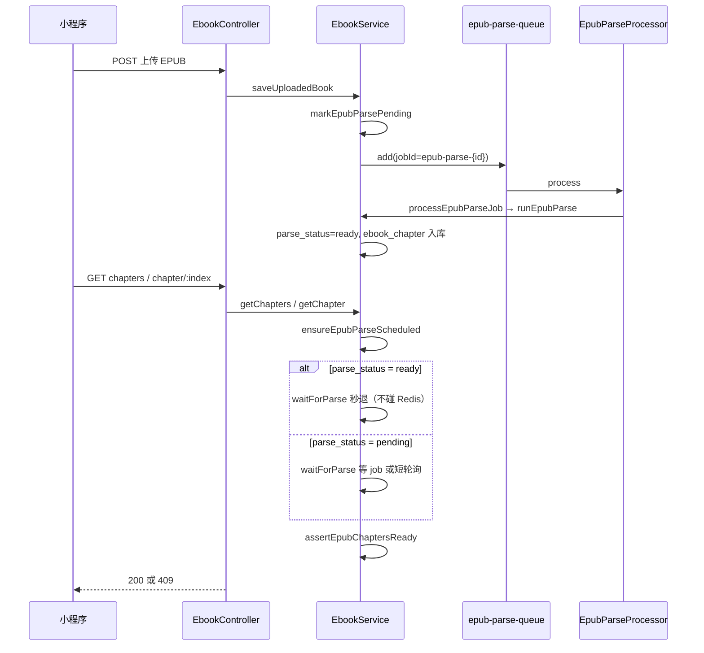
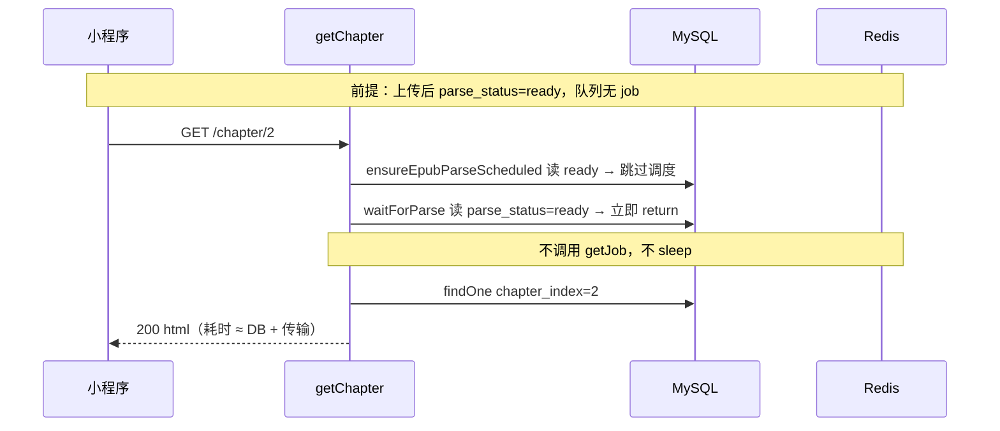

# 小程序 EPUB 服务端章节解析（BullMQ 异步队列）

**文档角色**：本轮「服务端解析 EPUB → 章节目录 + 正文 HTML API」的**实现归档**（改动前后对比 + 逐行注释）。规划态思路见 [ideas/小程序EPUB解析逻辑.md](../ideas/miniprogram/小程序EPUB解析逻辑.md)；影响面见 [impact/EPUB小程序服务端解析影响.md](../impact/EPUB小程序服务端解析影响.md)。COS 键规则与历史兼容见 [电子书COS对象键解析.md](./电子书COS对象键解析.md)。

## 1. 背景与目标

微信小程序阅读器无法像 Web 端那样在浏览器内用 epub.js 直接解压 EPUB，需要服务端：

1. 从 COS 或本地路径读取 EPUB 二进制；
2. 解析 spine / 章节 HTML，内联图片改写为 COS 外链，白名单清洗；
3. 写入 `ebook_chapter` 表，对外提供 `GET /ebook/book/:id/chapters` 与 `GET /ebook/book/:id/chapter/:index`；
4. 用 **BullMQ**（`concurrency: 1`）异步解析，避免多本大书同时占满 Node 事件循环；请求侧 `waitForParse` 最长等 120s，否则返回 **409** 供小程序轮询。

## 2. 改动范围

| 类别 | 路径 |
| ---- | ---- |
| 队列与 Worker | `apps/backend/src/services/ebook/epub-parse.constants.ts`、`epub-parse.processor.ts`、`epub-parse-queue-events.ts` |
| 模块注册 | `apps/backend/src/services/ebook/ebook.module.ts` |
| 解析与 API | `apps/backend/src/services/ebook/ebook.service.ts`、`ebook.controller.ts` |
| 解析器 | `apps/backend/src/services/ebook/epub-chapter-parser.service.ts`、`epub-html.util.ts` |
| 实体 | `apps/backend/src/services/ebook/ebook-chapter.entity.ts`；`ebook-book.entity.ts`（`parse_status` 等） |
| COS 辅助 | `apps/backend/src/services/upload/upload.service.ts`（`buildCosObjectKey` ebooks 分支、`objectExists`、`resolveCosObjectKey`） |
| 迁移 | `apps/backend/src/migrations/1783853407238-wechat_epub.ts`、`1783869394346-wechat_epub_read.ts` |

## 3. 实现思路

1. **上传即调度**：`saveUploadedBook` 在 EPUB 落库后 `markEpubParsePending`（重置 `parse_attempt`），清空旧章节并入 BullMQ。
2. **读 API 兜底调度**：`getChapters` / `getChapter` 经 `ensureEpubParseScheduled` 检查 `parse_status` 与章节行数，必要时重新 `pending` + 入队。
3. **jobId 稳定**：`epub-parse-${bookId}`（**禁止 `:`**，否则 BullMQ `Custom Id cannot contain :`）；`failed`/`completed` 残留须 `remove` 后再 `add`。
4. **请求等待**：`waitForParse` 在 `parse_status === 'ready'` 时**立即返回**（避免 `removeOnComplete` 后空轮询 Redis）；仅 `pending` 且 job 不可见时短轮询 10×100ms，再 `waitUntilFinished`。
5. **Worker 链路**：`EpubParseProcessor.process` → `processEpubParseJob` → `waitThenParse`（等 COS 就绪）→ `runEpubParse` → `EpubChapterParserService.parseEpubBuffer`。
6. **限流**：`@Processor(..., { concurrency: 1 })`，同一进程同时只跑一本解析。
7. **COS 键**：`ebooks/{uuid}.epub` 固定扩展名；`resolveCosObjectKey` 修复历史中文文件名键（详见姊妹专题）。

### 3.1 已解析完成换章仍慢（`waitForParse` Redis 空转）

**现象**：Web 上传 EPUB 后 BullMQ 已跑完，`ebook_book.parse_status = ready`、`ebook_chapter` 有数据；小程序阅读时**切换下一章**调用 `GET /ebook/book/:id/chapter/:index`，接口仍稳定慢 **~1s**，容易误判为「又在重新解析整本书」。

**与「首次打开慢」的区别**：

| 场景 | 慢的原因 | 是否正常 |
| ---- | -------- | -------- |
| **首次**读任意章（`pending`） | `waitForParse` 阻塞等 Worker 跑完 **全书** `runEpubParse`（下载 EPUB + JSZip + 全 spine 入库），上限 120s | 预期 |
| **已 `ready`** 后换章 | 不应再等解析；慢来自 **请求路径上的多余等待**，不是 `EpubParseProcessor` 重跑 | **缺陷（已修）** |

**根因链**（BullMQ 迁移 + 竞态修复时引入）：

```text
上传完成 → parse_status=ready → removeOnComplete 删掉 Redis job
                ↓
小程序 GET /chapter/3
  → ensureEpubParseScheduled   （ready + 有章节 → 秒退 ✓）
  → waitForParse               （有缺陷的初版 ↓）
       getJob(jobId) → null    （job 已被删，正常）
       for (10×100ms) 空轮询 Redis   ← 每切一章固定多等 ~1s
  → chapterRepo.findOne        （真正读库只占几十 ms）
```

要点：

1. **`removeOnComplete: true`** 使解析成功后队列里**没有** job，这是正确设计（避免 jobId 占坑）。
2. 有缺陷的 `waitForParse` **未先读 `parse_status`**，在 `job === null` 时无条件 `10×100ms` 轮询——`ready` 态下 job 永远为 null，循环跑满。
3. **`ensureEpubParseScheduled` 已正确早退**，瓶颈只在 `waitForParse`；不是小程序重复触发解析。

**解决思路（后端，必做）**：

1. **`parse_status === 'ready'` 早退**：`waitForParse` 开头查库，已 ready 则**不访问 Redis**、不 `sleep`。
2. **轮询加门禁**：仅当 `parse_status === 'pending'` **且** `getJob` 暂时为 null 时才短轮询（入队竞态兜底，最多 1s）；`ready` 态禁止轮询。
3. **保持 `removeOnComplete`**：早退依赖 DB 的 `parse_status`，不依赖 Redis 里是否还有 job。

**修复后 `ready` 态换章路径**（目标 **几十～几百 ms**，主要为 DB 读 `mediumtext` + 网络传输）：

```text
GET /chapter/N
  → ensureEpubParseScheduled  （ready → return）
  → waitForParse              （ready → return，0 次 Redis）
  → assertEpubChaptersReady
  → chapterRepo.findOne + count
  → 200 + html JSON
```

**若仍偏慢（次要，非本次 bug）**：

| 因素 | 说明 | 建议 |
| ---- | ---- | ---- |
| 章节 HTML 体积 | 单章 `html` 可达数百 KB～数 MB | 正常；看 Network 传输时长 |
| 小程序无缓存 | 首次读该章必 `fetchChapter` | 同章二次应用 `getChapterCache`（仓库外小程序） |
| `mp-html` 换章 | 清空 `chapterHtml` + `nextTick` + 短 delay 再挂载 | 客户端体感，与 API TTFB 分开量 |

**验收**：`parse_status=ready` 时连续 `GET /chapter/0`、`/chapter/1`…，服务端日志**不应**再出现 `EPUB 解析任务开始`；两次请求间隔应 **<500ms**（不含大 HTML 下载时间）。


### 4.1 `EbookModule`（`apps/backend/src/services/ebook/ebook.module.ts`）

**对比范围**：`EbookModule` 装饰器类全文（注册 BullMQ、`EbookChapter`、解析相关 Provider）。

**改动前** · `apps/backend/src/services/ebook/ebook.module.ts`（基线，约 L1–L28）

```typescript
// 从 NestJS 引入 Module 装饰器
import { Module } from '@nestjs/common';
// 引入 TypeORM 模块注册实体仓库
import { TypeOrmModule } from '@nestjs/typeorm';
// 上传模块：COS 读写
import { UploadModule } from '../upload/upload.module';
// 用户实体（书架关联）
import { User } from '../user/user.entity';
// 电子书 HTTP 控制器
import { EbookController } from './ebook.controller';
// 电子书业务服务
import { EbookService } from './ebook.service';
// 书籍主表实体
import { EbookBook } from './ebook-book.entity';
// 分类实体
import { EbookCategory } from './ebook-category.entity';
// 高亮实体
import { EbookHighlight } from './ebook-highlight.entity';
// 阅读进度实体
import { EbookProgress } from './ebook-progress.entity';
// 读书想法实体
import { EbookThought } from './ebook-thought.entity';

// 声明 Nest 模块：聚合 imports / controllers / providers
@Module({
	// 模块依赖
	imports: [
		// 注册 TypeORM 可注入的 Repository 列表
		TypeOrmModule.forFeature([
			// 书籍
			EbookBook,
			// 进度
			EbookProgress,
			// 分类
			EbookCategory,
			// 想法
			EbookThought,
			// 高亮
			EbookHighlight,
			// 用户
			User,
		]),
		// COS 上传能力
		UploadModule,
	],
	// 对外暴露的 REST 控制器
	controllers: [EbookController],
	// 可注入的服务提供者（仅 EbookService）
	providers: [EbookService],
})
// 导出模块类供 AppModule 导入
export class EbookModule {}
```

**改动后** · `apps/backend/src/services/ebook/ebook.module.ts`（当前，约 L1–L43）

```typescript
// BullMQ 队列注册
import { BullModule } from '@nestjs/bullmq';
// Nest 模块装饰器
import { Module } from '@nestjs/common';
// 读取 Redis 等配置
import { ConfigModule } from '@nestjs/config';
// TypeORM 实体注册
import { TypeOrmModule } from '@nestjs/typeorm';
// COS 上传
import { UploadModule } from '../upload/upload.module';
// 用户实体
import { User } from '../user/user.entity';
// 控制器
import { EbookController } from './ebook.controller';
// 主业务服务
import { EbookService } from './ebook.service';
// 书籍实体
import { EbookBook } from './ebook-book.entity';
// 分类实体
import { EbookCategory } from './ebook-category.entity';
// 章节表实体（解析结果落库）
import { EbookChapter } from './ebook-chapter.entity';
// 高亮
import { EbookHighlight } from './ebook-highlight.entity';
// 进度
import { EbookProgress } from './ebook-progress.entity';
// 想法
import { EbookThought } from './ebook-thought.entity';
// 队列名常量
import { EPUB_PARSE_QUEUE } from './epub-parse.constants';
// JSZip 解析 spine / HTML 的服务
import { EpubChapterParserService } from './epub-chapter-parser.service';
// BullMQ Worker：消费解析任务
import { EpubParseProcessor } from './epub-parse.processor';
// QueueEvents：供 waitUntilFinished 监听完成
import { EpubParseQueueEvents } from './epub-parse-queue-events';

@Module({
	imports: [
		TypeOrmModule.forFeature([
			EbookBook,
			// 新增：章节 Repository
			EbookChapter,
			EbookProgress,
			EbookCategory,
			EbookThought,
			EbookHighlight,
			User,
		]),
		UploadModule,
		// 配置服务（Redis 连接工厂需要）
		ConfigModule,
		// 异步注册 epub-parse-queue
		BullModule.registerQueueAsync({ name: EPUB_PARSE_QUEUE }),
	],
	controllers: [EbookController],
	providers: [
		EbookService,
		// 解析器
		EpubChapterParserService,
		// Worker
		EpubParseProcessor,
		// 完成事件
		EpubParseQueueEvents,
	],
})
export class EbookModule {}
```

**变更摘要**：注册 `EbookChapter`、BullMQ 队列、`EpubChapterParserService` / `EpubParseProcessor` / `EpubParseQueueEvents`。

---

### 4.2 `EpubParseProcessor`（`apps/backend/src/services/ebook/epub-parse.processor.ts`）

**对比范围**：纯新增文件，仅展示**改动后**全文。

**改动后** · `apps/backend/src/services/ebook/epub-parse.processor.ts`（当前，约 L1–L23）

```typescript
// NestJS BullMQ 的 Processor 装饰器与 WorkerHost 基类
import { Processor, WorkerHost } from '@nestjs/bullmq';
// 日志
import { Logger } from '@nestjs/common';
// BullMQ Job 类型
import type { Job } from 'bullmq';
// 队列名称常量
import { EPUB_PARSE_QUEUE } from './epub-parse.constants';
// 委托实际解析逻辑
import { EbookService } from './ebook.service';

// Job payload：仅含 bookId
export type EpubParseJobData = { bookId: string };

/** ponytail: concurrency=1 避免多本大 EPUB 占满事件循环 */
// 绑定队列名；并发度 1 串行解析
@Processor(EPUB_PARSE_QUEUE, { concurrency: 1 })
// 继承 WorkerHost，实现 process 方法
export class EpubParseProcessor extends WorkerHost {
	// 类级 Logger
	private readonly logger = new Logger(EpubParseProcessor.name);

	// 注入 EbookService
	constructor(private readonly ebookService: EbookService) {
		// 调用 WorkerHost 构造
		super();
	}

	// BullMQ 拉取到 job 时调用
	async process(job: Job<EpubParseJobData>): Promise<void> {
		// 从 payload 取出书籍 id
		const { bookId } = job.data;
		// 记录开始日志（含 job.id 便于排查）
		this.logger.log(`EPUB 解析任务开始 book=${bookId} job=${job.id}`);
		// 进入 waitThenParse → runEpubParse 全链路
		await this.ebookService.processEpubParseJob(bookId);
	}
}
```

---

### 4.3 `EpubParseQueueEvents`（`apps/backend/src/services/ebook/epub-parse-queue-events.ts`）

**对比范围**：纯新增；为 `job.waitUntilFinished(events)` 提供独立 `QueueEvents` 实例（不复用 chat 的 `QueueEventsListener`）。

**改动后** · `apps/backend/src/services/ebook/epub-parse-queue-events.ts`（当前，约 L1–L20）

```typescript
// Injectable 与模块销毁钩子
import { Injectable, OnModuleDestroy } from '@nestjs/common';
// 读取 Redis 配置
import { ConfigService } from '@nestjs/config';
// BullMQ 队列事件监听器
import { QueueEvents } from 'bullmq';
// 项目内统一的 Bull Redis 连接选项工厂
import { createBullRedisConnectionOptions } from '../../factorys/bull-redis-connection.factory';
// 队列名
import { EPUB_PARSE_QUEUE } from './epub-parse.constants';

@Injectable()
export class EpubParseQueueEvents implements OnModuleDestroy {
	// 对外只读：供 EbookService.waitForParse 使用
	readonly events: QueueEvents;

	constructor(configService: ConfigService) {
		// 创建与 epub-parse-queue 绑定的事件监听器
		this.events = new QueueEvents(EPUB_PARSE_QUEUE, {
			// 与 Worker 共用 Redis 连接参数
			connection: createBullRedisConnectionOptions(configService),
		});
	}

	// 应用关闭时释放连接
	async onModuleDestroy(): Promise<void> {
		await this.events.close();
	}
}
```

---

### 4.4 `buildCosObjectKey`（`apps/backend/src/services/upload/upload.service.ts`）

**对比范围**：`buildCosObjectKey` 方法全文；`ebooks` 前缀改为 `{uuid}.epub` 固定扩展名。

**改动前** · `apps/backend/src/services/upload/upload.service.ts`（基线，约 L49–L58）

```typescript
	// 根据原始文件名生成 COS 对象键
	buildCosObjectKey(
		// 上传时的 originalname（可能含中文）
		originalname: string,
		// 桶内前缀，默认 assets
		prefix: CosObjectKeyPrefix = 'assets',
	): string {
		// 解码中文文件名并取 basename，替换路径分隔符为下划线
		const safeName = basename(decodeChineseFilename(originalname)).replace(
			/[/\\]/g,
			'_',
		);
		// 统一格式：prefix/uuid_原始安全名
		return `${prefix}/${randomUUID()}_${safeName}`;
	}
```

**改动后** · `apps/backend/src/services/upload/upload.service.ts`（当前，约 L49–L63）

```typescript
	// 生成 COS 对象键；ebooks 前缀走专用规则
	buildCosObjectKey(
		originalname: string,
		prefix: CosObjectKeyPrefix = 'assets',
	): string {
		// ebooks 桶内键：仅 uuid + 合法扩展名，避免中文文件名
		if (prefix === 'ebooks') {
			// 取扩展名并转小写
			const ext = extname(decodeChineseFilename(originalname)).toLowerCase();
			// 仅允许 .epub / .pdf，否则 .bin
			const safeExt = ['.epub', '.pdf'].includes(ext) ? ext : '.bin';
			// 形如 ebooks/550e8400-e29b-41d4-a716-446655440000.epub
			return `${prefix}/${randomUUID()}${safeExt}`;
		}
		// 非 ebooks 仍用 uuid_安全文件名
		const safeName = basename(decodeChineseFilename(originalname)).replace(
			/[/\\]/g,
			'_',
		);
		return `${prefix}/${randomUUID()}_${safeName}`;
	}
```

**变更摘要**：`ebooks/` 键与 `resolveCosObjectKey` 列举前缀对齐；详见 [电子书COS对象键解析.md](./电子书COS对象键解析.md)。

---

### 4.5 `saveUploadedBook`（`apps/backend/src/services/ebook/ebook.service.ts`）

**对比范围**：`saveUploadedBook` 私有方法全文；新增 EPUB 上传后触发 `markEpubParsePending`。

**改动前** · `apps/backend/src/services/ebook/ebook.service.ts`（基线，约 L567–L608）

```typescript
	// 会员 COS 上传完成后写入/更新书籍记录
	private async saveUploadedBook(
		userId: number,
		file: Express.Multer.File,
		fmt: 'epub' | 'pdf',
		stored: { filePath: string; size: number },
		opts?: { bookId?: string; categoryId?: string },
	): Promise<EbookBookDto> {
		// 覆盖已有书籍（重新上传替换 filePath）
		if (opts?.bookId) {
			const book = await this.bookRepo.findOne({
				where: { id: opts.bookId, userId },
			});
			if (!book) {
				throw new NotFoundException('书籍不存在');
			}
			if (book.fmt !== fmt) {
				throw new BadRequestException('文件格式与已登记书籍不一致');
			}
			book.filePath = stored.filePath;
			book.srcKind = 'store';
			book.size = String(stored.size);
			await this.bookRepo.save(book);
			// 旧版：不触发章节解析
			return this.toBookDto(book);
		}

		const originalname = decodeChineseFilename(file.originalname);
		const title = titleFromPath(originalname).slice(0, 512);
		const categoryId = await this.resolveUserCategoryId(
			userId,
			opts?.categoryId,
		);
		const book = this.bookRepo.create({
			userId,
			fmt,
			title,
			srcKind: 'store',
			filePath: stored.filePath,
			size: String(stored.size),
			categoryId,
		});
		await this.bookRepo.save(book);
		// 旧版：仅落库，无 parse 调度
		return this.toBookDto(book);
	}
```

**改动后** · `apps/backend/src/services/ebook/ebook.service.ts`（当前，约 L631–L676）

```typescript
	private async saveUploadedBook(
		userId: number,
		file: Express.Multer.File,
		fmt: 'epub' | 'pdf',
		stored: { filePath: string; size: number },
		opts?: { bookId?: string; categoryId?: string },
	): Promise<EbookBookDto> {
		if (opts?.bookId) {
			const book = await this.bookRepo.findOne({
				where: { id: opts.bookId, userId },
			});
			if (!book) {
				throw new NotFoundException('书籍不存在');
			}
			if (book.fmt !== fmt) {
				throw new BadRequestException('文件格式与已登记书籍不一致');
			}
			book.filePath = stored.filePath;
			book.srcKind = 'store';
			book.size = String(stored.size);
			await this.bookRepo.save(book);
			// EPUB 重新上传：重置解析次数、清章节、入队（不 await，上传 API 快速返回）
			if (fmt === 'epub')
				void this.markEpubParsePending(book.id, { resetAttempts: true });
			return this.toBookDto(book);
		}

		const originalname = decodeChineseFilename(file.originalname);
		const title = titleFromPath(originalname).slice(0, 512);
		const categoryId = await this.resolveUserCategoryId(
			userId,
			opts?.categoryId,
		);
		const book = this.bookRepo.create({
			userId,
			fmt,
			title,
			srcKind: 'store',
			filePath: stored.filePath,
			size: String(stored.size),
			categoryId,
		});
		await this.bookRepo.save(book);
		// 新建 EPUB：同样 fire-and-forget 调度解析
		if (fmt === 'epub')
			void this.markEpubParsePending(book.id, { resetAttempts: true });
		return this.toBookDto(book);
	}
```

**变更摘要**：上传 EPUB 后异步 `markEpubParsePending`；`markEpubParsePending` 内部 `await startParseTask` 保证入队完成。

---

### 4.6 `startParseTask`（`apps/backend/src/services/ebook/ebook.service.ts`）

**对比范围**：纯新增私有方法；负责 BullMQ 入队与 stale job 清理。

**改动后** · `apps/backend/src/services/ebook/ebook.service.ts`（当前，约 L1754–L1782）

```typescript
	// 将指定书籍的解析任务加入 epub-parse-queue
	private async startParseTask(bookId: string): Promise<void> {
		// 稳定 jobId，禁止冒号
		const jobId = this.epubParseJobId(bookId);
		// 查是否已有同 id 任务
		const existing = await this.epubParseQueue.getJob(jobId);
		if (existing) {
			// 读取 Redis 中任务状态
			const state = await existing.getState();
			// 进行中或排队中：不重复 add
			if (state === 'active' || state === 'waiting' || state === 'delayed') {
				return;
			}
			// ponytail: failed/completed 占着 jobId 时 add 会静默失败，先移除再入队
			if (state === 'failed' || state === 'completed') {
				await existing.remove();
			}
		}

		try {
			// 入队：job 名 parse，payload { bookId }
			await this.epubParseQueue.add(
				'parse',
				{ bookId },
				{
					// 与 getJob 使用同一自定义 id
					jobId,
					// 解析失败不在 Bull 层重试（由 parse_attempt 控制）
					attempts: 1,
					// 成功后删 job，避免 ready 后 waitForParse 空转
					removeOnComplete: true,
					// 保留最近 50 条失败记录便于排查
					removeOnFail: { count: 50 },
				},
			);
		} catch (err) {
			// 入队异常只打 warn，不抛给上传 API
			this.logger.warn(`EPUB 解析入队失败 book=${bookId}`, err);
		}
	}
```

---

### 4.7 `waitForParse`（`apps/backend/src/services/ebook/ebook.service.ts`）

**对比范围**：HTTP 读章节前等待 Worker；**§3.1** 修复「已 `ready` 换章仍 ~1s」的 Redis 空转。

**改动前（有缺陷的初版）** · `apps/backend/src/services/ebook/ebook.service.ts`（BullMQ 竞态修复后、ready 早退前，约 L1784–L1820）

```typescript
	// 读 API 侧：等待 Bull job 结束（未区分 DB ready 态）
	private async waitForParse(bookId: string): Promise<void> {
		// 直接拼 jobId，未先查 parse_status
		const jobId = this.epubParseJobId(bookId);
		// 解析完成后 job 已被 removeOnComplete 删除 → 常为 null
		let job = await this.epubParseQueue.getJob(jobId);
		// 缺陷：只要 job 为 null 就轮询，ready 态下也会睡满 10×100ms
		for (let i = 0; !job && i < 10; i++) {
			// 每次固定等待 100ms
			await new Promise((resolve) => setTimeout(resolve, 100));
			// 再次查 Redis，ready 后仍永远 null
			job = await this.epubParseQueue.getJob(jobId);
		}
		// 无 job 则退出（已多等 ~1s）
		if (!job) return;

		// 读取 job 状态
		const state = await job.getState();
		// 已结束则不再 waitUntilFinished
		if (state === 'completed' || state === 'failed') return;

		try {
			// 120s 超时
			const timeout = new Promise<void>((_, reject) =>
				setTimeout(
					() => reject(new Error('EPUB parse wait timeout')),
					EbookService.PARSE_WAIT_MS,
				),
			);
			// 阻塞到 Worker 完成或超时
			await Promise.race([
				job.waitUntilFinished(this.epubParseQueueEvents.events),
				timeout,
			]);
		} catch {
			// 超时由 assertEpubChaptersReady 转 409
		}
	}
```

**改动后** · `apps/backend/src/services/ebook/ebook.service.ts`（当前，约 L1784–L1820）

```typescript
	// 读 API 侧：尽量等到 parse_status=ready，避免立刻 409
	private async waitForParse(bookId: string): Promise<void> {
		// 只查 id 与 parseStatus，减轻查询
		const book = await this.bookRepo.findOne({
			where: { id: bookId },
			select: ['id', 'parseStatus'],
		});
		// 已解析完成：直接返回，不再查 Redis（job 可能已被 removeOnComplete 删掉）
		if (book?.parseStatus === 'ready') return;

		const jobId = this.epubParseJobId(bookId);
		// 尝试获取 Bull job
		let job = await this.epubParseQueue.getJob(jobId);
		// ponytail: 仅 pending 且 job 尚未可见时轮询；ready 后 job 已 removeOnComplete，不可空转 1s
		if (!job && book?.parseStatus === 'pending') {
			// 上传与读 API 竞态：mark 刚写完，Worker 尚未 add 完成
			for (let i = 0; i < 10; i++) {
				// 每次等 100ms
				await new Promise((resolve) => setTimeout(resolve, 100));
				job = await this.epubParseQueue.getJob(jobId);
				if (job) break;
			}
		}
		// 仍无 job（例如从未调度）：交给 assertEpubChaptersReady
		if (!job) return;

		const state = await job.getState();
		// 已结束：无需 waitUntilFinished
		if (state === 'completed' || state === 'failed') return;

		try {
			// 120s 超时 Promise
			const timeout = new Promise<void>((_, reject) =>
				setTimeout(
					() => reject(new Error('EPUB parse wait timeout')),
					EbookService.PARSE_WAIT_MS,
				),
			);
			// 与 QueueEvents 竞速：先完成者胜出
			await Promise.race([
				job.waitUntilFinished(this.epubParseQueueEvents.events),
				timeout,
			]);
		} catch {
			// 超时或失败由 assertEpubChaptersReady 返回 409
		}
	}
```

**变更摘要**：先读 `parse_status`；`ready` 秒退；轮询仅用于 `pending` 入队竞态。消除已解析书每切一章 ~1s 的 Redis 空转。

---

### 4.8 `ensureEpubParseScheduled`（`apps/backend/src/services/ebook/ebook.service.ts`）

**对比范围**：纯新增；读 API 入口的解析状态机。

**改动后** · `apps/backend/src/services/ebook/ebook.service.ts`（当前，约 L1709–L1732）

```typescript
	// 确保 contentBook（源书）已调度解析任务
	private async ensureEpubParseScheduled(
		contentBook: EbookBook,
	): Promise<void> {
		// 无 COS 键且无本地文件：无法解析，由 assertEpubSourceAvailable 拦截
		if (!this.canParseEpubSource(contentBook)) return;

		// 统计已落库章节行数
		const chapterCount = await this.chapterRepo.count({
			where: { bookId: contentBook.id },
		});
		// 已 ready 且有章节：无需再调度
		if (contentBook.parseStatus === 'ready' && chapterCount > 0) return;

		// 永久失败：不再自动重试（需重新上传）
		if (contentBook.parseStatus === 'failed') return;
		// 超过 MAX_PARSE_ATTEMPTS：标记 failed 并退出
		if (this.isParseAttemptExhausted(contentBook)) {
			await this.markEpubParseFailed(contentBook.id);
			return;
		}

		// pending 且无章节：可能已 mark 但未入队，补 startParseTask
		if (contentBook.parseStatus === 'pending' && chapterCount === 0) {
			await this.startParseTask(contentBook.id);
			return;
		}

		// 已有 active/waiting job：不重复 mark
		if (await this.isParseJobActive(contentBook.id)) return;
		// 其它不一致状态：重新 pending + 清章节 + 入队
		await this.markEpubParsePending(contentBook.id);
	}
```

---

### 4.9 `markEpubParsePending`（`apps/backend/src/services/ebook/ebook.service.ts`）

**对比范围**：纯新增；重置 DB 状态、清空章节、入队。

**改动后** · `apps/backend/src/services/ebook/ebook.service.ts`（当前，约 L1837–L1858）

```typescript
	// 将书籍置为 pending 并触发解析（上传或兜底调度）
	async markEpubParsePending(
		bookId: string,
		opts?: { resetAttempts?: boolean },
	): Promise<void> {
		// 若队列里已有活跃任务，避免重复清表
		if (await this.isParseJobActive(bookId)) return;

		const book = await this.bookRepo.findOne({ where: { id: bookId } });
		if (!book) return;

		// resetAttempts：上传场景从 1 开始；否则递增
		const nextAttempt = opts?.resetAttempts ? 1 : (book.parseAttempt ?? 0) + 1;
		// 超过上限：直接 failed
		if (nextAttempt > EbookService.MAX_PARSE_ATTEMPTS) {
			await this.markEpubParseFailed(bookId);
			return;
		}

		// 写 pending + 当前尝试次数
		await this.bookRepo.update(
			{ id: bookId },
			{ parseStatus: 'pending', parseAttempt: nextAttempt },
		);
		// 清空旧章节，防止半解析数据被读出
		await this.chapterRepo.delete({ bookId });
		// 必须 await，修复 void 竞态导致 waitForParse 立刻 getJob=null
		await this.startParseTask(bookId);
	}
```

---

### 4.10 章节读 API（`apps/backend/src/services/ebook/ebook.controller.ts`）

**对比范围**：纯新增两个 GET 路由。

**改动后** · `apps/backend/src/services/ebook/ebook.controller.ts`（当前，约 L227–L244）

```typescript
	// 章节目录：index / title / href / level / wordCount
	@Get('book/:id/chapters')
	@UseInterceptors(ResponseInterceptor)
	async getChapters(
		@Req() req: AuthedRequest,
		@Param('id', ParseUUIDPipe) id: string,
	) {
		return this.ebookService.getChapters(this.userId(req), id);
	}

	// 单章正文 HTML
	@Get('book/:id/chapter/:index')
	@UseInterceptors(ResponseInterceptor)
	async getChapter(
		@Req() req: AuthedRequest,
		@Param('id', ParseUUIDPipe) id: string,
		@Param('index', ParseIntPipe) index: number,
	) {
		return this.ebookService.getChapter(this.userId(req), id, index);
	}
```

---

## 5. 运行时调用链



### 5.1 `ready` 态换章快路径（§3.1）



## 6. 兼容性与影响

| 项 | 说明 |
| -- | ---- |
| Web 阅读 | 仍走 epub.js 本地渲染，**不依赖**本章 API |
| 409 语义 | `parse_status !== ready'` 或章节数为 0；小程序应短间隔轮询 |
| Redis | 依赖 BullMQ；无 Redis 时 Worker 不消费，读 API 长期 409 |
| 历史 COS 键 | `resolveCosObjectKey` 兼容；新上传一律 `ebooks/{uuid}.epub` |
| 迁移缺口 | `ebook_progress` 的 `chapter_index` 等列迁移若未落盘，进度同步可能缺字段（见影响面文档） |

## 7. 风险与回归建议

1. 上传 EPUB → 日志出现 `EPUB 解析任务开始` → `parse_status=ready` → `GET chapters` 返回 `total > 0`。
2. 解析中请求章节：首次可能等至 120s；超时返回 409，再次请求在 ready 后应 **<100ms**（`waitForParse` 早退）。
3. **已 `ready` 连续换章**（§3.1）：`GET /chapter/0` → `/chapter/1` → `/chapter/2`，服务端**无**新解析日志；TTFB **不应**再稳定 ~1s（排除大 HTML 传输）。
4. 重复上传同一 `bookId`：`parse_attempt` 重置为 1，旧章节被删后重写。
5. 故意让 `jobId` 残留 `completed`：再次调度应能 `remove` 后成功 `add`。
6. 大 EPUB（>50MB）：单 Worker 串行，第二本排队而非 CPU 爆满。

## 8. 相关源码路径

| 说明 | 路径 |
| ---- | ---- |
| 队列常量 | `apps/backend/src/services/ebook/epub-parse.constants.ts` |
| Worker | `apps/backend/src/services/ebook/epub-parse.processor.ts` |
| QueueEvents | `apps/backend/src/services/ebook/epub-parse-queue-events.ts` |
| 解析核心 | `apps/backend/src/services/ebook/epub-chapter-parser.service.ts` |
| 业务编排 | `apps/backend/src/services/ebook/ebook.service.ts` |
| HTTP | `apps/backend/src/services/ebook/ebook.controller.ts` |
| 章节表 | `apps/backend/src/services/ebook/ebook-chapter.entity.ts` |

---

（若与仓库最新源码不一致，以源码为准）
