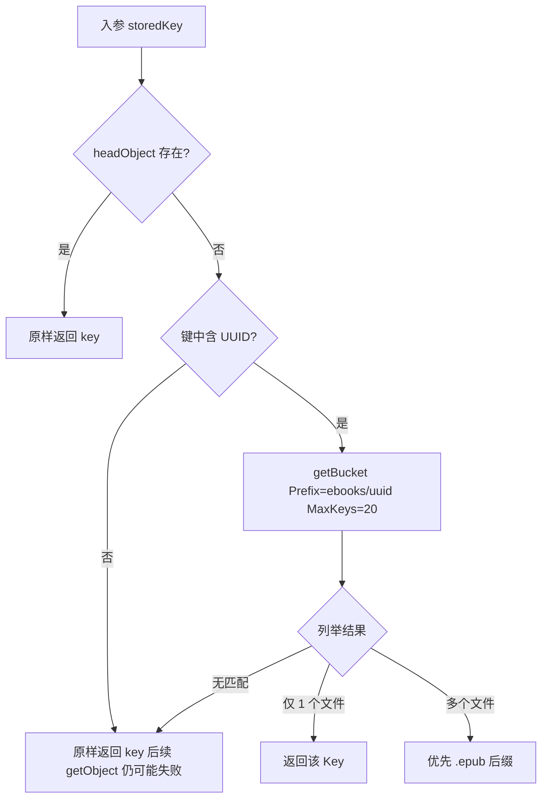

# 电子书 COS 对象键解析与章节资源上传

> **文档角色**：说明 `UploadService` 中 `objectExists`、`resolveCosObjectKey`、`uploadEbookAssetBuffer` 及 `buildCosObjectKey(ebooks)` 为何增加、如何工作、影响哪些链路。  
> **源码**：`apps/backend/src/services/upload/upload.service.ts`（约 L49–L239）  
> **延伸阅读**：[电子书COS流式IO.md](./电子书COS流式IO.md)、[电子书会员上传.md](./电子书会员上传.md)、[../ideas/小程序EPUB解析逻辑.md](../ideas/miniprogram/小程序EPUB解析逻辑.md)、[../impact/EPUB小程序服务端解析影响.md](../impact/EPUB小程序服务端解析影响.md)

若与仓库最新源码不一致，**以源码为准**。

---

## 1. 为什么要加这段逻辑

### 1.1 历史问题：电子书 COS 键名带中文文件名

早期电子书上传时，`buildCosObjectKey(..., 'ebooks')` 与 `assets` 前缀共用同一规则：

```text
ebooks/{uuid}_{原始文件名}.epub
```

当用户上传的文件名含中文（如 `三体.epub`）时，对象键会变成：

```text
ebooks/550e8400-e29b-41d4-a716-446655440000_三体.epub
```

这会带来两类问题：

| 问题 | 说明 |
|------|------|
| **键名与 URL 编码不一致** | 数据库存的是解码后的键或部分编码形式，COS 实际对象键可能因上传/SDK 行为与 DB 不完全一致，`getObject` 直接按 DB 键读取会 **404** |
| **小程序/外链展示** | 章节 HTML 内图片、EPUB 正文下载都依赖稳定的 COS 键；键名含多字节字符时，排查与修复成本更高 |

### 1.2 新规则：电子书主文件仅用 UUID + 扩展名

当前 `buildCosObjectKey` 对 `prefix === 'ebooks'` 单独处理：

```text
ebooks/{uuid}.epub   或   ebooks/{uuid}.pdf
```

不再把原始中文文件名拼进对象键，新上传的书与 COS 键一一对应、可预测。

### 1.3 存量数据兼容

已入库的 `ebook_book.file_path` 仍可能是旧格式键。若不做兼容，**已上传的老书**在 EPUB 解析、下载、小程序读章节时会报「云端文件不存在」。

因此增加 `resolveCosObjectKey`：DB 键在 COS 上不存在时，按键中的 UUID 列举 `ebooks/{uuid}` 前缀，找回真实对象键，并在解析成功时 **回写 DB**。

### 1.4 小程序 EPUB 章节渲染需要图片外链

个人小程序不能用 web-view 跑 epub.js，需后端预解析章节 HTML。EPUB 内 `` 是相对路径，小程序 `mp-html` 无法解析 zip 内资源。

`uploadEbookAssetBuffer` 在解析阶段把章节内图片上传到 COS，并把 HTML 里的 `src` 改写为 **公网 HTTPS URL**（见 `EpubChapterParserService.rewriteImages`）。

---

## 2. 三个方法分别做什么

### 2.1 `objectExists(key)`

```typescript
await cos.headObject({ Bucket, Region, Key });
```

| 项 | 说明 |
|----|------|
| **作用** | 用 `headObject` 轻量判断对象是否存在，避免直接 `getObject` 拉整包 |
| **返回** | 存在 `true`；任意错误（含 404、权限、网络）均 `false` |
| **调用方** | `resolveCosObjectKey` 快路径；`EbookService.waitThenParse` 轮询等待 COS 上传完成 |

### 2.2 `resolveCosObjectKey(storedKey)`

**流程：**



| 步骤 | 行为 |
|------|------|
| 1 | 规范化键（去首尾 `/`、校验 `isCosObjectKey`） |
| 2 | `objectExists` 为真 → 直接返回（无额外 COS 列表请求） |
| 3 | 从键中正则提取 UUID，列举 `ebooks/{uuid}` |
| 4 | 仅 1 个对象 → 视为目标；多个 → 优先 `.epub` |
| 5 | 仍无法解析 → 返回原键（由上层 `getObject` 报错） |

注释中的 **ponytail** 含义：用列表接口做启发式修复，而非全量迁移历史数据；已知上限见 §4。

`getObjectBuffer` 在读取前 **统一** 调用 `resolveCosObjectKey`，因此所有经此方法的 EPUB 下载都会受益。

### 2.3 `uploadEbookAssetBuffer({ bookId, relativePath, buffer, mimetype })`

| 项 | 说明 |
|----|------|
| **对象键** | `ebooks/assets/{bookId}/{randomUUID}_{安全化相对路径文件名}` |
| **返回值** | `buildCosPublicUrl(key)`，即带 `COS_PUBLIC_DOMAIN` 的 HTTPS 地址 |
| **调用方** | `EpubChapterParserService.rewriteImages`（解析时缓存同书同路径，避免重复上传） |
| **与主文件区别** | 主 EPUB 在 `ebooks/{uuid}.epub`；章节内图片在 `ebooks/assets/` 子目录，互不覆盖 |

---

## 3. 在系统中的调用位置

| 模块 | 方法 | 用法 |
|------|------|------|
| `ebook.service.ts` | `resolveEpubBuffer` | 读 COS EPUB 前 `resolveCosObjectKey` → `getObjectBuffer` |
| `ebook.service.ts` | `waitThenParse` | 上传后轮询：`resolve` + `objectExists`，键修正则 **save `file_path`** |
| `ebook.service.ts` | `runEpubParse` | 解析成功后若键被修正，再次回写 `file_path` |
| `epub-chapter-parser.service.ts` | `rewriteImages` | 每章 HTML 内图片 → `uploadEbookAssetBuffer` → 外链写入 `ebook_chapter.html` |
| `upload.service.ts` | `getObjectBuffer` | 内部先 `resolveCosObjectKey` 再 `getObject` |

**端到端（小程序读章节）**：

```text
Web/Tauri 上传 EPUB → COS ebooks/{uuid}.epub
       → 触发 EPUB 解析
       → rewriteImages 上传内嵌图到 ebooks/assets/...
       → 章节 HTML 入库
小程序 GET /ebook/book/:id/chapter/:index → mp-html 渲染（img 已是 COS 外链）
```

---

## 4. 影响与风险

### 4.1 正面影响

| 影响 | 说明 |
|------|------|
| **老书可读** | DB 存旧中文键时，仍能通过 UUID 前缀列举找到 COS 上的真实文件 |
| **解析可重试** | `waitThenParse` 在 COS 对象未就绪时轮询 `objectExists`，减少「上传刚完成就解析失败」 |
| **DB 自愈** | 解析流程中发现键不一致会回写 `file_path`，逐步收敛到新键 |
| **小程序图片可显** | 章节 HTML 图片为 COS 公网 URL，不依赖 EPUB zip 内相对路径 |
| **新上传更稳** | `ebooks/{uuid}.epub` 键名无中文，后续下载/流式 pipe 更少编码问题 |

### 4.2 代价与边界

| 项 | 说明 |
|----|------|
| **额外 COS API** | 键不存在时多一次 `getBucket`（`MaxKeys: 20`）；键已存在时仅 `headObject` |
| **列举歧义** | 同一 `ebooks/{uuid}` 下若有 **多个** 非目录对象且不止一个 `.epub`，可能选错；正常业务一 UUID 对应一本主文件 |
| **objectExists 粗判** | 非 404 错误（如 CAM 拒权）也当「不存在」，上层可能误判为等待上传 |
| **无全量迁移** | 不会批量改 DB/COS 键名，仅运行时解析 + 解析成功时回写 |
| **资产目录膨胀** | 每本书解析产生的图片在 `ebooks/assets/{bookId}/` 累积；删书时需确认是否联动删资产（当前主链路以删主对象键为主，资产清理见运维策略） |

### 4.3 回归建议

- [ ] 旧键 `ebooks/{uuid}_中文名.epub` 的书：能触发解析且 `file_path` 可回写为 `ebooks/{uuid}.epub`
- [ ] 新上传中文文件名 EPUB：COS 键为 `ebooks/{uuid}.epub`，下载与解析正常
- [ ] 含内嵌图的 EPUB：章节 HTML 中 `img src` 为 `COS_PUBLIC_DOMAIN` 外链，小程序可显示
- [ ] COS 对象尚未就绪：解析任务轮询后能成功，而非立即 `parseStatus: failed`
- [ ] 键确实不存在：仍失败，错误信息与「请重新上传」一致

---

## 5. 与 `buildCosObjectKey` 变更的关系

| 时期 | `ebooks` 前缀键规则 | DB 示例 |
|------|---------------------|---------|
| 旧 | `{uuid}_{basename(中文名)}` | `ebooks/xxx_三体.epub` |
| 新 | `{uuid}.epub` / `{uuid}.pdf` | `ebooks/xxx.epub` |

`resolveCosObjectKey` 是为 **旧规则存量** 服务的兼容层；新上传走新规则后，多数请求在 `headObject` 快路径返回，不再触发 `getBucket`。

---

## 6. 维护定位表

| 需求变更 | 改哪里 |
|----------|--------|
| 调整电子书主文件键规则 | `upload.service.ts` → `buildCosObjectKey` |
| 修改历史键兼容策略 | `upload.service.ts` → `resolveCosObjectKey` |
| 章节图片存储路径/ACL | `upload.service.ts` → `uploadEbookAssetBuffer` |
| 解析后是否回写 `file_path` | `ebook.service.ts` → `waitThenParse` / `runEpubParse` |
| 图片改写与缓存 | `epub-chapter-parser.service.ts` → `rewriteImages` |
