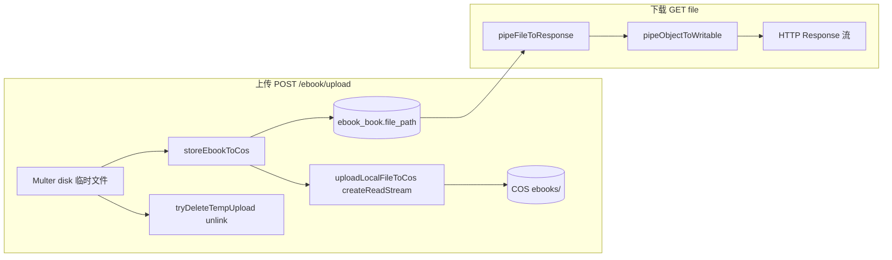

# 电子书 COS 流式上传与下载

> **文档角色**：会员云端电子书 **不再整包进内存**——Multer 磁盘临时文件 + `createReadStream` 上传 COS；下载侧 `pipeObjectToWritable` 直写 HTTP Response。  
> **延伸阅读**：[电子书会员上传.md](./电子书会员上传.md)（会员闸门与 COS-only）、[电子书COS本地书架.md](./电子书COS本地书架.md)（书架云端备份主链路）。

若与仓库最新源码不一致，**以源码为准**。

---

## 1. 背景与目标

### 1.1 问题

旧实现中：

- `addFromUpload` 使用 `file.buffer`，Multer 将 **整本 epub/pdf** 读入堆；
- `getObjectBuffer` 下载 COS 对象同样 **Buffer 一次性分配**；
- 120MB 级文件在并发或 GC 压力下易触发 **heap OOM**。

### 1.2 目标

| # | 目标 |
|---|------|
| 1 | 上传：磁盘临时文件 → 流式 `putObject` |
| 2 | 下载：COS → 流式写入 `Response`，前端仍用 ArrayBuffer 消费 |
| 3 | 上传完成后删除临时文件 |
| 4 | 小对象仍保留 `getObjectBuffer` 供其它模块使用 |

---

## 2. 改动范围

| 路径 | 说明 |
|------|------|
| `apps/backend/src/services/upload/upload.service.ts` | `pipeObjectToWritable`、`uploadLocalFileToCos`、`normalizeCosObjectKey` |
| `apps/backend/src/services/ebook/ebook.service.ts` | `storeEbookToCos` 改流式；`pipeFileToResponse`；`EbookFilePayload` 改 `cos` |
| `apps/backend/src/services/ebook/ebook.controller.ts` | 下载路由改 pipe（若已有则对齐） |

---

## 3. 数据流



---

## 4. 实现思路

1. **Multer 磁盘模式**：`addFromUpload` 校验 `file.path` + `file.size`，不再依赖 `file.buffer`。
2. **上传管道**：`createReadStream(localPath)` 作为 `putObject.Body`，并传 `ContentLength` 供 COS 校验。
3. **下载管道**：`cos.getObject({ Output: writable })` 将字节直接 pipe 到 Express `res`，服务端不持有完整 Buffer。
4. **临时文件清理**：`try/finally` 中 `unlink` 临时路径，失败不阻塞主流程。
5. **类型变更**：`EbookFilePayload` 由 `{ kind: 'buffer' }` 改为 `{ kind: 'cos', key }`，调用方统一走 pipe。

---

## 5. 关键代码与注释

### 5.1 UploadService：流式上传与下载

**来源**：`apps/backend/src/services/upload/upload.service.ts`（`pipeObjectToWritable`，约 L123–L150）

```typescript
/** 从 COS 流式写出到可写流（避免大文件整包进内存） */
async pipeObjectToWritable(key: string, writable: Writable): Promise<void> {
	const normalizedKey = this.normalizeCosObjectKey(key);
	const config = getCosRuntimeConfig();
	assertCosRuntimeConfig(config);
	const cos = this.getCosClient();

	await new Promise<void>((resolve, reject) => {
		cos.getObject(
			{
				Bucket: config.bucket,
				Region: config.region,
				Key: normalizedKey,
				Output: writable, // 说明：COS SDK 直接把对象字节写入 writable（如 Express res）
			},
			(err) => (err ? reject(err) : resolve()),
		);
	});
}
```

**来源**：`apps/backend/src/services/upload/upload.service.ts`（`uploadLocalFileToCos`，约 L179–L230）

```typescript
/** 从本地文件流式上传至 COS（避免 multer 整包进内存） */
async uploadLocalFileToCos(params: {
	localPath: string;
	originalname: string;
	mimetype?: string;
	size: number;
	prefix: CosObjectKeyPrefix;
}) {
	const key = this.buildCosObjectKey(params.originalname, params.prefix);
	const cos = this.getCosClient();
	const body = createReadStream(params.localPath); // 说明：按块读取，不一次性 readFile

	await new Promise<void>((resolve, reject) => {
		cos.putObject(
			{
				Bucket: config.bucket,
				Region: config.region,
				Key: key,
				Body: body,
				ContentLength: params.size,
				ContentType: params.mimetype || 'application/octet-stream',
				ACL: config.objectAcl,
			},
			(err) => (err ? reject(err) : resolve()),
		);
	});

	return { key, url: this.buildCosPublicUrl(key), size: params.size, /* ... */ };
}
```

### 5.2 EbookService：上传与 pipe 下载

**来源**：`apps/backend/src/services/ebook/ebook.service.ts`（`addFromUpload` + `storeEbookToCos`，约 L277–L366）

```typescript
async addFromUpload(userId, file, opts?) {
	// 说明：磁盘 Multer 模式——校验 path/size，不再要求 buffer
	if (!file?.path || !file.size) {
		throw new BadRequestException('请上传 epub / pdf 文件');
	}
	// ... 会员校验 ...

	try {
		const stored = await this.storeEbookToCos(file);
		return await this.saveUploadedBook(userId, file, fmt, stored, opts);
	} finally {
		// 说明：无论上传成功与否，尽量删除 multer 临时文件，释放磁盘
		await this.tryDeleteTempUpload(file.path);
	}
}

private async storeEbookToCos(file: Express.Multer.File) {
	const cosResult = await this.uploadService.uploadLocalFileToCos({
		localPath: file.path,
		originalname: file.originalname,
		mimetype: file.mimetype,
		size: file.size,
		prefix: 'ebooks',
	});
	return { filePath: cosResult.key, size: cosResult.size };
}
```

**来源**：`apps/backend/src/services/ebook/ebook.service.ts`（`pipeFileToResponse`，约 L487–L499）

```typescript
async pipeFileToResponse(userId, bookId, res: Response): Promise<void> {
	const payload = await this.getFileForDownload(userId, bookId);
	res.setHeader('Content-Type', this.getEbookMime(payload.fmt));
	if (payload.kind === 'disk') {
		res.sendFile(payload.abs);
		return;
	}
	// 说明：COS 对象键直 pipe 到响应，服务端堆上无完整 Buffer
	await this.uploadService.pipeObjectToWritable(payload.key, res);
}
```

**来源**：`apps/backend/src/services/ebook/ebook.service.ts`（`EbookFilePayload` 类型，约 L74–L76）

```typescript
export type EbookFilePayload =
	| { kind: 'disk'; abs: string; fmt: 'epub' | 'pdf' }
	| { kind: 'cos'; key: string; fmt: 'epub' | 'pdf' };
// 说明：移除 kind:'buffer'，强制下载路径走流式
```

---

## 6. 兼容性与影响

| 维度 | 说明 |
|------|------|
| 前端 | 仍通过 HTTP 下载为 ArrayBuffer；对用户透明 |
| 会员策略 | 不变，见 [电子书会员上传.md](./电子书会员上传.md) |
| 磁盘 | 需配置 Multer 临时目录空间；上传后自动 unlink |
| `getObjectBuffer` | 保留，标注「小对象场景」 |

---

## 7. 回归建议

1. 会员上传约 100MB PDF，进程堆不应等于文件大小。
2. 下载同一本书，响应体完整、EPUB/PDF 可正常打开。
3. 上传失败时临时目录无大量残留 `.tmp` 文件。

---

## 8. 相关源码路径

| 说明 | 路径 |
|------|------|
| COS 流式 API | `apps/backend/src/services/upload/upload.service.ts` |
| 电子书业务 | `apps/backend/src/services/ebook/ebook.service.ts` |
| 控制器 | `apps/backend/src/services/ebook/ebook.controller.ts` |
