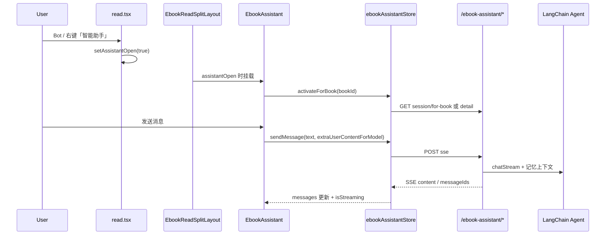

# 电子书：MOKE 智能助手（独立后端）与 PDF 接入

**延伸阅读**（同链路其它专题，避免重复维护）：

- EPUB 右键菜单初版：`EPUB助手右键菜单.md`
- 知识库选区写入后聚焦（含 IME 修复）：`../knowledge/助手插入焦点.md`
- PDF 适应宽度与滚动换页：`PDF阅读器适配滚动.md`
- **EPUB 侧栏写想法 / MK 问书输入焦点（2026-07-19）**：[`EPUB侧面板输入焦点.md`](./EPUB侧面板输入焦点.md) —— 电子书问书已改为 `assistantFocusKey` + settle 交焦，**不再**经 `EbookAssistant` 的 `focusInputAtEndKey`；下文 §3 / §4.12 中电子书路径的旧叙述以该专题为准（知识库复制到助手仍可用 `focusInputAtEndKey`）。

---

## 1. 背景与目标

本轮在电子书阅读场景落地 **MOKE 智能助手**完整链路，并扩展至 **PDF**。核心诉求如下：

| # | 诉求 | 验收标准 |
|---|------|----------|
| 1 | 独立会话域 | 按 `bookId` 多会话，与知识库 `assistantStore` / 英语 `englishAgentStore` 隔离 |
| 2 | EPUB + PDF 分栏助手 | 顶栏 Bot + 右键入口；PDF **无** MOKE 问书 |
| 3 | UI 统一 | 抽取公共 `@/components/design/Assistant` 层 |
| 4 | AI 消息操作 | 保存到知识库、分享问答对（`sessionType=ebook`） |
| 5 | PDF 右键 | 助手 / 缩放 / 翻页 / 目录；缩放时菜单不关 |
| 6 | 体验细节 | 顶栏长书名截断；助手分栏可拖拽；聚焦后 IME 正常 |

---

## 2. 改动范围

| 路径 | 角色 |
|------|------|
| `apps/backend/src/services/ebook-assistant/` | 独立 Nest 模块：会话 CRUD、SSE 流式、记忆摘要 |
| `apps/backend/src/services/share/share.service.ts` | `sessionType=ebook` 分享拉取 |
| `apps/frontend/src/store/ebookAssistant.ts` | MobX Store，对接 `/ebook-assistant/*` |
| `apps/frontend/src/components/design/Assistant/` | 公共 Shell / MessageRow / SessionEntryToolbar 等 |
| `apps/frontend/src/hooks/useAssistantScroll.ts` | 流式贴底、ScrollFab |
| `apps/frontend/src/hooks/useAssistantCopy.ts` | 复制反馈 |
| `apps/frontend/src/views/ebook/components/EbookAssistant.tsx` | 阅读助手业务壳 |
| `apps/frontend/src/components/design/Assistant/ShareBar.tsx` | 分享底栏 UI（`AssistantShareBar`） |
| `apps/frontend/src/components/design/Assistant/useAssistantShare.tsx` | 分享 hook（三端复用） |
| `apps/frontend/src/views/ebook/components/EbookReadSplitLayout.tsx` | 左读右助手分栏 |
| `apps/frontend/src/views/ebook/read.tsx` | 宿主：助手 state、顶栏、键盘、EPUB/PDF 分流 |
| `apps/frontend/src/views/ebook/utils/buildPdfContextMenuItems.ts` | PDF 声明式右键菜单 |
| `apps/frontend/src/views/ebook/components/EbookPanelHeader.tsx` | 顶栏 flex 截断链 |
| `apps/frontend/src/components/design/ChatEntry/index.tsx` | `focusInputAtEndKey` 按 key 消费 |
| `apps/frontend/src/views/knowledge/KnowledgeAssistant.tsx` | 迁移至公共 Assistant |
| `apps/frontend/src/views/englishLearning/agent/index.tsx` | 同上 |

---

## 3. 总体架构与数据流



**状态.lift 原则**：`assistantOpen`、`assistantInput`、`focusInputAtEndKey` 放在 **`read.tsx`**（与 EPUB MOKE 问书、PDF 右键共用），`EbookAssistant` 只做展示与发送，避免 PDF/EPUB 各维护一套输入 state。

---

## 4. 分专题详细实现思路

### 4.1 后端：电子书助手独立域（为何不用 knowledge assistant）

**问题**：早期 EPUB 助手曾复用 `assistantStore` + `documentKey=ebook:{bookId}`，与知识库文章键空间、持久化策略（临时会话 / 文章绑定）耦合，且无法按书独立扩展摘要、停止流等 Agent 能力。

**关键决策**：新建 `apps/backend/src/services/ebook-assistant/` 独立 Nest 模块，**不与** `assistant_sessions.document_key` 共用表——分享、删除、记忆、按书多会话均可独立演进。

以下按实现层次拆分子专题；对应带注释的源码摘录见 **§5.1–§5.7**。

#### 4.1.1 模块注册与依赖边界

**思路**：

- `EbookAssistantModule` 只注册本域三张表对应的 TypeORM Entity，以及 `EbookAssistantService` + `EbookAssistantMemoryService`。
- 在 `app.module.ts` 的 `imports` 数组中挂载 `EbookAssistantModule`，对外暴露 REST + SSE。
- `ShareModule` **单独**再 `forFeature` 注册 `EbookAssistantSession` / `EbookAssistantMessage`（分享服务需要直接查消息表，但不 import 整个 EbookAssistantModule 的业务逻辑，避免循环依赖）。

**数据流**：HTTP → `JwtGuard` 解析 `req.user.userId` → Controller 薄封装 → Service / MemoryService → MySQL + Redis(Cache) + LangChain。

#### 4.1.2 数据模型与 Migration

**思路**：三表结构与英语 Agent（`agent_sessions` / `agent_messages` / `agent_session_summaries`）同构，便于复用记忆压缩与分享排序逻辑。

| 表 | 实体 | 要点 |
|----|------|------|
| `ebook_assistant_sessions` | `EbookAssistantSession` | 主键 UUID；`(user_id, book_id, updated_at)` 复合索引支撑「按书列历史」 |
| `ebook_assistant_messages` | `EbookAssistantMessage` | `turn_id` 绑定一轮 user+assistant；`ON DELETE CASCADE` 随会话删除 |
| `ebook_assistant_session_summaries` | `EbookAssistantSessionSummary` | 主键即 `session_id`；`covers_before_at` 水印：该时间点之前的消息已折叠进摘要 |

**Migration**：`apps/backend/src/migrations/1781692695060-ebook-assistant.ts` 建表 + 外键；部署前需执行 TypeORM migration。

#### 4.1.3 Controller 与 DTO 校验

**思路**：所有路由 `@UseGuards(JwtGuard)`；Controller 只做鉴权、ISO 日期序列化、SSE 帧格式适配，业务逻辑下沉 Service。

| 方法 | 路径 | Service 方法 | 说明 |
|------|------|--------------|------|
| POST | `/ebook-assistant/session` | `createSession` | `forceNew` 控制「新对话」vs 复用该书最近会话 |
| GET | `/ebook-assistant/sessions/for-book` | `listSessionsByBook` | 历史抽屉分页，`updatedAt DESC` |
| GET | `/ebook-assistant/session/for-book` | `getSessionDetailByBook` | 进入阅读页 hydrate：最近会话 + 全量消息 |
| GET | `/ebook-assistant/session/:id` | `getSessionDetail` | 切换历史会话 |
| DELETE | `/ebook-assistant/session/:id` | `deleteSession` | 删摘要 + 会话；递增 epoch 打断在途 SSE |
| POST | `/ebook-assistant/sse` | `chatStream` | `@Sse()`；帧格式对齐英语 Agent |
| POST | `/ebook-assistant/stop` | `stopStream` | 仅当 Redis `busy` 存在时递增 epoch |

**DTO 要点**（`EbookAssistantChatDto`）：

- `sessionId` / `bookId` 至少其一；SSE 内还会 `resolveOrCreateSession` 兜底建会话。
- `extraUserContentForModel`：拼入**发给模型**的最后一轮 HumanMessage，**不入库**（用于书名等隐式上下文）。
- `content` 上限 100k；`extraUserContentForModel` 上限 500k。

#### 4.1.4 会话生命周期（create / list / detail / delete）

**createSession**：

1. `forceNew !== true` 时，查 `(userId, bookId)` 下 `updatedAt` 最新的一条，直接返回已有 `sessionId`（与前端「进入书即复用」一致）。
2. `forceNew === true`（历史抽屉「新对话」）则始终 `randomUUID()` 新建行。
3. 首条用户消息发送后，Memory 层会把占位标题「阅读对话/新对话」替换为首行截断（≤60 字）。

**listSessionsByBook**：分页只返回元数据（id/title/时间），不拉消息，减轻历史列表压力。

**getSessionDetailByBook**：`findLatestSessionIdByBook` → `getSessionDetail`；无会话返回 `null`（前端走 `POST session` 或等首条 SSE 建会话）。

**deleteSession** 顺序（避免孤儿流或脏 Redis）：

1. `incrementStreamEpoch` → 在途 `runChatStream` 循环内检测到 epoch 变化后 `abort()`。
2. `cache.del(streamBusyKey)`。
3. `memory.deleteSummary`。
4. `sessionRepo.delete`（CASCADE 删消息）。

#### 4.1.5 记忆服务（EbookAssistantMemoryService）

**思路**：MySQL 持久化 + 摘要表「水印折叠」，与 Agent 记忆模式一致。

**insertUserAndAssistantPlaceholder**（每轮 SSE 开始前）：

- 同一 `turnId` 插入 user 行（完整 content）+ assistant 行（空 content 占位）。
- 立即向前端 SSE 推送 `messageIds`，前端把乐观 UUID 换成 DB 主键（分享依赖真实 id）。

**buildLangChainMessagesFromDb**：

- 若有摘要：先注入一条 `SystemMessage`（更早对话摘要）。
- 只加载 `created_at > coversBeforeAt` 的消息行，按时间升序转为 `HumanMessage` / `AIMessage`（空 assistant 跳过）。

**compactSessionIfNeeded**（每轮 chat 前触发）：

- 未折叠消息行数 `> COMPACT_ROW_THRESHOLD`（56）时，把最老的一段（保留尾部 `MAX_TAIL_MESSAGE_ROWS`=48 行）交给智谱模型合并进 `summary`。
- 更新 `coversBeforeAt` 为被折叠最后一行的 `createdAt`，后续 prompt 不再加载这些行。

**收尾**：

- 流正常结束：`updateAssistantContent` 写回 accumulated 文本，并 touch 会话 `updatedAt`。
- 无正文（用户停止且未产出）：`deleteTurnPair` 删掉本轮 user+assistant 占位，避免空 assistant 污染历史。

#### 4.1.6 SSE 对话主流程（runChatStream）

**时序**（与 §3 序列图后端段对齐）：

```text
resolveOrCreateSession
  → compactSessionIfNeeded
  → insertUserAndAssistantPlaceholder → SSE messageIds
  → buildLangChainMessagesFromDb
  → [可选] 把 extraUserContentForModel 拼到最后一条 HumanMessage
  → incrementStreamEpoch + set busy
  → createLlm(main 流式 + summary 非流式)
  → createAgent({ tools: [], systemPrompt: DEFAULT_EBOOK_SYSTEM_PROMPT, middleware })
  → agent.streamEvents → on_chat_model_stream → SSE content delta
  → finalizeTurn → subscriber.complete
  → finally: del busy
```

**resolveOrCreateSession 防串书**：

- 若请求同时带 `sessionId` 与 `bookId`，且 session 的 `bookId !== bookId`（客户端换书未清 id），**忽略** sessionId，改按 `bookId` 找最新会话或新建。
- 仅 `bookId` 且无历史会话时，SSE 内懒创建 session（首条消息不必先调 `POST session`）。

**模型配置**：

- 主模型：`createLlm` preset `chat`，`streaming: true`，`GLM_THINKING_DISABLED_KWARGS`。
- Agent middleware：`buildAgentLangchainMiddleware` 注入 summary 模型与 `estimatePromptTokens`（超长时 middleware 可触发截断/摘要，与英语 Agent 一致）。
- 当前 `tools: []`——电子书助手暂不接工具调用，后续可扩展 RAG 查书等。

#### 4.1.7 流式 epoch 与停止生成

**问题**：用户点「停止」或删会话时，LangChain `streamEvents` 不能可靠地立刻 cancel；需要协作式中断。

**方案**（Redis Cache，TTL 12h）：

| Key | 含义 |
|-----|------|
| `ebook_assistant:lc_stream_epoch:{sessionId}` | 单调递增整数；每次新开流 / stop / delete 时 +1 |
| `ebook_assistant:lc_stream_busy:{sessionId}` | 当前 busy 的 epoch 值；无 key 表示无在途生成 |

**runChatStream** 在 `for await (eventStream)` 每轮检查 `getStreamEpoch !== epochAtStart` → `abortController.abort()`，并走 `cleanupTurnOnFailure` 保留已生成片段或删空 turn。

**stopStream**：校验 `(sessionId, userId)` 归属 → 若 `busy` 不存在返回 `{ success: false }` → 否则 `incrementStreamEpoch` 即可（不删消息，已产出部分由 cleanup 落库）。

#### 4.1.8 extraUserContentForModel（隐式上下文）

**场景**：前端在 `EbookAssistant` 发送时附带「当前书名：XXX」，帮助模型理解语境，但 UI 气泡只显示用户输入的问题。

**实现**：

- DB 只存 `dto.content`（用户可见正文）。
- `buildLangChainMessagesFromDb` 之后，从后往前找最后一条 `HumanMessage`，把 `plain + "\n\n" + extra` 替换后再喂给 Agent。
- 分享 / 历史回放不会出现 extra 段，避免泄露内部 prompt 拼接。

#### 4.1.9 分享集成（ShareService ebook 分支）

**思路**：前端 `createShare` 传 `sessionType: 'ebook'` + `chatSessionId=sessionId` + `messageIds`（选中问答对的 DB id）。

**resolveShareMessagesBySessionId** 在 `sessionType === 'ebook'` 时：

1. 查 `ebook_assistant_sessions` 取 title。
2. 查 `ebook_assistant_messages`，可选 `IN (messageIds)`。
3. 排序：`created_at ASC` → 同 turn 内 user 先于 assistant → 若传了 `messageIds` 再按客户端顺序重排（与知识库/Agent 分享一致）。
4. 映射为分享页统一的 `{ id, chatId, role, content, timestamp }` 结构。

**ShareModule** 需 `TypeOrmModule.forFeature([EbookAssistantSession, EbookAssistantMessage])`；DTO `CreateShareDto.sessionType` enum 含 `'ebook'`。

---

### 4.2 前端 Store：`ebookAssistantStore`

**问题**：多会话 + 流式 + 换书时不能展示上一本书的消息或 sessionId。

**核心数据结构**：

```text
activeBookId          当前阅读的书
activeSessionId       当前激活会话
activeSessionByBook   Record<bookId, sessionId>  换书 O(1) 恢复指针
stateBySession        Record<sessionId, { messages, isSending, isHistoryLoading, abortStream }>
streamingSessionId    正在 SSE 的会话（停止生成用）
bookHydrated          Record<bookId, boolean>      避免重复拉历史
```

**`activateForBook(bookId)` 流程**：

1. 若 `activeBookId !== bookId`：清空 `sessionList` 分页缓存（列表是按书拉的）。  
2. 立即 `activeSessionId = activeSessionByBook[bookId] ?? null`（**同步**切换指针，防发送串书）。  
3. 未登录 → 仅切指针，不请求 API。  
4. 已 `bookHydrated[bookId]` → return。  
5. 若有 mappedSid 且本地已有 messages / 正在 loading → 标记 hydrated。  
6. 否则：有 sid → `getEbookAssistantSessionDetail`；无 sid → `getEbookAssistantSessionByBook`；写入 `stateBySession[sid].messages`。

**`sendMessage` 流程**：

1. `ensureSession(bookId)` → 无 mapped 则 `POST session` 并写入 `activeSessionByBook`。  
2. 乐观 UI：push user + 空 assistant（`isStreaming: true`），临时 UUID 作 chatId。  
3. `streamAgentSse({ api: EBOOK_ASSISTANT_SSE, body: { sessionId, bookId, content, extraUserContentForModel } })`。  
4. `onMessageIds`：把临时 chatId **替换**为 DB 行 id（分享/持久化依赖真实 id）。  
5. `onDelta`：累加 assistant content；`onComplete` / `stopGenerating`：清 `isStreaming`、`abortStream`。

**与英语 Agent 差异**：英语用 URL `?session=`；电子书 **仅** 按 `bookId` 映射，无路由 session 参数。

---

### 4.3 公共 `Assistant` 组件层（知识库 / 英语 / 电子书三端统一）

**问题**：`KnowledgeMessageBubble`、`KnowledgeAssistantEntryToolbar`、`KnowledgeAssistantHistory` 与英语 Agent 大量重复，改 ScrollFab / 分享态需改三处。

**抽取清单**：

| 组件 / Hook | 职责 |
|-------------|------|
| `AssistantShell` | 空态 / loading / viewport / messageList / footer 槽位 |
| `AssistantFooter` | ScrollFab + 子节点（ChatEntry 或 ShareBar） |
| `AssistantMessageRow` | MobX observer + `selectMessageByChatId`；挂 `ChatMessageActions` |
| `AssistantSessionEntryToolbar` | `store: 'document' \| 'ebook' \| 'english'` 分发到各 Store |
| `AssistantEntryToolbar` | 历史抽屉、新对话、删除会话 UI |
| `AssistantHistoryDrawer` | 会话列表 + 滚动加载 |
| `useAssistantScroll` | stickToBottom、idleFlushKey、codeToolbarLayoutDeps |
| `useAssistantCopy` | 复制成功 tick |

**`AssistantSessionEntryToolbar` 分发模式**：

- `document` → `assistantStore.*ForCurrentDocument`  
- `ebook` → `ebookAssistantStore.sessionList / switchSession / createNewSession`  
- `english` → `englishAgentStore` + URL `setSearchParams({ session })`

**删除的重复文件**（本轮 diff）：  
`KnowledgeAssistantEntryToolbar.tsx`、`KnowledgeAssistantHistory.tsx`、`KnowledgeMessageBubble.tsx`、`englishLearning/agent/EntryToolbar.tsx`、`History.tsx`。

**关键决策**：业务 Store 仍独立，只统一 ** presentation**；避免把 ebook 逻辑塞进 `assistantStore`。

---

### 4.4 `EbookAssistant`：阅读助手业务壳

**职责边界**：

| 负责 | 不负责 |
|------|--------|
| `activateForBook` on mount | `assistantOpen`（父级 read.tsx） |
| `sendMessage` + `systemHint` 书名 | 阅读区翻页 / 缩放 |
| 分享 / 保存 hook 注入 MessageRow | EPUB iframe 右键 |

**发送时书名语境**：

```typescript
await ebookAssistantStore.sendMessage(text, {
  bookId,
  extraUserContentForModel: t('ebook.read.assistant.systemHint', { title: bookTitle }),
});
```

模型侧可见书名；用户消息气泡仍只显示用户输入。

**Footer 双态**（对齐知识库 / 英语）：

- 正常：`ChatEntry` + `AssistantSessionEntryToolbar store="ebook"`  
- 分享中：`AssistantShareBar` 替换 ChatEntry；`shareChatNode`（`ShareChat` modal）挂在 Footer 内

**`loading` 策略**：仅用 `isSending`，不用 `isHistoryLoading` 禁用输入——历史加载时仍可编辑草稿，且 focus 时 textarea 非 disabled。

---

### 4.5 阅读页宿主 `read.tsx`：EPUB / PDF 共用助手 state

**Lifted state**：

```typescript
const [assistantOpen, setAssistantOpen] = useState(false);
const [assistantInput, setAssistantInput] = useState('');
const [focusInputAtEndKey, setFocusInputAtEndKey] = useState(0);
```

**打开助手**：

- `openAssistant(draft?)`：可选预填 → `setAssistantOpen(true)`  
- `openAssistantWithSelection(text)`：MOKE 问书模板 + `focusInputAtEndKey++`（仅 EPUB 选区路径）  
- `toggleAssistant`：顶栏 Bot

**EPUB vs PDF 渲染分支**：

```text
book.fmt === 'epub'  → EbookReadSplitLayout > EpubPane (+ iframe 右键)
book.fmt === 'pdf'   → EbookReadSplitLayout > PdfPane (+ onPdfContextMenu)
```

两者 **同一套** SplitLayout props，仅 `children` 不同。

**键盘翻页 guard**（capture 阶段 `window` listener）：

跳过条件：`tocOpen` | `epubSettingsOpen` | **`assistantOpen`** | 焦点在 input/textarea/contentEditable。

PDF 接入助手后必须加 `assistantOpen`，否则助手打开时方向键仍翻页。

**右键菜单统一组件**：EPUB / PDF 共用 `EpubReaderContextMenu`（Dropdown 锚点菜单）；`contextMenuItems` 由 `book.fmt` 在 `useMemo` 内切换 `buildEpubContextMenuItems` / `buildPdfContextMenuItems`。

---

### 4.6 `EbookReadSplitLayout`：分栏布局

**问题**：

1. 助手关闭时若仍挂载 `EbookAssistant`，面板 width=0 会导致 ChatEntry 高度抖动（知识库已验证）。  
2. 再次打开应恢复用户拖拽比例。

**实现**：

1. `assistantOpen === false` → `setLayout({ reader: 100, assistant: 0 })`，且 **不渲染** `EbookAssistant`。  
2. `assistantOpen === true` → `setLayout(lastSplitLayoutRef.current)`。  
3. `onLayoutChanged`：仅在打开时更新 `lastSplitLayoutRef`。  
4. `ResizableHandle` 在关闭时 `pointer-events-none opacity-0`。  
5. 助手面板 `contain-[inline-size]`：限制内部 max-width 计算，避免分栏窄时撑破布局。

**初始比例**：`defaultSize` 与 `lastSplitLayoutRef` 初始值在源码中配置（如 58/42 或 50/50）；**以 `EbookReadSplitLayout.tsx` 为准**。调大助手宽度只需同步改 `defaultSize` 与 ref 初始 Layout。

---

### 4.7 EPUB：右键菜单与 MOKE 问书

**详见** `EPUB助手右键菜单.md`。本轮与之衔接点：

| 环节 | 说明 |
|------|------|
| iframe 内右键 | `attachEpubIframeContextMenu` → `showEpubContextMenu` |
| 宿主空白右键 | `onHostContextMenu`，行为一致 |
| 有选区 | 复制、MOKE 问书、`askAboutSelection` → `setTimeout(0)` 后 `openAssistantWithSelection`（等 Radix 菜单关） |
| 无选区 | 智能助手、翻页、目录、设置 |
| 顶栏 Bot | 本轮补充，与右键 `openAssistant()` 等价 |

**MOKE 问书预填 + 聚焦**：  
`openAssistantWithSelection` 写入 draft → `focusInputAtEndKey++` → `ChatEntry` 消费 key（见 §4.12）。

**PDF 刻意不做**：PDF 为 canvas 渲染，无文本选区 API；不挂 `askAboutSelection`。

---

### 4.8 PDF：接入助手 + 专用右键菜单

#### 4.8.1 助手接入

- 顶栏 `pdfHeaderTrailing` 增加与 EPUB 相同的 **Bot** 按钮（`toggleAssistant` / `aria-pressed`）。  
- 阅读区外包 `EbookReadSplitLayout`，与 EPUB 相同 props。  
- **不**实现选区问书；`contextPayloadRef` 仅 EPUB 路径写入。

#### 4.8.2 右键菜单（`buildPdfContextMenuItems`）

**菜单结构**（当前源码顺序，以文件为准）：

1. 智能助手  
2. — 分隔线 —  
3. 放大 / 缩小（`disabled` 与顶栏一致：`pdfNavReady` + zoom 上下限）  
4. — 分隔线 —  
5. 上一页 / 下一页  
6. — 分隔线 —  
7. 目录  

**动作绑定**（`read.tsx` 内 `pdfContextActionsRef.current`）：

| 菜单 id | 回调 |
|---------|------|
| `openAssistant` | `openAssistant()` |
| `zoomIn/Out` | `patchPdfZoom(±PDF_ZOOM_STEP)` |
| `prev/next` | `pdfNavRef.current?.prev/next()` |
| `toc` | `setTocOpen(true)` |

**缩放保持菜单打开**：

Radix `DropdownMenuItem` 默认 `onSelect` 会关闭菜单。缩放项内：

```typescript
onSelect: (event) => {
  event.preventDefault(); // 阻止关闭
  actionsRef.current?.zoomIn();
},
```

`useMemo` 依赖 `pdfZoom` / `pdfPage` / `pdfTotal`，缩放后 disabled 态会刷新。

**菜单 UI 复用**：`EpubReaderContextMenu` + `onPdfContextMenu` 里 `preventDefault` 拦截浏览器默认菜单。

---

### 4.9 分享：`sessionType=ebook`（前后端）

#### 4.9.1 前端分享（`useAssistantShare`）

> **统一实现**：三端已收敛至 `@/components/design/Assistant` 的 `useAssistantShare` + `AssistantShareBar`，详见 [../chat/助手分享栏.md](../chat/助手分享栏.md)。

**启用条件**：`isLoggedIn && ebookAssistantStore.activeSessionId`（在 `EbookAssistant.tsx` 传入 `enabled`）。

**流程**（与知识库 / 英语 Agent 一致）：

1. 用户点 AI 消息 **分享** → `onShare(message)`  
2. `shareSelection.setIsSharing(true)`  
3. `resolveSharePairFromList` 得到 `[userMsgId, assistantMsgId]`  
4. `replaceCheckedMessages(pair)` + microtask/rAF **重放**（避免分享态切换覆盖选中）  
5. Footer 显示 `AssistantShareBar`；点「创建链接」→ `ShareChat` modal  
6. `createShare({ chatSessionId: activeSessionId, sessionType: 'ebook', messageIds })`

**`orderedMessageIds`**：传 `messages.map(m => m.chatId)`，保证分享页顺序与 UI 一致。

#### 4.9.2 后端 `ShareService`

完整实现思路见 **§4.1.9**；带注释源码见 **§5.7**。

- DTO / Cache：`sessionType` 扩展 `'ebook'`。  
- `getShare` → `resolveShareMessagesBySessionId` 查 `ebook_assistant_messages`。  
- 消息 id 即 DB 主键（与前端 `chatId` 在 `onMessageIds` 后一致）。  
- 排序：先 `created_at`，同 turn 内 user 先于 assistant；若传 `messageIds` 则按客户端顺序重排。

**为何新增 type 而非复用 `agent`**：表结构、权限、会话列表 API 均不同；独立 type 避免 share 页误查 `agent_messages`。

---

### 4.10 保存到知识库

**入口**：`ChatMessageActions` 在 `message.role === 'assistant'` 且传入 `onSaveToKnowledge` 时显示 LayersPlus 图标。

**实现**（`EbookAssistant`）：

1. 取 `message.content.trim()`，空则 Toast `knowledge.assistant.noBodyToWrite`。  
2. `knowledgeStore.setMarkdown`：当前草稿 trimEnd 后 `\n\n${body}\n` 追加。  
3. `navigate('/knowledge')`——与英语 Agent 一致，**跳转**而非仅 Toast（知识库助手是原地追加 + Toast，因已在编辑页）。

**边界**：未登录仍可看助手 UI，但发送会拦截；保存不额外校验登录（markdown 本地草稿）。

---

### 4.11 顶栏长书名截断

**问题**：`EbookPanelHeader` 为 flex 行；`trailing` 翻页按钮 `shrink-0`；标题 flex 子项默认 `min-width:auto`，长书名撑开并覆盖 trailing。

**方案**：整条 flex 链加 `min-w-0` + `overflow-hidden` + `truncate`：

| 层级 | 类名要点 |
|------|----------|
| header 左列 | `flex-1 overflow-hidden` |
| title 容器 | `min-w-0 flex-1 overflow-hidden` |
| h1 | `overflow-hidden` |
| read.tsx 内 title 行 | `flex min-w-0 flex-1 overflow-hidden` |
| 书名 span | `min-w-0 flex-1 truncate` |
| 「本地/在线」badge | `shrink-0` |

**关键**：truncate 必须每一层 flex 父级都可收缩（`min-w-0`），否则 ellipsis 不生效。

---

### 4.12 `focusInputAtEndKey` 与 IME（EPUB 问书 / 知识库复制）

**完整专题**：`../knowledge/助手插入焦点.md`。

**电子书侧触发点**：

- EPUB MOKE 问书：`openAssistantWithSelection` → `setFocusInputAtEndKey(n => n + 1)`  
- 知识库复制到助手：`knowledge/index.tsx` → `scheduleAssistantInputFocus`

**ChatEntry 消费规则**（必读）：

1. 依赖 `[focusInputAtEndKey, input]`——key 先到、draft 后到需等 input 非空再聚焦。  
2. `consumedFocusAtEndKeyRef`：每个 key **只消费一次**。  
3. **禁止**在每次 `input` 变化时无 guard 地 `setSelectionRange`——会导致中文 IME 乱码（如「你好」→ `nnini hni hani hao你好`）。

---

## 5. 关键代码与注释

本节后端摘录对应 **§4.1.1–§4.1.9**；前端摘录对应 **§4.2 及以后**。若与仓库最新源码不一致，以源码为准。

### 5.1 后端：会话实体与索引

**来源**：`apps/backend/src/services/ebook-assistant/ebook-assistant-session.entity.ts`（约 L12–L48）

```typescript
/** 电子书阅读助手会话（与 knowledge assistant / agent 隔离） */
@Entity('ebook_assistant_sessions')
// 说明：复合索引支撑 listSessionsByBook(userId, bookId) 按 updatedAt 倒序分页
@Index('idx_ebook_assistant_session_user_book_updated', [
  'userId',
  'bookId',
  'updatedAt',
])
@Index('idx_ebook_assistant_session_user_updated', ['userId', 'updatedAt'])
export class EbookAssistantSession {
  @PrimaryColumn('varchar', { length: 36 })
  id: string; // 说明：客户端 sessionId，UUID v4

  @Column({ type: 'int', name: 'user_id' })
  userId: number; // 说明：JwtGuard 注入，所有查询必须带此条件防越权

  @Column({ type: 'varchar', length: 36, name: 'book_id' })
  bookId: string; // 说明：电子书 COS/本地 书籍 id，一用户一书可多 session

  @Column({ type: 'varchar', length: 255, nullable: true })
  title: string | null; // 说明：首条 user 消息后由 Memory 自动写首行摘要

  @OneToMany(() => EbookAssistantMessage, (m) => m.session, {
    cascade: true, // 说明：TypeORM 级联；DB 层仍有 FK ON DELETE CASCADE
    eager: false,
  })
  messages: EbookAssistantMessage[];
}
```

**来源**：`apps/backend/src/services/ebook-assistant/ebook-assistant-message.entity.ts`（约 L17–L48）

```typescript
@Entity('ebook_assistant_messages')
@Index('idx_ebook_assistant_msg_session_created', ['session', 'createdAt'])
@Index('idx_ebook_assistant_msg_session_turn', ['session', 'turnId'])
export class EbookAssistantMessage {
  @PrimaryGeneratedColumn('uuid')
  id: string; // 说明：即前端 chatId / 分享 messageIds 使用的 DB 主键

  @ManyToOne(() => EbookAssistantSession, (s) => s.messages, {
    onDelete: 'CASCADE', // 说明：删会话时消息一并删除
  })
  session: EbookAssistantSession;

  @Column({ type: 'enum', enum: EbookAssistantMessageRole })
  role: EbookAssistantMessageRole; // user | assistant

  @Column({ name: 'turn_id', type: 'varchar', length: 36, nullable: true })
  turnId: string | null; // 说明：一轮问答共享 turnId，便于 deleteTurnPair 原子清理

  @Column({ type: 'longtext' })
  content: string; // 说明：assistant 流式结束后一次性 update；流中为空串占位
}
```

### 5.2 后端：createSession 复用 vs 强制新建

**来源**：`apps/backend/src/services/ebook-assistant/ebook-assistant.service.ts`（`createSession`，约 L123–L155）

```typescript
async createSession(userId: number, dto: CreateEbookAssistantSessionDto) {
  const bookId = dto.bookId.trim();
  if (!bookId) {
    throw new BadRequestException('bookId 不能为空');
  }
  const forceNew = dto.forceNew === true;

  // 说明：默认行为——同一用户同一本书复用 updatedAt 最新的会话（非 forceNew）
  if (!forceNew) {
    const existingId = await this.findLatestSessionIdByBook(userId, bookId);
    if (existingId) {
      const existing = await this.sessionRepo.findOne({
        where: { id: existingId, userId },
        select: ['id', 'title', 'bookId'],
      });
      if (existing) {
        return {
          sessionId: existing.id,
          title: existing.title,
          bookId: existing.bookId,
        };
      }
    }
  }

  // 说明：forceNew=true（前端「新对话」）或该书尚无会话时，插入新行
  const id = randomUUID();
  const session = this.sessionRepo.create({
    id,
    userId,
    bookId,
    title: dto.title?.trim() || null,
    updatedAt: new Date(),
  });
  await this.sessionRepo.save(session);
  return { sessionId: id, title: session.title, bookId };
}
```

### 5.3 后端：记忆压缩与 LangChain 消息组装

**来源**：`apps/backend/src/services/ebook-assistant/ebook-assistant-memory.service.ts`（`compactSessionIfNeeded` + `buildLangChainMessagesFromDb`，约 L89–L185）

```typescript
async compactSessionIfNeeded(sessionId: string): Promise<void> {
  const summaryRow =
    (await this.summaryRepo.findOne({ where: { sessionId } })) ??
    this.summaryRepo.create({ sessionId, summary: '', coversBeforeAt: null });

  const qb = this.messageRepo
    .createQueryBuilder('m')
    .where('m.session_id = :sid', { sid: sessionId })
    .orderBy('m.created_at', 'ASC');

  // 说明：coversBeforeAt 水印——只统计「尚未折叠进摘要」的消息行数
  if (summaryRow.coversBeforeAt) {
    qb.andWhere('m.created_at > :t', { t: summaryRow.coversBeforeAt });
  }

  const rows = await qb.getMany();
  if (rows.length <= COMPACT_ROW_THRESHOLD) return; // 56 行以内不压缩

  const foldCount = rows.length - MAX_TAIL_MESSAGE_ROWS; // 保留尾部 48 行原文
  const toFold = rows.slice(0, foldCount);
  const transcript = this.formatRowsTranscript(toFold);

  // 说明：用智谱非流式模型把「旧摘要 + 新片段」合并为一条 summary
  const merged = await this.buildCompactionModel().invoke([
    new SystemMessage('你是摘要助手。将「已有摘要」与「新增对话片段」合并…'),
    new HumanMessage(
      `已有摘要：\n${summaryRow.summary?.trim() || '（无）'}\n\n新增片段：\n${transcript}`,
    ),
  ]);

  summaryRow.summary = /* 从 merged.content 提取文本 */ '';
  summaryRow.coversBeforeAt = toFold[toFold.length - 1]!.createdAt;
  await this.summaryRepo.save(summaryRow);
}

async buildLangChainMessagesFromDb(sessionId: string): Promise<BaseMessage[]> {
  const summaryRow = await this.summaryRepo.findOne({ where: { sessionId } });
  // 说明：同样按 coversBeforeAt 只加载「尾部未折叠」消息
  const rows = /* queryBuilder 同 compactSessionIfNeeded */ [];

  const messages: BaseMessage[] = [];
  if (summaryRow?.summary?.trim()) {
    // 说明：摘要作为 SystemMessage 注入，模型视作更早上下文
    messages.push(
      new SystemMessage(
        `以下为更早对话的摘要（水印折叠），请视作上下文的一部分：\n${summaryRow.summary.trim()}`,
      ),
    );
  }

  for (const r of rows) {
    if (r.role === EbookAssistantMessageRole.USER) {
      messages.push(new HumanMessage(r.content ?? ''));
    } else if (
      r.role === EbookAssistantMessageRole.ASSISTANT &&
      (r.content ?? '').trim()
    ) {
      // 说明：流式中的空 assistant 占位不入 prompt，避免模型看到空回复
      messages.push(new AIMessage(r.content ?? ''));
    }
  }
  return messages;
}
```

### 5.4 后端：SSE 主流程（占位落库 → Agent 流 → 收尾）

**来源**：`apps/backend/src/services/ebook-assistant/ebook-assistant.service.ts`（`runChatStream` 核心段，约 L390–L495）

```typescript
// 1) 解析或懒创建会话（防换书后 sessionId 与 bookId 不一致）
const resolved = await this.resolveOrCreateSession(userId, dto);
sessionId = resolved.sessionId;
session = resolved.session;

// 2) 长会话先压缩，再插入本轮 user + 空 assistant 占位
await this.memory.compactSessionIfNeeded(sessionId);
const turnId = randomUUID();
const { userMessageId: uid, assistantMessageId: aid } =
  await this.memory.insertUserAndAssistantPlaceholder(
    session,
    turnId,
    dto.content.trim(),
  );
// 说明：尽早推送 messageIds，前端才能把乐观 UUID 换成 DB id（分享依赖）
subscriber.next({
  type: 'messageIds',
  data: { userMessageId: uid, assistantMessageId: aid },
});

const lcMessages = await this.memory.buildLangChainMessagesFromDb(sessionId);

// 3) extraUserContentForModel：只改喂模型的 HumanMessage，不改 DB
const extra = dto.extraUserContentForModel?.trim();
if (extra) {
  for (let i = lcMessages.length - 1; i >= 0; i -= 1) {
    const msg = lcMessages[i];
    if (!(msg instanceof HumanMessage)) continue;
    // 说明：拼到最后一条 user 消息末尾（通常是本轮刚插入的那条）
    lcMessages[i] = new HumanMessage(`${plainTextFrom(msg)}\n\n${extra}`);
    break;
  }
}

// 4) epoch + busy：协作式中断（stop / delete 时 incrementStreamEpoch）
const abortController = new AbortController();
const epochAtStart = await this.incrementStreamEpoch(sessionId);
await this.cache.set(this.streamBusyKey(sessionId), String(epochAtStart), TTL);

const agent = createAgent({
  model: mainLlm,
  tools: [], // 说明：电子书助手暂不接工具
  systemPrompt: DEFAULT_EBOOK_SYSTEM_PROMPT,
  middleware: buildAgentLangchainMiddleware({ summaryLlm, estimatePromptTokens }),
});

for await (const ev of agent.streamEvents({ messages: lcMessages }, { signal })) {
  const curEpoch = await this.getStreamEpoch(sessionId);
  if (curEpoch !== epochAtStart) {
    abortController.abort(); // 说明：epoch 变了说明用户 stop 或删会话
  }
  if (ev.event === 'on_chat_model_stream') {
    const text = extractChunkText(ev.data?.chunk);
    if (text) {
      accumulated += text;
      subscriber.next({ type: 'content', data: text });
    }
  }
}

// 5) 正常结束：写 assistant 正文；若 accumulated 为空则 deleteTurnPair
await finalizeTurn();
subscriber.complete();
```

### 5.5 后端：Controller SSE 帧格式（对齐 streamAgentSse）

**来源**：`apps/backend/src/services/ebook-assistant/ebook-assistant.controller.ts`（`chatSse`，约 L156–L198）

```typescript
@Post('sse')
@Sse()
chatSse(@Req() req: AuthedRequest, @Body() dto: EbookAssistantChatDto) {
  const userId = req.user?.userId;
  if (userId == null) {
    return of({ data: { error: '未登录', done: true } });
  }

  const source$ = this.ebookAssistantService.chatStream(userId, dto).pipe(
    map((chunk) => {
      if (chunk.type === 'messageIds') {
        return {
          data: {
            type: 'messageIds',
            userMessageId: chunk.data.userMessageId,
            assistantMessageId: chunk.data.assistantMessageId,
            done: false,
          },
        };
      }
      // 说明：content 帧只带 delta 字符串，前端累加
      return {
        data: {
          type: chunk.type,
          content: chunk.type === 'content' ? chunk.data : undefined,
          done: false,
        },
      };
    }),
  );

  // 说明：concat done$ 发送 { done: true }，与英语 Agent SSE 契约一致
  const done$ = of({ data: { done: true } });
  return concat(source$, done$).pipe(
    catchError((error: Error) =>
      of({ data: { error: error?.message || '处理失败', done: true } }),
    ),
  );
}
```

### 5.6 后端：停止生成与删会话的 epoch 机制

**来源**：`apps/backend/src/services/ebook-assistant/ebook-assistant.service.ts`（约 L74–L98、L235–L252、L498–L512）

```typescript
private streamEpochKey(sessionId: string): string {
  return `ebook_assistant:lc_stream_epoch:${sessionId}`;
}

private async incrementStreamEpoch(sessionId: string): Promise<number> {
  const key = this.streamEpochKey(sessionId);
  const prev = this.parseEpoch(await this.cache.get(key));
  const next = prev + 1;
  await this.cache.set(key, next, AGENT_STREAM_STATE_TTL_MS); // 12h TTL
  return next;
}

async deleteSession(userId: number, sessionId: string) {
  // ... 校验归属 ...
  await this.incrementStreamEpoch(sid); // 说明：先打断在途 SSE，再清数据
  await this.cache.del(this.streamBusyKey(sid));
  await this.memory.deleteSummary(sid);
  await this.sessionRepo.delete({ id: sid, userId });
  return { sessionId: sid };
}

async stopStream(sessionId: string, userId: number) {
  const owned = await this.sessionRepo.findOne({ where: { id: sessionId, userId } });
  if (!owned) {
    return { success: true, message: '会话已不存在，无需停止' };
  }
  const busy = await this.cache.get(this.streamBusyKey(sessionId));
  if (!busy) {
    // 说明：无 busy 表示当前没有流式生成，避免误报成功
    return { success: false, message: '当前无进行中的生成' };
  }
  await this.incrementStreamEpoch(sessionId);
  return { success: true, message: '已停止生成' };
}
```

### 5.7 后端：分享 ebook 分支完整实现

**来源**：`apps/backend/src/services/share/share.service.ts`（`resolveShareMessagesBySessionId` ebook 段，约 L233–L291）

```typescript
// sessionType === 'ebook'：查 ebook_assistant_* 表，而非 assistant/agent/chat
if (params.sessionType === 'ebook') {
  const session = await this.ebookAssistantSessionRepo.findOne({
    where: { id: params.sessionId },
    select: ['id', 'title', 'createdAt', 'updatedAt'],
  });
  if (!session) {
    throw new NotFoundException('会话不存在');
  }

  const qb = this.ebookAssistantMessageRepo
    .createQueryBuilder('m')
    .select(['m.id', 'm.role', 'm.content', 'm.createdAt'])
    .where('m.session_id = :sid', { sid: params.sessionId });

  if (params.messageIds?.length) {
    // 说明：前端勾选部分问答对时，只拉选中 id
    qb.andWhere('m.id IN (:...ids)', { ids: params.messageIds });
  }

  const rows = await qb
    .orderBy('m.created_at', 'ASC')
    .addOrderBy("CASE WHEN m.role = 'user' THEN 0 ELSE 1 END", 'ASC') // 同 turn user 在前
    .addOrderBy('m.id', 'ASC')
    .getMany();

  let orderedRows = rows;
  if (params.messageIds?.length) {
    // 说明：再按前端传入的 messageIds 顺序重排，保证分享页与勾选顺序一致
    const orderIndex = new Map(params.messageIds.map((id, i) => [id, i]));
    orderedRows = [...rows].sort((a, b) => orderIndex.get(a.id)! - orderIndex.get(b.id)!);
  }

  const messages = orderedRows.map((m) => ({
    id: m.id,
    chatId: m.id, // 说明：ebook 消息无独立 chatId 字段，id 即 chatId
    role: m.role === 'assistant' ? 'assistant' : 'user',
    content: m.content ?? '',
    timestamp: this.toEpochMs(m.createdAt),
  }));

  return {
    title: session.title || this.generateTitle(messages),
    messages,
  };
}
```

**来源**：`apps/backend/src/services/share/share.module.ts`（约 L11–L31）

```typescript
// 说明：ShareService 需直接注入 ebook 实体 Repository，故在 ShareModule 单独 forFeature
TypeOrmModule.forFeature([
  // ... chat / assistant / agent ...
  EbookAssistantSession,
  EbookAssistantMessage,
]),
```

---

### 5.8 前端 Store：按书切换 session 指针

**来源**：`apps/frontend/src/store/ebookAssistant.ts`（`activateForBook`，约 L193–L206）

```typescript
async activateForBook(bookId: string): Promise<void> {
  const bid = (bookId ?? '').trim();
  if (!bid) return;

  const bookChanged = this.activeBookId !== bid;
  runInAction(() => {
    this.activeBookId = bid;
    // 说明：换书后立即切 session 指针，禁止仍用上一本书的 activeSessionId 拉消息/发 SSE
    this.activeSessionId = this.activeSessionByBook[bid] ?? null;
    if (bookChanged) {
      this.sessionList = [];
      this.sessionsPage = { pageNo: 1, pageSize: 20, total: 0 };
    }
  });
  // ... hydrate：getEbookAssistantSessionByBook / detail
}
```

### 5.9 前端 SSE 发送与 messageIds 回写

**来源**：`apps/frontend/src/store/ebookAssistant.ts`（`sendMessage` 内，约 L563–L591）

```typescript
const abort = await streamAgentSse({
  api: EBOOK_ASSISTANT_SSE,
  body: {
    sessionId: sid,
    bookId,
    content: userText,
    ...(options?.extraUserContentForModel?.trim()
      ? { extraUserContentForModel: options.extraUserContentForModel.trim() }
      : {}),
  },
  callbacks: {
    onMessageIds: ({ userMessageId, assistantMessageId }) => {
      // 说明：乐观 UI 用 uuid，落库后必须换成 DB id，分享/createShare 才能查到消息
      runInAction(() => {
        /* 按索引替换 st.messages[].chatId */
      });
    },
    onDelta: (d) => patchAssistant(d),
    // ...
  },
});
```

### 5.10 前端 SessionEntryToolbar 电子书分支

**来源**：`apps/frontend/src/components/design/Assistant/SessionEntryToolbar.tsx`（约 L92–L135）

```typescript
if (store === 'ebook') {
  const sessionList = ebookAssistantStore.sessionList;
  return (
    <AssistantEntryToolbar
      /* ... */
      onNewConversation={() => void ebookAssistantStore.createNewSession()}
      onDeleteSession={(sessionId) => ebookAssistantStore.deleteSession(sessionId)}
      historyActions={{
        activeSessionId: ebookAssistantStore.activeSessionId,
        onSwitchSession: (sessionId) => ebookAssistantStore.switchSession(sessionId),
        onViewportScroll: ebookAssistantStore.onHistorySessionViewportScroll,
      }}
    />
  );
}
```

### 5.11 PDF 右键：缩放 preventDefault

**来源**：`apps/frontend/src/views/ebook/utils/buildPdfContextMenuItems.ts`（约 L40–L59）

```typescript
{
  type: 'item',
  id: 'zoomIn',
  disabled: !canZoomIn,
  onSelect: (event) => {
    event.preventDefault(); // 说明：阻止 DropdownMenu 关闭，便于连续缩放
    actionsRef.current?.zoomIn();
  },
},
```

### 5.12 分栏：关闭时不挂载助手

**来源**：`apps/frontend/src/views/ebook/components/EbookReadSplitLayout.tsx`（约 L37–L43、L79–L87）

```typescript
useEffect(() => {
  if (!assistantOpen) {
    panelGroupRef.current?.setLayout({ reader: 100, assistant: 0 });
    return;
  }
  panelGroupRef.current?.setLayout(lastSplitLayoutRef.current);
}, [assistantOpen]);

{assistantOpen ? (
  <EbookAssistant bookId={bookId} /* ... */ />
) : null}
```

### 5.13 ChatEntry：IME 安全聚焦

**来源**：`apps/frontend/src/components/design/ChatEntry/index.tsx`（约 L200–L216）

```typescript
const consumedFocusAtEndKeyRef = useRef(0);

useLayoutEffect(() => {
  if (!focusInputAtEndKey) return;
  if (focusInputAtEndKey <= consumedFocusAtEndKeyRef.current) return;
  if (!input.length) return;
  const el = textareaRef.current;
  if (!el?.value.length) return;

  consumedFocusAtEndKeyRef.current = focusInputAtEndKey;
  el.focus({ preventScroll: true });
  el.setSelectionRange(el.value.length, el.value.length);
}, [focusInputAtEndKey, input, textareaRef]);
```

---

## 6. EPUB vs PDF 能力对照

| 能力 | EPUB | PDF |
|------|------|-----|
| 顶栏 Bot | ✓ | ✓ |
| 右键「智能助手」 | ✓ | ✓ |
| MOKE 问书（选区预填） | ✓ | ✗ |
| 右键复制选区 | ✓ | ✗ |
| 右键缩放 | — | ✓（菜单保持打开） |
| 阅读设置（右键/顶栏） | ✓ | — |
| 分栏助手 | ✓ | ✓ |
| 保存 / 分享 AI 回复 | ✓ | ✓ |
| 键盘翻页（助手关闭） | ✓ | ✓ |
| 键盘翻页（助手打开） | 抑制 | 抑制 |

---

## 7. 兼容性与影响

- **旧 EPUB 助手文档**（`EPUB助手右键菜单.md`）中「顶栏无助手按钮」已过时；以本文 + 源码为准（顶栏 Bot 已加）。  
- **知识库 / 英语**：仅 UI 层迁移，用户可见交互不变；分享条「已选组数」统一 `chat.share.selectedPairs`。  
- **分享链接**：历史 `chat` / `assistant` / `agent` 不受影响；ebook 分享必须带 `sessionType=ebook`。  
- **数据库**：需跑 ebook-assistant migration；与 knowledge assistant 表无冲突。

---

## 8. 建议回归

1. **换书**：A 书对话 → 打开 B 书 → 消息与 session 均切换，发送不进 A 的 session。  
2. **EPUB**：Bot / 右键开助手 → MOKE 问书 → 聚焦 + 中文输入正常。  
3. **PDF**：Bot / 右键开助手 → 无问书项 → 对话 + 保存 + 分享链接可打开。  
4. **PDF 右键**：连续放大 3 次菜单仍在 → 到上限 disabled。  
5. **分栏**：拖拽 → 关助手 → 再开比例恢复；关闭时无 ChatEntry 高度闪动。  
6. **长书名**：ellipsis，trailing 按钮可点。  
7. **知识库**：复制到助手 → 聚焦 → 中文 IME 正常（§4.12）。

---

## 9. 相关源码路径

| 说明 | 路径 |
|------|------|
| 电子书助手后端模块 | `apps/backend/src/services/ebook-assistant/` |
| DB Migration | `apps/backend/src/migrations/1781692695060-ebook-assistant.ts` |
| 模块注册 | `apps/backend/src/app.module.ts`（`EbookAssistantModule`） |
| 分享 Module 实体注册 | `apps/backend/src/services/share/share.module.ts` |
| 前端 Store | `apps/frontend/src/store/ebookAssistant.ts` |
| 公共 Assistant UI | `apps/frontend/src/components/design/Assistant/` |
| 阅读助手壳 | `apps/frontend/src/views/ebook/components/EbookAssistant.tsx` |
| 分享 hook / 底栏 | `apps/frontend/src/components/design/Assistant/useAssistantShare.tsx`、`ShareBar.tsx`（详 [../chat/助手分享栏.md](../chat/助手分享栏.md)） |
| 阅读页宿主 | `apps/frontend/src/views/ebook/read.tsx` |
| 分栏布局 | `apps/frontend/src/views/ebook/components/EbookReadSplitLayout.tsx` |
| PDF 右键菜单 | `apps/frontend/src/views/ebook/utils/buildPdfContextMenuItems.ts` |
| 顶栏截断 | `apps/frontend/src/views/ebook/components/EbookPanelHeader.tsx` |
| 分享 ebook 分支 | `apps/backend/src/services/share/share.service.ts` |
| 聚焦 IME | `apps/frontend/src/components/design/ChatEntry/index.tsx` |
| 知识库聚焦专题 | `docs/knowledge/助手插入焦点.md` |

若与仓库最新源码不一致，以源码为准。
